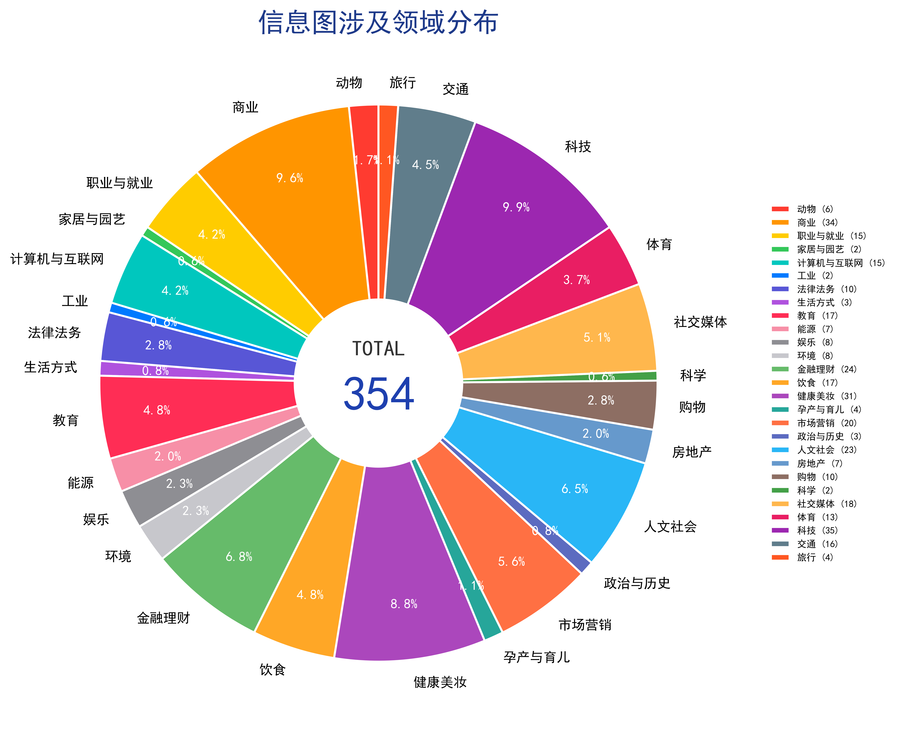
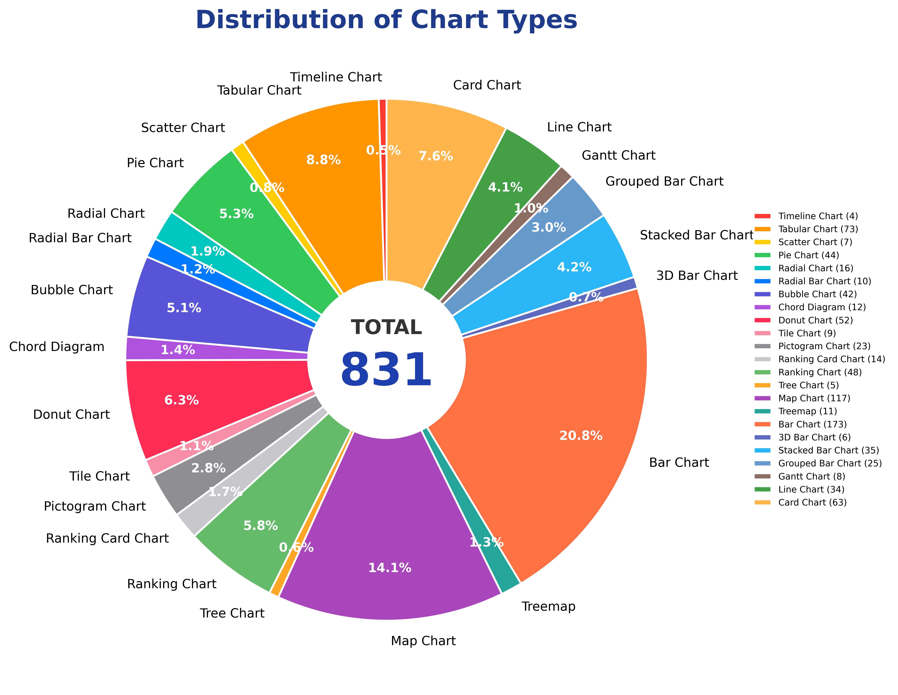
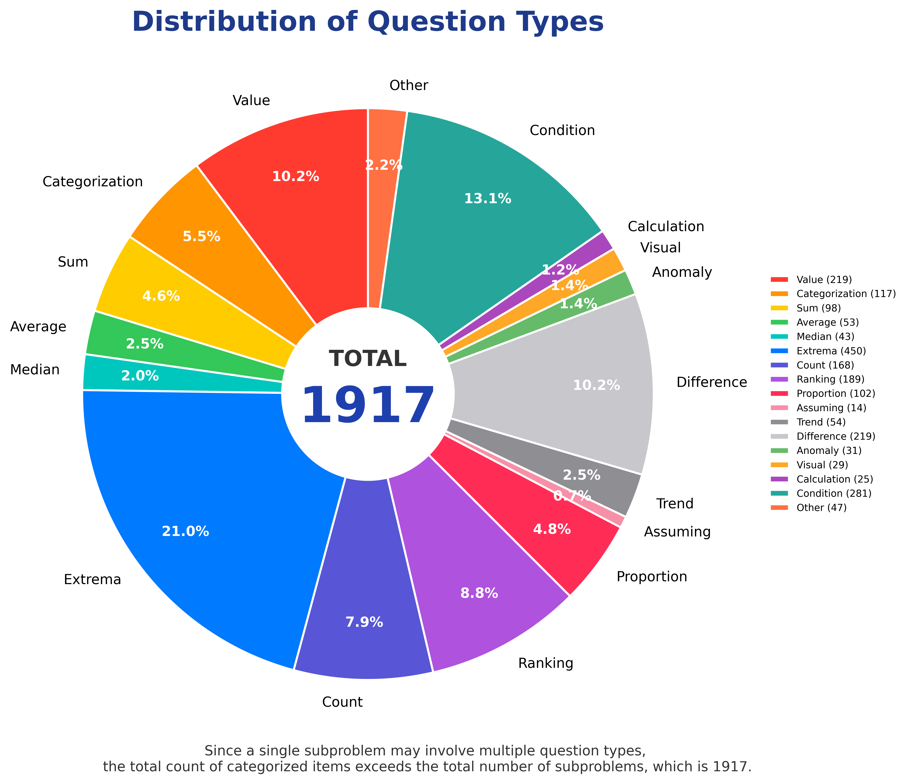
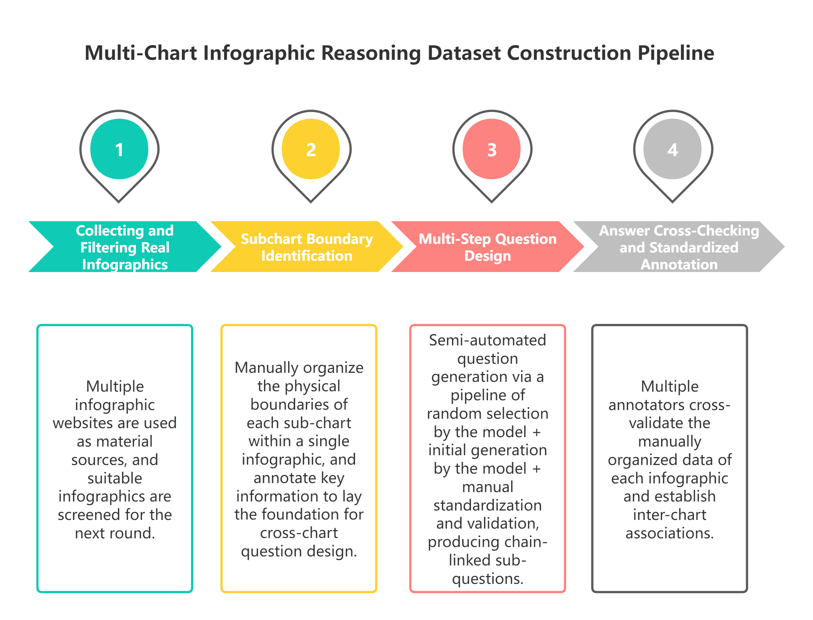

# Chapter 40: Multi-Chart Infographic Reasoning Data Engineering

## Chapter Summary

Traditional visual question answering (VQA) and chart question answering (ChartQA) have long focused on single-chart parsing. A model usually answers by reading one bar chart, pie chart, line chart, or table and performing a simple extraction or one-step calculation. This is far from the way compound infographics appear in business reports, industry research, public science communication, and market briefs.

This chapter uses a multi-chart infographic reasoning dataset as a concrete case. The dataset contains **354 real-world compound infographics** and **1,917 logically connected multi-step subquestions**. It covers 28 application domains and more than 20 mainstream chart styles. Its core tasks are cross-chart data aggregation, multi-step numerical calculation, and visual-plus-context reasoning. A shark-attack infographic example shows how one question chain retrieves evidence from multiple subcharts, carries intermediate answers forward, and derives final answers step by step.

The dataset is currently an annotation-stage benchmark without a companion production algorithm or public baseline model. Its value is to provide a rare real-world benchmark for multimodal chart reasoning and a standardized evaluation base for future cross-chart reasoning algorithms. Project URL: https://github.com/xychen-zh/multi-chart-infographic-reasoning-dataset (under creation at the time of the source draft).

## 40.1 Problem Scenario: Limits of Single-Chart VQA

### 40.1.1 Boundary of Traditional Single-Chart VQA

Mainstream chart VQA datasets such as ChartQA, FigureQA, and PlotQA usually follow a one-image, one-question, single-chart paradigm. One sample image contains one independent chart, and all data, legends, labels, and values needed for answering are contained in that single chart. The model mainly needs to locate coordinates, read annotated numbers, and perform a one-step arithmetic or classification operation.

At the task level, single-chart VQA mostly stops at single-step extraction: maximum lookup, category sum, or one ratio calculation. It lacks cross-view data linkage. In standardized lab datasets, chart styles are usually cleaned up: legends are neat, axes are unambiguous, partitions are clear, and there are few surrounding notes. This differs fundamentally from native infographics in the open web and commercial publications.

In real deployments, models trained only on single-chart data become unbalanced. They may read local pixel-level values well but lack cross-region association. Annual-report infographics, public-health visualizations, market-research reports, and industry dashboards rarely use only one chart. Designers split indicators into multiple subcharts, each carrying category statistics, time trends, geographic distribution, risk comparison, or explanatory notes. Final conclusions often require integrating several subcharts, so the single-chart paradigm does not match the scenario.

### 40.1.2 Reasoning Characteristics of Compound Infographics

A compound infographic is a nested visual carrier. It is one image file divided into several physical regions. Each region may contain a different chart type, accompanied by global legends, region notes, side text, and warning annotations. Compared with single charts, real compound infographic reasoning has three core requirements.

- **Cross-chart data aggregation.** Different statistical dimensions are split across subcharts. In the shark-attack case, county-level historical attacks, state-level attacks over the last decade, and accidental-death comparisons appear in separate regions. Complex questions require aggregating data from multiple views.
- **Multi-step serial numerical calculation.** Real questions form chains. First identify a target region, then use that region's state to retrieve another value, then compare against another state. Earlier answers become later inputs.
- **Visual and contextual reasoning.** Important information often appears in legends, side notes, symbols, footnotes, and natural-language annotations rather than axis values. The model must combine visual symbols and text context.

### 40.1.3 Benchmark Gap and Dataset Significance

Public multimodal chart-reasoning benchmarks have a supply gap. Synthetic chart datasets dominate, while native compound infographics from web pages, newspapers, and science publications are rare. Many datasets split compound infographics into independent images to reduce annotation difficulty, but this destroys spatial association and contextual logic.

This dataset keeps the native structure: multiple subcharts on the same canvas, shared legends, interleaved notes, and original layout. It fills a gap in real-world cross-chart reasoning benchmarks. For algorithm research, it pushes VQA models beyond “single-chart reading” toward subchart segmentation, cross-view memory, and multi-step calculation.

## 40.2 Dataset Overview

The dataset is described from four perspectives: sample size, domain coverage, chart types, and question types.

### 40.2.1 Quantitative Scale

- **Image samples:** 354 screened real-world compound infographics. Each image is stored as one complete infographic and is not manually split into separate chart images. Original layout, shared legends, and annotation positions are preserved.
- **QA samples:** 1,917 logically connected multi-step subquestions. Each infographic contains several dependent subquestions and one additional unanswerable question to test refusal and robustness. On average, each infographic has about 5.41 valid reasoning subquestions plus one unanswerable test question.

### 40.2.2 Domain Coverage Across 28 Fields

The dataset samples across 28 vertical fields covering public life, industry, research, entertainment, and economics: animals, business, career & jobs, home & garden, computers & internet, industry, law and legal, lifestyle, education, energy, entertainment, environment, finance & money, food & drink, health & beauty, pregnancy & parenting, marketing, politics and history, people, real estate, shopping, science, social media, sports, technology, transportation, and travel.

Multi-domain design reduces overfitting to a single theme. Chart conventions, legends, and domain abbreviations differ across fields, raising the difficulty of visual-context reasoning.

*Figure 40-1. Distribution of domain coverage in the Multi-Chart Infographic Reasoning Dataset, spanning 28 fine-grained domains.*

### 40.2.3 Chart Types and Layout Features

The dataset contains more than 20 common visualization styles, including bar charts, map charts, tabular charts, card charts, donut charts, pie charts, bubble charts, ranking charts, stacked bar charts, line charts, grouped bar charts, pictogram charts, treemaps, ranking card charts, chord diagrams, tree charts, radial charts, radial bar charts, tile charts, gantt charts, scatter plots, 3d bar charts, and timeline charts.

Each infographic uses whatever mixed layout the original creator used, such as “map + tabular + stacked bar + pictogram” or “pie + ranking card + line.” Different chart types store data differently: tables use rows and columns, maps use geographic regions, pictograms use icon counts, and line charts use temporal sequences. The model must adapt reading rules across formats and then aggregate across them.

*Figure 40-2. Distribution of sub-chart types in the Multi-Chart Infographic Reasoning Dataset, covering 23 distinct chart categories.*

### 40.2.4 Question Types

The subquestions cover 13 reasoning types: value, categorization, sum, average, median, extrema, count, ranking, proportion, trend, difference, anomaly, assuming, visual, condition, calculation, and other.

Questions within one infographic are randomly mixed across types, creating chains such as “maximum lookup + difference calculation + conditional reasoning” or “counting + ratio calculation + visual reasoning.” Extraction questions focus on reading; calculation questions combine multiple values; conditional questions use legends and filters; visual questions use symbols and visual context.

*Figure 40-3. Distribution of sub-question types in the Multi-Chart Infographic Reasoning Dataset, comprising 13 question categories.*

### 40.2.5 Standardized Core Tasks

**Cross-chart data aggregation** groups, merges, and summarizes heterogeneous data scattered across subcharts and physical regions. This is the main feature distinguishing the dataset from traditional ChartQA.

**Multi-step serial calculation** arranges subquestions as dependent chains. Earlier answers are inputs to later calculations, so a final answer cannot be solved in one step.

**Visual and contextual reasoning** combines legends, icons, annotations, and natural-language side text. In the shark-attack example, the species in a fatal 2018 Massachusetts attack is identified from symbol and text annotations rather than axis values.

## 40.3 Sample Structure: Shark-Attack Example

The dataset's shark-attack example illustrates subchart partitioning, question chain, evidence locations, and reasoning path.

### 40.3.1 Physical Layers of One Compound Infographic

*Figure 40-4. Example of a multi-chart infographic sample from the dataset (Shark Attacks).*

The example is one integrated science infographic with several subchart regions:

- **Subchart A: Radial chart.** Historical shark-attack county ranking in the United States. Key value: Volusia, Florida has 343 attacks, the county maximum. It supports Q1.
- **Subchart B: Map chart.** State-level shark attacks in the last ten years. Key values: Florida 242, Hawaii 71. It supports Q2 and Q3.
- **Subchart C: Table chart / side annotation.** Fatal shark-attack species in Massachusetts in 2018. Key answer: Presumed Great White. It supports Q4.
- **Subchart D: Bar chart.** Average annual accidental deaths in the United States. Key values: falling from bed 450, cats none. It supports Q5 and Q6.

### 40.3.2 Full Question Chain

| ID | Type | Question | Answer | Evidence Source | Dependency |
| --- | --- | --- | --- | --- | --- |
| Q1 | Maximum lookup | Which U.S. county has the highest historical shark-attack count? | Volusia, FL | Subchart A | None |
| Q2 | Count | What is the total number of shark attacks over the last ten years in the state containing the county from Q1? | 242 | Subchart B | Uses Q1's Florida keyword |
| Q3 | Difference | How many more shark attacks did Florida have than Hawaii in the last ten years? | 171 | Subchart B: FL=242, HI=71 | Uses Florida value from Q2, then extracts Hawaii |
| Q4 | Conditional reasoning | What species was involved in the fatal Massachusetts shark attack in 2018? | Presumed Great White | Subchart C / notes | Uses symbols and text context |
| Q5 | Count | How many people die each year from falling out of bed? | 450 | Subchart D | Switches evidence source |
| Q6 | Count | How many people die each year from cats? | None | Subchart D | Same local chart |

Q1-Q2-Q3 form a three-step cross-subchart calculation path. Q4 is visual-context reasoning. Q5/Q6 are local extraction from another subchart.

### 40.3.3 Evidence Localization and Reasoning Path

Evidence localization uses several rules:

- **Keyword linkage:** Q1 outputs Volusia, Florida; “Florida” becomes a retrieval label for Subchart B.
- **Region semantic matching:** “fatal,” “2018,” and “Massachusetts” match side timeline annotation rather than numeric charts.
- **Topic-region matching:** “falling from bed” and “cat deaths” match the accidental-death chart.

The full path is: Subchart A county maximum -> extract state keyword -> Subchart B ten-year state data -> extract Hawaii value -> difference calculation; side annotation for Q4; Subchart D for Q5/Q6. The model must segment subcharts, retrieve across views, store numbers, perform arithmetic, and interpret legends.

### 40.3.4 Purpose of Unanswerable Questions

Each infographic includes one question that cannot be answered from the image. This tests hallucination suppression and refusal robustness. The goal is to prevent models from fabricating unsupported numbers.

## 40.4 Construction Pipeline

The dataset construction process has four core stages: collecting and filtering real compound infographics, manually partitioning subchart regions, designing layered question chains, and cross-checking answers. No synthetic charts are generated. Large models can help propose questions, but humans verify and revise them.

*Figure 40-5. Overview of the four-stage data construction pipeline for the Multi-Chart Infographic Reasoning Dataset.*

### 40.4.1 Collecting and Filtering Real Infographics

Sources include real infographic websites such as Bee Infographic, Best Infographics, Centers for Disease Control and Prevention, Cool Infographics, and other infographic websites.

Filtering rules include: the full image contains at least two different chart types; cross-chart statistical relationships exist; legends, annotations, and category labels are complete; low-quality or cropped images are removed; and samples are balanced across the 28 domains. After filtering, 354 valid images enter annotation.

### 40.4.2 Subchart Boundary Identification

Annotators manually mark each subchart's physical boundary, chart type, statistical period, and statistical dimension such as region, time, or category. This step defines data boundaries for later cross-chart questions.

### 40.4.3 Multi-Step Question Design

For each infographic, annotators select target question types, use a large model to draft candidate chained questions constrained by those types and by the subchart structure, then manually revise them against the original image, legends, and region data. Invalid or unsupported questions are removed, natural language is refined, and standard answers are recalculated by humans. The final dataset contains 1,917 valid subquestions and one unanswerable question per image.

### 40.4.4 Answer Cross-Checking and Standardized Annotation

A two-person cross-check is used. Annotator A designs questions and answers. Annotator B independently reads the image and recalculates answers. Calculation errors and legend misreads are corrected. Answer format is standardized: numerical answers use Arabic numerals, and text answers normalize proper names and abbreviations.

## 40.5 Evaluation Protocol

Unlike traditional ChartQA, which often uses answer-string accuracy, this dataset needs layered metrics for chained reasoning.

### 40.5.1 Independent Single-Step Accuracy

This metric ignores dependencies and checks each subquestion independently. It measures basic reading and calculation ability. Its limitation is that it cannot reveal chain coherence.

### 40.5.2 Full-Chain Accuracy

For a dependent question chain, all subquestions must be correct for the chain to count as correct. Any earlier error fails the whole chain. This is the core metric because it measures multi-step reasoning and cross-chart linkage stability. If Q1 identifies the wrong county, Q2 and Q3 fail as a reasoning chain even if their formulas are correct.

### 40.5.3 Cross-Chart Evidence Localization Accuracy

This metric checks whether the model locates the correct subchart or legend region for the answer. If the answer should use Subchart A and B but the model retrieves from Subchart C, evidence localization fails. It directly measures cross-chart aggregation.

## 40.6 Evaluation Difficulty and Failure Modes

### 40.6.1 Technical Difficulties

- **Legend ambiguity:** global legends and icons may shift meaning across subcharts.
- **Cross-subchart filtering:** names and categories appear in different regions, causing mismatch.
- **Statistical-scope confusion:** historical totals, ten-year counts, and annual averages must not be mixed.
- **Error propagation:** one wrong early answer invalidates later calculations.
- **Unanswerable robustness:** large models may fabricate answers when the image lacks evidence.

### 40.6.2 Typical Model Failures

- Misreading fatal versus nonfatal attack icons.
- Confusing subchart partitions, such as using accidental-death data for shark-attack calculations.
- Mixing historical cumulative counts with last-ten-year counts.
- Propagating an early wrong maximum into later values.
- Hallucinating a number for an unanswerable question.

## 40.7 Current Limits and Future Iteration

The project currently has annotations but no released baseline algorithm or trained benchmark model.

### 40.7.1 Current Limits

- **Small sample size:** high-quality native compound infographics are scarce, so 354 source images are not enough for large-scale pretraining.
- **No baseline algorithm:** there is no public cross-chart reasoning SOTA for direct comparison.
- **Native imperfections:** some web-native images contain blurry handwriting, inconsistent abbreviations, or other real-source defects.

### 40.7.2 Future Directions

- Expand source images and subquestions from authoritative publications across domains.
- Develop baseline cross-chart multi-step reasoning models.
- Add higher-order questions such as ratio conversion, nested multi-condition filtering, and unit conversion.

## Conclusion

The multi-chart infographic reasoning dataset starts from real compound infographics and breaks away from the single-chart QA paradigm. It reconstructs chart VQA evaluation around cross-chart aggregation, serial calculation, and visual-context reasoning. The structure of 354 multi-subchart images and 1,917 chained subquestions reflects how people actually read compound data visualizations. The shark-attack example shows that real infographic reasoning requires region-specific evidence retrieval, stepwise calculation, and symbol interpretation. Although the dataset currently lacks companion baselines, it fills an important benchmark gap and can support future cross-modal chart reasoning research.

## References

1. Masry, A., Long, D. X., Tan, J. Q., Joty, S., & Hoque, E. (2022). ChartQA: A Benchmark for Question Answering about Charts with Visual and Logical Reasoning. ACL 2022.
2. Methani, N., Ganguly, P., Khapra, M. M., & Kumar, P. (2020). PlotQA: Reasoning over Scientific Plots. WACV 2020.
3. Kahou, S. E., Michalski, V., Atkinson, A., Kádár, Á., Trischler, A., & Bengio, Y. (2017). FigureQA: An Annotated Figure Dataset for Visual Reasoning. arXiv:1710.07300.
4. Kafle, K., Price, B., Cohen, S., & Kanan, C. (2018). DVQA: Understanding Data Visualizations via Question Answering. CVPR 2018.
5. Mathew, M., Karatzas, D., & Jawahar, C. V. (2021). DocVQA: A Dataset for VQA on Document Images. WACV 2021.
6. Masry, A., Islam, M. S., Ahmed, M., Bajaj, A., Kabir, F., Kartha, A., ... & Joty, S. (2025, July). Chartqapro: A more diverse and challenging benchmark for chart question answering. In Findings of the Association for Computational Linguistics: ACL 2025 (pp. 19123-19151).
7. Xie, T., Lin, M., Liu, M., Ye, Y., Chen, C., & Liu, S. (2026). Infochartqa: A benchmark for multimodal question answering on infographic charts. Advances in Neural Information Processing Systems, 38.
8. Foroutan, N., Romanou, A., Ansaripour, M., Eisenschlos, J. M., Aberer, K., & Lebret, R. (2025, July). Wikimixqa: a multimodal benchmark for question answering over tables and charts. In Findings of the Association for Computational Linguistics: ACL 2025 (pp. 24941-24958).
9. Zhu, Z., Jia, M., Zhang, Z., Li, L., & Jiang, M. (2025, April). MultiChartQA: Benchmarking vision-language models on multi-chart problems. In Proceedings of the 2025 Conference of the Nations of the Americas Chapter of the Association for Computational Linguistics: Human Language Technologies (Volume 1: Long Papers) (pp. 11341-11359).
