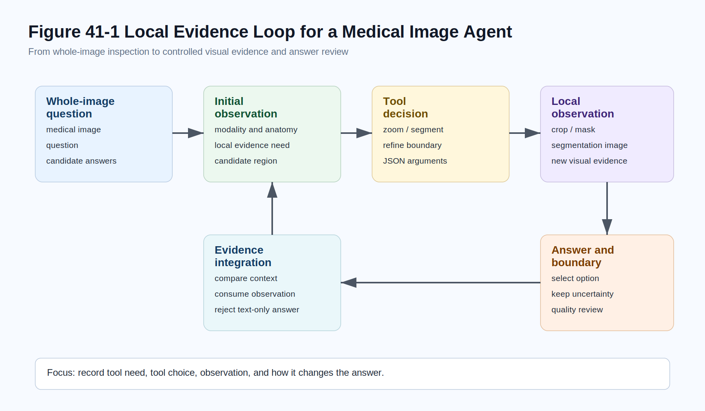
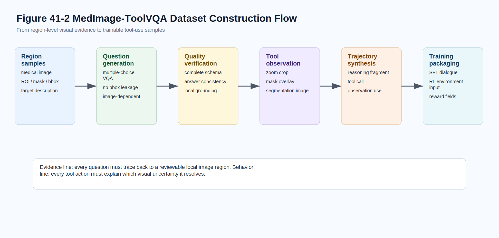
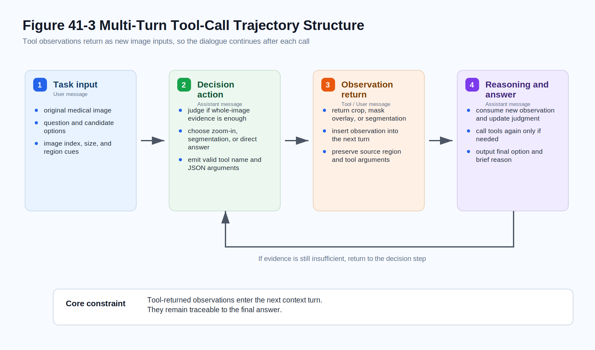
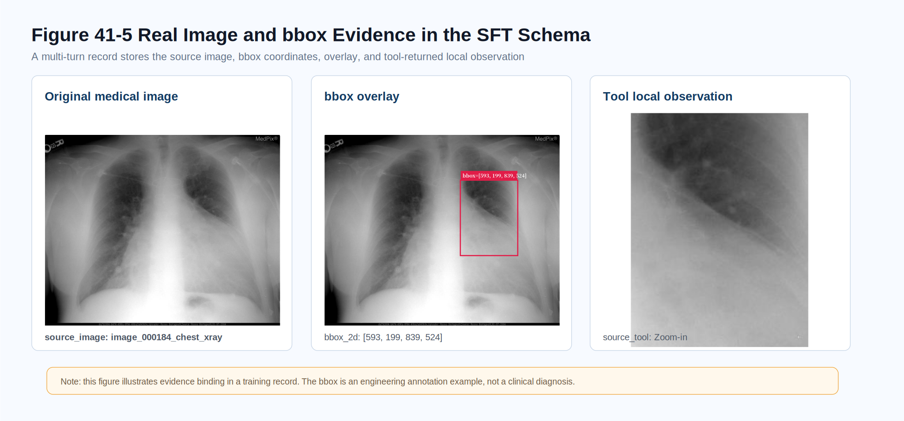
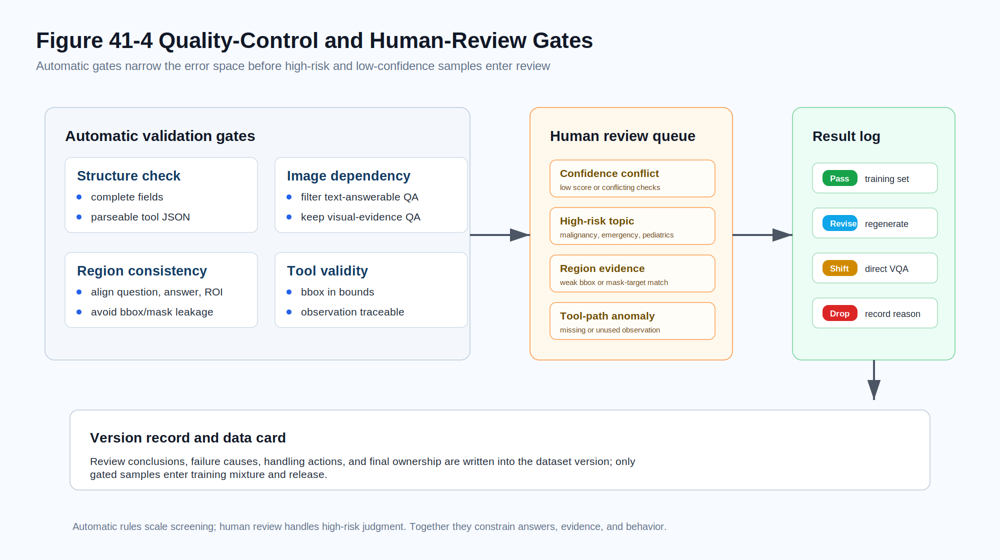

# Chapter 41: MedImage-ToolVQA Medical Image Tool-Use VQA Data Engineering

## Abstract

This chapter uses MedImage-ToolVQA as a focused dataset case for medical image tool-use data engineering. It examines task definition, sample structure, construction workflow, quality control, evaluation protocol, and safety boundaries. The chapter emphasizes how the dataset validates earlier data-engineering principles and clarifies its reproducibility conditions, model-training role, benchmark value, and deployment limits.

The companion implementation repository is **MedImage-ToolVQA-Mindspore**: <https://github.com/blackkiring/MedImage-ToolVQA-Mindspore>. It is the implementation entry point for the MindSpore version of data construction, MindRecord packaging, SFT fine-tuning, inference serving, evaluation, and documentation. The engineering examples below therefore use the MindSpore stack as the default implementation frame.

## Keywords

MedImage-ToolVQA; specialized dataset; evaluation benchmark; annotation workflow; quality control

Medical image question answering is often treated as a special form of visual question answering (VQA). That classification is reasonable, but it can hide a crucial difference: **seeing** in medical images is not the same as recognizing objects in natural images. In natural images, subjects usually have clear outlines and semantic boundaries. In medical images, slight ground-glass opacity on a chest X-ray, a small low-density lesion in CT, local cell arrangement on pathology slides, or weak-boundary echoes in ultrasound may occupy only a tiny region. Their meaning depends on anatomy, modality, acquisition conditions, and the clinical question.

Medical VQA datasets such as VQA-RAD, PathVQA, and SLAKE show that sample design must consider image modality, professional semantics, question source, and human verification (Lau et al. 2018; He et al. 2020; Liu et al. 2021). Data engineering therefore cannot stop at the image-question-answer triple. A medical image agent often works more like this: view the whole image, identify the structure or finding mentioned by the question, decide whether local zoom, segmentation, or boundary refinement is needed, use tool observations to update judgment, and then answer. The final answer is only the endpoint; the evidence path is also training signal.

MedImage-ToolVQA is a data engineering case built around this idea. It does not simply add more medical knowledge or raise multiple-choice accuracy. It organizes medical image QA as multi-turn supervision for models that can use visual tools. The model learns not only the final option, but also when a tool is needed, which tool to call, how to write tool parameters, how to wait for observations, and how to use the returned image. In other words, it expands medical VQA from answer supervision to behavior supervision, similar in spirit to ReAct and Toolformer (Yao et al. 2023; Schick et al. 2023).

This chapter explains the difference between medical image VQA and ordinary VQA, why tool trajectories are useful supervision, how MedImage-ToolVQA structures samples, how the construction pipeline and tool system work, and how to handle quality control, privacy, compliance, and medical safety boundaries. The chapter discusses data engineering and model-training supervision only. It does not provide clinical diagnostic advice.



*Figure 41-1: The key is to record where to look again, how to look, and how judgment changes after observation.*

## 41.1 Medical Image VQA vs. Ordinary VQA

Ordinary VQA questions ask things like how many people are in the image, what object is on the table, or what color a car is. These questions may be difficult, but they usually rely on object recognition, spatial relations, and commonsense reasoning. Medical image VQA is different. Key evidence may appear as gray-level change, fuzzy boundary, texture shift, local density difference, or abnormal proportion. The challenge is not only recognizing an object, but judging whether limited local evidence supports an option.

The first difference is **evidence scale**. Important medical regions may be tiny: lung nodules, retinal microbleeds, local nuclear atypia, and small lesions may occupy only a few image patches. If the model answers from a compressed whole-image representation, it may miss them.

The second difference is **professional context**. A bright spot may be calcification or artifact. A blurry region may suggest inflammation or image-quality issues. Interpreting it requires anatomy, modality, and question context.

The third difference is **safety boundary**. Ordinary VQA mistakes are usually inaccurate descriptions. Medical image mistakes may be misunderstood as diagnostic judgments. Even research samples must be framed as training and evaluation, not patient advice.

The fourth difference is **evaluation target**. Ordinary VQA often checks only the final answer. Medical tool-use data must also evaluate whether the evidence-gathering process is reasonable. A model may answer correctly while calling a tool on an irrelevant region; or it may choose a good region but select the wrong final option. Data engineering should record these signals separately.

## 41.2 From Answer Supervision to Tool Behavior Supervision

Traditional VQA supervision is simple: given image and question, output answer. The reasoning process is hidden inside the model. For medical images, that opacity is risky because we do not know whether the model looked at the relevant region or used local evidence.

Tool behavior supervision makes executable behavior nodes part of the sample. For example, the model decides that local zoom is needed, calls `Zoom-in`, receives a local crop, and then continues the answer. The supervision now includes tool selection, parameter generation, observation consumption, and final answer.

This has three benefits. First, it teaches a workflow closer to medical image review, where local reinspection and boundary confirmation are common. Second, it improves auditability: tool parameters, observation images, and answers can be checked. Third, it provides an interface for later reinforcement learning because tool calls and observations can be structured as environment actions and feedback.

The goal is not to create more complex-looking samples. Each tool action should explain what uncertainty it resolves.

## 41.3 Data Objects and Scale

MedImage-ToolVQA targets medical image multiple-choice QA. Samples are built on region-level information from BiomedParse (Zhao et al. 2025), including original image, target region, mask, bbox, target description, question, candidate options, correct answer, and local observation images returned by tools. The final training data has **24,992 records**.

| Metric | Value | Data-Engineering Meaning |
| --- | ---: | --- |
| Total records | 24,992 | Medical image tool-use samples for training and evaluation |
| Region source | BiomedParse | ROI, mask, bbox, and target description organize local evidence |
| Question form | Multiple-choice medical image VQA | Supports answer checks and rule rewards |
| `raw_images = 3` | 19,945 | Most common tool-enhanced trajectory form |
| `raw_images = 1` | 2,471 | Direct visual reasoning or single-image samples |
| `raw_images = 4` | 1,383 | Additional tool observation or multi-step trajectory |
| `raw_images = 2` | 1,193 | Original image plus one tool observation |
| Answer A | 9,986 | Option distribution requires bias checks |
| Answer B | 7,177 | Option distribution requires bias checks |
| Answer C | 5,473 | Option distribution requires bias checks |
| Answer D/E | 2,356 | Long-tail options should not be hidden by aggregate accuracy |

This is not merely a scale table. It highlights option imbalance, the importance of multi-image tool observations, and the dependence of sample quality on ROI, mask, and bbox reliability.

MedImage-ToolVQA sits between a VQA dataset and an agent trajectory dataset. It still has image, question, and answer, but it also records tool actions and observations.

## 41.4 ROI, Mask, and Bbox as Local Evidence

The first step is to make local evidence operational. Natural language can say “a small nodule near the pleura in the right upper lung,” but tools need an interface. ROI, mask, bbox, and target description provide that interface.

ROI is the region of interest. Bbox gives a rectangular boundary, suitable for cropping and coarse localization. Mask gives pixel-level shape, suitable for segmentation, overlay, and boundary review. Target description maps the region to medical semantics such as lung nodule, liver lesion, vascular structure, or local pathology abnormality.

If only bbox exists, the data can zoom but may not express fine boundary. If only mask exists, it can express shape but may be hard for models to generate as a tool parameter. If only description exists, the model knows the semantic target but cannot verify position. Tool-use data should therefore keep bbox, mask, and description together.

ROI also prevents questions from becoming pure text medical QA. “What organ do lung nodules usually appear in?” is not a valid image question. “Which option best describes the boundary and density of the local abnormality in the image?” requires visual evidence.

At the same time, local evidence can create **localization leakage**. If the question says “the boxed region” or “inside the mask,” the model does not learn active localization. Good questions imply the need for local observation without exposing bbox or mask.

### 41.4.1 Question and Option Design

A good medical image VQA question should satisfy three conditions: it is tied to a concrete image region, it does not leak annotation position, and its options differ by observable visual evidence.

The question should not be general medical knowledge or a broad modality/organ label. Options should distinguish boundary clarity, focal versus diffuse distribution, density or signal abnormality, artifact versus true structure, and similar visual features. A healthy difficulty mix should include whole-image answerable samples, samples requiring local zoom, and samples requiring segmentation or boundary confirmation.

Medical questions should also avoid asking for clinical treatment or diagnosis. Multiple-choice answers can select the option that best matches image appearance, but explanations should not expand into patient advice.

### 41.4.2 Observation Image Lifecycle

Observation images are not ordinary illustrations. They are derived from the original image and returned to the model as new inputs.

1. **Generation:** local crop from bbox, mask overlay from segmentation, or semantic segmentation image from tool output.
2. **Binding:** returned images must be tied to original image, tool parameters, and dialogue turn.
3. **Consumption:** later answers should reflect the observation, not ignore it.
4. **Audit:** derived images need de-identification, quality checks, and version records.

Observation images are both training inputs and audit objects. Without maintaining this relationship, multi-image trajectories become “one original image plus some extra pictures” rather than evidence paths.

## 41.5 Conceptual Construction Flow

MedImage-ToolVQA construction has six stages: region sample organization, question generation, quality verification, tool observation generation, trajectory synthesis, and training packaging. The following example rewrites the former pseudocode as MindSpore-oriented implementation entries. It uses MindRecord for durable sample storage, `mindspore.dataset` for training input, and `vllm-mindspore` for LLM serving during question and trajectory generation. The official `vllm-mindspore` codebase is hosted on AtomGit at <https://atomgit.com/mindspore/vllm-mindspore>. The example leaves project-specific de-identification rules and error handling to the repository implementation, but keeps the data contracts and quality gates explicit.

### 41.5.1 Region Merging: Write Evidence into MindRecord

`merge` converts region evidence from different parsing tools or intermediate results into a MindSpore-readable data asset. The example keeps only the core contract: deduplicate by `image_id` and `region_id`, preserve bbox, mask, target description, and source fields, and write the result into MindRecord.

```python
from mindspore.mindrecord import FileWriter

schema = {
    "image_id": {"type": "string"},
    "region_id": {"type": "string"},
    "bbox": {"type": "int32", "shape": [-1]},
    "mask_path": {"type": "string"},
    "target_desc": {"type": "string"},
    "source": {"type": "string"},
}

writer = FileWriter("region_pool.mindrecord", shard_num=4, overwrite=True)
writer.add_schema(schema, "region evidence schema")
writer.write_raw_data(deduplicate_regions(raw_regions, keys=["image_id", "region_id"]))
writer.commit()
```

### 41.5.2 LLM Serving: Use vllm-mindspore

`make_vqa` and `makereasoning` call a locally deployed LLM. In the MindSpore stack, `vllm-mindspore` can expose an OpenAI-compatible service. Its official codebase is hosted on AtomGit at <https://atomgit.com/mindspore/vllm-mindspore>.

```bash
vllm-mindspore serve Qwen/Qwen3-vl-8B \
  --host 0.0.0.0 \
  --port 8000
```

```python
from openai import OpenAI

client = OpenAI(base_url="http://127.0.0.1:8000/v1", api_key="EMPTY")
```

### 41.5.3 Question Generation: Read Region Evidence from MindDataset

`make_vqa` reads region evidence from `MindDataset` and generates the question, candidate options, and reference answer. The prompt hides bbox, mask paths, and region IDs to avoid leaking annotation mechanics into the question.

```python
import mindspore.dataset as ds

dataset = ds.MindDataset("region_pool.mindrecord", shuffle=False)

for row in dataset.create_dict_iterator(output_numpy=True):
    prompt = build_vqa_prompt(row, hide_fields=["bbox", "mask_path", "region_id"])
    reply = client.chat.completions.create(
        model="Qwen/Qwen3-vl-8B",
        messages=[{"role": "user", "content": prompt}],
        temperature=0.2,
    )
    write_jsonl("vqa_candidates.jsonl", parse_vqa(reply.choices[0].message.content, row))
```

### 41.5.4 Quality Verification: Produce Gate Results

`verify` does not rewrite the answer directly. It attaches quality-gate results to each sample. Only samples with complete fields, clear image dependency, region consistency, and valid tool JSON move into trajectory synthesis.

```python
gates = {
    "complete": has_required_fields(sample),
    "image_dependent": requires_visual_evidence(sample),
    "region_consistent": align_question_answer_roi(sample),
    "tool_json_valid": validate_tool_schema(sample),
}

sample["review_status"] = "pass" if all(gates.values()) else "revise"
sample["quality_gates"] = gates
```

### 41.5.5 Trajectory Synthesis: Return Tool Observations to Dialogue

`makereasoning` is not about generating longer explanations. Its core task is to place tool calls and returned observation images into the next dialogue turn. If local evidence is unnecessary, the sample keeps a direct visual reasoning path.

```python
observation = run_visual_tool(sample) if needs_local_evidence(sample) else None
prompt = build_reasoning_prompt(sample, observation)
reply = client.chat.completions.create(
    model="Qwen/Qwen3-vl-8B",
    messages=[{"role": "user", "content": prompt}],
    temperature=0.1,
)

sample["trajectory"] = build_tool_trajectory(sample, observation, reply)
```

### 41.5.6 SFT Packaging: Store Training Records in MindRecord

`make_sft` writes multi-turn messages, image references, answers, and quality labels into a training MindRecord. The SFT side then loads it through `mindspore.dataset.MindDataset` and batches it for fine-tuning.

```python
schema = {
    "messages": {"type": "string"},
    "images": {"type": "string"},
    "answer": {"type": "string"},
    "quality": {"type": "string"},
}

writer = FileWriter("tool_sft.mindrecord", shard_num=8, overwrite=True)
writer.add_schema(schema, "tool-use SFT schema")
writer.write_raw_data(pack_sft_records(tool_trajectories))
writer.commit()

train_ds = ds.MindDataset("tool_sft.mindrecord").shuffle(4096).batch(8)
```



Key principles:

- Region deduplication should use region IDs, not only image IDs, because one image can contain multiple findings.
- Questions should be natural medical image questions and avoid “inside the box” or “inside the mask.”
- Quality verification must check question structure, option quality, answer consistency, and region grounding.
- About 90% of samples use tool-enhanced paths, while about 10% remain direct visual reasoning samples so the model learns tools are optional.
- Training packaging should separate assistant tool calls, user-side observation images, and final answers into multi-turn records.

Evidence must not be lost: source image, region, observation generation, and answer verification all need to remain traceable.

## 41.6 Three Tools and Their Boundaries

MedImage-ToolVQA uses three visual tools: `Zoom-in`, `BiomedParse`, and `SAM2`.

| Tool | Main Input | Return | Best For | Risks to Control |
| --- | --- | --- | --- | --- |
| `Zoom-in` | Image index, bbox coordinates | Local crop | Small local regions, insufficient whole-image resolution, detail review | Bbox drift, over-cropping, context loss |
| `BiomedParse` | Image index, medical semantic description | Medical structure or lesion segmentation | Semantic localization of medical structures or findings | Inaccurate description, modality generalization failure, wrong segmentation |
| `SAM2` | Image index, bbox coordinates | Bbox-prompted mask | Boundary refinement when a candidate box exists | Strong dependence on bbox quality, background inclusion |

`Zoom-in` crops; it is not a diagnostic tool. `BiomedParse` performs semantic medical image segmentation; it does not produce pathological conclusions. `SAM2` is a general segmentation tool and does not understand clinical context (Kirillov et al. 2023; Ravi et al. 2024; Ma et al. 2024). Data and prompts should keep these boundaries clear so the model learns evidence acquisition rather than professional judgment replacement.

## 41.7 Organizing Tool Trajectories as Multi-Turn Samples

The core of a tool trajectory is multi-turn structure: action, observation, continued judgment.



A simplified trajectory has four steps. The user provides the original image, question, and options. The assistant decides local evidence is needed and outputs a structured tool call. The environment returns a new observation image. The assistant uses both original and observation images to answer.

```text
User:
<image>
Question:
Which description best matches the target region in this medical image?
Options:
A. A focal abnormality with a relatively clear boundary
B. Diffuse background change
C. Consistent with normal anatomy
D. Mainly caused by imaging artifact

Assistant:
The question asks about a local finding. The whole image suggests a target region,
but boundary and density detail are insufficient. I need to zoom in.
<tool_call>
{"name":"Zoom-in","arguments":{"target_image":1,"bbox_2d":[132,184,278,336]}}
</tool_call>

User:
<image>
The tool returned a local zoom observation. Continue based on the new evidence.

Assistant:
The local observation shows a distinguishable target region with a relatively clear
boundary compared with the background. It is not diffuse change and is less likely
to be only artifact.
<answer>A</answer>
```

Tool arguments must be structured. Tool returns must become new multimodal input, not a text note saying “already zoomed.” The final answer should consume the observation. The trajectory should avoid diagnostic claims and stay within the option-comparison task.

### 41.7.1 Three-Layer Reading of a Sample

Each record can be read at three layers:

- **Question layer:** image, question, options, and answer.
- **Evidence layer:** ROI, bbox, mask, local observation image, and target description.
- **Behavior layer:** tool call, observation return, continued judgment, and final answer.

All three layers must work. If the question is good but evidence is missing, it is ordinary VQA. If evidence exists but behavior ignores the observation, it is VQA with extra annotations. If behavior is complete but the question is text-answerable, the tool call becomes formal decoration.

### 41.7.2 Difference from Ordinary Chain-of-Thought

Tool trajectories are sometimes confused with chain-of-thought data. Both include intermediate process, but the training meaning differs. Ordinary CoT unfolds in text. Tool trajectories include external actions and environment feedback: the model calls a tool, receives a new observation, then continues. It does not merely “think in more detail”; it sees something new.

This matters in medical images. A model can write “I need to inspect the local region” without obtaining a local image. A tool trajectory requires the model to actually call zoom or segmentation and use the returned image.

## 41.8 SFT Data and RL Data

Tool trajectories can support both SFT and RL. SFT is behavior demonstration: format, order, and basic strategy. RL is policy optimization under reward feedback.

In SFT, clarity and stability matter most. The model must learn that `<tool_call>` contains parseable JSON, that an observation image appears after a tool return, and that the final answer is placed consistently. If SFT format is unstable, RL environments cannot parse actions reliably.

Medical image SFT records should also keep an imaging-task schema. Here “diagnosis” means structuring the training task, candidate labels, evidence region, and safety boundary; it does not ask the model to provide clinical conclusions.



*Figure 41-5: Bbox is a structured field and should be recoverable as reviewable visual evidence.*

Image source: VQA-RAD test split, Hugging Face dataset [flaviagiammarino/vqa-rad](https://huggingface.co/datasets/flaviagiammarino/vqa-rad), [CC0-1.0](https://creativecommons.org/publicdomain/zero/1.0/). The figure is a resampled derived image used to illustrate correspondence among original image, bbox overlay, and local crop.

```json
{
  "sample_id": "medimage_toolvqa_xray_chest_000184",
  "task_type": "medical_image_vqa_with_tool_use",
  "image_context": {
    "modality": "X-ray",
    "body_part": "chest",
    "view_or_series": "frontal chest radiograph",
    "image_role": "original_image",
    "figure_ref": "ch41_05_sft_schema_real_chest_xray.png",
    "source_dataset": "VQA-RAD",
    "source_split": "test",
    "source_url": "https://huggingface.co/datasets/flaviagiammarino/vqa-rad",
    "license": "CC0-1.0",
    "derivation": "resized tool-observation example",
    "deidentification": "metadata_removed"
  },
  "diagnosis_schema": {
    "clinical_scope": "training_and_evaluation_only",
    "diagnostic_task": "chest_xray_focal_opacity_characterization",
    "target_finding": "focal opacity candidate",
    "anatomical_location": "right lung field",
    "candidate_labels": [
      {"choice": "A", "label": "focal opacity with relatively clear boundary"},
      {"choice": "B", "label": "diffuse bilateral background opacity"},
      {"choice": "C", "label": "linear or band-like opacity"},
      {"choice": "D", "label": "imaging artifact without focal opacity"}
    ],
    "gold_choice": "A",
    "answer_boundary": "select_from_candidates_only",
    "not_for_clinical_diagnosis": true
  },
  "visual_evidence": {
    "roi_id": "roi_000184_01",
    "bbox_2d": [593, 199, 839, 524],
    "bbox_overlay_ref": "ch41_06_sft_schema_bbox_overlay.png",
    "crop_ref": "ch41_07_sft_schema_zoom_roi.png",
    "target_description": "right lung field focal opacity candidate",
    "evidence_requirements": [
      "verify focality",
      "compare boundary clarity",
      "exclude diffuse background opacity or artifact"
    ]
  },
  "messages": [
    {
      "role": "user",
      "content": [
        {"type": "image", "image_id": "image_000184_chest_xray"},
        {
          "type": "text",
          "text": "Which option best describes the target region in this frontal chest X-ray?\\nA. A focal high-density opacity with relatively clear boundary\\nB. Diffuse bilateral background density increase\\nC. Linear or band-like opacity\\nD. Imaging artifact without focal opacity"
        }
      ]
    },
    {
      "role": "assistant",
      "content": [
        {"type": "text", "text": "The whole image suggests a local region in the right lung field that needs review, but boundary and density details are insufficient. I should zoom in."},
        {
          "type": "tool_call",
          "name": "Zoom-in",
          "arguments": {"target_image": 1, "bbox_2d": [593, 199, 839, 524]}
        }
      ]
    },
    {
      "role": "user",
      "content": [
        {"type": "image", "image_id": "image_000184_zoom_roi_01", "source_tool": "Zoom-in", "figure_ref": "ch41_07_sft_schema_zoom_roi.png"},
        {"type": "text", "text": "The tool returned a local zoom observation. Continue based on the new evidence."}
      ]
    },
    {
      "role": "assistant",
      "content": [
        {"type": "text", "text": "The local observation supports a focal high-density opacity with a relatively clear boundary. It does not match diffuse background change or a purely linear opacity."},
        {"type": "answer", "choice": "A"}
      ]
    }
  ],
  "quality_control": {
    "image_dependency": "required",
    "tool_use_label": "necessary",
    "schema_valid": true,
    "review_status": "passed_with_nonclinical_scope"
  }
}
```

This schema helps quality control distinguish medical-label errors, evidence-region errors, and tool-behavior errors.

In RL, the environment can validate tool name, argument schema, bbox bounds, and image index. Final answers can receive rule rewards. More advanced rewards can include tool necessity, overuse, and observation use. SFT teaches legal actions; RL optimizes when to act.

## 41.9 Common Failure Modes

| Failure Mode | Symptom | Risk | Governance Method |
| --- | --- | --- | --- |
| Text-answerable question | Can answer without image | Model ignores visual input | No-image check, rewrite or filter |
| Localization leakage | Prompt exposes bbox/mask | Model does not learn active localization | Text rules, manual spot checks, generation constraints |
| Irrelevant ROI | Region and question target mismatch | Tool trajectory loses evidence meaning | Joint image-region-description-answer check |
| Invalid tool call | Bad JSON, bbox out of bounds, missing index | Environment cannot execute | Schema validation, parameter boundary checks |
| Observation not consumed | Tool called but answer ignores observation | Tool behavior becomes template | Trajectory audit and regeneration |
| Over-calling | Tool used for easy whole-image questions | Higher cost and rigid policy | Keep direct samples; evaluate necessity |

Tool-use data quality is not determined by answer correctness alone. A sample should pass checks for visual evidence need, tool validity, and observation consumption.

## 41.10 Quality Control and Human Review

Quality control should be layered across question generation, region validation, observation generation, trajectory synthesis, and training packaging.



The first layer is **structure validation**: prompt, options, answer, image references, region fields, and tool parameters must be complete and parseable. Tool names must come from a whitelist; bbox coordinates must be in bounds.

The second layer is **image-dependency validation**. Use no-image checks, teacher-model judgments, or human sampling to detect text-answerable questions.

The third layer is **region-consistency validation**. Question, answer, target description, and local image should point to the same visual object.

The fourth layer is **tool-effectiveness validation**. Tool arguments must execute, observation images must be generated, and later trajectory turns must reference the observation correctly.

The fifth layer is **human review**. High-risk or low-confidence samples enter a review queue: conflicting automated checks, weak ROI/question alignment, high-risk medical topics, abnormal tool-call counts, missing observations, or observation-not-consumed trajectories. Review roles should be separated: medical content reviewers check questions and answers; visual data reviewers check ROI/mask/bbox; tool-trajectory reviewers check schema and multi-turn order.

Review results should not be only pass/fail. Better categories are `passed`, `revise`, `downgrade`, and `discard`, with reasons written back into version records.

### 41.10.1 Evaluation Protocol

Accuracy is only the first layer. A complete evaluation should cover:

1. **Answer layer:** final multiple-choice correctness.
2. **Format layer:** valid tool name, JSON structure, argument types, and required fields.
3. **Behavior layer:** whether tool calls are necessary, directed to plausible regions, and not excessive.
4. **Evidence layer:** whether the model uses the observation after it is returned.

Aggregate accuracy can be misleading because option distribution is imbalanced. Report per-option accuracy, accuracy by tool type, direct-sample accuracy, and tool-enhanced-sample accuracy. Also audit samples with abnormal tool counts, boundary-near bboxes, low confidence, automatic/manual disagreement, and high-risk medical topics.

The evaluation principle is: answer correctness is only the first layer; reasonable behavior is the full target.

### 41.10.2 Data Cards and Version Notes

Medical image tool-use data contains images, region evidence, tool trajectories, answers, and safety boundaries, so it needs a data card and version notes (Gebru et al. 2021).

A data card should describe task definition, data composition, construction flow, tool specifications, quality control, and compliance boundary. It should state that the data is for medical image multiple-choice VQA and tool-use behavior training, not direct clinical diagnosis.

Version notes should record changes in sample membership, annotations, tool schema, bbox conventions, observation generation, trajectory templates, and reward fields. For example, changing crop padding changes local observation content; renaming a tool argument changes action format; filtering text-answerable samples changes difficulty. Without version notes, training differences are hard to attribute.

## 41.11 Medical Privacy and Compliance Boundaries

Medical images involve personal privacy and sensitive health information. Even when images do not show names, metadata, image corner labels, exam IDs, timestamps, institution names, and report snippets may reveal identity. Before training or publication, data should be de-identified by removing direct identifiers, embedded image text, sensitive paths or filenames, and by recording source and authorization.

Tool-use data increases privacy risk because derived images are also data. Original images, local crops, mask overlays, and segmentation images may all contain identifiable information. De-identification must cover all derived images, not only the original.

Use boundaries must be explicit. MedImage-ToolVQA is for research, training, and evaluation of medical image tool-use behavior. It is not a clinical diagnosis system. Data cards and model cards should state that outputs cannot replace professional medical judgment and real applications require qualified review (Mitchell et al. 2019).

Tool boundaries also matter. `Zoom-in` crops images; `BiomedParse` and `SAM2` segment or localize. They should not be presented as disease-diagnosis tools. Language in training data should describe acquiring local visual evidence, observing boundaries, and comparing options, not confirming diagnoses.

## 41.12 Relation to Multimodal Agent Data Engineering

MedImage-ToolVQA is not only a medical case. It provides a general pattern: when a model needs tools to obtain new evidence, training data should record the **action-observation-update** loop. The same idea applies to multimodal RAG, document understanding, table QA, chart reasoning, and robotic perception.

Compared with static multimodal instruction data, tool-use samples emphasize environment feedback. A model can change what it sees by calling a zoom tool, seeing a mask, or retrieving evidence. Data engineering must therefore move from static sample design to trajectory sample design.

The basic principles are:

- keep the action space limited and clear
- make tool outputs verifiable
- ensure observations enter later context
- evaluate behavior, not only final answers
- add safety boundaries and human review in high-risk domains

### 41.12.1 Migrating the Pattern

The same structure can be migrated to document QA with page-region zoom, chart QA with subchart localization, remote sensing with region retrieval, or industrial inspection with defect zoom. What changes is the evidence object and tool boundary. Medical data uses ROI, mask, and bbox; document data may use page regions, table cells, and OCR coordinates; chart data may use axes, legends, and curve segments.

The core remains stable: define evidence objects, define tool actions, and write returned observations into multi-turn samples.

### 41.12.2 Connection with Other Chapters

This chapter connects Part 3's multimodal cleaning and grounding, Part 6's Tool-Use and Agent data, Part 10's discussion of data engineering agents, Part 11's privacy and compliance boundary, and Part 13/14's training recipes and project practice. Its real topic is not only medical images, but how data engineering should record evidence, action, feedback, and risk when models actively gather visual evidence.

## 41.13 Summary

MedImage-ToolVQA extends medical image VQA from single-step answer supervision to multi-turn supervision containing local visual evidence and tool-use behavior. It organizes ROI, mask, bbox, target description, tool observations, and multiple-choice answers into one evidence chain, so models learn not only what to answer, but how to obtain and use visual evidence.

The advantage is stronger interpretability and auditability: tool parameters, observation images, and final answers can be checked together. The cost is higher data-engineering burden: each stage needs validation, each tool needs a boundary, and each derived image needs tracing and de-identification. In a high-risk setting such as medical imaging, the dataset also encodes behavioral rules: when to inspect directly, when to call tools, how to update after observation, and which answers require quality control, privacy protection, and human review.

## Chapter Summary

This chapter reviewed MedImage-ToolVQA as a specialized dataset case in large-model data engineering. Its main contribution is to place concepts, data objects, quality signals, and engineering deliverables into one narrative, so readers can distinguish which process signals need explicit recording and which outputs require sampling, evaluation, or audit.

The method should be applied with attention to data source, business goal, model capability, cost budget, and compliance requirements. For scenarios involving sensitive information, cross-system calls, automated decisions, or public release, human review, version freezing, permission control, and exception rollback should remain part of the workflow rather than optional additions.

Within the structure of this book, this chapter sits at the specialized-dataset validation layer. It connects earlier concepts to later open-model data recipes and project case studies. Readers can use its framework together with figures, references, and appendix checklists to turn the method into a reproducible, inspectable, and deliverable engineering process.

## References

Antol, S., Agrawal, A., Lu, J., Mitchell, M., Batra, D., Zitnick, C. L., & Parikh, D. (2015). VQA: Visual Question Answering. Proceedings of the IEEE International Conference on Computer Vision, 2425-2433. https://doi.org/10.1109/ICCV.2015.279

Lau, J. J., Gayen, S., Ben Abacha, A., & Demner-Fushman, D. (2018). A dataset of clinically generated visual questions and answers about radiology images. Scientific Data, 5, 180251. https://doi.org/10.1038/sdata.2018.251

He, X., Zhang, Y., Mou, L., Xing, E., & Xie, P. (2020). PathVQA: 30000+ Questions for Medical Visual Question Answering. arXiv:2003.10286.

Liu, B., Zhan, L.-M., Xu, L., Ma, L., Yang, Y., & Wu, X.-M. (2021). SLAKE: A Semantically-Labeled Knowledge-Enhanced Dataset for Medical Visual Question Answering. IEEE 18th International Symposium on Biomedical Imaging. https://doi.org/10.1109/ISBI48211.2021.9434010

Yao, S., Zhao, J., Yu, D., et al. (2023). ReAct: Synergizing Reasoning and Acting in Language Models. International Conference on Learning Representations.

Schick, T., Dwivedi-Yu, J., Dessi, R., et al. (2023). Toolformer: Language Models Can Teach Themselves to Use Tools. Advances in Neural Information Processing Systems, 36.

Kirillov, A., Mintun, E., Ravi, N., et al. (2023). Segment Anything. Proceedings of the IEEE/CVF International Conference on Computer Vision, 4015-4026.

Ravi, N., Gabeur, V., Hu, Y.-T., Hu, R., Ryali, C., Ma, T., et al. (2025). SAM 2: Segment Anything in Images and Videos. International Conference on Learning Representations.

Ma, J., He, Y., Li, F., et al. (2024). Segment anything in medical images. Nature Communications, 15, 654. https://doi.org/10.1038/s41467-024-44824-z

Zhao, T., Gu, Y., Yang, J., et al. (2025). BiomedParse: A biomedical foundation model for image parsing of everything everywhere all at once. Nature Methods, 22, 166-176. https://doi.org/10.1038/s41592-024-02499-w

Gebru, T., Morgenstern, J., Vecchione, B., Vaughan, J. W., Wallach, H., Daume III, H., & Crawford, K. (2021). Datasheets for Datasets. Communications of the ACM, 64(12), 86-92. https://doi.org/10.1145/3458723

Mitchell, M., Wu, S., Zaldivar, A., et al. (2019). Model Cards for Model Reporting. Proceedings of the Conference on Fairness, Accountability, and Transparency, 220-229. https://doi.org/10.1145/3287560.3287596
