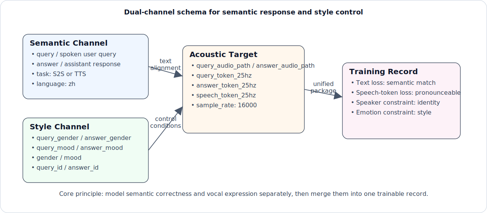
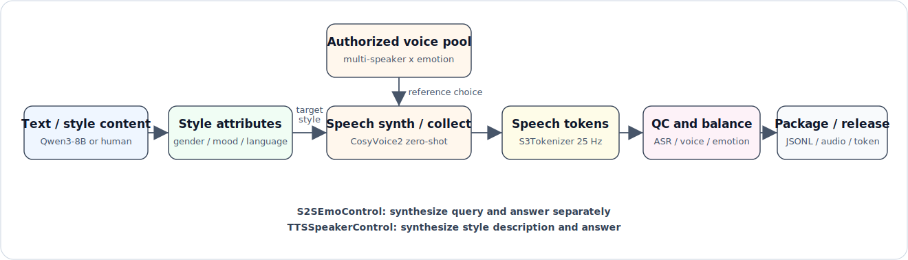
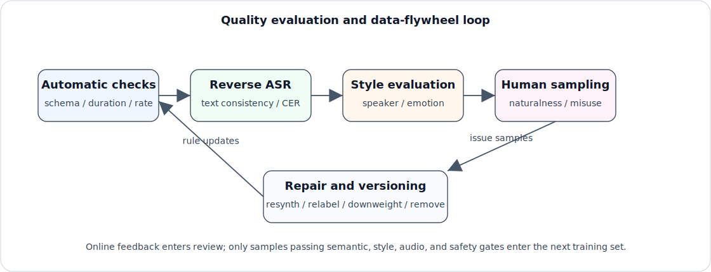

# Chapter 42: VoiceStyleControl Controllable Voice Interaction Data Engineering

## Abstract

This chapter uses VoiceStyleControl controllable voice interaction data engineering as a specialized dataset case study. It analyzes the task definition, sample structure, annotation pipeline, quality control, and evaluation protocol. The chapter emphasizes how this dataset validates the data engineering methods discussed earlier in the book, and explains its applicability boundaries, reproducibility conditions, and risk-control requirements for model training, benchmark evaluation, and industrial deployment.

When dialogue moves from text into speech, the supervision target changes in a fundamental way. Text dialogue data mainly answers two questions: what does the user want, and what should the assistant say? Voice interaction data must also answer who should say the sentence, with what emotion, and whether the resulting voice is audible, controllable, and suitable for the setting. The sentence "Run now, this place is not safe" carries the same text whether it is read calmly or spoken with a trembling, fearful voice, but the training signal is completely different.

That is the value of VoiceStyleControl. It does not simply concatenate ASR transcripts, TTS readings, and dialogue text. It places the user request, assistant response text, target voice condition, emotional style, and corresponding speech supervision into one auditable record. Text fields describe what the turn is about. Style fields describe what voice and emotion should be used. Audio files and discrete speech tokens provide acoustic targets that can be learned and rechecked during generation. The model learns not only response content, but how to generate emotional speech under specified semantic and style conditions.

The engineering entry point for this sample organization is the public repository [Chanfungjan/VoiceStyleControl](https://github.com/Chanfungjan/VoiceStyleControl). The two subsets discussed below, S2SEmoControl and TTSSpeakerControl, are organized around this family of structured records. The former binds spoken queries, assistant answers, and speech supervision on both sides of a dialogue. The latter binds style description, response text, and target speech into a controllable TTS record.

As a controllable voice interaction case, VoiceStyleControl builds on the audio and video data engineering ideas from Chapter 10: sampling rate, audio segmentation, ASR, speaker characteristics, and acoustic quality remain foundational. It also connects to multi-turn interaction in Chapter 20, online feedback in Chapter 23, and privacy and compliance in Chapters 36 and 37. Looking ahead, it shares a pattern with the multimodal generation work in Chapter 48: separate the generation target into content conditions and style conditions, fix them in a structured schema, and feed the result into an end-to-end data flywheel.

The engineering focus is not the TTS architecture or voice-cloning algorithm itself. The focus is how control conditions are recorded, how they enter training, and how audio quality, dialogue naturalness, and compliance boundaries are balanced. Only when these questions are carried by stable data structures and processes can VoiceStyleControl become a reusable controllable voice interaction data asset instead of a collection of pleasant-sounding synthetic samples.

## Keywords

specialized dataset; evaluation benchmark; annotation pipeline; quality control; data engineering practice

## 42.1 Why Voice Dialogue Needs Explicit Style Control

Ordinary text dialogue samples usually contain role boundaries, context, user request, and assistant answer. If the role boundary, text length, safety label, and training mask are clear, the model can learn an input-output mapping over text tokens. Speech samples add an acoustic state that text cannot replace: sampling rate, duration, silence, loudness, noise, speaker identity, prosody, emotion, and discrete speech tokens all affect training. The answer text alone says what was said, but not how it should be spoken.

The difference between controllable voice interaction data and ordinary ASR or TTS corpora is therefore not just that there are more fields. The task definition changes. ASR asks which text corresponds to a piece of audio. Ordinary TTS asks whether a piece of text can be read naturally. Controllable voice interaction also asks what voice, what emotion, and what intensity should be used inside a conversation. If these conditions are not expressed explicitly, the model can only treat voice differences as random variation in the training audio. It will be hard to respond reliably to conditions such as "say this sadly" or "use this kind of voice" at inference time.

First, voice dialogue must separate content from expression. What the user said and what the assistant should answer live at the semantic layer. Who speaks the sentence, how fast it is spoken, how much energy it carries, where it pauses, and whether the emotion is perceptible live at the expression layer. Text dialogue data can often organize only the semantic layer. Voice generation data must make the expression layer part of supervision.

Second, voice dialogue must distinguish understanding the user's voice from generating the assistant's voice. Real users may be anxious, angry, hesitant, accented, or speaking in a noisy environment. The assistant, however, usually needs to maintain a stable voice condition and an emotion policy set by the product. A customer-service assistant should not become angry simply because the user is angry. A companion assistant should not change timbre without reason on every turn. Explicit style control lets data distinguish input-side state from output-side target at the sample level.

Third, emotion must be grounded in sound rather than only described in text. Happy, angry, fearful, neutral, and sad are not merely labels. They are reflected in pitch, energy, speed, pauses, and rhythm. The learning target is not to memorize an emotion word, but to generate speech consistent with the target expression state. For this reason, controllable voice data must keep text content, target style description, and speech supervision together.

Fourth, speech needs recheckable acoustic supervision. Text can enter training directly as token sequences. Speech passes through audio files, sampling rate checks, duration constraints, loudness normalization, silence trimming, discrete speech-token extraction, and other engineering steps. Explicit style control cannot be a side note that says "speak happily." It needs a target audio signal that shows what that style condition means acoustically.

This boundary matters for product experience. A companion assistant may be designed as warm, stable, and not overly dramatic. An audiobook character may need stronger emotional expression and a clearer role voice. A customer-service assistant usually needs to remain neutral and clear when the user is angry. All three may share the same semantic response ability, but they have different voice-identity, emotion-intensity, and risk boundaries. If samples do not distinguish these conditions explicitly, the model treats style as noise and loses controllability at inference time.

From a data engineering perspective, explicit style control also changes sample acceptance. A text sample can often enter the candidate pool once the user question and assistant answer match. A voice sample must satisfy text consistency, usable audio, correct target voice condition, perceptible emotion, and traceable authorization. Any failed dimension affects training: correct text with a wrong voice condition weakens conditional control; correct voice with a wrong emotion weakens emotion control; strong emotion applied to unsafe content can make risky behavior more persuasive.

## 42.2 Dataset Overview: Two Complementary Subsets

VoiceStyleControl contains two task families: speech-to-speech dialogue generation and controllable speech generation from text. Both serve the same goal: enabling a model to generate emotional speech from semantic content, voice conditions, and emotion style. They provide supervision from different angles.

The full dataset contains **189,375 samples**. S2SEmoControl contains **54,586 samples**, about **28.8%** of the total, and targets style-controllable speech-to-speech dialogue generation. TTSSpeakerControl contains **134,789 samples**, about **71.2%** of the total, and targets controllable text-to-speech generation. S2SEmoControl is closer to a real voice assistant: the model must understand the user's spoken request and generate assistant-side speech. TTSSpeakerControl more directly trains the mapping from style text, voice condition, and emotion style to target speech.

**Table 42-1: VoiceStyleControl scale and emotion distribution**

| Emotion | S2SEmoControl | TTSSpeakerControl | Total | Total ratio |
| --- | ---: | ---: | ---: | ---: |
| happy | 10,937 | 38,500 | 49,437 | 26.1% |
| angry | 11,022 | 38,054 | 49,076 | 25.9% |
| fearful | 10,799 | 24,925 | 35,724 | 18.9% |
| neutral | 10,797 | 0 | 10,797 | 5.7% |
| sad | 11,031 | 33,310 | 44,341 | 23.4% |
| **Total** | **54,586** | **134,789** | **189,375** | **100.0%** |

S2SEmoControl is close to balanced across five emotions, with about 10.8k to 11.0k samples per class. TTSSpeakerControl covers four expressive emotions: happy, angry, fearful, and sad. It does not explicitly include neutral. This is not accidental. S2S dialogue needs neutral as a stable baseline; otherwise the model can learn to make every reply high intensity. The larger TTS subset concentrates capacity on styles where acoustic variation is more important, such as happy, angry, fearful, and sad speech.

Neither subset is just "text plus audio." Each record contains at least five kinds of information: task source and task type, text-side content, voice and emotion conditions, speech-generation supervision, and basic audio configuration. These fields jointly determine whether a sample can train conditional emotional speech generation. Task information determines how the sample is loaded; text content provides the semantic target; voice and emotion conditions define the generation style; speech supervision provides the learnable acoustic target; audio configuration makes training and evaluation reproducible.

The two subsets play complementary roles. TTSSpeakerControl provides the larger foundation for style generation: it teaches the model to map natural-language style descriptions, voice conditions, and emotion style into target speech. S2SEmoControl is smaller but closer to real assistant interaction: the model must understand user-side speech before generating assistant-side speech. Used together, the TTS subset gives stable style-generation supervision, while the S2S subset returns that ability to dialogue context.

VoiceStyleControl should therefore not be read as a plain TTS dataset. Ordinary TTS supervision says, given text, read the text. VoiceStyleControl supervision says, given semantic content and style conditions, generate speech that fits the dialogue goal. The former mainly cares about pronunciation, naturalness, and audio quality. The latter must also care about user state, assistant voice condition, emotion choice, cross-turn consistency, and safety boundary. Once the data objective changes, schema, balancing, splitting, and evaluation all change with it.

## 42.3 Sample Schema: Separate Semantic and Style Channels



*Figure 42-1: The semantic channel answers what to say; the style channel answers what voice and emotion to use; the acoustic supervision channel binds both to audio files, speech tokens, and sampling configuration.*

Figure 42-1 shows the core structure of VoiceStyleControl. The semantic channel contains fields such as `query`, `answer`, `task`, and `language`. The style channel contains `gender`, `mood`, `query_id`, and `answer_id`. The acoustic supervision channel contains `query_audio_path`, `answer_audio_path`, `query_token_25hz`, `answer_token_25hz`, `speech_token_25hz`, and `sample_rate`. The channels are merged into one training record, but they should be checked separately during construction, quality control, and evaluation.

Channel separation makes failures easier to diagnose. If the generated answer text is correct but the timbre is unstable, the likely issue is in the style channel or reference voice pool. If the voice condition is correct but the words are wrong, the issue lies in the semantic channel, reverse ASR, or synthesis-text alignment. If the audio plays but the token path cannot be read, the issue is in the acoustic supervision channel or packaged manifest. Collapsing all information into one free-text prompt may be convenient for quick sample assembly, but it makes later repair and experiment attribution much harder.

S2SEmoControl records a mapping from the user side, `(query_audio, query_text, query_gender, query_mood)`, to the assistant side, `(answer_text, answer_audio, answer_gender, answer_mood)`. Dialogue text, voice conditions, emotion labels, audio files, and speech tokens are bound in one record. It is therefore not a loose combination of a text QA pair and attached audio. It is a complete voice-interaction training sample.

```json
{
  "source": "S2SEmoControl",
  "task": "S2S",
  "query": "Tell me a short story.",
  "answer": "Sure. Let me make up a short story for you. Once there was a very diligent nightingale...",
  "query_gender": "female",
  "answer_gender": "male",
  "query_mood": "neutral",
  "answer_mood": "neutral",
  "language": "zh",
  "sample_rate": 16000,
  "query_id": "female-neutral-1",
  "answer_id": "male-neutral-2",
  "query_token_25hz": "S2SEmoControl/.../query_token_0.ark:3121",
  "query_audio_path": "S2SEmoControl/.../1977946a06cf564f1-query.wav",
  "answer_token_25hz": "S2SEmoControl/.../answer_token_0.ark:22637",
  "answer_audio_path": "S2SEmoControl/.../1977946a06cf564f1-answer.wav"
}
```

In this sample, the user asks for a short story and the assistant replies with the beginning of one. `query_gender` is `female`; `answer_gender` is `male`; both `query_mood` and `answer_mood` are `neutral`. During training, `query_audio_path` and `query_token_25hz` can serve as speech-understanding input, while `query` provides a transcript anchor. `answer` is the semantic target. `answer_token_25hz` and `answer_audio_path` are speech-generation supervision. `answer_gender` and `answer_mood` specify the output style condition.

TTSSpeakerControl concentrates control ability into a text-to-speech form. The input text is split into two parts: `text` describes how the voice should express itself, and `answer` is the content to read. For example, `text` may describe a female voice that sounds afraid, with trembling delivery, while `answer` says "Run now, this place is not safe." Such records build style-content pairs: natural-language style description, structured labels, and target content should support one another.

```json
{
  "source": "TTSSpeakerStyle",
  "task": "TTS",
  "text": "female, slightly fearful, tense, voice trembling",
  "answer": "Run now, this place is not safe",
  "gender": "female",
  "mood": "fearful",
  "language": "zh",
  "sample_rate": 16000,
  "answer_id": "female-fearful-1",
  "speech_token_25hz": "TTSSpeakerStyle/.../answer_token_0.ark:1379",
  "answer_audio_path": "TTSSpeakerStyle/.../c6810929-8962-4cc1-b3b5-aadd4cbb1106-answer.wav"
}
```

Across S2S and TTS samples, fields can be grouped into six layers: task identity, text content, voice condition, emotion condition, speech supervision, and audio configuration. S2S records include both user-side and assistant-side fields; TTS records focus on assistant-side speech. `language` and `sample_rate` are basic contractual fields for loading, resampling, and evaluation. They should not be inferred only from path names or directory conventions.

**Table 42-2: Speaker, emotion, and sampling fields**

| Label layer | Fields | Values / examples | Distribution or engineering requirement |
| --- | --- | --- | --- |
| Query-side speaker | `query_gender` | `female` / `male` | Count separately on the query side. |
| Answer-side voice condition | `answer_gender` / `gender` | `male` / `female` | Monitor balance by answer-side gender, mood, and reference voice condition before training. |
| Query-side emotion | `query_mood` | `happy`, `angry`, `fearful`, `neutral`, `sad` | S2SEmoControl is close to balanced across five classes. |
| Answer-side emotion | `answer_mood` / `mood` | same set | Overall counts follow Table 42-1; TTSSpeakerControl does not explicitly include `neutral`. |
| Language and sampling | `language` / `sample_rate` | `zh` / `16000` | Used for loading, resampling, and reproducible evaluation, not only for path inference. |
| Reference voice handle | `query_id` / `answer_id` | `female-neutral-1` | Points to a style instance in the authorized reference pool without exposing real identity. |

Emotion distribution is only the first layer of balancing. During training and evaluation, samples must also be separated by input side and output side. `query_gender x query_mood` describes the state of the user's speech. `answer_gender/gender x answer_mood/mood` describes the target distribution for generated assistant speech. Reference voice ID constrains how the same voice condition is reused across texts and emotions. Looking across these axes helps identify whether an emotion is concentrated in a single voice condition, whether a reference timbre appears too often in both train and test, and whether a model failure comes from semantics, voice condition, or emotion control.

S2S and TTS use voice and emotion fields slightly differently. S2S records both sides and therefore uses `query_gender`, `answer_gender`, `query_mood`, and `answer_mood`. TTS generates only answer-side audio, so it uses `gender` and `mood`. Before training, a normalized view can map TTS `gender` to `answer_gender` and `mood` to `answer_mood`, while retaining the original fields for traceability.

A joint JSON Schema should constrain required fields by task type. A production manifest should also add enum constraints, path-existence checks, file hashes, authorization IDs, tokenizer name, tokenizer version, and token frame-rate declarations.

```json
{
  "$schema": "https://json-schema.org/draft/2020-12/schema",
  "title": "VoiceStyleControlRecord",
  "type": "object",
  "required": [
    "source",
    "task",
    "answer",
    "language",
    "sample_rate",
    "answer_audio_path"
  ],
  "oneOf": [
    {
      "title": "S2SEmoControl",
      "required": [
        "query",
        "query_gender",
        "answer_gender",
        "query_mood",
        "answer_mood",
        "query_id",
        "answer_id",
        "query_audio_path",
        "answer_audio_path",
        "query_token_25hz",
        "answer_token_25hz"
      ],
      "properties": {
        "task": {
          "const": "S2S"
        }
      }
    },
    {
      "title": "TTSSpeakerControl",
      "required": [
        "text",
        "gender",
        "mood",
        "answer_id",
        "speech_token_25hz",
        "answer_audio_path"
      ],
      "properties": {
        "task": {
          "const": "TTS"
        }
      }
    }
  ],
  "properties": {
    "source": { "type": "string" },
    "task": { "enum": ["S2S", "TTS"] },
    "query": {
      "type": "string",
      "description": "Transcript of the spoken user query, used only by S2S."
    },
    "text": {
      "type": "string",
      "description": "Natural-language style description, used only by TTS."
    },
    "answer": {
      "type": "string",
      "description": "Assistant response or text to synthesize."
    },
    "query_gender": { "type": "string" },
    "answer_gender": { "type": "string" },
    "gender": { "type": "string" },
    "query_mood": { "type": "string" },
    "answer_mood": { "type": "string" },
    "mood": { "type": "string" },
    "language": { "type": "string" },
    "sample_rate": { "type": "integer" },
    "query_id": { "type": "string" },
    "answer_id": { "type": "string" },
    "query_token_25hz": { "type": "string" },
    "answer_token_25hz": { "type": "string" },
    "speech_token_25hz": { "type": "string" },
    "query_audio_path": { "type": "string" },
    "answer_audio_path": { "type": "string" }
  }
}
```

The joint schema splits the training entry into semantic input, style input, and acoustic target. Semantic input is `query`, `text`, or `answer` text tokens. Style input is gender, mood, and reference voice ID. Acoustic target is the answer-side speech token sequence or audio. `answer_gender`, `answer_mood`, `gender`, and `mood` cannot remain only in offline metadata. They must be mapped into control conditions or condition text inside the dataloader; otherwise the model will not actually receive controllable-generation supervision.

After samples enter the dataloader, the standard schema can be projected into different task views. An S2S view may be `query_audio + answer_gender + answer_mood -> answer_token`, optionally with the `query` transcript as auxiliary semantic input. A TTS view may be `text + answer + gender + mood -> speech_token`. Evaluation views can fix some fields and vary others, such as fixing `answer` while changing `mood`, or fixing `mood` while changing `answer_id`. This design keeps the record contract stable while allowing task views to change.

## 42.4 Construction Pipeline: From Text Dialogue to Controllable Voice Records



*Figure 42-2: Text dialogue or style content receives speaker and emotion conditions, is synthesized or collected through an authorized reference voice pool, and then passes tokenization, quality control, balancing, and packaging.*

VoiceStyleControl construction can be divided into seven stages: generating or collecting text content, assigning style attributes, preparing an authorized reference voice pool, synthesizing or collecting speech, extracting discrete speech tokens, quality control with balancing and splitting, and packaging for release. Each stage affects semantic quality, style quality, and compliance risk.

This pipeline is not a simple one-way production line. It is a chain of data gates. After text generation, the pipeline checks whether the semantics fit the assigned emotion. After reference voice selection, it checks whether authorization covers the task. After synthesis, it checks whether audio, text, voice condition, and emotion all pass together. A problem found at any stage should return to the corresponding repair queue rather than flowing forward. Otherwise evaluation will only show that the model is unstable without explaining why.

The first stage generates or collects text content. S2SEmoControl uses Qwen3-8B to generate or organize dialogue pairs, with each record containing a user `query` and assistant `answer`. Queries cover everyday requests, emotional expressions, stories, explanations, reminders, and similar scenarios. Answers remain natural, complete, and within safety boundaries. TTSSpeakerControl uses emotion-specific prompts to generate style-content pairs, where style description and spoken content support each other.

Content acceptance cannot stop at grammar. It must check whether emotion and semantics are compatible. A fearful style may fit "Run now, this place is not safe," but should not turn casual small talk into exaggerated alarm. An angry style may be useful for character performance, but should not turn insults, threats, or discriminatory content into emotional enhancement. If the text stage lacks boundaries, later speech synthesis will amplify risky text with acoustic expression.

The second stage assigns style attributes. S2S needs gender and mood on both the query side and answer side. TTS assigns gender and mood to the answer side and writes a natural-language style description in `text`. The assignment strategy must consider both balance and combination coverage. Balance ensures enough samples per emotion. Combination coverage lets the model see transitions from different user styles to different assistant styles. If the data contains only same-gender or same-mood pairs, the model may bind input style to output style and weaken answer-side control.

Combination coverage is especially important for the S2S subset. A user-side angry mood does not imply an angry assistant. A fearful user does not require a fearful assistant. Many real products need the assistant to remain neutral, clear, and actionable when the user is under stress. Construction should preserve enough cross-combination samples, such as a female angry query paired with a male neutral answer, or a male sad query paired with a female neutral answer. This teaches the model to treat user state as an understanding signal, not something to copy directly.

The third stage prepares the reference voice pool. VoiceStyleControl uses a multi-speaker, multi-emotion reference pool and synthesizes target-style speech through CosyVoice2 zero-shot voice cloning. The engineering key is not "make the clone as similar as possible." It is "authorized, reusable, and revocable." Reference audio should record reference voice ID, emotion condition, collection time, usage scope, authorization status, and revocation status. `query_id` and `answer_id` should expose only engineering references, not real names or identity-revealing handles.

The fourth stage synthesizes or collects speech. S2S needs both query speech and answer speech, with each side bound to text line by line. TTS generates answer-side speech according to `text` and `answer`. Synthesis should fix or explicitly record sampling rate, loudness, silence, maximum duration, and file encoding. This prevents dataloader instability from abnormal duration or format. If real collection is used, the pipeline also needs to handle environmental noise, microphone differences, speaker fatigue, and third-party background voices.

The fifth stage extracts discrete speech tokens. S3Tokenizer converts waveform audio into discrete speech tokens so voice generation can be trained as a sequence modeling task. S2S records use `query_token_25hz` and `answer_token_25hz`; TTS records use `speech_token_25hz`. VoiceStyleControl uses 25 Hz speech tokens. The released manifest should still bind tokenizer name, version, frame rate, codebook configuration, and reconstruction method. The worst case is a same-named field with different meanings across batches: different frame rates or tokenizer versions under the same field produce confusing supervision.

The sixth stage performs quality control, balancing, and splitting. QC should check more than whether audio can play. It should verify text-audio consistency, target voice-condition match, perceptible emotion, stable audio quality, existing paths, and readable tokens. Balancing should monitor `task`, `language`, `sample_rate`, reference voice ID, text length, and audio duration in addition to emotion totals. Splitting should isolate by reference voice ID so the same reference timbre does not appear in both train and test, which would inflate voice-condition evaluation.

The seventh stage packages the result. Samples may be stored as JSONL, Parquet, or Hugging Face Dataset objects, but the training manifest must preserve audio paths, token paths, hashes, authorization status, and data version. Audio files, token ark files, and metadata should be strictly bound by manifest, not loosely associated through human naming conventions. Only then can the team locate affected training versions when samples are resynthesized, relabeled, or removed.

The release artifact should also include a data card. It records total sample count, subset composition, emotion distribution, gender distribution, reference voice IDs, language, sampling rate, tokenizer version, authorization scope, and split strategy. It also distinguishes training conditions, audit metadata, and anonymized fields in public versions. This boundary statement prevents `answer_id` from being misused as a real identity label and prevents `mood` from being treated as a fact that never needs validation.

## 42.5 Quality Evaluation and Closed-Loop Repair



*Figure 42-3: Automatic checks, reverse ASR, style evaluation, and human sampling form issue queues that feed back into resynthesis, relabeling, downweighting, or removal.*

Quality evaluation for controllable voice interaction data must cover semantics, voice, emotion, audio, and safety at the same time. A sample that sounds human may still fail: it may read the wrong words, use the wrong voice identity, overstate an emotion, or apply a fearful tone in a dangerous scenario. The quality system should combine automatic metrics and human review into a closed loop. Problem samples should enter resynthesis, relabeling, downweighting, or removal queues.

Quality gates should distinguish hard failures from soft risks. Missing paths, wrong sampling rate, corrupted audio, unreadable tokens, and severe reverse-ASR mismatch are hard failures and should be blocked. Weak emotion, mediocre naturalness, or a borderline voice-condition impression may enter a soft-risk queue for resynthesis, downweighting, or human review depending on task importance. Treating every issue as a hard reject wastes repairable samples; passing every issue dilutes control signal with noise.

**Table 42-3: Quality evaluation dimensions**

| Dimension | Core question | Automatic signal | Human review focus | Failure handling |
| --- | --- | --- | --- | --- |
| Semantic consistency | Does the answer respond to intent, and is TTS content read correctly? | Reverse-ASR CER/WER, semantic similarity, intent hit rate | Off-topic answers, missing key details, unsafe advice | Rewrite text, resynthesize, remove |
| Voice-condition consistency | Does output match target gender, mood, and reference condition? | Field consistency checks, gender verification, reference timbre sampling | Wrong target condition, cross-sample bleed, excessive similarity to an unauthorized person | Reselect reference, resynthesize, downweight, isolate |
| Emotion control | Is target mood expressed reliably? | Emotion-classifier accuracy, confusion matrix, F0/energy/speed statistics | Emotion too strong, semantically conflicting, or manipulative | Relabel, lower intensity, remove |
| Audio quality | Can the audio serve as generation supervision? | SNR, loudness, silence ratio, clipping rate, MOS/NISQA | Pops, broken phrasing, mechanical sound, background noise | Denoise, resample, resynthesize |
| Dialogue naturalness | Is the S2S answer natural and role-stable? | Multi-turn coherence score, duration distribution | Abrupt tone, unstable role, style jumps | Reorder, add context, human review |
| Safety and compliance | Is the sample authorized, traceable, and revocable? | Authorization completeness, watermark hit rate, audit-log coverage | Impersonation, inducement, sensitive identity cloning | Block, anonymize, remove, audit |

Semantic consistency can use reverse ASR as a first automatic check. Transcribe synthesized audio back into text, compute CER or WER, and compare with `answer`. For S2S, also check whether the answer responds to the query. If "Run now, this place is not safe" is synthesized as "Run now, this place is safe," the sample must be removed regardless of audio quality. Semantic similarity and LLM-as-judge can help triage, but safety-sensitive or emotionally intense samples still need human sampling.

Voice-condition consistency checks whether generation matches gender, mood, and reference condition in the record. It is not an independent identity-recognition training task. For the answer side, `answer_id` should be consistent with `answer_gender` and `answer_mood`. For the query side, `query_id` should be consistent with user-side labels. If the same `answer_id` exhibits noticeably different timbres across samples, the reference pool, synthesis parameters, and tokenization process need investigation. Listening tests and automatic checks are QC tools; they do not change the dataset's training goal.

Emotion evaluation should not rely only on classifier confidence. Happy speech may carry higher energy and a faster rhythm. Sad speech may be slower and lower energy. Fearful speech may include trembling, urgency, or unstable pauses. Angry speech may be more forceful. But language, speaker differences, and semantic content all affect acoustic expression. The target should be "perceptible and compatible with the text," not a fixed acoustic template for every emotion.

Closed-loop repair must preserve issue type. Semantic errors go back to text generation or reverse-ASR review. Voice-condition errors return to reference selection or synthesis parameters. Emotion errors return to style description, emotion label, or synthesis model. Audio-quality errors return to waveform processing. Compliance errors enter isolation, removal, and audit. Each repair should create a new version rather than overwrite the source file. Otherwise later model changes become impossible to trace.

## 42.6 Evaluation Protocol: Making Control Comparable

The evaluation set should be independent from the training construction logic, especially by preventing the same reference voice ID from appearing in both train and test. For S2SEmoControl, evaluation samples should cover combinations from different query emotions to different answer emotions. For TTSSpeakerControl, evaluation should compare the same `answer` under different `text/gender/mood` conditions. A useful protocol asks not only whether speech sounds good, but whether the same sentence changes under different control conditions in a reasonable way.

Evaluation slices can be grouped into three types. The first is a routine slice that covers the main training distribution and measures general usability. The second is a counterfactual slice that fixes text or reference voice ID while changing mood or gender, testing whether control fields actually work. The third is a safety slice covering identity impersonation, high-pressure emotion, sensitive professions, financial verification codes, medical advice, and similar scenarios. These conclusions should not be merged into one average score, because high audio quality can hide high-risk behavior.

Semantic evaluation has two layers: content fidelity and dialogue relevance. Content fidelity checks whether TTS output reads `answer` accurately and whether S2S output can be transcribed into text semantically consistent with the target answer. Dialogue relevance checks whether the S2S answer responds to the query, rather than producing a fluent but irrelevant sentence. Reverse ASR, semantic similarity, LLM-as-judge, and human review can be combined, but judge prompts, model versions, and human guidelines should be saved to prevent metric drift.

Voice-condition evaluation should also be layered. The structural-label layer checks whether `answer_gender/gender` and `answer_mood/mood` match the sample target. The perceptual layer checks whether generated audio fits the reference voice condition and emotion expression. The isolation layer checks whether the model becomes too close to an unauthorized person or leaks a real voiceprint from training. The target is not to rank voiceprint similarity or optimize "as close as possible to a real person." It is to confirm that the model can generate reasonable, compliant emotional speech under the specified sample condition.

Emotion evaluation needs counterfactual pairs. For example, fix a neutral sentence and request happy, angry, fearful, and sad versions; fix `gender` and change `mood`; or fix `mood` and change `gender`. Paired evaluation reveals whether the model uses control fields. If every output changes only in volume, while speed, pause, and rhythm do not change with mood, the model may have learned only shallow intensity control.

Audio quality evaluation combines objective metrics and subjective scores. Objective metrics cover duration distribution and automatic MOS-like scores. Subjective scores focus on naturalness, intelligibility, emotional credibility, and dialogue comfort. Safety evaluation should be a release gate. Identity impersonation, sensitive professions, financial verification codes, medical advice, minors, and high-pressure emotional inducement should all check whether the system refuses or neutralizes output when strong emotion or a specific timbre is inappropriate.

Evaluation results should be written back to data versions, not only kept in model reports. If one model version has high fearful-emotion classification accuracy but low human comfort, the data may have constructed fearful speech as too dramatic. If reference voice conditioning becomes increasingly similar to an identifiable person while compliance risk rises, the reference pool or evaluation target may be over-optimizing identity replication. Only when these conclusions return to sample filtering, weighting, and synthesis strategy does evaluation change the next data release.

## 42.7 Privacy, Authorization, and Misuse Risk

Voice identity is a highly sensitive data asset. A person's voice can reveal age, gender, region, emotion, health state, and identity clues. In voiceprint systems, it may even serve as an authentication credential. Once controllable voice data uses voice cloning, authorization, revocation, use limitation, and audit must enter the data lifecycle, not appear only as a model-release disclaimer.

**Table 42-4: Privacy and misuse risk controls**

| Risk type | Trigger scenario | Control measure | Audit evidence |
| --- | --- | --- | --- |
| Voice identity authorization | Reference speech comes from a real speaker or identifiable voice | Consent before collection, usage scope, revocation, authorization version | Consent timestamp, revocation record |
| Emotional manipulation | Fearful, angry, or intimate tone influences user judgment | Disable strong emotion in high-risk scenarios, prompt review, minor protection | Human review ticket |
| Privacy leakage | Audio contains names, phone numbers, addresses, or background speakers | ASR anonymization, background-voice filtering, data minimization, retention limit | Anonymization report, deletion-request log |
| Bias and stereotype | `gender` is persistently tied to `mood` or content | Distribution monitoring, counterfactual samples, ban stereotyped templates | Distribution report, bias evaluation |
| Version loss of control | Samples are resynthesized or relabeled without traceability | Data versioning, hashes, frozen training sets | Experiment tracking ID |

Table 42-4 turns risk governance into data gates. References without authorization must not enter the synthesis queue. Revoked references must be traceable to all derived audio files and tokens. High-risk emotional-manipulation samples cannot rely only on post-training safety policies; they should be blocked or downweighted during data construction. For voice generation, compliance is not the final filter before launch. It is part of the sample lifecycle.

The reference voice pool is the main governance object. Each reference should have a `consent_id`, authorization scope, collection method, allowed tasks, expiration time, and revocation status. If authorization permits research only, the sample cannot enter commercial model training. If a speaker revokes authorization, the manifest should locate all affected `query_id/answer_id` values, audio files, token files, and training versions. Public releases should use reference IDs that cannot be traced back to a real identity, and should avoid using names in IDs, filenames, or paths.

Emotion control also has misuse boundaries. Strong emotions such as fearful and angry can improve expression, but they can also manipulate users. Customer service, education, medical, and financial settings should restrict high-pressure emotional output, especially fear-based prompts that push users to transfer money, buy something, reveal verification codes, or make health decisions. For minors and psychologically vulnerable users, systems should prefer neutral or gentle supportive styles and preserve policy-trigger logs.

Privacy protection also includes content anonymization. Speech samples may contain names, addresses, phone numbers, accounts, locations, or third-party background speech. Even if VoiceStyleControl mainly uses synthetic text, the pipeline should preserve ASR anonymization, sensitive-term scanning, background-speaker detection, and human sampling. If real user voice feedback is added later, user consent, data minimization, retention period, deletion requests, and notices for purpose changes must be part of the platform process.

Bias governance is equally important. If female voices are more often bound to fearful or sad styles, while male voices are more often bound to angry styles, the model will learn and amplify stereotypes. Gender statistics cannot stop at marginal proportions. They must enter cross views such as `query_gender`, `answer_gender/gender`, and `mood`. Evaluation should also include counterfactual samples to test whether the same content is expressed fairly across genders.

## 42.8 Connections to Earlier and Later Chapters

VoiceStyleControl inherits the lower-level capabilities of audio and video data engineering. The audio slicing, ASR, denoising, speaker separation, and time alignment discussed in Chapter 10 become a finer sample contract here. The data must know not only which text corresponds to an audio segment, but also which reference voice ID, which mood, which sampling rate, and which token frequency produced it. A plain audio pipeline solves alignment. Controllable voice interaction further asks whether the aligned voice can be generated under conditions.

It also connects to multi-turn interaction data. Chapter 20 discusses agent memory and multi-turn context, where role, intent, and history are major variables. When interaction becomes speech, assistant persona also appears through stable timbre and emotion. A multi-turn voice assistant cannot be neutral male in the first turn, fearful female in the second, and angry male in the third without a reason. `answer_gender`, `answer_mood`, and `answer_id` can therefore become part of a voice agent's memory for maintaining continuity.

Online feedback turns offline style labels into user-experience signals. The clicks, satisfaction, corrections, and complaints discussed in Chapter 23 may appear in voice products as "hard to hear," "too rushed," "too harsh," "not like the previous voice," or "wrong emotion." These signals should not become training samples directly. They should first enter an evaluation queue that identifies semantic error, audio-quality error, style error, or safety-policy error, and only then choose resynthesis, relabeling, reweighting, or refusal-rule changes.

Privacy and compliance chapters provide boundaries. Chapter 36 requires authorization, purpose, retention, and audit to be moved forward into the data lifecycle. Chapter 37 reminds us that voice identity risk can be reduced with access control, federated training, encrypted storage, and minimal collection. The more controllable voice data emphasizes voice conditions and reference timbre, the less compliance can be treated as an appendix.

In multimodal generation data engineering, VoiceStyleControl shares the same core pattern as Chapter 48: split the generation target into content conditions and style conditions, then bind training supervision through a structured schema. In T2I or T2V, prompt, style, motion, camera, and safety tags correspond to `answer`, `gender`, `mood`, reference voice ID, `sample_rate`, and audio tokens in speech. Part 14 Project 10, "End-to-End LLM Data Flywheel," can also reuse this design: build an initial offline voice dataset, train a controllable generation model, collect online experience feedback, feed issues back into QC and balancing, and release the next data and model version.

## 42.9 Summary

VoiceStyleControl is valuable not because it piles up more speech samples, but because it puts semantic response, voice condition, emotion control, and speech-generation supervision into one auditable record. S2SEmoControl provides spoken-query to spoken-answer supervision. TTSSpeakerControl provides direct supervision from natural-language style description to target speech. Together, they let a model both understand user speech and generate an answer with specified voice conditions and emotion.

The key data engineering work is to separate semantic and style channels; preserve fields such as `query_gender`, `answer_gender`, `query_mood`, `answer_mood`, `gender`, and `mood`; write `sample_rate`, audio paths, speech-token paths, and tokenizer versions into the data contract; use reverse ASR, voice-condition checks, emotion recognition, audio-quality metrics, and human review to build the evaluation protocol; and enforce authorization, revocation, watermarking, and audit in the reference voice pool and voice-cloning pipeline.

As voice interaction moves from "can speak" to "can speak in a controlled way," the dataset boundary changes as well. Every sample must answer four questions: is the content correct, does the voice condition match the target, does the emotion match the control condition, and is the generation process compliant and traceable? Only when all four hold can controllable voice interaction data become a reliable training asset.

## Chapter Summary

This chapter uses VoiceStyleControl controllable voice interaction data engineering to organize the core issues, processing workflow, and acceptance criteria for this specialized dataset case. Its contribution is to place concepts, data objects, quality signals, and engineering deliverables into one narrative, helping readers judge which stages need explicit records and which results need to be verified through sampling, evaluation, or audit.

The applicability of this chapter's methods should be judged together with data sources, business goals, model capabilities, cost budgets, and compliance requirements. For scenarios involving sensitive information, cross-system calls, automated decision-making, or public release, teams should preserve human review, frozen versions, permission controls, and abnormal rollback mechanisms, rather than extending the example workflow directly into production promises.

Within the structure of the book, this chapter sits in the specialized dataset validation layer. It connects the foundational concepts introduced earlier with open-source model data recipes and project case studies. Readers can use the chapter's framework together with its figures, tables, references, and appendix checklists to turn the methods into reproducible, inspectable, and deliverable engineering workflows.

## References

An K, Chen Q, Deng C, Du Z, Gao C, Gao Z, Gu Y, He T, Hu H, Hu K, others (2024) FunAudioLLM: Voice Understanding and Generation Foundation Models for Natural Interaction Between Humans and LLMs. arXiv preprint arXiv:2407.04051.

Chanfungjan (n.d.) VoiceStyleControl. GitHub repository. https://github.com/Chanfungjan/VoiceStyleControl.

Du Z, Chen Q, Zhang S, Hu K, Lu H, Yang Y, Hu H, Zheng S, Gu Y, Ma Z, Gao Z, Yan Z (2024) CosyVoice: A Scalable Multilingual Zero-shot Text-to-speech Synthesizer based on Supervised Semantic Tokens. arXiv preprint arXiv:2407.05407.

Du Z, Wang Y, Chen Q, Shi X, Lv X, Zhao T, Gao Z, Yang Y, Gao C, Wang H, others (2024) CosyVoice 2: Scalable Streaming Speech Synthesis with Large Language Models. arXiv preprint arXiv:2412.10117.

Mittag G, Naderi B, Chehadi A, Moller S (2021) NISQA: A Deep CNN-Self-Attention Model for Multidimensional Speech Quality Prediction with Crowdsourced Datasets. In: Interspeech 2021, pp 2127-2131.

Song X (n.d.) S3Tokenizer: Reverse Engineering of Supervised Semantic Speech Tokenizer proposed in CosyVoice. GitHub repository. https://github.com/xingchensong/S3Tokenizer.

Yang A, Li A, Yang B, Zhang B, Hui B, Zheng B, Yu B, Gao C, Huang C, Lv C, others (2025) Qwen3 Technical Report. arXiv preprint arXiv:2505.09388.
