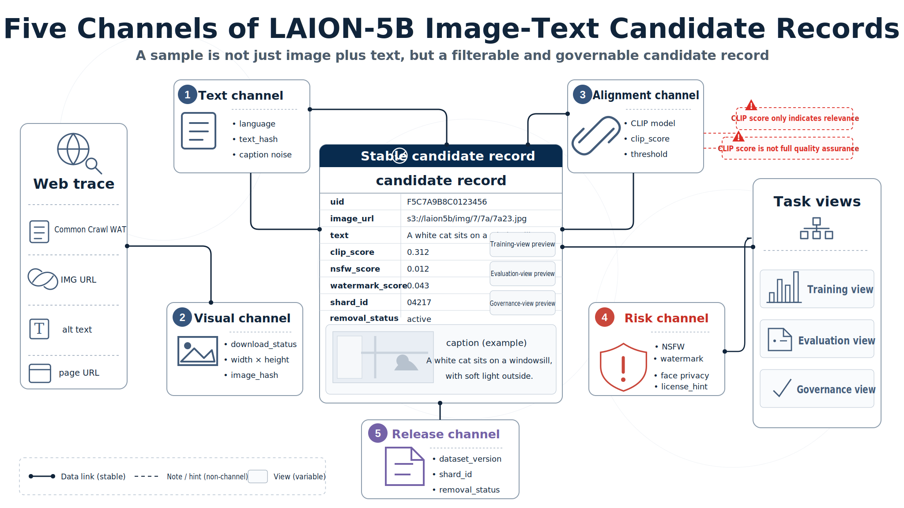
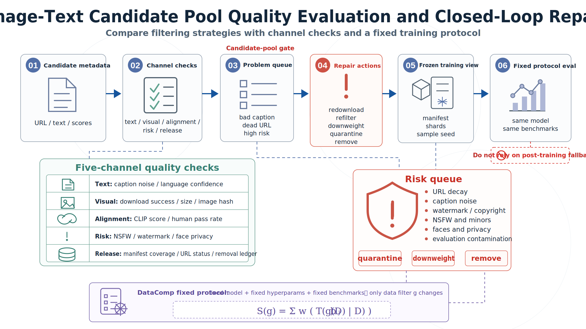

# Chapter 43: LAION-5B Image-Text Candidate Pool and Filtering Channels

## Abstract

The largest difference between image-text foundation corpora and pure-text corpora is not simply the addition of image files, but that each sample is split into multiple channels that must all hold at the same time. The text channel must explain how the image is described; the visual channel must explain whether the image can be downloaded and whether its size and content are usable; the alignment channel must explain whether image and text are related; and the risk channel must explain whether there are watermark, NSFW, toxicity, privacy, or authorization risks. If any one channel fails, the image-text pair may be unsuitable for training.

LAION-5B is a large-scale image-text candidate pool derived from Common Crawl. It parses IMG tags and alt text from Web WAT metadata, then uses language identification, image downloading, CLIP or multilingual CLIP similarity filtering, watermark and NSFW detection, nearest-neighbor indexing, and Parquet metadata release to organize open Web image-text pairs into a searchable, filterable, and reviewable data asset. This chapter decomposes LAION-5B into five channels - text, visual, alignment, risk, and release - and then discusses how candidate pools are filtered into training views, evaluation views, and governance views. DataComp is not the main dataset of this chapter; it serves as an evaluation-protocol reference showing how to compare different image-text filtering strategies under fixed models and fixed downstream evaluations.

## Keywords

LAION-5B; image-text pairs; Common Crawl; alt text; CLIP filtering; multi-channel schema; WebDataset; Parquet; DataComp; risk governance

## 43.0 Learning Objectives

After completing this chapter, readers should be able to:

- Explain why Web image-text pairs must be checked through text, visual, alignment, risk, and release channels.
- Understand the English, multilingual, and no-language subset structure of LAION-5B.
- Design a traceable image-text sample schema covering URL, text, image dimensions, CLIP score, safety labels, and removal status.
- Use CLIP similarity and threshold functions to describe image-text filtering gates.
- Distinguish candidate-pool views, training views, evaluation views, and governance views.
- Compare image-text filtering strategies using DataComp-style fixed training protocols.
- Identify risks involving public URLs, copyright, faces, children, NSFW content, watermarks, and link decay.

## 43.1 Opening Problem Scenario: Image-Text Pairs Need Channelized Filtering

A multimodal team is preparing to train a vision-language model. It extracts billions of `<image_url, alt_text>` pairs from Web pages and then asks a download script to fetch images by URL. The first round of sampling quickly exposes problems: many URLs have already expired; many alt texts are filenames, advertising phrases, SEO keywords, or unrelated paragraphs; some images are too low-resolution, contain watermarks, include adult content, faces, children's photos, medical images, or copyright marks. More importantly, image and text appearing related does not mean the pair is suitable for training. A product image captioned "click to buy" contributes little to learning visual concepts; a personal photo paired with a name, address, or social account introduces privacy risk into the model.

If such data is compressed into a free-text prompt, later problems become almost impossible to locate. If the model generates watermarks, the issue lies in the visual channel; if the model learns advertising templates, the issue lies in the text channel; if image-text retrieval is weak, the issue lies in the alignment channel; if faces, children, or copyright disputes appear after training, the issue lies in the risk and governance channels. The engineering lesson from LAION-5B is that it does not simply package Web images; it decomposes candidate image-text relationships into a set of filterable fields that downstream teams can recombine according to their task objectives.

Ordinary image datasets usually center on image files and human labels, and sample boundaries are relatively stable. Image-text candidate pools differ. Images may expire or be replaced at their URLs; alt text may not be a caption; Web-page context may be only weakly related to the image; and safety labels may change with detector versions. A sample is not a static object, but a Web relationship that must be continuously verified.

This relationship has at least three kinds of fragility. The first is temporal fragility: URLs expire, images update, and pages redirect. The second is semantic fragility: alt text may serve accessibility, SEO, or template display rather than image description. The third is governance fragility: a publicly accessible URL does not imply clear authorization, nor does it imply the absence of faces, children, medical content, trademarks, or watermark risk.

### 43.1.2 CLIP Scores Solve Only Part of Image-Text Relevance

LAION-5B's core filtering signal comes from cosine similarity between image and text embeddings. Let the image encoder be $f_I$, the text encoder be $f_T$, the image be $i$, and the text be $t$. The image-text similarity can be written as:

$$
\operatorname{sim}(i,t)=\frac{f_I(i)\cdot f_T(t)}{\|f_I(i)\|\|f_T(t)\|}
$$

Threshold filtering can be abstracted as:

$$
\operatorname{keep}(i,t)=\mathbb{1}[\operatorname{sim}(i,t)\ge \tau_{\ell}]
$$

where $\tau_{\ell}$ can be set by language or subset. This filtering improves image-text relevance, but it is not proof of factual correctness, safety, or authorization compliance. A high-CLIP-score image may still contain watermarks, faces, adult content, private information, or copyright risk; a low-CLIP-score sample may still be valuable for certain tasks such as charts, document pages, or medical images.

## 43.2 Dataset Overview: Subset Scale and Public Form

The LAION-5B paper reports 5.85B CLIP-filtered image-text pairs, including approximately 2.32B English pairs, 2.26B multilingual pairs, and 1.27B pairs with uncertain language. This split matters because language identification, CLIP models, filtering thresholds, and downstream tasks all affect sample value.

*Table 43-1 Public Subset Structure of LAION-5B*

| Subset | Scale | Text-language Form | Engineering Meaning | Typical Use |
| --- | ---: | --- | --- | --- |
| LAION-2B-en | 2.32B | English | Higher language-identification confidence, filtered with English CLIP | English CLIP, image-text retrieval, English T2I data candidates |
| LAION-2B-multi | 2.26B | More than 100 non-English languages | Uses multilingual models for image-text similarity | Multilingual image-text retrieval, multilingual vision-language pre-training |
| LAION-1B-nolang | 1.27B | Unclear language or low confidence | Common products, places, short text, and SEO noise | Task-specific refiltering, product and place candidate pools |
| Total | 5.85B | Mixed | Open Web image-text candidate pool | Large-scale image-text training and data research |

LAION-5B's public form does not centrally host all image files; it publishes metadata and toolchains. Downstream users filter based on URLs, text, image dimensions, similarity scores, safety labels, and index information, then download or reconstruct subsets themselves.

From a data-engineering perspective, LAION-5B is closer to a candidate pool than to a final training sample set. A candidate pool emphasizes coverage, indexing, and filterability; a training set emphasizes successful download, task fit, risk control, and version freezing. The same LAION-5B candidate pool can be rendered into different training views: an image-text retrieval model may retain high-CLIP-score samples; a text-to-image generation model may additionally raise aesthetic or watermark thresholds; and a document-understanding model may instead need to retain some OCR-dense samples.

The final training sample is not a direct copy of the Web trace, but a structured view rendered for a target task. LAION-5B candidate records are similar: during training, they must be projected into concrete views rather than treating the full candidate pool as an undifferentiated input.

## 43.3 Sample Schema: Recording Five Channels Separately

Image-text candidate pools should also be modeled by channel. The Parquet metadata fields listed in the LAION-5B paper include a 64-bit integer id, image URL, text, image height and width, cosine similarity between image and text embeddings, and NSFW and watermark-detection scores. When reusing such corpora, engineering teams usually need to add governance fields such as download status, hash, authorization hints, and removal status.



*Figure 43-1 Multi-channel schema for LAION-5B image-text candidate records. Source: original illustration based on the LAION-5B paper and LAION dataset-spec.*

*Table 43-2 Image-text Candidate Record Schema*

| Channel | Typical Fields | Source or Generation Method | Engineering Use |
| --- | --- | --- | --- |
| Text channel | `text`, `language`, `text_length`, `text_hash` | Alt text, language identification, hash | Text filtering, language bucketing, contamination detection |
| Visual channel | `image_url`, `page_url`, `width`, `height`, `image_hash` | Common Crawl, downloader, decoder | Download reproduction, size filtering, image deduplication |
| Alignment channel | `clip_score`, `clip_model`, `embedding_id`, `nearest_neighbors` | CLIP or multilingual CLIP encoding | Image-text relevance filtering and nearest-neighbor retrieval |
| Risk channel | `nsfw_score`, `watermark_score`, `toxicity_score`, `license_hint` | Classifiers, dataset cards, manual rules | Safety filtering, authorization review, risk stratification |
| Release channel | `uid`, `dataset_version`, `shard_id`, `removal_status` | Metadata generation and version system | Locate samples, respond to removals, freeze versions |

A sample record for an internal training set can be written as follows:

```json
{
  "uid": "laion5b-en-000001",
  "dataset_version": "laion5b",
  "image_url": "https://example.org/image.jpg",
  "page_url": "https://example.org/page.html",
  "text": "a red train entering a station",
  "language": "en",
  "width": 1024,
  "height": 768,
  "clip_model": "ViT-B-32",
  "clip_score": 0.314,
  "nsfw_score": 0.02,
  "watermark_score": 0.11,
  "download_status": "ok",
  "fetch_time": "2026-03-01T10:00:00Z",
  "image_hash": "sha256:...",
  "text_hash": "sha256:...",
  "removal_status": "active"
}
```

Channelized modeling locates failure sources. If generated text does not match the image, the issue usually lies in the alignment channel. If many samples cannot be downloaded during training, the issue lies in the visual channel or release view. If the model outputs watermark-like textures, the issue may lie in the risk channel. If evaluation contamination is hard to check, the issue lies in text hashes, image hashes, and version manifests.

## 43.4 From Common Crawl to Candidate Records

LAION-5B construction can be divided into six stages: extract candidates from Common Crawl, download and parse images, identify language, compute image-text similarity, add risk labels, and publish metadata and indexes. This process is more like rendering Web traces into structured image-text records than simply downloading images.

*Table 43-3 LAION-5B Construction Flow*

| Stage | Input | Processing Action | Output | Corresponding Channel |
| ---: | --- | --- | --- | --- |
| 1 | Common Crawl WAT metadata | Parse HTML IMG tags and retain image candidates with alt text | `<url, text>` candidate pairs | Text channel, visual channel |
| 2 | Image URLs and text | Distributed downloading, decoding, basic quality checks | Readable images and failure logs | Visual channel |
| 3 | Text fields | Bucket with language-identification models | English, multilingual, and uncertain-language subsets | Text channel |
| 4 | Images and text | Compute CLIP or multilingual CLIP embeddings and similarity | Candidate pairs with `clip_score` | Alignment channel |
| 5 | Candidate pairs | Filter by similarity thresholds and add NSFW, watermark, toxicity, and other scores | Filtered metadata | Alignment channel, risk channel |
| 6 | Metadata | Publish Parquet, nearest-neighbor indexes, and exploration interfaces | Searchable and filterable corpus | Release channel |

The LAION-5B paper describes a CLIP cosine-similarity threshold of 0.28 for English filtering and a multilingual CLIP threshold of 0.26 for non-English image-text pairs. It also states that content filtering removes about 90% of raw image candidates, leaving close to 6B image-text pairs. This number shows that raw open Web candidate pools are enormous, but only a small share can enter the training candidate pool.

### 43.4.1 Code-like Expression of Filtering Gates

The following pseudocode shows the core of a LAION-5B-like image-text processing flow. It is not the official implementation; it rewrites the paper process as a data-engineering task:

```python
def build_image_text_candidates(wat_records, clip_model, lang_detector, thresholds):
    for record in wat_records:
        for image_url, alt_text, page_url in extract_img_alt_pairs(record):
            if not alt_text or len(alt_text.strip()) < thresholds.min_text_chars:
                continue

            image = download_image(image_url)
            if image.status != "ok":
                yield failure_manifest(image_url, alt_text, page_url, image.status)
                continue

            if image.width < thresholds.min_width or image.height < thresholds.min_height:
                continue

            lang = lang_detector.predict(alt_text)
            image_embedding = clip_model.encode_image(image.bytes)
            text_embedding = clip_model.encode_text(alt_text)
            score = cosine_similarity(image_embedding, text_embedding)

            tau = thresholds.multilingual if lang != "en" else thresholds.english
            if score < tau:
                continue

            yield {
                "image_url": image_url,
                "page_url": page_url,
                "text": alt_text,
                "language": lang,
                "width": image.width,
                "height": image.height,
                "clip_score": score,
                "image_hash": sha256(image.bytes),
                "nsfw_score": nsfw_detector(image.bytes),
                "watermark_score": watermark_detector(image.bytes),
            }
```

This flow decomposes sample retention into a set of auditable filtering gates. Each gate should enter configuration and manifests rather than remaining only as a script parameter.

Common image-text data distribution formats in the LAION ecosystem include Parquet metadata and WebDataset shards. Parquet is suitable for storing URLs, text, scores, and labels. WebDataset places images, captions, and JSON metadata into tar shards, making sequential reading by training programs convenient. A shard of 10k samples can contain file combinations such as `0.jpg`, `0.txt`, and `0.json`, where the JSON records URL, original dimensions, safety labels, and other fields.

This leads to a practical principle: candidate pools and training sets must be managed in layers. The candidate pool retains as much filterable metadata as possible; the training set stores only samples that were actually selected and successfully downloaded for a given experiment. A stable mapping between the two is required, otherwise experiment metrics cannot be traced back to specific filtering rules.

## 43.5 Three Views: Training, Evaluation, and Governance

After training samples enter a dataloader, they are projected from the candidate-pool schema into different task views. An image-text retrieval view may be `image + text -> contrastive pair`; a T2I data-filtering view may be `text + image + aesthetic/risk filters -> generation subset`; and a safety-governance view may read only `image_url + hash + risk scores + removal_status`. This "stable candidate record, variable task view" design serves multimodal data reuse, rather than treating LAION-5B as a single training set.

A data version used for one training run can be defined as:

$$
D_{\text{train}} = \operatorname{Shard}(\operatorname{Sample}(\operatorname{Filter}(D_{\text{laion}}, c), r), s)
$$

where $c$ is the filtering configuration, $r$ is the sampling random seed, and $s$ is the sharding strategy. A change in any of the three should create a new data version.

### 43.5.1 Quality Evaluation and Closed-loop Repair

Controllable speech data must validate semantics, style, and audio quality simultaneously; LAION-5B-like image-text data must likewise validate text, vision, alignment, risk, and reproducibility simultaneously. Looking only at CLIP scores is insufficient, and so is looking only at manual sampling. The quality system should combine automatic metrics with human review in a closed loop, sending problematic samples into redownload, refiltering, downweighting, isolation, or removal queues.



*Figure 43-2 Image-text candidate-pool quality evaluation and closed-loop repair. Source: original illustration based on the LAION-5B paper and DataComp benchmark design.*

*Table 43-4 Quality-evaluation Metrics for Image-text Candidate Pools*

| Channel | Core Question | Automatic Metrics | Human-review Focus | Handling of Failed Samples |
| --- | --- | --- | --- | --- |
| Text channel | Is the caption usable? | Language confidence, length, template hits, repetition rate | Whether it is advertising, filename, or SEO text | Text-rule filtering, source downweighting |
| Visual channel | Is the image trainable? | Download success rate, size, format, hash duplicate rate | Whether it is low-resolution, truncated, thumbnail, or wrong target | Redownload, size filtering, deduplication |
| Alignment channel | Are image and text related? | CLIP score, nearest-neighbor retrieval, human pass rate | Whether the text truly describes the image | Threshold adjustment, sample removal |
| Risk channel | Is there high-risk content? | NSFW, watermark, toxicity, face or privacy labels | Children, medical content, trademarks, copyright, and watermark risks | Isolation, human review, disablement |
| Release channel | Is it reproducible and removable? | Manifest coverage, URL status, hash coverage | Whether removal requests can be located | Freeze version, add hashes, build ledger |

### 43.5.2 DataComp Provides a Protocol for Comparing Filtering Strategies

The LAION-5B paper demonstrates dataset usability by training and reproducing models such as CLIP, GLIDE, and Stable Diffusion, and also discusses test-set overlap, data bias, and safety/ethics issues. For engineering teams, a more actionable evaluation method is to compare data filters under a fixed training protocol. DataComp provides exactly this idea: it fixes the model architecture, training hyperparameters, and downstream evaluations, and mainly changes dataset design.

Let the filtering strategy be $g$, candidate pool be $D$, fixed training process be $T$, the $j$-th downstream evaluation be $b_j$, and evaluation weight be $w_j$. The overall score of a data-filtering strategy can be written as:

$$
S(g)=\sum_{j=1}^{k}w_j\cdot b_j(T(g(D)))
$$

This formula shifts the question from "do samples look clean" to "under the same training budget, does this strategy produce a better model." For LAION-5B users, this means threshold choices should not be made by intuition based only on CLIP scores or aesthetic scores; they should be placed into reproducible small-scale training experiments.

## 43.6 Risk Governance and Reuse Boundaries

Risks in image-text data are easier for the public to perceive and harder to fully automate. Images may contain faces, children, license plates, home environments, medical images, identity documents, trademarks, artworks, and watermarks. Even if the caption does not contain PII, the image itself may leak privacy. A public URL does not mean authorization is clear; a high CLIP score does not mean the content is safe; and a low NSFW score does not mean risk is zero.

*Table 43-5 Risk-control Checklist for LAION-5B-like Image-text Data*

| Risk Type | Trigger Scenario | Control Measures | Audit Evidence |
| --- | --- | --- | --- |
| URL decay | Images cannot be downloaded or content changes when rerun | Preserve hash, download time, failure logs, and snapshot strategy | Download manifest |
| Caption noise | Alt text is advertising, template, or SEO text | Text rules, template detection, human sampling | Text filter report |
| Watermark and copyright | Too many stock images, repost sites, or product images | Watermark detection, domain restrictions, license allowlist | Watermark score, source policy |
| NSFW and minors | Classifier confidence is low or topic is high-risk | Multi-model detection, human review, conservative release | Risk review log |
| Faces and privacy | Personal photos, medical images, identity documents | Face detection, privacy labels, removal channel | Removal ledger |
| Evaluation contamination | Benchmark images or answers enter the candidate pool | Image hash, caption n-gram, URL-overlap checks | Eval isolation report |

Table 43-5 turns risk governance into data gates. High-risk samples should not be handled only by post-training safety strategies; they should be isolated, downweighted, or removed during candidate-pool filtering. For generative-model training, watermark, copyright, face, and child-related risks require especially conservative handling.

When enterprises reuse LAION-5B methods internally, they should first retain five kinds of evidence:

- Data-source records, including Web source, URL, crawl time, and download status.
- Filtering-configuration records, including CLIP model, thresholds, language-identification model, and size rules.
- Risk-label records, including NSFW, watermark, toxicity, face, child, and privacy-related detections.
- Training manifests, including final sample ids, shards, random seeds, and sampling proportions.
- Governance records, including removal requests, source restrictions, known issues, and human-review results.

These records determine whether downstream teams can answer the question "why did the model learn this behavior." For multimodal models, this question is usually harder than for pure-text models, because images themselves may contain risks that cannot be inferred from captions.

At the same time, LAION-5B is more suitable as a methodological reference and candidate pool for open image-text data engineering than as an unfiltered package that directly enters production training. The paper authors also explicitly suggest that the current form is mainly intended for academic research and remind users that model behavior and potential biases must be reviewed before deployment.

If the goal is to train a production-grade generative model, the recommended process is not to absorb the entire library, but to first define task boundaries and risk boundaries, then construct interpretable subsets from LAION-5B-like candidate pools. High-value but high-risk samples should preferably be replaced or supplemented through licensed acquisition, human recaptioning, synthetic alternatives, or compliant internal sources.

## Chapter Summary

LAION-5B shows how an open image-text candidate pool can move from Web URLs and alt text to a filterable, indexable, and evaluable data asset. This chapter's core conclusions are threefold.

First, image-text pairs must be modeled by channel. Text, visual, alignment, risk, and release channels correspond to different failure sources. Second, a candidate pool is not a final training set. Downstream teams need to project candidate records into training, evaluation, and governance views, and freeze manifests. Third, filtering strategies must be validated through fixed training protocols. DataComp's significance is that it allows different filters to be compared under the same model, same budget, and same evaluation suite.

For readers of this book, what is most worth learning from LAION-5B is not downloading more images directly, but decomposing open Web image-text relationships into checkable channels, then using quality loops, risk gates, and fixed evaluation protocols to turn candidate pools into reusable multimodal training assets.

## References

- Schuhmann, C., Beaumont, R., Vencu, R., Gordon, C., Wightman, R., Cherti, M., et al. (2022). LAION-5B: An open large-scale dataset for training next generation image-text models. NeurIPS 2022 Datasets and Benchmarks Track. https://arxiv.org/abs/2210.08402
- LAION. (2022). LAION-5B: A new era of open large-scale multi-modal datasets. https://laion.ai/blog/laion-5b/
- LAION-AI. (2022). dataset-spec. https://github.com/LAION-AI/dataset-spec
- Gadre, S. Y., Ilharco, G., Fang, A., Hayase, J., Smyrnis, G., Nguyen, T., et al. (2023). DataComp: In search of the next generation of multimodal datasets. NeurIPS 2023 Datasets and Benchmarks Track. https://arxiv.org/abs/2304.14108
- DataComp Team. (2026). DataComp Benchmark Documentation. https://www.datacomp.ai/dcclip/
- ML Foundations. (2023). DataComp codebase. https://github.com/mlfoundations/datacomp
