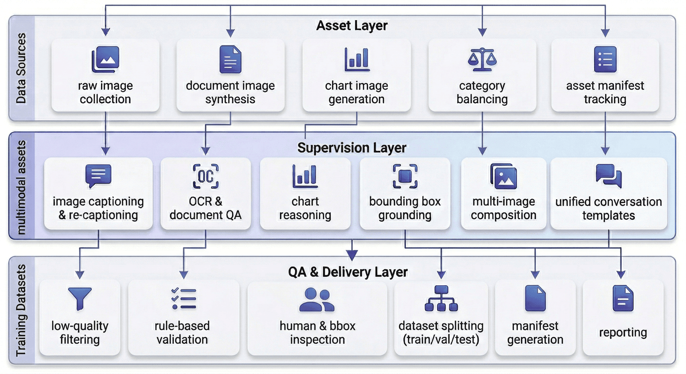
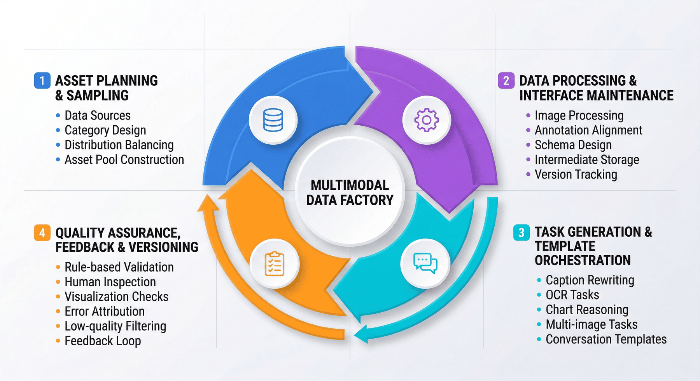
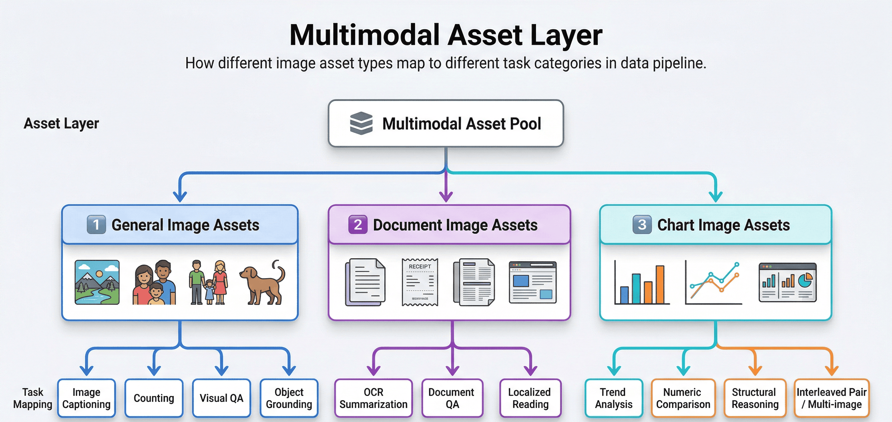
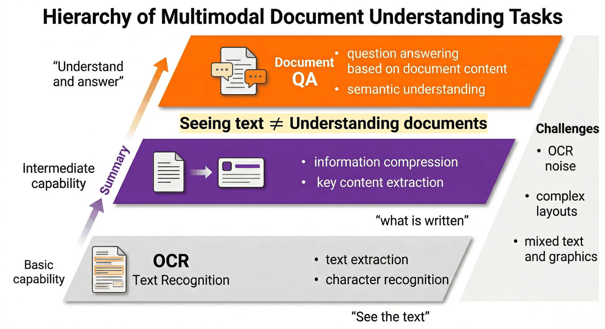
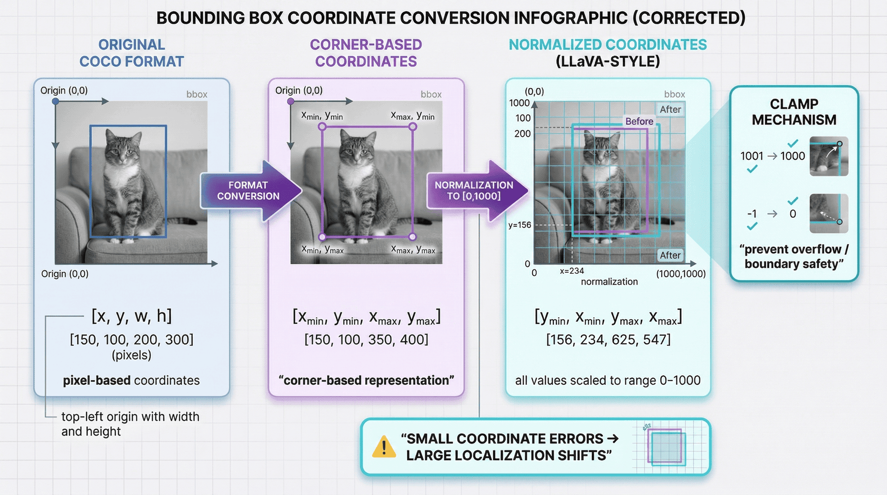
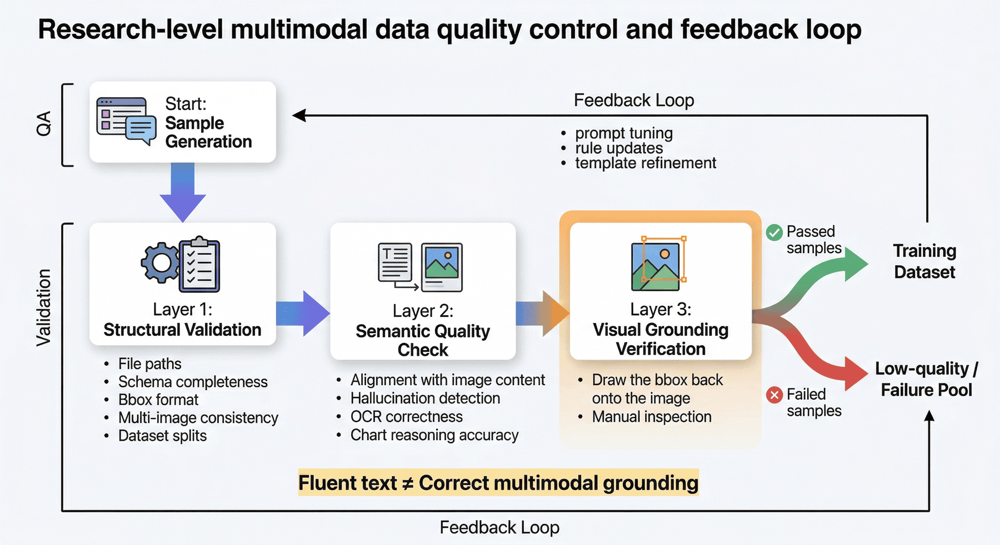
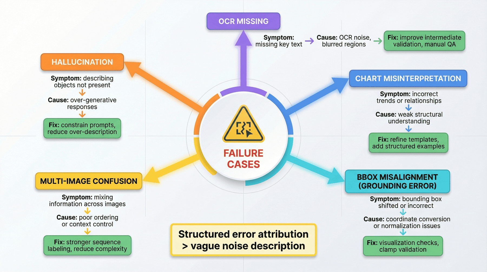
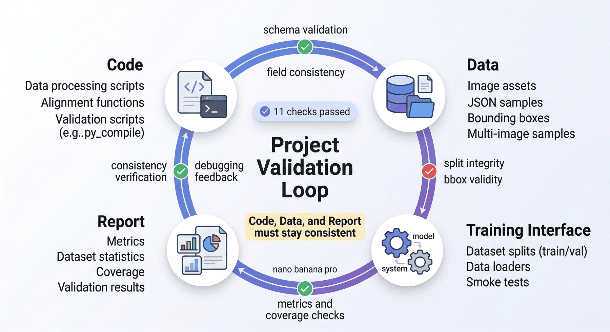

# Project 3: LLaVA Multimodal Instruction Data Factory

## Abstract
P03 focuses on processing images, region annotations, optical character recognition (OCR) information, and multi-image relationships into trainable, auditable, and packageable multimodal supervised data assets. The chapter emphasizes not single-image question answering, but the engineering transformation from multimodal assets to training samples.

This chapter can be understood along four main threads:

* Multimodal asset organization: managing raw images, derived documents, chart structures, and task labels.
* Instruction synthesis and region alignment: handling OCR, bounding boxes, object-level grounding, and multi-image relationships.
* Quality auditing and failure sample review: controlling supervision quality through visual spot-checks and error attribution.
* Training packaging and result verification: forming a unified training interface, split outputs, and inspection reports.

Reading in engineering order, this chapter corresponds to a complete pipeline:

**Raw image assets → derived document/chart assets → instruction synthesis → region alignment → multi-image interleaving → quality auditing → training packaging → reports and verification**

The core objective behind this structure is to build a multimodal data pipeline capable of supporting LLaVA-style model training.

---

## Keywords

LLaVA; multimodal instruction; image-text alignment; visual question answering; quality assessment

## Project Objectives and Reader Takeaways

This project uses the "LLaVA Multimodal Instruction Data Factory" as its central case study, with the goal of constructing multimodal training assets for image-text instructions, OCR, chart, and document understanding samples. Upon completing this chapter, readers should be able to identify the key data objects in this scenario, decompose the engineering pipeline, define acceptance criteria, and transfer the methods presented here to similar data engineering tasks.

## Scenario Constraints and Data Boundaries

The project is grounded in licensable images and controlled task templates, without attempting to cover all visual question answering types. These boundaries make the case study reproducible and auditable. When data scale, data sources, permission scope, or deployment environment change, the sampling strategy, quality thresholds, operational costs, and compliance requirements must be re-evaluated.

Within Part 14, this project demonstrates the classic engineering workflow for LLaVA-style multimodal instruction data (Liu et al. 2023): starting from image assets, captions, OCR, bounding boxes, and conversation templates to produce supervised samples that are trainable, spot-checkable, and replayable. It does not incorporate the capabilities of the newer instruction factory described in P13, which targets Qwen-VL, self-consistency, multilingual scaling, and large-scale automated filtering. Readers may treat P03 as the classic workflow baseline and P13 as an extended version built on stronger foundation models and more sophisticated quality mechanisms.

## Architectural Decisions

This project adopts an architectural path of "multimodal asset pool → image re-captioning → task templates → conversation generation → quality filtering → training packaging." This decision prioritizes well-defined input/output contracts, version traceability, anomaly localization, and result verifiability, rather than compressing all logic into a single one-shot script run.

## Sample Schema / Data Flow

The core data flow can be summarized as:

Listing P03-1 provides a workflow or path example illustrating the input/output relationships, structural constraints, or execution patterns in this section.
```text
Image/document/chart assets → caption and OCR cues → instruction templates → multi-turn conversation samples → quality checks → VLM instruction dataset
```

This excerpt transforms the above workflow into a checkable structured representation.

The sample schema should retain at minimum the fields `id`, `source`, `content_or_payload`, `metadata`, `quality_signals`, `split_or_stage`, and `audit_trace`; specific fields are further refined by the data types, downstream tasks, and acceptance methods of this project.

## Core Implementation Excerpts

The main text retains only the key implementation excerpts that illustrate design trade-offs. Complete scripts, lengthy configurations, execution logs, and large files should be placed in the companion repository or appendix; the code presentation focuses on input/output contracts, quality thresholds, error handling, and acceptance interfaces.

## Experiment or Acceptance Metrics

Acceptance metrics include image-text consistency, task type coverage, OCR evidence usability, conversation turn distribution, format pass rate, and manual sampling quality. If the project enters a production, course, or public reproducibility environment, version numbers, dependency environments, random seeds, sample spot-check results, and failure sample review records should also be documented.

| Acceptance Dimension | Metric / Evidence | Publication Review Criteria |
| --- | --- | --- |
| Task boundary | Coverage records for LLaVA-style conversation templates, image descriptions, OCR, chart reading, bbox grounding, and multi-image comparison | State that this project is the classic LLaVA workflow baseline and does not include Qwen-VL factory-scale extension capabilities in project conclusions |
| Image-text consistency | Visual spot-check samples, error sample attribution, image version and bbox replay records | Spot-checks must be traceable back to the original image, annotation boxes, OCR cues, and generated responses |
| Training delivery | train/val/smoke splits, manifest, schema checks, and project inspection report | Training records must be stably consumable by downstream scripts, and report figures must match artifact counts |
| Manual review | Sampling ratio, reviewer roles, failure sample handling status, and regeneration records | Grounding, OCR, and chart-type samples must not rely solely on automated rules for approval |

*Table P03-1: LLaVA Multimodal Instruction Data Factory Publication Acceptance Table*

## Cost, Risk, and Compliance Boundaries

Costs arise primarily from vision model calls, OCR, and manual review; risks concentrate on image copyright, hallucinated descriptions, sensitive visual content, and task distribution skew. When external data, personal information, copyrighted content, or third-party services are involved, source documentation, permission status, desensitization strategies, call logs, and manual review records should be retained.

## Common Failure Patterns

Common failures include input distribution drift, missing schema fields, quality thresholds that are too loose or too tight, insufficient evaluation sample coverage, unstable model calls, and non-traceable results. Diagnosis should start by locating data boundaries and intermediate artifacts, then proceed to check the model, toolchain, and deployment environment.

## Reproducibility Resource Notes

Reproducibility materials should include data source descriptions, minimal samples, configuration files, run commands, metric scripts, inspection reports, and artifact directories. The main text retains necessary excerpts; complete notebooks, long scripts, and large files are maintained separately as companion resources.

## 1. Project Background: The Necessity of a Multimodal Instruction Data Factory

General-purpose language models already demonstrate strong capability on pure-text question answering, but the moment they enter visual scenarios, data problems surface immediately.

The most common distortions can again be grouped into three categories.

The first is **visual factual distortion**. The model clearly sees two dogs but generates three; the image shows a dining table but the model says it is a desk; the region selected is the upper-left object, but the response describes the entire image. Once these errors enter the training set, the model learns "hallucinations" as knowledge.

The second is **task distortion**. Many teams only produce captions or general visual question answering (VQA), so the model learns to give coarse descriptions of whole images but cannot handle object-level grounding, document region reading, chart value comparison, or multi-image cross-reasoning. The problem is not too few samples — it is an incomplete task spectrum.

The third is **interface distortion**. Multimodal data has more fields and stronger dependencies: image paths, image types, task labels, OCR text, bounding boxes, conversation templates, training splits, and visual spot-check results must all be jointly consumable by downstream training and evaluation. As soon as the schema loses control, the data factory degrades into a collection of ad hoc scripts.

Therefore, the goal of P03 is not simply to "generate some LLaVA-format JSON," but to build a **LLaVA Multimodal Instruction Data Factory** that organizes image asset management, task construction, object-level alignment, quality auditing, and training delivery into a reusable engineering production line.

This production line serves not a one-time demonstration, but a methodology:

> When a team later needs to scale from COCO images to real documents, receipts, charts, web screenshots, multi-page PDFs, or video keyframes, what truly transfers is not a particular prompt but this methodology of "from multimodal assets to training supervision."

---

## 2. Project Objectives and Scope

### 2.1 Project Objectives

This project focuses on the following four objectives.

**Objective 1: Establish the transformation pipeline from multimodal assets to supervised samples.**
That is, convert raw images, annotation boxes, and derived visual assets into structured samples directly usable for visual instruction fine-tuning.

**Objective 2: Establish a task system oriented toward LLaVA-style training.**
This project does not unify all samples into "image + Q&A" but instead separates them into distinct task types: description, counting, OCR summarization, document QA, chart reading, region grounding, and multi-image comparison.

**Objective 3: Establish an auditable, reversible, and versioned quality assurance (QA) mechanism.**
Multimodal samples generated without spot-checking allow errors to enter the training set with high concealment. The project therefore builds quality rules, manual spot-checks, visual back-inspection, and low-quality sample flagging.

**Objective 4: Produce data assets directly consumable by the training side.**
The final output includes not only intermediate processing files but also the training set, validation set, smoke test, manifest, evaluation report, and project inspection results, ensuring the project transitions from "experiment scripts" to "formal deliverables."

### 2.2 Project Scope

To ensure sufficient reproducibility, this project explicitly defines several boundaries.

#### 1) Data Source Boundary

The current data is primarily based on a local COCO subset and its annotations (Lin et al. 2014), with document-style and chart-style images further derived from it. This is suitable for method demonstration, workflow explanation, and small-scale factory validation, but does not claim to cover the full breadth of real-world open-domain business images.

#### 2) Task Boundary

This project currently focuses on the following task types:

* Image description
* Counting / visual QA
* OCR summary / document QA
* Chart reading / chart comparison
* Region grounding
* Multi-image interleaved comparison

These tasks are sufficient to cover the main paths of "whole-image understanding — local grounding — image-text joint reasoning — cross-image inference," but do not yet extend to more complex tasks such as multi-page long documents, structured table extraction, web-level navigation, or temporal video QA.

#### 3) Supervision Method Boundary

This project relies primarily on **template-based generation + rule supplementation + heuristic review + manual spot-checking**, rather than large-scale purely manual sample authoring. It more closely resembles a small-scale data factory prototype than a large commercial annotation production line.

#### 4) Production Deployment Boundary

The current sample scale is small and the quality pass rate is high, largely due to the controlled data environment. It is suitable for demonstrating how a multimodal data factory should be designed, and should not be overstated as being sufficient to support production deployment in complex open-domain scenarios.

### 2.3 The Purpose of Scope Statements

In practical engineering case studies, there are typically only two common approaches:

* One frames the project as "capable of doing everything";
* The other frames the project as "capable of doing specific things reliably under specified preconditions."

The latter is clearly more credible and more reusable. This is especially true for multimodal projects, because once visual tasks deviate from their boundaries, it is easy to misrepresent controlled experiment results as general capabilities.

---

## 3. Project Positioning: P03's Place in the Capability Chain

If the entire book is viewed as a capability chain for large-model data engineering, then P03 occupies a central position in the "multimodal supervised data engineering" segment.

Previous chapters have covered text data cleaning, SFT data design, preference data, and training packaging methodologies. The value of this chapter lies in extending those methods to a more complex object: **images and their derived supervision signals**.

In other words, this chapter does not re-explain the principles of the LLaVA paper; instead, it demonstrates:

* Why image-type supervised data cannot simply reuse the text factory approach;
* Why multimodal task design must be stratified by image type and supervision granularity;
* Why quality control for visual samples requires visual back-inspection;
* Why object-level coordinate alignment and multi-image relationship construction are engineering essentials;
* How to incorporate the training interface, inspection scripts, and version evolution into the project from the very beginning.

In this sense, the most important aspect of this chapter is not "the model can see images," but rather answering a larger question:

> How should multimodal supervised data be designed as a continuous production capability, rather than a one-time sample assembly script?

---

## 4. Overall Architecture: The Data Pipeline from Multimodal Assets to Training Assets


*Figure P03-1: LLaVA Multimodal Instruction Data Factory Overview*

From an engineering perspective, this project can be decomposed into three layers.

### 4.1 Layer 1: Asset Processing Layer

This layer addresses the question of "whether clean, controllable, and structurally well-defined multimodal input assets exist." It mainly includes:

* Raw image collection
* Image category balancing
* Derived document image construction
* Derived chart image construction
* Asset manifest recording

The goal of this step is not to generate training samples directly, but to convert scattered visual materials into a trackable, stratified-sampling-ready asset pool.

### 4.2 Layer 2: Supervision Construction Layer

This layer addresses the question of "how to convert different types of visual assets into different types of supervised samples." It mainly includes:

* Image description and re-captioning
* OCR summarization and document QA
* Chart reading and comparison
* Bounding box alignment and grounding
* Multi-image interleaved sample generation
* Conversation template unification

This step is the core of the entire project, because it determines whether the model learns "coarse captioning capability" or "task-stratified multimodal understanding capability."

### 4.3 Layer 3: Quality Inspection and Delivery Layer

This layer addresses the question of "whether these samples can actually enter training." It mainly includes:

* Rule-based inspection
* Manual spot-checking
* Bounding box visualization verification
* Low-quality sample flagging
* train/val/smoke splitting
* Manifest generation
* Reports and project inspection

Only at this point does the project truly transition from a "sample generation experiment" to a "reusable data factory."

---

## 5. Engineering Prerequisites: The Key Responsibility Domains of a Multimodal Data Factory

In a minimal experiment, asset preparation, sample generation, quality checking, and training packaging can often be chained together by a single person; but when a project is ready to enter team reuse or subsequent scaling, a more robust approach is not to emphasize "who does what," but to first clearly define **which responsibility domains must be covered**.

In a multimodal data factory, at least four responsibility domains need to be explicitly defined.

### 5.1 Asset Planning and Sampling Strategy

This domain is responsible for defining where images come from, how they are categorized, what range they cover, and which samples should enter the first round of the asset pool. Its focus is not on individual samples but on whether the overall distribution is balanced and whether it already covers the three levels of general images, document images, and chart images.

### 5.2 Data Processing and Interface Maintenance

This domain is responsible for image processing, annotation alignment, schema design, intermediate artifact persistence, training splits, and inspection scripts. Its core objective is to ensure that data interfaces remain stable, fields remain consistent, and versions remain traceable — not to leave the workflow stuck at a set of ad hoc scripts.

### 5.3 Task Generation and Template Orchestration

This domain is responsible for caption rewriting, OCR sample construction, chart task orchestration, multi-image comparison templates, API calls, and post-processing. It connects "visual asset input" to "supervised sample output" and determines whether the project ultimately produces a single-caption dataset or a multimodal supervised set with a well-defined task spectrum.

### 5.4 Quality Inspection, Rollback, and Version Control

This domain is responsible for error type attribution, spot-check rules, visual review, rejection criteria, low-quality sample accumulation, and rework closure loops. In the multimodal context, this part is especially critical, because many problems can only be truly identified by returning to the images, annotation boxes, and multi-image ordering themselves.

### 5.5 The Purpose of Defining Key Responsibility Domains

Many teams encounter a real problem the first time they do multimodal SFT: it is not that "the model cannot generate," but that critical control points were never explicitly designed, leading to:

* Asset sources lacking boundaries;
* Task coverage lacking planning;
* Coordinates and image versions lacking validation;
* Failure samples lacking accumulation;
* Version evolution lacking a stable interface.

Therefore, writing out these responsibility domains clearly is essentially stating: **Multimodal SFT more closely resembles an engineering pipeline with visual quality inspection capability than a set of ad hoc sample assembly steps.**


*Figure P03-2: Multimodal Data Factory Responsibility Collaboration Diagram*

---

## 6. Asset Layer Design: Building the Multimodal Asset Pool

In general text SFT, many teams start directly from slicing existing text corpora; but multimodal projects are not well-suited to immediately "generating Q&A pairs for images." The reason is that images are not naturally structured knowledge units.

Therefore, this project first builds a relatively stable multimodal asset pool, divided into three categories:

* General image assets
* Document image assets
* Chart image assets

The value of this design is not merely to gather diverse samples, but to provide clear "input semantic boundaries" for subsequent task dispatch.

### 6.1 Why Split into Three Asset Categories

Because different images naturally support different tasks.

* General images are better suited for description, counting, object recognition, and local grounding;
* Document images are better suited for OCR summarization, document QA, and local reading;
* Chart images are better suited for trend summarization, value comparison, and structural interpretation.

Without splitting first, a large number of ill-matched samples would be mixed into the same prompt pool: for example, asking for OCR summarization from ordinary cat-and-dog photos, or asking for natural scene comparison from receipt screenshots. This confusion directly reduces the proportion of effective samples.

### 6.2 The Engineering Significance of Asset Balancing

The project ultimately produced **87 assets**, with each of the three categories containing **29 entries**, indicating that the asset layer was not collected haphazardly but was deliberately balanced. The benefits are:

* Downstream task dispatch can more easily control the distribution;
* Result analysis can more easily identify which task types are underperforming;
* Even in small-scale projects, a single image type can be prevented from dominating the training set.

### 6.3 Why Derived Document Images and Chart Images Matter

Many teams mistakenly assume "multimodal = natural photos." But in real-world business, document screenshots, reports, receipts, dashboards, charts, and web screenshots are often more important. Their difficulty lies not in object recognition but in mixed image-text and local structural understanding.

Therefore, this project does not remain at COCO natural images but further derives document-style and chart-style assets, using a small-scale project to expand the multimodal task spectrum. The task design for document QA and chart QA draws respectively from the question types in DocVQA (Mathew et al. 2021) and ChartQA (Masry et al. 2022); for stages involving image-text similarity or visual semantic retrieval, the image-text alignment ideas of CLIP (Radford et al. 2021) are referenced.


*Figure P03-3: Multimodal Asset Layering Diagram*

Table P03-2 summarizes the relationship between different asset types and their task mappings.

| Asset Type | Typical Source | Compatible Tasks | Primary Risks |
| --- | --- | --- | --- |
| `general_image` | COCO natural images, general scene photographs | Image description, counting, visual QA, local grounding | Hallucinated descriptions, missed objects, category confusion |
| `document_image` | Document screenshots, receipts, policy pages, scanned documents | OCR summary, document QA, local reading | Missed text, layout misinterpretation, local region misalignment |
| `chart_image` | Bar charts, line charts, report screenshots, dashboards | Chart reading, trend summarization, value comparison | Trend reversal, category relationship errors, missed values |
| `interleaved_pair` | Multi-image pairs, cross-page samples, comparative screenshots | Multi-image comparison, shared feature summarization, difference identification | Order confusion, cross-image interference, pairing imbalance |

*Table P03-2: Asset Types and Primary Risks Reference Table*

---

## 7. Data Schema: Structuring Multimodal Seeds

After completing asset collection, the project does not send images directly to a generative model; instead, assets, annotations, and task fields are first unified into a schema.

### 7.1 The Importance of Schema in Multimodal Scenarios

In text data, two columns — `instruction` and `output` — are often sufficient to validate a basic experiment; but multimodal scenarios are different, requiring at minimum the additional handling of:

* Image file paths
* Image types
* Original width and height
* Annotation boxes
* OCR text
* Derived task types
* Conversation templates
* Sample provenance and version

Without a unified schema, adding each new task type requires rewriting the logic from scratch, and the project quickly devolves into multiple coexisting ad hoc formats.

### 7.2 What a More Robust Minimal Schema Should Include

The seeds and training samples in this project should include at least the following fields:

* `id`: unique sample identifier
* `image`: image path or image list
* `asset_type`: `general_image` / `document_image` / `chart_image` / `interleaved_pair`
* `task_type`: task type label
* `source_id`: source asset identifier
* `bbox`: coordinates for region grounding tasks
* `ocr_text`: OCR or readable text summary
* `conversations`: LLaVA conversation format body
* `split`: train / val / smoke
* `meta`: version, generation method, review status, and other metadata

### 7.3 The Engineering Value of Schema

The significance of the schema is not merely a field checklist; it aligns three phases:

* The generation phase knows what to write;
* The QA phase knows what to check;
* The training phase knows what to read.

This transforms the project from "one JSON file and done" into an interface layer that can evolve over the long term.

---

## 8. Image Sampling and Re-captioning: The Necessity of Supervised Rewriting

Many existing image datasets come with captions, but multimodal SFT cannot simply use them for training directly, for three reasons.

First, original captions tend to be short and purely descriptive, failing to cover tasks such as Q&A, counting, explanation, and comparison.
Second, original captions are stylistically inconsistent and may not conform to the LLaVA conversational data format.
Third, original captions mostly describe the whole image and cannot support object-level or image-text hybrid capabilities.

Therefore, this project first "re-captions" images before converting them into task-based supervision.

### 8.1 What Problem Re-captioning Solves Here

Re-captioning is not just about making a caption longer; it is about organizing the explicit information in the image that may be useful for training, such as:

* What is the main subject of the scene;
* What salient objects are present;
* Whether there is readable text;
* Whether it is suitable for counting;
* Whether it is suitable for comparison or grounding.

Re-captioning serves as the transition layer from "image material" to "task seed."

### 8.2 The Role of Template-Based Generation

Fully open-ended generation is naturally more flexible, but in a small-scale factory it is also more prone to losing control. Especially in multimodal scenarios, models tend to:

* Write objects into the description that do not exist in the image;
* Over-assert uncertain information;
* Generate stylistically inconsistent responses for similar images.

Therefore, this project emphasizes template-based prompts and controlled generation, ensuring samples first achieve uniformity before gradually increasing complexity in subsequent stages.

### 8.3 The Approach of Task-Based Rewriting

From a single image, re-captioning can derive multiple training samples, for example:

* Description: Summarize the main scene of this image;
* Counting: Approximately how many salient subjects are in the image;
* Recognition: What is the most prominent object on the left side;
* Inference: Does this look more like an indoor or outdoor scene, and why;
* OCR: Please read and summarize the text in the image;
* Comparison: What are the main similarities and differences between these two images.

This is also the fundamental difference between a multimodal data factory and a "single-caption dataset": the former constructs a task distribution; the latter only provides material descriptions.

---

## 9. Document Images and OCR Tasks: The Document Understanding Pipeline

Document images are one of the most underestimated asset types in multimodal scenarios. Many models appear capable of reading text, but once they enter document QA or long-form summarization, their shortcomings become apparent.

### 9.1 The Role of OCR Tasks in This Project

This project splits document image tasks into two levels:

* **OCR summary**: reading the text in the image and producing a condensed summary;
* **Document QA**: answering specific questions based on the text in the image.

These two are not equivalent. The former is more like "what was read," while the latter is more like "what was understood and what can be answered."

### 9.2 Why OCR Results Cannot Be Inserted Raw into the Training Set

Because OCR itself introduces noise, especially under complex layouts, local blur, small fonts, or mixed image-text arrangements. If OCR output is treated as ground truth as-is, visual recognition errors can easily be written into the supervision signal.

Therefore, the more appropriate approach in this project is:

1. First extract the text in the image as an intermediate-layer representation;
2. Then use templates to control summarization and QA tasks;
3. Finally, use manual spot-checks and low-quality flagging to block obvious errors.

### 9.3 Why Document Images Are a Critical Step Toward Real-World Applications

Because in real-world multimodal tasks, many inputs are not natural photographs but screenshots, scanned documents, reports, work orders, receipts, and policy documents. Training only on natural images makes it difficult to support these scenarios.

Therefore, the significance of document image tasks in this project extends beyond expanding the sample pool — it pushes the factory from "describing what's in a picture" toward "joint image-text understanding."


*Figure P03-4: Document Image Task Layering Diagram*

---

## 10. Chart Image Tasks: The Chart Reading Task Layer

The biggest difference between chart images and natural photographs is that charts are not about "what is seen" but about "what is structurally expressed."

### 10.1 Why Chart Tasks Require a Separate Category

The difficulty of chart reading lies in its simultaneous involvement of:

* Title and legend recognition
* Axis label comprehension
* Numerical relationship summarization
* Trend judgment and comparison

If chart images are treated as ordinary pictures and captioned generically, the model will most likely only learn "this is a bar chart" or "there are several lines in the chart," without acquiring genuinely useful chart understanding.

### 10.2 Chart Task Decomposition in This Project

The project should support at minimum the following two types:

* **Chart reading**: describing chart structure, main trends, and salient information;
* **Chart comparison**: comparing differences between different categories, intervals, or curves.

This moves the training set beyond visual recognition and toward multimodal analysis capability.

### 10.3 Why Chart Samples Are Well-Suited for Failure Attribution

Because errors in chart tasks are typically easier to categorize:

* Misreading an axis label
* Ignoring units
* Describing a relative change as absolute
* Reversing a comparative relationship
* Fabricating a trend that does not exist

These errors are well-suited for inclusion in the failure sample library, which in turn guides prompt adjustments and QA rule design.

---

## 11. Region Grounding and Coordinate Alignment: The Geometric Constraints of Grounding

In multimodal training, grounding is the task type most easily misled by "close enough" thinking.

This is because once a bounding box deviates, the text may still read smoothly, but the supervision the model has learned is already incorrect. Especially in object-level tasks, a 1% coordinate offset may seem small, but when projected onto the actual image it may have shifted to a different object entirely.

### 11.1 Why Input Coordinates and Training Coordinates Are Inconsistent

The original COCO annotations use absolute pixel coordinates `[x, y, w, h]`. Many LLaVA-style or downstream alignment implementations prefer the normalized `[ymin, xmin, ymax, xmax]` representation with coordinates mapped to the `[0, 1000]` range.

This means the project must perform two layers of conversion:

* **Format conversion**: from top-left corner width-height format to top-bottom-left-right boundary format;
* **Scale normalization**: mapping pixel values to the standard interval.

### 11.2 Why Clamping Is Also Necessary

Even when the theoretical formula is correct, floating-point-to-integer conversion can still produce boundary overflow. For example, bounding boxes at the rightmost or bottommost edge of an image may yield `1001` or `-1` after rounding. Without clamping, training scripts are likely to throw errors directly or fail silently during parsing.

Therefore, building safe truncation into the alignment function essentially completes the mathematical logic into proper engineering logic.

### 11.3 Why Grounding Samples Should Not Be Generated Indefinitely

A common misconception is: since there are many bounding boxes, generate as many Q&A pairs as possible for each image. While this increases sample count, it also introduces distribution imbalance: images with many objects get overrepresented.

Therefore, the project uses a controlled strategy similar to `selected_anns = anns[:3]`, selecting only a subset of objects to construct Q&A and grounding samples. The point of this approach is not to save compute but to prevent training sets from being dominated by high-density target images.

### 11.4 Coordinate Alignment Implementation

Listing P03-2 provides a Python implementation excerpt illustrating the input/output relationships, structural constraints, and execution patterns in this section.
```python
# Core code excerpt from alignment.py
# Input is COCO-style bbox: [x, y, w, h]
def convert_bbox(bbox, width, height):
    x, y, w, h = bbox

    xmin = int((x / width) * 1000)
    ymin = int((y / height) * 1000)
    xmax = int(((x + w) / width) * 1000)
    ymax = int(((y + h) / height) * 1000)

    return [
        max(0, min(1000, ymin)),
        max(0, min(1000, xmin)),
        max(0, min(1000, ymax)),
        max(0, min(1000, xmax)),
    ]
```

This excerpt transforms the above workflow into a checkable structured representation.

### 11.5 The True Engineering Significance of This Step

The importance of bounding box alignment lies not merely in "knowing how to write a conversion function" but in the key principle it embodies:

> In multimodal data engineering, any step that "looks like just a format change" may in fact determine whether the supervision ground truth remains valid.


*Figure P03-5: Bounding Box Coordinate Conversion and Normalization Diagram*

---

## 12. Multi-Image Interleaved Samples: Constructing Comparison Tasks

Single-image supervision can teach a model to describe what it sees, but many real multimodal tasks go further than that. Users frequently ask:

* Compare the differences between two images;
* Determine which image better satisfies a certain condition;
* Extract common points across multiple images;
* Complete a comparative analysis within a multi-page input.

Therefore, this project specifically builds multi-image interleaved samples.

### 12.1 The Value of Multi-Image Tasks in This Project

The key to multi-image samples is not simply putting two images into the same prompt, but training the model to develop:

* **Sequential awareness**: knowing what the first and second images each contain;
* **Comparative awareness**: finding similarities and differences;
* **Aggregation awareness**: forming higher-level summaries based on multiple images.

This moves the model from a "single-image describer" toward a "cross-image reasoner."

### 12.2 Why Payload Construction Is an Engineering Challenge

In multi-image conversation generation, local images typically need to be encoded first and then organized into a message list according to the target API's requirements. Common problems here include:

* Disordered image sequences;
* Inconsistent Base64 data formats;
* Single-image interface logic that cannot be directly reused for multiple images;
* Request bodies too large to call successfully.

Therefore, the Base64 encoding and `image_url` list construction in `interleaved.py`, while appearing to be technical details, actually determine whether multi-image samples can be generated reliably.

### 12.3 Multi-Image Interleaving Implementation

Listing P03-3 provides a Python implementation excerpt illustrating the input/output relationships, structural constraints, and execution patterns in this section.
```python
import base64

def encode_image(path):
    with open(path, "rb") as f:
        return base64.b64encode(f.read()).decode("utf-8")

def generate_comparison(img1_path, img2_path):
    prompt = "Here are two images. Please compare their similarities and differences."

    messages = [
        {
            "role": "user",
            "content": [
                {"type": "text", "text": prompt},
                {"type": "image_url", "image_url": {"url": f"data:image/jpeg;base64,{encode_image(img1_path)}"}},
                {"type": "image_url", "image_url": {"url": f"data:image/jpeg;base64,{encode_image(img2_path)}"}},
            ],
        }
    ]
    return messages
```

This excerpt transforms the above workflow into a checkable structured representation.

### 12.4 Why the Number of Interleaved Samples Is Usually Small

Multi-image sample generation has higher cost, greater inspection difficulty, and more complex error impact. Therefore, in a small-scale factory, the more sensible strategy is not to pursue large volumes from the outset, but to first produce a small number of high-value samples and verify that the schema, templates, call pipeline, and QA mechanisms are sound.

---

## 13. LLaVA Conversation Templates: Training Interface Format

Many introductory projects conceptualize multimodal samples as "image path + a piece of text." But for LLaVA-style training, what truly matters is:

* How images are referenced;
* How user and assistant turns are organized;
* How task labels work with templates;
* Whether the format is compatible with downstream training code.

### 13.1 What Problem Conversation Templates Solve

The value of conversation templates is that they unify different tasks into the same training interface. For example:

* User makes a description request;
* Assistant provides the description;
* User makes a local grounding request;
* Assistant returns coordinates and explanation.

This allows different task types, despite differing semantically, to share the same training consumption pattern.

### 13.2 Why Controlling the Number of Templates Matters

More templates superficially appear to yield richer samples; but in small-scale projects, too many templates tend to cause:

* Tone drift
* Inconsistent output style
* Increased QA difficulty
* Some templates not matching image types

Therefore, the more sensible approach is to first establish a small number of stable templates, then gradually expand the style variation.

### 13.3 LLaVA Format Example

Listing P03-4 provides a JSON data structure example illustrating the input/output relationships, structural constraints, and execution patterns in this section.
```json
{
  "id": "p03_000128",
  "image": "images/sample_128.jpg",
  "task_type": "region_grounding",
  "conversations": [
    {"from": "human", "value": "<image> Please indicate the approximate location of the dog on the left side of the image."},
    {"from": "gpt", "value": "It is approximately located at [214, 103, 588, 472]."}
  ]
}
```

This excerpt transforms the above workflow into a checkable structured representation.

The focus of this format is not the field structure itself, but ensuring that both training and inspection scripts can consume it reliably.

---

## 14. Quality Control: The Structure of Multimodal QA

If a text sample is written fluently, it is often at least "linguistically normal"; but multimodal samples are different — linguistically normal text does not imply visually accurate facts.

Therefore, multimodal QA must perform at minimum three types of checks.

### 14.1 Type 1: Structural Consistency Checks

Primarily checking:

* Whether image paths exist;
* Whether conversations are complete;
* Whether bounding box format is correct;
* Whether multi-image samples actually contain multiple images;
* Whether training splits contain conflicts.

This layer is more oriented toward engineering completeness.

### 14.2 Type 2: Semantic Quality Checks

Primarily checking:

* Whether responses are consistent with image content;
* Whether descriptions contain obvious hallucinations;
* Whether OCR summaries miss key text;
* Whether chart Q&A misreads trends;
* Whether comparison tasks confuse the two images.

This layer is more oriented toward content accuracy.

### 14.3 Type 3: Visual Back-Inspection

For grounding tasks, text-level checking is far from sufficient; coordinates must be drawn back onto the image. If the box drawn on the image is incorrect, the sample should be rejected regardless of how fluent the text is.

This is why the project specifically generates bounding box visualization files and conducts manual spot-checks. Visual alignment problems can only be truly identified by returning to the image.

### 14.4 Why Maintaining a Low-Quality Sample Library Is Important

Many teams retain only "passing" samples without systematically recording "failing" samples. While convenient, this discards a highly valuable engineering signal.

In multimodal projects, the low-quality sample library provides at least three benefits:

* Inversely guides prompt adjustments;
* Helps classify common error types;
* Provides an empirical foundation for subsequent training safety filtering.


*Figure P03-6: Sample Quality Inspection and Rollback Closure Loop Diagram*

---

## 15. Visual Verification: Bounding Box Back-Rendering

In this project, `visualize_bbox.py` exemplifies a highly representative point. It demonstrates that a multimodal data factory cannot only perform JSON-level inspection but must possess "back-rendering" capability.

### 15.1 What Problem Back-Rendering Solves Here

It addresses a simple but critical question:

> Do the coordinates the model sees during training actually correspond to the object we intended?

Only by restoring normalized coordinates back to the original pixel space and drawing the box on the image can we truly confirm that the annotation remains valid.

### 15.2 What Typical Errors Look Like

* ymin/xmin order swapped;
* Width-height conversion boundary errors;
* Selecting the wrong object from multiple boxes;
* Misreading image dimensions;
* Images from different preprocessing stages not being the same version.

These errors are often difficult to spot in surface-level JSON but are immediately exposed upon visualization.

### 15.3 The Engineering Value of This Step

The most important point to emphasize here is:

**Multimodal QA is not an optional add-on — it is part of the data ground truth itself.**

Without visual verification, whether bounding box samples are correct is genuinely uncertain.

---

## 16. Training Packaging: Final Organization of the Training Interface

Many projects hand a single training file to downstream after completing sample generation, which is engineering-incomplete. Before training, at least three things must be clarified:

* How data is split;
* Whether a rapid smoke test is supported;
* Whether there is a manifest documenting the artifact state.

### 16.1 Three-Layer Delivery: train / val / smoke

The final output of this project should include:

* `train.jsonl`: the official training set
* `val.jsonl`: the validation set
* `smoke_test.jsonl`: a rapid connectivity check set
* `training_manifest.json`: training interface metadata

`smoke_test.jsonl` is especially important. It does not aim for representativeness but aims to quickly expose problems such as missing fields, incorrect image paths, and template anomalies.

### 16.2 Why the Manifest Matters

The significance of the manifest is that it transforms the dataset from "several JSONL files" into "a formal artifact that can be read and inspected by systems."

It should record at minimum:

* Total sample count
* Count per split
* Count per task type
* Count per asset type
* File paths
* Generation version
* Overlap check results

This makes subsequent training, evaluation, and version updates more stable.

### 16.3 What Training Packaging Fundamentally Does

It fundamentally answers:

> These samples are not only human-readable — are they also stably consumable by systems?

Only when the answer is affirmative can a project be called a data factory rather than a data assembly exercise.

---

## 17. Project Metrics: The Meaning of Current Output Metrics

Current results show that P03 has several critical metrics:

* Total assets: **87**
* Three asset categories: **29** each
* Basic instructions: **174**
* Alignment samples: **79**
* Interleaved samples: **14**
* Final training records: **267**
* QA visualization samples: **29**
* Quality pass rate: **100%**
* Project checks: **11 / 11 PASS**

### 17.1 Why "87 Assets → 267 Training Records" Is Meaningful

Because it demonstrates that the project does not linearly copy raw images but converts each asset into multiple supervised samples through task derivation. In other words, what was truly built is "task dispatch capability," not simple material stacking.

### 17.2 What the Asset Type Distribution Indicates

The report shows that the asset type distribution of the final training set is not a simple equal-thirds split, but:

* `general_image = 137`
* `document_image = 58`
* `chart_image = 58`
* `interleaved_pair = 14`

This indicates:

* General images carry more basic description and grounding tasks;
* Document and chart images carry more specialized tasks;
* Multi-image samples were deliberately kept small, consistent with their high cost and high complexity characteristics.

Table P03-3 summarizes the relationships among task types, coverage capability, and engineering value.

| Task Type | Primary Input | Primary Output | Coverage Capability | Engineering Value |
| --- | --- | --- | --- | --- |
| `image_description` | General images | Scene description | Whole-image understanding | Builds visual subject and scene expression capability |
| `counting_visual_qa` | General images | Count or Q&A | Object recognition | Builds salient subject recognition and quantity judgment |
| `ocr_summary` | Document images | Text summary | Image-text joint | Builds the transition from "seeing text" to "reading text" |
| `document_qa` | Document images | Question answering | Local reading | Builds region understanding and conditional extraction capability |
| `chart_reading` | Chart images | Trend summary | Structural reading | Builds numerical relationship and structured interpretation capability |
| `region_grounding` | Images + bounding boxes | Coordinate answers | Object alignment | Builds region-level supervision and grounding capability |
| `multi_image_comparison` | Multi-image input | Comparative summary | Cross-image reasoning | Builds sequential awareness, difference identification, and information aggregation capability |

*Table P03-3: Task Types and Engineering Value Reference Table*

### 17.3 Why a 100% Pass Rate Should Not Be Over-interpreted

These numbers look impressive, but a more reasonable interpretation is: the project conducted a small-scale, highly constrained data factory validation in a controlled environment, making quality easier to maintain.

This is not a problem — it precisely demonstrates that validating the method in a small controlled scope is the prerequisite for subsequent scaling.

However, it also means that these results cannot be directly extrapolated to open-domain image scenarios.

### 17.4 Why 11/11 PASS Matters

Passing all project checks means that a basic consistency has been established among the code, artifacts, reports, and training interface. This type of information is more compelling than "the model output looks usable," because it directly reflects engineering closure.

---

## 18. Cost Analysis: The Balance Between Throughput and Review

Current results reveal two representative cost figures:

* External caption cost estimate: approximately **$1.3**
* Manual review cost: approximately **267 CNY**

These figures are modest, but they already reflect the cost structure of a small-scale factory.

Table P03-4 summarizes the current project's costs, time investment, and manual effort.

| Item | Current Result | Notes |
| --- | ---: | --- |
| Total assets | 87 | Three asset categories, balanced at 29 each |
| Training records | 267 | Total training volume after multi-task derivation |
| QA visualization samples | 29 | Supports bounding box back-inspection |
| Quality pass rate | 100% | Small-scale result from a controlled environment |
| External caption cost | $1.3 | Model cost for small-batch generation |
| Manual review cost | 267 CNY | Demonstrates that multimodal QA is not a free step |
| Project checks | 11 / 11 PASS | Code, data, and report closure established |

*Table P03-4: Project Items and Notes Reference Table*

### 18.1 Why Manual Review Cost Deserves Separate Attention

Because in multimodal scenarios, manual QA is not an optional final step but the key source of the entire project's credibility. Especially for grounding, OCR, and chart-type tasks, the risk increases significantly without any manual spot-checking.

### 18.2 Why Caption Cost Does Not Equal Total Cost

Many teams, when budgeting for multimodal data, calculate only model API costs while overlooking:

* Derived asset preparation costs
* Failure retry costs
* Visualization inspection costs
* Manual review costs
* Rollback and revision costs

This leads to severely over-optimistic budget estimates. One of P03's contributions is to demonstrate: **The bottleneck in a multimodal data factory is often not generation itself, but the review and feedback loop.**

### 18.3 What Cost Optimization Should Prioritize at This Stage

At this stage, what is more worth optimizing is often not saving a few cents per API call, but rather:

* Which samples warrant manual review;
* Which tasks can have obvious errors blocked by rules first;
* Which complex tasks should have their volume controlled while increasing per-sample value;
* Which intermediate artifacts should be retained to avoid redundant generation.

---

## 19. Failure Samples and Limitations: Risk Areas in the Current Factory

Multimodal projects especially need to separate out limitations and failure patterns, because smooth operation during a small-scale demonstration phase does not equate to engineering stability.

### 19.1 The Most Obvious Current Limitations

First, **the asset scale remains small**. 87 assets are sufficient to explain the methodology but not sufficient to support broad generalization claims.
Second, **document and chart images are still primarily derived assets**, still distant from real business documents, receipts, and complex dashboards.
Third, **the multi-image sample volume is small**, functioning more as a capability verification than adequate training coverage.
Fourth, **the quality pass rate comes from a controlled environment** and should not be mischaracterized as "naturally stable in open-domain scenarios."

### 19.2 How Typical Failure Samples Can Be Categorized

These failure samples can be classified into at least the following types:

* Visual hallucination: objects not present in the image are described;
* OCR omission: key text is not mentioned;
* Chart misinterpretation: trend or category relationships are read incorrectly;
* Grounding offset: coordinates shift to an adjacent target;
* Multi-image confusion: information from the first and second images is conflated.


*Figure P03-7: Failure Sample Attribution Diagram*

Table P03-5 summarizes typical failure sample types and priority repair directions.

| Failure Type | Typical Manifestation | Most Likely Source | Priority Repair Direction |
| --- | --- | --- | --- |
| Visual hallucination | Response describes objects or relationships not present in the image | Open-ended generation over-diverging, re-captioning too expansive | Tighten prompt, add constraints on salient objects |
| OCR omission | Document summary misses key fields or conditions | Noise in OCR intermediate layer, locally unclear regions | Strengthen intermediate-layer validation, increase spot-check density |
| Chart misinterpretation | Trend, category, or value relationships read in reverse | Unstable chart task templates, insufficient structural understanding | Tighten chart templates, add structural examples |
| Grounding offset | Coordinates fall on adjacent target or box exceeds boundary | Bounding box conversion, normalization, or image version inconsistency | Back-render boxes for verification, check dimensions and clamping |
| Multi-image confusion | Information from two images conflated into a single conclusion | Insufficient sequence control, unstable payload organization | Strengthen sequence identification, control multi-image sample complexity |

*Table P03-5: Failure Types and Priority Repair Directions Reference Table*

After aggregating these failure samples into a "failure attribution table," it can directly support the next round of template tightening, QA revision, and spot-check strategy adjustment.

### 19.3 Why Failure Attribution Needs to Be Refined to Error Types

Because "noisy" is too vague to guide the next iteration. Only by specifying error types can the following truly be supported:

* Prompt adjustments
* Template tightening
* QA rule improvements
* Task boundary redefinition

---

## 20. Project Inspection: The Consistency Verification Closure Loop

P03 currently has **11 inspection items**, all of which pass.

### 20.1 Why Project Inspection Is Necessary

If a multimodal data project has only images and JSON files with no inspection mechanism, it is actually unclear whether it is correct. Because errors can come from many places:

* Files exist but fields are wrong;
* Multi-image sample format is correct but contains only one image;
* Bounding boxes have values but fall outside valid range;
* train/val splits have data leakage;
* Report figures and training file counts are inconsistent.

### 20.2 What the Current Project Inspection Covers

Current inspection covers:

* Command-level checks: `py_compile`, `evaluate_factory`
* Data/artifact-level checks: required files exist, asset type coverage, alignment samples contain bounding boxes, multi-image samples are confirmed to contain multiple images, train/val have no overlap, smoke test covers multiple task types, etc.

### 20.3 Why This Step Represents Engineering Completeness

Because it means the project is not "looks about right to the eye" but has established a consistency closure loop among code, data, training interface, and reports.

From the perspective of engineering reuse, this type of closure information often has more transfer value than individual examples.


*Figure P03-8: Project Validation Closure Loop Diagram*

---

## 21. Correspondence with Project 2: A Consistent Methodological Framework Across Projects

Although P02 is a legal text factory and P03 is a multimodal factory, the two have strong methodological correspondence in data engineering.

### 21.1 Correspondence 1: Both Emphasize a "Seed Layer"

P02 first builds regulatory seed texts; P03 first builds a multimodal asset pool. In essence, neither directly generates supervision but first constructs a reliable input layer.

### 21.2 Correspondence 2: Both Emphasize Task Decomposition

P02 splits legal tasks into legal QA, statute interpretation, and case analysis; P03 splits multimodal tasks into description, OCR, chart reading, grounding, and multi-image comparison. Both demonstrate:

> A good data factory's core is not producing more samples, but manufacturing different capabilities separately.

### 21.3 Correspondence 3: Both Emphasize Up-Front QA

P02 focuses on review protocols and risk rejection; P03 focuses on visual back-inspection and a failure sample library. Although the specific forms differ, both emphasize: **Quality control must be integrated into the production line, not deferred until after training.**

### 21.4 Correspondence 4: Both Emphasize the Training Delivery Layer

Neither chapter stops at "sample generation complete" but continues to training splits, manifests, reports, inspection scripts, and deliverables.

Looking at the overall structure, P03 and P02 maintain a similar engineering development sequence:

* First explain the why;
* Then the boundaries;
* Then the layered architecture;
* Then the step-by-step process;
* Finally results, cost, limitations, and transfer lessons.

---

## 22. Future Extensions: Moving Toward More Realistic Multimodal Agent Scenarios

The value of P03 lies not in having built a very large multimodal dataset, but in having constructed an extensible minimal factory.

The next steps for continued expansion can prioritize the following directions.

### 22.1 From Single Images to Multi-Page Documents

Extending document images from single-page screenshots to multi-page PDFs, long screenshots, and combinations of forms and receipts would further test long-context image-text understanding capability.

### 22.2 From Static Charts to Complex Structural Diagrams

Extending current chart tasks to real BI panels, composite charts, dashboards, and multi-chart interactions would come closer to enterprise analytics scenarios.

### 22.3 From Multi-Image Comparison to Task-Oriented Agent Input

For example, combining web screenshots, table screenshots, documentation, and user interface screenshots into the same sample, allowing the model to learn "read image — compare — generate action recommendation" capabilities closer to Agent-style tasks.

### 22.4 From Controlled QA to a Semi-Automated Review Panel

As sample scale grows, pure manual spot-checking quickly becomes a bottleneck. The more sensible next step is to build a more systematic multimodal quality inspection panel, error label taxonomy, and stratified sampling strategy.

---

## 23. Main Deliverables Checklist

### 23.1 Intermediate Data Artifacts

* `data/processed/asset_manifest.jsonl`
* `data/processed/asset_collection_summary.json`
* `data/processed/llava_instruct.jsonl`
* `data/processed/llava_alignment.jsonl`
* `data/processed/llava_interleaved.jsonl`
* `data/processed/quality_audit.jsonl`
* `data/processed/low_quality_flags.jsonl`
* `data/processed/manual_review_samples.jsonl`
* `data/processed/qa_visual_audit.jsonl`

### 23.2 Training Data Artifacts

* `data/training/final_llava_dataset.jsonl`
* `data/training/train.jsonl`
* `data/training/val.jsonl`
* `data/training/smoke_test.jsonl`
* `data/training/training_manifest.json`

### 23.3 Reports and Inspection Artifacts

* `data/reports/p3_metrics.json`
* `data/reports/p3_report.md`
* `data/reports/p3_test_results.json`
* `data/reports/p3_test_report.md`

Table P03-6 summarizes the categories and roles of this project's deliverables.

| Category | Representative Files | Role |
| --- | --- | --- |
| Assets and intermediate layer | `asset_manifest.jsonl`, `llava_alignment.jsonl`, `llava_interleaved.jsonl` | Records asset provenance, task derivation, and intermediate sample state |
| Quality inspection and review layer | `quality_audit.jsonl`, `low_quality_flags.jsonl`, `qa_visual_audit.jsonl` | Accumulates rule check results, low-quality samples, and visual review outcomes |
| Training delivery layer | `final_llava_dataset.jsonl`, `train.jsonl`, `val.jsonl`, `smoke_test.jsonl`, `training_manifest.json` | Provides entry points for training, validation, and connectivity checks |
| Reports and verification layer | `p3_metrics.json`, `p3_report.md`, `p3_test_results.json`, `p3_test_report.md` | Records metrics, conclusions, and project-level inspection results |

*Table P03-6: Categories and Roles Reference Table*

---

## 24. Conclusion

For multimodal training, the genuinely difficult part is often not "letting the model see images" but **making images, text, regions, and task relationships collectively become credible supervised data**.

The value of P03 as a case study lies not in the scale of samples already produced, but in condensing the most critical problems in multimodal data engineering into a small, reproducible pipeline:

* Build the asset layer first, rather than generating directly;
* Then split supervision by task spectrum, rather than only producing captions;
* Apply strict alignment to grounding, rather than converting coordinates arbitrarily;
* Perform visual spot-checks on samples, rather than only checking text fluency;
* Finally deliver training splits, manifests, reports, and an inspection closure loop, rather than leaving behind a single JSON file.

The most important insight from this case study is:

> A multimodal data factory is not about having more images; it is about designing the four layers — assets, tasks, quality, and delivery — together as an integrated system.

Only when these layers are designed together and connected into a closure loop does a multimodal project truly transform from a demonstration example into a scalable engineering system.

---

## Special Topic: Spot-Checking and Error Replay for Multimodal Annotations

LLaVA-style data factories have another critically important part that is often described too lightly: spot-checking and error replay. This is because errors in multimodal samples often do not manifest in a single piece of text but in the misalignment of images, boxes, text, and task relationships. Without a stable spot-checking and replay mechanism, teams easily lose their intuition for quality even as sample volume grows.

### 1. Spot-Checks Should Prioritize "Are the Relationships Correct"

Unlike pure text data, the most important thing to check first in multimodal samples is not whether sentences are fluent, but whether relationships hold. For example:

* Does the selected region actually correspond to the described object;
* Does the Q&A genuinely depend on that image, rather than being answerable from common knowledge alone;
* Does the multi-image comparison task actually compare information from different images;
* Does the image-text order in interleaved samples support the current task.

Once these relationships are misaligned, even if the text itself reads smoothly, the sample becomes a low-value supervision signal.

### 2. Error Replay Should Become a Standing Asset of the Data Factory

Projects like P03 are especially well-suited to distilling high-frequency errors into a replay set. For example:

* Box coordinates mapped correctly but the semantic object is wrong;
* Chart reading captured the title but missed the key trend;
* Multi-image samples where the model was misled by similar backgrounds;
* Document screenshots where the relationship between body text, annotations, and tables was scrambled.

Once these problems are fixed as replay samples, the team can quickly verify at each iteration whether "this type of error has truly decreased." For multimodal data factories, a replay set typically supports long-term quality improvement better than a one-time large-scale spot-check.

## Chapter Summary

This chapter used the "LLaVA Multimodal Instruction Data Factory" as a case study to demonstrate the engineering organization of multimodal training assets for image-text instructions, OCR, chart, and document understanding samples. The primary value of the case study lies in placing task definition, data boundaries, architectural decisions, sample schema, metric acceptance, and reproducibility resources along a single chain, so that the project is no longer just a series of operational steps but becomes a verifiable case study.

The boundaries of this case study must also be clearly preserved. Grounded in licensable images and controlled task templates, it does not claim to cover all visual question answering types. In scenarios with larger scale, higher risk, or stronger compliance constraints, data sources, permission status, manual review proportions, operational costs, and failure rollback plans should be re-evaluated.

As part of Part 14, this chapter corresponds to the project-level validation of the methods presented earlier in the book. Readers may use this case study in conjunction with the data recipes from Part 13, the platform governance chapters from earlier sections, and the inspection checklists in the appendix to form a closed loop from methodological understanding to engineering delivery.

## References

1. Liu, H., Li, C., Wu, Q., & Lee, Y. J. (2023). Visual Instruction Tuning. NeurIPS 2023.
2. Lin, T.-Y., Maire, M., Belongie, S., Hays, J., Perona, P., Ramanan, D., Dollár, P., & Zitnick, C. L. (2014). Microsoft COCO: Common Objects in Context. ECCV 2014.
3. Radford, A., Kim, J. W., Hallacy, C., Ramesh, A., Goh, G., et al. (2021). Learning Transferable Visual Models From Natural Language Supervision. ICML 2021.
4. Mathew, M., Karatzas, D., & Jawahar, C. V. (2021). DocVQA: A Dataset for VQA on Document Images. WACV 2021.
5. Masry, A., Long, D. X., Tan, J. Q., Joty, S., & Hoque, E. (2022). ChartQA: A Benchmark for Question Answering about Charts with Visual and Logical Reasoning. ACL 2022.
