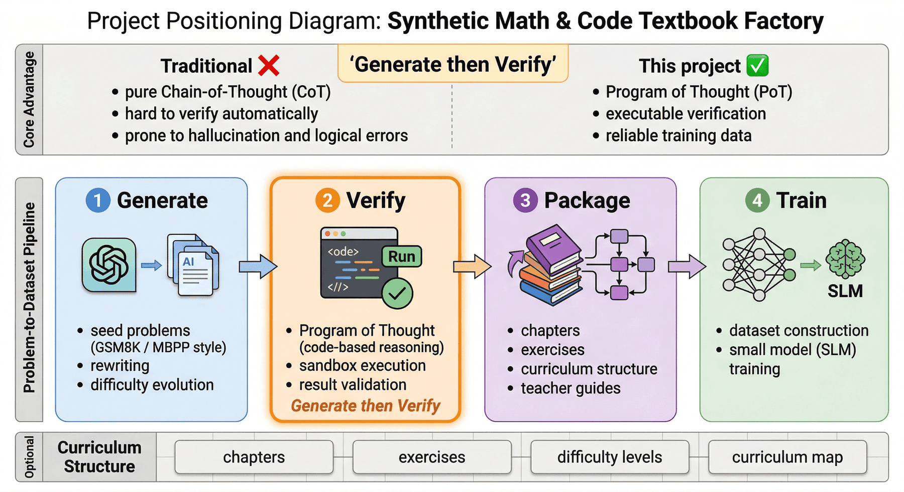
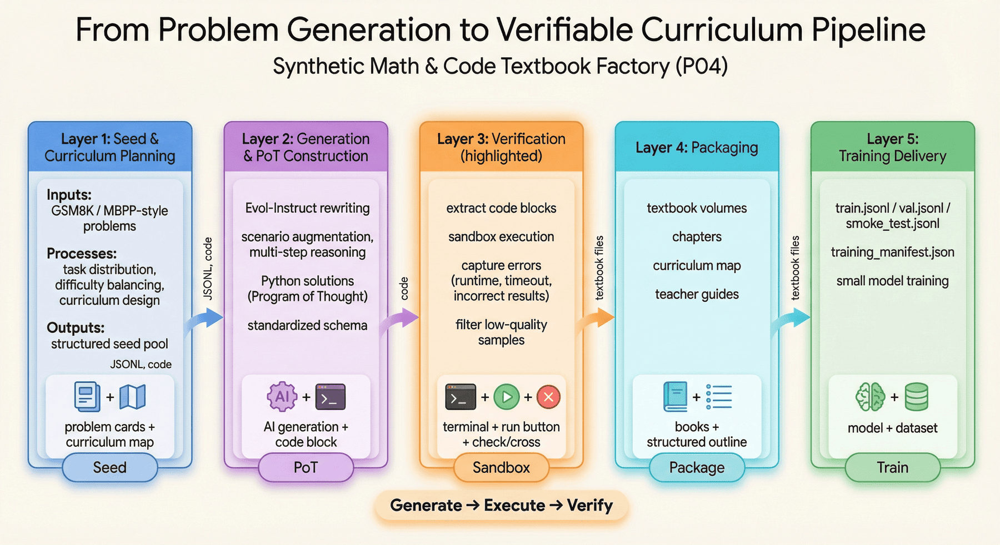
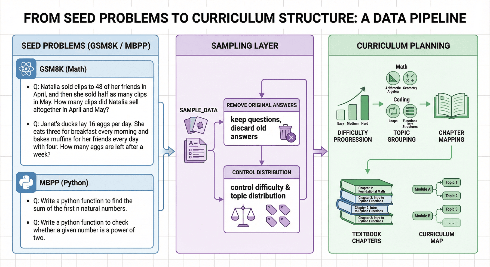
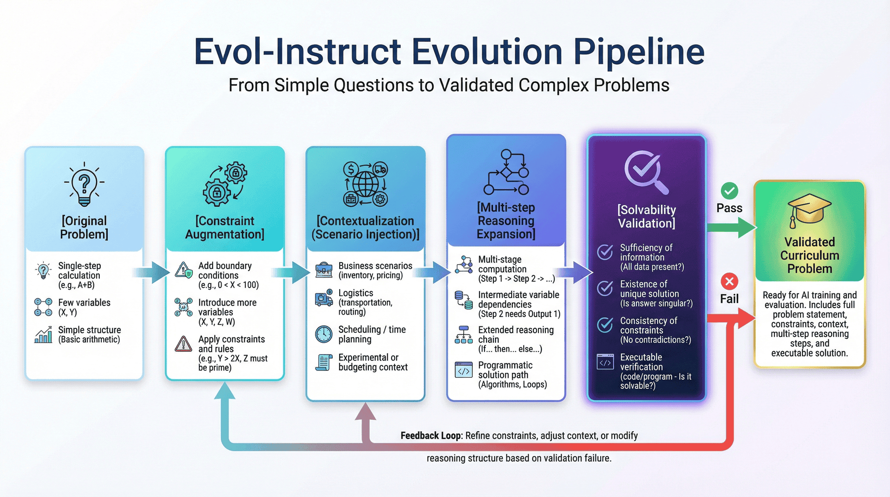
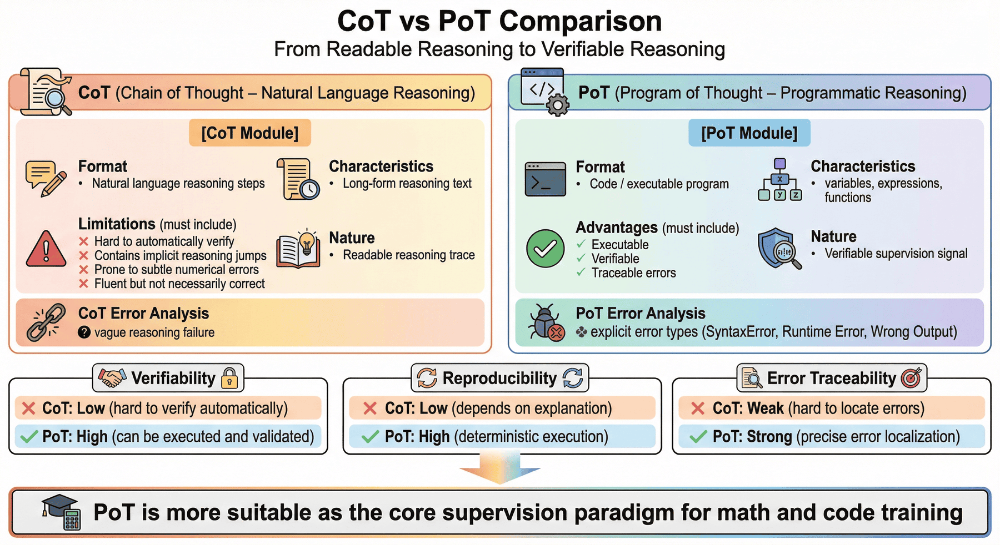
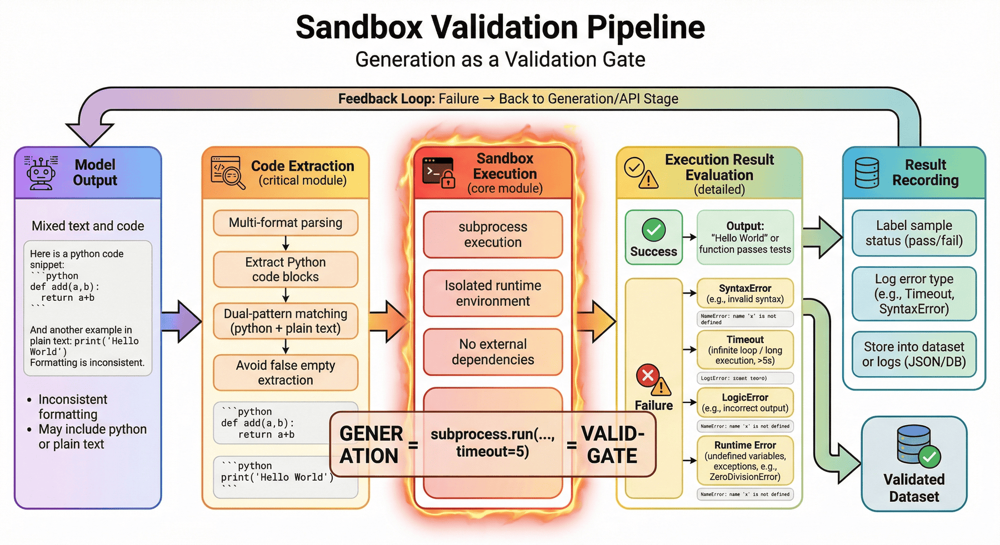

# Project 4: Synthetic Mathematics and Code Textbook Factory

## Abstract
P04 focuses on organizing mathematics problems, coding problems, and programmatic solution processes into trainable, verifiable, and packageable textbook-grade data assets. The chapter emphasis is not on single-instance problem generation, but on the engineering closed loop among generation, execution validation, textbook organization, and training interfaces.

This chapter can be understood along four main threads:

* Seed task and curriculum structure design: organizing mathematics problems, coding problems, and chapter difficulty gradients.
* Generation and execution validation: constraining the solution process via PoT, sandbox execution, and validation scripts.
* Textbook asset packaging: consolidating samples into volumes, exercises, curriculum maps, and supporting materials.
* Training and delivery interfaces: producing finished data assets that can be directly consumed by small-model training and reproducible experiments.

Read in engineering order, this chapter corresponds to a complete pipeline:

**Seed problem sampling → Problem evolution → Programmatic solving → Execution validation → Quality control → Textbook packaging → Training encapsulation**

The core objective this structure serves is to solidify the Generate-then-Verify methodology into a reusable textbook data factory.

---

## Keywords

Synthetic textbooks; programmatic validation; mathematics data; code data; curriculum structure

## Project Objectives and Reader Takeaways

This project uses the "Synthetic Mathematics and Code Textbook Factory" as its central case study, with the goal of generating mathematics and code textbook-grade data through verifiable problem evolution and solution pipelines. Upon completing this chapter, readers should be able to identify the key data objects in this scenario, decompose the engineering pipeline, set acceptance criteria, and transfer the case methodology to similar data engineering tasks.

## Scenario Constraints and Data Boundaries

The focus is on mathematics, code, and programmatic reasoning samples, and does not replace full curriculum authoring or expert review processes. These boundaries allow the case study to be reproduced and audited; when data volume, data sources, permission scope, or deployment environment change, sampling strategies, quality thresholds, operating costs, and compliance requirements must be re-evaluated.

## Architectural Decisions

This project adopts an architectural path of "seed problems, Evol-Instruct, programmatic reasoning, sandbox validation, difficulty stratification, and textbook volume organization." This decision prioritizes input/output contract integrity, version traceability, anomaly localizability, and result verifiability, rather than compressing all logic into a one-shot script execution.

## Sample Schema / Data Flow

The core data flow can be summarized as:

Listing P04-1 provides a flow or path example illustrating the input/output relationships, structural constraints, or execution patterns in this section.
```text
Seed problem → Problem evolution → Solution generation → Code/formula validation → Difficulty and topic annotation → Textbook-grade sample
```

The purpose of this snippet is to transform the above flow into an inspectable structured representation.

The sample schema should retain at minimum the fields `id`, `source`, `content_or_payload`, `metadata`, `quality_signals`, `split_or_stage`, and `audit_trace`; specific fields are further refined by the data types, downstream tasks, and acceptance criteria of this project.

## Core Implementation Snippets

The main text retains only the key implementation snippets that illustrate design trade-offs. Complete scripts, lengthy configurations, execution logs, and large files should be placed in the companion repository or appendix; code presentation focuses on input/output contracts, quality thresholds, exception handling, and acceptance interfaces.

## Experimental or Acceptance Metrics

Acceptance metrics include validation pass rate, difficulty distribution, topic coverage, solution consistency, proportion of erroneous samples, and structural completeness of volumes. If the project enters production, curriculum, or public reproducibility environments, version numbers, dependency environments, random seeds, sample spot-check results, and failure sample post-mortem records should also be logged.

| Acceptance Dimension | Metric / Evidence | Publication Review Criteria |
| --- | --- | --- |
| Data closed loop | Seed problems, evolved problems, PoT solutions, sandbox logs, and textbook volumes are all traceable | Spot-checked samples must be traceable back to original seeds and validation records |
| Quality metrics | Validation pass rate, difficulty distribution, topic coverage, and proportion of erroneous samples | Metric definitions are written into the report; a single 100% pass rate does not substitute for review |
| Expert review | Teaching explanations, chapter ordering, difficulty gradient, terminology consistency, and high-risk sample review records | Expert review comments should distinguish among "answer correct," "explanation teachable," and "suitable for inclusion" |
| Code isolation | Executable validation scripts, non-executable display code, sandbox logs, and dependency manifests | Code snippets in published text must not be executed as production scripts by default; companion scripts must be validated in an isolated environment |
| Decision boundaries | Code safety, copyright contamination, and expert review boundaries are maintained | Before public delivery, confirm problem source authorization, non-executable code isolation, and failure sample rework records |

*Table P04-1: Synthetic Textbook Factory Publication Acceptance Table*

## Cost, Risk, and Compliance Boundaries

Costs arise primarily from generation API calls, sandbox execution, and erroneous sample review; risks are concentrated in pseudo-correct answers, code safety, problem duplication, and copyright contamination. When external data, personal information, copyrighted content, or third-party services are involved, source descriptions, permission status, desensitization strategies, call records, and manual review records should be retained.

## Common Failure Patterns

Common failures include input distribution drift, missing schema fields, quality thresholds that are too loose or too strict, insufficient evaluation sample coverage, unstable model API calls, and non-reproducible results. During diagnosis, data boundaries and intermediate artifacts should be localized first, followed by examination of the model, toolchain, and deployment environment.

## Reproducibility Resource Notes

Reproducibility materials should include data source descriptions, minimal samples, configuration files, run commands, metric scripts, audit reports, and artifact directories. The main text retains necessary snippets; complete notebooks, long scripts, and large files are maintained as independent companion resources. Textbook samples ultimately need to be organized into stable text-to-text or instruction training formats (Raffel et al. 2020); dataset management, parallel generation, experiment tracking, and quality inspection can reference Hugging Face Datasets (Hugging Face 2026), Ray Data (Ray Project 2026), MLflow (MLflow Authors 2026), and Great Expectations (Great Expectations Contributors 2026), respectively.

## 1. Project Background: The Necessity of a Synthetic Mathematics and Code Textbook Factory


*Figure P04-1: Synthetic Mathematics and Code Textbook Factory Project Positioning Diagram*


General-purpose large language models can already answer many basic mathematics questions and can write reasonably competent Python code, but once we actually treat their outputs as training data, we quickly encounter three problems.

First, **surface correctness is not the same as verifiable correctness**.
Models are adept at producing answers that have the superficial form of reasoning, but such reasoning texts frequently contain implicit reasoning jumps, numerical substitution errors, inconsistent variable definitions, or a value of 12 in one step that becomes 15 in the next. On the surface, they closely resemble correct solutions; for training systems, such samples present flawed logic as high-quality explanations.

Second, **ordinary CoT is difficult to validate automatically**.
If a sample contains only a natural-language chain of thought, it is very difficult to programmatically determine whether it is actually correct. Unless manual review is introduced, quality will rapidly spiral out of control during large-scale production. By contrast, if the model is required to output executable code, we can use the execution results to determine whether key steps are sound.

Third, **training requires structured curriculum assets, not scattered samples**.
For small language models (SLMs), training materials that consist only of a collection of unrelated problems typically yield unstable results. A more principled approach is to organize them into textbook volumes, chapter exercises, curriculum maps, and teacher guides, so that the data itself embodies "instructional sequence" and "difficulty gradient."

Therefore, the goal of P04 is not simply to "synthesize a few hundred mathematics problems," but to build a **textbook data factory with execution validation**:

> Starting from GSM8K and MBPP-style seed problems, reformulate mathematics and coding problems into more complete curriculum-grade samples, and—through program execution and validation scripts—reliably deposit trainable textbook assets.

Methodologically, this pipeline is arguably more important than the specific problems themselves. Because when a team later expands to physics, statistics, financial modeling, algorithm problems, or multi-discipline STEM textbooks, what is truly reusable is not any single prompt, but this engineering methodology of "seed sampling → evolutionary generation → programmatic validation → textbook packaging → training encapsulation."

---

## 2. Project Objectives and Scope


*Figure P04-2: P04 Project Objectives and Scope Diagram*


### 2.1 Project Objectives

This project focuses on the following four objectives.

**Objective 1: Establish a transformation pipeline from problem seeds to textbook chapters.**
Starting from mathematics and coding seed problems, the project does not directly generate individual SFT samples; instead, it first forms chapter drafts and textbook structure, then produces the final records for training. The core pipeline includes modules such as `src/sampler.py`, `src/evol.py`, `src/sandbox.py`, `src/package_textbook.py`, and `src/prepare_training_data.py`.

**Objective 2: Convert "reasoning processes" from unverifiable text into executable programs.**
The project emphasizes the PoT (Program of Thought) format, going beyond "the model appears to explain things thoroughly" to require the model to produce Python solutions for key problem types and execute them in a sandbox, thereby reducing chain-of-thought hallucinations.

**Objective 3: Package chapter assets into curriculum-deliverable artifacts.**
The final deliverable is not an isolated JSONL file, but a complete set of products including textbook volumes, curriculum maps, teacher guides, and training manifests. The project ultimately produces two textbook volumes accompanied by a curriculum volume and a teacher guide.

**Objective 4: Produce data assets that the training side can consume directly.**
The project outputs training-interface-layer files including `train.jsonl`, `val.jsonl`, `smoke_test.jsonl`, and `training_manifest.json`, ensuring that the textbook data can not only be "showcased" but also "fed into training."

### 2.2 Project Scope

To keep this chapter reproducible, P04 also sets explicit scope boundaries.

#### 1) Subject Boundaries

The current project covers only two domains: **mathematics** and **Python code problem solving**. Seed sources are concentrated in GSM8K and MBPP-style tasks, meaning the project is better suited as a prototype for a reasoning-focused textbook factory than as a full multi-subject educational platform.

#### 2) Content Boundaries

Current content coverage focuses on the **introductory to intermediate** stage, emphasizing concepts, worked examples, exercises, and validation snippets, rather than complete video courses, interactive exercise systems, or multimodal teaching platforms.

#### 3) Validation Boundaries

The current validation focus remains on **code execution correctness** and partial validation script consistency. This is already effective at filtering out syntax errors, variable hallucinations, and obvious logic problems, but has not yet been fully extended to higher-order pedagogical quality dimensions such as "is the teaching explanation optimal," "is the chapter ordering ideal," or "is the cognitive load on students appropriate."

#### 4) Scale Boundaries

The project is small in scale but complete in process. Its value lies not in having an exceptionally large sample count, but in validating the full engineering chain from generation to delivery. It is therefore more appropriate as a practical case study and small-scale validation scheme.

### 2.3 The Purpose of Scope Boundaries

A textbook factory is easily described as an omnipotent system that "can generate problems, can write code, and can automatically publish books." But a truly credible and reusable engineering case should clarify:

* In which subject domains is the system stably operational;
* Which validations have been performed and which have not yet been covered;
* Whether the current state is suitable for method demonstration or for production deployment;
* Whether the data assets can enter training directly or are only suitable for display.

Stating these boundaries clearly is more valuable than inflating the apparent scale.

---

## 3. Project Positioning: P04's Place in the Capability Chain

If we view the overall large language model data engineering effort as a capability chain, P04 addresses a particularly critical segment:

> **How to upgrade "reasoning capability training" from ordinary text synthesis to "executable, verifiable, and curriculum-compatible" data production capability.**

Earlier chapters may have discussed pre-training data cleaning, domain SFT, preference data, and QA systems; this chapter emphasizes a different class of data assets that is frequently undervalued: **textbook-style reasoning data**.

This type of data differs from ordinary question-answering data because it simultaneously fulfills three roles:

* It provides problems and answers to the model;
* It exposes the model to an imitable solution process;
* It also embodies a knowledge organizational structure and difficulty ordering at the sample level.

In other words, the most important contribution of this chapter is not to show "how to generate more mathematics problems," but to demonstrate:

* Why mathematics reasoning training requires programmatic validation;
* Why textbook content needs volumes and curriculum maps rather than scattered Q&A;
* Why quality control must be moved upstream to data production rather than remediated after training;
* How to genuinely design generation, validation, textbook packaging, and training encapsulation as a continuously productive capability.

In this sense, P04 is not just a "small reasoning data project" but more aptly a **minimum reproducible prototype of an educational content factory**.

---

## 4. Overall Architecture: A Reasoning Data Pipeline from Seed Problems to Textbook Volumes


*Figure P04-3: P04 Overall Architecture Overview Diagram*


From an engineering perspective, P04 can be decomposed into three layers.

### 4.1 Layer 1: Seed and Chapter Planning Layer

This layer addresses "what we want to teach." Core actions include:

* Extracting seeds from GSM8K and MBPP-style problems;
* Forming problem-type distributions and difficulty distributions;
* Mapping discrete problems to chapter plans and curriculum maps;
* Retaining problem provenance for downstream traceability.

This layer is not simply random sampling; it is preparing the ground for subsequent textbook organization. If the upstream seed distribution is imbalanced, no amount of downstream organization can prevent the entire textbook from being skewed.

### 4.2 Layer 2: Evolutionary Generation and PoT Construction Layer

This layer addresses "how to transform problems into textbook content with higher training value." It primarily includes:

* Applying Evol-Instruct-style rewriting to the original problems;
* Introducing contextualization, constraints, and multi-step reasoning;
* Requiring the model to output Python code rather than only a natural-language chain of thought;
* Organizing solution results into a unified schema.

This layer determines whether the data ultimately teaches "surface-level problem patterns" or "programmatic reasoning capability."

### 4.3 Layer 3: Validation, Packaging, and Delivery Layer

This layer addresses "whether this content can be confidently admitted into training." It primarily includes:

* Extracting code blocks from model outputs;
* Executing them in a sandbox and capturing errors, timeouts, and return values;
* Cleaning low-quality samples and recording failure reasons;
* Packaging into textbook volumes, curriculum maps, teacher guides, and training files;
* Confirming artifact consistency via validation scripts.

At this stage, the project truly upgrades from "able to generate problems" to an engineering system that "can produce textbook assets." The current project passes all 10 checks, including 2 command-level checks and 8 data/artifact-level checks, with an overall status of `PASS`.

---

## 5. Engineering Prerequisites: Key Responsibility Facets of the Textbook Factory


*Figure P04-4: Textbook Factory Responsibility Collaboration Diagram*


For a textbook factory to operate stably, what matters more than emphasizing individual generation actions is first clearly defining **which responsibility facets must be covered**. At least four categories of responsibility facets need to be made explicit.

### 5.1 Curriculum Planning and Chapter Design

This layer is responsible for defining textbook volumes, chapter ordering, problem-type coverage, and difficulty gradients. It must answer:

* Which problems are suitable as foundational scaffolding;
* Which problems better exemplify advanced reasoning;
* How mathematics and code content can complement rather than duplicate each other.

### 5.2 Data Processing and Interface Maintenance

This layer is responsible for seed sampling, schema design, JSONL serialization, deduplication, and training splits. It is concerned with:

* Where each sample originates;
* Whether fields are uniformly defined;
* Whether there is leakage between training and validation sets;
* Whether intermediate artifacts are traceable.

### 5.3 Generation Orchestration and Task Expansion

This layer is responsible for Evol prompts, PoT prompts, API calls, failure retries, and format compatibility. It connects "problem seeds" to "textbook chapter drafts" and determines whether the project ultimately produces a scattered problem collection or a textbook asset with genuine curriculum organizational capability.

### 5.4 Validation, Rollback, and Quality Control

This layer is responsible for verifying whether code runs, whether results are consistent, whether failed samples need rework, and whether validation scripts cover all key deliverables. Its importance lies in the fact that in a textbook context, "looking approximately correct" is far from sufficient—programmatic execution and quality rollback must both be incorporated into the process.

### 5.5 The Purpose of Key Responsibility Facets

Many teams get stuck not because they lack model proficiency, but because critical control points have not been separated out, ultimately resulting in:

* Generation logic changing while no one maintains the curriculum structure;
* Abundant samples but no statistics on failure reasons;
* Books already packaged but training set fields are inconsistent;
* Metrics looking acceptable but no one knows which layer the problem originated from.

Stating these responsibility facets explicitly amounts to asserting that **a textbook data factory is a production line with validation and delivery closed loops, not a generation script.**

---

## 6. Seed Layer: The Necessity of Problem Seeds


*Figure P04-5: Mapping from Seed Problems to Chapter Plans*


The most common misconception in synthetic textbook creation is to directly ask a large language model to "please help me generate a mathematics textbook." While this approach is fast, it typically has three problems.

First, problem distribution is uncontrollable. The model will over-generate on patterns it is familiar with, causing many problems to appear different but be structurally isomorphic.

Second, difficulty gradients are unstable. Without seed anchors, the model struggles to consistently maintain a "basic to advanced" ordering.

Third, provenance is untraceable. Once it is discovered that a certain class of problems consistently yields errors, it is very difficult to trace back to which upstream patterns caused the issue.

Therefore, this project starts from seed problems, first sampling data in `sample_data()` and retaining only the question text as the starting point for subsequent evolution. The current pipeline explicitly samples from a problem pool, forms a chapter plan, and then generates textbook chapter drafts.

### 6.1 Why to Retain Questions and Discard Old Answers

In the current implementation, the project retains `seed_question` and sets aside the original answer separately as a reference, rather than using it directly as the final label. This is a critical design choice.

Because after Evol-Instruct rewriting, the context, constraints, and even the numerical relationships of the problem may change. If the original answer is inherited directly, the old label is erroneously carried into the new problem. The original chapter draft also explicitly emphasizes:

> After evolution, the numerical values in the problem may change, rendering the old answer invalid.

This shows that from the outset, the project separates "seed problems" from "final supervised ground truth," rather than treating rewritten problems as mere paraphrases of the originals.

### 6.2 What the Seed Layer Must Control

The seed layer of a textbook factory must control at least four things:

* **Domain coverage**: both mathematics and code tracks must be represented;
* **Difficulty levels**: there cannot be exclusively basic or exclusively highly difficult problems;
* **Topic distribution**: coverage should span arithmetic, function design, lists, string algorithms, and other diverse topics;
* **Evolvability**: problems should be amenable to extension into more complex contexts.

From current results, the project has formed two textbook tracks (`math=30`, `code=18`) covering multiple topic categories.

---

## 7. Evol-Instruct: The Problem Evolution Mechanism


*Figure P04-6: Evol-Instruct Evolution Path Diagram*


If we merely restate "how long does it take a train traveling 240 miles" in a different phrasing, the training value does not increase significantly. What the project truly needs is to evolve problems from "single-step calculations" into "multi-constraint, multi-variable, programmatically solvable" questions.

### 7.1 From Simple Problems to Complex Application Problems

In the current implementation, the evolution prompt explicitly requires the model to do four things:

1. Add constraint conditions;
2. Increase reasoning depth;
3. Perform scenario-based rewriting;
4. Maintain solvability.

These requirements appear simple but actually closely align with the core objectives of textbook generation. Truly high-quality exercises do not merely use larger numbers but make the underlying chain of relationships longer and more reminiscent of real-world constraints.

### 7.2 Why "Contextualization" Matters

Many original problems in mathematics training are highly abstract, making it easy for the model to memorize formal templates without understanding the underlying relationships. Embedding problems in business, logistics, inventory, experimental, budgeting, or travel scenarios provides two benefits:

* More variables and boundary conditions can be introduced naturally;
* Subsequent PoT more closely resembles "solving a real problem" rather than "applying a formula."

This is also why the project transforms a simple apple problem into a fruit store inventory and loss problem, and a speed-distance problem into a train stop scheduling problem. Current examples already reflect this rewriting direction.

### 7.3 Why "Increasing Difficulty" Must Still Emphasize "Maintaining Solvability"

Many generation systems, once they pursue difficulty, fall into one of two extremes:

* Writing problems that appear convoluted but are actually underspecified;
* Adding so many conditions that the problem becomes inconsistent or has no unique solution.

Textbook data cannot tolerate such loss of control. Unlike open-ended writing, educational content must be solvable, verifiable, and reproducible. This is precisely why evolution is only the first half of the process—programmatic execution validation must follow.

---

## 8. PoT Selection: The Programmatic Reasoning Path


*Figure P04-7: CoT vs. PoT Comparison Diagram*


### 8.1 The Value and Limitations of CoT

CoT (Chain of Thought) is certainly valuable for reasoning training; it allows the model to more explicitly surface intermediate thinking. However, the biggest problem with CoT is also very evident:

* It can be long without being truthful;
* It can appear coherent without being easily validated automatically;
* It readily harbors implicit reasoning jumps and small numerical errors.

This means that pure CoT is more like "readable reasoning traces" than "verifiable supervisory signals."

### 8.2 The Engineering Advantages of PoT

PoT (Program of Thought) converts part of the reasoning into code, providing three direct benefits:

**First, executability.**
Samples do not merely say "compute A first, then B"; they actually encode A, B, and C as variables and expressions.

**Second, verifiability.**
If code passes validation, the structure of the solution process is at least self-consistent; if the result is correct, this further increases the credibility of the supervisory signal.

**Third, traceable errors.**
If the code fails, we can determine whether the cause was a `SyntaxError`, `Timeout`, undefined variable, or incorrect execution result—rather than only knowing "this explanation feels somewhat off."

### 8.3 Why PoT Is Particularly Well-Suited to Mathematics/Code Textbooks

Because such textbooks themselves want the model to learn:

* How to map a problem to variables;
* How to translate relationships into programs;
* How to derive natural-language conclusions from program outputs.

From a training perspective, this has greater generalization value than simply memorizing the answer to a specific problem. The project has made this the central element of the data factory, not a supplementary feature.

---

## 9. Generation Pipeline: Concrete Implementation from Prompt to Code Solution


*Figure P04-8: Generation Pipeline Detail Diagram*


The generation pipeline of this project can be understood as two steps.

### 9.1 Step 1: Problem Evolution

The system first transforms seed problems into more complex questions. The current prompt requires the model to act as a "mathematics competition problem designer" and to add constraint conditions, reasoning depth, and real-world context. The purpose of this step is to increase the training value of the problems themselves.

### 9.2 Step 2: PoT Generation

After problem evolution, the system then requires the model to produce a programmatic solution. That is, the model cannot simply state "this is how it should be computed" but must actually produce Python code.

The value of this step lies in converting "appearing capable of solving the problem" into "actually able to run the solution." If the code fails validation, however elegant the preceding explanation may be, it cannot enter the final dataset.

### 9.3 Engineering Details in API Orchestration

The project currently uses DeepSeek-V3 as the generation engine. Because code generation and lengthy reasoning output significantly extend request duration, `max_tokens` is increased to 4096 in `call_siliconflow`, and the timeout is explicitly extended to 180 seconds. The choice was made because its cost-effectiveness for code generation and mathematical reasoning is well-suited to the current pipeline.

These settings appear to be minor details during small-scale runs, but they are in fact critical to generation pipeline stability. If the timeout strategy is too short, the system will incorrectly classify many "nearly complete long samples" as failures; if the token limit is too low, code will regularly be truncated at the midpoint.

### 9.4 Why Failure Retries Matter

Generation systems inevitably encounter network jitter, incomplete responses, or intermittent API errors. Adding multi-retry and backoff logic at the call layer significantly improves overall availability. This demonstrates that the project has upgraded from a "single-run experimental script" to an "engineering script capable of continuous batch processing."

---

## 10. Sandbox Validation: The Core Threshold of Generate-then-Verify


*Figure P04-9: Sandbox Validation Execution Path Diagram*


In P04, the sandbox is not a supplementary component but the **critical gate** that determines whether data is trustworthy.

### 10.1 What Happens Without Validation

Without execution validation, model-generated code frequently exhibits:

* Incomplete code blocks;
* Syntax errors;
* Inconsistent variable names between earlier and later parts;
* Self-contradictory logical structure;
* Non-existent dependencies;
* Brute-force enumeration causing uncontrolled runtime.

These issues do not always surface immediately during visual inspection. Many code snippets even look like "exemplary answers." This is precisely why manual visual screening is impractical at scale.

### 10.2 Why Code Extraction Comes First

Model outputs are often irregularly formatted. Sometimes code is wrapped in ` ```python `, sometimes in a plain ` ``` `. If the extraction logic does not handle both forms, the system will misidentify many otherwise usable code blocks as empty output. The original chapter already provides the two-level matching logic of `extract_python_code()`—a classic engineering detail: not glamorous, but critically important.

### 10.3 Why Execution Timeouts Are Essential

When executing model-generated code, the greatest risk is not a simple error but **stalling**. Infinite loops, exponential-time enumeration, and uncontrolled recursion can all bring the entire pipeline to a halt. The project therefore uses `subprocess.run(..., timeout=5)` to control execution duration, terminating any code that does not complete within 5 seconds.

Getting this step right enables failed samples to be clearly attributed to:

* `SyntaxError`
* `Timeout`
* `LogicError`
* Undefined variables or runtime exceptions

The current example shows that approximately 18% of failures are primarily due to syntax errors, timeouts, and logic hallucinations. Although this figure comes from a small-scale run, it is already sufficient to demonstrate that the validation step cannot be omitted. More importantly, the project ultimately passes all 10 checks and receives `PASS`, indicating that the validation and artifact layers are currently consistent.

### 10.4 Why This Step Determines the Boundary Between "Textbook" and "Hallucinated Text"

The critical risk of textbook data is that content appears to resemble a teacher's lecture notes, yet the basis for the answers is not solid. Sandbox execution enables the project to filter out a batch of untrustworthy content before it enters textbook volumes.

> A textbook without validation more closely resembles well-formatted text; a textbook with validation more closely resembles a trainable asset.

---

## 11. Textbook Packaging: Curriculum-Oriented Asset Organization


*Figure P04-10: Textbook Packaging Artifact Relationship Diagram*


Even after obtaining `verified_textbook.jsonl`, the project should not stop there. Both training and instruction require richer organizational layers.

### 11.1 A Textbook Is Not a Sample Heap

If all validated problems are directly dumped into the training set, training is technically possible, but this does not constitute a textbook. A textbook must also answer these questions:

* Which problems should be studied first and which later;
* How should mathematics and code content be divided into volumes;
* How should difficulty progress;
* Which problems are suitable for smoke testing;
* How can instructors or reviewers quickly understand the entire body of materials.

### 11.2 What Textbook Deliverables the Current Project Produces

In addition to the validated chapter data, the current project also outputs:

* `curriculum_map.json`
* `textbook_catalog.json`
* `editorial_style_guide.md`
* Two textbook volumes: `foundations_of_quantitative_reasoning.md` and `python_problem_solving_workbook.md`
* `teacher_guide.md`

This indicates that the project has elevated from a "single data file" to a "curriculum asset collection."

### 11.3 Why Curriculum Maps Matter

The existence of a curriculum map means the training data is no longer merely a flat record but possesses chapter dependencies, topic distribution, and difficulty gradients. This has at least three values for downstream use:

* Helps reviewers quickly understand coverage;
* Helps perform data sampling and stratified splitting before training;
* Helps maintain structural consistency when adding new volumes in the future.

### 11.4 Why Teacher Guides Are Not "Icing on the Cake"

Many engineering projects treat teacher guides as supplementary instructional materials. But in a textbook-style data factory, teacher guides actually have strong engineering significance: they serve as the explanation layer for reviewers, annotators, manual QA personnel, and training operations staff. They describe what each volume teaches, how to use it, and which learning stage it covers; they also serve as a communication interface during version updates.

---

## 12. Training Encapsulation: Feeding Textbook Data into Training Systems


*Figure P04-11: Training Encapsulation Interface Diagram*


One of the final project objectives is to convert textbook assets into data formats that the training side can consume directly.

### 12.1 What the Training Side Needs

The training system does not care which original problem a sample came from; it is more concerned with:

* Whether the sample schema is consistent;
* Whether the train/val/smoke split is ready;
* Whether the manifest records necessary metadata;
* Whether training data and textbook artifacts are consistent with each other.

### 12.2 Current Training Assets

The complete training-side deliverables currently include:

* `final_textbook_dataset.jsonl`
* `train.jsonl`
* `val.jsonl`
* `smoke_test.jsonl`
* `training_manifest.json`

This means the project has not separated "building a textbook" from "entering training" but has instead connected the two.

### 12.3 Why Smoke Tests Must Be Listed Separately

In training engineering, the value of a smoke test is not in evaluating final performance but in quickly verifying:

* Whether the basic schema is correct;
* Whether training scripts can read the data;
* Whether both subject domains are covered;
* Whether a version change has broken basic sample quality.

The current check list also explicitly mentions `smoke_covers_both_domains`, indicating that the project already treats the smoke set as part of the engineering verification, not as an optional supplementary file.

---

## 13. Metrics and Results: Structural Signals from the Current Project

For a textbook factory, the most easily misinterpreted metrics are "how many chapters were produced" and "how many pages of text were generated." These numbers certainly have display value, but what truly matters more is **post-validation structural quality**.

### 13.1 Current Key Metrics

Current key results include:

* Seed count: `48`
* Synthesized chapters: `48`
* Validated chapters: `48`
* Pass rate: `100.00%`
* Subject distribution: `math=30`, `code=18`
* Total token estimate: `11039`
* Final textbook volumes: `2`

These metrics together indicate that the project has achieved a small but complete textbook data closed loop.

### 13.2 Why "100% Pass Rate" Requires Careful Interpretation

A 100% pass rate looks impressive, but it must be read in context: it depends to a large extent on the relatively small current scope and strong template constraints.

In other words, this metric expresses not "this class of problems has been definitively solved," but rather:

* At the current scale, the validation pipeline is stable;
* Chapters, training files, and reports are mutually consistent;
* The factory prototype has been validated.

This represents engineering credibility, not an unlimited generalizable conclusion.

### 13.3 What Topic Distribution Reveals

The project covers multiple topic categories including arithmetic word problems, function design, lists and iteration, and string algorithms, indicating that the textbook content is not a rewrite of a single problem type but spans different structures across mathematics and programming.

### 13.4 What Difficulty Distribution Reveals

Current results show `advanced=35` as the clear majority, indicating that the current factory leans toward intermediate-to-high-difficulty exercise materials.

This yields two insights:

* On one hand, it is well-suited for demonstrating the value of "reasoning enhancement";
* On the other hand, it also means that if the target audience is broadened in the future, basic and transitional problems still need to be supplemented.

---

## 14. Engineering Outcomes: Core Problems P04 Solves

Summarized in one sentence, what P04 actually solves is:

> **Transforming high-risk "reasoning-type synthetic data" from unreliable text into structured textbook assets backed by execution validation.**

Specifically, it solves at least four categories of engineering problems.

### 14.1 Solved the "Insufficient Trustworthiness of Chain of Thought" Problem

Through PoT and execution validation, the project no longer relies entirely on the model's natural-language explanations, but instead converts intermediate processes into programs and output results, thereby significantly improving the verifiability of supervisory signals.

### 14.2 Solved the "Difficulty in Organizing Textbook Content" Problem

Through curriculum maps, volumes, and teacher guides, the project ensures that textbooks are no longer just collections of problems but deliverables with ordering, structure, and topic distribution.

### 14.3 Solved the "Training Ingestion Disconnect" Problem

The project does not only produce intermediate artifacts; it also outputs train/val/smoke/manifest files, enabling direct integration with the training side.

### 14.4 Solved the "Project Auditability" Problem

All 10 current checks pass, meaning the project code, artifacts, and reports have already formed a fairly strong chain of consistency evidence.

---

## 15. Cost and Optimization: Bottlenecks Before Scaling Up


### 15.1 Current Cost Profile

A pedagogical demonstration run can be estimated at the following order of magnitude: generating one complex sample (Evol + Code) may take 30–60 seconds; the API cost for 1,000 high-quality validated samples may be less than one US dollar. These figures are provided only to illustrate cost analysis methodology; formal projects should replace them with actual execution logs and API invoices.

### 15.2 Where the True Bottlenecks Lie

The true bottlenecks typically arise from three sources:

* Lengthy generation time and insufficient throughput;
* Sequential execution validation slowing overall batch processing;
* Failed sample rework and retries extending the total pipeline duration.

### 15.3 How to Scale

Building on the current implementation, subsequent scaling can prioritize the following directions:

1. **Concurrent generation**: replace single-threaded loops with thread pools, asynchronous requests, or task queues;
2. **Task distribution**: use `Celery + RabbitMQ` or a lighter-weight worker to distribute generation tasks;
3. **Parallel validation**: decouple sandbox execution from generation and build a concurrent validation queue;
4. **Finer-grained checks**: extend beyond "code runs" to multi-dimensional quality control such as "is the explanation clear" and "does the difficulty match";
5. **Curriculum asset expansion**: add finer difficulty gradients, curriculum recommendation paths, and richer instructor-facing materials.

### 15.4 Why the Optimization Priority Here Is Not "Getting Cheaper"

Under the cost estimates in this chapter's example, API cost is not the primary bottleneck; formal projects must still calculate using actual invoices, model versions, and retry rates. What is more worth investing in is:

* Throughput;
* Safety isolation;
* Finer quality control;
* Richer curriculum structure.

In other words, the primary challenge for the next phase of this project is **engineering maturity**, not simply token cost.

---

## 16. Key Deliverables: Current Artifact Inventory


One of the most direct ways to judge whether P04 has achieved an engineering closed loop is to examine the artifact chain. The current project has formed a complete artifact chain, including:

* Seed and intermediate processing files: `seed_pool.jsonl`, `chapter_plan.json`, `synthetic_textbook_chapters.jsonl`
* Validation and quality files: `verified_textbook.jsonl`, `verification_failures.jsonl`, `execution_results.jsonl`, `quality_audit.jsonl`
* Curriculum organization files: `curriculum_map.json`, `textbook_catalog.json`, `editorial_style_guide.md`
* Textbook files: two volumes and a teacher guide
* Training files: `final_textbook_dataset.jsonl`, `train.jsonl`, `val.jsonl`, `smoke_test.jsonl`, `training_manifest.json`
* Report files: `p4_report.md`, `p4_metrics.json`, `p4_test_results.json`, `p4_test_report.md`

This set of deliverables demonstrates that the project already possesses three capabilities:

* The ability to produce content;
* The ability to validate content;
* The ability to organize content into assets consumable by both training systems and reviewers.

---

## 17. Method Retrospective: The Methodological Value of P04

The value of P04 lies not in how much "impressive-looking" reasoning text it generates, but in turning a high-risk, high-hallucination data production task into a reproducible, verifiable, and deliverable engineering pipeline.

Placed within a broader methodological framework, it addresses at least three important questions:

First, **why reasoning data cannot be evaluated purely on surface text quality.**
A chain of thought without validation is easily just a more persuasive hallucination.

Second, **why textbook data requires curriculum structure.**
Training materials are not sample heaps; textbook volumes, curriculum maps, and teacher guides directly affect how the materials can be subsequently used.

Third, **why even a small-scale project can embody a complete engineering closed loop.**
Even with only 48 seeds, 48 chapters, and 2 volumes, as long as sampling, generation, validation, packaging, training, and checking are all connected, a complete engineering closed loop has been formed.

From an engineering methodology perspective, what is most worth replicating from this case is not any particular local generation technique, but the underlying working method:

> First transform reasoning into programs, then transform programs into verifiable textbook assets, and finally connect textbook assets to the training system.

This is precisely the step that many teams most readily miss—and yet is the most critical—when doing "reasoning enhancement."

---

## Special Topic: Acceptance Standards for the Textbook Factory

As previously emphasized multiple times, the true value of P04 lies not in "generating many problems" but in "determining after generation whether these problems can enter the textbook, can enter training, and can be stably reused." Therefore, a textbook factory needs not only an execution pass rate but also a more refined set of acceptance standards.

Without such standards, teams easily fall into two types of misjudgment. The first misjudgment is equating "code runs" with "textbook is usable." But in reality, even validated code may still have unclear problem statements, explanation jumps, difficulty mismatches, and chapter repetition. The second misjudgment is equating "chapters look like a textbook" with "training-ready." But the training side truly cares about schema consistency, split strategy, field stability, and distribution balance. The two misjudgments combined leave the project in a state that appears complete on the surface but is difficult to reuse in practice.

### I. Sample-Level Acceptance: Is Each Record Worth Retaining

Sample-level acceptance is the most foundational and most easily overlooked layer. The question it must answer is not "can this sample be generated" but "is this sample worth entering the final textbook collection."

A retainable textbook sample typically must simultaneously satisfy the following conditions:

* The problem statement is complete, without missing known conditions, and without burying key units, variable ranges, or input/output constraints in vague language;
* The solution is consistent with the problem statement—there cannot be situations where the problem asks for a total price while the code computes a mean value, or where the problem has been rewritten but the program still uses the old logic;
* Program output is consistent with the final answer and is verifiable under the current problem type;
* The explanatory text helps learning rather than merely restating the code in synonymous sentences;
* The language style is consistent with the volume's positioning, avoiding a style that oscillates within the same chapter between classroom lecture, competition analysis, and API documentation.

For textbook-grade data, the most common issue in sample-level acceptance is not "obviously wrong" but "locally appearing correct yet as a whole not suitable as teaching material." For example, a problem's code solution may be correct, but the explanation implicitly assumes the reader already understands proportional conversion; this may be fine for an advanced volume but creates a cognitive leap for a foundational volume. Similarly, a coding problem may provide a complete function implementation without explaining why that data structure was chosen; such a sample helps train "the ability to write code" but offers limited help in training "the ability to teach others to write code."

Therefore, sample-level acceptance in P04 is better evaluated using a "three-question test":

* Can this record be validated by a machine;
* Can this record be understood by a learner;
* Can this record be reliably consumed by a training system.

Only when all three questions are answered "yes" does the record truly qualify for inclusion in the final dataset.

### II. Volume-Level Acceptance: Does the Entire Textbook Have Pedagogical Structure

The biggest difference between a textbook factory and an ordinary sample factory is that it cannot only look at individual pass rates; it must also examine whether the volume-level structure holds. Volume-level acceptance asks: is the entire textbook a material that "can be studied sequentially," or is it a collection of problems that happen to reside in the same file?

Volume-level checks typically cover the following areas:

* Whether topic coverage is balanced—a single volume must not contain large numbers of repeated arithmetic rewrites while lacking function design, string processing, or debugging analysis;
* Whether the difficulty gradient is natural—the sequence must not jump from single-step arithmetic operations to multi-constraint optimization in the next section, then retreat to foundational problems in the section after;
* Whether chapter dependencies are clear—skills used in later sections should have at least appeared as scaffolding or minimal introductions in earlier sections;
* Whether problem types are complementary rather than repeatedly rewriting the same template;
* Whether volume titles, chapter names, exercise arrangements, and teacher guides are mutually consistent.

From a publication perspective, volume-level acceptance is essentially checking the "learning path." Many model teams habitually discuss problems in the language of data distribution, while textbook teams more habitually discuss them in the language of "reader experience." The methodological value of P04 lies in bridging these two languages. What is called topic coverage is fundamentally a distribution problem; what is called difficulty gradient is fundamentally a curriculum ordering problem; what is called chapter dependency is fundamentally a structured prerequisite knowledge problem. All of these can be expressed as engineering check items rather than remaining at the level of editorial intuition.

If acceptance is to be further automated in the future, the following structured signals can be added at the volume level:

* Topic and difficulty labels for each chapter;
* The proportion of repeated problem types between adjacent chapters;
* The location of the first occurrence of foundational concepts in the entire volume;
* The proportion of mathematics, coding, and integrated problems in each volume;
* The coverage alignment between the teacher guide and the volume table of contents.

These signals may not all directly determine inclusion or exclusion, but they help teams upgrade from "does it feel right" to "having evidence-based discussions about whether it flows naturally."

### III. Training-Level Acceptance: Can Textbook Assets Stably Enter Training

Producing textbook volumes does not mean the training problem is solved. Training-level acceptance focuses on a different set of questions: when these textbook assets enter SFT or small-model distillation pipelines, do they possess sufficient engineering stability?

Common training-level acceptance priorities include:

* Whether the schema is consistent—field naming, null value handling, and delimiter form must be stable;
* Whether the three datasets—train, val, and smoke—have clear responsibilities, avoiding validation set leakage or the smoke set degrading into display samples;
* Whether both subject domains enter the split, avoiding training that covers only mathematics or only code;
* Whether the training manifest records sufficient statistical information and version provenance;
* Whether the explanations, code, and answers in training samples can be reliably parsed by a single template.

One point particularly worth emphasizing at this level is: textbook-type data is typically more complex than ordinary question-answering data. Because it simultaneously contains the problem statement, explanation, program, answer, chapter labels, difficulty labels, and textbook provenance information. Even a slightly unstable template will cause training scripts to misread, miss-read, or incorrectly truncate certain fields. Training-level acceptance is therefore not a supplementary action but a critical component of whether the textbook factory has achieved a closed loop.

Furthermore, training-level acceptance also determines whether the textbook factory can truly develop "version upgrade capability." If one version's volumes look excellent but lack a stable manifest, a clear split specification, and preserved version provenance, then even if performance improves in subsequent versions, the team will find it very difficult to explain which batch of textbooks, which type of problems, or which explanation style drove the improvement. For reasoning-type data, this kind of unexplainable improvement is often more dangerous than temporarily having no improvement.

---

## Special Topic: Operational Mechanisms of the Textbook Factory

When the textbook factory begins producing continuously, teams quickly discover that what truly differentiates performance is not any particular prompt technique but whether stable operational mechanisms are in place. Without operational mechanisms, projects typically can only "sprint once"; with operational mechanisms, it becomes possible to evolve P04 into a continuously iterable capability.

### I. Role Division: Who Is Responsible for Which Segment

A textbook factory involves at least five categories of responsibility, and these categories cannot be merged into the same person indefinitely.

* Subject planning role: responsible for determining volume positioning, topic coverage, chapter ordering, and difficulty gradients;
* Generation engineering role: responsible for sampling, prompt orchestration, model calls, and failure retries;
* Validation engineering role: responsible for code extraction, sandbox execution, exception capture, and validation statistics;
* Editorial and QA role: responsible for language style, teaching explanations, chapter organization, and manual spot checks;
* Training integration role: responsible for final data splitting, manifest, smoke tests, and training script integration.

Many small teams initially compress these responsibilities into two or three people—that is acceptable. But even in small teams, it is best to maintain explicit role distinctions. Because once all problems are funneled into the broad bucket of "model output quality," the team will find it very difficult to distinguish: is the current problem a subject planning issue, a generation issue, a validation issue, or a training integration issue?

### II. Release Cadence: Why Textbooks Also Need a Release Cycle

Like ordinary data pipelines, textbook factories also need rhythm. A minimal executable cadence might be:

* Freeze the seed pool and chapter plan at the start of the week;
* Complete generation, validation, and failure retries mid-week;
* Complete manual spot checks, volume packaging, and training encapsulation in the latter part of the week;
* Output a metrics report, problem list, and recommendations for the next cycle at week's end.

This cadence may seem somewhat "traditional publishing," but it is highly valuable for engineering stability. Because textbook-type data does not simply maximize throughput; it must simultaneously balance structure, quality, and trainability. Without a freeze point, chapter plans keep changing during generation; without a spot-check point, problems accumulate all the way to the training side; without a unified reporting point, teams can only rely on impressions to say "this version seems better."

More importantly, a release cadence also helps teams establish a "version mentality." Readers, training engineers, and reviewers no longer see a continuously changing intermediate state but a batch of textbook versions with clear boundaries. This makes subsequent regression, performance comparison, and new volume addition much clearer.

### III. Failure Rework: Turning Bad Samples into Improvement Leads

The asset that should least be wasted in projects like P04 is failed samples. Because failed samples most clearly reveal the true weaknesses of the current factory.

Failure rework should at minimum preserve three types of information:

* Which layer the failure occurred in—was it problem evolution, PoT generation, code extraction, sandbox execution, or packaging;
* What type of failure it was—syntax error, logic error, timeout, answer inconsistency, or chapter structure nonconformance;
* Who should handle it—prompt iteration, template adjustment, chapter reorganization, or manual editorial remediation.

The significance of this approach is transforming "rework" from a one-time repair into input for the next round of optimization. As failed samples accumulate, teams can easily observe: which problem types consistently time out, which explanations are consistently overly verbose, which chapter transitions are consistently abrupt, and which coding problem types are most prone to variable hallucinations at the PoT stage. This information is far more supportive of subsequent optimization than simply reporting "pass rate 100%."

### IV. Manual Spot Checks: Why Human Review Is Still Necessary

Execution validation has substantially improved data trustworthiness, but it still cannot replace manual spot checks. The reason is straightforward: a textbook does not simply "get the answer right"—it must also "teach clearly."

Manual spot checks are most suited to examining the following:

* Whether explanations are accessible to the target difficulty level;
* Whether chapter ordering is natural;
* Whether there are issues with verbose language, drifting style, or inconsistent terminology;
* Whether certain problems, though computationally correct, have insufficient pedagogical value;
* Whether code examples contain misleading patterns.

Over the long term, the most stable approach is not large-scale full-coverage human review, but establishing a small-proportion, highly representative spot-check mechanism. For example, spot-checking a few foundational problems, advanced problems, mathematics problems, coding problems, and high-failure-risk problem types in each version. This controls labor costs while continuously calibrating the automated pipeline.

---

## Special Topic: Expansion Path from Project Prototype to Subject Platform

P04 has already demonstrated one thing: mathematics and code textbooks can be stably produced through the pipeline of "seed sampling → evolutionary generation → programmatic validation → textbook packaging → training encapsulation." The next question is no longer "can it be done" but "how far can it scale and how should it scale."

### I. From Dual-Subject to STEM Combined Textbooks

The most natural expansion direction is to extend the current dual-track mathematics and code approach to broader STEM combined textbooks—for example, physics, statistics, data analysis, algorithms, and discrete mathematics. For these subjects, the core methodology of P04 remains valid, because they share a common characteristic: many key steps can be validated through programs, formulas, or external tools.

However, subject expansion does not mean simply copying prompts. Different subjects introduce at least three categories of change:

* Validator changes: for example, physics problems may rely more on unit analysis and numerical simulation, while statistics problems may rely more on data sampling and distribution testing;
* Curriculum structure changes: for example, programming textbooks place greater emphasis on project-driven learning, while mathematics textbooks place greater emphasis on concept progression;
* Expression style changes: for example, algorithm problems lean more toward complexity analysis, while data analysis problems lean more toward experimental interpretation.

Therefore, the most reusable element in the expansion path should be the "factory skeleton," not any single already-tuned generation template.

### II. From Pure-Text Textbooks to Multimodal Textbooks

The current project's deliverables are primarily text-type textbooks and code-type textbooks. But in real instructional settings, diagrams, flowcharts, tables, illustrations, and visualized worked examples are equally important. For future multimodal expansion, the following can be considered:

* Problem diagrams and solution flowcharts;
* Visualizations of code execution results;
* Chart comprehension and data analysis chapters;
* Blackboard sketches or classroom presentation cards for instructor use.

The difficulty here lies not in generating images per se, but in ensuring visual-textual consistency and clear pedagogical function. If images become mere decoration, they increase delivery cost without improving training value. Conversely, if image assets are designed as part of chapter comprehension, they become an important foundation for next-stage multimodal instructional data.

### III. From Offline Textbook Production to Learning Feedback Loop

The textbook factory has one more highly promising direction: feeding learning feedback back into the data factory. That is, rather than the factory only producing textbooks in one direction, the usage results from readers or training systems guide the next round of textbook upgrades.

Feedback that can be fed back includes:

* Which problems have the highest error rates;
* Which chapters are frequently skipped;
* Which explanations most often cause misunderstanding;
* Which problem types yield higher training returns;
* Which knowledge points have high pass rates but poor transfer performance.

Once these feedback signals are incorporated into structured records, the textbook factory evolves from a "content production line" into a "pedagogical data flywheel." From a publication perspective, this significantly enhances the project's long-term methodological value, because it demonstrates that textbooks are not static products but system assets that can be continuously iterated around learning outcomes.

---

## Special Topic: Pre-Release Checklist for Textbook Versions

Once the textbook factory begins continuous iteration, it also needs a very practical capability: a version release checklist. Because textbook-type data, once it serves editors, training engineers, and reviewers simultaneously, cannot rely on "looks about right" to decide whether to release. A stable release checklist brings volume quality, training interfaces, and engineering consistency back to a single table.

### I. Verify Three Types of Consistency Before Release

The most basic pre-release check is typically to verify three types of consistency:

* Textbook consistency: whether the volume table of contents, chapter content, curriculum map, and teacher guide are mutually aligned;
* Data consistency: whether the final textbook data, the train/val/smoke splits, and the manifest are mutually matched;
* Report consistency: whether metrics, the artifact inventory, and check results are consistent with the actual artifacts of the current version.

If any of these three consistency types is unaligned, a version release very easily leaves hidden problems. For a textbook factory, the most common issue is not "completely wrong" but "each file is individually correct, but they do not align with each other." The purpose of a release checklist is to expose this type of problem as early as possible.

### II. Further Verify Pedagogical Usability, Not Only Engineering Usability

Another difference between textbook versions and ordinary data versions is that they must additionally verify pedagogical usability. That is, even if all engineering-side files are complete, the following must also be confirmed:

* Whether newly added chapters genuinely fill curriculum structure gaps rather than repeating old problem types;
* Whether difficulty distribution has suddenly become imbalanced due to a version update;
* Whether the editorial style of the mathematics and code tracks remains unified;
* Whether the usage instructions in the teacher guide still match the current volume content.

This step may appear more like editorial work, but it directly affects whether the training side and review side can still stably understand the current version. If pedagogical structure changes suddenly without a synchronized explanation, interpreting the effectiveness of the version becomes very difficult.

### III. Finally Confirm That the Issue Backlog Has Been Cleared or Explicitly Inherited

A release does not require the version to be problem-free, but it requires problems to be either resolved or explicitly inherited. A more mature textbook release process typically includes in version notes:

* Which high-frequency failure types were fixed in this version;
* Which problems still exist but are known not to block current use;
* Which chapters or problem types are still under observation;
* Which gaps will be prioritized in the next version.

The value of this approach is enabling the textbook factory to gradually build "version memory." Once version memory begins to accumulate, teams are no longer merely repeatedly producing content but are continuously managing an interpretable, comparable, and retrospectively reviewable textbook asset system.

---

## Special Topic: Editorial Review Mechanisms in the Textbook Factory

One of the biggest differences between textbook-type data and ordinary training data is that it naturally faces an "reading experience" dimension. Therefore, projects like P04, even with execution validation in place, still require an editorial review mechanism. Its goal is not to override automation, but to specifically address the pedagogical quality problems that automation finds most difficult to cover.

### I. Editorial Review Focuses on "Worth Learning"

Engineering validation is better at answering "is it correct"; editorial review is better at answering "is it worth teaching this way." For example, given the same problem, two solutions may both be correct, but one solution is overly discontinuous while the other is more suitable as a chapter exemplar; similarly, two problems may both train loops, but one better illustrates variable update logic and thus has higher pedagogical value.

This indicates that editorial review in a textbook factory is not a decorative layer but helps teams complete the final filtering: which samples should be retained as textbook main content, and which are better suited for exercises, supplementary problems, or replay collections.

### II. Review Mechanisms Allow Textbook Style to Remain Consistently Stable

As volumes multiply, if there is no editorial review, the most likely issue is not code errors but style drift. One version may be conversational, the next may suddenly adopt a competition-analysis style; some chapters emphasize explaining each step clearly, while others assume the reader already has extensive background knowledge. Once style drifts, training assets may still be usable, but the overall coherence of the textbook assets declines noticeably.

The purpose of a review mechanism is to give teams the opportunity to continuously calibrate:

* Whether explanation density is appropriate;
* Whether terminology is consistent within chapters;
* Whether post-problem summaries actually serve a pedagogical function;
* Whether the mathematics volume and code volume maintain the same editorial tone.

For a book, this kind of consistency is itself an important quality indicator.

## Chapter Summary

This chapter uses the "Synthetic Mathematics and Code Textbook Factory" as a case study to demonstrate the engineering organizational approach for generating mathematics and code textbook-grade data through verifiable problem evolution and solution pipelines. The primary value of the case lies in placing task definition, data boundaries, architectural decisions, sample schema, metric acceptance, and reproducibility resources within a single pipeline, so that the project becomes not merely a sequence of operational steps but a reviewable case study.

The boundaries of this case must also be clearly preserved. The focus is on mathematics, code, and programmatic reasoning samples, and does not replace full curriculum authoring or expert review processes. In scenarios with larger scale, higher risk, or stricter compliance constraints, data sources, permission status, manual review proportions, operating costs, and failure rollback plans should be re-evaluated.

As part of Part 14, this chapter corresponds to the project-level implementation validation of methods introduced in earlier sections. Readers may combine this case with the data recipe content in Part 13, the platform governance chapters from earlier sections, and the checklists in the appendix to form a closed loop from method comprehension to engineering delivery.

## References

1. Raffel, C., Shazeer, N., Roberts, A., Lee, K., Narang, S., Matena, M., Zhou, Y., Li, W., & Liu, P. J. (2020). Exploring the Limits of Transfer Learning with a Unified Text-to-Text Transformer. JMLR, 21(140), 1-67.
2. Hugging Face. (2026). Datasets Documentation. https://huggingface.co/docs/datasets/
3. Ray Project. (2026). Ray Data Documentation. https://docs.ray.io/en/latest/data/data.html
4. MLflow Authors. (2026). MLflow Documentation. https://mlflow.org/docs/latest/
5. Great Expectations Contributors. (2026). Great Expectations Documentation. https://docs.greatexpectations.io/
