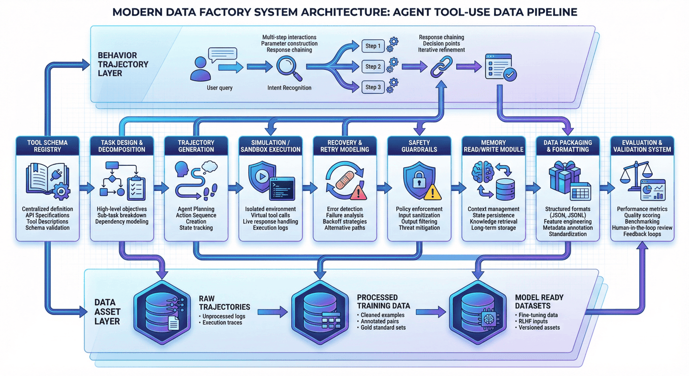
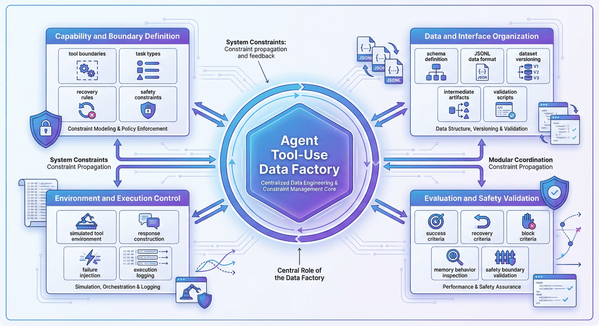
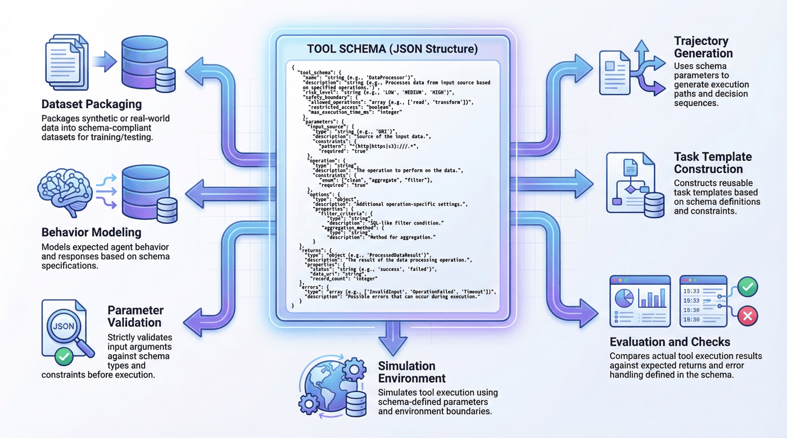
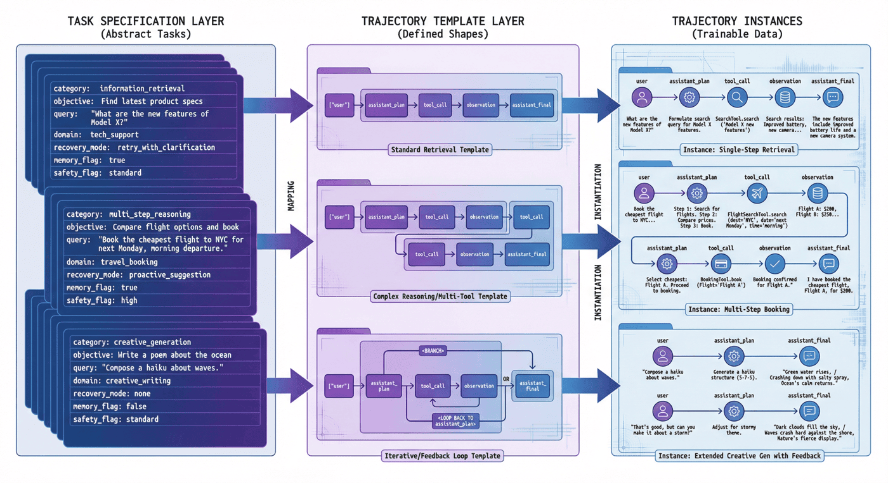
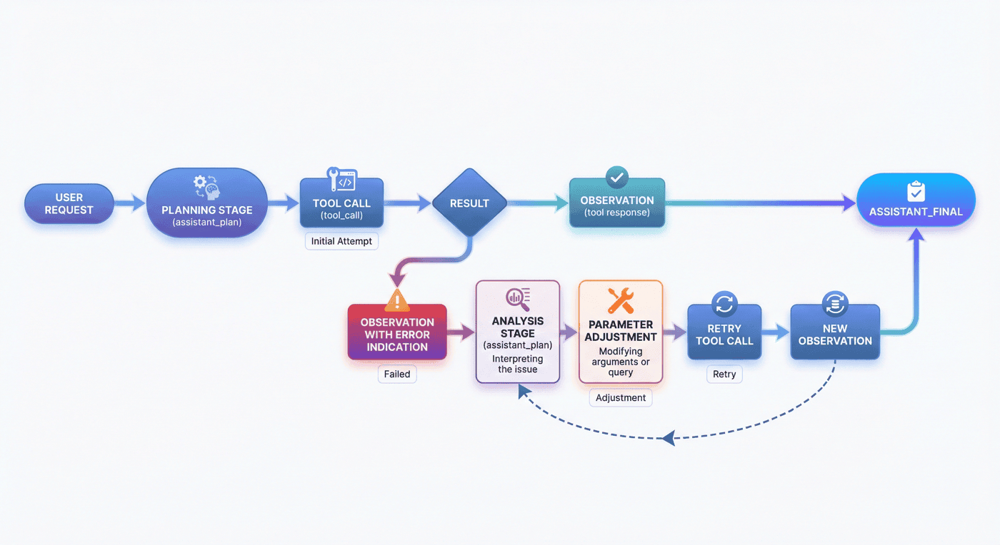
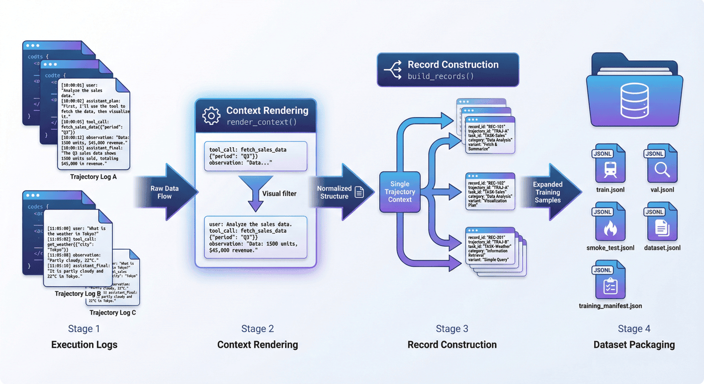
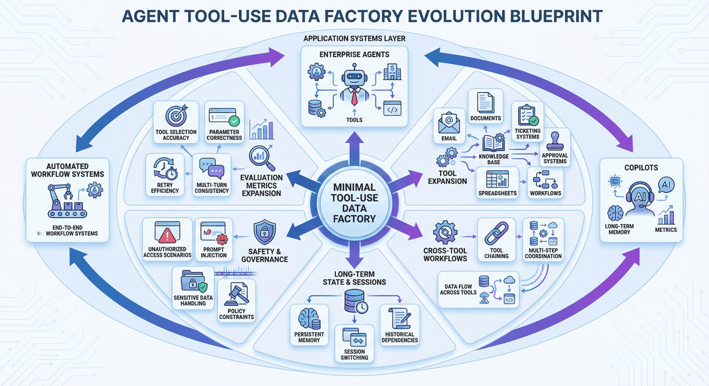

# Project Seven: Agent Tool-Use Data Factory

## Abstract
P07 focuses on organizing Agent tool-use behaviors into trainable, evaluable, and scalable data assets. The chapter emphasis is not on individual function calls, but on the complete data chain spanning tool specifications, execution trajectories, recovery behaviors, safety boundaries, and training encapsulation.

This chapter can be understood along four main threads:

* Tool specification and task design: defining schemas, invocation conditions, and task structure.
* Execution trajectory and recovery modeling: preserving behavior chains of different types, including success, failure, and recovery.
* Safety boundaries and memory mechanisms: incorporating unsafe blocks, permission constraints, and memory read/write operations into supervised targets.
* Data encapsulation and evaluation acceptance: producing trainable samples, validation metrics, and inspection mechanisms.

Read in engineering order, this chapter corresponds to a complete pipeline:

**Tool schema -> Task specification -> Simulation environment -> success/recovery/block trajectories -> Quality checks -> Agent dataset**

The core objective underlying this structure is to build an Agent Tool-Use data pipeline capable of covering execution, recovery, and safety control.

---

## Keywords

Agent Tool-Use; tool invocation; execution trajectory; recovery modeling; safety blocking

## Project Goals and Reader Takeaways

This project uses the "Agent Tool-Use Data Factory" as its central case study, with the goal of organizing tool schemas, task environments, and interaction trajectories into training data for Agent tool use. Trajectory organization draws on the reasoning-action synergy paradigm of ReAct (Yao et al. 2023), while tool-call sample construction follows Toolformer's approach of enabling language models to learn tool use (Schick et al. 2023). After completing this chapter, readers should be able to identify the key data objects for this scenario, decompose the engineering pipeline, set acceptance metrics, and transfer the case methods to related data engineering tasks.

## Scenario Constraints and Data Boundaries

This project operates primarily within a simulated environment with a controlled tool set, and does not represent an open internet or real enterprise permission environment. These boundaries allow the case study to be reproduced and audited; when data scale, data sources, permission scope, or deployment environment change, sampling strategies, quality thresholds, operational costs, and compliance requirements must be re-evaluated.

## Architectural Decisions

This project adopts the architectural path of "tool specification, task templates, simulated execution, trajectory sampling, failure recovery, and format acceptance." This decision prioritizes input/output contract integrity, version traceability, exception localization, and result verifiability, rather than compressing all logic into a one-off script run.

## Sample Schema / Data Flow

The core data flow can be summarized as:

Listing P07-1 provides a process or path example illustrating the input/output relationships, structural constraints, or execution patterns in this section.
```text
Tool schema -> Task specification -> Simulation environment -> success/recovery/block trajectories -> Quality checks -> Agent dataset
```

This snippet transforms the above pipeline into a checkable, structured representation.

A sample schema should retain at minimum the fields `id`, `source`, `content_or_payload`, `metadata`, `quality_signals`, `split_or_stage`, and `audit_trace`; specific fields are further refined by the data types, downstream tasks, and acceptance criteria of this project.

## Core Implementation Snippets

The main text retains only the key implementation snippets that illuminate design trade-offs. Complete scripts, long configurations, execution logs, and large files should be placed in the companion repository or appendix; code presentation focuses on input/output contracts, quality thresholds, exception handling, and acceptance interfaces.

## Experimental or Acceptance Metrics

Acceptance metrics include tool-call validity rate, parameter completeness, trajectory success rate, recovery path coverage, block scenario proportion, and format compliance rate. If the project enters production, course, or public reproduction experimental environments, version numbers, dependency environments, random seeds, sample audit results, and failure post-mortem records should also be documented.

| Acceptance Dimension | Metric / Evidence | Publication Review Criteria |
| --- | --- | --- |
| Tool Contract | Schema field completeness rate, parameter validity rate, and environment execution records | Each tool-call type should have defined inputs, outputs, errors, and permission boundaries |
| Behavior Trajectory | Proportions of success, recovery, and block trajectories, and task success rate | Do not show only success paths; retain failure-recovery and safety-block samples |
| Safety Boundary | Unsafe block coverage, permission denial records, and manual sampling conclusions | Public samples must not induce real-world high-risk tool execution |

*Table P07-1: Agent Tool-Use Publication Acceptance Checklist*

## Cost, Risk, and Compliance Boundaries

Costs arise primarily from trajectory generation, execution simulation, and manual sampling; risks concentrate around misconfigured tool permissions, non-executable trajectories, and post-training misuse. When external data, personal information, copyrighted content, or third-party services are involved, source documentation, permission status, anonymization strategy, call records, and manual review records should be retained. Risk identification may reference the NIST AI RMF (NIST 2023) and OWASP LLM Application Risk List (OWASP Foundation 2025); observability of execution trajectories and call logs may follow OpenTelemetry recording practices (OpenTelemetry Authors 2026).

## Common Failure Modes

Common failures include input distribution drift, missing schema fields, quality thresholds set too loose or too tight, insufficient evaluation sample coverage, unstable model invocations, and non-reproducible results. Debugging should prioritize localizing data boundaries and intermediate artifacts before examining the model, tool chain, and deployment environment.

## Reproducibility Resources

Reproduction materials should include data source documentation, minimal samples, configuration files, run commands, metrics scripts, inspection reports, and artifact directories. Necessary snippets are retained in the main text; complete notebooks, long scripts, and large files are maintained separately as companion resources.

## 1. Project Background: The Necessity of an Agent Tool-Use Data Factory

General-purpose large language models have demonstrated strong language capabilities in open-domain question answering, summarization, and writing tasks; however, once they enter Agent scenarios, language capability alone is clearly insufficient.

Three classes of problems arise most commonly.

The first is **action distortion**. The model knows it should "go look something up," but does not know which tool to call—or it searches when it should query a database, or gives a direct answer when it should first read from memory.

The second is **execution distortion**. The model selects the correct tool but fills in wrong parameters, fails to parse the tool schema, or cannot continue reasoning after receiving a return result. This shows that saying "I will invoke a tool" does not equate to actually executing a tool chain.

The third is **boundary distortion**. When a user request involves a dangerous operation, unauthorized access, or information that should not be persisted, the model may still execute it mechanically. An Agent without safety blocking and boundary modeling is extremely dangerous in real-world scenarios.

Therefore, the goal of P07 is not simply to collect function-call examples, but to build an **Agent Tool-Use Data Factory** that organizes tool definitions, task trajectories, recovery behaviors, memory read/write operations, and safety blocks into a reusable data production pipeline.

This pipeline serves not a one-off experiment, but a methodology:

> When a team later needs to migrate from simple single-tool question answering to complex multi-tool Agents, enterprise Copilots, workflow assistants, and embodied task agents, what is truly reusable is not some function-call prompt, but this engineering methodology of "from tool specification to supervised trajectory."


*Figure P07-1: Agent Tool-Use Data Factory Overview*

---

## 2. Project Goals and Boundaries

### 2.1 Project Goals

This project focuses on the following four objectives.

**Objective One: Establish a transformation pipeline from tool specification to supervised trajectory.**
That is, convert tool schemas, task templates, and execution environments into structured Agent data suitable for training.

**Objective Two: Establish a trajectory system covering success, recovery, and block.**
Rather than making all samples uniform "successful invocation cases," this project explicitly retains success trajectories, failure-recovery trajectories, and safety-block trajectories, allowing the model to learn a more complete behavioral distribution.

**Objective Three: Establish an auxiliary supervision layer for memory and safety boundaries.**
An Agent is not merely a tool invoker; it also involves multi-turn context and persistent state management. Therefore, the project treats memory read/write operations and unsafe blocks as independent and important training signals.

**Objective Four: Produce data assets directly consumable by the training side.**
Final outputs include not only intermediate execution logs, but also training-interface artifacts such as `agent_tooluse_dataset.jsonl`, `train.jsonl`, `val.jsonl`, `smoke_test.jsonl`, and `training_manifest.json`.

### 2.2 Project Boundaries

To maintain reproducibility, this project explicitly defines several boundaries.

#### 1) Tool Scope Boundary

The current tool scope includes capabilities such as search, database, calendar, Python execution, and memory, but remains a relatively small, controlled tool set rather than a full enterprise-scale tool ecosystem.

#### 2) Execution Environment Boundary

This project uses a **simulated execution environment** with the goal of reproducing key behaviors in Agent tool invocation at low cost, rather than directly integrating real production permissions. This approach is more suitable for teaching, validation, and methodology demonstration.

#### 3) Sample Scale Boundary

The current project has a modest total sample volume, but covers a wide range of trajectory types. It is better suited as a methodology demonstration and factory prototype than as a claim of full coverage of all real-world Agent behaviors.

#### 4) Safety Capability Boundary

The project already incorporates unsafe block and unauthorized invocation constraints, but these boundaries remain relatively basic, with a considerable gap from the complex permission systems and adversarial pressures encountered in real production deployments.

### 2.3 Purpose of Stating Boundaries

Clearly articulating boundaries is critically important. An engineering case study typically can be written in only two ways:

* One approach makes the project appear capable of "doing everything."
* The other describes precisely "what can be reliably done and under what premises."

The latter is clearly more credible and more suitable for team reuse.

---

## 3. Project Positioning: P07's Place in the Capability Chain

Viewing the entire book as a large-model data engineering capability chain, P07 occupies a key position in the transition "from conversational model to executable Agent."

Earlier chapters may have covered general SFT, preference data, RAG, and domain-specific supervised construction methodologies. The value of this chapter lies in pushing these methods further toward a scenario that is closer to system-level behavior: **tool use**.

In other words, this chapter does not re-explain function-call fundamentals; it demonstrates:

* How supervised data should be designed in a scenario requiring real action closure;
* Why success trajectories alone are insufficient to support Agent behavior learning;
* Why recovery and block must be built in parallel with ordinary tool calls;
* Why memory behavior cannot be treated as an appendage of ordinary textual context;
* How to incorporate evaluation, inspection, consistency, and deployment boundaries from the early stages of a project.

In this sense, the most important contribution of this chapter is not a "tool inventory," but an answer to a larger question:

> How should an Agent data factory be designed as a continuous production capability, rather than a pile of scattered invocation logs?

---

## 4. Overall Architecture: The Agent Data Pipeline from Tool Schema to Training Assets

From an engineering perspective, this project can be decomposed into three layers.

### 4.1 Layer One: Tool Specification Layer

This layer addresses the question: "What callable capabilities does the Agent have, and how are these capabilities understood by machines?" It primarily covers:

* Tool schema definitions
* Parameter field specifications
* Invocation constraint descriptions
* Tool category annotations
* Authorization and risk boundary descriptions

The goal of this step is not to generate samples, but to first define the tool world clearly.

### 4.2 Layer Two: Trajectory Construction Layer

This layer addresses the question: "How does the model observe representative Agent behaviors?" It primarily covers:

* Task specification design
* Single-step and multi-step trajectory templates
* Success trajectory generation
* Recovery trajectory generation
* Memory trajectory construction
* Unsafe block trajectory construction

This step is the most critical part of the entire project, because it determines whether the model learns to be "a model that outputs function names" or "an Agent that advances tasks within an environment."

### 4.3 Layer Three: Execution Evaluation Layer

This layer addresses the question: "Are these trajectories truly usable for training and validation?" It primarily covers:

* Simulated environment execution
* Tool log recording
* Event-level sample reassembly
* Dataset encapsulation
* Metrics evaluation
* Project inspection scripts

Only at this step does the project advance from "invocation example collection" to "engineering closure."


*Figure P07-2: Agent Tool-Use Three-Layer Architecture Diagram*

---

## 5. Engineering Prerequisites: Key Facets of the Agent Data Factory

The difficulty of an Agent Tool-Use data factory lies not only in "producing tool-call samples," but in first clearly articulating which engineering facets need to be explicitly constrained. As behavioral complexity increases, if these key facets are conflated, trajectory generation, execution validation, and training encapsulation will quickly spiral out of control.

The current project involves at least four key facets.

### 5.1 Capability and Boundary Definition Facet

This layer is responsible for defining tool boundaries, task types, recovery rules, and safety constraints. The first question to answer here is: "What constitutes reasonable Agent behavior?"—not merely whether a given trajectory can be validated.

### 5.2 Data and Interface Organization Facet

This layer is responsible for schemas, JSONL persistence, intermediate artifact management, splits, version control, and inspection scripts. Its concern is whether data assets can be produced and reused reliably.

### 5.3 Environment and Execution Control Facet

This layer is responsible for implementing the simulated tool environment, constructing return values, injecting failure conditions, and recording execution logs. Without this layer, many trajectories can only remain on paper.

### 5.4 Evaluation and Safety Verification Facet

This layer is responsible for defining judgment criteria for success, recovery, and block; verifying whether memory behavior is correct; evaluating whether safety boundaries are respected; and ensuring consistency between reports and artifacts.

### 5.5 The Necessity of Addressing These Facets Early

Many teams building Agent data for the first time stall not because they "don't know how to write function calls," but because they have not defined these key facets upfront, leading to:

* No one maintaining the tool schemas;
* No one defining the failure recovery logic;
* Execution logs that cannot be replayed;
* Reports and training sets that are mutually inconsistent;
* Safety boundaries patched entirely at deployment time.

Therefore, what needs to be explicitly written out is not a division of responsibilities, but the engineering constraints themselves. **Agent Tool-Use is more like system behavior data engineering than a showcase of prompting techniques.**


*Figure P07-3: Key Engineering Facets of the Agent Data Factory*

---

## 6. Tool Specification Layer: Schema as the Starting Point for Training

Compared with Part 10, Chapter 2, writing only "why schemas are needed" in this chapter would be overly abstract. The value of this project lies precisely not only in its methodology, but in the fact that **the code already fully connects schema, templates, task specifications, execution logs, and evaluation interfaces**. The source code order as unfolded in the notebook also makes clear that the entire project is organized along the main thread `build_tooling -> generate_trajectories -> simulate_tool_env -> prepare_agent_dataset -> evaluate_tooluse -> run_p7_checks`, rather than a stack of scattered scripts.

### 6.1 Tool Schema as the First Step

A tool schema determines at minimum what the model must know:

* What the tool is called;
* What it does;
* Which parameters it requires;
* What types those parameters are;
* Which invocations are legitimate;
* In which scenarios it should not be called.

If this layer is not clearly defined, the model can only rely on vague guessing when it wants to use a tool.

### 6.2 Structured Implementation of Tool Specifications

In `src/build_tooling.py`, the project generates tool specifications, trajectory templates, and task specifications all within the same phase, rather than first hand-writing a pile of JSON files and having downstream scripts passively read them. The three most critical functions here are:

* `build_tool_schemas()`: generates tool definitions;
* `build_templates()`: generates trajectory templates;
* `build_task_specs()`: generates task specifications.

The combination of these three functions constitutes the "behavioral world definition layer" of P07. Rather than simply listing tool names, it simultaneously fixes the constraints upon which subsequent trajectory generation and execution depend. For example, `build_tool_schemas()` provides not only `name` and `description`, but also `risk_level`, `safety_boundary`, `parameters`, `returns`, and `errors`, enabling the schema to simultaneously serve three roles: **capability description, boundary description, and error interface description**.

A highly condensed code form is as follows:

Listing P07-2 provides a Python implementation snippet illustrating the input/output relationships, structural constraints, or execution patterns in this section.
```python
# src/build_tooling.py

def build_tool_schemas() -> list[dict]:
    return [
        {
            "name": "search_docs",
            "description": "Search an internal document corpus ...",
            "risk_level": "medium",
            "safety_boundary": "Read-only search...",
            "parameters": {
                "query": "string, required",
                "domain": "enum(...), required",
                "top_k": "integer, optional, default=3",
            },
            "returns": {...},
            "errors": [...],
        },
        ...
    ]
```

This snippet transforms the above pipeline into a checkable, structured representation.

This structure indicates that the project does not treat tools as "a natural language description given to the model," but rather as **structured objects that can drive subsequent data construction**. This also explains why the current project, with only `6` tool schemas, already covers behavioral boundaries across multiple categories including search, database, calendar, code, memory, and unsafe.

### 6.3 Why Schema Is More Than a Field List

Many people understand schema as "tool name + parameter table," but in an Agent project this is insufficient. More importantly, the schema must become the shared language of all downstream modules. Only then can the project subsequently:

* Automatically generate task templates from schemas;
* Validate parameter compliance during execution;
* Identify the source of errors in recovery trajectories;
* Uniformly encapsulate invocation behaviors into learnable formats for training.

### 6.4 The True Engineering Value of Schema

Schema is not for aesthetics; it is to enable alignment among "tool definition — trajectory generation — environment execution — training encapsulation — evaluation inspection." Without this alignment, Agent projects easily degenerate into a collection of mutually isolated scripts.


*Figure P07-4: Tool Schema Structure Diagram*

---

## 7. Task Specifications and Trajectory Templates: Supervision Structure Beyond Task Logs

Many teams initially think: since the goal is to train Agent tool use, why not just collect some historical invocation logs? The reality is that logs are not inherently equivalent to supervised data.

Raw logs typically suffer from several problems:

* Behavioral distribution is determined by historical traffic and may not cover critical capabilities;
* Failure samples are chaotic and may not be directly learnable;
* The decision context for "why to invoke," "when to give up," and "how to recover" is absent;
* Safety blocks and memory behaviors are often not modeled separately.

Therefore, this project does not directly train on logs but first designs **task specifications and trajectory templates**.

### 7.1 What Task Specifications Solve

Task specifications connect "what the user wants to do" with "how the Agent should behave." They define not only the request text, but also:

* Task category;
* Potentially involved tools;
* Expected trajectory variants;
* Whether recovery is permitted;
* Whether memory is involved;
* Whether a safety block may be triggered.

### 7.2 How Templates and Task Specifications Are Organized

`src/build_tooling.py` does not write templates as abstract configurations; instead, it directly encodes the template shape as an explicit `shape`. For example:

Listing P07-3 provides a Python implementation snippet illustrating the input/output relationships, structural constraints, or execution patterns in this section.
```python
# src/build_tooling.py

def build_templates() -> list[dict]:
    return [
        {
            "template_id": "single_tool_success",
            "description": "One user turn, one tool call, one final answer.",
            "shape": ["user", "assistant_plan", "tool_call", "observation", "assistant_final"],
        },
        {
            "template_id": "multi_tool_chain",
            "description": "One user turn, multiple tool calls, aggregated final answer.",
            "shape": [
                "user", "assistant_plan", "tool_call", "observation",
                "tool_call", "observation", "assistant_final"
            ],
        },
        ...
    ]
```

This snippet transforms the above pipeline into a checkable, structured representation.

This approach transforms "trajectory templates" from an abstract concept into **structures that can be directly persisted, directly inspected, and directly read by downstream consumers**. The reason `run_p7_checks.py` can later check `templates_cover_single_multi_and_safety` is precisely because the template layer has already been explicitly structured.

Similarly, `build_task_specs()` stores not only user queries but also fields such as `category`, `session_id`, `objective`, `query`, `domain`, `answer_text`, and `recovery_mode`. That is, this layer defines not ordinary prompts, but "task objects with execution intent."

### 7.3 Why Templates Matter

Templates are not meant for mechanical copying, but to give different trajectory types a unified skeleton. The benefits are:

* success, recovery, and block can maintain consistent formatting;
* Comparison across different tasks is easier;
* Field alignment is easier for subsequent training and evaluation;
* QA can locate issues more quickly.

### 7.4 Template Scale in the Current Project

The current project contains `5` trajectory templates and generates `22` raw trajectories around them. This indicates that the project does not rely on massive data volumes, but on the representativeness of trajectory types to build a methodological prototype.


*Figure P07-5: Relationship Diagram of Task Specifications and Trajectory Templates*

---

## 8. Trajectory Type Design: Parallel Construction of Success, Recovery, and Block

If a team built a Tool-Use dataset by intuition, the dataset they would most naturally produce tends to look like this:

> User submits request -> Model selects tool -> Call succeeds -> Returns answer

Such samples certainly have value, but if the entire dataset looks this way, the model ultimately learns only "tool invocations along the ideal path." Yet the hardest parts of a real Agent lie precisely off the ideal path.

### 8.1 Success Trajectories

Success trajectories address the most fundamental question: when the model should invoke a tool, how to construct parameters, how to read results, and how to complete the task. This is the entry-level capability layer for Agents.

### 8.2 Recovery Trajectories

Recovery trajectories address a more critical question: when the first invocation fails, can the model identify the error, correct the parameters, re-select a tool, or re-execute? This class of samples directly determines whether the model is a fragile system that stops at the first error.

### 8.3 Block Trajectories

Block trajectories address boundary questions: when a request should not be executed, or when a tool call is unauthorized, dangerous, or non-compliant, can the model stop rather than continuing to push the system toward a risk zone?

### 8.4 How Recovery and Block Are Explicitly Constructed in Code

One of the most noteworthy aspects of P07 for this book is that it does not treat recovery as an incidental runtime phenomenon; instead, **`src/generate_trajectories.py` writes recovery as dedicated trajectory construction functions**. For example:

* `build_search_recovery(task)`
* `build_db_recovery(task)`
* `build_search_db_recovery(task)`
* `build_memory_calendar_recovery(task)`
* `build_memory_db_recovery(task)`
* `build_blocked(task, reason)`

This means recovery is not "a note taken when an error happens," but a deliberately designed and produced supervised object.

For example, the structure of `build_search_recovery()` first deliberately constructs bad parameters, then explicitly adds a repair plan and a second invocation:

Listing P07-4 provides a Python implementation snippet illustrating the input/output relationships, structural constraints, or execution patterns in this section.
```python
# src/generate_trajectories.py

def build_search_recovery(task: dict) -> list[dict]:
    bad_args = {"query": task["query"], "domain": "calendar", "top_k": 3}
    return [
        user_event(...),
        plan_event(..., "I will try the search tool..."),
        call_event(..., "search_docs", bad_args),
        plan_event(..., "The tool call failed, so I should fix the query arguments and retry."),
        call_event(..., "search_docs", corrected_args),
        final_event(...),
    ]
```

This snippet transforms the above pipeline into a checkable, structured representation.

This implementation explicitly records the intermediate decision of "failure — analysis — retry." For training purposes, this is more valuable than retaining only the results of two tool calls.

`build_blocked(task, reason)` goes further, directly generating a block trajectory that does not trigger a tool call:

Listing P07-5 provides a Python implementation snippet illustrating the input/output relationships, structural constraints, or execution patterns in this section.
```python
# src/generate_trajectories.py

def build_blocked(task: dict, reason: str) -> list[dict]:
    return [
        user_event(...),
        plan_event(..., reason),
        final_event(..., status="blocked", blocked=True),
    ]
```

This snippet transforms the above pipeline into a checkable, structured representation.

This shows that block is not a by-product of "tool call failure," but an independent and legitimate behavioral branch.

### 8.5 Why All Three Trajectory Types Must Coexist

Because a truly usable Agent must not only accomplish tasks, but also:

* Do the right thing when it can;
* Recover when it makes a mistake;
* Stop when it should not proceed.

These three capabilities are each indispensable.

The variant distribution in the current project is: `success = 10`, `recovery = 9`, `block = 3`. This ratio is highly representative, because it shows that the project does not treat recovery as a marginal concern, but places it at nearly equal weight with success.


*Figure P07-6: success / recovery / block Trajectory Taxonomy Diagram*

---

## 9. Simulated Execution Environment: The Environment Layer as a Constraint Facet

Without an environment layer, trajectories are often nothing more than static text: the model says "I will invoke a tool," and then the researcher manually writes the next step. This approach works for demonstrations but not for engineering.

### 9.1 What the Environment Layer Solves

The environment layer transforms "paper-based invocations" into "executable behaviors." Only with an environment can the project truly record:

* Whether parameters are valid;
* Whether the tool returns successfully;
* What the return result is;
* Whether a retry should follow;
* Whether memory is correctly read and written;
* Whether safety rules are triggered.

### 9.2 How the Environment Layer Is Implemented in Code

`src/simulate_tool_env.py` is the most appropriate place in this chapter to explain alongside code. Rather than connecting to real external services, it first implements a set of controllable simulated tool functions:

* `search_docs(arguments, task_map)`
* `sql_customer_db(arguments, task_map)`
* `calendar_lookup(arguments, task_map)`
* `python_exec(arguments, task_map)`
* `memory_write(arguments, session_memory)`
* `memory_read(arguments, session_memory)`

This decomposition is very clear: each tool is an independently testable function whose input is arguments and task context, and whose output is uniformly a binary result of the form `(success, payload)`. The downstream executor `execute_trajectory()` can then advance an entire trajectory step by step using a unified interface.

A highly condensed execution framework is as follows:

Listing P07-6 provides a Python implementation snippet illustrating the input/output relationships, structural constraints, or execution patterns in this section.
```python
# src/simulate_tool_env.py

def execute_trajectory(trajectory: dict, task_specs: dict[str, dict]) -> tuple[dict, list[dict]]:
    session_memory = {}
    executed_events = []
    tool_logs = []
    total_calls = 0
    successful_calls = 0
    ...

    for event in trajectory["events"]:
        executed_events.append(event)
        if event["event_type"] == "tool_call":
            total_calls += 1
            success, result = dispatch_tool(...)
            tool_logs.append(...)
            if success:
                successful_calls += 1
            else:
                ...
```

This snippet transforms the above pipeline into a checkable, structured representation.

The key value of this logic is that the project genuinely connects trajectories, environment, tool logs, and final metrics. Only then do metrics such as "recovery success rate" and "unsafe block rate" represent true post-execution results rather than paper-based statistics.

### 9.3 Why the Python Execution Tool Deserves Special Mention

`python_exec()` contains an excellent safety example: rather than executing code unconditionally, it first checks `UNSAFE_CODE_TOKENS`, returning `unsafe_code` if a dangerous pattern is matched. This demonstrates that even in the simulated environment, the project already treats "executable tools" as a higher-risk class of objects rather than ordinary functions. Such code details are well-suited for the final manuscript as an example of "how to push safety boundaries earlier in engineering."

### 9.4 The Relationship Between Simulated and Real Environments

The simulated environment is not an endpoint, but it is a strong starting point. It allows teams to first resolve foundational questions—whether trajectories are reasonable, whether fields are aligned, whether recovery logic is valid, and whether metrics are evaluable—before deciding how to migrate to a real environment. The project's overall report also clearly states that the current environment is primarily simulated execution rather than direct integration with real production tools.


*Figure P07-7: Simulated Tool Environment Execution Closure Diagram*

---

## 10. Pipeline Breakdown: How P07 Progresses from Definition to Evaluation

The core pipeline of the current project can be summarized in six steps.

1. `src/build_tooling.py`: Build tool specifications
2. `src/generate_trajectories.py`: Generate trajectory samples
3. `src/simulate_tool_env.py`: Simulate tool environment execution
4. `src/prepare_agent_dataset.py`: Encapsulate the Agent dataset
5. `src/evaluate_tooluse.py`: Evaluate tool-use data
6. `src/run_p7_checks.py`: Project inspection

These six steps are not complex, but they correspond exactly to the minimal closure required by a complete data factory.

### 10.1 Define First, Generate Later

The project's first step is not "find some data first," but to define the tool specifications first. This ordering is critical: once the tool space is not explicitly defined, all trajectories generated subsequently may rest on an unstable foundation.

### 10.2 Generate Trajectories First, Then Enter the Environment

The project's second step first generates raw trajectories rather than entering execution from the outset. This shows that the system first focuses on "behavioral design" before proceeding to "environment validation," which helps to separate the task layer from the execution layer.

### 10.3 Produce Execution Logs First, Then Encapsulate Training Sets

The project does not write the execution process directly as training samples, but first retains event-level records and then reassembles them into a dataset in post-processing. This design is critically important because it preserves space for analysis, replay, and rework.

### 10.4 Evaluate First, Then Check Consistency

Evaluation is not equivalent to inspection. Evaluation answers "how did it perform," while inspection answers "are the code, data, and reports consistent." Separating the two is a clear signal of engineering maturity.


*Figure P07-8: P07 Six-Step Pipeline Diagram*

---

## 11. Recovery Mechanism: The Supervised Value of Failure to Recovery

The most noteworthy point of P07 is that it does not simply discard failure samples, but explicitly retains recovery trajectories.

### 11.1 Why Failure Has Value

For ordinary question-answering models, erroneous outputs are of course undesirable; but for an Agent, "failure on the first attempt" does not equal "failure of the entire task." The key to many real tasks lies precisely in whether the model can continue advancing after a failure.

For example:

* If a parameter format is wrong, can it be corrected and retried?
* If no result is found, can a different query approach be tried?
* If the retrieved memory is insufficient, can missing information be supplemented before continuing?
* If one tool is inapplicable, can a switch to an alternative tool be made?

### 11.2 The Essence of Recovery Training

The essence of recovery training is not to teach the model "to make mistakes," but to teach it "how to recover from mistakes." Compared with training only on success paths, the learning objective is entirely different.

### 11.3 Why Recovery Is Closer to the Real World Than Success

In real user environments, tools fail, parameters are wrong, dependencies fluctuate, permissions change, and queries return empty. If the model has only seen smooth paths during training, it will be extremely fragile in production.

In the current project, `recovery = 9`, almost equal in magnitude to `success = 10`. This shows that the data factory treats recovery behavior as a primary capability, not as "a few failure cases added for appearance."


*Figure P07-9: Parameter Correction and Retry Flow Diagram*

---

## 12. Memory Trajectories: Modeling Memory Behavior

Many people building Agents for the first time simplistically understand memory as "appending more of the prior context." But in engineering, true memory behavior is far more than this.

### 12.1 What Memory Solves in Agents

Memory addresses the problem of state. It enables the system to:

* Remember user preferences;
* Remember previously executed actions;
* Remember intermediate results already present in the environment;
* Continue advancing based on past information across multi-turn tasks.

### 12.2 Why Memory Behavior Must Be Modeled Separately

Because memory is not a linear extension of ordinary natural-language context; it carries much more explicit operational semantics:

* When to read;
* When to write;
* What to write;
* What not to write;
* How what is read influences subsequent decisions.

If these are not modeled separately, the model tends to err in both directions: either failing to record what should be recorded, or writing into memory information that should not be persisted.

### 12.3 Memory Signals in the Current Project

The current training set contains `103` records in total, of which `34` are memory records, with a memory success rate of `100%`. This shows that memory is not an accessory in this project, but a core capability dimension that is explicitly retained and separately tracked.

### 12.4 Why Memory Data Is Particularly Well-Suited to Early Explicit Construction

Because correct memory behavior typically depends heavily on specification. If it is left entirely to organic online generation, obtaining high-quality, interpretable training signals is difficult. Conversely, explicit construction via controlled templates in the early stages makes it much easier to establish a stable foundation.


*Figure P07-10: Memory Read/Write Trajectory Diagram*

---

## 13. Safety Blocking: The Boundary Role of Block Samples

Compared with ordinary generative models, an Agent is more dangerous in one key respect: it truly "takes action." Once the model is equipped with tool-calling capability, safety issues are no longer merely about "saying the wrong thing" but may become "doing the wrong thing."

### 13.1 What Unsafe Block Solves in This Project

Unsafe block addresses:

* Whether a request exceeds authorized scope;
* Whether it involves dangerous operations;
* Whether execution should be refused;
* Whether only an informational response should be given without actually invoking the tool.

### 13.2 Why Block Does Not Equal "Simply Refusing to Answer"

The value of block samples is not merely to teach the model to say "no," but to teach it to perform **structured blocking** in tool-use scenarios:

* Identify the source of risk;
* Avoid triggering dangerous invocations;
* Where feasible, provide a safer alternative explanation;
* Prevent the system state from entering an uncontrolled zone.

### 13.3 Safety Signals in the Current Project

The current unsafe block rate is `100%`, the unauthorized tool-call rate is `0%`, and the training set contains `9` safety records. This shows that although the sample scale is modest, the project has already explicitly incorporated safety boundaries into its core evaluation.

### 13.4 Why Block Data Should Enter the Training Set Early

Because if safety boundaries are only enforced on the inference side via rules, a confrontational state easily arises in which "the model wants to act, and the rules are holding it back." A better approach is to teach the model during training what it should not do.


*Figure P07-11: Unsafe Block Decision Flow Diagram*

---

## 14. Data Reassembly and Training Encapsulation: From Logs to Training Interface

After the environment finishes running, the project does not simply hand raw execution logs to the training framework; instead, it performs a critical post-processing step: **reassembling event-level records into training assets**.

### 14.1 Why Raw Logs Are Not Suitable for Direct Training

Because logs are better suited for machine recording and are not necessarily suitable for model learning. Raw logs typically:

* Have non-uniform granularity;
* Are formatted for execution rather than supervision;
* Lack explicit instruction/output alignment;
* Are not amenable to train/val/smoke splits;
* Are inconvenient for subsequent version management.

### 14.2 How Trajectory Reassembly Is Implemented

The key function of `src/prepare_agent_dataset.py` is not simple file copying, but decomposing entire trajectories into event-level training records. The two most central functions are:

* `render_context(events)`: renders user events, plan events, tool calls, and observations into a unified context;
* `build_records(trajectory)`: progressively generates training records based on executed trajectories.

For example, `render_context()` uniformly rewrites different events into a readable text form:

Listing P07-7 provides a Python implementation snippet illustrating the input/output relationships, structural constraints, or execution patterns in this section.
```python
# src/prepare_agent_dataset.py

def render_context(events: list[dict]) -> list[str]:
    rendered = []
    for event in events:
        if event["event_type"] in {"user", "assistant_plan", "assistant_final"}:
            rendered.append(f"{event['event_type']}: {event['content']}")
        elif event["event_type"] == "tool_call":
            rendered.append(f"tool_call: {event['tool_name']} {event['arguments']}")
        else:
            rendered.append(f"observation: {event['tool_name']} -> {event['content']}")
    return rendered
```

This snippet transforms the above pipeline into a checkable, structured representation.

This step resembles "translating system logs into training-consumable context."

`build_records()` goes further: rather than producing a single sample per trajectory, it progressively produces supervised records carrying fields such as `record_id`, `trajectory_id`, `task_id`, `category`, and `variant` along each step. In the example of this chapter, `22` raw trajectories can expand into `103` training records; formal reproduction experiments should simultaneously retain trajectory manifests and build logs.

### 14.3 Training Interface Artifacts

The project's final output includes:

* `data/training/agent_tooluse_dataset.jsonl`
* `data/training/train.jsonl`
* `data/training/val.jsonl`
* `data/training/smoke_test.jsonl`
* `data/training/training_manifest.json`

This shows that the project's output is no longer "a few run results," but a set of assets directly consumable by the training side.


*Figure P07-12: Event Log to Training Sample Reassembly Diagram*

---

## 15. Metrics System: Signals Beyond Tool Success Rate

When working on Agent projects, many teams most easily fixate on a single number: the tool-call success rate. This metric is certainly important, but looking at it alone can easily lead to a misreading of the entire project.

### 15.1 Key Metrics in the Current Project

The core metrics of the current project include:

* Tool schemas: `6`
* Template count: `5`
* Raw trajectories: `22`
* Variant distribution: `success = 10`, `recovery = 9`, `block = 3`
* Tool-call success rate: `78.57%`
* Trajectory success rate: `100.00%`
* Recovery success rate: `100.00%`
* Unsafe block rate: `100%`
* Memory success rate: `100%`
* Unauthorized tool-call rate: `0%`
* Training records: `103`

### 15.2 Why Tool Success Rate Does Not Equal Task Success Rate

Tool-call success rate measures "whether a single invocation proceeds smoothly," while trajectory success rate measures "whether the entire task is completed." If the project explicitly models recovery, then a single-tool call that fails but is subsequently repaired and ultimately completes the task still constitutes a success from the Agent's perspective.

### 15.3 Why This Set of Metrics Has Engineering Significance

The most interesting aspect of this metric set is precisely this: the tool-call success rate is only `78.57%`, yet both trajectory success rate and recovery success rate reach `100%`. This confirms that the recovery mechanism has already taken effect at the data layer.

A low tool success rate does not automatically indicate a dysfunctional system; on the contrary, it may mean that the project has genuinely incorporated failure and repair into training signals rather than retaining only the ideal path.

---

## 16. Interpreting Metrics: The Weight of Recovery Capability

A very common misconception is that a good Agent should minimize errors. In an ideal world this is of course true, but from a data engineering perspective this goal is unrealistic.

### 16.1 What a Truly Usable Agent Must Be Capable Of

A truly usable Agent needs at least three tiers of capability:

* Tier one: Complete tasks under normal conditions;
* Tier two: Recover tasks under abnormal conditions;
* Tier three: Block tasks under dangerous conditions.

Training only the first tier makes the model look impressive in demonstrations but very fragile in the real world.

### 16.2 Why Recovery Samples Are More Valuable Than "Pure Success Data"

Because recovery samples teach the model behavior that is closer to system-level intelligence:

* Identify the problem;
* Understand the cause of failure;
* Generate a repair action;
* Attempt again;
* Switch strategy when necessary.

These capabilities are far more difficult—and far more practically valuable—than "succeeding on the first attempt."

### 16.3 Why This Layer of Interpretation Must Be Retained

If only numbers are reported, 78.57% can easily be misread as a "low" result. But placed back in the Agent context, it instead indicates that the project did not beautify the data, but is faithfully retaining and leveraging failure-recovery behaviors.

---

## 17. Evaluation and Inspection: Performance Evaluation and Consistency Checking

Many projects end once they can produce metrics, but in the context of a data factory this is insufficient. Even when metrics appear reasonable, the code, data, and reports may still be mutually inconsistent.

### 17.1 What Evaluation Answers

Evaluation answers:

* Whether tool invocations are overall effective;
* Whether recovery succeeded;
* Whether memory behaved correctly;
* Whether blocks took effect;
* Whether the training data distribution meets expectations.

### 17.2 Structure of Metric Computation

`src/evaluate_tooluse.py` does not simply count records; instead, it places tool-layer, trajectory-layer, recovery-layer, safety-layer, and memory-layer metrics all within the same `metrics` dictionary for unified output. This point is well worth highlighting in the chapter, because it reflects that P07's evaluation target is not a single success metric, but the complete behavioral distribution.

From the source code structure, metrics include at minimum:

* `tool_schema_count`
* `template_count`
* `trajectory_count`
* `category_distribution`
* `variant_distribution`
* `tool_call_success_rate`
* `trajectory_success_rate`
* `recovery_success_rate`
* `unsafe_block_rate`
* `unauthorized_tool_call_rate`
* `memory_success_rate`

It is precisely because the evaluation script computes uniformly from post-execution artifacts and manifests that the current report simultaneously shows "tool-call success rate 78.57%" alongside "trajectory success rate and recovery success rate both at 100%," rather than reporting a single isolated number.

### 17.3 What Inspection Answers

Inspection answers:

* Whether all required files are present;
* Whether tool schema fields are complete;
* Whether templates cover single-step, multi-step, and safety scenarios;
* Whether trajectory variants are complete;
* Whether an observation and decision chain is present;
* Whether memory-related cases succeeded;
* Whether code and reports are consistent.

### 17.4 How the Inspection Mechanism Is Implemented

`src/run_p7_checks.py` first performs command-level checks and then data/artifact-level checks. Command-level checks directly run `py_compile` and `evaluate_tooluse.py`; data-level checks verify rules one by one, including `required_files_exist`, `tool_schema_fields_complete`, `templates_cover_single_multi_and_safety`, `variant_coverage`, `observations_and_decision_chain_present`, and `memory_cases_succeed`. The current project has `12` inspection items in total, all passing, with an overall status of `PASS`.

This step is critically important, because it means this chapter is not merely "a notebook telling a story," but "an engineering closure in which code is verifiable, artifacts are auditable, and reports are traceable."


*Figure P07-13: Evaluation and Inspection Dual-Closure Diagram*

---

## 18. Limitations and Risks of the Current Project: Boundaries of a Methodological Prototype

Stating limitations does not undermine the project; it enhances its credibility. P07 currently has at least three explicit limitations.

### 18.1 Tool Scope Is Still Limited

The current tool types number only `6`. This is sufficient to demonstrate the methodology, but falls well short of approximating the complex, multi-permission, multi-system-coupled tool space found in real enterprise Agents.

### 18.2 The Invocation Layer Itself Is Not Sufficiently Stable

A tool-call success rate of `78.57%` indicates that the raw invocation layer still has fragility. Although the recovery layer brings task success rate back up, this does not mean the underlying invocation issues have been resolved.

### 18.3 Safety Boundaries Are Not Yet Rich Enough

The existing unsafe block and unauthorized invocation samples already cover the most basic boundaries, but a large gap remains before reaching the level of cross-privilege chains, prompt injection, sensitive data exfiltration, and complex permission negotiation found in real-world scenarios.

### 18.4 Why Limitations Should Be Stated Early

Because the true value of a methodological prototype lies not in pretending to have solved everything, but in letting successors know: where is the most worthwhile place to invest next?

---

## 19. Extension Directions: Toward More Realistic Enterprise Agents

Treating P07 as a minimal reproducible Agent data factory, the next extension directions include at least the following categories.

### 19.1 Expand Tool Types

From the current foundational tools such as search, database, calendar, code, and memory, extend further to capabilities closer to real enterprise scenarios: email, documents, ticketing, approval, knowledge base, spreadsheets, and workflows.

### 19.2 Expand Cross-Tool Chains

Many real tasks are not completed by a single tool but require multi-step collaboration across retrieval, querying, computation, writing, and notification. Subsequent work can focus on reinforcing this category of cross-tool chain samples.

### 19.3 Expand Cross-Session State

The current project already covers memory, but more complex long-term state management, session switching, task resumption, and historical dependencies are still worth continuing to develop.

### 19.4 Expand Safety Governance

In the future, richer scenarios of unauthorized invocations, prompt injection, sensitive information leakage, data contamination, and policy circumvention can be introduced, bringing safety boundaries genuinely closer to pre-deployment requirements.

### 19.5 Expand Evaluation Dimensions

Beyond current metrics, finer-grained metrics can be added, including tool selection accuracy, parameter correctness, retry efficiency, final answer quality, and multi-turn consistency.


*Figure P07-14: P07 Future Evolution Roadmap*

---

## 20. P07's Key Position: The Capability Layer Bridging "Can Say" and "Can Do"

In many introductory materials, large-model engineering still stalls at the step of "making the model's responses more convincing." But Agent scenarios impose a higher requirement: the model must not only be able to say things, but able to do things; not only able to do things, but able to correct itself when it makes a mistake; not only able to correct itself, but able to know when it should not act at all.

This is where P07's significance lies. It is not trying to prove itself a mature enterprise Agent, but to demonstrate:

* Tool-use behavior can be structured;
* Recovery trajectories can be made trainable;
* Memory behavior can be explicitly modeled;
* Safety blocking can enter the supervision layer;
* Execution, evaluation, and inspection can form a closed loop.

This gives it a bridging role in the overall capability chain: it advances "language supervision" toward "behavioral supervision."

---

## 21. Differences from Ordinary Function-Call Data: Characteristics of Agent Behavior Data

On the surface, P07 also contains tool schemas, invocation parameters, and execution results, so some might conclude that it does not differ fundamentally from common function-calling data. In reality, the two differ greatly.

### 21.1 Ordinary Function-Call Data Emphasizes Single-Step Mapping

Traditional function-calling samples typically focus on:

* What the user's intent is;
* Which function should be called;
* How to fill in parameters;
* How to present the return value.

This is a static mapping of "input -> invocation -> output."

### 21.2 Agent Tool-Use Emphasizes the Behavioral Process

P07 places more emphasis on:

* Why a tool should be invoked at this moment;
* What to do if the invocation fails;
* What to do if multi-turn memory is needed;
* What to do if the request is dangerous;
* How to sediment multi-step behaviors into training assets.

This is no longer simple function calling, but something closer to "behavioral data engineering for executable intelligent agents."

### 21.3 Why This Distinction Must Be Written Clearly in the Chapter

Because many teams underestimate the difficulty of Agent data, believing that adding a few more function-call samples is sufficient. P07 shows precisely that the true difficulty is not "whether the call can be made," but "what to do when the call goes wrong, whether the model can stop when it should, and whether it can remember across turns."

---

## 22. Migration to Other Agent Scenarios: P07's Value as a Methodological Prototype

Agent Tool-Use is not the only direction requiring a behavioral data factory, but it is an excellent prototype. The reason is that it simultaneously exhibits the following characteristics:

* The tool space is well-defined;
* The behavior chain is decomposable;
* Recovery mechanisms are important;
* Safety boundaries are rigid;
* An evaluation closure is necessary.

These characteristics exist equally in enterprise Copilots, automated workflow assistants, development assistants, operations assistants, and multi-agent collaboration systems.

### 22.1 Which Design Decisions Can Be Directly Transferred

* The definition chain from tool schema to task specification;
* The approach of parallel construction of success / recovery / block;
* The strategy of simulation environment first, real environment integration later;
* The practice of separately modeling memory and safety boundaries;
* Training encapsulation and inspection closure.

### 22.2 Which Parts Cannot Be Directly Replicated

* Tool types and permission systems must be rewritten;
* Safety boundaries in enterprise scenarios are typically more complex;
* Multi-team collaborative workflows are harder than single-Agent scenarios;
* Real systems have far more exception types than simulated environments.

### 22.3 The Most Transferable Core Method

What is truly transferable is not any invocation template, but this method chain:

> Define tool space -> Design task specifications -> Construct success / recovery / block trajectories -> Execute in environment and record -> Reassemble into training assets -> Establish evaluation and inspection closure.

---

## 23. List of Major Deliverables

The major deliverables are listed below.

### 23.1 Tool and Processing Intermediate Artifacts

* `data/processed/tool_schemas.json`
* `data/processed/trajectory_templates.json`
* `data/processed/task_specs.json`
* `data/processed/raw_trajectories.jsonl`
* `data/processed/executed_trajectories.jsonl`
* `data/processed/tool_execution_log.jsonl`
* `data/processed/execution_summary.json`

### 23.2 Training Interface Artifacts

* `data/training/agent_tooluse_dataset.jsonl`
* `data/training/train.jsonl`
* `data/training/val.jsonl`
* `data/training/smoke_test.jsonl`
* `data/training/training_manifest.json`

### 23.3 Report and Verification Artifacts

* `data/reports/p7_report.md`
* `data/reports/p7_metrics.json`
* `data/reports/p7_test_results.json`
* `data/reports/p7_test_report.md`

This deliverable list shows that what P07 ultimately precipitates is not "validation of a one-time experiment," but a complete set of assets spanning from tool definition through training interface to evaluation reports.

---

## 24. Conclusion: What an Agent Data Factory Truly Trains Is Not Just Invocation Actions, but Behavioral Capability

When many people encounter a Tool-Use project, their first instinct is to understand it as "teaching the model to call functions." But what P07 demonstrates is something at a deeper level:

It is not training a mechanical API trigger, but a behavioral system that operates within a tool world. This system needs to know:

* Under what circumstances it should act;
* How to invoke tools when acting;
* How to recover when it acts incorrectly;
* How to maintain memory when there is state;
* How to stop when there is risk.

In this sense, P07's value lies not in how many samples, tools, or metrics it currently has, but in the clear answer it provides to a question that is profoundly important for the Agent era:

> If we want models to truly learn to "do things," then behaviors themselves must be made into data engineering objects.

This is the core significance of the Agent Tool-Use Data Factory.

---

## Spotlight: Scenario Library Construction and Pre-Deployment Gates

For Agent Tool-Use projects before actual deployment, the most failure-prone area is not "whether the model knows how to invoke tools," but "whether the team has built a complete scenario library and gate conditions." With only a small number of demonstration tasks, the system appears highly capable; once it enters a real environment, the tool space, exception types, and safety requirements all amplify simultaneously, and problems are quickly exposed.

### I. Scenario Libraries Must Not Cover Only Success Paths

A usable Agent scenario library should simultaneously cover at least three categories:

* Standard success tasks, validating whether the model can complete goals under normal preconditions;
* Recovery tasks, validating whether the model can return to the correct path when tools fail, parameters are missing, or the environment conflicts;
* Block tasks, validating whether the model can stop when facing unauthorized, sensitive, or non-compliant requests.

All three categories are indispensable. Only success without recovery makes the system appear fragile in real environments; success and recovery without block causes the system to lose control in high-risk scenarios. The greatest methodological value of the current P07 is precisely that it already treats these three types of trajectories as parallel assets, rather than treating recovery and block as supplementary samples.

### II. Gates Should Cover Tool Correctness, Recovery Capability, and Safety Boundaries

Before an Agent project goes live, at least three gates are worth establishing:

* A tool correctness gate, confirming that the model selects the right tool, fills in critical parameters correctly, and understands return results;
* A recovery capability gate, confirming that the model can take reasonable next steps after errors, conflicts, and interruptions;
* A safety boundary gate, confirming that the model will not continue acting under prohibited conditions, and will not be easily manipulated into bypassing policies.

If a system only passes the first gate, it appears to "know how to use tools," but has not yet qualified to enter real workflows. Because in real workflows, errors and risks will almost certainly occur; recovery capability and safety blocking are not minority edge-case requirements but primary-chain capabilities.

### III. Scenario Libraries Must Be Continuously Updated with Failure Cases

Scenario libraries for projects like P07 should not be written once and frozen; they should continuously grow through failure replay. Whenever the system exhibits any of the following problems in a given scenario, it is worth absorbing that case into the scenario library:

* The tool was selected correctly, but the parameter interpretation was wrong;
* After a tool-call failure, the same mistake was made again;
* The system should have shifted to a memory or clarification step but blindly continued execution;
* A safety policy was clearly triggered, yet the system still attempted to find a bypass path;
* In multi-tool collaboration, intermediate state was lost, causing subsequent behavior to drift.

A scenario library built this way can truly represent the system's most vulnerable boundaries, rather than only representing the parts the system is best at demonstrating.

---

## Spotlight: Operations and Post-Mortem Mechanisms for Agent Behavior Data

Compared with ordinary function-call samples, Agent behavior data more closely resembles an "operational log asset." Since it describes the behavioral process, it requires operations and post-mortem mechanisms for continuous calibration. Otherwise, even as the training set grows, the team may simply be accumulating old problems in a new form.

### I. Post-Mortem Granularity Should Fall on the Behavior Chain

Many teams, when conducting post-mortems on Agent problems, are accustomed to looking only at the final result: did the task succeed or fail? But for Tool-Use, the more effective post-mortem granularity is typically the behavior chain itself. For example:

* Why was this particular tool selected at the first step?
* Why was the warning in the return value ignored at the second step?
* Why was a clarification step not triggered at the third step?
* Why did execution continue at the fourth step despite an unauthorized condition?
* Was the final failure due to a single-step error, or because the overall strategic path was unreasonable?

Only by bringing post-mortem granularity down to the behavior chain does a team have a real opportunity to convert problems back into training assets, rather than remaining stuck in the vague description of "it went wrong again."

### II. Operations Mechanisms Should Have Multiple Roles Reviewing the Same Trajectory

Agent projects naturally involve multiple roles: data engineering, model engineering, platform, security, and product. Different roles focus on different aspects of the same problem, but it is best to have them all discuss the same trajectory rather than each reviewing their own summaries.

A more effective operations approach typically involves:

* Uniformly retaining key trajectories and execution logs;
* Explicitly listing representative success, recovery, and block cases in evaluation reports;
* Establishing fixed replay sets for high-risk failure scenarios;
* Prioritizing discussion in version reviews of "which trajectories have been fixed and which trajectories are still unstable."

The value of this approach is to let different roles, despite their different focuses, converge on the same picture of the system's problems. For behavioral systems, this shared view is critically important.

### III. The Agent Data Factory Must Ultimately Serve Continuous Iteration

P07 has already demonstrated a very important methodology: behavior data does not end upon generation, but must continuously cycle through execution, evaluation, post-mortem, and retraining. If this expands in the future to more realistic enterprise Agent environments, this cycle will become increasingly important.

In the long run, what teams most need to accumulate is not any individual template, but the following capabilities:

* Continuously adding high-value scenarios;
* Continuously converting failure cases into replays and training samples;
* Continuously updating safety boundaries and block rules;
* Continuously tracking multi-turn memory, recovery efficiency, and final task completion rates.

Once these activities begin forming a regular cadence, the Agent Tool-Use data factory is no longer just a project chapter, but will gradually evolve into a true behavioral data infrastructure.

## Chapter Summary

This chapter used the "Agent Tool-Use Data Factory" as a case study to demonstrate the engineering organization of tool schemas, task environments, and interaction trajectories into Agent tool-use training data. The primary value of the case lies in placing task definition, data boundaries, architectural decisions, sample schema, metrics acceptance, and reproducibility resources along a single pipeline, transforming the project from a mere set of operational steps into an auditable case study.

The boundaries of this case must equally be clearly retained. The project operates primarily within a simulated environment with a controlled tool set, and does not represent an open internet or real enterprise permission environment. In scenarios of larger scale, higher risk, or stronger compliance constraints, data sources, permission status, manual review proportions, operational costs, and failure rollback plans should all be re-evaluated.

As part of Part Fourteen, this chapter corresponds to the project-level validation of the methodologies presented in earlier parts of the book. Readers may combine this case with the data recipes of Part Thirteen, the platform governance chapters from earlier sections, and the inspection checklists in the appendices to form a complete loop from methodology understanding to engineering delivery.

## References

1. Yao, S., Zhao, J., Yu, D., Du, N., Shafran, I., Narasimhan, K., & Cao, Y. (2023). ReAct: Synergizing Reasoning and Acting in Language Models. arXiv:2210.03629.
2. Schick, T., Dwivedi-Yu, J., Dessì, R., Raileanu, R., Lomeli, M., Hambro, E., Zettlemoyer, L., Cancedda, N., & Scialom, T. (2023). Toolformer: Language Models Can Teach Themselves to Use Tools. arXiv:2302.04761.
3. NIST. (2023). Artificial Intelligence Risk Management Framework (AI RMF 1.0). National Institute of Standards and Technology.
4. OWASP Foundation. (2025). OWASP Top 10 for Large Language Model Applications.
5. OpenTelemetry Authors. (2026). OpenTelemetry Documentation. https://opentelemetry.io/docs/
