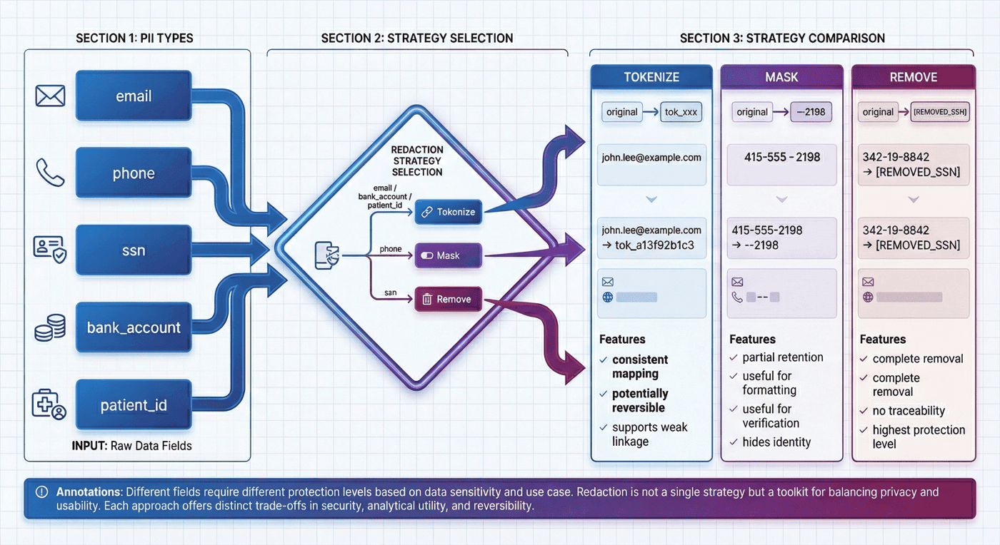
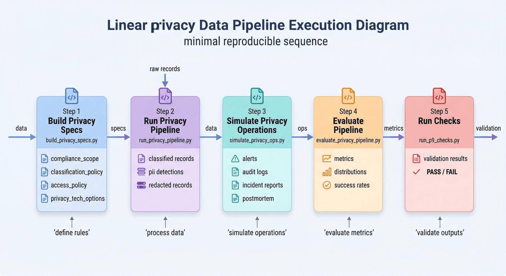

# Project 9: Privacy-Preserving Data Pipeline

## Abstract
P09 focuses on the governance process for sensitive data before it enters training, analytics, and data-sharing pipelines. Rather than concentrating on point-in-time anonymization techniques, the chapter organizes control boundaries, sensitive record handling, operational response, and acceptance mechanisms into a complete privacy-preserving data pipeline.

The chapter can be understood along four main threads:

* Control boundaries and privacy specification: defining the compliance scope, classification policy, access boundaries, and technical options.
* Sensitive record processing chain: executing PII detection, de-identification, quarantine, and storage partitioning.
* Operational and response feedback loop: incorporating alerting, auditing, preflight checks, incident simulation, and postmortems into the main workflow.
* Evaluation and acceptance mechanisms: validating code, artifacts, and reports for consistency through metrics, deliverables, and inspection scripts.

Read in engineering order, the chapter corresponds to a complete end-to-end pipeline:

**Compliance scope definition → Classification policy → Access boundaries → Sensitive record processing → Quarantine and alerting → Operational preflight → Incident simulation → Metrics evaluation → Project inspection**

The core objective of this structure is to elevate privacy governance from a set of local processing actions into a reproducible, reviewable, and verifiable engineering system.

---

## Keywords

Privacy protection; PII detection; de-identification; compliance pipeline; audit response

## Project Objectives and Reader Outcomes

This project uses a "privacy-preserving data pipeline" as its central case study. The objective is to organize PII detection, classification, redaction, auditing, and inspection into a privacy-preserving processing chain. Upon completing this chapter, readers should be able to identify the key data objects in this scenario, decompose the engineering pipeline, set acceptance metrics, and transfer the case methodology to comparable data engineering tasks.

## Scenario Constraints and Data Boundaries

The governance pipeline is validated using rules and sample data; this does not substitute for legal counsel, a Data Protection Impact Assessment (DPIA), or a production-grade privacy platform. These boundaries keep the case study reproducible and auditable. When data scale, data provenance, permission scope, or deployment environment change, the sampling strategy, quality thresholds, operating costs, and compliance requirements must be reassessed.

This project is closely related to [Appendix B: Compliance and Release Checklist](../appendix_b_compliance_and_release_checklist.md). P09 produces project-level artifacts covering the privacy processing chain, audit logs, preflight checks, and incident postmortems; Appendix B converts these artifacts into release gates, rollback mechanisms, and responsibility assignment matrices. When reusing P09, readers should map this chapter's `privacy_spec`, classification results, redaction artifacts, audit logs, preflight results, and postmortem records item by item into Appendix B, rather than treating them merely as experimental outputs. Privacy governance boundaries can be referenced against the GDPR (European Union 2016) and the NIST Privacy Framework (NIST 2020); technical options can be understood in conjunction with differential privacy (Dwork and Roth 2014) and the federated learning survey (Kairouz et al. 2021).

## Architectural Decisions

This project follows an architectural path of "privacy specification → PII detection → risk classification → differentiated redaction → audit logging → project inspection." This decision prioritizes well-defined input/output contracts, version traceability, anomaly localizability, and result verifiability, rather than compressing all logic into a single one-off script execution.

## Sample Schema / Data Flow

The core data flow can be summarized as:

Listing P09-1 provides a process or path example illustrating the input/output relationships, structural constraints, and execution patterns in this section.
```text
Raw records → PII detection → Data classification → Redaction/de-identification → Risk tagging → Audit and inspection report
```

This fragment converts the above process into a checkable, structured representation.

The sample schema should retain at minimum the fields `id`, `source`, `content_or_payload`, `metadata`, `quality_signals`, `split_or_stage`, and `audit_trace`; specific fields are further refined by the data type, downstream tasks, and acceptance criteria of each project.

## Core Implementation Fragments

The main text retains only the key implementation fragments needed to illustrate design trade-offs. Complete scripts, lengthy configurations, execution logs, and large files belong in the companion repository or appendix; code presentation focuses on input/output contracts, quality thresholds, error handling, and acceptance interfaces.

## Experimental or Acceptance Metrics

Acceptance metrics include PII detection rate, false-positive/false-negative samples, redacted field coverage, audit chain integrity, policy hit rate, and inspection pass rate. If the project enters a production, course, or publicly reproducible experimental environment, the version number, dependency environment, random seed, sample spot-check results, and failed-sample postmortem records should also be logged.

| Acceptance Dimension | Metrics / Evidence | Publication Review Criteria |
| --- | --- | --- |
| Detection and handling | PII detection rate, false-positive/false-negative samples, and redacted field coverage | Each sensitive field category should have a rule source, processing action, and verification sample |
| Audit feedback loop | Policy hit rate, audit log integrity, and incident/postmortem records | Compliance documentation must be traceable to the data subject, legal basis for processing, and operator |
| Release gate | Preflight results, version freeze, rollback path, and responsible owner | Align item by item with Appendix B; confirm that release, takedown, rollback, and postmortem evidence are complete |
| Compliance boundaries | Cross-border transfer, over-redaction, permission misconfiguration, and retention period risks | Do not present rule-based prototypes as conclusions of full regulatory compliance |

*Table P09-1: Privacy Pipeline Publication Acceptance Table*

## Cost, Risk, and Compliance Boundaries

Costs arise primarily from detection rule maintenance, manual review, and compliance record-keeping; risks concentrate around under-redaction, over-redaction, cross-border data transfers, and permission misconfiguration. When external data, personal information, copyrighted content, or third-party services are involved, source documentation, permission status, redaction policy, invocation records, and manual review records should be retained.

## Common Failure Modes

Common failures include distributional shift in inputs, missing schema fields, quality thresholds that are too loose or too strict, insufficient evaluation sample coverage, unstable model invocations, and non-traceable results. Troubleshooting should begin by localizing data boundaries and intermediate artifacts, then checking the model, toolchain, and deployment environment.

## Reproducibility Resources

Reproducibility materials should include data source documentation, a minimal sample, configuration files, run commands, metrics scripts, inspection reports, and an artifact directory. The main text retains necessary fragments; complete notebooks, long scripts, and large files are maintained separately as companion resources.

## 1. Project Background: The Necessity of a Privacy-Preserving Data Pipeline

As training data, business logs, and analytical data platforms continue to expand, more and more teams encounter the same problem: raw data naturally contains identity information, financial information, employee information, medical information, or other highly sensitive attributes, yet business and algorithm teams want to push data into a unified platform for analysis, modeling, or sharing as quickly as possible.

At this point, the risk is not merely "did we remember to remove the email address?" — it lies in whether the upstream pipeline has been correctly designed. For example:

* Whether raw records and redacted records are stored in the same region;
* Which roles can access raw data, and which roles may only read de-identified results;
* Whether the system can issue an alert when someone initiates an export by bypassing the normal workflow;
* Whether the system has quarantine and postmortem mechanisms if an unauthorized access attempt occurs;
* How the project ultimately demonstrates that these controls are actually effective, rather than existing only in a README.

The core objective of P09 is precisely to address this class of problems. According to the overall project report, P09's focus is not "performing one round of redaction," but building a privacy processing system that organizes classification, permissions, redaction, quarantine, auditing, preflight checks, and incident postmortems together. It serves the security control requirements for highly sensitive records before they enter training or analytics systems.

This type of project is highly representative because it demonstrates not a point algorithm, but a form of **governance-driven data engineering**:

> A truly mature privacy pipeline is not a regex script, but an operating model that can clearly delineate responsibility boundaries, execute processing actions, and produce verification evidence.

---

## 2. Project Objectives and Boundaries

### 2.1 Project Objectives

This project focuses on the following four objectives.

**Objective 1: Establish an interpretable privacy specification layer.**
Document the scenario domain, compliance objectives, risk objectives, classification levels, access roles, and technical options upfront, so the project begins with "defining control boundaries" rather than "processing text."

**Objective 2: Establish a processing pipeline for sensitive records.**
Starting from raw records, complete classification, PII detection, de-identification, quarantine, and alerting to form a reproducible data processing workflow.

**Objective 3: Establish an operations and incident response feedback loop.**
Through preflight checks, incident simulation, and postmortems, ensure the pipeline can not only "run normally" but also demonstrate "how it responds when an incident occurs."

**Objective 4: Produce verifiable engineering deliverables.**
Final outputs include not only the processed JSON/JSONL artifacts but also metrics files, the main report, test results, and a project inspection report, ensuring code, artifacts, and narrative are mutually consistent.

### 2.2 Project Boundaries

To maintain reproducibility, this project explicitly sets several boundaries.

#### 1) Data Scale Boundary

The project currently uses a small-scale sensitive record sample set of 8 records in total, focused on demonstrating the methodological pipeline rather than proving large-scale throughput capacity.

#### 2) Scenario Boundary

The project currently covers three representative scenario domains: healthcare support, HR payroll, and financial KYC. These scenarios are sufficient to illustrate the typical problems in sensitive data governance, but have not yet been extended to more complex environments such as advertising attribution, cross-border data flows, multi-tenant SaaS, or training corpus supply chains.

#### 3) Technical Implementation Boundary

The project includes descriptions of technical options such as differential privacy, Trusted Execution Environments (TEEs), and Fully Homomorphic Encryption (FHE), but these options reside more at the "option layer" and "architectural position layer" and do not imply that all of these capabilities have been deeply engineered. When addressing security boundaries on the LLM application side, the OWASP LLM Application Risk List (OWASP Foundation 2025) should also be consulted to check for prompt injection, data leakage, and tool misuse risks.

#### 4) Governance Capability Boundary

The project already provides governance pipelines covering classification, quarantine, auditing, preflight, and incident recovery, but there remains significant room for expansion in cross-system permission integration, complex export approval workflows, continuous monitoring, and automated exception management.

### 2.3 The Purpose of Explicit Boundaries

The more explicit the boundaries, the more credible the case study. What is truly needed is not a project mythology that "can do everything," but a set of methods that can answer the following question:

> Given limited samples, limited time, and limited implementation depth, how can a privacy project be completed as a full closed loop rather than stopping at conceptual description?

---

## 3. Project Positioning: P09's Position in the Capability Chain

If the entire large language model and data engineering capability chain is viewed as a system, P09's position is not training itself, but **pre-training governance** and **security controls before data enters the system**.

Many project chapters focus on:

* How to construct training data;
* How to design supervision signals;
* How to conduct evaluation and preference alignment;
* How to optimize inference and integrate with business applications.

P09 answers a different question that is often underestimated:

* When data itself carries privacy risks, how does the system decide who can see it, what can leave, what must be quarantined, what must be logged, and how accountability is assigned when something goes wrong?

In other words, this chapter does not address "how to make the model stronger," but rather:

> When sensitive data enters an intelligent system, how should the data governance pipeline be designed as an executable, verifiable, and interpretable engineering process?

This reflects P09's engineering character as a privacy governance pipeline.

---

## 4. Overall Architecture: A Processing Pipeline from Privacy Specification to Project Inspection


*Figure P09-1: P09 Privacy-Preserving Data Pipeline Overall Architecture*

From an engineering perspective, P09 can be decomposed into three layers.

### 4.1 Layer 1: Policy and Boundary Definition Layer

This layer answers the question "what exactly should the system protect, and by what rules." It primarily includes:

* Compliance scope definition
* Classification policy
* Access policy
* Privacy technology options

### 4.2 Layer 2: Data Processing and Control Execution Layer

This layer answers the question "what specifically happens after sensitive data arrives." It primarily includes:

* Raw record construction
* PII detection
* Sensitivity level determination
* Identifier removal, masking, and tokenization
* Restricted record quarantine
* Alert generation and audit log output

### 4.3 Layer 3: Verification and Operations Feedback Loop Layer

This layer answers the question "is the system truly reliable." It primarily includes:

* Preflight checks
* Incident simulation
* Postmortem reports
* Metrics evaluation
* Project inspection scripts

This structure can be summarized as three layers: the rule and scope definition layer, the processing and control execution layer, and the verification and delivery feedback loop layer. P09's emphasis is not on instruction data production, but on the complete pipeline from privacy specification generation and control execution to governance evidence consolidation.

---

## 5. Engineering Prerequisites: Key Dimensions to Clarify Before Building a Privacy Pipeline

A privacy pipeline is not a linear scaling of a single redaction script, but a governance chain jointly constituted by control objectives, processing rules, operational mechanisms, and acceptance criteria.

### 5.1 Compliance Objectives and Policy Definition Dimension

This layer is responsible for clarifying compliance objectives, sensitivity levels, access boundaries, and violation scenarios, enabling the project to begin from control objectives rather than from local processing techniques.

### 5.2 Data Processing and Artifact Orchestration Dimension

This layer is responsible for pipeline orchestration, JSON/JSONL artifact generation, directory standardization, persisting processing logic to disk, and integration with evaluation scripts, ensuring the processing chain can be reproduced and reviewed.

### 5.3 Security Operations and Response Feedback Loop Dimension

This layer is responsible for alerting, auditing, preflight checks, incident response, and postmortem pipelines, ensuring that control measures exist not only in processing logic but also in day-to-day operational processes.

### 5.4 Evaluation, Verification, and Acceptance Dimension

This layer is responsible for checking whether the code compiles, whether reports and metrics are consistent, whether artifacts are complete, whether redaction is thorough, and whether the overall state is within an acceptable range.

### 5.5 The Prerequisite Nature of Key Dimensions

The most common failure mode for privacy projects is often not that the regex or rules themselves are written incorrectly, but that key control dimensions have not been explicitly locked in:

* Policy definitions are unclear;
* The permission model lacks review;
* No one owns the exception process;
* Reports and artifacts cannot be reconciled;
* When a problem occurs, there is no traceable localization path.

This means a privacy pipeline is first and foremost a control chain that must be completely defined, rather than a patchwork of redaction actions.


*Figure P09-2: Key Engineering Dimensions of the P09 Privacy Pipeline*

---

## 6. Privacy Specification Layer: Rules-First Processing Chain

The first script in P09 is `src/build_privacy_specs.py`. This fact is itself revealing: the project does not begin by reading data, but by generating privacy specifications and policies. The overall report also explicitly states the recommended execution order, with the first step being to generate privacy specifications and policies.

### 6.1 Compliance Scope File

In many projects, "why these fields need to be protected" is buried in code comments. P09 makes this explicit by externalizing it into `compliance_scope.json`. This has three benefits:

* It aligns project objectives with compliance and risk language from the outset;
* It allows subsequent evaluations to reference the scope directly, rather than relying on tacit understanding;
* It presents a clear scope definition from the beginning, rather than ad-hoc scripted assembly.

The corresponding code is as follows:

Listing P09-2 provides a Python implementation fragment illustrating the input/output relationships, structural constraints, and execution patterns in this section.
```python
def build_scope() -> dict:
    return {
        "pipeline_goal": "Build a reproducible privacy-preserving data processing pipeline for highly sensitive records.",
        "example_domains": ["healthcare_support", "payroll_hr", "financial_kyc"],
        "compliance_targets": [
            "least_privilege",
            "auditability",
            "de-identification before analytics",
            "incident response readiness",
        ],
        "risk_goals": [
            "prevent direct PII leakage to analytics consumers",
            "separate raw storage from redacted processing zones",
            "log suspicious access and export attempts",
        ],
    }
```

This fragment converts the above process into a checkable, structured representation.

This structure indicates that P09's starting point is not a redaction action, but control objectives.

### 6.2 The Pivotal Role of Classification Policy

Once the classification policy is clearly defined, many subsequent control actions have a basis. For example:

* Which source types default to restricted;
* Which field patterns require tokenization;
* Which fields are better suited for masking or direct removal;
* Whether a default sensitivity level still applies when no explicit PII is detected.

`build_classification_policy()` organizes these rules into a structured object:

Listing P09-3 provides a Python implementation fragment illustrating the input/output relationships, structural constraints, and execution patterns in this section.
```python
def build_classification_policy() -> dict:
    return {
        "sensitivity_levels": [
            {"level": "restricted", "description": "direct PII, health identifiers, payroll details, bank data"},
            {"level": "confidential", "description": "internal case details and support notes"},
            {"level": "internal", "description": "aggregate metrics and sanitized analytics outputs"},
        ],
        "source_types": [
            {"source_type": "support_ticket", "default_level": "confidential"},
            {"source_type": "employee_payroll", "default_level": "restricted"},
            {"source_type": "kyc_form", "default_level": "restricted"},
            {"source_type": "analytics_export", "default_level": "internal"},
        ],
        "pii_rules": [
            {"pattern_name": "email", "action": "tokenize"},
            {"pattern_name": "phone", "action": "mask"},
            {"pattern_name": "ssn", "action": "remove"},
            {"pattern_name": "bank_account", "action": "tokenize"},
            {"pattern_name": "patient_id", "action": "tokenize"},
        ],
    }
```

This fragment converts the above process into a checkable, structured representation.

### 6.3 Access Policy as an Upfront Constraint

Many projects complete data processing first, then append a note saying "only administrators can access raw data." P09, by contrast, generates `access_policy.json` in the specification layer as well, meaning permissions are not a retrofitted description but a priori constraints.

This point is critical because the most costly errors in privacy controls are often not "the mask was incomplete," but "someone who should never have seen the raw data saw it first."


*Figure P09-3: Relationships Among the Four Artifact Types in the Privacy Specification Layer*

---

## 7. Raw Records and Scenario Construction: Governance Coverage with a Small Sample

The project currently has only 8 raw records. This number is not large, but it was not assembled arbitrarily. The overall report shows that these 8 records span 3 scenario domains, 4 data source types, and correspond to 5 role models.

### 7.1 Structural Coverage Capability of a Small Sample

Because the project's objective is not statistical significance but **method demonstration**. As long as the sample covers:

* Patient IDs, email addresses, and phone numbers in healthcare support;
* SSNs, payroll notes, and pay cycle information in HR/payroll;
* Email addresses, bank account numbers, and review status in KYC;
* Relatively lower-risk aggregate information in analytics exports;

it is already sufficient to support a minimally reproducible privacy control case study.

### 7.2 Sample Construction Method

`build_raw_records()` in `run_privacy_pipeline.py` directly provides representative data:

Listing P09-4 provides a Python implementation fragment illustrating the input/output relationships, structural constraints, and execution patterns in this section.
```python
def build_raw_records() -> list[dict]:
    return [
        {
            "record_id": "rec_001",
            "source_type": "support_ticket",
            "domain": "healthcare_support",
            "owner_team": "care_ops",
            "payload": "Patient John Lee, patient id PT-483920, email john.lee@example.com, phone 415-555-2198 asked about claim denial.",
        },
        {
            "record_id": "rec_002",
            "source_type": "employee_payroll",
            "domain": "payroll_hr",
            "owner_team": "hr_ops",
            "payload": "Employee Marta Chen SSN 342-19-8842 salary adjustment note for payroll cycle 2026-04.",
        },
        {
            "record_id": "rec_003",
            "source_type": "kyc_form",
            "domain": "financial_kyc",
            "owner_team": "fin_ops",
            "payload": "KYC form for beta@corp.test with bank account 998877665544 and risk review pending.",
        },
    ]
```

This fragment converts the above process into a checkable, structured representation.

The advantage of this approach is that the entire pipeline logic can be fully understood without downloading external datasets. It sacrifices some real-world complexity in exchange for stronger reproducibility.

### 7.3 Rationale for Scenario Sample Construction

Saying merely "some samples were prepared" carries very little information. More important is to document: why these particular domains were chosen, which field patterns are covered, and which control actions they serve downstream.


*Figure P09-4: Scenario Coverage of Raw Sensitive Records*

---

## 8. PII Detection: Recognition Rules as the Processing Entry Point

Privacy processing truly begins with PII detection. In P09, this step uses a rule-driven approach: email addresses, phone numbers, SSNs, bank account numbers, and patient IDs are each matched using independent regular expressions.

### 8.1 Rule-Based Methods as a Starting Point

In this case study, the rule-based approach has three clear advantages:

* Interpretable: every match is attributed to the specific rule that triggered it;
* Controllable: false positives and missed detections can be traced to a specific pattern;
* Reproducible: copying the code yields identical results.

The code is as follows:

Listing P09-5 provides a Python implementation fragment illustrating the input/output relationships, structural constraints, and execution patterns in this section.
```python
EMAIL_RE = re.compile(r"\b[A-Za-z0-9._%+-]+@[A-Za-z0-9.-]+\.[A-Za-z]{2,}\b")
PHONE_RE = re.compile(r"\b\d{3}-\d{3}-\d{4}\b")
SSN_RE = re.compile(r"\b\d{3}-\d{2}-\d{4}\b")
BANK_RE = re.compile(r"\b\d{10,12}\b")
PATIENT_RE = re.compile(r"\bPT-\d{4,6}\b")


def detect_pii(text: str) -> list[dict]:
    detections = []
    for pattern_name, regex in [
        ("email", EMAIL_RE),
        ("phone", PHONE_RE),
        ("ssn", SSN_RE),
        ("bank_account", BANK_RE),
        ("patient_id", PATIENT_RE),
    ]:
        for match in regex.finditer(text):
            detections.append({"pattern_name": pattern_name, "match": match.group(0)})
    return detections
```

This fragment converts the above process into a checkable, structured representation.

### 8.2 Detection Results as a Data Asset

Many projects detect PII in code and immediately substitute it without retaining the detection structure. P09, however, includes `pii_detections` in the classification results so that subsequent evaluations can tabulate field distributions, and inspection scripts can verify that rules have actually fired.

This upgrades the project from "redaction was performed" to "detection evidence was retained."

### 8.3 What the Current Detection Distribution Reveals

The overall report shows that PII detection covers multiple field patterns, with email=5, phone=3, patient_id=2, and bank_account=2. This demonstrates that even on a small-scale dataset, the project already achieves minimum cross-field pattern coverage rather than handling only a single type of identifier.


*Figure P09-5: PII Detection Rules and Hit Distribution*

---

## 9. Classification Logic: Joint Determination from Source Type and PII

A truly robust privacy classification typically does not rely on "only examining field content" or "only examining data provenance," but combines both. P09's `classify_record()` embodies this principle.

Listing P09-6 provides a Python implementation fragment illustrating the input/output relationships, structural constraints, and execution patterns in this section.
```python
def classify_record(record: dict, classification_policy: dict) -> dict:
    source_type_map = {
        item["source_type"]: item["default_level"]
        for item in classification_policy["source_types"]
    }
    detections = detect_pii(record["payload"])
    sensitivity = source_type_map.get(record["source_type"], "internal")
    if detections:
        sensitivity = "restricted"
    return {
        **record,
        "sensitivity_level": sensitivity,
        "pii_detections": detections,
        "requires_quarantine": sensitivity == "restricted",
    }
```

This fragment converts the above process into a checkable, structured representation.

### 9.1 What Problem This Logic Solves

It addresses two common errors.

First, classifying solely by source type will miss anomalous content. For example, if a nominally lower-risk source suddenly contains an explicit email address or account number, continuing to apply the default level would result in a loss of control.

Second, relying solely on regex hits ignores business semantics. For example, certain payroll or KYC records should not be lightly assigned to a low-sensitivity tier even if the current text does not produce a direct match.

### 9.2 `requires_quarantine` as a Control Signal

Many projects express classification results as a label only, but P09 further outputs the control action signal `requires_quarantine`. This means classification is not for the sake of aesthetics in a report, but to drive downstream system behavior.

This is critically important from an engineering perspective because:

> A truly usable classification does not merely tell you "what it is," but tells the system "how it should be handled next."

### 9.3 What the Current Results Reveal

The overall report shows that 7 of the 8 raw records were classified as restricted, and all 7 were quarantined. This is consistent with the project's scenario choices: the majority of records in the sample set inherently carry high-sensitivity characteristics, and the purpose is to demonstrate the governance pipeline clearly rather than to artificially introduce large numbers of low-risk samples.


*Figure P09-6: Classification Determination and Quarantine Trigger Relationship*

---

## 10. Redaction and De-identification: Differentiated De-identification Strategy

When many teams perform redaction, the most common simplification is "replace everything with ***." While this approach appears safe, it introduces two problems:

* Necessary analytical structure is lost;
* The different processing intensities appropriate for different fields cannot be expressed.

P09's `redact_payload()` uses three strategies: tokenize, mask, and remove.

Listing P09-7 provides a Python implementation fragment illustrating the input/output relationships, structural constraints, and execution patterns in this section.
```python
def redact_payload(text: str, detections: list[dict]) -> str:
    redacted = text
    for detection in detections:
        match = detection["match"]
        if detection["pattern_name"] in {"email", "bank_account", "patient_id"}:
            replacement = hash_token(match)
        elif detection["pattern_name"] == "phone":
            replacement = "***-***-" + match[-4:]
        else:
            replacement = "[REMOVED_SSN]"
        redacted = redacted.replace(match, replacement)
    return redacted
```

This fragment converts the above process into a checkable, structured representation.

### 10.1 Division of Responsibility Among Tokenize, Mask, and Remove

* **Tokenize** is appropriate for fields such as email addresses, bank account numbers, and patient IDs — fields that need to preserve "same-entity consistency" but must not expose the original value;
* **Mask** is appropriate for phone numbers, where retaining the last digits aids operational verification but the full value must not be retained;
* **Remove** is appropriate for SSNs, which are highly sensitive and where there is no need to preserve any structure that could enable re-identification.

### 10.2 What Is the Significance of `hash_token()`

The helper script uses `sha256` to generate a stable token:

Listing P09-8 provides a Python implementation fragment illustrating the input/output relationships, structural constraints, and execution patterns in this section.
```python
def hash_token(value: str) -> str:
    digest = hashlib.sha256(value.encode("utf-8")).hexdigest()
    return f"tok_{digest[:12]}"
```

This fragment converts the above process into a checkable, structured representation.

The benefit of this approach is that the same original value maps to the same token consistently, which avoids direct exposure of the original identifier while still supporting weak linkage analysis downstream.

### 10.3 The Necessity of Strategy Differentiation

Because the worst practice in privacy engineering is to describe all problems with a vague phrase like "redaction processing." A technically meaningful description must distinguish the control intent for different fields.


*Figure P09-7: De-identification Strategies for Different PII Types*

---

## 11. Storage Partitioning and Quarantine: Partition Control Between Results and Raw Data

In privacy governance, a very common yet frequently underestimated problem is: even if de-identification has been performed, many risks persist if the raw records and processed results continue to reside in the same logical zone.

P09 explicitly defines four zone types through `build_isolation_plan()`: raw_zone, quarantine_zone, redacted_zone, and audit_zone.

Listing P09-9 provides a Python implementation fragment illustrating the input/output relationships, structural constraints, and execution patterns in this section.
```python
def build_isolation_plan() -> dict:
    return {
        "zones": [
            {"zone_name": "raw_zone", "store": "encrypted object storage", "access": ["privacy_admin"]},
            {"zone_name": "quarantine_zone", "store": "isolated secure bucket", "access": ["privacy_admin", "incident_responder"]},
            {"zone_name": "redacted_zone", "store": "analytics warehouse", "access": ["data_processor", "analyst"]},
            {"zone_name": "audit_zone", "store": "security log store", "access": ["auditor", "privacy_admin"]},
        ],
        "deid_flow": [
            "ingest raw restricted records",
            "classify and detect PII",
            "write restricted originals to raw_zone",
            "redact identifiers and emit sanitized records to redacted_zone",
            "quarantine flagged export attempts and emit audit alerts",
        ],
    }
```

This fragment converts the above process into a checkable, structured representation.

### 11.1 Why the Zone Model Matters

Because it binds "who can see what" together with "where data should reside." Only in this way do permission boundaries become concrete — tied to storage objects, workflow actions, and role sets — rather than abstract declarations.

### 11.2 Why the quarantine_zone Is a Critical Design Choice

Many projects have only a raw_zone and a redacted_zone but no quarantine_zone. The problem is: when anomalous access or a suspicious export is detected, the system lacks an intermediate state that neither continues processing nor discards the data outright.

The significance of the quarantine_zone lies in:

* Halting the spread of risk;
* Preserving investigative space for incident responders;
* Maintaining the evidence chain;
* Providing a clear landing point for the exception process.

### 11.3 What the Quarantine Results Reveal

The overall report shows that there are currently 7 restricted records and 7 quarantined records. This indicates that the quarantine logic is consistent with the classification logic, rather than "classification is one thing, quarantine is another."


*Figure P09-8: Storage Zones and Role Access Boundaries*

---

## 12. Auditing and Alerting: Behavioral Evidence Chain

A system that only "processes data" does not constitute a governable system. Because the truly sensitive moments are often not routine processing, but when someone attempts to circumvent the rules. P09 builds alerts and audit logs as separate artifacts precisely to allow the system to retain traceable evidence.

### 12.1 How Alerts Are Modeled

`build_alerts()` constructs two representative alerts:

Listing P09-10 provides a Python implementation fragment illustrating the input/output relationships, structural constraints, and execution patterns in this section.
```python
def build_alerts() -> list[dict]:
    return [
        {
            "alert_id": "alert_priv_001",
            "severity": "high",
            "actor": "analyst",
            "reason": "unauthorized raw zone access attempt",
            "status": "resolved",
        },
        {
            "alert_id": "alert_priv_002",
            "severity": "medium",
            "actor": "data_processor",
            "reason": "restricted export requested without approval",
            "status": "resolved",
        },
    ]
```

This fragment converts the above process into a checkable, structured representation.

These two alerts are highly representative: one is an unauthorized access attempt to the raw zone, and the other is an unapproved request to export restricted data. They correspond precisely to the two most dangerous types of actions in privacy governance.

### 12.2 Why Audit Logs and Alerts Must Appear Together

Alerts tell the system "a risky action has occurred"; audit logs tell the system "who did what and when." The former is more oriented toward real-time control, the latter more toward post-hoc traceability. Without either one, the governance chain is incomplete.

### 12.3 What the Current Metrics Reflect

The overall report shows that the project currently has 2 alerts, a 100% alert resolution rate, and 5 audit events. This indicates that the project has moved beyond "generating some redacted files" and has begun to exhibit security operations semantics.


*Figure P09-9: Relationships Among Alerts, Audit, and Incident Response*

---

## 13. Preflight: Pre-run Checks

Many data projects have only a main processing workflow with no pre-run checks. But a privacy pipeline without preflight is prone to creating a false impression: files appear to be outputting correctly, while the actual conditions are not satisfied.

P09 performs preflight before incident simulation in `simulate_privacy_ops.py`. This ordering carries significant engineering intent.

Listing P09-11 provides a Python implementation fragment illustrating the input/output relationships, structural constraints, and execution patterns in this section.
```python
preflight = {
    "checks": [
        {"name": "all records classified", "passed": len(classified) > 0 and all("sensitivity_level" in item for item in classified)},
        {"name": "restricted records isolated", "passed": all(item["requires_quarantine"] == (item["sensitivity_level"] == "restricted") for item in classified)},
        {"name": "alerts wired", "passed": len(alerts) >= 2},
        {"name": "role model present", "passed": len(access_policy["roles"]) >= 5},
        {"name": "privacy tech options documented", "passed": len(tech_options) >= 4},
    ]
}
```

This fragment converts the above process into a checkable, structured representation.

### 13.1 Design of the Preflight Check Items

Because they cover the "minimum prerequisites for the pipeline to be valid":

* Classification has been performed;
* Restricted records have actually been quarantined;
* Alerts are not empty shells;
* The role model is not missing;
* Privacy technology options are not blank.

### 13.2 What the Current Results Reveal

The overall report shows that the preflight pass rate is 100%. This means the project satisfies at minimum the minimum preconditions before operational simulation begins.

### 13.3 The Independent Value of Preflight

Because it reflects a mature engineering practice:

> Not "run first, then observe," but "confirm that minimum conditions are met first, then proceed to higher-risk processing and exercise stages."


*Figure P09-10: Preflight Check Process*

---

## 14. Incident Simulation and Postmortem: Anomaly Response Feedback Loop

Many case studies describe only the success path, not the failure path. But privacy governance cannot avoid failure scenarios, because what truly determines whether a system is trustworthy is often "how the system responds when someone crosses a boundary."

P09 encodes the incident scenario as a structured record: an analyst attempts to export restricted raw records without approval, with detection, containment, outcome, and response_minutes all explicitly retained.

Listing P09-12 provides a Python implementation fragment illustrating the input/output relationships, structural constraints, and execution patterns in this section.
```python
incident = {
    "incident_id": "privacy_inc_001",
    "scenario": "analyst attempted to export restricted raw records without approval",
    "detection": "access_alerts.jsonl high severity alert",
    "containment": [
        "quarantine the export request",
        "lock the analyst session",
        "require privacy_admin review",
    ],
    "outcome": "resolved with no confirmed external data leak",
    "response_minutes": 24,
}
```

This fragment converts the above process into a checkable, structured representation.

The corresponding postmortem then continues to record root_cause, what_worked, and follow_ups.

### 14.1 Completeness of the Incident Design

Because it does not vaguely state "a security incident occurred," but decomposes the incident chain into:

* How it was detected;
* How it was contained;
* Why it did not spread further;
* What improvements need to be made going forward.

### 14.2 What the Metrics Tell Us

The overall report shows that incident response took 24 minutes and the postmortem follow-up count is 3. This indicates that the project has incorporated operations and postmortems into measurable outcomes rather than leaving only a note saying "expandable in the future."

### 14.3 The Independent Position of Incident and Postmortem

Including incident and postmortem records makes one thing clearer: a privacy pipeline is not a static ETL pipeline, but a governance system that includes anomaly response capability.


*Figure P09-11: Incident Response and Postmortem Feedback Loop*

---

## 15. Evaluation Script: Structured Generation of Metrics

P09's evaluation is performed by `src/evaluate_privacy_pipeline.py`. Rather than manually writing a summary, it directly reads all artifact types from the processed directory, computes unified metrics, and generates `p9_metrics.json` and `p9_report.md`.

### 15.1 How Metrics Are Computed from Artifacts

The evaluation phase first reads all artifacts — including scope, classification, access, tech options, raw/classified/redacted/quarantined records, alerts, audit logs, preflight results, incidents, and postmortems — and then computes the key results.

Listing P09-13 provides a Python implementation fragment illustrating the input/output relationships, structural constraints, and execution patterns in this section.
```python
metrics = {
    "domain_count": len(scope["example_domains"]),
    "compliance_target_count": len(scope["compliance_targets"]),
    "source_type_count": len(classification["source_types"]),
    "role_count": len(access["roles"]),
    "privacy_tech_count": len(tech_options),
    "raw_record_count": len(raw_records),
    "restricted_record_count": sum(item["sensitivity_level"] == "restricted" for item in classified),
    "quarantine_count": len(quarantined),
    "pii_detection_distribution": dict(Counter(
        detection["pattern_name"]
        for item in classified
        for detection in item["pii_detections"]
    )),
    "direct_pii_removed_rate": direct_pii_removed_rate,
    "alert_count": len(alerts),
    "resolved_alert_rate": round(sum(item["status"] == "resolved" for item in alerts) / max(1, len(alerts)), 4),
    "audit_event_count": len(audit_log),
    "preflight_pass_rate": round(preflight["passed_checks"] / max(1, preflight["total_checks"]), 4),
    "incident_response_minutes": incident["response_minutes"],
    "postmortem_follow_up_count": len(postmortem["follow_ups"]),
}
```

This fragment converts the above process into a checkable, structured representation.

### 15.2 Why `has_direct_pii()` Is Critical

The evaluation script does not simply count files; it also re-applies regular expressions to check whether any direct PII remains in the redacted results. This means evaluation is not a "format check" but a verification of results against the core governance objective.

### 15.3 Current Key Metrics

According to the overall report, the project's current key results include: 3 scenario domains, 4 compliance targets, 4 data source types, and 5 role types; 7 of the 8 raw records are restricted and 7 have been quarantined; direct PII removal rate 100%; preflight pass rate 100%; 2 alerts with a 100% resolution rate; and 5 audit events.

These metrics collectively point to a single conclusion: P09's emphasis is not on data volume, but on whether the governance chain is closed. The overall report makes this point explicitly as well.

---

## 16. Code-to-Artifact Mapping: Script and Deliverable Correspondence

A good chapter cannot merely list script names; it must also document "what each script does, what it produces, and who consumes it." The overall workflow of P09 is approximately as follows:

1. `build_privacy_specs.py` generates scope, classification, access, and technology option artifacts;
2. `run_privacy_pipeline.py` processes raw records and generates classification, redaction, quarantine, audit, and alert artifacts;
3. `simulate_privacy_ops.py` generates preflight checks, incident records, and postmortems;
4. `evaluate_privacy_pipeline.py` aggregates metrics and the main report;
5. `run_p9_checks.py` executes command-level and data-level checks.

### 16.1 Structural Value of Layered Mapping

Because it makes the system easy to understand as an incrementally constructed closed loop: define first, then process, then operate, then evaluate, then accept. It does not compress all logic into a single script, resulting in a clear structure.

### 16.2 The Purpose of the Deliverable List

The overall report enumerates the complete set of deliverables, including:

* `compliance_scope.json`
* `classification_policy.json`
* `access_policy.json`
* `privacy_tech_options.json`
* `raw_sensitive_records.jsonl`
* `classified_records.jsonl`
* `redacted_records.jsonl`
* `quarantine_records.jsonl`
* `audit_log.jsonl`
* `access_alerts.jsonl`
* `isolation_plan.json`
* `preflight_checklist.json`
* `incident_simulation.json`
* `postmortem_report.json`
* `p9_report.md`
* `p9_metrics.json`
* `p9_test_results.json`
* `p9_test_report.md`

The importance of this list lies in demonstrating that P09's completion standard is not running a notebook, but producing a reviewable set of file assets.

---

## 17. Inspection Script: Consistency Among Code, Artifacts, and Reports

Many projects conclude simply by stating "the run succeeded." But this is insufficient to prove that the project is truly complete. P09's `run_p9_checks.py` is designed precisely to address this problem.

### 17.1 What the Inspection Script Does

It is divided into two categories of checks:

* **Command-level checks**: such as `py_compile` and re-executing `evaluate_privacy_pipeline.py`;
* **Data/artifact-level checks**: such as whether required files exist, whether the role and zone models are present, whether all records have been classified, whether all restricted records have been quarantined, whether direct PII has been removed from redacted outputs, and whether PII rules exist.

From the overall report, the total number of check items is 13, all passed, and the overall status is PASS; of these, 2 are command-level checks and 11 are data/artifact-level checks.

### 17.2 The Structural Position of the Verification Feedback Loop

Chapter 10-2 particularly emphasizes that "code, artifacts, statistics, and reports must be mutually consistent" for a project to be truly verified. Although P09's task is different, it inherits the same engineering practice:

> A data engineering case study cannot rely on self-attestation through description alone; the inspection script must serve as the acceptance gate.

### 17.3 The Template Value of This Section

Because what many teams truly lack is not "knowing that validation is necessary," but not knowing what form to write the validation in. P09 provides a minimal approach that is very well suited as a template:

* Compiles successfully;
* Evaluation can be re-run;
* Files exist;
* Files have content;
* Metrics exist;
* Consistency is maintained.

---

## 18. Metrics Interpretation: Closed-Loop Coherence as the Core Signal

In terms of scale, P09 is very restrained: with only 8 raw records, it falls far short of production-level data volumes. It is still worth a dedicated examination because it exhibits a strong sense of "closed-loop coherence."

### 18.1 What Closed-Loop Coherence Means

In this project, closed-loop coherence is manifest in:

* Having objectives and boundaries;
* Having classification and controls;
* Having processing and quarantine;
* Having alerts and auditing;
* Having preflight checks and incident drills;
* Having metrics and inspection scripts;
* Having reports and test results.

### 18.2 The Difference Between Closed-Loop Coherence and Throughput

A small but complete project is often more valuable for learning than a large but vague one. Because what is reusable is typically the structure, layering, field design, control logic, and validation patterns — not the single-run throughput.

### 18.3 Current Stage Assessment

P09 more closely resembles a privacy processing operating model than a single redaction script. At the same time, it also acknowledges that data representativeness is limited, advanced privacy technologies have not yet been deeply implemented, and cross-system governance remains expandable. This indicates that the project is at a stage that is methodologically complete, purposefully constrained in scale, and clear about its limitations.

---

## 19. Comparison with 10-2: Supervision Assets vs. Control Assets

Using 10-2 as a reference for writing 10-9 is not simply copying a template, but retaining its most valuable narrative skeleton.

### 19.1 Commonality: Both Emphasize Engineering Closed Loops

10-2 discusses a legal-domain SFT data factory, unfolding layer by layer from seed knowledge, task design, QA, and preference pairs to training delivery and a verification feedback loop. Although P09 is not an SFT project, it follows the same structure:

* Define boundaries first;
* Then enter the main processing chain;
* Finally perform evaluation and acceptance.

### 19.2 Difference: One Centered on Supervision Assets, One on Control Assets

The core artifacts of 10-2 are trainable data, preference pairs, and QA records;
the core artifacts of P09 are control policies, processing results, audit evidence, operational documentation, and inspection reports.

In other words:

* 10-2 addresses "what the model should learn";
* 10-9 addresses "how sensitive data should safely enter the system."

### 19.3 The Value of Comparative Analysis

Because it reveals a more complete capability map: industry AI engineering encompasses not only training and inference, but also governance capabilities before data enters the system.

---

## 20. Future Extensions: Moving Toward More Realistic Engineering Systems

Three directions are already visible: expanding to more high-risk scenarios, advancing advanced privacy technologies from planning to implementation, and enhancing automation and anomalous access detection. These directions are elaborated below.

### 20.1 Extending from Rule-Based Detection to Multi-Layer Recognition

Future work can extend the regex layer to:

* Lexicon and rule layer;
* Contextual classification layer;
* NER/entity normalization layer;
* Risk combination determination layer.

### 20.2 Extending from Static Policy to Dynamic Governance

The current access policy is more of a static description. The next step can introduce:

* Task-based temporary authorization;
* Dual-approval workflows;
* Export rate limiting and thresholds;
* Behavioral profiling and anomaly detection.

### 20.3 Extending from File-Level Delivery to Service-Level Control

Current deliverables consist primarily of JSON/JSONL and Markdown reports. The next phase can move toward policy-as-a-service, real-time auditing, and formalized exception workflows, advancing P09 from a notebook/script project to a service-oriented system.

### 20.4 Extending from Tabletop Incidents to Continuous Drills

Incident simulation can be developed into regular tabletop exercises, automated fault injection, and red-blue team adversarial audits to enhance the system's true resilience.

---

## 21. Minimal Reproducible Execution Chain: The Complete Case Execution Order

The minimal execution order for P09 can be summarized in five steps:

Listing P09-14 provides a command-line execution example illustrating the input/output relationships, structural constraints, and execution patterns in this section.
```bash
python src/build_privacy_specs.py
python src/run_privacy_pipeline.py
python src/simulate_privacy_ops.py
python src/evaluate_privacy_pipeline.py
python src/run_p9_checks.py
```

This fragment converts the above process into a checkable, structured representation.

These five steps correspond respectively to:

1. Establishing privacy specifications;
2. Processing sensitive records;
3. Generating operations and incident documentation;
4. Aggregating evaluation metrics;
5. Completing project acceptance.

The value of this structure lies not only in facilitating understanding of the case study, but also in enabling step-by-step reproduction.

### 21.1 The Purpose of Listing the Execution Chain Separately

Because it recondenses the entire chapter's content from "narrative" back into "action." What tends to leave the strongest impression in a chapter is precisely this kind of step-by-step execution chain.


*Figure P09-12: P09 Minimal Reproducible Execution Chain*

---

## 22. Methodological Review: System Capabilities Demonstrated by P09

On the surface, P09 resembles a small-scale privacy protection project; but from an engineering structure perspective, it demonstrates a remarkably complete set of capabilities:

* It defines governance boundaries before processing text;
* It connects classification, de-identification, quarantine, alerting, and auditing into a single control chain;
* It incorporates preflight checks, incidents, and postmortems into the main project workflow;
* It outputs metrics, reports, and checks rather than stopping at intermediate files;
* It uses a very small sample to clearly articulate "how privacy engineering should be organized."

Therefore, the value of this chapter lies not in demonstrating how advanced a particular technology is, but in showing:

> How a pre-training data governance project can be designed as an interpretable, reproducible, and verifiable engineering pipeline.

This is also why it is well-suited as an engineering case study.

---

## Special Topic: The Runbook Perspective for a Privacy Pipeline

When writing a privacy protection project to completion, the part most commonly missing is often not the technical structure, but the runbook perspective. That is, once the system enters daily operation, what order should the team follow for checks, at what points should processing be blocked, and who handles exceptions. Without this component, the project resembles a collection of scripts; with it, it begins to resemble a sustainably operating governance system.

### I. What to Check First in Daily Operations

For a pipeline of the P09 type, what to check first in daily operations is not necessarily the final metrics, but several "upstream health signals":

* Whether all records newly entering the system have been classified;
* Whether restricted and redacted zones are landing in storage according to policy;
* Whether any undetected direct PII has appeared;
* Whether the most recent batch run produced elevated alerts or preflight failures;
* Whether audit logs were generated completely.

The significance of these signals is that they help teams detect process drift before an actual data leak or compliance issue occurs. For privacy systems, many risks become very costly to remediate once they enter downstream training or applications, making upstream health signals especially important.

### II. Exception Handling Must Have an Explicit Entry Point

One of the most dangerous states in privacy governance is when exception requests are consistently resolved through informal communication. Because without an explicit entry point, teams find it very difficult to distinguish between "a legitimate exception" and "a risk bypass." A more mature runbook should at minimum specify:

* Under what circumstances a temporary exception may be requested;
* Who is authorized to initiate an exception request;
* Who holds approval authority;
* Whether the exception has a time scope and a use-case scope;
* Whether permissions must be revoked and audit records supplemented after the exception expires.

Making these processes explicit in a runbook is meaningful not only for standardizing actions, but also for protecting the team. Because under high-pressure scenarios, if there is no institutionalized entry point, many risky actions will ultimately be borne by individuals rather than by the system.

### III. Incident Handling Should Center on the Evidence Chain

When a privacy-related anomaly occurs, what the team most needs is not "who steps forward to explain," but the ability to rapidly reconstruct an evidence chain. P09 already retains the preflight, incident, and postmortem objects; the next thing most worth emphasizing is how to sequence them into actionable steps in the runbook:

* First, freeze the relevant version or access path;
* Then, confirm the scope of impact and the data zones affected;
* Next, extract audit logs, alert records, and processing records;
* Finally, produce an incident review and corrective actions.

For privacy projects, the order of remediation matters more than the wording. As long as the sequence is correct, teams can generally contain the risk within a manageable scope; if the sequence is chaotic, even when all technical components are in place, secondary risks can easily emerge.

---

## Special Topic: Privacy Governance Metrics and Long-Term Evolution

P09's current scale is very small, but it is already well-suited for illustrating a longer-term question: how privacy governance should be measured. Because without stable metrics, teams tend to interpret privacy work as "minimizing incidents"; whereas in reality, a mature privacy pipeline should be continuously quantifiable, continuously comparable, and continuously improvable.

### I. Metrics Should Not Focus Only on Detection Hit Counts

When many teams discuss privacy metrics, the first thing they think of is "how many sensitive items were detected in this run." This is certainly meaningful, but far from sufficient. A high hit count may indicate strong system detection capability, or it may simply reflect higher input risk. More valuable metrics typically also include:

* Record classification coverage rate;
* Correctness rate for restricted data quarantine;
* Rate of direct identifier residuals in redacted data;
* Preflight failure rate and distribution of failure causes;
* Mean time from incident detection to resolution.

Only when these metrics are combined can one more accurately assess whether the governance system is functioning.

### II. Privacy Systems Are Better Evaluated on "Control Effectiveness Rate"

From a governance perspective, the more central metric in P09 is not detection volume, but whether controls are effective. Control effectiveness rate can be understood as: of the control points defined by the system, how many actually performed their function at critical moments.

For example:

* Were high-risk records actually routed to the restricted zone;
* Was direct PII actually removed in the redacted version;
* Did preflight checks actually block non-qualifying tasks;
* Did alerts actually trigger human attention;
* Did incident reviews actually produce follow-up corrective actions.

If these control points exist only "in documentation" rather than "in execution results," the governance system remains fragile.

### III. Long-Term Evolution Will Move from Rules to Composite Governance

P09 currently operates primarily through rules, policies, and operational processes, which is very well suited as a minimal reproducible starting point. As system complexity increases, long-term evolution typically moves toward "composite governance" — combining multiple capabilities to collectively shoulder risk control:

* Rule-based detection provides fast, highly interpretable baseline protection;
* Contextual classification identifies implicit risks that rules have difficulty covering;
* Permissions and approval workflows constrain high-risk actions;
* Auditing and incident reviews enable post-hoc traceability and institutional improvement;
* Operational cadence makes governance a sustained activity rather than a one-time project.

When these capabilities begin to work in concert, a privacy pipeline is no longer merely "masking data," but gradually matures into a comprehensive system oriented toward pre-training governance, pre-application governance, and organizational accountability allocation. P09's most valuable quality at present is that it has already articulated the skeleton of this growth path clearly.

---

## Special Topic: Data Subject Requests and Cross-System Deletion Pipelines

In real organizations, privacy projects face another very common topic that is often absent from many technical case studies: data subject requests — such as requests for deletion, rectification, restriction of processing, or access explanation. Once the system has passed through multiple stages of pre- and post-training, handling a subject request is no longer a single-point action but becomes a problem of cross-system deletion pipelines.

### I. The Real Difficulty of Subject Requests Lies in Propagation

For a single database, deleting a record may not be complex; but in a data engineering system, the same sensitive record may have already entered:

* The raw ingestion zone;
* The restricted processing zone;
* De-identified copies;
* Evaluation samples;
* Audit and incident records.

This means the core difficulty of a subject request is not "whether to delete," but "to exactly which places has this record propagated." This is precisely why P09's emphasis on partitioning, auditing, and processing records is necessary: these structures naturally provide handles for subsequent deletion propagation and verification.

### II. Cross-System Deletion Requires Both Lineage and Accountability

Once a subject request arrives, the team needs two types of capability simultaneously:

* Lineage capability, to help locate which processing stages the record passed through and what derived artifacts were produced;
* Accountability capability, to clarify who is responsible for freezing, who is responsible for deletion, who is responsible for verification, and who is responsible for external confirmation.

If there is lineage without accountability, the system knows where the problem is but no one actually handles it; if there is accountability without lineage, the team knows something must be done but does not know how deep the deletion must reach. A truly executable deletion pipeline must bind both together.

## Chapter Summary

This chapter used a "privacy-preserving data pipeline" as a case study to demonstrate the engineering organization of PII detection, classification, redaction, auditing, and inspection into a privacy-preserving processing chain. The primary value of the case lies in placing task definition, data boundaries, architectural decisions, sample schema, metrics acceptance criteria, and reproducibility resources within a single pipeline, so that the project is no longer merely a sequence of operational steps but becomes a reviewable case study.

The boundaries of this case study must also be clearly preserved. Validating the governance pipeline using rules and sample data does not substitute for legal counsel, a DPIA, or a production-grade privacy platform. In scenarios with larger scale, higher risk, or stronger compliance constraints, data provenance, permission status, manual review proportion, operating costs, and failure rollback plans should all be reassessed.

As part of Part XIV, this chapter corresponds to the project-level validation of the methods presented in prior chapters. Readers may combine this case with the data recipes in Part XIII, the platform governance chapters in earlier parts, and the checklists in the appendices to form a closed loop from methodological understanding to engineering delivery.

## References

1. European Union. (2016). Regulation (EU) 2016/679: General Data Protection Regulation.
2. NIST. (2020). NIST Privacy Framework: A Tool for Improving Privacy through Enterprise Risk Management, Version 1.0.
3. Dwork, C., & Roth, A. (2014). The Algorithmic Foundations of Differential Privacy. *Foundations and Trends in Theoretical Computer Science*.
4. Kairouz, P., McMahan, H. B., Avent, B., Bellet, A., Bennis, M., Bhagoji, A. N., et al. (2021). Advances and Open Problems in Federated Learning. *Foundations and Trends in Machine Learning*.
5. OWASP Foundation. (2025). OWASP Top 10 for Large Language Model Applications.
