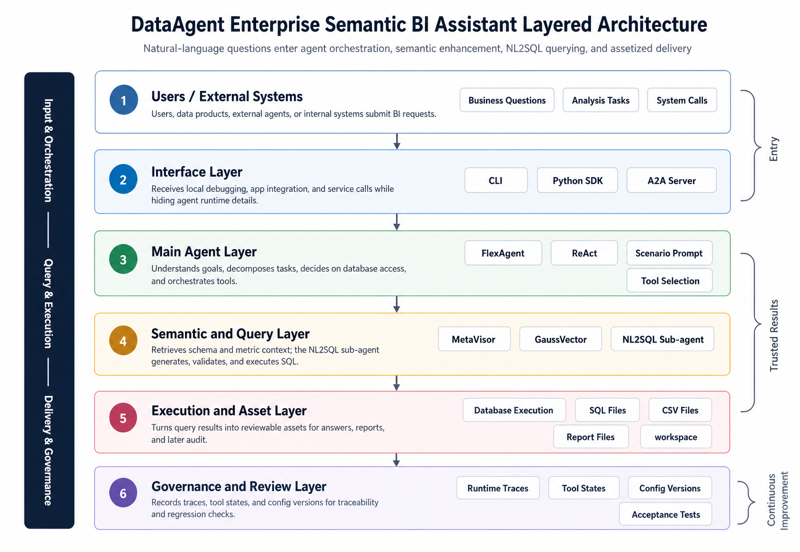
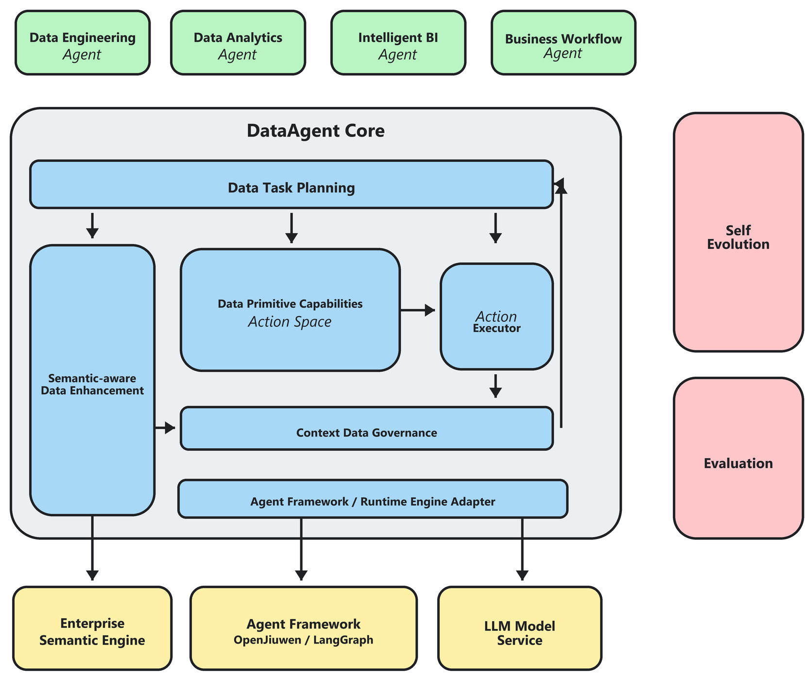
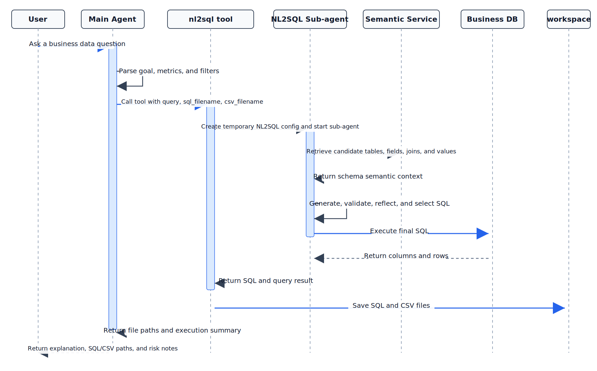

# Project 15: Building an Enterprise Semantic BI Assistant with DataAgent

## Abstract

This project uses DataAgent to build a semantic BI assistant for enterprise structured data. The goal is not to let a model directly "guess SQL." Instead, the project organizes natural-language questions, the business semantic layer, database metadata, an NL2SQL sub-agent, result files, report generation, and runtime audit trails into a reusable data engineering chain.

Read in engineering order, the chain is:

```text
business question
  -> scenario prompt and task planning
  -> semantic-layer schema retrieval
  -> NL2SQL sub-agent
  -> SQL validation and execution
  -> CSV/SQL asset persistence
  -> main-agent summary and report generation
  -> execution trace and acceptance evaluation
```

The core objective is to turn enterprise BI Q&A from a one-off conversational capability into a configurable, auditable, and extensible data application.

The chapter follows four main threads:

- Semantic-layer construction: use a semantic service and vector database to manage tables, fields, metric definitions, and business descriptions.
- Agent orchestration: use a ReAct main agent to decide when to call the NL2SQL sub-agent.
- Result assetization: save SQL, CSV, charts, and Markdown reports into a workspace.
- Engineering acceptance: evaluate schema hit rate, execution accuracy, file artifacts, trace completeness, and safety boundaries.

## Keywords

DataAgent; semantic layer; NL2SQL; enterprise BI; agent orchestration

## Project Goals and Reader Takeaways

This project uses the "DataAgent enterprise semantic BI assistant" as the core case. Its goal is to connect natural-language questions, the semantic layer, the NL2SQL sub-agent, result assets, and audit traces into an enterprise BI application. After completing this chapter, readers should be able to identify the key data objects in this scenario, decompose the engineering chain, set acceptance metrics, and transfer the method to adjacent data engineering tasks.

## Scenario Constraints and Data Boundaries

The project focuses on structured-database BI and semantic-layer enhancement. It does not cover full data warehouse modeling, production permission systems, or every DataAgent capability. These boundaries make the case reproducible and auditable. When data scale, data sources, permission scope, or deployment environments change, sampling strategies, quality thresholds, runtime cost, and compliance requirements should be reassessed.

## Architecture Decision

This project follows an architecture path built from a business entry point, a ReAct main agent, Semantic Service, an NL2SQL sub-agent, workspace assets, and service interfaces. The decision prioritizes input/output contracts, version traceability, diagnosable failures, and reviewable results, rather than compressing all logic into a one-off script run.

## Sample Schema / Data Flow

The core data flow can be summarized as:

```text
business question -> semantic-layer schema retrieval -> NL2SQL generation and validation -> SQL execution -> CSV/SQL/report persistence -> trace audit
```

At minimum, the sample schema should retain fields such as `id`, `source`, `content_or_payload`, `metadata`, `quality_signals`, `split_or_stage`, and `audit_trace`. The exact fields should be refined according to the project's data type, downstream task, and acceptance method.

## Core Implementation Snippets

The main text keeps only the key implementation snippets needed to explain design trade-offs. Complete scripts, long configurations, runtime logs, and large files should be placed in the companion repository or appendix notes. Code examples should focus on input/output contracts, quality thresholds, exception handling, and acceptance interfaces.

## Experiment or Acceptance Metrics

Acceptance metrics include execution accuracy, schema hit rate, SQL validation pass rate, artifact persistence rate, trace completeness, response latency, and safety interception rate. If the project enters production, a course setting, or a public reproduction environment, version numbers, dependency environments, random seeds, sample inspection results, and failure review records should also be recorded.

## Cost, Risk, and Compliance Boundaries

Costs mainly come from model calls, semantic indexing, and database queries. Risks concentrate around SQL injection, sensitive-field exposure, schema-retrieval failure, and incorrect result interpretation. When external data, personal information, copyrighted content, or third-party services are involved, source notes, permission status, desensitization strategies, call records, and human review records should be retained.

## Common Failure Modes

Common failures include input-distribution drift, missing schema fields, overly loose or overly strict quality thresholds, insufficient evaluation-sample coverage, unstable model calls, and results that cannot be traced back. Troubleshooting should first locate data boundaries and intermediate artifacts, then inspect the model, toolchain, and deployment environment.

## Reproducible Resource Notes

Reproduction materials should include data-source notes, minimal samples, configuration files, run commands, metric scripts, inspection reports, and artifact directories. The main text keeps the necessary snippets; complete notebooks, long scripts, and large files should be maintained separately as companion resources.

## 1. Project Background: Why Enterprise BI Needs Agent Data Engineering

Enterprise structured data is usually already stored in databases, warehouses, or data marts. What business users really want, however, is to ask business questions in natural language and receive trustworthy results. The traditional process is slow: a business user states a need, the data team confirms definitions, an engineer writes SQL, an analyst prepares results, and the business side asks follow-up questions. This process can work through manual collaboration in small teams, but high-frequency BI, cross-table queries, and multi-turn analysis expose three problems.

First, field semantics and metric definitions do not enter the model context. The model may understand natural-language phrases such as "order volume," "active customer," and "high-value user," but it does not know which table, field, filter condition, or join relation they map to.

Second, SQL generation and result explanation lack an engineering boundary. If the model directly generates SQL and answers, it becomes difficult to trace the final SQL, the database that was executed, whether the result was saved, and what the follow-up report is based on.

Third, a single tool call cannot cover a complete analysis workflow. Enterprise BI is often not just "query one number." It may require understanding the question, querying the database, saving results, generating charts, writing reports, and exposing the capability to other systems.

DataAgent is valuable because it organizes these pieces into a configurable agentic data engineering system: the main agent plans and answers, the NL2SQL sub-agent handles structured querying, the Semantic Service provides schema awareness, the workspace persists assets, and A2A/SDK/CLI interfaces expose the capability.

## 2. Project Goals and Scope

### 2.1 Project Goals

This project builds a runnable enterprise semantic BI assistant with the following capabilities:

1. Support business users asking structured data queries and analysis questions in natural language.
2. Before SQL generation, obtain candidate tables, fields, descriptions, join relations, and value-match information through Semantic Service.
3. Let the main agent call `nl2sql_sub_agent_tool` when database access is required, instead of guessing tables and fields directly.
4. Save generated SQL and query results as `.sql` and `.csv` files.
5. Support later extensions to chart generation, Markdown reporting, and A2A service exposure.
6. Preserve runtime state, tool outputs, and workspace assets for audit, review, and iteration.

### 2.2 Project Scope

This chapter focuses on structured-data BI, semantic-layer enhancement, and agent orchestration. It does not cover every DataAgent capability.

Tool scope:

- The main chain uses `nl2sql_sub_agent_tool` as the database query entry point.
- Chart generation can use `natural_language_to_plot`, and report generation can use `report_generator`, but they are not the source of SQL correctness.
- A2A and MCP are described as extension interfaces, not required for the minimal reproducible chain.

Data scope:

- The project is suitable for SQLite, MySQL, PostgreSQL, Hive, and similar structured databases.
- Business databases, metadata import, and semantic-service configuration should be prepared in advance.
- Raw data acquisition, cleaning, and warehouse modeling are outside this chapter.

Semantic scope:

- Current open-source capabilities emphasize semantic-layer metadata enhancement for NL2SQL schema awareness.
- Ontology service remains an emerging capability and is not part of the minimal runnable chain.

Safety scope:

- DataAgent supports workspace isolation, path authorization, and tool-execution boundaries.
- Real enterprise deployment still requires permission systems, sensitive-field masking, SQL allowlists, query quotas, and audit-log integration.

## 3. Project Positioning

Part 14 already includes projects on data pipelines, SFT, multimodal data, RAG, Agent Tool-Use, DataOps, privacy-preserving pipelines, and data flywheels. The DataAgent project is a good additional practice project because it is not a single algorithm demonstration. It connects agents, semantic layers, NL2SQL, tool orchestration, and service interfaces in one application-level data engineering case.

Compared with the Agent Tool-Use data factory, this project is closer to real deployment. It does not only construct tool-use training samples; it lets a runnable agent complete BI tasks in an enterprise data environment.

Compared with an enterprise DataOps platform, this project is more focused. It does not attempt to cover the entire organizational data governance platform; it focuses on a high-value entry point: how a natural-language BI assistant can be engineered, assetized, and served.

Compared with a multimodal RAG financial-report assistant, the core here is not document retrieval but structured data querying. The emphasis is schema awareness, SQL generation, execution validation, and result persistence.

The best case is therefore:

```text
Building an enterprise semantic BI assistant with DataAgent
```

This case highlights DataAgent's distinctive capabilities: NL2SQL, Semantic Service, YAML-as-agent, plugin tools, main/sub-agent collaboration, workspace audit, and A2A service exposure.

## 4. Overall Architecture: From Business Question to Auditable Data Asset

The project architecture has six layers. The following figure organizes entry, orchestration, query, asset, and governance relationships into a layered architecture.



*Figure P15-1: Layered architecture for the DataAgent enterprise semantic BI assistant*

The overall architecture diagram from the DataAgent repository is:



*Figure P15-2: Overall architecture of the DataAgent repository*

### 4.1 Interface Layer

DataAgent provides three common entry points:

- CLI: suitable for local debugging and quick startup.
- Python SDK: suitable for integration into business applications or tests.
- A2A Server: suitable for exposing DataAgent as a standard Agent-to-Agent service.

A minimal reproduction can start with the Python SDK:

```python
import asyncio
from pathlib import Path

from dataagent.interface.sdk.agent import DataAgent


async def main():
    config_path = Path("dataagent/core/flex/examples/nl2sql_flex_e2e_subagent.yaml")
    agent = DataAgent.from_config(config_path)
    result = await agent.chat(
        "Analyze order volume and average order value changes by channel in the most recent quarter, and save the SQL and CSV results.",
        workspace="/tmp/dataagent-semantic-bi-demo",
    )
    print(result)


if __name__ == "__main__":
    asyncio.run(main())
```

### 4.2 Main Agent Layer

The main agent uses `AGENT_CONFIG.type: "react"`. Its responsibility is not to generate SQL directly, but to understand the user question, decide whether database access is needed, organize tool parameters, and produce the final answer after the tool returns.

In DataAgent, this chain is carried by FlexAgent. The main agent declares model, scenario prompt, tools, database, and Semantic Service configuration through YAML.

### 4.3 Semantic and Query Layer

This layer has two parts:

- Semantic Service: currently centered on semantic-layer metadata enhancement, usually with a vector database for semantic indexing and schema retrieval.
- NL2SQL sub-agent: contains nodes such as Perceptor, Generator, Validator, Reflector, Executor, and Selector to handle the natural-language-to-SQL loop.

When the main agent calls `nl2sql_sub_agent_tool`, the tool reads the built-in NL2SQL config, then temporarily overrides the sub-agent configuration with the `DATABASE` and `SEMANTIC_SERVICE` settings from the main-agent YAML. This allows the same NL2SQL sub-agent to be reused across business scenarios.

### 4.4 Execution and Asset Layer

The execution layer performs three tasks:

1. Generate and format SQL.
2. Execute SQL and obtain query results.
3. Save SQL and CSV into the current session workspace.

This is essential. The deliverable of enterprise BI should not be only natural-language text; it should include reviewable SQL, downloadable result files, and report-ready assets.

### 4.5 Governance and Review Layer

After deployment, the system must answer questions such as:

- Which tool did this answer call?
- What was the tool input?
- What was the final SQL?
- Where were SQL results saved?
- Which database and semantic service were used?
- On failure, was the problem schema retrieval, SQL generation, execution, or result explanation?

DataAgent runtime state, message traces, tool outputs, and workspace files provide the engineering basis for this review.

## 5. Engineering Prerequisites: Database, Semantic Layer, and Runtime Environment

This chapter depends on DataAgent, Semantic Service, a value-match service, and optional A2A service exposure. To make the case executable rather than only descriptive, the published version should explicitly freeze versions, installation steps, environment variables, and the minimal local run path. If the actual repository changes, use the companion code repository's `requirements`, `pyproject.toml`, example YAML files, and release notes as the source of truth, and record the corresponding tag or commit in this section.

### 5.0 Version and Minimal Environment Matrix

| Component | Minimal Reproduction Requirement | Version Record |
| --- | --- | --- |
| DataAgent | Install from the same Git tag, commit, or package version. | Record `DATAAGENT_VERSION` or `DATAAGENT_COMMIT` in the report. |
| Python/uv | Use an isolated virtual environment, preferably installed through `uv sync`. | Record Python version, uv version, and lockfile hash. |
| Business database | Use SQLite for minimal reproduction; replace with MySQL, PostgreSQL, or Hive in production. | Record connection type, read-only permissions, and sample database path. |
| Semantic Service | Provide tables, fields, joins, metric definitions, and vector retrieval. | Record service URL, index version, and schema snapshot. |
| value match | Provide field-value matching and literal-value validation. | Record service URL, value-index version, and refresh time. |
| A2A service | Enable only when external agents need to call this assistant. | Record host, port, token source, and exposure scope. |

*Table P15-1: Minimal environment matrix for the DataAgent semantic BI assistant*

### 5.1 Install the Project

DataAgent is an open-source agent data engineering framework: [https://github.com/datagallery-ai/DataAgent](https://github.com/datagallery-ai/DataAgent).

First pin the version, then install dependencies from the repository root:

```bash
git clone https://github.com/datagallery-ai/DataAgent.git
cd DataAgent
git checkout <release-tag-or-commit>
python -m venv .venv
.\.venv\Scripts\Activate.ps1
python -m pip install -U pip uv
```

Install with `uv`:

```bash
uv sync
```

Or install with pip:

```bash
pip install -e .
```

After installation, record at least:

```bash
python --version
uv --version
python -c "import dataagent; print(getattr(dataagent, '__version__', 'unknown'))"
git rev-parse --short HEAD
```

### 5.2 Configure Model Environment Variables

DataAgent model configuration comes from the `MODEL` section of YAML. Put keys in `.env` or environment variables rather than directly in YAML.

```bash
export LLM_BASE_URL="https://your-compatible-endpoint/v1"
export LLM_API_KEY="your-api-key"
export LLM_MODEL_NAME="your-chat-model"
export DATAAGENT_WORKSPACE="/tmp/dataagent-semantic-bi-demo"
export DATAAGENT_CONFIG="dataagent/core/flex/examples/nl2sql_flex_e2e_subagent.yaml"
export SEMANTIC_SERVICE_URL="http://127.0.0.1:32000"
export VALUE_MATCH_URL="http://127.0.0.1:8000"
export A2A_AUTH_TOKEN="replace-with-local-dev-token"
```

On Windows PowerShell, use:

```powershell
$env:LLM_BASE_URL="https://your-compatible-endpoint/v1"
$env:LLM_API_KEY="your-api-key"
$env:LLM_MODEL_NAME="your-chat-model"
$env:DATAAGENT_WORKSPACE="D:\tmp\dataagent-semantic-bi-demo"
$env:DATAAGENT_CONFIG="dataagent/core/flex/examples/nl2sql_flex_e2e_subagent.yaml"
$env:SEMANTIC_SERVICE_URL="http://127.0.0.1:32000"
$env:VALUE_MATCH_URL="http://127.0.0.1:8000"
$env:A2A_AUTH_TOKEN="replace-with-local-dev-token"
```

### 5.3 Prepare the Business Database

SQLite is enough for minimal reproduction; enterprise environments can use MySQL, PostgreSQL, or Hive.

Confirm that:

- The database file or connection string is accessible.
- Table schemas are stable.
- Business metrics in user questions can be mapped to fields and filters.
- Join keys are described in metadata.

### 5.4 Prepare Semantic Service

Semantic Service should carry:

- Table names and descriptions.
- Field names, types, and descriptions.
- Joinable relations among tables.
- Field-value matching information.
- Vector indexes for table descriptions, field descriptions, metric definitions, and business keywords.

A vector database can act as the primary vector retrieval backend for improving candidate schema recall.

For the minimal local path, use "SQLite + local Semantic Service + local value match" as the recommended combination. Preparation should complete three tasks: place the SQLite sample database at a stable path; import table descriptions, field descriptions, join relations, and metric definitions into Semantic Service; and build a value-match index for high-frequency filter fields such as enums, customer tiers, regions, and product categories. If a production-grade service is not available, provide a mock or minimal index file in the companion resources and state its coverage in the report.

### 5.5 Prepare the Workspace

The workspace is where project assets are persisted. After the main agent calls the NL2SQL sub-agent, the workspace stores:

- Generated SQL files.
- Query result CSV files.
- Optional chart files.
- Optional Markdown reports.

Use an isolated workspace for each task or user session:

```text
/tmp/dataagent-semantic-bi-demo/session-001
```

### 5.6 Minimal Local Run Path

The minimal local run does not require A2A service exposure or production database access. The recommended path is:

1. Pin a DataAgent tag or commit and complete `uv sync`.
2. Prepare a read-only SQLite sample database, for example `/tmp/dataagent-demo/demo.sqlite`.
3. Start or configure local Semantic Service and confirm that `SEMANTIC_SERVICE_URL` is reachable.
4. Start or configure local value match and confirm that `VALUE_MATCH_URL` is reachable.
5. Update `DATABASE`, `SEMANTIC_SERVICE`, and `workspace` in `nl2sql_flex_e2e_subagent.yaml`.
6. Launch one read-only query through the SDK or CLI and check whether `.sql` and `.csv` files are persisted.
7. Save runtime logs, SQL, CSV, config snapshots, and service versions as acceptance evidence.

Listing P15-1 gives a command-line example for the minimal local run path.

```bash
uv run -m dataagent \
  --config "$DATAAGENT_CONFIG" \
  --workspace "$DATAAGENT_WORKSPACE"
```

This snippet connects installation, configuration, semantic services, and workspace into a reviewable minimal runtime entry point.

## 6. Configure the Main Agent: YAML as Application

One key advantage of DataAgent is YAML-as-agent. A runnable semantic BI assistant can start from:

```yaml
AGENT_CONFIG:
  name: "Enterprise Semantic BI Agent"
  version: "1.0.0"
  description: "Semantic BI assistant for enterprise structured data"
  type: "react"
  backend: "langgraph"
  debug: true

MODEL:
  chat_model:
    model_type: "chat"
    provider: "your-provider"
    params:
      model: "your-chat-model"
      temperature: 0.0

SCENARIO:
  chat:
    input: "business data analysis question"
    task: "understand the business question, call NL2SQL sub-agent when database query is required, and summarize the result"
    instructions: |
      You are an enterprise data analysis assistant.
      When the user question requires querying a database, you must call nl2sql_sub_agent_tool.
      In the tool query, clearly state the business goal, metric definition, filters, grouping level, sorting rules, and output fields.
      Each call must provide sql_filename and csv_filename.
      In the answer, include the SQL file path, CSV result path, core query result, and possible metric-definition limitations.
      Do not invent numbers that do not appear in query results.
    output_format: "business explanation + SQL file path + CSV file path + risk notes"

TOOLS:
  local_functions:
    - module: "dataagent.actions.tools.local_tool.tools"
      function: "nl2sql_sub_agent_tool"
      description: "Send a natural-language query to the NL2SQL sub-agent and save SQL and CSV results."
      config:
        llm_model: chat_model

DATABASE:
  db_id: "enterprise_demo"
  engine: "sqlite"
  config:
    path: "/absolute/path/to/enterprise_demo.sqlite"

SEMANTIC_SERVICE:
  semantic_service_url: "http://host:32000"
  value_match_url: "http://host:8000"

PRE_WORKFLOW: []
POST_WORKFLOW: []

SWARM:
  enable: false
```

Five points matter.

First, the main agent uses `type: "react"`. It plans; it is not a dedicated NL2SQL agent.

Second, only `nl2sql_sub_agent_tool` is registered, so SQL tasks enter a dedicated sub-agent.

Third, `DATABASE` and `SEMANTIC_SERVICE` are declared in the main-agent YAML and are overlaid into the temporary NL2SQL sub-agent config at runtime.

Fourth, `SCENARIO.chat.instructions` must clearly define when to call the tool and which parameters are required. Otherwise the model may answer in natural language only or omit filenames.

Fifth, set temperature to `0.0`. Structured querying values stability and reproducibility.

## 7. NL2SQL Sub-agent: Isolating Schema Awareness and SQL Execution

The built-in NL2SQL agent config is located at:

```text
dataagent/agents/nl2sql/nl2sql_agent.yaml
```

Its core chain is:

```text
Coordinator
  -> Perceptor
  -> Generator
  -> Validator
  -> Reflector
  -> Executor
  -> Selector
```

Each node has a distinct responsibility.

| Node | Role |
| --- | --- |
| Coordinator | Organizes NL2SQL task entry and state transitions. |
| Perceptor | Retrieves schema, field semantics, join information, and user SQL rules. |
| Generator | Generates candidate SQL with strategies such as prompt, ICL, skeleton, or DC. |
| Validator | Runs SQL explain, keyword checks, metadata checks, and value-match checks. |
| Reflector | Attempts correction when confidence is low or execution fails. |
| Executor | Executes SQL and returns columns, rows, and rows preview. |
| Selector | Chooses final SQL, result, and confidence. |

*Table P15-2: Core nodes and responsibilities of the NL2SQL sub-agent*

Minimal config:

```yaml
AGENT_CONFIG:
  name: "NL2SQL Agent"
  backend: "langgraph"
  type: "nl2sql"

CORE:
  coordinator: {}
  perceptor:
    user_schema: null
    user_evidence: null
    user_sql_rules: "sql_rules_bird"
    user_few_shot_examples: null
  generator:
    strategies: ["prompt"]
    num_workers: 1
    num_samples: 3
  validator:
    db_explain: true
    keyword_match: false
    metadata_match: false
  reflector:
    threshold: 0.9
  executor:
    limit: -1
    preview_limit: 5
  selector:
    threshold: 0.9
```

When the main agent calls the sub-agent, business users usually do not need to edit this base config directly. It is better to place the business database and Semantic Service addresses in the main-agent YAML and let `nl2sql_sub_agent_tool` overlay them at runtime.

## 8. Semantic Service: Turning Business Metadata into Retrievable Context

Schema awareness is decisive for enterprise BI. A user may ask:

```text
How did new-customer conversion rate vary by channel in the most recent quarter?
```

SQL generation must know:

- Which time field defines "most recent quarter."
- Which dimension field maps to "channel."
- Whether "new customer" means first purchase, first order after registration, or no historical orders.
- Whether "conversion rate" means visit-to-order, registration-to-order, or lead-to-deal.
- Which tables need to be joined.

Semantic Service provides this structured context before SQL generation.

| Capability | Engineering Value |
| --- | --- |
| Table list and table descriptions | Helps the model locate candidate business tables. |
| Field information and descriptions | Reduces field guessing. |
| Joinable tables | Provides cross-table join evidence. |
| Semantic column search | Retrieves candidate fields from user questions. |
| Value match | Checks whether literals exist in data. |
| Vector database index | Turns business descriptions, metric definitions, and field semantics into retrievable assets. |

*Table P15-3: Key Semantic Service capabilities and engineering value*

Semantic Service should not be treated as "extra documentation." It is the upstream data engineering layer of NL2SQL. Without it, the model guesses from table and field names; with it, the model can generate SQL from business semantics, field descriptions, and join relations.

## 9. Tool Invocation: How the Main Agent Delegates to the NL2SQL Sub-agent

`nl2sql_sub_agent_tool` is the core tool. Its parameters are:

| Parameter | Description |
| --- | --- |
| `query` | Natural-language query for the NL2SQL sub-agent. It should include business goal, metric definition, filters, grouping, and output fields. |
| `sql_filename` | Filename for saved SQL. |
| `csv_filename` | Filename for saved query result CSV. |

*Table P15-4: Input parameters of `nl2sql_sub_agent_tool`*

At runtime the tool:

1. Checks whether the current agent session workspace is available.
2. Reads `dataagent/agents/nl2sql/nl2sql_agent.yaml`.
3. Overlays `DATABASE`, `SEMANTIC_SERVICE`, and model slots from the current main-agent config into a temporary NL2SQL sub-agent config.
4. Starts the NL2SQL sub-agent.
5. Reads `sql`, `columns`, and `rows` from the final sub-agent state.
6. Formats SQL.
7. Writes SQL and CSV into the workspace.
8. Returns file paths and a SQL summary to the main agent.

This turns a tool call into data asset production. The final answer can reference real persisted SQL and CSV files rather than only natural language.

## 10. Runtime Flow: From Business Question to Deliverable

### 10.1 Pre-flight Checks

Before running, confirm:

```text
1. Model environment variables are configured.
2. Database path or connection string is accessible.
3. DATABASE.db_id matches the database identifier registered in Semantic Service.
4. SEMANTIC_SERVICE.semantic_service_url is reachable.
5. SEMANTIC_SERVICE.value_match_url is reachable.
6. The workspace is writable.
```

A complete BI task can be described as:



*Figure P15-3: Runtime flow of the DataAgent enterprise semantic BI assistant*

### 10.2 Run with SDK

```python
import asyncio
from pathlib import Path

from dataagent.interface.sdk.agent import DataAgent


async def main():
    agent = DataAgent.from_config(
        Path("dataagent/core/flex/examples/nl2sql_flex_e2e_subagent.yaml")
    )
    result = await agent.chat(
        "Analyze order amount changes by customer level over the past three months, and save SQL and CSV.",
        workspace="/tmp/dataagent-semantic-bi-demo",
    )
    print(result)


if __name__ == "__main__":
    asyncio.run(main())
```

### 10.3 Run from the Command Line

```bash
uv run -m dataagent --config dataagent/core/flex/examples/nl2sql_flex_e2e_subagent.yaml
```

### 10.4 Serve with A2A

When the assistant must be called by other agents or business systems, start the A2A service:

```bash
uv run -m dataagent serve-a2a \
  --config dataagent/core/flex/examples/nl2sql_flex_e2e_subagent.yaml \
  --host 0.0.0.0 \
  --port 9999 \
  --auth-token "your-token"
```

External systems can then discover capability through AgentCard and send messages through JSON-RPC or REST.

## 11. Result Assets: SQL, CSV, Reports, and Traces

This project has at least three deliverable categories.

### 11.1 SQL File

The SQL file is the most important auditable asset. It answers:

- What query did the model execute?
- Did it use the correct fields?
- Did it contain the right filters and joins?
- Can the data team review it?

Example:

```text
/tmp/dataagent-semantic-bi-demo/customer_level_order_amount.sql
```

### 11.2 CSV Result

The CSV file is the basis for follow-up analysis, reports, and human review.

```text
/tmp/dataagent-semantic-bi-demo/customer_level_order_amount.csv
```

### 11.3 Markdown Report

If formal delivery is required, `report_generator` can be added after SQL and CSV. The report must be based on existing analysis files, CSV results, and charts; it must not invent numbers outside the data.

### 11.4 Runtime Trace

The trace supports review:

- Did the main agent correctly decide that database access was needed?
- Were tool parameters complete?
- Did the sub-agent execute successfully?
- Were SQL and CSV saved?
- Did the final answer faithfully use tool results?

For enterprise applications, traces are not merely debugging artifacts; they are the audit basis after deployment.

## 12. Evaluation Metrics: BI Assistants Need More Than Fluent Answers

Semantic BI assistant evaluation should cover SQL, data, answer, and engineering execution.

| Metric | Description |
| --- | --- |
| Schema recall hit rate | Whether the required tables and fields entered candidate context. |
| SQL execution success rate | Whether generated SQL can execute successfully. |
| Execution accuracy | Whether SQL results match business references or human acceptance. |
| Value-match accuracy | Whether literals, enum values, and business names match real data. |
| File artifact completeness | Whether SQL, CSV, and reports are saved as agreed. |
| Answer faithfulness | Whether the final answer is based only on query results. |
| Trace completeness | Whether tool calls, inputs, outputs, errors, and file paths are traceable. |
| Safety violation rate | Whether unauthorized paths, sensitive fields, or disallowed SQL operations appear. |

*Table P15-5: Evaluation metrics for the enterprise semantic BI assistant*

SQL execution success is only the baseline. A real BI assistant must also choose the right schema, explain metric definitions, produce reviewable results, and make failures diagnosable.

## 13. Testing and Acceptance: From E2E to Business Regression Set

The DataAgent repository includes an end-to-end example for a main agent calling an NL2SQL sub-agent:

```bash
uv run tests/e2e/test_nl2sql_flex_subagent.py
```

This test verifies:

- The main agent can load from config.
- The main agent can call the NL2SQL sub-agent.
- The sub-agent has no configuration-path error.
- Flex workflow reaches a completed state.

Enterprise deployment also needs a business regression set:

| Type | Example |
| --- | --- |
| Single-table aggregation | Monthly order count, order count by status. |
| Multi-table join | Customer level and order amount changes. |
| Time filtering | Past three months, previous quarter, calendar month. |
| Enum matching | Channel, region, product line, customer type. |
| TopN ranking | Top 10 customers by sales amount. |
| Metric-definition sensitivity | New customers, repeat purchase rate, conversion rate, average order value. |
| Abnormal input | Nonexistent field, ambiguous metric definition, unauthorized query. |

*Table P15-6: Business regression question types for enterprise BI*

Each test sample should include:

- User question.
- Expected tables and fields.
- Reference SQL or reference result.
- Whether multiple equivalent SQL statements are allowed.
- Whether SQL/CSV must be saved.
- Expected behavior on failure.

## 14. Common Failure Modes and Troubleshooting

### 14.1 The Main Agent Does Not Call the NL2SQL Tool

The usual cause is insufficiently explicit `SCENARIO.chat.instructions`. Add:

```text
When the question requires database querying, you must call nl2sql_sub_agent_tool.
```

Also require `query`, `sql_filename`, and `csv_filename`.

### 14.2 Incomplete Schema Recall

Check:

- Table descriptions are too short.
- Field descriptions lack business meaning.
- Metric definitions are missing from Semantic Service.
- Vector database embedding configuration is unavailable.
- Business terms in the user question differ too much from metadata wording.

### 14.3 SQL Execution Fails

Common causes:

- Incorrect database path.
- `DATABASE.engine` does not match the actual database.
- Generated SQL uses nonexistent fields.
- Time field type is not described clearly.
- Join key descriptions are missing or wrong.

### 14.4 SQL Executes but the Business Definition Is Wrong

This cannot be solved by the model alone. Add:

- Metric definitions.
- Filter conditions.
- Dimension enum descriptions.
- Definition versions.
- Few-shot SQL examples.

### 14.5 Files Are Not Persisted

Check:

- Workspace is passed in.
- Workspace is writable.
- Filenames are present.
- Path authorization or sandbox limits were triggered.

## 15. Safety and Permissions: Deployment Boundaries for Enterprise BI

Minimum safety requirements:

1. Access only authorized databases.
2. Write only to authorized workspaces.
3. Generate query SQL by default; do not execute DDL, DML, or high-risk administrative commands.
4. Add masking or refusal rules for sensitive fields.
5. Set limits, timeouts, and resource quotas for expensive queries.
6. Keep audit records for all tool calls.
7. Enable authentication tokens for external A2A services.

In production, DataAgent should also integrate with enterprise IAM, data-permission systems, audit systems, and alerting. The stronger the agent capability, the earlier permissions and observability must enter the design.

## 16. Extensions: From BI Assistant to Data Task Platform

This project can expand in five directions.

### 16.1 Add Chart and Report Chains

After SQL/CSV artifacts are stable, add:

- `natural_language_to_plot`: generate charts from query results.
- `report_generator`: generate Markdown reports from analysis and charts.

The extended chain becomes:

```text
NL2SQL -> CSV -> chart -> Markdown report -> business delivery
```

### 16.2 Add A2A Service Exposure

After DataAgent is exposed as an A2A service, other agents can call it as an enterprise BI capability. This is suitable for multi-agent platforms, internal copilots, and business-system integration.

### 16.3 Add MCP Tool Services

If the enterprise already has data services, metric services, or permission services, connect them through MCP so the main agent can call deterministic services before querying.

### 16.4 Add Ontology Service

Once ontology capability is stable, add a business-object confirmation step before NL2SQL:

```text
user question -> ontology object recognition -> business relation confirmation -> NL2SQL query -> report
```

This further reduces SQL errors caused by incorrectly guessed business objects.

### 16.5 Add an Online Feedback Loop

After launch, collect:

- Whether users accepted the answer.
- Whether users modified SQL.
- Data-team review conclusions.
- Types of failed questions.
- Missing field descriptions and metric definitions.

These feedback signals can update Semantic Service metadata, few-shot examples, scenario prompts, and test sets.

## 17. Main Deliverables

### 17.1 Configuration Deliverables

- Main-agent YAML.
- NL2SQL base config.
- Model environment variable template.
- Database connection config.
- Semantic Service and value-match service addresses.

### 17.2 Data and Semantic Deliverables

- Database schemas.
- Table and field descriptions.
- Join relations.
- Metric definitions.
- Value-match index.
- Vector database semantic index.

### 17.3 Runtime Deliverables

- SQL files.
- CSV query results.
- Optional chart files.
- Optional Markdown reports.
- Tool-call traces.
- Error logs and runtime state.

### 17.4 Acceptance Deliverables

- Business-question regression set.
- Reference SQL or reference results.
- Schema recall evaluation.
- SQL execution evaluation.
- Answer faithfulness evaluation.
- Safety and permission checklist.

## 18. Closing: DataAgent's Practical Value Is Not Only NL2SQL, but Turning BI into an Engineering Loop

This chapter chooses DataAgent's enterprise semantic BI assistant because it covers key issues in both application-level data engineering and agent data engineering: how to make the model understand business semantics, how to avoid direct schema guessing, how to delegate SQL to a dedicated sub-agent, how to save results as reviewable assets, and how to make a natural-language conversation enter an auditable, regressable, and extensible engineering system.

The project tests more than whether a model can write SQL. It tests whether the whole chain has the stability required by enterprise data applications:

- Is semantic context reliable?
- Are tool boundaries clear?
- Are query results reviewable?
- Are file artifacts traceable?
- Are failures diagnosable?
- Can feedback update metadata and tests?

This is why DataAgent is a strong practice project: it combines Agent, Tool-Use, RAG/Semantic, DataOps, and service capabilities into one enterprise scenario, turning natural-language BI from a demo into a sustainable data engineering project.

## Topic: Pre-launch Gate Checklist

Check at least these gates before launch:

| Gate | Check Item |
| --- | --- |
| Configuration gate | YAML loads; model, database, Semantic Service, and workspace are configured. |
| Semantic gate | Key tables, fields, metric definitions, and join relations are imported into the semantic layer. |
| Query gate | Regression-set SQL execution success and execution accuracy meet business thresholds. |
| Asset gate | Each task can save SQL and CSV. |
| Faithfulness gate | Final answers do not invent numbers outside query results. |
| Safety gate | Paths, databases, sensitive fields, SQL types, and A2A authentication all have boundaries. |
| Review gate | Tool calls, errors, file paths, and final answers are traceable. |

*Table P15-7: Pre-launch gate checklist for the DataAgent semantic BI assistant*

## Topic: Why This Case Is Better Than Plain NL2SQL for a Project Chapter

Plain NL2SQL can show how a model generates SQL, but a project chapter should show a more complete engineering structure. DataAgent's semantic BI assistant connects three layers.

The first layer is data semantic engineering. Table and field descriptions, join relations, metric definitions, and value matches enter Semantic Service and the vector database as retrievable data assets.

The second layer is agent orchestration engineering. The main agent does not guess SQL directly. It delegates database queries to the NL2SQL sub-agent and creates a responsibility boundary.

The third layer is delivery and governance engineering. SQL, CSV, reports, and traces enter the workspace as reviewable, regressable, and auditable artifacts.

This case is therefore more than "run one query with DataAgent." It answers a central enterprise data-application question: how natural language enters a structured data system and produces trustworthy results through engineering discipline.

## Chapter Summary

Using the "DataAgent enterprise semantic BI assistant" as the case, this chapter showed how natural-language questions, the semantic layer, the NL2SQL sub-agent, result assets, and audit traces can be organized into an enterprise BI application. The value of the case is that task definition, data boundaries, architecture decisions, sample schema, metric acceptance, and reproducible resources are kept in one chain, so the project is no longer just a sequence of operations but a reviewable case study.

The case boundaries should also remain explicit. The chapter focuses on structured-database BI and semantic-layer enhancement; it does not cover full data warehouse modeling, production permission systems, or every DataAgent capability. In larger-scale, higher-risk, or more compliance-sensitive scenarios, teams should reassess data sources, permission status, human-review ratio, runtime cost, and failure rollback plans.

As part of Part 14, this chapter validates earlier methods at the project level. Readers can combine this case with the data recipes in Part 13, the platform-governance chapters, and the appendix checklists to form a closed loop from method understanding to engineering delivery.

## References

1. Yu, T., Zhang, R., Yang, K., Yasunaga, M., Wang, D., Li, Z., et al. (2018). Spider: A Large-Scale Human-Labeled Dataset for Complex and Cross-Domain Semantic Parsing and Text-to-SQL Task. EMNLP 2018.
2. Wang, B., Shin, R., Liu, X., Polozov, O., & Richardson, M. (2020). RAT-SQL: Relation-Aware Schema Encoding and Linking for Text-to-SQL Parsers. ACL 2020.
3. Schick, T., Dwivedi-Yu, J., Dessi, R., Raileanu, R., Lomeli, M., Hambro, E., Zettlemoyer, L., Cancedda, N., & Scialom, T. (2023). Toolformer: Language Models Can Teach Themselves to Use Tools. arXiv:2302.04761.
4. Yao, S., Zhao, J., Yu, D., Du, N., Shafran, I., Narasimhan, K., & Cao, Y. (2023). ReAct: Synergizing Reasoning and Acting in Language Models. arXiv:2210.03629.
5. dbt Labs. (2026). dbt Documentation. https://docs.getdbt.com/
