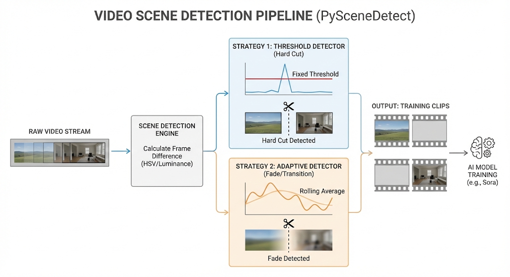
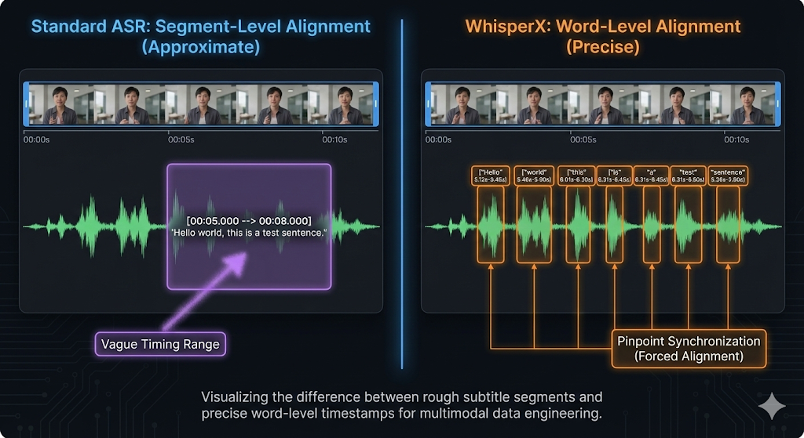

## Chapter 8: Video and Audio Data Processing

### Chapter Abstract

Video data is the modality with the largest data volume, highest processing difficulty, and most complex information density in Large Multimodal Model (LMM) training, often hailed as the "deep water zone" of multimodal engineering. Unlike static images, video introduces the **Temporal Dimension**, meaning the data is not just a stack of pixels, but a carrier of causal logic, physical laws, and motion patterns.

This chapter will systematically deconstruct how to convert continuous, unstructured video streams into discrete Tokens understandable by models. We will start from the underlying **Shot Boundary Detection**, deeply analyzing content-based splitting algorithms; then dissect the "heart" of video generation—the **Video Tokenizer**, comparing the underlying principles of VQ-VAE and Google DeepMind's latest MagViT-v2; finally, we will demonstrate how to utilize **WhisperX** to achieve word-level or even phoneme-level precise alignment of audio and video, constructing spatio-temporally synchronized supervisory signals for the model.

**Learning Objectives**:
* **Engineering Capability**: Master the efficient strategy of using PySceneDetect combined with ffmpeg keyframe metadata for two-stage scene splitting (Coarse-to-Fine).
* **Theoretical Depth**: Deeply understand the "Codebook Collapse" problem in Video Tokenization, and how MagViT-v2 completely solves this bottleneck through Lookup-Free Quantization (LFQ).
* **Data Pipeline**: Implement a Forced Alignment pipeline based on WhisperX to solve precise subtitle alignment in multi-speaker, background-noisy acoustic environments.
* **Storage Optimization**: Understand storage sharding and efficient loading schemes for massive video data.

**Scenario Introduction**:
> "Imagine you are training a world model like Sora. You download a 2-hour movie *Titanic* as training data.
>
> If you rudely slice it into segments every 10 seconds, you will encounter severe 'semantic rupture': the first 5 seconds of a video clip might be the calm sea breeze on the deck, and the next 5 seconds suddenly jump to a noisy dining room. This cross-scene 'Hard Cut' will confuse the model: 'How did a person teleport from outdoors to indoors in 0.1 seconds?' This not only wastes computing power but also teaches the model incorrect physical laws.
>
> Furthermore, audio temporal precision is life. If your subtitles are 2 seconds slower than the video, when Rose is opening her mouth on screen, the corresponding Token is Jack's line. The model will incorrectly associate 'Jack's voice features' with 'Rose's facial features'. In a trillion-token training run, this tiny misalignment will be magnified into severe hallucinations."

---

### 8.1 Video Processing Pipeline: Scene Detection

A video is essentially not a continuous stream, but a sequence spliced together from independent "Shots". Each shot represents a single activation and deactivation of the camera (or a continuous movement of perspective). To train Video Generative Models, it is imperative to ensure that every Training Clip falls within the same shot to guarantee **Spatio-Temporal Continuity**.

#### 8.1.1 Microscopic View of Video Structure: GOP and I-Frames
Before diving into splitting algorithms, we need to understand the basics of video encoding.


* **I-Frame (Intra-coded picture)**: Keyframe. It is a complete picture that can be decoded without relying on other frames. It is usually the starting point of a scene change.
* **P-Frame (Predicted picture)**: Forward predicted frame. Only stores the differences from the previous frame.
* **B-Frame (Bi-predictive picture)**: Bi-predictive frame. Compressed by referencing both previous and future frames, offering the highest compression rate.

**GOP (Group of Pictures)**: The sequence between two I-frames. When dragging the progress bar, video players usually "snap" to the nearest I-frame because decoding must start from here. Our splitting strategy must leverage this characteristic for acceleration.

#### 8.1.2 Algorithm Selection and Strategy


*Figure 8-1: Two strategies for video scene detection and HSV histogram differences*

**PySceneDetect** is an industry-standard open-source tool. It provides various detectors, with the core logic based on inter-frame difference analysis:

* **Strategy 1: Threshold Detector (For hard cuts)**
    * **Principle**: Calculates the average difference (Delta) between adjacent frames in the HSV color space or RGB brightness. When Delta > `threshold` (e.g., 30.0), it is judged as a cut point.
    * **Application**: The vast majority of movies and User-Generated Content (UGC).
    * **Limitation**: Cannot detect gradual transitions.

* **Strategy 2: Adaptive Detector (For gradual transitions / fast-paced)**
    * **Principle**: No longer uses a fixed threshold, but maintains a Sliding Window. It compares the ratio of the "current frame" to the "average frame difference within the window".
    * **Application**: Fade In/Out, Dissolve, or scenes with intense camera movement like in action movies.

**Advanced Strategy: Two-Stage Cascade Splitting**
Running PySceneDetect with full decoding directly on terabytes of video is extremely slow. We recommend the industrial-grade "coarse-to-fine" approach:

1.  **Level-1 (Metadata Scan)**: Use `ffprobe` to quickly scan the video stream metadata and extract the timestamps of all **I-Frames**. I-Frames often appear at scene changes (encoders tend to insert I-frames at dramatic changes). This step requires no video decoding and runs at over 100x playback speed.
2.  **Level-2 (Content Analysis)**: Run PySceneDetect's `ContentDetector` for precise frame-level localization only within a ±2 second range around the potential cut points identified in Level-1.

#### 8.1.3 Core Code: Scene Detection and Lossless Splitting

The following code demonstrates the standard splitting pipeline in a production environment. Note the "stream copy" technique, which is the key to avoiding storage explosions when processing massive videos.

```python
from scenedetect import detect, ContentDetector, split_video_ffmpeg
import os
import logging

# Configure logging
logging.basicConfig(level=logging.INFO, format='%(asctime)s - %(levelname)s - %(message)s')

def process_video_scenes(video_path, output_dir, threshold=27.0):
    """
    Detect scenes and split video losslessly using ffmpeg
    Args:
        video_path: Input video path
        output_dir: Output directory
        threshold: Splitting threshold (Empirical value: 27.0 is suitable for most 1080p videos)
    """
    if not os.path.exists(output_dir):
        os.makedirs(output_dir)

    logging.info(f"Starting scene detection for: {video_path}")

    # 1. Scene Detection
    # threshold=27.0: Histogram difference threshold based on HSV space
    # min_scene_len=15: Ignore segments shorter than 0.5 seconds (30fps).
    # Extremely short segments are usually flashes, glitches, or mis-split noise, unsuitable as training data.
    scene_list = detect(
        video_path, 
        ContentDetector(threshold=threshold, min_scene_len=15)
    )
    
    # 2. Statistics and Filtering
    # Logic can be added here: such as merging overly short adjacent scenes, or discarding scenes shorter than 3 seconds.
    valid_scenes = []
    for scene in scene_list:
        start, end = scene
        duration = (end.get_frames() - start.get_frames()) / start.get_framerate()
        if duration >= 3.0: # Only keep clips longer than 3 seconds for training
            valid_scenes.append(scene)

    logging.info(f"Detected {len(scene_list)} scenes, kept {len(valid_scenes)} valid scenes.")
    
    # 3. Split Video (Stream Copy)
    # Key point: arg_override='-c:v copy -c:a copy'
    # This instructs ffmpeg to directly copy the binary stream without going through the [Decode -> Pixel -> Encode] process.
    # Advantage 1: Extremely fast (limited by disk I/O, not CPU).
    # Advantage 2: 100% lossless image quality, no artifacts from re-encoding.
    split_video_ffmpeg(
        video_path, 
        valid_scenes, 
        output_dir=output_dir, 
        show_progress=True,
        arg_override='-c:v copy -c:a copy' 
    )

# Pitfall Avoidance Guide: Data Bloat Disaster
# Never decode the split videos into image sequences (png/jpg) or numpy arrays for long-term storage!
# Let's do the math:
# 1 hour 1080p H.264 video ≈ 2GB
# After decoding: 3600s * 30 frames * 1920 * 1080 * 3 bytes ≈ 670 GB
# Bloat factor > 300x.
# Always store in compressed formats (mp4/mkv), and only decode in real-time using GPU (NVDEC) within the DataLoader's __getitem__.
```

---

### 8.2 Video Tokenization: From Pixel Ocean to Discrete Islands

For Transformer-based diffusion models (DiT) like Sora and Gen-2, directly modeling in Pixel Space is unfeasible. A 4-second 1080p video contains approximately $3 \times 10^8$ pixels. Calculating the Attention Matrix would cause instant VRAM overflow.

Therefore, video must first be "compressed" into discrete Tokens in the Latent Space. This process is accomplished by a **Video Tokenizer**.

#### 8.2.1 Pain Points of Traditional Solutions: VQ-VAE and "Dead Codes"

**VQ-VAE (Vector Quantized Variational AutoEncoder)** is the cornerstone of early video generation models (like VideoGPT).

* **Pipeline**:
    1.  **Encoder**: Slices the video into 3D Patches (e.g., $16 \times 16 \times 16$ spatiotemporal blocks) and compresses them into low-dimensional vectors $z_e(x)$.
    2.  **Quantization**: Maintains a Codebook containing $K$ prototype vectors (Embeddings). For each $z_e(x)$, it finds the nearest vector $e_k$ in the Codebook by Euclidean distance to replace it.
    3.  **Decoder**: Reconstructs the video using $e_k$.

* **Fatal Flaw: Codebook Collapse**
    In the early stages of training, only a few Codes (e.g., Code #5 and Code #100) are accidentally selected. Because only selected Codes receive gradient updates, they become progressively "better", making them even easier to select. This forms a "rich get richer" Matthew effect.
    * **Consequences**: 90% of the vectors in the Codebook become "Dead Codes" and are never used. This results in an extremely low effective vocabulary size for the model, leading to blurry videos lacking detail.
    * **Remediation**: Traditional methods require complex Reset strategies (like k-means reset), making training highly unstable.

#### 8.2.2 SOTA Solution: MagViT-v2 and LFQ

Google DeepMind introduced **LFQ (Lookup-Free Quantization)** in MagViT-v2, completely changing the rules of the game.


* **Core Idea: No lookups, just calculate.**
    LFQ abandons the "finding the nearest neighbor" approach and directly generates Tokens based on the **Sign** of the Latent Variable.

* **Mathematical Principles**:
    Assume the latent vector output by the Encoder is $z \in \mathbb{R}^D$ (e.g., dimension $D=18$).
    LFQ binarizes each dimension:
    $$q_i = \begin{cases} 1 & \text{if } z_i > 0 \\ 0 & \text{if } z_i \le 0 \end{cases}$$
    
    Then, these $D$ binary bits are combined into an Integer Index:
    $$\text{Token ID} = \sum_{i=0}^{D-1} q_i \cdot 2^i$$

* **Why is LFQ disruptive?**
    1.  **Infinite Effective Codebook**: If $D=18$, the naturally formed codebook size is $2^{18} = 262,144$. All these Codes are composed of $D$ independent dimensions, and each dimension always participates in gradient updates. **Codebook utilization is constantly 100%.**
    2.  **Zero Computation Cost**: There is no expensive "full codebook distance calculation", only simple bitwise operations.
    3.  **Spatio-temporal Compression**: MagViT-v2 incorporates **3D Causal CNNs**, preserving temporal causality while compressing the space (i.e., current Tokens do not leak future information), which is crucial for generative models.

#### 8.2.3 Architecture Selection Comparison Table

| Feature | VQ-VAE (TATS/VideoGPT) | MagViT-v2 (LFQ) |
| :--- | :--- | :--- |
| **Quantization Mechanism** | Nearest Neighbor Search | Sign Function Projection |
| **Vocabulary Size (Vocab)** | Usually 1024 - 8192 (limited by VRAM and collapse) | $2^{18}$ (262k) or even larger, easily expandable |
| **Codebook Utilization** | Low (prone to collapse, needs EMA etc.) | **100% (Avoids collapse by design)** |
| **Gradient Backpropagation** | Requires Straight-Through Estimator (STE) | Improved Entropy Penalty + STE |
| **Generation Quality** | Prone to blurriness, loss of detailed textures | Extremely clear, sometimes better than original (denoising effect) |
| **Inference Speed** | Slower (especially with large codebooks) | Extremely fast |
---

The evolution from VQ-VAE to MagViT-v2 is not simply a parameter optimization, but a Paradigm Shift in video discretization technology—a leap from "Search-based Approximation" to "Computation-based Construction".

First, in terms of computational complexity and scalability, traditional VQ-VAE has fundamental bottlenecks. Its quantization process relies on Nearest Neighbor Search, requiring the calculation of the Euclidean distance between the feature vector and all $K$ prototypes in the codebook, with a time complexity of $O(K)$. This means expanding the Vocabulary Size to improve representation capability directly leads to a linear increase in inference latency. In contrast, the LFQ (Lookup-Free Quantization) mechanism introduced by MagViT-v2 discards table lookup operations, instead utilizing a Sign Function to project latent variables into binary strings. This process reduces the computational complexity to a constant $O(1)$, allowing the model to easily support a vocabulary space of $2^{18}$ or larger without sacrificing inference speed, thus resolving the contradiction between a large vocabulary and low latency.

Second, in terms of codebook utilization and training stability, the two perform very differently. VQ-VAE has long been plagued by the "Codebook Collapse" problem, where some encoded vectors are never activated due to uneven initialization or gradient distribution, resulting in an effective vocabulary size far smaller than designed (usually only 1024-8192). This forces researchers to introduce complex engineering tricks like EMA (Exponential Moving Average) or k-means resets to maintain training. The LFQ mechanism of MagViT-v2 is based on the independent binarization and combination of various dimensions, mathematically ensuring that the codebook space is "combinatorially generated" rather than "discretely looked up". As long as the various dimensions of the latent space remain activated, the combined codes naturally cover the entire codebook space, achieving a theoretical 100% codebook utilization rate.

In summary, MagViT-v2 unifies high compression rate, high fidelity, and low computational cost through the LFQ mechanism, completely solving the traditional VQ-VAE's defects of detail texture loss and poor spatiotemporal consistency. For building large-scale video generation models at the Sora level, MagViT-v2 and its derivative Tokenizer architectures have become the preferred choice in the current industry.


### 8.3 Audio Alignment: WhisperX and Forced Alignment

Video is not just visual data; Audio provides a natural, time-dense text description. Utilizing audio, we can make the model learn multimodal associations like "explosion sound corresponds to flashes" and "crying sound corresponds to tears".

However, standard ASR (like original Whisper) can only provide "sentence-level" timestamps, typically with an error of 1-2 seconds. This is completely inadequate for fine-grained video training (such as Lip-sync). We need **WhisperX**.


*Figure 8-2: Precision comparison between standard ASR (Segment-level) and WhisperX (Word/Phoneme-level)*

#### 8.3.1 Why is Forced Alignment needed?
* **ASR (OpenAI Whisper)**:
    * Output: `"Hello world"` -> `Timestamp: [0.0s -> 2.0s]`
    * Problem: The model only knows this sentence falls within these two seconds, but not exactly which millisecond "world" begins.
* **Forced Alignment (WhisperX)**:
    * Principle: Transcribes the text first, then uses a pre-trained acoustic model (like Wav2Vec2) to forcibly match the **Phonemes** in the text with the audio waveform.
    * Output:
        * `"Hello"`: `[0.12s -> 0.58s]`
        * `"world"`: `[0.85s -> 1.45s]`
    * **Value**: You can construct training pairs like this: when the video frame is at 0.85s, force the model to focus on the Text Embedding of "world". This is the foundation of fine-grained multimodal alignment.

#### 8.3.2 Engineering Implementation: WhisperX Full Pipeline
WhisperX is a complex Pipeline combining VAD (Voice Activity Detection), Whisper (Transcription), Wav2Vec2 (Alignment), and Pyannote (Speaker Diarization).

```python
import whisperx
import gc
import torch

def align_audio_transcript(audio_file, device="cuda", batch_size=16):
    """
    Use WhisperX for transcription and word-level forced alignment
    """
    # Step 1: Transcription
    # Use Large-v2 model to ensure text transcription accuracy
    # compute_type="float16" significantly accelerates, but requires Ampere architecture GPUs or higher (A100/A10/3090/4090)
    print("1. Loading Whisper model...")
    model = whisperx.load_model(
        "large-v2", 
        device, 
        compute_type="float16" 
    )
    
    print("2. Transcribing...")
    audio = whisperx.load_audio(audio_file)
    result = model.transcribe(audio, batch_size=batch_size)
    
    # Key operation: VRAM Management
    # The Whisper model is huge, and the upcoming Alignment model is also a VRAM heavy-hitter.
    # You must explicitly delete the model and trigger garbage collection, otherwise OOM (Out of Memory) is highly likely.
    del model
    gc.collect()
    torch.cuda.empty_cache()

    # Step 2: Forced Alignment
    # Automatically load the corresponding language's Wav2Vec2 model (e.g., wav2vec2-large-960h for English)
    print("3. Aligning...")
    model_a, metadata = whisperx.load_align_model(
        language_code=result["language"], 
        device=device
    )
    
    # The align() function executes an algorithm similar to Dynamic Programming
    # finding the best matching path between the text phoneme sequence and audio waveform features
    aligned_result = whisperx.align(
        result["segments"], 
        model_a, 
        metadata, 
        audio, 
        device, 
        return_char_alignments=False # Set to True for character-level alignment (e.g., for karaoke subtitles)
    )

    # The result contains word_segments, which have the precise start/end for each word
    # For example: [{'word': 'Hello', 'start': 0.1, 'end': 0.5, 'score': 0.98}, ...]
    return aligned_result

# Advanced Tip:
# If you need to distinguish who is speaking (Speaker Diarization), you can further call:
# diarize_model = whisperx.DiarizationPipeline(use_auth_token="YOUR_HF_TOKEN", device=device)
# diarize_segments = diarize_model(audio)
# whisperx.assign_word_speakers(diarize_segments, aligned_result)
```

#### 8.3.3 Production Environment Pitfall Avoidance Guide

1.  **VAD Misjudgment and Background Music Interference**:
    * **Problem**: WhisperX heavily relies on VAD to segment silent parts. If the video BGM (Background Music) is loud, VAD might think the whole segment is vocals, or conversely, drown out the vocals.
    * **Solution**: Introduce **Demucs** or **Spleeter** for Source Separation.
    * **Pipeline**: `Raw Audio` -> `Demucs (Extract Vocal Track)` -> `WhisperX`. Feeding only the extracted pure vocal track into the recognition can drastically improve accuracy.

2.  **Overlapping Speech**:
    * **Problem**: Whisper is weak at handling multiple people speaking simultaneously (Cocktail Party Problem), usually only transcribing the loudest person or generating chaotic text.
    * **Solution**: Enable `diarization=True`. Although this increases inference time by 30%-50%, for TV dramas and interview-type video data, it is the only way to distinguish "who is saying what", preventing the model from confusing character identities.

3.  **Hallucinated Timestamps**:
    * **Problem**: During long silences or pure music segments, Whisper sometimes "hallucinates", repeating the previous line of lyrics and outputting an incorrect timestamp.
    * **Check**: In post-processing, check `word['score']` (confidence). If a continuous string of words has a confidence below 0.4, it is recommended to discard the alignment information for that segment.

---

### 8.4 Keyframe Extraction

In long-video understanding tasks, the traditional "Uniform Sampling" strategy has proven to have fatal flaws. Uniform sampling assumes the information density of every second in a video is equivalent, which is completely invalid in real-world videos containing vast amounts of static backgrounds or lengthy dialogues. It not only wastes precious Token budgets but also leads to critical moments (like a core action lasting only one second) being entirely skipped, triggering a "Needle in a Haystack" style comprehension failure. Therefore, content-based intelligent keyframe extraction has become a standard module in multimodal preprocessing.

### 8.4.1 Intra-Shot Keyframe Selection: From Physical Boundaries to Semantic Clustering

A video is a visual sequence spliced together by a series of Shots through Hard Cuts or Transitions. Directly performing global clustering or sorting on the entire long video will destroy the video's original narrative montage structure. Thus, the industry generally adopts a hierarchical architecture of "segmentation first, extraction later".

**Core Logic and Architectural Evolution: Shot Boundary Detection**

- **Conventional Mechanism:** Early systems relied on Color Histogram Difference or Sum of Absolute Differences (SAD) between frames to set hard thresholds. However, this heuristic algorithm is extremely fragile when facing Panning, Zooming, or flashes.  
- **Modern Standard Practice:** Introducing lightweight 3D CNN models (like TransNetV2). By capturing feature changes in both spatial and temporal dimensions simultaneously through 3D convolution kernels, the model can distinguish hard cuts from Fades/Dissolves with extremely high accuracy.  
- **Architectural Trade-off:** 3D CNNs introduce additional deep learning inference overhead. In offline batch processing pipelines with ultra-high throughput requirements, it is recommended to feed skipped frames into TransNetV2, trading precision for speed; while on edge devices with limited compute, it can be degraded to calculating the Structural Similarity Index Measure (SSIM) of adjacent frame thumbnails.

**Local Clustering and Representative Frame Selection (Local Clustering)**

Once shot boundaries are established, frames within a Shot are usually highly coherent visually. The goal is to collapse frames with similar visual features into a single representative frame.

- **Algorithm Pitfall:** Strictly avoid using the traditional K-Means algorithm in multimodal preprocessing. The K-Means cluster centers are calculated by averaging feature vectors. In image pixel space or highly non-linear feature spaces, the mean vector might correspond to a blurry, non-existent "Ghost Frame", which feeds extremely severe noise into the large model.  
- **Recommended Practice:** K-Medoids or Adaptive Spectral Clustering algorithms must be used. K-Medoids forces the selected cluster centers to be real physical samples in the dataset. By calculating the feature distance matrix, the center frame with the minimum total distance to other intra-class frames is selected as the candidate keyframe.

### 8.4.2 CLIP-based Frame Ranking: The Game Between Relevance and Diversity

To further compress Tokens, the selected candidate frames must match the user's Query or global text context, which is called Query-aware frame selection. Vision-language large models like CLIP have become the premier engines for frame ranking due to their powerful cross-modal alignment capabilities.

**Underlying Theory Breakdown:** Given a candidate frame set \(V = \{f_1, f_2,..., f_N\}\) and a text query \(q\), the system uses a CLIP encoder to extract features and calculates cosine similarity:

$$
S_{rel}(f_i, q) =
\frac{
\mathrm{CLIP}_{vis}(f_i) \cdot \mathrm{CLIP}_{txt}(q)
}{
\left\| \mathrm{CLIP}_{vis}(f_i) \right\|
\left\| \mathrm{CLIP}_{txt}(q) \right\|
}
$$

**Architectural Trade-offs and Deep Pitfalls: The Modality Gap**

- **Pitfall:** CLIP is trained on image-text pairs consisting of Captions and images, not Question-Answer pairs (QA). If a user's interrogative sentence (e.g., "Where did the person in red in the video go at the end?") is fed directly into the CLIP text encoder, its generated Embedding often fails to accurately align with image features, causing the extracted frames to deviate from the topic.  
- **Recommended Strategy:** Before calculating similarity, use a lightweight LLM to declaratively rewrite the user's interrogative sentence (Query Rewriting), extracting core visual entities (like "person in red"), or use a Reward Model specifically fine-tuned on video QA datasets (like SeViLA) to replace native CLIP for multimodal similarity scoring.

**Local Collapse and Coverage Crisis (Coverage vs. Relevance)**

- **Pitfall:** If Top-K is selected solely based on CLIP similarity scores, for Global Queries like "Summarize this one-hour documentary", the model will concentrate all K highest-scoring frames on a brief climax segment of the video, causing massive blind spots on the timeline and losing long-sequence causal reasoning capabilities.  
- **Solution:** Diversity constraints must be introduced. Common practices include applying Determinantal Point Processes (DPP) or Maximal Marginal Relevance (MMR).

**Formula Breakdown (MMR):** When iteratively selecting the next frame $f_i$, it not only maximizes its relevance to query $q$, but also minimizes its similarity to frames in the already-selected frame set $S$:

$$
\text{Score}(f_i)
=
\lambda S_{rel}(f_i, q)
-
(1-\lambda)
\max_{f_j \in S}
\text{Sim}(f_i, f_j)
$$

Where $\lambda$ is the balancing factor. This mechanism forces the extractor to scatter sampling points evenly along the timeline, thereby balancing relevance and full-video Temporal Coverage.

### 8.4.3 Motion-aware Sampling: Motion Priors and Spatiotemporal Information Density

From an LMM's perspective, the information density of a 10-minute static surveillance footage and a 10-second complex martial arts fight is entirely different. Time-based uniform sampling or pure static feature similarity clustering often ignores Motion Dynamics. Motion-aware sampling aims to quantify the "severity of visual change" within local time segments, thereby dynamically allocating frame budgets.

**Architectural Trade-offs of Three Mainstream Implementations:**

- **Optical Flow Magnitude** - **Principle:** Uses networks like RAFT to calculate the dense optical flow field matrix \((u, v)\) of adjacent frames, and aggregates the global or local regional motion magnitude  
    $$
    M
    =
    \frac{1}{H W}
    \sum_{x,y}
    \sqrt{
    u_{x,y}^2 + v_{x,y}^2
    }
    $$
    
    Magnitude extrema points typically correspond to action climaxes.  
  - **Trade-off:** This is the most precise motion metric, capable of avoiding simple lighting gradations. However, the compute cost of calculating dense optical flow even exceeds the LMM inference itself. In production environments, this method is generally not recommended when processing terabytes of video.

- **Pixel Difference & SSIM** - **Principle:** Directly performs L1/L2 norm difference calculations on adjacent frames (usually downsampled to extremely low resolutions, like 64×64), or uses SSIM to evaluate structural changes.  
  - **Pitfall:** Extremely sensitive to Camera Shake, flashes, or full-screen watermarks, easily misjudging this noise as high-information motion.

- **Compressed Domain Motion Vectors** - **Best Practice Architecture:** Modern videos (like H.264/H.265) already have Motion Vectors (MV) and Residuals calculated by the encoder during compression. As demonstrated by the EMA (Efficient Motion-Aware) model, sparse MV data can be directly extracted from the MP4's GOP (Group of Pictures) structure and fed into the network along with sparse I-frames (keyframes). This strategy completely bypasses the expensive pixel-level decoding process, reducing preprocessing complexity by an order of magnitude while natively preserving underlying motion perception capabilities.

### 8.4.4 Computational Complexity Analysis

Video preprocessing complexity must be jointly examined end-to-end within the same dimension as the large model's inference complexity. In the LMM lifecycle, computation is mainly concentrated in three stages: preprocessing extraction, large model Prefill, and Decode.

| Processing Strategy | Preprocessing Time Complexity | Storage / I/O Pressure | LMM Prefill Compute Cost | LMM Performance & Memory |
|---|---|---|---|---|
| Full/Uniform Sampling | $O(1)$ (Direct decode via timestamp only) | Extremely High (Massive frames loaded to VRAM) | $O\!\big((N_{\mathrm{frames}}\!\cdot\!T)^2\!\cdot\!d\big)$ (Disastrous quadratic explosion) | Prone to OOM, limited by context window length |
| K-Medoids Clustering | $O\!\big(T_{\mathrm{shot}}\!\cdot\!K^2\!\cdot\!D\big)$ (Feature extract + distance matrix iter) | Medium (Needs to cache all intra-shot frame features) | Significantly Decreased (Input frames drastically reduced) | Retains narrative structure, but may lose dynamic details |
| CLIP Global Ranking | $O\!\big(N_{\mathrm{frames}}\!\cdot\!D_{\mathrm{clip}}\big)$ (Dense frame-by-frame inference) | High (Needs to load heavy CLIP model) | Lowest (Only retains a tiny fraction of Top-K frames) | Highly relevant, but easily loses temporal continuity |
| Compressed Domain MV Extraction | $O(1)$ (Parses bitstream only, no decode) | Extremely Low (Small file size) | Lower (Short MV sequence length) | Has extremely strong motion perception, high implementation difficulty |


In actual cloud architectures, the large model backend's Prefill stage (limited by compute) and Decode stage (limited by VRAM bandwidth) are core bottlenecks. If we can use lightweight heuristic algorithms (like SSIM threshold filtering) or compressed domain feature extraction during the preprocessing stage to reduce input Tokens by 80%, then even introducing millisecond-level preprocessing latency can buy second-level end-to-end latency reductions at the LMM level.

### 8.4.5 Offline vs. Online Extraction

Where the frame extraction logic is placed in the data pipeline is a major trade-off that must be faced in system design.

**Offline Preprocessing Extraction**

- **Mechanism:** Before building the dataset, use a cluster (like Spark/Ray) to run feature extraction and sorting algorithms to filter keyframes, then encode them into WebDataset or Parquet formats to disk. During training, the Dataloader only needs to read these concentrated image collections.  
- **Advantage:** Extremely alleviates GPU training clusters' I/O starvation and data loading pressure. Compute and storage are decoupled, maximizing throughput during training.  
- **Pitfall:** View Collapse. Across multiple training Epochs, the model only ever sees the exact same frames. This prevents the model from learning complex temporal transitions and loses the data augmentation effects brought by Temporal Jittering, making it highly prone to overfitting.

**Online / In-network Dynamic Pruning**

- **Mechanism:** Raw video streams are fed directly into training nodes, utilizing Differentiable Modules inside the network to dynamically discard redundant Tokens. For example, TokenLearner or DyCoke dynamically fuses redundant frames in the Decoder stage based on Attention scores or spatial Pooling.  
- **Advantage:** Allows Backpropagation to flow through the "sampling module", making the model adaptively learn how to select important features. The sampling randomness in every forward pass provides excellent generalization capabilities.  
- **Trade-off & Challenge:** Devastating impact on the Data Pipeline. GPU nodes must mount massive CPU resources for real-time demuxing and decoding of high-res videos, often making the DataLoader the absolute bottleneck of the entire training process.

### 8.5 Building Video-Text Interleaved Datasets

After keyframes are refined, how to combine them with complex text (like subtitles, barrage/bullet chats, multi-turn dialogues) to build a hundred-billion-scale, native Video-Text Interleaved Dataset is the foundation for enhancing LMM In-Context Learning and long-range reasoning capabilities.

### 8.5.1 Time Alignment & Token Mapping

In video language models, continuous physical time streams must be explicitly "Quantized" and injected into discrete LLM Token sequences. Interleaved data lacking time alignment will leave the model unable to answer "when did what happen".

**Implementation Logic and Formulas:**

- **Time Binning:** Divide the total video duration \(T_{total}\) into a fixed number of \(N_{bins}\) (e.g., 1000 Bins), converting continuous timestamps \(t\) into discrete extended Tokens in the Vocabulary, like `<time_0>` to `<time_999>`.  
$$
\mathrm{TokenIndex}
=
\left\lfloor
\frac{t}{T_{\mathrm{total}}}
\cdot
(N_{\mathrm{bins}} - 1)
\right\rfloor
$$

- **Physical Interleaving:** When processing Automatic Speech Recognition (ASR) text with timestamps, adopt a strict temporal interleaving strategy.  
  - **Conventional Structure:** Place all video Tokens first, then all text Tokens. Known as "In-the-front format", it's easy to implement but severs audio-visual correspondence.  
  - **Recommended Architecture (Interleaved Format):** Following the timeline, physically embed ASR text Tokens between their corresponding visual feature Tokens.  

  ```
  [<frame_1_feature>][<time_0.5s>] "The man walks" [<time_2.0s>][<frame_2_feature>] "into the room." [<time_3.5s>]
  ```

**Architectural Advantage:** This format forces the large model to use Causal Attention to capture fine-grained alignment between the "current frame image" and "immediately following text", greatly improving model performance on Video Commentary and Temporal Grounding tasks.

### 8.5.2 Sliding Window Construction

When processing long videos over tens of minutes (like movies, long tutorials), even after frame compression, the total number of visual Tokens may still exceed the LLM's context window limit. Here, a Sliding Window strategy must be adopted during dataset construction to slice video and text.

**Core Logic and Pitfalls:**

- **Overlapping Stride:** Strictly avoid using head-to-tail Hard Truncation. Hard truncation severs action causal chains that happen exactly at the boundary. The common practice is to set a certain Stride to achieve overlap. For example, a window length of 20 seconds and a stride of 10 seconds means adjacent clips share 50% overlapping context.  
- **Context Fragmentation Pitfall:** When mapping global dialogues to local sliding windows, forcibly attaching a summary answer belonging to the 50th minute to a local window in the first 5 minutes will cause severe model Hallucination.  
- **Recommended Strategy:** Introduce Hierarchical Narrative Processing. First, use an LLM to generate fine-grained QA Pairs based on local sliding windows, then aggregate the outputs of adjacent windows to generate cross-window paragraph-level summaries (Segment-level QA). This local-to-global Tree-structured Video Representation ensures semantic self-consistency of data within truncated windows.

### 8.5.3 Multimodal Sample Format Design

To enable the same dataset engine to seamlessly support pure text, single image, multi-image, short video, and long video, the multimodal sample data format must have extremely high generalizability and decoupling capabilities. Drawing from the paradigms of industry leaders LLaVA-NeXT-Interleave and M4-Instruct, the foundation usually adopts a structured Schema based on JSONL.

**Schema Design Specification and Breakdown:**

```json
{
  "id": "vid_shot_8392",
  "modality_type": "interleaved_video_text",
  "assets": [
    {"type": "video", "path": "s3://dataset/videos/vid_8392.mp4", "start": 10.5, "end": 15.5},
    {"type": "image", "path": "s3://dataset/images/ref_img.jpg"}
  ],
  "conversations": []
}
```

**Architectural Decoupling:** This format thoroughly decouples the "physical paths of multimedia assets (assets)" from the "large language model's context (conversations)". In the DataLoader, a dedicated Data Processor parses the `<image_x>` and `<video_x>` placeholders, dynamically replacing them with N continuous `<vision_token>`s mapped by the vision encoder.

**AnyRes Compatibility:** For images and videos of different resolutions, utilize a mechanism similar to AnyRes (Adaptive Resolution). Instead of a fixed number of Patches, slice assets into dynamic Grids based on aspect ratio, further filling placeholders, which greatly enhances model robustness to multi-scale inputs.

### 8.5.4 Sharding Strategy: Evading Distributed I/O Pitfalls

When interleaved datasets reach tens of terabytes or even petabytes, storing hundreds of millions of small videos and JSON files on distributed object storage (like Amazon S3 or local HDFS) triggers disastrous Metadata pressure and extremely high Time To First Byte (TTFB) latency. Therefore, **Sharding** (packing into pieces) is an inevitable choice.

**Why must the WebDataset (WDS) format be used?**

WebDataset packs related independent files (like `.mp4`, `.json`, `.txt`) with identical filename prefixes into a POSIX-compliant continuous `.tar` archive. This transforms random access on the storage system into pure Sequential Read. By avoiding the decompression and header retrieval of small files, its streaming read speed perfectly matches the tensor throughput demands of thousands of A100 GPUs.

**Trade-offs in Sharding Dimensions:**

- **Sample-based Sharding:** E.g., forcing each Shard to contain 1,000 videos.  
  - **Pitfall:** The high heterogeneity of video files (like 4K vs. 360p, 5-second clips vs. 10-minute videos) causes immense physical size variations among Shards (some 500MB, some 50GB). In distributed training, DataLoader read progress across nodes becomes severely imbalanced, triggering the "Straggler Problem" and leaving some GPUs idling.

- **Size-based Sharding [Recommended Practice]:** - **Strategy:** In the data build pipeline, dynamically accumulate sample bytes. Regardless of how many samples are included, as soon as the current Shard's volume reaches a preset threshold (typically recommended between 1GB and 2GB), immediately truncate and generate the next Shard.  
  - **Advantage:** Extremely balanced distributed loading. Paired with WebDataset's `shardshuffle` and node distribution mechanisms, this maximizes network I/O stability.

### 8.5.5 WebDataset & Ray Data Streaming Implementation

When dealing with the cleaning, extraction, and packing of terabyte-plus multimodal data, traditional JVM-based frameworks (like PySpark) often suffer severe off-heap Out Of Memory (OOM) errors due to Serialization/Deserialization overhead when handling Python-native vision processing libraries (like PIL, PyTorch, PyAv). In contrast, Ray Data, based on the Arrow memory model, offers native Python Zero-copy support, making it the premier choice for streaming batch processing.

Below is a core architectural logic breakdown of building distributed video frame extraction and generating WebDataset formatted shards based on the Ray Data 2.x API:

```python
import ray
import boto3
import numpy as np
from typing import Dict

# Core Logic 1: Build basic streaming Dataset and repartition
# Use read_parquet to read small file indices containing metadata (URL, Captions)
# Instead of loading everything into memory, Ray adopts a Streaming mode
ds = ray.data.read_parquet("s3://metadata_bucket/raw_index.parquet")

# Pitfall: You must perform reasonable repartitioning to avoid generating massive fragmented small files during write-out
# By controlling concurrency, make the data volume processed by each Task roughly fall into the optimal WDS Shard range of 1~2GB
num_workers = 64
ds = ds.repartition(num_workers)

# Core Logic 2: Define stateless operator classes for batch processing
class InterleavedProcessor:
    def __init__(self):
        # Common concurrency trap: AWS Boto3/network clients must be created within the worker's initialization lifecycle
        # Never instantiate them on the Driver node and directly broadcast (Pickle) across processes, otherwise it easily causes Broken Pipe crashes [32]
        self.s3_client = boto3.client("s3")
        
    def _download_and_extract_keyframe(self, s3_path: str) -> bytes:
        # Encapsulate underlying logic here: Stream download video -> run frame extraction or sliding window algorithms from Section 8.4
        # Return the processed micro-visual segments or feature byte streams
        pass

    def __call__(self, batch: Dict[str, np.ndarray]) -> Dict[str, list]:
        """
        Process each batch of data, converting it to the file suffix aligned format required by WebDataset
        """
        output = {"mp4": [], "json": []}
        for i in range(len(batch["url"])):
            try:
                # Extract processed media data
                processed_bytes = self._download_and_extract_keyframe(batch["url"][i])
                output["mp4"].append(processed_bytes)
                
                # Build the corresponding multimodal Schema (matching the design in Section 8.5.3)
                output["json"].append({
                    "id": batch["id"][i],
                    "modality_type": "interleaved_video_text",
                    "conversations": [{"from": "human", "value": f"<video_0>\n{batch['caption'][i]}"}]
                })
            except Exception as e:
                # In large-scale distributed tasks, gracefully skip corrupted files instead of blocking the entire Pipeline
                continue
        return output

# Core Logic 3: Apply distributed Map, isolate CPU/GPU resources
# ActorPoolStrategy maintains a group of memory-resident Actors, avoiding the overhead of frequently starting and stopping processes
ds = ds.map_batches(
    InterleavedProcessor,
    concurrency=num_workers,
    batch_size=16,  # Note: Video decoding is extremely memory-intensive, batch_size must be small to prevent OOM
    compute=ray.data.ActorPoolStrategy(size=num_workers)
)

# Core Logic 4: Aggregate outputs into WebDataset (TAR) archive shards
# Mechanism: Ray will automatically generate corresponding Tar shards for each Worker in parallel
# Filenames will have the {uuid}_{block_idx}.tar identifier, natively supporting PyTorch/WebDataset reads
ds.write_webdataset(
    path="s3://target_bucket/curated_interleaved_wds/",
    concurrency=num_workers
)
```