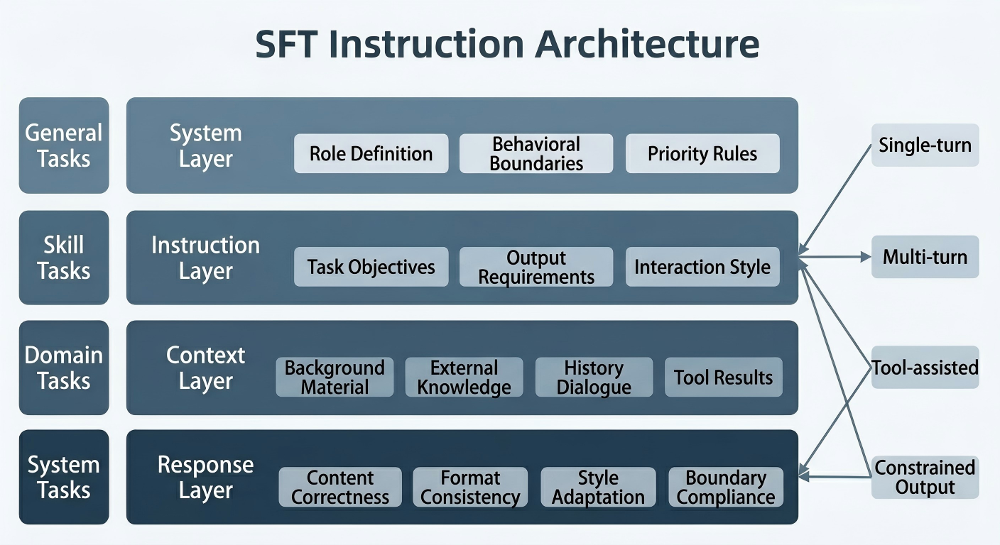
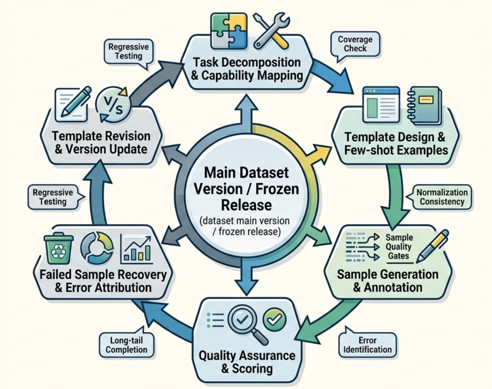

# Chapter 12: SFT Data Design and Instruction Systems

## Chapter Overview

After pretraining, a large language model has acquired substantial language generation capability—but this does not mean it can reliably complete specific tasks. As the model enters the post-training stage, the more critical questions become: Can the model understand user requirements? Can it maintain consistent behavior across different scenarios? Can it produce outputs that conform to human usage conventions?

"Saying the right thing" emphasizes the model's ability to understand instructions, complete tasks, and produce correct, relevant content. "Saying it consistently" emphasizes the model's ability to maintain stable, reliable, and controllable performance across different scenarios, input forms, and constraint conditions. "Saying it like a human" emphasizes that the model's responses are not only correct but also natural, clear, and helpful—aligned with human preferences and usage habits. Achieving these three goals depends not solely on the model's parameter scale; it requires careful data design, preference modeling, and quality operations during post-training.

This part therefore centers on the critical data challenges in post-training large language models, **establishing a complete chain from SFT to preference alignment to annotation operations**. First, through SFT data design and instruction systems, the model learns to answer questions as required and acquires fundamental task-following capability. Next, through preference data and reward signals, the model's behavioral style is further shaped so that its responses better align with human preferences and business objectives. Finally, through annotation platforms, quality assurance systems, and data operations, systematic support is provided for the production, evaluation, iteration, and scaled supply of high-quality data.

The question this chain answers is not merely "how the model is trained," but more fundamentally "why the model can stably produce high-quality responses." Only by treating SFT, preference alignment, and annotation operations as a continuous data system can one truly understand how model capability forms and appreciate the data engineering logic underlying high-quality large language models.

## Abstract

Supervised Fine-Tuning (SFT) is the most critical data engineering entry point of the post-training stage. It encodes task objectives, behavioral boundaries, and output specifications into training samples, defining the last explicitly moldable "behavioral shell" before model deployment. This chapter explains how to elevate SFT data from a loose collection of question-answer pairs into a reviewable engineering system: first, it defines SFT's role in capability alignment and distinguishes "making the model follow instructions" from "making the model capable"; next, it establishes a four-level task hierarchy—general, skill, domain, and system—along with a four-element template structure, using a capability coverage matrix to control sample distribution and long-tail coverage; finally, it presents quality evaluation methods and version iteration feedback loops, and explains how SFT data connects to preference and tool-calling data.

In 2022, a passenger of Air Canada needed to purchase a bereavement-fare ticket following his grandmother's death. Before buying the ticket, he consulted the airline's website chatbot about the relevant policy. The chatbot told him he could purchase a full-price ticket and apply for a bereavement-fare refund of the price difference after completing the trip. However, Air Canada's official policy did not support such post-travel refund requests. After the passenger purchased the ticket following the chatbot's advice, his refund application was denied, and he ultimately brought Air Canada before an arbitration body. In 2024, the Civil Resolution Tribunal of British Columbia ruled that Air Canada was liable for the erroneous information provided by its website chatbot and awarded compensation to the passenger. This case illustrates that the risk of large model applications lies not only in failing to provide an answer, but more dangerously in delivering incorrect answers in fluent, confident, and seemingly credible language. In enterprise customer service, knowledge Q&A, legal consultation, medical assistance, financial services, and similar contexts, once a model's output deviates from actual policies, business rules, and verifiable evidence, real-world harm can result (Moffatt v. Air Canada, 2024; Lifshitz & Hung, 2024).

In the journey from "able to generate" to "usable, controllable, and deployable," Supervised Fine-Tuning (SFT) plays an extremely critical yet frequently misunderstood role. Instruction fine-tuning was used in works such as FLAN and InstructGPT to improve model compliance with natural-language task instructions and human intent; accordingly, SFT is regarded here as the core data engineering entry point of the post-training stage (Ouyang et al., 2022; Wei et al., 2022; Chung et al., 2024). Many teams simply understand SFT as "collect some question-answer pairs and then let the model learn to respond," but in real engineering practice that understanding falls far short. For teams responsible for instruction fine-tuning data design and annotation specifications, SFT is far more than a pure data-organization step: it encodes task objectives, behavioral boundaries, output specifications, domain knowledge, interaction style, and system constraints into training samples. It effectively defines the last layer of the model's "behavioral shell" that can be explicitly shaped before deployment.

This chapter is addressed to team members responsible for SFT data design, template authoring, annotation specification development, quality acceptance, and version management. It systematically discusses SFT objectives, task stratification, instruction systems, sample structure, quality evaluation, and industry-specific deployment challenges. We particularly emphasize one core thesis: a high-quality SFT dataset should not be understood as an accumulation of scattered question-answer pairs. It is fundamentally an instruction engineering system oriented toward capability alignment. It requires a capability coverage framework as its backbone, task templates as its carrier, a quality feedback loop as its safeguard, and subsequent preference and tool-calling data as its extension interfaces.

From an organizational collaboration perspective, SFT data construction typically spans multiple roles across product, algorithm, annotation, evaluation, operations, and domain expert teams. The product team defines scenario objectives and deployment constraints; the algorithm team specifies the training interface and sample format; the annotation team implements templates and generates samples; the evaluation team tracks failure modes; and domain experts ensure knowledge boundaries and professional terminology are respected. If any of these roles is absent, the SFT dataset may appear "large in scale" on the surface while in practice lacking structure, focus, and the ability to evolve sustainably.

Therefore, this chapter treats SFT as a systems engineering endeavor centered on model behavior design, rather than a one-time "data preparation task." The difficulty of this endeavor lies not in whether one can quickly produce hundreds of thousands of samples, but in whether those samples genuinely constitute an instruction system that is organized, layered, driven by feedback, and governed by versioning. Only when SFT data is built as the "explicit design document for model behavior" can it serve as a reliable foundation for subsequent preference alignment, tool calling, agent trajectory learning, and online feedback iteration.

---

## Keywords

SFT data design and instruction systems; supervised fine-tuning; preference data; alignment data; quality evaluation

## Learning Objectives

- Explain the capability positioning of supervised fine-tuning between pretraining and preference alignment, distinguishing the boundary between behavior shaping and capability supplementation.
- Stratify instruction tasks across the four levels—general, skill, domain, and system—and design corresponding labels and sample archiving structures.
- Distinguish between single-turn, multi-turn, tool-assisted, and constrained-output templates, and correctly delineate the four roles: system, instruction, context, and response.
- Build a capability coverage matrix and knowledge point map, and establish prioritization and allocation schemes for sample length, complexity, style, and long-tail value.
- Design quality evaluations for instruction clarity, response correctness, and format consistency, and embed failure sample retrieval and version freezing into routine production workflows.

## 12.1 What Is the Actual Goal of Supervised Fine-Tuning

### 12.1.1 SFT's Position in Capability Alignment

If we divide the large model training process into stages, pretraining is responsible for equipping the model with broad language-statistical capability, knowledge compression, and foundational reasoning potential; SFT is responsible for converting that "latent capability" into "schedulable capability"; and the preference alignment stage further shapes "schedulable capability" into "behavior patterns that better conform to human preferences and platform rules." This layered structure—pretraining, supervised fine-tuning, preference optimization—is clearly reflected in GPT-3, InstructGPT, LIMA, and subsequent preference optimization research (Brown et al., 2020; Ouyang et al., 2022; Wei et al., 2022; Chung et al., 2024; Zhou et al., 2023; Christiano et al., 2017; Stiennon et al., 2020; Rafailov et al., 2023). From this perspective, SFT is the intermediate layer connecting "what the model knows" with "how the model acts."

Many teams conducting SFT tend to fall into one of two extremes. One extreme is to underweight SFT, assuming that if the pretrained model is strong enough, a little instruction data is all that is needed. The other extreme is to overweight SFT, assuming that enough SFT data can compensate for any missing deep capability in the base model. The former underestimates the difficulty of behavior shaping; the latter overestimates supervised signals' ability to reshape foundational capabilities. A more accurate view is that SFT excels at three things: first, organizing existing latent capabilities into callable task abilities; second, constraining the response style to a clear, stable, scenario-appropriate track; and third, standardizing the task interface so that the model forms consistent responses to input structures, context boundaries, and output formats. Results from the FLAN series and InstructGPT both demonstrate that instruction-based supervised data can significantly improve a model's instruction-following and human preference evaluation performance on unseen tasks (Ouyang et al., 2022; Wei et al., 2022; Chung et al., 2024).

From the training pipeline perspective, pretraining produces a base model that "contains a wealth of latent potential in its parameter space," but this potential is often dispersed, vague, and lacking behavioral interfaces. The model may know a great deal and possess some reasoning potential, yet this does not mean it will, upon receiving actual business tasks, reliably produce responses with the appropriate format, tone, length, and scope. SFT's task is to organize latent capabilities into task-oriented behavioral patterns. It does not create capability from nothing; its role is to make it controllable "when, in what manner, and which existing capabilities are invoked." LIMA's experiments further suggest that much knowledge and capability comes primarily from pretraining, with a small number of high-quality supervised samples more focused on shaping response format and interaction style (Zhou et al., 2023).

This is also why SFT is often an indispensable step before productization. A model that has only undergone pretraining may occasionally shine in open-ended dialogue, but in tasks such as batch ticket classification, structured extraction, enterprise Q&A, sensitive-scenario replies, and fixed-schema output, it will typically exhibit a large number of unstable behaviors. It may produce overly verbose output one moment and omit critical information the next; it may follow a format one moment and improvise the next. SFT's role is precisely to bridge this instability and business requirements.

From a capability alignment perspective, SFT occupies a particularly special position. Unlike pretraining—which broadly absorbs world knowledge—and unlike preference alignment—which emphasizes human preference ranking—SFT's responsibility is to define "a baseline behavioral distribution that can continue to be optimized in subsequent stages." If that distribution is itself highly chaotic, neither preference learning nor tool learning built on top of it will have a solid foundation. Preference modeling, RLHF, and DPO generally optimize over an existing model output space, so the baseline behavioral distribution established at the SFT stage directly affects the efficiency and stability of subsequent optimization (Christiano et al., 2017; Stiennon et al., 2020; Rafailov et al., 2023). Conversely, if SFT has already brought the model into a relatively well-specified, clear, and controllable behavioral space, subsequent optimization will be both more efficient and more stable.

Therefore, SFT should not be viewed as the primary means of "making the model smarter," but rather as the critical engineering stage of "making the model controllable, usable, and reproducible in a business context." This assessment aligns with LIMA's analysis that "knowledge comes primarily from pretraining, while the alignment stage more often changes response format" (Zhou et al., 2023). SFT can significantly improve instruction-following, task stability, output consistency, and scenario adaptability, but it cannot replace the base model's fundamental acquisition of capabilities such as complex reasoning, long-term memory, deep domain knowledge, and tool planning. Understanding this is crucial for data design teams, as it determines what SFT datasets are meant to solve, what they cannot solve, and which problems should be handled by upstream model selection, downstream preference learning, or systems engineering.

### 12.1.2 The Boundary Between "Making the Model Follow Instructions" and "Making the Model Capable"

"Following instructions" and "being capable" are often conflated in engineering contexts. In one sample, if the user requires "please answer in three paragraphs and provide a conclusion," and the model learns to comply with the three-paragraph structure and conclusion position, that is following instructions. If the user requires "compare the applicable conditions of two approaches and identify sources of risk," the model must not only observe the format but also genuinely perform comparison, abstraction, and attribution—there is both instruction-following and capability invocation involved.

In SFT design, teams must explicitly distinguish three types of signals. The first type is behavioral format signals: language style, paragraph organization, whether to output JSON, whether to summarize before expanding. The second type is task execution signals: extraction, classification, rewriting, planning, summarization, comparison, clarification, refusal, and so on. The third type is knowledge and reasoning signals: use of domain facts, constraint-based problem solving, integration of multi-turn context. These three types of signals often co-occur in a single sample, but their training implications differ. Format signals are more about interface specification; task execution signals more about skill alignment; knowledge and reasoning signals depend more heavily on the base model and data selection strategy.

This means that SFT teams must ask during data review not only "does this answer look like something a human would write" but also "what exactly is this sample teaching the model." If a sample merely presents a correct answer with elegant prose but lacks clear task boundaries and constraint expression, its benefit to the model may be far less than that of a sample with a clear structure, explicit intent, and complete constraints.

In practical engineering, an effective way to distinguish "following instructions" from "being capable" is to analyze why a task failure occurred. If the model's failure manifests as disorganized format, wrong tone, missing required paragraphs, or failure to follow the output schema, that is typically a "compliance layer" problem. If the model's format is correct but it misses key evidence, produces incomplete comparative logic, or fails to identify conflicting conditions, that is more of a "capability invocation layer" problem. The two call for different data design remedies: the former requires clearer templates, more stable specifications, and more consistent demonstrations; the latter requires more representative task constructions, more sufficient context, and more reasonable difficulty stratification.

Another common misconception is treating "the model appears to have mastered something" as "the model has truly acquired the capability." For instance, a model that performs well on large numbers of "please summarize the following text" samples may have merely learned common summary sentence patterns. Only when the model can stably identify key information as input length, style, topic, and constraints vary can it be said to have formed a relatively robust callable capability pattern for the summarization task. The goal of SFT should not stop at making the model look polished on a few templates; the key is to maintain stability across different variants of a task.

Therefore, design teams should avoid "superficially correct but signal-weak" samples in their annotation specifications. A good SFT sample does not merely tell the model what the final answer is; it also uses task structure and contextual conditions to clearly convey "under what conditions should one answer this way, and under what conditions should one not." Truly high-quality data focuses not on delivering results to the model, but on teaching the model behavioral boundaries and capability interfaces.

### 12.1.3 Why SFT Data Cannot Simply Be Equated with Question-Answer Pairs

Treating SFT data as "question-answer" binary pairs is the most common and most dangerous oversimplification. A truly high-quality SFT sample contains at least four layers: role definition, task instruction, contextual conditions, and target response. Instruction fine-tuning datasets and automatic construction methods such as Self-Instruct also typically distinguish explicitly between instruction, input/context, and output, rather than storing only isolated question-answer pairs (Wei et al., 2022; Wang et al., 2023; Wang et al., 2022). In other words, what the model learns is no longer "upon seeing this question, output this answer," but rather "given a defined role, constraints, context, and task objective, how to construct a compliant response."

A seemingly simple customer service sample that retains only the user's question and the agent's reply trains the model on surface-level phrasing. But if system rules, policy excerpts, user history, and format requirements are added, the model learns a conditional response mechanism. The difference is enormous. The former is more like memorizing templates; the latter is closer to task execution.

Moreover, many high-value SFT tasks are not single-step question answering at all. For example, multi-turn clarification requires the model to first identify insufficient information and then ask targeted follow-up questions; tool-assisted tasks require the model to output call parameters or an action plan before responding; constrained output requires the model to generate structured results in a specific schema; system tasks require the model to maintain priority consistency under conflicting instructions. Toolformer, ReAct, and mainstream API tool/function calling mechanisms all treat "when to call a tool, how to organize parameters, and how to integrate returned results" as critical interface questions for model action capability (Schick et al., 2023; Yao et al., 2023; Askell et al., 2021; OpenAI, 2024). All of this demonstrates that SFT data design is fundamentally "interaction structure design," not "answer collection."

From a training interface perspective, the essence of an SFT sample is a mapping from "conditions to responses," and those "conditions" are far more than a natural-language question. They may include system instructions, developer constraints, business rules, conversation history, tool results, external documents, field schemas, refusal strategies, and even some implicit but necessarily explicit contextual variables. If these conditions are ignored and only an isolated question and an isolated answer remain, the model typically learns only a fragile surface correspondence, not a reliable task mechanism.

This is also why many teams encounter a familiar phenomenon in early SFT: offline samples appear "clean," the model performs reasonably on certain static Q&A items, but once it enters a real interactive environment, style drift, format instability, instruction priority confusion, hallucination, and context amnesia begin to surface. The root cause is that the training data did not faithfully describe the conditional structure of business interaction—it merely collected a batch of response texts. The model learned "how to say something reasonable," not "how to execute a specific task under specific conditions."

Therefore, SFT design for production scenarios must upgrade "question-answer pair thinking" to "task instance thinking." A task instance incorporates role, input, context, constraints, response mode, and quality targets all into the same training unit. Only then does SFT data acquire genuine engineering value.

### 12.1.4 An Engineering Formulation of SFT Objectives

To prevent SFT objectives from becoming vague in team collaboration, real projects often need to translate them into more actionable engineering goals. Many teams at project inception say they want the model to be "more compliant," "more stable," "better suited to the business," or to "stop making those obvious errors." There is nothing inherently wrong with such statements, but without further decomposition they cannot truly guide data construction. Annotation teams do not know what kind of samples to prioritize; review teams do not know by what criteria to accept deliverables; and algorithm teams cannot determine whether a training result has moved toward the target. Ultimately, SFT cannot be driven by aspiration alone—it must be advanced by a set of engineering objectives that can concretely map to samples, templates, scores, and regression sets.

In general, SFT carries at least the following engineering responsibilities.

The first is **behavioral alignment**: making the model understand, when faced with instructions, what to execute, what to prioritize, and which constraints must not be crossed. OpenAI's Model Spec abstracts instruction conflict handling as a priority problem between different permission levels; this "instruction hierarchy" philosophy can also be translated into system rule design within SFT samples. Behavioral alignment sounds abstract, but in engineering it is very concrete. If the user asks to extract fields, the model should extract fields rather than volunteering to explain the background. If the user requires summary before expansion, the model should not spontaneously adopt a different organization. If the system prompt defines refusal boundaries, the model should not cross them just because the user rephrases the question. Many model problems do not stem from being completely unable to perform a task; they stem from the model constantly oscillating between "roughly right" and "strictly compliant." What SFT must do here is compress that oscillation as much as possible, enabling the model to form more stable task execution habits.

The second is **interface alignment**: making the model's output format receivable by downstream systems—for example, stable JSON, fixed fields, specific language style, controlled length, and standardized phrasing. The importance of interface alignment is often keenly felt only by those who have done systems integration. The emphasis on JSON Schema, field constraints, and tool parameters in structured output and function calling documentation also illustrates the value of stable model output interfaces for engineering integration (OpenAI, 2024). During training, a single out-of-order field, an inconsistently expressed null value, or an extra explanatory sentence all seem like minor issues; in a real system, however, these become parsing failures, broken workflows, or increased manual remediation costs. The value of SFT is therefore often not reflected in "how much smarter the model became," but in "it can finally communicate consistently in the way the system requires." This capability is difficult for a model to acquire naturally; it must be trained out gradually through a large number of consistent, clear, well-bounded samples.

The third is **scenario alignment**: making the model develop different expression styles and boundary awareness for different business contexts—for example, being more conservative in medical scenarios, more process-oriented in customer service scenarios, and emphasizing evidence and conditions in legal scenarios. Many teams understand scenario alignment as "replace the dataset with domain data," which is far from sufficient. True scenario alignment requires not only that the model recognize more specialized vocabulary, but also that it learns to adjust its communication style under different responsibility structures. The same question may call for promptly providing next-step actions in a customer service scenario, first stating the basis and limitations of the judgment in a legal scenario, and first checking for risk signals in a medical scenario. In other words, the training focus of scenario alignment lies not in the knowledge itself, but in how knowledge is expressed safely, appropriately, and actionably within a specific scenario (Askell et al., 2021; Singhal et al., 2023).

The fourth is **failure convergence**: systematically reducing high-frequency failure modes to an acceptable range through targeted sample design. Many projects conducting SFT focus only on "whether average performance has improved" while ignoring the fact that what truly damages the product experience is usually a handful of repeatedly occurring error types—for example, a field always missing in structured output, a previous-turn constraint always forgotten in multi-turn dialogue, a required parameter always absent in tool calls, inconsistent tone in refusal scenarios, or the conclusion paragraph habitually dropped in long-document summaries. These problems will not simply disappear on their own with more data unless they are specifically targeted. A core principle of SFT engineering is not to fantasize that the model will automatically smooth out all bad habits through exposure to massive samples; instead, explicitly identify the most common, most quality-critical failure modes and then methodically suppress them using dedicated templates, regression samples, and quality gates.

These objectives matter because they can all be directly influenced by dataset design. In other words, they have moved beyond the level of slogans such as "hoping the model will be better" and can be clearly mapped to data work. Behavioral alignment corresponds to task templates and constraint expression; interface alignment corresponds to output schemas and format validation; scenario alignment corresponds to system prompt design, tone specifications, and domain boundaries; failure convergence corresponds to hard-case sets, long-tail samples, and failure sample retrieval mechanisms. Once objectives can be grounded at the data level in this way, team responsibilities become truly clear: which problems require template revision, which require sample supplementation, which require stricter review standards, and which require dedicated regression sets for long-term monitoring.

Conversely, objectives such as "increase the model's total world knowledge" or "significantly raise the upper bound of cross-domain complex reasoning" are generally not things SFT can carry alone. If annotation teams are unaware of this, they easily waste effort in the wrong direction: on one hand piling up data, on the other hand unable to explain why the model still shows no fundamental change in deep foundational capabilities. More commonly, teams unconsciously push responsibilities that should be borne by base model capability, pretraining quality, retrieval systems, tool systems, or even inference architecture into the SFT stage. The result is typically that SFT objectives expand ever wider, samples become ever more mixed, and in the end nothing is taught thoroughly.

Therefore, it is advisable for teams to explicitly define the success criteria for SFT at project inception. For example: does the model need to achieve a format stability rate above 90% on a certain task category? Does it need to reduce the high-risk error rate below a certain threshold? Does it need to guarantee stylistic consistency across multi-turn responses? Does it need to maintain a high parameter accuracy rate in tool tasks? Only when SFT objectives are converted into evaluable engineering standards does data design work genuinely acquire direction.

The most critical point here is not that the metrics must be designed with great complexity; what matters is that they must genuinely guide production. For example, the objective "make responses more natural" is difficult to implement unless it can be decomposed into more observable dimensions. But if it is rewritten as "in customer service scenarios, avoid overly formal expressions and ensure that next-step operation instructions are complete," the data team knows how to write templates and the review team knows how to score. Similarly, "enhance model safety" sounds large, but if it is further grounded as "medical scenarios must not advise delaying a medical visit for high-risk symptoms" and "legal scenarios must explicitly state limiting conditions when information is insufficient," it has already moved from a vague aspiration to an actionable specification.

Many mature teams take one further step: they not only write overall objectives but also decompose them into version objectives. That is, the first phase stabilizes format consistency and basic behavioral boundaries; the second phase supplements high-frequency business workflows; the third phase is dedicated to suppressing high-risk long-tail errors. The advantage of this approach is that teams do not pile all expectations into a single version, nor do they lose focus in evaluation because objectives are too broad. The most feared outcome in SFT engineering is seldom objectives that are too modest; the real trouble comes from objectives that are too scattered, too vague, and too simultaneous—leaving everyone unable to explain what exactly a given training run was meant to solve.

In this sense, the engineering formulation of SFT objectives is essentially building a shared language for the entire project. Product teams care about deployment experience, algorithm teams care about trainability, annotation teams care about sample rules, evaluation teams care about failure modes, and managers care about version progress. For all these roles to truly collaborate, the high-level direction of "the model needs to be better" is not enough. The key is whether all roles can converge around a set of clear objectives and speak the same language. Only when "behavioral alignment," "interface alignment," "scenario alignment," and "failure convergence" are further written as executable standards, checkable samples, and regressable metrics does SFT truly transform from a vague training step into an engineering process that can be planned, accepted, and continuously iterated.

---

## 12.2 Task Stratification and Instruction Systems

### 12.2.1 The Four-Level Stratification: General Tasks, Skill Tasks, Domain Tasks, and System Tasks

A mature SFT data system cannot be organized only by "business line"; it must simultaneously be organized by "task level." For teams responsible for data design and annotation specifications, the most practical stratification method typically includes four levels.

The **general task level** encompasses the basic interaction capabilities that all large language models must possess—for example, summarization, rewriting, translation, extraction, classification, question answering, explanation, brainstorming, and structured output. This level determines the model's broad-spectrum usability and forms the backbone of most general assistant capabilities.

The **skill task level** represents a layer closer to "capability atoms" than general tasks—for example, multi-step reasoning, information comparison, error correction, counterfactual analysis, conditional planning, long-document integration, table-to-text conversion, and evidence citation from context. These tasks are not necessarily tied to any specific industry, but they often determine the model's ceiling in complex workflows.

The **domain task level** consists of tasks built around specific industries or organizational knowledge—for example, legal clause interpretation, medical triage recommendations, after-sales ticket classification, insurance denial explanation, financial product suitability recommendations, and educational assignment explanation. Here the differences lie not only in knowledge content but also in risk level, language norms, responsibility boundaries, and output standards.

The **system task level** is the layer most easily overlooked but most critical. This level addresses not business content but system behavior itself—for example, complying with safety policies, recognizing unauthorized requests, executing refusal templates, maintaining tone according to developer settings, prioritizing compliance with system prompt instructions, controlling tool-calling format, and handling context conflicts. Similar system behavior constraints are discussed as important components of model governance and safety alignment in the Model Spec, Constitutional AI, and AI risk management frameworks (Bai et al., 2022; National Institute of Standards and Technology, 2023). The system task level determines whether the model is "stably a product" rather than "occasionally a model that can talk."

These four levels are not mutually exclusive; in practice they are additive. A legal customer service sample may simultaneously incorporate domain knowledge, clarification skills, structured output requirements, and system safety boundaries. SFT design teams should avoid forcibly assigning every sample a single label; instead, they should establish a composable labeling system that clearly marks which level's capability a sample primarily trains and which behaviors it secondarily covers.

In practical projects, the reason for adopting this layered approach is that tasks at different levels follow entirely different construction logic. General tasks emphasize broad coverage and high density, aiming to ensure the model has basic communicability; skill tasks emphasize the purity and composability of capability atoms to facilitate later transfer to multiple scenarios; domain tasks emphasize precision, risk, and knowledge boundaries and typically require expert involvement; system tasks more closely resemble product rules and platform policies and are often jointly defined by algorithm, product, and safety teams.

Without this level of hierarchy awareness, datasets easily fall into two common imbalances. The first is "all business, no capability": samples cluster around specific scenarios but lack systematic coverage of transferable skills, causing model performance to drop once the original business framing changes. The second is "all general, no constraints": many sample formats are represented but there is almost no training for system boundaries, conflicting instructions, and risk scenarios, leaving the model prone to boundary violations during real deployment.

Task stratification is therefore not only a data organization method but also a risk control method. It helps teams clarify: which capabilities are the foundation, which are enhancements, which content represents domain-specific variation, and which behaviors are system rules that must be executed stably. Only under such stratification can an SFT dataset maintain both breadth and focus.

### 12.2.2 Label Design and Sample Archiving Under the Stratified System

Once task stratification is in place, sample construction can no longer remain at the stage of "write as many as we can first." When the scale is small, many problems are not yet apparent; once scale grows, without a labeling system almost nothing can be done afterward. It becomes impossible to say clearly how much of a given capability category is covered, or to explain which samples caused a given training regression.

A genuinely useful labeling system typically does not just answer "what task category does this sample belong to"; it simultaneously addresses several other questions: what is it primarily training, in what scenario does it occur, what is the output format, how high is the risk, and is it worth retaining as a core sample. In other words, primary task labels, capability labels, scenario labels, format labels, risk labels, and quality labels should all be present. Primary task labels address "what is this doing"; capability labels address "what is the training focus"; scenario labels address "in which type of business does it apply"; format labels address "what does the output look like"; and risk and quality labels determine where this sample should be placed in subsequent training and regression.

The real difficulty with labels lies not in coming up with a few names, but in ensuring that labels can support downstream retrieval, sampling, and attribution analysis. For example, consider a legal customer service sample that on the surface is answering a question, but may simultaneously be training clarification, evidence citation, risk flagging, and fixed-format output. If the only label is "legal Q&A," the sample looks unremarkable in the repository. Later, when one needs to query "which samples trained evidence citation" or "which batch of high-risk samples simultaneously requires structured output," it will be very easy to miss. When data volume is small this loss is not yet apparent; as data grows, the entire repository starts to feel more like a warehouse than a schedulable system.

Sample archiving should similarly not be lazily organized into a few business-line folders. A more reliable approach is to use templates as the primary axis, labels as retrieval conditions, and version numbers as freeze boundaries. Datasheets for Datasets, Data Cards, and Model Cards all emphasize recording the source, purpose, composition, limitations, and evaluation conditions of data or models; these principles can be transferred to metadata and version governance of SFT datasets (Gebru et al., 2021; Pushkarna et al., 2022; Mitchell et al., 2019). The advantage of this approach is that physical storage remains tidy while logical organization is not constrained by directory structure. If the evaluation team notices that "multi-turn clarification in medical scenarios has clearly degraded recently," the data team can quickly retrieve the corresponding subset using labels rather than manually scanning samples.

That said, labels are not better for being more numerous. Many teams start out very conscientiously, building a very detailed labeling system, only to find that annotators cannot label accurately, reviewers ignore labels, and ultimately no one trusts them. A label system like that looks complete but has no engineering value. The appropriate state is usually one where the number of labels is not too large, semantics are clear, boundaries are stable, and filling them in on the platform is not burdensome. Ultimately, the value of labels lies not in making data look prettier, but in ensuring that future users can still understand what this batch of data was doing.

**Code Example: "Retrievable Label Metadata" for a Single Sample**

Many teams store "sample text" and "sample metadata" separately. The text is used for training; the metadata is used for retrieval, sampling, statistics, and attribution. Below is a minimum viable metadata example suitable for textbook reading (the `meta` field in a JSON Lines record).

```json
{
  "id": "sft_legal_extract_000127",
  "meta": {
    "primary_task": "information_extraction",
    "ability_tags": ["schema_following", "evidence_use"],
    "scenario": "legal",
    "output_format": "json",
    "risk_level": "high",
    "quality": {
      "instruction_clarity": 5,
      "response_correctness": 5,
      "format_consistency": 5,
      "boundary_safety": 5,
      "trainability": 5
    },
    "template": {
      "name": "legal_contract_payment_terms_v2",
      "version": "2.1.0"
    },
    "dataset_version": "sft_zh_v0.3.0",
    "source": "offline_redteam",
    "created_at": "2026-04-24"
  }
}
```

### 12.2.3 Template Design for Single-Turn, Multi-Turn, Tool-Assisted, and Constrained-Output Formats

Templates are the core of SFT engineering. Without templates, a dataset quickly degrades into a chaotic accumulation of samples with inconsistent style, missing constraints, and little extensibility. Nor can templates be reduced to mechanical sentence substitution; their function is to solidify task objectives into reusable sample frameworks.

**Single-turn templates** are best suited as the foundation coverage layer. They emphasize clear intent, sufficient input, and stable response. Such templates are appropriate for summarization, rewriting, extraction, direct Q&A, and classification judgment tasks. The focus during design is not on linguistic elegance, but on whether task boundaries are clear and whether the answer is unique or has a well-defined acceptable range.

**Multi-turn templates** more closely approximate real interactions. Their value lies in training the model to understand contextual continuity, recognize information gaps, maintain consistent positions across prior turns, and perform local updates—rather than complete re-answering—in response to follow-up questions. The most important factor in multi-turn templates is not the number of turns, but whether the turn relationships are meaningful. Examples include: the user supplying additional conditions, correcting a premise, changing an objective, requesting a more concise response, or asking for a format conversion—these are all genuinely high-value scenarios.

**Tool-assisted templates** are an increasingly critical category in modern SFT. They require the model not only to "speak" but also to "decide when to act, how to act, and how to integrate action results into the final response." Toolformer incorporates the timing, parameters, and result integration of API calls into the language model training objective; ReAct interleaves reasoning traces with actions; both provide methodological grounds for tool-assisted templates (Schick et al., 2023; Yao et al., 2023). In this type of template, annotation teams must explicitly specify tool names, parameter schemas, invocation timing, exception handling, and final response integration. If templates only teach the model "upon seeing a certain type of question, output a certain tool-call string" without teaching it to judge the boundary of tool use, the deployed model is likely to suffer from erroneous or excessive invocations.

**Constrained-output templates** address structured system integration scenarios and are particularly appropriate for RAG, agent, form processing, review systems, and data annotation assistance tasks. The key is far more than "output JSON"; it is making the model understand field constraints, enumeration value ranges, null-value policies, methods for handling missing information, and inter-field dependencies. OpenAI's Structured Outputs and function calling documentation both treat JSON Schema and tool parameter schemas as critical constraints at the model–system interface (OpenAI, 2024). Many format errors are rooted not in the model not knowing how to write brackets, but in templates that never taught the model "how to legally express uncertainty when uncertain."

From a template engineering perspective, single-turn templates lay the foundation, multi-turn templates approximate real interactions, tool templates open the action capability interface, and constrained-output templates handle system integration capability. The four together form a complete instruction system. With only single-turn templates, the model tends to perform well on "static tasks" but drifts once it enters real dialogue. With only multi-turn templates and no structured output training, the model is difficult to connect to downstream systems. Teaching tool invocation without teaching pre-invocation judgment and post-invocation integration makes the model appear mechanical and fragile.

Therefore, template design should follow the principle of "diverse forms, unified rules." Different templates may differ in surface form, but they should all adhere to unified field divisions, unified constraint expression methods, unified exception handling strategies, and unified quality standards. The purpose of templates is not to make samples look tidy; the core is to ensure that supervised signals are reusable, extensible, and auditable.

**Code Example: Conversational SFT Sample (system / user / assistant Message Format)**

The example below uses the conversational messages format to implement the four-element structure: the system message encodes system rules, the user message contains both instruction and context, and the assistant message corresponds to the response.

```json
{
  "messages": [
    {
      "role": "system",
      "content": "You are an enterprise contract assistant. Extract information solely from the provided text; do not infer or fabricate. Output must be valid JSON; use null for any field that cannot be confirmed from the text. Do not output any explanatory text outside the JSON."
    },
    {
      "role": "user",
      "content": "【Task】Extract the payment terms from the contract excerpt and output them according to the specified schema.\n\n【Schema】\n{\n  \"currency\": \"CNY|USD|EUR|null\",\n  \"payment_amount\": \"number|null\",\n  \"payment_method\": \"string|null\",\n  \"payment_due_days\": \"number|null\",\n  \"penalty_rate\": \"string|null\"\n}\n\n【Contract Excerpt】\nParty B shall pay Party A 30% of the total contract price as the first installment within 15 days of acceptance; the remaining balance shall be paid in full within 30 days of project launch. Overdue payments shall incur a penalty of 0.05% per day."
    },
    {
      "role": "assistant",
      "content": "{\n  \"currency\": \"CNY\",\n  \"payment_amount\": null,\n  \"payment_method\": null,\n  \"payment_due_days\": 15,\n  \"penalty_rate\": \"0.05% per day\"\n}"
    }
  ]
}
```

**Code Example: Multi-Turn Clarification Template (Ask for "Minimum Necessary Information" First)**

When information is insufficient, the model should not "guess a reasonable answer"; it should be trained to ask for the minimum necessary information. In the example below, the assistant asks only one key question, avoiding repeated interrogation.

```json
{
  "messages": [
    {
      "role": "system",
      "content": "You are a customer service assistant. When information is insufficient, first ask for the minimum necessary information; do not guess the order number or user identity. Keep a polite but concise tone."
    },
    { "role": "user", "content": "I want to return something. How do I do it?" },
    {
      "role": "assistant",
      "content": "Sure. Let me confirm one thing first: is your purchase a 【self-operated order】 or a 【third-party merchant order】? This will determine the return portal and processing timeline."
    }
  ]
}
```

### 12.2.4 Common Errors in Template Design

Many SFT projects end up with mediocre results, and the reason often lies not in how hard the team worked or whether the sample count was sufficient, but in the fact that the templates were skewed from the start. Once a template is wrong, the more samples are built on it, the more the deviation is amplified—it does not self-correct.

The most common issue is **templates that over-rely on fixed phrasing**. For example, every summary starts with "The following is a summary," every refusal looks nearly identical, every explanation task begins with an almost identical transitional sentence. This may appear tidy to human readers, but the model easily treats these surface phrases as shortcuts. The result is that once a real user frames a question differently, the model becomes unstable. What the model actually learned is biased away from the task itself and toward the high-frequency boilerplate in the template.

A more insidious problem is **templates that hide key requirements**. Template authors understand the intent, experienced annotators understand it too, and so many things are left implicit as "anyone would know." But the model does not work that way. Which fields to output, how to handle missing information, whether to validate before tool invocation, which takes priority when constraints conflict—if any of this is not written out in the template, the training signal is hollow. Humans can fill the gaps from experience; the model just learns something half-formed. Performance looks acceptable in offline sampling, then starts drifting once deployed.

Another class of problem is **templates that only cover the "happy path."** Information is complete, the process is standard, the user's expression is clear, and results can be delivered directly—such samples are of course easy to write and easy to review. But the most valuable part of real interactions is precisely how the model handles things when they do not go smoothly. If the template does not address what to do when an order number is missing, what to do when user conditions conflict with each other, whether a conclusion can be drawn when evidence is insufficient, or what to say after a system returns an empty result, the model will fail fast on abnormal workflows once deployed. Many teams mistake this for insufficient model capability, when in reality the templates simply bypassed the hardest parts.

Another common situation that is not caught quickly enough is **demonstration responses written too "perfectly."** Annotators always want to write complete, polished, well-rounded answers—perfectly understandable—but the problem is that real systems do not always need a model answer written like a textbook example. Many tasks genuinely require stability, precision, brevity, and actionability, not exhaustive expansion. If responses are consistently written as over-elaborated, all-inclusive, impeccably rounded compositions, the model learns to produce verbose output rather than professional expression. It may seem very articulate, but in practice it is poorly suited for system integration.

**Templates that conflict with each other** are another frequent source of downstream problems. One set of templates emphasizes giving the conclusion first; another set defaults to providing background first. One set of templates requires asking for clarification when information is insufficient; another habitually fills in the blanks directly. One set of templates is notably restrained; another encourages extended analysis. Each may look defensible in isolation, but once placed in the same training set they are feeding the model contradictory supervised signals. What the model learns shifts from flexibility to inconsistency.

The root problem in template design is therefore never insufficient literary quality; the real issue is that the structure fails to teach what needs to be taught clearly. Truly mature templates do not aim for stylistic sophistication—they reliably capture task boundaries, edge cases, priority ordering, and output conventions. Sample volume can always be expanded later; if templates start out muddled, it is very difficult to remedy afterward.

### 12.2.5 Role Division of system, instruction, context, and response

High-quality SFT samples must clearly distinguish four structural components—system, instruction, context, and response—because these four components each carry different training responsibilities. This division references the engineering practice of role messages (system/user/assistant) and instruction hierarchies in conversational large language models, and extends it with a context field to carry evidentiary material.

**system** defines global behavioral boundaries. It tells the model "who you are, what rules you follow, and what the priority ordering is." This component is closer to a runtime system setting and should therefore remain restrained and stable in the data—avoiding being written as a lengthy task manual. What matters most in system is not information volume; the key is that norms are clear, priorities are unambiguous, and the content is reusable across samples.

**instruction** defines the current task objective. It directly corresponds to the work requirement given to the model by the user or an upstream system—for example, "extract the payment terms from the following contract and output as JSON." The instruction should focus on the current task itself and should not absorb too much domain background explanation, which would dilute task boundaries.

**context** provides the conditional material needed to complete the task. It may be an article, a table, conversation history, a policy document, a clinical case summary, product information, or tool return results. Context must not be treated as decorative material; it is the evidential basis for the model's generation process. Annotation specifications should emphasize: only content that genuinely participates in answer construction should be included in context; irrelevant redundancy should be avoided so that the model does not learn to "ignore context."

**response** is the explicit demonstration of target behavior. It must not merely "be correct"; it must also reflect integrated compliance with system, instruction, and context. A good response must simultaneously satisfy content correctness, format consistency, information sufficiency, tone appropriateness, and clear boundary adherence. It is what the model most directly imitates and therefore must not only be correct in result but also "correct in method."

Further, these four components each correspond to a distinct training meaning. system primarily trains priority ordering and global behavioral frameworks; instruction primarily trains task triggering and local constraints; context primarily trains conditional understanding and evidence utilization; response primarily trains the final expression form and execution quality. If the four are intermingled, the model has difficulty learning clear boundaries. For example, writing system as a lengthy business background document obscures global rules; embedding context inside instruction weakens "awareness of where evidence comes from"; writing a response that depends too heavily on verbatim copying from context encourages copying rather than integration.

To help teams develop a unified understanding, Figure 12-1 provides an architecture diagram of the SFT instruction system.



*Figure 12-1: Architecture Diagram of the SFT Instruction System*

### 12.2.6 How to Implement the Four-Element Structure in Annotation Specifications

Clearly understanding system, instruction, context, and response in a methodology discussion is not enough; the real challenge is whether, once written into annotation specifications, the team can consistently execute the same approach over the long term. Many projects verbally understand the importance of the four-element structure, but in practice still prefer to mix content together, and the model ends up learning a blurry set of conditions rather than clear behavioral boundaries.

**system should ideally be kept stable**, rather than phrased differently for every sample. It carries global rules, not improvised judgments. Things like role definition, basic boundaries, priority requirements, and tone baseline—if written one way today and another way tomorrow—will cause the model to drift away from the rules and toward style noise. For system, consistency matters far more than eloquence. Reuse what can be reused; express in short sentences what can be said briefly.

**instruction must make the current task clear.** It is not a background introduction, not a substitute for system, and certainly not a miscellaneous container for all requirements crammed in together. When an instruction is long and chaotic, that typically signals a role confusion rather than sufficient information. Some role requirements, some domain explanation, some output format, and some content that should have appeared in context all get mixed in. A human can barely parse it; the model cannot distinguish what is the task itself from what is merely supplementary notes. What instruction should do is clearly state "what exactly is to be accomplished this time."

**context should not end at pasting the material verbatim.** It should have a basic structure so that both humans and the model know which content is evidence and which is supplementary information. Long texts should be divided into paragraphs; tables should preserve field relationships; conversation histories should distinguish speakers; tool return results should clearly mark their source. The purpose is not cosmetic—it is to enable later tracing of what the response was actually based on. If context itself is an undifferentiated mass of material, it becomes very difficult during review and attribution to determine whether the model erred because it did not see the information, did not understand it, or simply never learned to cite evidence.

**response should not be judged solely on "whether the final answer is correct."** It is the most direct demonstration signal in the entire sample: whether system was respected, whether instruction was executed, whether context was genuinely used—all of this must ultimately materialize in the response. This is especially true for structured output tasks: which fields must be written, which fields may be null, how to represent null values, and whether explanatory content may appear outside the structure must all be stable. Much of the format drift seen after training is typically rooted not in the model suddenly learning bad habits, but in responses that never clearly demonstrated the correct behavior.

In real projects, a recurring class of problematic samples can be observed: system is vague; instruction mixes role, task, and format all together; context sources are intermingled; and the response both follows the format and adds a few freestyle sentences on the outside. A human reader may not find this particularly jarring, but to the model it is teaching "boundaries can be relaxed, and things can be appended outside the structure." As sample volume grows, this habit gets amplified.

So the most important change that actually occurs once the four-element structure is properly implemented is not that "samples are more standardized," but that each field finally has its own well-defined responsibility. system handles global rules, instruction handles the current task, context handles evidentiary conditions, and response handles the final demonstration. Once the division of labor is stable, subsequent review, regression, attribution, and version comparison all become much easier. Otherwise, even if each individual sample looks passable, the dataset as a whole will grow increasingly disordered.

---

## 12.3 Coverage, Difficulty, and Sample Structure

### 12.3.1 Capability Coverage Matrix and Knowledge Point Map

The most common problem with SFT datasets is usually not too few samples, but coverage imbalance. Certain high-frequency tasks are oversampled, making the model appear stable on a small number of expression forms; while long-tail scenarios, boundary conditions, and abnormal workflows that truly determine usability have almost no presence in the dataset. The key to solving this problem is not blindly expanding volume, but building a capability coverage matrix and knowledge point map.

A capability coverage matrix typically uses "task type × scenario variables × constraint methods" as its basic framework. HELM's approach of systematically covering evaluation scenarios and metrics for language models demonstrates that "organizing coverage by scenario and dimension" has more diagnostic value than looking only at overall averages (Liang et al., 2022). For example, under the "information extraction" task, coverage can be further organized across contract, clinical case, ticket, research abstract, and customer service dialogue corpora; within each corpus, coverage can then extend to short input, long text, multi-field, ambiguous expression, noisy text, and conflicting information; finally, different response forms—natural language output, tabular output, and JSON output—can be covered. A matrix built this way can genuinely answer "under which conditions has the model been trained."

A knowledge point map is more suited to strongly domain-specific tasks. In a legal scenario, for instance, it is insufficient to say "we conducted contract Q&A"; the coverage should be mapped to sub-knowledge points such as payment terms, breach of contract liability, jurisdiction clauses, termination conditions, evidentiary requirements, and dispute resolution. In a medical scenario, it should be mapped to nodes such as symptom description, preliminary triage, contraindication warnings, medical referral advice, clarification when information is insufficient, and risk escalation. The value of a knowledge point map is that it reveals "knowledge gaps" rather than merely "sample counts."

Mature teams typically use the capability coverage matrix as the basis for sampling and review: the purpose of adding new samples is not to grow data volume from one million to two million, but to fill areas of the matrix that are still empty or of weak quality.

From a management perspective, the coverage matrix also serves an important function: avoiding the illusion of "replacing quality with quantity." Many projects report new sample counts in weekly status updates, but without a coverage matrix that number has almost no explanatory power. Ten thousand newly added samples may simply repeat already-dense high-frequency tasks, or they may genuinely fill the most critical long-tail gaps. The value to the model is entirely different in the two cases.

Furthermore, the coverage matrix is not static. As model capability improves, business scope expands, and failure modes change, the matrix itself should be dynamically adjusted. For example, the early stage may prioritize general tasks and format stability; the mid-stage supplements skill tasks and multi-turn samples; the late stage concentrates resources on high-risk long-tail scenarios and tool interface stability. A mature team's coverage matrix is updated continuously with version evolution, rather than set once and left unchanged.

### 12.3.2 Balancing Sample Length, Complexity, Style, and Domain Depth

SFT data design is not "longer is better" or "more complex is better." For a dataset to be effective, there must be a reasonable balance among sample length, task complexity, language style, and domain depth.

Short samples provide value through high information density, fast convergence, and effective format learning. They are suited to training explicit instruction following, basic output patterns, and high-frequency task frameworks. Medium-length samples are better suited to training contextual integration, information filtering, and paragraph organization. Long samples are primarily used to train long-context dependency, complex conditional constraints, cross-paragraph summarization, evidence citation, and robust expression.

In terms of complexity, teams should not allow all samples to remain in the "safe zone" of clear input and unique answer. In real systems, models frequently face information deficiency, conflicting objectives, changing requirements, ambiguous context, and blurry boundaries. Therefore, SFT should deliberately configure a certain proportion of medium-to-high complexity samples to train the model's behavioral stability under imperfect input conditions.

Style distribution matters equally. If an entire dataset uses a uniform, textbook-style tone, the model will likely underperform on real user language—colloquial expression, fragmented sentences, emotional language, spelling errors, and non-standard instructions—once deployed. Conversely, overpursuing conversational diversity at the expense of task clarity will blur supervised signals. Annotation specifications therefore need to specify explicitly: which tasks should emphasize standard expression, which tasks should deliberately retain real-world noise, and which tasks should use style-equivalent paraphrasing.

Domain depth determines the model's professional quality in vertical scenarios. If a legal SFT dataset merely rewrites general Q&A in a "legal tone," it trains only style mimicry, not domain capability. True domain depth is reflected in the combined expression of terminology, boundary management, risk flagging, specification-compliant phrasing, and knowledge organization.

From a balance design perspective, sample length and complexity are not always positively correlated. A short sample can be very complex—for example, a single ambiguous user instruction combined with strict JSON constraints. A long sample may merely be verbose but simple. Therefore, teams should not measure only token length when compiling data statistics; a complexity label should also be established. For example: does the task require multi-step conditional judgment, does information deficiency exist, are there conflicting constraints, is structured output required, is cross-paragraph evidence citation needed? Only by tracking "length" and "difficulty" separately can the true shape of a dataset be seen clearly.

For style and domain depth balance, two extremes should also be avoided. One extreme is to retain large amounts of noisy expression in pursuit of a realistic user distribution, resulting in unclear task boundaries and inconsistent understanding among annotators. The other extreme is to write all samples in an overly standardized manner, resulting in insufficient robustness when the model encounters real user language after deployment. A reasonable approach is to maintain clearly written samples as the majority in the main training set with a moderate proportion of noise as a supplement, while building dedicated hard-case sets, colloquial sets, and anomaly sets for training and evaluating robustness.

### 12.3.3 Layered Design of Sample Structure

Beyond the composition of individual samples, the entire dataset also needs to be structured. A high-quality SFT dataset typically does not mix all samples together, but forms distinct internal layers. For example, there can be a foundational coverage layer, a hard-case augmentation layer, a long-tail boundary layer, a format reinforcement layer, and a domain deep-dive layer. The benefit of this structure is that training can use samples phase by phase, sample by weight, and it is easier to analyze how each layer influences model behavior.

The **foundational coverage layer** ensures the model has broad-spectrum usability, covering general Q&A, basic summarization, common rewriting, simple extraction, and basic classification. The **hard-case augmentation layer** focuses on complex conditions, information deficiency, multi-turn correction, and ambiguous boundaries. The **long-tail boundary layer** primarily targets high-risk or low-frequency-but-critical scenarios, such as unauthorized requests, sensitive questions, anomalous inputs, and adversarial expressions. The **format reinforcement layer** is dedicated to structured output, schema consistency, and tool parameter specifications. The **domain deep-dive layer** builds differentiated industry-specific capabilities.

The value of this layered design is that it transforms the dataset from "a flat warehouse" into "a system with functional differentiation." When the model regresses on a particular capability, teams can more easily identify which layer of data to investigate rather than blindly sifting through a large, unordered data pool.

### 12.3.4 Discovering and Supplementing High-Value Long-Tail Samples

What often determines the ceiling of SFT is not the head samples but the long-tail samples. High-value long-tail samples typically share the following characteristics: they occur infrequently, but when they do occur they strongly affect user experience or business risk; they impose higher demands on the model's boundary awareness, clarification capability, exception handling capability, and format stability; they are difficult to cover naturally through simple templates.

Long-tail samples can be discovered through multiple channels. The first source is online failure cases—for example, model misanswers, missing answers, format collapse, inappropriate refusals, and insufficient clarification. The second source is high-risk scenarios compiled by domain experts—for example, liability attribution in legal consultation, emergency symptoms in medical Q&A, and refund deadline disputes in customer service. The third source is adversarial testing and manual red-teaming, which can expose the model's vulnerabilities under rule-bypassing expressions, instruction conflicts, nested constraints, and noisy inputs. Research on red-teaming language models shows that adversarial tests—whether human-generated or model-generated—can systematically surface harmful, boundary-violating, or non-robust behaviors and are an important source for building hard-case sets and safety regression sets (Ganguli et al., 2022; Perez et al., 2022). The fourth source is "complex intersection corners" produced by template combination—for example, "multi-turn dialogue + tool calling + JSON output + clarification when information is missing."

Supplementing long-tail samples cannot stop at simply copying failure cases; the key is to abstract the failure pattern. For example, if the model repeatedly misclassifies "insufficient information" as "can be guessed and completed," the target of supplementation should be elevated from a specific question to a cluster of templates centered on "conservative responses under insufficient evidence." Only in this way can the dataset move from "patching one hole" to "patching a class of holes."

In practice, high-value long-tail samples are often the hardest to annotate and the most easily neglected under production pressure—because they are few in number, costly to produce, and demanding to review, and in the short term they appear less "efficient" than bulk generation of head samples. But it is precisely these samples that determine the model's credibility in critical scenarios. Whether a model can perform well on ordinary Q&A may determine whether users think it is "smart"; but whether it can hold its boundaries in long-tail high-risk scenarios determines whether users dare to genuinely rely on it.

Therefore, mature teams typically establish dedicated discovery, archiving, and retraining mechanisms for long-tail samples rather than scattering them loosely among ordinary samples. The purpose is not only to improve training efficiency but also to enable persistent tracking across version iterations of whether key risks have been suppressed.

To help teams establish task mapping relationships, Table 12-1 provides example relationships between instruction types and applicable tasks.

**Table 12-1: Instruction Types and Applicable Tasks**

| Instruction Type | Typical Input Form | Target Output Form | Applicable Tasks | Annotation Focus | Common Risks |
|---|---|---|---|---|---|
| Direct Q&A | Question, or question with brief background | Natural-language answer | General Q&A, knowledge explanation, customer service reply | Accurate intent recognition; complete answer without excessive elaboration | Hallucination fill-in, off-topic response |
| Information Extraction | Text, table, dialogue record | Field list, table, JSON | Contract extraction, clinical case extraction, ticket archiving | Clear field definitions; consistent missing-value handling | Missing fields, field boundary violation, inconsistent format |
| Rewriting / Revision | Source text + style/length requirement | Revised text | Polishing, compression, expansion, style transfer | Preserve original meaning; control length and tone | Information distortion, style drift |
| Classification / Judgment | Sample content + label taxonomy | Category or multi-label result | Intent recognition, sentiment analysis, risk grading | Consistent label boundaries; unified explanation standards | Label confusion, unstable judgment basis |
| Multi-Turn Clarification | Dialogue history + new question | Clarification question or updated answer | Customer service, consulting, assistant interaction | Identify missing information; ask for minimum necessary information | Repeated questioning, premature conclusions |
| Tool-Assisted | Task description + tool specification | Tool call parameters or post-call answer | Search, database query, schedule management | Correct invocation timing; complete and valid parameters | Erroneous invocation, missing invocation, post-call integration errors |
| Constrained Output | Instruction + schema or format requirement | JSON, XML, form, fixed-format text | Agent, RAG, system integration | Strictly comply with fields, enumerations, nested structures | Format collapse, missing fields, invalid values |
| Refusal and Boundary | High-risk or unauthorized request | Compliant refusal or alternative suggestion | Safety alignment, permission control | Clear refusal rationale; appropriate alternative path | Abrupt refusal, inconsistent boundaries |
| System Rule Execution | Conflicting instructions, multi-constraint input | Priority-consistent response | Platform assistant, enterprise internal control | Execute system prompt priorities; maintain consistent tone and strategy | Behavioral drift under rule conflicts |

### 12.3.5 How to Prioritize Coverage

Resources are always limited, and samples cannot fill every gap all at once. The order of coverage therefore cannot rely on intuition alone, nor should it be determined by whoever speaks the loudest. Many projects become difficult later on, not because the team lacks diligence, but because priorities were set incorrectly from the start.

A generally sound ordering is: first stabilize the foundation, then thicken the high-frequency paths, then supplement the high-risk items, and finally address the genuinely fine-grained long-tail cases. This order is not new, but it is the hardest to maintain in real projects, because teams are easily pulled in two directions: toward samples that look complex but do not yet affect the main path, and toward head samples that are easiest to bulk-generate. The former leads teams to prematurely pursue showcase capabilities; the latter produces a large, dense, but safe zone of repetitive coverage.

Stabilizing the foundation first simply means ensuring the model behaves like a system rather than an occasionally impressive demo. Basic instruction following, stable baseline formatting, system boundaries that do not wander, and common refusals that hold firm—if these are not yet stable, adding more complex industry samples afterward will yield diminishing returns. A model that frequently drifts in schema output and fails to respect system prompt priorities is unlikely to suddenly become usable through a few batches of advanced samples.

Thickening high-frequency tasks early is often undervalued. Real users rarely use all features equally; they typically traverse the same few most common paths repeatedly. An enterprise assistant will repeatedly encounter policy Q&A, workflow explanation, email rewriting, and summarization. A customer service assistant will repeatedly face refunds, logistics, invoices, and account issues. Making these main paths dense, stable, and comprehensive delivers a more direct improvement to user experience than scattering effort across many obscure samples. Users' first impression of a model's "stability" typically comes from these high-frequency interactions.

High-risk tasks should not be deferred too long. They may not be frequent, but they determine whether the model can actually go live. Careless conclusions in legal scenarios, missed risk warnings in medical scenarios, unauthorized information disclosure in enterprise scenarios—even a handful of such errors is enough to destroy trust in the entire system. High-risk samples are not a side task to handle "after the main dataset is done"; they should be pulled out for dedicated targeted reinforcement as soon as the foundation and high-frequency paths are reasonably stable.

Long-tail samples are certainly important, but they are more like the late-stage work of polishing the upper bound. Multi-turn correction, anomalous input, adversarial expression, cross-task combination, complex constraints—all highly valuable, but better suited to work built on top of already-stable earlier layers. Otherwise teams can fall into a misleading impression: a small number of long-tail samples are crafted with great care, suggesting strong model capability, while the main path is still breaking down.

To make this more concrete with a specific scenario—building an enterprise internal knowledge assistant—the first phase should prioritize "answering as required," "not fabricating when uncertain," "stable formatting," and "not crossing permission boundaries," with multi-hop reasoning deferred to later. The second phase should thicken the main paths: policy Q&A, workflow descriptions, common terminology, and high-frequency tickets. The third phase supplements the risk boundary items: permission boundaries, sensitive information, and conflicting standards. Once these are basically stable, dedicate effort to polishing multi-turn follow-up, history correction, noisy input, and adversarial expression. The entire sequence flows much more smoothly this way.

Ultimately, the value of coverage prioritization lies not in a well-formatted planning document, but in answering a very practical question: given the available time, manpower, and budget, where should resources be directed first to make the model stable, usable, and resistant to major failures as quickly as possible? Getting this order right makes all subsequent expansion and iteration easier; getting it wrong leaves the team perpetually busy while model progress stagnates.

---

## 12.4 Quality Evaluation and Iteration

### 12.4.1 Evaluating Instruction Clarity, Response Correctness, and Format Consistency

The quality of SFT data should not be judged by "looks fine." For a production-oriented annotation team, quality must be decomposed into evaluable, verifiable, and traceable dimensions. Works such as HELM, Model Cards, and Datasheets for Datasets all emphasize using multi-dimensional metrics and clear documentation to support model or dataset evaluation, rather than providing only a single overall conclusion (Gebru et al., 2021; Pushkarna et al., 2022; Mitchell et al., 2019; Liang et al., 2022). The three most foundational and most important dimensions are instruction clarity, response correctness, and format consistency.

**Instruction clarity** concerns whether the supervised signal is unambiguous. Even a sample with a beautifully written answer provides weakened training value if the instruction itself is vague, constraints are incomplete, or task boundaries are unstable. Evaluation should check whether the task intent is singularly clear, whether the input is sufficient to support the output, whether any implicit requirements have been left unstated, and whether system and instruction are in conflict.

**Response correctness** is the most intuitive but also most easily oversimplified dimension. Correctness encompasses not only factual accuracy but also whether the reasoning process conforms to the problem's intent, whether the conclusion covers key points, whether uncertainty is expressed appropriately, and whether strong claims are avoided when evidence is insufficient. In domain scenarios, professional terminology correctness and risk boundary correctness should also be included.

**Format consistency** may appear to be a lower-level concern, but it has an extremely large impact on usability. A model that frequently errs on structured output is difficult to integrate into real systems even if its content understanding is good. Evaluation of format consistency must go beyond checking brackets and field names; it must also check field ordering, null-value policy, exception return format, and whether response structure in multi-turn scenarios is stable.

In many projects, these three dimensions frequently exhibit a "mutual masking" phenomenon. For example, a sample's response content may be correct, but vague instruction wording causes annotators and reviewers to disagree on what the "correct answer" should be. Or a sample's logical reasoning is complete, but because the format is non-compliant, its practical training value and deployment value are both diminished. Quality evaluation must therefore be decomposed by dimension rather than rendered as a single "good/not good" judgment.

Going further, teams should recognize that quality dimensions are used not only for accepting data but also for guiding template optimization. If a large number of samples score poorly on instruction clarity, the template design itself has expression problems. If many samples have format consistency errors, the schema or output constraint design is insufficiently robust. If response correctness problems are concentrated in a particular task category, this may indicate insufficient context, inadequate knowledge coverage, or inconsistent annotator understanding. In other words, quality scoring is not an endpoint—it is a diagnostic tool for driving iteration.

**Code Example: Offline "Format Consistency" Verification Script (JSON Output Tasks)**

When a task requires "output JSON only," a script can perform a hard validation pass before data ingestion, catching problems such as unclosed brackets, missing fields, and out-of-range enumeration values before they reach training.

```python
import json
from typing import Iterable, Dict, Any


SCHEMA = {
    "currency": {"type": "enum", "values": ["CNY", "USD", "EUR", None]},
    "payment_amount": {"type": "number_or_null"},
    "payment_method": {"type": "string_or_null"},
    "payment_due_days": {"type": "number_or_null"},
    "penalty_rate": {"type": "string_or_null"},
}


def _is_number(x: Any) -> bool:
    return isinstance(x, (int, float)) and not isinstance(x, bool)


def validate_response_json(text: str) -> Dict[str, Any]:
    """
    Returns a structured validation result to facilitate error-type statistics.
    """
    try:
        obj = json.loads(text)
    except Exception as e:
        return {"ok": False, "error": "invalid_json", "detail": str(e)}

    if not isinstance(obj, dict):
        return {"ok": False, "error": "not_object"}

    # 1) All required fields must be present (strict interface alignment scenario)
    missing = [k for k in SCHEMA.keys() if k not in obj]
    if missing:
        return {"ok": False, "error": "missing_fields", "detail": missing}

    # 2) Enumeration value validation
    currency = obj.get("currency")
    if currency not in SCHEMA["currency"]["values"]:
        return {"ok": False, "error": "invalid_enum", "detail": {"currency": currency}}

    # 3) Type / null-value policy validation (only the most common cases shown here)
    if obj["payment_amount"] is not None and not _is_number(obj["payment_amount"]):
        return {"ok": False, "error": "type_error", "detail": {"payment_amount": obj["payment_amount"]}}

    if obj["payment_due_days"] is not None and not _is_number(obj["payment_due_days"]):
        return {"ok": False, "error": "type_error", "detail": {"payment_due_days": obj["payment_due_days"]}}

    for k in ["payment_method", "penalty_rate"]:
        if obj[k] is not None and not isinstance(obj[k], str):
            return {"ok": False, "error": "type_error", "detail": {k: obj[k]}}

    return {"ok": True}


def batch_check(responses: Iterable[str]) -> Dict[str, int]:
    stats: Dict[str, int] = {"ok": 0}
    for t in responses:
        r = validate_response_json(t)
        if r["ok"]:
            stats["ok"] += 1
        else:
            stats[r["error"]] = stats.get(r["error"], 0) + 1
    return stats


if __name__ == "__main__":
    sample_responses = [
        "{\"currency\":\"CNY\",\"payment_amount\":null,\"payment_method\":null,\"payment_due_days\":15,\"penalty_rate\":\"0.05% per day\"}",
        "{\"currency\":\"RMB\"}",  # Missing fields + out-of-range enumeration value
        "Not JSON",  # Invalid JSON
    ]
    print(batch_check(sample_responses))
```

### 12.4.2 Supplementary Quality Dimensions Beyond the Core Three

Looking only at clarity, correctness, and format consistency, many samples may superficially pass—yet when placed in the training set, problems still emerge. The reason is that some samples are "not wrong" in terms of their answers but are not necessarily appropriate for training a model. In industry-specific scenarios, such samples are not uncommon.

**Boundary and safety** is the most representative supplementary dimension. Many responses are not necessarily wrong on the knowledge side, but are already problematic on the boundary side. Missing a warning about a dangerous symptom in a medical sample, stating a conditional judgment as a definitive conclusion in a legal sample, not respecting the authorized scope in an enterprise sample—these do not necessarily score low on "correctness," yet their damage to training is substantial. Once the model internalizes such expression patterns, the cost of correcting them later through preference learning or rule enforcement is much higher.

**Style appropriateness** is not a surface-level embellishment either. Different scenarios require different expression styles. Legal scenarios call for restraint, conditionality, and avoidance of absolute statements. Customer service scenarios call for stability, clarity, emotional calming, and clear next-step instructions. Enterprise internal scenarios often favor concise directness rather than courteous paragraphs for every reply. When style is consistently mismatched, users quickly sense the misfit. Even when content is fine, mismatched style reduces the system's perceived credibility.

**Trainability** is another very practical dimension. Not every real sample is suitable for direct inclusion in the main training set. Some conversations are authentic but the boundaries are too ambiguous for even reviewers to agree on what a good answer would be. Some samples have heavily fragmented context that annotators can only guess at. Others intertwine multiple objectives so tightly that no one can say clearly which one the model is supposed to be learning. Such samples serve fine as evaluation, red-team, or hard-case material, but if placed extensively in the main training set, the supervised signal will grow increasingly noisy.

This is also why many teams encounter a characteristic phenomenon: samples look authentic and natural, individual spot-checks seem reasonable, yet training results remain unstable. The problem is not necessarily the model; it is very likely that the samples themselves are not "teachable" enough. Training sets and evaluation sets are inherently not supposed to fully overlap. Training sets need clear, stable, reusable demonstrations; evaluation sets are better suited to holding those real-world inputs that are authentic but ambiguous, complex, or highly noisy.

Adding these supplementary dimensions therefore produces a genuine change—not a longer scoring form, but the team beginning to distinguish two things: "Does this response look correct?" and "Will training with this sample misdirect the model?" The former addresses acceptance; the latter addresses training. In data work that has progressed far enough, what often separates mature practice from less mature practice is precisely this distinction.

### 12.4.3 Failure Sample Retrieval and Template Revision

SFT construction cannot be completed in a single pass. A truly viable data system must be built on an iterative feedback loop of "failure sample retrieval → root cause attribution → template revision → re-generation → re-acceptance."

The value of failure samples lies not in the fact that they "are wrong," but in the fact that they expose defects in templates or specifications. Some failures stem from insufficient model capability, but more failures originate from data design problems. For example, if a certain extraction task frequently misses fields, the problem may not lie in model capability but in inconsistent field definitions across annotators. If a certain multi-turn task repeatedly re-clarifies, this may be because the template does not clearly specify "when to answer directly and when to ask for clarification." If tool call outputs are consistently missing parameters, this may be because the schema did not distinguish mandatory from optional fields clearly enough.

Failure samples should therefore not merely be added to a "hard sample pool"; they should trigger revision at the template and specification level. Each revision should answer three questions: which class of errors is recurring; whether this error is an isolated sample anomaly or a systemic template problem; and how a regression test should be designed after the revision to verify that the problem has genuinely been mitigated.

This requires annotation teams and evaluation teams to avoid operating in silos. The former generates supervised signals; the latter validates signal effectiveness. The true value of the feedback loop lies in the two establishing a common language around "error patterns."

A frequent problem for many teams is that failure samples are collected but stored only as "bad examples" in a warehouse without structured attribution. A more effective approach is to abstract failure causes into a small number of fixed categories—for example: unclear task boundary, field definition ambiguity, insufficient context, over-elaborated demonstration response, multi-turn state maintenance failure, missing tool parameters, inconsistent refusal boundary, and so on. Once this is in place, whenever the team sees a failure case, rather than simply "fixing this one sample" they can quickly determine which error pattern it belongs to and which class of templates should be revised.

Failure sample retrieval is also best organized at two levels. The first is offline pre-training failure retrieval, coming primarily from manual spot-checks, static evaluation, and rule validation. The second is online post-deployment failure retrieval, coming primarily from real user interactions, system logs, and operational feedback. The former helps address structural problems before model deployment; the latter provides the most realistic scenario triggering conditions. A mature data feedback loop must absorb signals from both channels.

### 12.4.4 Dataset Version Evolution and Freezing Rules

An SFT dataset without version governance will inevitably become unmanageable. Adding samples, modifying templates, correcting labels, replacing system prompts, adjusting format requirements—all of these seemingly local changes can alter the model's behavioral distribution. Dataset version management is therefore far more than a file naming question; it is the foundation of training traceability. Dataset documentation and model reporting research universally emphasize recording source, purpose, limitations, evaluation conditions, and change history—these elements jointly support subsequent reproduction, audit, and accountability (Gebru et al., 2021; Pushkarna et al., 2022; Mitchell et al., 2019).

Generally speaking, a dataset version should record at minimum: sample source, template version, annotation specification version, cleaning rules, filtering rules, quality thresholds, task distribution, domain distribution, difficulty distribution, and special revision notes. For key versions, frozen snapshots should also be retained to support model rollback and behavioral comparison.

**Freezing rules** at their core define "under what conditions a version can enter the training main branch." These typically include: coverage thresholds met, key task quality thresholds met, format error rate within acceptable bounds, core templates passing regression tests, and long-tail failure modes receiving phased remediation. Freezing does not mean that iteration stops; it means providing a stable input boundary for training experiments at a given point in time.

A common problem for many teams is that data is constantly changing without a clear distinction among "exploration set," "candidate main set," "frozen training set," and "regression test set." The result is that each training run produces highly variable results with no way to determine whether variation comes from model parameters or data drift. For SFT leads, version governance capability is itself a component of training engineering capability.

More specifically, version evolution should typically span at least three levels. The first is **template version**, recording changes to task structure and field specifications. The second is **data version**, recording changes to sample content and quality thresholds. The third is **training version**, recording which templates and which data subsets were actually used in a given training run. Only when all three levels are simultaneously traceable can teams genuinely explain where a change in model behavior came from.

Freezing rules should also be quantified as much as possible. For example, critical task coverage must reach a specified threshold; structured output error rate must not exceed a specified proportion; all high-risk boundary samples must pass dual review; key items in the failure-mode regression set must achieve a specified pass rate. The purpose of quantification is to make "whether training may proceed" depend on objective criteria rather than verbal judgment—not to add procedural burden.

**Code Example: A "Freezable" Dataset Directory and Version File (Recommended Structure)**

Below is a common, practical, and traceable organization approach: templates, samples, and regression sets are separated; each training-ready version has a `MANIFEST` that clearly states "who I am, where I came from, and how I was validated."

```text
datasets/
  sft_zh/
    templates/
      legal_contract_payment_terms_v2.yaml
      customer_refund_clarify_v1.yaml
    snapshots/
      v0.3.0/                       # Frozen snapshot: read-only for training
        train.jsonl
        dev.jsonl
        regression.jsonl            # Regression set for critical failure modes
        MANIFEST.json               # Version manifest (see below)
```

```json
{
  "dataset_name": "sft_zh",
  "dataset_version": "v0.3.0",
  "frozen_at": "2026-04-24",
  "inputs": {
    "templates": [
      {"name": "legal_contract_payment_terms_v2", "version": "2.1.0"},
      {"name": "customer_refund_clarify_v1", "version": "1.0.0"}
    ],
    "quality_gate": {
      "json_format_error_rate_max": 0.003,
      "high_risk_double_review_required": true,
      "regression_pass_rate_min": 0.98
    }
  },
  "distribution": {
    "primary_task": {
      "information_extraction": 0.22,
      "multi_turn_clarification": 0.18,
      "constraint_output": 0.25,
      "refusal_boundary": 0.12,
      "other": 0.23
    },
    "risk_level": {"high": 0.15, "medium": 0.35, "low": 0.50}
  },
  "notes": [
    "This version focuses on converging: missing fields in structured output, and over-completion when information is insufficient.",
    "New regression set items: missing tool parameters / out-of-range enumeration values / inconsistent refusal tone."
  ]
}
```

To facilitate practical acceptance, Table 12-2 provides an example quality dimension scoring rubric for supervised fine-tuning.

**Table 12-2: Supervised Fine-Tuning Quality Dimension Scoring Rubric**

| Scoring Dimension | 1 | 2 | 3 | 4 | 5 |
|---|---|---|---|---|---|
| Instruction Clarity | Task is ambiguous; constraints missing; objective unclear | Task broadly intelligible but with obvious ambiguity | Task mostly clear; some implicit requirements remain | Task is clear; input-output relationship well-defined | Task boundaries extremely clear; constraints complete; no ambiguity |
| Context Sufficiency | Context insufficient to support a response | Partial information present but key evidence missing | Adequate for a basic response; some inference still needed | Context sufficient to support main conclusions | Context complete and well-organized; supports high-quality response |
| Response Correctness | Obvious errors or severely off-topic | Partially correct; key content missing | Mostly correct but details insufficient or expression unstable | Content correct and complete; minor optimization possible | Content accurate, complete, and appropriately bounded |
| Format Consistency | Severely non-compliant with requirements | Multiple format errors present | Basically compliant; occasional non-conformities | Format stable; meets usage requirements | Strictly consistent; directly usable in system integration |
| Style Appropriateness | Tone inconsistent with scenario | Style deviated; insufficient professionalism | Basically appropriate but not consistently stable | Style well-matched to scenario | Style highly aligned with scenario and role definition |
| Boundary and Safety | Out-of-bounds response or missing necessary warnings | Boundary ambiguity present | Basically safe but refusal/warning handling unstable | Boundaries reasonably respected | Strong boundary awareness; refusal, warnings, and alternative suggestions all appropriate |
| Trainability | Sample highly noisy; supervised value weak | Some training value but problems evident | Usable for training; signal of moderate quality | Supervised signal clear; high training value | High-density, high-quality sample suitable as a representative template example |

In practice, teams may set a weighted total score—for example, assigning higher weights to "response correctness," "instruction clarity," and "boundary and safety"—and specify the minimum threshold for inclusion in the main training set. Different thresholds can also be applied to different sample tiers: foundational coverage samples prioritize consistency and clarity; long-tail hard-case samples allow slightly more variation in language style, but must not sacrifice boundary adherence or correctness.

To help teams understand the overall flow from generation to revision, Figure 12-2 provides a schematic of the sample generation and acceptance feedback loop.



*Figure 12-2: Schematic of the Sample Generation and Acceptance Feedback Loop*

### 12.4.5 Embedding Quality Evaluation into Routine Production Workflows

A hallmark of a high-quality SFT team is that quality evaluation has long transcended the role of a final "spot-check action" and is embedded throughout routine production workflows. Templates should undergo specification review before being finalized; automated rule validation should run during sample generation; human review should score along quality dimensions; samples should pass regression checks before entering the main repository; and after training, evaluation results should be used to trace data weaknesses back to their source.

In other words, quality must not be treated as a single-point checkpoint; it is a continuous chain running through templates, annotation, review, ingestion, training, and retrospective analysis. Only in this way will the quality system move beyond a document on paper and actually influence dataset evolution.

---

## 12.5 Industry Cases and Handoff

### 12.5.1 Differences in Instruction Systems Across Legal, Medical, and Customer Service Scenarios

When SFT enters an industry scenario, the real challenge is not "replacing the dataset with a batch of domain text" but rather that the instruction system itself must change in accordance with the industry's responsibility structure. NIST's AI RMF discusses AI risk management in concrete use contexts, emphasizing that developing and deploying organizations need to identify potential impacts and risks across different scenarios—an approach consistent with the thinking of "designing instruction systems according to responsibility structure" in industry SFT (National Institute of Standards and Technology, 2023). Different scenarios impose requirements on the model that are reflected not only in knowledge content, but also in boundary, tone, evidence, accountability, and how action recommendations are expressed.

**Legal scenarios** emphasize normativity, conditionality, and boundary-awareness. The model must not write legal interpretations as informal lifestyle advice, nor present uncertain clauses as absolute determinations. Instruction design in legal SFT often highlights: "Answer based on the given statute/contract excerpt," "Distinguish fact from interpretation," and "When information is insufficient, indicate that the answer is subject to judicial practice or professional legal counsel." This requires the model to develop a cautious, structured, evidence-oriented style of expression.

**Medical scenarios** place greater emphasis on risk stratification and safety warnings. Many medical SFT failures arise from boundary errors rather than knowledge errors. For instance, giving an overly dismissive recommendation for a potentially acute condition, or providing an excessively diagnostic-sounding response for ordinary symptoms. Medical instruction systems must therefore explicitly encode "when to advise immediate medical attention, when to provide only general information, and when to ask for symptom clarification" into the data. Here, the weight given to system-level tasks is often higher than for ordinary content tasks.

**Customer service scenarios** emphasize processability and stability. Customer service models frequently face high-volume, low-complexity, but specification-heavy tasks such as queries, policy explanations, refund processing, emotional de-escalation, and guiding next-step actions. Compared with legal and medical scenarios, customer service scenarios impose higher demands for format and tone stability. Requirements for domain reasoning depth may be relatively lower, but demands for multi-turn consistency and workflow executability are stronger.

Industry SFT therefore cannot simply replace "domain vocabulary" within a shared template. A truly mature approach is to redefine priorities around industry objectives. For example, legal prioritizes "evidence and boundaries," medical prioritizes "safety and triage," and customer service prioritizes "process and experience." Templates, scoring criteria, and failure sample retrieval logic should all change accordingly.

Looking further, these three industries also differ in their data construction workflows. Legal data tends to depend more heavily on statutes, cases, and contract materials, emphasizing evidence traceability. Medical data depends more on standardized triage logic and risk escalation rules, emphasizing avoidance of overcommitment. Customer service data depends more on business rules, operational workflows, and emotional interaction design, emphasizing consistency and executability. That is, industry differences are not just a matter of "different content"—the training objectives and responsibility constraints also differ.

Industry-facing SFT teams therefore should not simply reuse general task templates supplemented with a small amount of terminology. The starting point should be "what errors does this industry most fear in the model," and from there work backward to data design. Legal most fears groundless assertions. Medical most fears uncontrolled risk judgment. Customer service most fears broken processes and inappropriate tone. Only by designing the instruction system around the actual cost of failures in each industry does SFT data carry genuine value.

### 12.5.2 Industry-Differentiated Writing Conventions for system and response

Industry differences are reflected not only in task content but also in how system and response are written. In a legal scenario, system typically emphasizes answering based on provided material, avoiding substituting for formal legal opinion, and stating limitations when information is insufficient. Responses should be restrained, structurally clear, and avoid absolutist phrasing. In a medical scenario, system may more strongly emphasize safety-first, emergency situation warnings, and not substituting for professional medical care. Responses should prioritize guiding the user to supplement symptoms or seek in-person care when information is insufficient, rather than delivering a definitive diagnosis. In a customer service scenario, system more typically emphasizes courtesy, efficiency, process accuracy, and brand tone consistency. Responses should be more action-oriented—clearly specifying next steps, required materials, timeframes, and whether transfer to a human agent is needed.

This demonstrates that system in SFT cannot be treated as a generic prefix; it concentrates the industry's responsibility structure. Responses are not simply "get the answer right"; they must reflect the tone, boundaries, and mode of action demanded by the industry.

Many teams stumble at this stage not because they do not know to differentiate by industry—the problem is that system is written too vaguely and response is written too much like a generic good answer. System that says "You are a professional assistant; please answer the user's questions accurately" seems unobjectionable, but in high-accountability scenarios such as legal, medical, and customer service it provides almost no effective behavioral constraint. Such a system is too broad; anyone could use it, and as a result no one is truly defined.

In a **legal** scenario, system usually needs to first specify "what to base the answer on" and "what it cannot substitute for." It should remind the model that conclusions must be grounded in given statutes, contract excerpts, case materials, or facts provided by the user; if information is insufficient, the scope of the judgment should be explicitly stated as limited; and general information must not be expressed as formal legal opinion. Once such a system is written stably, the model is more likely to retain conditions, state its basis, and control its tone in the response—otherwise it easily follows the inertia of general Q&A and pushes every question toward "deliver a complete conclusion."

Legal responses are also not merely a matter of sounding more cautious. More critically, they often need to embody a layered structure: which statements are facts provided by the user, which are content directly supportable from the material, which are interpretations based on that material, and which aspects are currently undetermined. A truly appropriate legal response often does not adopt a single climactic judgment, but rather employs phrasing that places the conclusion back within an evidentiary framework. Such a response may not feel the most "satisfying," but it better reflects this industry's requirements around responsibility and boundaries.

In a **medical** scenario, system often places "safety first" more prominently. It should clearly tell the model: when potentially dangerous warning signs are present, the priority is to advise seeking prompt medical attention or emergency care rather than continuing to offer reassuring explanations. When information is clearly insufficient, the model should first guide the user to supplement symptoms, duration, severity, and accompanying conditions before proceeding. The model may provide general health information but must not substitute for professional medical care. Writing system this way is not intended to make the model more conservative, but to ensure that when it truly matters the model first achieves the correct triage rather than perfecting its expression only to triage incorrectly.

Medical responses also differ noticeably. They should typically avoid quickly entering a "diagnostic-sounding" mode of presentation. The appropriate approach is to first assess whether current information is sufficient, whether risk is high, and whether the user most needs health education, observation advice, or an immediate warning to seek care. Especially when information is insufficient, a more appropriate response is often not to guess a direction, but to first ask for the symptoms that need clarifying or first rule out high-risk conditions. A genuinely good medical response is not evaluated on how much it sounds like a doctor, but on whether it can help the user make a next-step judgment within the bounds of safety.

**Customer service** scenarios call for yet another style of system—one emphasizing consistent tone, accurate process guidance, clear direction, and brand norms. Where legal and medical primarily concern "not crossing the line," customer service more often concerns "not dropping the ball." The model needs to know which steps must be communicated, which commitments must not be casually made, which phrasing should remain stable, when to provide emotional reassurance, and when to simply give the user the next step. If customer service system is too vague, the model will progressively lose focus across multi-turn interactions and settle into a response style that is very polite but never actually resolves anything.

Customer service responses therefore emphasize **actionability**. They do not merely explain things clearly; they advance the situation. For example, they tell the user what information to provide next, approximately how long processing will take, what to do if current conditions are not met, whether transfer to a human agent is needed, and where to check the status. Compared with legal and medical, customer service responses typically require less theoretical analysis but far more stable phrasing, clear pacing, and friendly tone. If a customer service response has everything right in content but is unclear on the next step and inconsistent on required materials, users will still find the system difficult to use.

Looking at these three industries together, system and response are jointly defining "industry behavioral style." System is the higher-level constraint, telling the model what this industry places first; response is where that priority is actually realized in language and action. Legal places evidence and boundaries first; medical places safety and triage first; customer service places process and experience first. These are far more than tone adjustments—they all answer the same underlying question: in this industry, what must the model protect first.

Writing industry-specific SFT samples therefore requires treating system not as a permanently unchanged backdrop and response not as the final step of "getting the answer right." System and response should form a clear correspondence: what system emphasizes, response should reflect; what system constrains, response should not cross. If this correspondence is absent, the entire sample may look complete but what it actually teaches the model remains loose.

From an engineering standpoint, industry differences ultimately settle into very specific writing conventions. If a data team only labels samples at the task level as "legal data, medical data, customer service data" without writing system and response with genuinely different senses of responsibility and actionability, the model trained will most likely remain a general-purpose assistant at heart. Only when industry requirements are embedded at the field level, sentence level, and boundary level does industry SFT truly take root.

### 12.5.3 How SFT Data Connects to Preference Data and Tool-Calling Data

SFT is not the endpoint. For most modern large model systems, SFT is typically followed by preference optimization data, tool-calling data, trajectory data, or online feedback data. InstructGPT employs the pipeline of "supervised demonstration → reward model → RLHF"; subsequent methods such as DPO further convert preference data into more direct optimization objectives; for tool calling, Toolformer, ReAct, and function calling practices provide reference points (Ouyang et al., 2022; Christiano et al., 2017; Stiennon et al., 2020; Rafailov et al., 2023; Bai et al., 2022; Schick et al., 2023; Yao et al., 2023; Askell et al., 2021; OpenAI, 2024). Accordingly, when designing the SFT stage, teams should already be thinking about downstream connection requirements.

First, **SFT determines the model's baseline behavioral space**. Preference data does not teach the model from scratch; rather, it applies selective biasing on top of a behavioral distribution already shaped by SFT. RLHF, human-comparison-based summarization optimization, and DPO all modify model output tendencies through preference comparisons, rather than replacing the full supervised learning foundation (Christiano et al., 2017; Stiennon et al., 2020; Rafailov et al., 2023). If SFT has not tightened the space of acceptable outputs, subsequent preference optimization becomes inefficient because the model may oscillate wildly in entirely incorrect response regions. In other words, SFT is responsible for bringing the model to a region where "candidate answers are broadly reasonable," and preference data then decides "which type of reasonable answer is more preferred."

Second, **tool-calling data has a strong prerequisite dependency on SFT**. A model that cannot stably understand schemas, or cannot distinguish the boundary between natural-language responses and action instructions, is unlikely to excel in tool-calling tasks. Toolformer and OpenAI function calling documentation both emphasize that tool calling involves not only tool names but also invocation timing, parameter schemas, and result integration (Schick et al., 2023). Therefore, even if the current project has not yet entered a full agent stage, a portion of "structured action expression" samples should be reserved in SFT to familiarize the model with the basic paradigm of call-style interaction.

Third, **the annotation logic for preference and tool-calling data can in turn influence SFT specifications**. For example, if the subsequent preference stage prioritizes "concise but complete in key information," then SFT should not habitually encourage verbose responses. If the subsequent tool-calling stage requires strict JSON schema, then SFT should as early as possible accustom the model to field-level constraints and exception value handling.

From an engineering pipeline perspective, a more prudent approach is to design SFT as a transitional middle layer: backward-compatible with base model capabilities, and forward-compatible with preference modeling and tool learning. In this way, the data system transforms from isolated artifacts into a structural component of the training stack.

More specifically, SFT's connection to preference data is primarily reflected in three aspects. First, **narrowing the answer space**: teaching the model which response styles are broadly acceptable before entering preference optimization. Second, **explicitly exposing comparable dimensions**—such as conciseness, courtesy, structure, and evidence completeness—so that subsequent preference ranking has more leverage. Third, **avoiding carrying obviously wrong or poor-quality styles into subsequent stages**, where preference data would otherwise have to spend substantial capacity on "de-biasing" rather than fine-grained optimization.

SFT's connection to tool-calling data is primarily reflected in **interface discipline**. First, the model must understand when it should respond versus when it should act. Second, it must learn to distinguish tool names, parameters, and natural-language explanations from each other. Finally, it must learn how to integrate tool results into a final response. If these foundational habits are not established during SFT, subsequent tool learning will often appear fragile and prone to breakdowns in real workflows.

### 12.5.4 A Handoff Framework for Team Collaboration

For teams responsible for data design and annotation specifications, the most practical handoff approach is to maintain interface awareness during the SFT stage rather than treating preference data and tool-calling data as "the next stage's concern." This means considering, during template design, which fields may be used for preference comparisons in the future, which tasks may later be extended to tool calling, and which system rules may become agent control rules.

The benefit of this approach is avoiding a situation where different stages of the training stack operate in isolation. SFT work should not be understood as independently producing a batch of samples; it is preparing the foundational structure for subsequent more complex behavioral learning. An SFT data system with handoff awareness is typically easier to extend and more resilient to later shifts in product requirements.

---

## Chapter Summary

The core of SFT data design lies in how to encode task structure, behavioral boundaries, output specifications, and scenario responsibilities into high-quality supervised signals. For teams responsible for instruction fine-tuning data design and annotation specifications, what truly needs to be established is a complete set of methods capable of sustained operation: first clarify SFT's positioning in capability alignment; then organize tasks across four levels—general, skill, domain, and system; abstract tasks into reusable samples through single-turn, multi-turn, tool-assisted, and constrained-output templates; control data distribution with a capability coverage matrix and knowledge point map; and build a long-term iteration feedback loop through quality scoring, failure sample retrieval, template revision, and version freezing.

Once a team has mastered this methodology, the SFT dataset is no longer merely a one-time deliverable before training; it becomes the primary battleground for model behavior design. It determines both whether the model follows instructions and whether the model uses its existing capabilities in the right way. It serves current tasks and simultaneously lays the interface foundation for subsequent preference optimization, tool calling, and systematic deployment. For large model systems truly intended for production environments, SFT is far more than "adding some data"—it is "designing how the model works."

Summarizing from a practical perspective, this chapter has three most important conclusions. First, SFT objectives must be engineered: teams must be clear about what SFT is responsible for and what it is not. Second, SFT data must be systematic: it cannot remain at the stage of scattered question-answer pairs and experience-driven sample accumulation. Third, SFT construction must be iterative: templates, samples, evaluation, failure attribution, and version governance should constitute a long-running system. Only then can SFT truly fulfill its critical responsibility of "transforming a large model into a deployable system."

## References

Brown, T. B., Mann, B., Ryder, N., Subbiah, M., Kaplan, J., Dhariwal, P., et al. (2020). *Language Models are Few-Shot Learners*. Advances in Neural Information Processing Systems, 33, 1877–1901. arXiv:2005.14165.

Ouyang, L., Wu, J., Jiang, X., Almeida, D., Wainwright, C. L., Mishkin, P., et al. (2022). *Training Language Models to Follow Instructions with Human Feedback*. Advances in Neural Information Processing Systems, 35, 27730–27744. arXiv:2203.02155.

Wei, J., Bosma, M., Zhao, V. Y., Guu, K., Yu, A. W., Lester, B., Du, N., Dai, A. M., & Le, Q. V. (2022). *Finetuned Language Models Are Zero-Shot Learners*. International Conference on Learning Representations. arXiv:2109.01652.

Chung, H. W., Hou, L., Longpre, S., Zoph, B., Tay, Y., Fedus, W., et al. (2024). *Scaling Instruction-Finetuned Language Models*. Journal of Machine Learning Research, 25(70), 1–53. arXiv:2210.11416.

Zhou, C., Liu, P., Xu, P., Iyer, S., Sun, J., Mao, Y., et al. (2023). *LIMA: Less Is More for Alignment*. Advances in Neural Information Processing Systems, 36. arXiv:2305.11206.

Wang, Y., Kordi, Y., Mishra, S., Liu, A., Smith, N. A., Khashabi, D., & Hajishirzi, H. (2023). *Self-Instruct: Aligning Language Models with Self-Generated Instructions*. Proceedings of ACL 2023, 13484–13508. arXiv:2212.10560.

Wang, Y., Mishra, S., Alipoormolabashi, P., Kordi, Y., Mirzaei, A., Naik, A., et al. (2022). *Super-NaturalInstructions: Generalization via Declarative Instructions on 1600+ NLP Tasks*. Proceedings of EMNLP 2022, 5085–5109. arXiv:2204.07705.

Christiano, P. F., Leike, J., Brown, T. B., Martic, M., Legg, S., & Amodei, D. (2017). *Deep Reinforcement Learning from Human Preferences*. Advances in Neural Information Processing Systems, 30. arXiv:1706.03741.

Stiennon, N., Ouyang, L., Wu, J., Ziegler, D., Lowe, R., Voss, C., et al. (2020). *Learning to Summarize from Human Feedback*. Advances in Neural Information Processing Systems, 33, 3008–3021. arXiv:2009.01325.

Rafailov, R., Sharma, A., Mitchell, E., Ermon, S., Manning, C. D., & Finn, C. (2023). *Direct Preference Optimization: Your Language Model is Secretly a Reward Model*. Advances in Neural Information Processing Systems, 36. arXiv:2305.18290.

Bai, Y., Kadavath, S., Kundu, S., Askell, A., Kernion, J., Jones, A., et al. (2022). *Constitutional AI: Harmlessness from AI Feedback*. arXiv:2212.08073.

Schick, T., Dwivedi-Yu, J., Dessì, R., Raileanu, R., Lomeli, M., Zettlemoyer, L., Cancedda, N., & Scialom, T. (2023). *Toolformer: Language Models Can Teach Themselves to Use Tools*. Advances in Neural Information Processing Systems, 36 (NeurIPS 2023 Oral). arXiv:2302.04761.

Yao, S., Zhao, J., Yu, D., Du, N., Shafran, I., Narasimhan, K., & Cao, Y. (2023). *ReAct: Synergizing Reasoning and Acting in Language Models*. International Conference on Learning Representations. arXiv:2210.03629.

Askell, A., Bai, Y., Chen, A., Drain, D., Ganguli, D., Henighan, T., et al. (2021). A General Language Assistant as a Laboratory for Alignment. arXiv:2112.00861.

OpenAI. (2024). *Introducing Structured Outputs in the API*. OpenAI Blog, August 6, 2024; OpenAI API Documentation: *Structured Model Outputs*. Accessed May 14, 2026.

Singhal, K., Azizi, S., Tu, T., Mahdavi, S. S., Wei, J., Chung, H. W., et al. (2023). Large Language Models Encode Clinical Knowledge. Nature.

Gebru, T., Morgenstern, J., Vecchione, B., Vaughan, J. W., Wallach, H., Daumé III, H., & Crawford, K. (2021). *Datasheets for Datasets*. Communications of the ACM, 64(12), 86–92.

Pushkarna, M., Zaldivar, A., & Kjartansson, O. (2022). *Data Cards: Purposeful and Transparent Dataset Documentation for Responsible AI*. Proceedings of the ACM Conference on Fairness, Accountability, and Transparency, 1776–1826.

Mitchell, M., Wu, S., Zaldivar, A., Barnes, P., Vasserman, L., Hutchinson, B., et al. (2019). *Model Cards for Model Reporting*. Proceedings of the Conference on Fairness, Accountability, and Transparency, 220–229.

Liang, P., Bommasani, R., Lee, T., Tsipras, D., Soylu, D., Yasunaga, M., et al. (2022). *Holistic Evaluation of Language Models*. arXiv:2211.09110.

Ganguli, D., Lovitt, L., Kernion, J., Askell, A., Bai, Y., Kadavath, S., et al. (2022). *Red Teaming Language Models to Reduce Harms: Methods, Scaling Behaviors, and Lessons Learned*. arXiv:2209.07858.

Perez, E., Huang, S., Song, F., Cai, T., Ring, R., Aslanides, J., Glaese, A., McAleese, N., & Irving, G. (2022). *Red Teaming Language Models with Language Models*. Proceedings of EMNLP 2022, 3419–3448. arXiv:2202.03286.

National Institute of Standards and Technology. (2023). *Artificial Intelligence Risk Management Framework (AI RMF 1.0)*. NIST AI 100-1. U.S. Department of Commerce.

Moffatt v. Air Canada. 2024. *Civil Resolution Tribunal of British Columbia*, 2024 BCCRT 149.

Lifshitz, L. R., & Hung, R. 2024. BC Tribunal Confirms Companies Remain Liable for Information Provided by AI Chatbot. *ABA Business Law Today*.
