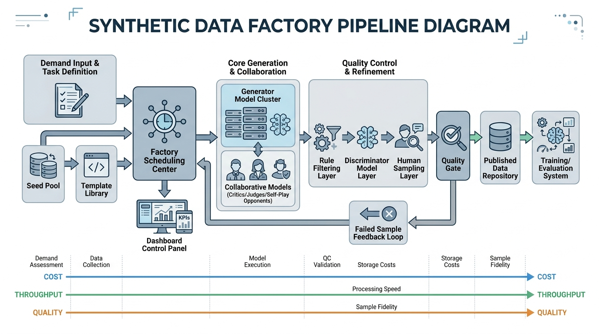

# Chapter 15: The Synthetic Data Factory: From Seeds to Validation

## Chapter Introduction

As large model training enters a phase where refinement and scale advance in parallel, the data problem has shifted further from "do we have data?" to "how do we continuously, reliably, and cost-effectively manufacture high-quality training data?" Against a backdrop of high human annotation costs, limited coverage, and scarce samples for complex tasks, using models to generate training data has evolved from an auxiliary technique into one of the core capabilities in large model iteration. Synthetic data is no longer a handful of ad hoc prompt-driven tricks; it is becoming the mode of data production that sustains continuous model evolution (Honovich et al. 2023; Wang et al. 2023; Xu et al. 2024).

Yet this path is not inherently safe. Having a model manufacture data may appear to raise efficiency, but it introduces new systemic risks: models can amplify pre-existing biases, repeatedly generate low-information-density content, produce samples that look superficially correct but are fundamentally fragile, and even "reinforce" their own deficiencies in a self-referential loop—ultimately causing data contamination, capability collapse, or the entrenchment of erroneous behavior. The risk that recursively using model-generated data leads to model collapse or the loss of tail information in the real distribution has already been systematically examined in the literature (Alemohammad et al. 2024; Shumailov et al. 2024). In other words, the central question in synthetic data has always been: how do we generate data that is controllable, trustworthy, verifiable, and sustainable?

What truly deserves discussion, therefore, is how to elevate synthetic data capabilities from scattered experience into a reusable, evaluable, and governable industrial system—not merely how to write fancier prompts. Such a system must address not only sample generation but also task design, template orchestration, candidate expansion, quality filtering, difficulty control, deduplication and decontamination, human spot-checking, version tracking, and closed-loop iteration. Only when synthetic data is embedded in a complete pipeline of "production → evaluation → feedback → optimization" does it genuinely earn its place as training infrastructure.

## Abstract

Synthetic data has evolved from scattered prompt-engineering tricks into the mode of data production that sustains continuous large model iteration, yet recursively using model-generated data risks model collapse and the loss of tail information from the real distribution. This chapter advocates replacing artisanal generation with a factory mindset—reconstructing synthetic data capabilities as an industrial system that is auditable, evaluable, and governable. The chapter proceeds along four main threads. First, it argues that ad hoc generation cannot sustain stable throughput and redefines throughput as the effective yield of samples that have passed quality gates, can be delivered to training, and actually produce measurable gains—then analyzes the dynamic trade-offs among cost, quality, and throughput. Second, it describes the co-construction of a seed pool and a template library, covering the acquisition, filtering, and stratification of high-quality seeds as well as how task, role, difficulty, and constraint templates expand a curated sample set into a large-scale sample corpus in a controlled manner. Third, it builds a generation–filtering–validation pipeline, distinguishes the functional roles of single-model generation, multi-model collaboration, and self-play, and positions rule-based filtering, discriminator models, judge models (LLM-as-a-judge), and human spot-checking as a front-loaded, layered quality gate. Fourth, it establishes mechanisms for failed-sample feedback loops, three-track version linkage across data, experiments, and models, and a control-panel operational rhythm. The conclusion is that the value of synthetic data depends on whether raw material, templates, scheduling, collaboration, filtering, validation, and feedback loops can be connected into a closed cycle; only then can the system avoid self-reinforcing defects and become a reliable, stable source of productivity in model iteration.

## Keywords

Synthetic data factory; seed pool; template library; quality gate; model collapse; data feedback loop

## Learning Objectives

- Distinguish ad hoc generation from factory-scale production and redefine effective throughput using four-layer metrics: candidate output, qualified intake, training-consumable quantity, and actual model gain.
- Build a coupled seed pool and template library that uses task, role, difficulty, and constraint templates to expand curated seeds into a large-scale sample corpus in a controlled manner.
- Design a front-loaded, layered quality gate composed of rule-based filtering, discriminator models, judge models, and human spot-checking, and differentiate the functional roles of single-model generation, multi-model collaboration, and self-play.
- Implement failed-sample feedback loops, three-track version linkage across data, experiments, and models, and control-panel operations that connect generation, filtering, validation, and feedback into a closed loop.

After large model training gradually moves toward continuous iteration and engineering-grade operations, the core challenge facing teams has shifted further from "can we call a model to generate some data?" to "can we reliably, cost-effectively, and explainably produce data that is usable for training?" Many teams first encounter synthetic data through prompt writing: give a model a task description, ask it to imitate a certain style, complete a certain type of problem, or generate a certain kind of dialogue, then lightly clean the output and feed it into training. This approach genuinely works in early validation stages because it is fast, flexible, and intuitive. However, Shumailov et al.'s research on "model collapse" reaches the opposite conclusion. They examined the process of recursively using model-generated data to train subsequent models, and found that when a model indiscriminately learns from content generated by other models, the downstream model does not stably inherit the full structure of the original data; instead, it gradually loses tail information from the real distribution. In other words, rare, complex, marginal-but-important samples are continuously compressed through each round of generation and re-training and eventually disappear from the model's expressive capacity. The model may still generate fluent content, but its coverage of real-world complexity has narrowed, and its outputs increasingly converge toward a small set of high-frequency patterns.

This failure is not the result of any single poorly written prompt or insufficiently cleaned batch of data; it is a deeper systemic risk in synthetic data production: when generation, filtering, and training lack external calibration and distributional constraints, the data pipeline rewrites the model's existing biases as "new data" and then cements them into the next generation of the model through the training process. In the short term, data volume increases; in the long term, the real distribution is diluted, rare patterns are smoothed away, and model capability may regress through self-reinforcing cycles. Therefore, the first problem a synthetic data factory must solve is not "how to make the model generate more data," but "how to prevent the model from continuously reinforcing its own deficiencies with plausible-looking data." This is also the starting point for this chapter's discussion of the synthetic data production pipeline: synthetic data can only become reliable training infrastructure—rather than a convenient generation trick—when it is embedded in complete mechanisms for task design, quality evaluation, distributional control, human spot-checking, and version tracking.

Accordingly, once synthetic data enters large-scale application, the transition must be from "generation" to "production." By "production" we mean establishing a factory-like system rather than simply amplifying model call volume: raw material inputs, template assembly, a scheduling system, multi-model collaboration, quality gates, rework and feedback loops, version management, and a daily operational control panel. Only in this way can teams upgrade "calling a model to generate data" into a data pipeline that continuously serves training, evaluation, and product iteration. Data validation, data cleaning, data understanding, and data lineage management in production machine learning systems have already been recognized as important data management concerns for production-grade ML pipelines (Polyzotis et al. 2017).

This chapter is addressed to teams that wish to upgrade synthetic data from a laboratory technique to a factory-scale pipeline, and covers the complete closed loop: from seed pool construction and template library design, through generation and filtering to quality validation, and onward to failed-sample feedback loops, version linkage, and control-panel operations. We emphasize one central judgment: the value of synthetic data does not depend on how much content a model can produce, but on whether the team can organize that content into a controllable, evaluable, reusable, and sustainable engineering system.

## 15.1 Why Synthetic Data Requires a Factory Mindset

### Why Ad Hoc Generation Cannot Sustain Stable Throughput

The advantage of ad hoc generation is its low barrier to entry. An engineer who can write prompts, paired with a capable model, can quickly produce a batch of data that looks reasonable. However, this approach is difficult to sustain over the long term; its main problems lie in inconsistent inputs, uncontrollable processes, and the absence of clear acceptance criteria for outputs.

First, ad hoc generation depends heavily on individual expertise. Two team members asked to "generate mathematical reasoning samples" may write prompts that differ enormously in task boundaries, output format, difficulty control, error avoidance, and stylistic requirements. The result is data that appears voluminous but originates from mutually incompatible production logics. What the model learns during training will deviate from consistent task behavior and instead converge on a mixture of stylistic habits and inconsistent constraints.

Second, ad hoc generation is very difficult to schedule. Today the team hastily generates a batch of data to fill a gap in code-explanation tasks; tomorrow, because evaluation reveals insufficient safety refusals, they add a batch of adversarial samples; the day after, noticing weakness in long-context tasks, they go off to generate long-document summaries. This generation process resembles reactive firefighting rather than production. There is no scheduling relationship between data demand and generation resources; teams typically do not know what to generate first, which model to use, how much to generate, whether to retry on failure, or when to stop retrying.

The more serious problem is that ad hoc generation lacks auditability. Once a data quality issue arises, teams can usually see the training performance decline but cannot explain whether the root cause is bad seeds, a flawed template, an unstable generation model, overly lenient filtering rules, or a biased validation criterion. Without a traceable process chain, problems cannot be decomposed and therefore cannot be fixed. Unstable throughput does not merely mean "generation speed fluctuates"; more importantly, it means the team cannot reliably produce "usable data."

Furthermore, ad hoc generation has a commonly overlooked problem: it can appear effective in isolated moments but is very difficult to sustain over time. A well-crafted prompt today does not guarantee consistent behavior after ten or a hundred calls; a team member's experience that temporarily works does not mean the team can hand it off, replicate it, and scale it. As long as generation capability cannot exist independently of individual skill, it remains artisanal rather than truly engineered. The system maintenance costs, hidden feedback loops, and data dependency risks that result are also archetypal sources of "hidden technical debt" in machine learning systems (Sculley et al. 2015).

For training teams, the more dangerous situation is having a large volume of content that looks like data but not knowing which parts are safe to put into training. Ad hoc generation is precisely what most easily creates this illusion: outputs are voluminous, superficially fluent, and fast to produce—yet the proportion with genuine training value is not high. Teams therefore see "large quantities" on the data side while experiencing "small returns" on the training side, or even "increasingly erratic training." This illustrates exactly why throughput cannot be measured by the number of candidate samples alone; it must be measured by the number of qualified samples, the proportion of reusable samples, and the actual returns upon entering training.

### From "Can Generate" to "Can Deliver": The Definition of Throughput Itself Needs to Be Rewritten

When discussing synthetic data throughput, many teams habitually measure it as "how many items can be generated per day." For a true factory system, however, this metric falls far short. What the factory cares about is the **effective yield of output that has been filtered, validated, and can be delivered for training**; raw output volume cannot directly represent throughput. Suppose a system generates a hundred thousand candidate samples per day but only ten thousand pass the quality gates—its true throughput should be calculated as ten thousand, not a hundred thousand. Going further, if this batch of samples that passed the gates yields almost no gain after training, then from a training-returns perspective its effective throughput may be even lower.

Throughput, therefore, cannot be measured merely by how many tokens the model generated, how many rounds the scripts ran, or how many JSON files accumulated in the directory. A more reasonable set of throughput metrics should include at least four layers: candidate output volume, qualified intake volume, training-consumable volume, and the actual contribution to model capability. The first two layers are in-process production metrics; the latter two connect the data system to the training system in a meaningful way. Only by observing these layers separately can teams identify whether the bottleneck lies in generation, filtering, or validation—or in the degree to which the data itself aligns with the training objective.

This is also why many teams who have "produced a lot of synthetic data" still feel they have never formed a stable production capability: they have only scaled up the generation stage without actually delivering on "deliverability." What the factory truly delivers is a data product that can enter the training pipeline, has an explainable provenance, allows post-hoc problem diagnosis, and supports continuous iteration—not just text.

### Why Standardization Is the Starting Point of Factory Operations

There is another fundamental reason why the factory mindset matters: without standardization, nothing else follows. A system that lacks standardized inputs, standardized templates, standardized validation criteria, and standardized logging cannot be scheduled, tracked, or fed back into. It may be able to run, but it cannot be governed.

Standardization begins with task definition. Teams must clearly specify what training objective a given sample serves, what structure the output should take, which errors are absolutely unacceptable, and which imperfections are tolerable. Without a unified answer to these basic questions, all subsequent generation can only rely on individual interpretation. Standardization also manifests in metadata. Every synthetic sample should, to the extent possible, carry information about its origin, template version, generation model, filtering result, validation verdict, difficulty label, and so on—because from the factory's perspective, data should be treated as manufactured artifacts bearing process labels, not as isolated text. Establishing documentation mechanisms for data provenance, collection process, scope of use, and lifecycle records is also the central proposition of works such as Datasheets for Datasets and Data Cards (Gebru et al. 2021; Pushkarna et al. 2022).

Another function of standardization is to elevate the conversation from "is this particular sample good?" to "does this batch of samples conform to a given production specification?" The former is an aesthetic judgment that easily devolves into subjective debate; the latter is closer to an engineering judgment that supports a consistent shared standard. Only when teams can discuss quality in terms of a unified specification can quality control be automated and scaled.

**Code Example: Recommended Metadata Fields for a Synthetic Sample ("Process Label" Schema, JSONL)**

The key to factory operations is traceability. Even when the sample text itself is simple, the metadata should record as completely as possible "how it was produced and how it passed the gates," facilitating downstream attribution and feedback loops.

```json
{
  "id": "syn_qa_00010293",
  "meta": {
    "task": "customer_service_qa",
    "template": {"name": "cs_refund_v1", "version": "1.2.0"},
    "seed_id": "seed_cs_0041",
    "producer_model": "model_small_v3",
    "judge_model": "model_large_judge_v2",
    "difficulty": "basic",
    "risk_level": "low",
    "gating": {
      "format_ok": true,
      "policy_ok": true,
      "dup_score": 0.08,
      "judge_score": 4
    },
    "created_at": "2026-04-24"
  },
  "messages": [
    {"role": "user", "content": "I want to return an item—who pays for shipping?"},
    {"role": "assistant", "content": "Generally this depends on the platform or merchant policy: if the return is due to a product quality issue, most platforms require the merchant to cover shipping; if it is a no-questions-asked return, the buyer typically bears the cost. To avoid giving you misleading information, please clarify two points: 1) Is this a quality-related return? 2) Is it within the no-questions-asked return window?"}
  ]
}
```

### Differences Between Synthetic Data Engineering and Traditional Data Augmentation

Many teams, when conceptualizing synthetic data, conflate it with traditional data augmentation—as if it were simply replacing image flips, text substitutions, and word-order perturbations with "having the model write a bit more." The two, however, differ fundamentally in their engineering nature. Traditional data augmentation is essentially a transformation applied to existing samples, typically aimed at broadening distributional coverage and improving robustness; the augmentation process is usually governed by relatively strong rule-based constraints, so controllability is comparatively high. Surveys of data augmentation in both image processing and NLP generally characterize it as methods for transforming, perturbing, or recombining existing data (Feng et al. 2021; Shorten and Khoshgoftaar 2019). Synthetic data engineering, by contrast, is not a pure "transformation"; it is more akin to re-producing task samples—or even creating new samples that did not previously exist.

This means synthetic data faces questions of semantic correctness, task coherence, constraint compliance, and distributional structure that are far more complex than augmentation magnitude. An augmented image, even with slight distortion, typically still belongs to the original task distribution; but a model-generated question-answer sample that has the wrong facts, a changed premise, dropped constraints, or a fabricated reasoning chain may be "harmful pseudo-good data" with respect to the training objective, regardless of how fluent it sounds.

Traditional data augmentation therefore resembles increasing raw-material utilization on an existing production line, whereas synthetic data engineering is building an entirely new production line. It must address not only "how to generate" but also "which tasks to generate, who generates them, with what templates, whether a judge is involved, how to determine acceptability, and how failed samples are fed back." From an engineering standpoint, synthetic data engineering is a system module that spans data design, model invocation, quality control, and training operations—it cannot be compressed into a single trick module.

Going further: traditional augmentation typically proceeds under the assumption of "sample invariance"—the object is still the same object, the semantics are still the same semantics, with only limited formal variation. Synthetic data engineering, on the other hand, frequently constructs new questions, new scenarios, new constraint combinations, and even new interaction trajectories. The former emphasizes "keeping the core unchanged"; the latter emphasizes "creating new supervision signals within a controllable range." This means the two face different failure modes. Traditional augmentation failures typically arise from excessive perturbation that distorts semantics; synthetic data failures can occur at the level of task definition, logical chains, factual consistency, role boundaries, and style control.

### The Essence of Synthetic Data: Automatically Manufacturing Supervision Signals

Understanding synthetic data as "automatically writing a bit of text" severely underestimates its engineering difficulty. What the model truly generates are the supervision signals used for training; pure content is only the surface form. The value of a supervision signal depends not only on whether sentences are fluent but on whether it accurately encodes the behavioral patterns the team wants the model to learn. In a tool-invocation task, what truly matters is whether the model learns to select the right tool at the right moment, fill in the correct parameters, and handle the correct return value; whether the response sounds natural is only a surface-level indicator. In a safety refusal task, the core is whether the model forms stable and consistent behavior at risk boundaries; polite phrasing is only one component.

Once teams understand synthetic data through the lens of "manufacturing supervision signals" rather than "generating text," they will naturally recognize that the necessity of factory operations stems from signal quality itself, not merely from scale. When supervision signals are manufactured incorrectly, the model learns those errors with high efficiency. In other words, the risks and the value of a synthetic data factory are proportional: the larger the scale of production, the stronger the quality governance required.

### Why "Looks Fine" Data Can Still Be Harmful

In synthetic data practice, one of the most common misjudgments is mistaking fluency for training value. Large models are inherently skilled at making content look reasonable, so many samples—even when their logic is flawed, their facts are off, or their constraints have drifted—will still appear to be "very much like a correct answer." This creates illusions for human reviewers and causes automated filtering systems to overestimate sample value.

For training, these "looks fine" samples are especially dangerous because they rarely present themselves as explicit errors. They typically manifest as content in a gray zone between correct and incorrect, rather than as garbled text, missing fields, or obvious nonsense. Research on Orca also points out that shallow imitation of strong model outputs may lead small models to learn style more than genuine complex reasoning ability, hence the need for richer explanation traces and rigorous evaluation (Mukherjee et al. 2023). For example: a conclusion that is broadly correct but built on a fabricated derivation; an explanation that sounds natural but does not genuinely comply with the specified role; a tool selection that appears reasonable but is mistimed; a refusal that is formally compliant but completely blocks the user's genuine need. Samples of this kind most easily slip through coarse filtering and, during training, shape the model's fuzzy behavioral boundaries.

The factory mindset requires teams to acknowledge this: high-risk data problems typically manifest as "barely wrong" rather than "obviously wrong." Accordingly, the more mature a generation output appears, the more it demands institutionalized validation and gates—not just a human's intuition that "this one looks fine."

### Systematic Balance Among Cost, Quality, and Throughput

Synthetic data requires a factory mindset also for a practical reason: it is inherently pulled in three directions—cost, quality, and throughput. Pursuing quality alone may lead teams to choose the highest-capability models, the longest contexts, the strictest judge chains, and the highest proportion of human review—but this rapidly drives up per-sample cost and may reduce throughput below the pace needed to sustain iteration. Pursuing throughput alone may lead teams to switch to low-cost models and reduce filtering intensity; output volume looks high in the short term, but over time large quantities of low-quality samples enter training and ultimately drag the model down. Pursuing low cost alone tends to optimize the system for "can output data" rather than "can output good data."

A truly mature synthetic data factory pursues balance among the three rather than the extreme of any single metric. In other words, system designers must answer a more specific question: in the current task scenario, what cost structure can sustain sufficient throughput while keeping quality above a training-acceptable threshold? There is no universal answer, because writing tasks, coding tasks, multi-turn dialogue tasks, tool-invocation tasks, and safety alignment tasks differ considerably in their tolerance for errors and their need for diversity.

The value of the factory mindset lies in elevating this balance from individual experience to system parameters. Which tasks use a high-end model for first-pass generation? Which tasks use mid-tier models for bulk generation followed by a strong-model judge? Which data requires dual validation? Which data needs only rule-based filtering? Which pipelines allow more retries? Which pipelines should immediately trigger template revision upon failure? Only when cost, quality, and throughput become observable, configurable, and tunable objects does synthetic data acquire genuine engineering properties.

Expanding this further, the balance among these three is a dynamic trade-off mechanism, not a static curve. In the cold-start phase, teams should typically weight quality more heavily because the core task is establishing reliable seeds, validating templates, and understanding failure modes. In the scale-up phase, throughput becomes rapidly more important, and the system needs stronger automated filtering and scheduling to reduce per-unit cost. Before a major release or in high-risk scenarios, quality again outweighs throughput, because the cost of a single error may far exceed the budget of a bit more generation. The factory, in other words, serves rapid trade-off switching among phases rather than optimizing toward a fixed optimal point.

### Why "Low-Cost Synthesis" Often Turns Out to Be More Expensive

Under budget pressure, many teams instinctively pursue cheaper generation pipelines—switching to inexpensive models, shortening prompts, reducing validation intensity, or cutting human spot-check ratios. On the surface this appears to lower per-sample cost, but taking the full pipeline into account, it may not. If the low-cost pipeline causes lower pass rates, higher rework rates, worse training returns, and even more feedback loops and revisions, the total cost may actually be higher.

The true metric to optimize is "how much does each usable, training-beneficial sample ultimately cost?"—not "how much does each API call cost?" This is a quintessential factory-perspective difference. The artisan looks at immediate expenditure; the factory looks at finished-goods cost. Many systems remain chronically inefficient not because models are too expensive, but because the reject rate is too high, repair chains are too long, and diagnostic cycles are too slow. Only by measuring cost across the entire process chain will teams realize that some generation and validation configurations that look more expensive can actually substantially reduce total production cost.

### Factory-Scale Scheduling: Turning Generation Systems from "Can Run" to "Can Produce"

Once teams scale up synthetic data, they quickly discover a fact: generation quality depends not only on the model itself but also on scheduling. Factory-scale scheduling means weaving task requirements, model resources, template priorities, budget constraints, quality targets, and feedback mechanisms into a production orchestration system—it is not equivalent to simple task queuing.

For example, the system may simultaneously receive three types of demand: filling gaps in high-difficulty reasoning samples, expanding a domain-specific customer-service dialogue corpus, and repairing a class of failed tool-invocation cases. These should not be handled by the same production logic. High-difficulty reasoning samples are best suited to a small-batch, high-quality, strong-validation pipeline; domain customer-service dialogue suits template-driven expansion and batch spot-checking; tool-invocation failure cases require priority routing to a "failure feedback → template repair → targeted regeneration" repair pipeline. Without a scheduling system, all three types of demand compete for the same model resources and validation resources, ultimately producing high-cost, low-yield chaos.

A mature synthetic factory typically decomposes scheduling into four layers. The first layer is task scheduling—what to generate today, what the priorities are, what the target volumes are. The second layer is model scheduling—which models serve as producer, critic, judge, and validator. The third layer is budget scheduling—how many tokens, how many retries, and how much human review quota each task type may consume. The fourth layer is quality scheduling—what gate intensity and release criteria different task lines adopt. The essence of scheduling is to direct limited resources toward the most critical, most deficient, and most training-beneficial sample types rather than simply filling up the call queue.

Viewed more broadly, the scheduling system is responsible for "translating requirements into process specifications." Demand expressed from the product side is typically abstract: "tool invocation has been unstable lately," "domain Q&A coverage is still insufficient," "refusals are too rigid." These statements cannot directly guide generation. Only after scheduling and decomposition does the system translate them into executable production commands: which sample types to supplement, which template groups to invoke, which models to allocate, what pass thresholds to set, and how much human review fallback to allow. Without this step, no matter how powerful the generation system, it can only operate blindly.

### Scheduling Requires Coordinating Priority, Resources, and Risk

Many people understand scheduling as "who runs first and who runs later"—but this is only the most superficial level of queue management. For the synthetic factory, the more essential role of scheduling is to simultaneously coordinate priority, cost budget, and risk exposure under limited resources. For example, among tasks that all need to fill ten thousand samples, some should have higher priority because they are about to enter a critical training version; some carry higher risk because their historical gate failure rate has been extremely high, suggesting they should first undergo small-scale trial production; others, while large in demand, have limited near-term training gain and should therefore not heavily occupy premium model resources.

The scheduling system should therefore possess at minimum a basic sense of stratification. High-risk, high-value tasks are suited to a high-assurance pipeline even at higher cost; medium-value but high-volume tasks are suited to standardized batch pipelines; exploratory tasks should enter an experimental pipeline—first observing pass rates and training value before deciding whether to scale up. Only by separating these tasks can the factory avoid the chaotic state of "all demands are urgent, all samples are important, and all models are busy."

### How the Scheduling System Connects Upstream Demand to Downstream Training

Factory-scale scheduling must not focus only on the generation side; it must also be accountable to the training side. A common problem is that data teams continuously produce "structurally complete-looking" samples, only for training teams to find limited returns after use, or even negative transfer on some capability dimensions. The root cause is typically that scheduling targets are not aligned with training targets, not that the data itself is completely wrong.

A truly effective scheduling system should treat training feedback as an important input to production planning. For example, if evaluation shows the model's performance on multi-turn clarification has declined, the scheduling system should increase the priority of the corresponding tasks; if a certain sample type has shown no appreciable gain across several consecutive versions, its throughput quota should be automatically reduced and resources redirected toward tasks that are more scarce and offer greater marginal benefit. In this way, scheduling becomes not a static timetable but the hub in a "demand → production → training → feedback" closed loop. The overall flow of the synthetic data factory—from seed construction, bulk generation, and quality validation to feedback-driven revision—is illustrated in Figure 15-1.




*Figure 15-1: Synthetic Data Factory Flow Diagram*


### Cost, Throughput, and Quality Balance Table

No factory configuration is universally superior or inferior; each represents an optimal solution under specific phases, task types, and budget conditions. The table below is intended to help teams understand the core of a synthetic data system—how to design a production pipeline matched to business objectives—rather than to provide a single answer or to reduce the problem to "which model to pick."

**Table 15-1: Cost, Throughput, and Quality Balance Table**
| Factory Configuration Strategy | Typical Approach | Cost | Throughput | Quality Ceiling | Primary Risk | Best-Suited Scenarios |
|---|---|---:|---:|---:|---|---|
| Strong single-model direct output | High-end model generates directly; lightweight rule filtering before intake | High | Medium | High | Excessive cost; uniform style; difficult to scale | Cold-start phase; curated set construction; benchmark sample creation |
| Mid-tier bulk generation + strong-model judge | Cheap model for volume; strong model for critical quality decisions | Medium | High | Medium–High | High judge load; incorrect releases if judge criteria are unstable | Large-scale routine tasks; cost-sensitive pipelines |
| Multi-model collaboration + layered validation | Producer, critic, and judge with distinct roles; combined with rules and spot-checking | Medium–High | Medium–High | High | System complexity; high demands on scheduling and logging | Important training sets; complex tasks; multi-turn/reasoning/tool-use data |
| Rule-led + light model repair | Structured template production as primary; model handles local refinement and gap-filling | Low | High | Medium | Risk of over-templating; insufficient diversity | Customer-service Q&A; format-driven tasks; stable narrow-domain data |
| Self-play expansion + human spot-check backstop | Multi-turn dialogue or adversarial samples generated through model-vs-model play | Medium | Medium–High | Medium–High | Self-loop bias amplification; artificially hard samples increase | Dialogue data; safety adversarial samples; tool-use interaction |
| High human-review factory | Model generates; heavy dependence on human review and rework | Very High | Low | High | Throughput constrained by human capacity; slow pace | High-risk domains; final pre-launch acceptance; compliance-sensitive tasks |

## 15.2 The Seed Pool and Template Library

### Acquiring, Filtering, and Stratifying High-Quality Seeds

If models are the production equipment in the synthetic factory, then seeds are the factory's most critical raw material. Many teams think of seeds as "a few examples"—this is an understatement. Truly high-quality seeds do not merely demonstrate format; they encode task boundaries, content granularity, reasoning patterns, stylistic constraints, and forbidden errors into the generation system. Whether the model can expand stably downstream depends to a large extent on whether the seeds express these structures clearly enough.

High-quality seeds typically come from four sources. The first is human-annotated premium samples: expensive, but best suited to serve as high-confidence anchors. The second is real online interactions: they carry genuine distributional value but are usually noisy and require filtering and desensitization. The third is public datasets and industry materials: they offer broad coverage but may not directly match the target task. The fourth is high-quality subsets from past model-generated outputs—using factory products to back-fill the next round of raw material. The role of small quantities of high-quality supervised samples in instruction alignment has been highlighted in works such as LIMA (Zhou et al. 2023); AlpaGasus, which selects from existing instruction data using a strong model as a filter, also emphasizes the training value of "fewer but better" data selection (L. Chen et al. 2024).

But obtaining raw seeds is not equivalent to being ready for expansion. Teams must also filter and stratify them. Filtering aims to remove samples that appear polished on the surface but have unclear objectives, unstable quality, or insufficient representativeness. Stratification aims to enable seeds to fulfill different process roles: some seeds are appropriate as format demonstrations, others as high-difficulty anchors, others as error counterexamples, and still others as boundary cases. A mature seed pool must be organized by task type, difficulty level, risk level, and intended use into a raw-material repository that can be scheduled and retrieved on demand—it cannot simply be a pile of good samples.

Going further, the value of a seed lies not only in "being well written" but in whether it can provide stable support for downstream expansion. An extremely impressive but highly idiosyncratic sample may not carry more seed value than a sample with clear structure, well-defined boundaries, and abstractable reusability. Seed selection criteria, in other words, cannot be equated with "literary merit" or "subjective impression of quality"; they should lean toward a production perspective—is it representative? Can it be decomposed into a template? Does it reliably convey task constraints? Is it suitable as a difficulty or style anchor?

### What Exactly Makes a High-Quality Seed "High Quality"?

The phrase "high quality" is used frequently in many teams, but left unexamined it easily degenerates into empty praise. For the synthetic factory, a high-quality seed should simultaneously satisfy four requirements. First, it should have a clear objective: the task intent, output boundaries, and evaluation criteria should be relatively explicit, leaving little interpretive latitude for downstream expansion. Second, it should have stable structure: the task skeleton, answer hierarchy, and distribution of key signals should be discernible enough to facilitate template extraction. Third, it should be representative: it should reflect a genuine class of real-world needs, real errors, or real behavioral patterns rather than being an isolated impressive case. Fourth, it should be transferable: its core structure should be extendable to multiple domains, scenarios, or difficulty levels.

From this perspective, many "reasonably good" samples are actually unsuitable as seeds. A sample may be very fluent but have a fuzzy task boundary or mix multiple objectives; another may be highly refined expert work but depend on extensive implicit background knowledge that resists template abstraction. Such samples can serve as reference material but may not be appropriate for the seed pool's core tier. A true seed sample resembles an industrial master pattern: it need not be the most impressive, but it must be the most stable. Both Self-Instruct and Unnatural Instructions embody this thinking—using a small number of seeds or examples to guide models in generating candidate instructions, then filtering, deduplicating, or rewriting to expand the data corpus (Honovich et al. 2023; Wang et al. 2023).

### Seed Acquisition Should Be Task-Hypothesis-Driven, Not Merely Collecting

When building a seed pool, many teams habitually collect broad material first and then select samples that look promising. This approach is reasonable early on, but once the number of tasks grows, the efficiency of pure "collect then select" drops rapidly. A more effective method is to acquire seeds with explicit task hypotheses in mind—that is, teams should first think through which supervision signals are most lacking, which model behaviors are most unstable, and which task structures are most worth amplifying, and then targeted seek seeds based on these judgments.

For example, if the goal is to improve tool-invocation accuracy, it is far better to prioritize collecting real failed-invocation records, complex parameter cases, and successful samples at boundary conditions than to broadly collect Q&A samples. If the goal is to improve multi-turn clarification in customer service, it is far better to prioritize collecting real-conversation cases with ambiguous intent, shifting requirements, and contextual conflicts than to collect simple FAQ entries. Once seed pool construction shifts from "broad collection" to "task-driven acquisition," its quality ceiling rises significantly.

### Filtering Seeds Is Not Just Removing Bad Samples—It Is Selecting Master Patterns

In many workflows, seed filtering is understood as removing noise, errors, and low-quality content. For the factory system, however, filtering carries an additional and more important meaning: from a pool of candidate material, selecting the "master patterns" worth amplifying. This means filtering work must judge not only whether a sample is currently good but also whether it can support template-driven expansion in the future.

For instance, two samples may both be of good quality, but one contains excessive accidental business context and a narrative path that is difficult to replicate, while the other clearly embodies the task structure, constraint relationships, and answer logic. The former is suitable as reference; the latter is more appropriate as a seed. Seed filtering is therefore not only a quality judgment but also an expansion-potential judgment. The filtering result should point to the samples most suitable as production starting points, not the samples that look best.

### The True Purpose of Seed Stratification Is to Make Raw Material Schedulable

The purpose of stratification is to make the seed pool actually usable by the scheduling system, not to make it better organized. An unstratified seed pool—however rich its content—can only be treated as "random reference" in generation pipelines. Once stratified, the system can retrieve specific raw material based on task requirements. For example, during cold start, preferentially invoke the high-confidence premium tier; during difficulty expansion, invoke the high-difficulty anchor tier; during risk repair, invoke the failure-case tier; during style adjustment, invoke the role-demonstration tier.

This means seed stratification is fundamentally about converting "raw material inventory" into "schedulable inventory"—elevating the factory from merely owning material to owning a material structure that can be combined, reused, and directed to specific outputs. From an organizational capability standpoint, this is the key step from "piling up resources" to "building a warehouse system."

### Task Templates, Role Templates, Difficulty Templates, and Constraint Templates

Without templates, synthetic data is very difficult to advance from "manual copying" to "systematic expansion." The value of templates lies in abstracting local patterns found in individual samples into reusable production structures. The templates discussed here are a broad class of process templates, not limited to prompt templates.

Task templates determine "what to generate" and specify the fundamental task skeleton of inputs and outputs—whether it is Q&A, classification with explanation, code repair, tool invocation, multi-turn negotiation, or safety refusal. Role templates determine "from what perspective to generate," influencing the output viewpoint, knowledge boundaries, and register. Explaining the same code snippet should be expressed differently for a beginner versus a senior engineer. Difficulty templates determine "to what degree to generate"—affecting not only problem complexity but also reasoning depth, the degree of information occlusion, and the design of distractors. Constraint templates specify "which boundaries must never be crossed," including format constraints, length constraints, factual constraints, safety constraints, and tool-invocation constraints.

The value of these four types of templates is that they decompose requirements that were previously mixed into prompts, enabling the system to compose them modularly. Teams no longer need to hand-write a complete prompt for each task type; instead they can draw the task skeleton from the template library, overlay role settings, insert difficulty parameters, and load necessary constraints. The greatest benefit of this approach is that data process specifications begin to have structured reusability—saving prompt writing is only a surface-level benefit. If a certain constraint is later found to be flawed, the team does not need to go back and revise hundreds of prompts; only the corresponding constraint module needs to be updated.

From the factory perspective, the true value of a template lies in being "decomposable, composable, and modifiable"—not in being "cleverly written." A prompt that can only be used as a whole and cannot be partially replaced is difficult to call a template in any meaningful sense. Factory templates must serve scheduling and revision: if a role tier has a problem, replace the role template; if a difficulty gradient is unreasonable, revise the difficulty template; if a certain format error appears frequently, inspect the constraint template rather than rewriting the entire prompt from scratch. The degree of modularity in templates determines the maintenance cost and efficiency of the factory going forward.

### Why a Template Library Is Not a Prompt Repository

Many teams nominally build a template library but in practice simply put a collection of prompt text into a directory. This approach is barely workable when the number of templates is small, but once it grows continuously it rapidly exposes unclear management boundaries, chaotic invocation patterns, and difficult version tracking.

A true template library should first support clear classification. Task skeletons, role settings, difficulty parameters, and constraint modules should not be interleaved in a single large prompt block; they should be separated into different layers wherever possible. Second, it should support parameterization—domain, target object, input length, output format, risk level, refusal strategy, and other variables in templates should ideally be injected through configuration rather than manually edited one item at a time. Third, it should have version management and usage documentation, making clear which tasks the template applies to, what known boundaries it has, and in which scenarios it has recently failed. Only when these requirements are met is the template library truly a factory asset rather than a writing-material repository.

### How Task Templates Define "What to Generate"

Task templates are the layer in the template system closest to the training objective. They determine the basic problem structure of samples and also determine what subsequent validation is responsible for. Information extraction tasks, role-play dialogue, tool-invocation tasks, and complex reasoning Q&A all use an "input–output" format, but the behaviors they require the model to learn are entirely different. If the task template is ill-defined, subsequent role, difficulty, and constraint specifications—however precise—are built on shifting ground.

A task template therefore needs to answer three questions clearly: first, the task objective—what capability the model should ultimately exhibit; second, the input boundary—what information the model may rely on when answering and what premises it must not assume; third, the output responsibility—which parts of the answer must be correct and which parts may be freely expressed. Once a template clearly articulates these three things, subsequent filtering and validation have a solid foundation.

### How Role Templates Shape Behavioral Style Rather Than Surface Tone

Role templates are the most easily misused. Many teams interpret them as "a different way of speaking"—for example, "like a teacher," "like a customer service agent," or "like an expert." In the factory system, however, roles should affect not only tone but also knowledge boundaries, explanation depth, phrasing responsibility, and interaction strategy. A "teacher" role is not simply adding "Hello, student"—it should embody step-by-step explanation, layered description, and appropriate guidance. A "customer service" role is not simply being more polite—it should embody process awareness, problem confirmation, and risk mitigation.

In other words, role templates belong to the behavioral specification layer, not the decoration layer. If a role only changes surface style without changing behavioral structure, its training value will be limited. Truly high-quality role templates should allow the same task to exhibit stable, distinguishable, and reusable behavioral patterns under different roles.

### How Difficulty Templates Prevent the Sample Library from Stagnating at "Simple but Presentable"

Synthetic data systems have a natural tendency: samples that are easiest to generate and easiest to pass validation are the ones the system produces in the greatest volume. Over time, the sample library—though large—concentrates on simple tasks, single constraints, and short reasoning paths. This makes training performance appear to steadily improve, but weaknesses emerge immediately in complex scenarios. The significance of difficulty templates is therefore not only to produce "slightly harder" problems but to explicitly control the capability gradient of the factory.

A mature difficulty template should consider at minimum: information load, number of constraints, degree of conflict, number of reasoning steps, context length, and number of interaction turns. Difficulty is not an abstract label; it should map to actionable generation parameters. Only in this way can the factory produce baseline, intermediate, and challenge samples in proportion rather than letting the difficulty distribution be naturally dominated by the model's comfort zone. Evol-Instruct/WizardLM demonstrates a representative approach to "difficulty as a craft process" by progressively rewriting instructions to increase complexity (Xu et al. 2024).

### How Constraint Templates Write "What Must Not Go Wrong" into the Production Line

For many high-risk tasks, what matters most is what the model **must not get wrong**, not how much it can say. This is the value of constraint templates. Format constraints ensure data can be reliably consumed by the training system; factual constraints reduce hallucinations; safety constraints prevent boundary violations; tool constraints ensure invocation structures are valid; length and style constraints keep samples stably serving the training objective.

Constraint templates also matter because they make "implicit rules" explicit. Many teams repeatedly patch data in later stages precisely because a large number of critical constraints exist only in certain experts' minds and have never been written into templates. As a result, neither the generation stage nor the filtering stage knows about them, and problems are only discovered when training performance degrades. Making constraints modular and explicit is fundamentally about turning experience into institutional knowledge.

### Methods for Expanding from a Small Set of Premium Samples to a Large-Scale Sample Library

The most common failure mode in expanding from premium samples to a large-scale library is directly asking the model to "write a bit more of the same." This approach can quickly inflate volume, but typically yields samples that are superficially similar and structurally repetitive—unable to cover the task space or support genuine model capability growth. The key to effective expansion is systematic variant design; mere repetition will not suffice.

One common method is controlled expansion through variable substitution—keeping the task structure constant while replacing domain, target object, scenario, limiting conditions, register, and answer form to generate samples that are isomorphic in structure but varied in expression. Another method is hierarchical expansion through difficulty escalation—starting from basic problems and progressively constructing multi-constraint, multi-hop, multi-turn, noisy, or conflicting-information problems so the sample library forms a capability gradient from shallow to deep rather than simply growing larger. A third method is repair-driven expansion through error inversion—having the model generate adversarial samples, boundary samples, or error-correction samples organized around historical failure patterns, converting "what the model does poorly" directly into next-round training material. This line of thinking is related to the "generate → filter/feedback → regenerate" paradigm found in Self-Instruct, WizardLM/Evol-Instruct, and Self-Refine (Wang et al. 2023; Xu et al. 2024; Madaan et al. 2023).

In more mature factories, expansion is a continuous production line design rather than a one-time action. The system dynamically decides expansion direction based on post-training evaluation results, online error statistics, and human review feedback. If multi-turn clarification capability is lacking, expand dialogue with ambiguous intent; if tool parameters are frequently wrong, expand invocation samples with complex schemas; if safety refusals are too rigid, expand alignment samples with soft refusals and redirective suggestions. At this point, sample library growth becomes structural growth targeting model deficiencies, not mere quantitative growth.

More importantly, expansion must simultaneously control "what to amplify" and "what not to amplify." Even high-quality premium samples often contain harmless but unworthy-of-replication local habits—particular phrasings, fixed argumentation sequences, overly balanced sentence structures, and so on. If these patterns are indiscriminately replicated during expansion, the sample library quickly becomes uniform despite being large. The team achieves scale but loses distributional richness. Expansion processes should therefore both inherit the effective structures from seeds and actively disrupt unnecessary surface homogeneity.

### The Key to Scale Expansion: Expanding the Distribution Correctly

When teams discuss expansion, they easily treat "data volume growth" as a natural objective. For the factory system, however, what truly matters is **whether the task distribution, difficulty distribution, error distribution, and expression distribution are correctly expanded**; sample count growth is only one result. If the newly added ten thousand samples still concentrate on a few familiar scenarios, a few fixed templates, and a few comfortable difficulty levels, the marginal training value of this expansion will rapidly diminish.

Large-scale sample library construction should therefore always be accompanied by distributional inspection. Teams should care not only about "whether a certain task type exists" but also about "whether a certain task type is excessively concentrated in certain industries," "whether a certain type of answer always follows the same narrative path," "whether complex constraints are sufficiently represented," and "whether long-context samples have merely grown longer rather than structurally more complex." Once factory expansion shifts from quantity-driven to distribution-driven, its construction logic matures considerably.

### From Premium to Scale: "Intermediate-Tier Samples" Are Also Needed

In practice, many teams encounter a gap: either a small number of expert premium samples, or a direct jump to large-scale automated generation—with nothing in between. The result is that premium samples are too few to directly support large-scale expansion, while automated generation deployed too early accumulates bias rapidly. A more prudent approach is to introduce "intermediate-tier samples" between the two—first generating a small-scale, high-review-rate, auditable candidate set based on premium samples, and using it to validate templates, calibrate judges, and identify failure patterns. Once this tier stabilizes, the team can enter true large-scale production.

This is equivalent to a factory's pilot production phase. It is neither fully manual like cold start nor fully automated like mass production; its primary function is "calibrating the process before scaling." For complex tasks, this tier is often critically important because many template and validation problems only become visible when running at moderate scale.

### How the Seed Pool and Template Library Jointly Determine the Data Ceiling

Many teams maintain the seed pool and template library separately, resulting in strong seeds but weak templates, or fancy templates but hollow seeds. The former causes samples to quickly distort after expansion; the latter causes generated content to look diverse but lack genuine task anchors. A truly efficient synthetic factory must treat the seed pool and template library as a pair of coupled assets.

The seed pool defines "what is worth amplifying"; the template library defines "by what means these samples can be amplified." If seeds represent real-world requirements and templates represent controllable process rules, then together they determine the quality ceiling and distributional boundaries of the factory. A common misconception is to over-rely on templates, assuming that more complex templates are always better. In reality, if the constraints in a template have not been inductively derived from high-quality seeds, they are often only the template author's imagination rather than genuine task regularities. The more expansion proceeds from such templates, the faster biases propagate.

Teams building a template library should therefore ideally extract stable patterns from high-quality seeds and then parameterize and modularize those patterns, avoiding the trap of building entirely from personal experience in isolation. Conversely, when maintaining the seed pool, the team should not only ask whether individual samples are excellent but also whether they are suitable for template abstraction. Samples truly suited to the seed pool's core tier are typically both intrinsically high quality and representative and transferable.

Furthermore, the seed pool and template library have a continuous, bidirectional relationship rather than a one-way relationship. Good seeds catalyze more stable templates, and good templates—once in operation—help teams identify which seeds are genuinely effective and which are only superficially good. As the factory continues to run, the two should co-evolve within the feedback loop: if a certain type of template repeatedly fails, the seeds underlying it may be insufficient; if a batch of seeds cannot be stably expanded, the template abstraction method may be problematic. Managing the two in isolation leads to local optimization at best; managing the two in tandem is what enables the factory to develop genuine learning capability.

### The Seed Pool Determines "Real-World Anchors"; the Template Library Determines "Amplification Method"

At a higher level of abstraction, the seed pool can be understood as the factory's data-realist component, and the template library as its data-engineering component. The former answers "what is worth learning"; the latter answers "how to produce it at scale." Without the real-world anchors of the seed pool, templates easily devolve into disconnected self-imagination; without the amplification mechanism of the template library, even excellent seeds remain a curated collection that never yields scale returns.

The two therefore jointly determine not only the data ceiling but also the direction of the factory's biases. If the seed pool is skewed, stronger templates amplify the bias faster; if templates are poorly designed, more seeds still cannot be effectively converted into supervision signals. Treating these two assets as parallel core infrastructure—rather than having different team members maintain them in isolation—marks the watershed where many teams truly transition to a mature synthetic factory.

### Seed Sources and Applicable Task Table

The table below is intended to help teams develop the basic understanding that "seeds are not all the same thing." Seeds from different sources differ markedly in authenticity, cost, risk, and expansibility, and are therefore suited to different tasks.

**Table 15-2: Seed Sources and Applicable Task Table**
| Seed Source | Typical Content | Advantages | Primary Risks | Best-Suited Tasks | Usage Recommendation |
|---|---|---|---|---|---|
| Human-annotated premium samples | Expert-authored Q&A, reasoning, refusal, and tool-invocation samples | High quality; clear boundaries; usable as gold standard | High cost; limited coverage | High-risk tasks; complex reasoning; alignment data; first-round template abstraction | Use as core anchors; quantity need not be large, but precision is essential |
| Real online interaction records | User queries; customer-service dialogues; real failure cases | Genuine distribution; covers real pain points | High noise; requires desensitization; uneven quality | Dialogue systems; customer-service Q&A; real-scenario repair | Filter and stratify first; suitable as demand-driven seeds |
| Public datasets and industry materials | Benchmarks; industry FAQs; documentation; case collections | Easy to obtain; broad coverage; convenient for cold start | Potentially large deviation from target scenario | General Q&A; knowledge explanation; domain warm-up data | Suitable as supplementary material; should not be fully amplified directly |
| High-quality samples from past model generations | High-scoring samples from previous pipelines | Reuses existing assets; lower cost than human annotation | May inherit old biases and create self-referential loops | Stable tasks; format-driven tasks; incremental expansion | Must be combined with validators and human spot-checking to avoid bias accumulation |
| Expert failure case collection | Incorrect answers; missed answers; format errors; tool-invocation errors | Directly addresses model weaknesses; high repair value | Usually small in volume; concentrated distribution | Error-correction training; adversarial samples; boundary samples | Establish a dedicated label system; appropriate for high-priority feedback loops |
| Synthetic adversarial samples | Hard cases constructed by critic models or self-play | Can rapidly fill in boundary cases; improves robustness | Prone to "fabricated difficulty"; may deviate from real distribution | Safety alignment; robustness training; complex interaction | Must be mixed with real samples; must not independently dominate the distribution |

## 15.3 Generation, Filtering, and Validation

### Single-Model Generation, Multi-Model Collaboration, and Self-Play

In the synthetic factory, the simplest production mode is single-model generation: one model simultaneously handles task understanding, data generation, and implicit self-checking. This mode is the lightest to deploy and the easiest to start with, but as task complexity increases it quickly exposes the problem of role conflation. The producer is responsible for both writing content and implicitly deciding what constitutes good content, leaving the system without external checks and balances. If the model has any systemic bias, it will continuously replicate that bias in its outputs.

The more mature approach is multi-model collaboration. "Multiple models" does not necessarily mean multiple entirely different base models; it may be the same model serving different roles under different system prompts, different temperatures, or different role constraints. A typical collaboration pipeline is: the producer provides candidate samples; the critic identifies flaws and inconsistencies; the rewriter revises based on the critic's feedback; the judge decides whether to pass the sample. For reasoning tasks, a fact-verification model can be added; for tool-invocation tasks, an execution simulator or schema checker; for safety tasks, a dedicated risk discriminator.

Self-play is a special variant of multi-model collaboration, particularly suited to multi-turn dialogue, debate, negotiation, red-teaming, and complex tool-use scenarios. For example, one model plays the user and continuously poses increasingly challenging questions; another model plays the assistant and attempts to respond; a third model judges whether the dialogue has training value. The advantage is the ability to generate large quantities of interaction trajectories that single-turn templates cannot easily cover. Works such as Self-Play Fine-Tuning (SPIN) (Z. Chen et al. 2024) and Constitutional AI (Bai et al. 2022) both leverage model feedback, self-play, or AI feedback to reduce dependence on additional human annotation. However, the risks of self-play are equally apparent: without sufficient grounding in real seeds and quality gates, it easily enters self-referential loops, generating scenarios that increasingly resemble "problems the model imagines to be hard" rather than genuine real-world difficulties.

The key to model collaboration, therefore, is that different roles bear different responsibilities and form a mutually constraining pipeline; the number of models is not the point. The producer expands; the critic finds errors; the judge controls admission; the validator checks before release; humans calibrate the standards. Only with role separation can a factory simultaneously scale and maintain quality.

### Why Single-Model Generation Suits Getting Started but Should Not Dominate Long-Term

Many teams begin building synthetic pipelines with single-model direct output—a reasonable choice because in the cold-start phase the most important thing is to quickly verify that the task is synthesizable, templates are runnable, and data is broadly usable; system complexity can be deferred. Single-model pipelines are best used as "pilot production lines": they can quickly surface the most obvious task definition problems and help teams understand roughly what prompt, constraints, and post-processing a given type of data requires.

But the ceiling of single-model direct output appears fairly quickly. Its first problem is that producer and evaluator coincide. Even if the model is instructed in the prompt to "self-check," this self-checking is inherently self-evaluation, which may be effective for simple errors but is typically insufficiently sensitive to hidden logical flaws, factual biases, role drift, and task misalignment. Its second problem is that a single model easily develops stable but erroneous expression preferences, because the entire system—from generation to initial filtering—revolves around the same linguistic habits, resulting in samples that appear stylistically uniform but may systematically lack certain forms of diversity and boundary coverage. Its third problem is that single-model pipelines are difficult to debug for failure attribution—when a sample is rejected, teams can only vaguely blame "the model didn't write well" without knowing whether task comprehension went wrong, the generation strategy was poor, or the built-in self-check never activated.

Single-model pipelines are therefore best used as a cold-start tool and should not become the long-term dominant production mode. A mature factory production line can accommodate single-model pipelines but will assign them to lower-risk, more standardized tasks, or use them only for draft generation rather than allowing them to independently bear final-release responsibility.

### The Essence of Multi-Model Collaboration Is Role Separation, Not Model Stacking

In practice, many teams hear "multi-model collaboration" and instinctively interpret it as connecting a few more APIs or chaining more calls. But the key lies in role separation, not in the number of invocations. The factory's reliability comes from decomposing responsibilities across stages, not merely from adding more models.

The producer model's primary goal is to generate candidate samples; its strengths should be expansion capacity, template compliance, and content formation speed. The critic model's focus is on "finding problems accurately" rather than "writing well"; its value lies in surfacing defects, localizing issues, and proposing repair directions. The rewriter model operates in the middle tier: its responsibility is targeted rewriting around identified problems, not free re-authoring. The judge model is more like a quality inspector: it cares about whether release criteria are met, not whether further polishing is possible. The validator model comes closest to a finished-goods inspector: it must perform final confirmation against more explicit rules, reference answers, execution results, or external signals.

Once roles are separated in this way, system maintenance costs may actually decrease. When a certain stage performs poorly, the team does not need to rewrite the entire pipeline—it can optimize the specific role in question. If candidate sample quality is low, look at the producer template first; if critical feedback is consistently too vague, revise the critic prompt; if the judge's pass rate fluctuates abnormally, check the judge criteria. The greatest benefit of role separation is that problems can be localized and repaired locally, rather than always requiring "revising the entire pipeline at once."

### Different Task Types Require Different Collaboration Structures

Not all tasks require the same depth of model collaboration. For formatted Q&A, basic customer-service responses, and lightweight explanation tasks, a single model plus a rule tier may already be sufficient, because these tasks have clear structure and relatively manageable risk—the main challenge is coverage and stylistic consistency. For these tasks, introducing excessive collaborative complexity adds cost without necessarily delivering significant quality gains.

But for complex reasoning, tool invocation, multi-turn interaction, and safety alignment tasks, the importance of collaboration structure rises sharply. Complex reasoning samples often require a "generate → critique → revise → re-validate" multi-round pipeline because surface fluency very easily masks reasoning flaws. Tool-invocation tasks typically need to add execution checking or schema validation because many errors are at the parameter level, sequencing level, or invocation-intent level and are not necessarily visible at the language surface. Multi-turn interaction tasks are better suited to role-play or dialogue-simulation structures to ensure training data genuinely contains context dependence and state evolution. Safety alignment tasks require additional risk identification and behavioral boundary judgment because "responding naturally" and "responding safely" are not the same thing.

The factory should therefore not pursue one universal collaboration chain; instead it should design a stratified collaboration structure based on task risk, validation difficulty, and training objectives. True maturity is reflected in different data taking the most appropriate process path, not every piece of data going through identically complex processing.

### Why Self-Play Is Both Powerful and Dangerous

The appeal of self-play is substantial because it seems naturally suited to solving the problem of insufficient real interaction data. Simply having one model play the user while another plays the assistant can rapidly produce large volumes of multi-turn trajectories; adding a judge model makes the system appear to form a complete closed loop. For dialogue, game-playing, negotiation, adversarial question generation, and similar tasks, this approach is genuinely highly productive.

But the danger of self-play comes precisely from its high productivity. Without sufficient real-world anchoring, models easily develop an "internal consensus," continuously generating interaction trajectories that seem reasonable to each other but may not matter to the real world. In other words, the greatest risk of self-play is whether it gradually diverges from real user behavior, not whether it can produce content. The "difficult problems" simulated by models are sometimes only more linguistically convoluted or logically twisted—they do not correspond to genuine pain points in real scenarios. The more samples this produces, the more the factory may accelerate within an internally looping distribution.

Self-play is therefore better used as a tool for "filling boundary gaps, expanding interactions, and constructing hard examples" rather than independently dominating the overall distribution as the main line. It should continuously receive constraints from real seeds, real failure cases, and human spot-checking. Only when model play is kept tethered to real-world requirements does self-play function as a capability amplifier for the factory; otherwise it easily becomes a bias amplifier.

### Rule-Based Filtering, Discriminator Models, Judge Models, and Human Spot-Checking

Filtering synthetic data must never be understood as simple "cleaning." It is fundamentally a stratified acceptance process. Rule-based filtering, discriminator models, judge models, and human spot-checking form a progressively more rigorous and complementary sequence—not alternatives to each other.

Rule-based filtering is best deployed as the first coarse screen. It is low-cost and fast, well-suited to catching explicit problems: format errors, missing fields, length anomalies, keyword violations, unreplaced template variables, invalid JSON structures, missing tool parameters, and similar issues. For large-scale pipelines, the rule tier can intercept large volumes of trivial errors, thereby conserving expensive downstream validation resources.

Discriminator models go further than rules; they focus on "does this look like good data?" For example: does a sample exhibit obvious semantic repetition? Does the tone seem abnormal? Has the specified role been abandoned? Does it have a machine-generated quality? Does it match the task type? Discriminator models typically cannot directly render a final verdict, but they can very effectively perform candidate ranking, risk scoring, and priority flagging.

Judge models bear responsibilities closer to "acceptance inspector." They must assess candidates against explicit criteria at a higher level—whether the answer is correct, whether the reasoning is coherent, whether the refusal is compliant, whether the tool invocation aligns with user intent, whether the dialogue exhibits desired behavior. Judge models are not simple binary classifiers; they should be aligned as closely as possible with data specifications and should be able to output structured judgment rationale. Only then can downstream feedback systems know exactly where the problem lies. Research on LLM-as-a-judge shows that strong-model judges can approximate human preference in open-ended dialogue evaluation, while also exhibiting limitations such as position bias, verbosity bias, and self-enhancement bias—necessitating explicit criteria and human calibration (Liu et al. 2023; Zheng et al. 2023).

As for human spot-checking, its value lies not in covering all data but in continuously recalibrating the automated judgment system. A factory that relies entirely on model judges will ultimately become "models approving models." The significance of human spot-checking is to establish an external reference frame, allowing teams to know whether machine gates are drifting, too permissive, too strict, or exhibiting systematic blind spots. Humans should not be only a last-resort fallback; they should be the calibrators of the entire quality system.

### Rule Filtering Handles "Explicit Errors" but Should Not Be Mistaken for Quality Judgment

The rule tier is the easiest to deploy, so many teams unconsciously overestimate its role. Rule filtering does effectively intercept large volumes of format, structural, and field errors—it is an indispensable first line of defense for any large-scale pipeline. But the nature of the rule tier is rapid elimination of explicit failures, not comprehensive judgment of training value.

For example, a tool-invocation sample whose JSON is complete, fields are all present, and length is reasonable may still have serious problems in invocation timing, parameter interpretation, or contextual understanding. A safety refusal sample that conforms to all format specifications may still be behaviorally over-conservative or lack reasonable redirection. Rule filtering is therefore best understood as "clearing obviously bad samples that cannot proceed to the next process stage," not as "a passing rule grade indicates quality acceptance."

Mature factories typically design the rule tier to be sufficiently rigorous without making it the sole primary review layer. The rule tier reduces downstream burden; it does not replace downstream judgment.

### Discriminator Models Are More Like a Triage System, Not a Final Judge

The role of discriminator models is often understood as "automatically replacing human judgment." From the factory perspective, a more accurate characterization is: they are like a triage system. They are responsible for quickly identifying the risk distribution across a large volume of candidate samples—flagging the most suspicious, most worth deep-checking, and most likely problematic samples first.

Such models are especially suited to sorting and stratifying rather than making life-or-death decisions directly. For example, the system can use a discriminator model to assign risk scores to candidate samples, then route high-risk samples to a stronger judge or human review and send low-risk samples through the standard acceptance channel. This concentrates expensive resources where they are most needed. Otherwise, if all samples receive the same high-intensity inspection, factory costs rapidly spiral out of control.

From an engineering perspective, the optimal value of a discriminator model lies not in "always judging correctly" but in "improving overall filtering efficiency at relatively low cost." It helps the factory with resource allocation rather than independently bearing full quality responsibility.

### Why Judge Models Must "Score Against Criteria" Rather Than "Decide by Intuition"

Judge models are critical because they stand at the "admit or reject" decision point. Precisely because of their importance, many teams make a mistake: asking the judge model to vaguely assess "is this data good?" This type of question is convenient but dangerous because "good or not" is a highly subjective, continuously drifting concept—different times, different prompts, and different model versions can all produce inconsistent answers.

The more reliable approach is to have the judge assess sample by sample against explicit criteria. For example, it can separately render verdicts on task consistency, correctness, role compliance, constraint satisfaction, readability, and training value, then make an overall pass-or-reject decision. In this way, the judgment result is no longer a black-box score but becomes structured evidence that is decomposable, traceable, and usable for feedback loops. What teams truly need is a judgment structure that serves factory governance, not a magic number.

### Human Spot-Checking: Getting the Right Things Reviewed

Human resources are always scarce, so spot-checking cannot cover the full dataset. The question is not whether humans review too little but whether what they review is sufficiently representative. A mature factory does not have humans randomly browse through samples; it directs humans to focus on three types of content: high-risk task samples, samples where machine judgments diverged, and samples where pass rates or failure patterns have recently changed.

This means human spot-checking is fundamentally a calibration mechanism. It verifies whether the automated system is biased, whether it has blind spots, whether it is overconfident—it does not replace the automated system. If human review frequently finds samples that "machines approved but actually have problems," the issue may have escalated to the entire gate standard drifting rather than just a few samples slipping through. Conversely, if humans and machines are in long-term high agreement, teams can confidently reduce the human review ratio for certain task lines and redirect resources to more difficult areas.

### Quality Gates: Blocking Data Before It Enters Training

In many failure cases, the problem lies in teams treating filtering as "try to keep as much as possible" rather than a hard admission threshold. This mindset causes low-quality samples to continuously leak through the system and accumulate as greater bias during training. Synthetic factories must therefore establish "quality gates," not "quality recommendations." A gate means that if conditions are not met, the sample cannot proceed to the next stage—it cannot simply receive a low score and still be reluctantly passed.

A complete quality gate system typically includes at least six types of checks. The first is a format gate, ensuring samples are structurally consumable by the training system. The second is a specification gate, ensuring role, style, length, fields, and tool schemas conform to task definitions. The third is a correctness gate, ensuring facts, logic, execution results, or reference answers fall within acceptable ranges. The fourth is a diversity gate, preventing the sample library from being monopolized by a small number of templates and high-frequency phrasings. The fifth is a difficulty gate, preventing the factory from generating only easy samples, which causes training to appear to make progress while only reinforcing existing comfortable-zone capabilities. The sixth is a risk gate, used to intercept safety, compliance, bias, or high-risk error samples. Deduplication is also not merely an engineering cleanup; research by Lee et al. shows that deduplicating training data reduces memorization outputs and mitigates evaluation contamination from training–validation set overlap (Lee et al. 2022).

The key to quality gates is that each gate must be bound to a subsequent action—the number of gates is not the point. Samples rejected by the format gate should immediately enter automatic repair or be discarded; samples rejected by the correctness gate should be fed back to the template, seed, or model pipeline for root-cause analysis; samples rejected by the diversity gate indicate that production scheduling and template configuration need adjustment. Gates should be hard branch points in the production line, not a scoring display panel.

Going further, quality gates must also be front-loaded. Many teams habitually generate at large scale first and then do evaluation at the very end. This approach is extremely costly because errors have already been amplified upstream. In a truly mature factory, gates are embedded within the generation process: every batch carries quotas, constraints, and immediate feedback, and pipelines that fail to pass critical gates immediately stop expansion and trigger revision rather than waiting for training performance to degrade before checking.

### Quality Gates and "Quality Scoring" Are Not the Same Thing

Many teams mistakenly implement quality gates as a scoring system: samples with high scores pass; samples with low scores receive cautious treatment. The problem with this approach is that it easily converts what should be hard interceptions into fuzzy weighted trade-offs. For example, if a tool-invocation sample has missing parameters, this is fundamentally a high-risk error; if a safety sample crosses a risk boundary, it should not be offset by high scores on other dimensions. If the system always defaults to a composite score, it will eventually conclude that "as long as the overall score is acceptable, the sample can be kept"—which is precisely contrary to the purpose of a gate.

True quality gates are closer to hard standards in industrial acceptance testing. If certain conditions are not met, the sample must be blocked regardless of other merits. Only after clearly identifying which problems constitute "one-strike rejection" can the factory avoid continuously retreating on critical quality boundaries in pursuit of throughput.

### Why Gates Must Be Layered Rather Than Having a Single Final Outlet

From an implementation standpoint, the most convenient approach is to set a single unified outlet at the end with one judge model making the overall determination. But this leads to two serious consequences. First, all errors are only discovered at the terminal stage, having wasted large generation and filtering resources upstream. Second, error types are mixed at the terminal stage, making it very difficult for teams to determine where the problem actually originated.

The value of layered gates is that they allow problems to be identified at the earliest point where they occur. Format problems should never enter the semantic judging tier; role drift should ideally be caught at the specification gate; insufficient diversity is a batch-level problem to be handled by a batch-level gate, not attributed to individual sample errors. Compressing all judgments to the final tier only makes the factory increasingly opaque. Layered gates are more complex to design, but they yield an interpretable quality governance structure.

### Why Front-Loading Gates Can Significantly Reduce System Costs

Many teams worry that making gates too early and too granular will slow throughput—in fact the opposite is true. For large-scale factories, the earlier a meaningless sample is identified, the more total cost is saved. A candidate sample that obviously fails format or constraint checks wastes only one generation call if rejected immediately after generation; if it proceeds through subsequent judging, human review, and even training experiments before the problem is discovered, the cost multiplies.

Front-loading gates therefore reduces downstream waste rather than simply "adding steps." It allows the factory to concentrate resources on data with potential to become finished goods rather than distributing them equally across all candidates. From a systems optimization perspective, front-loading gates is the archetypal design of "spend a little upstream, save a lot downstream."

### Comprehensive Validation of Correctness, Readability, Diversity, and Difficulty

Single-dimension validation easily creates illusions. Validating only correctness may yield large volumes of samples that are "right but stilted"; validating only readability may yield large volumes of fluent but vacuous or even erroneous samples; validating only diversity may introduce a fair amount of unusual content with no training value. Synthetic data validation must therefore be comprehensive rather than a single-metric competition.

Correctness is the baseline, but the definition of correctness varies by task. For factual Q&A, it more closely corresponds to factual consistency; for mathematics and code tasks, it approaches result verifiability; for tool invocation, it is reflected as intent–parameter–result consistency; for safety alignment, it involves whether risk judgments and behavioral boundaries conform to specifications. Correctness validation should rely as much as possible on executable, comparable, and citable signals rather than solely on the subjective judgment of a single judge model.

Readability reflects whether samples are suitable for models to learn from. Training samples are oriented toward shaping model behavior, not toward human publication, but this does not mean language quality is irrelevant. Samples with clear hierarchy, explicit expression, well-organized structure, appropriate information density, and consistent style are more likely to form stable supervision signals. Data with poor readability—even if correctly labeled—may cause models to learn vague, chaotic, or meandering expression patterns.

Diversity determines whether the model will be "narrowed by training" into a small set of patterns. A dataset that appears to contain hundreds of thousands of samples, if most come from similar templates, similar domains, and similar phrasings, will yield rapidly diminishing training returns. Diversity validation must look not only at topic and scenario coverage but also at coverage of expression paths, reasoning patterns, constraint combinations, and failure patterns. Truly valuable diversity lies in covering different problem structures; simply swapping synonyms is far from enough. Super-NaturalInstructions' unification of a large number of tasks under a declarative instruction framework also illustrates that coverage of task types and instruction structures is itself an important foundation for testing generalization capability (Wang et al. 2022).

Difficulty validation is often the most overlooked dimension. Simple samples are easier to generate, easier to pass gates, and more likely to receive good automated scores—but if the factory systematically skews toward low difficulty, training becomes repeated reinforcement of already-mastered capabilities rather than effective remediation of capability gaps. Teams should therefore explicitly model sample difficulty, distinguishing at minimum between baseline, intermediate, and challenge tiers, and dynamically adjust production line configuration based on evaluation feedback.

### Correctness Is the Baseline, but Different Tasks Have Different Evidence for Correctness

"Correctness" sounds like a unified concept; in practice it depends on entirely different evidence sources across different tasks. For knowledge Q&A, correctness relies more on external facts, reference documents, or credible citations; for mathematics, code, and tool invocation, correctness can often be supported by stronger evidence through execution, unit tests, or structural inspection; for dialogue and safety tasks, correctness more closely tracks whether behavior conforms to specifications and scenario boundaries.

This means the factory cannot cover all tasks with a single vague question of "is it correct?" when designing validation steps. Different tasks must be bound to different evidence types; otherwise validation becomes hollow. Where execution is possible, execute; where comparison is possible, compare; where structural validation is possible, avoid relying only on subjective judgment. Improvements in validation strength often come not from a stronger judge model but from more specific evidence sources.

**Code Example: Minimal "Quality Gate" Implementation (Format Validation + Deduplication)**

The example below demonstrates two common gates: JSON structure validation (preventing non-consumable samples from entering training) and simple deduplication (preventing templated repetition from drowning effective signals).

```python
import json
import hashlib
from typing import Dict, Iterable, Tuple


def gate_json_object(text: str) -> bool:
    try:
        obj = json.loads(text)
    except Exception:
        return False
    return isinstance(obj, dict)


def fingerprint16(s: str) -> str:
    """
    Minimal fingerprint for illustrative purposes: not equivalent to industrial simhash;
    used only to demonstrate the concept of "blocking repeatable samples."
    """
    h = hashlib.sha1(s.strip().encode("utf-8")).hexdigest()
    return h[:16]


def gate_dedup(samples: Iterable[str], max_repeat: int = 1) -> Tuple[int, int]:
    seen: Dict[str, int] = {}
    kept, dropped = 0, 0
    for s in samples:
        fp = fingerprint16(s)
        seen[fp] = seen.get(fp, 0) + 1
        if seen[fp] <= max_repeat:
            kept += 1
        else:
            dropped += 1
    return kept, dropped


if __name__ == "__main__":
    responses = [
        "{\"a\": 1}",
        "{\"a\": 1}",  # duplicate
        "not JSON"
    ]
    print("Format gate:", [gate_json_object(x) for x in responses])
    kept, dropped = gate_dedup(responses)
    print("Dedup gate: kept =", kept, "dropped =", dropped)
```

### Readability Validation Focuses on Training-Friendliness, Not Aesthetics

When some teams hear "readability," they worry this will turn the data factory into an "essay-polishing factory." In fact, readability here means training-friendliness, not literary quality. That is, whether a data sample has clear hierarchy, explicit expression, stable format, and appropriate information density—whether it enables the model to learn a clear rather than a confused supervision signal.

Samples with poor readability may not be completely incomprehensible to humans, but they may be full of redundant circumlocutions, imbalanced sentence structures, logical leaps, and vague phrasing. Such problems may be tolerable in human reading but accumulate continuously in large-scale training, ultimately causing models to acquire vague and drifting expression habits. Readability validation is therefore another way of expressing "are supervision signals clean?"—it must not be treated as a cosmetic enhancement. The phenomenon of data problems being amplified layer by layer in downstream systems also resonates with the concept of data cascades discussed in high-stakes AI contexts (Sambasivan et al. 2021).

### Diversity Validation Focuses on "Structural Differences," Not Just "Phrasing Variation"

Diversity is most easily handled superficially. Many systems detect diversity by looking only at vocabulary repetition rates, n-gram overlap, or topic distribution—but these metrics typically only see "whether the phrasing has changed," not "whether the problem structure has changed." For training, truly valuable diversity leans more toward structural differences: different constraint combinations, different reasoning paths, different ways of presenting information, different interaction paces—these are what most support models in learning broad capabilities.

Diversity validation should therefore go beyond surface-level textual differences and examine whether samples genuinely cover different structures at the task level. Otherwise the factory falls into a false prosperity of "textually varied but task-narrowly focused."

### Difficulty Validation Prevents the Factory from Lingering Indefinitely in Its Comfort Zone

Any automated system will tend to produce results that are easier to succeed with; the synthetic factory is no exception. Without explicit difficulty validation and quota control, the system will quickly skew toward samples that are easy to generate, easy to pass, and easy to score highly. In the short term this makes dashboard pass rates look impressive; in the long term it causes the model to perpetually undergo low-value repetitive training.

The significance of difficulty validation is to force the factory to confront the challenge of supplying hard samples. It reminds teams that a high pass rate is not necessarily good news—it may simply mean the factory has been picking soft targets. Only when the sample difficulty distribution is continuously monitored and linked to training deficiencies and evaluation gaps can the factory avoid going further and further down the path of "high output, low challenge." The closed-loop mechanism by which quality gates intercept non-compliant samples and route them to feedback-driven revision is illustrated in Figure 15-2.


*Figure 15-2: Quality Gate and Feedback Loop Diagram*


## 15.4 Feedback Loops, Versioning, and the Control Panel

### Feeding Synthetic Failure Samples Back to Template and Seed Revision

The greatest difference between a data factory and a one-time data project is that the former treats failures as production signals rather than simply as losses. A mature system does not merely delete samples that fail to pass gates, because these failed samples often expose root causes more clearly than passing samples. What truly matters is "what the failure reveals," not "how many failures occurred." The idea of connecting failed samples, feedback signals, and subsequent decisions resonates with iterative improvement approaches based on verbal feedback, such as Reflexion (Shinn et al. 2023).

The feedback mechanism first requires failure attribution. If a batch of samples repeatedly fails the format gate, the problem is most likely in template writing or unclear output constraints; if samples are semantically hollow but structurally correct, the seeds may lack representativeness or the generation model may be mismatched to the task; if the judge model and human reviewers frequently disagree, the problem may not be in the candidate samples themselves but in drifting judge criteria; if a certain difficulty level of samples consistently cannot pass, the task definition may be too idealized or the current model capability may not yet support that process.

Feedback is therefore a root-cause-oriented revision system, not just "send back for rewriting." Failed samples should, to the extent possible, be fed back with structured labels: failure type, triggering gate, involved template, seed used, generation model version, judgment rationale, and repair suggestion. In this way, teams can address problems by root cause rather than by symptom. Template defects go to template revision; weak seeds go to seed supplementation; model mismatch triggers pipeline change; judge drift triggers criteria repair; unrealistic task definitions go back to the requirements side for process reconstruction.

The true value of data feedback lies in giving the factory learning capability. A factory without feedback loops only mechanically repeats invocations; a factory with feedback loops becomes increasingly stable and accurate over time.

### Coordinated Management of Data Versions, Experiment Versions, and Model Versions

Once the synthetic data factory begins stable operation, versioning rapidly becomes a core management issue. Many teams record only model versions and neglect data versions; or they record data versions without tracking changes in templates, filtering rules, and judge logic. As a result, when experimental results fluctuate, teams cannot explain whether training parameters changed or the data process itself changed.

The synthetic factory therefore needs to maintain at minimum three parallel version tracks. The first is the data version, recording the dataset's content boundaries, sample statistics, source composition, gate rules applied, and release date. The second is the experiment version, recording which data versions, training parameters, and evaluation configurations were used for each training run, evaluation, or A/B test. The third is the model version, covering not only the generation model version but also the versions of judge models, discriminator models, and repair models. This version linkage relates directly to data lineage, data documentation, and production ML pipeline governance (Polyzotis et al. 2017; Gebru et al. 2021; Pushkarna et al. 2022).

More importantly, the three version tracks must be linked. A data version should not be merely "the 12th dataset"; it should explicitly state: which seed subsets, which template versions, which scheduling policy, which judge version, and which gate thresholds jointly produced it. Only then can teams establish causal traceability when they observe changes in training performance. Otherwise, so-called version management is just file naming, not engineering governance.

In the context of this book, version linkage can be understood as "every batch of data comes with a process specification." Data does not exist naturally; it is manufactured by a system. Teams must therefore be able to answer: how was this batch manufactured, why is it trustworthy, and what exactly changed compared to the previous batch?

### Synthetic Factory Dashboard and Daily Operational Rhythm

Once synthetic data enters continuous production, the dashboard has become the operational instrument panel for the entire factory—no longer an optional display page. Its function is to allow teams to quickly determine whether the factory is running healthily or appearing busy while actually out of control—not to heap numbers together.

An effective dashboard should simultaneously observe four categories of metrics. The first is throughput metrics: daily generation volume, qualified intake volume, completion rate per task line, average retry count, and queue backlog. The second is cost metrics: cost per candidate sample, cost per qualified sample, token consumption per model line, and human review cost as a proportion. The third is quality metrics: pass rates at each gate, human spot-check consistency rate, judge-human divergence rate, repetition rate, diversity distribution, and difficulty tier breakdown. The fourth is feedback metrics: distribution of failed-sample sources, template-problem proportion, seed-problem proportion, repair success rate, and re-pass rate after feedback.

What makes these metrics truly valuable is that they drive daily operational rhythm rather than simply being "viewable." A mature team typically establishes a fixed rhythm rather than waiting for a monthly retrospective: daily review of throughput and gate fluctuations; weekly review of task structure and cost changes; biweekly review of template and seed revision effects; and one system-level spot-check and comparative experiment before each major version release. The factory is a factory not because it can run continuously, but because it can be continuously operated, tuned, and corrected. Without this, data dependencies, feedback loops, and configuration drift easily translate into long-term maintenance costs (Sculley et al. 2015).

### From a One-Time Project to a Continuously Evolving Data Factory

Many teams approach synthetic data with a project mindset: set a target, generate a batch of data, deliver it for training. This pattern is not without value, but it is better suited to short-term special initiatives rather than long-term large model iteration. As model capabilities, product requirements, and safety standards continuously evolve, the data itself must also continuously evolve. Templates effective today may be overfitted in three months; tasks scarce today may no longer be scarce after the next training version; high-quality judge criteria today may seem too coarse as the model as a whole improves.

Synthetic data factories should therefore be viewed as a long-term capability investment, not as a deliverable project. They are one of the core infrastructure components in the model iteration system—not a subsidiary tool for "generating a bit of data for the model." For training teams, they connect requirements definition, data design, model collaboration, quality control, evaluation feedback, and version release; for the organization, they connect algorithm, engineering, annotation operations, product scenarios, and quality governance.

Once teams truly possess this factory capability, synthetic data no longer serves only to fill data gaps. It further becomes a capability multiplier: helping teams more quickly repair model weaknesses, more quickly experiment with new tasks, more quickly construct boundary samples, and more quickly convert online problems into training resources. At this stage, the value of the data factory has transcended "saving annotation costs" and has become an important source of model R&D efficiency and system resilience.

## Chapter Summary

The true difficulty of synthetic data lies in "turning generation into a sustainably operating production system," not simply in "getting a model to generate content." This chapter has addressed this point by discussing why ad hoc prompting cannot sustain stable throughput, why synthetic data engineering differs from traditional data augmentation, and why cost, quality, and throughput must be treated as a system balance problem. Building from the seed pool and template library, we explained how high-quality seeds determine the factory's raw material quality and how the template library expands a small set of premium samples into a large-scale, controllable sample corpus.

On the production pipeline, this chapter emphasized the different roles of single-model generation, multi-model collaboration, and self-play; explained how rule-based filtering, discriminator models, judge models, and human spot-checking jointly constitute the filtering system; and specifically introduced the concept of the quality gate: quality checks should be front-loaded as hard admission conditions before training, not deferred to the end. Finally, we supplemented the most critical yet most easily overlooked components of the factory mindset—data feedback loops, version linkage, and dashboard operational rhythm. Only when failed samples can flow back to revise seeds and templates, only when data versions, experiment versions, and model versions can be tracked in linkage, and only when daily operations can promptly detect drift and bottlenecks via the control panel does the synthetic data factory truly acquire industrial-grade capability.

For teams hoping to upgrade "calling models to generate data" into a factory-scale pipeline, this chapter aims to establish one clear understanding: high-quality synthetic data emerges from the combined action of raw material, templates, scheduling, collaboration, filtering, validation, feedback loops, and operations—not from a momentary flash of prompt inspiration. Only by connecting these elements into a closed loop can synthetic data avoid polluting the model and truly become a stable, reliable source of productivity in continuous model iteration.

## References

Honovich, O., Scialom, T., Levy, O., et al. (2023). Unnatural Instructions: Tuning Language Models with (Almost) No Human Labor. *Proceedings of the 61st Annual Meeting of the Association for Computational Linguistics*, 14409–14428.

Wang, Y., Kordi, Y., Mishra, S., et al. (2023). Self-Instruct: Aligning Language Models with Self-Generated Instructions. *Proceedings of the 61st Annual Meeting of the Association for Computational Linguistics*, 13484–13508.

Xu, C., Sun, Q., Zheng, K., et al. (2024). WizardLM: Empowering Large Language Models to Follow Complex Instructions. *International Conference on Learning Representations (ICLR 2024)*. arXiv:2304.12244.

Alemohammad, S., Casco-Rodriguez, J., Luzi, L., et al. (2024). Self-Consuming Generative Models Go MAD. *International Conference on Learning Representations (ICLR 2024)*. arXiv:2307.01850.

Shumailov, I., Shumaylov, Z., Zhao, Y., et al. (2024). AI Models Collapse When Trained on Recursively Generated Data. *Nature*, 631(8022), 755–759.

Polyzotis, N., Roy, S., Whang, S. E., & Zinkevich, M. (2017). Data Management Challenges in Production Machine Learning. *Proceedings of the 2017 ACM International Conference on Management of Data (SIGMOD '17)*, 1723–1726.

Sculley, D., Holt, G., Golovin, D., et al. (2015). Hidden Technical Debt in Machine Learning Systems. *Advances in Neural Information Processing Systems*, 28, 2503–2511.

Gebru, T., Morgenstern, J., Vecchione, B., et al. (2021). Datasheets for Datasets. *Communications of the ACM*, 64(12), 86–92.

Pushkarna, M., Zaldivar, A., & Kjartansson, O. (2022). Data Cards: Purposeful and Transparent Dataset Documentation for Responsible AI. *Proceedings of the 2022 ACM Conference on Fairness, Accountability, and Transparency (FAccT '22)*, 1776–1826.

Feng, S. Y., Gangal, V., Wei, J., et al. (2021). A Survey of Data Augmentation Approaches for NLP. *Findings of the Association for Computational Linguistics: ACL-IJCNLP 2021*, 968–988.

Shorten, C., & Khoshgoftaar, T. M. (2019). A Survey on Image Data Augmentation for Deep Learning. *Journal of Big Data*, 6, Article 60.

Mukherjee, S., Mitra, A., Jawahar, G., et al. (2023). Orca: Progressive Learning from Complex Explanation Traces of GPT-4. arXiv:2306.02707.

Zhou, C., Liu, P., Xu, P., et al. (2023). LIMA: Less Is More for Alignment. *Advances in Neural Information Processing Systems*, 36. arXiv:2305.11206.

Chen, L., Li, S., Yan, J., et al. (2024). AlpaGasus: Training A Better Alpaca with Fewer Data. *International Conference on Learning Representations (ICLR 2024)*. arXiv:2307.08701.

Madaan, A., Tandon, N., Gupta, P., et al. (2023). Self-Refine: Iterative Refinement with Self-Feedback. *Advances in Neural Information Processing Systems*, 36.

Chen, Z., Deng, Y., Yuan, H., et al. (2024). Self-Play Fine-Tuning Converts Weak Language Models to Strong Language Models. *International Conference on Machine Learning (ICML 2024)*. arXiv:2401.01335.

Bai, Y., Kadavath, S., Kundu, S., et al. (2022). Constitutional AI: Harmlessness from AI Feedback. arXiv:2212.08073.

Liu, Y., Iter, D., Xu, Y., et al. (2023). G-Eval: NLG Evaluation using GPT-4 with Better Human Alignment. *Proceedings of the 2023 Conference on Empirical Methods in Natural Language Processing*, 2511–2522.

Zheng, L., Chiang, W.-L., Sheng, Y., et al. (2023). Judging LLM-as-a-Judge with MT-Bench and Chatbot Arena. *Advances in Neural Information Processing Systems*, 36.

Lee, K., Ippolito, D., Nystrom, A., et al. (2022). Deduplicating Training Data Makes Language Models Better. *Proceedings of the 60th Annual Meeting of the Association for Computational Linguistics*, 8424–8445.

Wang, Y., Mishra, S., Alipoormolabashi, P., et al. (2022). Super-NaturalInstructions: Generalization via Declarative Instructions on 1600+ NLP Tasks. *Proceedings of the 2022 Conference on Empirical Methods in Natural Language Processing*, 5085–5109.

Sambasivan, N., Kapania, S., Highfill, H., et al. (2021). "Everyone Wants to Do the Model Work, Not the Data Work": Data Cascades in High-Stakes AI. *Proceedings of the 2021 CHI Conference on Human Factors in Computing Systems*, Article 39.

Shinn, N., Cassano, F., Gopinath, A., et al. (2023). Reflexion: Language Agents with Verbal Reinforcement Learning. *Advances in Neural Information Processing Systems*, 36.
