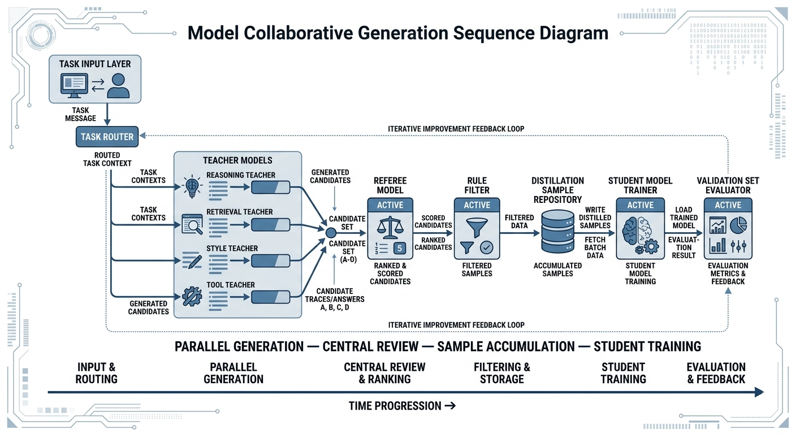
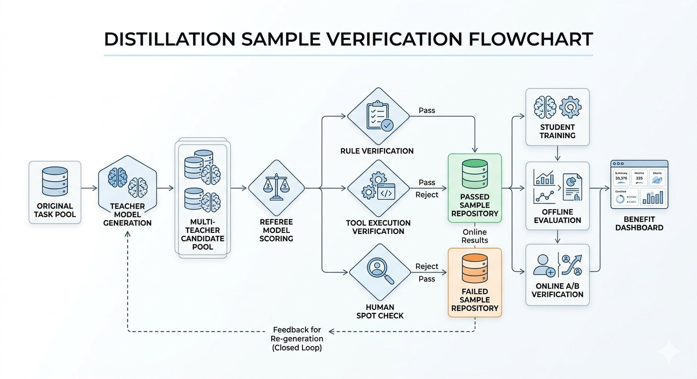

# Chapter 16: Knowledge Distillation and Model Collaboration

## Abstract

Knowledge distillation is often reduced to "feeding a large model's answers into a small model," but its essence is a structured reproduction process organized around target capabilities—where success depends far more on sample design than on training algorithms. This chapter repositions distillation within a multi-model collaborative system, arguing that capability units rather than sample volume should serve as the starting point. The approach begins by defining the tasks the student model is truly responsible for, then determines which fields, trajectories, explanations, and constraints to retain, and bridges teacher outputs, student inputs, and business objectives through task mapping, representation mapping, and objective mapping. On the topic of role allocation, the chapter distinguishes single-teacher, multi-teacher, and Mixture-of-Experts strategies, clarifies how judge models define training boundaries through filtering, scoring, and ranking, and explains why student training recipes must respect capacity constraints. On sample structure, the chapter systematically distinguishes four distillation pathways—answer distillation, process distillation, style distillation, and tool-trajectory distillation—along with their differences in supervision density. It discusses retention strategies for teacher confidence, explanation chains, and failure samples, and establishes that information density and representative sampling determine a student's effective learning speed. The chapter concludes with methods for attributing pre- and post-distillation performance, a return-on-investment framework that integrates cost, latency, and inference quality, and clear guidance on when to stop distillation and shift to real data augmentation. The conclusion is: only when sample structure, role allocation, validation pipelines, and cost accounting are all designed together can distillation grow from an isolated training technique into a stable, reusable system capability.


As large language models progressively enter production engineering, teams increasingly move away from "a larger teacher model" as the sole answer and instead focus on "how to have multiple models collaboratively generate high-quality samples, then transfer those capabilities to student models reliably and at low cost." This is precisely the core value of knowledge distillation and model collaboration (Gou et al. 2021). For teams responsible for multi-model collaborative generation, distillation, and teacher–student pipelines, the true difficulty has never been simply training a student model once; it lies in building a reusable, verifiable, and continuously improvable pipeline for sample production and capability transfer.

The central focus of this chapter is to reframe distillation within the broader data and model collaboration system rather than treating it as an isolated training technique: how teacher models divide labor, how judge models intervene, how student models receive and absorb capabilities, how synthetic samples are designed, how distillation pathways are chosen, how teacher bias is controlled, and how returns should be validated. We especially emphasize an engineering judgment: distillation is far more than "feeding a large model's answers into a small model." Its essence is a structured reproduction process organized around target capabilities. Only when sample structure, role allocation, validation pipelines, and cost accounting are all clearly designed will distillation truly become a stable system capability.

---

## Keywords

Knowledge distillation and model collaboration; synthetic data; knowledge distillation; quality control; model collapse

## Learning Objectives

- Explain why distillation success depends on sample design rather than training algorithms, and identify three canonical failure modes: misaligned supervision objectives, incomplete sample fields, and distorted sample distributions.
- Use capability units rather than sample volume as the starting point for defining student objectives, and align teacher outputs, student inputs, and business goals through task mapping, representation mapping, and objective mapping.
- Distinguish the four distillation pathways—answer distillation, process distillation, style distillation, and tool-trajectory distillation—along with their differences in supervision density, and design retention strategies for teacher confidence, explanation chains, and failure samples.
- Differentiate the filtering, scoring, and ranking roles of judge models under single-teacher, multi-teacher, and Mixture-of-Experts strategies; integrate cost, latency, and inference quality to measure distillation returns; and determine when distillation should be stopped.

## 16.1 Why the Core of Distillation Lies in Samples, Not Slogans

Knowledge distillation (Gou et al. 2021) is often described in teams as "compressing large model capabilities into a small model." This framing is not wrong per se, but it is too abstract and can easily obscure the true difficulties of distillation work (Gou et al. 2021; Bucila et al. 2006). Whether distillation succeeds is rarely determined by the name of the training framework or by whether a more complex loss function has been introduced; it is determined by whether the samples genuinely embody the target capability. If the content generated by the teacher model cannot form a clear mapping with the student's input format, business constraints, and production objectives, then so-called distillation amounts to nothing more than copying surface-level answers rather than transferring usable capabilities.

From an engineering perspective, distillation more closely resembles a process of reorganizing knowledge representations around target tasks; it cannot be understood merely as a "model compression action." Although teacher models possess greater parameter capacity, stronger generalization ability, and richer internal representations, these advantages do not automatically translate into deployable capabilities for student models. The true vehicle of transfer is the samples that the teacher model produces after being task-conditioned, structured, and filtered—not "the teacher model itself." In other words, distillation is not about squeezing one model into another; more precisely, it is about extracting the valuable capabilities from one model, translating them, and assembling them into another.

Many teams, when pushing distillation projects, concentrate their attention on model size, distillation frameworks, training epochs, and even GPU budgets, while neglecting a more fundamental question: what should the student ultimately learn? Should it learn to output standard answers more reliably, or to make step-by-step judgments in complex scenarios? Should it learn to imitate the teacher's expressive style, or to reproduce the teacher's decision logic at critical junctures? Should it learn to execute established workflows when tool assistance is available, or to make reliable inferences in a purely language-based environment? Unless these questions are answered first, subsequent sample production will only generate surface-level activity, and the student model will find it difficult to gain truly transferable benefits.

### Distillation Failures Typically Stem from Sample Design, Not Training Algorithms

When many distillation projects fail, a team's first response is to keep tuning the learning rate, switching optimizers, extending training steps, or experimenting with new distillation losses. In real-world engineering, however, the more common problem is that the distillation samples themselves never clearly defined "what the student should learn." If teacher outputs are complete long-form answers but the student only needs to make short-format decisions after deployment, then over-length samples dilute information and the student ends up learning redundant expression rather than decision-making capability. Conversely, if the student must handle complex reasoning but the distillation samples retain only the final labels with no intermediate evidence or judgment framework, then the student learns only to mimic results, not to exercise decision logic (Mukherjee et al. 2023).

Therefore, the first principle of distillation sample design is to clarify capability units before chasing "more answers collected." A capability unit might be a classification judgment, a structured extraction, a long-text rewrite, or a tool selection and invocation. Only by first defining capability units—then deciding which fields, trajectories, explanations, and constraints to preserve in the samples—will distillation take concrete shape. Many training runs appear to "converge normally" yet perform unremarkably in production; the root cause is rarely that the student cannot learn, but more often that the training set never clearly expressed what needed to be learned.

More specifically, distillation failures typically stem from three types of sample design errors. The first is **supervision objective misalignment**: the teacher output looks high quality, but it does not correspond to the actual task form the student will execute. For example, the business requires the student to perform structured field extraction, yet the samples provide extensive natural-language descriptions; the business requires the student to make low-latency classification decisions, yet the samples contain lengthy argumentation. The second is **incomplete sample fields**: the team retains only the simplest "question–answer" pair while discarding the key evidence, constraints, and failure boundaries the teacher used when making its judgment. Students trained this way tend to be able to answer questions but unable to evaluate them. The third is **distorted sample distribution**: the teacher-generated data differs substantially from real business distributions in tone, length, topic coverage, and difficulty structure, causing students to perform acceptably on offline sets but struggle to adapt to real inputs in production.

This is also why many distillation projects produce a persistent illusion: teams feel they have "already fed many high-quality teacher answers," yet see no significant gains. The problem is not insufficient answer quantity; it is that these answers have not been organized into a form the student can learn. For distillation teams, samples are more like intermediate products requiring precise manufacturing—they cannot be treated as raw materials that are "ready to use once available." A mature distillation system must treat sample design itself as core engineering work, not as preparatory work before training.

### Capability Units Before Sample Volume

In the early stages of a distillation project, the most common mistake teams make is chasing scale prematurely. Upon seeing that the teacher model can generate results reliably, they begin constructing data in bulk, hoping that sample volume can compensate for design deficiencies. But distillation differs from conventional pre-training: the key for distillation samples is "correctness," and simply pursuing "more" is unreliable. If capability units have not first been clearly defined, the larger the sample volume, the more systematically incorrect supervision will be amplified.

This problem is especially easy to overlook in a project's early stages, because "first do more" always sounds reassuring. Once data volume increases, teams feel production is stable, the process is validated, and training has usable input. But distillation and general corpus expansion are not the same thing. In pre-training, data volume itself is part of the source of capability; in distillation, data primarily conveys a directional supervision signal. If that direction has not been clearly defined, bulk production will likely result in bias replication rather than capability accumulation. In other words, the greater risk in the distillation phase is that large batches of samples systematically transmit incorrect supervision—not merely insufficient sample count.

A capability unit refers to the smallest assessable capability fragment that the student needs to reliably master. It might be "judging based on user input whether to invoke a tool," or "extracting responsible parties from regulatory text," or "filtering key evidence supporting a conclusion from retrieved results." Decomposing a distillation task into capability units serves not only to simplify data annotation but also to create a traceable correspondence between teacher outputs, sample fields, and student objectives. Only when a capability unit is clearly defined can a team know whether to distill answers, processes, styles, or tool trajectories.

This step is critical because, even for identically formatted question-answering samples, the actual training objectives can differ entirely. Some samples train factual extraction, some train evidence induction, some train boundary expression, and others train tone control. Without first decomposing these targets, all samples will be lumped together under "question-answering capability," and the team itself will struggle to explain what the student actually learned. Training may appear to converge as loss decreases, and some metrics may even improve marginally during evaluation—but switch scenarios or attempt error attribution, and it becomes apparent that the entire supervision signal was blurred together.

Once capability units are clearly defined, sample design has boundaries. For example, for a judgment task like "whether to invoke an external tool," the key in the samples is not how much explanation the teacher wrote afterward, but whether the input context, trigger conditions, invocation decision, and error counterexamples are all preserved. Similarly, for a task like "long-text normative rewriting," what the student most needs to learn are style constraints, information fidelity, and discourse structure—not all of the teacher's lengthy thinking during generation. A team that first decomposes tasks into clearly defined capability units, then designs distillation sample structures for each, will find the entire pipeline more controllable regardless of whether teachers are replaced, judges upgraded, or students retrained.

Going further, capability units also determine how evaluation should be conducted. Without capability units, teams can typically only examine a broad aggregate metric such as "overall effectiveness," "total usability rate," or "average accuracy." Such metrics are certainly useful, but they can rarely tell you where the problem actually lies. If a student consistently chooses the wrong timing for tool invocation tasks, versus frequently missing key sentences in evidence selection tasks, the training remedies are completely different. Only when capability units have been defined can evaluation be decomposed accordingly, and the team can truly answer: "What exactly can the student not do?" "Is it unable to do it, or can it do it but not consistently?" "Is it an output format problem, or has it not learned the task boundary?"

This is also why mature teams typically do not begin by pursuing a "unified large sample pool." They prefer to first produce a small batch of capability-unit data with clear boundaries and single objectives, aligning the teacher's output approach, sample fields, evaluation methods, and business objectives. The data volume at this stage may not be large, but its value is high, because it establishes the supervision direction for subsequent scale-up. Once these capability units are individually validated, considerations about how to expand scale, how to combine them, and how to apply curriculum-based sampling can proceed—and the entire distillation pipeline is far less likely to spiral out of control.

From an engineering management perspective, "capability units before sample volume" is a reminder to teams that the goal of distillation is to decompose the teacher model's advantages into capability increments that the student can actually learn, evaluate, and deploy—not simply to convert the teacher model's throughput into data volume. Once this order is reversed, teams very easily fall into a state that appears busy but yields unclear output: data accumulates, training runs repeatedly, yet the student model never consolidates several stable, interpretable, reusable capability gains.

### Not All Teacher Outputs Are Worth Retaining

Teacher model outputs are not inherently equivalent to high-value samples. Even if the teacher is far more capable overall than the student, it may still produce redundant content, localized errors, stylistic imbalances, overconfident boundary statements, or answers that violate business standards (Ouyang et al. 2022). If a team treats teacher outputs as "automatic ground truth," the distillation process degenerates into an efficient replication mechanism for errors and noise.

**Code Example: Compressing a "Long Teacher Answer" into a Student-Friendly Structured Supervision Signal**

The following example demonstrates a common "representation mapping" approach: decomposing a long teacher response into three sections—`final` / rationale / constraints (which makes it easier for smaller models to learn stable boundaries)—while retaining the most critical metadata (teacher source, judge score, and whether the sample enters the main training set).

```python
from dataclasses import dataclass


@dataclass
class DistillSample:
    prompt: str
    final: str
    rationale: str
    limits: str
    meta: dict


def compress_teacher_answer(prompt: str, teacher_text: str, *, teacher_id: str, judge_score: int) -> DistillSample:
    # Textbook example: uses simple delimiters to illustrate "structured trimming"
    # In production, these fields are typically generated by a review task / judge model / rule system
    parts = [p.strip() for p in teacher_text.split("###") if p.strip()]
    final = parts[0] if parts else teacher_text.strip()
    rationale = parts[1] if len(parts) > 1 else ""
    limits = parts[2] if len(parts) > 2 else ""

    return DistillSample(
        prompt=prompt,
        final=final,
        rationale=rationale,
        limits=limits,
        meta={
            "teacher": teacher_id,
            "judge_score": judge_score,
            "use_for_training": judge_score >= 4
        }
    )


if __name__ == "__main__":
    p = "User: How should you respond when information is insufficient?"
    t = "Conclusion: First state the constraints, then ask the minimum necessary follow-up questions.###Rationale: Avoid giving a forced answer when evidence is insufficient.###Constraint: In high-risk scenarios, prioritize safe escalation."
    s = compress_teacher_answer(p, t, teacher_id="teacher_v5", judge_score=5)
    print(s)
```

This pattern is very common in real-world projects. Teams initially tend to place a natural trust in a strong teacher, reasoning that since its overall performance far exceeds the student's, directly saving its outputs must at least be more cost-effective than manually rewriting everything. This reasoning is not entirely wrong, but it skips one critical step of filtering: a strong teacher does not mean it is appropriate learning material for the student on every task and in every expressive form. Teacher models have their own generation habits—sometimes they favor elaboration, sometimes they lean toward over-explanation, and sometimes, to make an answer appear complete, they add tone and structure that the student should not learn. If all of this is retained without filtering, the student learns not only task capability but an entire expressive burden that may not suit its own profile at all.

Therefore, a very important but often overlooked judgment in the distillation pipeline is: which parts of the teacher's output are worth retaining, which should be compressed, which should be deleted, and which should even be rewritten. The teacher model's long chain-of-thought explanations may be illuminating for researchers but are not necessarily beneficial for students; the teacher model's complex rhetoric may seem sophisticated but may not help small models form stable behaviors; the teacher model's confident assertions about boundary cases may improve readability yet may inappropriately fix judgments that should remain uncertain.

The truly difficult part is that the portions of teacher output that "look good" are not always the portions that are "good to learn." For instance, a large model writing a well-structured, fully developed long answer to an open-ended question may feel complete to a human reader, but the student model's deployment scenario may require only a short, stable response. Similarly, to enhance persuasiveness, the teacher may express strong confidence under conditions of incomplete certainty; a human reviewer might momentarily find the expression clear, but if the student internalizes this tone, boundary problems may appear once high-risk scenarios are encountered. Distillation must always ask: "Which parts of this response are worth having the student emulate?"—not merely "Does this response look strong?"

This means distillation has a distinctly editorial character; it is a process of knowledge reconstruction that cannot be simplified into data transportation. Excellent distillation teams behave more like "sample editors" than "sample couriers." They do not pursue preserving everything the teacher has said; they pursue extracting, organizing, and compressing the parts of the teacher that genuinely facilitate task completion, then delivering those parts for the student to learn.

The greatest test of a team's judgment here is often identifying content that "looks fine locally but should not be retained globally"—spotting obvious teacher errors is comparatively easy. For instance, some lengthy teacher explanations are not wrong, but they do not align with the student's ultimate deployment objective; some polite expansions do not violate any rule but will slow response pacing; some high-level summaries are genuinely insightful but are too abstract for small models to learn from, whereas explicit, structured intermediate labels would be far easier to absorb. Ultimately, distillation is editing learning material for the student, not archiving the teacher's output.

In mature distillation pipelines, teacher outputs are therefore typically followed by several "editing steps." Some tasks benefit from retaining conclusions while compressing explanations; others benefit from retaining key intermediate states while removing rhetoric; others call for extracting only tool decisions and result integration while discarding the teacher's lengthy reasoning; and still others require retaining the teacher's structural skeleton while rewriting the content into a version better suited to the student's capacity and business requirements. Only after this layer of editing do teacher outputs begin to approach high-value distillation samples.

In this sense, the stronger the teacher model, the more rigorously its outputs need to be processed. Because a strong teacher more readily generates content that "looks like a complete answer," teams are more likely to lower their guard, mistakenly believing that batch-saving everything is sufficient. In fact, the more capable the teacher, the more likely it carries an abundance of high-level expressive habits and implicit reasoning shortcuts—things that may be highly valuable to researchers but are not necessarily learner-friendly for students. Distillation quality often hinges on this single step: whether teacher outputs are treated as raw material to be processed, rather than as ground truth to be copied.

### Mapping Between Teacher Outputs, Student Inputs, and Business Objectives

In distillation engineering, teacher outputs are merely intermediate material. The key lies in how to reorganize this material into input–output samples appropriate for student learning. Teacher models typically have longer context windows, stronger reasoning capabilities, and more complex expressive styles, but student models' deployment objectives are usually constrained by cost, latency, context length, and inference stability. Teacher outputs therefore cannot be passed down as-is; they must undergo task mapping.

This mapping involves at least three layers. The first is **task mapping**: whether what the teacher answers corresponds to the task boundaries the student will ultimately bear. The second is **representation mapping**: whether the teacher's long chain-of-thought analysis needs to be compressed into short explanations, labels, step summaries, or tool-invocation sequences. The third is **objective mapping**: whether the samples serve accuracy improvement, style consistency, increased tool success rate, or quality maintenance under lower latency. Only by aligning these three layers of mapping will distillation data avoid the situation where "the teacher is very capable, the student is very busy, but results are no better."

First, task mapping. What the teacher can do generally exceeds what the student needs to do after deployment. The teacher can simultaneously explain, expand, and provide background context, and can readily offer several alternative approaches; but the student may only need to make judgments, extract information, or produce short answers within a fixed workflow. Without first aligning task boundaries, even excellent teacher outputs may end up teaching the student things it never needs to do. The most common consequence is that student responses become increasingly long and elaborate, yet move no closer to the business objective—appearing to be capability improvement while actually learning in the wrong direction.

Next, representation mapping. The teacher's expressive form is not necessarily appropriate for the student to absorb directly. A large model can use long chain-of-thought reasoning to decompose a complex problem very finely and naturally weave multiple intermediate judgments into its context window, but the student model's capacity, context budget, and inference stability may not be able to sustain the same representational approach. The team must then judge: should the student see the complete process or only key steps? Should natural-language explanations be preserved or converted into structured labels? Should the student learn lengthy analysis or just the final basis for the decision? When representation mapping is poorly executed, students most commonly display a pattern of appearing to have learned a bit of everything while never truly stabilizing in any single area.

The third layer is objective mapping. Distillation cannot remain at the abstract level of "making the student more like the teacher"; it must answer a very practical question: how will the student create value after deployment? The goal might be to approach teacher quality within the same budget, maintain core task availability at lower latency, standardize the tool invocation process to reduce production error rates (Wang et al. 2020; Schick et al. 2023), or something else entirely. Without clarity here, teams will habitually default to "retain as much teacher information as possible" as the safe choice, ultimately leaving the student with a mass of costly, unreliably beneficial material.

From a business perspective, distillation sample design is essentially a form of capability translation: translating implicit capabilities in a high-capacity model into explicit training material that a student model can absorb, generalize, and deploy. The most dangerous trap here is treating teacher outputs as natural ground truth to be poured directly into the student, because the teacher's expressive style, verbosity habits, and error patterns do not necessarily represent the optimal strategy for the student's production use.

This "translation" is difficult because it is not as straightforward as simply reducing word count. Teams often face structural transformation. The teacher may complete a judgment through long-text analysis, whereas the student is better suited to learn a short label with a brief rationale; the teacher may decide whether to invoke a tool through several rounds of successive reasoning, whereas the student more needs a clear trigger condition and a few boundary counterexamples; the teacher may produce a lengthy, stylistically refined normative rewrite, whereas what the student truly needs to learn is paragraph ordering, information fidelity, and tone constraints. In other words, when mapping is done well, what the student receives is a "capability skeleton"; when mapping is done poorly, what the student receives is only "the surface appearance of how the teacher speaks."

Furthermore, this mapping is not completed in a single pass; it typically requires multiple iterations. In many teams' first attempt at distillation, they retain teacher answers in full, training a student that "talks a lot but lacks stability"; in the second round they begin compressing fields, unifying formats, and adding boundary labels; by the third round a sample structure genuinely suited to the student's capacity and business objectives gradually takes shape. This confirms that mapping in distillation emerges from incremental calibration through business validation, not from theoretical derivation alone. The earlier teams establish the principle that "teacher output ≠ student input," the lower the subsequent trial-and-error cost.

Truly mature teams typically do not treat this mapping as an ad hoc processing step but build it into a set of reusable engineering methods: which tasks retain conclusions, which retain short processes, which require counterexamples, which extract only tool trajectories, and which must be rewritten into a format the student can learn stably. Once these methods stabilize, replacing the teacher, changing the student's scale, or adjusting business objectives will no longer force the team to start from scratch each time. At its core, distillation is about "translating a stronger model's capabilities into training material that a weaker model can actually use"—not "feeding a stronger model's outputs into a weaker model." The gap between the two is precisely this layer of mapping.

### Task Mapping: First Answer "What Is the Student Responsible For?"

Task mapping is the most fundamental of the three layers. Many distillation problems appear on the surface to be data quality issues, but are actually rooted in unclarified task boundaries. Teacher models can often handle a broader task scope than students can, so teams easily overreach, attempting to transfer into the student all the capabilities the teacher demonstrated across a large task. But the student's production role typically involves taking over the high-frequency, standardizable, and verifiable portion of those tasks—not replacing everything the teacher does. Unless this boundary is clarified first, no matter how polished the samples, it will be difficult to generate stable returns.

For example, in an enterprise question-answering system, a teacher model might simultaneously possess knowledge Q&A, style polishing, fact summarization, risk flagging, and multi-turn clarification capabilities—but the student model's real responsibility may be only "outputting structured answers when a knowledge base hit is found." In this case, including all of the teacher's behaviors in the distillation samples causes the student to learn many patterns it need never handle, making the model both heavy and unstable. The purpose of task mapping is to first distinguish "what the student must be capable of," "what the student should ideally be capable of," and "what the student should not be responsible for."

Teams that execute distillation well typically write a student responsibility specification at the very beginning of a project. This document resembles a capability boundary definition more than an ordinary technical document: in which scenarios must the student provide a definitive answer; in which scenarios should it decline or fall back; in which tasks does it need only to output a short conclusion; and in which tasks must it retain an explanation field. With such boundaries in place, teacher outputs have a clear convergence target, and sample design avoids degenerating into an aimless "preserve as much as possible."

### Representation Mapping: The Teacher Can Say a Lot; That Does Not Mean the Student Should Learn It All

The central question of representation mapping is the form in which teacher capabilities are absorbed by the student. A teacher model may have completed a high-quality reasoning step through long chain analysis, but the student does not necessarily need to reproduce this complete chain. For a student model with limited capacity and deployment constraints, the key often lies in learning the teacher's judgment framework at critical decision points—not replaying all of the teacher's thinking (Romero et al. 2015; Zagoruyko and Komodakis 2017).

This is a common misjudgment in distillation. Teams see that the teacher responds at great length and with great completeness, and they instinctively assume that since this content helped the teacher reach good results, the student should learn it all together. In practice, this is rarely the case. The reason the teacher can sustain a long analysis chain is that it has larger parameter capacity, a longer context budget, and greater tolerance for redundancy and repetition in intermediate processes. The student model typically has no such leeway. When it is deployed in production, it faces tighter latency constraints, shorter context windows, and less reasoning space. Feeding the student the teacher's long-form analyses wholesale often makes the student "learn harder and less stably"—not "learn more completely."

The same teacher output can be rewritten into multiple sample representations. It can be kept as a complete answer, or decomposed into "input – conclusion – key evidence – constraints"; it can be compressed into "problem decomposition – evidence localization – final judgment"; or it can be rewritten as "when to invoke a tool – which tool to invoke – how to close based on the result." Different representations have a substantial impact on student learning outcomes. Many small models struggle to learn not because the task is too hard but because the sample representation was too closely aligned with the teacher's perspective without adapting to the student's capacity and task boundaries.

What truly needs to be grasped here is the few places where the teacher made judgments most critical to the outcome—not how much the teacher said. For example, in a legal Q&A, the teacher may have written extensive background exposition, statutory interpretation, conditional elaboration, and analogical reasoning, but what the student truly needs to learn may be just three things: first lock down the applicable provision, then distinguish known facts from facts to be confirmed, and finally preserve conclusion boundaries when information is insufficient. Similarly, for a tool invocation task, the teacher may first analyze user intent, then expand on several candidate paths, and only then decide which interface to call. The student model may not need to reproduce this entire natural-language analysis; what it needs to learn is "which input features trigger a tool invocation," "which parameters are required," and "how to fall back on invocation failure."

Representation mapping is therefore not a simple compression action—it is more like a rewrite. Teams cannot finish by merely trimming the teacher's answer. They must re-evaluate: which content constitutes the task skeleton, and which content merely reflects a thorough expression by the teacher; which steps are necessary support for the student, and which steps are scaffolding naturally generated by the teacher under high-capacity conditions. When this judgment is made well, the student absorbs structure; when it is made poorly, the student absorbs only surface activity.

In this sense, representation mapping is re-encoding the supervision signal. Teacher outputs are the "original knowledge expression"; distillation samples are the "training-friendly expression." These two levels should not be conflated. For a book aimed at engineering teams, this point must be emphasized: the goal of distillation is to extract the teacher's effective decision structure—not to preserve the teacher's expressive habits.

This distinction manifests differently across task types. In open-ended Q&A, the student may benefit from learning "a short conclusion + one core piece of evidence + one constraint statement"; in structured extraction, the student is better served by learning field definitions, extraction boundaries, and missing-value strategies; in multi-hop retrieval, the student may not need the teacher's complete natural-language reasoning—it more needs to learn "what to look for first, what to filter next, and how to merge results"; in normative rewriting, the student also does not need to imitate all of the teacher's rhetoric but rather needs to capture paragraph ordering, tone constraints, and information fidelity. In other words, representation mapping has no universal answer—it must follow the task objective.

Many distillation projects' real problem is that teams are too reluctant to discard things, rather than that the teacher isn't strong enough. There is always the feeling that since the teacher worked it all out and wrote it all down, retaining it seems wasteful. But for the student, having too much irrelevant information is often more costly than not having enough. Once a student is forced to simultaneously learn conclusions, long explanations, rhetorical style, setup patterns, and the teacher's own thinking habits, it easily enters a state of "touching everything a little but being stable in none of it." Training looks diligent; actual deployment is not cost-effective.

Representation mapping ultimately tests task understanding, not simple compression technique. The team must first know what the student needs to learn before knowing which parts of the teacher output to keep, cut, rewrite, or convert into labels, structured fields, or intermediate states. Only after this step is done correctly will distillation samples increasingly resemble student training material—not archived copies of teacher answers.

### Objective Mapping: Distillation Is Not Single-Metric Optimization

Objective mapping addresses another common misconception: what type of return the distillation samples actually serve. Many teams assume that the goal of distillation is to "improve accuracy," but in real projects, distillation frequently serves multiple objectives simultaneously. It may aim to enable a small model to approach teacher quality within the same budget, to maintain core task availability at lower latency, or to standardize the tool invocation process and reduce production error rates (Wang et al. 2020; Schick et al. 2023). Without clarity here, teams very easily adopt the wrong orientation during sample design.

"Improving accuracy" is certainly a reasonable objective, but it is often only a surface-level objective and not necessarily what the business truly cares about most. After many systems are deployed, the most painful issues are often inconsistent output length, fluctuating boundary tightness, tools that sometimes fire and sometimes do not, and inconsistent handling of the same category of task across requests—occasional incorrect answers are only part of the problem. For business stakeholders, these issues may not manifest directly in a simple accuracy number, yet they continuously drain user experience, system stability, and manual fallback costs. If distillation focuses solely on accuracy, it easily overlooks these issues that truly affect deployment quality.

For example, if the distillation objective is low-cost replacement of a large model, then sample design should prioritize high-frequency, stable, clearly rule-governed tasks rather than fixating on open-ended long-tail problems (Sanh et al. 2019; Jiao et al. 2020). Conversely, if the objective is to reinforce vertical-domain quality, samples should contain more domain terminology, boundary definitions, risk flags, and error counterexamples. And if the objective is to improve tool invocation success rates, the key supervision signals in the samples should be placed on invocation timing, parameter construction, error recovery, and post-execution closure—not the answers themselves.

Behind this is a very practical judgment: where will the student model ultimately create value? If it handles high-frequency entry tasks—such as first-contact customer service responses, internal enterprise knowledge Q&A, or routine form extraction—then what may matter more is handling large volumes of common questions reliably, quickly, and cheaply, rather than answering the hardest questions optimally. In contrast, if it handles the first quality layer in high-value vertical scenarios, sample design cannot pursue only throughput and average performance; instead, boundaries, terminology, domain conventions, and high-risk counterexamples must be weighted more heavily. Different objectives call for different-looking samples.

Many teams, when beginning distillation, default to trying to transfer as much of the teacher's offline benchmark advantage to the student as possible, thinking this is at least safe. But in actual deployment, it is common to find that while the student improved on some offline questions, production gains are not obvious. The cause is not necessarily that distillation failed; it is more likely that the optimization target of the distillation signal and the target the business actually wants never fully coincided. For instance, the teacher excels at open-ended explanation, so the team retains large volumes of long-answer samples—the result being a student that gets better at "writing" but not better at "getting things done"; or the team is focused on making the student more like the teacher, retaining much elaboration and rhetoric in responses—the result being little reduction in latency in production, but a heavier expressive style that actually departs from the original intent of low-cost replacement.

Objective mapping, therefore, is fundamentally about answering "whom does distillation serve." Is it serving model leaderboard performance or deployment metrics? Offline set performance or real-process success rates? Unless this is stated clearly upfront, all subsequent sample design risks going ever deeper in the wrong direction.

This step is critical because many tradeoffs in distillation cannot be discussed in isolation from objectives. For instance: whether to retain the teacher's long explanations, whether to add more counterexamples, whether to sacrifice some open-ended capability in exchange for structured stability, whether to prioritize high-frequency tasks over difficult long-tail ones—these questions cannot be answered abstractly as "good or bad"; what matters is whether they align with the current project's core return direction. Without objective mapping, teams easily fall into a state of "wanting everything": wanting the student to approach the teacher's overall capability while also being faster, more stable, and cheaper, and to incidentally solve all production issues. In the end, samples become increasingly mixed, training objectives increasingly muddled, and no one can say what this batch of data is actually optimizing.

From an engineering perspective, objective mapping is best done as early as possible and stated with sufficient specificity. For example: "Use a 7B student to replace a 70B teacher for 80% of high-frequency Q&A traffic, while reducing average latency to one-third of the original"; or "Without significantly increasing inference cost, improve tool invocation success rate and parameter validity rate"; or "In a vertical legal scenario, prioritize consistent boundary expression and terminology conventions, accepting somewhat weaker open-ended extensibility." Only when objectives are stated at this level will sample fields, teacher filtering, judge criteria, and student evaluation naturally converge.

Furthermore, objective mapping determines how teams interpret "distillation failure." If the objective is low-cost replacement, then the student's failure to learn the teacher's particularly long, complex open-ended analysis may not count as failure. If the objective is improved tool-chain stability, then the student's unchanged conversational capability may not matter. Conversely, if objectives were never stated clearly, any observed student deficiency tends to be instinctively treated as regression, causing teams to keep adding things to the samples and ultimately turning the originally clear distillation task back into an undifferentiated mix.

Objective mapping truly aims to define a clear return center for the entire pipeline—not to find a nice-sounding slogan for distillation. Once this center is established, the team knows which teacher capabilities deserve to be translated for the student first, which samples should be produced in greater numbers, which fields must be retained, which expressions can be abandoned, which metric gains count as truly effective, and which are merely appearing active. How well distillation works is never solely judged by how closely the student resembles the teacher, but by whether the student, at a more appropriate cost and in a more appropriate form, completes the portion of work it was designed to handle.

### The Boundaries of Distillation Returns: Compression, Transfer, and Specialization

Distillation is not a path of unlimited returns. Teams pushing distillation projects must clearly understand the sources of distillation returns. The first category is **compression**: transferring a large model's usable capability on a class of tasks to a smaller, faster, and cheaper model, in exchange for advantages in inference cost and latency (Hinton et al. 2015; Bucila et al. 2006). The second is **transfer**: leveraging a strong teacher model to generate high-quality pseudo-labels for weakly supervised or data-scarce scenarios, enabling the student to rapidly acquire a certain capability (Wang et al. 2023; Xu et al. 2024). The third is **specialization**: through multiple rounds of distillation and filtering, consolidating the knowledge, norms, and style of a vertical scenario into a lighter, purpose-built expert model.

But distillation also has boundaries. For tasks requiring extremely strong open-domain reasoning, long-horizon complex planning, or heavy dependence on the latest external knowledge, distillation can typically only transfer "common patterns" and cannot fully transfer "real-time capability." When business conditions change rapidly and data distributions drift frequently, distillation returns are also eroded by maintenance costs. In other words, distillation is well-suited to consolidating relatively stable, frequently occurring, and structurally definable capabilities—it is not suited to replacing all online intelligence.

Therefore, the correct posture for a distillation project is to clearly define which tasks the student should take over and in which boundary scenarios it should continue to fall back to the teacher or retrieval system—rather than pursuing "the student completely replaces the teacher." The value of distillation often comes from rational division of labor, not from relentlessly trying to close the gap between models.

To elaborate further, although compression, transfer, and specialization are often mentioned together, the underlying engineering logic differs. Compression is primarily concerned with cost–performance balance; transfer is primarily concerned with capability introduction under data-scarce conditions; specialization is more concerned with long-term business stability. A project that simultaneously pursues all three must accept tradeoffs: over-emphasizing compression may sacrifice long-tail capability; over-emphasizing transfer may introduce teacher bias; over-emphasizing specialization may deprive the student of resilience when distribution shifts occur. Distillation teams must write these tensions explicitly into their designs rather than denying their existence.

### When to Stop Distillation

In practice, there is another equally important but often unspoken judgment: some problems are simply not suitable to keep solving through distillation. For example, when a student model's primary errors have shifted toward "lacking the latest knowledge," "lacking real environmental state," or "lacking tool return results" rather than simply "not knowing how to answer," adding more teacher samples typically yields only very limited improvement (Schick et al. 2023; Yao et al. 2023; Patil et al. 2024). At that point, what truly needs to be added is a retrieval pipeline, tool integration, or real interaction data—not more distillation data.

Similarly, when the teacher itself performs inconsistently on a class of tasks, or when there are obvious disagreements among multiple teachers without mature judge and validation mechanisms, blind distillation will only stabilize that inconsistency into the student. Distillation cannot substitute for real validation, nor can it conceal upstream knowledge and process problems. A mature team should be able to recognize distillation stop signals: when more samples are being produced yet production gains approach zero; when the student increasingly resembles the teacher yet does not increasingly resemble what the business needs; when the cost of maintaining the sample repository begins to exceed the cost of directly calling the teacher—it is time to consider pausing the distillation expansion and shifting toward real data augmentation, process optimization, or system role restructuring.

---

## 16.2 Role Allocation Among Teachers, Judges, and Students

The core of multi-model collaboration is establishing a bounded division of labor around sample production, quality control, and capability transfer—not simply chaining multiple models together. Teachers are responsible for generating; judges are responsible for constraining; students are responsible for absorbing. Only when roles are clearly defined will the collaboration pipeline avoid becoming an unexplainable production line. For distillation systems that require long-term maintenance, clear model division of labor is more important than single-instance peak performance, because it determines whether tasks can be stably expanded, models replaced, and problems diagnosed in the future.

From a systems engineering perspective, the essence of role allocation is decomposing the responsibilities that were previously concentrated in a single large model. Many teams previously favored having one strong model handle thinking, answering, and self-verification simultaneously, seemingly keeping the pipeline shortest and implementation simplest. But once tasks begin to grow complex—especially in high-risk domains, multi-tool environments, or scenarios with diverse output requirements—this "one model handles everything" approach quickly exposes problems: errors are hard to attribute, boundaries are hard to control, samples are hard to filter, and costs are hard to optimize. This is where the value of multi-model collaboration becomes apparent. Its purpose is to make responsibilities within the system more explicit and to allow different capabilities to be optimized independently—not to manufacture complexity.

In a distillation pipeline, teacher models, judge models, and student models each carry different responsibilities. The core task of the teacher model is to produce candidate knowledge and behavior samples; the core task of the judge model is to govern quality, determine tradeoffs, and identify bias; the core task of the student model is to absorb the most worthwhile portions within limited capacity. Without clear boundaries among these three roles, teams very easily attribute the problems of one stage to another. For example, when teacher output quality fluctuates, teams mistakenly adjust student training; when judge standards are unstable, they mistakenly conclude the teacher is not strong enough; when student capacity is insufficient, they blindly increase teacher volume. Clear role allocation serves not only to better organize the system but to facilitate subsequent diagnosis and evolution.

### Single-Teacher, Multi-Teacher, and Mixture-of-Experts Strategies

The single-teacher strategy is suitable when task definitions are clear, target style is uniform, and teacher capability is highly consistent with business requirements. For example, a vertical-domain Q&A system that needs only one high-quality general-purpose teacher model to generate answers, supplemented by rule-based filtering, can construct a first-version distillation dataset. The advantages of a single teacher are a short pipeline, fast startup, and uniform sample style; the disadvantage is that it easily replicates a single type of bias, a single expressive approach, and a single error pattern to the student at scale.

The value of a multi-teacher strategy lies in complementarity. Different teachers can each assume roles in reasoning, retrieval summarization, structured extraction, and style rewriting, thereby decomposing a complex task into several verifiable small capability modules. For example, in a legal or financial scenario, one teacher can be responsible for regulatory positioning, one for clause interpretation, one for answer rewriting and risk flagging, and then a judge model can uniformly verify factual consistency and format compliance. The benefit of this approach is not only improved quality but, more importantly, reduced risk of inheriting any single teacher's biases at scale.

Going further, the Mixture-of-Experts strategy emphasizes "each model contributes only where it excels" rather than "more models is better." In this mode, the system first performs task identification and then routes to the appropriate expert model for sample generation. A truly mature multi-model collaboration system is focused on task-matching capability, not average capability. Only when model division of labor and task boundaries are simultaneously clear will multi-teacher collaboration avoid becoming expensive aggregation.

Single-teacher, multi-teacher, and Mixture-of-Experts are not simply a "choose one of three" relationship. In many real projects they correspond to different phases. Early in the system lifecycle, to quickly validate the distillation loop, teams typically start with single-teacher direct distillation to get the pipeline running; when they find single-teacher samples stylistically monotonous, boundary unstable, or coverage insufficient, they introduce a second or even third teacher to create competitive dynamics; when task types begin to clearly diverge and general teachers can no longer cover all scenarios, the Mixture-of-Experts strategy truly demonstrates its value. In other words, model division of labor typically grows more fine-grained as task complexity increases; it is rarely designed to its fullest extent from the outset.

### Why the Single-Teacher Strategy Is Often a Starting Point Rather Than an Endpoint

The single-teacher strategy is common primarily because it is the easiest to launch—not because it is optimal. A team with even one reasonably high-quality teacher model can rapidly begin generating samples, training students, and validating initial returns. This is very important for project initiation and pipeline validation, because many distillation projects in their early stages most need to prove "this path is verifiable" rather than to pursue perfect design.

But the single-teacher strategy's largest structural problem is that it simultaneously amplifies the teacher's strengths and weaknesses. If the teacher is particularly skilled in a certain expressive style, the student will quickly learn that style; if the teacher has habitual biases in certain boundary cases, the student will equally quickly inherit those biases. More importantly, single-teacher samples tend to have a fairly narrow language distribution, and students easily develop the phenomenon of "performing well on familiar formats, becoming unstable on slight variations." Many distillation projects look very successful in early stages but begin to degrade when reaching real environments—the root cause is often that single-teacher sample distribution is too narrow.

Therefore, the single-teacher strategy is better understood as a starting-point solution. It helps teams quickly establish the pipeline for data production, sample filtering, student training, and preliminary validation, but once entering more complex business phases, teams must begin thinking about how to introduce diversity, how to control bias, and how to make samples closer to real distributions. Otherwise, as the single-teacher approach grows larger, the subsequent cost of replacement and correction only increases.

### The Key to Multi-Teacher Lies in Responsibility Decomposition, Not Simple Stacking

The true prerequisite for an effective multi-teacher strategy is that responsibilities have been sensibly decomposed—not that the number of teachers has increased. If multiple general-purpose teachers simply repeat answers to the same question and one result is arbitrarily selected as the most appealing, then having multiple teachers brings more cost than gain. Multi-teacher collaboration is valuable precisely because it allows teams to decompose a complex task into multiple local tasks and let different teachers contribute where each is most capable.

For example, in a distillation system for complex Q&A, the entire task could be decomposed into four stages: "evidence retrieval – evidence integration – answer generation – style revision." A retrieval-oriented teacher handles external evidence aggregation; a reasoning-oriented teacher handles logical integration among evidence items; a writing-oriented teacher converts conclusions into output templates conforming to business norms; finally, a judge uniformly evaluates factual consistency and format completeness. Under this division of labor, the multiple teachers execute a production chain with clear boundaries of responsibility rather than duplicating effort.

This responsibility decomposition has another important benefit: it makes bias more localizable. If the final samples contain errors, the team can determine whether the problem arose in evidence retrieval, logical integration, or expression closure—rather than vaguely saying "the model gave a wrong answer." For teams building long-term distillation systems, this localizability is more important than a single-instance accuracy improvement, because it determines whether subsequent optimization follows a clear method or relies on experience through repeated trial and error.

### The Essence of the Mixture-of-Experts Strategy Is Task Routing

The most central question in the Mixture-of-Experts strategy (Shazeer et al. 2017; Fedus et al. 2022; Du et al. 2022) is "which task should be routed to whom"—not "how many experts to use." Without a clear task identification and routing mechanism, the more expert models there are, the more easily the system becomes chaotic. Because once a wrong task is sent to the wrong expert, no matter how strong the subsequent judge is, it can only do post-hoc remediation rather than pre-emptive prevention.

The Mixture-of-Experts strategy is suitable for scenarios where task differences are already too large to be covered uniformly by a single general-purpose teacher. For example, clause citation in legal tasks, risk attribution in financial tasks, emotional de-escalation in customer service tasks, and parameter construction in tool tasks—these capabilities differ substantially in input format, correctness criteria, and output requirements. Rather than continuing to force a general-purpose teacher to do everything, routing tasks through prior identification to more suitable experts is more effective. Samples produced this way are not only of higher quality but are also naturally better suited for domain-specific distillation downstream.

Of course, Mixture-of-Experts also means increased system complexity. It requires task identification capability up front, sample fusion mechanisms in the middle, and a unified quality judgment standard at the end. Without these supporting components, Mixture-of-Experts can actually make pipelines harder to maintain. This strategy is therefore better suited to mature, mid-to-late-stage systems where task layers have stabilized, rather than as the default starting point for any project.

### The Role of Judge Models in Filtering, Scoring, and Ranking

In many distillation pipelines, judge models (Zheng et al. 2023; Liu et al. 2023) are often misunderstood as "post-hoc acceptance tools," but in practice the judge model is the quality control hub in the entire sample production pipeline (Zheng et al. 2023; Liu et al. 2023). Teachers are responsible for generating candidate answers; judges are responsible for deciding which answers enter the student's training set, which can only be retained as failure samples, and which need to be returned for regeneration. Multi-model collaboration without a judge phase very easily produces rapidly expanding sample volume alongside simultaneously degrading data quality.

The judge's role typically manifests at three levels. The first is **filtering**: identifying samples with obvious errors, non-compliant formats, failed tool invocations, factual conflicts, or severe hallucinations. The second is **scoring**: providing fine-grained evaluations across dimensions such as correctness, readability, consistency, coverage, and style match. The third is **ranking**: among multiple candidate results provided by different teachers, selecting the version most appropriate for the current student objective. It is especially important to note that the judge's role is to select the answer most suitable for the student to learn—not to identify the answer that most "resembles the teacher."

In engineering practice, judge models often require greater stability than teacher models. Teachers may explore diverse expressions, but judges must maintain scoring criteria as consistently as possible; otherwise, the training set will exhibit hidden distributional noise. If the same response is assigned completely different standards by the judge across different batches, the student will learn a confused set of boundaries. For this reason, many teams combine judge strategies with rule systems, using rules to guarantee floor standards and models to handle complex judgments.

**Code Example: A "Candidate–Judge–Intake" Structure for Distillation Samples (JSONL)**

This type of structure simultaneously supports engineering needs such as "multi-teacher competition," "failure sample retention," and "confidence-weighted sampling."

```json
{
  "id": "distill_000781",
  "prompt": "(task input)",
  "candidates": [
    {"teacher": "teacher_A", "text": "(candidate A)"},
    {"teacher": "teacher_B", "text": "(candidate B)"}
  ],
  "judge": {
    "winner_teacher": "teacher_B",
    "scores": {"teacher_A": 3, "teacher_B": 5},
    "reason_tags": ["clearer boundary", "more actionable structure"]
  },
  "store": {
    "train": {"teacher_B": true, "teacher_A": false},
    "failure_pool": {"teacher_A": true}
  },
  "meta": {"task_unit": "boundary_answering", "version": "v0.2.0"}
}
```

Going further, in multi-model collaboration, the judge model plays the role of "system memory." Teachers may change, experts may be swapped out, students may be retrained, but if judge standards can remain relatively stable, the entire sample repository will not experience criterion drift across different cycles. This is especially critical in long-cycle distillation projects. Systems without a stable judge easily end up with samples from the first cycle emphasizing correctness, the second emphasizing expressiveness, and the third emphasizing length compression—leaving the student learning conflicting signals.

### Filtering Is About Defining Training Boundaries, Not Simply Deleting Samples

Many people understand filtering as "removing incorrect answers," but in a distillation system, the true function of filtering is defining the student's learning boundaries. A sample that is filtered out does not necessarily mean it has no value; it may also mean this sample is not suitable as a positive supervision example but is suitable as a failure sample, a refusal sample, or a contrastive sample. If teams treat filtering purely as a deletion action, they lose a large amount of valuable boundary information.

For instance, some teacher answers are partially correct at the factual level but overly confident in expression, or omit key constraints. If such samples enter the positive example set directly, they will mislead the student into forming bad habits; but if reformulated as "error case + correction note," they may become extremely valuable negative supervision examples. Similarly, certain tool invocation trajectories, though ultimately unsuccessful, very clearly demonstrate the cause of failure and the recovery path. Such trajectories are not appropriate for distillation as success samples, but are very suitable for training students to recognize failure conditions.

Therefore, filtering should focus on determining training usage rather than simply sorting samples into "keep" and "discard." Which samples enter the main training set, which enter the hard-case set, which enter the contrastive set, which enter the refusal set, and which enter the manual review pool—all of these are part of the filtering strategy. The value of judge models lies not only in saving teams manual effort, but in helping teams develop clear data stratification awareness.

### Scoring and Ranking Determine What Kind of World the Student Sees

If filtering determines which samples can enter the system, scoring and ranking determine what sample universe the student primarily sees (Ouyang et al. 2022; Zheng et al. 2023; Liu et al. 2023). Because the student model's training budget is always limited, it cannot equally absorb all candidate data. One of the most critical facts in distillation engineering is: what shapes the student is "the selected portion of the data"—not "all the data."

This means the scoring criteria themselves constitute a kind of implicit teaching syllabus. If judges prefer answers that are linguistically fluent but not sufficiently careful, the student will gradually become better at speaking but not necessarily more reliable; if judges prefer concise and conservative answers, the student may be stable but lack explanatory depth in complex scenarios; if judges particularly emphasize format compliance, the student will more closely resemble a norm-execution machine rather than an open-ended generator. Therefore, the judge model's scoring dimensions must align with the student's objectives rather than staying at an abstract level of "overall quality is higher."

Ranking works similarly. In multi-teacher competition scenarios, what ultimately enters the training set is the top-ranked batch of results after ranking—not all candidates. This process is actually deciding which style, which logic, and which boundary-handling approach the student will be exposed to. In other words, ranking is the critical control point in a distillation system for shaping the student's distribution, and must not be viewed as an inconsequential post-processing step.

### Student Model Capability Objectives and Training Recipe Design

The student model is an independent product unit with clearly defined capability objectives—not a miniaturized version of the teacher (Mirzadeh et al. 2020). The critical determinant of a student's training recipe is what the student ultimately needs to achieve—not what the teacher used. A student model oriented toward customer service quality inspection pursues stability, low latency, and format consistency (Jiao et al. 2020); a student model oriented toward domain Q&A pursues factual consistency and terminology norms; a student model oriented toward tool invocation pursues parameter accuracy and invocation success rates. Different objectives impose different requirements on sample structure, training epochs, negative sample ratios, and hard-case retention strategies.

The distillation training recipe therefore cannot be discussed in isolation from the student's capability objectives. If the student's objective is stable short-form answering, there should not be excessive reliance on lengthy explanation chains; if the student's objective is complex decision-making, it is insufficient to distill only the final labels. Furthermore, the training recipe must be combined with the student model's capacity boundary. Small models are particularly vulnerable to sample structures that are excessively complex, label noise that is too high, and style distributions that are inconsistent. In other words, the stronger the teacher, the more someone needs to be responsible for organizing its outputs into a form the student can actually learn.

It should also be emphasized that student models' training objectives are often multiple. In real systems, students need to both "be capable" and "be consistently capable" and "be deployable cheaply." This means training recipes must balance quality, stability, and deployability. Many distillation approaches fail not because the student cannot acquire capability, but more often because training objectives are too idealistic—wanting to retain all of the teacher's long-chain capabilities while also maintaining extremely low latency and extremely small model scale. A mature team does not avoid these constraints but actively trims training objectives according to the student's positioning.

### The Student Is a Business Execution Agent, Not the Teacher's Thumbnail

This is a point well worth emphasizing separately in distillation engineering. Student models are often imagined as "smaller teachers," but this idea misguides the entire system design. The student does not exist to faithfully replicate the teacher; it exists to reliably execute tasks within specific business boundaries. As long as the student is sufficiently reliable, affordable, and fast on critical tasks, it has fulfilled its own mission (Jiao et al. 2020).

For this reason, student training should not treat "how closely it resembles the teacher" as its highest goal, but rather "can it fulfill its business responsibilities" as its highest goal. Teachers may be creative, open-ended, and exploratory, but students more need determinism, verifiability, and behavioral boundaries. If teams always evaluate students from the teacher's perspective, they will continuously require students to learn more, more completely, and more complexly, ultimately turning what should be a lightweight and controllable student into an awkward half-product.

A more rational approach is to first define the student as a business execution agent, then work backward to determine what training samples, distillation pathways, and judge criteria are needed. In this way, the division of labor among teacher, judge, and student naturally becomes clear: the teacher is responsible for providing high-value capability sources; the judge is responsible for determining which capabilities are worth consolidating; the student is responsible for converting these capabilities into stable, deployable behaviors.

### The Recipe Design Must Respect the Model's Capacity Boundary

In many distillation projects, what teams most easily overestimate is the sample complexity that the student model can bear (Romero et al. 2015; Jiao et al. 2020). Teacher models can handle long context, complex reasoning, multi-stage tool invocation, and multi-style expression, but students may not have the same capacity (Mirzadeh et al. 2020). Without accounting for this, the richer the distillation samples, the harder it is for the student to converge to stable behaviors.

Capacity boundaries are reflected not only in parameter scale but also in task loading patterns. A smaller student model may very stably complete short-format classification tasks yet be unable to simultaneously handle long chain explanations; it may learn standard template responses well yet be unable to stably generalize to open-ended complex dialogue. Therefore, training recipe design must actively make reductions: which fields are necessary, which may serve as auxiliary signals, and which should be moved out of the main training set. One of the keys to distillation success is matching sample complexity to student capacity—not blindly trying to fit all teacher capabilities into the student unchanged.

To present common collaboration modes and applicable tasks more clearly, Table 16-1 below maps collaboration patterns to role configurations, applicable tasks, and risk points.

*Table 16-1: Collaboration Modes and Applicable Tasks*

**Table 16-1: Collaboration Modes and Applicable Tasks**

| Collaboration Mode | Role Configuration | Typical Workflow | Applicable Tasks | Advantages | Risk Points |
|---|---|---|---|---|---|
| Single-teacher direct distillation | 1 teacher + 1 student | Teacher generates → rule filtering → student trains | Formatted Q&A, simple classification, template writing | Short pipeline, fast startup, uniform style | Single bias easily inherited |
| Single-teacher + judge | 1 teacher + 1 judge + 1 student | Teacher generates → judge scores/filters → student trains | Vertical Q&A, summarization, extraction requiring basic quality control | More stable quality, better controllability | Unstable judge criteria introduce variance |
| Multi-teacher competition | Multiple teachers + 1 judge + 1 student | Multiple teachers generate in parallel → judge ranks → student trains | Long-text generation, complex Q&A, open-ended reasoning | Higher diversity, complementary strengths | Increased cost, higher evaluation difficulty |
| Mixture-of-Experts distillation | Router + multiple expert teachers + judge + student | Task identification → expert generation → judge aggregation → student trains | High-constraint scenarios such as legal, financial, and medical | Clear division of labor, adapted to complex tasks | Routing errors amplify system mismatch |
| Tool-trajectory collaboration | Teacher agent + tool executor + judge + student | Plan → invoke tool → verify → trajectory distillation | Agent, retrieval Q&A, code assistant | Transferable operational workflow capability | High trajectory noise, high validation cost |

In multi-model collaboration engineering implementations, timing and handoff points are equally important. Figure 16-1 illustrates the timing and handoff relationships in multi-model collaborative generation.



*Figure 16-1: Multi-Model Collaborative Generation Timing Diagram*

---

## 16.3 Structural Design of Distillation Samples

Distillation appears to be creating a training set, but it is actually deciding which information should be delivered to the student model in what form. The same teacher output, saved as-is, may be nothing more than a long answer; once decomposed, compressed, scored, and converted into fields, it becomes more suitable as a training sample. The significance of distillation sample structure design lies in determining exactly what the student absorbs, what it ignores, and what behavioral patterns it retains.

For teams responsible for multi-model collaboration and teacher–student pipelines, sample structure design is the most decisive intermediate layer in the entire distillation system and cannot be treated as an ancillary step before training. No matter how capable the teacher model, if its outputs cannot be organized into sample structures that the student can absorb, generalize, and verify, what is ultimately conveyed to the student will be a large quantity of "seemingly rich" text rather than stable capability. Conversely, even if the teacher is not the highest-capability model, as long as sample structure design is sufficiently clear, the student can still achieve significant gains on target tasks. This is why distillation systems more often compete on the quality of supervision signal organization rather than on model scale alone.

The difficulty in distillation sample structure design lies not in the number of fields but in the logic of information organization. What a sample should contain depends on the capability boundary the team wants the student to learn. If the student's goal is to efficiently complete structured decisions, the most critical elements in the sample are trigger conditions, judgment basis, and output format; if the student's goal is to transfer complex reasoning capability, some intermediate analytical structure must be preserved; if the student will handle tool-based tasks, invocation trajectories, parameter choices, and execution feedback are more important than natural-language rhetoric. In other words, the structure of a distillation sample is a systematic answer to "how target capabilities are encoded"—not a universal template.

### Answer Distillation, Process Distillation, Style Distillation, and Tool-Trajectory Distillation

Answer distillation (Kim and Rush 2016) is the most intuitive form: the teacher directly generates the target answer, and the student learns the mapping from input to answer (Kim and Rush 2016). This approach is suitable for tasks with clear labels, strong result orientation, and low requirements for intermediate processes—such as text classification, structured extraction, short-answer Q&A, and standardized writing. Its advantages are simplicity and efficiency; its disadvantages are equally obvious: students easily learn only the surface output and find it difficult to remain stable on out-of-distribution samples.

Process distillation attempts to transfer to the student the teacher's judgment rationale, reasoning steps, and structured analytical framework. It is appropriate for tasks requiring intermediate logical support, such as multi-step Q&A, complex discrimination, and review reasoning. The key in process distillation is not to retain the longest possible explanation chain but to retain the intermediate structures that genuinely help the student form decision boundaries—for example, preserving the skeleton of "problem decomposition – evidence aggregation – conclusion generation" rather than copying all of the teacher's natural-language thinking.

Style distillation aims to have the student learn certain output styles—such as legal-style expression, customer service-style expression, audit-style expression, or pedagogical-style expression—rather than improving knowledge accuracy. It is particularly suited to enterprise scenarios with explicit tone, compliance phrasing, and brand expression requirements. Tool-trajectory distillation extends further into agent systems, making the step sequences the teacher follows when invoking tools such as retrieval systems, databases, calculators, and code executors part of the sample. Here the student learns not only "how to answer" but also "when to invoke a tool, with what parameters, and how to continue deciding based on tool results."

For a mature team, distillation pathways typically need to be used in combination according to task objectives rather than mechanically selecting one of the four: first use answer distillation to establish the foundation, then add process distillation for critical tasks, layer on style distillation for externally-facing output tasks, and include tool-trajectory distillation for agent-type tasks. Designing distillation pathways is essentially designing layered capability transfer.

### Different Distillation Types Correspond to Different Supervision Densities

Although answer distillation, process distillation, style distillation, and tool-trajectory distillation are often discussed side by side, a crucial difference among them is supervision density. Answer distillation typically provides a relatively sparse supervision signal: the student only knows "what output the input ultimately corresponds to" (Hinton et al. 2015; Kim and Rush 2016). Process distillation (Lightman et al. 2024) provides medium-to-high-density supervision, because the student sees not only the final answer but also part of the judgment pathway (Lightman et al. 2024; Wei et al. 2022). Tool-trajectory distillation (Schick et al. 2023; Yao et al. 2023; Patil et al. 2024) typically has higher supervision density still, because it includes not only decision outcomes but also invocation timing, action sequences, execution feedback, and closure methods (Schick et al. 2023).

This may appear to be a sample format difference, but it directly affects what the student learns and how stably it learns. Answer distillation is the "lightest" because it almost exclusively tells the student what to say at the end. This type of supervision is straightforward, clean, and low-cost to train; students are less likely to be held back by excessive intermediate information. It is particularly appropriate for tasks with clear input boundaries and stable result forms—such as structured extraction, short-answer classification, and format normalization rewriting. But its weakness is equally clear: the student knows what the final output should look like yet does not necessarily know why it should answer that way. Faced with inputs that deviate even slightly, or when it must judge among several close options, it tends to become fragile.

Process distillation moves one step further. Rather than providing only conclusions, it exposes the key judgments preceding those conclusions, allowing the student to see how the teacher moved from input to output. The value here is that the student not only memorizes the answer but also acquires some "judgment framework." For tasks requiring problem decomposition, evidence filtering, and boundary control, this intermediate information is often very helpful. But the problem also emerges: once the process is written too lengthy, too loosely structured, or too much like the teacher's own thinking notes, what the student learns may not be critical judgments but rather the teacher's expressive habits, setup patterns, and intermediate detours that small models need not reproduce at all.

Tool-trajectory distillation typically has even higher supervision density because it must tell the student not only what the final answer is but also when to act, which step to take, and how to proceed after execution results return. For agent-type tasks, this information is very important, because what truly determines success or failure is usually whether the intermediate decisions and actions were performed correctly—the final explanatory text is actually not the most critical supervision target. But once supervision is this dense, samples also rapidly grow longer. Tool selection, parameter construction, invocation order, exception handling, result integration—when all of this is stacked together, students may not be able to distinguish which step is the primary signal and which is merely supporting context in the task.

Higher supervision density does not necessarily mean more suitable for the student. For small models, excessively dense supervision can sometimes bring two problems. First, samples become longer and more complex, causing effective supervision to be diluted by redundant information. Second, information at different levels enters the training process simultaneously, and the student may be unable to distinguish "what is the core signal and what is peripheral description." When designing distillation samples, teams should therefore not simply pursue "retain as much as possible" but should pursue "retain the most useful portion." A mature team learns to control supervision density based on the student model's capacity, task complexity, and deployment objectives—not to blindly increase sample complexity.

More problematically, supervision density must match the task; it cannot be treated as a scale where higher is always better. Some tasks intrinsically require only sparse supervision. For example, simple classification, template-based responses, and fixed-field extraction—forcing in large blocks of process information causes the student not to learn more but to be misled by extra noise. Conversely, some tasks, if given only answers, leave the student perpetually unable to find the key. For tasks such as evidence filtering, boundary judgment, and tool triggering, seeing only the final result often leaves students not knowing at which point they should make a critical decision. That is to say, whether supervision density is appropriate depends on whether the task requires the student to learn "what the result looks like" or "how to pass the critical juncture"—the question cannot be answered abstractly by assuming higher density is more advanced.

Many teams making their first attempt at distillation easily mistake "more complete information" for "stronger supervision." But for students, more complete information and clearer signals are not the same thing. A sample with many steps, many explanations, and much background does not mean the student received more effective supervision. On the contrary, for small models with limited capacity, the more critical it is for supervision signals to be concise, hard, and precise. Provide answers where answers are needed; provide critical judgments where those are needed; for trajectories, extract the most important few steps. Teams with real experience tend to keep deleting things that offer little benefit to students while easily distracting attention—not keep adding fields.

From an engineering perspective, therefore, choosing a distillation type is fundamentally deciding how to allocate supervision density. Should the student first learn what results look like, then gradually learn how critical judgments are made? Or should sparse supervision be used to validate high-frequency tasks first, then density increased for difficult tasks? Should tool invocation tasks retain the action skeleton, or should complete trajectories be kept unchanged? On the surface these are sample structure questions; in practice they determine whether the student ultimately develops "result imitation capability," "critical decision capability," or merely learns the teacher's seemingly rich but inappropriate-for-itself expressive style.

### Combining Distillation Pathways More Closely Approximates Real Business Needs Than Single Pathways

Real-world business scenarios are almost never purely answer tasks, purely style tasks, or purely tool tasks. Very often, a single task simultaneously involves content correctness, expressive standards, and process compliance. For example, in legal Q&A, students must not only answer conclusions but also cite evidence and control phrasing risk; in customer service auto-replies, students must not only provide a resolution plan but also maintain brand tone and emotional de-escalation style; in agent scenarios, students must not only complete tool invocations but also generate interpretive summaries comprehensible to humans after the invocation (Schick et al. 2023; Yao et al. 2023). Distillation systems that excessively rely on a single pathway ultimately tend to learn only part of the task.

The advantages of a single pathway are of course obvious. It is simple, the pipeline is short, and sample structures are easy to unify. Answer distillation alone is easiest to scale; style distillation alone most easily standardizes tone; tool-trajectory distillation alone most easily tracks action success rates. But the problem with real business is that users never formulate their requests according to training paradigms. They do not first decompose a request into "this is a content problem," "this is a style problem," "this is a tool problem," then submit each separately to different model handlers. When actually deployed, a response must simultaneously be correct, stable, and sound like what this system should say. Sometimes action must come before explanation, or constraints must be explained before next-step suggestions are provided. The task itself is mixed; supervision that persistently focuses on only one pathway naturally causes the student to develop only partial capability.

A more reasonable approach is to treat different distillation pathways as supervision sources for different capability layers. Answer distillation provides the task's primary objective; process distillation enhances the transferability of decisions; style distillation standardizes output boundaries; tool-trajectory distillation supplements action capability. This type of combined design can enable students to learn both "the result" and "why this result," while also learning "how to express and execute it in the appropriate way." In this sense, distillation sample structure design is more like arranging a curriculum structure than simply choosing a method.

The most critical thing here is clarifying what each distillation type resolves—not mechanically combining them. Answer distillation typically handles "getting things right"—this is the most basic layer. Process distillation fills in "why do it this way," helping students not merely memorize answers when encountering similar tasks but learning a degree of transferability. Style distillation governs "how to speak as if from the same system," maintaining consistent tone, boundaries, and expressive habits across different tasks. Tool-trajectory distillation corresponds to "when to act, how to act, how to close after acting"—without this layer, students often only know how to explain, not how to execute. Separating these layers makes combined distillation something other than a pot of mixed samples.

Legal Q&A is a typical mixed task. Answer distillation alone may produce a roughly correct conclusion that lacks supporting evidence and does not know to stop when materials are insufficient. Style distillation alone may produce cautious phrasing that cannot identify the relevant provision. Process distillation alone may produce reproducible judgment paths whose final written output does not conform to industry expression norms. What truly approaches business needs is usually to decompose these layers and combine them: first ensure correctness of conclusions, then reinforce evidence extraction and boundary control, finally settle the tone and structure into what the legal domain requires.

Customer service auto-reply is similar. Users do not care which type of distillation trained the model—they only care whether the reply moves the issue forward. It must describe a resolution plan, maintain brand tone, and display basic de-escalation capability when users are emotional. In scenarios requiring order lookup, logistics tracking, or refund status, tool invocations may also be involved. In these cases, answer distillation alone produces a student good at "reply content"; style distillation alone may make it more customer-service-like but leave processing flows unstable; tool-trajectory distillation alone may produce a student that can mechanically call interfaces but cannot round off the response after results return. The value of combined pathways is enabling the student to ultimately develop a set of capabilities more closely approximating the full real-service action—rather than a single layer improving in isolation.

In agent scenarios, this combined relationship is even more apparent. A functional agent does not end once the tool is called. It must first judge whether to invoke a tool, decide whether to continue with additional steps after invocation, know how to fall back when results are not as expected, and finally explain the entire process to a human. This involves trajectory issues, decision issues, and expression issues simultaneously. If distillation focuses only on tool actions, the student may learn to run through the workflow but not know how to close in abnormal situations; if it focuses only on result summarization, the student may produce the correct conclusion but not know how to proceed in the middle. What the business truly needs is always for the entire chain to close—not for any single step to be correct in isolation.

Combined distillation therefore focuses on acknowledging that real tasks are inherently layered—not on "doing more types of data to seem more comprehensive." The student first needs to know what the target answer looks like, then gradually learns how critical judgments are made, then learns what way to express them, and finally how to execute in real workflows. This sequence actually resembles a course: first learn basic conclusions, then understand the judgment framework, then learn industry discourse and system boundaries, and finally integrate all of this into real processes. Treating distillation sample structure as curriculum structure, teams in their design will think not "which method is better" but "which layer is the student currently missing, and which layer should be supplemented in the next round."

This is also why mature teams typically do not fixate on a single distillation paradigm. They are more concerned with how different types of supervision should be paired to find the right balance among student capacity, business constraints, and deployment objectives. Some high-frequency tasks can be primarily supported by answer distillation with a small amount of style constraints layered in; some complex judgment tasks need both answer and process together; some agent tasks must consider trajectory, result, and closure expression all at once. There is no fixed formula for path combination, but taking only one path will most likely result in learning only a portion.

In this sense, distillation sample design truly answers "what is the student supposed to be shaped into"—not "which distillation method to choose." If the goal is only to have it recite answers, perhaps a single pathway is sufficient; but once the goal is to deploy it, to integrate it into processes, to replace some portion of real business capability, distillation can rarely be completed with a single supervisory form alone. Tasks in the real world are inherently cross-cutting; distillation pathways should not be conceived too narrowly. Truly effective combinations should cause the student, under multi-level supervision, to ultimately develop into a system that can get results right, pass processes, use expressions, and execute actions in the real world—not merely a list of method names placed side by side.

### Retention Strategies for Teacher Confidence, Explanation Chains, and Failure Samples

The most easily overlooked point about distillation samples is that "not all bad samples should be deleted." Traditionally, failure samples mean noise and should be eliminated as much as possible. But in many tasks, failure samples are precisely the most valuable material for defining boundaries. An error made by the teacher on a highly confusing sample, if correctly labeled with the cause of failure, may become an important negative example that helps the student learn to discriminate boundaries.

This requires that the sample repository preserve not only "final answers" but also metadata related to sample reliability. Teacher confidence may be an explicit score, or it may be derived from combinations of signals such as judge scoring, model consistency, tool execution success rates, and external verification pass rates. Explanation chains require distinguishing whether they are exposed to the student, at what granularity, and whether they are compressed into structured prompts. For example, overly long explanation chains may increase noise, but key judgment rationale extracted through summarization may significantly improve student stability.

The key to failure sample retention is not "quantity" but "clear annotation." If failure samples are simply mixed into the training set, the student will learn incorrect patterns; but if failure samples are designed as contrastive learning material, refusal samples, boundary alert samples, or error-correction samples, they become high-value information sources. Distillation systems therefore must not have only a positive example repository; they also need a boundary sample repository and a failure pattern repository. Teacher bias control also typically begins here: first let the system observe failures, then decide which errors should be blocked and which should be converted into learning opportunities for the student.

### Teacher Confidence Is a Sample Scheduling Signal, Not a Decorative Field

When constructing distillation samples, many teams occasionally retain teacher confidence as an additional field without genuinely incorporating it into sample scheduling and training decisions. In fact, if teacher confidence is designed well, it is not merely "reference information" but can become a very important control signal in the entire distillation system. High-confidence samples can enter the main training set first to construct stable supervision; medium-confidence but high-value samples can enter a review pool or hard-case pool; low-confidence but representative samples can be retained as failure samples or contrastive samples.

The value of this approach is that it transforms the sample repository from a pile of flat data into a tiered training resource pool. The student model encounters samples of different reliability levels, difficulty levels, and purposes at different stages—rather than facing a mass of mixed supervision. For distillation teams, this stratification not only improves training stability but also facilitates subsequent attribution analysis. If a certain capability class fails to improve, the team can review whether the samples in the corresponding confidence interval have problems rather than vaguely suspecting "the entire distillation plan has failed."

### The Key to Retaining Explanation Chains Is Transferability, Not Length

In large model distillation, explanation chains (Lightman et al. 2024; Wei et al. 2022) have always been an object easily elevated to mythical status. Many teams intuitively believe that as long as the teacher's complete thought process is retained, students will more easily learn to reason (Wei et al. 2022). But the reality is considerably more complex. Whether an explanation chain has value is determined not by whether it is complete but by whether it forms a transferable judgment structure for the student.

This misunderstanding is common because from a human perspective, a long, complete explanation chain often appears "information-rich." The teacher first analyzes the background, then decomposes conditions, then weighs several possibilities, and finally reaches a conclusion—the entire process appears to resemble a genuine reasoning trajectory. The problem is that the student model is not reading this process; it is using this process as a training signal. For small models, a lengthy natural-language explanation will not automatically become a clearer reasoning framework; it may instead first become a mass of sentence patterns, setups, and expressive habits to imitate. What is ultimately learned is often "appearing to analyze" rather than actually being better at judging.

If the explanation chain is merely the large body of natural language the teacher produced en route to an answer, it may be illuminating for researchers but is not necessarily beneficial for students. Especially for student models of smaller capacity, when faced with lengthy, diffuse, and stylistically strong explanation chains, students tend to learn language patterns rather than reasoning logic. Truly more valuable explanation chains are typically intermediate information that has been compressed and structured—such as key evidence, summaries of decision steps, the hierarchical relationships of judgment rationale, and counterexample boundaries to be wary of. Such explanation chains serve to extract the judgment framework the teacher can transfer outward, rather than replicating the teacher's full thinking.

The most critical point here is that "transferability" matters far more than "completeness." Transferable means that when the student encounters similar but not identical inputs, it can still proceed along similar judgment scaffolding rather than memorizing this explanation verbatim. For example, if a legal Q&A teacher explanation chain consists mainly of extended statutory recitations, repeated restatements of the user's question, and additional commentary resembling expert annotations, the student, even after learning it, may not be able to transfer it to the next question. But if this explanation chain is compressed into "first determine the scope of applicability, then verify the subject's identity, then confirm the constraints, stop drawing conclusions when information is insufficient," it more closely resembles a transferable judgment sequence. When facing new questions, the student is more likely to follow this sequence to reach stable decisions.

This is also why retaining CoT verbatim in many distillation projects has not been as magical as expected. Teams initially feel that since the large model reached good answers through this process, including this process as student input should at minimum not hurt. But after several rounds of training, the common outcome is that student responses become longer, the tone increasingly resembles the teacher's, and occasionally the student even produces a few seemingly analytical sentences—but when inputs are deformed, conditions conflict, or evidence is insufficient, the student still becomes unstable. The problem may not lie in the model being too small but in that explanation chain being long yet not explicitly drawing out the most transferable parts.

Truly useful explanation chains typically do not retain all intermediate text but proactively perform a layer of selection. Which evidence is key evidence, which is only background material; which steps are mandatory judgment nodes, which are only the teacher's natural expansions under large-capacity conditions; which boundaries, once encountered, signal a stop; which situations can still proceed with an answer—once these are organized, the explanation chain truly transitions from "what the teacher said" to "what the student should learn." Otherwise it remains supplementary text within teacher output: appearing rich, yet of uncertain training value.

The difference becomes even more apparent across task types. For retrieval Q&A, what the student truly needs may be "which pieces of evidence support the conclusion, which are relevant but insufficient to settle it"—not the entire reasoning; for tool invocations, the student more needs "which conditions trigger an invocation, which conditions should halt it"—not the teacher's lengthy natural-language analysis before and after the invocation; for long-text judgment, the student typically needs to learn "first locate the conclusion section, then identify constraint conditions, then verify counterexamples"—not the teacher's full reading trajectory as laid out. In other words, the value of an explanation chain does not lie in whether it resembles the human thought process but in whether it can deliver the key judgment skeleton of the task to the student.

Therefore, when designing explanation chain fields, teams cannot simply ask "should CoT be retained?" but should ask more specifically: which layer of intermediate information does the student need to more stably form its capability boundary? Answering this question prevents explanation chains from degenerating into decorative text that increases token costs without necessarily improving results.

Going one step further, teams must continue to ask: what specific capability is this explanation chain intended to improve? Is it to help the student know better when to stop in the face of insufficient evidence? To help it deviate less on multi-step tasks? To help it form more stable judgment sequences across similar tasks? Unless this question is clear, explanation chain fields tend to grow longer and longer, eventually becoming a conservative "since the teacher wrote it, let's keep it for now." But in distillation, what is truly valuable is always that what is retained lands precisely on the few judgment nodes the student most needs—not how much has been retained.

Explanation chain design ultimately tests whether the team has the ability to break long processes apart, filter and recombine them, and finally turn them into supervision signals the student can digest, transfer, and reuse on new tasks—not whether it has the courage to retain long processes. For distillation engineering, this step is often more important than "whether to use CoT" itself.

### Failure Samples Serve Not Only for Error Removal but Also for Defining Refusal and Caution Boundaries

In many high-risk tasks, student models need not only to "answer correctly" but also to know "when not to answer with confidence" (Bai et al. 2022). This is difficult to learn from positive examples alone, because positive examples can only tell the model what to output under what circumstances; they cannot sufficiently convey when the model should be conservative, decline to answer, signal uncertainty, or fall back to the teacher, rule system, or human review. Failure samples play exactly this role.

Many teams initially collect failure samples for a very direct purpose: to find errors, fix errors, and suppress metrics. This approach is entirely reasonable, but if failure samples are treated only as "bad examples," their value is underutilized. For high-risk systems, the more important function of failure samples is telling the student which situations should not be answered forcefully, should not be expressed with excessive confidence, should not cross business boundaries—not merely reminding it to "be more careful and it could get the right answer." This kind of information, if not explicitly taught to the student through samples, is very difficult for it to develop on its own.

For instance, in high-constraint scenarios such as regulatory interpretation, financial advice, and medical Q&A, failure samples often contain very important boundary information: which conditions, once absent, make conclusions inadmissible; which inputs, though superficially similar, actually belong to a different task class; which contexts require explicit risk and constraint notification. If these failure samples are designed as error-correction supervision, refusal supervision, or boundary contrastive supervision, the student learns not only to "give answers" but also to "control answers." From a business perspective, this capability is often more important than improving accuracy by a few points, because it directly relates to whether the system is reliable, compliant, and sustainable in production.

The truly valuable aspect of failure samples is making concrete "the circumstances under which answering should not continue," rather than merely telling the student "you got this wrong last time." For example, in a legal scenario where the user has omitted a contractual premise, the student's most dangerous behavior is attempting to give a definitive conclusion despite missing conditions—not merely extracting a provision incorrectly. In a financial scenario where risk assessment information is incomplete, the student's most dangerous behavior is converting a question that should prompt for additional information into advice—not merely an insufficiently elegant phrasing. In a medical scenario where symptom descriptions are ambiguous and potential red flag signals exist, the most unacceptable behavior is glossing over a high-risk situation with apparently calm language—not merely "failing to cover it completely." In these scenarios, failure samples are telling the student: the core issue is learning first where to stop, not how to fill in the answer more completely.

Failure samples are therefore not only error cases—they are also boundary samples. They single out situations that are "one step from crossing the line," "appears answerable but actually shouldn't be answered," or "superficially similar to the same task but requiring completely different handling." Positive examples more often teach the student how to walk the right path; failure samples teach the student which paths not to stray onto and which forks not to take. Both placed together in the distillation system, the student learns a capability system equipped with a braking mechanism—not one that charges forward unchecked.

This is also why failure samples in high-risk tasks are best not reduced to simple correction pairs. If samples end up becoming only "wrong answer → right answer," the student will of course learn some corrections, but it may not learn "why should I be conservative here," "why should I decline here," "why should I fall back to rule systems or human review here." A truly more useful approach is typically to make failure samples more explicit: which conditions are absent, which judgment node does not hold, how to express uncertainty, whether additional information should be prompted, whether automatic answering should stop. This way the student learns not only to get the answer right but also to control output intensity and boundaries.

Furthermore, failure samples' defining function for refusal and caution boundaries has another very practical use: helping teams translate "what the business is worried about" into actual training sets. After many high-constraint systems go live, what business stakeholders most fear is often the model speaking as if it knows when it actually does not—not just occasional incorrect answers. But if this concern only remains in meeting notes, specification documents, or verbal reminders, it is very difficult to turn it into stable model behavior. Only when these high-risk failure scenarios are systematically organized into samples will the student truly encounter these boundaries during training and gradually develop more stable default responses.

These samples also help distinguish two completely different directions of improvement. Some failures indicate that the student truly cannot do something and needs capability augmentation; others indicate that the student already has partial capability but was overconfident when it should have been cautious, and failed to stop when it should have stopped. The first type of problem requires adding knowledge, judgment frameworks, and task samples; the second type often more needs boundary samples, refusal supervision, and cautious expression templates. Without failure samples to help teams distinguish these two problem types, subsequent remediation easily gets mixed together—ultimately either training the system to become ever heavier or continuing to loosen boundaries that should be maintained.

From a business perspective, this capability is often more important than improving accuracy by a few percentage points, because it directly relates to whether the system is reliable, compliant, and sustainable in production. A system that occasionally makes errors but knows to stop in high-risk scenarios is often more trustworthy than one with higher average scores but fluctuating boundary tightness. What users and business stakeholders truly depend on is whether the model can demonstrate sufficient stable restraint when uncertain—not whether it is always correct.

The value of failure samples therefore cannot remain only at the error-removal level. Their deeper function is converting the system's caution boundaries into training signals and teaching the student "when to step back." Only then will the student learn not only how to give answers but also how to control them, when to pause, and under what circumstances to return decision authority to more reliable mechanisms. For many systems that truly need to go to production, this step often constitutes a core capability—not an optional add-on.

### Sample Compression and High Information Density Design

High-quality distillation data does not mean longer is better or more detailed is better. For student models, the most valuable samples are often those that retain the most critical information with the minimum redundancy. High information density design means keeping the fields that truly determine task success and compressing away the parts that merely reflect the teacher's expressive habits. Especially in training small models, redundant text significantly dilutes the supervision signal, causing the student to waste substantial capacity on style imitation and local phrasing.

Sample compression typically occurs at three levels. The first is **content compression**: compressing long answers into structured fields such as conclusion, evidence, constraints, and output format. The second is **process compression**: compressing lengthy reasoning chains into key-step skeletons. The third is **distribution compression**: clustering and deduplicating highly similar, low-incremental-value samples, reserving valuable training budget for samples with strong representativeness, clear boundaries, and broad coverage. Many teams pursuing "large scale" in distillation find that the truly effective strategy is usually "high density + high coverage" rather than simply accumulating volume.

In this sense, sample compression helps the student focus—it does not weaken teacher capability. A mature distillation team should manage samples as if doing data editing: removing redundancy, preserving differences, reinforcing boundaries, and highlighting critical fields. This is also why excellent distillation projects more closely resemble "sample engineering" than just "model training."

### Information Density Determines the Student's Effective Learning Speed

Sample compression matters not merely for saving tokens or reducing training data volume; more importantly, it directly affects the student model's effective learning speed (Gou et al. 2021). Every time the student sees a sample, it is consuming limited parameter capacity to absorb the supervision signal. If most content in a sample consists of the teacher's language habits, repeated statements, or low-value setup text, this content competes with the truly important supervision signal for attention.

This is also why two datasets of similar scale can yield vastly different training outcomes. One dataset appears rich in content but is full of redundancy and homogeneous samples; the other, though smaller, retains highly concentrated critical task information in each sample. The latter more consistently enables students to form stable capabilities, because it reduces ineffective noise in the learning process. For distillation teams, information density is a matter of training efficiency—not merely an aesthetic concern.

### The Focus of Sample Compression Is Structured Trimming, Not Uniformly Shortening

A caution: sample compression does not mean uniformly shortening text (Romero et al. 2015). Many teams, once aware of the redundancy problem, easily overcorrect—over-trimming teacher outputs until only a very short answer or label remains. This certainly reduces sample length but may also simultaneously remove valuable judgment rationale, causing the student to learn only the surface result and lose the intermediate structure needed for generalization.

Truly effective compression more closely resembles structured trimming. It retains what the task truly needs and removes what offers little learning benefit to the student. For structured decision tasks, retaining "conclusion + key evidence + constraints" is typically more effective than retaining extended explanations; for tool-based tasks, retaining "trigger condition + invocation parameters + tool feedback + final closure" is more important than retaining natural-language reasoning. Compression targets ineffective information—not length itself.

### Deduplication, Clustering, and Representative Sampling Determine Sample Distribution Quality

Once distillation samples begin large-scale generation, a problem quickly emerges: large numbers of samples look different on the surface but are highly similar in capability terms (Wang et al. 2023; Xu et al. 2024). Without deduplication and clustering, the student model repeatedly trains on the same pattern while receiving insufficient exposure to genuinely scarce boundary samples, long-tail samples, and highly confusing samples. Models trained this way typically perform well on conventional inputs but become fragile as soon as they encounter slightly varied real-world scenarios.

Sample compression therefore also has a distributional meaning: covering as rich a capability space as possible within a limited budget. Clustering helps teams identify which samples differ only in phrasing but are essentially the same; representative sampling helps teams maintain balance across different difficulty levels, task types, and error patterns; hard-example upsampling ensures that the student is not "fed comfortably" by large volumes of easy samples while perpetually failing to learn truly difficult judgments. A mature distillation system ultimately pursues the most rational sample distribution—not the maximum sample count.

### Sample Structure Ultimately Determines Which Version of the Teacher the Student Inherits

At a higher level, distillation sample structure design ultimately determines which version of the teacher the student inherits. The teacher model is a complex whole: it has high-level capabilities, but it also has expressive habits, localized biases, verbosity tendencies, and error boundaries. The student does not automatically inherit all of the teacher; it inherits only the portion preserved in the samples. Sample structure design is therefore essentially a "teacher slicing" process: the team decides which knowledge, which styles, and which behavioral patterns of the teacher the student should inherit—and which redundancies and biases should be severed.

This also shows that sample structure is the core governance mechanism in a distillation system and is never a neutral technical detail. Who defines the fields, who decides how much of the explanation chain to retain, who specifies how failure samples are annotated, who trims the redundancy—these decisions determine what kind of model the student ultimately becomes. In this sense, distillation teams are not only doing data engineering but are practicing capability governance.

### The Sample Repository Should Be an Evolvable Structure, Not a One-Time Product

Finally, it must be emphasized that distillation sample structures should not be treated as static templates fixed once established and unchanged indefinitely. As business objectives change, teacher models are upgraded, judge standards evolve, and student capacity adjusts, sample structures themselves must also evolve. A system initially dominated by answer distillation may later add key evidence fields; a system that initially did not retain failure samples may build a boundary sample pool after accumulating production incidents; a system primarily handling pure-text tasks may add trajectory fields and execution feedback fields after introducing tools (Schick et al. 2023).

Therefore, sample repository construction should embody "evolvability" awareness from the outset. Field designs should be extensible; sample uses should be stratifiable; metadata should be back-fillable; and validation results should be able to feed back into reconstruction. Only then will distillation sample structure design avoid becoming a one-time engineering effort and instead become a core asset supporting continuous iteration of multi-model collaboration. For teams truly doing long-term teacher–student pipelines, this point is even more important than a single training result, because it determines whether the system can continuously absorb new capabilities, correct old biases, and remain effective under new business constraints.

---

## 16.4 Validation Pipelines and Return Measurement

Distillation most commonly encounters problems after training ends—not before it begins. Many teams only check whether the student model shows a slight improvement on the validation set without establishing a complete attribution pipeline, making it difficult to determine whether gains came from sample quality, training strategy, model division of labor, or coincidental data distribution matching. Distillation without a validation pipeline can at most be counted as a single experiment; only by establishing causal tracing from samples through training to production effects does distillation enter the engineering phase.

### Pre- and Post-Distillation Performance Comparison and Attribution Methods

Pre- and post-distillation comparison cannot only examine a single aggregate score; it should be decomposed into at least task dimensions, sample difficulty dimensions, scenario dimensions, and cost dimensions for analysis. Because student models may improve significantly on conventional samples while regressing on long-tail samples; they may advance on summarization tasks while declining on tool invocation or format-constraint tasks. Only by disaggregating metrics can a team determine what the distillation samples actually compensated for and whether they genuinely matched the stated objectives.

Going further, attribution analysis should trace back to the distillation pipeline itself. A common method is bucket experiments: comparing separately how student capabilities change when using only single-teacher samples, multi-teacher samples, judge-filtered samples, and samples augmented with failure cases. This identifies the true source of gains. Another method is field-level ablation: removing the explanation chain, removing tool trajectories, removing the confidence field, and observing which tasks the model degrades on, thereby judging which fields are worth retaining long-term.

The essence of attribution work is preventing distillation from staying at the level of "results got better" and enabling it to answer "why they got better." Only then, during subsequent model replacement, teacher upgrades, and task expansion, will the team avoid falling back into blind trial and error.

### Comprehensive Return Accounting for Model Cost, Latency, and Inference Quality

Distillation is a systemic investment; returns and costs must be calculated together. Looking only at quality improvement can easily produce the optimistic conclusion that "distillation is worthwhile"—but if teacher generation costs are extremely high, judge costs are extremely high, and sample maintenance costs are long-lasting, while student production cost savings are limited, the project's true ROI may not be favorable. Conversely, some distillation projects, even if quality improves only modestly, have strong engineering value if they substantially reduce latency and per-request cost (Jiao et al. 2020).

Return accounting should therefore cover at least three dimensions. The first is **quality returns**: accuracy, factual consistency, tool success rates, format compliance rates, and user satisfaction. The second is **system returns**: average latency, peak throughput, resource utilization, and deployment complexity. The third is **operational returns**: whether manual review volume is reduced, whether dependence on teacher model online calls is lowered, and whether delivery cycles are shortened. Only by simultaneously examining all three categories can teams judge whether distillation is creating value or manufacturing an expensive intermediate layer.

**Code Example: A Minimal ROI Estimator (Placing "Saved Production Costs" and "Distillation Investment" on the Same Ledger)**

```python
def distill_roi(
    *,
    qps: float,
    teacher_cost_per_1k: float,
    student_cost_per_1k: float,
    avg_tokens: int,
    days: int,
    offline_total_cost: float
) -> float:
    """
    Returns ROI = (saved online inference cost - offline investment) / offline investment
    For engineering estimation only: in practice, also account for changes in manual fallback
    costs due to quality differences.
    """
    requests = qps * 86400 * days
    cost_teacher = requests * (avg_tokens / 1000) * teacher_cost_per_1k
    cost_student = requests * (avg_tokens / 1000) * student_cost_per_1k
    saved = cost_teacher - cost_student
    return (saved - offline_total_cost) / max(offline_total_cost, 1e-9)


if __name__ == "__main__":
    roi = distill_roi(
        qps=20,
        teacher_cost_per_1k=0.06,
        student_cost_per_1k=0.01,
        avg_tokens=800,
        days=30,
        offline_total_cost=2000
    )
    print("ROI =", round(roi, 3))
```

Table 16-2 below presents a distillation returns and costs comparison suitable for helping teams make more systematic decisions. As shown, typical returns and costs differ across dimensions such as inference quality, latency performance, and cost control.

*Table 16-2: Distillation Returns and Costs*

*Table 16-2: Distillation Returns and Costs*

| Evaluation Dimension | Typical Returns | Typical Costs | Common Pitfalls | Applicability Judgment |
|---|---|---|---|---|
| Inference quality | Improved accuracy, consistency, and style stability | Teacher generation cost, judge evaluation cost | High scores may stem from data leakage or homogeneous validation sets | Suitable for tasks with clear objectives and well-defined evaluation criteria |
| Latency performance | Faster responses after small model replaces large model | Long upfront distillation and iteration cycle | Latency improvement but increased long-tail errors | Suitable for online high-concurrency scenarios |
| Cost control | Reduced per-call costs, saved GPU resources | Building sample repositories and validation systems requires investment | Total cost may not decrease when teacher participates long-term | Suitable for stable high-frequency tasks |
| Domain specialization | Reinforced vertical terminology, format, and process norms | Requires ongoing maintenance of domain and boundary samples | Samples easily become outdated when domains change rapidly | Suitable for strongly normed scenarios such as legal, financial, and customer service |
| Tool capability transfer | Improved invocation success rates and process stability | Trajectory annotation, execution verification, and replay costs are high | Tool version updates cause samples to become invalid | Suitable for Agent and process automation tasks |
| Organizational collaboration | Forms reusable teacher–judge–student pipeline | Increased process complexity, more collaborative roles | Unclear responsibility boundaries slow optimization | Suitable for medium-to-large teams building long-term capabilities |

To make the validation pipeline more intuitive, Figure 16-2 illustrates the validation flow for distillation samples from generation and verification through approval or return for rework.




*Figure 16-2: Distillation Sample Validation Flow Diagram*


### When to Stop Distillation and Shift to Real Data Augmentation

Distillation is not always worth scaling up indefinitely. One clear signal is when newly added distillation samples can no longer significantly improve key metrics and error patterns increasingly originate from real user distribution, missing real context, or changes in the real tool environment. This indicates that the marginal returns of distillation are declining. Continuing to expand synthetic samples and teacher generation volume at this point typically only makes the training set increasingly "resemble the teacher" without making it increasingly "resemble the user."

Another stop signal comes from bias accumulation. When teams notice that the student model is increasingly adept at reproducing teacher style yet making homogeneous errors in real scenarios, or persistently maintaining incorrect confidence on certain boundary problems, this should raise alarm that teacher bias is being stably internalized. The most effective approach at this point is typically to introduce real interaction data, manually corrected data, production failure cases, and business feedback data to recalibrate sample distribution—rather than continuing to distill.

A mature distillation system must therefore include "exit conditions." Distillation is not the objective; stably improving business capability is the objective. When synthetic samples can no longer represent the complexity of the real world, teams should decisively shift to real data augmentation, allowing students to realign with real-world tasks rather than continuing to optimize cyclically within the teacher's world.

---

## 16.5 Engineering Cases and Pattern Summary

The true value of knowledge distillation (Gou et al. 2021; Bucila et al. 2006) lies not in a single clean comparison in a laboratory but in whether it can sustain a long-term, scalable, low-cost model collaboration production system. The significance of engineering cases is helping teams understand under what conditions different patterns are effective, where failures typically occur, and how teacher bias is discovered and corrected in organizational processes. The following summarizes two types of representative scenarios.

### Case: Distilling a General-Purpose Model into a Vertical Small Model

In many enterprise scenarios, teams initially call general-purpose large models directly to handle tasks such as customer service Q&A, contract summarization, work-order classification, sentiment attribution, and knowledge Q&A. This is fast to start but costly, high-latency, and stylistically unstable. Teams then often choose a standard distillation path: a strong teacher model batch-generates answers and explanations for domain tasks, a judge model and rule system filter high-quality samples, and these samples are used to train a smaller vertical student model (Mukherjee et al. 2023).

The key to success in these projects lies in whether task boundaries are sufficiently clear—not in how strong the teacher is. For example, if the student only needs to output standardized conclusions and fixed fields, sample structure should be designed around "input – key evidence – standard output" rather than preserving excessive open-ended long text. Many vertical small models perform stably precisely because they only learned the portion the business truly needs—not because they learned all general-purpose knowledge.

These cases also best illustrate "specialization returns." A distilled vertical small model may be far weaker than the teacher in open-domain capability, but on specific business tasks it is faster, more stable, cheaper, and more compliant. The goal of distillation is therefore to produce a business execution agent that is sufficiently strong and stable on critical tasks—not to produce a miniaturized all-purpose model.

### Case: Multi-Teacher Collaboration Improving Legal/Financial Scenario Quality

Legal and financial scenarios typically simultaneously require high risk awareness, strict norms, and high interpretability, making single-teacher distillation often insufficiently robust. A more common approach is multi-teacher collaboration: one teacher handles retrieval or clause positioning, one handles reasoning and interpretation, one handles answer rewriting and style control, and then a judge model comprehensively evaluates factual consistency, completeness of risk flags, and output format (Zheng et al. 2023; Liu et al. 2023). Only through this division of labor can the system separately govern "finding the evidence," "interpreting the evidence," and "expressing it normatively."

One publicly available case worth referencing is Orca's progressive distillation approach. Orca does not simply have the student model learn the final answers from a strong teacher; it has the student learn explanation trajectories, step-by-step reasoning processes, and complex instruction handling from GPT-4, combined with teacher-assisted signals from ChatGPT to organize training data (Mukherjee et al. 2023). Although Orca is not a legal or financial dedicated system, it provides a very typical multi-teacher collaboration insight: a strong teacher is well-suited to producing reasoning chains and explanatory evidence for high-difficulty samples; an auxiliary teacher is well-suited to providing mid-difficulty, more smoothly distributed, broader-coverage intermediate samples. Translating this pattern into legal and financial scenarios means it cannot be simply understood as "calling multiple models"—it means placing different teachers in different responsibility positions: the retrieval teacher is responsible for locating contract clauses, regulatory rules, or financial metric sources; the reasoning teacher is responsible for judging how these evidence items support the conclusion; the rewriting teacher is responsible for converting the conclusion into expressions meeting legal, risk control, or customer service requirements; the judge model is responsible for checking whether evidence matches, whether risk flags are missing, and whether conclusions cross lines.

The first question this type of pipeline truly needs to retrospectively examine is conflicts among teachers. In contract review, for example, the retrieval teacher may have found three relevant provisions—"early termination," "breach liability," and "force majeure"—but the reasoning teacher draws its conclusion based on only one of them, and the rewriting teacher further deletes constraint conditions to make the expression more concise. Here the three teachers' outputs are all task-relevant on the surface, but they are not consistent in their responsibility chain: the retrieval results cover multiple risk points, the reasoning results use only partial evidence, and the rewriting results further compress the risk boundary. If these samples enter the student's training set without going through a judge, the student may learn a dangerous pattern: appearing to give a definitive conclusion while actually ignoring critical constraints. In financial scenarios similarly, an indicator analysis teacher may point out that enterprise cash flow is declining, a risk judgment teacher may conclude "debt repayment pressure is rising," and an expression teacher may rewrite this as "significant default risk exists." The problem here is not whether the language is fluent but that the risk level has been amplified—the conclusion has shifted from a cautious flag to a strong judgment.

The second question is whether complementarity among teachers is being correctly utilized. Multi-teacher collaboration does not require all teachers to produce completely consistent outputs. In high-constraint tasks, good samples often emerge from complementary relationships: the retrieval teacher provides evidence boundaries, the reasoning teacher adds causal chains, the rewriting teacher controls expression calibration, and the judge model determines whether this information can be merged into a single training sample. The difference between complementarity and conflict is that complementary information can simultaneously hold true and jointly strengthen an answer; conflicting information cannot simultaneously hold true on critical facts, applicable conditions, or final conclusions. For example, in a financial Q&A where one teacher states "this indicator shows short-term liquidity pressure" and another adds "but seasonal fluctuations in the same industry can also produce similar phenomena"—this is valid complementarity, because it teaches the student to retain boundary conditions in risk judgments. In contrast, if one teacher judges "a major risk can be definitively identified" while another judges "only potential risk can be indicated," this is not merely a stylistic difference but a risk-level conflict that must enter judge review or human spot-checking.

The third question is whether the routing mechanism is truly bearing responsibility allocation rather than merely dispatching model calls. In legal and financial tasks, the router must at minimum determine invocation order based on task type, risk level, evidence requirements, and output usage. Low-risk formatted Q&A can be handled by lower-cost, stylistically stable teachers; tasks requiring citation of clauses or regulatory grounds must first pass through the retrieval teacher before reaching the reasoning teacher; tasks involving investment advice, contract liability, and compliance judgments must not have teacher outputs enter the training set directly—they must pass double checking by both judge model and rule system. This routing is not to increase system complexity but to clarify "who can provide candidate answers on which questions." Without routing, all teachers speak to all samples, and the final approach must rely on voting or averaging—which appears safe but actually obscures capability boundaries and causes the student to simultaneously absorb biases from multiple sources.

The fourth question is whether judge consistency has been verified. In multi-teacher collaboration, judge models must judge not only whether a single answer is good but also whether multiple teacher outputs are complementary, conflicting, or unrelated. Relevant research has already pointed out that judge models may be influenced by position bias, verbosity bias, and self-enhancement bias, so judge scores cannot be treated as naturally reliable ground truth. In engineering systems, the more prudent approach is to also establish consistency checks for judges: when the same batch of teacher outputs is shuffled, are judge conclusions stable? When the same answer is shortened or rewritten, can the judge still catch factual errors? Do different judge models or rule templates produce consistent rejections of high-risk samples? Only when judge criteria are stable are samples produced by multi-teacher collaboration suitable for entering the student training phase. Otherwise what the student learns is not teacher capability but the incidental preferences of the judging system.

In these scenarios, teacher bias control is particularly important. Even if a strong teacher is very capable overall, it may exhibit systematic biases in lagging regulatory updates, terminology ambiguity, insufficient risk flagging, and overconfident conclusions. Direct distillation would have the student stably inherit these biases. Solutions typically include: having multiple teachers compete and cross-verify; introducing rules and external knowledge bases as factual floors; retaining failure samples for contrastive training; and separately evaluating judge models to ensure scoring criteria remain stable.

These cases demonstrate that the purpose of multi-teacher collaboration is to control risk rather than to pursue complexity. The higher the constraint of the scenario, the more necessary it is to have different models bear different responsibilities and avoid pressing all judgment onto a single teacher. For teams responsible for model collaboration and distillation, the true value of this pattern lies not in having more models but in having clearer responsibility boundaries, more visible biases, and more accountable returns.

---

## Chapter Summary

Knowledge distillation is a systems engineering effort organized around sample production, capability transfer, and return validation—far more than the slogan "have a small model learn from a large model." Whether distillation succeeds depends first on whether the samples genuinely express target capabilities, not on whether the training framework is complex. The clearer the division of labor among teacher, judge, and student, and the more closely sample structure aligns with business objectives, the more stable the distillation pipeline and the easier subsequent iteration becomes.

From an engineering perspective, multi-model collaboration and a synthetic data foundation are prerequisites for distillation to succeed. Only by first constructing high-quality candidate samples through a rational division of model labor, then clearly validating samples through judges, rules, tool execution, and human spot-checking, does student model training have a solid foundation. At the same time, distillation pathways are not fixed templates; they should be combined across answer distillation, process distillation, style distillation, and tool-trajectory distillation based on task type. Teacher bias control must also extend beyond verbal reminders to be implemented through multi-teacher complementarity, judge verification, failure sample retention, and real data backfill.

Ultimately, a mature distillation system enables students to stably take over high-frequency, structurally definable, and verifiable tasks within clear boundaries—rather than having the student fully replicate the teacher. When distillation returns begin to diminish or teacher biases begin to accumulate, teams should promptly stop over-distillation, shift to real data augmentation, and recalibrate the student toward real-world tasks. Only in this way does knowledge distillation become not a one-time training technique but a long-term, reusable model collaboration capability for the organization.

## References

Gou, J., Yu, B., Maybank, S. J., et al. (2021). Knowledge Distillation: A Survey. *International Journal of Computer Vision*, 129(6), 1789–1819.

Hinton, G., Vinyals, O., & Dean, J. (2015). Distilling the Knowledge in a Neural Network. *arXiv preprint arXiv:1503.02531*.

Bucila, C., Caruana, R., & Niculescu-Mizil, A. (2006). Model Compression. *Proceedings of the 12th ACM SIGKDD International Conference on Knowledge Discovery and Data Mining*, 535–541.

Mukherjee, S., Mitra, A., Jawahar, G., et al. (2023). Orca: Progressive Learning from Complex Explanation Traces of GPT-4. *arXiv preprint arXiv:2306.02707*.

Ouyang, L., Wu, J., Jiang, X., et al. (2022). Training Language Models to Follow Instructions with Human Feedback. *Advances in Neural Information Processing Systems*, 35, 27730–27744.

Romero, A., Ballas, N., Ebrahimi Kahou, S., et al. (2015). FitNets: Hints for Thin Deep Nets. *International Conference on Learning Representations*.

Zagoruyko, S., & Komodakis, N. (2017). Paying More Attention to Attention: Improving the Performance of Convolutional Neural Networks via Attention Transfer. *International Conference on Learning Representations*.

Wang, W., Wei, F., Dong, L., et al. (2020). MiniLM: Deep Self-Attention Distillation for Task-Agnostic Compression of Pre-Trained Transformers. *Advances in Neural Information Processing Systems*, 33, 5776–5788.

Sanh, V., Debut, L., Chaumond, J., et al. (2019). DistilBERT, a Distilled Version of BERT: Smaller, Faster, Cheaper and Lighter. *arXiv preprint arXiv:1910.01108*.

Jiao, X., Yin, Y., Shang, L., et al. (2020). TinyBERT: Distilling BERT for Natural Language Understanding. *Findings of the Association for Computational Linguistics: EMNLP 2020*, 4163–4174.

Schick, T., Dwivedi-Yu, J., Dessì, R., et al. (2023). Toolformer: Language Models Can Teach Themselves to Use Tools. *Advances in Neural Information Processing Systems*, 36.

Wang, Y., Kordi, Y., Mishra, S., et al. (2023). Self-Instruct: Aligning Language Models with Self-Generated Instructions. *Proceedings of the 61st Annual Meeting of the Association for Computational Linguistics*, 13484–13508.

Xu, C., Sun, Q., Zheng, K., et al. (2024). WizardLM: Empowering Large Language Models to Follow Complex Instructions. *International Conference on Learning Representations*.

Yao, S., Zhao, J., Yu, D., et al. (2023). ReAct: Synergizing Reasoning and Acting in Language Models. *International Conference on Learning Representations*.

Patil, S. G., Zhang, T., Wang, X., et al. (2024). Gorilla: Large Language Model Connected with Massive APIs. *Advances in Neural Information Processing Systems*, 37.

Shazeer, N., Mirhoseini, A., Maziarz, K., et al. (2017). Outrageously Large Neural Networks: The Sparsely-Gated Mixture-of-Experts Layer. *International Conference on Learning Representations*.

Fedus, W., Zoph, B., & Shazeer, N. (2022). Switch Transformers: Scaling to Trillion Parameter Models with Simple and Efficient Sparsity. *Journal of Machine Learning Research*, 23(120), 1–39.

Du, N., Huang, Y., Dai, A. M., et al. (2022). GLaM: Efficient Scaling of Language Models with Mixture-of-Experts. *Proceedings of the 39th International Conference on Machine Learning*, 5547–5569.

Zheng, L., Chiang, W.-L., Sheng, Y., et al. (2023). Judging LLM-as-a-Judge with MT-Bench and Chatbot Arena. *Advances in Neural Information Processing Systems*, 36.

Liu, Y., Iter, D., Xu, Y., et al. (2023). G-Eval: NLG Evaluation using GPT-4 with Better Human Alignment. *Proceedings of the 2023 Conference on Empirical Methods in Natural Language Processing*, 2511–2522.

Mirzadeh, S. I., Farajtabar, M., Li, A., et al. (2020). Improved Knowledge Distillation via Teacher Assistant. *Proceedings of the AAAI Conference on Artificial Intelligence*, 34(04), 5191–5198.

Kim, Y., & Rush, A. M. (2016). Sequence-Level Knowledge Distillation. *Proceedings of the 2016 Conference on Empirical Methods in Natural Language Processing*, 1317–1327.

Lightman, H., Kosaraju, V., Burda, Y., et al. (2024). Let's Verify Step by Step. *International Conference on Learning Representations (ICLR 2024)*. arXiv:2305.20050.

Wei, J., Wang, X., Schuurmans, D., et al. (2022). Chain-of-Thought Prompting Elicits Reasoning in Large Language Models. *Advances in Neural Information Processing Systems*, 35, 24824–24837.

Bai, Y., Kadavath, S., Kundu, S., et al. (2022). Constitutional AI: Harmlessness from AI Feedback. *arXiv preprint arXiv:2212.08073*.
