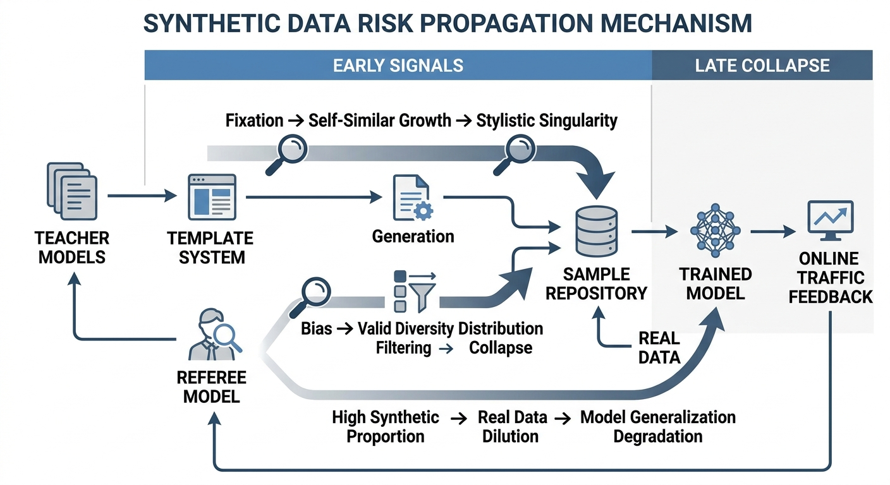
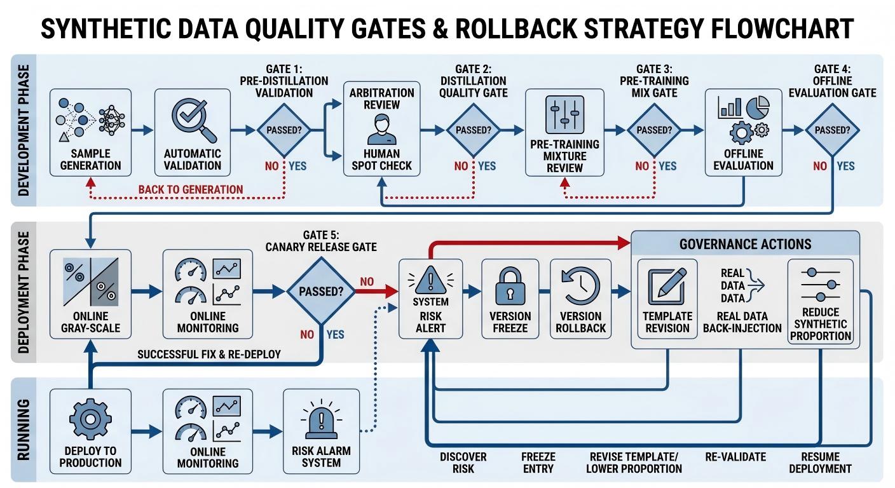

# Chapter 17: Synthetic Data Quality Control and Model Collapse

## Abstract

Synthetic data delivers productivity gains, long-tail coverage, and reduced annotation costs, yet its strong self-reinforcing properties can ultimately erode model capability. When generators, judges, template systems, and trainers are coupled into a closed loop, the sample space becomes increasingly driven by the system's internal preferences rather than by the real world, ultimately triggering model collapse—defined in this chapter as the gradual capability degradation common in engineering practice: a model that increasingly resembles its own generated data and decreasingly resembles the real world. Rather than rejecting synthetic data outright, this chapter addresses a governance imperative: how to keep synthetic data as a source of gain and prevent it from becoming a risk amplifier. Six dimensions are examined: (1) the mechanism by which model self-bootstrapping yields simultaneous benefits and risks, explaining why early results nearly always appear positive and why closed loops progressively narrow; (2) the formation pathways of stylistic uniformity, knowledge drift, and error amplification, along with early signals of model collapse in long-tail scenarios and the divergence between offline stability and online volatility; (3) attribution of risk roots to diversity decay from overly narrow data loops, judge bias, template rigidity, growing sample self-similarity, and excessively high synthetic ratios; (4) detection metrics including distributional divergence, repetition rate, perplexity, and evaluation degradation, paired with synthetic-ratio gradient experiments and ablation designs; (5) risk gates and rollback procedures including synthetic-ratio caps, freeze strategies, real-data infusion, version rollback, and template revision; and (6) post-mortems on question-bank and customer-service corpora, with an on-deployment checklist to institutionalize governance red lines. The conclusion is that the key to synthetic data governance lies in continuously identifying when it supplements reality versus when it replaces reality, and maintaining the real-distribution boundary through metrics and gates that can trigger governance actions.


When teams begin using synthetic data at scale, the first sensation is typically one of efficiency dividends: data production accelerates, long-tail coverage broadens, annotation costs drop visibly, and sample structure becomes easier to standardize. These advantages have rapidly made synthetic data one of the core infrastructure components of modern model engineering (Tan et al. 2024; Long et al. 2024). But precisely because synthetic data appears efficient, controllable, and scalable, teams can easily hand increasing training responsibility to the synthetic data pipeline—without adequate governance—until a tool intended to accelerate model evolution ends up eroding model capability itself.

The central focus of this chapter is not a blanket rejection of synthetic data, but rather an explanation of a problem with genuine engineering relevance: why synthetic data can simultaneously deliver benefits while progressively creating risks such as stylistic uniformity, knowledge drift, growing sample self-similarity, training instability, and model collapse. The "model collapse" referred to here (Shumailov et al. 2024) is not limited to the extreme distributional degradation described in theory; it also encompasses the slower but persistent capability decay more common in engineering practice—a model that increasingly resembles its own generated data and decreasingly resembles the real world, gradually losing its ability to adapt to complex inputs, unfamiliar styles, and real business fluctuations even while offline metrics appear acceptable.

For teams responsible for synthetic data generation, quality control, training mixture, and deployment governance, the truly important question is not the binary choice of "whether to use synthetic data," but the governance question of "how to keep synthetic data as a source of gain and prevent it from becoming a risk amplifier." Accordingly, this chapter systematically discusses the engineering methods for synthetic data governance across six dimensions: risk formation mechanisms, detection metrics, controlled experiments, risk gates, rollback strategies, and representative case studies.

## Keywords

Synthetic data quality; model collapse; self-bootstrapping training; distribution drift; risk gates; rollback strategies

## Learning Objectives

- Explain the mechanism by which model self-bootstrapping yields simultaneous benefits and risks, and describe why an overly narrow generation–judge–training loop triggers stylistic uniformity, knowledge drift, and error amplification.
- Identify early signals of model collapse in long-tail scenarios and in the divergence between offline stability and online volatility, and trace these to diversity decay, judge bias, template rigidity, and excessive synthetic ratios.
- Establish detection metrics for distributional divergence, repetition rate, perplexity, and evaluation degradation, and design synthetic-ratio gradient experiments and ablation controls.
- Design risk gates and rollback procedures—including synthetic-ratio caps, model freezing, real-data infusion, version rollback, and template revision—to maintain the real-distribution boundary.

---

## 17.1 Why Synthetic Data Can Weaken Model Capability

Synthetic data is dangerous not because it is inherently low quality, but because it possesses a strong "self-reinforcing" property (Shumailov et al. 2024; Alemohammad et al. 2024): once the generation logic, evaluation logic, and training logic are coupled together, the system becomes progressively better at generating "data it likes," while not necessarily becoming better at handling real-world data. In other words, the way synthetic data erodes model capability usually cannot be attributed simply to a batch of obviously incorrect samples; the deeper cause is that the entire data loop gradually drifts away from the true task distribution.

For many teams, synthetic data initially plays the role of an "efficiency tool." It helps teams quickly expand sample sets, fill long-tail gaps, control format, and reduce annotation costs, while shifting training data production from a labor-intensive process to a more scalable automated pipeline. At this stage, synthetic data almost invariably presents a positive image: faster, cheaper, more uniform, and easier to show short-term metric improvements. Teams therefore naturally develop the intuition that as long as the quality of synthetic data generation is high enough, scaling up is the obviously correct path.

The real problem, however, is that once synthetic data exceeds its role as a purely "external supplement," it tends to become the dominant distributional shaping force within the system. As soon as the generator, judge (Zheng et al. 2023; Liu et al. 2023), template system, and trainer form a tight closed loop, the sample space becomes increasingly driven by the system's internal preferences rather than primarily by the real world (Shumailov et al. 2024). The model appears to be continuously absorbing "new data," but in practice it repeatedly absorbs "different surface variants of the same generation logic." From an engineering standpoint, the highest risk in this process is not that it immediately creates large numbers of obvious errors; rather, it slowly rewrites the model's adaptation boundaries, making the model increasingly adept at handling problems defined by the system while becoming progressively less adept at handling problems in the real world that have not yet been templated, standardized, or processed by the system.

### Why Model Self-Bootstrapping Yields Simultaneous Benefits and Risks

The most attractive feature of model self-bootstrapping (Wang et al. 2023; Honovich et al. 2023; Xu et al. 2024) is that it allows the system to produce more training resources using its existing capabilities. A stronger teacher model can generate samples, supplement annotations, cover long-tail cases, simulate difficult examples (Wang et al. 2023; Xu et al. 2024), and even participate in quality review (Zheng et al. 2023). This appears to free teams from the constraints of real-data acquisition speed, enabling continuous expansion of training material through the model itself. This is the source of bootstrapping's benefits: it shifts data production from human-led to model-led, dramatically improving throughput efficiency.

For many teams, the true appeal of bootstrapping lies not only in "being able to produce more data," but also in how it changes the rhythm of data production. Previously, a single sample had a long pipeline from requirement specification, task decomposition, manual authoring, review, and acceptance to final ingestion, with capacity easily bottlenecked at the human stage. Once bootstrapping is running, the entire system suddenly feels as though a machine capable of continuous supply has been added. Templates can be rapidly expanded, long-tail tasks can have a first version generated by the teacher, and boundary scenarios that were previously too costly to cover can be simulated by the model first. For teams in a rapid scaling phase, this capacity release is nearly immediate.

More importantly, bootstrapping produces not only quantity but also typically a surface-level "neatness." Model-generated data tends to have more uniform formatting, more regular output style, and more easily aligned fields, and much of the noise and inconsistency common in human-annotated data temporarily decreases. For the training system, such data is very "easy to feed"—it allows the model to see stable supervision signals more quickly and makes improvements easier to reflect in offline metrics. For these reasons, many teams develop an almost instinctive trust in bootstrapping after first experiencing its benefits: since it is fast, neat, and appears effective, continuing to increase its proportion is the natural next step.

But risk arises precisely from this. Bootstrapping means the model is both a producer and a source of capability for what is being trained. Once the generation side harbors stylistic preferences, knowledge gaps, or error patterns, these problems are systematically copied into the training set and then reflected more stably in the next model after the following round of training. The system becomes increasingly familiar with "data it has previously generated" while becoming less familiar with the expressions of real users, real-environment noise, and the chaotic boundaries of real tasks. The reason benefits and risks coexist is fundamentally that bootstrapping simultaneously increases data production efficiency and bias propagation efficiency.

The most important thing to guard against here is not that a single sample is wrong; more serious is when errors begin to exhibit the characteristic of "appearing in batches, reappearing repeatedly, and looking increasingly correct." If a teacher model habitually states conclusions with excessive confidence when information is insufficient, this tendency may first appear in a small number of generated samples; but once those samples are incorporated into the training set at scale, the next-generation student model will learn this expression more naturally and stably (Shumailov et al. 2024). When this student subsequently participates in the next generation round, the bias is no longer just the teacher's minor habit—it gradually becomes the system's default style. The most troublesome aspect is precisely this: biases typically do not erupt suddenly but are reinforced incrementally with each loop iteration.

It is also worth noting that bootstrapping typically manifests as clearly positive returns in the early stages of a project. When real data is scarce and annotation costs are high, synthetic data can almost always quickly fill coverage gaps and improve format consistency (Tan et al. 2024; Wang et al. 2023). However, as the synthetic ratio increases, the system's gains shift from "supplementing supervision" to "replacing reality," at which point the risk is no longer occasional but structural. Many teams misjudge the situation precisely at this inflection point: they see the early gains but overlook the degradation mechanism that sets in as the loop later narrows.

This inflection point is not always obvious. It does not appear as "suddenly ineffective from today," but more commonly manifests as: offline metrics still look acceptable, sample production efficiency keeps rising, the system appears smooth internally, yet after deployment a kind of inexplicable rigidity gradually emerges. The model has become more adept at answering according to templates, yet its response to the vague, jump-cutting, emotional, and inconsistent inputs of real users deteriorates; it has become more capable of writing one type of "acceptable answer," yet in complex boundary scenarios it increasingly rarely produces truly open-ended judgment. If the team at this point continues interpreting every offline improvement as evidence that bootstrapping remains healthy, it will easily keep adding more until the entire training distribution looks more and more like the system itself rather than the real world.

Thus, the benefits and risks of bootstrapping have never been sequential—they coexist from day one. Early benefits are simply more visible while risks are more hidden; later on, risks gradually accumulate into structural problems while benefits may no longer scale as they did early on. What teams truly need to do is not simply answer "is bootstrapping good or bad," but to continually watch for: when it is still supplementing reality, and when it has already begun replacing reality; when it is amplifying effective supervision, and when it is amplifying internal preferences. Only by keeping this boundary clearly in view can bootstrapping avoid gradually becoming a bias amplifier instead of an accelerator.

### Why Self-Bootstrapping Almost Always Appears Effective in Early Stages

Empirically, model self-bootstrapping almost always yields positive results in the early stages of a project, and this is not mysterious. The first reason is that many training systems at their initial stage are least in need of the hardest, most realistic, and most complex data; sufficiently plentiful, sufficiently neat, and sufficiently trainable supervision signals are the more urgent need at that time. Synthetic data at this stage is precisely capable of quickly filling sample gaps, allowing the training process to more easily enter a state of "having feedback, being able to converge, being able to optimize." For tasks that are extremely data-scarce, lack long-tail cases, and suffer from severe format inconsistency, the benefits brought by synthetic samples can appear quite significant.

When many projects first launch, the primary data-layer problem is not "inability to handle advanced questions," but rather more commonly "insufficient even basic trainable samples." Task definitions are still evolving, manual specifications are not yet fully unified, real data volume is small, and quality variation is high. In these circumstances, having a batch of relatively well-organized samples with clear task boundaries and aligned fields almost invariably leads to immediate and visible model improvement. Bootstrapping hits the most painful point precisely here: it does not necessarily bring the most realistic data, but it brings the type of data most easily absorbed by the training system. Early positive results are therefore almost predictable.

Second, early-stage task objectives are often relatively coarse. Teams are more concerned with "can the model roughly get it right" and less concerned with "does the model truly retain open adaptability to the real world." Under this objective function, synthetic data is naturally favored, because it easily provides clear formal supervision and easily uses templates and rules to shape "answers that look correct." Early gains, therefore, cannot certify that synthetic data is already safely governed; they often only indicate that the model is still in a phase of "needing more explicit training signals."

In other words, many metrics that can be rapidly elevated in early project stages do not necessarily indicate that the model has learned the complexity of the real world; it is more likely that the model has simply transitioned from "almost no stable supervision" to "beginning to have reasonably decent supervision." At this stage, the advantages of synthetic data are amplified very clearly. It is like paving a neat layer of road on land that was originally nearly empty—even if this road does not fully lead to the real world, it is enough to get the system running first. What teams see at this point—that the model is genuinely improving—is not an incorrect observation; but if that is further interpreted as "as long as we keep adding synthetic data, the system will keep improving at the same rate," problems begin.

Another reason is that early evaluations themselves are also easier to skew toward what synthetic data excels at. When a project is just starting, evaluation sets tend to be relatively "clean," with limited task types, insufficiently varied input expressions, and insufficient systematic coverage of abnormal cases and complex boundary conditions. Model progress on such evaluations further reinforces team confidence in bootstrapping. Yet there is an easily overlooked fact: if training data and evaluation data are both converging toward the same "standardized expression," positive results will of course appear more readily, but this does not automatically mean the gap between the system and the real environment is shrinking.

The problem is that many teams misread the positive performance of this phase as a universal law. They see the model improve due to synthetic samples and then further increase the synthetic ratio, reduce real-data investment, and shrink the scope of manual verification, until the mechanism originally intended as an accelerator gradually becomes the dominant force shaping the training distribution. That is, the early success of bootstrapping easily becomes the source of the system's later overconfidence.

The danger of this misjudgment is not that teams engage in bootstrapping, but that they begin treating early gains as a curve that can be extrapolated indefinitely. Early bootstrapping being effective is often simply because the system happens to be in a phase of "lacking clear supervision"; but once the system enters a finer optimization interval, the question becomes "how to face real noise," "how to cover complex conflicts," and "how to maintain boundaries that are difficult to templatize." These are precisely where bootstrapping is most easily able to approximate the appearance, but least easily able to get at the substance. Continuing to follow early-stage thinking and primarily feeding data from model to model, surface-level improvements may persist for a period, yet true adaptability may already be declining.

So when we say bootstrapping is almost always effective early on, this is not to praise it as "naturally safe"—the point is to remind teams: early gains are inherently easy to obtain, and therefore should be interpreted with restraint. They indicate that this mechanism has helped the system fill a gap at the current stage, but do not automatically indicate that it is suitable for long-term domination of the training distribution. The more teams taste success early on, the earlier they should establish mechanisms for real-data reflow, manual sampling inspection, and boundary-scenario calibration. Because once teams focus only on near-term improvements, they easily mistake stage-specific positive returns for a long-term optimal strategy.

### Why Self-Bootstrapping Systems Progressively Become Closed Systems

The fundamental risk of bootstrapping lies not in "the model giving itself tasks" per se, but in how this process extremely easily becomes an increasingly closed system (Shumailov et al. 2024; Gerstgrasser et al. 2024). The teacher model generates samples according to existing preferences; the judge model filters out candidates that do not conform to established standards; the template system further reinforces consistency in expression and structure; and the student model continues learning on this data. In the next generation round, the new model reproduces these characteristics with even higher consistency. Through such cycles, the "internal consensus" within the system grows ever stronger, while the distance from the real world potentially grows ever larger.

Closure does not mean the system stops changing—quite the contrary, it may be changing rapidly, but those changes increasingly occur within an internal standard. The model learns what kind of expression tends to be retained, what kind of structure most easily passes the judge, and what kind of answer best conforms to templates, so the next round of generation naturally tends toward these forms. Over time, the system gradually departs from the path of being shaped by real-world diversity and instead polishes itself around a set of preferences it has already formed. It is still learning, but the object of learning is increasingly "things it has already approved."

This closure has a very typical manifestation: the model becomes more and more like a student who excels on internal examinations. It is familiar with question types, familiar with expressions, familiar with scoring standards, and familiar with what kind of answers most easily pass the judge. But it may not be equally familiar with non-standard inputs in reality, noisy expressions from real users, and incomplete information in complex contexts. The system has not stopped learning—it is simply increasingly learning from itself.

Worse, this closure often comes with an illusion: the internal consistency of the system grows stronger, and teams begin to feel the model is "increasingly stable." From an internal perspective, this judgment is not entirely wrong—sample formats have become more uniform, output style has become more consistent, and judging standards have become more cohesive. The problem is that this stability sometimes applies only to the internal environment and does not represent stability in the real environment. The model is indeed becoming more like a high-scorer within self-constructed data, but its capability in facing the real world may not be growing in parallel, and in some areas may be quietly weakening.

Closed systems also have one very hidden characteristic: they become increasingly difficult to perceive their own drift. Because generation, filtering, evaluation, and retraining all occur within the same logic, many biases are not exposed in time. If the teacher favors a certain tone, the judge also prefers that tone, the template further amplifies that tone, and the student learns it to then generate with even greater stability—that tone will persist. The entire chain appears to have no errors, even becoming increasingly neat, but if this tone happens to be unnatural to real users or appears overconfident in genuinely high-risk scenarios, the system itself may not proactively flag it. Because for a closed system, this has become "part of the standard answer."

Therefore, what teams truly need to watch is not whether "some bad samples have appeared," but whether "the system has already begun using its own preferences to replace the constraints of the real world." As long as this substitution process continues, even if each individual link appears reasonable, the overall system may gradually drift away from real task requirements over time.

What is truly dangerous is not that a few noisy samples slipped into one bootstrapping run; what matters is that the system increasingly rarely encounters things that will not go along with its internal preferences. Real users do not always speak according to templates; real business does not always provide clearly bounded inputs; many tasks inherently carry confusion, conflicts, missing information, and expression jumps. If these elements become increasingly underrepresented in the training distribution while internally generated "neat samples" increase, the system is superficially becoming stronger while actually losing its tolerance for open environments.

Thus, self-bootstrapping systems progressively become closed systems not because a particular link suddenly fails, but because the entire chain silently rewards the same internal consistency. As long as this consistency persistently exceeds proximity to the real world, the system increasingly resembles a structure that excels at repeating itself, optimizing itself, and confirming itself. To break this closed loop, what teams truly need to introduce is not more internal generation capacity; the more critical action is to continuously pull the external world back in: real user data, non-standard inputs, manual validation, cross-style samples, failure case reflow, and boundary scenario re-review. Only with these elements continuously entering the system can bootstrapping avoid sliding all the way into a self-reinforcing closed loop.

### Mechanisms Behind Stylistic Uniformity, Knowledge Drift, and Error Amplification

What synthetic data most often first produces is not "obvious errors" but "increasing resemblance to one thing." Stylistic uniformity is not simply sentence-pattern repetition; it also includes samples that converge toward the same expression mode, argumentation structure, information sequencing, refusal pattern, and tone boundaries (Shumailov et al. 2024). When large numbers of samples come from similar teachers, similar templates, and similar judge standards, what the model learns is no longer "how to cover more real variations" but instead "how to resemble this production system more." Ultimately, the model performs smoothly and uniformly on offline data yet appears rigid, conservative, or formulaic in real environments.

This change is easy to overlook because in the early stages it is often misread as "more stable quality." From an internal perspective, samples are neater, outputs more standardized, wording more consistent, and much of what was previously messy has been smoothed out; training and evaluation both feel smoother. The problem is that the real world is inherently full of irregularities. Users speak in non-linear ways, omit premises, bring emotion, mix multiple needs into one request, and express the same thing in all manner of non-standard ways. If the model is shaped long-term on one type of "look-alike" sample, it will naturally become increasingly adept at handling this internal style, yet may no longer retain the elasticity to face genuinely messy real-world inputs.

Knowledge drift (Shumailov et al. 2024; Torralba & Efros 2011; Koh et al. 2021) is more insidious. It does not necessarily manifest as a sudden rise in factual error rates, but more commonly as the model beginning to favor certain explanatory frameworks, certain causal paths, or certain approaches to information selection. For example, the model may increasingly tend to give "canonical but abstract" answers rather than grounding its responses in specific constraints of real scenarios; or it may progressively reinforce the knowledge organization habits of the teacher model while weakening its adaptation to rare but important real-distribution variants. This drift may not significantly affect average metrics in the short term, but will progressively alter the model's knowledge boundaries.

The most problematic aspect here is that drift does not initially make the model "obviously worse"—it first makes it "increasingly tilted toward one approach." For example, a model that previously had several different analytical paths available for complex problems may, after extensive training on same-standard synthetic data, begin habitually organizing its answers first in the most common, most templatized, most judge-friendly way. On the surface, this type of answer is not necessarily wrong—it might even sound smoother and more like a standard answer. But once the task enters scenarios requiring specific convergence, distinguishing exceptions, or temporarily adjusting strategy based on context, the cost of this preference becomes apparent. The model's problem may not be a lack of certain knowledge points, but an increasing inability to retrieve that knowledge in the appropriate way.

The mechanism of error amplification (Shumailov et al. 2024) is the most important to guard against, because it is explicitly cumulative. A localized error in a synthetic sample, if standing alone, may not cause major problems; but if that error conforms to judge preferences, can pass template checks, and can be imitated by the next-round model, it transforms from a one-time accidental error into a systematic error pattern. The most frightening aspect of error amplification is not the error itself, but that it will increasingly resemble "correct practice" as it scales with data volume.

Often the truly dangerous errors are not the kind that are obviously wrong at a glance, but rather the "half-wrong" kind that "also seems plausible." For example, suppose a teacher model habitually adds a bit of reasonable gap-filling when information is insufficient—this gap-filling may not be particularly conspicuous in an individual sample. But if the judge also prefers this sense of "completeness," and the template further encourages this "no blank spaces in answers" style, the student model in the next round very easily learns this habit as a default strategy. When this student then participates in the next generation round, what was originally just a minor teacher habit slowly becomes a common tendency of the entire system. What the team ultimately sees is no longer one or two suspicious answers, but a problem pattern that has become increasingly stable, increasingly natural, and increasingly difficult to flag in the moment.

So the truly alarming aspect of these three phenomena is not that they immediately break the system, but that they all carry the characteristic of "gradually becoming normal." Stylistic uniformity gets read as stability; knowledge drift gets read as maturity; error amplification gets read as consistency. By the time teams truly realize the distance between the model and the real world has widened, the problem is often too deep to be pulled back easily by patching a few samples or adjusting a few templates.

### Stylistic Uniformity Is Not Just "Writing Alike"

When many teams discuss stylistic uniformity, they only notice repetition at the vocabulary, sentence pattern, and tone level, but truly dangerous "style" extends far beyond surface linguistic style. A model's style also includes how it organizes information, how it delivers conclusions, how it sequences explanations, how it handles uncertainty, and how it uses limiting conditions. In other words, stylistic uniformity is actually a deeper form of behavioral uniformity.

This type of uniformity is difficult to detect promptly because surface diversity can easily create the illusion of "seems fairly rich." The model may use different words and adjust some sentence patterns, appearing not to be mechanically repeating; yet if every time it follows nearly the same structure—beginning with a layer of generalized background, listing several common factors, and landing on a standardized conclusion—it is essentially repeating the same coping method. What users genuinely experience is not only whether vocabulary has changed, but whether this system always views problems through the same interpretive framework.

For example, a system may appear to vary its wording considerably, but answers always follow the same logical progression: first a generalized background, then several reasons, then a standardized conclusion. Or it may adopt similar conservative strategies for all ambiguous questions, or use nearly fixed refusal templates for all risk questions. Such a model still has linguistic variety on the surface but has formed a highly consistent behavioral style in substance. Once in a real environment, this style easily appears "correct but not on target" or "canonical but not resolving the problem."

Many real-world tasks inherently require the model to switch its handling mode based on context. When users just want to know what to do next, the most important thing is speed and precision—it is inappropriate to lay out a background layer first; when users bring a complex clause and ask about specific liability, the model needs to bind the conclusion to its conditions rather than first doing a round of generalized explanation; when users are anxious, the system may need to first acknowledge the problem and then add the explanation. If the model tends to respond with the same response rhythm regardless of the task, it will likely always seem "reasonable" but not always "useful."

Thus, stylistic collapse cannot be understood solely through surface repetition rate. More precisely, it is a dual compression of the expressive space and the decision space. The model is not completely unable to say other things—it is simply increasingly unaccustomed to understanding and responding to problems in other ways.

This is also why stylistic uniformity is especially worth watching in high-risk scenarios. What is being compressed here is not just "is the expression nice to read"—it also includes "how to maintain boundaries," "what to say when uncertain," and "when to ask first versus when to answer first"—all of which are critically important actions. Once a model is shaped long-term in a single style, it increasingly tends to use its most familiar approach to cover more and more problems. The result is that tasks that should be handled differently all gradually look to the model like "the way I always answer this." At that point, what appeared to be a stylistic problem has actually become a capability problem.

### Knowledge Drift Often First Appears in "How Things Are Explained"

The most insidious aspect of knowledge drift is that it often does not first drift in factual claims but rather in explanation methods and organizational approaches. A model may still be able to give superficially correct conclusions, but it begins increasingly preferring a fixed analytical path, ignoring critical conditions, contextual constraints, or exceptional circumstances in real scenarios. In other words, the model's "knowledge surface" may temporarily remain intact, yet its manner of using knowledge has already begun to change.

This type of drift is difficult to detect because ordinary evaluations are more easily able to check "is the conclusion correct" but less able to check "what framework did it follow to reach this conclusion." If test questions are sufficiently standard and answer boundaries are sufficiently clear, then even if the model has already begun relying on an oversimplified explanatory approach, it may still arrive at correct answers. Teams will see metrics staying basically stable—they may even feel the model is answering more fluently and skillfully. But this fluency is sometimes only fluency with a fixed explanatory routine, not necessarily adaptation to the true complexity of real tasks.

This type of drift is dangerous because it is difficult to detect promptly in ordinary evaluations (Geirhos et al. 2020; Ribeiro et al. 2020). As long as evaluation questions are sufficiently standard and close to existing templates, the model may still answer correctly; but once questions enter complex real scenarios requiring trade-offs between multiple incomplete conditions or specific case-level analysis convergence, a drifted model will noticeably manifest the pattern of "answering fluently but answering off-target." This phenomenon is especially prone to appearing in tasks with high contextual dependence, such as legal, customer service, educational, and medical advisory domains.

For example, in a legal scenario, the model may still know the relevant provisions, but increasingly habitually provides general explanations first, then appends "specific judgment requires the actual situation," without truly bringing the specific conditions into the analysis. On the surface, it has not said anything wrong and even appears quite cautious; but for the user's actual question, this answer has already begun to miss the point. Similarly, in a customer service scenario, the model may increasingly prefer to route problems into a few common processes, with the result that when facing situations that differ just slightly but actually require a different handling path, it appears very "well-versed" yet always circles around the real critical point.

Therefore, knowledge drift cannot be detected only through factual right and wrong; attention must also be paid to whether the model is increasingly favoring a simplified-reality explanatory framework. In many cases, what is truly being eroded is not the knowledge inventory but the knowledge dispatch method.

From an engineering standpoint, this point is especially important, because knowledge inventory problems are usually relatively fixable through supplementing data, adding retrieval, and performing validation; but once the dispatch method begins to drift, the problem goes deeper. The model's issue may not manifest as "knowing less," but more often as "increasingly habituating to how it understands problems, how it organizes knowledge, and what conditions it ignores." Once this habit forms, it permeates many tasks. What you see on the surface may be a legal answer not grounded enough in the case facts, a customer service answer not grounded enough in process flow, or an educational explanation not grounded enough in the student's current level—underneath all of these may be the same type of drift: the model increasingly uses its familiar explanatory framework to replace the complex constraints of real situations.

Therefore, what knowledge drift should most prioritize monitoring is often not limited to the knowledge points themselves; it should also include whether the model is becoming increasingly "lazy" when explaining. Whether it increasingly prefers to give abstract summaries first and then append a conservative disclaimer; whether it decreasingly handles exceptional conditions; whether it increasingly follows familiar causal paths; whether it decreasingly adjusts the analytical sequence based on specific context. As long as these signs begin to strengthen—even if factual accuracy on test questions has not dropped noticeably—teams should treat this as a genuine risk signal. Because this typically indicates the model has not stopped learning, but is contracting toward a neater and narrower mode of knowledge use.

### Why Error Amplification Is More Dangerous Than Single-Instance Errors

The harm from a single error is typically local, limited, and correctable; the harm from error amplification is structural. A single erroneous sample in a system, if only occasionally mixed into the training set, may not cause serious consequences; but if that error happens to be consistent with template style, consistent with judge preferences, and consistent with the model's current distribution, it obtains a higher retention probability than ordinary errors. Once retained, it is not only learned by the model but will reappear in the next round of generation in a more natural, more stable, and harder-to-detect form.

This is why errors in synthetic data systems are not necessarily "conspicuous false information"—more often they manifest as a bias, a conclusion tendency, an explanatory shortcut, or a habit of omitting key conditions that is repeatedly copied. As this pattern continuously enters training, the model increasingly believes it, increasingly relies on it, and ultimately it transforms from an error into a system default.

In this sense, error amplification is not a local bug event; it is fundamentally a distribution contamination mechanism (Shumailov et al. 2024). Teams that only watch for "any obvious nonsense" often easily miss what is truly dangerous. What truly needs governance are the error patterns that can stably reproduce within the system.

### The Earliest Signals of Model Collapse in Engineering

Model collapse in engineering practice (Shumailov et al. 2024) typically does not manifest as "the model suddenly completely breaking down," but emerges slowly through a series of small yet persistent signals. The earliest to appear are usually not a cliff-drop in primary metrics but rather the beginning of narrowing in sample distribution and behavioral boundaries. For example, the model's robustness to different expression styles declines, it more easily produces conservative answers to unfamiliar input forms, it becomes more sensitive to small perturbations, or in open-ended tasks it noticeably tends to repeat existing patterns.

Another early signal is "offline stability, online volatility"—that is, the model still performs well on standard evaluation sets, fixed-template tasks, or legacy validation sets, but real online feedback begins showing problems such as stylistic rigidity, failure to address the question, overconfidence, and homogenized output. These phenomena are dangerous precisely because they are difficult to capture with traditional average metrics. The system appears to still be "normally improving," but true adaptive capability has already begun to decline.

There is another frequently overlooked signal: strengthening of the "sense of familiarity" in manual reviews. Experienced reviewers often first feel that samples, while not necessarily incorrect, increasingly seem to have grown from the same mold; answers, while increasingly neat, increasingly rarely give the impression that "this is a genuine response to this question." This subjective signal is not precise, yet it commonly precedes quantitative degradation, and therefore deserves to be retained as part of governance early warning.

### Why Early Signals Most Often First Appear in Long-Tail Scenarios

Model collapse most often does not first appear in high-frequency main tasks but instead appears first in long-tail scenarios, boundary scenarios, and non-standard scenarios (Shumailov et al. 2024; Koh et al. 2021). This is because high-frequency main tasks are usually most easily covered by synthetic data, most easily standardized by templates and rules, and therefore the model appears increasingly proficient on these tasks. Conversely, long-tail scenarios with diverse expression, complex context, ambiguous constraints, and high real-world noise are precisely the portions most easily diluted by synthetic systems.

Thus, the earliest collapse signals commonly manifest as: the model is very stable on "familiar questions" but noticeably more conservative on "slightly less familiar questions"; it performs well with standard phrasing but noticeably degrades with colloquial, fragmented, or chaotic input; it scores normally on templatized validation sets but frequently loses specificity in real complex traffic. This difference does not mean the model as a whole has already collapsed, but it indicates the model's capability boundaries are beginning to contract, and it is progressively losing tolerance for the non-standard world.

From a governance perspective, this is very important because it means teams cannot rely only on the primary validation set. If only the primary validation set is examined, the system often presents the appearance of "no problems" for a long time; only by simultaneously incorporating long-tail sets, hard sets, cross-domain sets, and low-quality data sets into monitoring can early collapse signals be more readily captured.

### Why "Offline Stability, Online Volatility" Is Especially Dangerous

"Offline stability, online volatility" (Koh et al. 2021; Ribeiro et al. 2020) warrants alertness not merely because two sets of metrics are inconsistent, but because this inconsistency often indicates the model is quietly drifting away from real tasks. Offline evaluation sets are inherently a world that has been organized, named, and partitioned. Their boundaries are relatively clear, noise is relatively controlled, and evaluation standards are usually fairly fixed. The online environment is not like this. Real users do not ask questions the way data engineers would ideally prefer; they do not proactively complete context; they do not guarantee standardized expression, singular objectives, or clear intent. If a model is increasingly "stable" in the former world while increasingly "adrift" in the latter, this indicates that the stability it has learned does not genuinely extend to the business environment.

What makes this more troublesome is that this divergence is typically not glaring at first. What teams initially see is often very attractive-looking offline curves: certain benchmark scores steadily rising, volatility shrinking, error rates declining, and output formats becoming more uniform. At first glance, all of these look like signals of system maturity. But if simultaneously online behavior shows increasingly empty answers, increasingly mechanical refusals, worsening handling of long-tail questions, and declining scenario fit, then the offline "smoothness" may actually be masking real problems. Because sometimes the model has not genuinely become stronger—it has simply become better at performing like a "good student" in a familiar rule-governed environment.

Such problems are especially prone to occurring in systems with a high proportion of synthetic data. The advantages of synthetic data are clear: fast generation speed, broad coverage, neat structure, easy quality control, and convenient targeted capability reinforcement. But its risks come precisely from those advantages. Data that is too neat easily makes the model accustomed to receiving already-organized questions; goals that are too explicit easily make the model accustomed to making decisions only in tasks with clear boundaries; expressions that are too clean gradually erode the model's capacity to handle real-world noise. Over time, the model forms a stability that is superficially reliable but actually brittle—it answers increasingly smoothly in standard environments yet has decreasing elasticity in real environments.

This "post-conditioning stability" easily creates the illusion that the model has already developed sufficient robustness. This is not the case. True robustness is not limited to not making errors when facing familiar inputs; it is more fundamentally demonstrated by the ability to maintain basic judgment and reasonable response even when facing incomplete, irregular, or even somewhat chaotic inputs (Geirhos et al. 2020; Koh et al. 2021). The problem with many systems is that during training they continuously encounter samples that are beautifully formatted, have clear objectives, and are evaluation-friendly, thereby gradually losing tolerance for ambiguous scenarios. When real users arrive with questions full of omissions, jumps, and background noise, the model can still output a coherent passage but can no longer truly grasp the core of the question.

From a business perspective, this phenomenon is especially dangerous because it is not just "some samples answered incorrectly"—it also means the working assumptions between the system and users are beginning to diverge. The offline world assumes "questions have been defined"; the online world often faces "the question itself also needs to be understood and clarified." If the model becomes increasingly adept at the former and increasingly unsuited to the latter, its capabilities exhibit a structural shift. If the team at this point is still focused only on offline metrics, it will tend to explain online volatility as occasional noise, user behavior changes, increased traffic difficulty, or even attribute it to product-side changes, overlooking the most fundamental fact: the model is moving increasingly further from the real world.

Therefore, mature teams are typically very restrained in their interpretation of offline stability. Offline stability is of course important—without it, the system has no basic controllability—but it is never a sufficient condition. Truly experienced teams treat offline stability as a ticket, not a destination. What they are more concerned with is whether offline stability is accompanied by online consistency, and whether it holds across different traffic segments, different task types, and different user groups. Once a persistent and reproducible divergence between offline and online is found, it should immediately be treated as a governance signal rather than dismissed with "today's user questions are harder."

Going deeper, "offline stability, online volatility" is also dangerous because it indicates that the team's feedback mechanism may have already failed. A system that can only prove itself in an examination hall it defined itself, yet cannot continuously deliver value in real use, easily falls into a state of "metrically correct, directionally wrong." What is truly frightening is not a single wave of volatility; it is that the system has already begun rewarding itself with the wrong feedback without anyone timely correcting course.

### Why Human Perception Still Matters

In today's data governance frameworks, automation has become almost a default pursuit. Many teams are accustomed to trusting rules, metrics, dashboards, and alert thresholds, believing that as long as monitoring is sufficiently granular, human judgment will eventually be replaced by systematized processes. This reasoning holds in many areas, but for problems like model collapse, distributional drift, and synthetic data degradation, things are often not so simple. In many cases, the first to detect a problem is not a report—it is a person.

The reason is straightforward. Early model degradation rarely appears as "a sudden explosion in error rates," but instead first manifests as a qualitative change. Answers are still coherent, structures are still complete, formats are even more standardized than before, yet something feels off. The system increasingly resembles one that writes standard answers, but decreasingly resembles one that is genuinely responding to real questions. It may no longer commit obvious low-level errors but begins to feel vacant, conservative, and over-generalized. These changes are difficult to show up immediately in one or two fixed metrics, but an experienced person typically senses them immediately.

This human perception is not purely experiential judgment. Underlying it is a holistic faculty of judgment formed through long-term exposure to real samples. Experienced reviewers, product team members, or annotation leads may not immediately arrive at a quantifiable conclusion, but they can acutely perceive that the model's "manner of speaking" has changed. Previous answers may not have been polished yet had specificity; current answers may be smoother yet lack the force to move forward with the question. Previously the model would try to understand the user in complex scenarios; now it more easily slides toward formulaic expression, as if completing a task in form while lacking the feel of truly solving the user's problem.

This difference is precisely what many automated metrics temporarily cannot capture. Automated metrics are generally better at identifying explicit deviations—format errors, factual conflicts, keyword absence, answer length anomalies. But what commonly appears in early model collapse is a "mild degradation": answers are still polite, still complete, even still correct, but noticeably more templated, increasingly resembling results assembled from a familiar set of patterns. The feeling it gives is not that it has broken down, but that it has "become dull." And this "dullness" often precedes hard errors.

Especially after large amounts of synthetic data have participated in training, the importance of human perception rises further. Synthetic samples naturally tend to bring a kind of stylistic convergence: neater sentence patterns, more explicit logic, clearer role boundaries, expressions more like "standard training material." When the model learns long-term in such a distribution, what it most easily first loses is often not grammatical capability but that sense of closeness when facing real, irregular inputs. The reason human reviewers can detect this relatively early is that they do not only check "whether something was answered," but feel "whether the answer resembles a response from someone who genuinely understands the scenario."

Therefore, human perception should not be treated as a "not scientific enough" supplementary opinion, nor should it be excluded from the governance system simply because it is difficult to quantify. On the contrary, it should be treated as a high-value weak signal. "Weak signal" does not mean it is unimportant—the point is that it appears early, takes ambiguous forms, and cannot directly serve as a final ruling, yet is very helpful for trend judgment. Many systemic problems are first "felt to be wrong" by humans, and only subsequently begin to manifest in metrics. If teams only trust quantitative anomalies that have already taken shape while ignoring these leading subjective perceptions, the problem has often already accumulated quite deeply by the time alarms truly go off.

A more prudent approach is not to use human perception to replace automated evaluation, but to institutionalize it. For example, document reviewers' subjective anomaly descriptions, perform clustering analysis, and observe whether similar feedback repeatedly appears; translate descriptions like "increasingly template-like," "increasingly divorced from the scenario," and "increasingly able to say the right empty words" into trackable phenomenon labels; then combine these labels with information such as online volatility, traffic segments, and changes in synthetic ratio as part of the early warning system. The value of doing so is not mechanically quantifying human impressions but acknowledging: at certain critical stages, humans often see the cracks before the reports do.

Ultimately, model governance can never be completed purely by computation. It equally requires manual review, user feedback, and long-term business observation. When the system begins increasingly resembling its own generated data and decreasingly resembling the real world it serves, the first to perceive this is often not the most sophisticated metric, but the person who has long been working with real samples.

### Why Synthetic Data Problems Often Do Not Immediately Surface

The most troublesome aspect of the risks from synthetic data is that they usually do not surface all at once upon deployment. Instead, they typically first deliver stage-specific gains and then push the costs into subsequent versions. Many teams, when first expanding their synthetic data ratio, see positive results: training resources are more plentiful, certain capability areas are more completely covered, and model performance on several benchmarks has improved. Teams naturally draw the judgment: this approach is effective and worth continuing to scale. The real hidden danger is buried precisely within this "initially truly effective" experience.

This is because synthetic data is not always harmful. In many phases, it genuinely fills gaps, expands coverage, strengthens specific capabilities, and even helps the model quickly establish certain behavioral patterns. The problem is not "using synthetic data" but that teams easily mistake stage-specific gains for long-term steady state and local improvements for system reliability. Seeing positive results in the first few training rounds often brings a strong path confirmation: since the model improved, the generation process, filtering logic, and validation mechanism must all be correct; since offline scores are still rising, expanding further should also be fine. Thus, real-sample collection is gradually compressed, manual inspection scope slowly shrinks, online anomalies are explained as temporary fluctuations, and the system's dependence on synthetic data grows ever deeper.

But risk does not suddenly emerge at some node. It is more like a slowly occurring drift. The model typically does not "suddenly lose an ability" on a given day, but through round after round of self-reinforcement gradually loses familiarity with the real world. Real users' expression habits, task noise, boundary ambiguity, and intent jumps—things that should continuously appear in training feedback—are diluted bit by bit as the proportion of synthetic samples rises. The model is still learning, but increasingly it is learning a world that has been organized, purified, and designed. It naturally becomes increasingly fluent in this world, but its adaptability to the real world may decline imperceptibly.

From a system dynamics perspective, this problem is slow to surface because it is not primarily caused by individual bad samples—the true root is the continuous contraction of distributional structure (Shumailov et al. 2024). An obviously wrong sample can usually be found and fixed quickly; but if every sample generated in each round "looks fine," only being increasingly similar, increasingly standardized, and increasingly evaluation-friendly, then this risk is very difficult to detect in local quality inspection. What you see is not a disaster scene but something more like a training world that is slowly narrowing. When the model truly begins showing obvious unfitness online, it typically means this narrowing has been accumulating for quite some time.

This is also why many teams have the illusion in retrospect: how did the problem appear so suddenly? In reality, problems are almost never sudden. It is just that all early signals were relatively mild and did not form those glaring red lights. Perhaps only some long-tail scenarios first deteriorated, perhaps answers only became more conservative, perhaps only a few complex questions became unstable. Individually, none were serious enough, and each could easily be explained as normal fluctuation. But lengthening the time horizon reveals that these phenomena did not occur randomly—they collectively point to one thing: the model has become increasingly dependent on the synthetic order it is familiar with, and its ability to face the real world is quietly draining away.

Another reason synthetic data problems are exposed with a delay is that they carry the appearance of "self-validating reasonableness." This is because many validation processes are themselves built near the synthetic logic. Whatever type of data the generator produces, the discriminator more easily becomes accustomed to that type; whatever form the filtering rules prefer, the samples that survive increasingly conform to that form; the trained model then performs well in offline evaluation precisely on tasks of similar style. This creates a seemingly closed positive feedback loop within the system: generation, filtering, training, and evaluation mutually support each other, with everything appearing to confirm this path has no problems. But once this loop becomes disconnected from the real external distribution, the more internally self-consistent it is, the greater the risk.

Therefore, one of the greatest pitfalls in synthetic data governance is waiting for problems to "obviously appear" before addressing them. When online metrics are significantly volatile, user complaints have increased substantially, and key task success rates have fallen, this usually already indicates that the system has developed a deep dependence on synthetic data. The cost of rollback at this point is high, because you need to not only adjust the data ratio but also rebuild sampling from real traffic, restart finer manual validation, and re-understand which capability improvements are genuine and which are merely false prosperity within a synthetic environment. In other words, the reason problems are hard to govern is not that they are invisible; what is truly troublesome is that they have already accumulated for a long time before becoming visible.

Precisely for this reason, mature teams do not interpret "no incidents so far" as "the mechanism is already safe." They are more concerned with whether the presence of real data in training is continuously declining, whether long-tail samples are being continuously diluted, whether manual inspection can still contact truly low-quality, truly difficult, and truly non-template-like problems, and whether online and offline remain sufficiently tightly coupled. Because the risk of synthetic data never comes only from some obviously wrong single incident—it also comes from the model gradually ceasing to adapt to the real world; once this inertia forms, it will not self-correct.

### Risk Accumulation Creates a "Delayed Illusion"

A major reason synthetic data problems are frequently underestimated is that they exhibit obvious delayed accumulation characteristics. The tens of thousands of samples added in the previous round may not immediately cause model degradation; the bias in a certain template version may not immediately show up in primary metrics; a slightly narrowed judge standard may in the short term even make quality appear more "stable." But these micro-changes, once stacked, will form a difficult-to-ignore overall trend after several rounds.

This latency creates a very dangerous illusion: teams feel "since the last ratio increase caused no problems, adding a bit more this time should also be fine"; "since the template has always been usable, continuing to reuse it is no problem"; "since offline metrics are still stable, the system is still healthy." In reality, many risks are accumulated precisely through this kind of seemingly reasonable series of small advances (Gerstgrasser et al. 2024). Only when online performance begins noticeably declining, sample repositories have already been contaminated, and the proportion of real data has already fallen too low do teams realize they have missed the optimal governance window.

Therefore, governing synthetic data cannot only focus on immediate feedback; trend feedback must also be monitored. A single observation often provides no answer, but the directional changes across multiple consecutive versions can reveal real problems. A mature system needs to monitor "whether it is slowly narrowing" rather than only monitoring "whether it suddenly became much worse this time."

### Why Rollback Costs Always Lag Behind Risk Exposure

Synthetic data systems also have a very realistic engineering problem: by the time the risk is truly recognized, it is often no longer easy to go back. Because once the system has long depended on synthetic data, the problem is not just "the model version has a bias"—it also encompasses the sample repository, template system, judge standards, training ratios, and even evaluation sets, all of which may have been affected to varying degrees. At that point, even if degradation is discovered, it is very difficult for teams to fully recover through simply rolling back one model version.

This is also why synthetic data governance must be front-loaded. It cannot wait until "results have obviously deteriorated" to address, because by then what needs to be paid is often no longer the cost of a single patch but the cost of rebuilding an entire pipeline. For many real teams, the most expensive element is never the generated data itself—what is truly costly is the time and organizational effort required to pull the entire system back toward the real world after the data system has already pulled the model training direction off course.

---

## 17.2 Risk Formation Mechanisms

Synthetic data risk is not triggered by any single point of failure; it is typically the combined result of an entire set of data generation, filtering, mixture, and validation mechanisms working together (Tan et al. 2024; Shumailov et al. 2024). What is truly dangerous is not a particular bad sample but the system beginning to stably produce a sample distribution that "looks decent but is actually increasingly narrow." When the data loop, judge logic, template structure, and training strategy mutually reinforce each other, risk evolves from local defects into systemic decay.

On the surface, risk formation may appear to be merely a superposition of several local problems: templates may be too rigid, judges may have preferences, generators may be too similar, and the training synthetic ratio may be too high. But viewed from a system perspective, these are not independent point-issues—they form a set of mutually reinforcing mechanisms. Template rigidity increases judge consistency; judge bias further strengthens the direction of sample filtering; the direction of sample filtering then influences the training distribution; and the trained model in turn influences the next round of generation. Risk therefore does not statically reside at any single link but is continuously reproduced throughout the entire loop.

Understanding risk formation mechanisms thus requires not asking "which link is most dangerous" but rather seeing clearly how these links collectively push the system toward distributional contraction, self-similarity growth, and decoupling from reality. If teams only fix one local link—for example, swapping in a stronger teacher model—without adjusting templates, judges, and ratio controls, risk will often not disappear but will simply continue in a different form.

### Diversity Decay from an Overly Narrow Data Loop

Diversity decay is typically the most fundamental source of model collapse (Shumailov et al. 2024). When a team's synthetic data primarily comes from a small number of teacher models, fixed templates, and a limited task pool, the sample space may continue to expand in quantity while actually contracting in capability space. On the surface, there is more and more data; in reality, the model repeatedly encounters the same type of expression, the same type of structure, and the same type of judgment habit.

This overly narrow loop is not necessarily caused by teams deliberately reducing investment; it is often because engineering systems naturally pursue controllability. The more fixed the templates, the more stable the generation; the more unified the judges, the more efficient the filtering; the more similar the samples, the more easily training converges. The problem is that engineering "stability" and distributional "richness" are often not consistent. An overly stable synthetic pipeline may ultimately produce a highly consistent, neat but monotonous data distribution. The longer the student model trains on such a distribution, the more easily it loses tolerance for real-world complexity.

More importantly, diversity decay does not always appear as "samples visibly rarely changing" (Lee et al. 2022). Often surface textual differences still exist, topics also appear to cover broad ground, but at a deeper capability dimension the samples are already highly concentrated. For example, they may all adopt the same explanatory framework, similar argumentation rhythm, fixed stylistic boundaries, and similar tool invocation patterns. In other words, the system has retained surface variation while discarding the variation that truly determines generalization capability.

### Why Diversity Is Most Easily Sacrificed in Engineering Optimization

Diversity is prone to decay not because teams do not value it; in engineering optimization, diversity is naturally less visible than consistency—this is the more direct reason. Template consistency, answer uniformity, stable scoring, and smooth training are all engineering gains that can be directly observed and reported; whereas "samples still maintain sufficiently rich real-world differences" is harder to quantify and harder to reflect in short-term metrics. Therefore, when teams pursue efficiency and controllability, they often unconsciously erode diversity step by step.

For example, to improve generation success rates, teams tend to tighten prompt templates; to improve judge consistency, teams tend to reduce open expression; to accelerate training convergence, teams tend to use neater, more regularized samples; to reduce manual review costs, teams tend to expand those data sources already validated as "easy to manage." Each of these actions is individually reasonable, but in aggregate they push the system toward an increasingly flat, increasingly manageable, and increasingly unrealistic data space.

This indicates that diversity decay is not always the result of poor quality management—it is often precisely the by-product of high-efficiency management. The better teams are at process optimization, the more they need to proactively establish mechanisms to protect those "not-so-neat but valuable-for-reality" sample differences.

### Why an Overly Narrow Loop First Harms the Long Tail Rather Than the Core

When the data loop progressively narrows, the first to be harmed is usually not the system's core capabilities but long-tail and boundary capabilities (Shumailov et al. 2024; Koh et al. 2021). This is because core tasks are inherently more easily covered, templatized, and rule-governed, so even as diversity declines, the core area can still maintain relatively decent performance. What is rapidly squeezed out is the sparse, complex, non-standard, hard-to-templatize part.

For example, tasks such as standard question-answering, conventional classification, and mainstream-style generation typically maintain good performance within a synthetic loop for a long time; but cross-domain mixed questions, questions with incomplete expression, questions with strong scenario context, and questions requiring handling of exceptional conditions will appear less and less in the training set due to lack of real friction. As a result, the model as a whole appears to show no significant degradation, but once it enters genuinely complex real environments, it exhibits clear fragility.

This is also why many teams did not identify collapse in time during the early stages: they mainly observed core tasks while insufficiently observing the long-tail areas that truly best reflect system openness. A narrowing loop does not first take away "the most common capabilities"—it first takes away "the capabilities hardest to preserve."

### Judge Bias, Template Rigidity, and Growing Sample Self-Similarity

A judge model was originally designed for quality control (Zheng et al. 2023), but once the judge's standards themselves carry preferences, it may quietly contract the sample world toward one "preferred form." For example, the judge may prefer samples that are structurally neat, expressively canonical, and have clear conclusions, so samples that are somewhat rough but closer to the real input distribution get filtered out. Over time, the retained samples become increasingly "polished," but also increasingly distant from the noise, ambiguity, and non-standard expression of real scenarios.

Template rigidity further exacerbates this problem. Templates were originally intended to improve generation consistency and controllability, but when templates are reused for long periods without revision, they lock in question expression, answer structure, reasoning sequence, and even stylistic boundaries. Data generated this way is locally of high quality, but globally continuously increases self-similarity. Samples gradually break free from real-world sampling and begin self-replicating within the template world. What the model ultimately learns is "how to conform to the template system," while learning "how to handle real problems" is actually weakened.

Sample self-similarity growth is a typical yet easily overlooked risk in synthetic data systems (Lee et al. 2022). It does not necessarily manifest as verbatim repetition; more often it manifests as structural repetition, semantic repetition, and logical repetition. Samples appear different from each other, but their unfolding method, decision path, and information selection are highly consistent. For the training system, this "pseudo-richness" is more dangerous than explicit repetition because it creates the illusion of very high coverage.

### Why Judge Bias Is More Hidden Than Teacher Bias

When many teams discuss risk, they first think of teacher model biases—for example, the teacher lacking knowledge, having a single style, or making judgment errors. But from a system governance perspective, judge bias is often more hidden and more dangerous than teacher bias (Zheng et al. 2023). Teacher bias is typically directly reflected in the generation output and is relatively easy to detect by human inspection; judge bias manifests in "what kind of results get retained"—it is fundamentally a filtering problem, not a generation problem. Filtering problems are the hardest to detect because the data that ultimately enters the system typically "looks fine."

Once a judge prefers a certain expression mode, a certain argumentation form, or a certain answer structure, it will silently and continuously increase the survival probability of this type of sample. Samples that are closer to the real distribution but not neat enough, not polished enough, and not template-friendly enough will be systematically excluded. Over time, the sample repository increasingly resembles the world the judge likes and decreasingly resembles the world users inhabit.

Therefore, the difficulty of governing judge bias lies not in "it will filter out some samples incorrectly," but in that it will stably shape the overall quality of the entire training set. As long as judge standards remain singular for a long time, even if teacher diversity was originally decent, the data ultimately retained may still be highly convergent.

### Why Template Rigidity Creates a "High-Quality Illusion"

Template rigidity is often accompanied by a strong high-quality illusion. Because fixed templates can indeed significantly improve sample neatness, answer completeness, and formal consistency, and may even make manual review feel easier in the short term. Teams will see generation success rates rise, review volatility drop, and outputs increasingly resemble "standard answers"—and will therefore easily mistake the overall data quality as improving.

But the problem is that template rigidity improves controllable quality, not necessarily genuine quality. It makes samples more like ideally normalized text, but not necessarily more like real-world task samples. The longer templates are used, the more easily the system loses flexibility in invisible ways: question formulation is fixed, answer structure is fixed, risk expression is fixed, and reasoning paths are also fixed. What the model ultimately learns is how to operate efficiently within template tracks, while training for flexible response in open environments is actually insufficient.

This is why template governance cannot only check "whether outputs are neat"; it also needs to check "whether outputs are increasingly resembling the system's designated single correct answer." Once templates begin suppressing real differences, they are no longer just generation tools—they become a distributional contraction mechanism.

### Why Growing Sample Self-Similarity Is Harder to Govern Than Explicit Repetition

Explicit repetition is relatively easy to handle because it can usually be quickly identified through string deduplication, embedding similarity thresholds, and clustering deduplication (Lee et al. 2022). But sample self-similarity growth is harder because it occurs at the higher level of structure and logic. Two samples may on the surface use different vocabulary, different scenarios, and different topics, yet still share nearly the same task decomposition approach, answer convergence approach, and argumentation structure.

Such problems are difficult to govern because conventional deduplication methods typically cannot see the phenomenon of "the same thought rewritten as different texts." Teams will mistakenly believe the dataset is large and covers many areas, when in reality the model is seeing a few thinking templates repeatedly restated. Over time, the model will increasingly tend to use these familiar templates to explain and respond to all problems, losing sensitivity to new structures, new noise, and new contexts.

Therefore, governing sample self-similarity growth cannot rely solely on text-level deduplication; analysis is also needed at higher dimensions such as structural skeleton, task path, argumentation style, and style cluster. Otherwise, the system may silently undergo severe distributional involution in a report showing "almost no repetitions."

### The Impact of Excessive Synthetic Ratios on Training Stability

Synthetic data usage can be increased, but it cannot be overused without stratified governance (Shumailov et al. 2024). The first problem with an excessively high synthetic ratio is that training signals begin shifting from "real-world dominated" to "generation-system dominated." Once this shift occurs, the model optimization direction is progressively driven by the synthetic distribution. If the synthetic distribution has stylistic bias, difficulty bias, or knowledge boundary bias relative to the real distribution, then the training process will increasingly converge stably in the wrong direction.

The second problem is a stability illusion. A high proportion of synthetic data is typically neater, has lower noise, and has more uniform format, so the training curve may appear smoother and metric volatility may be smaller. But this does not necessarily mean the model is truly more stable—it may only mean the training set has become easier. The more smoothly the model converges in an excessively clean supervision environment, the greater the gap may be when it enters the real environment.

The third problem is that the model loses the "friction" of genuinely difficult real samples. Incomplete information, conflicting signals, user noise, and out-of-domain expressions in real data are precisely the key elements shaping model robustness. If a high synthetic ratio continuously dilutes these elements, the model will have increasingly less exposure to samples that truly sharpen its boundary judgment. In the long run, this directly erodes generalization capability and ability to adapt to anomalous scenarios.

### The Synthetic Ratio Problem Is Fundamentally "Who Is Defining the Training World"

Discussing synthetic ratios cannot rest at a static percentage. The more critical question is actually: who is currently defining the training world? As long as real data still dominates task boundaries, stylistic variation, and difficult sample distribution, then even if the synthetic data proportion is relatively high, it may still be making a beneficial supplement. But if real data has already retreated to the margins and the synthetic system has begun dominating what questions are worth learning, what expressions are worth retaining, and what answers count as high quality, then even if the synthetic ratio number appears not yet extreme, the risk may already be very high.

This indicates that ratio is not an isolated variable—it reflects the distribution of loop authority. Teams should not fixate on "is it now 40% or 60%"; they should ask "does the real world still have sufficient voice in the training set?" If real samples only occupy a token ratio while generated samples have already determined the primary distribution, the problem is no longer whether the ratio is slightly high—the training world has already been taken over internally by the system.

### Why a High Synthetic Ratio Creates the Illusion of "Better Convergence"

A high proportion of synthetic data often brings a very deceptive phenomenon: loss is smoother, training is more stable, validation volatility is smaller, and even several conventional metrics look nicer. For engineering teams, this performance is naturally compelling because it very much conforms to the intuition of "the system is becoming more controllable."

But from a distributional perspective, this smoothness often comes from the training world being over-regularized and does not represent that the model has genuinely learned more complex capabilities. The more synthetic data, the more likely training objectives concentrate in template-friendly, clearly structured, and low-noise areas; the model naturally more easily learns this content and more easily performs well in validation environments of similar style. The problem is that this convergence smoothness cannot automatically translate into robustness in the real environment and may even mean the model's immune system against complex reality is atrophying.

Therefore, when teams see "training is more stable," they should not immediately interpret it as a positive signal—they should further confirm: is this stability because the model better understands the real world, or because the real world has partially been washed out of training?

### Why the "Friction" of Real Data Is Irreplaceable

Real data is important not only because it is more realistic, but also because it contains large amounts of friction that the system is unwilling and ill-equipped to actively generate. Users express themselves unclearly; inputs are incomplete; constraints conflict with each other; scenarios cross domain boundaries; and tasks themselves may not have a single standard answer. These factors make real data appear messy, disorderly, and hard to handle, but these same factors are what shape the model's true adaptive capability (Geirhos et al. 2020; Koh et al. 2021).

If synthetic data long-term dilutes this friction, the model will progressively lose the ability to make judgments in uncertain environments. It may still answer questions, still generate, still follow format, but when facing the real world it will lack the tension forged by complex samples. It will more quickly tend to reach for templates, follow familiar paths, and give conservative answers, and reduce its ability to reorganize understanding in specific scenarios.

Therefore, the value of real data lies not only in "providing more samples"—it lies in "providing real resistance that cannot easily be regularized." This resistance is uncomfortable for training, but it is irreplaceable for capability formation. Table 17-1 summarizes the early risk signals, common manifestations, and priority investigation directions for excessive use of synthetic data.


**Table 17-1: Risk Signals and Possible Causes Reference Table**
| Early Risk Signal | Common Manifestations | Possible Causes | Priority Investigation Direction |
|---|---|---|---|
| Highly uniform output style | Increasingly similar sentence patterns, structures, and wording | Template rigidity, single-teacher dominance, singular judge preference | Template versions, teacher source distribution, judge scoring standards |
| Online user feedback worsens while offline scores remain stable | Average metrics normal, real satisfaction declining | Validation set outdated, distribution shift, real noise filtered out | Real traffic sampling, shadow evaluation sets, online replay |
| Model more fragile to non-standard expressions | Noticeable degradation with colloquial or information-incomplete inputs | Synthetic samples overly neat, insufficient diversity | Real low-quality data proportion, hard sample coverage |
| Smoother training but worse long-tail performance | Attractive loss, complex task decline | Excessive synthetic ratio, overly clean training environment | Synthetic ratio gradient experiments, long-tail bucket evaluation |
| "Template feel" in manual review | Samples appear correct but lack specificity | Growing sample self-similarity, stylistic collapse | Similarity analysis, clustering inspection, template revision |

To more intuitively present the risk formation mechanism, the propagation path of synthetic data risk from upstream generation to downstream training is shown in Figure 17-1.




*Figure 17-1: Synthetic Data Risk Propagation Mechanism Diagram*


---

## 17.3 Detection Metrics and Controlled Experiments

The greatest mistake in synthetic data governance is making judgments based on intuition. Many risks "look acceptable" subjectively and "have not yet gone wrong" by average metrics, yet have already started showing drift at the distributional level. Teams must therefore establish a multi-layer detection system covering data distribution, training behavior, offline evaluation, and online feedback. A single metric is usually insufficient to confirm risk; multiple metrics in conjunction are closer to the true state.

### Distributional Divergence, Repetition Rate, Perplexity, and Evaluation Degradation Metrics

Distributional divergence (Torralba & Efros 2011; Koh et al. 2021) is the first entry point for detecting synthetic data risk. Teams need to continuously compare the distributional differences between real data and synthetic data across multiple dimensions such as length, topic, task type, linguistic style, difficulty level, and tool invocation patterns. If synthetic data is increasingly concentrated in these dimensions, sample coverage is narrowing. The raw count of samples has no meaning by itself—the key is whether they still represent the diverse variations found in the real world.

Repetition rate detection (Lee et al. 2022; Carlini et al. 2023) must look not only at textual overlap but also at structural repetition and semantic repetition. Many synthetic datasets appear deduplicated on the surface but still contain large numbers of "different wording, same skeleton" samples. Teams should simultaneously monitor n-gram repetition, embedding clustering proportion, and template skeleton repetition rate to avoid mistaking surface diversity for genuine diversity.

**Code Example: Using "Embedding Similarity + Nearest-Neighbor Ratio" to Roughly Measure Growing Sample Self-Similarity**

The following demonstrates the idea of "self-similarity monitoring" in a very straightforward way: vectorize the text, then count what proportion of samples have a nearest-neighbor similarity above a threshold (the higher the proportion, the more the data tends to collapse into a few patterns).

```python
from typing import List
import math


def cosine(a: List[float], b: List[float]) -> float:
    dot = sum(x * y for x, y in zip(a, b))
    na = math.sqrt(sum(x * x for x in a))
    nb = math.sqrt(sum(y * y for y in b))
    return dot / max(na * nb, 1e-9)


def nearest_neighbor_sim(vs: List[List[float]]) -> List[float]:
    sims = []
    for i, v in enumerate(vs):
        best = -1.0
        for j, u in enumerate(vs):
            if i == j:
                continue
            best = max(best, cosine(v, u))
        sims.append(best)
    return sims


if __name__ == "__main__":
    # Textbook demonstration: using "dummy vectors" instead of real embeddings
    vectors = [
        [1, 0, 0],
        [0.98, 0.05, 0],
        [0, 1, 0],
        [0, 0.99, 0.02],
        [0, 0, 1]
    ]
    sims = nearest_neighbor_sim(vectors)
    threshold = 0.95
    ratio = sum(1 for s in sims if s >= threshold) / len(sims)
    print("Proportion of nearest-neighbor similarities >= threshold:", ratio)
```

Perplexity and evaluation degradation metrics provide another angle. If the model's perplexity on synthetic data continuously declines but performance on real validation sets, long-tail validation sets, or cross-distribution validation sets does not improve in tandem (Shumailov et al. 2024), or even begins to decline, this usually indicates the model is overfitting to the synthetic distribution. A genuinely healthy synthetic data system should keep "better on real tasks" and "more fluent on training sets" basically consistent, avoiding the two progressively diverging.

### Synthetic Ratio Gradient Experiments and Ablation Design

One of the most effective methods for determining whether synthetic data is creating risk is to systematically conduct ratio gradient experiments, rather than continuing to debate "whether the ratio is too high or too low" (Shumailov et al. 2024). For example, set the synthetic proportion in training data to 0%, 10%, 30%, 50%, 70%, and higher, and observe the trend of changes in primary metrics, long-tail metrics, robustness metrics, and online proxy metrics on the same evaluation system. What truly matters is not any single point score—the curve shape is what is critical: when do gains begin to taper off, when does risk begin to amplify, and where does the inflection point appear.

**Code Example: Turning "Synthetic Ratio Gradient Experiments" into a Reproducible Experiment Matrix**

The `notes` field in the code below contains illustrative values and is included only to demonstrate the recording structure; actual values must be filled in by the training and evaluation pipeline.

```python
from dataclasses import dataclass
from typing import List, Dict


@dataclass
class MixPlan:
    synth_ratio: float   # 0.0 ~ 1.0
    real_ratio: float


def build_mix_plans(ratios: List[float]) -> List[MixPlan]:
    return [MixPlan(synth_ratio=r, real_ratio=1 - r) for r in ratios]


def run_experiment(plans: List[MixPlan]) -> List[Dict]:
    results = []
    for p in plans:
        # Placeholder demonstration: in practice, invoke training + evaluation scripts
        results.append({
            "synth_ratio": p.synth_ratio,
            "real_ratio": p.real_ratio,
            "main_metric": None,
            "tail_metric": None,
            "robust_metric": None,
            "notes": "Training loss 0.62, AlpacaEval win rate 71.3%, see ./reports/run_2026Q1.json"
        })
    return results


if __name__ == "__main__":
    plans = build_mix_plans([0.0, 0.1, 0.3, 0.5, 0.7])
    print(run_experiment(plans))
```

Ablation design must also revolve around risk mechanisms rather than only around model architecture. For example, one can separately remove judge filtering, remove template diversification, remove real-data infusion, and remove retention of failed samples, then observe the manner in which the system degrades. The purpose is to identify "which governance link is truly suppressing collapse." Without such controlled experiments, even if degradation is observed, it is very difficult to know whether the problem comes from an excessively high synthetic ratio, judge bias, template rigidity, or an aging validation set.

### Correlation Analysis Between Online Effect Degradation and Offline Metric Drift

One of the most troublesome aspects of synthetic data risk is that offline and online do not always synchronize (Koh et al. 2021; Ribeiro et al. 2020). Offline evaluation sets may be too clean and too stable to promptly reflect real business changes. Online traffic, while the most realistic, is mixed with multiple factors such as product logic, user behavior, and temporal changes. Teams therefore cannot focus solely on offline metrics or rely only on online complaints; correlation analysis between the two is also needed.

One viable approach is to establish a mapping between "online problem types" and "offline proxy metrics." For example, if style uniformity and off-target answers appear online, one should check whether the offline style diversity metrics and open-ended Q&A robustness metrics are drifting synchronously; if complex scenario success rates are declining online, one should check whether degradation in long-tail sets, hard sets, and cross-domain sets occurred earlier. Only by decomposing online problems into signals that can be proxied by offline measurements can the governance system form a truly closed loop.

**Table 17-2: Detection Metrics, Thresholds, and Governance Actions**

| Metric Category | Representative Metrics | Risk Signal | Recommended Action |
|---|---|---|---|
| Distribution metrics | Length distribution divergence, topic coverage divergence, task type proportion | Synthetic data concentrated in few patterns | Expand real samples, diversify templates, add hard samples |
| Repetition metrics | Text repetition rate, embedding clustering repetition rate, template skeleton repetition rate | Growing sample self-similarity | Deduplication, clustering inspection, template rewriting |
| Training metrics | Synthetic set perplexity continuously declining, real set gains stagnating | Overfitting to synthetic distribution | Lower synthetic ratio, freeze some templates |
| Offline evaluation | Long-tail set degradation, cross-domain set degradation, robustness decline | Model adaptation boundaries narrowing | Add real long-tail data, conduct ratio controlled experiments |
| Online metrics | Satisfaction declining, manual review rate rising, complaint patterns concentrated | Real degradation not covered by offline | Replay online traffic, build shadow validation sets |

### Metric Systems Must Serve Decision-Making, Not Just Reporting

Many teams do not lack metrics—they lack "metrics capable of triggering actions." That is, a large number of numbers are changing on the monitoring dashboard, yet no one knows what degree of change requires stopping deployment, rate-limiting, rolling back, or revising templates. A truly useful metric system (Raji et al. 2020) must be bound to governance actions: once which metrics cross a threshold, manual inspection must be initiated; if certain metrics deteriorate for two consecutive weeks, the synthetic ratio must be reduced; if certain metrics drift synchronously online and offline, a version freeze must be triggered.

Otherwise, the detection system degrades into a passive recording tool. Teams see the drift but take no action; they see the degradation but can only explain it. For a system like synthetic data that carries cumulative risk, detection without binding to decisions is equivalent to no genuine governance.

---

## 17.4 Risk Gates and Rollback Strategies

Once a synthetic data system enters the training and deployment phases, the most feared scenario is not occasional problems—what is truly dangerous is lacking a braking mechanism. Risk gates (Raji et al. 2020) are the means by which problems are contained within a manageable range before risk expands, through ratio control, version freezing, manual inspection, and external validation. Rollback strategies are the means by which, when problems have already begun to manifest, the system can be quickly restored to the previous safe state, preventing continued operation under unresolved risk.

### Synthetic Ratio Caps, Freeze Strategies, and Manual Inspection Thresholds

A synthetic ratio cap is not an academic constant; it is fundamentally an engineering gate (Shumailov et al. 2024). Its significance lies not in precision to some fixed percentage, but in preventing the system from allowing synthetic data to dominate the training distribution without adequate validation. A mature team typically does not allow ratios to grow without bound; it sets different caps for different tasks and stages, and requires that every time a cap is breached, controlled experiments and a dedicated review must accompany it.

Freeze strategies are equally important. When a particular template, teacher, or judge version shows obvious risk signals, the most reasonable response should not be "continue observing"—it should be to immediately freeze new traffic or continued sample expansion. Freezing does not mean the entire system stops; the core purpose is to prevent a problematic generation mechanism from continuing to contaminate the sample repository. Many collapse problems are difficult to resolve precisely because teams did not freeze inflows after detecting anomalies early on, allowing problematic samples to continue accumulating.

Manual inspection thresholds are an important means to prevent the system from becoming completely self-enclosed. As long as synthetic data continues to expand, manual inspection should not completely withdraw; instead, it should automatically increase density as risk rises. Especially when templates are updated, judges are replaced, teachers are substituted, or the synthetic ratio rises, manual inspection thresholds should be raised correspondingly to compensate for blind spots that may arise in automated review systems.

### Approaches to Introducing Real-Data Infusion and External Validation

Real-data infusion is one of the most effective ways to break the closed loop (Gerstgrasser et al. 2024; Koh et al. 2021). Infusion does not mean merely placing a small number of real samples back into the training set; it means continuously having the real world impose constraints on the synthetic system. Real user interactions, manually corrected samples, online failure cases, and domain expert review results should all be organized into a form of "reality correction signal" that periodically enters both the sample repository and the evaluation repository. Only then will the system not become increasingly absorbed in its own generated world.

The role of external validation (Mitchell et al. 2019; Raji et al. 2020) is to prevent the internal evaluation system from becoming excessively self-consistent. A team that long-term only uses its own teachers, its own judges, its own templates, and its own evaluation sets easily forms a closed honor-student illusion. Moderately introducing external validation sets, external knowledge benchmarks, third-party manual review, and even independent team reassessment can effectively identify situations where "internal systems look good while external standards have already degraded."

### Version Rollback, Template Revision, and Governance Procedures

Version rollback must be a capability designed in advance, not an action improvised after a problem occurs. For synthetic data systems, the subjects of rollback typically include not only model versions but also template versions, judge versions, sample repository snapshots, and mixture strategy versions. Because in many cases the problem is not in the model itself but in the upstream sample distribution having already been contaminated. If only the model can be rolled back but not the data and templates, the system is very difficult to truly restore.

Template revision is the most common yet most easily underestimated link in governance procedures. Many stylistic collapse problems are ultimately resolved not by "swapping in a stronger model" but by rewriting templates, adding open-ended fields, introducing anti-template examples, and disrupting fixed answer structures. Templates are not a minor issue—they are themselves a machine for manufacturing data distribution (Tan et al. 2024).

From an organizational perspective, governance procedures should also clearly delineate responsibility: who is responsible for monitoring metrics, who has authority to trigger freezes, who decides to resume deployment, and who is responsible for version post-mortems. Without procedural boundaries, even the best governance principles will fail under high-pressure deployment rhythms.

To more intuitively present the governance chain, the decision process by which synthetic data quality gates trigger freezing, rollback, and resumption of deployment is shown in Figure 17-2.




*Figure 17-2: Synthetic Data Quality Gate and Rollback Strategy Flowchart*


### Rollback Represents System Maturity, Not a Failure Signal

Many teams are reluctant to roll back when facing risk, because rollback appears to be acknowledging that the previous version of the work was ineffective. But for synthetic data systems, rollback is precisely an important marker of mature governance. A system that cannot roll back cannot be called truly robust—it is fundamentally just high-risk. Especially in scenarios where distributional contamination is possible, quickly rolling back to the previous safe version is often more prudent than continuing to apply local patches.

Therefore, team culture also needs to legitimize rollback. Rollback should not be viewed as a personal judgment error, but as part of the system's self-protection capability. Only under this premise can risk gates be truly executed, rather than written into process documents with no one willing to press the button.

---

## 17.5 Case Post-Mortems and Governance Checklist

The value of a governance system must ultimately be understood through real cases. Many teams truly become aware of synthetic data risk not after reading some paper, but after a deployment where they discover the model is increasingly adapting to evaluation patterns while gradually drifting away from real task requirements. The value of case post-mortems is not to prove who made mistakes, but to connect risk mechanisms, detection signals, and governance actions into organizational memory (Raji et al. 2020).

### Synthetic Question Bank Quality Degradation Case

In question-bank systems, one of the most common risks with synthetic data is "questions becoming increasingly standard while capabilities become increasingly narrow." Initially, teams use teacher models to expand question sets, answers, and explanations at scale, significantly improving question bank size and format uniformity. Results in the first two rounds are typically very good, because student models quickly master stable solutions for high-frequency question types.

But as templates were reused long-term, teacher sources remained singular, and judges increasingly preferred "structurally complete" explanations, questions began exhibiting isomorphism: fixed question formulation approaches, fixed explanation formulas, fixed distractor designs, and knowledge coverage concentrated in areas where the teacher excelled. The model still performed excellently on internal evaluations—answering even faster—but once encountering variant questions, cross-knowledge-point questions, and questions with expressive noise typical of real examinations, performance declined noticeably. The problem was not necessarily that questions were incorrect; more likely the question bank was increasingly resembling the generator's own world.

The key to governing such cases typically lies not in adding more questions but in breaking the inward-spiraling distributional structure of the question bank. This includes introducing real student error questions, adding question styles from different sources, retaining non-standard expressions, changing templates from "fixed generation" to "perturbation generation," and establishing monitoring of question type diversity and distractor diversity. What question-bank systems fear most is not having too few questions—the real problem is when questions look increasingly alike.

### Synthetic Customer Service Corpus Stylistic Collapse Case

Collapse in customer service scenarios is more deceptive, because it is initially often mistaken for "more standardized service." When teams use synthetic corpora to train customer service models, they commonly first see clear gains: responses are more polite, formats are neater, risk phrasing is more unified, and sensitive language is reduced. But after a period, problems begin to appear: responses increasingly resemble standard official documents, increasingly lack specificity, and users no longer feel "professional"—they feel "mechanical."

This stylistic collapse typically stems from several overlapping mechanisms. First, templates are overly conservative to reduce risk, causing samples to continuously reinforce one type of safe expression. Second, judge models prefer complete, polite, and low-risk responses (Zheng et al. 2023), so responses with more individuality and contextual adaptability are continuously filtered out. Third, interruptions, follow-up questions, emotional fluctuations, and scenario details in real customer service language are treated as noise by the synthetic system and do not receive infusion for a long time. The result is a model that increasingly can "say the right thing" but increasingly cannot "speak to this specific person."

Governing such problems typically requires simultaneously revising templates and supplementing real data. Template revision should loosen single paths and increase situational differences and response layers; data supplementation should infuse multi-turn context, emotional changes, and complex needs from real customer service conversations; evaluation should add metrics such as "specificity," "contextual fit," and "avoiding empty politeness," rather than only checking compliance and fluency.

### Incident Post-Mortem: Synthetic Safety Customer Service Corpus Leading to Stylistic Uniformity, Factual Degradation, and Safety Over-Refusal

The following uses an anonymized engineering scenario to illustrate the risks of synthetic data blowback. A smart hardware after-sales customer service model of a certain type needed to answer user questions about after-sales issues for earphones, watches, routers, and other devices, including warranty policies, fault diagnosis, return and exchange rules, and battery usage advice. Early versions primarily relied on real customer service work orders, product manuals, and manually organized Q&A data for fine-tuning. Although response style was not fully unified, it could reasonably distinguish between different scenarios such as "device anomaly diagnosis," "user complaints," "policy explanation," and "safety risk warnings." To reduce manual annotation costs, the team introduced a large volume of synthetic customer service corpora in subsequent iterations: a stronger general-purpose model first automatically generated Q&A pairs based on historical work order titles, product manual excerpts, and safety specifications, while another model served as judge to filter responses for politeness, completeness, and safety. As the proportion of synthetic samples in the training set increased, while the model appeared more stable on some offline evaluation metrics, it also began exposing problems of distributional reshaping by the synthetic corpus.

This type of problem may not initially manifest directly as obvious "wrong answers." On standard customer service Q&A sets, the new model may still maintain good accuracy, have more stable average response lengths, and provide more adequate emotional comfort for complaint-type questions. But in real shadow scenarios, business personnel may first notice that model responses have become increasingly like the same template. A user asking "why does the left earphone have no sound?" would prompt the model to first express apologies, then provide fixed steps of restart, reconnect, factory reset, and contact customer service; a user asking "is it normal for a watch to get warm while charging?" might trigger a similar structure; even a user simply asking "from which date does the warranty period start?" might prompt the model to first circle around to "suggest you confirm device status." On the surface, such responses are complete, polite, and have no obvious violations, but expressions common in real customer service conversations such as short confirmations, follow-up questions about order information, and direct citation of policy provisions would be compressed, and the model gradually learned a "always gentle, always complete, always going around in a circle" customer service tone.

More alarming is the obscuring of factual boundaries by scripted language. During the synthetic data generation process, if warranty terms, accessory policies, and regional after-sales rules for different product lines are mixed into the same set of templates, the model may transfer return-for-new rules originally applicable only to one type of product to another, apply after-sales time limits from one region to other channels, or simplify conditional battery warranty rules into a blanket "battery issues are generally not covered under warranty." These errors do not necessarily manifest as absurd hallucinations but are more like half-true half-false answers packaged in customer service language. If users only look at the tone, they feel the response is professional and cautious; but once they cross-reference the specific policy, they find the model frequently gets conditions, scope, and exceptional circumstances wrong. Therefore, when investigating such problems, teams cannot only check offline accuracy or politeness scores; they also need to sample and review disputed online responses, trace whether errors come from templatized policy explanations in synthetic samples, and especially check whether buffer phrases such as "in general," "recommend contacting official customer service," and "subject to actual inspection results" are masking policy boundary rewrites.

Safety over-refusal is the type of degradation most easily overlooked in incidents yet with the greatest business impact. The team incorporated a large number of safety scenarios into synthetic data—such as battery swelling, device water damage, charger buzzing, and child misuse—and required the model to prioritize reminding users to stop using the device, stay away from high-temperature environments, and contact after-sales inspection when facing potentially risky situations. This direction was correct in itself, but the safety samples in the synthetic data were written too narrowly: whenever a question contained words such as "heating," "battery," "charging," "odor," or "smoke," the standard answer almost invariably led to "there may be safety hazards; recommend immediately stopping use and contacting official after-sales service." After deployment, the model also misjudged many normal questions as high-risk. For example, a user asking "is it normal for the back of a watch to feel slightly warm while charging?" would no longer receive an explanation of the normal charging heat range but would be directly told to stop use; a user asking "does the earphone case charging light staying on mean it's broken?" would also first trigger safety alert language; a user inquiring "can I charge the earphone case with a computer USB port?" would even be refused a clear recommendation, with the model repeatedly emphasizing "to avoid potential risks, please use officially certified charging methods." These responses did not cause safety incidents, but significantly increased invalid after-sales ticket volume and led users to mistakenly believe there were widespread quality problems with the products.

Post-mortem review reveals that this incident was not simply due to "low-quality synthetic data" but because synthetic data collectively created a closed bias across three links: generation, filtering, and training. The generator tended to produce structurally complete, tonally stable, risk-avoidant responses; the judge model also preferred samples that appeared safe, polite, and uncontroversial; the training mixture further amplified this preference, marginalizing those irregular but important expressions found in real customer service data. Ultimately, what the model learned was not stronger after-sales capability but a customer service world flattened by synthetic data: all questions look like templates, all facts can be obscured, and all risks should preferably be over-refused. This case demonstrates that synthetic data governance cannot only check whether individual samples are fluent, safe, and cover keywords; it must also check whether the samples have altered the expression distribution, factual boundaries, and refusal thresholds of real tasks. For high-accountability scenarios such as customer service, medical, financial, and government services, once the synthetic data proportion becomes excessively high, the most dangerous outcome is often not sudden model collapse but the model progressively losing its ability to distinguish real problems in the process of appearing "more standardized."


### Synthetic Data Governance Checklist and Deployment Red Lines

The value of a governance checklist (Gebru et al. 2021; Mitchell et al. 2019; Raji et al. 2020) lies in converting abstract principles into actionable inspection items. A major reason synthetic data systems can easily lose control is that teams often continue to expand in a state of "overall feeling acceptable." The significance of deployment red lines is to clearly specify which problems, once they appear, require the system to pause, roll back, or undergo re-review, rather than allowing continued reliance on optimistic subjective judgment. Table 17-2 lists required inspection questions and corresponding deployment red lines across dimensions such as data source, sample distribution, and repetition and similarity.


**Table 17-3: Quality Governance and Deployment Red Lines Checklist for Synthetic Data Training**
| Inspection Dimension | Required Inspection Questions | Deployment Red Line |
|---|---|---|
| Data source | Does it long-term rely on few teachers/few templates? | Single source dominates long-term without external correction |
| Sample distribution | Is the real/synthetic distribution divergence monitored? | Distribution noticeably contracts without real-data infusion |
| Repetition and similarity | Are structural and semantic repetitions detected? | Self-similarity continuously rising without triggering governance |
| Evaluation system | Are there long-tail sets, cross-domain sets, shadow sets? | Only legacy standard sets without real proxy sets |
| Ratio control | Have synthetic ratio gradient experiments been conducted? | Synthetic ratio raised without controlled validation |
| Manual review | Is sampling intensity increased during key changes? | Low sampling inspection after teacher/template/judge updates |
| Rollback capability | Can model, template, and sample versions be rolled back? | Can only roll back model, cannot roll back data pipeline |

### Checklists Should Not Remain Documents But Become the Final Gate Before Deployment

Many teams write checklists, but the real problem is that they often remain in documents and do not become part of the deployment process. An effective synthetic data governance checklist should not merely be material reviewed during project post-mortems; it should be executed item by item before every ratio increase, template replacement, judge update, and major version deployment. Only when the checklist is directly linked to "whether to deploy" does it have genuine governance force.

From this perspective, red lines are not only technical red lines—they are also organizational red lines. They require teams to make explicit trade-offs between speed and safety: some versions, even if capable of delivering short-term gains, should not enter the production environment as long as they touch red lines for distribution governance, manual validation, or rollback capability. The most dangerous moment for synthetic data systems is often not when teams do not know there is risk—it is when teams have already identified risk yet still choose to proceed due to schedule pressure.

---

## Chapter Summary

Synthetic data is not a natural amplifier of model capability—it is an engineering resource that simultaneously carries gains and risks (Tan et al. 2024; Shumailov et al. 2024). The reason it can significantly improve data production efficiency is that models can participate in sample generation, review, and expansion; the reason it may erode model capability is precisely because this self-bootstrapping mechanism causes biases, template habits, and error patterns to be copied at scale together. Stylistic uniformity, knowledge drift, growing sample self-similarity, and the training stability illusion are the common results of this progressive loop narrowing.

From an engineering governance perspective, what truly needs to be controlled is not "whether to use synthetic data"—the key lies in "whether synthetic data is replacing the real world rather than merely supplementing it." To this end, teams must establish a multi-layer detection system revolving around distributional divergence, repetition rate, perplexity, evaluation degradation, and online feedback, and identify risk inflection points through ratio gradient experiments and ablation. Simultaneously, risk gates, template freezing, manual inspection, real-data infusion, external validation, and version rollback form the basic defensive line against the spread of collapse.

Case post-mortems demonstrate that synthetic data quality deterioration typically does not begin with "obvious errors" but with distributions progressively self-reinforcing. Question-bank systems will become increasingly templatized; customer service systems will become increasingly hollow and polite; models will become increasingly adept at adapting to the synthetic world yet increasingly inept at adapting to real users. Therefore, the essence of synthetic data governance is not building the synthetic system into a stronger closed loop—the key is to always preserve real-world constraints, external validation, and rollback capability. Only then can synthetic data continue to serve as a catalyst for model evolution, avoiding becoming a source of model collapse risk without anyone noticing.

## References

Tan, Z., Li, D., Wang, S., et al. (2024). Large Language Models for Data Annotation and Synthesis: A Survey. *Proceedings of the 2024 Conference on Empirical Methods in Natural Language Processing*, 930–957.

Long, L., Wang, R., Xiao, R., et al. (2024). On LLMs-Driven Synthetic Data Generation, Curation, and Evaluation: A Survey. *Findings of the Association for Computational Linguistics: ACL 2024*, 11065–11082.

Shumailov, I., Shumaylov, Z., Zhao, Y., et al. (2024). AI models collapse when trained on recursively generated data. *Nature*, 631, 755–759.

Alemohammad, S., Casco-Rodriguez, J., Luzi, L., et al. (2024). Self-Consuming Generative Models Go MAD. *International Conference on Learning Representations*.

Gerstgrasser, M., Schaeffer, R., Dey, A., et al. (2024). Is Model Collapse Inevitable? Breaking the Curse of Recursion by Accumulating Real and Synthetic Data. arXiv:2404.01413.

Wang, Y., Kordi, Y., Mishra, S., et al. (2023). Self-Instruct: Aligning Language Models with Self-Generated Instructions. *Proceedings of the 61st Annual Meeting of the Association for Computational Linguistics*, 13484–13508.

Honovich, O., Scialom, T., Levy, O., et al. (2023). Unnatural Instructions: Tuning Language Models with (Almost) No Human Labor. *Proceedings of the 61st Annual Meeting of the Association for Computational Linguistics*, 14409–14428.

Xu, C., Sun, Q., Zheng, K., et al. (2024). WizardLM: Empowering Large Language Models to Follow Complex Instructions. *International Conference on Learning Representations (ICLR 2024)*. arXiv:2304.12244.

Zheng, L., Chiang, W.-L., Sheng, Y., et al. (2023). Judging LLM-as-a-Judge with MT-Bench and Chatbot Arena. *Advances in Neural Information Processing Systems*, 36.

Liu, Y., Iter, D., Xu, Y., et al. (2023). G-Eval: NLG Evaluation using GPT-4 with Better Human Alignment. *Proceedings of the 2023 Conference on Empirical Methods in Natural Language Processing*, 2511–2522.

Geirhos, R., Jacobsen, J.-H., Michaelis, C., et al. (2020). Shortcut learning in deep neural networks. *Nature Machine Intelligence*, 2, 665–673.

Torralba, A., & Efros, A. A. (2011). Unbiased Look at Dataset Bias. *Proceedings of the IEEE Conference on Computer Vision and Pattern Recognition*, 1521–1528.

Koh, P. W., Sagawa, S., Marklund, H., et al. (2021). WILDS: A Benchmark of in-the-Wild Distribution Shifts. *Proceedings of the 38th International Conference on Machine Learning*, 5637–5664.

Ribeiro, M. T., Wu, T., Guestrin, C., et al. (2020). Beyond Accuracy: Behavioral Testing of NLP Models with CheckList. *Proceedings of the 58th Annual Meeting of the Association for Computational Linguistics*, 4902–4912.

Lee, K., Ippolito, D., Nystrom, A., et al. (2022). Deduplicating Training Data Makes Language Models Better. *Proceedings of the 60th Annual Meeting of the Association for Computational Linguistics*, 8424–8445.

Carlini, N., Ippolito, D., Jagielski, M., et al. (2023). Quantifying Memorization Across Neural Language Models. *International Conference on Learning Representations*.

Gebru, T., Morgenstern, J., Vecchione, B., et al. (2021). Datasheets for Datasets. *Communications of the ACM*, 64(12), 86–92.

Mitchell, M., Wu, S., Zaldivar, A., et al. (2019). Model Cards for Model Reporting. *Proceedings of the Conference on Fairness, Accountability, and Transparency*, 220–229.

Raji, I. D., Smart, A., White, R. N., et al. (2020). Closing the AI Accountability Gap: Defining an End-to-End Framework for Internal Algorithmic Auditing. *Proceedings of the 2020 Conference on Fairness, Accountability, and Transparency*, 33–44.
