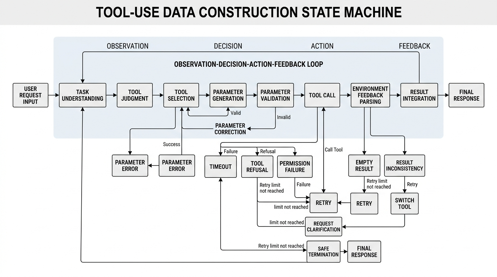
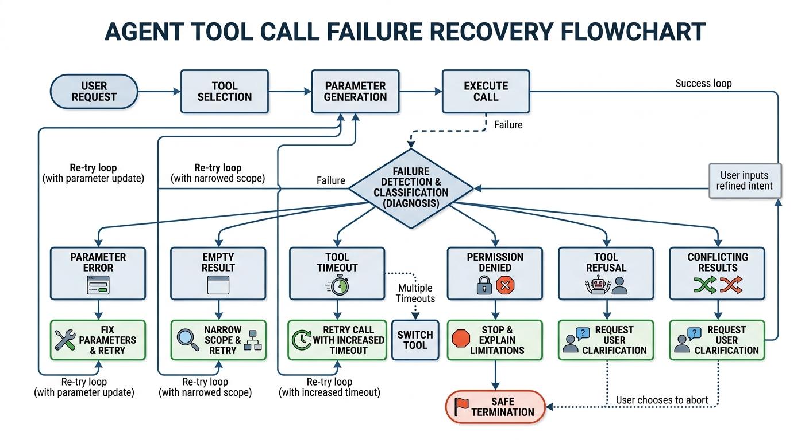

# Chapter 19: Tool-Use and Function Calling Data

## Abstract

Tool-Use and function calling data determine the capability floor of agents—the boundary between "knowing how to answer" and "knowing how to act." This chapter defines tool invocation as an action-modeling problem with state transitions, environmental feedback, and risk boundaries, rather than a formatting exercise attached to language. At the data-object level, the chapter argues that tool invocation spans three consecutive stages: mapping intent to action, instantiating action to parameters, and consuming results into a response. It further shows how systematic gaps in training data at four positions—"whether to call," "parameter instantiation," "result consumption," and "failure recovery"—are amplified into cascading failures during deployment. At the structural design level, the chapter provides decidable and learnable specifications for tool descriptions, parameter schemas, constraints, and error codes; advocates organizing data as trajectories rather than individual samples; and unifies the representation of natural-language input, function-call actions, and environment observation results, while distinguishing single-tool, sequential, and parallel calling structures. At the trajectory level, the chapter defines the minimum closed-loop elements of a successful trajectory and constructs a layered set of failure and recovery samples organized by type—parameter errors, tool rejections, timeouts, and permission failures—emphasizing conditional strategy adjustment rather than mechanical retries. Finally, the chapter discusses evaluation metrics such as exact match, execution success, and recovery rate, along with four categories of safety boundaries—high-risk tools, unauthorized calls, prompt injection, and sensitive data—and the data-synchronization governance challenges posed by tool version evolution.

When large language models transition from "answering questions" to "completing tasks," the decisive factor is no longer language understanding and generation alone, but whether the model can reliably understand tools, select tools, fill in parameters, read feedback, recognize failures, and execute recovery. For teams building tool-use, API interaction, and function calling data, the objects that genuinely require design have already moved beyond a handful of "function call examples"—they point toward a complete data-engineering system organized around **tasks, environments, calls, observations, recovery, and constraints**.

This chapter is addressed to team members responsible for Tool-Use data, function calling samples, agent behavior trajectories, call-log governance, and safety-constraint design. It discusses why tool-calling data determines the floor of agent capability; how to design tool schemas and sample structures; how to organize successful, failure, and recovery trajectories; and how to establish evaluation, safety, and governance mechanisms. It must be emphasized that **tool invocation cannot be understood as a layer of surface formatting appended to a language problem—it is more accurately an action-modeling problem with state transitions, environmental feedback, and risk boundaries.** If data covers only the ideal path of "successful calls," the model will repeatedly expose defects in the real world after deployment: unstable parameters, broken context, inability to recover, and unauthorized calls.

## Keywords

Tool-Use; function calling; agent trajectory; tool schema; failure recovery; safety governance

## Learning Objectives

- Define tool invocation as an action-modeling problem with state transitions, environmental feedback, and risk boundaries, and identify the four systematic gaps: "whether to call," "parameter instantiation," "result consumption," and "failure recovery."
- Design decidable and learnable specifications for tool descriptions, parameter schemas, constraints, and error codes, and unify the representation of natural-language input, function-call actions, and environment observations into trajectories rather than individual samples.
- Distinguish single-tool, sequential, and parallel calling structures; define the minimum closed-loop elements of a successful trajectory; and construct layered failure and recovery samples organized by type—parameter errors, tool rejections, timeouts, and permission failures.
- Apply evaluation metrics such as exact match, execution success, and recovery rate, and govern the safety and data-synchronization issues arising from high-risk tools, unauthorized calls, prompt injection, and tool version evolution.

## 19.1 Why Tool-Calling Data Determines the Agent's Capability Floor

### Foundational Concepts: Function Calling and Agents

In pure text question-answering, the model's primary task is to generate output from input; in Tool-Use scenarios, however, the model faces a closed loop closer to "perceive–decide–execute–feedback." Function calling here is not merely a translation of natural language into JSON or a parameter list—it is a mapping of user intent onto executable actions. An agent, likewise, should not be understood simply as "a model that says a lot of things in sequence," but as a system capable of making multi-turn observations in an external environment, selecting actions, and adjusting behavior based on feedback (Karpas et al. 2022).

From this perspective, function calling data serves two roles. First, it teaches the model when to call a tool, which tool to call, how to fill in parameters, and how to read the return value after calling (Schick et al. 2023). Second, it teaches the model to treat the external environment as part of the task-solving process, rather than attempting to resolve everything within the language space alone. This is why many systems appear to "understand reasonably well" yet perform erratically once connected to search (Nakano et al. 2021), databases, code execution, calendars, email, and other tools (Li et al. 2023; Qin et al. 2024): the problem is usually not that the model cannot speak, but that it has never been systematically trained to act.

Breaking this process into parts, function calling involves at least three consecutive stages. The first is **intent-to-action mapping**. When a user says "check whether I have any meetings next Wednesday afternoon," the system must not merely extract keywords like "meeting" and "afternoon"—it must determine that the underlying intent is a query action, not a generation action; that the corresponding tool is a calendar tool, not a search tool; and that the query object is a time-slot conflict, not the details of a single event. The second stage is **action-to-parameter instantiation**. The model must not only decide which function to call, but also resolve vague temporal expressions into concrete date ranges, time zones, and query scopes. The third stage is **result-to-response consumption**. The results returned by a tool are typically structured feedback not yet in the form of a natural-language answer deliverable to the user; the model must understand what these results mean in the context of the current task and decide accordingly whether to answer directly, ask a follow-up, or trigger another call.

This means that function-calling capability is inherently beyond the scope of single-step format generation—it is closer to a task-advancing capability embedded within an execution chain (Yao et al. 2025). Many systems can output perfectly well-formed function formats yet still cannot be said to truly possess Tool-Use capability, precisely because they have only learned to "rewrite a sentence into a call" but have not learned to reason before calling (Huang et al. 2023), consume the result after calling (Schick et al. 2023), or adjust on exception (Shinn et al. 2023). In short, function calling is not a template technique attached to the surface of a language model—it constitutes the core interface for agent execution capability.

From the agent's perspective, this point is especially important. The fundamental difference between an agent and a conventional dialogue model is not that the agent generates longer text or appears more "proactive," but that it possesses the ability to incorporate the external world into the problem-solving process. For a model that only generates text, the world is an object to be described; for a genuine agent, the world is an environment that can be queried, operated on, fed back, and reused. What tool-calling data determines is precisely whether the model can complete this role transition (Schick et al. 2023).

### The Capability Leap from "Knowing How to Answer" to "Knowing How to Act"

In the early stages of many projects, teams tend to understand tool invocation as a natural extension of text capability, as though a sufficiently strong model would automatically learn how to call APIs, query databases, and check calendars. Yet research also shows that the transition from "knowing how to answer" to "knowing how to act" is not a smooth progression—it manifests as a distinctly discontinuous capability leap (Parisi et al. 2022). The former takes place primarily in the language space and relies on comprehension, organization, and expression; the latter requires the model to cross the boundary between language space and action space, converting abstract intent into operations that are executable in external systems.

The evaluation criteria for these two types of capability also differ. In pure text tasks, a model's answer generally has some error tolerance. Imprecise wording, incomplete expression, or even partial ambiguity may still be acceptable to users, because the output is semantically usable in a broad sense. In tool-calling tasks, however, many errors have no "approximately correct" state. A time field off by one day, a database table name misspelled by one character, a recipient address missing one character, a write operation missing a confirmation condition—all of these can cause results to fall directly from "basically acceptable" to "complete failure." This shows that tool-calling tasks demand far higher precision, consistency, and sequencing than ordinary text generation.

It is precisely for this reason that the training objective of tool-calling data is not to shape a more polished response style, but to form an execution behavior that can be stably deployed. What the model must first learn from this type of data is "how to complete a task," not merely "how to explain a problem." Once data fails to faithfully reflect the task execution process, the model easily remains at the linguistic simulation layer: explanations sound reasonable, actions look well-formed, but the system fails frequently as soon as it is connected to a real environment. Many teams mistakenly attribute this to insufficient reasoning capability, when in reality the training material never taught the model what execution means.

### The Root of "Talking Without Doing" Often Lies in Tool Data, Not the Model Itself

In engineering practice, there is a common misjudgment: whenever an agent fails to execute, teams tend to attribute the problem to the model's insufficient reasoning capability or inadequate base model size. Yet many failure cases do not originate from complex reasoning; they originate from gaps at the tool-data layer. For example, samples may teach the model to "search for weather," yet never teach it to fill in missing conditions or request clarification when a place name is absent, a time expression is vague, or the interface returns a null value. Similarly, samples may cover only the "successful database query" path, yet never cover SQL syntax errors, permission denials, non-existent fields, or pagination truncation (Li et al. 2023; Yao et al. 2025). Because the model never encountered these structured failures during training, it naturally cannot form stable strategies during deployment.

More critically, errors in pure text tasks typically manifest as suboptimal answers, while errors in tool tasks typically manifest directly as operation failures. The former affects content quality; the latter directly affects task completion rates. This causes defects in tool data to be amplified many times over at the user perception layer. Users will not immediately give up because an agent expresses itself inelegantly, but they are very likely to quickly lose trust after a single instance of wrong parameters, a wrong tool selection, or an inability to recover from failure.

The phrase "talking without doing" has very concrete manifestations in Tool-Use scenarios. A model may accurately explain the purpose of a tool, yet frequently omit required fields when actually calling it. It may output JSON that is formally perfectly valid, yet not know that two fields are mutually exclusive. It may understand the general meaning of an error message, yet not know how to select an appropriate recovery action based on the error type. On the surface, all of these look like reasoning or comprehension errors, but the more common underlying cause is that training data never encoded these behavioral distinctions clearly, leaving the model to guess from ambiguous experience.

To go further: what the model base determines is the strength of its pattern-learning capability, while what tool data determines is the specific patterns it actually learns. If training samples are almost entirely drawn from smooth cases, the model will default to assuming that user inputs are complete, parameters are easy to infer, tools are always available, and return values are clean and usable—assumptions that often do not hold in real deployment. Real deployment environments are precisely the opposite: user expressions are often incomplete, field mappings are frequently ambiguous, tool interfaces occasionally fluctuate, and external return values can be highly noisy. If a model is trained exclusively on ideal paths for an extended period, it will continuously expose fragility in real environments.

Therefore, many failures are not the result of a model being "unintelligent"—they result from data failing to organize difficulties into structures that the model can learn from repeatedly. An agent trained only on successful cases may appear to complete tasks, but it has fundamentally only learned to advance along a template under favorable conditions. Once the environment deviates from the template, it quickly exposes a state of being unable to proceed.

### The Four Most Common Positions of Tool-Data Gaps

From a data-engineering perspective, the most common cause of tool-calling failures is not that the model completely does not know how to call a given tool. More commonly, training data contains systematic gaps at several critical positions. The **first type of gap** occurs in the judgment phase of "whether to call." Much of the data only annotates how calls should be made, without annotating when a call should not be made, when clarification should be sought first, or when a text-only answer is sufficient. As a result, the model either over-calls—turning simple questions into tool chains—or is too conservative, attempting to answer directly even when the external environment should be accessed (Zhuang et al. 2023; Huang et al. 2023).

The **second type of gap** occurs during the "parameter instantiation" phase. User requests in many datasets are overly well-formed, with conditions too complete, almost entirely free of the aliases, abbreviations, vague time expressions, ambiguous objects, unit ambiguities, and multi-turn clarifications common in the real world. What the model learns from such data is a "field-filling exercise," not a "parameter-construction exercise under missing-information conditions." Once deployed into a real system, it will repeatedly commit errors that are very close to real users, yet almost never appear in offline data.

The **third type of gap** occurs during the "result consumption" phase. Many function-calling samples treat the call action itself as the endpoint, as though a successful tool return means the task is already complete. The "action–observation–re-decision" chain emphasized by ReAct-style work (Yao et al. 2023) is precisely intended to prevent this single-step understanding. In real agents, however, a successful call is often just an intermediate step. Database results need filtering, search results need credibility judgment, calendar results need conflict prioritization, and code execution results need further decision-making based on stderr and exit code. If data does not cover this layer, the model will exhibit the classic problem of "knowing how to call but not how to use."

The **fourth type of gap** occurs during the "failure recovery" phase. Too few failure samples in training corpora, or failure samples that do not clearly distinguish types and uniformly present them as a single "call failed, please retry," will strip the model of its recovery capability in real deployment (Li et al. 2023; Shinn et al. 2023; Ruan et al. 2024). The model may apply the same action to all failures—mechanical retries, for instance—which wastes resources and may also amplify risk.

These four types of gaps together constitute the agent's capability floor. The determining factor for a system's floor is not how well the system performs under the most ideal conditions, but rather where the system is most likely to break under the most common abnormal conditions. If tool data cannot cover these critical breakpoints, the model will struggle to work reliably in production, even if it appears impressive in demonstration environments.

### How Tool-Calling Failures Amplify User Experience Problems

The reason tool-calling failures are higher-risk than text-answer errors is that they typically have cascading effects. A single wrong parameter fill can lead to a wrong query; a wrong query produces a wrong observation; a wrong observation drives the next wrong decision, ultimately causing the entire trajectory to veer off course. This is especially true in multi-tool sequential scenarios, where small errors in an earlier stage are continuously amplified by subsequent steps. For example, if the time range of a search result is filled in incorrectly, the database query object may be wrong; and if the database result is misinterpreted, calendar entries or email replies may land on the wrong targets.

This type of failure also creates an asymmetry in user experience: a single successful tool call does not necessarily improve the user's impression significantly, but a single erroneous operation is sufficient to destroy trust. ToolEmu's tests on high-risk tool scenarios demonstrate that failures in tool-based agents tend to be amplified into real-world risk (Ruan et al. 2024). Therefore, Tool-Use data cannot only pursue "average success rate"—it must also attend to the ability to control losses along failure paths. The mark of a mature agent is not that it never makes mistakes, but that it can promptly detect, explain, and correct mistakes while preventing risk from continuing to escalate.

Users' expectations of a tool-based agent differ from their expectations of an ordinary question-answering system. For a chat system, users accept that it may occasionally be wrong, and therefore grant it some interpretive latitude. For a system with search, read/write, execution, and scheduling capabilities, however, users are more inclined to treat it as a work agent—even a process executor. At that point, any failure is understood as a process failure, not merely an answer failure. Especially when write operations, scheduling operations, and execution operations are involved, users' real concern is not only "can't it be done," but "if it's done wrong, will there be consequences."

This consequential nature gives tool failures far greater destructive power than text errors. A wrong answer can generally be judged and ignored by the user; a wrong tool operation, however, may have already altered the external world. For example, sending an incorrect email, modifying a schedule entry by mistake, or executing an incorrect script all leave remediation costs. Once an agent crosses the boundary from "generating text only" into real-environment operations, its errors transform from content-layer problems into action-layer problems. This is precisely why tool data must treat failure control as a core objective, rather than looking only at the success path.

### How Cascading Failures Evolve from Local Errors to Global Failure

To understand this amplification mechanism clearly, the tool-calling trajectory can be viewed as a dependency chain. The output of the previous state in the chain typically becomes the input to the next state directly. As a result, a local error is no longer just "one step answered poorly"—it gradually evolves into a semantic drift of the entire chain. For example, in the workflow "search contact–read available time–create meeting," if the first step selects the wrong person with the same name, the following two steps—even if they strictly follow the schema—are still executing on the wrong object. From a local perspective, every step appears correct; from a global perspective, the system is stably completing the wrong task.

This shows that the core of agent experience is not whether each individual step looks reasonable, but whether the entire execution chain maintains semantic consistency (Yao et al. 2025). If tool-calling data is constructed only on a per-step basis without regard for how state is passed across multiple steps, it is easy to train systems that are "locally fine but globally often wrong." Truly mature data design explicitly incorporates cross-step state preservation, critical variable inheritance, and intermediate result verification into trajectories, so that the model learns to maintain goal consistency across long chains.

### The Fundamental Difference Between Tool-Use Data and Pure Text Instruction Data

The core of pure text instruction data is the mapping between input and output, while the core of Tool-Use data is **the transition between states** (Shinn et al. 2023). In text tasks, samples can generally be treated as static pairs; in tool tasks, samples are typically time-ordered trajectories. Such a trajectory contains at least four types of elements: user intent, environment state, system action, and post-action feedback. Only by organizing these four types of elements together can the model learn not merely to "generate a function call," but to take the most appropriate next action in a dynamic environment.

Consequently, when building tool-calling data, teams face a challenge that is already beyond a single annotation problem—it is fundamentally an action-modeling problem. It requires data to express preconditions, tool availability, parameter constraints, return results, uncertainty, failure types, and recovery strategies. It is precisely for this reason that the quality of Tool-Use data often directly determines the floor of agent capability.

More specifically, the supervision signal for pure text data comes primarily from reference answers, while the supervision signal for Tool-Use data comes simultaneously from reference trajectories and environmental feedback. The former only requires the model to get the words right; the latter requires the model to both get the actions right and to revise subsequent actions based on external feedback. This means Tool-Use training is inherently closer to interactive decision learning (Yao et al. 2025) than to static imitation learning. If the environmental feedback layer is missing from the dataset, the model can only learn the surface appearance of actions without learning the relationship between actions and their environment.

Furthermore, pure text instruction data typically allows strong expressive diversity, because different phrasings that are semantically close can all be good answers. Tool-Use data, however, must maintain behavioral consistency beyond linguistic diversity. The same task can have different natural-language expressions, but changing the expression must not cause tool selection, field semantics, or risk boundaries to shift. In other words, Tool-Use data simultaneously pursues "coverage in language space" and "specification in action space"—a design challenge significantly higher than ordinary instruction data.

### Why Tool-Use Data Is Better Understood at the "Trajectory" Level Rather Than the "Single Sample" Level

In traditional question-answering scenarios, one question corresponds to one answer, and samples are naturally organized at the "single item" level. In Tool-Use scenarios, however, a single call record is often insufficient to carry real capability. The model's key learning objective is not the individual function call itself, but the entire chain of "observe–decide–act–receive feedback." In other words, the true supervision object should not remain at isolated actions, but should cover how actions are embedded in context, how they are constrained by prior states, and how they are validated by subsequent feedback.

This means that data teams, when constructing, sampling, and evaluating, should center on trajectories rather than single steps. A sample containing only "user question + function call" may train format output but struggles to train task advancement; a sample containing failure, correction, another call, and eventual completion is longer and more complex, yet is much closer to the capability structure a real agent requires (Li et al. 2023; Yao et al. 2025). Only by understanding Tool-Use data from the trajectory perspective will a team truly appreciate that what determines an agent's floor is often not the step it does best, but the segment at which it is most likely to break down.

## 19.2 Tool Schema and Sample Structure Design

### Tool Descriptions, Parameter Schemas, Constraints, and Error Code Design

A tool schema is not merely a developer-facing copy of an API specification—it is a behavioral specification from which the model learns "action semantics" (Li et al. 2023; Patil et al. 2024). A high-quality schema must clearly express at least four things: what this tool does, what the input parameters are, what constraints exist among parameters, and how the system will respond when errors occur. If a schema only records tool names and parameter names, the model may be able to generate valid JSON without truly understanding the calling conditions.

**Code Example: A "Trainable" Tool Schema (with required fields, enumerations, mutual exclusions, and error codes)**

The following example uses a "calendar query" tool to illustrate which information is most critical for model learning: field types, required fields, enumerations, time-range constraints, and the semantics of common error codes.

```json
{
  "name": "calendar_search",
  "description": "Query calendar events within a specified time range, used to check for conflicts and free time slots.",
  "parameters": {
    "type": "object",
    "required": ["start_time", "end_time", "timezone"],
    "properties": {
      "start_time": {"type": "string", "format": "date-time"},
      "end_time": {"type": "string", "format": "date-time"},
      "timezone": {"type": "string", "examples": ["Asia/Shanghai"]},
      "participants": {"type": "array", "items": {"type": "string"}, "default": []},
      "limit": {"type": "integer", "minimum": 1, "maximum": 50, "default": 20},
      "include_cancelled": {"type": "boolean", "default": false},
      "mode": {"type": "string", "enum": ["events", "freebusy"], "default": "events"}
    }
  },
  "constraints": [
    "end_time must be later than start_time",
    "start_time/end_time must be interpreted consistently with timezone",
    "When mode=freebusy, it is recommended to fill in participants; otherwise the returned result has unclear meaning"
  ],
  "error_codes": {
    "missing_param": "Required field is missing",
    "invalid_datetime": "Datetime format or range is invalid",
    "permission_denied": "No permission to access calendar",
    "timeout": "Service timed out; retry with a narrower range"
  }
}
```

Parameter schema design must pay special attention to decidability. Benchmarks such as the Berkeley Function Calling Leaderboard (BFCL) also treat function, parameter, and call structure as core evaluation objects (Patil et al. 2025). Parameter names should avoid semantic overlap; field types must be explicit; whether a field is required, its allowable value range, default behavior, mutual exclusions, and dependencies should all be expressed explicitly. For example, a "search calendar events" tool that simultaneously includes fields such as `date`, `start_time`, `end_time`, and `timezone` should clearly define their coverage relationships and the interpretation rules when any of them is absent. Otherwise, the model will easily oscillate between related fields, producing calls that are formally valid but semantically incorrect.

Error code design should also serve training data and recovery strategies, not merely back-end debugging (Li et al. 2023; Yao et al. 2025). Explicitly distinguishing failure types—"missing parameter," "insufficient permissions," "resource does not exist," "rate limit," "timeout," "internal error"—provides stable anchors for failure samples and recovery samples. Systems without layered error semantics tend to force the model to guess the cause from ambiguous error text, which greatly undermines recovery capability.

The key to schema design is not merely making the tool "callable," but making it something "the model can stably learn how to call." This requires schemas to possess three properties simultaneously. First, **readability**: field names and descriptions are clear enough for the model to stably establish semantic mappings. Second, **executability**: back-end validation rules are consistent with the field structure, so documentation and actual behavior align. Third, **learnability**: field usage patterns are as stable as possible across similar situations, avoiding excessive reliance on implicit conventions. Many tool interfaces are usable for engineers but unfriendly to models, because they contain too many default rules, legacy compatibility fields, or semantically ambiguous names.

For data teams, the tool schema is itself part of the training material, not a background explanation outside of training (Patil et al. 2024). A model does not read interface documentation the way an engineer does and then build systematic understanding; it primarily infers rules through repeated occurrences in samples. If the schema is written too abstractly and the samples do not repeatedly and explicitly present the key constraints, the model tends to learn an unstable strategy. The result is typically that offline examples work, but once deployed and encountering edge conditions, behavior starts to drift.

### The Core of Schema Design: From "All Fields Covered" to "Semantically Stable"

Many teams instinctively pursue information completeness when designing tool schemas, hoping to include every potentially useful field, option, and compatibility parameter in the definition. From a model-learning perspective, however, more fields do not automatically mean better. A field system that is overly complex, with unclear semantic boundaries and intricate historical-compatibility relationships, will significantly increase the model's decision-making difficulty. The model faces a continuous decision task, not a static document. What it needs are stable rules for "in this context, which field to fill, why to fill it, and what its relationship is to other fields"—not an infinitely expanding parameter list.

Therefore, the key to a schema often lies not in whether it covers all possibilities, but in whether it maintains semantic stability across high-frequency scenarios. Gorilla's Retriever Aware Training, for instance, links API document retrieval with call generation, explicitly emphasizing the impact of interface description changes on calling behavior (Patil et al. 2024). For example, if a system simultaneously contains multiple similar fields for geographic location—`location`, `place`, `region`, `city_name`—without clearly differentiating the conditions for using each, the model will very easily learn confused mappings during training. Similarly, if a field is marked "optional" in the documentation but is effectively required in certain operations, and this conditional constraint is not explicitly expressed, the model is likely to omit it precisely in the most critical scenarios.

In this sense, schema design should avoid information accumulation and move toward semantic compression. Teams need to compress the complex real constraints of back-end systems into a set of decidable, model-learnable rules. Those who can make the interface design clear at this level are more likely to train agents with stable behavior.

### Decidability and Learnability of Parameter Schemas

The design quality of a parameter schema directly affects whether the model can stably fill parameters in real scenarios (Li et al. 2023; Patil et al. 2025). The most critical principle here is that "the more decidable the field semantics, the better"—more important than "the more complete the fields, the better." Decidability means that given a context, the model can fairly clearly determine whether a field needs to be filled, what type it should be, and what its relationship is to other fields. If field boundaries are fuzzy, naming overlaps, or dependencies are hidden, the model will easily produce semantically incorrect calls even while the format is valid.

For example, if a tool has four related fields—`location`, `region`, `city`, and `place_name`—without explicit priority or applicable conditions, the model may switch arbitrarily between them in different samples. Or if a field supports both a string and an object form, without making clear when each form is used, the model may learn an unstable mixed format. These problems are not always obvious in demo scenarios but will quickly evolve into high-frequency call failures after deployment.

From a training perspective, a learnable schema should also minimize implicit default knowledge. Any back-end default behavior that could have a significant impact on task results should be made explicit—for example, default timezone, default sort order, default result count, and default time range. The model does not know these "back-end common assumptions"; if samples do not repeatedly present these rules, the model will continuously stumble on implicit assumptions in critical scenarios.

Decidability of parameters also means that logical relationships between fields should be expressed directly, rather than relying on the model to infer them from a small number of cases. In many real systems, call failures are often not caused by an incorrectly filled field value itself, but by an incorrect combination of fields. For example: start time and end time in the wrong order, date and timezone expressed inconsistently, pagination parameters conflicting with query mode, write operation target mismatching the permission scope. If these are only caught by back-end validation and the model reads a generic error message and tries to back-infer, learning efficiency will be very low. A more effective approach is to make these constraints visible rules in the schema and samples, so the model can form structured judgments earlier.

### Constraint Design Determines Whether the Model Can Learn "Both Legal and Useful" Calls

In Tool-Use scenarios, a legal call and a useful call are not always the same thing (Patil et al. 2025; Yao et al. 2025). A JSON can fully comply with all field-type constraints yet still fail to complete the task. For example, a time range that is valid but too broad may return extremely noisy query results; keywords that are valid but too vague may yield searches with almost no discrimination; a recipient field formatted correctly may nonetheless send a message to the wrong party due to the absence of identity confirmation. Therefore, constraint design in schemas cannot remain at the syntactic layer—it must include as much semantic-layer and business-layer information as possible.

Common constraints can be roughly divided into four categories. The **first** is format constraints: field types, lengths, enumeration ranges, and basic validation rules—the lowest-level guarantee of legality. The **second** is combination constraints: mutual exclusion, dependency, coverage, and priority relationships among multiple fields, which determine whether a parameter combination actually holds. The **third** is business constraints: for example, which write operations require a second confirmation, which queries must be scope-limited, and which objects are inaccessible under certain identities. The **fourth** is risk constraints: for example, timeout ceilings, resource quotas, sensitive-field masking, and prohibition of dangerous commands. When any of these constraints are absent, the model may learn calls that "can get through" while failing to learn calls that "can go into production."

Data teams therefore cannot treat constraints as the back end's concern. The back end can certainly intercept errors at execution time, but if these boundaries never appear explicitly during training, the model will never learn to proactively avoid them. Truly mature Tool-Use data teaches the model not only "what format is valid," but also "what practice is safe, what boundaries must not be crossed, and what situations call for stopping rather than continuing."

### Layered Design of Error Codes and Failure Semantics

Error code design should serve training data and recovery strategies, not merely back-end debugging. Explicitly distinguishing failure types—"missing parameter," "insufficient permissions," "resource does not exist," "rate limit," "timeout," "internal error"—provides stable anchors for failure samples and recovery samples. Systems without layered error semantics tend to force the model to guess the cause from ambiguous error text, which greatly undermines recovery capability.

More specifically, an error code system should ideally satisfy three goals simultaneously. First, it should help the execution side locate problems. Second, it should help the data side organize samples by failure type. Third, it should help the model side learn recovery branches. That is, error codes should not be merely internal technical numbers for the back end—they should have sufficiently stable semantic levels. For example, "parameter error" can be further subdivided into missing parameter, type mismatch, illegal enumeration value, and field conflict; "permission failure" can distinguish between unauthenticated, authenticated but unauthorized, and inaccessible due to resource isolation. A hierarchical error code system will directly determine whether failure samples can be effectively organized.

In practice, error text from many systems originates from underlying services and is expressed inconsistently. Without abstraction and normalization at the data layer, the model can only memorize surface phrasings and will struggle to form generalizable recovery capabilities. Therefore, a mature data-engineering process typically retains two layers of representation simultaneously: the "raw error text" and a "standardized error label." The former preserves environmental authenticity; the latter provides a stable learnable structure.

Another value of layered error codes is that they can structurally pre-determine the decision of "whether to continue trying" (Shinn et al. 2023; Ruan et al. 2024). Not all failures are appropriate to retry. Timeout-class problems usually have retry potential; parameter-class problems are better addressed by correcting the parameters before retrying; permission-class problems often call for termination with an explanation of the constraint; injection risks or high-risk write-operation conflicts may warrant immediate process termination. If the error system does not express these semantic differences, the model tends to apply a single strategy to all failures, resulting in coarse and unsafe recovery behavior.

### Single-Tool, Multi-Tool, Sequential, and Parallel Tool Samples

Tool-calling samples should not cover only the simplest single-tool path. Many real-world operations require multiple tools working together, and the collaborative relationship is not uniform. Some tasks are completed by a single tool, such as querying the weather; others are completed by sequential tools, such as first searching for a contact, then querying the calendar, then creating a meeting; others still require parallel tools, such as simultaneously querying multiple data sources before aggregating the results.

Samples with different structures teach the model different levels of capability. MetaTool and BFCL both treat whether to use a tool, which tool to select, and sequential/parallel calling as important evaluation dimensions (Huang et al. 2023; Patil et al. 2025). Single-tool samples primarily train "whether to call" and "how to fill in parameters"; multi-tool sequential samples train how intermediate results drive subsequent calls; parallel-tool samples train the model to share the original intent across multiple subtasks, split parameters, and ultimately merge results. If the data contains an overwhelming majority of single-tool cases, the model will often exhibit a distinct characteristic after deployment: each individual step looks reasonable, but the overall task never closes (Yao et al. 2025).

Therefore, when designing samples, one cannot only count "number of calls"—it is more important to count "call structure." Teams need to know the proportion of single-tool, dual-tool, multi-tool, sequential, parallel, and nested-recovery structures in the training set, and ensure this distribution matches the target scenario distribution as closely as possible.

Different tool-structure samples correspond fundamentally to different levels of execution capability. Single-tool samples focus on solving local execution problems, addressing "whether to call, how to call, and what to say after calling." Sequential samples focus on state-transfer problems, addressing "how the result from the previous step constrains the action in the next step." Parallel samples focus on task decomposition and result integration, addressing "how a single intent is broken into multiple concurrently processable subtasks, and how multiple return values are synthesized into a consistent conclusion." If these structures are severely imbalanced in the dataset, the model will exhibit obvious shortcomings at the corresponding capability levels.

### The Tool Combination Pattern Is Itself a Capability Label

In many teams' early data organization, tool-calling samples are often placed uniformly in one bucket—any record containing a function name and parameters counts as one Tool-Use data point. But as the design of API-Bank, ToolLLM, and BFCL all demonstrate, tool-calling capability needs to be evaluated separately at different levels: planning, selection, invocation, and execution result (Li et al. 2023; Patil et al. 2025). From a capability-modeling perspective, the tool combination pattern itself should be treated as an important label. Single-tool, sequential, multi-tool parallel, and multi-step trajectories with recovery branches are not at the same difficulty level, nor do they test the same capability. They correspond respectively to local execution, process advancement, task decomposition, and exception recovery.

Once a team reinterprets data in this way, many previously overlooked problems become visible. For example, a model may have high accuracy on single-tool queries but frequently lose intermediate variables in dual-tool sequential scenarios; another model may be able to retrieve from multiple sources in parallel yet fail to perform priority judgment when results conflict. Without labels at the call-structure level, these differences are easily masked by overall success rates, making the system look "not bad" while remaining very fragile on critical workflows.

Therefore, in both training set and evaluation set design, recording call structure as an explicit dimension is typically more valuable than simply increasing sample count. It helps teams answer more clearly: at which level of execution capability did the model's problem actually occur, rather than only knowing that "it's somewhat unstable on average."

### Unified Representation of Natural Language, Function Calls, and Observation Results

The difficulty of Tool-Use data lies not in whether to use JSON, but in whether a unified and extensible representation format exists that can stably carry natural-language input, function-call actions, and environment feedback results. A mature data format typically needs to place the following layers of information in the same trajectory: user request, tools currently available to the system, model decision, function parameters, call result, next observation, and final response (Schick et al. 2023; Qin et al. 2024).

**Code Example: Unified Trajectory Format (messages + tool_call + tool_result)**

The following presents a "successfully closed" sample: first querying the schedule, then giving an actionable recommendation based on the conflict result. The key is to treat the tool result as an **environment feedback** entry in the trajectory rather than mixing it into ordinary text (Shinn et al. 2023).

```json
{
  "messages": [
    {"role": "system", "content": "You are a scheduling assistant. When a query is needed, call the tool first, then provide a conclusion based on the returned result."},
    {"role": "user", "content": "Can you check whether I have any meetings next Wednesday afternoon from 2 to 4 PM? In the Shanghai timezone."},
    {
      "role": "assistant",
      "tool_call": {
        "name": "calendar_search",
        "arguments": {
          "start_time": "2026-04-29T14:00:00",
          "end_time": "2026-04-29T16:00:00",
          "timezone": "Asia/Shanghai",
          "mode": "events",
          "limit": 20
        }
      }
    },
    {
      "role": "tool_result",
      "name": "calendar_search",
      "content": {
        "status": "ok",
        "events": [
          {"title": "Weekly Standup", "start": "2026-04-29T15:00:00", "end": "2026-04-29T15:30:00"}
        ]
      }
    },
    {
      "role": "assistant",
      "content": "14:00–15:00 is free; 15:00–15:30 has a \"Weekly Standup\"; 15:30–16:00 is free. Would you like me to schedule it starting at 14:00, or after 16:00?"
    }
  ]
}
```

If these layers of information are scattered across different sample systems, training will easily produce fragmentation. For example, natural-language understanding data is placed in one location, function-call format data in another, and error recovery data somewhere else—the result is a model that learns each local capability but cannot connect them within the same context. The value of a unified format is that it lets the model see the continuous process from "language to action, action to observation, observation back to action" (Schick et al. 2023).

In practice, many teams adopt a message-sequence format to organize samples, using role markers such as `user`, `assistant`, `tool_call`, `tool_result`, and `assistant_followup` to indicate different states. The advantage of this approach is not only that it closely mirrors inference interfaces, but more importantly that it facilitates expressing temporal order and environmental feedback (Shinn et al. 2023).

The truly important unification should not be understood as compressing all tools into the same surface appearance—the key is to keep role boundaries and temporal relationships clear. The model needs to know unambiguously which segment is the user request, which is the system action, which is the environment feedback, and which is the response following feedback. If these roles are mixed together inconsistently in samples, the model will conflate information that should be treated differently. For example, it may treat a tool return value as ordinary natural language and continue generating, or mistakenly treat text appearing in the external environment as a new high-priority user instruction. On the surface this looks like a comprehension problem, but in reality it is a failure of the format design to stratify the sources of information.

### The Key to a Unified Format Is Role Semantics, Not Visual Uniformity

When teams discuss Tool-Use representation formats, the focus quickly lands on JSON structure, field nesting patterns, or message appearance—as though a sufficiently uniform format would naturally teach the model how to call. But from a training perspective, what is truly critical is not whether the appearance is neat, but whether role semantics are stable. The model is not merely reading a well-formatted data table; it needs to continuously infer "who is speaking, who is acting, who is giving feedback, and what step we are currently on" as preconditions for every decision.

Therefore, the priority of a unified format should not be making all tool results look alike—it should be making the role relationships in every trajectory sufficiently clear. User input is user input; a tool call is a system action; a tool result is environmental feedback (Yao et al. 2023); the subsequent explanation is consumption of that feedback (Shinn et al. 2023). As long as these role categories maintain stable boundaries across long-term samples, the model will more easily develop cross-tool generalization capability. Conversely, if role expressions switch frequently across different samples, the model will learn the parts that should be universal patterns in a very brittle way.

### Observation Results Should Not Be Treated as Ordinary Text Appendages

In many datasets, tool return results are simply concatenated into the context, as though they were just more text for the model to read. From an agent-learning perspective, however, observation results cannot be treated as ordinary context material—they carry the status of environmental feedback signals (Shinn et al. 2023). They tell the model what happened in the external world, whether the current action succeeded, and whether the action space for the next step has changed. If such feedback is not modeled separately, the model will find it very difficult to truly learn to adjust behavior based on environment state.

This is especially apparent in tools such as retrieval, web browsing, database querying, and code execution. What search returns is candidate evidence, not the answer itself (Nakano et al. 2021); what a database returns is data rows to be interpreted, not the final conclusion (Li et al. 2023); what code execution returns—stdout, stderr, and exit code—together constitute the current execution state (Yang et al. 2024). If the model merely "reads them" as ordinary text rather than treating them as post-action environment observations, it cannot establish genuinely closed-loop behavior.

Therefore, a mature unified format should give observation results an independent status. They should not merely be a string appended after a call—they should be expressed as environment signals with a clear source, clear structure, and clear decision value. Only then can the model progressively learn to "act based on feedback" rather than "keep generating based on whatever it reads."

### Call Log Structure: The Bridge Between Training Samples and Online Behavior

Call log structure is a layer often overlooked in Tool-Use data engineering, yet it is critically important. It connects offline-constructed training samples with real-world calling behavior that occurs online. Without a well-designed log structure, teams cannot systematically recover failure cases from the deployment environment, nor can they analyze whether the model is failing at "selecting a tool," "filling parameters," "reading results," or "recovering from failure."

Call logs used for data feedback should at a minimum record: task/session ID, step number, user's original request, tool name, input parameters, validation result, execution status, return summary, error code, elapsed time, retry count, recovery action, and final task status. Logs do not need to record all internal reasoning details exhaustively, but they must be able to reconstruct the minimum chain of "why this step happened, what happened, what went wrong, and how it was subsequently handled."

From a data-engineering perspective, logs should not be viewed merely as operational data—they are also an important source of failure samples, recovery samples, and safety samples. An agent system without structured logs, even after accumulating large volumes of online interactions, will find it very hard to convert those interactions into truly trainable data assets.

The value of call logs also lies in providing the data team with a stable window through which to observe model behavior in the real world. Offline-constructed training samples, however comprehensive, can hardly exhaust all the expression variants, interface edge cases, and interaction noise encountered online. Logs can continuously reveal where the model is most fragile in a real environment: is there a field-mapping problem, is the tool-selection strategy unstable, are recovery actions too uniform, or has an interface version upgrade broken old calling conventions? Without these structured records, teams will only see that "the system is somewhat unstable," yet be unable to pinpoint the specific mechanism.

### Call Logs Are the Starting Point for Data Feedback, Not Post-Hoc Troubleshooting Material

In many systems, logs are default operational assets: checked when something goes wrong, sleeping quietly otherwise. But for Tool-Use data engineering, logs should not only be post-hoc troubleshooting material—they should be treated as the starting point for continuously producing training samples and evaluation samples. Failure trajectories and recovery trajectories in particular are often the hardest to imagine fully offline through human effort, yet are the most likely to occur naturally online. With a well-designed log structure, teams can stably recover these high-value cases into the data pipeline.

For example, online logs can automatically filter out samples where "first parameter error, corrected once, then succeeded" as high-value material for recovery learning. They can also filter out cases where "the same request type repeatedly oscillates between two tools" to localize tool-selection instability. They can further flag trajectories where "continued attempting high-risk calls after a permission failure" as safety-defect samples. All of this demonstrates that logs have already transformed from a post-training appendage into one of the core inputs of the training iteration loop.

For this reason, log structure should be planned concurrently with sample structure design—not added as a patch after the system goes live. Once key states are not recorded, reconstructing the trajectories required for training from real-world behavior later becomes very difficult. For Tool-Use teams, sample format and log format are best organized from the start according to the same state model, so that offline and online can truly be connected. The typical tasks, core input fields, environment feedback fields, and recovery-related fields for different tool types are shown in Table 19-1.


**Table 19-1: Tool Type and Sample Field Reference**

| Tool Type | Typical Tasks | Core Input Fields | Core Environment Feedback Fields | Recovery-Related Fields | Notes |
|---|---|---|---|---|---|
| Search tools | Web search, document retrieval, knowledge query | query, filters, top_k, time_range | hits, source, snippet, empty_result | reformulated_query, fallback_source | Emphasize query rewriting and empty-result recovery |
| Database tools | SQL query, vector retrieval, key-value read | db_name, query/embedding, table, limit | rows, schema_hint, execution_status | retry_query, permission_check | Must cover syntax errors and permission errors |
| Calendar / task tools | Check schedule, create event, modify reminder | date, participants, location, timezone | matched_events, conflicts, write_status | clarify_slot, retry_write | Write operations carry high risk; explicit confirmation boundaries needed |
| Communication tools | Send email, send message, notify | recipient, subject, body, channel | send_status, delivery_error | draft_mode, recipient_check | High-risk scenarios should include secondary verification |
| Code execution tools | Run script, compute, file processing | code, runtime, input_files, timeout | stdout, stderr, exit_code, artifacts | patch_code, safe_abort | Must account for sandboxing and resource constraints |
| File tools | Read, write, convert, parse | file_id, path, mode, format | content_preview, parse_error | fallback_parser, permission_check | File permissions and format compatibility are common issues |
| External API tools | Third-party service calls | endpoint, method, payload, auth | response_body, status_code, quota | retry_backoff, auth_refresh | Must record version and quota information |

As the table shows, "unified sample structure" does not mean all tools should use exactly the same fields—it means different tools should expose their most critical execution information within a shared trajectory framework. Search tools focus more on query expression and empty-result feedback; database tools focus more on schema awareness and execution status; calendar and communication tools emphasize object alignment, conflict detection, and write-operation risk; code execution tools must additionally expose the runtime environment and safe-abort signals. These differences across tool types are necessary material for the model to form transferable execution capability—they should not be treated as noise in sample design.

When referring to the tool field table, it should not be treated as a fixed field checklist but as the set of key states that different tools need to expose in their trajectories. Whoever can design these key states to be both sufficient and non-confusing is more likely to build a Tool-Use dataset that is both unified and effective.




*Figure 19-1: Tool-Use Data Construction State Machine Diagram*


Modeling Tool-Use data as a state machine is more useful for describing real execution processes than treating it as a set of independent function calls. As shown in Figure 19-1, after a user request enters the system, it does not jump directly to the "generate some function call" step. Instead, it sequentially passes through stages such as task understanding, judgment of whether a tool is needed, tool selection, parameter generation, parameter validation, call execution, environment feedback parsing, and result integration. Each stage corresponds to an observable state and also to a set of potential failure modes. When states and transitions are clearly written into the data, the model is more likely to learn stable execution paths rather than merely imitating local call formats.

The most important value of the state-machine perspective is that it places successful, failure, and recovery trajectories into the same framework (Yao et al. 2025; Shinn et al. 2023). For a real agent, failure cannot be treated as an ignorable edge case—it is a common component of system operation. A parameter error means the state has transitioned from "parameter generation" to "validation failure"; a timeout means the state has transitioned from "call execution" to "execution exception"; insufficient permissions mean the system should not continue advancing the main path but should instead enter a state of explaining the constraint or safe termination. If training data only preserves the main path without explicitly expressing these failure transitions, the model cannot truly learn behavioral choices in abnormal situations.

From a data-construction perspective, the state machine does not require every sample to cover all nodes—it requires the dataset as a whole to cover the key states and major transitions. For example, one category of samples focuses on the standard "task understanding → tool selection → successful call" path; another focuses on the recovery path of "parameter validation failure → parameter correction → second call succeeds"; yet another covers the safety path of "permission failure → stop calling → explain limitation to user." Through this approach, what the model learns is no longer a collection of isolated call instances, but a set of execution rules for continuously adjusting actions around state changes.

This representational method also serves another important function: helping teams identify where data gaps actually occur. If the online system frequently selects the wrong tool, the problem likely lies in the state transitions of "task understanding → tool judgment → tool selection" not being learned stably, rather than insufficient format training. If the system can successfully call tools yet still arrives at incorrect conclusions, it indicates insufficient state representation for "environment feedback parsing → result integration." If the system keeps retrying mechanically whenever it encounters an error, it usually means failure states were recorded but the transitions from failure to recovery were not sufficiently modeled. In other words, the value of the state machine is not the diagram itself—it is the decomposition of behavioral structure in Tool-Use data into specific units that can be analyzed, supplemented with samples, and evaluated.

For teams building agent data, this point is critical. The core objective of Tool-Use data is not to teach the model the calling format of a particular tool, but to teach the rule of "under what state to take what action, and how to transition to the next state based on environmental feedback after that action." As long as this rule is not stably written into the data, the model will easily remain at the template layer. Once this rule is explicitly organized, the model can progressively develop execution capability approaching that of a genuine agent.

## 19.3 Successful Trajectories, Failure Trajectories, and Recovery Samples

### Minimum Complete Elements of a Successful Call Sample

Many teams, when building function calling data, treat "user question + correct function call" as a complete sample (Li et al. 2023; Qin et al. 2024). From an agent-training perspective, this is typically insufficient. A truly usable successful sample should contain at least six types of elements: user intent, tool selection rationale, parameter content, execution result, result interpretation, and final response (Li et al. 2023; Patil et al. 2025). Only then can the model learn that this call is not only correctly formatted, but also semantically sound, effectively executed, and correctly consumed.

If only the call action itself is retained while the result consumption process is omitted, the model may learn to "know how to call but not how to use." Such a model can issue well-formed tool requests yet not know how to continue making decisions based on the return result. For example, when a search tool returns multiple candidates, the model may not know how to select the most relevant one; when a calendar tool returns a time conflict, the model may not know whether it should suggest an alternative slot or proceed to create the event. The value of a successful trajectory is not merely to demonstrate that a call succeeded—it is to define "what should happen after success to convert the result into task completion" (Li et al. 2023; Yao et al. 2025).

From a data-modeling perspective, "success" cannot be equated with a function returning a 200 status code, nor can it be equated with a tool call being syntactically fully compliant with the schema. It requires that a call chain genuinely advance the task until the user's goal is satisfied. Therefore, the minimum completeness of a successful sample cannot stop at the tool layer—it must extend to the task layer. The model must not only see "how the call happened" but also "what changed in the task state after the call." Only then will what it learns transcend local action patterns and form a complete execution logic.

This point is especially apparent in multi-step tasks. Suppose a user requests "find the freest weekday afternoon next week and schedule a one-and-a-half-hour discussion meeting." This involves multiple stages: calendar retrieval, comparison of candidate time slots, conflict judgment, and meeting creation. If the training sample only retains the "retrieve calendar" step, then the model has only learned an intermediate action. Only when the sample continues to show how to compare different return results, how to select a candidate time slot, how to call the create-event interface, and how to relay the final arrangement to the user does the model truly learn "task completion" rather than "call success."

### The "Minimum Completeness" of a Successful Trajectory: What Matters Is Closure, Not Brevity

When pursuing sample volume, many teams habitually compress successful samples as short as possible, believing that keeping only the most critical fields is sufficient. In Tool-Use scenarios, however, "minimum completeness" does not mean "shortest representation"—it means the information required for closure must not be absent (Yao et al. 2025). That is, a sample can be non-verbose, yet it must be able to answer the following questions: why the model chose this tool, how these parameters were derived, what is the core information in the tool's return, what these return values mean, and how the system ultimately converted these results into output useful to the user.

If any one of these questions has a missing link in the sample, training will leave a gap. For example, if the model only sees "user request → function call → final answer," it may not learn how to consume intermediate results; if only "user request → function call → tool return" is preserved, it may not learn how to convert structured results into the conclusion the user actually cares about. The so-called minimum completeness is essentially a closure minimality, not a field minimality.

From an engineering perspective, many systems that "perform well offline but are unstable online" are precisely because successful samples have been trimmed too short, so the model sees the call action but not the mechanism of task completion. Such samples are efficient for single-step format learning, yet insufficient for shaping genuine agent capability.

### Successful Trajectories Must Explicitly Present the Tool Selection Rationale

In successful samples, the tool selection rationale is a component that is often omitted yet actually very important (Huang et al. 2023). The model should know not only "which tool was ultimately used" but also, as much as possible, "why this tool should be used in the current context rather than another tool or a plain text answer." This rationale does not need to be written as a lengthy explanation, but should at least be reflected in the sample in some structured way—for example, through decision labels, contextual constraint fields, or a brief tool-selection rationale summary.

This is because tool selection itself is one of the key capabilities in Tool-Use. If training data always directly provides the correct tool without showing the selection process, the model tends to learn tool calling as a conditioned reflex: seeing a certain type of expression triggers blind invocation of a certain function. But once the real environment presents mixed intent, insufficient information, or multiple tools that can partially satisfy the need, the model will quickly expose unstable tool judgment. Therefore, successful trajectories should present not only "what was done" but also "why it was done this way."

### Parameter Content Is Not Just Field Values—It Is the Result of Context Compression

Teams often understand parameter content as a collection of fields and values, as though the final parameters being correct is sufficient. For the model, however, parameters do not exist innately—they are compressed from user expressions, multi-turn context, system default rules, and business constraints. For example, "a bit later tomorrow afternoon" needs to be resolved into a specific time range; "that client from last time" needs to be mapped to a contact identifier; "send a short reminder" needs to be matched to a subject, body, and target object in the communication tool. Parameter generation is fundamentally a process of semantic compression and structural mapping (Schick et al. 2023; Patil et al. 2025).

Therefore, high-quality successful samples should ideally not treat parameters as final answers that appear from nowhere, but should reflect the parameter origins in the trajectory as much as possible—for example, through prior context, clarifying questions, tool-result inheritance, or default value expansion—letting the model see that these parameters are constrained by the task and are not filled in arbitrarily. Only then is the model more likely to learn stable parameter completion under incomplete information in real deployment, rather than guessing extensively outside of sample coverage.

### Recovery Trajectories: Parameter Errors, Tool Rejections, Timeouts, Permission Failures

Failure samples should not be viewed as low-quality by-products of data collection—they are among the most valuable parts of agent capability learning (Li et al. 2023; Ruan et al. 2024). The resilience of a real system does not come from "never failing," but from "knowing what different failures mean and being able to take different recovery actions." This requires data to clearly stratify failure types (Yao et al. 2025; Ruan et al. 2024).

**Parameter errors** typically mean invalid input, missing fields, or field combination conflicts; the corresponding recovery strategy is parameter correction, filling in missing values, or requesting clarification from the user. **Tool rejection** usually indicates that the current request does not satisfy business rules—for example, insufficient write permissions or the object state not allowing modification; continuing to retry is usually ineffective, and a more reasonable recovery is to explain the constraint and offer a viable alternative. **Timeouts** may correspond to network fluctuations, service congestion, or complex queries; the appropriate recovery may be to retry, narrow the scope, reduce the number of results, or switch data sources. **Permission failures** require extra caution, because they are not only technical errors but may also be safety boundary signals; the recovery strategy should prioritize stopping unauthorized attempts rather than letting the model "find a way around."

If training data does not distinguish these failures and instead writes them all as "call failed, please retry," the model will exhibit a unification of recovery actions after deployment: mechanical retrying regardless of the failure type, which wastes resources and may also cross safety lines (Ruan et al. 2024; Debenedetti et al. 2024).

In agent systems, failure is not merely the flip side of "not succeeding"—it is itself a high-density supervision signal. Because a failure often clearly reveals where the system misunderstood, selected wrongly, filled parameters incorrectly, or misjudged a boundary. Compared to successful samples, failure samples better expose the model's genuine weak points. For data teams, the most important value of failure trajectories is not to demonstrate that the system "is not good enough"—they are better suited to train the system to learn "to keep doing the right thing even under non-ideal conditions."

### Failure Types: From a Label Checklist to Recovery Strategies

In many coarse-grained datasets, failure types are treated merely as annotation results—samples are classified as "parameter error," "timeout," "permission failure," and so forth, and that is the end of it. For agent training, however, the truly important reason for distinguishing failure types is that they determine how subsequent recovery actions should diverge (Shinn et al. 2023; Ruan et al. 2024). The purpose of failure classification is not to produce tidy statistics—it is to map different failures to different recovery paths.

For example, the most common recovery for a missing parameter is to fill in the information or initiate a clarification; a field conflict often requires re-interpreting the constraints and correcting the combination; an empty result does not necessarily indicate failure—sometimes it is just that the query expression is too broad or too vague, requiring query rewriting or switching filter conditions; a permission failure should generally not be retried but should enter constraint explanation and safe termination; a tool rejection usually means the current object state or business rule does not allow this action, requiring consideration of an alternative. Only when these branches are clearly expressed in training data will the model gradually develop the capability to "upon seeing a certain failure, know which recovery mode to enter next."

In this sense, the quality of failure samples is not primarily reflected in the failures themselves, but in whether the actions following the failures are appropriate. A mature dataset will not be satisfied merely with recording "failure occurred here"—it will further record "why it failed," "how this type of failure should be handled," and "what the outcome was after handling." This is the recovery supervision that genuinely improves system resilience.

### The Core of Recovery Samples: Conditionally Adjust Strategy Rather Than Mechanically Retry

Recovery in a real system should not be simplified to "try again after failure." The reason recovery is important is precisely that it requires the system to change strategy based on the cause of failure, not mechanically repeat the original action (Shinn et al. 2023; Ruan et al. 2024). Recovery from a parameter error should be accompanied by parameter correction; recovery from an empty result should be accompanied by query rewriting or scope adjustment; when a tool is unavailable, recovery should consider switching tools or deferring the action; recovery from a permission failure is often termination rather than continuation.

Recovery samples train the model to select actions based on failure type: different failures correspond to different handling approaches and different risk boundaries. If training data writes the next step after every failure as "retry," the model will learn a very fragile view of recovery: treating failures as temporary fluctuations and banking on repeated calls to resolve everything. Such a system is not only inefficient but also dangerous, because some failures should simply not be continued.

High-quality recovery samples often share a common characteristic: they explicitly reflect a "strategy change." After a failure in the previous step, the model does not simply repeat the original call—it changes the parameter, the scope, the tool, the interaction approach, or even the judgment of whether to continue executing. Only when such changes are stably written into data will recovery capability truly develop.

### Environmental Feedback: The Critical Supervision Source for Closing the Agent Learning Loop

Environmental feedback is the part of Tool-Use data most unlike pure text tasks (Shinn et al. 2023). In the text world, the model primarily relies on language supervision; in the tool world, it must also learn to understand the structured information returned by the environment. Environmental feedback includes both explicit return values—such as `status_code`, `rows`, `stdout`, `error_message`—and implicit state changes, such as whether a resource was created, whether a task was genuinely completed, and whether an expected update occurred in the external world.

The reason many systems appear to "know how to call" yet remain insufficiently reliable is that they treat environmental feedback as a running log rather than modeling it as decision supervision. The correct data-construction approach should let the model see clearly in the samples: what was returned in this step, what this return means, and therefore what should be done next. Only when the "feedback → interpretation → next action" relationship is explicitly written into the data can the model more easily develop closed-loop capability.

From a data-annotation perspective, environmental feedback should ideally retain both the raw result and an abstract label (Li et al. 2023; Ruan et al. 2024). Raw results train the model to understand real interface formats; abstract labels stabilize failure classification and recovery strategies. For example, a database error text can be preserved, but it should simultaneously be labeled "syntax_error" or "permission_denied." This preserves authenticity while facilitating generalizable recovery patterns.

Environmental feedback matters because it changes the supervision signal of Tool-Use data. In ordinary text tasks, the model typically only needs to align with a reference answer; in tool tasks, whether the model's action is appropriate often needs to be confirmed through the environment's return. That is, environmental feedback not only tells the model "what just happened" but also continuously rewrites "what should be done next." If training samples do not clearly express this rewriting relationship, the model will find it difficult to form genuine closed-loop decision capability.

### Raw Feedback and Abstract Feedback Should Coexist

Modeling environmental feedback cannot retain only one form of representation. If only raw feedback is retained, the model will be exposed to real interface styles but may struggle to form stable recovery patterns across tools, versions, and scenarios; if only abstract labels are retained, the model will lose its ability to adapt to real-world noise and interface diversity. Therefore, the more reasonable approach is typically to have both raw feedback and abstract feedback coexist.

For example, a database error can be presented in two layers simultaneously: one layer is the raw return content—specific error text, status code, failure location; the other layer is an abstract interpretation—"syntax_error" or "permission_denied." Similarly, a search empty-result can retain both the real structure of the return with hits set to empty, and a normalized label of "empty_result." The model can thus learn both how to understand the return formats of the real world and how to map these diverse returns into a small number of actionable recovery types.

The value of this two-layer feedback design is that it provides the model with a balance between "authenticity" and "generalizability." The former prevents the system from feeling unfamiliar when facing actual interfaces; the latter prevents the system from being led astray by surface phrasing and losing its ability to transfer.

### The Key of Feedback Is Not "Seeing It" but "Acting After Interpreting It"

Many systems are already able to place tool return results in the context, so it might appear on the surface that environmental feedback is not lacking. But the problem is that "seeing feedback" and "acting based on feedback" are two different things. A model can read a return value without truly knowing what it means, and without knowing what action it should therefore take. For example, when a search tool returns ten candidates, does the model know to compare credibility, recency, and relevance? When code execution returns stderr, does the model know whether this is a syntax problem, an environment problem, or a permissions problem? When a calendar interface returns a list of conflicting events, does the model know to suggest candidate time slots rather than continuing to force a write?

Therefore, the core of environmental feedback should shift from placing results in context to stably writing the "result interpretation → action selection" relationship into samples (Shinn et al. 2023). Only then will the model transcend the level of treating tool results as text material for continued generation and genuinely learn to adjust strategy based on environment state.

### Modeling Observe–Decide–Act Closed-Loop Samples

The observe–decide–act closed loop is the core of what distinguishes Tool-Use data from static instruction data (Yao et al. 2023). "Observe" encompasses not only the user's initial input but also the environmental feedback returned by tools; "decide" encompasses not only whether to call a tool but also whether to continue, whether to recover, and whether to terminate; "act" encompasses multiple types including function calls, parameter corrections, clarifying questions, and safe termination.

Therefore, when modeling samples, one cannot only record "the final successful path"—it is important to preserve as much as possible the decision rationale corresponding to each observation. This does not require exposing lengthy free-form reasoning text; the priority is to retain at least one structural layer in the data that can express the decision basis. For example, a brief label could express "because the result was empty, chose to rewrite the query and retry"; or a normalized field could express "due to insufficient permissions, transitioned to termination and explanation of constraint." Such structured decision explanations help the model learn state transition rules rather than memorizing specific interface formats (Yao et al. 2023).

The key to closed-loop sample design is making every action traceable back to the preceding observation. In other words, data should form a kind of causal visibility wherever possible: the model acted this way because it saw a certain input or certain feedback; it changed strategy because the previous result exposed a certain problem; it terminated because the environment had already given a signal that advancing further was not possible. Without this causal chain, samples degrade into a series of surface-adjacent yet actually disconnected actions.

### Structured Decision Rationale: Supplementing State Transition Signals, Not Exposing Chain-of-Thought

When building these closed-loop samples, teams often worry: if decision rationale is added, will it turn into verbose chain-of-thought data that is both hard to annotate and unstable? In practice, the key is not requiring the model to output a complete free reasoning process; what matters more is that at least one layer of sufficiently concise and stable decision signals exists in the sample to express why state A transitions to state B.

Such signals can be very short—for example, "empty_result → reformulate_query," "permission_denied → explain_and_stop," "timeout → retry_with_narrower_scope" (Shinn et al. 2023; Ruan et al. 2024). Their role is not to replace model reasoning but to make state transition rules explicitly learnable. For Tool-Use data, this type of lightweight decision marker is typically more stable than lengthy natural-language explanations and is more suitable for maintaining consistency across large-scale samples.

From a training-effectiveness perspective, without this layer of structured decision rationale, models often learn the surface of actions without learning the logical conditions between actions. The result is inconsistent actions under similar failures and identical actions under different failures. Adding concise decision signals is precisely aimed at reducing this instability.

### Closed-Loop Samples Should Cover Three Types of Exits: Continue, Recover, and Terminate

When designing closed-loop samples, many teams focus primarily on "how to continue advancing the task," resulting in relatively more success and recovery samples and noticeably insufficient termination samples. For a real agent, however, continuing, recovering, and terminating are three equally important exits (Yao et al. 2025; Ruan et al. 2024). The system should not always move forward—sometimes it should repair before continuing, and sometimes it should stop upon recognizing a boundary.

Therefore, high-quality closed-loop samples should not only cover the "continue to the next step after calling" path; they should also systematically include the "recover after failure" path and the "safe termination upon identifying risk or unauthorized action" path. Especially in high-risk tool scenarios, terminating and explaining the constraint is itself a correct behavior, not a sign of insufficient system capability. If such trajectories are absent from samples, the model will easily misinterpret "complete the task as much as possible" as "never stop no matter what," which directly erodes the system's safety boundaries.

### How to Recover Failure Samples from Call Logs

Recovering failure samples from online systems should not depend on manually picking through massive logs—it should depend on a call log structure designed in advance. As long as logs contain step numbers, call parameters, execution status, error codes, retry chains, and final results, teams can automatically segment trainable sample clusters by failure type. For example, all cases of "parameter validation failure but succeeded after one correction" can be aggregated into one category of recovery samples; all cases of "terminated due to persistent permission failure despite continuous retries" can be aggregated into another category of safety-termination samples. In this way, logs no longer serve only as troubleshooting material—they become the pipeline entry for a continuously iterating dataset.

The key to recovering failure samples from logs is not "storing all failures," but "turning failures into structured assets that are trainable, stratifiable, and evaluable." If online logs only sparsely record error text, teams will find it very difficult to automatically identify which failures are worth preserving, which recovery trajectories are representative, and which safe-termination cases expose potential risks. Only when logs simultaneously contain step context, parameter snapshots, failure types, recovery actions, and final results can failure samples truly meet the conditions to enter the data pipeline.

Furthermore, the greatest value of log feedback is that it continuously provides samples that are "very hard to imagine fully offline, yet frequently occur online." For example, certain parameter aliases only appear in small user groups, certain interface conflicts only trigger under specific version combinations, and certain recovery actions that seem reasonable are consistently rejected in real user interactions. Without logs, teams will find it very difficult to systematically discover these patterns; with structured logs, teams can stably accumulate these long-tail online failures as high-value data for the next round of training and evaluation.

### From Log to Sample Requires a Failure Semantic Reconstruction

It is important to note that call logs are not inherently equivalent to training samples. Logs record what happened in the system, while training samples require "what the model should learn." Therefore, when recovering failure samples from logs, a failure semantic reconstruction is typically needed: the steps, errors, retries, and results in the raw log are reorganized into trajectory units suitable for training.

For example, a log sequence may contain three consecutive failed calls, one clarifying question, and one eventual success. For operations, this is a troubleshooting record; for the data team, it is more like a complete recovery sample that needs to be re-distilled into key observations, failure types, strategy changes, and final results. Similarly, a permission-failure log may not be very long, but if it can be recognized as corresponding to the pattern "should immediately terminate rather than continue attempting," it has very high safety training value. The complete process from call failure to diagnosis, correction, and eventual recovery is shown in Figure 19-2.

In other words, log feedback cannot stop at the simple export layer—it is fundamentally a reconstruction process oriented toward learning objectives. Whoever can perform this step in a structured and automated way is more likely to convert real online problems into continuously accumulating data assets.




*Figure 19-2: Call Failure Recovery Process Diagram*

Abstracting the failure-recovery process separately rather than scattering it across various failure samples helps data teams clearly identify which nodes compose recovery capability. A single tool failure is not an indivisible event—it typically includes at least the stages of failure detection, failure attribution, recovery action selection, recovery execution, and recovery result judgment. If these stages are collapsed in the data into a single "retry after failure," the model will find it very hard to learn the internal structure of recovery. Conversely, if the process is clearly laid out, the model will more easily form a behavioral pattern of "different failures enter different branches, different branches correspond to different actions, different actions then lead to continuation or termination."

What makes this type of process especially important is that it transforms "the correct behavior after failure" from a vague intuition into something that can be expressed, repeated, and evaluated. Parameter errors should not follow the same recovery path as permission failures; empty results should not be handled the same way as tool rejections; conflicting return results should not simply be equated with timeout retries. For data teams, explicitly organizing these differences into the recovery process is in effect providing the model with a behavioral map for after a failure. What the model learns will no longer be "try something when a problem arises," but "identify which category the current failure belongs to and enter the recovery or termination branch that matches it."

From a sample design perspective, the call failure recovery process diagram corresponds not to just a few complex cases, but should become the overall backbone for organizing recovery samples. Each type of recovery sample can be viewed as an instantiation of a specific path in this process diagram: some paths enter parameter correction from a parameter error and eventually succeed; some paths rewrite the query from an empty result and then succeed; some paths enter explanation and termination directly from a permission failure. In this way, recovery samples will no longer accumulate as scattered individual cases but will gradually form a recovery data system with clear structure, coverage, and the ability to supplement with additional samples.

For agents, recovery capability is fundamentally an ability to "maintain task controllability under error conditions." It does not require the system to always turn failure into success—it requires the system to take appropriate actions when facing failure: fix what can be fixed, stop what cannot be fixed, explain what can be explained, and reroute what can be rerouted. The reason a call failure recovery process deserves to be presented separately is precisely because it decomposes this capability into specific learnable stages, and makes the point "failure is not frightening—correct recovery is the dividing line of capability" explicit within the data structure.

## 19.4 Evaluation, Safety, and Governance

### Metrics: Exact Match, Execution Success, Recovery Rate, and Others

Evaluating Tool-Use data cannot rely only on whether the function name and parameters "look like the reference answer" (Li et al. 2023; Patil et al. 2025). In many scenarios, exact match is only the lowest-level metric—used to measure whether the model's output matches the reference call at a surface structural level. BFCL further evaluates function call structure using Abstract Syntax Tree (AST) comparison and similar methods, while τ-bench focuses on whether the database state after the conversation ends has reached the target state (Patil et al. 2025; Yao et al. 2025). However, real systems care more about **execution success**—whether the call was genuinely executed successfully and whether the return result is valid. Going further still, there should be attention to **task completion**—whether tool calling genuinely advanced the completion of the user's task.

For agent scenarios, **recovery rate** is an especially important metric (Yao et al. 2025; Ruan et al. 2024). Failures are inevitable in real systems; the key is whether the model can recover to the correct trajectory after an error occurs. Therefore, evaluation sets should not only include ideal paths—they should also include abnormal samples such as parameter errors, tool unavailability, empty results, and conflicting returns, with recovery success rates across different failure types measured separately. Only then can a team determine whether the system "appears to know how to call" or "is genuinely usable in real environments."

### High-Risk Tools, Unauthorized Calls, and Prompt Injection Defense

Not all tools carry the same risk (Ruan et al. 2024; Debenedetti et al. 2024). Search and read tools mainly risk result contamination and misdirection; write and execution tools may directly affect the real external environment. Sending email, writing to a database, executing code, modifying a calendar, calling internal enterprise systems—all of these are high-risk tools. For such tools, safety boundaries must be clearly reflected in training data, rather than pursuing ever-higher degrees of automation.

Unauthorized calls are a typical risk (Ruan et al. 2024). Users may use vague expressions to induce the system to access resources they are not authorized to access, or demand that write operations not otherwise permitted be executed. If data lacks clear rejection samples and constraint descriptions, the model will easily misinterpret "complete the task as much as possible" as "find ways around the constraints" (Ruan et al. 2024; Greshake et al. 2023). Additionally, tool scenarios frequently face prompt injection attacks (Greshake et al. 2023; Liu et al. 2023; Debenedetti et al. 2024). Web pages, documents, and email content retrieved may contain forged instructions that induce the agent to ignore the original task, leak information, or execute dangerous operations. To address this, data must teach the model to distinguish "user instructions," "system constraints," and "untrustworthy text in external content," rather than treating environmental content uniformly as new high-priority instructions (Greshake et al. 2023; Debenedetti et al. 2024).

More specifically, safety samples should not abstract risk as simply "dangerous calls"—they should be explicitly decomposed into four categories of boundaries: high-risk tools, unauthorized calls, prompt injection, and sensitive data. **High-risk tools** emphasize that the action itself may produce real consequences—such as writing files, deleting data, sending email, placing orders, executing code, or modifying enterprise system state—so samples should cover secondary confirmation, read-only downgrade, scope limitation, and safe termination. **Unauthorized calls** emphasize whether the calling subject, target resource, and operation permissions are matched; data needs to include cases of rejection and explanation where "the user wants to do something but the system cannot do it on their behalf." **Prompt injection** emphasizes that external content does not have the authority to change system goals and safety rules; training samples must teach the model to treat fabricated instructions in web pages, emails, documents, and retrieved snippets as untrustworthy content. **Sensitive data** emphasizes the minimum necessary principle: tool parameters, observation results, logs, and final replies should not expose credentials, keys, personally identifiable information, internal business data, or user privacy without constraint; when necessary, desensitization, summarization, field-level filtering, and no-log policies should be applied. Only by separately organizing these four risk categories into samples that are decidable, rejectable, recoverable, and evaluable will safety constraints transform from external rules into action boundaries that the model can learn.

### Safety Red Lines Must Be Reflected in Samples, Not Only Written in Policy Documents

Many teams have a very complete set of safety specification documents, yet model behavior frequently crosses boundaries—the reason is that safety red lines have not been truly encoded into training samples. A model's learning focus is not on the policy itself but on the executable form of the policy in specific situations (Ruan et al. 2024; Debenedetti et al. 2024). If samples never contain instances of "should reject call," the model will find it very hard to learn to proactively constrain behavior in ambiguous scenarios.

Therefore, safety red lines should be reflected in three types of data. The first is **direct rejection samples**: explicitly telling the model which requests should not trigger tools. The second is **constrained execution samples**: allowing calls, but requiring confirmation, desensitization, scope limitation, or read-only mode. The third is **termination recovery samples**: when the system detects insufficient permissions, excessive risk, or suspicious external content, it does not continue attempting—instead it explains the reason and ends safely. Truly effective safety governance is not only about blocking dangerous calls; it is about teaching the model during training "when not to act" and "how to graciously not act." The typical manifestations, potential consequences, constraint mechanisms, and corresponding data sample requirements for various security risks are shown in Table 19-2.

### Data Synchronization Problems from Tool Version Upgrades

The tool layer is not static. Tool names change, fields are added or deprecated, error codes evolve, and default behavior may change with version upgrades. If the dataset and the actual tool version are not synchronized, the model will learn an outdated schema during training and exhibit stability problems after deployment. Gorilla's handling of retrieval-based API document adaptation and version change issues demonstrates precisely the importance of synchronizing tool documentation with call samples (Patil et al. 2024). The difficulty introduced by tool upgrades is not only in reasoning interface compatibility—it is also in sample semantic drift: parameter combinations that were once correct may no longer be valid in a new version; error code semantics that once existed may be split or merged in a new version.

Therefore, tool data governance must include a version management mechanism. Training samples need to mark the tool version; evaluation sets should roll forward with the online version; call logs should also retain the version information at the time of actual execution. Otherwise, teams fall into a common pitfall: the model performs well on offline evaluation, yet online calls continue failing inexplicably—the actual reason being only that training data and real tools are no longer on the same semantic plane.


**Table 19-2: Security Risk and Constraint Mechanism Reference**
| Risk Type | Typical Manifestation | Possible Consequence | Constraint Mechanism | Data Sample Requirement |
|---|---|---|---|---|
| Unauthorized access | Requesting to read unauthorized resources, modify restricted objects | Data leakage, compliance risk | Permission validation, read-only mode, explicit rejection | Must include rejection-call and safety-explanation samples |
| Injection attack | Forged instructions embedded in external web pages / documents | Deviation from original task, execution of dangerous actions | Instruction priority isolation, content demotion, source marking | Must include "ignore external forged instructions" samples |
| Dangerous write operations | Sending email, deleting database, modifying schedule, executing commands | Real environment damaged | Secondary confirmation, scope limitation, operation allowlist | Must include confirmation samples and abort samples |
| Parameter abuse | Excessively large query range, excessively long runtime, resource misuse | Cost spike, service blockage | Parameter ceilings, quota control, timeout termination | Must cover resource limit errors and recovery |
| Sensitive data leakage | Exposing credentials or private data in parameters or responses | Privacy risk, account risk | Desensitization, minimum necessary return, log masking | Must include before/after desensitization contrast samples |
| Uncontrolled retries | Indiscriminately repeating calls to a failing tool | Resource waste, error amplification | Exponential backoff, maximum retry count, failure classification | Must include "stop retrying" samples |
| Version drift | Calling with old format after schema update | Execution failure, abnormal result | Version marking, compatibility layer, synchronized sample updates | Must maintain multi-version samples and regression tests |

## 19.5 Engineering Cases and Pattern Summary

### Tool Scenario Case Studies: Search, Database, Calendar, Code Execution

Different tool scenarios all belong to Tool-Use, but the primary challenges they face differ. The core challenges for search tools lie in query rewriting, result filtering, and empty-result recovery (Nakano et al. 2021); database tools place greater emphasis on schema awareness, parameter precision, and execution result interpretation (Li et al. 2023; Qin et al. 2024); calendar and communication tools focus more on write-operation risk, time and object alignment, conflict handling, and confirmation mechanisms (Yao et al. 2025; Ruan et al. 2024); code execution tools, beyond parameter and result interpretation, must additionally handle the runtime environment, resource constraints, and sandbox safety (Yang et al. 2024; Ruan et al. 2024).

Therefore, the sample library should not attempt to cover all tools with one abstract template—it should, under a unified trajectory format, preserve the specific fields and failure patterns unique to different tool types. The engineering anti-pattern most to be avoided is flattening all tools into a "name + parameters + output" triple. While such a format appears unified, it sacrifices the most critical domain differences and ultimately causes the model to learn tool-specific behaviors unreliably.

### Data Governance Practices for Enterprise Internal Agent Tool Layers

Governance of the tool layer for enterprise-internal agents is typically more complex than public demonstration systems (Ruan et al. 2024; Debenedetti et al. 2024). The reason is that internal tools often involve permission systems, departmental boundaries, audit requirements, and rapidly iterating business interfaces. A mature governance practice typically includes four layers of mechanism. The **first layer** is schema registration and version management, ensuring all tools have a unified description and traceable evolution. The **second layer** is log standardization, ensuring all online calls can be returned for analysis. The **third layer** is continuous accumulation of failure samples and safety samples, ensuring the model can iterate from real errors. The **fourth layer** is evaluation and canary mechanisms, ensuring new model versions and new tool versions go through sufficient regression verification before deployment.

The point most worth emphasizing here is that tool-layer data governance fundamentally cannot be equated with annotation work outsourced to a third party—it is a collaborative engineering effort spanning model, platform, back-end, and security teams. As long as any one layer breaks, Tool-Use data degrades into a pile of scattered cases and cannot form stable production capability.

### Common Patterns: Successful Paths Templated, Failures Structured, Recovery Standardized

From a large number of tool-calling projects, a very useful pattern can be summarized: successful samples need to be templated, failure samples need to be structured, and recovery samples need to be standardized (Li et al. 2023; Yao et al. 2025; Ruan et al. 2024). **Templating successful samples** means establishing stable representations for common high-frequency tasks to reduce format variation in the model's standard paths. **Structuring failure samples** means clearly distinguishing failure types rather than compressing all failures into a single "call failed." **Standardizing recovery samples** means establishing a relatively fixed set of recovery actions for different failure types, so the model learns to repair along predictable tracks when errors occur.

The value of this pattern is that it avoids both overly loose success-path data and failure-path data devolving into non-generalizable individual accumulations. For data teams, this is more important than blindly pursuing sample volume. The key to Tool-Use capability lies not in having seen many function names, but in mastering a stable set of state transition rules.

## Chapter Summary

Tool-Use and function calling data are the critical bridge that carries agents from "knowing how to answer" to "knowing how to act" (Karpas et al. 2022; Parisi et al. 2022). They primarily determine the system's capability floor, not the upper bound of model capability. An agent lacking high-quality tool data will typically exhibit the characteristic of "language capability appearing strong while execution capability is fragile."

This chapter emphasizes that building tool-calling data cannot be simplified to matching function names and parameter formats—it must be treated as an action-modeling problem encompassing state, environmental feedback, failure recovery, and safety constraints. Around this point, the chapter discussed the expression of tool schemas, the minimum elements of successful and failure trajectories, call log structure, environmental feedback modeling, recovery sample design, evaluation metrics, safety red lines, and version governance issues. For data teams truly oriented toward production environments, these components together constitute the foundational framework of Tool-Use data engineering.

Looking toward future practice, three capabilities deserve continued investment. **First**, enabling online call logs to stably feed back into failure samples and recovery samples. **Second**, ensuring that safety red lines genuinely enter training samples rather than remaining in policy documents. **Third**, keeping tool version evolution and data version evolution in sync. Only then can Tool-Use data evolve from "demonstrating function calls" into a core asset "supporting stable agent execution."

## References

Karpas, E., Abend, O., Belinkov, Y., et al. (2022). MRKL Systems: A Modular, Neuro-Symbolic Architecture That Combines Large Language Models, External Knowledge Sources and Discrete Reasoning. arXiv:2205.00445.

Parisi, A., Zhao, Y., & Fiedel, N. (2022). TALM: Tool Augmented Language Models. arXiv:2205.12255.

Nakano, R., Hilton, J., Balaji, S., et al. (2021). WebGPT: Browser-Assisted Question-Answering with Human Feedback. arXiv:2112.09332.

Yao, S., Zhao, J., Yu, D., et al. (2023). ReAct: Synergizing Reasoning and Acting in Language Models. International Conference on Learning Representations.

Schick, T., Dwivedi-Yu, J., Dessì, R., et al. (2023). Toolformer: Language Models Can Teach Themselves to Use Tools. Advances in Neural Information Processing Systems, 36.

Li, M., Zhao, Y., Yu, B., et al. (2023). API-Bank: A Comprehensive Benchmark for Tool-Augmented LLMs. Proceedings of the 2023 Conference on Empirical Methods in Natural Language Processing, 3102–3116.

Qin, Y., Liang, S., Ye, Y., et al. (2024). ToolLLM: Facilitating Large Language Models to Master 16000+ Real-World APIs. International Conference on Learning Representations.

Patil, S. G., Zhang, T., Wang, X., & Gonzalez, J. E. (2024). Gorilla: Large Language Model Connected with Massive APIs. Advances in Neural Information Processing Systems, 37.

Zhuang, Y., Yu, Y., Wang, K., et al. (2023). ToolQA: A Dataset for LLM Question Answering with External Tools. Advances in Neural Information Processing Systems, 36.

Huang, Y., Shi, J., Li, Y., et al. (2023). MetaTool Benchmark for Large Language Models: Deciding Whether to Use Tools and Which to Use. arXiv:2310.03128.

Patil, S. G., Mao, H., Yan, F., et al. (2025). The Berkeley Function Calling Leaderboard (BFCL): From Tool Use to Agentic Evaluation of Large Language Models. Proceedings of the 42nd International Conference on Machine Learning, Proceedings of Machine Learning Research, 267, 48371–48392.

Yao, S., Shinn, N., Razavi, P., & Narasimhan, K. (2025). τ-bench: A Benchmark for Tool-Agent-User Interaction in Real-World Domains. International Conference on Learning Representations.

Shinn, N., Cassano, F., Gopinath, A., et al. (2023). Reflexion: Language Agents with Verbal Reinforcement Learning. Advances in Neural Information Processing Systems, 36.

Yang, J., Jimenez, C. E., Wettig, A., et al. (2024). SWE-agent: Agent-Computer Interfaces Enable Automated Software Engineering. Advances in Neural Information Processing Systems, 37.

Ruan, Y., Dong, H., Wang, A., et al. (2024). Identifying the Risks of LM Agents with an LM-Emulated Sandbox. International Conference on Learning Representations.

Greshake, K., Abdelnabi, S., Mishra, S., et al. (2023). Not What You've Signed Up For: Compromising Real-World LLM-Integrated Applications with Indirect Prompt Injection. Proceedings of the 16th ACM Workshop on Artificial Intelligence and Security, 79–90.

Liu, Y., Deng, G., Li, Y., et al. (2023). Prompt Injection Attack against LLM-Integrated Applications. arXiv:2306.05499.

Debenedetti, E., Zhang, J., Balunović, M., et al. (2024). AgentDojo: A Dynamic Environment to Evaluate Prompt Injection Attacks and Defenses for LLM Agents. Advances in Neural Information Processing Systems, 37.
