# 项目二：垂直领域专家 SFT（法律）


## 本章概览

P02 聚焦把法规文本、制度说明和法律任务需求组织成一条可训练、可质检、可扩展的垂直领域 SFT 数据生产线。章节重点不在单次问答生成，而在从种子知识到监督资产的稳定转化过程。

本章可以按四条主线理解：

* 种子知识处理：从法规 PDF 与制度文本中抽取可用的结构化知识片段。
* 任务体系与样本合成：拆分法条解释、法律问答、案情分析、风险拒答等不同任务层。
* 质量控制与偏好增强：通过 QA、偏好对和风险边界样本稳定监督信号。
* 训练封装与上线验收：把处理后的数据资产整理成可训练、可验证、可交付的成品。

如果按工程顺序阅读，本章对应的是一条完整链路：

**原始法规 PDF -> 清洗切块 -> 任务设计 -> 指令合成 -> 偏好增强 -> QA 质检 -> 训练封装 -> 上线验收**

这一结构对应的核心目标，是把法律知识加工为具备任务分层、质量约束和验收机制的监督数据资产。

---

## 1. 项目背景：法律 SFT 数据工厂的必要性

通用大模型在开放域问答中已经具备相当不错的语言表达能力，但一旦进入法律场景，问题就会迅速暴露出来。

最常见的失真有三类。

第一类是**知识失真**。模型会把相近条文混在一起，把旧法和新法混用，或者把本来只适用于特定主体、特定前提的规则说成一般结论。这类错误在普通百科问答里可能只是“答得不够准”，但在法律场景里，它会直接影响用户判断。

第二类是**任务失真**。很多法律回答不只是“给结论”，还要求模型识别案情中的争点、区分事实与规范、给出适用条件，并在不确定时明确保留边界。一个只会背法条的模型，并不等于一个能提供合规帮助的模型。

第三类是**风格失真**。法律场景对表达风格有很强要求：既不能胡乱下结论，也不能把所有问题都回成“建议咨询专业律师”；既要尽量清楚易懂，又要保留必要的审慎表达。这背后其实是 SFT 与偏好共同决定的行为风格问题。

因此，P02 的目标不是简单“生成一些法律问答”，而是搭建一个**法律领域 SFT 数据工厂**，把法规文本、任务体系、质量控制、偏好信号和风险边界组织成一条可复用的生产线。

这条生产线服务的不是一次性实验，而是一种方法论：

> 当团队未来需要从法律迁移到税务、金融、医疗、客服等领域时，真正可以复用的不是某个 prompt，而是这套“从种子知识到监督数据”的工程方法。

---

## 2. 项目目标与边界

### 2.1 项目目标

本项目聚焦以下四个目标。

**目标一：建立法律领域种子语料到监督数据的转化链路。**
即把非结构化 PDF 中的法规条文、制度说明与相关知识片段，转成适合训练的结构化样本。

**目标二：建立面向法律场景的任务体系。**
本项目不把所有样本都统一做成“问答对”，而是明确拆分为法律问答、法条解释、案情分析等不同任务类型，让模型学到不同形式的领域能力。

**目标三：建立可审核、可拒收、可版本化的 QA 机制。**
法律数据如果只有生成没有审查，很容易把错误样本批量放大。因此项目不仅有 SFT 样本，还建设偏好对、评审记录与风险拒答样本。

**目标四：形成训练侧可直接消费的数据资产。**
最终输出不仅包括原始中间产物，还包括 `train.jsonl`、`val.jsonl`、`smoke_test.jsonl`、`training_manifest.json` 等训练接口层资产。

### 2.2 项目边界

为了让项目保持可复现性和边界清晰，本项目显式设置了若干边界。

#### 1）知识来源边界

当前范围以中文法律文本为主，主要来自法规和制度型文本，而不是海量真实用户咨询记录、判决文书全量库或律师工作底稿。这意味着本项目更适合作为**方法演示与工厂雏形**，而不是直接宣称覆盖真实世界全部法律问题。

#### 2）任务边界

本项目当前聚焦三类任务：

* 法律问答（legal_qa）
* 法条解释（statute_explanation）
* 案情分析（case_analysis）

这三类任务已经足以覆盖“知识表达—规范解释—事实归类”的主干路径，但尚未完整扩展到合同审阅、诉讼策略、检索式引用、多轮办案辅助等更复杂任务。

#### 3）监督方式边界

本项目虽然引入了偏好对和评审记录，但总体仍以**模板化教师 + 启发式裁判 + 人工 QA** 的混合方式为主，而不是完全依赖开放式人类专家逐条撰写。

#### 4）上线能力边界

风险拒答样本与风险登记已经纳入，但样本规模仍然较小，适合用来展示如何在工厂中引入安全边界，而不宜夸大为“已经足够支撑生产上线”。

### 2.3 边界设定的作用

边界写清楚非常重要。因为一个工程项目通常只有两种展开方式：

* 一种是把项目写得“什么都能做”；
* 另一种是把项目写成“在什么前提下能稳定做好什么”。

后者明显更可信，也更适合被团队复用。

---

## 3. 项目定位：P02 的能力链位置

如果把全书视作一条大模型数据工程能力链，那么 P02 位于“指令微调与偏好数据”这一段的核心位置。

前面的章节已经讨论过通用 SFT 数据设计、偏好数据与奖励信号、标注平台和 QA 体系等方法论。本章的价值在于把这些方法拉回一个**真实的行业场景**：法律。

也就是说，本章不是重新讲一遍 SFT 的通用知识，而是展示：

* 在一个高专业性、高风险、强合规的场景里，SFT 数据设计会遇到哪些新问题；
* 为什么法律任务拆分不能照搬通用问答模板；
* 为什么 QA 在这里必须前置到生产流程里；
* 为什么光有 SFT 还不够，还要建设偏好对和风险拒答样本；
* 如何在项目初期就把版本演进、成本与人机协同考虑进去。

从这个意义上说，本章最重要的不是“技术组件清单”，而是回答一个更大的问题：

> 行业 SFT 数据工厂，究竟应该如何被设计成一套持续生产能力，而不是一次性的数据合成脚本？

---

## 4. 整体架构：从法规 PDF 到训练资产的法律数据流水线


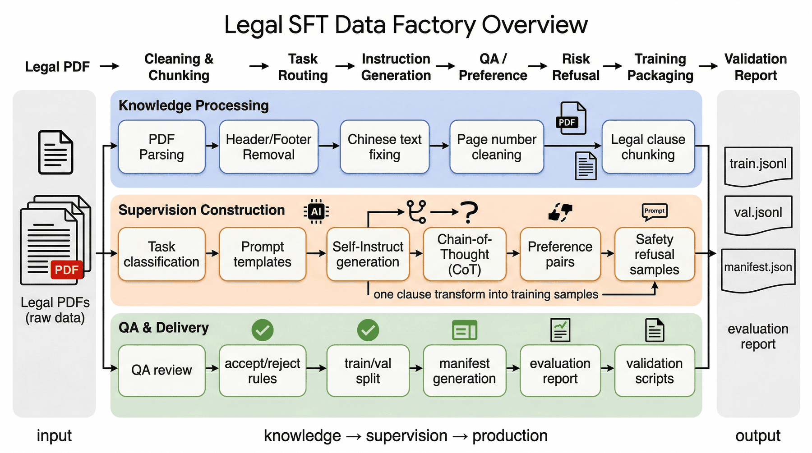

从工程视角看，本项目可以拆成三层。

### 4.1 第一层：知识处理层

这一层解决的是“有没有干净、可控的法律知识片段”。主要包括：

* PDF 解析
* 页眉页脚裁剪
* 中文断词修复
* 嵌入式页码清理
* 条文切块与结构化

这一步的目标不是生成训练样本，而是把原始法律文本转化成适合作为监督种子的知识单元。

### 4.2 第二层：监督构造层

这一层解决的是“如何把知识片段转成不同类型的训练样本”。主要包括：

* 任务类型划分
* Prompt 模板与指令体系设计
* Self-Instruct 合成
* CoT 显性化
* 偏好对构造
* 风险拒答样本构造

这一步是整个项目最核心的部分，因为它决定模型学到的是“背条文”，还是“在法律任务里稳定工作”。

### 4.3 第三层：质检与交付层

这一层解决的是“这些样本是否真的能用于训练与上线”。主要包括：

* QA 审核记录
* 接收/拒收规则
* 训练切分
* manifest 生成
* 评估报告
* 项目检查脚本

到这一步，项目才从“数据生成实验”变成“工程闭环”。

---

## 5. 工程前置：法律数据工厂的关键面

很多团队在刚接触垂直领域 SFT 时，会默认由一个算法工程师同时承担知识整理、模板编写、质量审核和训练集打包。但在法律场景里，这样的角色混合通常会很快失效。

一个更合理的拆法通常至少包括以下几类角色。

### 5.1 领域设计与知识边界

负责定义任务边界、确定样本类型、梳理法域覆盖、识别高风险问题。这个角色未必一定是执业律师，但至少要能区分哪些问题属于“可回答的知识问答”，哪些问题已经逼近“个案法律意见”。

### 5.2 数据处理与结构化编排

负责 PDF 解析、清洗规则、切块逻辑、数据 schema、中间产物落盘、切分与检查。这个角色关心的是数据的稳定生产能力，而不是单条回答写得多漂亮。

### 5.3 生成控制与任务编排

负责 Self-Instruct 模板、任务采样、提示词编排、结果后处理、批量调用与失败重试。它连接“知识输入”和“监督样本输出”。

### 5.4 QA 与验收闭环

负责制定审核协议、抽检规则、返工机制、错误标签和升级路径。在法律场景里，这个角色非常关键，因为项目最终是否可用，并不取决于模型生成过多少样本，而取决于错误样本有没有被识别并挡在外面。

### 5.5 关键职责面的作用

因为很多团队第一次做行业 SFT 时，真正卡住的不是“不会写代码”，而是没有把生产过程拆成角色和环节，导致：

* 任务边界没人定义
* 样本是否正确没人负责
* 返工规则没有落地
* 版本更新全靠口头同步

把职责分工写清楚，本质上是在说明：**行业 SFT 更像一条内容生产线，而不是单点脚本。**

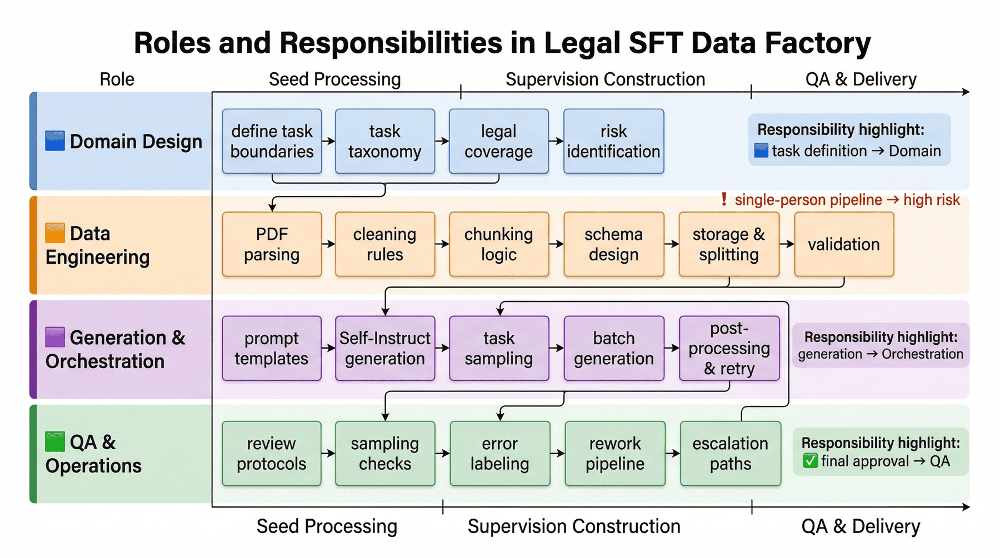

---

## 6. 种子数据：种子层作为监督起点

通用问答里，很多团队会直接从知识库、网页或论坛抓取问答对作为训练数据。但法律场景不适合这么做。

原因很简单：法律问答中，用户表述往往是不完整的，来源也不一定权威。如果直接把开放问答当训练真值，模型会学到大量模糊表达、未经验证的结论和不稳定的风格。

因此，本项目先从**法规与制度型文本**入手，构建一层相对稳定的种子语料。这一层的价值不是“覆盖所有用户问题”，而是提供可追溯、可解释、可切块的知识底座。

### 6.1 法规文本作为第一批种子

* 结构相对清晰，适合切块；
* 权威性相对较高，适合作为基础监督；
* 便于做法条解释、知识问答与规则归纳；
* 更容易在小规模项目中完成质量控制。

### 6.2 法规文本的边界

如果数据工厂只依赖法规文本，也会遇到两个明显问题。

第一，法规文本天然偏“规范表达”，不等于用户真实提问方式。
第二，法规文本更适合支撑“解释”与“引用”，但对复杂案情分析、模糊事实归类和商业场景口语化表达覆盖不足。

所以，法规文本适合作为第一层种子，但不应该被误认为是完整监督数据本身。

---

## 7. PDF 解析与智能清洗：法律文本的版式清洗

法律法规 PDF 最大的特点之一，是**内容很严谨，但版式对机器极不友好**。

人类阅读时，页眉、页脚、页码、水印、段落换行、双栏布局和断词并不会造成太大困扰；但对机器而言，这些都是会污染训练样本的噪声来源。

### 7.1 纯文本提取的局限

很多初学者在处理 PDF 时，会直接使用能输出字符串的工具，然后把文本送去做切分。这种做法在普通场景里可能还能勉强使用，但在法律场景里问题很大。

因为法律文本一旦被解析错位，最容易造成两种灾难：

* 原本分开的条文被拼成一句；
* 原本连续的法条逻辑被页码、页眉、断词切碎。

这不仅会影响样本可读性，更会让后续 Self-Instruct 基于错误片段生成“看起来合理、其实源头已经错了”的监督数据。

### 7.2 组件选型

| 组件     | 选型            | 作用            | 选择原因                                 |
| ------ | ------------- | ------------- | ------------------------------------ |
| PDF 解析 | `pdfplumber`  | 读取页面文本与坐标     | 能基于 Bounding Box 做页眉页脚裁剪，适合处理制度类 PDF |
| 清洗逻辑   | `Regex`       | 修复断词、去页码、去脏字符 | 法律 PDF 的很多错误是规则型的，正则在早期最直接可控         |
| 生成模型   | `DeepSeek-V3` | 指令合成与推理扩展     | 兼顾推理质量与成本，适合大规模合成                    |
| 编排逻辑   | `Python`      | 批处理、采样、后处理    | 便于快速构建最小可复现流程                        |

### 7.3 裁剪页眉页脚

法律 PDF 中，最典型的重复噪声来自页眉和页脚。比如每一页顶部重复出现法规名称，页脚重复页码或出版信息。如果不在解析阶段去掉，它们会被误当成正文反复进入训练数据。

因此，本项目在读取每一页时，直接裁剪掉上下各约 5% 的区域，只保留中间正文区域。这样做的优势在于：

* 比提取完再后清洗更稳，因为源头上减少了噪声进入；
* 对大多数法规 PDF 有良好的适配性；
* 实现简单，适合作为最小可复现方案。

对应实现如下：

```python
with pdfplumber.open(file_path) as pdf:
    for page in pdf.pages:
        width, height = page.width, page.height
        bbox = (0, height * 0.05, width, height * 0.95)
        page_crop = page.crop(bbox=bbox)
        text = page_crop.extract_text()
```

### 7.4 去除嵌入式页码

相比页眉页脚，更隐蔽的问题是嵌入在正文中的页码，例如：

```text
……应当依法承担相应责任。 - 195 - 当事人……
```

如果简单写一个“删掉破折号数字破折号”的规则，很容易误删正文中合法存在的编号或列表结构。因此，本项目通过更谨慎的正则约束页码的前后边界，只删除更像独立页码块的片段，而不轻易触碰正文编号。

这类清洗看起来像“胶水代码”，但在工程里往往非常关键。因为它决定的是：

> 我们是在对法律文本做精细修复，还是在用粗暴规则破坏条文本身？

### 7.5 修复中文断词

中文 PDF 常见的另一个问题是“假性空格”，例如：

```text
法 律 规 定
合 同 关 系
```

对人来说这不影响阅读，但对模型来说，这会破坏分词统计、影响生成流畅度，还会降低下游样本的可用性。因此，本项目对相邻中文字符之间的异常空格做了规则修复，并通过多次替换处理连续断词的情况。

### 7.6 细粒度清洗控制的必要性

因为行业 SFT 的第一步从来不是“想办法多生成数据”，而是**先保证种子层别脏**。只要种子文本里存在大量格式损伤，后面的模板、CoT、偏好和 QA 都会在脏基础上工作，成本只会越来越高。

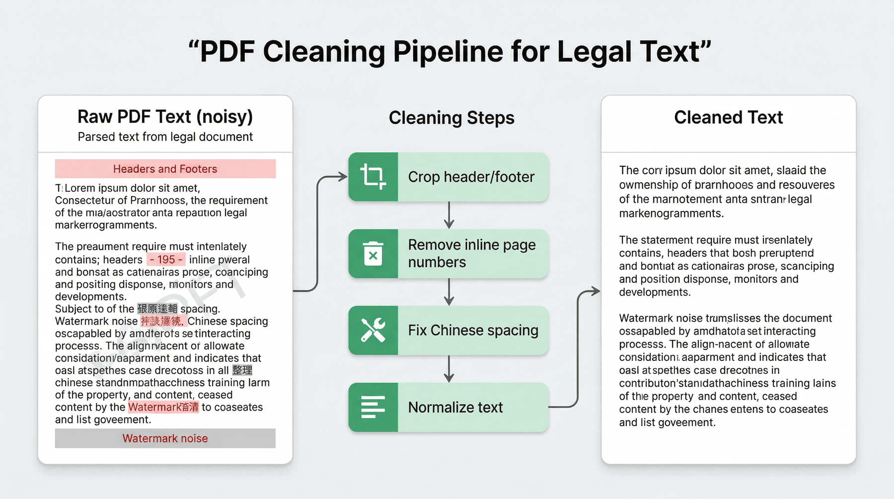

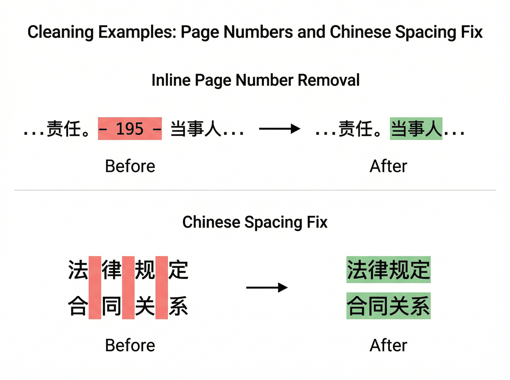

---

## 8. 切块与 schema：法律种子的结构化方式

完成基础清洗之后，项目并不会直接把长文本送入生成模型，而是先做**切块与结构化**。

### 8.1 切块作为必要步骤

一份法规或制度文本往往很长，直接输入模型会有三个问题：

* 上下文太长，成本高且噪声多；
* 不同条文之间主题混杂，不适合作为单一监督单位；
* 后续难以追踪样本来源，不利于 QA 与回溯。

因此，更合理的做法是以法条、条文段落或相对独立的知识片段为单位切块，把每个块都变成可追踪的 seed 样本。

### 8.2 schema 在这里解决什么问题

所谓 schema，不是为了好看，而是为了让后续所有环节都能基于统一字段协同。一个典型的法律种子样本，至少应该包含：

* `id`：唯一标识
* `source_name`：来源法规或制度名称
* `article_no`：条号或章节位置
* `text`：清洗后的正文片段
* `task_type`：后续要扩展成哪类任务
* `risk_level`：是否属于高风险主题
* `metadata`：版本、清洗日志、解析来源等附加信息

有了这层 schema，项目后续就可以：

* 追踪某条监督样本来自哪个法条；
* 比较不同来源的样本分布；
* 对高风险样本单独分流；
* 在训练集发现问题后反查上游 seed。

### 8.3 schema 作为种子层底座

因为很多数据项目失败，不是因为模型差，而是因为一开始没有建立统一字段，导致后面：

* QA 无法复核来源；
* 偏好对无法关联主体样本；
* train/val 切分无法按来源隔离；
* 版本回滚无从下手。

schema 是行业 SFT 工厂的底座，而不是附属物。

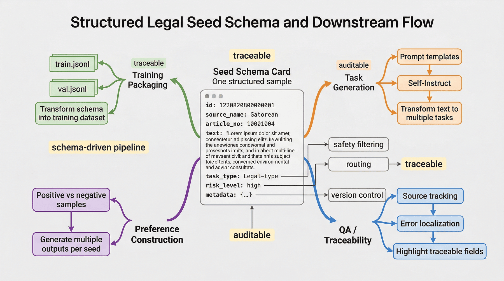

---

## 9. 任务体系：法律 SFT 的任务分层

如果让一个团队凭直觉去做法律 SFT，最容易得到的数据集往往是这样的（XXX 表示模板槽位，由具体条文编号填入）：

> Instruction：请解释《民法典》第 XXX 条。
> Output：该条规定了……

这种样本当然有价值，但如果整个数据集都长这样，模型最终只会成为一个“法条复述器”。

而法律场景真正需要的，不只是复述规范文本，而是能在不同任务形式下稳定工作。因此，本项目把监督任务至少拆成三大类。

### 9.1 法律问答（legal_qa）

这类任务面向更接近真实用户提问的场景，强调的是：

* 把规范表达转译成用户能理解的问题；
* 用相对清楚的自然语言给出回答；
* 在必要时进行条件说明和边界提示。

这类任务训练的是模型的“用户接口能力”。

### 9.2 法条解释（statute_explanation）

这类任务面向条文理解和规范释义，强调的是：

* 还原条文含义；
* 解释适用条件；
* 区分关键概念；
* 在必要时指出该条并不直接覆盖哪些情况。

这类任务训练的是模型的“规范表达能力”。

### 9.3 案情分析（case_analysis）

这是最接近法律推理的任务类型，强调的是：

* 从事实中提炼争点；
* 判断相关法条可能如何适用；
* 说明结论成立的条件与不确定性；
* 避免在事实不足时给出武断结论。

这类任务训练的是模型的“事实—规则映射能力”。

### 9.4 任务拆分的质量控制作用

任务拆分不是为了让表格更漂亮，而是为了避免一个非常常见的问题：

> 看起来样本很多，但其实所有样本都在重复训练同一种能力。

在法律领域，这种“表面多样、实际单一”的问题尤其严重。只有明确区分问答、解释、分析等能力，模型才有机会学到更完整的行为分布。

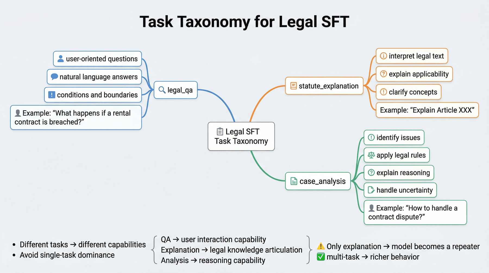

---

## 10. 任务分布与样本结构：分布均衡的控制方式

有了任务体系之后，下一个问题不是“能不能生成”，而是“生成后的分布是否健康”。

在本项目当前产物中，三类主体任务各有 2577 条，说明任务结构保持了相对均衡。最终训练集规模为 7737 条，这表明项目已经能够从法规种子扩展出更完整的监督数据资产。与此同时，法律来源分布并不均衡：民法典相关样本 3882 条、刑法 1710 条、公司法 855 条，不同法域的覆盖仍存在明显集中。

这组数字至少说明三件事：

第一，项目已经不是“随机做了一些样本”，而是形成了比较明确的任务结构。
第二，工厂已经具备从种子到多任务监督样本的扩张能力。
第三，法域覆盖仍然是下一步最需要优化的地方之一。

### 10.1 任务均衡与来源分布

如果只看任务类型，三类样本确实是平衡的。但如果继续往下看来源，会发现样本主要集中在少数法域。这意味着模型虽然在“任务形式”上学得较均衡，但在“知识分布”上仍可能偏向某些领域。

### 10.2 样本结构的重要性

因为总样本数只能回答“规模有多大”，却回答不了“模型会偏向哪里”。而在行业数据工程里，分布结构往往比绝对规模更重要。

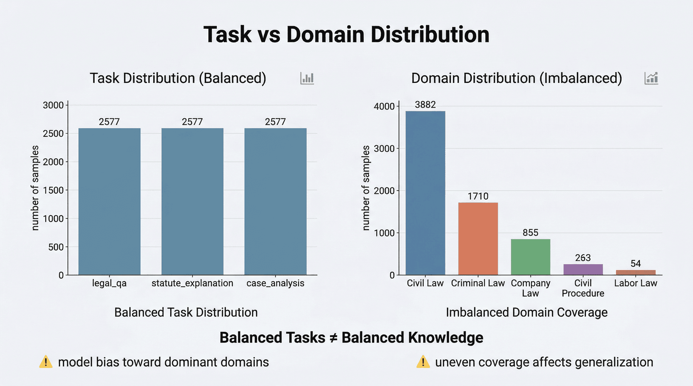

---

## 11. Self-Instruct：受控合成的必要性

从法规种子到 SFT 样本，中间最关键的一步是合成扩张。项目没有让人工逐条撰写所有法律问答，而是采用 Self-Instruct 方式，让教师模型基于法条和任务模板自动生成候选样本。

### 11.1 合成扩张的作用

如果完全依赖人工写作，项目会很快被成本拖垮。以当前项目的人工审核工时估算，已经达到 193.28 小时，对应审核成本约 23193.6 元。如果主体样本还全部靠人工撰写，整体投入会更高。相反，先利用教师模型自动扩张，再把人力集中到审核与难例上，是更现实的做法。

### 11.2 法律合成的约束

通用问答里，生成模型可以相对开放地写出各种自然语言回答；但法律场景里，自由发挥越大，风险就越高。因为模型很容易：

* 把无关条文拼接成看似正确的回答；
* 凭常识补齐其实没有依据的结论；
* 过度自信地输出“应该如何处理”的建议；
* 在边界问题上不留不确定性提示。

因此，本项目采用的是**模板约束下的合成**，而不是完全开放式生成。教师模型的自由度被控制在任务模板和格式要求里。

### 11.3 加权轮盘赌与任务采样

为了让数据分布符合预期，项目并不是对三类任务做简单平均随机，而是通过加权轮盘赌机制进行采样。其核心思想是：

* 复杂案情分析更能训练模型的高价值推理能力，因此权重更高；
* 法律文书或概念辨析这类任务也重要，但在当前阶段不需要让其过度挤占样本配额；
* 任务配比应该是一个可显式调整的工程参数，而不是隐含在随机数里的黑盒。

这种做法的价值在于，它把“数据分布”变成了一个可调控对象，而不是事后统计的结果。

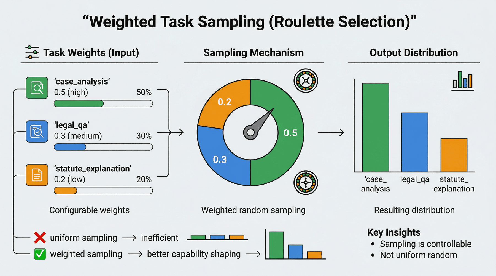

---

## 12. CoT 显性化：法律推理的表达约束

很多团队在做法律 SFT 时，容易把“专家感”理解成“回答写得很长、很正式”。但真正让模型更像法律助手的，往往不是篇幅，而是**推理过程是否可见、结论是否有层次、边界是否被表达出来**。

### 12.1 显式思维链的作用

案情分析类任务尤其依赖中间推理。如果训练数据只保留最终结论，模型往往只学会输出结果，而不会学会：

* 先识别争点；
* 再判断适用规范；
* 再给出条件化结论；
* 最后提示不确定因素。

因此，项目在生成后处理中，会尽量把模型输出中的“思考过程”字段显性化，再拼接成统一的 Markdown 或分段格式。这样做的目的不是追求“模型看起来像在思考”，而是给训练过程提供更完整的行为模板。

### 12.2 法律 CoT 的使用边界

法律场景里的 CoT 也不能无限展开。过长、过细、过于像内部推演日志的推理，不一定适合直接作为最终用户回答。更实际的做法是把 CoT 控制在“结构化推理”层面，例如：

1. 提炼争点
2. 对照规则
3. 分析适用条件
4. 给出结论与边界

这种形式既能保留推理路径，又不会把样本变成冗长的自说自话。

### 12.3 CoT 的工程价值

在这个项目里，CoT 的价值主要体现在两个方面：

* 帮助模型学到更接近法律分析的表达顺序；
* 为 QA 审核提供更清晰的中间依据，便于识别“结论对了但推理错了”的样本。

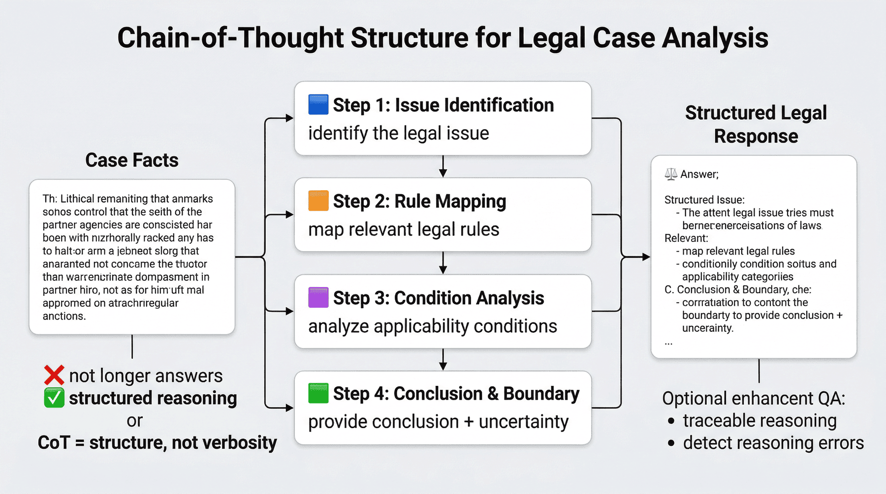

---

## 13. 偏好对与评审记录：多层监督信号

只有 SFT 样本，往往只能告诉模型“什么是一个可接受答案”；但在法律场景里，这还不够。因为很多回答并不是简单的“对”或“错”，而是存在风格、风险、边界控制和表达审慎度上的差异。

这正是偏好对的重要性所在。

### 13.1 偏好对在法律场景中的作用

它解决的是下面这种情况：

* 两个回答都基本正确，但其中一个更克制、更清楚、更少武断结论；
* 两个回答都引用了规则，但其中一个更能说明适用条件；
* 两个回答都给了建议，但其中一个更能区分信息性说明和法律意见。

这些差异很难只靠单标签表达，而偏好对正适合表达“哪个更好”。

### 13.2 当前项目的偏好信号建设

项目现有产物显示，偏好对数量为 7731，与主体接受的 SFT 数量基本并行。这说明工厂不是先把 SFT 做完再临时补一点偏好，而是在一开始就把偏好信号视为与主体监督并行建设的资产。

### 13.3 评审记录的作用

很多团队做完 QA 后，只保留“通过”样本，不保留评审记录。这会导致两个问题：

* 后续没人知道这条样本为什么被接受或拒绝；
* 无法回收失败样本并反向修订模板。

因此，本项目把评审记录纳入产物的一部分。这样做的好处是：

* 可追踪样本质量历史；
* 可支持二次仲裁；
* 可从拒收原因中沉淀错误模式；
* 可为下一轮模板优化提供依据。

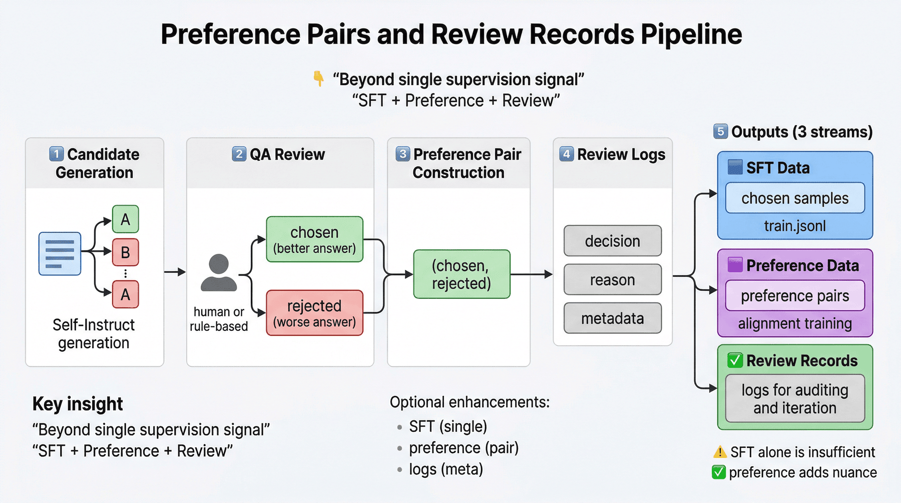

---

## 14. 风险拒答：边界控制数据

法律场景是典型的高风险场景。模型并不是“答得越多越好”，而是必须知道**在哪些时候应该拒绝、转人工或保留边界**。

### 14.1 风险拒答与 system prompt 的关系

很多团队在上线前会想：反正系统提示词里已经写了“不要提供具体法律意见”，那就够了。实际上远远不够。

因为模型真正学到的行为模式首先来自训练数据。如果训练集中大量存在：

* 对个案直接下结论；
* 对证据不足的问题给出确定性建议；
* 对高敏感问题输出过于操作性的回答；

那么仅靠推理时的 system prompt 往往很难稳定地把这些行为压住。

### 14.2 风险拒答样本的作用

风险拒答样本的本质，是给模型提供“怎样安全地不答”的行为范式。例如：

* 明确说明信息不足；
* 提醒需要结合具体事实和证据；
* 区分一般性法律信息与个案意见；
* 建议寻求专业人士进一步判断。

### 14.3 当前项目的风险边界建设

现有产物中，风险拒答样本和风险登记项均为 6 条。这个数量不大，但它传递了一个重要信号：项目已经把风险边界从“口头注意事项”变成了**显式数据资产**。

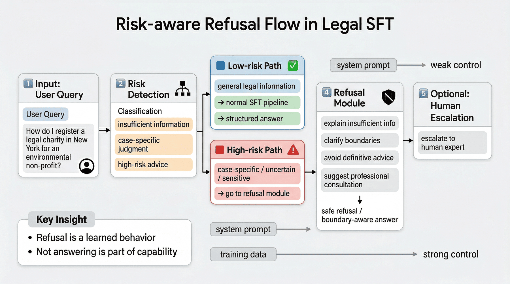

---

## 15. QA 协议：法律数据的质量门

行业 SFT 最容易被低估的环节，就是 QA。很多时候，团队把大部分精力放在“怎么生成更多样本”，却忽略了真正决定上线质量的是“怎么挡住坏样本”。

法律场景中，一个合格的 QA 协议至少应该回答三件事：

1. 什么样的样本应该被接受？
2. 什么样的样本必须被拒收？
3. 发现问题后如何返工，而不是只做一次性清洗？

### 15.1 审核维度

可以将审核维度拆成五项：

* **正确性**：结论是否与种子法规及任务意图一致；
* **完整性**：是否遗漏关键条件、例外或适用前提；
* **表达清晰度**：是否能被非专业用户理解；
* **格式一致性**：是否符合既定输出模板；
* **风险边界**：是否越界给出个案化、武断化或高敏感建议。

### 15.2 接收、返工与拒收规则

一个可执行的 QA 协议，不应该只有“通过/不通过”两种状态。更实用的设计至少包括：

* **Accept**：可直接进入训练集；
* **Revise**：主体正确，但表达、格式或边界不足，需要返工；
* **Reject**：事实或规范错误、风险过高、任务不匹配，不进入训练资产。

### 15.3 错误标签化

建议在 QA 记录中为拒收样本打上错误标签，例如：

* 引用错误
* 结论越界
* 条件缺失
* 风格不当
* 任务错配
* 事实不足仍强行回答

### 15.4 QA 协议的必要性

如果只写生成逻辑，不写 QA 协议，行业 SFT 就很容易退化成“数据生成教程”，而不是“数据工厂方法”。

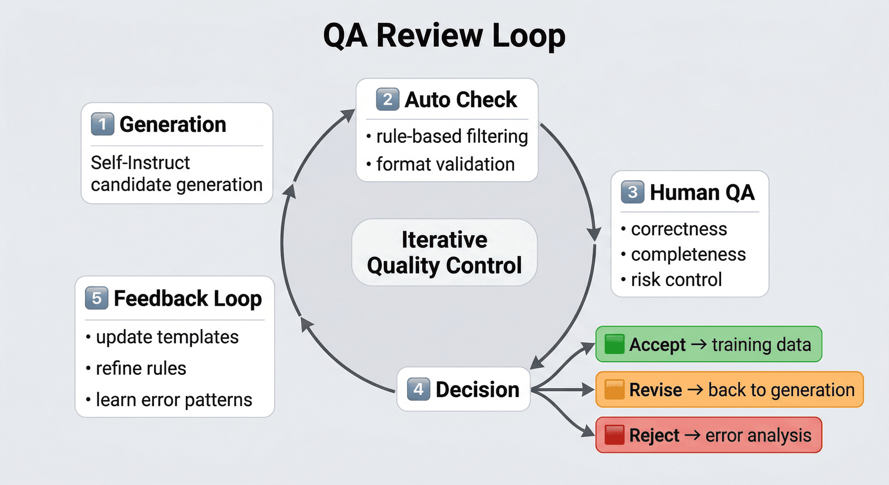

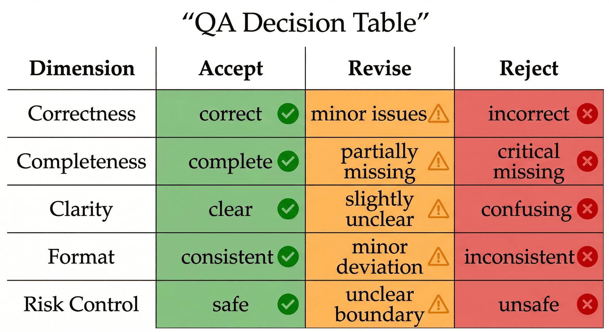

---

## 16. 供应商协同与人机分工：规模扩展下的审核机制

在小规模实验里，团队成员往往还能自己完成大部分审核工作。但一旦项目进入持续迭代，人工审核成本会很快成为主要瓶颈。

当前项目的人工审核工时估算约为 193.28 小时，审核成本约为 23193.6 元。这个数字说明，哪怕当前仍是一个方法演示级项目，人审开销已经不低。如果继续扩量，而没有更合理的分层审核与供应商协同机制，成本会迅速失控。

### 16.1 分层审核

并不是所有样本都需要同等级别的人力介入。更合理的做法通常是：

* 低风险、规则清晰的样本先走机器预审；
* 中风险样本由标注员或领域运营审核；
* 高风险或分歧样本再升级到资深人员或专家仲裁。

### 16.2 供应商协同的风险点

一旦引入外部标注或审核资源，团队最容易掉进两个坑里：

* 只给“做什么”，不给“为什么这么做”；
* 只给规范，不给反例和边界示例。

法律场景尤其如此。单纯一份“请判断回答是否正确”的指南远远不够。审核者需要看到：

* 哪些回答虽然基本正确，但因为太武断仍需退回；
* 哪些回答虽然保守，但保守过度也不合格；
* 哪些问题触发风险拒答而不是继续补充回答。

### 16.3 协同机制的工程位置

因为数据工厂的“工厂”二字，最终一定要落在协作机制上。只写模型、模板和脚本，而不写人与流程，很难真正支撑团队落地。

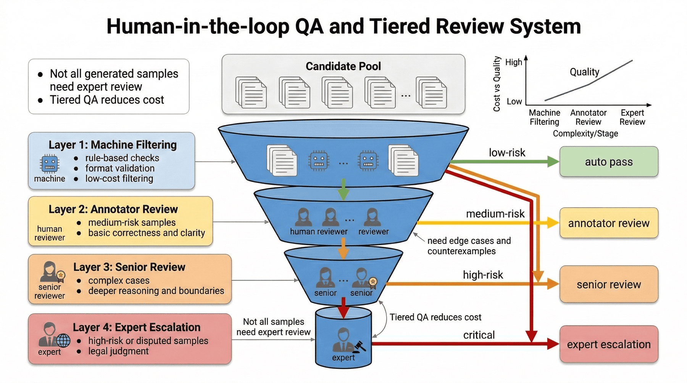

---

## 17. 训练封装：从监督样本到训练接口

生成、审核和偏好构造完成后，数据工厂还需要把这些产物封装成训练侧可直接消费的接口。

### 17.1 训练封装作为独立阶段

很多项目做完样本就结束了，但真正进入训练时才发现：

* 字段不统一，训练脚本读不进去；
* train/val 切分不稳定；
* smoke test 不能代表真实样本格式；
* 报告、metrics 和数据文件互相对不上。

因此，训练封装并不是简单导出一个 JSONL，而是要确保：

* 主体字段齐全；
* 训练与验证切分可复现；
* manifest 能描述数据范围与版本；
* smoke test 能快速暴露接口问题。

### 17.2 本项目的主要训练产物

* `final_sft_dataset.jsonl`
* `train.jsonl`
* `val.jsonl`
* `smoke_test.jsonl`
* `training_manifest.json`

### 17.3 smoke test 的作用

smoke test 的价值不在于评估模型性能，而在于尽早发现训练链路中的明显问题，例如字段缺失、编码错误、样本格式不一致或读取逻辑和 manifest 不匹配。

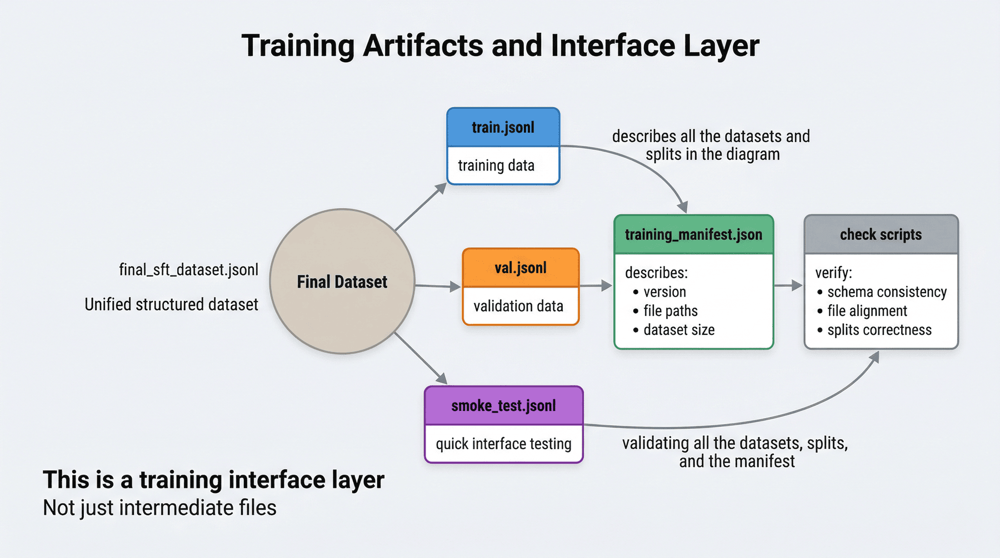

---

## 18. 结果展示：当前项目产出概况

从现有结果看，P02 已经形成了比较完整的法律领域监督资产，而且在新增下游验证后，这个项目不再只是“数据工厂流程跑通”，而是开始具备了**对监督信号有效性做轻量验证**的能力。

### 18.1 样本规模

* 种子法条数：`2577`
* 通过模板教师生成的高价值 SFT：`7731`
* 通过启发式裁判过滤或构造的低质量对照：`7731`
* 偏好对数量：`7731`
* 最终训练集规模：`7737`

这说明项目已经从原始法规种子扩展出一套规模可观、结构完整的监督资产，而不是停留在少量手工样本或一次性示例数据上。

### 18.2 任务分布

当前三类主体任务保持完全对齐：

* `legal_qa = 2577`
* `statute_explanation = 2577`
* `case_analysis = 2577`

这种分布意味着项目在任务层面具备较好的配比控制能力，没有出现某一任务类型显著挤占样本空间的情况。

### 18.3 来源分布

当前法律来源分布为：

* `中华人民共和国民法典 = 3882`
* `中华人民共和国刑法 = 1710`
* `中华人民共和国民事诉讼法 = 951`
* `中华人民共和国公司法 = 855`
* `中华人民共和国劳动法 = 333`

这说明项目已经具备跨法域扩张能力，但不同法域的覆盖仍不均衡，民法典相关样本占比明显更高。

### 18.4 偏好与风险数据

* QA 评审记录：`7731`
* 高风险拒答样本：`6`
* 平均 QA 评分：`5.0`

这说明项目并不是只在建设主体 SFT 数据，而是在同时建设 QA、偏好和风险边界相关的辅助监督层。对行业 SFT 而言，这一点往往比单纯提升样本总量更重要。

### 18.5 训练与交付层产物

* 训练集拆分：`train = 6947`、`val = 790`、`smoke = 24`
* `training_manifest.json` 已完成封装
* 项目检查链路通过，训练与报告侧产物能够互相对齐

这说明项目的输出已经不是“若干 JSONL 文件”，而是一组可被训练侧直接消费并可被检查脚本一致性验证的资产。

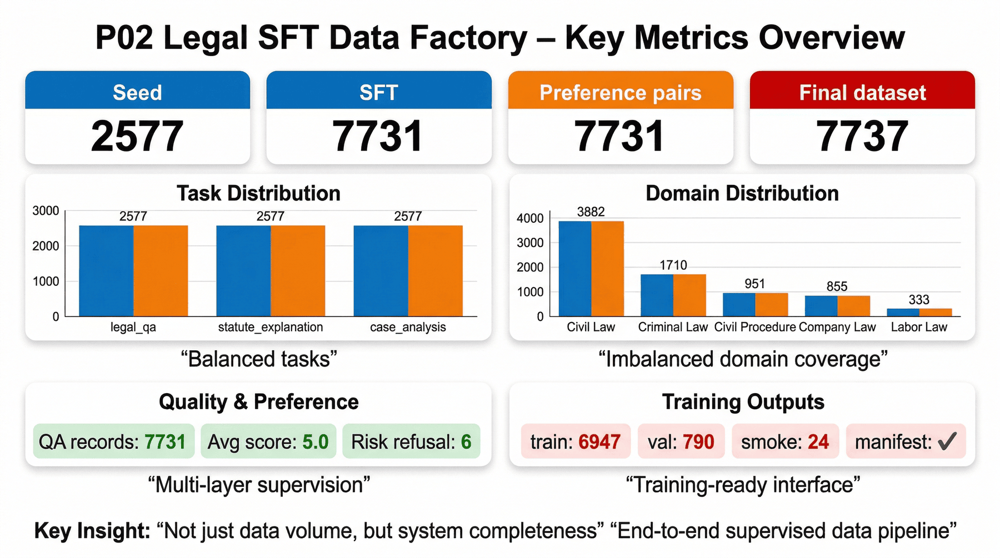

---

## 19. 轻量下游验证：最小验证设计

在前面的版本中，P02 已经能说明“数据工厂跑通了”。但仅仅证明流程存在还不够，更重要的是回答下面这个问题：

> 这些经过 QA、偏好构造和风险治理的数据，真的比未经处理或低质量候选更好吗？

新增的轻量下游验证，正是为了解决这个问题。

### 19.1 验证设计

项目在固定随机种子 `seed = 20260409` 下，随机抽样 50 条配对样本，对 `chosen` 与 `rejected` 两类数据做轻量质量验证。这里的目标并不是追求完整的模型基准测试，而是以一种成本可控、可复现的方式，快速回答偏好和 QA 是否真的拉开了质量差距。

这种验证方式适合当前阶段的项目目标。这里关注的是数据工程方法，而不是完整的下游模型论文。一个好的下游验证，不必一开始就很重，但它至少应该满足三个要求：

* 能复现；
* 能解释；
* 能直接对应前面的数据设计假设。

### 19.2 验证指标

在这次 50 条抽样中，项目使用了几类非常有代表性的指标：

* `chosen` 平均质量分
* `rejected` 平均质量分
* 配对胜率
* 法条引用覆盖率
* 不安全捷径表述率

这些指标的好处在于，它们不是纯抽象分数，而是与法律 SFT 的真实目标直接相关：

* 质量分反映总体可接受程度；
* 配对胜率反映偏好构造是否真正区分了好坏答案；
* 法条引用覆盖率反映回答是否保留了法律依据；
* 不安全捷径表述率反映高风险、武断化表达是否被有效压制。

### 19.3 验证结果

从当前结果看：

* `chosen` 平均质量分：`5.0 / 5`
* `rejected` 平均质量分：`1.0 / 5`
* 配对胜率：`100.00%`
* 法条引用覆盖率：`chosen = 100.00%`，`rejected = 0.00%`
* 不安全捷径表述率：`chosen = 0.00%`，`rejected = 100.00%`

这组数字虽然来自轻量抽样，但已经非常清楚地说明：

第一，当前的偏好构造与 QA 机制，不是形式上的“做了评审”，而是确实把高质量样本和低质量样本区分开了。
第二，在法律场景中非常关键的两个目标——**保留法条依据**与**避免武断捷径表达**——在 `chosen/rejected` 之间表现出显著差异。
第三，P02 的监督设计开始具备一种很重要的工程特性：不仅能生产样本，还能初步证明这些样本为什么值得进入训练集。

### 19.4 轻量验证与重基准的区别

需要强调的是，这里的下游验证仍然是**轻量验证**，不是完整的训练 benchmark，也不是面向论文风格的消融研究。它的价值不在于替代大规模评测，而在于为本章补上一块过去最薄弱的拼图：

> 从“数据结构合理”进一步走向“数据效果有初步证据支持”。

这一步已经非常重要。因为很多数据工程项目最大的问题就是只讲构造流程，不讲任何后验验证，最后很难判断产出的数据是否真的有效。

### 19.5 这组结果在工程上的含义

这次轻量验证至少带来了三个工程层面的信号。

第一，说明偏好对和 QA 记录值得保留，而不是可有可无的附属物。它们不仅帮助筛样本，也为后续训练提供了更清晰的行为边界。

第二，说明“法律依据显式化”这条设计是有效的。`chosen` 样本在法条引用覆盖率上达到 100%，而 `rejected` 为 0%，说明当前模板与质检机制已经能显著推动模型输出更像真正的法律说明，而不是泛泛而谈。

第三，说明“安全边界显式化”开始生效。`chosen` 的不安全捷径表述率为 0%，`rejected` 为 100%，这意味着项目已经能够在数据层面主动压制高风险表达，而不是把这件事完全留给推理时的 system prompt。

### 19.6 如何解读这类实验

这类实验的重点不在于宣称达到某个极限结果，而在于说明三件事：

* 已经补上了一个最小可复现的下游验证；
* 它直接验证了前面提出的关键设计假设；
* 它为后续更重的训练实验提供了方向，而不是试图一次性解决全部评测问题。

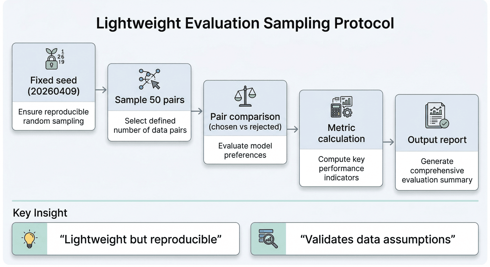

---

## 20. 结果解读：当前数据工厂的结构性信号

仅仅罗列结果，意义有限。更重要的是理解这些数字所反映的工程状态。

### 20.1 从 2577 到 7737，说明工厂具备扩张能力

这说明项目已经实现了从知识种子到多任务监督数据的扩张，而不是停留在“整理法规文本”这一步。

### 20.2 三类任务均衡，说明任务框架是稳定的

如果某一类任务远多于其他任务，通常意味着模板体系或采样逻辑存在失衡。而当前三类任务数量完全对齐，说明任务分发层已经具备较高的可控性。

### 20.3 法域分布不均衡，说明下一阶段的重点不是继续扩量，而是补覆盖

当前主要矛盾已经不是“有没有样本”，而是“样本覆盖得是否均衡”。这比简单地继续堆数量更重要。

### 20.4 偏好、QA 与轻量下游验证一起，说明项目正在从“会答”走向“答得更稳”

如果只有主体 SFT，很难证明模型学到的是不是更好的法律行为模式；如果只有偏好对而没有验证，也很难证明偏好构造是否真的发挥了作用。现在新增的 50 条轻量下游验证，为偏好和 QA 提供了一个直接的后验证据：`chosen` 与 `rejected` 在质量、引用和安全性上已经被明显拉开。

也就是说，当前项目开始具备一种更成熟的数据工程特征：

> 它不仅能生成训练样本，还能通过最小验证证明“什么样的样本更值得训练”。

### 20.5 人审成本已经可见，说明后续必须考虑自动化与协同优化

193.28 小时的人审成本在小规模演示项目里已经不算低。否则很容易误以为“多生成一点法律数据只是多花一点 API 钱”。实际上，真正贵的往往是后面的审核与返工。

### 20.6 这次补充带来了什么变化

新增的轻量下游验证，补上了“怎么判断数据设计是否有效”这一环。

因此，这一章不再只是“法律 SFT 数据工厂流程说明”，而形成了更完整的工程闭环：

* 有目标与边界；
* 有数据链路与任务设计；
* 有 QA、偏好与风险控制；
* 有训练接口与检查闭环；
* 也有最小可复现的下游验证来支撑前面的设计判断。

---

## 21. 质量基线：法律 SFT 数据的可用标准

这里的质量基线，不是追求一个抽象的满分标准，而是明确说明：什么样的数据已经足以进入训练，什么样的数据还必须继续返工。

这类项目至少需要建立以下四条基线。

### 21.1 正确性基线

回答不能明显违背种子法规含义，不能凭空添加关键结论，不能把适用条件遗漏到影响结论的程度。

### 21.2 表达基线

回答应该清楚、完整、少歧义。即使是法律术语，也要尽量做到对非专业用户可读，而不是机械复制法条。

### 21.3 格式基线

同类任务应遵循一致的输出骨架。例如案情分析类应尽量包含争点、规则、分析与结论，而不是有时是一段话、有时是一组碎片。

### 21.4 风险基线

高风险问题必须体现边界感。遇到证据不足、事实不全或明显逼近个案意见的问题，回答应该保留谨慎表达或触发拒答模板，而不是强行给出明确判断。

### 21.5 基线与单次分数

相比抽象地说“整体质量不错”，质量基线更像门槛：过线了才能进入下一步，没过线就必须返工。这比单一平均分更有工程价值。

---

## 22. 版本演进：行业 SFT 数据集的版本管理

一个成熟的数据工厂，不会把第一版数据集视为最终答案。相反，它应该天然支持版本演进。

### 22.1 V1：先把法规清洗与切块跑通

第一版的价值，是建立从 PDF 到结构化 seed 的稳定链路。它回答的是：种子层能不能可靠地产生。

### 22.2 V2：引入三类主体任务

第二版的价值，是让数据从“知识片段”进入“监督样本”。这一版解决的是任务体系和分布控制问题。

### 22.3 V3：加入偏好对与评审记录

第三版的价值，是让样本不仅能训练“正确回答”，还能训练“更好的回答”，并让质量历史变得可回溯。

### 22.4 V4：加入风险拒答与上线边界

第四版的价值，是把高风险行为单独建模，让工厂具备最基本的合规与安全感知能力。

### 22.5 版本演进的记录价值

它能非常直观地说明：数据工厂不是一下子长成的；每一版都有自己的核心目标；不是所有问题都应该在第一版解决；版本升级的触发条件，应该来自真实问题，而不是抽象完美主义。

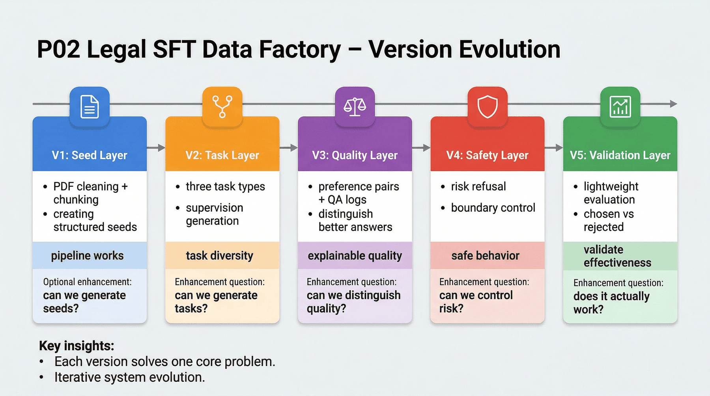

---

## 23. 成本优化：法律数据的主要成本项

很多团队在做大模型数据项目时，最先想到的是模型 API 成本。但在法律 SFT 里，真正昂贵的部分通常不是生成，而是：

* 人工审核
* 错误返工
* 高风险样本升级处理
* 版本回归检查

### 23.1 当前项目的成本启示

当前项目的人审工时已经达到 193.28 小时，这个数字本身就是一个非常好的提醒：行业数据工厂从来不是“模型多跑一点”的问题，而是“人机协同如何不失控”的问题。

### 23.2 哪些环节最值得优先自动化

在法律场景里，优先自动化的通常不是最终仲裁，而是前面的机械性筛选，例如：

* 格式不合格样本剔除；
* 低风险模板样本的预审；
* 明显越界表述的规则拦截；
* 评审记录的错误类型聚类。

### 23.3 成本分析的必要性

因为项目部分不只是展示“方法可行”，还应该说明投入产出关系。如果一个方案理论上很好，但现实里无法承受其人力成本，那么它就不是真正可落地的方法。

---

## 24. 验证闭环：法律数据流水线的一致性检查

一个项目是否成熟，不能只看有没有输出文件，更要看有没有一致性验证。

### 24.1 检查脚本的作用

因为行业数据项目很容易出现“局部都对、整体不通”的问题。比如：

* 代码能运行，但产物缺文件；
* 样本数看起来正常，但 train/val 有泄漏；
* metrics 写着通过，report 却引用了旧数字；
* 偏好对数量和主体样本数量对不上；
* smoke test 不代表真实训练格式。

### 24.2 当前项目的验证状态

项目检查结果为：

* 总检查项：13
* 通过检查项：13
* 总体状态：PASS

命令级检查覆盖 `py_compile`、`evaluate_factory` 等；数据/产物级检查覆盖 `required_files_exist`、`seed_count_positive`、`accepted_count_matches_seed_x_tasks`、`preference_pairs_cover_accepted`、`qa_reviews_cover_accepted`、`train_val_no_overlap` 等关键项目。

### 24.3 验证闭环的工程作用

因为它体现了一种非常重要的工程习惯：数据项目的完成标准，不是“看起来生成了很多文件”，而是“代码、产物、统计与报告彼此一致”。

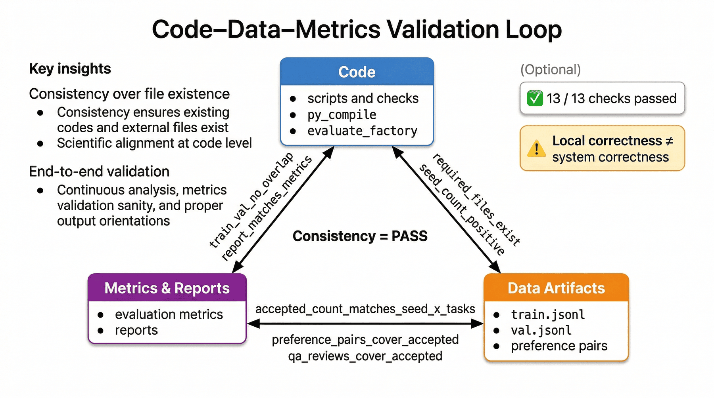

---

## 25. 局限与风险：当前工厂的约束

一个只讲成功的案例，通常不够可信。法律 SFT 尤其如此，因为它天然受制于数据来源、审核成本和风险边界。

### 25.1 法域覆盖不均衡

当前样本明显偏向少数法域，这会导致模型在知识广度上的表现不均匀。下一阶段最重要的工作之一，就是补齐长尾法域与真实业务高频问题。

### 25.2 合成比例较高

虽然合成是成本可控的必要手段，但合成比例过高会带来模板腔和教师偏置问题。模型可能学会“像模板那样回答”，却不一定真正掌握多样的用户表达。

### 25.3 风险拒答样本仍然偏少

当前已经建立了风险拒答机制，但样本规模仍小。对于真正的上线场景，这还远远不够，特别是在个案化建议、敏感争议、证据不足判断等场景下，需要更丰富的拒答与保留边界样本。

### 25.4 QA 成本高

随着样本规模扩大，人审成本会继续抬升。如果不在流程上引入更细粒度的预审、仲裁和复标机制，后续扩量会面临明显阻力。

---

## 26. 跨行业迁移：法律工厂的样板价值

法律并不是唯一需要垂直领域 SFT 的行业，但它是一个非常好的样板。原因在于，法律场景同时具备以下特征：

* 知识强结构化
* 任务强约束化
* 风险边界清晰
* QA 需求刚性
* 人机协同成本高

而这些特征，其实同样存在于税务、金融、医疗、客服合规等行业。

### 26.1 可直接迁移的设计

* 从非结构化文档到结构化 seed 的清洗链路；
* 任务体系先拆分、后扩量的做法；
* SFT、偏好对、风险拒答并行建设的思路；
* QA 协议、错误标签与返工机制；
* 训练封装与验证闭环。

### 26.2 不可直接照搬的部分

* 法律场景中的风险边界不等于医疗或金融边界；
* 法条解释类任务在其他行业未必是主任务；
* 法律文书风格不等于客服或销售风格；
* 高风险拒答的触发条件需要按行业重写。

### 26.3 可迁移的方法链

真正能迁移的不是某个具体 prompt，而是这条方法链：

> 找到权威种子 -> 做结构化切块 -> 设计任务体系 -> 受控合成扩张 -> 建立 QA 与偏好 -> 单独建模风险边界 -> 训练封装与一致性验证。

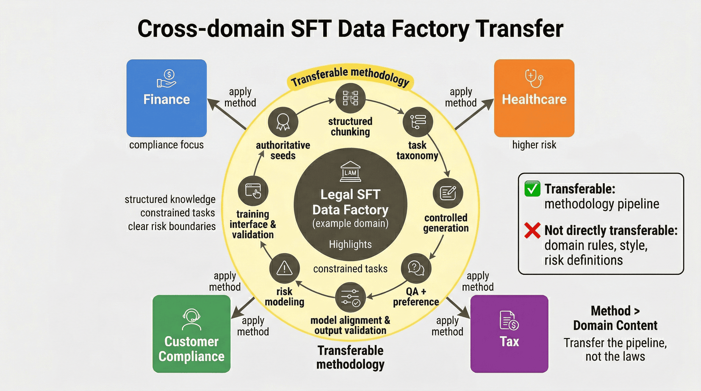

---

## 27. 主要交付物清单

这里给出主要交付物清单。

### 27.1 种子与处理中间产物

* `data/processed/raw_chunks.jsonl`
* `data/processed/legal_seed_dataset.jsonl`
* `data/processed/instruction_taxonomy.json`

### 27.2 主体监督与辅助监督产物

* `data/processed/domain_expert_sft.jsonl`
* `data/processed/synthetic_candidates_rejected.jsonl`
* `data/processed/legal_preference_pairs.jsonl`
* `data/processed/legal_qa_review.jsonl`
* `data/processed/legal_risk_refusal_sft.jsonl`
* `data/processed/legal_risk_register.jsonl`

### 27.3 训练接口产物

* `data/training/final_sft_dataset.jsonl`
* `data/training/train.jsonl`
* `data/training/val.jsonl`
* `data/training/smoke_test.jsonl`
* `data/training/training_manifest.json`

### 27.4 报告与验证产物

* `data/reports/p2_report.md`
* `data/reports/p2_metrics.json`
* `data/reports/p2_test_results.json`

把这些交付物列出来，不只是为了呈现清单，而是为了说明：一个行业 SFT 工厂的结果并不只是一个训练集文件，而是一组彼此关联的数据资产。

---

## 28. 小结：把生成组织成工厂

回看整个项目，会发现它真正解决的问题，并不是“怎样让模型多生成几条法律问答”，而是：

* 怎样从权威但脏乱的 PDF 中提取可用知识；
* 怎样把知识拆成不同类型的监督任务；
* 怎样让生成过程可控，而不是胡乱扩张；
* 怎样通过偏好对和风险拒答把模型行为边界也做成数据；
* 怎样把 QA、成本、版本和验证闭环一起纳入工厂设计。

这也是本章最想传达的一件事：

> 在高专业度行业里，SFT 数据工程的目标从来不是“多做一点样本”，而是建立一条能持续稳定生产高质量监督资产的流水线。

法律只是这套方法的一个代表场景。只要掌握了这条从种子到监督、从生成到质检、从样本到上线接口的链路，团队就具备了构建其他行业数据工厂的基本方法底座。

---

## 专题：法律 SFT 数据的发布门禁

法律领域数据工厂和通用问答数据工厂最大的不同之一，在于它天然承受更高的错误成本。对一般问答来说，回答不够好可能只是体验差；对法律问答来说，错误监督信号很可能直接放大到风险建议、拒答边界和专业可信度上。因此，P02 这类项目在进入版本发布时，更需要明确的门禁条件。

### 一、发布前需要同时看内容风险和工程风险

法律 SFT 数据不能只看“数据量够不够”或“格式齐不齐”，还需要同时判断：

* 法条引用、案例归纳和风险提示是否存在明显错误或过时表达；
* 拒答样本和高风险咨询样本是否覆盖关键边界；
* 偏好对和 QA 记录是否真的支撑当前版本结论；
* 训练接口、manifest 和测试结果是否与版本产物一致。

也就是说，法律数据版本的发布门槛天然比普通数据更高，因为它既要通过内容可信度检查，也要通过工程一致性检查。

### 二、门禁的价值在于让“谨慎”成为系统属性

很多团队在做行业数据时，会把谨慎留给后期人工审核，但更稳妥的做法，是把谨慎前移成发布门禁。只要门禁被结构化写下来，团队就会逐渐形成一种稳定习惯：不是先发布再补解释，而是先确认风险边界、监督资产和验证证据，再决定这一版是否进入训练与展示。这种机制化的谨慎，恰恰是行业 SFT 数据最值得保留的长期能力。

