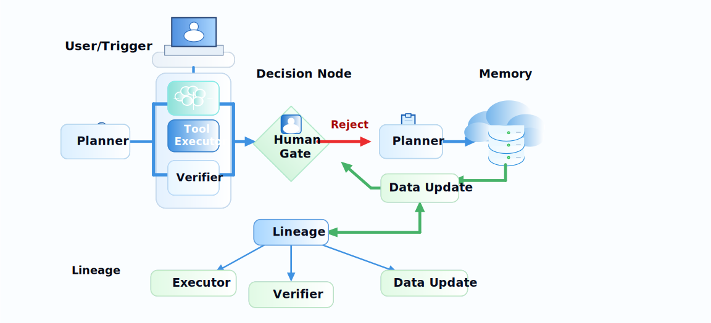
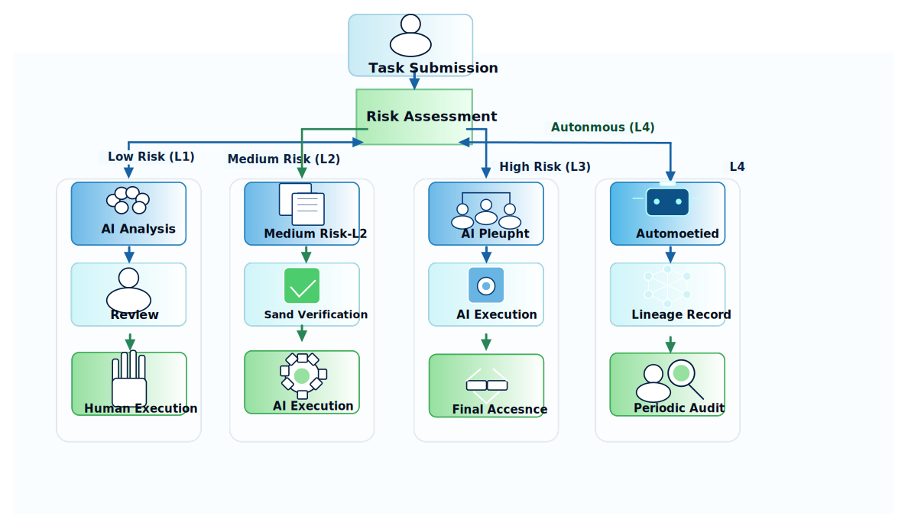

# 第31章：数据工程 Agent 的架构与任务边界

<div class="chapter-authors">汪志立（ZhiLi Wang）</div>

---

## 摘要
传统数据工程流水线大多依赖工程师手动编写有向无环图（Directed Acyclic Graph，DAG）、配置调度规则、监控任务状态、排查数据质量异常。随着数据源数量膨胀、清洗规则复杂化、标注需求指数增长，人工维护的边际成本急剧上升。数据工程 Agent 的出现试图改变这一局面：将数据工程中重复性、规则密集型、多步骤决策的环节交给 Agent 系统自动完成。然而，当 Agent 被赋予越来越多自主权时，一个底层问题迅速浮现——**任务边界不清**。Agent 应该自主到什么程度？哪些决策必须过 human gate？工具调用的审计链如何保证可追溯？多个 Agent 之间的职责如何划分而不产生冲突？

本章围绕数据工程 Agent 的**系统分层架构**展开，从 Planner、Tool Executor、Verifier、Human Gate、Memory 与 Lineage 六个核心组件出发，定义每一层的职责边界、通信协议与故障隔离策略。我们继承 Ch18-Ch20 的推理、Tool-use 与 Agent 记忆机制，承接 Ch24-Ch26 的平台、版本管理与可观测性基础，在此基础上构建一套面向数据工程场景的 Agentic 架构规范。为了避免架构讨论停留在抽象层，本章会把 DataAgent 作为贯穿案例：它的 YAML 配置格式、FlexAgent、 自然语言到 SQL（NL2SQL）子 Agent、Semantic Service、workspace 与Agent-to-Agent（A2A）/软件开发工具包（SDK）/命令行接口（CLI） 入口，正好对应数据工程 Agent 从"会调用工具"走向"可配置、可审计、可服务化"的工程路径。我们不讨论某一个 Agent 如何"更智能"，而是讨论一组 Agent 如何"更有序"地协作完成数据工程任务。

---

## 关键词

数据工程；Data Engineering Agent；自动化数据工程；权限治理；人机协同

## 学习目标

通过本章学习，读者应能够：

- 理解数据工程场景中 Agent 系统分层的必要性与核心原则。
- 掌握 Planner、Tool Executor、Verifier、Human Gate、Memory 与 Lineage 六层组件的职责边界。
- 设计跨层通信协议与故障隔离策略，避免"Agent 失控"或"幽灵调用"。
- 区分不同自动化等级（建议型、半自动型、审批型、自治型），并据此分配 Agent 权限。
- 构建最小可行 Data Engineering Agent（MVP），并评估其投入产出比。
- 理解 DataAgent 如何作为企业级数据工程 Agent 的参考实现，承载语义层、主子 Agent 协同、工具边界和运行审计。

---

## 场景引入：当 Agent 越过边界

某数据团队投入三个月构建了一套"全自动数据清洗 Agent"。上线第一周表现亮眼：Agent 自动识别了 80% 的异常格式，修复了 200 多个字段级别的质量问题。第二周开始出现状况——Agent 在修复一个时间戳字段时，误将整个表的 `updated_at` 全部改写为当前时间，导致下游 12 条依赖管道产生级联数据污染。工程师花了三天才定位到根因：Agent 的"修复计划"未经人工审核即执行，且 Verifier 层只检查了格式正确性，未校验语义合理性。

更深层的分析揭示了三类系统性问题：

**问题一：Planner 与 Executor 职责合并。** 清洗 Agent 的规划模块和执行模块共用同一个模型实例，没有中间审计断层。Planner 生成"修复时间戳"计划后，Executor 立即执行，中间没有任何独立验证环节。

**问题二：Human Gate 审核机制失效。** 系统虽然设计了人工审核环节，但默认超时 30 秒后自动批准。工程师在高峰期难以及时逐条审核，导致 Gate 退化为形式化延迟环节。

**问题三：Lineage 记录丢失。** Agent 改写数据后，Lineage 系统只记录了"表 X 被修改"，没有记录谁发起的修改、基于什么规则、原始值是什么、修改前是否经过验证。这导致根因分析时只能靠猜测。

### 场景背后的核心工程痛点

1. **Agent 自由度与可靠性之间的张力**：给 Agent 越多自主权，出问题时恢复成本越高；限制越多，自动化收益越小。
2. **跨层责任不清**：当 Planner 出错、Verifier 漏检、Executor 误操作时，责任归因无法落到具体组件。
3. **审计追溯缺失**：没有统一 Lineage 协议，各层日志格式不统一，跨层查询需要人工拼接。
4. **Human Gate 设计粗糙**：要么阻塞流水线效率，要么退化为形式主义。

---

## 31.1 为什么数据工程需要 Agent

### 31.1.1 传统数据工程的"人工上限"

在 LLM 数据工程中，有四类高频任务天然适合 Agent 化：

**解析异常修复。** 当数据源从几十个膨胀到几百个时，PDF 排版异常、HTML 结构漂移、API Schema 变更、编码混用等问题呈指数增长。人工编写解析规则的边际成本是非线性的——每新增一个数据源，不是增加一个规则，而是增加一组规则及与其他规则的协调逻辑。Agent 可以在解析失败时自动检测异常类型、选择备选 parser 或生成临时修复规则，并在修复后提交验证报告（Mialon et al. 2023; Wang et al. 2023; Xi et al. 2023）。

**清洗规则迭代。** 数据清洗不是一次性的——业务需求变化、模型训练反馈、质量阈值调整都会触发规则更新。传统模式下，清洗规则 backlog 的积压速度远超工程师的处理能力。Agent 可以从抽检缺陷中自动生成规则候选，在沙箱中验证后提交差异报告，经人工批准后上线。

**评测回写。** 当模型评测发现某类数据质量问题时（如某领域样本准确率偏低），需要回写到数据生产环节进行调整。这个闭环目前大多靠"群消息通知 + 手动排查"完成，周期长达数天。Agent 可以自动读取评测报告，定位对应的数据批次和生产环节，生成修复建议并提交给相应团队（Nakano et al. 2021; Park et al. 2023）。

**告警归因。** 数据平台每天产生大量告警——任务延迟、数据量异常、质量指标下滑。人工排查每条告警的根因需理解日志、血缘、变更记录和业务上下文，平均耗时 30 分钟以上。Agent 可以自动聚合多维信息，生成根因候选并按置信度排序，大幅缩短平均修复时间（Mean Time to Resolve，MTTR）。

### 31.1.2 Agent 介入的收益与风险矩阵

**表31-1：数据工程高频任务的 Agent 化收益与风险评估**

| 任务类型 | 人工平均耗时 | Agent 化后耗时 | 风险等级 | 建议自动化等级 |
|---------|------------|-------------|---------|-------------|
| 解析异常检测与归因 | 30 min | 2 min | 低 | 半自动（Agent 建议 + 人确认） |
| 清洗规则生成 | 2 hr | 10 min | 中 | 审批型（沙箱验证 + 人批准） |
| 评测回写定位 | 4 hr | 15 min | 中 | 半自动 |
| 告警根因分析 | 45 min | 3 min | 低 | 建议型（Agent 输出候选 + 人决策） |
| 数据批量修复执行 | 1 hr | 5 min | 高 | 审批型 + 回滚预案 |
| Schema 迁移 | 8 hr | 30 min | 高 | 审批型 + 多级审核 |

从表中可以看出，Agent 化并非追求"全自动"，而是根据任务的风险等级和人工耗时，选择恰当的自动化等级。高风险任务即使能自动执行，也必须设置审批闸门和回滚机制。


### 31.1.3 Agent 化决策的工程评估框架

在决定是否将某个数据工程任务 Agent 化时，团队需要一个系统化的评估框架，而非凭直觉决策。我们提出一个包含五个维度的评估框架：

**维度一：任务的可结构化程度。** Agent 擅长的不是"创造性工作"，而是"结构化推理"——将复杂任务分解为明确的步骤序列。如果一个任务的核心挑战在于"找到正确的步骤序列"，它适合 Agent 化；如果核心挑战在于"做出主观判断"（如判断一段文本的文学价值），Agent 化效果有限。ReAct、Tree of Thoughts、Graph of Thoughts、PAL、Self-Refine 与 Reflexion 等工作说明，结构化推理通常需要把思考、行动、程序化中间表示和自我反馈显式化，而不是只依赖一次性生成（Yao, Zhao et al. 2023; Yao, Yu et al. 2023; Besta et al. 2024; Gao et al. 2023; Madaan et al. 2023; Shinn et al. 2023）。

**维度二：异常处理频率。** 如果任务中异常情况的占比超过一定比例，Agent 化可能得不偿失——Agent 生成一个处理方案后被人工驳回，再生成再驳回，循环效率可能低于直接人工处理。经验法则：异常率 < 30% 的任务适合 Agent 化，异常率 > 70% 的任务应保持人工主导。

**维度三：错误的可逆性。** Agent 操作的可逆性决定了授权的安全边界。可逆操作（如格式标准化）可以大胆授权；不可逆操作（如删除数据）必须保留多人审批。

**维度四：人工替代的边际收益。** 不是所有任务的 Agent 化都有相同的投入产出比。优先 Agent 化那些"高频 + 规则化 + 人工耗时高"的任务——如告警归因、格式修复、规则生成。延迟 Agent 化那些"低频 + 高判断 + 人工耗时低"的任务——如架构设计、合规策略制定。

**维度五：现有系统的兼容性。** Agent 化不应要求推倒重来。一个设计良好的 Agent 架构应该能集成到现有的数据平台中——读取现有的数据质量报告、调用现有的清洗工具、写入现有的 Lineage 系统。

### 31.1.4 Agent 化过程中的常见阻力与应对

在实践中，Agent 化的阻力往往不是技术性的，而是组织性的：

**阻力一："Agent 不可靠"的信任危机。** 工程师见过太多 AI 的"自信胡说"，对 Agent 的决策缺乏信任。应对：从影子模式开始，让 Agent 在"只观察不操作"的状态下运行数周，让工程师亲眼看到 Agent 的判断与自己的一致率。

**阻力二："自动化抢饭碗"的职业焦虑。** 数据工程师担心 Agent 会让自己的工作被取代。应对：明确 Agent 的定位是"消除重复劳动"，而非"替代工程师"。Agent 化后工程师的角色从"规则执行者"升级为"规则设计者"和"异常处理专家"。

**阻力三："审批负担增加"的效率担忧。** Human Gate 引入后，工程师担心审批流程会成为新的瓶颈。应对：审批流程的设计必须以效率为核心——审批信息充分呈现、审批决策快速完成、低风险操作自动通过。

### 31.1.5 从抽象能力到工程锚点：为什么引入 DataAgent

如果只从概念上讨论 Agentic Data Engineering，读者很容易把它理解成"让大模型多调用几个工具"。这会低估数据工程 Agent 的核心难度：真正难的不是工具调用本身，而是让工具调用处在可配置、可验证、可回放、可交付的系统边界内；MRKL、Toolformer、Gorilla 与 ToolLLM 的研究也表明，工具能力只有被注册、选择、参数化和验证之后，才真正具备工程可用性（Karpas et al. 2022; Schick et al. 2023; Patil et al. 2023; Qin et al. 2024）。

DataAgent 适合作为本篇的工程锚点，原因不在于它覆盖了所有数据工程场景，而在于它把几个关键问题放在了同一个可运行框架中：

1. **YAML 即 Agent**：模型、工具、场景提示词、workspace、数据库和语义服务都进入声明式配置，降低了从实验到应用的迁移成本。
2. **主子 Agent 协同**：主 Agent 负责理解业务问题和组织回答，NL2SQL 子 Agent 负责结构化查询，避免主 Agent 直接猜表、猜字段、猜 SQL。
3. **语义层增强**：Semantic Service 将表、字段、指标口径和业务描述转化为可召回的 schema 线索，让自然语言问题先经过业务语义对齐，再进入 SQL 生成。
4. **结果资产化**：SQL、CSV、报告和运行轨迹落到 workspace，回答不再只是一次对话输出，而是可复核、可回归、可审计的数据资产。
5. **服务化边界**：CLI、Python SDK 和 A2A Server 提供不同入口，使 DataAgent 可以从本地工具扩展为企业内部可复用的数据能力。

因此，本章引入 DataAgent 的方式不是把项目实战提前展开，而是把它作为"六层架构如何落地"的参照物。完整的企业语义问数项目会在[第十四篇项目十五](../part14/p15_dataagent_semantic_nl2sql_agent.md)中展开，本篇则重点抽取它对架构、边界和治理的启发。

------


## 31.2 Agentic Data Engineering 架构：六层组件定义

### 31.2.1 架构总览

数据工程 Agent 的任务边界必须通过分层来约束。每一层只承担一个维度的职责，层与层之间通过结构化协议通信，不共享内部状态。多 Agent 会话框架和自治 Agent 综述都强调，复杂 Agent 系统要通过角色划分、消息协议和状态隔离来降低失控风险（Wu et al. 2023; Wang et al. 2023; Xi et al. 2023）。下图展示六层架构的核心关系：



**图31-1：数据工程 Agent 六层架构图**

六层组件的职责边界如下表所示：

**表31-2：六层组件的职责边界与故障模式**

| 层级 | 核心职责 | 不可越界的边界 | 典型故障模式 |
|------|----------|---------------|-------------|
| Planner | 生成任务计划、拆分子步骤、选择工具 | 不直接执行任何工具调用 | 计划不合理但无法在执行前被发现 |
| Tool Executor | 按计划调用具体工具、传递参数 | 不修改计划本身、不跳过 Verifier | 参数传错、工具返回未处理 |
| Verifier | 校验执行结果的质量与语义 | 不生成新计划、不修改数据 | 漏检异常、过度告警 |
| Human Gate | 对高风险操作进行人工批准 | 不自动通过、不修改计划 | 超时自动批准、审核疲劳 |
| Memory | 存储 Agent 状态、历史决策、用户偏好 | 不参与实时推理路径 | 记忆污染、状态过期 |
| Lineage | 记录完整数据血缘与操作审计链 | 不阻断执行流程 | 字段缺失、格式不统一 |

### 31.2.2 Planner：任务拆解与依赖编排

Planner 是任务规划核心模块，负责将用户的高层意图（如"清洗表 A 中的所有异常值"）分解为可执行的原子步骤序列。Planner 的核心挑战并非"能否分解"，而是"分解粒度的选择"。

分解粒度过粗，Executor 无法执行——例如"修复所有质量问题"不是一个可执行步骤。分解粒度过细，执行效率低下且步骤间的依赖管理复杂——一个 100 行数据的修复拆成 100 个独立步骤显然不合理。

Planner 的设计原则：

1. **步骤原子性**：每个步骤必须能被单一工具调用完成，且具有明确的输入输出。
2. **依赖显式化**：步骤间的数据依赖必须在计划中显式声明，不允许隐式依赖。
3. **回滚路径**：每个写操作步骤必须附带回滚方案——如果步骤 3 失败，步骤 1 和 2 的结果如何处理。
4. **成本预估**：Planner 应在生成计划时给出每个步骤的预估耗时和资源消耗，超过阈值时触发人工审核。

### 31.2.3 Tool Executor：工具注册与安全调用

Tool Executor 负责将 Planner 生成的抽象步骤映射到具体的工具调用。它维护一个**工具注册表（Tool Registry）**，每个工具都声明了其能力边界、参数 schema、风险等级和所需权限。

**表31-3：Agent 工具注册表示例**

| 工具名称 | 能力描述 | 风险等级 | 所需权限 | 回滚支持 |
|---------|---------|---------|---------|---------|
| `data_profiler` | 生成数据质量报告 | 低 | read | N/A |
| `field_fixer` | 修复单个字段异常值 | 中 | write | 支持（保存原始值） |
| `table_rewriter` | 批量重写表数据 | 高 | write | 支持（快照回滚） |
| `schema_migrator` | 执行 Schema 变更 | 高 | admin | 支持（版本回滚） |
| `rule_generator` | 从样本生成清洗规则 | 中 | read+write | 支持（规则版本管理） |
| `lineage_query` | 查询数据血缘关系 | 低 | read | N/A |
| `alert_aggregator` | 聚合告警信息 | 低 | read | N/A |
| `pipeline_trigger` | 触发下游流水线 | 高 | admin | 不支持（需人工确认） |

Executor 的硬约束：

- 不得调用注册表外的工具。
- 高风险工具调用前必须检查是否已通过 Human Gate。
- 所有工具调用的输入参数和返回结果必须写入 Lineage 日志。

### 31.2.4 Verifier：多层校验与语义验证

Verifier 不只是检查"操作是否成功"，而是从三个维度验证执行结果：

- **格式层**：字段类型、非空约束、取值范围是否符合 Schema 定义。
- **统计层**：数据分布（均值、方差、分位数）在修复前后是否出现意外漂移。
- **语义层**：字段间的一致性约束是否保持——例如 `start_time` 必须早于 `end_time`。

Verifier 的验证结果分为三档：通过（Pass）、告警（Warn）、阻断（Block）。阻断级别的异常必须回退到 Human Gate 处理，不允许自动重试。

### 31.2.5 Human Gate：人工闸门的设计原则

Human Gate 是整个架构中最容易被"架空"的组件。有效的 Human Gate 设计应遵循以下原则：

1. **分级审批**：不是所有操作都需要人工审批。根据操作风险等级（低/中/高/极高）和影响范围（字段级/表级/库级/跨系统级）设置不同的审批路径。
2. **审批时限而非自动通过**：超过审批时限应触发升级（Escalation）而非自动批准。升级路径包括通知更高级别审批人、暂停相关流水线、回退到安全状态。
3. **审批信息充分**：提交审批时必须附带完整的上下文——原始数据、变更前后对比、影响范围分析、回滚方案。不能让审批人在信息不足的情况下做决策。
4. **审批决策可追溯**：每次审批的决策人、决策时间、决策依据必须写入 Lineage。

### 31.2.6 Memory：状态持久化与上下文管理

Memory 层负责存储 Agent 的跨会话状态，包括：

- **短期记忆**：当前任务上下文、中间结果、正在等待的审批。
- **长期记忆**：历史决策模式、用户偏好（如某类异常倾向于手动修复还是自动修复）、常见故障的处理经验。
- **共享记忆**：多个 Agent 之间需要共享的状态（如某个表的当前所有者、正在进行的 Schema 变更）。

Memory 的治理挑战在于"记忆污染"——过期的、错误的或冲突的记忆会影响 Agent 的决策质量。因此 Memory 必须支持生存时间（Time-to-Live，TTL）机制和版本标记，确保 Agent 不会基于过时信息做出决策。

### 31.2.7 Lineage：全链路操作审计

Lineage 层不只是记录"数据从哪里来"，还要记录"数据被谁改过、为什么改、改之前是什么、改之后验证结果如何"。一个完整的 Lineage 记录应至少包含以下字段：

- `operation_id`：操作唯一标识。
- `timestamp`：操作时间。
- `agent_id`：执行操作的 Agent 实例。
- `tool_name`：调用的工具名称。
- `input_snapshot`：操作前数据的哈希或引用。
- `output_snapshot`：操作后数据的哈希或引用。
- `plan_step_id`：对应的 Planner 步骤。
- `verification_result`：Verifier 的验证结果。
- `human_approval`：是否经过人工审批及审批人。


### 31.2.8 跨层通信协议设计

六层架构的有效运转依赖于层与层之间的结构化通信协议。每层只通过明确定义的接口与相邻层交互，不能绕过中间层直接访问其他层的内部状态。

**Planner → Executor 通信协议：**

Planner 向 Executor 下发的每条指令必须是一个结构化的 `TaskStep` 对象，包含以下字段：

```json
{
  "step_id": "step_20240601_042",
  "tool_name": "field_fixer",
  "tool_params": {
    "target_table": "user_events",
    "target_field": "event_date",
    "fix_strategy": "date_normalization",
    "expected_format": "yyyy-MM-dd"
  },
  "preconditions": ["step_20240601_041.status == 'completed'"],
  "rollback_plan": {
    "method": "snapshot_restore",
    "snapshot_id": "snap_20240601_041"
  },
  "cost_estimate": {
    "estimated_rows": 5000,
    "estimated_duration_sec": 30
  },
  "risk_level": "medium"
}
```

**Executor → Verifier 通信协议：**

Executor 完成工具调用后，向 Verifier 提交 `ExecutionResult` 对象：

```json
{
  "step_id": "step_20240601_042",
  "tool_name": "field_fixer",
  "status": "completed",
  "input_snapshot_hash": "sha256:abc123...",
  "output_snapshot_hash": "sha256:def456...",
  "affected_rows": 4823,
  "affected_fields": ["user_events.event_date"],
  "execution_duration_ms": 28500,
  "warnings": ["3 rows had ambiguous date formats, defaulted to yyyy-MM-dd"]
}
```

**Verifier → Human Gate 通信协议：**

Verifier 的验证结果以 `VerificationReport` 格式提交至 Human Gate，必须包含三个维度的校验结果、置信度评分和建议动作。

**跨层通信的硬约束：**

1. **不可跳过中间层**：Executor 不能直接将结果提交给 Human Gate，必须经过 Verifier；Planner 不能直接查询 Lineage，必须通过 Memory 层。
2. **不可共享可变状态**：各层之间通过消息传递而非共享内存通信，避免状态污染。
3. **超时与重试**：每层调用下一层时必须设置超时时间。超时后按预定义的降级策略处理——不是重试，而是根据任务风险等级决定是回退到 Human Gate 还是安全终止。

### 31.2.9 故障隔离与降级策略

在六层架构中，任何一层都可能发生故障。Agent 系统不能因为单一组件故障而整体崩溃，必须实现分级降级：

**表31-4：六层故障降级策略**

| 故障层 | 故障类型 | 降级策略 | 恢复条件 |
|-------|---------|---------|---------|
| Planner | 计划生成超时/不合理 | 降级为模板化计划（基于历史成功计划） | 连续 3 次手动计划后恢复自动 |
| Executor | 工具调用失败 | 跳过该步骤，标记为待人工处理 | 工具恢复可用且验证通过 |
| Verifier | 验证服务不可用 | 所有操作升级为 Human Gate 审批 | 验证服务恢复 |
| Human Gate | 审批人不可用 | 升级到备用审批人/暂停非紧急操作 | 审批人确认 |
| Memory | 记忆读取失败 | 使用默认配置 + 标记"记忆不可用" | 记忆存储恢复 |
| Lineage | 日志写入失败 | 本地缓存日志，恢复后补写 | Lineage 存储恢复 |

关键设计原则是：**任何降级操作都必须增加人工介入的程度**——当自动化组件失效时，系统应默认进入更保守的人工审核模式，而不是在不可靠的自动化状态下继续运行。

### 31.2.10 DataAgent 在六层架构中的位置

DataAgent 可以被理解为一个面向企业数据任务的 Agentic Data Engineering 框架。它不是把所有能力塞进一个大模型，而是通过配置、工具、子 Agent、语义层和 workspace，把自然语言任务拆成可管理的工程单元。

在第31章的六层架构中，DataAgent 的对应关系可以这样理解：

**表31-5：DataAgent 与六层架构的对应关系**

| 架构层 | DataAgent 中的对应能力 | 对数据工程 Agent 的意义 |
|------|----------------------|------------------------|
| Planner | FlexAgent、ReAct 主 Agent、`SCENARIO` 与任务提示词 | 把业务问题转成可执行步骤，决定何时调用专用工具或子 Agent |
| Tool Executor | `TOOLS.local_functions`、模型上下文协议（Model Context Protocol，MCP）工具、A2A 工具、`nl2sql_sub_agent_tool` | 将工具调用显式注册到配置中，避免主 Agent 绕过工具边界直接操作数据 |
| Verifier | NL2SQL Validator、SQL explain、metadata match、Executor 预览结果 | 在 SQL 执行和结果解释前增加结构化校验，减少"能生成但不可用"的输出 |
| Human Gate | human feedback 节点、审批型工作流、生产环境外部审批系统 | 将高风险查询、写操作、跨系统触发留给人工确认，而不是让 Agent 默认放行 |
| Memory | Context、message history、history writer、memory indexer | 保存会话状态、历史决策和可复用上下文，让 Agent 不必每次从零开始 |
| Lineage | context trajectory、workspace 文件、SQL/CSV/报告产物、工具返回记录 | 让一次问数或分析任务留下可回放证据，支撑审计、复盘和回归测试 |

这张表的重点不是说 DataAgent 已经完成了所有生产级治理能力，而是说明一个可落地的数据工程 Agent 应该具备哪些"承载点"。例如，DataAgent 的 NL2SQL 子 Agent 已经把 Perceptor、Generator、Validator、Reflector、Executor、Selector 拆成明确节点；这比"主 Agent 直接生成 SQL 并回答"更接近生产系统，因为每一类错误都能落到具体环节：schema 召回失败、SQL 生成失败、校验失败、执行失败，或结果解释失败。

从这个角度看，DataAgent 在本篇中的角色有三层：

1. **架构参照**：第31章用它解释六层架构如何映射到真实框架。
2. **能力底座**：第32章到第34章讨论的采集、清洗、评测和 DataOps 能力，都可以通过工具、子 Agent 或 A2A 服务接入类似 DataAgent 的编排层。
3. **治理样本**：第35章讨论的 workspace 隔离、路径白名单、工具授权、审计日志和服务鉴权，可以用 DataAgent 的运行边界作为最小样本继续扩展。

------


## 31.3 任务边界与自动化等级

### 31.3.1 四级自动化模型

不是所有数据工程任务都适合全自动执行。本章提出四级自动化模型，每一级对应不同的 Agent 权限和人工介入程度：

**表31-6：四级自动化等级矩阵**

| 等级 | 名称 | Agent 角色 | 人工角色 | 典型任务 | 硬性约束 |
|------|------|-----------|---------|---------|---------|
| L1 | 建议型 | 分析并输出建议 | 决策并执行 | 告警归因、质量报告解读 | Agent 不得执行任何写操作 |
| L2 | 半自动型 | 分析 + 生成操作草案 | 审核草案 + 确认执行 | 解析异常修复、清洗规则建议 | 写操作需人工确认 |
| L3 | 审批型 | 分析 + 生成方案 + 沙箱验证 | 审批方案 + 监控执行 | Schema 迁移、批量修复 | 高风险操作需多人审批 |
| L4 | 自治型 | 全流程自主完成 | 事后审计 + 定期抽检 | 格式标准化、重复数据去重 | 操作范围需预先限定 |

### 31.3.2 哪些环节必须人审

以下环节在任何自动化等级下都必须保留人工审核：

1. **Schema 变更**：增删字段、修改字段类型、重命名字段——这些操作的影响范围广且难以完全回滚。
2. **数据删除**：物理删除数据（而非软删除）必须经人工确认，且需记录删除理由。
3. **规则上线**：新清洗规则从沙箱进入生产环境前，必须经过人工审批。
4. **跨系统联动**：触发下游系统的流水线、通知外部团队等操作需人工确认。
5. **成本敏感操作**：预估计算成本超过阈值的操作（如全表扫描、大规模重处理）需审批。

### 31.3.3 人机协同的核心流程



**图31-2：人机协同流程图——按风险等级分流**

---

## 31.4 最小可行 Data Engineering Agent（MVP）

### 31.4.1 MVP 定义

一个最小可行的 Data Engineering Agent 应能独立完成以下闭环：

1. **读取数据质量报告**：从 `data_profiler` 工具获取当前数据的质量概况——缺失率、异常值分布、格式违规字段。
2. **生成修复计划**：Planner 根据质量报告中的缺陷列表，按严重程度排序，生成字段级的修复计划。
3. **调用清洗工具**：Executor 调用 `field_fixer` 等工具，对每个缺陷字段执行清洗操作。
4. **提交差异报告**：Verifier 对比修复前后的数据快照，生成差异报告，标注修复项和潜在风险。
5. **等待验收**：差异报告提交至 Human Gate，等待人工验收后归档。

### 31.4.2 MVP 的技术选型建议

**表31-7：MVP 各组件技术选型**

| 组件 | 最低实现方案 | 推荐实现方案 |
|------|------------|------------|
| Planner | 基于规则的步骤模板 | LLM + Few-shot Prompt + 工具描述 |
| Executor | Python 函数调用封装 | 结构化 Tool Registry + 参数校验 |
| Verifier | SQL 约束检查 | Great Expectations / Soda + 自定义语义规则 |
| Human Gate | Slack/钉钉审批消息 | 专用审批 Dashboard + 超时升级 |
| Memory | JSON 文件持久化 | 向量数据库 + 结构化状态存储 |
| Lineage | 操作日志表 | OpenLineage / Marquez + 自定义扩展 |

### 31.4.3 用 DataAgent 构建一个语义问数型 MVP

前文的 MVP 以"数据质量修复"为例。换成 DataAgent 的语义问数场景，MVP 可以更收敛：先不让 Agent 修改生产数据，只让它完成自然语言到结构化查询、结果落盘和报告生成。这是一条风险更低、价值更明确的落地路径。

一个 DataAgent MVP 可以包含以下链路：

```text
业务问题
  -> 主 Agent 理解意图
  -> Semantic Service 召回候选表、字段、指标口径
  -> NL2SQL 子 Agent 生成、校验并执行 SQL
  -> SQL 与 CSV 写入 workspace
  -> 主 Agent 基于结果生成解释或报告
  -> 轨迹、工具返回和文件产物进入审计记录
```

这条链路对应的自动化等级通常是 L1 到 L2：Agent 可以自动读取元数据、生成 SQL、执行只读查询和保存结果，但不应自动改写表结构、上线指标口径或触发下游生产流水线。这样做有两个好处：一方面，业务人员能尽快获得自然语言问数能力；另一方面，数据团队可以在较低风险下观察 Agent 的 schema 召回质量、SQL 执行准确率、workspace 产物完整性和审计可追溯性。

在 DataAgent 中，最小配置通常由五类内容组成：

**表31-8：DataAgent 语义问数 MVP 的配置门禁**

| 配置面 | 典型内容 | MVP 门禁 |
|------|---------|---------|
| `MODEL` | chat model、temperature、base_url、api_key | 配置可加载，密钥不写入书面配置和仓库 |
| `SCENARIO` | 任务描述、工具调用约束、输出格式 | 明确要求数据库查询必须走 `nl2sql_sub_agent_tool` |
| `TOOLS` | 本地函数、MCP 或 A2A 工具注册 | 只注册必要工具，不给主 Agent 暴露裸 SQL 执行器 |
| `DATABASE` / `METAVISOR` | 数据库连接、Semantic Service 地址、候选召回配置 | 先使用只读账号，确认 schema 召回和 SQL 执行范围 |
| `WORKSPACE` | 产物落盘路径、allow path | SQL、CSV、报告只能写入授权目录 |

### 31.4.4 MVP 评估指标

MVP 上线后应追踪以下指标以评估 Agent 的有效性：

- **修复覆盖率**：Agent 自动修复的缺陷数 / 总缺陷数。
- **修复准确率**：无需人工修正的修复数 / Agent 总修复数。
- **人工审批通过率**：Human Gate 通过数 / 提交审批数——过高可能意味着 Gate 过松，过低可能意味着 Agent 质量差或阈值设置不当。
- **平均修复时间（MTTR）**：从缺陷发现到修复完成的端到端时间。
- **回滚率**：Agent 操作被回滚的比例——理想值应趋近于零。


### 31.4.5 MVP 的端到端运行示例

以下通过一个具体的数据质量问题展示 MVP 的端到端运行流程。

**输入：** 数据质量报告显示 `orders` 表存在以下问题：

- `order_date` 字段：3% 的记录格式为 `MM/dd/yyyy`（期望 `yyyy-MM-dd`），约 1500 行。
- `customer_email` 字段：5% 的记录包含不可见字符（如首尾空格、全角字符），约 2500 行。
- `amount` 字段：0.5% 的记录为负值（可能为退款记录，需确认），约 250 行。

**Planner 生成的计划：**

| 步骤 | 工具 | 目标 | 预估影响行数 | 风险等级 |
|------|------|------|------------|---------|
| Step 1 | `field_fixer` | 标准化 `order_date` 格式 | ~1500 | 低 |
| Step 2 | `field_fixer` | 清洗 `customer_email` | ~2500 | 低 |
| Step 3 | `data_profiler` | 分析 `amount` 负值记录的上下文 | ~250 | 低（只读） |
| Step 4 | `rule_generator` | 根据负值分析生成处理建议 | ~250 | 中 |

**Executor 执行：** Step 1 和 Step 2 自动执行，Step 3 生成分析报告——发现 92% 的负值记录有对应的退款单号，8% 原因不明。

**Verifier 验证：**

- Step 1 验证：`order_date` 格式合规率从 97% 提升至 100%，无副作用。→ 通过
- Step 2 验证：`customer_email` 异常率从 5% 降至 0.1%，无副作用。→ 通过
- Step 3 验证：分析报告逻辑一致。→ 通过

**Human Gate 决策：** Step 4 生成的规则建议"标记 8% 原因不明的负值记录为待人工审核"，经数据 Owner 审批通过后执行。

**Lineage 记录：** 全链路操作被记录——谁在何时用什么工具修改了什么数据，修改前后的哈希值，验证结果和审批记录。

### 31.4.6 MVP 的局限性认知

MVP 阶段必须清醒认识以下局限性，避免过早将 MVP 当作生产级系统使用：

1. **计划模板有限**：MVP 的 Planner 依赖预定义的步骤模板，无法处理模板未覆盖的复杂场景。当遇到新型数据质量问题时，Agent 可能生成不合理的计划。
2. **验证器覆盖不全**：MVP 的 Verifier 通常只做格式和基本统计校验，无法检测深层的语义错误（如金额字段的单位混淆——美元 vs 人民币）。
3. **Human Gate 可能成为瓶颈**：MVP 阶段的审批量通常较高（因为 Agent 处理不了的情况多），如果审批流程设计不当，Human Gate 会成为整条流水线的最慢环节。
4. **记忆和上下文丢失**：MVP 的 Memory 通常较简单，跨会话的 Agent 状态无法保持，每次任务都从零开始，无法利用历史经验优化决策。

------

## 31.5 案例复盘：从 MVP 到生产级 Agent 的演进

某电商数据团队从 MVP 出发，经历了三个阶段的迭代：

**第一阶段（MVP）**：实现了"读取质量报告 → 生成修复计划 → 调用清洗工具 → 提交差异报告"的基本闭环。上线首月，Agent 处理了 60% 的字段级异常，准确率约 78%。主要问题：对复合异常（一个字段同时存在格式和语义问题）处理能力弱，经常生成相互矛盾的修复步骤。

**第二阶段（引入 Verifier 语义校验）**：在格式校验基础上增加统计分布检查和字段间一致性约束。修复准确率提升至 91%，但出现了新的问题：Verifier 过于敏感，对正常的数据波动也产生告警，导致 Human Gate 审批队列积压。

**第三阶段（优化 Human Gate 分级）**：引入四级自动化模型，将字段级格式修复降级为 L4 自治型，表级 Schema 变更保持 L3 审批型。审批队列从日均 200+ 降至 15，工程师可以专注于真正需要判断的高风险操作。

### 关键教训

1. **不要追求一步到位的全自动**。MVP 阶段的目标是验证"Agent 能做对"，而非"Agent 能做全部"。
2. **Verifier 的阈值需要持续调优**。过松则漏检，过严则产生告警疲劳。建议从业务可接受的最大漏检率反推阈值。
3. **Human Gate 的设计决定了 Agent 的可落地性**。审批体验差会导致工程师绕过 Gate，审批过松会导致 Gate 失去实际约束作用。

------

### 案例延伸：为什么分层架构优于单体 Agent

开篇案例中，团队最初构建的是单体 Agent——Planner 和 Executor 共用同一模型实例，没有独立的 Verifier 和 Human Gate。这种架构的问题是缺少独立制衡与故障隔离：模型的一次幻觉或误判可以穿透所有环节直达数据层，中间没有任何制衡。

分层架构的核心价值不在于"每层都做得更好"，而在于"任何一层出错都不会导致严重系统性后果"：

- **Planner 出错**：Verifier 在验证阶段会发现计划不合理（如"修复所有日期"但实际日期字段不需要修改），阻断执行。
- **Executor 出错**：Verifier 在格式/统计/语义三个维度检查执行结果，发现偏差后阻断并回滚。
- **Verifier 漏检**：Human Gate 的审批人可以通过差异报告发现异常——审批人可能不懂代码，但能识别"为什么 200 万行的日期全部变成了同一天"这种明显的异常。
- **Human Gate 误批**：Lineage 的完整审计链保证了事后可以追溯——谁在什么时候批准了什么操作，依据是什么。

这种"纵深防御"的设计哲学直接借鉴了安全工程中的 Defense in Depth 原则——不依赖单一防线，每一层都假设上一层可能失败。

### 生产级 Agent 的成熟度模型

基于该团队的演进经验，我们提出数据工程 Agent 的能力成熟度模型：

**表31-9：Agent 能力成熟度模型**

| 成熟度级别 | 特征 | 自动化程度 | 人工介入频率 | 典型周期 |
|-----------|------|-----------|------------|---------|
| L0：手动 | 所有数据工程任务由人工完成 | 0% | 100% | 基准 |
| L1：建议辅助 | Agent 分析并输出建议，人决策执行 | < 30% | 频繁 | 1-2 个月达到 |
| L2：半自动 | Agent 执行低风险任务，高风险需审批 | 30-60% | 日常 | 3-6 个月达到 |
| L3：条件自治 | Agent 在限定范围内自主执行，异常时人工介入 | 60-85% | 偶尔 | 6-12 个月达到 |
| L4：高度自治 | Agent 自主管理大部分任务，人只做事后审计 | > 85% | 例外 | 12+ 个月达到 |

团队从 L0 到 L2 用了约 4 个月，从 L2 到 L3 用了约 8 个月。关键瓶颈不在技术，而在组织信任的建立——工程师需要时间观察 Agent 的行为，逐步建立对其判断的信任，才愿意将更多操作权限授予 Agent。

------


## 31.6 Checklist：数据工程 Agent 架构设计自查

在设计和部署数据工程 Agent 时，请逐项确认以下要点：

- [ ] Planner 和 Executor 是否在代码层面实现了职责分离（不共用同一实例）？
- [ ] 每个写操作步骤是否都附带了回滚方案？
- [ ] 工具注册表中的每个工具是否都声明了风险等级和所需权限？
- [ ] Verifier 是否覆盖了格式层、统计层和语义层三个维度？
- [ ] Human Gate 是否设置了超时升级路径而非自动批准？
- [ ] 审批提交时是否携带了完整的上下文（变更对比、影响范围、回滚方案）？
- [ ] Lineage 记录是否覆盖了操作全链路（谁、何时、用什么工具、改了什么、验证结果）？
- [ ] Memory 是否设置了生存时间（Time-to-Live，TTL）机制，避免过期记忆影响决策？
- [ ] 是否区分了四级自动化等级，并明确了不可自动化的环节？
- [ ] 是否定义了 Agent 操作的回滚率告警阈值？

---

## 31.7 章节回链

- **Ch18-Ch20**：推理、Tool-use 与 Agent 记忆机制，为本章的 Planner 和 Memory 层提供了理论基础。
- **Ch24-Ch26**：DataOps 飞轮、数据版本管理、平台可观测性，为本章的 Lineage 和 Verifier 层提供了平台支撑。
- **Ch32**：自动化采集、解析与清洗 Agent——本章定义的架构在采集清洗场景中的具体应用。
- **Ch33**：标注、合成与评测 Agent——本章 Human Gate 设计在标注场景中的扩展。
- **Ch34**：DataOps Agent 与平台自治——本章 Lineage 和 Memory 在运维自治中的延伸。
- **Ch35**：安全、权限与人机协同——本章权限模型和 Human Gate 的深化讨论。

---

## 31.8 延伸阅读与讨论

### 架构设计中的常见误区

**误区一："Verifier 越严格越好"。** Verifier 的阈值如果设置过高，会产生大量告警，导致 Human Gate 审批队列积压和告警疲劳。第一阶段上线时建议将 Verifier 的阈值设定在"仅阻断明确的数据损坏"，然后根据误报率和漏报率的实际数据逐步收紧。

**误区二："Human Gate 的审批人越多越安全"。** 多人审批虽然提升安全性，但也增加决策延迟。在数据工程的场景中，一个字段修复等待三人审批 4 小时，远比 Agent 自动修复后再由一人审计的成本更高。审批人数应与操作风险成正比，而非一刀切。

**误区三："Memory 层是可有可无的"。** 许多 MVP 实现跳过 Memory 层，认为"每次任务独立执行即可"。但缺乏 Memory 意味着 Agent 每次遇到同类问题时都要从零开始推理，不仅效率低下，而且可能做出与上次矛盾的决策。最小 Memory 实现（如 JSON 文件记录历史决策模式）的投资回报率极高。

**误区四："Lineage 是运维的事，与 Agent 设计无关"。** Lineage 不只是事后追溯的工具，它是 Agent 做出正确决策的前提——Agent 在下发修复计划前，必须通过 Lineage 查询数据的上下游依赖，才能评估修复操作的影响范围。

### 与现有数据平台的集成路径

将六层 Agent 架构集成到现有数据平台的推荐路径：

1. **从只读开始**：先部署 L1 建议型 Agent（只读数据 + 输出建议），验证 Agent 的分析质量，不赋予写权限。
2. **沙箱验证**：在隔离环境中测试 Agent 的写操作行为，使用生产数据快照。
3. **单表试点**：选择一张非核心表，赋予 Agent 字段级写权限，观察 2-4 周。
4. **渐进扩展**：按数据分级（L0 → L1 → L2 → L3）逐步扩展 Agent 的操作范围。
5. **全平台部署**：在所有符合条件的数据表上启用 Agent，保持 Human Gate 作为最后防线。

## 本章小结

本章围绕“数据工程 Agent 的架构与任务边界”梳理了该主题在大模型数据工程中的核心问题、处理流程和验收口径。其贡献在于把概念、数据对象、质量信号和工程交付放入同一套叙事中，使读者能够判断哪些环节需要被显式记录，哪些结果需要通过抽样、评测或审计来验证。

本章方法的适用范围应结合数据来源、业务目标、模型能力、成本预算和合规要求共同判断。对于涉及敏感信息、跨系统调用、自动化决策或公开发布的场景，应保留人工复核、版本冻结、权限控制和异常回滚机制，避免把示例流程直接外推为生产承诺；这也与生产级 MLOps 架构和 AI 风险治理框架对可追溯性、风险分级与人为监督的要求一致（Kreuzberger et al. 2023）。

在边界划分上，本章给出建议型、半自动型、审批型、自治型四级自动化模型，明确 Schema 变更、数据删除、规则上线、跨系统联动等环节必须人审，并提出从可结构化程度、异常率、可逆性等维度评估任务是否适合 Agent 化。最后以数据质量修复与 DataAgent 语义问数两条路径示范最小可行 Agent 的闭环与配置门禁，并通过成熟度模型说明从 L0 到 L4 的瓶颈主要在组织信任而非技术。

## 参考文献

Besta M, Blach N, Kubicek A, Gerstenberger R, Podstawski M, Gianinazzi L, Gajda J, Lehmann T, Niewiadomski H, Nyczyk P, Hoefler T (2024) Graph of Thoughts: Solving Elaborate Problems with Large Language Models. In: Proceedings of the AAAI Conference on Artificial Intelligence 38(16):17682-17690.

Gao L, Madaan A, Zhou S, Alon U, Liu P, Yang Y, Callan J, Neubig G (2023) PAL: Program-aided Language Models. In: Proceedings of the 40th International Conference on Machine Learning, pp 10764-10799.

Karpas E, Abend O, Belinkov Y, Lenz B, Lieber O, Ratner N, Shoham Y, Bata H, Levine Y, Leyton-Brown K, Muhlgay D, Rozen N, Schwartz E, Shashua A, Shuster K, Tenenbaum J, Wolf L, Zettlemoyer L, Riedel S (2022) MRKL Systems: A Modular, Neuro-Symbolic Architecture That Combines Large Language Models, External Knowledge Sources and Discrete Reasoning. arXiv preprint arXiv:2205.00445.

Kreuzberger D, Kühl N, Hirschl S (2023) Machine Learning Operations (MLOps): Overview, Definition, and Architecture. IEEE Access 11:31866-31879.

Madaan A, Tandon N, Gupta P, Hallinan S, Gao L, Wiegreffe S, Alon U, Dziri N, Prabhumoye S, Yang Y, Gupta S, Majumder B P, Hermann K, Welleck S, Yazdanbakhsh A, Clark P (2023) Self-Refine: Iterative Refinement with Self-Feedback. In: Advances in Neural Information Processing Systems 36.

Mialon G, Dessì R, Lomeli M, Nalmpantis C, Pasunuru R, Raileanu R, Rozière B, Schick T, Dwivedi-Yu J, Celikyilmaz A, Grave E, LeCun Y, Scialom T (2023) Augmented Language Models: A Survey. Transactions on Machine Learning Research.

Nakano R, Hilton J, Balaji S, Wu J, Ouyang L, Kim C, Hesse C, Jain S, Kosaraju V, Saunders W, Jiang X, Cobbe K, Eloundou T, Krueger G, Button K, Knight M, Chess B, Schulman J (2021) WebGPT: Browser-assisted question-answering with human feedback. arXiv preprint arXiv:2112.09332.

Park J S, O'Brien J C, Cai C J, Morris M R, Liang P, Bernstein M S (2023) Generative Agents: Interactive Simulacra of Human Behavior. In: Proceedings of the 36th Annual ACM Symposium on User Interface Software and Technology, Article 2.

Patil S G, Zhang T, Wang X, Gonzalez J E (2023) Gorilla: Large Language Model Connected with Massive APIs. arXiv preprint arXiv:2305.15334.

Qin Y, Liang S, Ye Y, Zhu K, Yan L, Lu Y, Lin Y, Cong X, Tang X, Qian B, Zhao S, Tian R, Xie R, Zhou J, Gerstein M, Li D, Liu Z, Sun M (2024) ToolLLM: Facilitating Large Language Models to Master 16000+ Real-world APIs. In: International Conference on Learning Representations.

Schick T, Dwivedi-Yu J, Dessì R, Raileanu R, Lomeli M, Hambro E, Zettlemoyer L, Cancedda N, Scialom T (2023) Toolformer: Language Models Can Teach Themselves to Use Tools. In: Advances in Neural Information Processing Systems 36.

Shinn N, Cassano F, Gopinath A, Narasimhan K, Yao S (2023) Reflexion: Language Agents with Verbal Reinforcement Learning. In: Advances in Neural Information Processing Systems 36.

Wang L, Ma C, Feng X, Zhang Z, Yang H, Zhang J, Chen Z, Tang J, Chen X, Lin Y, Zhao W X, Wei Z, Wen J-R (2023) A Survey on Large Language Model based Autonomous Agents. arXiv preprint arXiv:2308.11432.

Wu Q, Bansal G, Zhang J, Wu Y, Li B, Zhu E, Jiang L, Zhang X, Zhang S, Liu J, Awadallah A H, White R W, Burger D, Wang C (2023) AutoGen: Enabling Next-Gen LLM Applications via Multi-Agent Conversation. arXiv preprint arXiv:2308.08155.

Xi Z, Chen W, Guo X, He W, Ding Y, Hong B, Zhang M, Wang J, Jin S, Zhou E, Zheng R, Fan X, Wang X, Xiong L, Zhou Y, Wang W, Jiang C, Zou Y, Liu X, Yin Z, Dou S, Weng R, Cheng W, Zhang Q, Qin W, Zheng Y, Qiu X, Huang X, Gui T (2023) The Rise and Potential of Large Language Model Based Agents: A Survey. arXiv preprint arXiv:2309.07864.

Yao S, Zhao J, Yu D, Du N, Shafran I, Narasimhan K, Cao Y (2023) ReAct: Synergizing Reasoning and Acting in Language Models. In: International Conference on Learning Representations.

Yao S, Yu D, Zhao J, Shafran I, Griffiths T L, Cao Y, Narasimhan K (2023) Tree of Thoughts: Deliberate Problem Solving with Large Language Models. In: Advances in Neural Information Processing Systems 36.
