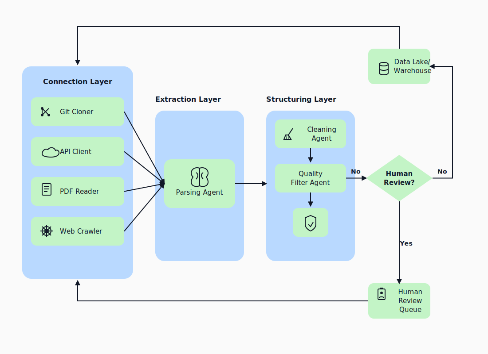
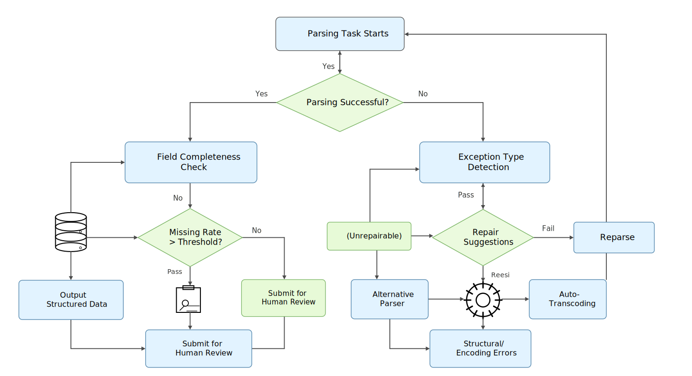
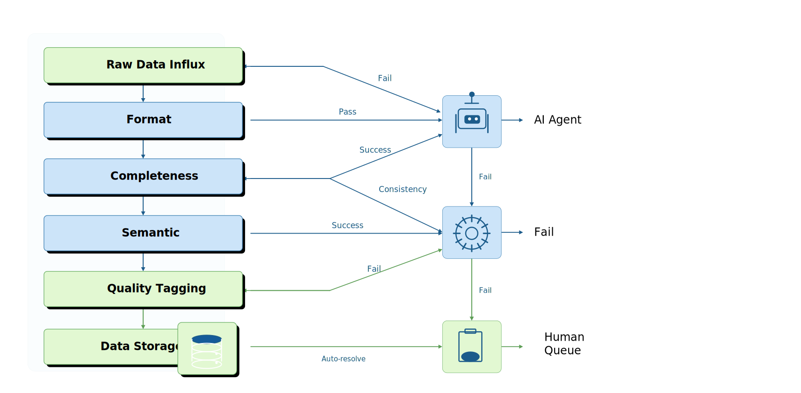

# 第32章：自动化采集、解析与清洗 Agent

汪志立（ZhiLi Wang）

---

## 摘要
数据工程中最琐碎、最耗时的工作往往不在建模阶段，而在数据进门的那一刻——采集用什么方式、解析遇到异常格式如何处理、清洗规则谁来维护、数据质量谁来判断。当数据源从几十个膨胀到几百个，人工制定采集策略和清洗规则的模式迅速崩溃：要么规则维护 backlog 持续积压，要么质量门禁失效。自动化采集与清洗 Agent 的核心任务不是"替代数据工程师"，而是将工程师从重复的规则适配中解放出来，让他们专注于异常处理、规则优化和架构设计。

本章从网页/PDF/API/代码仓库四种典型数据源的自动化采集出发，讨论 Agent 如何自动识别源结构、处理解析异常、生成清洗规则、执行质量过滤，并在必要时触发人工复核。重点落在 Agent 在不确定情况下该如何决策——解析失败时是跳过、修复还是上报？清洗规则冲突时以哪个为准？质量过滤阈值谁来定？本章承接 Ch04 数据采集、Ch05 清洗去重、Ch06 输入管道、Ch02 质量框架，将传统的数据工程实践升级为 Agent 驱动的自适应流水线。

## 关键词

自动化采集；数据解析 Agent；清洗规则生成；质量过滤；人工复核；源结构漂移

---

## 学习目标

通过本章学习，读者应能够：

- 理解多源异构数据场景中 Agent 驱动的采集架构设计原则。
- 掌握四种典型数据源（网页、PDF、API、代码仓库）的 Agent 化采集策略。
- 设计基于解析异常的自动修复与规则生成机制。
- 构建多层质量过滤流水线，定义何时自动通过、何时触发人工复核。
- 评估清洗 Agent 在不同场景下的成本收益比与异常处理效率。

---

## 场景引入：数据源漂移风险

以下为匿名化复合案例，用于说明源结构漂移的典型量级，不代表某个公开项目的实测统计。某 AI 团队需要为法律大模型构建训练数据集，数据源包括裁判文书网（网页）、法律法规 PDF 文件、司法 API 接口以及开源法律知识仓库。团队最初安排了 5 名工程师全职处理采集和清洗工作。三个月后，情况如下：

**网页采集线**：目标网站改版 3 次，每次改版都导致 70% 以上的爬虫规则失效。工程师平均每次需要 2 天修复规则，期间数据流水线空转。

**PDF 解析线**：2000+ 份 PDF 文件来自 30 多个不同法院，排版格式各异。工程师为每种排版编写了专门的解析规则，但仍有约 15% 的文件解析后出现字段错位。

**API 采集线**：司法 API 在两个月内发生 4 次字段结构变更，每次变更导致下游清洗模块报错，每次修复耗时约 1 天。

**代码仓库线**：多个开源法律知识库的目录结构、文件格式、编码方式各不相同，人工适配后仍然存在大量编码错误。

**关键问题**：问题不在于"工程师不够努力"，而在于**规则维护的增长速度超过了工程师的处理能力**。当数据源 N 增加时，维护成本是 O(N) 甚至 O(N²)，而人工是固定资源。团队需要的不是更多人力，而是一个能自动适应源结构变化的 Agent 系统。

### 场景背后的核心工程痛点

1. **源结构漂移**：网页结构、API Schema、文件格式会随时间变化，固定规则无法持续工作。
2. **解析异常多样化**：PDF 排版不定、编码混乱、特殊字符等问题无法通过通用规则全部覆盖。
3. **清洗规则冲突**：不同数据源对同一字段的定义不一致（如日期格式 `yyyy-MM-dd` vs `dd/MM/yyyy`），Agent 需要决策以哪个为准。
4. **质量过滤粒度难以把握**：过滤过严导致数据量不足，过滤过松导致质量不达训练要求。

---

## 32.1 Agent 驱动的采集架构

### 32.1.1 四源采集的统一抽象

所有数据源采集都可以抽象为三层结构：**连接层 → 提取层 → 结构化层**。Agent 在不同层扮演不同角色。

**图32-1：四源采集 Agent 统一架构**

四源采集虽然访问方式各异，但 Agent 的处理逻辑可以统一。统一的抽象层让 Agent 不需要为每种数据源类型编写完全不同的处理逻辑，而是通过适配器模式将差异封装在连接层，提取层和结构化层共享同一套处理逻辑。大规模网页语料构建中的抽取、过滤和多源混合经验表明，统一流水线与源类型适配器的组合，比为每个来源单独维护规则更容易扩展（Barbaresi 2021; Wenzek et al. 2020; Gao et al. 2020）。

**连接层的适配器设计：**

每种数据源类型对应一个连接适配器，适配器负责处理连接建立、身份认证、数据获取和原始数据缓存。适配器的接口是统一的——`connect() → fetch() → cache_raw()`——上层逻辑不感知底层是网页、PDF 还是 API。

**提取层的通用处理流程：**

无论数据来自何种来源，提取层都遵循相同的处理流程：原始数据 → 格式识别 → 内容提取 → 结构映射 → 中间格式输出。差异仅在格式识别和内容提取环节——网页需要 DOM 解析、PDF 需要版面分析、API 响应需要 JSON Schema 验证。ROOTS、RefinedWeb、FineWeb、Dolma、CulturaX 等语料工作也都把来源记录、清洗流水线和质量过滤作为数据集可复用性的核心组成部分（Laurençon et al. 2022; Penedo et al. 2023; Penedo, Kydlíček et al. 2024; Soldaini et al. 2024; Nguyen et al. 2024）。

**结构化层的统一输出规范：**

所有数据源的结构化输出遵循统一 Schema——至少包含 `source_id`、`extraction_timestamp`、`content_fields`、`metadata_fields`、`quality_score` 五个标准字段。这确保下游的清洗 Agent 和质量过滤 Agent 可以无差别地处理所有来源的数据。

### 32.1.2 采集任务生成与失败重试

采集 Agent 的第一个职责是**自动生成采集任务**。传统模式下，工程师需要为每个数据源手动编写采集配置；Agent 模式下，用户只需描述数据需求，Agent 自动完成以下步骤：

1. **源结构探测**：Agent 首先对目标源执行一次轻量探测，识别源类型（网页/PDF/API/仓库）、预估数据量、检测访问限制。
2. **采集策略生成**：根据探测结果，Agent 生成采集策略——分页策略、频率控制、并发数、失败重试策略。
3. **来源存证**：每次采集必须记录来源元数据——URL、采集时间、HTTP 响应头、文件哈希。这在合规审计和版权追溯时至关重要。

失败重试策略的设计尤为关键：

**表32-1：采集失败分类与重试策略**

| 失败类型 | 检测方式 | 重试策略 | 最大重试次数 | 超过上限后 |
|---------|---------|---------|------------|----------|
| 网络超时 | HTTP 状态码 / 异常 | 指数退避（1s, 2s, 4s, 8s） | 5 | 标记为临时不可用，1h 后重试 |
| 反爬拦截 | 403 / 验证码页面 | 降低速率，暂停采集并人工审批；必要时切换授权 API / 数据合作通道 | 3 | 暂停采集并人工审批 |
| 结构变化 | 解析结果字段缺失率 > 50% | 触发结构重新探测 | 2 | 生成结构变更告警 |
| 编码错误 | 乱码检测 | 自动编码检测 + 转码 | 3 | 保留原始字节，标记需人工处理 |
| 数据量异常 | 采集量偏离历史均值 > 3σ | 暂停采集，生成报告 | 1 | 人工确认后恢复 |

### 32.1.3 大规模采集的调度与限流策略

当 Agent 管理数百个数据源时，采集任务调度不再是简单的"定时执行"，而是一个受多约束条件制约的优化问题——目标是在遵守访问限制的前提下最大化数据采集的吞吐量和新鲜度。

**调度约束条件：**

**表32-2：采集调度约束条件**

| 约束类型 | 说明 | 示例 |
|---------|------|------|
| 频率限制 | 目标网站/API 的请求频率上限 | 每秒最多 10 个请求 |
| 并发限制 | 同时进行的采集任务数上限 | 最多 50 个并发采集任务 |
| 时间窗口 | 目标源的可访问时间窗口 | 仅工作日 8:00-20:00 开放 |
| 数据量预估 | 每次采集的预估数据量和耗时 | 全量采集约 2 小时，增量采集约 10 分钟 |
| 优先级 | 不同数据源对下游的重要性 | 训练数据源 > 评测数据源 > 实验数据源 |

Agent 的调度策略应支持三种模式：

**周期采集模式。** 适用于更新频率可预期的数据源——如每日更新的新闻网站、每周更新的统计报告。Agent 根据历史更新模式自动设定采集周期，当检测到实际更新频率偏离预期时自动调整。

**事件触发模式。** 适用于需要快速响应变化的数据源——如 API Schema 变更通知、网页结构变化告警。Agent 订阅变更事件（webhook、RSS、监控告警），在收到事件后立即触发增量采集。

**自适应采集模式。** 适用于更新频率不可预期的数据源。Agent 以较低的探测频率（如每 6 小时一次）检查数据源是否有更新，根据探测结果动态调整采集频率——如果连续 3 次探测无更新，则降低探测频率；如果发现更新，则提高采集频率。

### 32.1.4 企业文档与数据库的特殊采集

除网页/PDF/API/代码仓库，企业数据工程中还有两类重要的数据源需要特殊的 Agent 处理策略：

**企业文档采集（SharePoint/Confluence/钉钉文档）。** 企业文档通常存储在协作平台中，具有版本管理、权限控制和富文本格式。Agent 需要：

- 通过平台 API 进行身份认证和权限检查。
- 处理文档的版本历史——是采集最新版本还是所有历史版本。
- 解析富文本中的表格、图片、附件和嵌入内容。
- 遵循企业的数据分类和访问控制策略。

**数据库直接采集。** 许多企业的核心数据存储在关系型数据库中。Agent 需要：

- 根据数据库 Schema 自动生成数据抽取查询。
- 处理增量采集——通过时间戳或版本号字段识别变更数据。
- 管理采集对生产数据库的性能影响——限制查询复杂度、使用只读副本、在业务低峰期执行。
- 处理跨数据库的关联采集——当训练数据需要 JOIN 多个表时，Agent 需要理解表间关系并生成正确的查询。

------

## 32.2 解析修复 Agent

### 32.2.1 解析异常的检测与归因

解析 Agent 的核心能力不是"解析成功"，而是"解析失败时知道为什么失败、该怎么做"。解析异常按类型可分为：

**结构性异常**：HTML DOM 结构变化导致选择器失效、PDF 排版变化导致区域识别错误、API 返回字段增删导致 Schema 不匹配。

**编码性异常**：文件编码声明与实际不符、混合编码（UTF-8 文件中混入 GBK 片段）、特殊字符转义错误。

**语义性异常**：解析出的字段值在语法上正确但语义不合理——如日期字段解析出"13 月 45 日"、金额字段出现负数但业务上不可能。

Agent 的异常处理决策树：

**图32-2：解析异常处理决策流程**

### 32.2.2 Parser 选择与修复规则生成

当解析失败时，Agent 面临的选择不是二元的（修复 vs 跳过），而是一个包含多种策略的谱系：

1. **备选 Parser 切换**：PDF 文件可尝试 PyMuPDF → pdfplumber → Tesseract OCR 的降级链路；HTML 可尝试不同解析引擎（lxml → html5lib → BeautifulSoup）。
2. **提取规则自动生成**：当固定选择器失效时，Agent 可以根据目标字段的语义特征（如"看起来像日期的文本"、"包含'案号'关键词的行"）自动生成新的提取规则。
3. **局部修复**：对于只有部分字段解析异常的文件，Agent 可以保留正确解析的部分，仅对异常字段进行修复尝试。

### 32.2.3 多模态内容的解析策略

现代数据工程中，越来越多的数据源包含多模态内容——图文混排的网页、包含表格和图片的 PDF、带有截图的文档。Agent 需要对这些内容制定专门的解析策略。

**图文混排处理：** 对于包含图片的文档，Agent 需要决策是保留图片引用、提取图片中的文字（OCR）、生成图片描述，还是忽略图片。决策取决于下游任务需求——多模态模型训练需要保留图片，纯文本模型训练可能只需要提取文字或生成描述。文档理解模型和版面数据集的研究表明，表格、公式、图片和版面结构会显著影响解析质量，不能简单压平成纯文本处理（Blecher et al. 2023; Huang et al. 2022; Kim et al. 2022; Pfitzmann et al. 2022）。

**表格解析的鲁棒性策略：** 表格是解析失败率最高的元素之一——合并单元格、嵌套表头、跨页表格、无边框表格都会导致解析器出错。Agent 应采用"多解析器投票 + 人工兜底"策略：

1. 使用 2-3 种不同的表格解析方法（基于边框检测、基于空格对齐、基于语义规则）分别解析同一表格。
2. 对比解析结果——如果多种方法结果一致（行列数相同、表头相同），则高置信度采用。
3. 如果结果不一致，标记为"解析不确定"，提交人工确认。

**OCR 的适用条件与质量控制：** OCR 不是免费的——它有额外的计算成本和时间开销。Agent 应在以下条件同时满足时才触发 OCR：

- 主要解析方法（直接文本提取）的字符识别率 < 85%。
- 文档中包含不可复制文本（如扫描件、图片中的文字）。
- OCR 的预估处理时间在任务的时间预算内。

Agent 还需对 OCR 结果进行质量评估——将 OCR 输出的文本与已知的元数据（如文档标题、作者、日期）进行比对，如果这些基准字段的识别率低于阈值，则标记该文档为"OCR 低质量"，建议人工处理。

### 32.2.4 多语言与编码问题的系统化处理

数据工程 Agent 在多语言场景下面临两个层面的挑战：

**语种识别与分流。** Agent 需要在解析阶段识别文档的语种，为后续的清洗和标注提供上下文。语种识别不是简单的二分类（中/英），而是需要处理多语种混合的情况——一段文本中可能同时包含中文、英文、代码和数学公式。

**编码检测与修复。** 编码问题是数据工程中最顽固的问题之一——文件的声明编码与实际编码不符，或在同一文件中混用多种编码。Agent 的编码处理流程：

1. 读取文件原始字节，使用 chardet/cChardet 等工具检测实际编码。
2. 如果检测到的编码与声明编码不一致，使用检测到的编码重新解码。
3. 如果部分字节无法用任何已知编码正确解码，保留原始字节，标记为"编码不确定"，记录无法解码的位置和上下文。
4. 在 Lineage 中记录编码检测和转码的全过程——原始编码、检测结果、转码结果和无法解码的字节比例。

### 32.2.5 采集清洗 Agent 的性能优化

当 Agent 管理数百个数据源、每天处理 TB 级数据时，性能优化从"锦上添花"变为"生存必需"。

**增量采集与变更检测。** 全量采集的成本随数据量线性增长。Agent 应优先采用增量采集——只采集自上次采集以来发生变化的数据。变更检测策略因数据源类型而异：API 数据源可通过 `Last-Modified` 头或 `updated_at` 字段检测变更；网页数据源可通过页面哈希对比检测变更；PDF 文件可通过文件哈希或版本号检测变更。

**并行化与资源池管理。** Agent 的采集任务应在资源池的约束下最大化并行度。资源池的管理策略：为每种数据源类型分配独立的资源池，避免一种数据源的大量采集任务挤占其他数据源的资源。当某资源池利用率超过 80% 时，Agent 应自动将低优先级任务延迟到低谷期执行。

**本地缓存与去重。** 相同内容的重复采集是计算资源和存储资源的双重浪费。Agent 应在采集前检查本地缓存——如果目标内容的哈希值已在缓存中存在，则直接使用缓存数据，跳过采集步骤。缓存策略需考虑数据的时效性要求——新闻数据缓存数小时，法规数据缓存数天。

------

## 32.3 清洗规则生成 Agent

### 32.3.1 从抽检缺陷到规则候选

传统清洗规则维护的痛点在于：规则由人编写，但规则的触发条件由数据驱动——工程师不知道什么时候需要新规则，直到质量问题被下游发现。以 C4、PaLM、RefinedWeb 和 Data-Juicer 为代表的数据处理实践说明，去重、质量过滤、语言识别和有害内容过滤会直接影响下游模型表现，清洗规则本身也需要被版本化和复核（Raffel et al. 2020; Chowdhery et al. 2022; Penedo et al. 2023; Chen et al. 2024）。Agent 可以逆转这个流程：

1. **缺陷发现**：通过定期数据质量扫描或下游反馈，识别出质量不达标的字段和数据子集。
2. **模式提取**：Agent 分析缺陷数据的共性模式——是所有来自某数据源的记录都有问题，还是符合某种格式模式的数据有问题。
3. **规则候选生成**：基于提取的模式，Agent 生成清洗规则候选，包括规则的适用范围、转换逻辑和预期效果。
4. **沙箱验证**：规则候选在隔离的沙箱环境中对历史数据执行，生成差异报告。
5. **人工批准**：差异报告提交给数据 Owner 审批，批准后规则进入生产环境。

### 32.3.2 沙箱验证与差异报告

沙箱验证是规则上线前的最后一道防线。沙箱环境应满足以下要求：

- **数据隔离**：使用生产数据的快照副本，规则在沙箱中的执行不影响生产数据。
- **全量验证**：规则在沙箱中应对全量匹配数据（而不只是抽检样本）执行，以发现边缘 case。
- **差异可视化**：差异报告以 Before/After 对照形式展示，突出显示被修改的字段和修改量。

**表32-3：沙箱验证维度与通过条件**

| 验证维度 | 检查内容 | 通过条件 | 不通过时的动作 |
|---------|---------|---------|-------------|
| 规则匹配范围 | 规则影响了多少行数据 | 影响行数在预期范围内（偏差 < 20%） | 调整规则适用范围 |
| 修改正确性 | 修改后的字段值是否合法 | 格式校验 100% 通过，语义校验 > 95% 通过 | 修正规则逻辑 |
| 副作用检测 | 是否影响了非目标字段 | 非目标字段修改率为 0% | 收紧规则条件 |
| 性能评估 | 规则在大数据集上的执行时间 | 执行时间 < 预估时间的 150% | 优化规则实现或分批执行 |

---

## 32.4 质量过滤与人审触发

### 32.4.1 质量不确定性分流

Agent 在判断数据质量时，面临的最大挑战不是"判断对错"，而是"判断自己不确定的程度"。一个设计良好的 Agent 应该在不确定时主动请求人工介入，而不是硬着头皮给一个可能错误的判断。

质量不确定性分流表：

**表32-4：质量不确定性分流表**

| 质量维度 | 高确定性（自动通过） | 中确定性（标记 + 采样审核） | 低确定性（人工复核） |
|---------|-------------------|------------------------|-------------------|
| 格式正确性 | 正则/约束 100% 匹配 | 匹配率 80%-99% | 匹配率 < 80% |
| 字段完整性 | 缺失率 < 1% | 缺失率 1%-5% | 缺失率 > 5% |
| 语义合理性 | 业务规则全部通过 | 1-2 条业务规则告警 | 3+ 条业务规则告警或多条阻断 |
| 跨源一致性 | 多源同字段值一致 | 存在轻微差异（格式差异） | 存在实质性差异 |
| 分布稳定性 | 与历史分布偏差 < 2σ | 偏差 2-3σ | 偏差 > 3σ |

### 32.4.2 人工复核触发条件

以下情况必须触发人工复核，Agent 不得自动决策：

1. **低确定性质量判断**：Agent 对自身判断的置信度低于预设阈值时。
2. **高风险字段修改**：涉及金额、日期、主键、外键等关键字段的修改。
3. **规则冲突**：两个规则对同一数据给出了不同的清洗建议。
4. **首次处理的数据源**：对从未处理过的数据源类型，首批数据必须人工抽检。
5. **质量指标异常波动**：某批数据的质量指标相比上一批下降超过 20%。
6. **Agent 连续修复失败**：同一批次数据 Agent 连续修复 3 次未通过 Verifier。

### 32.4.3 质量过滤的自动化流水线设计

质量过滤 Agent 的流水线设计应遵循"宽进严出、分级过滤"的原则。每一级过滤解决一个维度的质量问题，不合格的数据被分流到对应的处理管道，而非简单丢弃。

**图32-3：质量过滤分级流水线**

每一级的过滤阈值应根据业务需求和数据特征进行配置：

- **格式校验层**：严格模式——格式不匹配直接拒绝进入下游。
- **完整性校验层**：弹性模式——允许少量缺失但需标记，缺失率超阈值时触发告警。
- **语义校验层**：规则模式——基于预定义的业务规则集进行校验。
- **一致性校验层**：对比模式——跨源对比、历史对比、上下游对比。

### 32.4.4 人工复核的优先级与时效管理

人工复核队列需要优先级管理，确保高风险和时效性强的样本优先处理：

**表32-5：人工复核优先级与时效管理**

| 优先级 | 触发条件 | 处理时效 | 超时动作 |
|-------|---------|---------|---------|
| P0 | 影响下游关键流水线（如模型训练数据出口） | 1 小时内 | 升级通知 + 暂停相关流水线 |
| P1 | 低确定性质量判断 + 高风险字段 | 4 小时内 | 升级通知 |
| P2 | 首次处理的新数据源类型 | 24 小时内 | 标记为"待确认"放行 + 后续追溯 |
| P3 | 质量指标轻微波动 | 72 小时内 | 自动加入下周质量回顾议程 |

------

## 32.5 案例复盘：多源法律数据的 Agent 化采集清洗

某法律 AI 团队将前述手动采集流程改造为 Agent 驱动的自适应流水线，经历了以下阶段：

**第一阶段：采集 Agent 上线。** Agent 自动探测 50+ 数据源的结构，生成采集策略并执行。上线首月，网页采集的规则失效恢复时间从 2 天缩短至 4 小时（Agent 自动检测结构变化 + 人工确认新规则）。但 PDF 解析准确率仅从 85% 提升至 90%，仍有改进空间。

**第二阶段：解析修复 Agent 引入。** 为 PDF 解析配置了三层 Parser 降级链路（PyMuPDF → pdfplumber → OCR），并为 30 种法院排版训练了版面识别模型。解析准确率提升至 96%，但引入了新问题——OCR 降级链路的处理时间是正常解析的 20 倍，导致部分批次处理超时。

**第三阶段：清洗规则生成 Agent 与质量分流。** Agent 从抽检缺陷中自动生成了 40+ 条清洗规则候选，经沙箱验证后 35 条被批准上线。质量不确定性分流将人工复核量从日均 500+ 份降至 80 份，复核聚焦于真正有争议的 case。

### 关键指标变化

| 指标 | 改造前（纯人工） | 改造后（Agent 辅助） | 变化 |
|------|---------------|-------------------|------|
| 新数据源接入时间 | 3-5 天 | 4-8 小时 | -80% |
| 解析准确率 | 85% | 96% | +11% |
| 规则维护人力 | 5 人全职 | 1.5 人全职 | -70% |
| 人工复核量 | 100%（全量） | 15%（分流后） | -85% |
| 数据上线周期 | 2 周 | 3 天 | -78% |

### 扩展案例：AI 公司多源数据采集 Agent 的生产化之路

除法律 AI 团队外，另一家 AI 公司的数据采集 Agent 经历了更复杂的生产化挑战。该公司需要从 200+ 数据源采集训练数据，涵盖新闻、学术论文、技术博客、政府公开数据和社交媒体内容。

**遭遇的典型问题：**

**反爬对抗升级。** Agent 上线两个月后，约 30% 的新闻网站更新了反爬策略。Agent 的自动重试机制触发了更严格的封锁——部分网站将高频重试的 IP 列入黑名单，影响了公司其他正常业务的访问。教训：重试策略必须考虑"退避礼貌"，高频重试不仅无效，还会恶化关系。

**数据漂移的隐蔽性。** 某学术论文网站进行了前端改版，页面视觉风格不变，但 HTML 结构完全重构。Agent 的异常检测依赖"解析字段缺失率"，但本次改版中 Agent 的解析器仍能提取出文本——只是将正文内容和侧边栏推荐内容混在了一起。缺失率没有飙高，但数据质量静默下降。直到下游模型训练出现准确率下降，才回溯发现这个问题。

**成本失控。** 采集 Agent 的 OCR 调用量在第三个月增长了 3 倍——因为 Agent 对每个不确定的 PDF 都触发了 OCR，导致云计算成本从 $2000/月 飙升至 $6000/月。教训：OCR 等高价操作必须有预算上限和配额控制。

**应对措施：**

- 引入"反爬友好度评分"——对每个数据源维护一个反爬历史记录，对高频反爬的源降低采集频率，优先采用官方 API 或合作方式获取数据。
- 引入"内容漂移检测"——不只监控字段缺失率，还监控字段内容的语义分布。当提取文本的主题分布发生显著变化时，触发结构重新探测。
- 引入"操作成本配额"——每种高成本操作（OCR、大模型调用）设置每日/每周配额，超出配额后自动升级为人工审批。

### 案例教训总结

1. **采集 Agent 的策略必须"有礼貌"**——尊重目标网站的访问限制，避免因激进采集导致 IP 被封或法律风险。
2. **数据质量监控不能只依赖缺失率**——语义漂移比字段缺失更难检测，但影响更大。
3. **自动化不等于不计成本**——Agent 的每个操作都有计算成本，必须在系统设计中内置成本控制机制。
4. **来源存证不只是合规需求**——完整的来源记录是故障排查和信任建立的基础。当数据出现问题时，能快速追溯来源比修复数据本身更重要。

------

## 32.6 Checklist：采集清洗 Agent 部署自查

- [ ] 是否支持网页/PDF/API/代码仓库四种数据源的统一采集抽象？
- [ ] 采集失败重试策略是否区分了不同失败类型（网络、反爬、结构变化、编码）？
- [ ] 是否为每种数据源类型配置了 Parser 降级链路？
- [ ] 解析异常检测是否覆盖了结构性、编码性和语义性三个维度？
- [ ] 清洗规则上线前是否经过沙箱验证并生成差异报告？
- [ ] 沙箱验证是否检查了规则匹配范围、修改正确性、副作用和性能？
- [ ] 是否定义了质量不确定性分流的三级模型（自动通过/标记/人工复核）？
- [ ] 低确定性、高风险字段、规则冲突、首次处理数据源是否触发了人工复核？
- [ ] 是否记录了每次采集的来源存证（URL、时间、哈希）？
- [ ] 质量指标异常波动时是否自动暂停采集？

---

## 32.7 章节回链

- **Ch02**：数据质量框架——为本章的质量过滤和不确定性分流提供了理论基础。
- **Ch04**：数据采集——本章在其基础上引入 Agent 驱动的自适应采集。
- **Ch05**：数据清洗与去重——本章将清洗规则维护升级为 Agent 自动生成。
- **Ch06**：输入管道与特征工程——本章采集管道是其上游。
- **Ch31**：Agent 架构与任务边界——本章是六层架构在采集清洗场景的具体实现。
- **Ch33**：标注、合成与评测 Agent——本章输出的清洗数据是其输入。

---

## 32.8 延伸阅读：采集清洗 Agent 的工程实践要点

### 采集伦理与合规边界

Agent 驱动的自动化采集带来了传统手动采集没有的伦理和合规挑战——当采集速率提升 10 倍、覆盖数据源扩大 10 倍时，原本"微不足道"的问题可能被放大。训练语料文档化、许可审计和隐私泄露研究都提醒我们，数据采集不是单纯的技术吞吐问题，还涉及来源说明、授权边界和可被模型记忆的敏感内容（Dodge et al. 2021; Longpre et al. 2024; Carlini et al. 2021）。

**robots.txt 的自动遵守。** Agent 在采集网页数据前，必须自动检查目标网站的 robots.txt 文件，遵守其爬取规则。对于禁止爬取的路径，Agent 应自动跳过并记录。对于已获得明确授权的数据源，Agent 只能在授权范围内采集，并保留授权记录。

**版权与数据使用权的自动检测。** Agent 在采集数据时，应自动检测数据的使用许可——网页的 Terms of Service、API 的使用条款、开源仓库的 License。Agent 不应只采集数据，还应采集"我能用这些数据做什么"的信息。对于使用许可不明确或存在冲突的数据源，Agent 应暂停采集并提交人工审批，必要时切换到授权 API 或数据合作通道。

**对目标服务器的负载控制。** Agent 的采集速率不应影响目标服务器的正常运行。Agent 应监控目标服务器的响应时间——如果响应时间因采集行为而显著增加，Agent 应自动降低采集速率；如果异常持续，应暂停采集并进入人工审批流程，而不是通过切换 User-Agent 或 IP 池规避限制。

### 数据溯源与可复现性

数据工程的"可复现性"要求意味着任何一批训练数据都应该能被"重新生成"。这就要求 Agent 的采集过程具备完整的可追溯性：

1. **采集配置快照**：每次采集任务执行时，保存完整的采集配置快照（来源 URL、解析规则版本、清洗规则版本）。
2. **数据指纹**：为每批采集数据计算内容哈希，作为数据的"指纹"——当需要验证数据是否被篡改时，可以通过比对指纹。
3. **版本关联**：将数据批次与采集配置快照、数据指纹关联存储，确保任何一批数据都能追溯到"是如何产生的"。

### 清洗规则的版本管理与回滚

Agent 自动生成的清洗规则需要版本管理——当规则出现问题需要回滚时，不能"想回到哪个版本就回到哪个版本"，而必须是精确的、可追溯的版本切换。数据去重、低资源语料构建和大规模预训练语料的实践表明，清洗规则变更会改变样本分布，必须能够追踪版本、复现实验并解释过滤策略的影响（Lee et al. 2022; Ortiz Suárez et al. 2020; Laurençon et al. 2022）。

**规则版本管理策略：**

- 每条规则上线时自动分配语义版本号（Major.Minor.Patch）。
- 规则的每次修改都保留完整的变更记录——修改人、修改时间、修改内容、修改原因。
- 规则回滚时，不仅回滚规则本身，还标记所有受该规则影响的数据批次为"需重新处理"。

## 本章小结

本章把数据源漂移作为采集清洗自动化的核心威胁，沿"采集—解析—清洗—过滤"四段流程展开 Agent 设计。在采集环节，本章将网页、API、文档与数据库四类来源抽象为连接层、提取层、结构化层三层结构，用适配器封装来源差异，并讨论采集任务生成、失败重试、大规模调度与限流策略。在解析环节，重点是异常检测与归因、Parser 选择与修复规则生成，以及多模态、多语言与编码问题的系统化处理。

清洗环节强调从抽检缺陷自动生成规则候选，先在沙箱验证并产出差异报告，再经人工批准上线，而非让 Agent 直接改写生产数据。质量过滤环节按质量不确定性分流，明确人工复核的触发条件、优先级与时效管理。本章同时界定采集的伦理与合规边界、数据溯源与可复现性要求，以及清洗规则的版本管理与回滚，使采集清洗 Agent 在提升吞吐的同时保持可审计、可回退。

## 参考文献

Barbaresi A (2021) Trafilatura: A Web Scraping Library and Command-Line Tool for Text Discovery and Extraction. In: Proceedings of the 59th Annual Meeting of the Association for Computational Linguistics, pp 122-131.

Blecher N, Cresci G, Ballas N, Bautista M (2023) Nougat: Neural Optical Understanding for Academic Documents. arXiv preprint arXiv:2308.13418.

Carlini N, Tramer F, Wallace E, Jagielski M, Herbert-Voss A, Lee K, Roberts A, Brown T, Song D, Erlingsson U, Oprea A, Raffel C (2021) Extracting Training Data from Large Language Models. In: Proceedings of the 30th USENIX Security Symposium, pp 2633-2650.

Chen J, Yan X, Lin D, Qu X, Wang Y, Huang X, Zhao Z, Yu T, Zhang Z, Li H, Zheng Y, Xu R, Zhu J, Qiu X (2024) Data-Juicer: A One-Stop Data Processing System for Large Language Models. In: Proceedings of the ACM SIGMOD International Conference on Management of Data, pp 4436-4449.

Chowdhery A, Narang S, Devlin J, Bosma M, Mishra G, Roberts A, Barham P, Chung H W, Sutton C, Gehrmann S, Schuh P, Shi K, Tsvyashchenko S, Maynez J, Rao A, Barnes P, Tay Y, Shazeer N, Prabhakaran V, Reif E, Du N, Hutchinson B, Pope R, Bradbury J, Austin J, Isard M, Gur-Ari G, Yin P, Duke T, Levskaya A, Ghemawat S, Dev S, Michalewski H, Garcia X, Misra V, Robinson K, Fedus L, Zhou D, Ippolito D, Luan D, Lim H, Zoph B, Spiridonov A, Sepassi R, Dohan D, Agrawal S, Omernick M, Dai A M, Pillai T S, Pellat M, Lewkowycz A, Moreira E, Child R, Polozov O, Lee K, Zhou Z, Wang X, Saeta B, Diaz M, Firat O, Catasta M, Wei J, Meier-Hellstern K, Eck D, Dean J, Petrov S, Fiedel N (2022) PaLM: Scaling Language Modeling with Pathways. Journal of Machine Learning Research 24(240):1-113.

Dodge J, Sap M, Marasović A, Agnew W, Ilharco G, Groeneveld D, Mitchell M, Gardner M (2021) Documenting Large Webtext Corpora: A Case Study on the Colossal Clean Crawled Corpus. In: Proceedings of the 2021 Conference on Empirical Methods in Natural Language Processing, pp 1286-1305.

Gao L, Biderman S, Black S, Golding L, Hoppe T, Foster C, Phang J, He H, Thite A, Nabeshima N, Presser S, Leahy C (2020) The Pile: An 800GB Dataset of Diverse Text for Language Modeling. arXiv preprint arXiv:2101.00027.

Huang Y, Lv T, Cui L, Lu Y, Wei F (2022) LayoutLMv3: Pre-training for Document AI with Unified Text and Image Masking. In: Proceedings of the 30th ACM International Conference on Multimedia, pp 4083-4091.

Kim G, Hong T, Yim M, Nam J, Park J, Yim J, Hwang W, Yun S, Han D, Park S (2022) OCR-free Document Understanding Transformer. In: European Conference on Computer Vision, pp 498-517.

Laurençon H, Saulnier L, Wang T, Akiki C, del Moral A V, Le Scao T, Von Werra L, Mou C, González Ponferrada E, Nguyen H, Frohberg J, Šaško M, Lhoest Q, McMillan-Major A, Dupont G, Biderman S, Rogers A, Allal L B, De Toni F, Pistilli G, Nguyen O, Nikpoor S, Masoud M, Labbé S, Vial T, Reusch A, Yogatama D, Raffel C, Wolf T, BigScience Workshop (2022) The BigScience ROOTS Corpus: A 1.6TB Composite Multilingual Dataset. In: Advances in Neural Information Processing Systems 35, Datasets and Benchmarks Track.

Lee K, Ippolito D, Nystrom A, Zhang C, Eck D, Callison-Burch C, Carlini N (2022) Deduplicating Training Data Makes Language Models Better. In: Proceedings of the 60th Annual Meeting of the Association for Computational Linguistics, pp 8424-8445.

Longpre S, Mahari R, Chen A, Obeng-Marnu N, Sileo D, Brannon W, Muennighoff N, Khazam N, Kabbara J, Perisetla K, Wu X, Shippole E, Bollacker K, Wu T, Villa L, Pentland S, Hooker S (2024) A large-scale audit of dataset licensing and attribution in AI. Nature Machine Intelligence 6(8):975-987.

Nguyen T, et al. (2024) CulturaX: A Cleaned, Enormous, and Multilingual Dataset for Large Language Models in 167 Languages. In: Proceedings of the 2024 Joint International Conference on Computational Linguistics, Language Resources and Evaluation.

Ortiz Suárez P J, Sagot B, Romary L (2020) A Monolingual Approach to Contextualized Word Embeddings for Mid-Resource Languages. In: Proceedings of the 12th Language Resources and Evaluation Conference, pp 1703-1714.

Pfitzmann B, Auer C, Dolfi M, Nassar A S, Staar P (2022) DocLayNet: A Large Human-Annotated Dataset for Document-Layout Analysis. In: Proceedings of the 28th ACM SIGKDD Conference on Knowledge Discovery and Data Mining, pp 3743-3751.

Penedo G, Kydlíček H, Allal L B, Lozhkov A, Mitchell M, Raffel C, von Werra L, Wolf T (2024) The FineWeb Datasets: Decanting the Web for the Finest Text Data at Scale. In: Advances in Neural Information Processing Systems 37, Datasets and Benchmarks Track.

Penedo G, Malartic Q, Hesslow D, Cojocaru R, Cappelli A, Alobeidli H, Pannier B, Almazrouei E, Launay J (2023) The RefinedWeb Dataset for Falcon LLM: Outperforming Curated Corpora with Web Data Only. In: Advances in Neural Information Processing Systems 36.

Raffel C, Shazeer N, Roberts A, Lee K, Narang S, Matena M, Zhou Y, Li W, Liu P J (2020) Exploring the Limits of Transfer Learning with a Unified Text-to-Text Transformer. Journal of Machine Learning Research 21(140):1-67.

Soldaini L, Kinney R, Bhagia A, Schwenk D, Atkinson D, Authur A, Bogin B, Chen X, Dumas G, Elazar Y, Hofmann V, Jha A H, Kumar S, Lucy L, Lyu X, Lambert N, Magnusson I, Morrison J, Muennighoff N, Naik A, Nam G, Peters M E, Ravichander A, Richardson L, Shen Z, Strubell E, Subramani N, Tafjord O, Walsh N, Zettlemoyer L, Smith N A, Hajishirzi H, Beltagy I, Groeneveld D, Dodge J, Lo K (2024) Dolma: An Open Corpus of Three Trillion Tokens for Language Model Pretraining Research. arXiv preprint arXiv:2402.00159.

Wenzek G, Lachaux M-A, Conneau A, Chaudhary V, Guzmán F, Joulin A, Grave E (2020) CCNet: Extracting High Quality Monolingual Datasets from Web Crawl Data. In: Proceedings of the 12th Language Resources and Evaluation Conference, pp 4003-4012.
