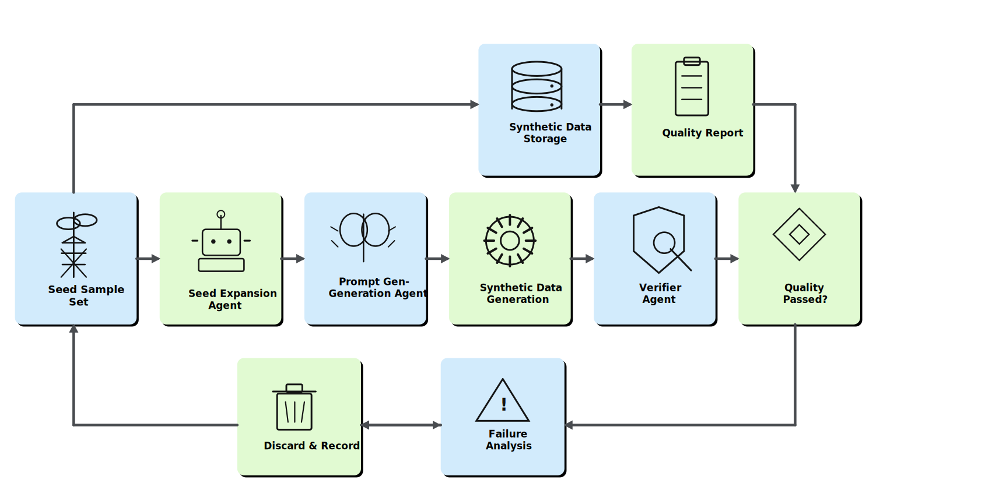
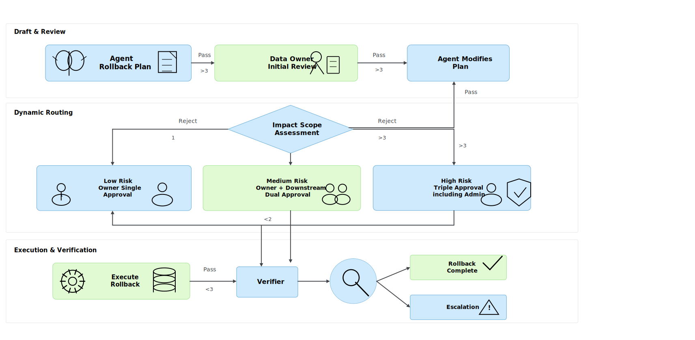
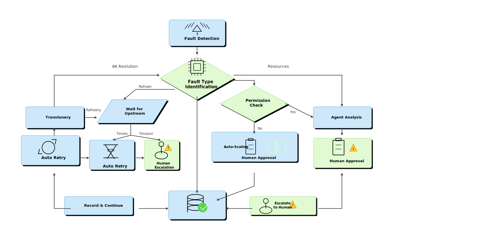

# 第34章：DataOps Agent 与平台自治

汪志立（ZhiLi Wang）

---

## 摘要
数据平台的运维工作长期以来被视为"必要但低价值"的劳动——监控告警、排查故障、版本回滚、成本分析，每一项都需要工程师投入大量时间，但每一项都不直接产生业务价值。当数据平台规模扩大（数百条流水线、PB 级数据、数千张表），传统的人工运维模式到达极限：告警疲劳导致漏判，根因定位依赖个人经验，版本回滚犹豫不决，成本黑洞无人关注。

DataOps Agent 的目标是将数据平台从"被运维"升级为"自运维"——Agent 自动执行监控告警的聚合与根因定位，自动生成数据回滚与修复计划供审批，自动分析成本异常并提出优化建议，自动生成工单与复盘草稿。但自治不等于无人值守——高风险操作（如数据回滚、索引重建、流水线重启）必须经过审批闸门。本章承接 Ch24-Ch26 的 DataOps（数据运维） 飞轮、版本管理、实验追踪和平台可观测性，将人工运维流程升级为 Agent 驱动的自治回路。

## 关键词

DataOps Agent；平台自治；根因定位；数据回滚；成本治理；运维自动化

---

## 学习目标

通过本章学习，读者应能够：

- 设计从告警到根因定位的 Agent 自动分析管道。
- 理解数据回滚与修复计划的 Agent 生成逻辑与审批流程。
- 构建自动化工单生成与复盘草稿的 Agent 工作流。
- 评估 DataOps Agent 在真实平台环境中的平均修复时间（MTTR）改进效果。
- 掌握存储膨胀、重处理成本和图形处理器（Graphics Processing Unit，GPU）数据供给异常异常的成本自动分析方法

---

## 场景引入：一个凌晨三点的告警风暴

某数据平台的监控系统在凌晨 3:14 发出第一条告警："`user_behavior_etl` 任务延迟超过 30 分钟"。在接下来的 15 分钟内，告警如雪崩般涌入：

- 3:17：`recommendation_feature` 任务失败，依赖上游 `user_behavior_etl` 的输出。
- 3:19：`training_data_export` 数据量异常——预期 200 万行，实际仅产出 30 万行。
- 3:22：`model_training_pipeline` 因缺少训练数据自动暂停。
- 3:25：存储使用率飙升——中间表膨胀到日常的 3 倍。
- 3:28：标注平台报错——部分标注任务引用的数据批次被回滚。

值班工程师被连续告警惊醒，开始逐条排查。但告警信息分散在不同的监控系统中，没有聚合，没有上下文关联。工程师花了 40 分钟才定位到根因：上游业务数据库的一个 Schema 变更（新增了一个必填字段）导致抽取、转换、加载（Extract, Transform, Load，ETL）任务的 WHERE 条件意外过滤掉了 85% 的数据。而在这个 Schema 变更发生的 8 小时前，变更通知邮件躺在了工程师的未读邮件中。

### 场景背后的核心工程痛点

1. **告警缺乏聚合与优先级排序**：12 条告警的根因只有一个，但工程师需要逐条排查才知道。
2. **根因定位依赖个人经验**：熟悉该管道的工程师恰好休假，值班工程师花了 40 分钟才定位。
3. **回滚决策犹豫**：是否回滚数据、回滚到哪个版本、回滚会影响哪些下游——没有系统能自动生成建议。
4. **成本异常无人追踪**：存储膨胀和重处理成本增加在当月账单中体现时，已经造成了实际损失。

---

## 34.1 告警到根因定位 Agent

### 34.1.1 告警聚合与优先级排序

DataOps Agent 的第一项能力是告警的智能聚合。Agent 需从四个维度读取信息，将分散的告警聚合为根因候选。AIOps 与自动化日志分析研究表明，告警聚合、日志解析和事件关联是降低 MTTR 的基础能力，不能只依赖人工值班经验（Dang et al. 2019; He et al. 2021; Zhu et al. 2019）：

**图34-1：告警到根因定位 Agent 流程**

Agent 读取的四类数据源：

1. **指标数据**：任务延迟、数据量、错误率、资源使用率等时序指标。
2. **日志数据**：任务执行日志、错误堆栈、数据质量检查日志。
3. **血缘数据**：上游依赖关系、字段级血缘、数据流向图。
4. **变更记录**：代码提交记录、配置变更、Schema 变更、依赖升级记录。

### 34.1.2 根因候选生成逻辑

Agent 通过时间线对齐和因果推断来生成根因候选。真实工业系统中的 AIOps 实践强调，根因候选需要同时利用指标、日志、变更记录和依赖图，才能把相关性筛成可验证的因果线索（Dang et al. 2019; He et al. 2021）：

**表34-1：根因候选类型与检测逻辑**

| 根因类型 | 特征模式 | 检测逻辑 | 置信度 |
|---------|---------|---------|--------|
| 上游 Schema 变更 | 变更时间早于首个告警，影响所有下游 | 交叉比对变更记录和告警时间线 | 0.90 |
| 数据量突增/突降 | 数据量偏离历史均值 > 3σ | 时序异常检测 | 0.85 |
| 资源配置不足 | CPU/内存使用率达到上限 | 资源指标与任务性能相关性分析 | 0.80 |
| 代码缺陷 | 告警与最近一次部署时间重合 | 部署记录与告警时间线交叉比对 | 0.75 |
| 外部依赖故障 | 多个任务同时失败，依赖同一外部 API | 依赖图拓扑分析 | 0.70 |

Agent 会按置信度排序输出 3-5 个根因候选，每个候选附带支持证据（相关日志片段、指标图表、变更记录），供工程师快速验证。对于高置信度（> 0.85）的候选，Agent 可以直接生成修复建议；对于中低置信度的候选，标记为需要人工确认。

#### 34.1.2.1 根因分析的置信度校准

Agent 生成的根因候选附带置信度评分，但这个评分本身需要校准——Agent 的"90% 置信度"是否真的意味着 90% 的准确率？如果 Agent 对置信度的估计存在系统性偏差（如过度自信），工程师会逐渐失去对 Agent 判断的信任。生产机器学习系统研究也反复强调，自动化建议必须配套可解释证据和持续校准，否则很难进入稳定运维流程（Amershi et al. 2019; Lwakatare et al. 2020; Paleyes et al. 2022）。

**置信度校准方法：**

1. **历史回溯验证**：定期回溯过去一个月 Agent 给出的根因候选，对比最终确认的真实根因，计算各置信度区间的实际准确率。
2. **校准曲线绘制**：将置信度分为 0-10 个区间，统计每个区间内 Agent 判断正确的比例——理想情况下，50% 置信度的判断应有 50% 的正确率，90% 置信度的判断应有 90% 的正确率。
3. **偏差修正**：如果发现系统性偏差（如高置信度区间准确率偏低），调整 Agent 的置信度输出——在推送结果时使用修正后的置信度，而非原始输出。

**表34-2：置信度与自动化决策的映射**

| Agent 原始置信度 | 校准后置信度 | 自动化动作 |
|----------------|------------|-----------|
| > 0.90 | 通常与原始一致 | 自动推送根因 + 修复建议 |
| 0.75 - 0.90 | 需验证是否偏差 | 推送根因候选 + 建议人工确认 |
| 0.50 - 0.75 | 通常低于原始 | 推送根因候选 + 强制人工分析 |
| < 0.50 | 通常低于原始 | 仅推送告警聚合 + 不提供根因猜测 |

#### 34.1.2.2 跨系统的根因关联

数据平台的故障往往涉及多个系统——上游 ETL、中间存储、下游消费、调度系统。Agent 的根因分析不能局限于单一系统的日志，必须跨系统关联。

**跨系统关联的实现策略：**

- **统一时间线**：将所有系统的日志按统一时区对齐到同一时间线，以分钟为粒度展示事件序列。
- **依赖图叠加**：将告警事件叠加到数据血缘依赖图上，可视化展示故障的传播路径——哪些节点先出问题、哪些节点被级联影响。
- **变更事件关联**：将代码部署、配置变更、Schema 变更等"人为事件"叠加到时间线上，Agent 自动检测变更时间与告警时间的相关性。

当 Agent 检测到"告警群"的起始时间与某次变更操作的时间高度重合（时间差 < 5 分钟）时，即使没有直接的因果证据，Agent 也应将该变更标记为"高度可疑"，优先排查。

### 34.1.3 告警疲劳治理

告警疲劳（Alert Fatigue）是数据平台运维中最常见的反模式——当告警过多时，工程师开始忽略告警，导致真正重要的告警被遗漏。Agent 的告警聚合能力直接服务于告警疲劳治理：

**告警聚合策略：**

1. **因果聚合**：将具有因果关系（同一根因触发）的告警合并为一个告警组，只推送根因告警。
2. **时间窗口聚合**：在指定时间窗口内（如 5 分钟），相同类型的告警合并为一条，附带发生次数和趋势。
3. **优先级动态调整**：根据告警影响的业务范围和数据量，自动调整告警优先级。凌晨 3 点的低优先级告警可以延迟到工作时间推送。

**表34-3：告警聚合效果示例**

| 告警原始数量 | 聚合后数量 | 聚合率 | 工程师日均处理告警数 |
| ------------ | ---------- | ------ | -------------------- |
| 200+         | 15-20      | ~90%   | 从 50+ 降至 12       |
| 500+         | 25-35      | ~93%   | 从 80+ 降至 18       |

------

## 34.2 版本回滚与修复计划 Agent

### 34.2.1 回滚方案的自动生成

当数据质量问题被确认后，Agent 需要生成回滚与修复方案。回滚不是简单的"回到上一个版本"——需要考虑依赖链、数据损失和修复成本。Agent 的回滚方案生成逻辑：

1. **影响范围分析**：根据血缘数据计算出受影响的下游表和任务。
2. **回滚候选生成**：列出可回滚到的历史版本（通常是最近 3-5 个快照），标注每个版本的数据差异量和回滚成本。
3. **修复 vs 回滚对比**：对于非破坏性问题，对比"在当前版本上修复"和"回滚到历史版本"的成本和风险。
4. **重跑计划**：如果选择回滚或修复，列出需要重跑的下游任务及其预估耗时。

### 34.2.2 回滚审批流程

回滚操作属于高风险操作，必须经过多人审批：

**图34-2：回滚审批流程**

**表34-4：回滚与修复操作审批矩阵**

| 操作类型 | 风险等级 | 审批要求 | 回滚预案 |
|---------|---------|---------|---------|
| 数据修复（字段级） | 低 | Agent 自动 + 事后审计 | 保留原始值 |
| 数据修复（表级） | 中 | Owner 单审 | 快照回滚 |
| 版本回滚（单表） | 中 | Owner 单审 | 回滚前快照 |
| 版本回滚（多表联动） | 高 | 多级审批 | 全局快照 + 下游通知 |
| 规则撤销 | 中 | Owner + 规则作者双审 | 规则版本回退 |
| 索引重建 | 高 | 平台管理员审批 | 保留旧索引直到新索引验证通过 |

### 34.2.3 流水线自愈机制

除了回滚和修复，DataOps Agent 的更高阶能力是**流水线自愈**——在检测到故障后，Agent 不仅定位根因，还自动尝试有限范围内的修复操作。自愈的边界必须以数据验证、数据级联风险和生产系统约束为前提，否则局部修复可能演变为更大的数据级联事故（Breck et al. 2019; Sambasivan et al. 2021）。

**自愈的适用场景和限制：**

自愈不是万能的。Agent 只能在预定义的"安全操作集"内尝试自愈，超出安全操作集的行为必须人工审批。安全操作集的边界由数据分级和操作风险决定：

**表34-5：按数据分级的自愈操作权限**

| 自愈操作 | L0 公开数据 | L1 内部数据 | L2 敏感数据 | L3 机密数据 |
|---------|-----------|-----------|-----------|-----------|
| 任务重跑 | 自动 | 自动 | 自动（单次） | 审批 |
| 参数调整（如增加超时时间） | 自动 | 自动 | 审批 | 审批 |
| 切换数据源副本 | 自动 | 自动 | 审批 | 不允许 |
| 跳过非关键步骤 | 自动 | 审批 | 审批 | 不允许 |
| 数据修复（字段级） | 自动 | 审批 | 审批 | 不允许 |
| 扩容计算资源 | 自动（有限额） | 审批 | 审批 | 审批 |

**自愈的决策逻辑：**

**图34-3：流水线自愈决策流程**

自愈机制的关键设计原则是：**只修复已知故障模式，不探索未知问题**。Agent 的自愈操作集是基于历史故障模式预先定义的——如果遇到新的故障模式，Agent 应升级给人工处理，并将该模式记录下来，在人工确认修复方案后，将其加入未来的自愈操作集。这个原则与生产 ML 系统中“先监控、再验证、后自动化”的经验一致（Amershi et al. 2019; Breck et al. 2019; Huyen 2022）。

### 34.2.4 版本回滚的数据一致性保障

数据回滚最大的挑战不是技术上的"回退到某个快照"，而是业务上的"回滚后数据的一致性"。假设回滚了表 A，但表 B（依赖于表 A）没有被回滚——表 B 中的数据就变成了"孤儿数据"，引用着已经不存在或已经变化的表 A 记录。模型与数据质量随时间退化的研究也提示，版本回滚需要和时间窗口、依赖关系及质量基线一起管理（Vela et al. 2022; Breck et al. 2019）。

Agent 的回滚方案必须包含一致性检查：

1. **依赖分析**：通过 Lineage 数据查询所有依赖于被回滚表的下游表和任务。
2. **一致性验证**：检查下游表中的引用是否仍然有效——外键是否存在、聚合结果是否仍然正确。
3. **级联回滚建议**：如果下游表存在一致性风险，Agent 应建议级联回滚（将下游表也回滚到对应时间点的版本）或修复下游数据。
4. **通知机制**：回滚完成后，自动通知所有下游数据的使用方（模型训练团队、分析团队、标注团队），告知回滚的时间范围、影响范围和建议的应对措施。

### 34.2.5 数据回滚的决策支持矩阵

当面对数据质量问题时，团队的决策往往因信息不足而犹豫——"回滚损失大还是修复损失大？"Agent 可以提供量化的决策支持：

**表34-6：数据质量问题中回滚与修复方案的决策对比**

| 决策因素 | 回滚方案                      | 修复方案                 | Agent 的分析内容               |
| -------- | ----------------------------- | ------------------------ | ------------------------------ |
| 时间成本 | 回滚到快照耗时 + 重跑下游耗时 | 修复脚本开发 + 验证耗时  | 基于历史数据估算两种方案的时间 |
| 数据损失 | 快照时间点之后的新增数据丢失  | 修复可能引入新误差       | 量化两种方案的数据损失         |
| 下游影响 | 下游任务需重跑，可能延迟交付  | 下游任务可能不受影响     | 通过血缘分析评估下游影响范围   |
| 风险     | 回滚操作本身可能失败          | 修复不完整可能被后续发现 | 基于历史成功率评估风险         |

Agent 不替团队做决策，但确保决策者有充分的信息——"如果回滚，预计需要 3 小时，丢失 2 小时的新增数据，影响 3 个下游团队；如果修复，预计需要 8 小时，数据完整性风险中等。"

------

## 34.3 成本预警与容量优化 Agent

### 34.3.1 成本异常的自动检测

数据平台的成本往往被忽视，因为账单是按月结算的——当你看到异常时，损失已经发生。成本预警 Agent 提供实时粒度的成本监控：

**存储膨胀检测。** Agent 监控每张表的存储增长速率，当增速超过历史基准时触发告警。常见原因包括：中间表未及时清理、日志表无限增长、快照策略过于激进。

**重处理成本分析。** 当流水线因故障需要重跑时，Agent 自动计算重处理的预估计算成本，并与修复的预估成本对比，帮助决策是重跑还是修复。

**标注积压成本。** 标注任务的积压不仅影响项目进度，还产生隐性成本——标注团队的闲置或加班、模型训练延迟导致的算力浪费。Agent 监控标注积压量和增长趋势，提前预警。

**GPU Feeding 异常。** 模型训练对数据的消费速度是稳定的——如果数据供给中断或质量不达标导致训练任务空转，GPU 成本在白白消耗。Agent 监控训练任务的数据饥饿状态。

### 34.3.2 成本优化的自动建议

**表34-7：成本异常检测与优化建议**

| 成本异常类型 | 检测方式 | 自动建议 | 预估节省 |
|------------|---------|---------|---------|
| 中间表膨胀 | 表大小增长率 > 日均 5% | 设置 TTL、归档历史分区 | 20-40% 存储 |
| 重复计算 | 相同输入多次触发重跑 | 引入中间结果缓存 | 15-30% 计算 |
| 过度快照 | 快照频率 > 业务需求 | 降低快照频率、差异化保留策略 | 30-50% 快照存储 |
| 低效查询 | 全表扫描占比 > 20% | 建议添加索引/分区裁剪 | 10-25% 查询成本 |
| 空闲资源 | CPU/GPU 利用率 < 30% | 缩减集群规模、使用 Spot 实例 | 20-50% 计算 |

### 34.3.3 容量规划与预测

除了事后成本分析，DataOps Agent 还应具备**容量预测**能力——在资源耗尽前预警，而不是在资源告急时应急。大规模工业机器学习系统的案例显示，容量、数据供给、模型服务和团队流程通常共同决定生产稳定性，因此容量优化不能脱离整体 MLOps 流程（Lwakatare et al. 2020; Huyen 2022; Treveil et al. 2020）。

**存储容量预测：** Agent 基于历史增长趋势和下季度业务计划（如新数据源接入、新模型训练需求），预测未来 1/3/6 个月的存储需求。当预测显示存储将在 30 天内达到容量的 80% 时，自动生成扩容建议。

**计算资源预测：** Agent 分析训练任务的计算资源消耗模式——周期性（每周一峰值）、事件驱动性（模型版本发布后）、趋势性（数据量增长导致处理时间线性增长）。基于这些模式，Agent 可以：

- 预测下一周期的计算资源需求，生成预留实例购买建议。
- 识别可以错峰的批处理任务，优化资源利用率。
- 在 Spot 实例价格低时自动扩展弹性资源。

**标注产能预测：** Agent 根据下游模型训练计划和历史标注速度，预测标注产能是否存在缺口。如果预测显示标注将在两周内成为瓶颈，提前通知项目经理——调整标注优先级、增加标注人力或降低标注质量标准。

### 34.3.4 成本归因与团队 accountability

成本优化的前提是知道"谁花的钱"。Agent 的成本归因功能将平台成本按团队、项目、任务类型、数据源进行分摊：

**表34-8：数据平台成本归因维度与归因方法**

| 归因维度 | 成本类型             | 归因方法                    |
| -------- | -------------------- | --------------------------- |
| 团队     | 存储、计算、标注人力 | 按数据 Owner 标记的资源归属 |
| 项目     | GPU 训练、推理       | 按训练任务的项目标签        |
| 数据源   | 采集、存储、清洗     | 按数据源标签和血缘追踪      |
| 实验     | 训练、评测           | 按实验追踪系统的实验 ID     |

Agent 每月自动生成**团队成本报告**，按团队展示存储成本、计算成本、标注成本和数据采集成本的趋势和异常。当某团队的成本偏离预算超过 20% 时，Agent 自动生成异常分析报告——是数据量增长导致的还是低效使用导致的。

---

## 34.4 工单与复盘自动化 Agent

### 34.4.1 自动工单生成

DataOps Agent 在检测到需要人工介入的问题时，自动生成结构化工单。工单应包含以下要素：

1. **问题摘要**：一句话描述发生了什么。
2. **影响范围**：受影响的表、任务、下游团队。
3. **根因候选**：按置信度排序的根因分析。
4. **建议操作**：Agent 建议的修复方案及预估耗时。
5. **紧急程度**：根据影响范围和业务优先级自动判定 P0-P3。
6. **相关链接**：关联的监控仪表盘、日志查询、血缘分析链接。

### 34.4.2 自动复盘草稿

事后复盘（Postmortem）是 DataOps 飞轮的关键环节，但工程师常常因为忙于修复而忽略复盘。Agent 可以根据操作日志和 Lineage 数据自动生成复盘草稿。MLOps 方法论强调，持续改进依赖故障复盘、实验追踪和过程沉淀，而不是只优化单次模型或单条流水线（Makinen et al. 2021; Tamburri 2020; Testi et al. 2022）：

**表34-9：复盘模板**

| 复盘要素 | 自动填充来源 |
|---------|------------|
| 事件时间线 | 告警时间 + 操作日志 + 审批记录 |
| 根因分析 | 根因定位 Agent 的输出 |
| 影响评估 | 血缘分析 + 下游受影响范围 |
| 响应过程 | Human Gate 审批时间戳 + Agent 执行日志 |
| 修复方案 | 执行的回滚/修复操作及其结果 |
| 预防措施 | 基于故障模式的规则建议 |
| 行动项 | 自动生成的 TODO 列表，分配给负责人 |
| 验收标准 | 下周需要验证的指标和阈值 |

### 34.4.3 实验追踪与 Agent 联动

DataOps Agent 还应与实验追踪系统联动。当模型训练实验发现数据相关的性能退化时，Agent 自动关联数据变更记录：

**联动场景示例：**

某次模型训练实验发现 `math_reasoning` 维度的准确率从 78% 降至 71%。Agent 自动执行以下关联分析：

1. 查询该维度训练数据在实验期间的所有变更记录。
2. 发现上周有一条清洗规则上线，影响了 3% 的数学推理样本的格式。
3. 将清洗规则变更与模型性能退化关联，生成分析报告。
4. 建议回滚该清洗规则并重新训练验证。

这种"数据变更 → 模型性能"的闭环追踪，将问题定位时间从数天缩短至数小时。

### 34.4.4 运维知识库的自动沉淀

DataOps Agent 的长期价值不仅在于解决当前问题，还在于将解决问题的经验沉淀为可复用的知识。每次故障处理完成后，Agent 应自动提取以下信息并写入运维知识库：

- **故障指纹**：故障的特征模式（指标组合、日志关键词），用于未来同类故障的快速识别。
- **处理步骤**：实际执行的处理步骤序列，标注每步的效果（有效/无效/部分有效）。
- **时间线**：从故障发生到恢复的完整时间线，标注每个决策节点。
- **关联信息**：相关的告警、变更记录、人员沟通记录。

当未来发生类似故障时，Agent 首先检索运维知识库——"这个故障模式与三个月前的 incident-2024-0315 相似度 87%，上次的处理方案是...，可以在 15 分钟内尝试同样的方案。"这种"经验复用"是 DataOps Agent 从"聪明"走向"智慧"的关键一步。

------

## 34.5 案例复盘：DataOps Agent 在真实平台中的表现

某大型数据平台部署 DataOps Agent 六个月后的效果评估：

**告警响应。** Agent 将日均 200+ 条告警聚合为 15-20 个根因候选。MTTR（Mean Time to Resolve）从平均 45 分钟降至 12 分钟。高置信度根因候选（> 0.85）的准确率达到 91%，意味着大部分告警 Agent 能直接给出正确的根因和修复建议。

**成本控制。** Agent 检测到 7 个存储膨胀问题，推动清理了 30TB 未使用的中间表数据。重处理成本分析功能帮助团队在 5 次故障中选择了修复而非重跑，节省了约 $8000 的计算成本。

**复盘文化。** Agent 自动生成的复盘草稿将复盘准备时间从 2 小时降至 15 分钟。团队的复盘频率从"偶尔"提升至"每次事件必复盘"。

### 关键教训

1. **告警聚合的难点在于区分因果和关联**。两个告警同时出现不一定有因果关系，Agent 需要血缘和时间线信息才能做出正确判断。
2. **回滚审批不能拖太久**。某次回滚因审批人休假延误了 4 小时，导致下游数据污染扩散。后续引入了审批超时自动升级机制。
3. **成本优化建议需要"软着陆"**。Agent 建议关闭一个"看似无用"的中间表，但实际上是某分析师的手动备份——优化建议需要经过人工确认。

---

### 案例延伸：从被动运维到主动自治的转型之路

该平台的 DataOps Agent 部署并非一蹴而就，而是经历了一个渐进的信任建立过程。

**第一阶段（0-2 个月）：影子模式。** Agent 在后台运行，分析告警和生成根因建议，但不执行任何操作。工程师团队对比 Agent 的分析结果和自己的判断，评估 Agent 的准确率。首月 Agent 的根因定位准确率仅 62%，经过两个月的规则优化和反馈调整后提升至 85%。

**第二阶段（3-4 个月）：建议模式。** Agent 开始直接向值班工程师推送告警聚合和根因分析结果。工程师可以在告警通知中快速查看 Agent 的完整分析——聚合的告警列表、根因候选、支持证据。值班工程师的处理效率提升了 60%，MTTR 从 45 分钟降至 18 分钟。

**第三阶段（5-6 个月）：半自动模式。** 对于高置信度（> 0.85）的根因候选，Agent 可以直接生成修复建议，工程师确认后执行。此阶段的挑战是建立工程师对 Agent 判断的信任——最初工程师倾向于"再看一下"即使 Agent 的置信度很高。通过定期的回溯分析（对比 Agent 建议和实际操作的效果），信任逐步建立。

**第四阶段（7 个月后）：条件自治。** Agent 在限定范围内获得自动执行权限——L0 和 L1 数据的低风险操作（任务重跑、参数调整）可以由 Agent 自主执行，事后审计。

### 转型的关键成功因素

1. **影子模式是建立信任的最低成本方式**——Agent 在"只观察、不操作"的模式下运行，让团队有时间观察和评估其行为，而不承担操作风险。
2. **准确率不是唯一的信任指标**——工程师更关心 Agent 的"可解释性"（为什么给出这个建议）和"可预测性"（在什么情况下会出错）。
3. **渐进式授权比一次性授权更安全**——从只读到建议到半自动到自治，每一步都需要前一步的成功经验作为信任基础。
4. **回滚能力是授权的底气**——工程师愿意给 Agent 更多权限，是因为知道即使 Agent 出错，数据可以快速回滚。没有回滚能力的自治是不可接受的。

### 平均修复时间（MTTR）的持续改进曲线

| 阶段 | MTTR | Agent 自动化程度 | 工程师满意度 |
|------|------|----------------|------------|
| 纯人工（基线） | 45 min | 0% | 3.2/5（告警疲劳） |
| 影子模式 | 40 min | 0%（分析辅助） | 3.5/5 |
| 建议模式 | 18 min | 0%（建议辅助） | 4.1/5 |
| 半自动模式 | 12 min | 30%（低风险自动） | 4.3/5 |
| 条件自治 | 8 min | 60% | 4.5/5 |

------

## 34.6 Checklist：DataOps Agent 部署自查

- [ ] 告警聚合 Agent 是否读取了指标、日志、血缘和变更记录四类数据源？
- [ ] 根因候选是否按置信度排序，并提供支持证据？
- [ ] 回滚方案是否包含了影响范围分析、回滚候选对比和重跑计划？
- [ ] 回滚审批是否按影响范围设置了分级审批路径（单审/双审/三审）？
- [ ] 成本监控是否覆盖了存储膨胀、重处理、标注积压和 GPU feeding 四个维度？
- [ ] 成本优化建议是否在建议执行前经过了人工确认？
- [ ] 工单生成是否包含了问题摘要、影响范围、根因候选、建议操作和紧急程度？
- [ ] 复盘草稿是否覆盖了事件时间线、根因分析、影响评估和行动项？
- [ ] 是否定义了 MTTR 的基线和改进目标？
- [ ] 审批超时是否设置了自动升级路径而非自动批准？

---

## 34.7 章节回链

- **Ch24**：DataOps 飞轮与团队组织——本章在其基础上引入 Agent 驱动的运维自治。
- **Ch25**：数据版本管理与实验追踪——本章回滚机制依赖版本管理基础设施。
- **Ch26**：数据平台可观测性——本章告警 Agent 依赖于可观测性体系。
- **Ch31**：Agent 架构与任务边界——本章 DataOps Agent 遵循六层架构，特别依赖 Human Gate 和 Lineage。
- **Ch32**：采集清洗 Agent——本章监控的流水线包含 Ch32 的采集和清洗任务。
- **Ch35**：安全权限与人机协同——本章回滚审批与 Ch35 的权限模型衔接。

---

## 34.8 延伸阅读：DataOps Agent 的工程深化

### 从响应式到预测式运维

当前的 DataOps Agent 大多是响应式的——在故障发生后检测、定位、修复。下一步的演进方向是**预测式运维**——在故障发生前预测并预防。

**预测式运维的技术路径：**

1. **异常模式学习**：Agent 分析历史故障发生前 24 小时的系统指标变化，学习故障前兆模式——如 CPU 使用率在 OOM 前 30 分钟的异常波动模式、磁盘 I/O 在数据倾斜前的分布变化。
2. **风险评分**：Agent 为每条流水线的每次运行生成一个风险评分——综合近期变更次数、数据量波动、依赖健康度、历史故障频率等因素。
3. **预防性干预**：当风险评分超过阈值时，Agent 自动采取预防措施——如提前扩容、调整调度优先级、通知相关团队准备应急方案。

**表34-10：预测式 vs 响应式运维的对比**

| 维度 | 响应式运维 | 预测式运维 |
|------|-----------|-----------|
| 触发时机 | 故障发生后 | 故障发生前 |
| 检测方式 | 告警阈值触发 | 模式识别 + 风险评分 |
| 干预方式 | 紧急修复 | 预防性调整 |
| 对业务的影响 | 已造成中断 | 避免中断 |
| 技术成熟度 | 已可用 | 需要历史数据积累 |
| 当前准确率 | ~85%（根因定位） | ~60%（故障预测，需持续优化） |

### 平台自治的权限边界再思考

随着 DataOps Agent 的自治程度提高，一个哲学性问题浮现：**自治的最终边界在哪里？**

在可预见的未来，以下领域应保持人类最终决策权：

1. **架构层面的变更**：数据平台的拓扑结构调整、核心存储系统切换、基础架构升级——这些决策的影响周期长、回滚成本极高。
2. **成本与预算的平衡**：Agent 可以分析成本和提出优化建议，但"是否愿意为更快的数据处理多花 $10,000"是一个业务决策，不是技术决策。
3. **跨团队的优先级协调**：当计算资源紧张时，Agent 不能自行决定"先跑模型训练的数据，后跑业务分析的数据"——这涉及业务优先级判断。
4. **合规与法律的最终裁决**：面对法律灰色地带的数据处理决定，Agent 只能提供分析，决策权必须在法务团队。

自治的边界不是固定的——随着 Agent 的可靠性提升和组织的信任建立，边界可以逐步向外扩展。但"扩展"的前提是每一步扩展都有充分的验证数据和回滚能力作为基础。

### DevOps 到 DataOps 到 AgentOps

业界正在经历从 DevOps 到 DataOps 再到 AgentOps 的运维范式演进。MLOps 的定义、分类和企业落地经验为 AgentOps 提供了参考：部署对象从模型扩展到 Agent 后，监控对象也要从服务指标扩展到工具调用、权限、评估和退役流程（Kreuzberger et al. 2023; Makinen et al. 2021; Tamburri 2020; Testi et al. 2022; Treveil et al. 2020）：

- **DevOps** 解决的是"软件交付的自动化"——CI/CD、基础设施即代码。
- **DataOps** 解决的是"数据交付的自动化"——数据管道、质量监控、版本管理。
- **AgentOps** 解决的是"Agent 运维的自动化"——Agent 的部署、监控、评估、更新和退役。

AgentOps 不是取代 DataOps，而是在其之上增加一层——Agent 管理数据管道，AgentOps 管理 Agent。这要求运维体系同时追踪数据质量指标和 Agent 行为指标，将两个维度的可观测性融合为一套统一的运维仪表盘。

## 本章小结

本章以凌晨告警风暴为起点，讨论 DataOps Agent 如何把平台运维从被动响应推向有边界的自治。围绕告警到根因定位，本章给出告警聚合与优先级排序、根因候选生成逻辑与告警疲劳治理，缩短平均修复时间。围绕故障恢复，本章讨论回滚方案的自动生成与审批流程、流水线自愈机制、版本回滚的数据一致性保障，并以决策支持矩阵约束数据回滚这类高风险操作必须保留人工裁决。

本章方法的适用范围应结合数据来源、业务目标、模型能力、成本预算和合规要求共同判断。对于涉及敏感信息、跨系统调用、自动化决策或公开发布的场景，应保留人工复核、版本冻结、权限控制和异常回滚机制，避免把示例流程直接外推为生产承诺；AI 风险管理框架对治理、映射、度量和管理的要求，也适用于 DataOps Agent 的自治边界设计（NIST 2023; NIST 2024）。

在全书结构中，本章位于Agent 自动化层，承担承接前文基础概念并导向隐私、合规和专项数据集案例的作用。读者可将本章的框架与图表、参考文献和附录清单配合使用，把章节中的方法进一步转化为可复现、可检查、可交付的工程流程。

## 参考文献

Amershi S, Begel A, Bird C, Devanbu P, Gall H, Kamar E, Nagappan N, Nushi B, Zimmermann T (2019) Software Engineering for Machine Learning: A Case Study. In: Proceedings of the 41st International Conference on Software Engineering: Software Engineering in Practice, pp 291-300.

Breck E, Polyzotis N, Roy S, Whang S E, Zinkevich M (2019) Data Validation for Machine Learning. In: Proceedings of Machine Learning and Systems 1, pp 334-347.

Dang Y, Lin Q, Huang P (2019) AIOps: Real-World Challenges and Research Innovations. In: Proceedings of the 41st International Conference on Software Engineering: Companion Proceedings, pp 4-5.

He S, He P, Chen Z, Yang T, Su Y, Lyu M R (2021) A Survey on Automated Log Analysis for Reliability Engineering. ACM Computing Surveys 54(6):1-37.

Huyen C (2022) Designing Machine Learning Systems: An Iterative Process for Production-Ready Applications. O'Reilly Media.

Kreuzberger D, Kühl N, Hirschl S (2023) Machine Learning Operations (MLOps): Overview, Definition, and Architecture. IEEE Access 11:31866-31879.

Makinen S, Skogstrom H, Laaksonen E, Mikkonen T (2021) Who Needs MLOps: What Data Scientists Seek to Accomplish and How Can MLOps Help? In: Proceedings of the 2021 IEEE/ACM 1st Workshop on AI Engineering - Software Engineering for AI, pp 109-112.

Lwakatare L E, Raj A, Crnkovic I, Bosch J, Olsson H H (2020) Large-scale Machine Learning Systems in Real-world Industrial Settings: A Review of Challenges and Solutions. Information and Software Technology 127:106368.

NIST (2023) Artificial Intelligence Risk Management Framework (AI RMF 1.0). National Institute of Standards and Technology.

NIST (2024) Artificial Intelligence Risk Management Framework: Generative Artificial Intelligence Profile. NIST AI 600-1.

Paleyes A, Urma R-G, Lawrence N D (2022) Challenges in Deploying Machine Learning: A Survey of Case Studies. ACM Computing Surveys 55(6):1-29.

Sambasivan N, Kapania S, Highfill H, Akrong D, Paritosh P, Aroyo L M (2021) "Everyone wants to do the model work, not the data work": Data Cascades in High-Stakes AI. In: Proceedings of the 2021 CHI Conference on Human Factors in Computing Systems, pp 1-15.

Tamburri D A (2020) Sustainable MLOps: Trends and Challenges. In: Proceedings of the 22nd International Symposium on Symbolic and Numeric Algorithms for Scientific Computing, pp 17-23.

Testi M, Ballabio M, Frontoni E, Iannello G, Moccia S, Soda P, Vessio G (2022) MLOps: A Taxonomy and a Methodology. IEEE Access 10:63606-63618.

Treveil M, Omont N, Stenac C, Lefevre K, Phan D, Zentici J, Lavoillotte A, Miyazaki M, Heidmann L (2020) Introducing MLOps: How to Scale Machine Learning in the Enterprise. O'Reilly Media.

Vela D, Sharp A, Zhang R, Nguyen T, Hoang A, Pianykh O S (2022) Temporal quality degradation in AI models. Scientific Reports 12:11654.

Zhu J, He S, Liu J, He P, Xie Q, Zheng Z, Lyu M R (2019) Tools and Benchmarks for Automated Log Parsing. In: Proceedings of the 41st International Conference on Software Engineering: Software Engineering in Practice, pp 121-130.
