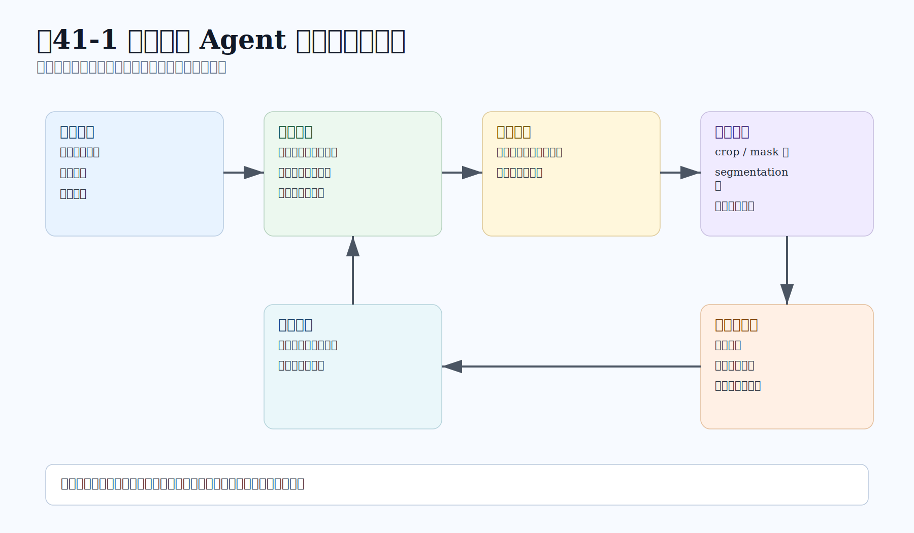
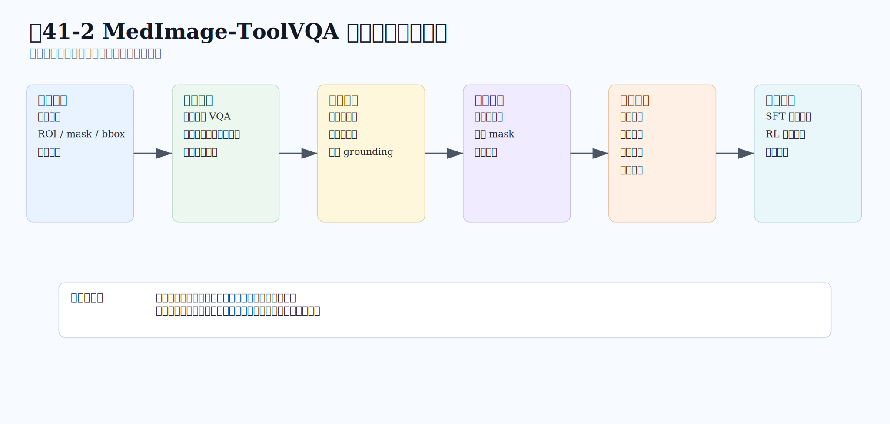
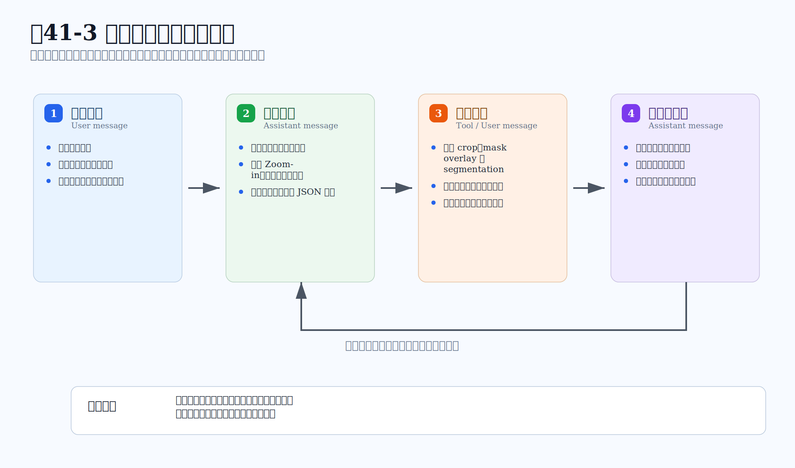
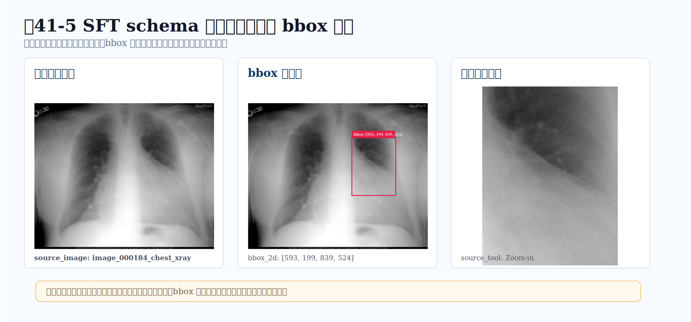
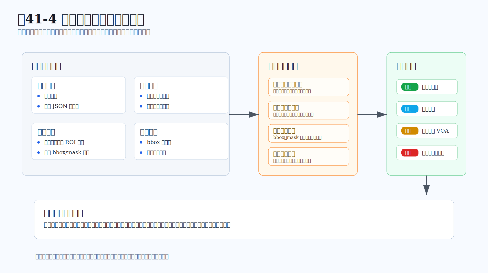

# 第41章：MedImage-ToolVQA 医学图像工具调用数据工程

## 摘要

本章以“MedImage-ToolVQA 医学图像工具调用数据工程”为专项数据集案例，分析任务定义、样本结构、标注流程、质量控制和评测协议。章节强调该数据集如何验证前文的数据工程方法，并说明其在模型训练、基准评测和产业落地中的适用边界、复现条件与风险控制要求。

本章配套实现仓库为 **MedImage-ToolVQA-Mindspore**，完整地址是 <https://github.com/blackkiring/MedImage-ToolVQA-Mindspore>。该仓库用于承接本章的数据构建、MindRecord 封装、SFT 微调、推理服务和评测脚本；后文的工程示例也以 MindSpore 体系为默认实现口径。

在多模态数据工程中，医学图像问答通常被归入视觉问答（Visual Question Answering, VQA）的一种特殊形态；VQA 任务本身可以追溯到自然图像上的开放式问答设定 (Antol et al. 2015)。这一归类本身没有错，却容易遮蔽一个关键事实：医学图像中的“看见”，并不等同于自然图像中的“识别”。一张猫狗图片里，主体轮廓清晰、语义边界分明，模型只要捕捉到对象、属性和场景，就能回答相当一部分问题。医学图像则不同。胸片上的轻微磨玻璃影、CT 中的微小低密度灶、病理切片上的局部细胞排列、超声图像里的弱边界回声，往往只占据画面中很小一部分，而它们的意义必须放回解剖位置、影像模态、扫描条件和临床问题中才能理解。

VQA-RAD、PathVQA 和 SLAKE 等医学 VQA 数据集已经表明，医学图像问答的样本设计需要同时考虑图像模态、专业语义、问题来源和人工校验 (Lau et al. 2018; He et al. 2020; Liu et al. 2021)。这意味着，医学图像 VQA 的数据工程不能只将样本组织为“图像—问题—答案”的三元组。对于一个真正面向医学图像任务的智能体而言，更接近真实工作方式的过程往往是：先看整张图，理解问题所指的结构或病灶；再判断是否需要局部放大、分割或边界细化；接着利用工具返回的局部观察修正判断；最后才给出答案。在这个过程中，答案只是末端结果，前面的取证路径同样构成训练信号。

MedImage-ToolVQA 正是在这一背景下出现的数据工程案例。它关注的不是让模型背更多医学知识，也不是让模型在题库中简单提高多选题准确率，而是把医学图像问答组织成一种“会使用视觉工具的多轮监督数据”。在这种数据中，模型不仅要学习最终选项，还要学习什么时候需要工具、调用哪一种工具、如何写出工具参数、怎样等待观察结果，以及如何把观察图像纳入后续判断。换句话说，它把医学 VQA 从答案监督扩展为行为监督。这种将行动、观察和反馈写入轨迹的思路，与 ReAct 和 Toolformer 等工具使用研究的基本思想相通 (Yao et al. 2023; Schick et al. 2023)。

本章将围绕这一数据范式展开。我们先说明医学图像 VQA 与普通 VQA 的差异，再讨论为什么工具轨迹能够成为有价值的监督信号；随后解释 MedImage-ToolVQA 的样本结构、构建流程、工具体系和多轮轨迹；最后讨论质量控制、隐私合规和医学安全边界。需要强调的是，本章讨论的是数据工程与模型训练监督，不涉及临床诊断建议，也不将模型输出视作医学结论。



*图41-1：医学图像 Agent 局部取证闭环。医学图像工具调用数据的关键在于把“再看哪里、如何看、看完以后怎样更新判断”记录为训练信号。*

## 关键词

MedImage-ToolVQA；专项数据集；评测基准；标注流程；质量控制

## 41.0 学习目标

通过本章学习，读者应能够：

- 解释医学图像 VQA 在证据尺度、专业语义、安全边界与评测对象四方面相较普通 VQA 的本质差异。
- 理解将医学图像问答从答案监督扩展为工具行为监督的动机，及其在可审计性与强化学习接口上的价值。
- 掌握以 BiomedParse 区域级信息为基础、由原图、ROI、mask、bbox、目标描述与工具观察图像组成的样本结构。
- 区分 Zoom-in、分割等工具的角色边界，并解释工具调用、参数生成与观察消费如何组织为多轮训练轨迹。
- 评估工具轨迹引入的噪声风险，并结合医学隐私、合规与安全边界设计质量控制与人工复核规则。

## 41.1 医学图像 VQA 与普通 VQA 的差异

普通 VQA 的典型问题是“图中有几个人”“桌上是什么物体”“左侧车辆是什么颜色”。这类问题当然也可能很难，但它们通常依赖对象识别、空间关系和常识推断。医学图像 VQA 面对的对象则更隐蔽。许多关键差异并不表现为清晰的物体，而表现为灰度变化、边界模糊、纹理改变、局部密度差异或结构比例异常。对于模型而言，医学图像的难点不只是“识别一个东西”，而是“在有限视觉证据中判断局部表现是否足以支持某个选项”。

这种差异首先体现在证据尺度上。自然图像中的主体通常占据较大比例，而医学图像中的关键区域可能很小。一个肺结节、视网膜微出血点或病理切片中的局部核异型性，往往只占整幅图像的几个像素块。如果模型只能在压缩后的全图表示上回答问题，很容易忽略这些局部线索。即使视觉编码器保留了部分局部特征，语言侧的回答也未必会稳定使用它们。

第二个差异是证据语义需要专业上下文。医学图像里的局部区域并不总能靠日常词汇描述。一个亮点可能是钙化，也可能是伪影；一片边缘不清的区域可能提示炎症，也可能只是成像质量问题。判断它们需要结合解剖位置、模态类型和题目语境。因此，数据不能只让模型“看见局部”，还要让模型理解这个局部为什么与问题相关。

第三个差异是安全边界。普通 VQA 的错误通常表现为描述不准或答案错选；医学图像 VQA 的错误则更容易被读者误解为诊断判断。即便在研究数据集中，问题和答案也必须明确处在训练与评测语境下，而不能面向患者给出建议。这使得医学图像数据工程必须同时处理准确性、可追踪性、隐私和误用风险。

第四个差异是评测对象的变化。普通 VQA 往往只评测最终答案是否正确；医学图像工具调用数据还需要评测取证过程是否合理。模型答对了题，但工具调用区域完全不相关——这样的轨迹并不能说明模型学会了医学图像取证。反过来，模型可能选择了合理的局部区域，却在最终选项上出错，这同样提供了有价值的失败归因线索。数据工程需要把这两类信号分开记录。

从这些差异可以看出，医学图像 VQA 的数据组织必须比普通 VQA 更细。它需要保存全图、局部区域、工具观察、问题、答案和行为轨迹之间的关系。唯有如此，模型训练才有机会从“语言上会答题”进入“视觉上会取证”。

## 41.2 从答案监督到工具行为监督

传统 VQA 数据的监督目标很明确：给定图像和问题，输出答案。这种形式简单、稳定，便于评测。但它有一个不足：推理过程被压缩到不可见的模型内部。我们不知道模型是否真的看了图，不知道它关注了图中的哪个区域，也不知道它是否因为局部证据而做出选择。对于医学图像任务而言，这种不可见性会带来明显风险。

工具行为监督试图补上这一层。它不是要求模型直接暴露完整思维过程，而是把可执行的行为节点写进样本结构。例如：模型先判断需要局部放大，调用 `Zoom-in`；工具返回一张局部 crop；模型再根据局部 crop 继续判断。这里的训练信号不再只有最终答案，而是包括了工具选择、参数生成、观察消费和答案生成。

这种监督方式有三个好处。第一，它让模型学习一种更接近真实工作的视觉取证流程——医学图像分析很少是一次性全图扫视就结束的过程，局部复查、边界确认和区域对照都很常见。第二，它让训练数据具备更好的可审计性：工具调用参数、观察图像和最终答案之间的关系可以被检查，错误也更容易定位。第三，它为后续强化学习提供了环境接口——只要工具调用和观察返回被结构化，模型就可以在规则奖励或环境反馈中进一步优化工具策略。

当然，工具行为监督也不是万能的。它会引入新的数据噪声：工具可能分割错误，bbox 可能偏离目标，模型可能为了迎合格式而过度调用工具。数据工程必须承认这些风险，并通过校验和复核降低其影响。工具调用数据的目标不是制造“看起来更复杂”的样本，而是让每个工具动作都能解释它解决了哪类视觉不确定性。

因此，MedImage-ToolVQA 的基本思想可以概括为一句话：将医学图像问答中原本隐含的局部取证过程，显式转化为可训练、可检查、可评测的多轮样本。它保留答案监督，但不满足于答案监督；它引入工具轨迹，但不把工具调用当成形式装饰。

## 41.3 数据对象与规模概览

MedImage-ToolVQA 面向的是医学图像多选问答。样本以 BiomedParse 提供的区域级视觉信息为基础 (Zhao et al. 2025)，包含原始医学图像、目标区域、mask、bbox、目标描述、问题、候选选项、正确答案，以及可能由工具返回的局部观察图像。最终整理后的训练数据共有 24,992 条记录，任务形态以多选医学图像 VQA 为主。

在这些记录中，多图样本占有重要比例。统计显示：19,945 条记录包含 3 张原始或工具相关图像，2,471 条包含 1 张图像，1,383 条包含 4 张图像，1,193 条包含 2 张图像。这一分布说明，数据集中相当多的样本并非单纯的“原图加问题”，而是保存了工具链产生的观察图像——局部 crop、mask overlay 或分割结果会作为新的视觉证据进入轨迹。

| 指标 | 数值 | 数据工程含义 |
|---|---:|---|
| 总记录数 | 24,992 | 可用于训练与评测的医学图像工具调用样本规模 |
| 区域来源 | BiomedParse | 以 ROI、mask、bbox 和目标描述组织局部证据 |
| 问题形式 | 多选医学图像 VQA | 便于答案校验和规则奖励设计 |
| `raw_images = 3` | 19,945 | 最常见的工具增强轨迹形态 |
| `raw_images = 1` | 2,471 | 直接视觉推理或单图样本 |
| `raw_images = 4` | 1,383 | 可能包含额外工具观察或多步轨迹 |
| `raw_images = 2` | 1,193 | 原图加单个工具观察的形态 |
| 答案 A | 9,986 | 正确选项分布，需要关注选项偏置 |
| 答案 B | 7,177 | 正确选项分布，需要关注选项偏置 |
| 答案 C | 5,473 | 正确选项分布，需要关注选项偏置 |
| 答案 D/E | 2,356 | 长尾选项，评测时不宜只看总体准确率 |

这张表不应被理解为单纯的规模展示。它真正提示的是三个工程问题。第一，答案选项并不完全均衡，训练和评测都需要关注选项偏置。第二，多图记录占比较高，说明工具观察已成为数据结构的一部分。第三，区域级来源决定了样本质量高度依赖 ROI、mask 和 bbox 的准确性——如果区域本身不可靠，后续问题生成和工具轨迹都会受到影响。

我们可以把 MedImage-ToolVQA 看作一种“介于 VQA 数据集和 Agent 轨迹数据之间”的数据对象。它仍有图像、问题和答案，因此属于 VQA；但它又记录工具动作和观察结果，因此也属于 Tool-Use 数据。它的价值不只是提供更多医学题，而是提供一种将视觉证据、工具行动和答案监督放入同一条轨迹的组织方式。

## 41.4 ROI、mask 与 bbox：局部证据如何进入样本

医学图像工具调用数据的第一步，是让“局部证据”具备可操作的表示。自然语言可以说“右肺上叶靠近胸膜处有一个小结节”，但模型和工具需要更明确的接口。ROI、mask 和 bbox 就承担了这个接口角色。

ROI 是感兴趣区域，表示样本希望模型关注的局部范围。bbox 用四个坐标描述该范围的矩形边界，适合裁剪和粗定位。mask 提供更细的像素级区域，适合分割、overlay 和边界复核。目标描述则将视觉区域转化为医学语义，例如“肺部结节”“肝脏病灶”“血管结构”或“组织切片中的局部异常”。这四类信息结合起来，构成医学图像工具调用样本的证据基础。

如果只有 bbox，数据可以完成局部放大，但未必能表达精细边界。如果只有 mask，数据可以表达区域形状，却不一定便于模型生成工具调用参数。如果只有目标描述，模型可能知道语义对象，却无法验证其位置。因此，在构建医学图像工具调用数据时，bbox、mask 和 description 通常需要共同出现，分别服务于裁剪、分割和语义定位。

ROI 的另一个作用是防止问题退化为纯文本医学题。一个医学多选题如果不依赖具体图像区域，模型凭一般医学知识就能回答。例如，“肺结节通常出现在什么器官中”并不是有效的图像问题；“图像中局部结节的边界和密度更接近哪种描述”才需要视觉证据。ROI、mask 和 bbox 使数据构建者可以检查问题是否真的与局部区域相关。

但局部证据也会带来一个常见陷阱：定位泄漏。如果问题直接写成“方框中的区域是什么”或“mask 标记处显示什么”，模型就不需要学习主动定位，也不需要学习工具调用——它只是在遵循文本里已经暴露的提示。因此，问题生成阶段必须避免将 bbox、mask 或 ROI 以显性方式写入题干。好的问题应当暗示需要局部观察，而不直接告诉模型标注位置。

在这个意义上，局部证据既是训练资源，也是约束条件。它帮助我们构建样本，也帮助我们过滤样本。一个合格的 MedImage-ToolVQA 样本，应当让问题与 ROI 有明确关系，但不让问题泄漏 ROI 的标注方式；让工具轨迹能够利用 bbox 或 mask，但不让模型将这些标注当作题干中已经给出的答案。


### 41.4.1 问题与选项设计：让题目真正依赖图像

医学图像工具调用数据的质量，很大程度上取决于问题本身是否设计得合理。工具轨迹再完整，如果题目不需要局部视觉证据，模型也不会真正学会取证。一个好的医学图像 VQA 问题，应当同时满足三个条件：与图像中的具体区域相关；不直接泄漏区域标注；选项差异能够通过视觉证据来区分。

第一点是区域相关性。题目不能只问一般医学知识，也不能只问图像模态或器官名称这类过于宽泛的信息。以肺部影像为例，“肺结节通常有哪些影像表现”更像知识问答；“图像中目标区域的边界和密度更符合哪种描述”才更接近图像问答。前者训练的是医学知识回忆，后者训练的是视觉证据判断。对工具调用数据而言，后者才有机会让模型学会局部观察的价值。

第二点是避免定位泄漏。构建者手里有 bbox 和 mask，很容易在题目中写出“框选区域”“标注处”“mask 内”这类表达。这些题目看似清楚，实则破坏了工具调用数据的目标——模型已被题干告知要看哪里，后续工具调用只是照着题干执行，而非根据问题和全图自主判断关注区域。更合适的做法是让题目自然指向某个医学现象，而非指向标注机制。例如可以说“图像中局部异常的形态更接近哪一项”，而不应说“红框内异常的形态更接近哪一项”。

第三点是选项可区分性。多选题的选项不能只是同义改写，也不能全部依赖外部医学常识。选项之间应当围绕可观察的视觉特征形成差异，例如边界清晰与否、分布局灶还是弥漫、密度或信号强度是否异常、是否更像伪影或正常结构。这样，模型才需要通过图像证据来排除选项。若选项设计不佳，即使题干与图像有关，训练信号也会变弱。

在实际构建中，题目设计还要考虑难度梯度。如果所有题目都很简单，模型会倾向于直接回答；如果所有题目都很难，工具轨迹可能变得过长且不稳定。更合理的混合方式是保留一部分全图可答样本、一部分需要局部放大的样本、一部分需要分割或边界确认的样本。这样，模型才能学到工具调用的条件，而非只学到固定格式。

还需要注意的是，医学图像问题不应鼓励模型作出超出数据任务范围的临床判断。多选题可以要求模型在给定选项中选择最符合图像表现的一项，但题干和解释不应扩展为“患者应当如何治疗”或“可以确诊为某疾病”。这种边界对医学数据尤其重要，因为读者和使用者很容易把视觉判断误读为诊断建议。

因此，问题与选项设计可以看作 MedImage-ToolVQA 的第一道质量门槛。它决定样本是否值得进入后续工具轨迹合成。若题目本身没有图像依赖性，后续再精细的工具调用也只是形式上的复杂化；若题目合理，工具轨迹才可能成为真正的行为监督。

### 41.4.2 观察图像的生命周期

工具调用数据中的观察图像并不是普通附图。它们从原始图像中派生出来，又在训练轨迹中作为新的输入返回给模型。这个过程可以理解为观察图像的生命周期：从区域证据出发，生成局部观察，进入多轮对话，最后成为可审计的训练元数据。

第一步是观察图像生成。局部 crop 通常由 bbox 决定，mask overlay 由原图与分割结果叠加而成，语义分割图则来自文本驱动或 bbox 驱动的工具输出。这里需要明确一点：观察图像不应只追求视觉上好看，而应追求证据上可用——它要保留足够局部细节，同时尽量避免把无关背景放大成误导信息。

第二步是观察图像绑定。工具返回的新图像必须和原始图像、工具参数及对话轮次对应起来。若图像索引错乱，模型就可能把某一次工具返回误认为另一张图像；若 bbox 与观察图之间没有记录关系，后续审计也无法判断工具是否真的看了目标区域。因此，多图样本中的图像顺序和引用方式必须稳定。

第三步是观察图像消费。数据样本不能只在工具调用后机械地插入一张图，还要让后续回答体现对观察图的使用。模型应当基于观察图确认或修正判断，而不是继续凭原图和题干作答。对于教学型样本，解释可以明确写出“局部观察显示了什么，因此排除哪些选项”；对于训练型样本，也至少应让最终答案与观察证据保持一致。

第四步是观察图像审计。派生图像同样需要脱敏、质量检查和版本记录。局部放大图可能把原图中的角标或编号放大；mask overlay 可能因颜色或透明度设置影响读者判断；分割图可能错误覆盖邻近结构。这些问题若不记录，模型训练中的视觉证据就会变得不可靠。

观察图像生命周期的关键，是不要把工具返回结果当成一次性中间产物。对于工具调用数据来说，它既是训练输入，也是审计对象；既服务模型学习，也服务数据质量解释。只有把这一层关系维护好，多图轨迹才不会退化为“原图旁边多放几张图”。

## 41.5 数据构建的概念流程

MedImage-ToolVQA 的构建流程可以概括为六个阶段：区域样本整理、问题生成、质量校验、工具观察生成、轨迹合成和训练封装。每个阶段都不是孤立步骤，而是在维护同一条证据链。为了让读者看到这些阶段如何进入 MindSpore 工程实现，下面不再使用抽象伪代码，而是把 `merge`、`make_vqa`、`verify`、`makereasoning` 和 `make_sft` 写成一组以 MindRecord、`mindspore.dataset` 和 `vllm-mindspore` 为核心的示例入口。其中，`vllm-mindspore` 的官方代码库采用 AtomGit 地址 <https://atomgit.com/mindspore/vllm-mindspore>。示例省略了具体路径、脱敏规则和异常处理细节，但保留了数据对象、质量门禁和训练封装之间的关系。

### 41.5.1 区域样本合并：写入 MindRecord

`merge` 的重点是把来自不同解析工具或中间结果的区域证据统一成 MindSpore 可读取的数据资产。这里不展开完整工程代码，只保留核心数据契约：按 `image_id` 和 `region_id` 去重，保留 bbox、mask、目标描述和来源信息，并写入 MindRecord。

```python
from mindspore.mindrecord import FileWriter

schema = {
    "image_id": {"type": "string"},
    "region_id": {"type": "string"},
    "bbox": {"type": "int32", "shape": [-1]},
    "mask_path": {"type": "string"},
    "target_desc": {"type": "string"},
    "source": {"type": "string"},
}

writer = FileWriter("region_pool.mindrecord", shard_num=4, overwrite=True)
writer.add_schema(schema, "region evidence schema")
writer.write_raw_data(deduplicate_regions(raw_regions, keys=["image_id", "region_id"]))
writer.commit()
```

### 41.5.2 LLM 服务：使用 vllm-mindspore

`make_vqa` 和 `makereasoning` 需要调用本地部署的大模型。MindSpore 体系下可以通过 `vllm-mindspore` 提供 OpenAI 兼容服务；其官方代码库采用 AtomGit 地址 <https://atomgit.com/mindspore/vllm-mindspore>。

```bash
vllm-mindspore serve Qwen/Qwen3-vl-8B \
  --host 0.0.0.0 \
  --port 8000
```

```python
from openai import OpenAI

client = OpenAI(base_url="http://127.0.0.1:8000/v1", api_key="EMPTY")
```

### 41.5.3 问题生成：从 MindDataset 读取区域证据

`make_vqa` 从 `MindDataset` 读取区域证据，生成问题、候选选项和标准答案。构造 prompt 时需要隐藏 bbox、mask 路径和区域编号，避免把标注机制泄漏到题干中。

```python
import mindspore.dataset as ds

dataset = ds.MindDataset("region_pool.mindrecord", shuffle=False)

for row in dataset.create_dict_iterator(output_numpy=True):
    prompt = build_vqa_prompt(row, hide_fields=["bbox", "mask_path", "region_id"])
    reply = client.chat.completions.create(
        model="Qwen/Qwen3-vl-8B",
        messages=[{"role": "user", "content": prompt}],
        temperature=0.2,
    )
    write_jsonl("vqa_candidates.jsonl", parse_vqa(reply.choices[0].message.content, row))
```

### 41.5.4 质量校验：形成自动门禁结果

`verify` 不直接改写样本答案，而是给样本附加质量门禁结果。只有字段完整、图像依赖明确、区域一致且工具 JSON 合法的样本，才进入后续轨迹合成。

```python
gates = {
    "complete": has_required_fields(sample),
    "image_dependent": requires_visual_evidence(sample),
    "region_consistent": align_question_answer_roi(sample),
    "tool_json_valid": validate_tool_schema(sample),
}

sample["review_status"] = "pass" if all(gates.values()) else "revise"
sample["quality_gates"] = gates
```

### 41.5.5 轨迹合成：把工具观察写回对话

`makereasoning` 的核心不是生成更长的解释，而是把工具调用和工具返回图像变成下一轮上下文。若样本不需要局部证据，则保留直接视觉推理路径。

```python
observation = run_visual_tool(sample) if needs_local_evidence(sample) else None
prompt = build_reasoning_prompt(sample, observation)
reply = client.chat.completions.create(
    model="Qwen/Qwen3-vl-8B",
    messages=[{"role": "user", "content": prompt}],
    temperature=0.1,
)

sample["trajectory"] = build_tool_trajectory(sample, observation, reply)
```

### 41.5.6 SFT 封装：训练记录继续写入 MindRecord

`make_sft` 将多轮消息、图像引用、答案和质量标签写入训练用 MindRecord。SFT 训练侧再通过 `mindspore.dataset.MindDataset` 加载，并按 batch 进入模型微调流程。

```python
schema = {
    "messages": {"type": "string"},
    "images": {"type": "string"},
    "answer": {"type": "string"},
    "quality": {"type": "string"},
}

writer = FileWriter("tool_sft.mindrecord", shard_num=8, overwrite=True)
writer.add_schema(schema, "tool-use SFT schema")
writer.write_raw_data(pack_sft_records(tool_trajectories))
writer.commit()

train_ds = ds.MindDataset("tool_sft.mindrecord").shuffle(4096).batch(8)
```



*图41-2：MedImage-ToolVQA 数据构建概念流程。流程的重点不是脚本顺序，而是证据链和行为链如何在各阶段被保留下来。*

第一阶段是区域样本整理。来自医学图像解析工具的区域级结果需要被合并、去重和规范化。对于同一张医学图像，可能存在多个候选区域；同一个区域也可能在不同中间结果中重复出现。数据工程需要按区域标识进行去重，而非简单按图像去重，否则会误删同图中的多个病灶或结构。

第二阶段是问题生成。构建器根据原图、目标区域、mask、bbox 和目标描述生成医学多选题。问题应当像普通医学图像 VQA 一样自然，不应暴露“框内”“mask 中”这类标注信息。候选选项需要能够区分局部视觉特征，不能只是泛泛的医学概念列表。

第三阶段是质量校验。系统需要检查问题结构、选项质量、答案一致性和区域 grounding。这里的 grounding 并不是传统目标检测意义上的“框是否准”，而是问题、答案和目标区域之间是否存在合理关系。若问题与 ROI 无关，即使答案文本正确，也不适合作为工具调用训练样本。这一阶段还承担一项重要任务：识别不依赖图像也能回答的题目，防止样本退化为纯文本医学问答。

第四阶段是工具观察生成。对于需要工具增强的样本，构建流程会生成局部 crop、mask overlay 或分割观察图。这些图像不是装饰，而是后续多轮轨迹中的新输入。模型在训练时会看到工具调用之后出现的观察图，从而学习如何消费工具返回结果。

第五阶段是轨迹合成。经过校验的样本被组织成多轮结构：模型先观察原图和问题，决定是否调用工具；工具返回观察图；模型继续推理并输出答案。约 90% 的样本采用工具增强路径，约 10% 保留为直接视觉推理样本。保留直接样本是必要的，因为并非所有问题都应调用工具。若训练数据暗示“每题都必须调用工具”，模型会学到低效甚至错误的行为策略。

第六阶段是训练封装。轨迹会被整理为 SFT 对话记录和可用于 RL 的环境输入。SFT 强调格式和示范，RL 强调策略优化和奖励反馈。二者使用相近的样本基础，但训练目标不同，封装方式也不同。训练封装的关键不是简单拼接文本，而是将 assistant 的工具调用、user 侧的观察图像和最终答案拆成可训练的多轮结构。

这个流程最重要的原则是：证据不能在中间丢失。问题来自哪张图、对应哪个区域、工具观察如何生成、答案如何校验，都需要被追踪。否则，最终数据虽然表面上有工具调用，实际上却无法证明这些工具动作是否与医学图像证据有关。

## 41.6 三类工具的角色与边界

MedImage-ToolVQA 中涉及三类视觉工具：`Zoom-in`、`BiomedParse` 和 `SAM2`。它们分别对应医学图像分析中三种常见需求：看得更近、按医学语义定位、按几何提示获取更精细分割。

`Zoom-in` 的功能最直观：根据 bbox 裁剪局部区域，让模型获得更高分辨率的局部观察。它适合处理全图中较小、细节不足的区域。例如，肺部小结节在全图中可能只占很小范围，放大后才能更清楚地观察边界和密度。`Zoom-in` 的风险也很明显：bbox 若偏移，裁剪图就可能错过关键证据；裁剪过窄，又可能丢失周围解剖上下文。

`BiomedParse` 更偏医学语义分割。它接受目标图像和文本描述（例如“lung nodule”或“liver lesion”），返回与医学语义相关的分割结果。这类工具的优势是能将自然语言目标与医学图像区域联系起来，适合需要语义定位的场景。风险在于，医学图像模态差异很大，文本描述若不准确，工具可能返回错误区域，或将相似结构误分割为目标。

`SAM2` 是 bbox prompt 驱动的通用分割工具 (Ravi et al. 2024)。它不依赖医学语义，而是根据几何提示在图像中生成更精细的 mask。对于已有候选框但需要更明确边界的样本，`SAM2` 可以提供补充观察。它的主要风险是过度依赖 bbox 质量：bbox 若覆盖背景或相邻结构，分割结果也会受到影响。

| 工具 | 主要输入 | 返回结果 | 适合解决的问题 | 需要控制的风险 |
|---|---|---|---|---|
| `Zoom-in` | 图像索引、bbox 坐标 | 局部 crop 图 | 局部太小、全图分辨率不足、需要观察细节 | bbox 偏移、过度裁剪、上下文丢失 |
| `BiomedParse` | 图像索引、医学语义描述 | 医学结构或病灶分割图 | 需要按医学概念定位结构或病灶 | 描述不准、模态泛化不足、误分割 |
| `SAM2` | 图像索引、bbox 坐标 | bbox prompt 对应的 mask | 已有候选框，需要边界细化 | bbox 质量依赖强、可能包入背景 |

这三类工具共同构成了一个有限但有代表性的行动空间。模型不需要拥有无限工具，而需要在有限工具中做出合理选择。对于数据工程来说，工具数量并非越多越好——工具越多，调用格式、错误模式和质量校验都会变复杂。更稳妥的做法是先选择少量边界清晰、输入输出可验证的工具，让模型学会基本的取证闭环。

工具边界还需要在系统提示和数据说明中清楚表达：`Zoom-in` 是裁剪工具，不是诊断工具；`BiomedParse` 是医学图像分割工具，不是病理结论生成器；`SAM2` 是通用分割工具，不理解临床语境。只有把这些边界写清楚，模型训练才不容易把“获取视觉证据”误学成“替代专业判断”。Segment Anything 与 MedSAM 等工作也提醒我们，promptable segmentation 的工程能力需要与医学场景解释的边界分开理解 (Kirillov et al. 2023; Ma et al. 2024)。

## 41.7 工具调用轨迹如何组织成多轮样本

工具调用轨迹的核心是多轮结构。它不是把工具调用写在同一段文本中，而是将工具动作和工具观察分开，让模型在训练时经历一个“行动—观察—继续判断”的过程 (Yao et al. 2023)。



*图41-3：工具调用多轮轨迹结构。工具观察以新的图像输入形式返回，模型必须基于观察图继续推理，而非仅生成一个形式正确的调用。*

一个简化的轨迹可以分成四步。第一步，用户给出原始图像、问题和候选选项。第二步，助手根据全图和问题判断需要局部证据，输出结构化工具调用。第三步，工具环境返回新的观察图像，通常以用户消息或环境消息的形式插入对话。第四步，助手结合原图和观察图继续判断，输出答案。

下面是一个教学型示例。它不对应具体病例，只用于说明结构。

```text
User:
<image>
Question:
图像中目标区域的影像表现更接近以下哪一种描述？
Options:
A. 边界较清楚的局灶性异常
B. 弥漫性背景改变
C. 与正常解剖结构一致
D. 主要由成像伪影造成

Assistant:
<think>
题目要求判断局部表现。全图能够提示大致位置，但局部边界和密度仍不够清楚，
需要先放大疑似区域，再比较选项。
</think>
<tool_call>
{"name":"Zoom-in","arguments":{"target_image":1,"bbox_2d":[132,184,278,336]}}
</tool_call>

User:
<image>
工具返回了局部放大观察图，请继续根据新观察判断。

Assistant:
<think>
局部观察图显示目标区域与周围背景存在可分辨差异，边界较清楚，
不符合弥漫性改变，也不宜仅解释为伪影。
</think>
<answer>A</answer>
```

这个样例展示了工具轨迹的几个关键点。首先，工具调用参数必须结构化，不能只写“请放大一下”。其次，工具返回必须成为新的多模态输入，而非在文本里简单描述“已经放大”。再次，最终答案应当消费观察结果，说明局部观察如何改变或支持判断。最后，轨迹中不应出现诊断性断言，而应围绕题目选项和视觉证据展开。

多轮轨迹还可以包含多次工具调用。例如，模型先用 `Zoom-in` 观察局部区域，再用 `SAM2` 获取更精细边界；或者先用 `BiomedParse` 按语义定位病灶，再用局部观察确认其外观。多工具轨迹的价值在于呈现递进式取证，但这也要求更严格的校验——每多一次工具调用，就多一个参数错误、观察错配或过度调用的风险。

因此，MedImage-ToolVQA 中保留一部分直接视觉推理样本是合理的。直接样本告诉模型：工具不是必须动作，而是按需动作。一个成熟的医学图像 Agent 不应为了展示工具能力而调用工具，而应在全图信息不足、局部细节关键、区域边界需要确认时调用工具。这种“按需”才是工具行为监督真正想训练的策略。


### 41.7.1 一个样本的三层读法

为了理解工具调用样本，读者可以把每条记录分成三层来读。第一层是题目层：图像、问题、选项和答案，回答“这是一道什么题”。第二层是证据层：ROI、bbox、mask、局部观察图和目标描述，回答“这道题为什么需要图像，以及证据大致在哪里”。第三层是行为层：模型在多轮对话中如何调用工具、如何接收观察、如何继续判断，回答“模型应该怎样行动”。

如果只读题目层，MedImage-ToolVQA 与普通 VQA 的区别并不明显。读者看到的仍然是一张医学图像和一道多选题。这也是许多数据集介绍容易停留在表面的原因：只展示题目和答案，看不出数据范式的变化。真正的差异要到证据层和行为层才会显现。证据层说明问题并非凭空生成，而是来自可追踪的局部区域；行为层说明模型不是一次性回答，而是在工具空间内进行取证。

三层读法也有助于排查样本质量。若题目层合理，但证据层缺失，那么样本可能只是普通 VQA；若证据层存在，但行为层没有使用工具观察，那么样本可能只是附带标注的 VQA；若行为层完整，但题目层本身文本可答，那么工具调用又会变成形式化动作。只有三层同时成立，样本才真正体现医学图像工具调用数据的价值。

从训练角度看，三层分别对应不同损失或评测关注点。题目层决定最终答案监督；证据层决定图像 grounding 和区域一致性；行为层决定 Tool-Use 格式和行动策略。一个训练系统可以只使用其中一部分，但使用越少，模型学到的能力就越窄。例如只使用题目层，可以训练医学 VQA；加入证据层，可以训练或评测局部 grounding；再加入行为层，才进入医学图像 Agent 的取证轨迹学习。

从数据治理角度看，三层也对应不同责任人。医学内容专家更适合审查题目和答案是否合理；视觉数据工程师更适合审查 ROI、mask 和观察图是否一致；Agent 或训练工程师更适合审查工具格式、轨迹结构和奖励接口是否稳定。把这些层次分清楚，能减少协作中的模糊责任。否则，一个样本出错时，团队很容易只说“这条数据不好”，却说不清到底是题目不好、区域不好，还是轨迹不好。

### 41.7.2 工具轨迹与普通 CoT 的区别

工具调用轨迹有时会被误解为一种更复杂的 CoT（Chain-of-Thought）数据。二者确实都涉及中间过程，但训练含义并不相同。普通 CoT 主要在文本空间中展开：模型生成一段推理说明，再输出答案。工具轨迹则包含外部行动和环境反馈：模型输出工具调用，环境返回新的观察，模型再基于观察继续判断。它不只是“想得更详细”，而是“看到了新的东西”。

这一差异在医学图像中尤其重要。若模型只生成一段文字推理，它可能写出“需要观察局部区域”，但实际上并没有获得新的局部图像——推理可能语言上合理，却没有改变视觉输入。工具轨迹则要求模型真正调用放大或分割工具，并把返回图像纳入后续上下文。此时，中间步骤不再只是语言解释，而成为改变可见证据的动作。

普通 CoT 的质量主要取决于推理文本是否连贯、是否支持答案。工具轨迹还要额外检查动作是否可执行、工具参数是否正确、观察结果是否与动作对应。比如模型说“我将放大右上区域”，但 bbox 实际指向左下区域；或者工具返回了局部图，模型却继续引用原图中的其他区域。这些错误在普通 CoT 中不一定存在，但在工具轨迹中必须被识别。

这也解释了为什么工具调用数据不能只把轨迹写成一整段 assistant 消息。如果工具调用和观察返回都被压缩在同一段文本里，模型就不会经历环境反馈。多轮结构的意义在于让模型在时间上先行动，再接收结果，再继续判断——这样的结构更接近真实 Agent，也更便于后续接入工具环境。

当然，工具轨迹并不排斥简短的解释。模型在调用工具前可以说明为什么需要局部证据，在观察返回后可以说明观察如何影响选项比较。但这些解释应服务于动作和证据，不应喧宾夺主。对于医学图像场景，过长、过自信或过度诊断化的推理说明反而可能带来风险。更稳妥的写法是围绕问题选项和视觉证据进行有限说明。

因此，可以把工具轨迹理解为一种“带外部观察的过程监督”。它比普通答案监督更细，比纯文本 CoT 更可执行，也比完全黑箱的工具策略更可审计。MedImage-ToolVQA 的数据工程价值，正体现在这种过程监督的组织方式上。

## 41.8 SFT 数据与 RL 数据的不同关注点

工具轨迹可以同时服务 SFT 和 RL，但两者关注点不同。SFT 更像行为示范，目标是让模型学会格式、顺序和基本策略。RL 更像策略优化，目标是让模型在奖励反馈下选择更有效的行为。

在 SFT 阶段，数据最重要的是清晰和稳定。模型需要看到足够多格式正确的工具调用，理解 `<tool_call>` 内部应是可以解析的 JSON，理解工具返回后会出现新的图像观察，理解最终答案应写在固定位置。SFT 数据若格式混乱，后续 RL 环境就很难解析模型动作；若观察图插入位置不稳定，模型也难以学会“工具返回后继续推理”的节奏。

在医学图像场景中，SFT 多轮记录还应显式保存一个影像诊断相关 schema。这里的“诊断”不是要求模型给出临床结论，而是把训练题目中的医学影像任务、候选标签、证据区域和安全边界结构化。图41-5给出了一组来自 VQA-RAD 测试集的胸片样例：同一条记录不仅保存原始图像，还保存 bbox 坐标、框选可视化图和由工具返回的局部观察图。



*图41-5：SFT schema 中的真实图像与 bbox 证据。bbox 是训练记录中的结构化字段，同时也应能被还原为可复查的可视化证据。*

图像来源：VQA-RAD test split，Hugging Face 数据集 [flaviagiammarino/vqa-rad](https://huggingface.co/datasets/flaviagiammarino/vqa-rad)，许可证为 [CC0-1.0](https://creativecommons.org/publicdomain/zero/1.0/)；本图为工具调用示例中的重采样派生图，用于说明 schema 中原图、bbox overlay 与局部 crop 的对应关系。

下面以这张胸部 X 线样例为基础，给出一条多轮 SFT 记录的写法。

```json
{
  "sample_id": "medimage_toolvqa_xray_chest_000184",
  "task_type": "medical_image_vqa_with_tool_use",
  "image_context": {
    "modality": "X-ray",
    "body_part": "chest",
    "view_or_series": "frontal chest radiograph",
    "image_role": "original_image",
    "figure_ref": "ch41_05_sft_schema_real_chest_xray.png",
    "source_dataset": "VQA-RAD",
    "source_split": "test",
    "source_url": "https://huggingface.co/datasets/flaviagiammarino/vqa-rad",
    "license": "CC0-1.0",
    "derivation": "resized tool-observation example",
    "deidentification": "metadata_removed"
  },
  "diagnosis_schema": {
    "clinical_scope": "training_and_evaluation_only",
    "diagnostic_task": "chest_xray_focal_opacity_characterization",
    "target_finding": "focal opacity candidate",
    "anatomical_location": "right lung field",
    "candidate_labels": [
      {"choice": "A", "label": "focal opacity with relatively clear boundary"},
      {"choice": "B", "label": "diffuse bilateral background opacity"},
      {"choice": "C", "label": "linear or band-like opacity"},
      {"choice": "D", "label": "imaging artifact without focal opacity"}
    ],
    "gold_choice": "A",
    "answer_boundary": "select_from_candidates_only",
    "not_for_clinical_diagnosis": true
  },
  "visual_evidence": {
    "roi_id": "roi_000184_01",
    "bbox_2d": [593, 199, 839, 524],
    "bbox_overlay_ref": "ch41_06_sft_schema_bbox_overlay.png",
    "crop_ref": "ch41_07_sft_schema_zoom_roi.png",
    "target_description": "right lung field focal opacity candidate",
    "evidence_requirements": [
      "verify focality",
      "compare boundary clarity",
      "exclude diffuse background opacity or artifact"
    ]
  },
  "messages": [
    {
      "role": "user",
      "content": [
        {"type": "image", "image_id": "image_000184_chest_xray"},
        {
          "type": "text",
          "text": "该胸部 X 线图像中目标区域的影像表现更接近哪一项？\nA. 边界相对清楚的局灶性高密度影\nB. 弥漫性双肺背景性密度增高\nC. 线样或条带状影\nD. 无局灶性高密度影的成像伪影"
        }
      ]
    },
    {
      "role": "assistant",
      "content": [
        {"type": "text", "text": "全图提示右侧肺野存在需要复查的局部区域，但边界和密度细节不足，需要先调用工具放大目标区域。"},
        {
          "type": "tool_call",
          "name": "Zoom-in",
          "arguments": {"target_image": 1, "bbox_2d": [593, 199, 839, 524]}
        }
      ]
    },
    {
      "role": "user",
      "content": [
        {"type": "image", "image_id": "image_000184_zoom_roi_01", "source_tool": "Zoom-in", "figure_ref": "ch41_07_sft_schema_zoom_roi.png"},
        {"type": "text", "text": "工具返回了目标区域的局部放大图，请基于新观察继续作答。"}
      ]
    },
    {
      "role": "assistant",
      "content": [
        {"type": "text", "text": "局部观察支持局灶性高密度影表现，边界相对清楚，不符合弥漫性背景改变或单纯线样影。"},
        {"type": "answer", "choice": "A"}
      ]
    }
  ],
  "quality_control": {
    "image_dependency": "required",
    "tool_use_label": "necessary",
    "schema_valid": true,
    "review_status": "passed_with_nonclinical_scope"
  }
}
```

这个 schema 的重点不是让模型学习“胸片异常应当如何诊断”，而是让训练记录能够同时回答五个工程问题：这是什么医学影像任务，候选标签边界在哪里，视觉证据来自哪一个 ROI，工具调用是否可执行，最终答案是否只落在题目允许的候选范围内。若缺少 `diagnosis_schema`，SFT 样本虽然仍可训练格式，却很难在后续质检、分层评测和人工复核中区分“医学标签错误”“区域证据错误”和“工具行为错误”。

在 RL 阶段，数据需要进一步暴露奖励和环境接口。模型输出工具调用后，环境可以判断工具名是否合法、参数是否符合 schema、bbox 是否越界、图像索引是否存在。模型输出答案后，规则奖励可以比较最终选项是否正确。更复杂的奖励还可以考虑工具调用是否必要、是否过度调用、是否使用了观察图等行为指标。

二者的关系可以理解为：SFT 先教模型“怎样做一个合法动作”，RL 再尝试优化“什么时候做这个动作更合适”。跳过 SFT，模型可能连工具格式都不稳定；只有 SFT 而没有后续策略反馈，模型可能学会表面轨迹，却不能在复杂问题中改进工具选择。

不过，RL 并不会自动解决数据问题。如果 SFT 样本中大量工具调用本来就不必要，RL 的初始策略会受影响；如果奖励只看最终答案，模型可能学会少用工具或乱用工具，只要偶尔答对即可。因此，医学图像工具调用数据中的奖励设计应尽量与数据质量控制相配合——答案正确是必要条件，但不是唯一目标。工具调用合法性、证据相关性和安全边界也应成为评测的一部分。

## 41.9 常见失败模式

工具调用数据看起来比普通 VQA 更丰富，但也更容易产生新的失败模式。理解这些失败模式，有助于读者把本章内容从“构建流程”提升到“数据治理”。

第一类失败是文本可答。题目看似来自医学图像，实际答案只依赖医学常识。例如题干问“肺部影像中常见结节位于哪个器官”，模型不看图也能回答。这类样本会削弱图像依赖性，甚至让模型学会忽略视觉输入。过滤文本可答题是医学 VQA 数据工程的基本门槛。

第二类失败是定位泄漏。题干直接说“标注框内”“mask 区域”“红色轮廓处”，使模型无需自主判断关注区域。这样的样本会让工具调用退化为表面格式而非取证策略。定位泄漏尤其容易出现在从标注数据自动生成问题时，因此需要文本规则和人工抽检共同控制。

第三类失败是 ROI 不相关。问题、答案和目标区域之间没有强关系，可能因区域标注错误，也可能因问题生成时偏离了目标描述。ROI 不相关的样本比格式错误更隐蔽，因为它们在表面上可能结构完整、答案看似合理。解决这类问题需要同时检查图像、目标区域、描述和答案。

第四类失败是工具调用无效。模型或合成器生成的工具参数可能不合法，例如 bbox 越界、图像索引不存在、工具名拼写不一致、参数字段缺失。这类错误会直接影响训练和环境交互。对于工具调用数据，schema 校验不是附加步骤，而是必要步骤。

第五类失败是观察未被消费。模型调用了工具，工具也返回了观察图，但后续回答没有体现对观察结果的使用。这种轨迹在格式上完整，行为上却不完整——它会训练模型把工具调用当作固定模板，而非证据获取动作。

第六类失败是过度调用。模型对本来可由全图直接回答的问题也调用工具，或者连续调用多个工具但没有新增信息。过度调用会增加推理成本，也可能在实际系统中带来延迟和错误累积。因此，训练集中必须保留一定比例的直接视觉推理样本，并在评测中区分“必要工具调用”和“形式化工具调用”。

| 失败模式 | 表现 | 风险 | 治理方式 |
|---|---|---|---|
| 文本可答 | 不看图也能答题 | 模型忽略视觉输入 | no-image 校验、题目重写或过滤 |
| 定位泄漏 | 题干暴露 bbox/mask | 模型不学习主动定位 | 文本规则、人工抽检、生成约束 |
| ROI 不相关 | 区域与问题目标不一致 | 工具轨迹失去证据意义 | 图像、区域、描述、答案联合校验 |
| 工具调用无效 | JSON 错误、bbox 越界、索引不存在 | 环境无法执行或返回错误观察 | schema 校验、参数边界检查 |
| 观察未消费 | 调用工具后仍凭原题作答 | 工具行为退化为模板 | 轨迹审计、回炉合成 |
| 过度调用 | 简单问题也调用工具 | 推理成本上升、策略僵化 | 保留直接样本、加入必要性评估 |

这些失败模式说明，工具调用数据的质量并不只取决于答案是否正确。一个工具轨迹样本至少要同时通过三类检查：题目是否需要视觉证据，工具动作是否合理有效，最终答案是否正确消费了观察结果。缺少任何一类检查，数据都可能变成格式复杂但监督价值有限的样本。

## 41.10 质量控制与人工复核

医学图像工具调用数据的质量控制应当分层进行，而非等到最终数据封装后再一次性检查。更合理的方式，是在问题生成、区域校验、工具观察生成、轨迹合成和训练封装各阶段分别设置门禁。



*图41-4：质量控制与人工复核门禁。医学图像工具调用数据需要同时检查答案、证据和行为，自动校验与人工复核应形成互补。*

结构校验是第一层。问题、选项、答案、图像引用、区域字段和工具参数都必须完整且可解析。对于工具调用样本，工具名应来自白名单，参数字段应符合工具 schema，bbox 坐标应在图像范围内。结构校验相对机械，但能排除大量后续无法训练或无法执行的样本。

图像依赖校验是第二层。数据构建者需要判断问题是否真的需要图像，可以通过无图回答检查、教师模型判定或人工抽检来识别文本可答样本。医学领域知识很强，许多问题稍不注意就会退化成常识题。图像依赖校验的目的，是确保模型必须观察具体图像才能做出合理判断。

区域一致性校验是第三层。问题与答案必须和目标区域相关，工具观察也应来自同一证据链。区域一致性不是只看 bbox 是否存在，而是看题干所问、选项差异、目标描述和局部图像是否共同指向同一视觉对象。

工具有效性校验是第四层。即使问题和区域都合理，工具调用仍可能失败。系统需要检查工具参数是否可执行、观察图是否生成、观察图与原区域是否对应、后续轨迹是否正确引用观察图。对工具调用数据来说，这一步相当于把“行为正确性”纳入质量控制。

人工复核是第五层。不是所有样本都需要专家逐条审核，但高风险或低置信样本应进入人工复核队列。复核队列可由四类触发条件建立：一是自动校验分数低或多项规则冲突的样本；二是 bbox、mask 与题目目标存在弱一致性的样本；三是涉及疑似恶性病变、急危重症、儿童影像、罕见病表现等高风险医学主题的样本；四是工具调用次数异常、观察图缺失或观察未被消费的轨迹样本。这样做的目的不是把所有判断都交给人工，而是把自动系统最不稳定的部分集中暴露出来。

复核员角色也需要区分。医学内容复核员应关注题目、选项和答案是否越界或误导；视觉证据复核员应关注 ROI、mask、bbox 和观察图是否对应；工具轨迹复核员应关注工具名、参数 schema、多轮顺序和观察消费是否稳定。对于高风险医学样本，至少应有具备相应医学背景的复核者参与；对于普通格式和流程问题，可由数据工程或训练工程角色先行筛查。

复核结果不宜只写成“通过/不通过”。更可维护的分类是四类：`通过` 表示样本可进入训练集；`修改` 表示题干、选项、区域说明或轨迹需要回炉重写；`降级` 表示样本不再作为工具增强轨迹使用，但可保留为直接 VQA 或教学示例；`废弃` 表示证据链断裂、医学风险过高或无法修复。每一类结果都应回写到数据版本记录中，保留复核原因、处理动作和后续归属。这样，人工复核不只是一次性把关，还会反过来改进题目生成、工具参数约束和质量过滤规则。

质量控制还需要记录通过率和失败原因。只知道最终剩下多少样本是不够的，团队还应记录有多少样本因文本可答被过滤、有多少因定位泄漏被重写、有多少因工具参数无效被丢弃、有多少进入人工复核。这样的统计能帮助后续训练结果解释，也能在数据集版本更新时快速定位问题。


### 41.10.1 评测协议：不只检查答案是否正确

医学图像工具调用数据的评测，不能只保留普通 VQA 的准确率指标。准确率仍然重要，但它只覆盖最终答案，不覆盖工具行为。一个模型可能答对，却把工具调用到无关区域；也可能调用了合理工具，却因为选项混淆而答错。这两种情况对数据工程和模型改进的意义完全不同。如果评测只看最终选项，许多过程性问题会被隐藏。

更合理的评测应至少分成四层。第一层是答案层，检查模型是否选对答案。这一层可以使用规则匹配，因为多选题答案通常以 A、B、C、D 等形式呈现。第二层是格式层，检查模型是否输出合法工具调用，包括工具名、JSON 结构、参数类型和必填字段。第三层是行为层，检查工具调用是否必要、是否指向合理区域、是否出现过度调用。第四层是证据层，检查模型在得到观察图后是否真正使用了新证据，而不是忽略观察结果直接输出答案。

答案层指标最容易计算，也最容易误导。医学多选题中，如果选项分布不均衡，模型可能通过偏向高频选项获得表面不错的准确率。因此，除总体准确率外，还应统计分选项准确率、不同工具类型样本的准确率、直接样本与工具增强样本的准确率，这样才能发现模型是否只在某些类型上表现稳定。

格式层指标主要服务工程稳定性。工具调用一旦格式错误，环境就无法执行。常见问题包括 JSON 不可解析、工具名大小写不一致、bbox 不是四个数、图像索引不是整数、字段名与 schema 不匹配。格式层指标不一定反映医学能力，但它决定系统能否运行。对于 Tool-Use 数据来说，格式稳定性是进一步评测的前提。

行为层指标更接近本章主题。它关心模型是否在适当时机调用工具。若一个样本设计上可以直接根据全图回答，模型却频繁调用工具，说明策略可能过度保守；若一个样本明显需要局部取证，模型却直接回答，说明模型可能没有学会识别证据不足。行为层评测可以通过样本标签、人工抽检或规则启发式完成，不要求一次性做到完全自动化。

证据层指标最难，但也最有价值。它需要判断模型在观察图返回后，是否根据新视觉证据更新了判断。简单做法是检查回答文本中是否引用了局部观察；更严格的做法是比较有无观察图时的模型输出差异；再进一步，可以让评审模型或人工标注员判断模型解释是否与观察图一致。证据层评测不宜完全依赖语言表面，因为模型可能生成看似合理的解释，却没有真正对应图像。

除了自动指标，医学图像工具调用数据还需要抽样审计。抽样审计不应只抽最终预测错误的样本，也应抽预测正确但工具行为异常的样本。因为过程错误可能暂时没有影响答案，却会在更复杂或更高风险场景中放大。一个较稳妥的审计样本池可以包括：工具调用次数异常的样本、bbox 接近边界的样本、答案置信度低的样本、自动评测与人工判断冲突的样本、以及涉及高风险医学主题的样本。

因此，MedImage-ToolVQA 的评测协议可以概括为“答案正确只是第一层，行为合理才是完整目标”。这与本书前面关于 Agent 数据的讨论是一致的：当模型被训练为会行动的系统时，评测就必须覆盖行动本身。否则，数据集虽然引入了工具，却仍然只在评测单步问答。

### 41.10.2 数据卡与版本说明：把数据集写成可维护资产

专项数据集如果只停留在样本文件层面，很难被后续团队稳定复用。尤其是医学图像工具调用数据，它同时包含图像、区域证据、工具轨迹、答案和安全边界，更需要配套的数据卡与版本说明。数据卡不是附加说明，而是数据集可维护性的组成部分 (Gebru et al. 2021)。

一份面向 MedImage-ToolVQA 的数据卡，至少应说明六类信息。第一是任务定义：数据用于医学图像多选 VQA 与工具调用行为训练，不用于直接临床诊断。第二是数据组成：图像模态、区域来源、样本规模、答案分布、多图观察分布、直接样本与工具增强样本比例。第三是构建流程：区域整理、问题生成、质量校验、观察图生成、轨迹合成、训练封装。第四是工具说明：每个工具的输入输出、适用场景和限制。第五是质量控制：过滤规则、校验维度、人工复核策略和已知失败模式。第六是合规边界：脱敏方式、授权范围、禁止用途和风险提示。

版本说明则回答另一个问题：当数据集被更新时，使用者如何理解变化。对普通文本数据来说，版本变化可能主要是增删样本或修正标注；对工具调用数据来说，变化还可能来自工具 schema 调整、bbox 规范调整、观察图生成方式变化、轨迹模板变化、奖励字段变化。任何一类变化都可能影响训练结果，因此需要明确记录。

例如，若某个版本改变了 crop padding 策略，局部观察图的视觉内容就会变化；若某个版本调整了工具参数命名，工具调用格式就会变化；若某个版本重新过滤了文本可答样本，数据难度和图像依赖性也会变化。没有版本说明，模型训练结果的差异很难归因。

数据卡还应区分“已知能力”和“未覆盖能力”。MedImage-ToolVQA 可以训练模型在给定工具空间内进行局部取证，但这并不意味着模型已具备完整临床推理能力，也不意味着所有医学模态都覆盖充分。若数据主要来自某些图像类型或区域来源，就应如实说明覆盖范围。中立的数据说明比夸大的能力描述更有价值，因为它能帮助使用者判断适用边界。

对于教学和研究使用，数据卡还可以提供建议实验，比如比较直接 VQA 样本与工具增强样本的训练差异、比较有无观察图时模型答案的变化、比较只做 SFT 与加入 RL 后工具调用率的变化。这些实验不需要写成结果承诺，而可以作为读者理解数据机制的入口。

从长期维护角度看，MedImage-ToolVQA 这类数据更像“训练资产”而非“一次性数据文件”。它的价值来自样本、工具、评测和说明之间的组合。只有将数据卡、版本记录、质量统计和风险边界一起维护，后续团队才可能在不重新摸索全部细节的情况下接手使用。

## 41.11 医学隐私与合规边界

医学图像数据涉及个人隐私和敏感健康信息。即使图像本身不显示姓名，metadata、影像角标、检查编号、时间戳、机构名称和报告片段也可能泄露身份。进入训练或公开说明前，数据应经过脱敏处理，包括删除直接标识、处理图像中嵌入的文字、控制路径和文件名中的敏感信息，以及记录数据来源和使用授权。

在工具调用数据中，隐私风险还会因多图记录而增加。原图、局部 crop、mask overlay 和分割图都可能包含可识别信息。局部 crop 有时会放大原图角落的文字或标记；overlay 图可能保留原始图像背景；工具观察图也可能被误认为新的独立样本。因此，脱敏不能只对原图做一次，而应覆盖所有派生图像。

合规边界还包括用途说明。MedImage-ToolVQA 的样本用于研究、训练和评测医学图像工具调用行为，不应被描述为临床诊断系统。书稿、数据卡和模型卡都应明确说明：模型输出不能替代专业医疗判断，涉及真实应用时必须由具备资质的人员复核 (Mitchell et al. 2019)。这一点不仅是法律或伦理要求，也是避免误读数据能力的必要说明。

工具边界同样重要。`Zoom-in` 仅是裁剪图像，`BiomedParse` 和 `SAM2` 仅是分割或定位工具，它们不应被写成会自动判断疾病性质的工具。训练数据中的语言也要避免让工具调用看起来像“确认诊断”。更合适的表达是“获取局部视觉证据”“观察区域边界”“辅助比较选项”。

此外，还需要警惕模型在工具轨迹中生成过度自信的表述。医学图像问题常常存在不确定性，训练样本不应把有限视觉证据包装成绝对结论。对于多选题，可以要求模型在答案范围内作答，但正文解释和数据说明应避免将选项答案扩展为临床建议。

## 41.12 与多模态 Agent 数据工程的关系

MedImage-ToolVQA 的意义不只在医学图像领域。它提供了一个更一般的数据工程范式：当模型需要调用工具获取新证据时，训练数据应当记录“行动—观察—更新”的闭环。这个闭环同样适用于多模态 RAG、文档理解、表格问答、图表推理和机器人感知任务。

与传统多模态指令数据相比，工具调用数据更强调环境反馈。传统样本通常把所有输入一次性交给模型，让模型生成答案。工具调用样本则允许模型在中间步骤改变可见信息：调用放大工具后，它看到局部图；调用分割工具后，它看到 mask；调用检索工具后，它看到外部证据。数据工程因此要从“静态样本设计”转向“轨迹样本设计”。

轨迹样本设计有几个基本原则。第一，动作空间要有限且清晰——工具名、参数和返回结果都应可验证。第二，观察结果要真实进入后续上下文，不能只作为注释存在。第三，奖励和质量控制要覆盖行为过程，而不只是最终答案。第四，高风险领域必须加入安全边界和人工复核。

这些原则也解释了为什么 MedImage-ToolVQA 适合放在专项数据集与数据工程实践这一篇中讨论。它不是一个单纯的医学数据集介绍，而是一个将多模态数据、工具使用、Agent 轨迹和合规治理连接起来的案例。它向前连接图文对齐、视觉 grounding 和多轮 Tool-Use，向后支撑 VLM 数据配方与 Agent Tool-Use 项目。

对于读者而言，本章真正需要带走的不是某个具体工具名，而是一种思考方式：当模型面对的问题需要主动获取证据时，数据集就不能只记录问题和答案。它还需要记录证据从哪里来、动作如何产生、观察如何返回、答案如何被更新，以及整个过程如何被校验。


### 41.12.1 从本章迁移到其他工具增强数据

虽然本章讨论的是医学图像，但这里的方法并不局限于医学场景。只要任务需要模型主动获取额外证据，都可以借用相似的数据组织思路。文档问答中的局部页面放大、图表问答中的子图定位、遥感图像中的区域检索、工业质检中的缺陷放大，都存在类似问题：模型不能只回答问题，还要知道什么时候需要进一步观察。

迁移时需要保留三件事。第一是证据对象。医学图像里的证据对象是 ROI、mask 和 bbox；文档场景里可能是页面区域、表格单元格和 OCR 坐标；图表场景里可能是坐标轴、图例和某个曲线段。不同场景的证据对象不同，但都需要被结构化表示。

第二是工具边界。医学图像工具是放大、语义分割和几何分割；文档工具可能是 OCR、表格解析和页面检索；图表工具可能是数值读取、子图裁剪和坐标映射。无论工具是什么，都应明确输入、输出、失败条件和禁止用途。工具越模糊，训练数据越容易把动作写成泛泛的解释。

第三是观察消费。工具返回结果必须改变后续可见信息，并被模型用于下一步判断。如果工具调用只是轨迹中的形式片段，而观察结果没有进入上下文，那么它对训练行为策略的帮助有限。读者在迁移本章方法时，最应检查的不是工具名是否足够丰富，而是“工具返回的新证据是否真正改变了模型的可见世界”。

因此，MedImage-ToolVQA 可以被视为一种模板：先定义证据对象，再定义工具动作，然后把动作返回的观察显式写进多轮样本。这个模板的具体字段会随场景变化，但核心逻辑稳定。它帮助数据工程团队从静态样本设计转向轨迹样本设计，也帮助评测从单一答案正确率扩展到行动合理性。

### 41.12.2 与本书其他章节的关系

如果把本章放回全书结构中，它连接了几条主线。第三篇讨论图文对、多模态清洗和跨模态对齐，提供了医学图像进入模型前所需的视觉数据基础。没有图像质量控制、分辨率处理和局部 grounding，后续工具调用轨迹就缺少可靠输入。

第六篇讨论 Tool-Use 与 Agent 数据，提供了行动空间、工具 schema 和多轮轨迹的基本概念。本章将这些概念放到医学图像中，说明工具调用不只是文本 Agent 的能力，也可以成为视觉 Agent 的数据对象。它把“调用搜索工具”一类语言任务，扩展到“调用视觉工具重新观察图像”的多模态任务。沿着这条线索继续往后看，第十篇进一步讨论 Data Engineering Agent 如何在真实数据工程流程中受到工具边界、安全权限和人机协同的约束。本章虽然聚焦医学图像数据集，但工具白名单、参数 schema、观察图审计和人工复核门禁所处理的正是同一类问题：当模型或数据构建器被允许采取行动时，数据工程必须同时规定它能做什么、做完之后留下什么证据，以及哪些环节需要人工接住。

第十一篇讨论隐私合规与数据安全，为本章提供了风险边界。医学图像数据不能只按技术可行性处理，还必须考虑脱敏、授权、审计和误用风险。工具调用样本引入了更多派生图像，也就引入了更多需要治理的对象。

第十三篇和第十四篇则更偏训练配方和项目实践。本章提供的医学图像工具轨迹，可作为 VLM 指令数据、Agent Tool-Use 工厂和多模态 RL 数据的前置案例。读者如果后续要设计自己的多模态工具调用项目，可以把本章当作一个中间桥梁：它既不是纯概念介绍，也不是某个项目的复现说明，而是将数据结构、工具行为和质量边界组织成可迁移的方法。

这种跨章节关系也提醒我们，专项数据集的意义不只是介绍一个数据对象。更重要的是，它帮助读者把前面学过的方法重新组合起来。医学图像只是载体；真正的主题是：当模型需要在视觉环境中主动取证时，数据工程应该怎样记录证据、行动、反馈和风险。

## 本章小结

MedImage-ToolVQA 展示了医学图像 VQA 数据工程的一种扩展方向：从单步答案监督，走向包含局部视觉证据和工具调用行为的多轮监督。它以区域级医学图像信息为基础，将 ROI、mask、bbox、目标描述、工具观察和多选答案组织在同一条证据链中，使模型不仅学习“答什么”，也学习“如何获取和使用视觉证据”。

这种数据范式的优势在于可解释性和可审计性更强。工具调用参数、观察图像和最终答案之间存在可检查关系，训练失败时也更容易区分是问题生成错误、区域 grounding 错误、工具调用错误，还是答案推理错误。与此同时，它也带来更高的数据工程成本：每个阶段都需要校验，每个工具都需要边界，每个派生图像都需要追踪和脱敏。对于医学图像这样的高风险场景，数据集不只是训练前的样本集合，也承担了一部分行为规范——它告诉模型何时直接观察、何时调用工具、调用后如何更新判断，以及哪些回答必须受到质量控制、隐私保护和人工复核的约束。

## 参考文献

Antol, S., Agrawal, A., Lu, J., Mitchell, M., Batra, D., Zitnick, C. L., & Parikh, D. (2015). VQA: Visual Question Answering. Proceedings of the IEEE International Conference on Computer Vision, 2425–2433. https://doi.org/10.1109/ICCV.2015.279

Lau, J. J., Gayen, S., Ben Abacha, A., & Demner-Fushman, D. (2018). A dataset of clinically generated visual questions and answers about radiology images. Scientific Data, 5, 180251. https://doi.org/10.1038/sdata.2018.251

He, X., Zhang, Y., Mou, L., Xing, E., & Xie, P. (2020). PathVQA: 30000+ Questions for Medical Visual Question Answering. arXiv:2003.10286.

Liu, B., Zhan, L.-M., Xu, L., Ma, L., Yang, Y., & Wu, X.-M. (2021). SLAKE: A Semantically-Labeled Knowledge-Enhanced Dataset for Medical Visual Question Answering. IEEE 18th International Symposium on Biomedical Imaging. https://doi.org/10.1109/ISBI48211.2021.9434010

Yao, S., Zhao, J., Yu, D., et al. (2023). ReAct: Synergizing Reasoning and Acting in Language Models. International Conference on Learning Representations.

Schick, T., Dwivedi-Yu, J., Dessì, R., et al. (2023). Toolformer: Language Models Can Teach Themselves to Use Tools. Advances in Neural Information Processing Systems, 36.

Kirillov, A., Mintun, E., Ravi, N., et al. (2023). Segment Anything. Proceedings of the IEEE/CVF International Conference on Computer Vision, 4015–4026.

Ravi, N., Gabeur, V., Hu, Y.-T., Hu, R., Ryali, C., Ma, T., et al. (2025). SAM 2: Segment Anything in Images and Videos. International Conference on Learning Representations.

Ma, J., He, Y., Li, F., et al. (2024). Segment anything in medical images. Nature Communications, 15, 654. https://doi.org/10.1038/s41467-024-44824-z

Zhao, T., Gu, Y., Yang, J., et al. (2025). BiomedParse: A biomedical foundation model for image parsing of everything everywhere all at once. Nature Methods, 22, 166–176. https://doi.org/10.1038/s41592-024-02499-w

Gebru, T., Morgenstern, J., Vecchione, B., Vaughan, J. W., Wallach, H., Daumé III, H., & Crawford, K. (2021). Datasheets for Datasets. Communications of the ACM, 64(12), 86–92. https://doi.org/10.1145/3458723

Mitchell, M., Wu, S., Zaldivar, A., et al. (2019). Model Cards for Model Reporting. Proceedings of the Conference on Fairness, Accountability, and Transparency, 220–229. https://doi.org/10.1145/3287560.3287596
