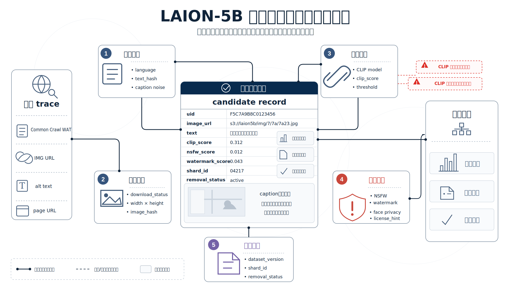
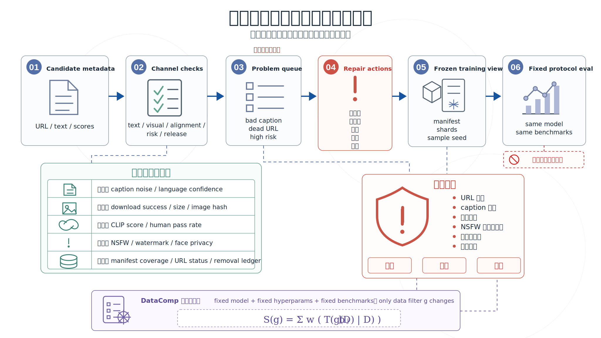

# 第43章：LAION-5B 图文候选池与筛选通道

## 摘要

图文基础语料和纯文本语料最大的差异，不在于多了图片文件，而在于样本被拆成了多个必须同时成立的通道。文本通道要说明图片被怎样描述，视觉通道要说明图片是否能下载、尺寸和内容是否可用，对齐通道要说明图文是否相关，风险通道要说明是否含有水印、NSFW、毒性、隐私或授权风险。任何一个通道失效，图文对都可能不适合训练。

LAION-5B 是由 Common Crawl 衍生的大规模图文候选池。它从网页 WAT 元数据中解析 IMG 标签和 alt text，通过语言识别、图片下载、CLIP 或多语言 CLIP 相似度过滤、水印与 NSFW 检测、近邻索引和 Parquet 元数据发布，将开放网页图文对组织成可查询、可筛选、可复查的数据资产。本章把 LAION-5B 拆成文本、视觉、对齐、风险和发布五条通道，再讨论候选池如何被筛选成训练视图、评测视图和治理视图。DataComp 不作为本章主线数据集，而作为评估协议参照，用来说明如何在固定模型和固定下游评测中比较不同图文筛选策略。

## 关键词

LAION-5B；图文对；Common Crawl；alt text；CLIP 过滤；多通道 schema；WebDataset；Parquet；DataComp；风险治理

## 43.0 学习目标

通过本章学习，读者应能够：

- 解释为什么网页图文对必须分成文本、视觉、对齐、风险和发布通道检查。
- 理解 LAION-5B 的英文、多语言和无语言子集结构。
- 设计可追踪图文样本 schema，覆盖 URL、文本、图片尺寸、CLIP 分数、安全标签和撤回状态。
- 用 CLIP 相似度和阈值函数描述图文筛选闸门。
- 区分候选池视图、训练视图、评测视图和治理视图。
- 用 DataComp 式固定训练协议比较图文筛选策略。
- 识别公开 URL、版权、人脸、儿童、NSFW、水印和链接衰减风险。

## 43.1 开篇问题场景：图文对需要通道化筛选

一个多模态团队准备训练视觉语言模型。他们从网页里抽取了几十亿条 `<image_url, alt_text>`，然后让下载脚本按 URL 拉取图片。第一轮抽检很快暴露问题：很多 URL 已经失效；不少 alt text 是文件名、广告词、SEO 关键词或无关段落；有些图片分辨率过低、带水印、包含成人内容、人脸、儿童照片、医疗影像或版权标识。更麻烦的是，图文看起来相关也不等于适合训练。一张产品图配上“点击购买”，对视觉概念学习帮助有限；一张个人照片配上姓名、地址或社交账号，则会把隐私风险带入模型。

如果把这类数据压成一个自由文本 prompt，后续几乎无法定位问题。模型生成水印，是视觉通道的问题；模型学到广告模板，是文本通道的问题；图文检索能力差，是对齐通道的问题；训练后出现人脸、儿童或版权争议，是风险通道和治理通道的问题。LAION-5B 的工程启发在于，它不是把网页图片简单打包，而是把候选图文关系拆成一组可筛选字段，让下游团队按任务目标重新组合。

普通图片数据集通常以图像文件和人工标签为中心，样本边界相对稳定。图文候选池则不同。图片可能随 URL 失效或被替换，alt text 可能不是 caption，网页上下文可能和图片弱相关，安全标签可能随检测器版本变化。样本不是一个静态对象，而是一条需要持续验证的网页关系。

这种关系至少有三种脆弱性。第一是时间脆弱性，URL 会过期，图片会更新，网页会重定向。第二是语义脆弱性，alt text 可能服务无障碍、SEO 或模板展示，不一定描述图片。第三是治理脆弱性，公开可访问的 URL 不代表授权清晰，也不代表没有人脸、儿童、医疗、商标或水印风险。

### 43.1.2 CLIP 分数只解决图文相关性的一部分

LAION-5B 的核心过滤信号来自图文 embedding 的余弦相似度。设图片编码器为 $f_I$，文本编码器为 $f_T$，图片为 $i$，文本为 $t$，则图文相似度可以写为：

$$
\operatorname{sim}(i,t)=\frac{f_I(i)\cdot f_T(t)}{\|f_I(i)\|\|f_T(t)\|}
$$

相似度阈值过滤可以抽象为：

$$
\operatorname{keep}(i,t)=\mathbb{1}[\operatorname{sim}(i,t)\ge \tau_{\ell}]
$$

其中 $\tau_{\ell}$ 可以按语言或子集设定。这个过滤能提高图文相关性，但它不是事实正确性、安全性或授权合规性的证明。高 CLIP 分数的图片仍可能含水印、人脸、成人内容、隐私信息或版权风险；低 CLIP 分数的样本也可能是图表、文档页、医学图像等对某些任务有价值的内容。

## 43.2 数据集概览：子集规模与公开形态

LAION-5B 论文报告它包含 5.85B 个 CLIP 过滤后的图文对，其中英文子集约 2.32B，多语言子集约 2.26B，语言不确定子集约 1.27B。这个拆分很重要，因为语言识别、CLIP 模型、过滤阈值和下游任务都会影响样本价值。

*表43-1 LAION-5B 的公开子集结构*

| 子集 | 规模 | 文本语言形态 | 工程含义 | 典型用途 |
| --- | ---: | --- | --- | --- |
| LAION-2B-en | 2.32B | 英文 | 语言识别置信度较高，使用英文 CLIP 过滤 | 英文 CLIP、图文检索、英文 T2I 数据候选 |
| LAION-2B-multi | 2.26B | 100 多种非英文语言 | 使用多语言模型处理图文相似度 | 多语言图文检索、多语言视觉语言预训练 |
| LAION-1B-nolang | 1.27B | 语言不明确或低置信度 | 常见商品、地点、短文本和 SEO 噪声 | 特定任务再筛选、商品和地点类候选池 |
| Total | 5.85B | 混合 | 开放网页图文候选池 | 大规模图文训练和数据研究 |

LAION-5B 的公开形态不是把所有图片文件集中托管起来，而是发布元数据和工具链。下游使用者根据 URL、文本、图像尺寸、相似度分数、安全标签和索引信息筛选，再自行下载或重建子集。

从数据工程角度看，LAION-5B 更接近候选池，而不是某一次训练的最终样本集合。候选池强调覆盖、索引和可筛选；训练集强调下载成功、任务适配、风险控制和版本冻结。同一个 LAION-5B 候选池，可以渲染出不同训练视图：图文检索模型可能保留高 CLIP 分数样本，文本到图像生成模型可能额外提高美学或水印阈值，文档理解模型则可能反而需要保留部分 OCR 密集样本。

最终训练样本不是网页 trace 的直接复制，而是按目标任务渲染出来的结构化视图。LAION-5B 的候选记录也一样，训练时要投影成具体视图，不能把全量候选池当成一个无差别输入。

## 43.3 样本 schema：五条通道分开记录

图文候选池也应分通道建模。LAION-5B 论文列出的 Parquet 元数据字段包括 64 位整数 id、图片 URL、文本、图片高宽、图文 embedding 的余弦相似度，以及 NSFW 和水印检测分数。工程团队在复用这类语料时，通常还需要补充下载、hash、授权线索和撤回状态等治理字段。



*图43-1 LAION-5B 图文候选记录的多通道 schema。Source: original illustration based on LAION-5B paper and LAION dataset-spec.*

*表43-2 图文候选记录 schema*

| 通道 | 典型字段 | 来源或生成方式 | 工程用途 |
| --- | --- | --- | --- |
| 文本通道 | `text`、`language`、`text_length`、`text_hash` | alt text、语言识别、哈希 | 文本过滤、语言分桶、污染检测 |
| 视觉通道 | `image_url`、`page_url`、`width`、`height`、`image_hash` | Common Crawl、下载器、解码器 | 下载复现、尺寸过滤、图像去重 |
| 对齐通道 | `clip_score`、`clip_model`、`embedding_id`、`nearest_neighbors` | CLIP 或多语言 CLIP 编码 | 图文相关性过滤和近邻检索 |
| 风险通道 | `nsfw_score`、`watermark_score`、`toxicity_score`、`license_hint` | 分类器、数据卡、人工规则 | 安全过滤、授权复核、风险分层 |
| 发布通道 | `uid`、`dataset_version`、`shard_id`、`removal_status` | 元数据生成和版本系统 | 定位样本、响应撤回、冻结版本 |

一个内部训练集的样本记录可以写成如下形式：

```json
{
  "uid": "laion5b-en-000001",
  "dataset_version": "laion5b",
  "image_url": "https://example.org/image.jpg",
  "page_url": "https://example.org/page.html",
  "text": "a red train entering a station",
  "language": "en",
  "width": 1024,
  "height": 768,
  "clip_model": "ViT-B-32",
  "clip_score": 0.314,
  "nsfw_score": 0.02,
  "watermark_score": 0.11,
  "download_status": "ok",
  "fetch_time": "2026-03-01T10:00:00Z",
  "image_hash": "sha256:...",
  "text_hash": "sha256:...",
  "removal_status": "active"
}
```

分通道建模能够定位失败来源。若模型生成文本与图片不匹配，问题通常在对齐通道；若训练时大量样本无法下载，问题在视觉通道或发布视图；若模型输出带水印纹理，问题可能在风险通道；若评测污染难以排查，问题在文本 hash、image hash 和版本 manifest。

## 43.4 从 Common Crawl 到候选记录

LAION-5B 的构建可以拆成六个阶段：从 Common Crawl 中抽取候选，下载和解析图片，识别语言，计算图文相似度，添加风险标签，发布元数据和索引。这个过程更像将网页 trace 渲染成结构化图文记录，而不是简单下载图片。

*表43-3 LAION-5B 构建流程*

| 阶段 | 输入 | 处理动作 | 输出 | 对应通道 |
| ---: | --- | --- | --- | --- |
| 1 | Common Crawl WAT 元数据 | 解析 HTML IMG 标签，保留带 alt text 的图片候选 | `<url, text>` 候选对 | 文本通道、视觉通道 |
| 2 | 图片 URL 和文本 | 分布式下载、解码、基础质量检查 | 可读取图片和失败日志 | 视觉通道 |
| 3 | 文本字段 | 使用语言识别模型分桶 | 英文、多语言、语言不确定子集 | 文本通道 |
| 4 | 图片和文本 | 计算 CLIP 或多语言 CLIP embedding 与相似度 | 带 `clip_score` 的候选对 | 对齐通道 |
| 5 | 候选对 | 按相似度阈值过滤，并添加 NSFW、水印、毒性等分数 | 过滤后元数据 | 对齐通道、风险通道 |
| 6 | 元数据 | 发布 Parquet、近邻索引和探索接口 | 可查询、可筛选语料 | 发布通道 |

LAION-5B 论文描述的英文过滤阈值为 CLIP 余弦相似度 0.28，非英文图文对使用多语言 CLIP 阈值 0.26。论文也指出，内容过滤会移除约 90% 的原始图片候选，最后保留下接近 6B 的图文对。这个数字说明，开放网页候选池的原始规模很大，但真正能进入训练候选池的比例并不高。

### 43.4.1 筛选闸门的代码化表达

下面的伪代码展示了 LAION-5B 类图文处理流程的核心。它不是官方实现，而是把论文流程改写为数据工程任务：

```python
def build_image_text_candidates(wat_records, clip_model, lang_detector, thresholds):
    for record in wat_records:
        for image_url, alt_text, page_url in extract_img_alt_pairs(record):
            if not alt_text or len(alt_text.strip()) < thresholds.min_text_chars:
                continue

            image = download_image(image_url)
            if image.status != "ok":
                yield failure_manifest(image_url, alt_text, page_url, image.status)
                continue

            if image.width < thresholds.min_width or image.height < thresholds.min_height:
                continue

            lang = lang_detector.predict(alt_text)
            image_embedding = clip_model.encode_image(image.bytes)
            text_embedding = clip_model.encode_text(alt_text)
            score = cosine_similarity(image_embedding, text_embedding)

            tau = thresholds.multilingual if lang != "en" else thresholds.english
            if score < tau:
                continue

            yield {
                "image_url": image_url,
                "page_url": page_url,
                "text": alt_text,
                "language": lang,
                "width": image.width,
                "height": image.height,
                "clip_score": score,
                "image_hash": sha256(image.bytes),
                "nsfw_score": nsfw_detector(image.bytes),
                "watermark_score": watermark_detector(image.bytes),
            }
```

这个流程把是否保留样本拆成若干可审计的筛选闸门。每个闸门都应进入配置和 manifest，而不应只停留在脚本参数里。

LAION 生态中常见的图文数据分发方式包括 Parquet 元数据和 WebDataset 分片。Parquet 适合保存 URL、文本、分数和标签；WebDataset 则把图片、caption 和 json 元数据放入 tar 分片，方便训练程序顺序读取。一个 10k 样本的 shard 可以包含 `0.jpg`、`0.txt`、`0.json` 这样的文件组合，json 中记录 URL、原始尺寸和安全标签等字段。

这带来一个实际原则：候选池和训练集要分层管理。候选池保留尽可能多的可筛选元数据，训练集只保存某次实验真正选择并下载成功的样本。两者之间必须有稳定映射，否则实验指标无法回查到具体过滤规则。

## 43.5 三种视图：训练、评测与治理

训练样本进入 dataloader 后，会从候选池 schema 投影成不同任务视图。图文检索视图可以是 `image + text -> contrastive pair`；T2I 数据筛选视图可以是 `text + image + aesthetic/risk filters -> generation subset`；安全治理视图则可能只读取 `image_url + hash + risk scores + removal_status`。这种“候选记录稳定、任务视图可变”的设计，服务的是多模态数据复用，而不是把 LAION-5B 当成单一训练集。

可以把一次训练使用的数据定义为：

$$
D_{\text{train}} = \operatorname{Shard}(\operatorname{Sample}(\operatorname{Filter}(D_{\text{laion}}, c), r), s)
$$

其中 $c$ 是过滤配置，$r$ 是采样随机种子，$s$ 是分片策略。三者任意一个变化，都应产生新的数据版本。

### 43.5.1 质量评估与闭环修复

可控语音数据需要同时验收语义、风格和音频质量；LAION-5B 类图文数据也需要同时验收文本、视觉、对齐、风险和复现性。单独看 CLIP 分数不够，单独看人工抽检也不够。质量系统应把自动指标与人工复核组合成闭环，问题样本进入重下载、重过滤、降权、隔离或剔除队列。



*图43-2 图文候选池质量评估与闭环修复。Source: original illustration based on LAION-5B paper and DataComp benchmark design.*

*表43-4 图文候选池质量评估指标*

| 通道 | 核心问题 | 自动指标 | 人工复核要点 | 不合格处理 |
| --- | --- | --- | --- | --- |
| 文本通道 | caption 是否可用 | 语言置信度、长度、模板命中、重复率 | 是否为广告、文件名、SEO 文本 | 文本规则过滤、source 降权 |
| 视觉通道 | 图片是否可训练 | 下载成功率、尺寸、格式、hash 重复率 | 是否低清、截断、缩略图、非目标图片 | 重下载、尺寸过滤、去重 |
| 对齐通道 | 图文是否相关 | CLIP 分数、近邻检索、人工通过率 | 文本是否真正描述图片 | 阈值调整、样本剔除 |
| 风险通道 | 是否存在高风险内容 | NSFW、水印、毒性、人脸或隐私标签 | 儿童、医疗、商标、版权和水印风险 | 隔离、人工复核、禁用 |
| 发布通道 | 是否可复现和撤回 | manifest 覆盖率、URL 状态、hash 覆盖率 | 撤回请求能否定位 | 冻结版本、补 hash、建立 ledger |

### 43.5.2 DataComp 提供筛选策略比较协议

LAION-5B 论文用训练和复现 CLIP、GLIDE、Stable Diffusion 等模型来展示数据集的可用性，也讨论了测试集重叠、数据偏差和安全伦理问题。对于工程团队来说，更可操作的评估方法是把数据筛选器放到固定训练协议中比较。DataComp 正好提供了这种思路：固定模型架构、训练超参数和下游评测，主要改变数据集设计。

设过滤策略为 $g$，候选池为 $D$，固定训练过程为 $T$，第 $j$ 个下游评测为 $b_j$，评测权重为 $w_j$，则一个数据过滤策略的总分可以写为：

$$
S(g)=\sum_{j=1}^{k}w_j\cdot b_j(T(g(D)))
$$

这个公式把问题从“样本看起来是否干净”转成“在同样训练预算下是否得到更好的模型”。对 LAION-5B 的使用者来说，这意味着不要只按 CLIP 分数或美学分数拍脑袋选阈值，而要把阈值选择放进可复现的小规模训练实验中。

## 43.6 风险治理与复用边界

图文数据的风险更容易被公众感知，也更难完全自动化处理。图片中可能出现人脸、儿童、车牌、家庭环境、医疗影像、身份证件、商标、艺术作品和水印。caption 即使不含 PII，图像本身也可能泄露隐私。URL 公开不等于授权清晰，CLIP 分数高不等于内容安全，NSFW 分数低也不等于风险为零。

*表43-5 LAION-5B 类图文数据风险控制清单*

| 风险类型 | 触发场景 | 控制措施 | 审计证据 |
| --- | --- | --- | --- |
| URL 衰减 | 复跑时图片不可下载或内容替换 | 保存 hash、下载时间、失败日志和快照策略 | download manifest |
| caption 噪声 | alt text 为广告、模板或 SEO 文本 | 文本规则、模板检测、人工抽检 | text filter report |
| 水印和版权 | 图库、转载站、商品图过多 | 水印检测、域名限制、授权白名单 | watermark score、source policy |
| NSFW 与未成年人 | 分类器低置信或高风险主题 | 多模型检测、人工复核、保守发布 | risk review log |
| 人脸和隐私 | 个人照片、医疗影像、身份证件 | 人脸检测、隐私标签、撤回通道 | removal ledger |
| 评测污染 | benchmark 图片或答案进入候选池 | image hash、caption n-gram、URL overlap 检查 | eval isolation report |

表43-5 将风险治理落实为数据门禁。高风险样本不能只靠训练后安全策略兜底，而要在候选池筛选阶段就被隔离、降权或剔除。对生成模型训练来说，水印、版权、人脸和儿童相关风险尤其需要保守处理。

企业内部复用 LAION-5B 方法时，应先保留五类证据：

- 数据来源记录，包括网页来源、URL、抓取时间和下载状态。
- 过滤配置记录，包括 CLIP 模型、阈值、语言识别模型和尺寸规则。
- 风险标签记录，包括 NSFW、水印、毒性、人脸、儿童和隐私相关检测。
- 训练 manifest，包括最终样本 id、shard、随机种子和采样比例。
- 治理记录，包括撤回请求、来源限制、已知问题和人工复核结果。

这些记录决定了下游团队能否回答“模型为什么学到这个样子”。对于多模态模型，这个问题通常比纯文本模型更难，因为图片本身可能含有无法从 caption 中看出的风险。

同时，LAION-5B 更适合作为开放图文数据工程的方法参照和候选池，而不是未经筛选直接进入生产训练的数据包。论文作者也明确建议当前形式主要用于学术研究，并提醒部署系统前必须审查模型行为和潜在偏差。

如果目标是训练生产级生成模型，推荐流程不是整库吸收，而是先定义任务边界和风险边界，再从 LAION-5B 类候选池中构造可解释子集。高收益但高风险的样本，应优先通过授权采买、人工重标注、合成替代或内部合规来源补齐。

## 本章小结

LAION-5B 展示了开放图文候选池如何从网页 URL 和 alt text 变成可筛选、可索引、可评估的数据资产。本章的核心结论有三点。

第一，图文对必须分通道建模。文本、视觉、对齐、风险和发布通道分别对应不同失败来源。第二，候选池不是最终训练集。下游团队需要把候选记录投影成训练视图、评测视图和治理视图，并冻结 manifest。第三，筛选策略必须通过固定训练协议验证。DataComp 的意义在于让不同过滤器在同一模型、同一预算和同一评测集合下比较。

对本书读者而言，LAION-5B 最值得学习的不是直接下载更多图片，而是把开放网页图文关系拆成可检查通道，再用质量闭环、风险门禁和固定评测协议把候选池变成可复用的多模态训练资产。

## 参考文献

- Schuhmann, C., Beaumont, R., Vencu, R., Gordon, C., Wightman, R., Cherti, M., et al. (2022). LAION-5B: An open large-scale dataset for training next generation image-text models. NeurIPS 2022 Datasets and Benchmarks Track. https://arxiv.org/abs/2210.08402
- LAION. (2022). LAION-5B: A new era of open large-scale multi-modal datasets. https://laion.ai/blog/laion-5b/
- LAION-AI. (2022). dataset-spec. https://github.com/LAION-AI/dataset-spec
- Gadre, S. Y., Ilharco, G., Fang, A., Hayase, J., Smyrnis, G., Nguyen, T., et al. (2023). DataComp: In search of the next generation of multimodal datasets. NeurIPS 2023 Datasets and Benchmarks Track. https://arxiv.org/abs/2304.14108
- DataComp Team. (2026). DataComp Benchmark Documentation. https://www.datacomp.ai/dcclip/
- ML Foundations. (2023). DataComp codebase. https://github.com/mlfoundations/datacomp
