# 项目一：基于 Ray 构建分布式 Mini-C4 数据流水线

## 本章概览

P01 聚焦从 Common Crawl shard 构建 Mini-C4 训练数据集的工程过程。章节重点不在单次抓取结果，而在把网页归档、正文抽取、去重过滤、训练封装和结果验证组织成一条可复现的数据生产线。

本章可以按四条主线理解：

- 数据收集与正文抽取：从网页归档中提取可用于训练的正文文本。
- 清洗去重与质量控制：处理模板噪声、近重复内容、语种混杂和低质量页面。
- 训练封装与数据切分：把处理结果整理成标准化 JSONL 与训练清单。
- 评估验证与成本边界：通过检查脚本、统计指标和资源消耗评估流水线状态。

如果按工程顺序阅读，本章对应的是一条完整链路：

**网页归档 -> 正文抽取 -> 基础清洗 -> 近重复去重 -> 语种拆分 -> 质量过滤 -> 训练封装 -> 评估验证**

这一结构对应的核心目标，是在单机 CPU 与 Ray 条件下复现一条可解释、可复用的网页预训练数据流水线。

---

## 1. 项目背景：Mini-C4 的工程定位

在大模型预训练中，网页语料一直是最重要的数据来源之一。网页规模足够大、覆盖面足够广、更新频率也高，因此天然适合用来构建通用预训练语料库。  
但网页数据也有三个非常典型的问题：

1. **信噪比极低**：HTML 页面里包含大量导航栏、广告位、脚本、页脚、版权声明、Cookie 提示、评论区、目录页等非正文内容。
2. **重复度极高**：转载、镜像站、聚合页、模板页、页面局部复制非常普遍。
3. **分布难以控制**：不同网站、不同语种、不同文本质量混杂在一起，容易把训练语料拉向噪声分布。

因此，预训练数据工程的核心不是“拿到更多文本”，而是建立一条**可解释、可复现、可验证的数据生产流水线**，把原始网页逐步收敛成可以交给训练系统的文本样本。

Mini-C4 的意义就在这里。它不是工业级完整 C4 的替代品，而是一个**最小可复现、可运行、可讲清楚原理的缩微版本**。  
通过它，我们可以把大规模网页预训练数据处理中的关键问题，在单 shard、单机 CPU 的条件下完整走一遍，从而为后续更大规模的数据工程打下方法底座。

---

## 2. 项目目标与边界

### 2.1 项目目标

本项目的目标不是简单下载 Common Crawl 数据，而是在受控边界内，完整跑通下面这条链路：

> **网页归档 -> 正文抽取 -> 基础清洗 -> 近重复去重 -> 语种拆分 -> 质量过滤 -> 训练封装 -> 评估验证**

最终输出包括：

- `train.jsonl`
- `val.jsonl`
- `smoke_test.jsonl`
- `training_manifest.json`
- 评估报告与检查报告

这个项目关注的是**把网页变成训练数据**，而不是停留在“把网页变成文本”这一步。

### 2.2 项目边界

为了让项目保持最小可复现和可控，本项目显式设定了以下边界：

- **数据规模边界**：只处理 Common Crawl 的一个 shard，不追求工业级全量规模。
- **硬件边界**：默认在单机 CPU 环境运行，不依赖 GPU。
- **并行边界**：去重阶段借助 Ray 做单机多核并行。
- **语种边界**：当前主要覆盖英文与中文，英文质量过滤更完整，中文质量门相对较弱。
- **目标定位边界**：这是一个面向工程实践的案例，不是追求 SOTA 指标的研究项目。

### 2.3 边界设定的作用

这一边界设置有两个好处。

第一，它保证了项目在有限资源条件下仍然可复现。  
如果一开始就以多机、海量分片、复杂调度为目标，项目会迅速被基础设施问题主导，反而掩盖数据工程本身的关键逻辑。

第二，它能让团队更清楚地观察每一步过滤的效果。  
当数据规模较小时，更容易做中间产物检查、人工抽样和阈值调整，从而真正理解为什么数据会被留下或删掉。

---

## 3. 项目整体架构

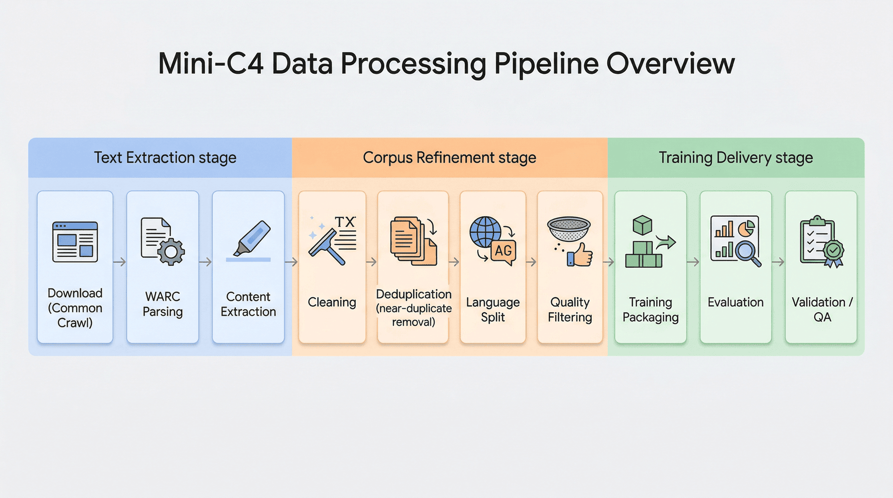


### 3.1 流程总览

项目整体流程可以概括为 10 个步骤：

1. `src/1_download_data.py`：下载 Common Crawl 数据
2. `src/2_process_warc.py`：解析 WARC 并抽取正文
3. `src/3_clean_data.py`：启发式清洗
4. `src/4_deduplicate.py`：MinHash 去重
5. `src/5_split_lang.py`：按语种拆分
6. `src/6_quality_filter.py`：质量过滤
7. `src/7_prepare_training_data.py`：训练数据封装
8. `src/8_evaluate_dataset.py`：数据集评估
9. `src/9_training_smoke_test.py`：训练烟雾测试
10. `src/10_run_p1_checks.py`：项目检查与一致性验证

### 3.2 三段式理解方式

如果把上面的流程进一步归类，可以分成三大阶段：

#### 第一阶段：从网页世界到文本世界

这一阶段主要解决“有没有文本”的问题，核心任务是：

- 下载 WARC
- 读取网页响应
- 过滤非 HTML 内容
- 从 HTML 中提取正文

这一步的重点是把网页归档中的复杂内容尽可能稳定地转成文本。

#### 第二阶段：从文本世界到语料世界

这一阶段解决“文本能不能作为语料”的问题，主要包括：

- 基础清洗
- 去重
- 语言拆分
- 质量过滤

也就是主动控制噪声、重复和分布，让文本更接近训练语料的形态。

#### 第三阶段：从语料世界到训练接口

这一阶段解决“语料能不能稳定送入训练系统”的问题，包括：

- 确定性 train/val 切分
- manifest 构建
- smoke test 构建
- 评估与检查

做到这一步，数据工程才真正闭环。

---

## 4. 数据获取：Common Crawl 的工程选择

Common Crawl 是构建网页类预训练数据集最常用的公开来源之一。它以 WARC（Web ARChive）格式存储网页抓取结果，保留了 HTTP 响应、头信息和原始网页内容。

选择 Common Crawl 的原因主要有三点：

1. **规模大**：可以覆盖大量真实网页场景。
2. **格式标准化**：WARC 是成熟的网页归档格式，适合流式处理。
3. **贴近真实工业问题**：网页噪声、模板、重复、语种混杂等问题都会真实出现。

但也正因为如此，Common Crawl 并不能被直接拿去训练。  
如果不经过严格的抽取和过滤，模型会学到大量 HTML 碎片、版权页、目录页和模板垃圾文本。

因此，选择 Common Crawl，实际上就是选择了一组更接近真实工业生产环境的问题。

---

## 5. WARC 解析与正文抽取

### 5.1 正文抽取作为首道关键门槛

网页页面并不天然等于自然语言文本。一个 HTML 页面中通常会混有：

- 导航栏
- 面包屑
- 推荐位
- JavaScript
- CSS
- 页脚链接
- 广告
- 版权说明
- 评论区域
- 表格布局碎片

如果直接读取 HTML 并做简单剥标签，模型看到的往往是一堆结构残片，而不是连贯的语义正文。

因此，正文抽取阶段的目标不是“尽可能多拿字符”，而是**尽可能准确地提取主内容区域**。

### 5.2 核心组件选型

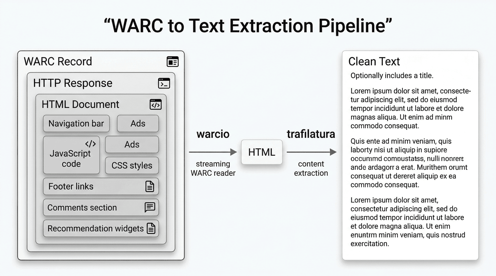


| 组件 | 选型 | 选择原因 |
|---|---|---|
| WARC 读取 | `warcio` | 标准 WARC 读取库，支持流式处理，避免一次性加载大文件导致内存压力 |
| 正文提取 | `trafilatura` | 对主内容区域提取更稳定，相比简单 HTML 解析方式，对导航栏、页脚、模板区清理效果更好 |

### 5.3 流式处理的工程价值

WARC 文件通常较大，且内部包含大量并不需要的响应。  
如果将整个文件一次性读入内存，既浪费资源，也不利于长流程稳定运行。

因此，本项目采用**流式遍历**的方式逐条读取 WARC 记录，只对符合条件的 HTML 响应继续处理。  
这种设计既降低了峰值内存消耗，也更符合后续向多 shard 扩展时的工程习惯。

### 5.4 核心实现

```python
from warcio.archiveiterator import ArchiveIterator
import trafilatura

def extract_text_from_warc(warc_path, output_path):
    with open(warc_path, "rb") as stream:
        for record in ArchiveIterator(stream):
            if record.rec_type != "response":
                continue

            content_type = record.http_headers.get_header("Content-Type")
            if not content_type or "text/html" not in content_type:
                continue

            text = trafilatura.extract(
                record.content_stream().read(),
                include_comments=False,
                include_tables=False,
                no_fallback=False
            )
```

这里有几个参数是有意为之的：

- `include_comments=False`：避免把评论区这种噪声很大的区域收进正文。
- `include_tables=False`：减少表格布局带来的结构噪声。
- `no_fallback=False`：允许抽取组件在必要时做补救式提取，提高召回。

### 5.5 本阶段的结果含义

在单 shard 测试中，最终成功抽取出 **3028** 条候选正文。  
这个数字说明两件事：

第一，不是所有网页响应都能转成可用正文。  
第二，正文抽取已经是一次明显的数据压缩，因为大量原始响应会在“非 HTML”“空内容”“抽取失败”等环节被拦掉。

从工程角度讲，这一阶段回答的是：

> 在真实网页数据中，我们能稳定拿到多少“看起来像正文”的候选文本？

---

## 6. 启发式清洗：首轮噪声筛除

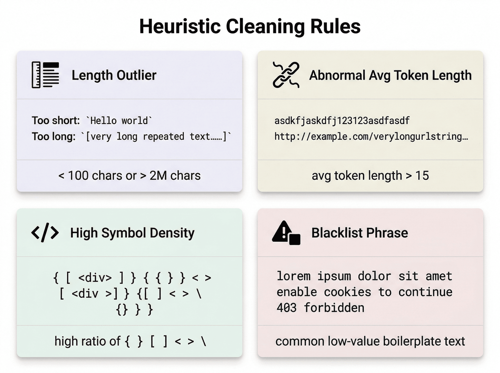


### 6.1 启发式清洗的必要性

即使正文抽取成功，得到的文本也远不等于高质量语料。  
一个页面可能提取出了“正文”，但这段正文仍然可能是：

- 极短文本
- 目录页
- 标签云
- SEO 拼接文本
- 代码片段
- 系统错误页
- 隐私与 Cookie 提示

这类样本如果直接送入训练集，既污染模型，也浪费后续计算资源。

因此，流水线中通常会先设计一层**廉价、快速、可解释的启发式清洗**，用来拦截最明显的低质量文本。

### 6.2 本项目采用的主要清洗规则

#### 1）长度规则

- 过短文本丢弃，例如少于 100 字符
- 过长文本丢弃，例如超过 2M 字符

原因很直接：  
过短文本往往缺乏足够语义信息，过长文本则可能是异常拼接、页面拼接或结构损坏导致的产物。

#### 2）平均词长规则

如果平均词长明显偏高，比如超过 15 个字符，那么文本很可能并不是自然语言，而是：

- 代码压缩结果
- URL 串
- 混杂标识符
- 样式残片

#### 3）符号密度规则

统计如下符号的比例：

```text
{ } [ ] < > \
```

当这些符号占比过高时，文本通常更像结构片段，而不像自然语言段落。

#### 4）黑名单短语规则

例如拦截：

- `lorem ipsum`
- `enable cookies`
- `403 forbidden`

这些文本要么是占位符，要么是系统提示页，对训练没有实际价值。

### 6.3 启发式清洗的特点

这一层规则不是为了追求“极致准确”，而是为了低成本地去掉最明显的问题。  
它的优势包括：

- 速度快
- 成本低
- 易解释
- 容易调参
- 适合作为漏斗前端

也就是说，这一阶段并不负责解决所有质量问题，而是优先把那些“几乎肯定不该留下”的样本清出去。

### 6.4 本阶段结果解读

经过启发式清洗后，样本数从 **3028** 降到 **2425**。  
这说明大约五分之一的候选正文，在最基本的文本规则下已经可以判定为低质量。

这个阶段的意义在于：

> 在不依赖昂贵模型打分的前提下，先把最粗的噪声压下去，为后续更细的处理节省资源。

---

## 7. 去重：网页语料中的近重复处理

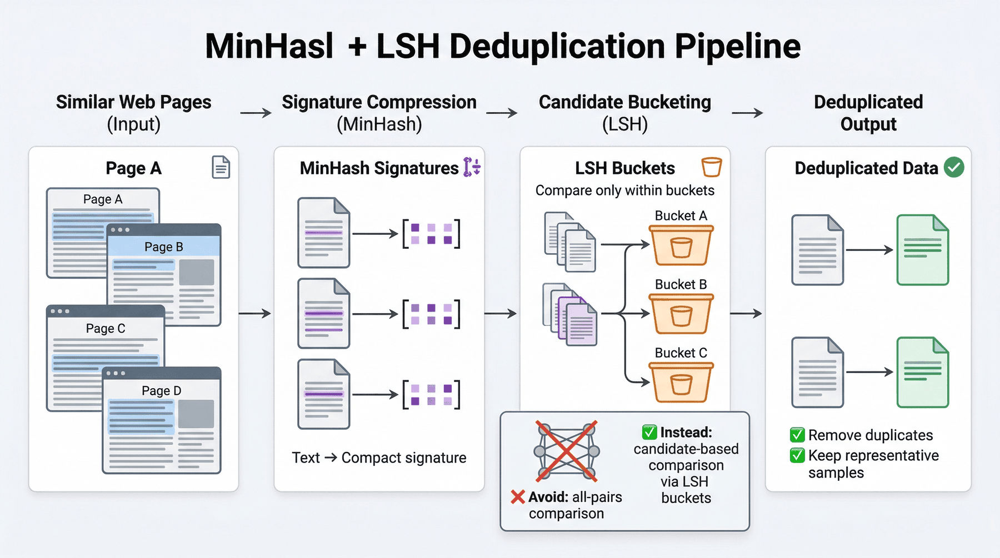


### 7.1 重复问题有多严重

互联网文本中存在大量重复，包括但不限于：

- 转载文章
- 聚合页
- 镜像站
- 模板页
- 页面局部重合
- 同一内容的不同排版版本

如果不做去重，训练语料会出现几个问题：

1. 某些内容被过度重复，导致分布失衡。
2. 模型可能对特定模板或站点记忆过强。
3. 后续评估时可能发生数据泄漏。
4. 存储和训练资源被重复内容无谓消耗。

因此，去重并不是锦上添花，而是网页预训练数据工程的必经步骤。

### 7.2 避免两两比较的原因

假设有 \(N\) 条文本，如果直接做两两相似度比较，复杂度接近 \(O(N^2)\)。  
在真实数据规模下，这种做法很快就会变得不可接受。

因此，本项目采用 **MinHash + LSH** 的思路，把“找相似文本”的问题转换为“找相似签名”，从而把处理复杂度降到更可落地的范围。

### 7.3 MinHash 与 LSH 的工程直觉

- **MinHash**：把一段文本映射成一个较短的签名，签名近似反映文本的集合相似性。
- **LSH（局部敏感哈希）**：让相似文本更容易落入同一个候选桶中，减少全局比较次数。

这样做的结果是，我们不需要让每条文本和所有文本都比一遍，而是只在更可能相似的候选集合里做判定。

### 7.4 采用 Ray 的工程考虑

即使使用 MinHash，生成签名本身依然是计算密集型操作。  
尤其当文本条数增大时，单线程处理会明显拖慢整个流水线。

Ray 在这里扮演的角色非常明确：  
它不是为了炫技式“分布式”，而是为了让单机多核 CPU 能把批处理任务并行跑起来。

对应实现如下：

```python
import ray
from datasketch import MinHash

@ray.remote
def process_batch(lines, batch_id):
    results = []
    for line in lines:
        item = json.loads(line)
        m = MinHash(num_perm=128)
        for w in item["text"].split():
            m.update(w.encode("utf8"))
        results.append((item["url"], m, item["text"]))
    return results

futures = [process_batch.remote(batch, i) for i, batch in enumerate(batches)]
processed_batches = ray.get(futures)
```

### 7.5 这里最容易踩的坑

Ray 并行处理最大的一个常见误区是：  
**不要把单条文本当成一个独立 task 派发。**

这样会带来大量小对象序列化与进程间通信开销，最终反而让性能变差。  
正确方式是：

- 先把文本打包成 batch
- 再按 batch 派发给 worker

例如每 1000 条一批，就是一个更稳妥的工程选择。

### 7.6 本阶段结果解读

去重后，样本数从 **2425** 降到 **2305**。  
这说明虽然重复问题存在，但在这个最小实验规模里，去重带来的收缩没有质量过滤那么剧烈。

不过这并不意味着去重不重要。  
相反，去重的重要性体现在它能显著改善训练分布的健康度，而不仅仅是减少条数。

---

## 8. 语种拆分：按语言处理的必要性

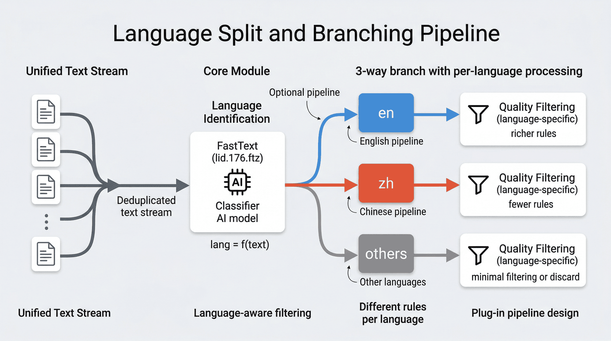

### 8.1 不同语言不能共用同一套质量门

网页文本的质量判断高度依赖语言本身。  
例如英文里某些困惑度阈值、词长统计或语法自然度规则，对中文并不适用。  
反过来，中文网页常见的问题也和英文网页并不完全相同。

因此，在去重之后，项目进一步将文本按语种拆分，是为了让质量控制更精准，而不是把所有语言统一放进同一个过滤器里。

### 8.2 本项目的做法

项目使用 FastText 的语言识别模型 `lid.176.ftz` 对文本进行语种预测，并将文本拆分为：

- `en`
- `zh`
- `others`

这样做以后，后续质量过滤就可以根据语言采用不同策略。

### 8.3 语种拆分作为必要中间层

语种拆分的价值主要体现在三个方面：

1. **避免误判**：不同语言的文本统计特征差异很大。
2. **便于分析**：可以单独观察每种语言的保留率和拦截原因。
3. **便于扩展**：未来如果接入更多语言，只需在该层增加语言分支，而不必推倒重来。

从工程组织角度看，语种拆分让流水线从“统一处理”升级为“可插拔处理”。

---

## 9. 质量过滤：从“看起来像文本”到“适合训练”

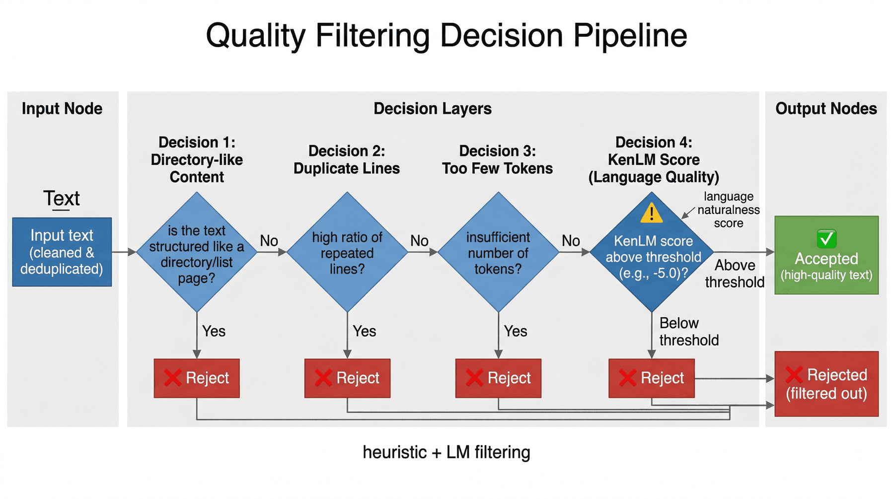

### 9.1 为什么质量过滤是最关键的一道门

启发式清洗和去重解决了很多显性问题，但仍然不能保证文本真的适合训练。  
因为很多页面表面上符合文本规则，实际上却可能仍然是：

- 目录页
- 低信息密度页面
- 重复句堆叠页
- 语言破碎页面
- 机器翻译残片
- 语法自然度很差的网页噪声

这时就需要一层更接近“语言质量”的过滤。

### 9.2 英文质量门：KenLM 困惑度

本项目在英文侧引入 KenLM 语言模型进行质量过滤。  
核心思路是：

- 使用语言模型给文本打分
- 用单位词数归一化后的得分衡量文本自然度
- 通过阈值过滤掉明显不自然的文本

经验上可以这样理解：

- `> -5.0`：通常更接近高质量文本
- `< -6.0`：往往更接近破碎句子、乱码或低质量生成物

这并不意味着困惑度越低越好，而是说明语言模型可以作为一种**比纯规则更接近“自然语言质量”的信号**。

### 9.3 本项目观察到的主要拦截原因

在质量过滤阶段，常见的拦截原因包括：

- `directory_like`：目录型网页，信息密度低
- `duplicate_lines`：页内重复行过多
- `too_few_tokens`：有效 token 太少

这些规则和 KenLM 一起构成了“启发式 + 语言自然度”的联合过滤策略。

### 9.4 中英文保留率差异说明了什么

最终结果显示：

- 英文候选集 **846** 条，保留 **502** 条
- 中文候选集 **201** 条，保留 **24** 条

这个差异非常有代表性。  
它不是简单说明“中文数据差”，而是暴露出两个更现实的问题：

1. 当前中文质量过滤能力明显弱于英文。
2. 中文网页的结构和噪声模式可能与英文网页不同，不能直接套用英文规则。

这也意味着，在工业级多语言数据工程中，语言质量模型必须做更细粒度的本地化设计。

---

## 10. 三轮实验复盘：流水线的迭代形成过程

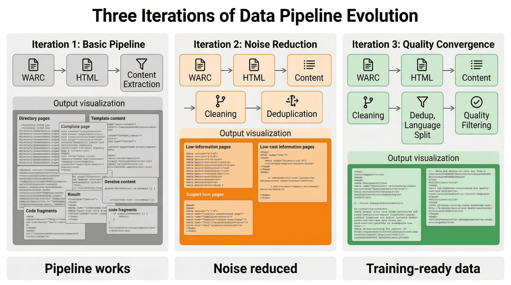

如果只把项目理解为一串脚本调用，就不容易看清这些设计背后的取舍。
更贴近真实工程过程的写法，是把它还原成若干轮逐步收紧的实验。

### 10.1 实验一：只做正文抽取

第一轮实验的目标非常朴素：  
先验证“WARC -> HTML -> 正文文本”这条链路能不能稳定跑通。

这个阶段解决的是：

- 能不能正确遍历 WARC
- 能不能过滤掉明显无关响应
- 能不能把网页正文抽出来

这一轮通常能很快产出一批候选文本，但问题也非常明显：  
噪声高、目录页多、模板内容多、代码碎片和页尾文本混入严重。

所以第一轮回答的是“有没有文本”，而不是“这些文本能不能训练”。

### 10.2 实验二：加入启发式清洗与去重

第二轮开始，项目从“抽出正文”升级为“初步变成语料”。

这一轮补上了：

- 长度过滤
- 符号密度过滤
- 黑名单短语过滤
- MinHash 去重

结果是，最粗糙的垃圾样本和近重复页面被明显压下去。  
但在抽检时，仍然能看到很多看似正文、实际信息密度不高的页面。

因此，第二轮让数据从“能看”变成“更像语料”，但还不到可直接训练的程度。

### 10.3 实验三：加入语言拆分与质量过滤

第三轮引入：

- FastText 语种拆分
- 英文 KenLM 质量打分
- 目录页、重复行、短 token 等更严格的过滤逻辑

这一轮的直接效果是：  
样本数进一步大幅下降，但训练可用性显著提升。

最终样本数从 **3028** 收缩到 **526**，看上去损失很大，但这恰恰反映了项目对质量的主动收紧。  
它说明项目追求的不是“多保留”，而是“保留下来的尽量更值得训练”。

### 10.4 三轮实验的工程意义

这三轮实验其实对应了一个很典型的数据工程推进方式：

1. **先跑通链路**
2. **再压制显性噪声**
3. **最后做语言感知和质量收敛**

---

## 11. 训练数据封装：从清洗结果到训练接口

### 11.1 数据清洗不等于训练可用

即使最终保留下来的文本已经比较干净，仍然不能直接说“可以训练了”。  
因为训练系统通常还需要以下能力：

- 稳定的 train/val 切分
- 元数据索引
- token 估算
- 小样本烟雾测试
- 文件级组织方式

如果这一步做不好，后续训练和评估很容易出现不一致或泄漏问题。

### 11.2 确定性切分的重要性

项目没有采用随机切分，而是根据 `text_sha1` 等确定性标识做取模切分。  
这样做的好处是：

- 多次重复运行时，train/val 集合稳定不变
- 方便排查训练结果差异
- 方便做数据集版本管理
- 有利于工程可复现

这里需要强调的是：  
**可复现性是数据工程质量的一部分，而不是额外附加项。**

### 11.3 Smoke Test 的作用

项目额外构建了 `smoke_test.jsonl`。  
它不是正式训练集的一部分，而是一个极小规模、可快速加载的样本集合，用来：

- 跑通训练脚本
- 检查 tokenizer 与数据接口是否正常
- 提前发现格式错误、编码问题或字段缺失

在实际工程中，这种烟雾测试集往往能节省大量调试时间。

### 11.4 Manifest 的工程价值

`training_manifest.json` 记录了数据集的重要元信息，例如：

- 样本数量
- 切分情况
- 估算 token 数
- 文件路径
- overlap 检查结果

它的意义在于让数据集不再只是若干散乱 JSONL 文件，而是一个可被系统读取、被评估和被检查的“正式产物”。

---

## 12. 数据评估：流水线价值判断

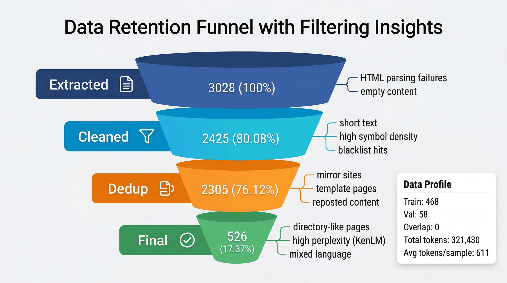

### 12.1 数据留存漏斗

本项目最终得到的留存漏斗如下：

| 阶段 | 记录数 | 留存率（基于 extracted） | 典型拦截原因 |
|---|---:|---:|---|
| Extracted | 3028 | 100.0% | HTML 解析失败、空内容 |
| Cleaned | 2425 | 80.08% | 短文本、代码符号超标、黑名单 |
| Dedup | 2305 | 76.12% | 镜像站、模板页、转载 |
| Final | 526 | 17.37% | 目录页、困惑度高、语言混杂 |

### 12.2 这些数字真正说明了什么

如果只看最终结果，526 条样本似乎不多。  
但对于数据工程而言，更重要的不是“剩下多少”，而是**每一层删掉了什么、为什么删、删到什么程度**。

这些数字至少说明：

1. 原始网页噪声非常大。
2. 启发式清洗能快速去掉最粗的噪声。
3. 去重改善了训练分布。
4. 质量过滤是真正决定最终数据可用性的关键阶段。

从工程可解释性的角度看，这比单纯汇报“最终多少条”更能说明问题。

### 12.3 数据画像

最终结果还包括：

- 最终样本数：**526**
- 训练集：**468**
- 验证集：**58**
- Train/Val overlap：**0**
- 总估算 token：**321430**
- 平均每条样本 token：**611.08**

这说明最终数据集已经不仅仅是一批文本，而是一个具备训练接口属性和基本统计画像的标准化语料产物。

---

## 13. 成本分析：资源核算与瓶颈

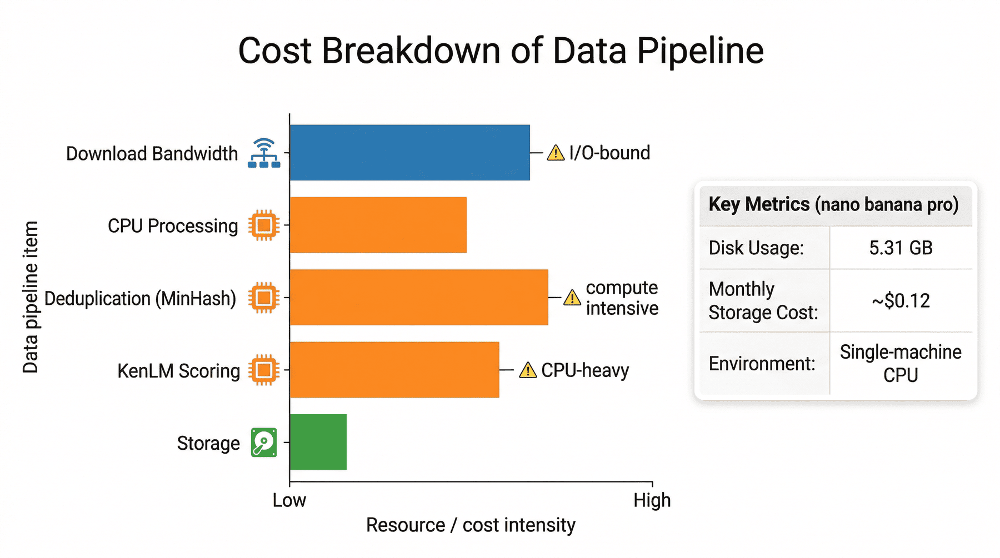

在很多初学项目中，大家更关注“能不能跑通”，而不太关注“代价是什么”。
但在真实生产环境里，成本意识和工程意识是绑定在一起的。

### 13.1 存储成本

项目统计显示：

- 总磁盘占用约 **5.31 GB**
- 月度存储成本估算约 **$0.12 USD**

对于单 shard 实验来说，这个成本并不高。  
但它提醒我们：当流程扩展到更多 shard、更多中间产物时，存储成本会成倍增加。

### 13.2 计算瓶颈

本项目的主要计算瓶颈包括：

- 下载带宽
- CPU 文本处理
- KenLM 加载与打分
- 去重阶段签名计算

也就是说，即使没有引入 GPU，数据工程仍然不是“轻量活”。  
如果流程设计不合理，CPU 和 I/O 很快就会成为真正的瓶颈。


## 14. 验证闭环：项目一致性检查

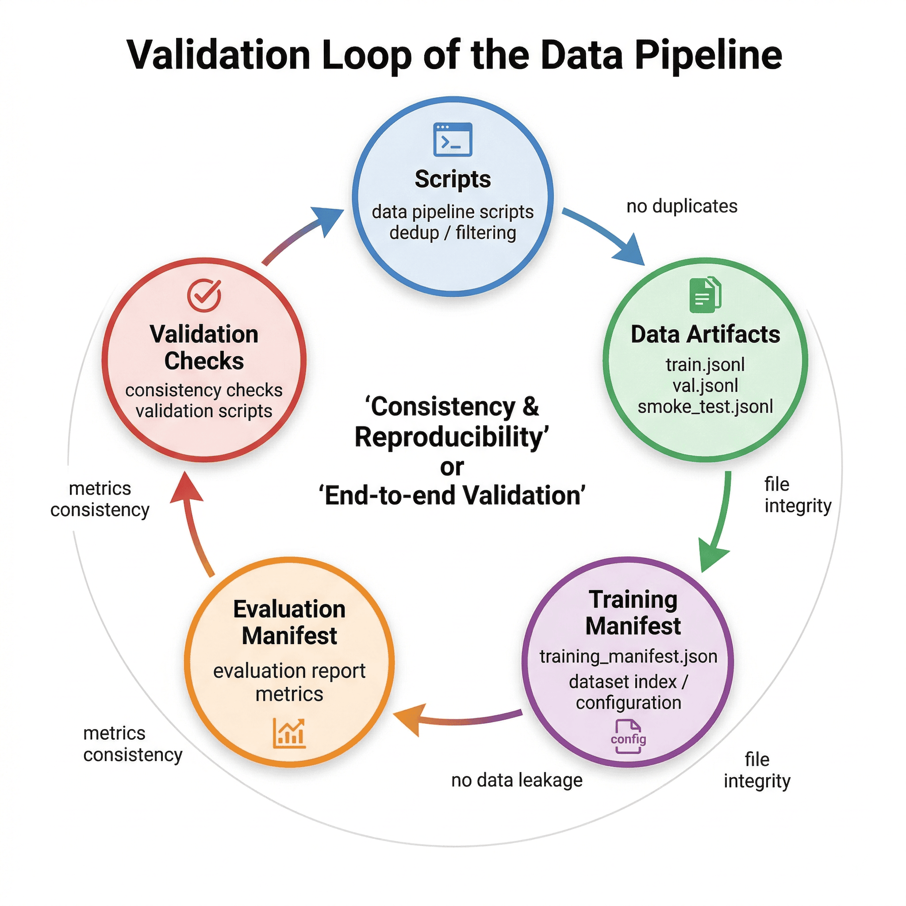

### 14.1 项目检查的作用

如果一个数据工程项目只有输出文件，没有检查机制，那么它是否真的正确，其实很难说。  
因为错误可能来自很多地方：

- 脚本能运行但产物缺失
- train/val 切分有泄漏
- report 与 metrics 不一致
- smoke test 不属于训练集
- 最终数据里仍然存在重复样本

因此，项目专门设计了检查脚本来做一致性验证。

### 14.2 检查结果

项目检查结果为：

- 总检查项：**14**
- 通过：**14**
- 总体状态：**PASS**

### 14.3 检查覆盖范围

#### 命令级检查

- `py_compile`
- `dedup_unit_check`
- `training_smoke_test`
- `dataset_evaluation`

#### 数据/产物级检查

- 必需文件存在
- 最终文件数量与语言拆分结果一致
- training manifest 与训练文件数量一致
- train/val 无 overlap
- smoke test 属于 train
- final dataset 无 exact duplicates
- 报告与指标文件一致

### 14.4 验证闭环的工程意义

这一层检查非常关键。  
它意味着项目不是“肉眼看起来差不多”，而是在代码、产物、评估和报告之间建立了一个闭环。


## 15. 主要局限与风险

任何最小可复现项目都不是最终形态。  
Mini-C4 的价值在于说明方法，但它也有非常明确的局限。

### 15.1 保留率低

最终保留率只有 **17.37%**。  
这说明网页原始噪声确实很重，也说明当前质量门比较严格。

这不是坏事，但意味着如果目标转向“尽量扩大规模”，就必须进一步优化规则和模型，以免把过多潜在有效数据一起删掉。

### 15.2 中文保留率偏低

中文最终只保留 **24** 条，这暴露出中文质量打分能力不足的问题。  
它不是简单靠调阈值就能彻底解决，更可能需要：

- 更适配中文网页的数据质量规则
- 更适合中文的语言模型或打分模型
- 更细粒度的中文网页样本分析

### 15.3 去重扩展性有限

当前去重仍以内存索引为主。  
当 shard 数量变多时，会首先遇到：

- 内存压力
- 运行时间上升
- 全局索引管理困难

因此，当前方案更适合最小实验和中小规模数据处理，而不是直接平移到超大规模生产环境。

---

## 16. 后续扩展方向

### 16.1 去重后端升级

将当前内存中的 LSH 索引升级为外部存储，例如：

- Redis
- Cassandra
- 其他分布式 KV/索引系统

这样可以支撑更多 shard 的去重需求。

### 16.2 中文质量模型升级

针对中文网页数据引入更稳定的质量建模方式，例如：

- 更合适的中文语言模型
- 中文网页质量特征工程
- 轻量级质量分类器

### 16.3 前置域名过滤

在 HTML 解析之前就做 domain 级白名单/黑名单过滤，可以显著减少后续无效计算。  
这是从“文本侧清洗”往“抓取入口控制”迈出的关键一步。

### 16.4 可观测性增强

为每一阶段增加：

- 耗时日志
- 吞吐统计
- 样本抽检面板
- 阈值命中统计

这样在调参时，开发者不只知道“结果变了”，还能知道“为什么变”。

---

## 17. 工程实践总结：Mini-C4 的方法价值

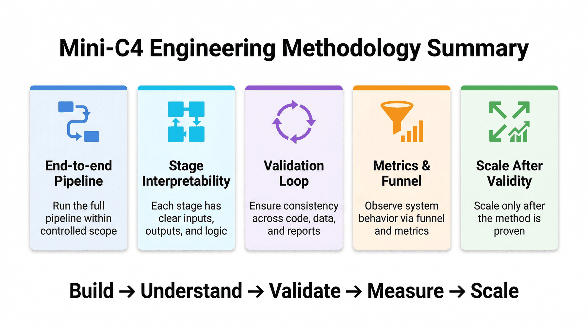

本项目真正想传达的，不是某个库的用法，而是一种更普遍的数据工程方法论：

1. **先在可控边界内跑通全链路**
2. **把每一步做成可解释的阶段**
3. **优先建立结果验证闭环**
4. **通过漏斗和中间指标观察系统行为**
5. **在规模扩展之前先确保方法站得住**

Mini-C4 的价值，不在于它只处理了一个 shard，而在于它把网页预训练数据工程中最核心的问题都浓缩进了一条可以复现的流水线中。

这条流水线也具备完整工程闭环所需的几个要素：

- 有明确目标
- 有完整流程
- 有真实指标
- 有中间取舍
- 有局限与扩展
- 有工程闭环

---

## 18. 主要交付物清单

### 18.1 中间数据产物

- `data/processed/extracted_data.jsonl`
- `data/processed/clean_data.jsonl`
- `data/processed/deduplicated_data.jsonl`
- `data/processed/data_en.jsonl`
- `data/processed/data_zh.jsonl`
- `data/processed/final_data_en.jsonl`
- `data/processed/final_data_zh.jsonl`
- `data/processed/final_data.jsonl`

### 18.2 训练数据产物

- `data/training/serialized_dataset.jsonl`
- `data/training/train.jsonl`
- `data/training/val.jsonl`
- `data/training/smoke_test.jsonl`
- `data/training/training_manifest.json`

### 18.3 报告与检查产物

- `data/reports/p1_metrics.json`
- `data/reports/p1_report.md`
- `data/reports/p1_test_results.json`
- `data/reports/p1_test_report.md`
---

## 19. 结语

对于大模型训练来说，数据往往比模型更难“做干净”。  
因为模型架构可以复用，训练框架可以迁移，但高质量语料生产始终依赖一整套扎实的数据工程能力。

Mini-C4 这个案例证明了一件事：  
即使在非常有限的边界下，我们依然可以把预训练数据工程中的关键问题讲清楚、做完整，并把它沉淀成能够复用的方法论。

这也是这类工程流水线可复用性的核心所在。

---

## 专题：Mini-C4 流水线的验收基线

Mini-C4 这样的项目很容易被误读成“把 Common Crawl 缩小做一遍”。但从工程角度看，它真正值得复用的，是把预训练数据处理写成了可验收的阶段链。所谓可验收，不是最终产出一个 `final_data.jsonl` 就结束，而是每一层都要有能判断“该不该继续往下走”的基线。

### 一、抓取与解析基线

在最前面的抓取与解析阶段，最关键的不是多抓到多少页面，而是抓下来的页面能否被稳定解析。这里至少要关注：

* WARC 样本是否能被正确展开；
* HTML 解析后是否保留主体内容而不是广告和导航噪声；
* 解析字段是否完整，例如 URL、语言、正文长度和元信息是否齐全；
* 解析失败样本是否被记录，而不是悄悄丢掉。

这一步的价值，在于尽早把“原料层的问题”暴露出来。因为如果原料层已经严重失真，后面的清洗、去重和打分很可能都只是在噪声上继续做更昂贵的计算。

### 二、清洗与去重基线

清洗与去重阶段最容易让团队陷入“指标看起来很强，但不知道清掉了什么”。更稳妥的做法，是同时保留量化指标和样本抽检。

这一层比较关键的基线包括：

* 清洗后正文长度分布是否仍然合理；
* 明显模板页、导航页、脚本残留页是否显著下降；
* 去重后是否仍保留足够的主题多样性；
* 不同 shard 之间的重复是否被有效处理；
* 高价值长文本是否没有被规则误伤太多。

对预训练语料来说，去重的难点从来不只是“有没有重复”，而是“去重以后还剩下什么”。如果最终留下的都是结构相似的短页面，那么即使保留率看起来不错，训练价值也不一定高。

### 三、语言切分与质量打分基线

Mini-C4 当前已经把英文和中文拆开处理，这一步非常关键，因为不同语言在网页结构、噪声类型和质量信号上差异很大。语言切分之后，质量打分就不应再只看统一阈值，而应结合语言特征判断。

在这一层，比较重要的基线包括：

* 语言识别是否稳定，避免中英混杂页被错误归类；
* 每种语言的保留率是否与样本质量直觉一致；
* 质量阈值变化后，保留语料的主题和长度分布会不会剧烈波动；
* 最终保留语料中，是否仍存在明显的低价值站点聚集。

这些基线共同决定了一件事：最后留下来的语料，究竟是“更干净了”，还是只是“更少了”。这两者在工程上不是同一件事。

---

## 专题：从教学型原型到大规模预训练工厂

P01 当前的形态更适合作为教学型最小闭环，但它已经清楚展示了未来走向大规模工厂的几条关键路径。这里最值得强调的是，扩规模不能只理解为“把脚本跑在更多机器上”，而是要同步扩展控制面、可观测性和错误处理能力。

### 一、先扩控制面，再扩数据量

很多团队一上来就想扩大数据量，但如果控制面太弱，规模越大问题越难定位。更合理的顺序通常是：

* 先补齐阶段级日志和统计；
* 再补齐样本抽检与规则命中分布；
* 然后再扩 shard 数和并行度；
* 最后才去追求更高吞吐和更大覆盖。

因为只有控制面足够强，团队才能在规模上升时仍然知道哪里出问题、为什么出问题、该先修哪一段。

### 二、预训练语料工厂需要“入口治理”

P01 当前已经谈到前置域名过滤，这一点其实非常重要。因为预训练数据的很多成本，不是花在高价值内容上，而是花在海量低价值页面的下载、解析、清洗和去重上。未来如果要走向更真实的工厂形态，入口治理会变得越来越重要，包括：

* 域名白名单和黑名单；
* 站点质量画像；
* 更新频率与抓取优先级；
* 不同语言和不同地区站点的差异化策略。

只要入口治理做得足够好，后面的清洗压力和计算成本都会显著下降。

### 三、预训练项目最终比拼的是持续生产能力

从长期看，预训练语料工程真正要竞争的，并不是某一次把数据洗得多漂亮，而是能不能持续、稳定、可复盘地产出下一版语料。要做到这一点，至少需要：

* 有明确版本；
* 有阶段基线；
* 有异常样本留存；
* 有质量变化的原因解释；
* 有训练侧可消费的稳定接口。

这也是 Mini-C4 作为项目原型最有价值的地方。它没有假装自己已经是完整工业系统，但它把工业系统最关键的骨架先搭出来了。后续无论团队要扩多大规模、接多少语言、加入多少新规则，只要这个骨架还在，方法就有继续生长的空间。

---

## 专题：语料配比与训练混合策略的前置思考

Mini-C4 这一章虽然重点放在数据清洗与质量控制，但从预训练工程的完整视角看，语料配比同样是一个值得前置思考的问题。因为“洗干净”只解决了能不能用的问题，而“怎么混”决定了这些语料进入训练后会产生什么样的分布影响。

### 一、数据准备阶段就该保留混合所需信息

如果团队打算后续按语言、来源、长度或质量分层混合数据，那么在数据准备阶段就应保留相关字段，而不是到训练前再临时猜测。最常见的可保留信息包括：

* 语言标签；
* 来源域名或来源类型；
* 文本长度区间；
* 质量分数或质量桶；
* 去重前后状态。

这些字段在当前最小项目里看起来像“以后再说”的附加信息，但一旦进入训练配比阶段，它们会立刻变成最有价值的控制手柄。

### 二、训练混合策略本质上是质量控制的延续

很多人把清洗看成数据工程，把混合看成训练工程，但在预训练项目里，这两者其实是一条连续链。因为如果高质量长文本在清洗后被保留，却在训练混合时被过度稀释，前面的清洗收益就很难真正传到模型上。反过来，如果某类低质量但高频的网页被大量保留并在训练中占比过高，模型仍然会受到明显干扰。

从这个角度看，Mini-C4 当前保留下来的结构化字段和中间产物，不只是在服务清洗流程，也是在为后续更精细的训练混合策略预留接口。

