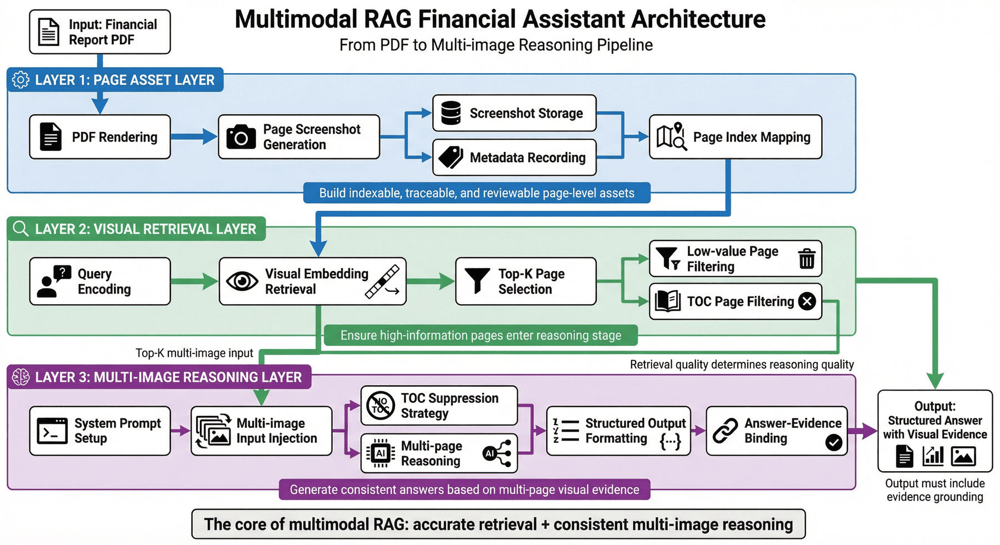
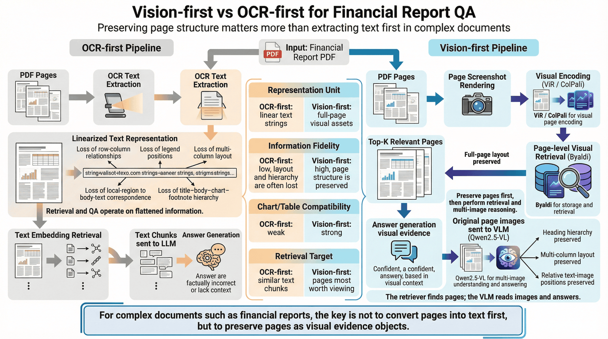
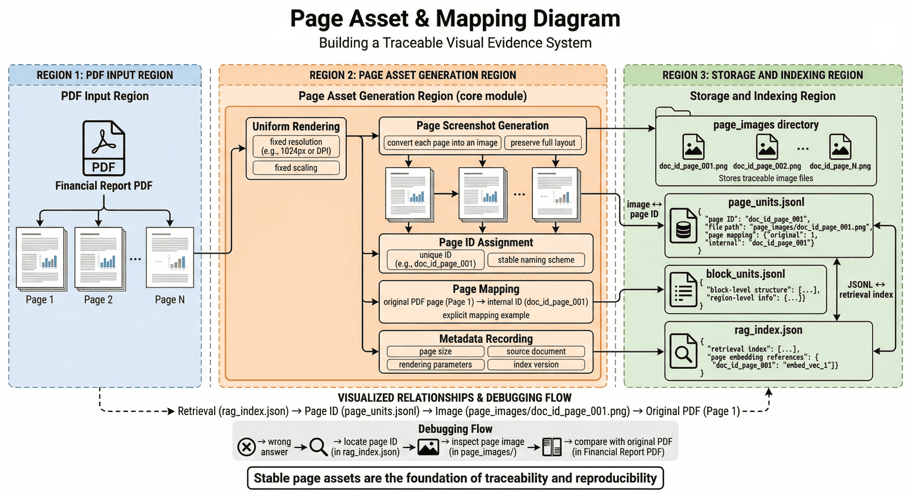
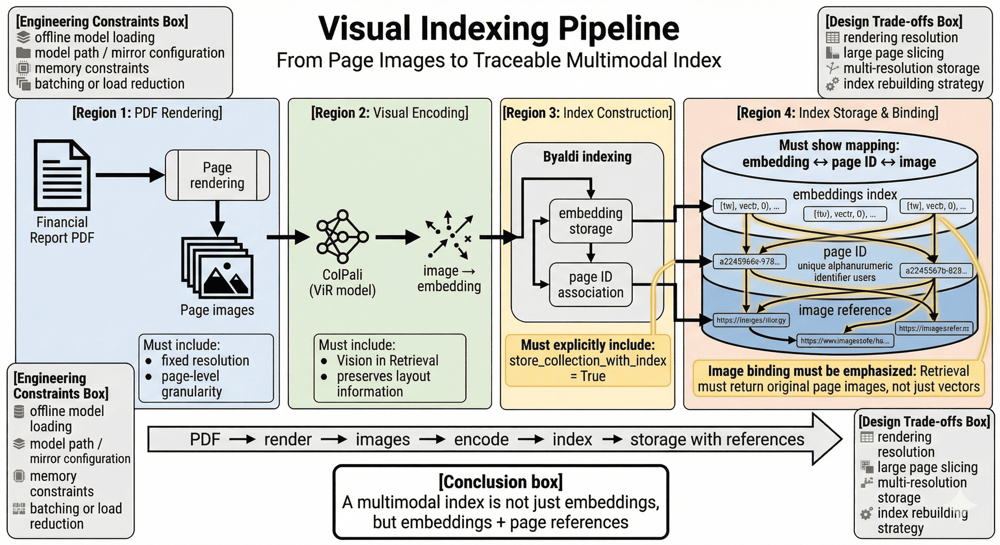
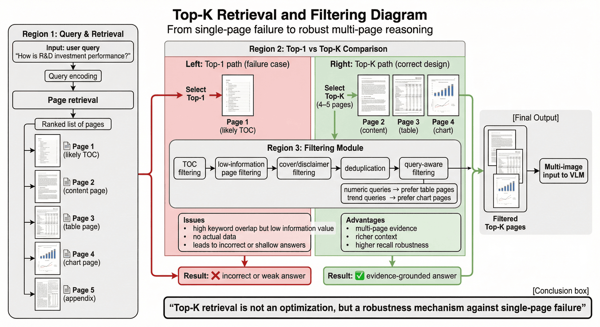
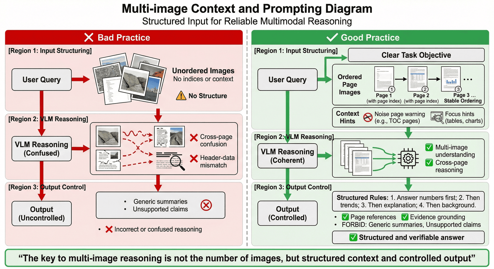
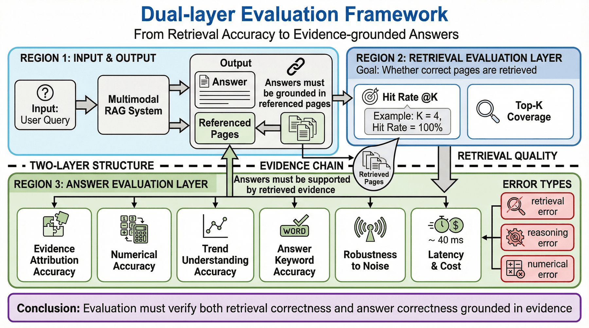
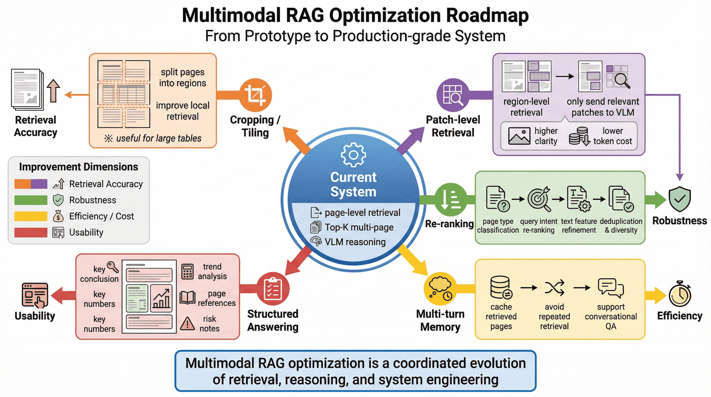
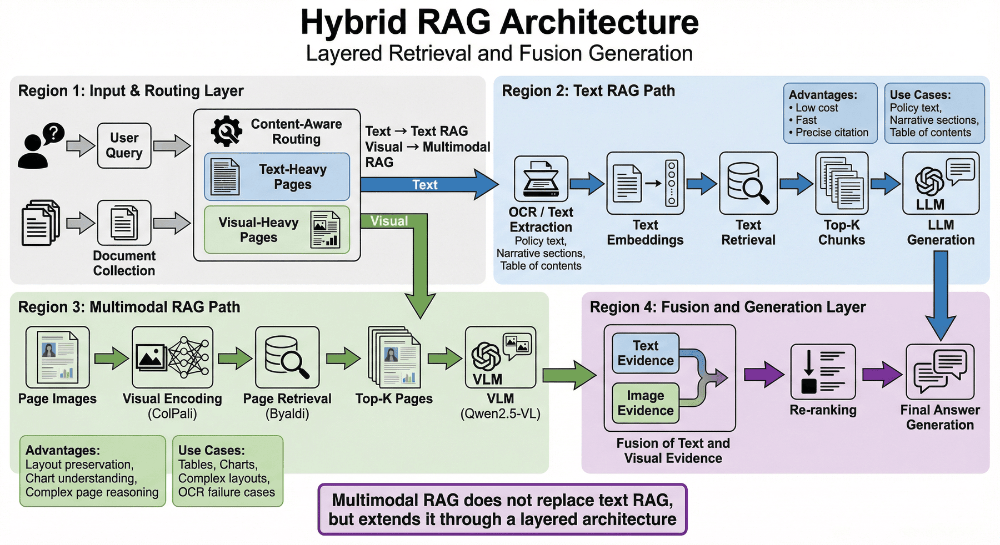

# 项目五：多模态 RAG 企业财报助手

## 本章概览

P05 聚焦把企业财报、招股书等复杂 PDF 文档组织成一条可检索、可解释、可评测的多模态 RAG 流水线。章节重点不在单次问答，而在把页面视觉结构、图表信息和正文语义共同纳入检索与回答过程。

本章可以按四条主线理解：

* 页面渲染与视觉索引：把复杂 PDF 页面纳入页面级向量检索。
* 多页召回与证据组织：处理图表页、正文页、目录页和跨页关系。
* 多模态回答与成本控制：在证据约束下完成多图推理与回答生成。
* 评测验证与复现边界：通过结果评测、检查脚本和成本分析判断系统状态。

如果按工程顺序阅读，本章对应的是一条完整链路：

**财报 PDF -> 页面渲染 -> 视觉索引 -> 多页召回 -> 证据组织 -> 多图推理 -> 效果评测 -> 成本优化**

这一结构对应的核心目标，是把复杂文档问答从 OCR 驱动的文本检索扩展为页面视觉与文本语义共同参与的工程系统。

---

## 1. 项目背景：多模态 RAG 财报助手的必要性

通用大模型已经可以回答很多财经常识问题，但一旦问题涉及企业财报中的**具体数值、图表趋势、跨页表格或页面定位**，模型就会立刻暴露出局限。

最常见的问题至少有四类。

第一类是**结构失真**。例如一张资产负债表里，“期末余额”“期初余额”“本集团”“本公司”这几列如果在 OCR 后顺序错位，模型即使识别到了所有数字，也可能把列关系全部搞错。这样得到的不是“轻微误差”，而是彻底错误的财务解释。

第二类是**图表失明**。很多财报问题并不要求逐字读取，而要求判断趋势，例如“研发投入占比近三年是上升还是下降”“现金流变化拐点出现在什么阶段”。如果系统只会处理文本，它就根本看不到图形信息。

第三类是**证据割裂**。企业年报的正文、附注、图表说明、管理层讨论与分析，往往散布在不同页面。用户问“经营结果如何”时，答案可能需要同时综合收入趋势图、研发投入页、无形资产附注和董事长致辞。如果检索系统一次只拿一页，或只能召回单一文本块，回答就会严重片面。

第四类是**噪声误召回**。财报目录页特别“危险”，因为它往往汇总了全书大部分关键词。传统 embedding 检索非常容易把目录页排到前面，导致模型读了一堆章节标题，却没读到实际数据页。

因此，P05 的目标不是做一个“能对 PDF 提问”的表面演示，而是搭建一个**面向复杂文档场景的多模态 RAG 原型**。它服务的不是单次查询，而是一种方法论：

> 当文档的答案存在于版面、图表、表格和跨页结构本身时，检索系统就不能只检索文本，而必须把“视觉”纳入检索环节。

---

## 2. 项目目标与边界

### 2.1 项目目标

本项目聚焦以下四个目标。

**目标一：建立面向复杂 PDF 的视觉检索链路。**  
即不再把财报页面强行压缩成纯文本，而是把页面图像直接纳入向量检索，使系统能够理解版面布局、图表存在与否以及视觉结构。

**目标二：建立多页证据组合的问答机制。**  
不是让模型只看单页截图，而是能对 Top-K 页面做联合推理，从而回答跨页、多证据、图表与正文混合的问题。

**目标三：让回答具备可解释性与可定位性。**  
系统输出不能只是一个“看起来合理”的总结，而应能够指向具体页面或证据组合，便于复核与调试。

**目标四：形成一条可复现、可评测、可优化的工程路径。**  
项目不仅展示实现方式，也包含指标、风险、失败模式和成本讨论，形成了一条更完整的工程案例链路。

### 2.2 项目边界

为了让案例具备可复现性，本项目显式设置若干边界。

#### 1）文档范围边界

当前主要围绕**单个中文企业财报 PDF**构建索引和问答，不是通用文档平台，也不是对所有办公文档都同样有效的统一方案。

#### 2）检索粒度边界

当前核心粒度是**页面级视觉检索**。这非常适合处理图表和整页表格，但对于极长跨页表格、特别细碎的小区域问答，仍然可能需要进一步的 patch-level 或 region-level 检索增强。

#### 3）生成能力边界

当前生成阶段依赖多模态大模型对页面截图进行解读，因此回答质量会受到图片清晰度、页面密度、图表复杂度和模型视觉能力上限的影响。

#### 4）评测边界

当前评测更适合作为**方法验证**而非生产级验收。现有问题规模仍较小，足以证明链路有效，但不足以代表大规模真实业务环境。

### 2.3 边界说明的作用

工程案例里最容易让人误判的，不是方法本身，而是方法的适用范围。一个写得过满的案例，看起来“什么都能做”，但团队真正复用时反而不知道该从哪里开始。相反，把边界写清楚，反而能让读者明确：

* 这套方案适合什么类型的文档；
* 当前做到哪一层；
* 哪些部分已经稳定；
* 哪些部分仍需后续扩展。

这种写法比单纯追求“看上去更强”更适合工程复用。

---

## 3. 项目定位：P05 的能力链位置

如果把整体大模型应用工程看作一条能力链，那么 P05 位于**复杂文档理解与多模态检索增强**这一段的核心位置。

前面的章节可能已经讨论过纯文本 RAG、结构化问答、SFT 数据工厂、评测体系与上线验收等主题。但这些方法在财报类 PDF 面前都会碰到一个现实问题：

> 当答案不只是文本，而是视觉排版与图表结构的一部分时，传统文本 RAG 的假设就不再成立。

因此，本章的价值不是重复介绍“什么是 RAG”，而是展示：

* 为什么 PDF 页面本身应该进入检索；
* 为什么视觉检索和多模态生成要配套设计；
* 为什么复杂文档的失败点更多出现在检索与证据组织，而不是最终生成一句话；
* 如何把一个多模态原型沉淀成工程案例，而不是只停留在“模型看图挺强”。

从这个意义上说，本章回答的是一个更大的问题：

> 当文档知识嵌在表格、图表和页面结构里时，RAG 系统应该如何升级？

---

## 4. 整体架构：从财报 PDF 到多模态回答的流水线



从工程视角看，本项目可以拆成三层。

### 4.1 第一层：页面资产层

这一层解决的是“如何把 PDF 变成适合视觉检索的证据对象”。主要包括：

* PDF 页面渲染
* 页面截图持久化
* 页面元信息记录
* 页面与原始页码映射

这一步的目标不是回答问题，而是先把 PDF 转成**可索引、可追踪、可回看**的页面级资产。

### 4.2 第二层：视觉检索层

这一层解决的是“面对一个问题，怎样找到最相关的页面”。主要包括：

* 查询编码
* 页面视觉向量召回
* Top-K 多页返回
* 目录页与低价值页过滤

这一步决定系统最终能否把真正有数据的页面送到生成阶段，是多模态 RAG 的关键门槛。

### 4.3 第三层：多图推理层

这一层解决的是“拿到多页截图后，怎样让模型做综合分析而不是逐图胡猜”。主要包括：

* System Prompt 角色设定
* 目录页抑制指令
* 多张图片统一注入
* 输出格式约束
* 答案与证据绑定

到这一步，项目才从“会检索图片”变成“能基于视觉证据稳定回答”。

---

## 5. 数据流与核心思路：Vision-first 检索链

很多人会问：是不是先 OCR，再做文本检索，也能差不多解决问题？

在少量、简单、版式规整的 PDF 上，也许可以。但在财报场景里，这条路很容易遇到瓶颈。原因在于财报并不只是“内容长”，而是**内容的结构表达高度依赖视觉形式**。

### 5.1 OCR-first 的局限

OCR-first 最大的问题，不是“识别率不够高”这么简单，而是它会把原本立体的页面压缩成线性字符串。压缩之后，系统通常会失去：

* 行列关系
* 图例位置
* 多栏排版结构
* 页内局部区域与正文的对应关系
* 同一页中“标题—正文—图表—注释”的视觉层级

一旦这些关系丢失，后面的 embedding 再强，也是在被压扁的信息上工作。

### 5.2 Vision-first 的价值

Vision-first 的核心思想是：**先保留页面作为图像整体的表达能力，再让检索模型去学习“哪一页看起来像答案所在页”**。

这样做至少带来三个好处。

第一，它保留了布局。模型不只看到文字，还能看到表格、图形、标题层级和页面结构。

第二，它天然适配图表。即便图里文字不多，只要页面视觉特征足够相关，仍然有机会被召回。

第三，它更符合复杂文档的阅读方式。真实用户问财报问题时，本质上是在问“哪几页最值得看”，而不是“哪段 OCR 字符串最相似”。

### 5.3 为什么本项目采用 ViR + VLM

本项目采用的核心组合是 **ViR（Vision in Retrieval）+ VLM（Vision Language Model）**：用 ColPali 做页面视觉编码，用 Byaldi 存储与召回，再把命中的页面原图送给 Qwen2.5-VL 做理解与回答。

这套设计的关键不在于“模型名本身”，而在于职责分离：

* 检索模型负责找页；
* 多模态生成模型负责读图；
* Prompt 负责约束回答行为；
* 评测与日志负责验证系统是否真的找对、看对、答对。



---

## 6. 技术选型：ColPali、Byaldi 与 Qwen2.5-VL

一个工程案例如果只列工具名，而不解释为什么选它们，读者通常很难真正复用。因此，这里把技术选型展开讲清楚。

### 6.1 ColPali 在文档检索中的位置

ColPali 的价值在于，它不是把页面当普通自然图片来处理，而是更偏向**文档场景的视觉理解**。对财报、表格、图表、版面结构这类内容来说，这一点非常关键。

相比通用图像 embedding，文档检索模型更可能捕捉：

* 表格边界和列结构
* 标题区域与正文区域分布
* 数字密集页与叙述页的差异
* 图表所在页的视觉模式

也就是说，ColPali 的优势不是“它一定知道所有财务概念”，而是它更擅长先判断“这页看起来像不像用户想找的那种文档证据页”。

### 6.2 Byaldi 作为索引框架

Byaldi 的意义在于，它把多模态检索中最麻烦的一部分工程封装起来了：

* 模型加载
* PDF 转图
* 向量索引构建
* 查询搜索
* 原图关联存储

这能让项目把精力集中在**检索策略、证据组织和回答质量**上，而不是把大量时间花在底层张量存取上。

### 6.3 生成阶段的视觉模型

多模态 RAG 的生成阶段不是简单“把图片送进去让它描述一下”，而是要求模型：

* 识别图表中的趋势；
* 读取高密度财务表格中的关键数值；
* 结合多页内容做归纳；
* 在噪声页面存在时尽量忽略干扰。

这要求模型不仅能看图，还得能看**文档图**。这里选择 Qwen2.5-VL-72B 作为主要视觉生成模型，看中的正是它在文档解析和图表理解任务上的适配性。

### 6.4 选型的工程含义

这组技术栈背后的真实思路是：

* ColPali 解决“找哪页”；
* Byaldi 解决“怎样把找页这件事快速落地”；
* Qwen2.5-VL 解决“找到页之后怎样真正读懂”。

这比“一个万能模型直接干完所有事”更有工程可控性。

---

## 7. 页面资产构建：稳定页面证据库

复杂文档项目里，一个经常被忽视的问题是：**页面资产是否稳定、可追踪**。

如果每次查询时才临时渲染 PDF，一方面会拖慢响应，另一方面会让调试变得非常麻烦。因为一旦某页渲染参数、缩放比例、裁剪逻辑变化，系统行为就可能前后不一致。

### 7.1 页面资产层要解决什么问题

页面资产层至少要完成以下工作：

* 统一页面渲染分辨率；
* 为每页生成稳定文件名或 ID；
* 保存页码映射；
* 记录页面尺寸、来源文件、索引版本；
* 确保后续检索结果能回指到同一张原图。

### 7.2 为什么“可回看”很重要

在多模态 RAG 中，如果系统答错了，排查路径通常不是“模型为什么突然胡说”，而是：

1. 检索是不是召回了错误页面；
2. 图片是不是模糊或裁剪错误；
3. 多图上下文里是不是被噪声页干扰；
4. Prompt 有没有诱导模型过度总结。

如果页面资产没有被妥善保存，就很难定位问题到底出在第几环。

### 7.3 和项目现有产物的对应关系

当前项目会生成页面级资产和索引相关产物，例如 `page_units.jsonl`、`block_units.jsonl`、`rag_index.json` 与 `data/page_images` 等。这说明它并不只是一个临时演示，而已经具备一定的资产沉淀意识。



---

## 8. 索引构建：多模态索引的组织方式

索引阶段的实现由三个关键环节组成：本地加载 ColPali，通过 Byaldi 读取 PDF、完成视觉编码，并把原图引用随索引一起存储。

这组实现对应了几个关键工程判断。

### 8.1 本地模型加载与离线模式

实现里设置了离线模式与镜像源，这说明项目明显考虑了**网络环境与模型复用成本**。这也是很值得保留的工程细节，因为很多案例只写“加载模型”，却不写下载失败、重复下载或路径错配会怎么办。

### 8.2 原图必须和索引绑在一起

`store_collection_with_index=True` 这一点很关键。因为多模态 RAG 的生成阶段并不是从文本库中取字符串，而是要把命中的**原图或页面截图**重新喂给 VLM。没有这个关联，检索与生成就断开了。

### 8.3 索引阶段的真正难点

索引真正的难点通常不在“API 会不会调”，而在以下这些现实问题：

* 页面渲染分辨率多高合适；
* 是否需要对超大表格页做切片；
* 是否保留缩略图与高清图双版本；
* 文档更新后如何重建索引；
* 显存不够时如何降载。

### 8.4 为什么索引构建会直接影响能力上限

因为在复杂文档项目里，索引不是准备动作，而是能力上限的一部分。索引阶段做得粗糙，后面再强的生成模型也只能在模糊证据上“猜”。



---

## 9. 检索设计：Top-K 多页召回

财报问答里，一个非常典型的坑就是：**用户问的问题是跨页的，但系统只想返回一页**。

例如“经营结果如何”“研发投入表现怎样”“无形资产变化说明了什么”，这些问题在真实财报里往往需要综合多页内容。只返回 Top-1，通常会过度依赖单页信息，甚至直接命中目录页。

### 9.1 目录页为什么会成为高频误召回

目录页包含大量章节标题，天然覆盖许多高频关键词，例如：

* 经营结果
* 财务概览
* 研发投入
* 风险提示
* 资产负债表

对纯文本 embedding 来说，这类页面非常“像答案”。但对用户来说，目录页往往是最没用的一页，因为它只告诉你“答案可能在哪个章节”，却不给任何实际数据。

### 9.2 Top-K 的价值

检索阶段不能只取 Top-1，而应取 Top-K（建议 4 到 5 页），并对目录页进行过滤。

Top-K 的价值在于：

* 增加命中真实证据页的概率；
* 允许一个问题由多页共同回答；
* 降低单页误召回导致的完全失败风险；
* 为后续多图推理提供更完整上下文。

### 9.3 为什么“多页召回”本身就是鲁棒性设计

很多 demo 会把“检索到正确页面”当作默认前提。但真实系统要考虑的是：

> 当第一名不可靠时，系统能不能通过多页证据兜底？

从这个角度看，多页召回并不是锦上添花，而是一种必要的鲁棒性机制。

### 9.4 进一步可做的过滤逻辑

除了目录页过滤，还可以考虑：

* 低信息密度页过滤
* 纯版权声明或封面页过滤
* 重复页去重
* 与查询类型不匹配的页面类型过滤

例如数值类问题可优先保留表格密集页，趋势类问题可优先保留图表页。



---

## 10. 提示词设计：生成阶段的抗干扰约束

在文本 RAG 中，Prompt 很重要；在多模态 RAG 中，Prompt 更重要。因为系统给模型的不是几段清晰文本，而是多张可能混有噪声的页面截图。

### 10.1 生成阶段的关键提示词思路

生成阶段的一个关键做法，是在 System Prompt 中显式告诉模型“可能包含目录页，请忽略目录，直接根据包含具体数据的页面回答问题”。

这一句虽然看起来简单，但它本质上是在做**抗噪声约束**。

### 10.2 为什么多模态场景更容易被噪声干扰

因为模型看到的是图像，而不是预先整理好的“正确证据段落”。图像中可能同时存在：

* 目录标题
* 页眉页脚
* 装饰性图片
* 不相关附录
* 正文里的一小块关键数字

如果没有明确提示，模型很容易对“看起来像总结”的内容过度依赖，而忽略真正关键的数据区。

### 10.3 一个更稳的提示词骨架

多模态财报问答的 Prompt 往往应至少包含：

* 角色：专业财务/投研/审计助手；
* 任务：根据提供页面回答具体问题；
* 抗干扰：忽略目录、封面、无数据页；
* 证据偏好：优先依据表格、图表和明确数值；
* 不确定性：若证据不足，说明不足；
* 输出格式：按结论、证据、页码、趋势解读来组织。

### 10.4 为什么 Prompt 也属于“检索后处理”

因为 Prompt 的作用之一，就是帮助模型在召回页集合里进行二次筛选。也就是说，Prompt 不只是生成控制，也是证据清洗的一部分。

---

## 11. 多图上下文组织：多图证据编排

把多页图片都送进模型，不等于模型就一定能把它们组织好。实际上，多图推理最常见的问题之一就是：**图片是多了，但上下文结构变乱了**。

### 11.1 多图注入的基本原则

* 问题文本应先给出，明确本次任务目标；
* 图片顺序应尽量稳定；
* 若有页码，最好让模型知道每张图对应哪一页；
* 若某页可能是噪声页，应在文字里提醒模型谨慎处理；
* 输出中最好要求引用页码或来源页。

### 11.2 为什么顺序很重要

如果图片顺序随机，模型可能把后一页的表头和前一页的数据混在一起，尤其在跨页表格场景里更容易出问题。

### 11.3 为什么要限制输出风格

财报类问题很容易诱发“宏大总结式”回答。模型会说很多正确但泛泛的财经套话，例如“公司持续创新、经营稳健、长期向好”。这些话不是完全错误，但如果用户问的是“研发费用占比多少？趋势如何？”，这种回答就没有价值。

因此，多图场景下尤其需要让模型：

* 先答数字；
* 再答趋势；
* 再答解释；
* 最后补充背景；
* 避免只有大而化之的总结。



---

## 12. Step-by-Step 实战：从索引到问答的最小可复现链路

这一部分沿着项目现有实现思路展开，重点说明如何把链路整理成可复现的工程过程。

### 12.1 阶段一：视觉索引构建

当前实现中，项目通过 Byaldi 封装 ColPali，对 PDF 页面做视觉编码，并将原图随索引一起存储。这一步的关键不是“写几行代码”，而是确保后续系统能稳定取回同一张页面图。

```python
import os
from byaldi import RAGMultiModalModel

os.environ["HF_HUB_OFFLINE"] = "1"
os.environ["HF_ENDPOINT"] = "https://hf-mirror.com"

MODEL_PATH = "/path/to/models/colpali-v1_2-merged"
INDEX_NAME = "finance_report_2024"

def build_index():
    if not os.path.exists(MODEL_PATH):
        raise FileNotFoundError(f"找不到模型文件夹: {MODEL_PATH}")

    rag = RAGMultiModalModel.from_pretrained(MODEL_PATH, verbose=1)
    rag.index(
        input_path="annual_report_2024_cn.pdf",
        index_name=INDEX_NAME,
        store_collection_with_index=True,
        overwrite=True,
    )
```

### 12.2 阶段二：多页检索

现有实现把 `RETRIEVAL_K` 设为 4，这是一个比较务实的默认值。它既能提供一定的证据覆盖，又不至于让多模态输入膨胀得太夸张。

```python
RAG = RAGMultiModalModel.from_index(INDEX_NAME)
RETRIEVAL_K = 4
results = RAG.search(user_query, k=RETRIEVAL_K)
```

### 12.3 阶段三：多图推理

现有实现把问题文本与多张页面图一起组成 payload，再交给 Qwen2.5-VL 处理。关键点有两个：一是明确要求模型忽略目录；二是把图片 detail 设为 `high`，以便读取财报中的小字与密集数字。

```python
content_payload = [{
    "type": "text",
    "text": (
        f"你是专业的 CFO 助手。我给你提供了 {len(results)} 张财报截图。"
        f"其中可能包含目录页，请忽略目录，直接根据包含具体数据的页面回答问题：{user_query}。"
        "如果包含图表，请详细解读数据趋势。"
    ),
}]

for res in results:
    content_payload.append({
        "type": "image_url",
        "image_url": {
            "url": f"data:image/jpeg;base64,{res.base64}",
            "detail": "high",
        }
    })
```

### 12.4 阶段四：结果回传与证据组织

严格来说，这一步在很多 demo 中都被省略了。但在工程里，它非常重要。建议至少返回：

* 问题
* 命中页码
* 关键结论
* 证据摘要
* 模型原始输出
* 延迟与 token 统计

只有把这些日志保留下来，后面才有可能做失败重放和质量分析。

---

## 13. 真实运行记录：运行证据与日志

一次真实运行记录显示，系统针对“经营结果如何？”这一问题，召回了第 49、91、130、8 页，并综合这些页面生成了关于研发投入、无形资产和社会责任等方面的分析。

这段示例至少说明了三件事。

第一，系统并没有只依赖单页回答，而是确实进行了多页综合。

第二，目录页并没有完全阻塞结果，说明多页召回和抗干扰 Prompt 起到了作用。

第三，模型已经能从图文混合页面中提取较具体的信息，而不只是笼统地说“经营情况良好”。

当然，这段示例也提醒我们一个现实问题：回答里仍然可能混入偏泛的公司叙事内容，例如社会责任、董事长致辞等。这说明多页召回虽然提高了覆盖率，但也会带来更高的主题扩散风险。

### 13.1 为什么运行记录很重要

在工程实践里，一个章节最怕只有“理论上可行”。一旦放入真实日志，读者就能看到：

* 系统到底召回了哪些页；
* 模型输出有没有过度扩写；
* 多模态链路是不是在真实问题上跑通了。

### 13.2 这类日志还能反向帮助 Prompt 调整

例如如果模型总是把“董事长致辞”这类宏观表述混进答案，那就可以进一步在 Prompt 中加入：

* 优先回答量化指标；
* 非数值性背景信息仅作辅助；
* 若页面缺少直接数据，不要扩写成宏观判断。

---

## 14. 评测与验证：多模态 RAG 的验证方式

复杂文档问答最容易掉进一个陷阱：回答听起来很专业，但其实证据未必对。

因此，多模态 RAG 的评测至少要覆盖两层：

* **检索是否找对页面**；
* **回答是否基于正确页面得出正确结论**。

### 14.1 项目现有指标说明了什么

当前项目在单个 PDF 上共处理 `146` 页，解析出 `1341` 个区块，其中 `table_like=104`、`chart_like=4`。这说明系统已经把非纯文本证据纳入整体处理视野。评测集共 `8` 条问题，检索命中率@4、引用准确率与答案关键词准确率均为 100%，平均延迟约 `40 ms`。

### 14.2 这些指标为什么看起来很漂亮

这些结果说明当前链路在受控条件下已经相当稳定。但真正需要警惕的不是成绩不够高，而是评测问题规模太小，可能让指标“过于干净”。

### 14.3 多模态场景下应重点关注哪些指标

建议至少建立以下几类指标：

* 检索命中率@K：正确页面是否出现在召回集合中；
* 证据引用准确率：回答引用的页码是否真支撑该结论；
* 数值正确率：关键数字是否抄对、比对对；
* 趋势理解正确率：图表趋势是否被正确解读；
* 干扰鲁棒性：加入目录页后性能下降多少；
* 平均时延与成本：系统是否具备工程可接受性。

### 14.4 为什么要把“图表趋势理解”单独拿出来

因为图表理解并不等同于文字抽取。一个模型也许能读出“2024”“收入”“研发费用”等字样，却仍然可能把趋势判断反着说，或者把同比与环比混为一谈。



---

## 15. 指标解读：现有结果的边界

P05 当前指标非常整齐，这本身说明链路设计思路是对的。尤其是在复杂文档场景下，如果检索、引用和答案关键词都能保持一致，至少说明项目已经具备较好的闭环能力。

但从工程角度讲，这组结果更像是：

* **系统已经跑通**；
* **在当前样本上表现稳定**；
* **具备继续扩展的基础**。

它还不意味着：

* 系统已经适配所有财报；
* 所有跨页表格都能稳定理解；
* 所有图表问题都能无误回答；
* 已经达到生产级通用能力。

### 15.1 为什么小评测集容易“过于顺滑”

因为问题少，通常覆盖面也窄。系统可能只是在最典型、最清晰的样本上表现良好，而尚未充分暴露对复杂附注、模糊问题和异常排版页面的脆弱性。

### 15.2 为什么这反而是个好信号

因为一个好的工程案例不需要一开始就“无所不能”。更重要的是它能明确展示：

* 当前已经验证了什么；
* 还没验证什么；
* 下一步最值得扩哪一块。

从这个角度看，P05 的指标并不只是“成绩单”，也是后续扩展路线图的起点。

---

## 16. 失败模式：多模态财报问答的主要风险

如果只看成功案例，很容易误以为多模态 RAG 的主要难点已经解决。但真实工程里，失败模式才是最值得认真展开的部分。

### 16.1 目录页误召回

这是最典型的问题。症状是召回页里关键词很全，但没有任何实质数据。

### 16.2 图表读对了对象，读错了趋势

例如模型看到了收入图表，但把“逐步回升”解读成“持续下降”，或者混淆不同颜色图例对应的业务线。

### 16.3 表格列对齐错误

尤其在跨页表格、超宽表格或密集财务附注中，模型可能抓到数字，却没有抓对列关系。

### 16.4 多页综合时主题漂移

召回页太多时，模型会把次要页面里的宏观叙事混入主答案，导致答案“看上去更完整”，但其实偏离用户问题。

### 16.5 页面清晰度不足

如果原图分辨率不够，或者截图被压缩，小字、脚注和列头就会变成生成阶段的盲点。

### 16.6 为什么 failure replay 很重要

当前 `failure replay` 样本数为 0，这说明失败样本库还比较薄。对一个准备持续优化的项目来说，这其实是后续应该优先补的资产之一。因为没有失败样本积累，系统就很难建立真正有价值的回归测试集。

---

## 17. 成本分析：多模态 RAG 的成本结构

成本部分可以先抓住几个很直观的数据：

* ColPali 索引约 `0.5s/页`；
* 200 页财报索引构建约 2 到 3 分钟；
* 一张 1024×1024 图片在 VLM 中约 1000 到 1500 tokens；
* Top-4 检索意味着输入 token 很容易达到 5000+；
* 调用 Qwen2.5-VL 的单次复杂问答成本约 0.05 到 0.1 元人民币。

这些数字揭示了一个现实：

> 多模态 RAG 的主要成本不只是“模型更贵”，而是页面图像让每次问答的上下文开销显著放大。

### 17.1 索引成本

页面越多、渲染越高清、模型越大，索引成本就越高。这意味着索引通常适合做成离线批处理，而不是每次提问前临时构建。

### 17.2 推理成本

一旦系统采用 Top-K 多页输入，推理成本会近似随页数线性增长。若再叠加高清模式与长输出，费用和延迟都会迅速上升。

### 17.3 隐性成本

真正容易被低估的，还包括：

* 失败重试成本；
* 日志与页面资产存储成本；
* 人工评测与校验成本；
* 新文档重建索引的运维成本。

### 17.4 为什么成本必须被单独衡量

因为复杂文档项目最怕“效果演示能跑，但没人敢长期用”。成本分析写清楚，读者才能判断这套方案适合：

* 离线批量分析；
* 高价值低频问答；
* 深度投研辅助；
* 还是必须进一步压缩后才能上线。

---

## 18. 优化方向：当前原型的深化路径

当前可以先归纳出三条很有代表性的优化思路：页面切片、局部区域检索和缓存机制。这里把它们展开。

### 18.1 页面切片（Cropping / Tiling）

对于超大财务表格，一整页截图往往既不利于检索，也不利于生成。把一页切成多个局部区域分别索引，可以让系统更容易命中“真正有答案的区域”。

### 18.2 Patch-level Retrieval

如果未来能做到 patch-level 检索，那么系统就不一定要把整页都送进 VLM，而是只输入与问题最相关的局部区域。这可以同时提升清晰度与降低 token 成本。

### 18.3 检索结果重排

目前如果主要依赖单一路径召回，后续可以增加：

* 页面类型识别重排；
* 基于 query intent 的排序校正；
* 结合轻量文本特征进行二次筛选；
* 去重与互补性排序。

### 18.4 多轮问答与证据记忆

对于连续提问场景，系统可以缓存前一轮已经确认有效的页面，避免每次都从头召回。

### 18.5 答案模板化输出

对企业级使用者来说，回答最好不只是自然语言，还可以结构化输出：

* 核心结论
* 关键数值
* 趋势判断
* 证据页码
* 风险提示

这样更便于接入下游系统。



---

## 19. 工程落地：高价值低频场景的适配性

不是所有问答系统都适合一上来就追求高并发。对多模态财报助手来说，更合理的落地路径通常是从**高价值低频问题**开始。

### 19.1 适合的场景

* 投研团队做深度财报阅读辅助；
* 审计和财务分析人员做附注核查；
* 企业内部知识助手处理年报、招股书等复杂 PDF；
* 管理层快速定位某类财务指标所在页面。

### 19.2 不太适合的场景

* 大规模高并发低单价问答；
* 需要毫秒级响应的通用客服；
* 对任意文档都要求开箱即用；
* 不能接受图像输入成本的超低预算环境。

### 19.3 为什么先做高价值场景更现实

因为这些场景通常：

* 单次问题价值高；
* 用户对准确性要求高；
* 可接受较高的单次成本；
* 更愿意为“看图表、读附注、跨页综合”的能力买单。

也就是说，多模态财报助手最先证明价值的地方，往往不是“替代所有搜索”，而是“在最难的复杂文档问答里给出明显更好的答案”。

---

## 20. 与传统文本 RAG 的关系：升级与分层

一个常见误区是：既然多模态 RAG 更强，是不是就应该完全替换文本 RAG？

现实里未必如此。

### 20.1 文本 RAG 仍然有价值

对于目录、章节说明、政策条文、管理层文字叙述这类内容，文本 RAG 通常仍然更便宜、更快，也更容易做精确引用。

### 20.2 多模态 RAG 更适合什么部分

* 图表密集页
* 表格密集页
* 版式复杂页
* OCR 容易失真页
* 需要依赖视觉上下文的问题

### 20.3 更合理的长期形态

长期来看，更合理的架构往往不是“只用一种 RAG”，而是：

* 文本页走文本检索；
* 图表页走视觉检索；
* 最终在重排或生成阶段做融合。

这样既保留文本 RAG 的效率优势，又能用多模态 RAG 兜住复杂场景。



---

## 21. 质量基线：多模态财报助手的可用标准

质量基线的作用，是把系统的可用下限明确下来，而不是追求抽象的满分。

这类系统至少需要建立以下五条基线。

### 21.1 检索基线

对核心问题集，正确证据页应能稳定进入 Top-K，且目录页不能长期占据前排。

### 21.2 数值基线

模型回答中的关键数字不能频繁抄错、对错列或张冠李戴。

### 21.3 趋势基线

对典型图表问题，系统应能稳定区分上升、下降、波动、拐点等基本趋势判断。

### 21.4 证据基线

回答最好能指出所依据的页面或证据来源，而不是给出无法复核的“结论体”。

### 21.5 成本基线

系统必须在可接受的延迟和费用内运行，否则就算效果好，也难以进入真实工作流。

### 21.6 为什么基线比单次演示更可靠

单次演示的结果并不代表系统稳定；只有建立基线，才能判断系统何时该扩展、何时该返工。


---

## 22. 交付物与复现路径

要让整条链路可复现，除了原理和代码，还需要保留一组关键产物。

### 22.1 现有主要交付物

当前项目已经形成以下关键产物：

* `data/processed/page_units.jsonl`
* `data/processed/block_units.jsonl`
* `data/processed/rag_index.json`
* `data/page_images`
* `data/eval/reference_questions.jsonl`
* `data/eval/evaluation_results.jsonl`
* `data/eval/failure_replay.jsonl`
* `data/reports/p5_report.md`
* `data/reports/p5_metrics.json`
* `data/reports/p5_test_results.json`
* `data/reports/p5_test_report.md` 

### 22.2 为什么这些产物重要

* 页面资产让证据可回看；
* 索引文件让检索可复现；
* 评测问题集让质量可对比；
* 测试报告让系统状态可追踪；
* failure replay 则是未来持续优化的基础。

### 22.3 复现步骤

1. 准备一份图表和表格较多的中文财报 PDF；
2. 渲染页面并构建视觉索引；
3. 设计一组覆盖数值、趋势、跨页和干扰页的问题；
4. 运行多页检索与多图问答；
5. 对照页码与原图验证回答；
6. 把失败案例沉淀进 replay 集。

## 23. 总结：多模态 RAG 的关键，不是“模型会看图”，而是“系统会用图”

P05 的关键意义，不在于证明“视觉大模型可以读财报”，而在于把这件事组织成一条可检索、可验证、可复盘的工程链路：

> 当答案存在于页面、图表、表格和版式结构中时，RAG 系统必须把视觉纳入检索本身，而不是只在最后一步临时加一张图片。

从现有项目材料来看，P05 已经具备几个很关键的工程特征：

* 有明确的问题定义与方法边界；
* 有从页面资产到视觉索引的链路；
* 有多页召回与抗目录干扰设计；
* 有真实运行记录；
* 有基础评测与验证结果；
* 也有成本与后续优化方向。 

由此可以看出，它已经不再只是一个“看起来很新”的多模态 demo，而更接近一个可供团队参考的复杂文档 RAG 工程案例。

本章可以归结为一句话：

> 多模态 RAG 的难点，从来不只是让模型看见图片，而是让检索、证据组织、提示词、评测与成本控制一起围绕“视觉证据”重新设计。


---

## 专题：评测集设计与标注规范

多模态 RAG 项目最常见的误区之一，是只用少量“看起来很难的问题”做演示，却没有认真建设评测集。这样做短期确实方便，但它很难支撑后续优化。因为当系统效果波动时，团队往往说不清问题到底来自检索、证据组织、视觉理解，还是答案生成。

### 一、评测问题应该覆盖哪些类型

对财报类多模态问答来说，评测集至少不应只有“找某个数字”这一种题。更合理的设计通常要覆盖以下几类：

* 数值抽取题，测试系统是否能准确定位并读取财务数据；
* 趋势判断题，测试系统能否理解折线图、柱状图或占比变化；
* 跨页整合题，测试系统是否能把不同页面的信息拼成完整答案；
* 图文对照题，测试系统是否能把正文表述和图表证据互相校验；
* 干扰抑制题，测试系统是否会被目录页、封面页、章节页或关键词堆积页误导；
* 无答案题，测试系统能否在证据不足时明确说明而不是硬编。

只有这些问题类型都进入评测集，团队才能更准确地识别系统到底擅长什么、薄弱什么。否则，模型可能在数值题上表现很好，却在趋势理解上持续失败；如果评测集没有后者，团队就会误以为系统“已经差不多能上线了”。

### 二、标注不应只写最终答案

多模态 RAG 的标注比纯文本 QA 更复杂，原因就在于“正确答案”往往不是唯一需要标的内容。一个足够有用的评测样本，通常至少要包含：

* 问题文本；
* 参考答案或可接受答案范围；
* 关键证据页码；
* 证据类型，说明该题更依赖表格、图表、正文还是多页组合；
* 容错规则，例如数值是否允许四舍五入、趋势词是否允许同义表达；
* 常见错误模式，例如最容易误召回目录页、最容易错读同比环比等。

把这些信息都标出来的价值，在于后续可以更细地诊断问题。例如，某次改动后总体得分不变，但“关键证据页进入 Top-K 的比例”下降了，同时“模型靠语言常识答对”的比例上升了。对于复杂文档系统来说，这不是进步，而是隐性退化。没有细标注，这种退化通常很难被及时发现。

### 三、评测集需要常规集和压力集两层结构

为了兼顾稳定跟踪与问题发现，评测集最好分成两层：

* 常规集，用于每次改动后的稳定回归测试；
* 压力集，用于专门暴露系统最脆弱的边界。

常规集通常覆盖系统最常见的核心问题类型，样本量不必特别大，但必须稳定。压力集则更强调挑战性，适合纳入：

* 小字密集表格；
* 跨页表格与图表结合问题；
* 目录页和正文页高度相似的问题；
* 同一概念在多个页面重复出现但语义不同的问题；
* 对“无答案”判断要求很高的问题。

这种双层结构的意义在于，常规集帮助团队看整体趋势，压力集帮助团队找真正瓶颈。只有两者同时存在，评测才既能指导日常迭代，也能支撑中长期优化。

### 四、failure replay 需要持续补充

评测集不是一次性写完的文档，它应该随着失败案例不断增长。对 P05 这类项目来说，最有价值的新增评测样本，往往就来自真实失败 replay。

比较理想的做法是，每当系统出现以下问题时，都考虑是否把它转化为 replay 样本：

* 目录页误召回导致答非所问；
* 表格列错位导致数字被读串；
* 图表趋势读反；
* 多页综合时把不同年份或不同主体混在一起；
* 没有证据却给出高置信答案。

这些 replay 样本会不断提醒团队：系统最值得优化的地方，不一定是“看起来最复杂的功能”，而是那些最容易伤害用户信任的错误。

---

## 专题：企业上线前的门禁条件

多模态财报助手要从演示进入真实使用场景，关键不在于把回答做得更华丽，而在于建立清晰的上线门禁。因为财报问答天然涉及高价值决策，一旦系统在关键数字、趋势判断或证据定位上持续失真，用户会很快失去信任。

### 一、文档接入门禁：不是所有 PDF 都应该直接入库

系统的第一道门禁，应当放在文档接入阶段。因为不同财报 PDF 在扫描质量、排版复杂度、图表密度和语言风格上差异很大，不加筛选地接入，往往会把后续检索和生成的难度成倍放大。

文档接入时至少值得检查：

* 页面渲染是否清晰，是否存在大面积模糊或断字；
* 页码映射是否稳定；
* 图表、表格和正文是否能被正常保留；
* 是否存在大幅旋转页、超长折页或扫描歪斜页；
* 文档是否属于当前系统已验证过的文档类型。

这一步做得好的意义在于，系统不会把明显超出能力边界的文档直接放进索引，然后再把后续问题都算在模型头上。

### 二、检索门禁：证据页必须先过线

多模态 RAG 的第二道门禁，应该放在检索层。原因很简单，如果核心证据页长期进不了 Top-K，后面再强的模型也很难救回来。

检索门禁可以重点关注：

* 核心问题集上的证据页 Top-K 命中率；
* 目录页、版权页、封面页等低价值页面的高位误召回率；
* 同一问题在不同版本索引上的稳定性；
* 多页问题中互补页面是否能同时进入候选集。

只有当这些指标达到可接受水平，生成阶段的评估才有意义。否则，团队会不断优化 Prompt，却始终在错误证据上做文章。

### 三、回答门禁：答案不仅要像，还要能复核

对企业场景而言，回答门禁不能只看“语言是否流畅”，而要看答案是否具备复核性。一个更靠谱的回答门禁，通常至少包括：

* 关键数字不能频繁抄错、漏读或张冠李戴；
* 趋势结论不能长期与图表方向相反；
* 对跨页问题，回答中不能把不同主体、不同年度或不同口径混淆；
* 对证据不足问题，系统应能够保守表达或拒答；
* 回答最好附带页码或证据说明，便于人工复核。

这种门禁的本质，是把“答得像专家”转成“答得经得起核查”。在财报场景里，后者比前者重要得多。

### 四、运营门禁：系统要能被长期维护

上线前还有一类经常被忽视的门禁，就是运营门禁。也就是说，系统即使效果不错，如果没有稳定的索引重建、日志管理、评测回归和异常处理机制，也很难长期维护。

运营门禁至少可以包括：

* 新文档入库后的索引更新时间是否可控；
* 关键日志是否保留，便于定位失败问题；
* 评测集和 replay 集是否能在版本变更后自动回归；
* 出现异常高成本或异常长延迟时，是否有降级路径；
* 人工复核角色是否明确，尤其是在高风险问答场景下。

只有把运营门禁也纳入上线条件，多模态 RAG 才能从“一个效果不错的 demo”变成“一个有人敢持续使用的系统”。

---

## 专题：多模态财报助手的协作流程

P05 这种项目在落地时，往往不是单一模型工程师能独立完成的。它天然要求文档处理、检索、视觉理解、评测和业务理解多方协作。因此，协作流程本身也应该成为章节的一部分，而不是隐含在项目经验里。

### 一、角色分工：不同问题由不同角色负责

一个比较清晰的协作结构通常包括：

* 文档处理工程角色，负责 PDF 渲染、页面资产、索引构建与存储；
* 检索工程角色，负责召回策略、重排、误召回治理和缓存优化；
* 多模态生成角色，负责 Prompt、图片组织和答案结构约束；
* 评测角色，负责问题集、标注规范、回归评测和 failure replay；
* 领域专家或业务角色，负责判断问题是否真的符合财报阅读需求，答案是否具备业务可用性。

如果这些角色边界不清楚，项目很容易出现一个典型问题：所有失败都被归结为“模型没看懂图”。但真实情况往往更复杂，有时是索引没建好，有时是问题设计不合理，有时是业务预期本身不适合当前系统能力。

### 二、日常迭代：从失败案例进入下一轮优化

对这类系统来说，最有效的协作节奏通常不是围绕“我们今天又加了什么功能”，而是围绕“这周最值得修的失败案例是什么”。一个实用的迭代节奏可以是：

* 先收集本周的代表性失败问答；
* 再判断问题属于检索、生成、评测还是文档接入；
* 然后决定是补 replay、调 Prompt、调排序，还是限制文档接入边界；
* 最后在下一轮回归测试中验证问题是否真正缓解。

这种节奏的好处，在于它把跨角色协作聚焦到同一批可讨论的样本上，而不是让每个角色都从自己的局部视角出发各改各的。

### 三、业务对接：先服务高价值决策，再扩场景

多模态财报助手如果要在企业中被接受，最稳妥的方式通常是先服务高价值、低频、可复核的场景，例如投研辅助、财务分析、审计核查或管理层快速定位。这类场景的一个共同特点是：用户愿意花时间看证据，也愿意接受“答案附页码、建议人工复核”这种输出形式。

这样做的协作收益很明显：

* 业务角色能更准确地提供高价值问题；
* 工程角色能围绕少量关键场景打磨检索与提示词；
* 评测角色能更快沉淀高质量 replay；
* 团队可以在较小范围内先形成使用共识，再逐步外扩。

从长期看，这种“先把最值得做的场景做深”的协作方式，比一开始就追求覆盖所有文档、所有问法、所有用户，更有机会把系统真正做成产品级能力。

---

## 专题：证据呈现与答案展示规范

多模态财报助手在真实使用里，还有一个很关键、但常常被低估的问题，就是答案到底应该怎样展示。系统如果只是输出一段流畅文字，短期看起来很像“智能问答”，但长期很难建立信任。对于财报这种高价值文档场景，更合理的做法是把答案展示也当成系统设计的一部分。

### 一、答案应优先展示结论、证据和限制

一个更适合企业场景的答案结构，通常至少包括三部分：

* 核心结论，直接回答用户当前问题；
* 证据说明，指出主要依据的页码、页面类型或关键表格/图表；
* 限制提示，说明当前回答是否依赖多页综合、是否存在证据不足或是否建议人工复核。

这种结构的好处在于，它能把“模型说了什么”和“模型为什么这么说”同时展示出来。对财务、审计和投研用户来说，后者往往和前者一样重要。

### 二、页码与证据类型最好显式呈现

如果系统已经完成了页面级索引和多页召回，那么在前端或报告层最好把这些信息显式透出，而不是只留在日志里。最有价值的通常不是复杂的可视化，而是几个稳定字段：

* 命中的页码；
* 证据属于正文、表格还是图表；
* 是否涉及多页综合；
* 哪一页是主证据页，哪几页是辅助页。

这样做的意义在于，用户可以很快判断回答是否值得继续相信，也方便团队在出现争议时快速回到原始证据。对于复杂文档系统来说，这种“可回看”能力比一次性生成更重要。

### 三、对不确定回答要保留克制表达

多模态文档问答非常容易在“差一点看懂”的状态下给出高置信回答。为了避免这一点，答案展示规范里最好明确保留几类克制表达，例如：

* 当前证据页未完全覆盖问题；
* 当前页能支持趋势判断，但不足以支持精确数值结论；
* 该问题涉及多个主体或多个年份，建议进一步核对；
* 目录页或概览页被召回，当前结论可能需要更多正文页支撑。

这种克制并不会削弱系统，反而能显著提升用户信任。因为在财报场景里，用户通常更能接受“系统知道自己哪里还不确定”，而不是“系统总是很自信地说错”。

---

## 专题：从问答助手走向分析工作台

P05 当前展示的是一个多模态财报问答助手，但从工程演化角度看，它完全可以进一步走向分析工作台形态。之所以值得补这一层，是因为企业用户在真实场景里往往不只需要“问一个问题、得到一个答案”，还需要对证据做连续浏览、比较和追踪。

### 一、分析工作台比问答更强调连续任务

问答助手更适合回答单次问题，而分析工作台更适合支撑连续任务，例如：

* 围绕同一家公司追踪多个财务主题；
* 对同一指标做跨年度比较；
* 对同一问题连续展开追问并保留证据上下文；
* 把多次问答结果整理成简报或复核清单。

一旦进入这种连续任务形态，系统设计重点就会从“单次回答够不够好”扩展到“证据能不能连续复用、答案能不能持续组织、问题链能不能被管理”。

### 二、当前项目已经为工作台形态预留了关键基础

P05 之所以适合往工作台方向扩展，是因为它已经具备几个重要基础：

* 页面资产可回看；
* 证据页可以被稳定引用；
* 多页召回天然适合连续问题复用；
* failure replay 和评测集可以支撑后续迭代。

这意味着未来如果团队要做更强的企业文档分析界面，并不需要推翻现有项目，而是可以在现有“索引—证据—回答”主链上继续向上搭建。

