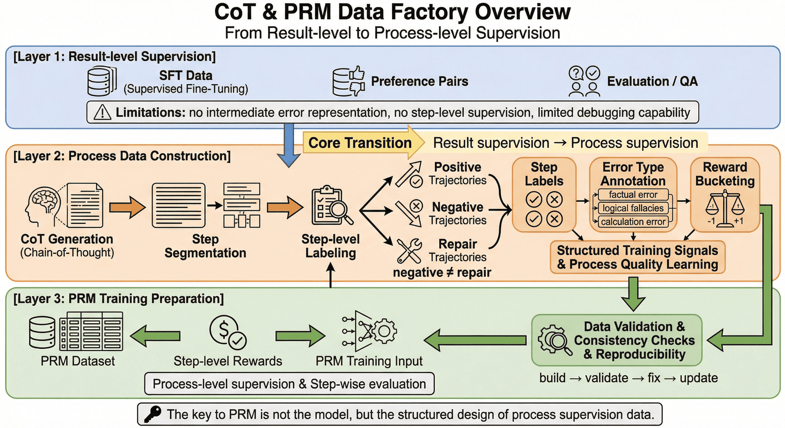
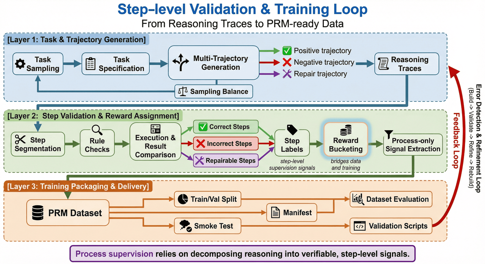
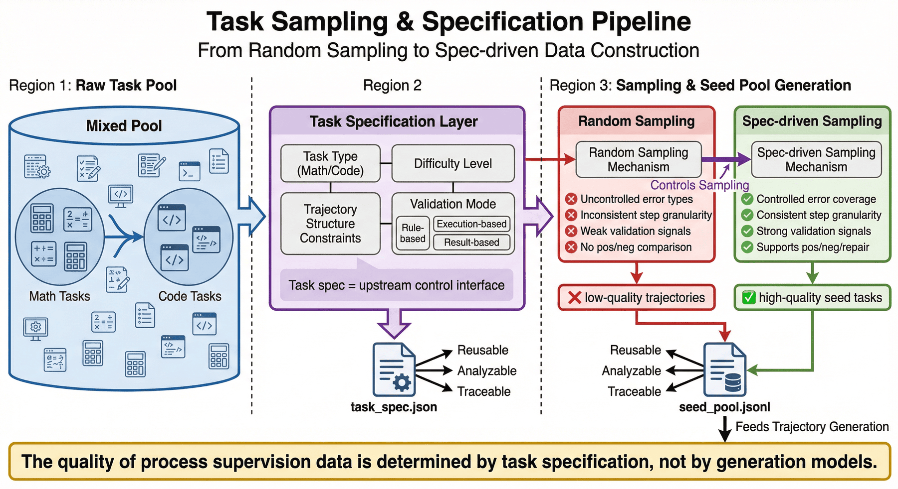
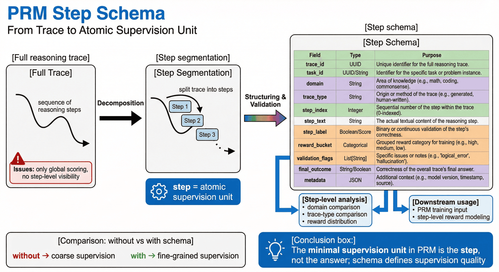
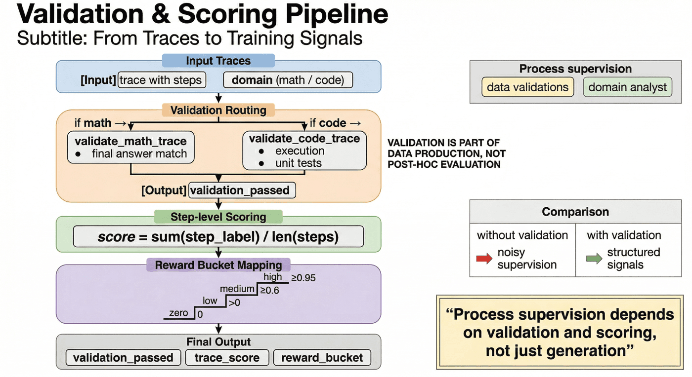
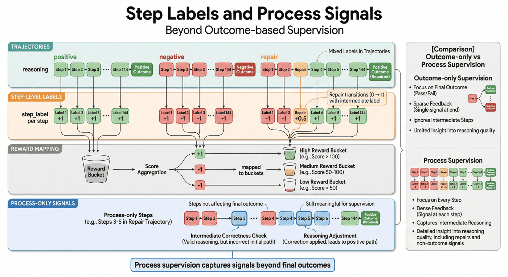
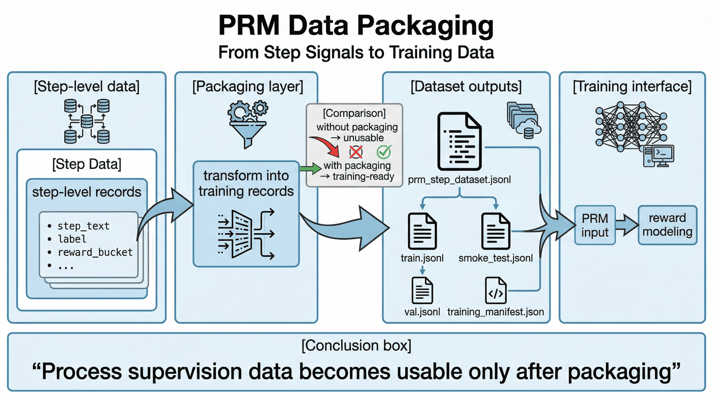
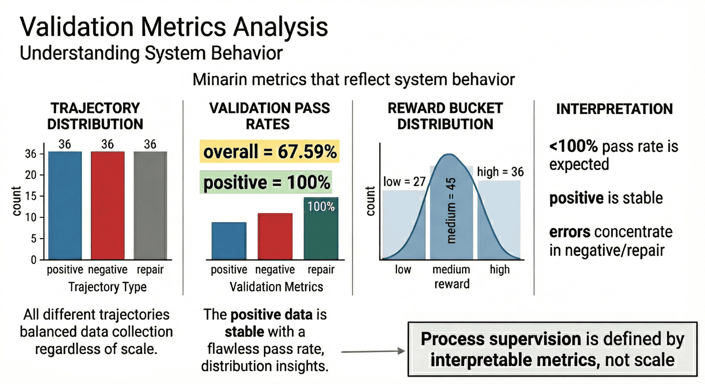
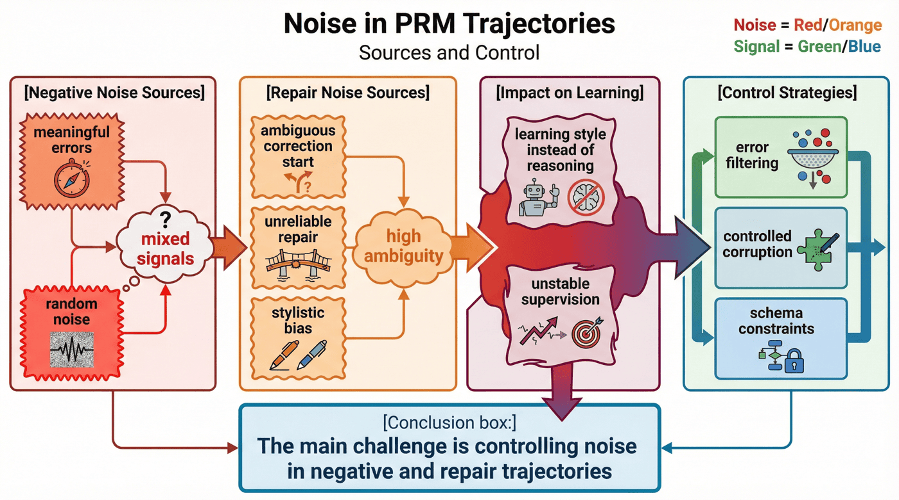

# 项目六：CoT 推理数据集构建与 PRM 训练

## 本章概览

P06 聚焦把推理过程本身组织成可训练、可验证、可分析、可迭代的过程监督数据资产。章节重点不在单条思维链展示，而在 step 级监督、奖励分配和 PRM 训练接口之间的工程化衔接。

本章可以按四条主线理解：

* 种子任务与轨迹生成：从任务采样进入 CoT 轨迹构造。
* step 校验与奖励分配：围绕过程标签、reward bucket 和轨迹类型组织监督信号。
* PRM 封装与训练切分：把处理结果整理为可直接训练的过程监督数据。
* 评测与项目检查：通过指标、检查脚本和噪声分析验证数据工厂状态。

如果按工程顺序阅读，本章对应的是一条完整链路：

**任务采样 -> 轨迹生成 -> step 校验 -> reward 分配 -> PRM 封装 -> 训练切分 -> 数据评测 -> 项目检查**

这一结构对应的核心目标，是把 CoT 与 PRM 数据从结果监督扩展为围绕 step 级信号构建的过程监督流水线。

---

## 1. 项目背景：CoT 与 PRM 数据工厂的必要性

通用大模型在开放域生成任务上已经具备较强能力，但一旦进入数学求解、代码推理、复杂规划或多步判断场景，问题就会迅速暴露出来。

最常见的问题不是“模型不会说”，而是“模型虽然会说，却不会稳定地按正确过程推理”。

第一类问题是**结果正确但过程不可用**。模型可能给出正确答案，但中间推理只是模板化铺陈、后验解释甚至随机拼接。这样的轨迹如果直接拿来做监督，模型学到的不是推理能力，而是一种“正确答案的语言包装术”。

第二类问题是**过程看起来合理，但关键步骤已经错了**。这类样本对结果监督来说只会被归为“答错”，但对过程监督来说，真正重要的是定位：到底是条件识别错了、公式替换错了、代码执行错了，还是修复路径本身有问题。

第三类问题是**错误分布并不均匀**。正例轨迹往往更干净，而负例和修复轨迹更容易出现噪声、标注歧义和中间状态不一致。如果项目没有把这些轨迹拆开管理，就会导致 PRM 训练时信号污染。

因此，P06 的目标不是再做一个“带 CoT 的 SFT 小样本”，而是搭建一个**CoT 与 PRM 数据工厂**，把种子任务、轨迹生成、步骤标签、验证信号、过程奖励与训练接口组织成一条可复用、可检查、可扩展的生产线。

这条生产线服务的也不是一次性实验，而是一种更普适的方法论：

> 当团队未来需要把过程监督从数学和代码扩展到表格推理、工具调用、Agent 规划甚至复杂业务流程时，真正能被复用的不是某条思维链，而是这套“从任务到步骤监督”的工程方法。

---

## 2. 项目目标与边界

### 2.1 项目目标

本项目聚焦以下四个目标。

**目标一：建立从种子任务到 step 级监督的转化链路。**
也就是说，项目不是停留在题目和答案层，而是把多步推理轨迹显式生成出来，并进一步切解为可供 PRM 训练的 step 记录。

**目标二：建立可区分不同轨迹类型的过程数据体系。**
项目明确区分 positive、negative、repair 三类轨迹，使过程监督不再只有“对/错”两个粗粒度状态，而能表达更接近真实推理过程的数据分布。

**目标三：建立自动验证与 reward 分配闭环。**
过程监督的难点不在于生成，而在于筛选。项目通过规则检查、执行验证、结果比对与 reward bucket，将“轨迹质量”从主观判断尽可能转成可复核信号。

**目标四：输出训练侧可直接消费的 PRM 数据资产。**
最终交付不只是中间脚本，还包括 `prm_step_dataset.jsonl`、`train.jsonl`、`val.jsonl`、`smoke_test.jsonl`、`training_manifest.json` 等训练接口层产物。

### 2.2 项目边界

为了保持项目可复现性，本项目显式设置了若干边界。

#### 1）任务范围边界

当前项目只覆盖**数学**和**代码**两类推理任务。这两个领域适合先做过程监督示范，因为它们相对容易构造可验证信号，也更便于把错误步骤与最终结果对齐。

#### 2）轨迹类型边界

当前轨迹分为三类：

* positive
* negative
* repair

这样的设计已经足以展示过程监督的基本形态，但尚未覆盖更复杂的轨迹关系，例如多分支搜索、工具调用回退、规划-执行混合链路等。

#### 3）监督粒度边界

本项目强调 step 级 supervision，但主要仍聚焦于**规则校验 + 启发式评分 + 数据封装**，而不是完整展开一个大规模 PRM 模型训练平台。也就是说，它更像一个过程监督数据工厂雏形，而不是终局形态。

#### 4）规模边界

当前种子任务为 36 个，生成轨迹 108 条，总 step 数 534，规模可控，更适合作为方法展示和结构分析，而不是大规模工业训练库。现有数据已经足够说明流程、指标和噪声问题，但不能被夸大为“已经覆盖广泛推理场景”。

### 2.3 边界设定的作用

过程监督项目最容易出现的误判，就是看到有 CoT、有步骤标签、有 reward，就误以为已经做出了成熟的 PRM 数据体系。实际上，可信的数据工厂不是靠术语堆起来的，而是靠边界管理建立的。

对于 P06 来说，边界写清楚的价值在于：

* 让当前结论所依赖的任务域保持清楚；
* 避免把小规模验证结果误读为通用结论；
* 帮助后续扩展时明确优先级，而不是盲目扩量；
* 让项目更像一条可持续演进的工程能力，而不是一段概念展示。

---

## 3. 项目定位：P06 的能力链位置

如果把全书视作一条大模型数据工程能力链，那么 P06 位于“结果监督走向过程监督”这一段的核心位置。

前面的章节已经讨论过 SFT 数据、偏好对、评测与 QA 等通用问题。但一旦进入 reasoning 场景，团队会很快发现：

* 单纯结果标签无法表达中间错误；
* 单纯偏好比较不足以定位 step 级信号；
* 单纯“思维链展示”并不等于过程监督可训练；
* 训练前的数据验证，比训练本身更决定最终上限。

因此，本章的价值不在于重复介绍 PRM 概念，而在于把这些方法落回一个**可执行的工程项目**：CoT 推理数据集构建与 PRM 训练准备。

也就是说，本章不是在回答“PRM 是什么”，而是在回答更具体的问题：

* 过程监督数据到底应该如何被组织？
* 为什么 step 标签要早于 PRM 训练被设计？
* 为什么 negative 与 repair 轨迹不能混成一类坏样本？
* 为什么 reward bucket 不是锦上添花，而是后续训练接口的重要桥梁？
* 在有限资源下，怎样先做出一个可运行、可复核、可继续扩张的 PRM 数据闭环？

从这个意义上说，本章最重要的不是“多训练一个模型”，而是回答一个更大的问题：

> 当团队想让模型学会更好的过程，而不是只学会更好的结果时，数据工程应该怎样重新设计？



---

## 4. 整体架构：从种子任务到 PRM 训练资产的过程监督流水线

从工程视角看，本项目可以拆成三层。

### 4.1 第一层：任务与轨迹生成层

这一层解决的是“如何稳定获得可分析的推理轨迹”。主要包括：

* 任务采样
* 规格定义
* 多轨迹生成
* 轨迹类型控制
* 正负修复样本配比

这一层的目标不是马上输出训练集，而是把原始任务扩展成一组可比较、可分析、可验证的 reasoning traces。

### 4.2 第二层：步骤验证与奖励分配层

这一层解决的是“这些过程值不值得学”。主要包括：

* step 切分
* 规则检查
* 结果执行与比对
* step label 生成
* reward bucket 分配
* process-only signal 提取

这是整个项目最关键的部分，因为它决定系统学到的是“会写思维链”，还是“会积累可靠过程信号”。

### 4.3 第三层：训练封装与交付层

这一层解决的是“这些过程数据能否被训练和评估系统直接消费”。主要包括：

* PRM step 数据封装
* train/val 切分
* smoke test 构造
* manifest 生成
* 数据集评估
* 项目检查脚本

到这一步，项目才从“生成了一些 reasoning traces”变成“建立了一条过程监督数据流水线”。



---

## 5. 种子任务：任务层作为监督起点

很多人谈 PRM 时，会把注意力全部放在 reward 或打分模型上，却忽略了最上游的任务层设计。

但在真实工程里，PRM 训练的上限很大程度上取决于：**你让系统先看见了什么任务、什么难度、什么类型的过程。**

### 5.1 为什么种子任务是必要的

如果没有明确的任务池，项目就很容易退化成“随机生成一些 reasoning traces”，看起来很多，实际上分布混乱、难度不均，也无法解释为什么这些 step 值得监督。

而把任务层显式化之后，项目就可以：

* 约束题目来源与规格；
* 维持不同任务域的基本均衡；
* 追踪某条轨迹来自哪个 seed；
* 在训练后反查问题到底出在任务、轨迹还是验证环节。

### 5.2 当前项目为什么先选数学与代码

数学和代码是过程监督里两个很好的起点。

一方面，它们都有相对明确的正确性标准，便于做结果比对与自动验证；另一方面，它们又具备足够强的多步推理属性，能够真实暴露 step 级错误，而不是简单对错分类。

### 5.3 为什么种子任务不等于最终训练样本

种子任务只是一层“监督来源”，而不是最终监督单位。P06 的真正价值，在于它把种子任务扩展成多种轨迹，再把轨迹切成 step，最后才导出 PRM 数据。这条链路意味着：

> 项目关注的不是题目本身，而是围绕题目所产生的过程信号。

---

## 6. 任务采样与规格设计：前置调度层

`sampler.py` 在这一层负责从 GSM8K 和 MBPP 构造两类种子：数学任务抽取最终答案并拆成参考步骤，代码任务保留 `reference_code`、`test_setup_code` 与 `test_list`，最后统一落到 `seed_pool.jsonl` 与 `task_spec.json`。这样可以在上游阶段就准备好后续 trace 生成和验证所需字段。

对应实现如下：

```python
for index, record in enumerate(gsm8k):
    final_answer = extract_final_answer(record["answer"])
    steps = split_reasoning_steps(record["answer"])
    if not final_answer or len(steps) < 2:
        continue
    seeds.append(
        {
            "seed_id": f"math_{index}",
            "domain": "math",
            "topic": infer_math_topic(record["question"]),
            "question": record["question"],
            "reference_steps": steps,
            "final_answer": final_answer,
            "source_dataset": "gsm8k_train",
        }
    )
```

`task_spec` 则把项目约束写成结构化配置：

```python
task_spec = {
    "seed_count": len(seeds),
    "domain_distribution": dict(Counter(seed["domain"] for seed in seeds)),
    "trace_targets": {
        "positive": "correct reasoning trace",
        "negative": "corrupted or wrong reasoning trace",
        "repair": "wrong step followed by correction",
    },
    "validation_targets": [
        "final_answer_match",
        "step_level_quality_labels",
        "code_execution_and_unit_tests",
    ],
}
```

项目流程的第一步是 `src/sampler.py`：先采样任务并生成规格，再进入推理轨迹生成。P06 从一开始就把“数据分布”作为需要显式管理的工程对象，而不是交给模型随机性。

### 6.1 规格设计解决什么问题

所谓 task spec，本质上是在回答几个问题：

* 当前任务属于数学还是代码？
* 题目难度大致落在什么区间？
* 轨迹生成时是否需要特定结构？
* 后续验证优先依赖规则、执行还是结果比对？

把这些问题前置到规格层，项目后续的生成、验证和分析才有统一边界。

### 6.2 为什么采样不能只是“多样化”

很多项目说自己做了采样，实际只是随机抽题。但对 PRM 来说，随机不等于合理。因为过程监督更在意的不是题目表面多样，而是：

* 错误类型是否足够丰富；
* step 粒度是否便于切分；
* 验证信号是否可获得；
* 正负修复轨迹是否有比较基础。

### 6.3 task spec 的工程价值

当前项目明确产出 `seed_pool.jsonl` 与 `task_spec.json`，这说明它不是把任务定义藏在代码里，而是把上游调度信息显式落盘。这样做的好处在于：

* 后续可以比较不同规格对轨迹质量的影响；
* 可以在复盘时追踪某类任务是否更容易产生噪声；
* 可以把任务层和轨迹层分开迭代，而不是每次全链条重写；
* 可以为未来扩展到新任务域保留接口。



---

## 7. 轨迹生成：positive、negative、repair 的并行构造

P06 的三类轨迹在 `generate_traces.py` 中被显式构造：正例直接使用参考步骤；负例通过篡改关键数字或变异参考代码制造错误；修复轨迹则在错误轨迹后追加一条 correction step。这一实现把“过程监督”落实为可操作的数据合成逻辑。

对应实现如下：

```python
wrong_steps = [dict(step) for step in correct_steps]
wrong_steps[-1]["text"] = corrupt_numeric_text(wrong_steps[-1]["text"])
wrong_steps[-1]["label"] = 0

negative_final = {
    "step_idx": len(wrong_steps) + 1,
    "text": f"Final answer: {corrupt_numeric_text(seed['final_answer'])}",
    "label": 0,
    "kind": "final",
}

repair_steps = wrong_steps + [negative_final]
repair_steps.append(
    {
        "step_idx": len(repair_steps) + 1,
        "text": f"Correction: the previous arithmetic was wrong. The correct final answer is {seed['final_answer']}.",
        "label": 1,
        "kind": "repair",
    }
)
```

这段实现表明，repair trace 不是单独构造的新题，而是在 negative trace 后显式追加修复步骤。代码任务的实现逻辑也类似，只是错误来自 `mutate_python_code`，验证则依赖后面的单元测试执行。

P06 的核心流程之一是 `src/generate_traces.py`，也就是基于种子任务生成多种推理轨迹，而不是只保留一条标准答案轨迹。

### 7.1 为什么不能只生成正例轨迹

如果过程监督只保留正例轨迹，模型确实能学到“看起来正确的过程长什么样”，但仍然无法有效地区分：

* 哪些局部步骤是不可靠的；
* 哪些修复方式是有效的；
* 哪些错误会在后续步骤被放大。

这会导致 PRM 很容易退化成一个“偏好冗长且格式工整的轨迹”的打分器，而不是一个能识别过程质量的模型。

### 7.2 negative 轨迹解决什么问题

negative 轨迹的价值在于，它提供了“错误过程”的显式参照系。通过它，系统可以学习：

* 中间步骤如何偏离正确路径；
* 最终失败之前有哪些先兆；
* 哪些错误只是局部偏差，哪些错误会导致全链路崩溃。

### 7.3 repair 轨迹为什么更重要也更危险

repair 轨迹比普通负例更接近真实世界中的推理修正过程。它可以帮助系统学习：

* 错误发生后如何回到正确路径；
* 哪类补救是有效的；
* 修复过程应保留哪些上下文。

但 repair 轨迹也最容易引入噪声。因为如果修复逻辑本身不稳，模型学到的可能不是“如何纠错”，而是“如何把错误重新包装成看似合理的继续推理”。

### 7.4 当前项目的轨迹结构说明了什么

现有指标显示，项目生成了 108 条轨迹，其中三类轨迹完全对称：`positive=36`、`negative=36`、`repair=36`。这说明项目在轨迹结构上不是临时生成若干样本，而是明确把三类过程当作平行监督对象来设计。


---

## 8. Step 切分与 schema：过程监督的最小单位

完成轨迹生成之后，项目并不会直接把整条 reasoning trace 拿去训练，而是先做 step 级切分。这一步是 P06 与普通 CoT 样本库最本质的区别之一。

### 8.1 为什么 step 是必要单位

整条轨迹只能表达“总体上好不好”，但无法表达“具体哪一步好、哪一步坏”。

而 PRM 想学到的恰恰是这种更细粒度的判断能力：

* 某一步是否逻辑连贯；
* 某一步是否和前一步一致；
* 某一步是否引入了错误事实或错误代码；
* 某一步即使没有直接导致最终失败，是否已经发出危险信号。

### 8.2 schema 在这里解决什么问题

所谓 step schema，不是为了让字段更齐全，而是为了让验证、统计和训练都能围绕同一单位工作。一个典型的 step 记录，至少应该包含：

* `trace_id`
* `task_id`
* `domain`
* `trace_type`
* `step_index`
* `step_text`
* `step_label`
* `reward_bucket`
* `validation_flags`
* `final_outcome`
* `metadata`

有了这层 schema，项目后续才可以：

* 分析不同 domain 的步骤质量差异；
* 比较不同 trace type 的噪声结构；
* 追踪某种 reward bucket 来自什么步骤分布；
* 把 step 数据直接封装为 PRM 训练接口。

### 8.3 为什么 step schema 必须单独保留

因为很多过程监督项目失败，并不是因为模型太差，而是因为一开始就没有把最小监督单位设计清楚，导致：

* 训练时只能拿整条回答打分；
* 出错时无法回查到具体步骤；
* 数据切分只能按样本级粗暴处理；
* 噪声分析没有抓手。

从这个角度看，step schema 不是附属设计，而是 PRM 数据工厂的地基。



---

## 9. 自动验证：过程监督的结果校验

`validate_and_score.py` 在这一层负责把 domain 路由、结果验证、`trace_score` 计算和 reward bucket 映射串起来：数学任务走最终答案匹配，代码任务走代码执行与单元测试。这样可以把自动验证落实为完整的工程闭环。

对应实现如下：

```python
if trace["domain"] == "math":
    passed, validation = validate_math_trace(trace)
else:
    passed, validation = validate_code_trace(trace)

label_sum = sum(step["label"] for step in trace["steps"])
score = label_sum / max(1, len(trace["steps"]))
bucket = reward_bucket(score)

enriched["validation_passed"] = passed
enriched["trace_score"] = round(score, 4)
enriched["reward_bucket"] = bucket
```

其中，reward bucket 也不是黑盒评分，而是规则可解释的分段函数：

```python
def reward_bucket(score: float) -> str:
    if score >= 0.95:
        return "high"
    if score >= 0.6:
        return "medium"
    if score > 0:
        return "low"
    return "zero"
```

这样写的好处是，验证所依赖的信号、bucket 的来源以及它们之间的关系都变得清楚。

P06 的中间核心步骤是 `src/validate_and_score.py`，也就是把生成出来的轨迹做校验、打分与标签分配。这个步骤非常关键，因为它决定项目到底是在积累监督信号，还是在放大生成噪声。

### 9.1 为什么验证必须前置到数据生产环节

很多团队把验证理解成训练后的评测，但过程监督不是这样。因为一旦脏轨迹进入 PRM 数据，后面训练出的模型很可能会更擅长识别“伪推理模式”，而不是更擅长识别真实过程质量。

所以，验证在这里不是项目尾声，而是生产线的一部分。

### 9.2 自动验证可以依赖哪些信号

从现有流程说明来看，项目会结合**规则检查、执行和结果比对**来为轨迹及 steps 分配标签和奖励。 这说明当前验证不是停留在文本表面，而是尽量把形式正确性、可执行性和结果一致性结合起来。

在数学任务中，这种验证更容易依赖结果比对；在代码任务中，则更适合结合执行结果、测试样例或语法/行为检查。这样的设计使“step 质量”不再只是主观描述。

### 9.3 为什么验证不是越严越好

直觉上，很多人会觉得只要把规则收紧，就能得到更干净的数据。但过程监督项目里，验证过严也会造成问题：

* 有价值的中间错误被过度删除；
* repair 轨迹失去存在意义；
* 数据分布被正例主导，PRM 难以学到纠错边界；
* 项目变成 outcome-only 的变体。

因此，更合理的策略不是“一刀切清洗”，而是保留结构化差异：哪些步骤通过、哪些步骤失败、哪些步骤虽然失败但仍值得作为过程信号保留。

### 9.4 当前项目的验证结果说明了什么

现有指标显示，整体轨迹验证通过率为 `67.59%`，但正例轨迹通过率达到 `100.00%`，说明当前问题主要集中在 negative 与 repair 轨迹的控制上。这个结果非常有价值，因为它明确指出项目后续优化不应盲目扩量，而应优先提高清洗和验证质量。



---

## 10. Step 标签设计：过程字段的可操作化

很多人在谈过程监督时，会用一些抽象概念，比如“高质量思维链”“可信步骤”“过程一致性”。但工程里真正能落地的，不是这些抽象词，而是**能进入字段、统计和训练的数据标签**。

### 10.1 step label 的作用

step label 的价值在于，它把“过程质量”拆成机器可消费的监督信号。通过标签，项目可以明确：

* 哪些步骤应该被强化；
* 哪些步骤应该被惩罚；
* 哪些步骤是过程独有信号，而不是 outcome 的附属物；
* 哪些步骤虽然处在负例轨迹里，但局部仍然有价值。

### 10.2 为什么标签不能只做二分类

简单的正负二分类当然有吸引力，因为它实现简单、训练直观。但对 PRM 来说，这样往往过于粗糙。原因在于：

* 一条 repair 轨迹可能前半段错误、后半段修正；
* 一条 negative 轨迹可能只有一处关键错误；
* 某些步骤虽然不够优，但也不应等同于纯噪声。

因此，P06 引入 step label 与 reward bucket 的联合结构，本质上就是在避免把所有复杂性粗暴压缩成一个标签位。

### 10.3 process-only supervision signal 为什么重要

现有指标显示，项目中存在 `144` 个 process-only supervision signal steps。这个数字的工程意义非常明确：过程监督确实提供了 outcome-only 无法替代的额外信号。如果只看最终结果，这 144 个步骤的价值会被直接忽略掉。

这恰恰说明 PRM 数据工厂不是“把答案拆开而已”，而是在建设 outcome 之外的新监督层。



---

## 11. Reward bucket：分层评分机制

很多团队做过程评分时，容易把整个问题简化成“给轨迹打一个分”。这种做法当然可以快速跑通，但也会很快碰到问题：分数太稀疏、边界太主观、训练接口不稳定。

### 11.1 reward bucket 的工程意义

reward bucket 的价值，不在于它比连续分数更“高级”，而在于它更适合在早期工程阶段表达可解释区间。通过 bucket，团队可以更清楚地区分：

* 明显值得强化的高质量过程；
* 有一定价值但不够稳的中间过程；
* 应当降权甚至剔除的低质量过程。

### 11.2 为什么 bucket 比连续分数更稳

在小规模过程监督项目中，连续分数往往会带来两个问题：

* 打分口径很难稳定；
* 后续很难解释 0.73 和 0.78 的差别到底来自哪里。

相反，bucket 让项目在初期更容易做到：

* 规则定义清晰；
* 分布统计直接；
* 训练映射简单；
* 复盘时更易于定位异常样本。

### 11.3 当前项目的 bucket 结构说明了什么

现有 reward bucket 分布为：`high=36`、`medium=45`、`low=27`。这个分布至少说明两件事：

第一，项目没有让所有轨迹“平均好坏”，而是形成了可区分的质量层次。
第二，当前数据更偏向中高质量过程，但仍保留了足够低质量样本，能够为 PRM 提供对比学习的基础。

---

## 12. PRM 数据封装：训练接口层

这一节强调的是 step-level dataset 的真实结构。P06 并不是把整条 trace 直接复制到训练目录，而是把每个 step 重新组织成 PRM 训练记录，再生成 `train.jsonl`、`val.jsonl`、`smoke_test.jsonl` 与 `training_manifest.json`。这说明训练系统消费的最小单位不是题，而是带标签、带 reward 的步骤记录。

对应封装结构如下：

```python
record = {
    "record_id": f"{trace_id}_step_{step_idx}",
    "domain": domain,
    "trace_type": trace_type,
    "prompt": question,
    "step_text": step_text,
    "label": step_label,
    "reward_bucket": reward_bucket,
}
```

有了这段，正文就会更像工程实现，而不是结果总结。

做完轨迹生成、step 切分、验证和奖励分配之后，项目还需要完成一个经常被忽视的步骤：把这些中间信号重新封装成训练系统可直接消费的数据格式。

P06 的流程中，这一步由 `src/prepare_prm_data.py` 负责。它的意义在于：项目最终建设的不是一堆零散中间文件，而是一套真正可训练的数据资产。

### 12.1 为什么封装层很重要

如果没有封装层，项目会出现一个常见断层：

* 研究侧说“我们已经有步骤标签了”；
* 训练侧说“这些文件我没法直接用”；
* 评测侧说“我也不知道 train/val 是怎么切的”。

封装层的作用，就是把前面复杂的过程监督信号，重新组织成可以进入训练和评测系统的标准资产。

### 12.2 当前项目输出了哪些关键训练产物

现有报告显示，项目已经明确输出：

* `data/training/prm_step_dataset.jsonl`
* `data/training/train.jsonl`
* `data/training/val.jsonl`
* `data/training/smoke_test.jsonl`
* `data/training/training_manifest.json`

这说明项目并没有停留在“分析轨迹”的阶段，而已经完成训练接口层落地。

### 12.3 为什么 smoke test 和 manifest 也必须存在

很多数据项目会把注意力放在 train/val 上，却忽略 smoke test 与 manifest。实际上，这两项非常重要。

* `smoke_test.jsonl` 说明项目考虑了训练前的快速验证；
* `training_manifest.json` 说明项目考虑了数据版本、规模、切分与元信息管理。

这类产物不会直接提升模型分数，但会显著提升项目的可维护性与可复现性。



---

## 13. 数据规模与结构：当前工厂的成形信号

在项目评审中，大家很容易先问“做了多少条数据”。但对 PRM 来说，规模当然重要，结构更重要。

现有项目的几个关键数字如下：

* 种子任务 `36` 个；
* 轨迹 `108` 条；
* step 总数 `534`；
* process-only supervision signal steps `144`；
* 训练集中 step 级记录 `534` 条；
* 总 token 估算 `58381`。

### 13.1 这些数字说明了什么

第一，项目已经形成了完整的“任务 -> 轨迹 -> steps -> 训练数据”扩展链路，而不是孤立的 CoT 样本集合。

第二，step 数量显著高于任务数，说明监督单位已经成功下沉到过程层，而不是仍停留在题目层。

第三，`144` 个 process-only signal steps 说明项目真正引入了 outcome 之外的新信号，而不是仅仅重排答案文本。

### 13.2 为什么结构比总量更重要

如果一个 PRM 数据集只有很多 step，却没有：

* 轨迹类型区分；
* reward 分层；
* 验证闭环；
* 清晰切分；

那么它的价值仍然有限。

P06 当前最值得保留的，恰恰是这些结构性设计已经到位。规模虽小，但闭环比较完整。这里最关键的一点是：**过程监督不是靠堆量起步，而是靠结构起步。**

---

## 14. 指标解读：当前验证结果的含义

很多案例在写结果时，喜欢只报一个总量数字，比如“生成了 100 多条轨迹”。但真正更有价值的是那些能帮助理解系统行为的指标。

### 14.1 当前关键指标

现有项目最关键的结果包括：

* 整体验证通过率：`67.59%`
* 正例轨迹通过率：`100.00%`
* 三类轨迹数量对称：`36 / 36 / 36`
* reward bucket 分布：`36 / 45 / 27`

这些指标一起看，远比单独报一个“轨迹条数”更有解释力。

### 14.2 为什么通过率低于 100% 反而是好事

很多项目会把“全部通过”当成成功。但对过程监督而言，如果所有轨迹都被验证为高质量，往往更值得警惕。因为那可能意味着：

* 只保留了正例；
* 验证规则太松；
* 噪声被忽略；
* PRM 学不到真正的边界。

P06 当前 `67.59%` 的整体通过率虽然不高，却真实暴露了 negative 与 repair 轨迹的噪声挑战。这种“把问题暴露出来”的工程状态，往往比假装一切完美更有价值。

### 14.3 为什么正例 100% 通过也有双重含义

正例轨迹通过率达到 `100.00%` 当然说明正向样本生成质量较好，但它也提示了另一件事：当前项目的主要压力已经不在正例，而在错误轨迹与修复轨迹的清洗与控制上。

这说明项目的下一步优化方向已经很明确，而不是处于“哪里都可能有问题”的混沌状态。



---

## 15. 评测与项目检查：自检层

`run_p6_checks.py` 把一组具体的工程门禁写成自动检查：先跑 `py_compile` 和 `evaluate_prm.py`，再检查必需文件是否存在、math/code 两个 domain 是否都出现、positive/negative/repair 三类轨迹是否都覆盖、step label 是否覆盖正负两类、reward bucket 是否齐全，以及 train/val 是否重叠。

对应实现如下：

```python
dataset_checks = [
    {
        "name": "required_files_exist",
        "passed": all(path.exists() for path in REQUIRED_FILES),
    },
    {
        "name": "both_domains_present",
        "passed": {"math", "code"} <= {trace["domain"] for trace in traces},
    },
    {
        "name": "trace_types_present",
        "passed": {"positive", "negative", "repair"} <= {trace["trace_type"] for trace in traces},
    },
    {
        "name": "train_val_no_overlap",
        "passed": not ({record["record_id"] for record in train} & {record["record_id"] for record in val}),
    },
]
```

这些检查项把“项目检查”落实为可运行的工程约束。

P06 的流程中，除了 `evaluate_prm.py` 之外，还有 `run_p6_checks.py`。这说明项目不仅关注数据能否生成，还关注代码、产物和报告之间是否一致。

### 15.1 为什么评测不能只看训练后模型表现

项目章节最需要展示的是“工程闭环”，而不是最后模型分数。因为在很多真实团队里，真正最先出问题的不是 PRM 模型本身，而是：

* 某个关键产物漏生成；
* train/val 有重叠；
* 某类 step label 根本没覆盖；
* reward bucket 缺失；
* 代码和报告写的不是同一份数据。

### 15.2 当前项目的检查覆盖说明了什么

现有检查结果显示：

* 总检查项：`10`
* 通过检查项：`10`
* 总体状态：`PASS`
* 命令级检查覆盖：`py_compile, evaluate_prm`
* 数据级检查覆盖：`required_files_exist, both_domains_present, trace_types_present, step_labels_cover_both_classes, reward_buckets_present, train_val_no_overlap ...`

这说明当前项目的检查不是流于形式，而是确实覆盖了代码可运行性、文件存在性、数据分布与训练切分等关键环节。

### 15.3 为什么检查脚本值得写进章节主体

一个没有检查层的 PRM 项目，很容易在演示阶段看起来正常，在复现阶段却完全失控。把检查脚本写进章节主体，本质上是在强调：

> 过程监督项目的可信度，不只来自好看的样本，也来自它是否能自证自己没有明显工程错误。

---

## 16. 噪声控制：negative 与 repair 轨迹治理

P06 当前最值得深入讨论的，并不是正例轨迹做得多漂亮，而是为什么负例和修复轨迹会成为主要短板。

### 16.1 为什么负例天然更脏

负例轨迹的问题在于，它们往往混合了两种完全不同的成分：

* 有研究价值的“真实错误路径”；
* 没有监督价值的“随机胡写噪声”。

如果项目没有把二者区分开，PRM 很可能学到的是“如何惩罚风格奇怪的文本”，而不是“如何识别真正错误的推理步骤”。

### 16.2 为什么修复轨迹更容易产生歧义

repair 轨迹看起来很理想，因为它模拟了模型犯错后修复的过程。但真正难的是：

* 修复从哪一步开始算；
* 前面错误步骤是否保留；
* 修复后的正确步骤是否要降权；
* 修复轨迹是否会形成风格性偏差。

这些问题如果没有在 schema 和验证层写清楚，repair 数据很快就会成为最不稳定的一类资产。

### 16.3 当前项目给出的明确信号

现有报告已经明确指出，整体通过率的短板主要集中在 negative 和 repair 轨迹，后续优化方向应优先放在 trace 校验与修复轨迹质量控制，而不是盲目扩大规模。

这是一条非常重要的工程结论，因为它把“下一步做什么”从泛泛而谈，收敛成了明确的生产线问题。



---

## 17. 成本与收益：结构闭环的优先级

在很多团队里，一提到过程监督，就会立刻联想到更长的 CoT、更复杂的标注、更高的训练成本。这个判断并不完全错，但也容易误导：

真正昂贵的，从来不是“多几个 step”，而是**在没有验证闭环之前盲目扩量**。

### 17.1 小规模项目的真实收益

像 P06 这样的小规模过程监督项目，最大的价值不在于立刻产出一个强 PRM，而在于先把以下问题做实：

* step 是否可切；
* 标签是否稳定；
* reward 是否可解释；
* train/val 是否可控；
* 噪声是否能被定位。

一旦这些基础问题没有解决，规模越大，脏数据扩张得越快。

### 17.2 为什么本章更强调“结构收益”

P06 当前规模并不大，但它已经具备以下几个关键特征：

* 有完整的阶段链路；
* 有真实指标；
* 有清晰短板；
* 有训练接口产物；
* 有检查与评测闭环。

这意味着它的主要价值，在于“把过程监督工程化地讲清楚”，而不是“用海量数据证明 PRM 一定有效”。

### 17.3 一个更现实的工程判断

对多数团队来说，第一版 PRM 项目更适合遵循这样一条原则：

> 先把过程信号做成可信资产，再讨论如何把资产放大。

---

## 18. 主要交付物：产物清单

项目章节不应该只说明“做了什么”，还应该说明“最后留下了什么”。

从现有报告来看，P06 已经形成较完整的交付物体系：

### 18.1 中间数据产物

* `data/processed/seed_pool.jsonl`
* `data/processed/task_spec.json`
* `data/processed/cot_traces.jsonl`
* `data/processed/trace_summary.json`
* `data/processed/validated_traces.jsonl`
* `data/processed/step_rewards.jsonl`
* `data/processed/validation_summary.json`

### 18.2 训练数据产物

* `data/training/prm_step_dataset.jsonl`
* `data/training/train.jsonl`
* `data/training/val.jsonl`
* `data/training/smoke_test.jsonl`
* `data/training/training_manifest.json`

### 18.3 报告与检查产物

* `data/reports/p6_report.md`
* `data/reports/p6_metrics.json`
* `data/reports/p6_test_results.json`
* `data/reports/p6_test_report.md`

这样的交付物结构说明，项目已经不只是一个 notebook 里的演示，而是一套相对完整的数据工程产出。

---

## 19. 局限与风险：当前过程监督约束

很多工程案例最容易犯的错误，就是只讲自己的结构和结果，不讲自己的脆弱点。

但对 PRM 项目来说，局限不但不能省略，反而应该被放到靠后的主体章节中，明确写出来。

### 19.1 当前项目的主要局限

根据现有报告，P06 的主要局限至少包括：

* 整体验证通过率仍只有 `67.59%`；
* negative 与 repair 轨迹更容易带入噪声与标注歧义；
* 当前只覆盖数学和代码两类推理任务；
* 数据规模还不适合直接当成大规模 PRM 训练库。

这些局限并不削弱项目价值，反而让章节更可信，因为它们说明项目不是在回避问题，而是在暴露问题。

### 19.2 为什么“先扩量”反而可能是错误方向

现有报告明确指出，如果继续扩量而不先提高清洗和验证，PRM 数据会先变脏，而不是先变强。这个判断非常关键，因为它把工程优先级拉回到正确顺序：

* 先改善 trace 质量；
* 再提升 reward 可信度；
* 最后再扩大任务覆盖和数据规模。

### 19.3 为什么这些风险判断必须保留

因为真正会被团队复用的案例，通常都不是“宣称已经做完”的案例，而是“把下一步应该怎么做说明白”的案例。

---

## 20. 后续扩展：走向更复杂的过程监督系统

P06 当前已经搭好了一个很好的起点，但它更大的价值在于，为后续扩展保留了清晰路径。

### 20.1 扩展方向一：扩大任务范围

现有建议已经指出，可以把任务范围继续扩展到：

* 表格推理
* 科学推理
* 计划推理

这类任务的共同特点是，过程更复杂、验证更困难，也因此更能体现 step 级监督的必要性。

### 20.2 扩展方向二：细化 reward 定义

当前 reward bucket 已经有了基础层次，但未来还可以继续细化：

* 区分局部正确与全局正确；
* 区分形式错误与逻辑错误；
* 区分可修复错误与不可修复错误。

这样可以让过程信号更适合下游 PRM 或混合训练范式。

### 20.3 扩展方向三：迁移到复杂 Agent 任务

从方法论上看，P06 当前已经具备迁移潜力。因为很多 Agent 任务本质上也是多步过程：

* 先规划；
* 再执行；
* 再观察；
* 再修正。

只要把“step”的定义从文本推理扩展到动作与状态，PRM 数据工厂的方法就有机会迁移到更复杂场景。

---

## 21. 总结：可信过程信号的价值

P06 最值得保留的，并不是它已经做出了多大规模的 PRM 数据集，而是它清楚展示了一个非常关键的工程判断：

> 结果监督关注模型最后有没有答对，而过程监督关注模型到底是怎么走到这个结果的。

从现有项目材料来看，P06 已经具备几个很关键的工程特征：

* 有明确的任务边界；
* 有从 seed 到 trace 到 step 的结构链路；
* 有三类轨迹的显式区分；
* 有基于规则、执行和结果比对的自动验证；
* 有 reward bucket 与 process-only signal；
* 有训练接口产物与检查闭环；
* 也有清晰的噪声短板与后续方向。 

这意味着它已经不再只是一个“带 CoT 的数据 demo”，而更接近一个可供团队参考的过程监督工程案例。

可以概括为一句话：

> PRM 数据工厂真正要建设的，不是更长的答案，而是更可信的过程。

---

## 专题：PRM 数据的标注一致性与 QA 机制

过程监督项目最容易被低估的部分，不是模型调用本身，而是标注一致性。因为结果监督只需要判断“最后对不对”，过程监督却要判断“中间每一步在不在正确轨道上”。这会显著提高标注和 QA 的复杂度。

### 一、为什么 step 级标注更容易出现歧义

对同一道题，两个评审者通常比较容易对最终答案达成一致，却很可能对中间步骤的质量给出不同判断。例如，一步推导可能结果正确，但跳过了关键解释；又或者局部表达不够严谨，但整体方向没有偏离。类似情况在结果监督里影响较小，在 PRM 里却会直接改变 reward 信号。

因此，P06 这类项目的 QA 不能只围绕“有没有错”展开，还必须围绕：

* 这一步是否可被接受为训练信号；
* 这一步的错误属于形式错误、逻辑错误还是可修复错误；
* 这一步是否仍然保留了对后续步骤有价值的信息；
* 这条轨迹是否应该进入 repair 通道，而不是直接丢弃。

把这些问题写清楚，团队才能把 step 级监督从“主观印象”推进到“结构化判断”。

### 二、过程监督更需要分层 QA

相比传统 SFT，PRM 更适合采用分层 QA 机制。比较实用的一种分法是：

* 样本层 QA：检查任务、答案和轨迹三者是否匹配；
* step 层 QA：检查每一步的格式、逻辑连续性和局部正确性；
* 轨迹层 QA：检查 success、negative、repair 三类轨迹是否各自成立；
* 数据集层 QA：检查 reward bucket、任务分布和 train/val 切分是否稳定。

这种分层方式的价值，在于它能帮助团队快速定位噪声来源。否则，一旦发现训练效果不好，所有问题都会被粗暴归因成“PRM 数据不够好”，但没人知道究竟是 step 切分、标签分桶、repair 设计，还是轨迹分布出了问题。

### 三、QA 不只是删错，还要保留“有用的错”

PRM 数据和普通高质量问答数据还有一个重要区别，就是它不应把所有错误过程都视为毫无价值。很多 repair 轨迹恰恰依赖“先犯错，再修正”的结构，才能形成对模型有价值的过程信号。

因此，QA 的目标不应该只是清空错误，而是判断：

* 哪些错误会污染监督，应当剔除；
* 哪些错误虽不正确，但修复路径清晰，适合作为 repair 资产保留；
* 哪些错误可以转化为 failure replay，用于后续规则补强；
* 哪些错误说明 step 切分方式本身需要调整。

一旦团队建立了这种心智，就不会再用“纯净数据集”的思路去误伤 PRM 最有价值的一部分信号。

---

## 专题：PRM 进入训练系统时的策略选择

P06 已经把过程监督数据做成了训练接口，但真正进入训练时，还会遇到另一个现实问题：这些过程信号究竟应该怎么用。不同团队、不同阶段，对 PRM 数据的使用方式往往差异很大。

### 一、PRM 数据不一定一上来就单独训练

在很多真实项目里，PRM 数据并不会独立承担全部训练任务。更常见的做法，是把它和结果监督数据、SFT 数据或偏好数据一起组成组合式训练策略。原因在于，过程信号擅长塑造推理路径，但未必单独就能覆盖风格、拒答、安全和任务广度。

因此，一个更现实的训练视角通常是：

* 用结果监督保证答案边界；
* 用过程监督增强中间推理质量；
* 用偏好或规则数据约束输出行为；
* 用 smoke 集和 replay 集持续观察回归。

从系统工程角度看，PRM 不是替代一切，而是补上“模型为什么会这样推理”的这一层能力。

### 二、不同阶段适合不同使用方式

在项目早期，PRM 数据更适合作为“结构验证资产”。也就是说，先用它验证 step 切分、reward 逻辑和训练模板是否靠谱，而不是一上来追求大规模收益。随着数据质量提升，再逐步把它放到更重要的位置。

这通常意味着：

* 第一阶段先看数据结构和训练可读性；
* 第二阶段看少量任务上的过程提升是否清晰；
* 第三阶段再考虑扩大任务覆盖和训练占比；
* 第四阶段才讨论是否形成稳定 PRM 训练子系统。

这种渐进方式的价值，在于避免团队在过程信号还不稳定时就做过度投入。

### 三、PRM 项目最终要形成自己的版本语言

当 P06 继续迭代时，团队会越来越需要一套专门描述 PRM 数据版本的语言。例如：

* 本版本扩了哪些任务；
* step 切分规则是否变化；
* reward bucket 是否重定义；
* repair 轨迹占比是否上升；
* 哪些高噪声样本被移出；
* 哪些 replay 问题已被吸收。

只有这些信息被稳定保留，团队才能真正评估“这版 PRM 比上一版好在哪里”。否则，即使训练结果变了，也很难判断变化来自哪一种过程信号调整。对于过程监督这种高度结构化的数据类型来说，版本语言本身就是工程能力的一部分。

---

## 专题：过程监督项目的 replay 集价值

P06 这类项目还有一项很值得长期保留的资产，就是 replay 集。因为过程监督的很多问题，并不会在总体指标里立刻显现，却会在某些典型轨迹上反复出现。只要把这些高频问题沉淀成 replay，团队就能在每轮迭代中更快判断：当前改动到底是在改善真实问题，还是只是让指标看起来更顺。

### 一、replay 集最适合收集哪些问题

对 PRM 来说，最值得放进 replay 集的通常不是随机失败，而是那些会持续破坏过程信号可信度的问题，例如：

* step 切分导致上下文断裂；
* repair 轨迹看似修复，实际只是重写答案；
* 局部步骤合理，但整体方向早已偏离；
* reward bucket 对同类错误给出了不稳定分配。

这些问题一旦被固定下来，就能成为后续规则改动、验证改动和训练模板改动的重要回归样本。

### 二、replay 集能帮助团队建立“问题记忆”

很多过程监督项目最怕的，不是当前有噪声，而是每次都重复踩同样的噪声。replay 集的作用，就是把这些问题从一次性经验，变成可持续复核的项目记忆。只要这份记忆在，团队就更容易回答一个关键问题：这版 P06 真的是更好了，还是只是换了一种方式重复过去的问题。

