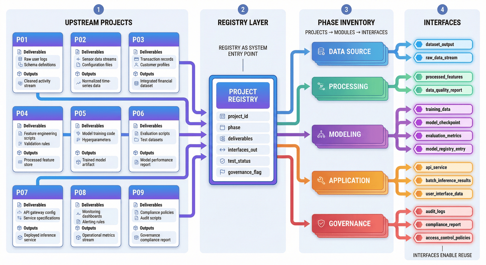
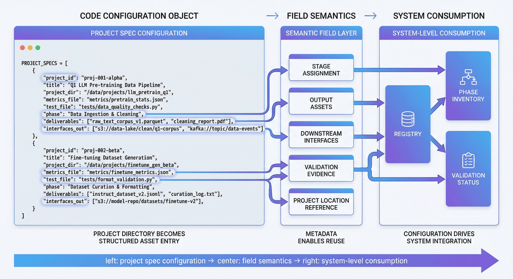
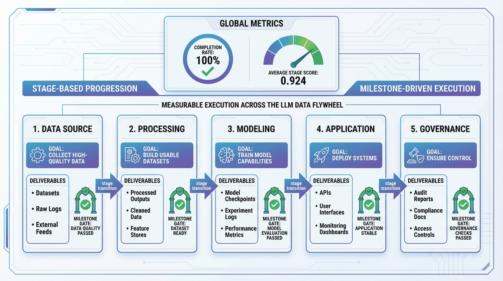
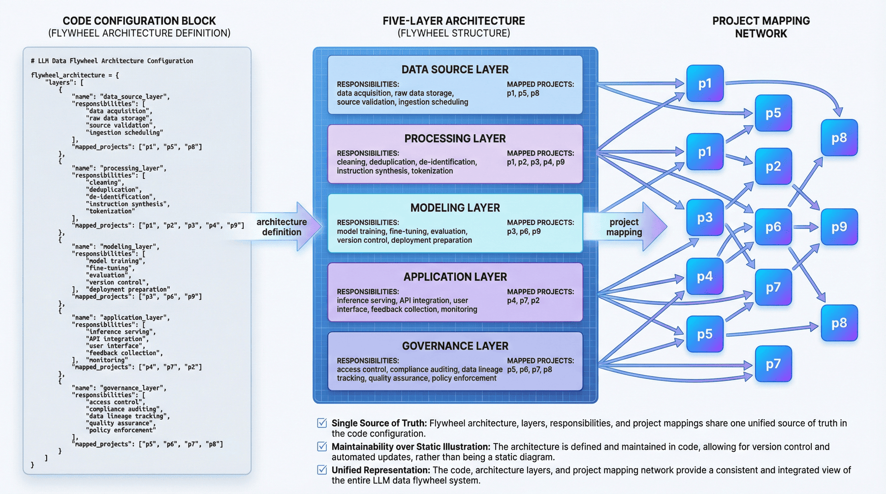
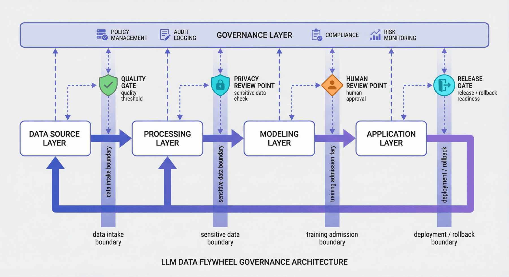
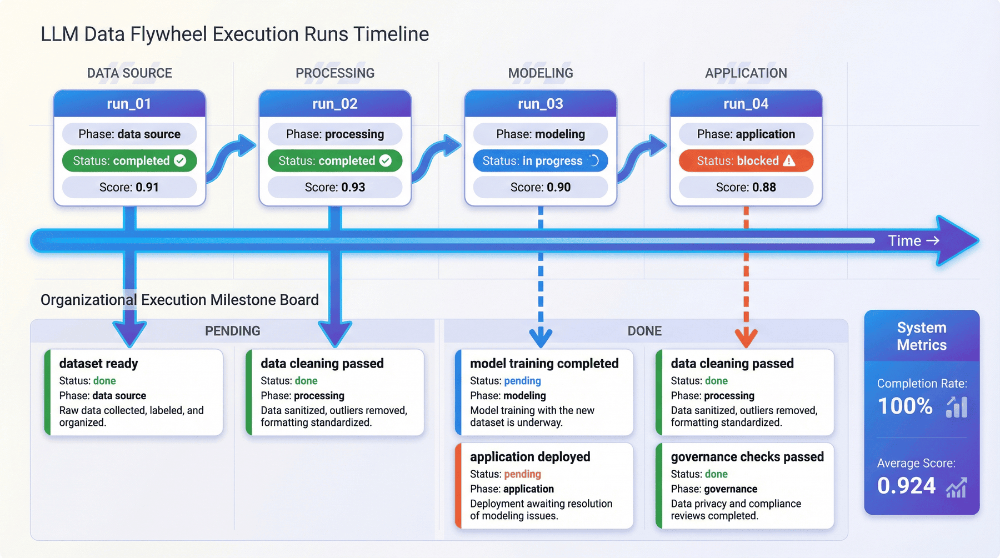
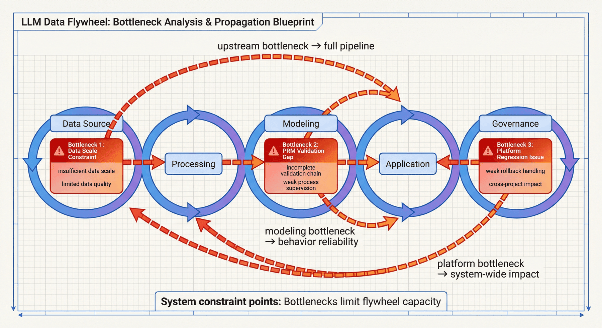
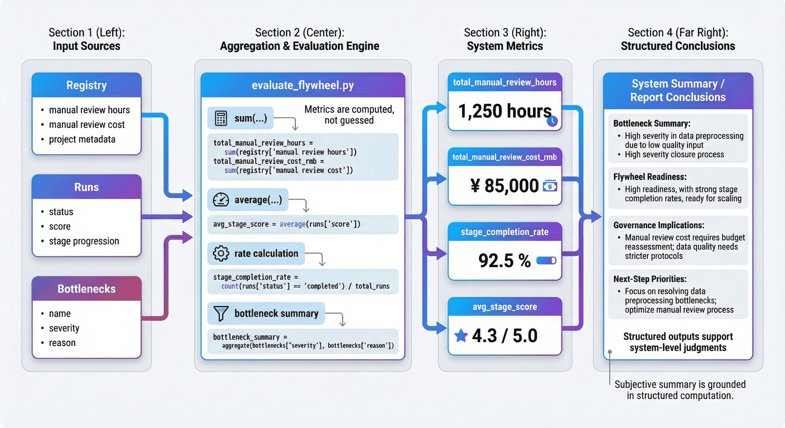

# 项目十：端到端 LLM 数据飞轮

## 摘要
P10 聚焦把数据、监督、训练、应用、平台治理和反馈回流组织成一条持续运转的端到端大语言模型（LLM）数据飞轮。章节重点不在新增单点能力，而在把第十四篇项目资产、接口、阶段和控制点整合为统一系统。随着本篇扩展到 P01-P15，P10 的出版口径应从早期“前九个项目总装”更新为“第十四篇项目总装层”，既覆盖 P01-P09 的基础数据工程，也预留 P11-P15 的开源配方、推理飞轮、多模态指令、视频生成和企业级问数能力。

本章可以按四条主线理解：

* 资产汇总与阶段规划：把 P01-P15 的产物纳入统一 registry 与阶段体系。
* 训练、应用与反馈接口：明确数据进入训练、模型进入应用、应用反馈回流上游的连接方式。
* 控制点与治理边界：把版本控制、回滚、人审、隐私隔离和异常响应写入系统结构。
* 检查验收与组织复用：通过代码、产物和检查脚本验证飞轮能否稳定运行。

如果按工程顺序阅读，本章对应的是一条完整链路：

**资产汇总 -> 阶段规划 -> 训练封装 -> 应用执行 -> 反馈回流 -> 版本治理 -> 隐私与回滚控制 -> 系统检查**

这一结构对应的核心目标，是把离散项目沉淀为一套可复盘、可检查、可扩展的大语言模型（LLM）工程飞轮。

---

## 关键词

数据飞轮；反馈回流；资产汇总；版本治理；系统验收

## 项目目标与读者收获

本项目以“端到端 LLM 数据飞轮”为核心案例，目标是把上游数据项目、反馈、评测和发布治理整合为持续改进的数据飞轮。读者完成本章后，应能够辨认该场景的关键数据对象、拆分工程链路、设置验收指标，并将案例方法迁移到相近的数据工程任务中。

## 场景约束与数据边界

强调组织级流程与资产整合，不替代单个模型训练系统或完整 MLOps 平台。这些边界使案例能够被复现和审计；当数据规模、数据来源、权限范围或部署环境变化时，需要重新评估采样策略、质量阈值、运行成本和合规要求。

## 架构决策

本项目采用“上游资产注册、阶段规划、反馈回写、评测归因、发布控制和里程碑治理”的架构路径。该决策优先保证输入输出契约、版本可追踪、异常可定位和结果可复核，而不是把全部逻辑压缩为一次性脚本运行。

## 样本 schema / 数据流

核心数据流可概括为：

Listing P10-1 给出了流程或路径示例，用于说明本节中的输入输出关系、结构约束或执行方式。
```text
项目资产 -> registry -> 阶段计划 -> 训练/评测反馈 -> 数据修订 -> 发布决策 -> 飞轮报告
```

该片段的作用是把上述流程转化为可检查的结构化表示。

样本 schema 至少应保留 `id`、`source`、`content_or_payload`、`metadata`、`quality_signals`、`split_or_stage` 与 `audit_trace` 等字段；具体字段由本项目的数据类型、下游任务和验收方式进一步细化。

## 核心实现片段

正文只保留能够说明设计取舍的关键实现片段。完整脚本、长配置、运行日志和大文件应放入配套仓库或附录说明；代码展示重点放在输入输出契约、质量阈值、异常处理和验收接口上。

## 实验或验收指标

验收指标包括资产覆盖率、反馈闭环率、版本迭代周期、评测回归定位、发布通过率和里程碑完成度。若项目进入生产、课程或公开复现实验环境，还应记录版本号、依赖环境、随机种子、样本抽检结果和失败样本复盘记录。

| 验收维度 | 指标/证据 | 出版复核口径 |
| --- | --- | --- |
| 资产整合 | 上游项目覆盖率、registry 完整性和接口映射记录 | 每个上游资产应能说明来源、责任人、版本和复用方式 |
| 反馈闭环 | 反馈回流率、评测回归定位和版本迭代周期 | 飞轮指标应说明触发动作，不能停留在仪表盘展示 |
| 组织决策 | 发布通过率、里程碑完成度和风险台账关闭率 | 跨项目风险必须有 owner、期限和复盘结果 |

*表 P10-1：LLM 数据飞轮出版验收表*

## 成本、风险与合规边界

成本主要来自跨项目治理、反馈采集和评测复跑；风险集中在归因不清、指标漂移和组织责任断点。涉及外部数据、个人信息、版权内容或第三方服务时，应保留来源说明、权限状态、脱敏策略、调用记录和人工复核记录。

## 常见失败模式

常见失败包括输入分布偏离、schema 字段缺失、质量阈值过松或过紧、评测样本覆盖不足、模型调用不稳定、结果无法回溯等。排查时应优先定位数据边界和中间产物，再检查模型、工具链与部署环境。

## 可复现资源说明

复现材料应包括数据来源说明、最小样本、配置文件、运行命令、指标脚本、检查报告和产物目录。正文保留必要片段；完整 notebook、长脚本和大文件作为配套资源独立维护。总装层需要统一记录数据集、并行处理、实验追踪和质量检查，因此可参考 Hugging Face Datasets (Hugging Face 2026)、Ray Data (Ray Project 2026)、MLflow (MLflow Authors 2026) 与 Great Expectations (Great Expectations Contributors 2026) 的工程对象；基础语料进入飞轮前，也应保留类似 C4/T5 数据处理中的来源与过滤说明 (Raffel et al. 2020)。

## 1. 项目背景：端到端大语言模型（LLM）数据飞轮的必要性

通用的大模型工程实践，在单点能力上已经积累了很多成熟方法。例如，团队知道如何做预训练语料清洗，知道如何做监督微调（SFT）样本构造，知道如何做偏好对、过程奖励模型（PRM）、检索增强生成（RAG）、Agent、平台化和隐私治理。但一旦进入真实组织环境，问题往往不在单点组件本身，而在于**这些组件之间没有被组织成一条持续运转的系统链路**。

最常见的断裂有三类。

第一类是**资产断裂**。前一个项目做出来的数据、模板和评估结果，无法被后一个项目直接消费。于是每个项目都像在“重新造轮子”。

第二类是**接口断裂**。明明上游已经有语料、标注结果或评测记录，但下游不知道该读什么文件、该信任什么字段、该继承什么版本信息。结果就是流程能跑一次，却难以稳定重跑。

第三类是**治理断裂**。很多团队愿意谈模型、谈效果、谈产品，但不愿意把版本控制、回滚机制、隐私边界、组织分工和事故响应写进系统设计。这会导致系统一旦放大，就无法稳定运转。

因此，P10 的目标是构建一个**端到端大语言模型（LLM）数据飞轮总装层**，把第十四篇 P01-P15 的产物、阶段、接口、控制点和治理机制汇总为统一的系统结构。早期代码原型中只纳入 P01-P09，可作为最小总装实现理解；当前书稿的出版叙述则应按 P01-P15 的完整项目集合解释。

这一结构面向的是持续迭代的组织级工程场景。随着语料扩展、新任务接入、模型替换、应用上线和反馈回流，真正能够被复用的不是某个单独脚本，而是这套“资产汇总—阶段规划—系统边界—治理控制—验证闭环”的系统方法。

---

## 2. 项目目标与边界

### 2.1 项目目标

本项目聚焦以下四个目标。

**目标一：把第十四篇项目整理成一张统一的系统总图。**
即把分散在不同目录、不同报告和不同任务形态中的项目产物，统一纳入一个可追踪的 registry 与阶段体系。

**目标二：建立从数据到应用再到治理的飞轮结构。**
本项目不再只看“数据做得怎么样”或“模型训得怎么样”，而是明确区分 data source、processing、modeling、application、governance 五层，让端到端系统的主干结构清楚可见。

**目标三：把接口、控制点与瓶颈显式化。**
飞轮的价值不在于画一张流程图，而在于指出哪里有控制点、哪里有系统边界、哪里是当前瓶颈、哪里需要组织协同。

**目标四：形成可检查、可复现、可交付的总装产物。**
最终输出不仅包括架构图、阶段规划和 dashboard，还包括检查脚本、测试结果和报告文件，保证代码、产物和统计结果彼此一致。

### 2.2 项目边界

为了让项目保持可复现性，本项目显式设置了若干边界。

#### 1）集成范围边界

当前飞轮聚焦已有项目产物的离线整合，而不是重新执行所有上游训练流程。早期实现以 P01-P09 为最小闭环，当前第十四篇出版口径应扩展到 P01-P15，并把 P11-P15 标记为新增配方、推理、多模态、视频和企业应用能力。这意味着它更适合作为**系统总装图与工程复盘层**，而不是在线实时生产系统本身。

#### 2）时效性边界

本项目强调的是离线流程、结构设计与交付一致性，而不是实时事件驱动的在线闭环。因此，这里展示的是“飞轮框架与方法”，而不是最终工业级在线编排平台。

#### 3）评估边界

P10 更关注跨项目整合程度、阶段完成率、控制点、瓶颈和治理结构，而不是单个模型在某个 benchmark 上的最高分数。

#### 4）组织边界

本项目已经显式纳入组织分工、共享平台收益和治理边界，但仍然属于教学型最小闭环，不应被夸大为完整企业级平台方案。

### 2.3 边界说明的作用

边界说明用于明确系统当前已经打通的范围、仍依赖的离线假设、现阶段能够支撑的结论，以及后续扩展的主要方向：

* 明确已经打通了哪些链路；
* 明确还停留在哪些离线假设；
* 明确当前结果可以支撑什么结论；
* 明确哪些部分还需要未来扩展。

对于总装层项目，这种界定直接决定章节能否作为稳定的方法资产，而不是停留在概念描述层。

---

## 3. 项目定位：P10 在能力体系中的总装层角色

如果把整条大语言模型（LLM）工程能力链看成一个系统，那么 P10 位于总装层与收束层的位置。它的作用不是补充某一项局部能力，而是把预训练、监督微调（SFT）、多模态、偏好、检索增强生成（RAG）、过程奖励模型（PRM）、Agent、平台与隐私治理组织成统一系统。

本章关注的是以下几个系统级问题：

* 单点项目如何沉淀为系统能力；
* 资产复用如何替代项目堆叠；
* 阶段规划、接口约束和治理控制如何共同构成可运行框架；
* 总装层如何通过代码、检查和报告保持一致性；
* 跨项目结果如何被收束为可复盘、可扩展的统一方法框架。

---

## 4. 整体架构：从上游项目资产到组织级飞轮总装


*图 P10-1：端到端 LLM 数据飞轮总览图*

从工程视角看，本项目可以拆成五层，而不是只看“数据输入—模型输出”这样一条线性流程。

### 4.1 第一层：数据来源层（data source layer）

这一层解决的是“系统的原料从哪里来”。它不仅包括网页或文档数据，还包括敏感数据输入、知识文档接入和原始业务材料。这一层所对应的不是单一数据集，而是整个飞轮的入口。

### 4.2 第二层：处理层（processing layer）

这一层解决的是“原料如何变成可训练、可消费、可治理的中间资产”。清洗、去重、脱敏、指令合成、课程组织等能力都位于这里。它决定飞轮进入模型层之前，数据是否已经被工程化。

### 4.3 第三层：建模层（modeling layer）

这一层解决的是“监督信号如何被组织成模型能力”。监督微调（SFT）、过程奖励模型（PRM）、Agent tool-use training、多模态训练都属于这一层。它不是单独训练一个模型，而是在组织哪些监督形式真正进入模型参数与行为模板。

### 4.4 第四层：应用层（application layer）

这一层解决的是“模型能力如何进入真实任务执行”。检索增强生成（RAG）服务、Agent 执行和反馈回收都位于这里。没有应用层，飞轮只能停留在训练闭环，而无法形成业务反馈。

### 4.5 第五层：治理层（governance layer）

这一层解决的是“系统如何长期可控”。版本管理、谱系追踪、回滚机制、隐私控制、审计和事故响应都位于这里。很多团队把治理写成附录，但在飞轮中，治理本身就是主结构之一。

### 4.6 五层结构的工程作用

因为它把“飞轮”从抽象概念变成了可讨论的工程对象。团队不再只是说“我们有数据、有模型、有应用”，而是能够明确：

* 哪一层承接哪类项目；
* 哪些接口跨层传递；
* 哪些边界必须单独控制；
* 哪些问题不能在单层内部解决。

---

## 5. 上游项目汇总：registry 作为系统入口

飞轮的复用能力首先建立在 registry 之上。registry 负责明确上游项目清单、阶段归属、输出资产和下游接口，把分散项目转化为可追踪、可组合的系统资产。

P10 的 registry 应按照第十四篇 P01-P15 的完整目录维护。早期实现已经把 P01-P09 统一纳入汇总体系，形成项目 registry 与 phase inventory；当前书稿中，需要把 P10-P15 作为新增总装对象继续补入。当前出版口径包括：

* 应纳入项目 `15` 个；
* 已规划阶段 `5` 个；
* 已汇总接口至少覆盖数据、训练、应用、治理、推理、多模态、视频和企业问数等能力面。

这些统计反映的不是数量本身，而是系统已经具备跨项目资产登记、阶段划分和接口暴露能力，为后续复用、阶段规划和治理控制提供统一入口。

### 5.1 registry 不应停留在项目名称

如果 registry 里只有项目名称，那么它依然只是一个目录索引，而不是系统接口层。真正有价值的 registry，至少应该回答：

* 项目属于哪个阶段；
* 产出哪些 deliverables；
* 对下游暴露哪些 interfaces_out；
* 这些结果是否通过测试；
* 是否需要额外人审与治理控制。

### 5.2 registry 作为系统起点

飞轮并不会自动形成。它需要先把零散资产定义为可继承、可追踪、可复用的系统对象。registry 的作用在于：

* 它把离散项目变成了可组合模块；
* 它为阶段规划提供输入；
* 它为后续架构映射和瓶颈识别提供依据；
* 它为组织层复盘提供统一语言。


*图 P10-2：上游项目 registry 与接口映射图*

---

## 6. 代码展开一：汇总上游项目资产

`src/collect_upstream_projects.py` 负责汇总上游项目资产，并将项目信息整理为统一规格。

Listing P10-2 保留出版稿中的关键结构。完整项目清单、指标文件路径和接口字段应维护在配套资源的 `src/collect_upstream_projects.py` 中，正文只展示支撑飞轮装配的最小数据模型。
```python
PROJECT_SPECS = [
    {
        "project_id": "p1",
        "phase": "acquisition",
        "interfaces_out": ["foundation_corpus", "training_manifest"],
    },
    {
        "project_id": "p2",
        "phase": "alignment",
        "interfaces_out": ["sft_corpus", "preference_data"],
    },
    {
        "project_id": "p10",
        "phase": "governance",
        "interfaces_out": ["project_registry", "release_gate", "feedback_routing"],
        "registry_role": "assembly_layer",
    },
    {
        "project_id": "p11",
        "phase": "foundation_recipe",
        "interfaces_out": ["pretraining_recipe", "tokenizer_artifact", "packed_training_data"],
    },
    # P12-P15 follow the same schema in the accompanying project script.
]
```

该片段的作用是把上述流程转化为可检查的结构化表示。

这段结构反映了上游资产汇总的几个基本要求：

* 上游项目必须被显式建模；
* 项目元信息必须包含阶段与接口；
* “项目存在”不等于“项目可被下游消费”；
* 飞轮的第一步，是把项目目录变成结构化资产目录。

### 6.1 registry 的结构化汇总方式

这种结构化表达把项目汇总落实为可复制的方法。后续其他总装层项目也可以沿用同样方式，将已有项目逐个纳入统一 registry，而不必依赖手工整理。


*图 P10-3：上游项目结构化配置示意图*

---

## 7. 阶段规划：五阶段推进结构

系统闭环通常会被简化为一条线性流程：原始数据 → 清洗 → 训练 → 上线 → 反馈。这样的表达能够说明顺序，但无法说明**各环节属于哪个阶段、由谁负责，以及通过什么里程碑进入下一段**。

P10 的价值之一，就是把飞轮拆成了更清晰的阶段体系。当前结果显示，整条飞轮共包含 `5` 个阶段，并且当前阶段完成率达到 `100.00%`，平均阶段评分为 `0.924`。这些结果说明飞轮并不只是概念设计，而是已经形成了一套可度量的阶段主线。

### 7.1 阶段化与流水线化的区别

因为流水线强调顺序，而阶段化强调：

* 当前目标是什么；
* 阶段输出是什么；
* 进入下一阶段的门槛是什么；
* 哪些资源和团队在这一段承担主责。

### 7.2 阶段规划在总装层中的作用

阶段规划把飞轮从单纯的连通关系扩展为可推进、可复盘、可治理的组织结构。这里真正重要的，是把可迁移的推进方法明确下来，而不是停留在静态示意图层面。


*图 P10-4：五阶段推进与里程碑关系图*

---

## 8. 代码展开二：构建飞轮架构与阶段规划

`src/build_flywheel.py` 负责把第十四篇项目映射到飞轮结构中。早期最小实现只覆盖 P01-P09；当前出版口径应把 P10-P15 继续映射到 governance、foundation recipe、reasoning、multimodal instruction、generative media 和 enterprise application 等阶段。

Listing P10-3 保留层级映射的核心骨架。完整实现可在配套资源的 `src/build_flywheel.py` 中维护，并随项目清单增减同步更新。
```python
def build_architecture(registry: list[dict]) -> dict:
    return {
        "layers": [
            {
                "name": "data_source_layer",
                "responsibilities": ["web/data ingestion", "document intake"],
                "mapped_projects": ["p1", "p5", "p9", "p11", "p14"],
            },
            {
                "name": "processing_layer",
                "responsibilities": ["cleaning", "dedup", "instruction synthesis"],
                "mapped_projects": ["p1", "p2", "p3", "p4", "p9", "p11", "p13", "p14"],
            },
            {
                "name": "application_layer",
                "responsibilities": ["RAG service", "agent execution", "semantic BI", "feedback collection"],
                "mapped_projects": ["p5", "p7", "p10", "p15"],
            },
            {
                "name": "governance_layer",
                "responsibilities": ["release gates", "privacy controls", "rollback", "cross-project registry"],
                "mapped_projects": ["p8", "p9", "p10"],
            },
        ]
    }
```

该片段的作用是把上述流程转化为可检查的结构化表示。

这段结构说明，飞轮依赖显式映射来维持一致性。项目与层级被写入数据结构后，报告、检查、dashboard 和治理分析都可以围绕同一套映射展开。

### 8.1 架构需要结构化表达

因为只写在图里的架构，很难验证，也很难维护。一旦项目新增、阶段变更或治理边界调整，如果底层没有结构化表示，所有图和说明都会很快过时。

### 8.2 从代码角度理解飞轮结构

从代码角度看，飞轮不是一个抽象名词，而是一组：

* 层级定义；
* 职责说明；
* 项目映射；
* 阶段产物；
* 运行记录；
* 里程碑与控制点。

这种表达方式，才真正让飞轮具备工程可维护性。


*图 P10-5：飞轮五层结构代码映射图*

---

## 9. 系统边界与控制点

跨项目、跨阶段、跨团队系统的可控性，取决于边界和控制点是否被显式建模。飞轮一旦进入真实组织环境，决定系统稳定性的往往正是那些**不能被直接穿透的边界**。

P10 当前结果显示，飞轮架构包含 `5` 层、`4` 个控制点和 `4` 条治理边界。这说明项目不仅描述了数据流动路径，也把需要拦截、审查、记录和治理的位置一并纳入系统设计。

### 9.1 什么是控制点

控制点可以理解为飞轮中的“阀门”。在这些位置，系统不能只凭自动流转继续向前，而必须触发额外判断，例如：

* 是否通过质量门槛；
* 是否涉及敏感信息；
* 是否需要人工审核；
* 是否允许进入下游训练或上线。

### 9.2 治理边界需要显式建模

因为很多事故都不是发生在模型推理时，而是发生在数据进入系统之前、跨阶段交接时、上线回滚时或日志审计中。飞轮越完整，越需要边界治理，而不是越可以忽略治理。

### 9.3 控制点的工程作用

控制点的存在说明，飞轮并不追求无差别加速，而是为不同环节配置不同的流转速度、审查要求和可追踪性。


*图 P10-6：系统边界与控制点示意图*

---

## 10. 运行记录与里程碑

系统项目如果只有最终报告，就缺少时间维度。真实工程通常按阶段推进、按节点完成，并通过里程碑逐步收敛。因此，P10 除了总报告，还保留了 flywheel runs 和 milestone board。

### 10.1 运行记录的作用

运行记录让系统具备时间维度，不仅可以看到最终状态，还可以追踪：

* 飞轮经历了哪些阶段；
* 每个阶段的状态和评分如何；
* 哪些里程碑已经完成；
* 哪些地方曾经存在阻塞或风险。

### 10.2 里程碑作为组织层接口

对工程师来说，阶段计划可能已经足够；但对管理者、评审和跨团队协作方来说，milestone 往往是更容易沟通的对象。它把复杂技术过程转换成更可执行的组织节奏。


*图 P10-7：运行记录与里程碑板示意图*

---

## 11. 指标解读：系统级信号的含义

P10 当前给出的关键结果包括：

* 当前出版口径应纳入项目 `15` 个；
* 已规划阶段 `5` 个；
* 已汇总接口 `17` 个；
* 上游检查通过 `103/103`；
* 飞轮架构 `5` 层；
* 控制点 `4` 个；
* 治理边界 `4` 条；
* 阶段完成率 `100.00%`；
* 平均阶段评分 `0.924`；
* 当前主要瓶颈 `3` 项。

这些数字主要反映三个系统层面的结论。

第一，早期 P01-P09 最小闭环已经达到可被纳入总装层的状态。`103/103` 的上游检查通过结果说明，基础项目当前处于可集成状态；在第十四篇扩展到 P15 后，还需要把 P11-P15 的配方、推理、多模态、视频和企业应用产物补入同一 registry，并为新增项目建立同等检查口径。

第二，飞轮结构已经不只是“有很多项目”，而是形成了分层结构、阶段设计和治理边界，这让它开始具备系统级可讨论性。

第三，P10 已经开始识别系统瓶颈。总装层的价值不在于证明系统已经完美，而在于为下一轮优化提供清晰的优先级。

### 11.1 系统指标与单项模型指标的区别

单项模型指标通常回答“模型效果怎样”；而系统指标回答的是：

* 项目之间能否整合；
* 阶段是否闭环；
* 治理是否完整；
* 哪些地方会限制下一轮扩展。

P10 的独特之处，在于它衡量的不是局部最优，而是一条工程链是否已经具备闭环能力。

---

## 12. 瓶颈分析：飞轮连通后的关键约束

系统链路连通并不等于系统已经成熟。P10 明确列出了当前主要瓶颈，用于说明飞轮的完成度、约束条件和下一阶段投入重点。

当前项目识别出的三个主要瓶颈包括：

* 基础语料规模约束；
* PRM 验证 gap；
* 平台回归处理问题。

### 12.1 基础语料规模约束

飞轮并不是只靠后端监督或应用反馈就能自动变强。上游基础语料的规模与质量，依然决定整个系统的地基是否足够稳。如果基础层过薄，下游很多能力扩展都会受到限制。

### 12.2 PRM 验证 gap

因为推理与过程监督是很多 LLM 系统逐步成熟的重要部分。如果验证链条本身还不够稳定，那么下游模型即使表现不错，也可能缺少足够强的可解释与可审计支撑。

### 12.3 平台回归对飞轮的影响

飞轮一旦形成，就意味着多个项目共享平台和流程。此时任何平台回归，都不再只是局部问题，而会影响多个下游环节。因此，平台治理在飞轮里不是配套项，而是核心稳定器。

### 12.4 把瓶颈纳入主体的必要性

瓶颈分析用于说明三件事：

* 系统当前已经达到的完成度；
* 仍未解决的关键问题；
* 下一轮优化最值得投入的方向。


*图 P10-8：飞轮瓶颈定位图*

---

## 13. 成本与共享收益

系统级复用既带来共享收益，也引入额外集成成本。P10 当前估算结果显示，跨项目人工复核工时约为 `8.06` 小时，对应成本约 `850.33` 元。这说明飞轮已经开始把共享成本显式化，而不是默认整合为零成本。

### 13.1 总装层的集成成本

飞轮并不是自动复用机制。上游项目要被整理成可集成状态，通常需要：

* 统一接口；
* 汇总元信息；
* 对齐检查结果；
* 生成新一层报告与 dashboard；
* 在必要时重新做人审与复核。

### 13.2 共享平台收益体现在哪里

从源码逻辑看，P10 不只是计算了人工复核成本，也显式给出了共享平台收益和复用示例，例如语料与 manifest 的多项目复用、推理反馈与工具模板的复用、P8/P9 的集中治理收益等。这种写法把“飞轮能带来什么”从抽象口号变成了具体收益项。

---

## 14. 代码展开三：在评估脚本中生成系统级指标

`src/evaluate_flywheel.py` 负责把散落在多份产物中的结果收束成系统级指标与总报告。

Listing P10-4 给出了 Python 实现片段，用于说明本节中的输入输出关系、结构约束或执行方式。
```python
total_manual_review_hours = round(sum(item["estimated_manual_review_hours"] for item in registry), 2)
total_manual_review_cost_rmb = round(sum(item["estimated_manual_review_cost_rmb"] for item in registry), 2)
stage_completion_rate = round(sum(item["status"] == "completed" for item in runs) / max(1, len(runs)), 4)
avg_stage_score = round(sum(item["score"] for item in runs) / max(1, len(runs)), 4)

bottlenecks = [
    {"name": "foundation_corpus_scale", "severity": "medium", "reason": "P1 final retention is only 17.37%, limiting base corpus growth."},
    {"name": "prm_validation_gap", "severity": "medium", "reason": "P6 validation pass rate is 0.6759, leaving room for stronger trace verification."},
    {"name": "platform_regression_handling", "severity": "low", "reason": "P8 still observed one regressed run and one failed run, so release gates should stay strict."},
]
```

该片段的作用是把上述流程转化为可检查的结构化表示。

这段计算逻辑把系统级判断落实为结构化指标与结构化结论。报告中的主要结论由 registry、runs 和其他中间产物共同支撑，而不是来自主观归纳。

### 14.1 系统级指标的计算基础

这里的关键点在于两个维度同时成立：

* 正文需要解释系统级指标的工程意义；
* 这些结论需要由结构化计算过程支撑。

因此，这段代码承担的是从指标生成到结果解读的连接作用。


*图 P10-9：系统级指标生成逻辑图*

---

## 15. 验证闭环：一致性检查机制

总装层项目是否成熟，不能只看是否输出了报告，还要看是否建立了一致性验证机制。否则，就会出现说明和图示已经完成，而底层产物并不一致的情况。

P10 当前检查结果为：

* 总检查项：`13`
* 通过检查项：`13`
* 总体状态：`PASS`。

同时，验证覆盖包括：

* 命令级检查项 `2` 个；
* 数据/产物级检查项 `11` 个；
* 命令级覆盖 `py_compile, evaluate_flywheel`；
* 数据级覆盖 `required_files_exist`、`all_upstream_projects_registered`、`phase_inventory_consistent`、`architecture_layers_and_control_points_present`、`stage_plan_covers_end_to_end`、`flywheel_runs_complete` 等关键项目。

### 15.1 系统项目的检查脚本

因为系统项目最容易发生“局部都对、整体不通”的问题。例如：

* 某个 JSON 文件存在，但字段已经和报告不一致；
* 某个阶段计划写得很好，但 milestone 没有同步更新；
* 代码能运行，但总报告仍引用旧数据；
* 项目已经补充了治理边界，但检查项并未覆盖。

### 15.2 PASS 的工程含义

PASS 说明 P10 当前已经具备代码、产物、统计和报告相互对齐的最小闭环。对于总装层项目，这意味着章节并非停留在文档整理，而是建立了重组、验证与再表达的一致性链路。

---

## 16. 代码展开四：将检查机制写成工程契约

P10 的 `src/run_p10_checks.py` 脚本，把总装层的验收规则写成了可执行工程契约。

Listing P10-5 给出了 Python 实现片段，用于说明本节中的输入输出关系、结构约束或执行方式。
```python
def run_command(command: list[str], name: str) -> dict:
    result = subprocess.run(command, capture_output=True, text=True)
    return {
        "name": name,
        "command": command,
        "returncode": result.returncode,
        "passed": result.returncode == 0,
        "stdout": result.stdout.strip(),
        "stderr": result.stderr.strip(),
    }
```

该片段的作用是把上述流程转化为可检查的结构化表示。

这段结构体现了检查机制的几个基本要求：

* 命令执行结果要被结构化记录；
* 检查结果不能只看终端输出；
* 通过与失败都要能进入后续报告；
* 系统状态必须可追踪、可复核。

再往下看，主函数还会读取 registry、architecture、boundaries、stage_plan、runs、metrics 和 dashboard 等多类产物。这说明检查并不是针对单个文件，而是针对总装层一致性的检查。

### 16.1 工程契约在总装层中的位置

这一节说明，P10 并不止于汇总上游项目，还把总装层自身纳入了工程质量管理。对于整章来说，这一部分承担的是把系统整合与质量契约连接起来的作用。


*图 P10-10：检查脚本与系统契约图*

---

## 17. 主要交付物：系统交付清单

对于系统总装项目，交付物清单是判断系统是否完成结构化落地的重要依据。P10 当前已经形成了较完整的交付清单，包括：

* `data/processed/upstream_project_registry.json`
* `data/processed/phase_inventory.json`
* `data/processed/flywheel_architecture.json`
* `data/processed/system_boundaries.json`
* `data/processed/stage_plan.json`
* `data/processed/flywheel_runs.jsonl`
* `data/processed/bottleneck_analysis.json`
* `data/processed/cost_model.json`
* `data/processed/org_operating_model.json`
* `data/console/milestone_board.json`
* `data/console/executive_dashboard.json`
* `data/reports/p10_metrics.json`
* `data/reports/p10_report.md`
* `data/reports/p10_test_results.json`
* `data/reports/p10_test_report.md`。

### 17.1 交付物清单的作用

这组交付物说明总装层已经沉淀为一套可复核的具体资产，并分别服务于不同角色：

* 工程师看 processed 数据；
* 项目经理看 milestone 与 dashboard；
* 评审看 report 与 metrics；
* QA 或平台角色看 test_results 与 test_report。

### 17.2 与普通项目清单的区别

普通项目清单往往只列出“代码、报告、图表”。P10 的清单更接近系统接口目录，说明不同层面的信息已经被拆分、组织并对外暴露。

---

## 18. 组织与协同：总装层的职责接口

前面很多章节更偏向单一能力模块，而 P10 天然要求跨项目、跨阶段、跨角色协同。总装层的稳定性不仅依赖代码实现，也依赖职责接口是否清晰。

### 18.1 总装层涉及的关键职责面

从 P10 的结构看，至少包括以下几类角色：

* 上游项目负责人：保证各自项目产物、指标和测试状态可供总装层消费；
* 数据/训练工程角色：理解各类输入输出接口，保证 processed 资产可被复用；
* 平台角色：负责 dashboard、版本、回滚与运行治理；
* 隐私/治理角色：确保敏感数据、审计与边界控制被显式纳入飞轮；
* 评审或项目管理角色：基于里程碑和阶段计划做跨团队复盘。

### 18.2 协同结构的必要性

很多团队在第一次搭建系统飞轮时，问题并不出在实现能力，而是出在协同结构本身：

* 没有人负责总装层；
* 没有人统一维护 registry；
* 没有人定义跨阶段接口；
* 没有人把治理要求写成工程对象；
* 所有信息都散落在口头沟通里。

因此，飞轮首先是一种组织化工程结构，其次才是一组脚本。

---

## 19. 管理视图：executive dashboard

如果说 processed 目录和检查脚本服务于工程侧，那么 executive dashboard 更偏向组织侧。它的作用在于把复杂的跨项目状态压缩为可快速理解的控制面板。

### 19.1 dashboard 在飞轮中解决什么问题

它解决的是下面这些问题：

* 当前飞轮整体是否健康；
* 哪些阶段已经完成；
* 哪些瓶颈最值得优先处理；
* 是否存在跨项目回归风险；
* 共享平台和治理层是否发挥作用。

### 19.2 dashboard 的系统角色

因为飞轮一旦进入组织级视角，就不可能只靠工程师自己读 JSON 文件来运转。总会有更多角色需要一眼看懂系统状态。dashboard 的价值，就在于为总装层提供统一可视化入口。

---

## 20. 局限与风险

P10 当前已经形成了较完整的系统结构，但它依然有非常明确的局限。

首先，它高度依赖第十四篇各项目的报告准确性和产物完整性。如果上游项目本身统计有误、字段失真或测试不完整，那么 P10 再完整，也只能在错误输入上进行结构化整合。随着 P11-P15 加入，registry 还要额外记录模型配方、推理轨迹、多模态样本、视频片段和 DataAgent 服务资产，否则总装层会继续停留在 P01-P09 的旧边界内。

其次，当前识别出的瓶颈仍主要集中在基础语料规模、PRM 验证质量和平台回归控制上。这说明飞轮虽然已经形成，但还没有完全进入“高频自增强”状态。

最后，这仍然是一张**离线系统设计图**。它距离真实在线飞轮，还存在监控、实验反馈、在线策略切换、用户行为采集和自动预算控制等工程差距。

### 20.1 局限说明的作用

局限说明的意义，在于帮助界定当前系统的完成度与后续扩展方向：

* 什么已经验证；
* 什么仍在过渡态；
* 下一阶段最可能补齐哪些环节。

---

## 21. 向在线飞轮扩展：下一阶段的重点

P10 已经给出了几条清晰的后续扩展方向，包括：

* 把更多在线反馈、A/B 实验和成本预算纳入飞轮；
* 继续强化跨团队阶段复盘、治理节奏和接口契约；
* 把 executive dashboard 从静态报告推进到持续更新的控制面板。

### 21.1 在线反馈回流

因为只有当应用层反馈真正回流到数据与训练层，飞轮才会从“静态闭环”进入“动态闭环”。这一步会显著提升系统的现实价值，但也会增加治理复杂度。

### 21.2 A/B 实验与预算控制的预留

因为很多团队等到系统已经很大时才开始补这两块，代价往往更高。把它们提前作为扩展方向写进来，有助于在设计早期就预留这些位置。

---

## 22. 本章在全书中的收束作用

P10 位于全书后段，其作用在于对前面项目进行系统级收束。

前面的项目分别处理：

* 某一类数据的生产方式；
* 某一类监督的构造方法；
* 某一类应用的承接路径；
* 某一类平台与治理机制的落地方式。

而 P10 处理的是这些能力之间的系统级组织关系：

* 各类能力如何被组织成一条可复用的系统链；
* 组织能力如何在单点能力之上形成稳定结构；
* 章节之间如何从并列关系转为前后依赖、相互解释的整体体系。

因此，P10 的作用不在于增加新的局部能力，而在于把前面项目从并列集合组织成结构完整的方法体系。

---

## 23. 主要交付物清单与代码索引

### 23.1 主要文档与报告

* `p10_report.md`
* `p10_metrics.json`
* `p10_test_report.md`
* `p10_test_results.json`

### 23.2 主要处理中间产物

* `upstream_project_registry.json`
* `phase_inventory.json`
* `flywheel_architecture.json`
* `system_boundaries.json`
* `stage_plan.json`
* `flywheel_runs.jsonl`
* `bottleneck_analysis.json`
* `cost_model.json`
* `org_operating_model.json`

### 23.3 主要控制台产物

* `milestone_board.json`
* `executive_dashboard.json`

### 23.4 主要源码索引

* `src/collect_upstream_projects.py`
* `src/build_flywheel.py`
* `src/evaluate_flywheel.py`
* `src/run_p10_checks.py`
* `src/pipeline_utils.py`

### 23.5 交付物与代码索引的用途

这里的目标，是让读者明确：

* 应该去看哪些文件；
* 哪些代码对应哪些章节逻辑；
* 哪些产物可以拿来复核；
* 哪些结构可以复用到自己的项目里。

---

## 24. 结语：持续性比速度更重要

“数据飞轮”通常会让人联想到增长、自动化和不断加速。但从工程角度看，飞轮更核心的价值在于**持续性**。

它体现的是以下几项系统能力：

* 项目成果能够在后续项目中持续保留与复用；
* 数据、模型、应用和治理不再彼此割裂；
* 系统可以在多轮迭代中保留结构、边界和记忆；
* 组织能够从项目堆叠转向能力体系建设。

P10 的价值并不只是总结前面若干项目，而是把第十四篇 P01-P15 重新组织为一条可解释、可检查、可扩展的端到端系统链。这也是本章最重要的工程意义。

---

## 专题：飞轮中的反馈回流设计

飞轮之所以叫“飞轮”，关键不在于它覆盖了很多层，而在于它能够形成回流。如果只有数据进入模型、模型进入应用、应用产生结果，却没有把结果重新组织成下一轮数据与治理输入，那么系统本质上仍然是一次性的线性流水线。

### 一、反馈不只是用户点赞或差评

很多团队在谈反馈回流时，第一反应是收集用户满意度。但对 LLM 系统来说，真正有价值的反馈远不止这一类。更完整的反馈通常至少包括：

* 应用层的失败问答、拒答、幻觉和检索误召回；
* Agent 执行中的工具调用失败、记忆漂移和恢复轨迹；
* 多模态 RAG 中的证据页缺失、图表误读和跨页整合错误；
* 人工评测中的偏好对、打分记录和修正意见；
* 隐私治理中的阻断事件、脱敏缺口和审计告警；
* 平台层的回归实验、rollback、incident review 和例外审批记录。

这些反馈共同组成了一套“系统行为证据”。如果只保留最后一层的用户满意度，团队能够看到症状，却无法知道症状来自哪一层。

### 二、反馈事件需要统一 schema

飞轮要形成真正可复用的回流能力，反馈必须先被统一成结构化事件，而不能只停留在聊天记录、表格备注或零散 issue 里。一个可用的反馈事件，通常至少要包含：

* 反馈来源，说明它来自应用、评测、平台、治理还是人工校验；
* 关联项目和阶段，说明它更接近 P02、P05、P07、P08 还是 P09 一类问题；
* 失败类型或改进类型，区分是数据缺口、检索缺口、模型缺口还是流程缺口；
* 影响范围，说明问题影响的是单条样本、某类任务、某个项目还是整条系统链；
* 建议动作，说明反馈最终应进入哪一类返工或优化队列。

只有当这些字段被显式保留，反馈才真正能被下游流程消费。否则再多反馈也只能作为经验存在，而不能进入飞轮。

### 三、回流的关键不是“自动”，而是“可分流”

飞轮设计里一个常见误区，是过早追求“全自动反馈回流”。但在大多数团队的实际阶段，更重要的是先做到“可分流”，也就是能把反馈可靠地送到正确的上游项目，而不是让所有问题都重新回到总装层。

例如：

* 如果问题主要来自法律问答的风险拒答不足，它应优先进入 P02 类 SFT 与偏好数据补强；
* 如果问题来自图表误读或目录页误召回，它应回到 P05 类多模态 RAG 评测与检索优化；
* 如果问题来自工具调用轨迹混乱，它更可能属于 P07 的 Agent Tool-use 训练改造；
* 如果问题来自回归实验和版本失控，它更应由 P08 的平台治理对象承接；
* 如果问题来自隐私边界触发与数据拦截，则应由 P09 的隐私流程升级优先吸收。

从系统角度看，分流能力比自动化本身更重要。因为只要分流做对了，哪怕后面仍需要人工介入，飞轮也已经形成正确方向；反过来，如果自动化很强但分流总是错，系统只会更快地把问题送到错误位置。

### 四、反馈回流如何进入下一轮版本

反馈事件形成之后，还需要一个能进入版本周期的闭环。比较成熟的做法通常包括以下四步：

* 先做聚类，把零散事件聚成若干高频问题主题；
* 再做优先级排序，区分必须立即阻断的问题和可以排期优化的问题；
* 然后映射到具体项目与阶段，生成下一轮版本待办；
* 最后在下一次总装评审时复盘“哪些反馈已被吸收、哪些仍在排队、哪些已确认不处理”。

这样设计的价值，是让反馈不再只是情绪性或偶发性输入，而是稳定进入版本推进节奏。飞轮真正需要的，不是“反馈越来越多”，而是“反馈越来越有处可去”。

---

## 专题：预算、优先级与投资回报

P10 这种总装层项目还有一个很现实的问题，就是它会同时暴露很多值得做的事情。既然上游九个项目都能提供扩展方向，团队就必须回答：在资源有限的情况下，下一步先投什么，为什么先投它。

### 一、优先级判断不应只看单点效果

在飞轮体系里，一个看似局部的小改动，可能会带来很大的系统收益；反过来，一个看起来“很强”的单点项目，如果无法被其他层复用，整体收益可能并不高。因此，优先级判断至少要同时考虑四个维度：

* 影响范围，某项改动影响单一模块，还是能改善多个下游环节；
* 可复用性，改动形成的是一次性成果，还是长期可复用的系统资产；
* 风险暴露度，当前问题是否已经频繁出现在核心链路上；
* 落地成本，团队是否具备当前阶段足够的实现与维护能力。

把这四个维度放在一起看，很多决策就会更清楚。例如，补齐统一反馈 schema 可能看起来没有训练一个新模型那么“显眼”，但它对整个飞轮的可持续性价值可能更大。

### 二、系统项目更适合看“杠杆率”

对于总装层，最值得优先推进的事情，通常不是单次收益最高的，而是杠杆率最高的。所谓杠杆率，可以简单理解为：一项投入是否能够同时降低多个项目的重复成本、沟通成本和回归成本。

从当前飞轮结构看，往往具备高杠杆率的方向包括：

* 统一 registry 和接口契约，减少上游项目接入成本；
* 强化评测门禁和质量基线，减少错误版本进入系统的概率；
* 补齐反馈回流与分流机制，减少问题在总装层堆积；
* 完善 dashboard 与里程碑机制，降低组织协作的不确定性；
* 强化平台治理与 rollback 机制，降低飞轮放大后的恢复成本。

这些动作未必最“炫”，但往往最能决定飞轮能不能真正稳定转起来。

### 三、预算分配应同时覆盖增长项与防守项

总装层最容易出现的一种偏差，是把预算都投向增长项，例如更多数据、更大模型、更多功能，而低估防守项的重要性。事实上，飞轮越往后期走，防守项的价值越大，因为它们决定系统是否还能在扩张中保持可控。

一个更平衡的预算视角通常需要同时覆盖：

* 增长项，例如新数据源、新任务形态、新应用链路；
* 提效项，例如接口统一、自动检查、批量评测和流水线优化；
* 防守项，例如隐私治理、审计、rollback、事故复盘与质量门禁；
* 组织项，例如 dashboard、里程碑、跨团队协议和版本评审机制。

如果预算长期只投增长项，飞轮会看起来越来越快，但内部摩擦和隐藏风险也会越来越高；如果预算长期只投防守项，系统又可能陷入保守、难以形成外部价值。因此，总装层真正需要的是平衡，而不是单边拉满。

### 四、投资回报要看“系统记忆”是否积累

单个项目的回报通常可以看得比较直接，比如样本更多了、准确率更高了、延迟更低了。但飞轮型项目有一项更关键、也更容易被忽略的回报，就是系统记忆是否在积累。

所谓系统记忆，指的是这些东西是否越来越多地被沉淀下来并能被下一轮直接复用：

* 哪类资产进入 registry；
* 哪类失败会被自动识别；
* 哪些控制点已经被写入治理边界；
* 哪些问题能够通过 dashboard 和检查脚本快速暴露；
* 哪些团队协作模式已经变成固定节奏。

只要这些记忆在持续积累，飞轮的 ROI 就不应只用短期效果来评判。因为它建设的是“以后每一轮都能少走多少弯路”的能力。

---

## 专题：总装层年度推进路线

P10 当前展示的是一个离线、教学型、但结构已经比较完整的飞轮总装层。若把它进一步推进到更成熟的组织实践中，一个比较务实的年度推进路线，通常可以按“先统一、再门禁、后在线”的节奏展开。

### 一、第一阶段：统一资产与契约

年度的起点通常不应是扩更多功能，而应是先把总装层最基础的接口统一起来。这个阶段的重点包括：

* 统一上游项目的 registry 字段；
* 统一 metrics、test results 和 report 的最小接口；
* 统一 processed 资产的命名、版本和来源记录；
* 统一跨项目阶段划分和交付清单。

这一阶段做完之后，飞轮最大的收益不是“更智能”，而是“更清楚”。所有项目开始用相近的方式被总装层消费，后续自动检查、里程碑看板和反馈回流才会有共同基础。

### 二、第二阶段：补齐质量门禁与治理控制

当资产与契约基本统一后，下一步应优先补齐门禁和治理，而不是立即转向复杂在线化。因为没有门禁的飞轮，只会把更多不稳定内容更快地放大出去。

这一阶段可以重点推进：

* 关键阶段的质量基线定义；
* 发布前检查脚本与审批规则；
* rollback 条件与 incident review 触发机制；
* 隐私与合规控制点的前置化。

这一步的目标，是让飞轮从“连起来了”升级为“连起来之后也可控”。

### 三、第三阶段：引入在线反馈与实验机制

在前两个阶段相对稳固之后，飞轮才适合引入更多在线化元素。例如：

* 应用层用户反馈回收；
* A/B 实验结果沉淀；
* 运行时预算与资源消耗监控；
* 高频问题自动聚类与回流；
* 面向总装层的持续更新 dashboard。

在线化的难点不在于采集数据，而在于让这些数据能以工程化方式回到上游项目。也正因此，在线化更适合作为第三阶段，而不是第一阶段。

### 四、第四阶段：形成跨团队稳定运营

当系统已经具备统一接口、质量门禁和在线反馈后，飞轮就可以进一步进入跨团队稳定运营阶段。这一阶段的关键不是技术复杂度，而是组织可持续性，包括：

* 固定的阶段评审与里程碑机制；
* 清晰的总装层 owner 与上游对接人；
* 面向业务、治理和工程三类角色的不同 dashboard；
* 明确的预算评审、优先级评审和复盘节奏；
* 可持续维护的文档、报告与知识库。

如果这一步走通，飞轮就不再只是一本书中的案例，而会逐渐具备进入真实组织实践的形态。它未必一步到位成为企业级平台，但已经具备从项目集合演化为系统能力的基本条件。

---

## 专题：飞轮总装的风险台账与季度复盘

P10 作为总装层，还有一个特别值得补出来的工程动作，就是风险台账。因为总装层最容易出现的假象，是“所有项目都在推进，所以系统也在推进”。但真实情况往往是，局部项目在进步，系统级风险也可能同时在积累。如果没有风险台账，总装层就很难持续做出正确的优先级判断。

### 一、总装层最需要记录的是跨项目风险

与单项目不同，P10 更应重点记录那些跨项目传播的风险。例如：

* 上游项目统计口径不一致，导致总装层 dashboard 失真；
* 某一类评测集太弱，导致多个项目都对效果过度乐观；
* 平台回归控制不足，导致风险版本仍可能进入后续环节；
* 隐私边界没有被同步继承，导致应用层与数据层之间出现治理断点；
* 反馈回流缺乏统一 schema，导致问题虽然被发现，却无法稳定回到上游。

这些风险的共同特点是，单看任何一个项目都像“局部问题”，但一旦放到飞轮里，就会变成系统性摩擦。因此，总装层的风险台账不能只摘抄上游问题，而要专门记录“这些问题会如何跨层传播”。

### 二、季度复盘应围绕系统问题，而不是项目汇报

总装层做季度复盘时，最容易滑向另一种惯性，就是让每个项目各自汇报进展，然后把这些汇报机械拼接成一份系统总结。这样做当然能看到项目状态，却不一定能看到系统状态。

更有效的季度复盘方式，通常应优先回答这些问题：

* 本季度飞轮最明显的系统瓶颈是什么；
* 哪些上游改进真正传导到了下游收益；
* 哪些风险反复出现，说明已经不再是单点偶发；
* 哪些治理动作有效降低了恢复成本；
* 下一季度最值得优先投的杠杆项是什么。

一旦复盘围绕这些问题展开，P10 就不再只是“总装展示层”，而会变成真正的系统决策入口。

### 三、风险台账的价值在于形成组织记忆

很多系统之所以每隔一段时间就会“重复犯老错”，不是因为团队不努力，而是因为组织记忆没有被沉淀下来。风险台账最重要的价值，不在于把问题列得更漂亮，而在于持续回答三件事：

* 这个问题以前出现过没有；
* 它当时是怎么被处理的；
* 这次为什么又出现，说明哪一层机制还没有真正修好。

只要这些信息能够在季度复盘中持续积累，飞轮就会逐渐具备一种非常重要的能力：不仅知道系统现在怎样，还知道系统为什么会走到现在这样。对于总装层来说，这种可追溯的组织记忆，往往比一次局部提效更有长期价值。

---

## 专题：飞轮与业务价值的映射关系

总装层项目还有一个很现实的挑战，就是它的价值常常不如单点项目那么直观。一个新的数据集、一个新的模型指标提升，通常很容易解释；而飞轮、治理、接口契约、总装看板这些东西，如果不主动映射到业务价值，就很容易被误解成“只有平台团队自己在关心”的工作。

### 一、飞轮的第一层业务价值是减少重复建设

当 registry、阶段规划和接口契约逐步稳定之后，业务最先感受到的通常不是“模型突然更强”，而是重复建设显著减少。以前每个项目都要重新整理输入输出、重新解释版本来源、重新建立评测口径；有了总装层，这些动作可以被越来越多地继承。这种减少重复建设的收益，往往是飞轮最先兑现、也最容易被低估的一部分价值。

### 二、飞轮的第二层业务价值是缩短问题定位时间

业务方并不一定关心 total registry 有多少字段，但会非常关心一件事：一旦系统表现异常，团队需要多久才能说清问题到底出在哪里。飞轮把项目、阶段、控制点、检查和风险台账连起来之后，最直接的收益之一，就是把定位路径变短。对组织来说，这意味着更少的扯皮、更短的恢复时间和更明确的优先级。

### 三、飞轮的第三层业务价值是让扩展更可预测

当团队准备接入新数据源、新任务、新应用或新治理要求时，如果没有总装层，扩展往往像重新开一个新项目；有了飞轮之后，扩展则更像把新能力放进已有结构里。业务真正需要的，不只是系统越来越大，而是系统在变大时仍然可预测。P10 的长期价值，恰恰就在于帮助组织把“扩展”从一次次临时冲刺，逐步变成一种可规划的能力建设过程。

---

## 专题：总装层 owner 的职责边界

飞轮要真正运转起来，还需要一个在很多团队里经常被忽视的角色，就是总装层 owner。没有这个角色，P10 很容易退化成“各方都看一下，但没有人真正负责”的汇总项目；有了这个角色，总装层才会成为持续性的系统入口。

### 一、owner 负责的不是替代所有项目，而是维护系统主链

总装层 owner 最关键的职责，不是代替上游项目负责人做细节工作，而是维护几条系统主链：

* registry 和接口契约是否持续统一；
* 阶段规划和里程碑是否仍然有效；
* 检查脚本、风险台账和 dashboard 是否持续反映真实系统状态；
* 跨项目问题是否被正确分流、跟进和复盘。

只要这几条主链有人持续维护，飞轮就能长期保持结构完整；如果没有，系统很快就会重新碎片化。

### 二、owner 还要负责把“系统语言”带进组织

总装层 owner 还有一个隐性但非常重要的职责，就是把系统语言带进组织协作。也就是说，让不同团队开始用同一套阶段、接口、控制点、风险和里程碑语言讨论问题。对飞轮来说，这种共同语言本身就是极高价值的基础设施，因为它会直接减少跨项目沟通中的模糊成本和解释成本。

## 本章小结

本章以“端到端 LLM 数据飞轮”为案例，展示了把上游数据项目、反馈、评测和发布治理整合为持续改进的数据飞轮的工程组织方式。案例的主要价值在于把任务定义、数据边界、架构决策、样本 schema、指标验收和复现资源放在同一条链路中，使项目不再只是操作步骤，而成为可复核的案例研究。

该案例的边界同样需要被清楚保留。强调组织级流程与资产整合，不替代单个模型训练系统或完整 MLOps 平台。在更大规模、更高风险或更强合规约束的场景中，应重新评估数据来源、权限状态、人工复核比例、运行成本和失败回滚方案。

作为第十四篇的一部分，本章对应前文方法在项目层面的落地验证。读者可将本案例与第十三篇的数据配方、前文的平台治理章节以及附录中的检查清单合并使用，形成从方法理解到工程交付的闭环。

## 参考文献

1. Raffel, C., Shazeer, N., Roberts, A., Lee, K., Narang, S., Matena, M., Zhou, Y., Li, W., & Liu, P. J. (2020). Exploring the Limits of Transfer Learning with a Unified Text-to-Text Transformer. JMLR, 21(140), 1-67.
2. Hugging Face. (2026). Datasets Documentation. https://huggingface.co/docs/datasets/
3. Ray Project. (2026). Ray Data Documentation. https://docs.ray.io/en/latest/data/data.html
4. MLflow Authors. (2026). MLflow Documentation. https://mlflow.org/docs/latest/
5. Great Expectations Contributors. (2026). Great Expectations Documentation. https://docs.greatexpectations.io/
