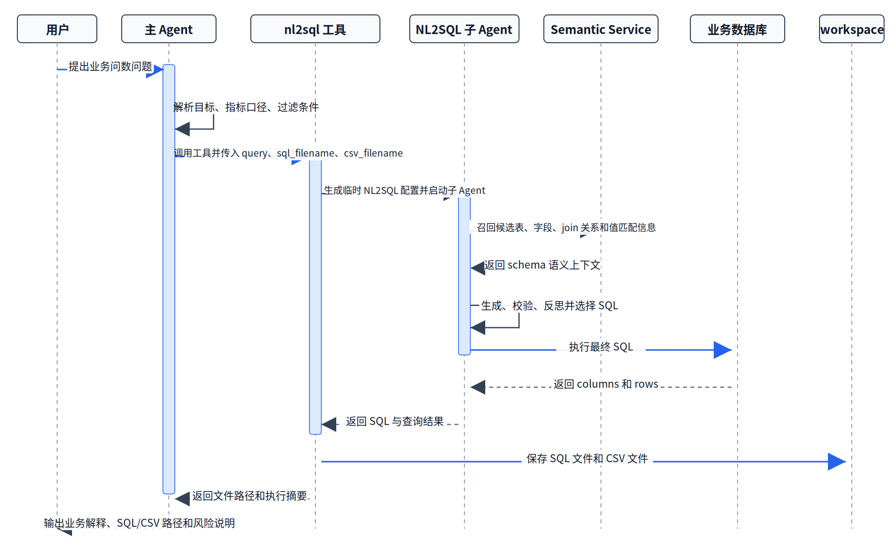

# 项目十五：基于 DataAgent 构建企业级语义问数助手

## 摘要
本章以 DataAgent 为项目实战对象，构建一个面向企业结构化数据的语义问数助手。项目目标不是让模型直接“猜 SQL”，而是把自然语言问题、业务语义层、数据库元数据、NL2SQL 子 Agent、结果文件、报告生成和运行审计组织成一条可复用的数据工程链路。

如果按工程顺序阅读，本章对应的是一条完整链路：

```text
业务问题
  -> 场景提示词与任务规划
  -> 语义层 schema 召回
  -> NL2SQL 子 Agent
  -> SQL 校验与执行
  -> CSV/SQL 资产落盘
  -> 主 Agent 汇总与报告生成
  -> 运行轨迹与评估验收
```

这一结构对应的核心目标，是把企业问数从一次性对话能力，改造成可配置、可审计、可扩展的数据应用能力。

本章重点围绕四条主线展开：

- 语义层建设：用语义层服务和向量数据库承载表、字段、指标口径和业务描述。
- Agent 编排：用 ReAct 主 Agent 决定何时调用 NL2SQL 子 Agent。
- 结果资产化：将 SQL、CSV、图表和 Markdown 报告保存到 workspace。
- 工程验收：用执行准确率、schema 命中率、文件产物、轨迹完整性和安全边界验收项目。

## 关键词

DataAgent；语义层；NL2SQL；企业问数；Agent 编排

## 项目目标与读者收获

本项目以“DataAgent 企业级语义问数助手”为核心案例，目标是把自然语言问题、语义层、NL2SQL 子 Agent、结果资产和审计轨迹连接成企业问数应用。读者完成本章后，应能够辨认该场景的关键数据对象、拆分工程链路、设置验收指标，并将案例方法迁移到相近的数据工程任务中。

## 场景约束与数据边界

聚焦结构化数据库问数和语义层增强，不覆盖完整数仓建模、生产权限系统和所有 DataAgent 能力。这些边界使案例能够被复现和审计；当数据规模、数据来源、权限范围或部署环境变化时，需要重新评估采样策略、质量阈值、运行成本和合规要求。

## 架构决策

本项目采用“业务入口、ReAct 主 Agent、Semantic Service、NL2SQL 子 Agent、workspace 资产和服务化接口”的架构路径。主 Agent 的推理-行动循环参考 ReAct (Yao et al. 2023)，工具化调用边界参考 Toolformer (Schick et al. 2023)，而 NL2SQL 评估与 schema linking 的基础问题可分别参考 Spider (Yu et al. 2018) 与 RAT-SQL (Wang et al. 2020)。该决策优先保证输入输出契约、版本可追踪、异常可定位和结果可复核，而不是把全部逻辑压缩为一次性脚本运行。

## 样本 schema / 数据流

核心数据流可概括为：

```text
业务问题 -> 语义层 schema 召回 -> NL2SQL 生成与校验 -> SQL 执行 -> CSV/SQL/报告落盘 -> 轨迹审计
```

样本 schema 至少应保留 `id`、`source`、`content_or_payload`、`metadata`、`quality_signals`、`split_or_stage` 与 `audit_trace` 等字段；具体字段由本项目的数据类型、下游任务和验收方式进一步细化。

## 核心实现片段

正文只保留能够说明设计取舍的关键实现片段。完整脚本、长配置、运行日志和大文件应放入配套仓库或附录说明；代码展示重点放在输入输出契约、质量阈值、异常处理和验收接口上。

## 实验或验收指标

验收指标包括执行准确率、schema 命中率、SQL 校验通过率、产物落盘率、轨迹完整性、响应延迟和安全拦截率。若项目进入生产、课程或公开复现实验环境，还应记录版本号、依赖环境、随机种子、样本抽检结果和失败样本复盘记录。

## 成本、风险与合规边界

成本主要来自模型调用、语义索引和数据库查询；风险集中在 SQL 注入、敏感字段泄露、schema 召回失败和结果误解释。涉及外部数据、个人信息、版权内容或第三方服务时，应保留来源说明、权限状态、脱敏策略、调用记录和人工复核记录。

## 常见失败模式

常见失败包括输入分布偏离、schema 字段缺失、质量阈值过松或过紧、评测样本覆盖不足、模型调用不稳定、结果无法回溯等。排查时应优先定位数据边界和中间产物，再检查模型、工具链与部署环境。

## 可复现资源说明

复现材料应包括数据来源说明、最小样本、配置文件、运行命令、指标脚本、检查报告和产物目录。正文保留必要片段；完整 notebook、长脚本和大文件作为配套资源独立维护。若项目进一步接入企业指标口径、模型化语义层或数据构建流水线，可以参考 dbt 文档中的模型、测试和文档化机制 (dbt Labs 2026)，但本章不把 dbt 作为必需依赖。

## 1. 项目背景：企业问数为什么需要 Agent 数据工程

企业内部的结构化数据通常已经沉淀在数据库、数仓或数据集市中，但业务人员真正需要的是“用自然语言提出业务问题，并拿到可信结果”。传统流程往往是业务人员提出需求，数据团队确认口径，工程师手写 SQL，分析师整理结果，再由业务侧二次追问。这一过程在小规模团队中可以靠人工协作推进，但一旦进入高频问数、跨表查询和多轮分析场景，就会暴露出三个问题。

第一，字段语义和业务口径没有进入模型上下文。模型知道“订单量”“活跃客户”“高价值用户”这些自然语言表达，却不知道它们对应哪张表、哪个字段、哪个过滤条件，以及哪些表可以 join。

第二，SQL 生成和结果解释之间缺少工程边界。如果模型直接生成 SQL 并回答，很难追踪最终 SQL 是什么、执行了什么数据库、结果是否真实落盘、后续报告依据是什么。

第三，单次工具调用无法覆盖完整分析流程。企业问数常常不是“查一个数”那么简单，而是需要先理解问题，再查库、保存结果、生成图表、撰写报告，并在必要时把能力暴露给其他系统调用。

DataAgent 的价值在于把这些环节组织成一个可配置的 Agent 数据工程系统：主 Agent 负责规划和回答，NL2SQL 子 Agent 负责结构化查询，Semantic Service 负责 schema 感知，workspace 负责资产落盘，A2A/SDK/CLI 负责对外服务。

## 2. 项目目标与边界

### 2.1 项目目标

本项目要完成一个可运行的企业级语义问数助手，具备以下能力：

1. 支持业务人员用自然语言提出结构化数据查询和分析问题。
2. 在 SQL 生成前，通过 Semantic Service 获取候选表、候选字段、字段描述、join 关系和值匹配信息。
3. 由主 Agent 在需要查库时调用 `nl2sql_sub_agent_tool`，而不是让主 Agent 直接猜表和字段。
4. 将生成 SQL 和查询结果分别保存为 `.sql` 与 `.csv` 文件。
5. 支持后续扩展到图表生成、Markdown 报告生成和 A2A 服务化调用。
6. 保留运行状态、工具调用结果和 workspace 资产，方便审计、复盘和迭代。

### 2.2 项目边界

本章聚焦“结构化数据问数 + 语义层增强 + Agent 编排”，不覆盖所有 DataAgent 能力。

工具范围边界：

- 本章主线使用 `nl2sql_sub_agent_tool` 作为数据库查询入口。
- 图表生成可以使用 `natural_language_to_plot`，报告生成可以使用 `report_generator`，但它们不是 SQL 正确性的来源。
- A2A 和 MCP 作为扩展接口介绍，不作为最小复现链路的必需项。

数据范围边界：

- 当前项目适合 SQLite、MySQL、PostgreSQL、Hive 等结构化数据库。
- 需要提前完成业务数据库准备、元数据导入和语义层服务配置。
- 本章不展开原始数据采集、清洗和数仓建模过程。

语义范围边界：

- 当前开源能力重点是 语义层服务 增强元数据，用于 NL2SQL 的 schema 感知。
- Ontology 本体服务仍属于开发中能力，不作为本章最小可运行链路的一部分。

安全范围边界：

- DataAgent 支持 workspace 隔离、路径授权和工具执行边界。
- 真实企业上线仍需增加权限系统、敏感字段脱敏、SQL 白名单、查询限额和审计日志对接。

## 3. 项目定位：在第十四篇中的位置

第十四篇已经覆盖了数据流水线、SFT、多模态、RAG、Agent Tool-Use、DataOps、隐私保护、推理飞轮、视频生成数据流水线和企业级语义问数等项目。DataAgent 项目适合作为项目十五，原因在于它不是单点算法项目，而是一个把 Agent、语义层、NL2SQL、工具编排和服务接口连接起来的应用级数据工程实战。

与“Agent Tool-Use 数据工厂”相比，本项目更偏真实应用落地。它不只是构造工具使用训练样本，而是让一个可运行 Agent 在企业数据环境中完成问数任务。

与“企业级 DataOps 平台”相比，本项目范围更收敛。它不试图覆盖整个组织级数据治理平台，而是聚焦一个高价值入口：自然语言问数助手如何被工程化、资产化和服务化。

与“多模态 RAG 企业财报助手”相比，本项目的核心不是文档检索，而是结构化数据查询。它强调 schema 感知、SQL 生成、执行校验和结果落盘。

因此，本章最合适的 case 是：

```text
基于 DataAgent 构建企业级语义问数助手
```

这个 case 能最大化体现 DataAgent 的特色：NL2SQL、Semantic Service、YAML 即 Agent、插件化工具、主子 Agent 协同、workspace 审计和 A2A 服务化。

## 4. 整体架构：从业务问题到可审计数据资产

项目整体架构可以拆成六层。为了便于出版排版，下图将入口、编排、查询、资产和治理关系整理成分层架构。


*图 P15-1：DataAgent 企业语义问数助手分层架构*

DataAgent 仓库中的整体架构图如下：


*图 P15-2：DataAgent 仓库整体架构图*

### 4.1 接口层

DataAgent 提供三类常用入口：

- CLI：适合本地调试和快速启动。
- Python SDK：适合在业务应用或测试脚本中集成。
- A2A Server：适合把 DataAgent 暴露为标准 Agent-to-Agent 服务，供外部 Agent 或业务系统调用。

最小复现可以先使用 Python SDK：

```python
import asyncio
from pathlib import Path

from dataagent.interface.sdk.agent import DataAgent


async def main():
    config_path = Path("dataagent/core/flex/examples/nl2sql_flex_e2e_subagent.yaml")
    agent = DataAgent.from_config(config_path)
    result = await agent.chat(
        "帮我分析一下最近一个季度各渠道订单量和客单价变化，并保存 SQL 和 CSV 结果。",
        workspace="/tmp/dataagent-semantic-bi-demo",
    )
    print(result)


if __name__ == "__main__":
    asyncio.run(main())
```

### 4.2 主 Agent 层

主 Agent 使用 `AGENT_CONFIG.type: "react"`。它的职责不是直接生成 SQL，而是理解用户问题、判断是否需要查库、组织工具参数，并在工具返回后生成最终回答。

在 DataAgent 中，这条链路由 FlexAgent 承载。主 Agent 通过 YAML 配置完成模型、场景提示词、工具、数据库和 Semantic Service 配置的声明。

### 4.3 语义与查询层

语义与查询层由两部分组成：

- Semantic Service：当前主要是 语义层服务 增强元数据能力，优先围绕 向量数据库 做语义索引和 schema 召回。
- NL2SQL 子 Agent：内部包含 Perceptor、Generator、Validator、Reflector、Executor、Selector 等节点，负责自然语言到 SQL 的查询闭环。

主 Agent 调用 `nl2sql_sub_agent_tool` 时，工具会读取内置 NL2SQL 配置，再用主 Agent YAML 中的 `DATABASE` 和 `SEMANTIC_SERVICE` 覆盖临时子 Agent 配置。这使得同一个 NL2SQL 子 Agent 能被不同业务场景复用。

### 4.4 执行与资产层

执行层完成三件事：

1. 生成并格式化 SQL。
2. 执行 SQL 并获得查询结果。
3. 将 SQL 和 CSV 保存到当前 session workspace。

这一点非常关键。企业问数的交付物不应该只有一段自然语言回答，还应该包含可复核的 SQL、可下载的结果文件和后续报告依据。

### 4.5 治理与复盘层

项目上线后，需要能回答以下问题：

- 这次回答调用了哪个工具？
- 工具输入是什么？
- 最终 SQL 是什么？
- SQL 结果保存在哪里？
- 本次查询使用了哪个数据库和哪个语义层服务？
- 失败时是 schema 召回失败、SQL 生成失败、执行失败，还是结果解释失败？

DataAgent 的运行状态、消息轨迹、工具返回和 workspace 文件为这些问题提供了工程基础。

## 5. 工程前置：准备数据库、语义层和运行环境

本章依赖 DataAgent、Semantic Service、value match 服务和可选 A2A 服务。为了让读者能够把案例从文字说明转成可运行环境，发布版本中应显式冻结版本、安装方式、环境变量和最小本地运行路径。若实际仓库版本发生变化，应以配套代码仓库的 `requirements`、`pyproject.toml`、示例 YAML 和发布说明为准，并在本节记录对应 tag 或 commit。

### 5.0 版本与最小环境矩阵

| 组件 | 最小复现要求 | 版本记录方式 |
| --- | --- | --- |
| DataAgent | 使用同一 Git tag、commit 或发布包版本安装 | 在报告中记录 `DATAAGENT_VERSION` 或 `DATAAGENT_COMMIT` |
| Python/uv | 使用独立虚拟环境，优先通过 `uv sync` 安装 | 记录 Python 版本、uv 版本和锁文件哈希 |
| 业务数据库 | 最小复现使用 SQLite，生产可替换为 MySQL、PostgreSQL 或 Hive | 记录连接类型、只读权限和样例库路径 |
| Semantic Service | 提供表、字段、join、指标口径和向量召回能力 | 记录服务 URL、索引版本和 schema 快照 |
| value match | 提供字段值匹配与字面值校验能力 | 记录服务 URL、字段值索引版本和刷新时间 |
| A2A 服务 | 仅在需要外部 Agent 调用时启用 | 记录 host、port、鉴权 token 来源和暴露范围 |

*表 P15-1：DataAgent 语义问数助手最小环境矩阵*

### 5.1 安装项目

DataAgent 是一个开源的 Agent 数据工程框架，项目仓库：[https://github.com/datagallery-ai/DataAgent](https://github.com/datagallery-ai/DataAgent)。

建议先固定版本，再在仓库根目录安装依赖：

```bash
git clone https://github.com/datagallery-ai/DataAgent.git
cd DataAgent
git checkout <release-tag-or-commit>
python -m venv .venv
.\.venv\Scripts\Activate.ps1
python -m pip install -U pip uv
```

使用 `uv` 安装：

```bash
uv sync
```

如果使用 pip，也可以执行：

```bash
pip install -e .
```

安装完成后，至少记录以下信息：

```bash
python --version
uv --version
python -c "import dataagent; print(getattr(dataagent, '__version__', 'unknown'))"
git rev-parse --short HEAD
```

### 5.2 配置模型环境变量

DataAgent 的模型配置来自 YAML 的 `MODEL` 段。通常建议将密钥放入 `.env`，而不是直接写进 YAML。

示例：

```bash
export LLM_BASE_URL="https://your-compatible-endpoint/v1"
export LLM_API_KEY="your-api-key"
export LLM_MODEL_NAME="your-chat-model"
export DATAAGENT_WORKSPACE="/tmp/dataagent-semantic-bi-demo"
export DATAAGENT_CONFIG="dataagent/core/flex/examples/nl2sql_flex_e2e_subagent.yaml"
export SEMANTIC_SERVICE_URL="http://127.0.0.1:32000"
export VALUE_MATCH_URL="http://127.0.0.1:8000"
export A2A_AUTH_TOKEN="replace-with-local-dev-token"
```

Windows PowerShell 可使用：

```powershell
$env:LLM_BASE_URL="https://your-compatible-endpoint/v1"
$env:LLM_API_KEY="your-api-key"
$env:LLM_MODEL_NAME="your-chat-model"
$env:DATAAGENT_WORKSPACE="D:\tmp\dataagent-semantic-bi-demo"
$env:DATAAGENT_CONFIG="dataagent/core/flex/examples/nl2sql_flex_e2e_subagent.yaml"
$env:SEMANTIC_SERVICE_URL="http://127.0.0.1:32000"
$env:VALUE_MATCH_URL="http://127.0.0.1:8000"
$env:A2A_AUTH_TOKEN="replace-with-local-dev-token"
```

### 5.3 准备业务数据库

最小复现可以使用 SQLite；企业环境可以使用 MySQL、PostgreSQL 或 Hive。

需要确认：

- 数据库文件或连接地址可访问。
- 表结构已经稳定。
- 业务问题中的指标口径能落到字段和过滤条件上。
- join key 已经在元数据中被描述。

### 5.4 准备 Semantic Service

Semantic Service 的当前主线能力是 语义层服务 增强元数据。它需要承载：

- 表名和表描述。
- 字段名、字段类型和字段描述。
- 表之间可 join 的关系。
- 字段值匹配信息。
- 表描述、字段描述、指标口径和业务关键词的向量索引。

在 DataAgent 的语义层中，向量数据库 可作为优先支持的向量检索底座，用于提升候选 schema 召回质量。

最小本地路径建议采用“SQLite + 本地 Semantic Service + 本地 value match”的组合。准备时至少完成三项工作：第一，将 SQLite 样例库放在稳定路径；第二，把表描述、字段描述、join 关系和指标口径导入 Semantic Service；第三，为枚举值、客户等级、地区、品类等高频过滤字段建立 value match 索引。若暂时没有生产级服务，也应在配套资源中提供 mock 或最小索引文件，并在报告中说明其覆盖范围。

### 5.5 准备 workspace

workspace 是本项目的资产落盘位置。主 Agent 调用 NL2SQL 子 Agent 后，会在 workspace 下保存：

- 生成 SQL 文件。
- 查询结果 CSV 文件。
- 后续可选的图表文件。
- 后续可选的 Markdown 报告。

建议为每次任务或每个用户会话设置独立 workspace，例如：

```text
/tmp/dataagent-semantic-bi-demo/session-001
```

### 5.6 最小本地运行路径

最小本地运行不要求开启 A2A 服务，也不要求接入生产数据库。推荐路径如下：

1. 固定 DataAgent tag 或 commit，并完成 `uv sync`。
2. 准备只读 SQLite 样例库，例如 `/tmp/dataagent-demo/demo.sqlite`。
3. 启动或配置本地 Semantic Service，确认 `SEMANTIC_SERVICE_URL` 可访问。
4. 启动或配置本地 value match 服务，确认 `VALUE_MATCH_URL` 可访问。
5. 修改 `nl2sql_flex_e2e_subagent.yaml` 中的 `DATABASE`、`SEMANTIC_SERVICE` 和 `workspace`。
6. 使用 SDK 或 CLI 发起一个只读查询，检查 `.sql` 与 `.csv` 是否落盘。
7. 保存运行日志、SQL、CSV、配置快照和服务版本，作为验收证据。

Listing P15-1 给出了命令行运行示例，用于说明本节中的最小本地路径。

```bash
uv run -m dataagent \
  --config "$DATAAGENT_CONFIG" \
  --workspace "$DATAAGENT_WORKSPACE"
```

该片段的作用是把安装、配置、语义服务和 workspace 串成可复核的最小运行入口。

## 6. 配置主 Agent：YAML 即应用

DataAgent 的关键优势之一是“YAML 即 Agent”。一个可运行的语义问数助手可以从下面的配置开始。

```yaml
AGENT_CONFIG:
  name: "Enterprise Semantic BI Agent"
  type: "react"
  backend: "langgraph"

MODEL:
  chat_model: {provider: "your-provider", params: {temperature: 0.0}}

SCENARIO:
  chat:
    task: "call NL2SQL sub-agent when database query is required"
    instructions: |
      必须通过 nl2sql_sub_agent_tool 查询数据库。
      工具参数需包含业务目标、指标口径、过滤条件、输出字段和文件名。
      回答必须说明 SQL 路径、CSV 路径、核心结果和口径限制。

TOOLS:
  local_functions:
    - function: "nl2sql_sub_agent_tool"
      config: {llm_model: chat_model}

DATABASE: {db_id: "enterprise_demo", engine: "sqlite", config: {path: "/absolute/path/to/demo.sqlite"}}
SEMANTIC_SERVICE: {semantic_service_url: "http://host:32000", value_match_url: "http://host:8000"}
```

这份配置有五个关键点。

第一，主 Agent 使用 `type: "react"`。它负责规划，不直接充当 NL2SQL 专用 Agent。

第二，工具只注册 `nl2sql_sub_agent_tool`，让 SQL 任务进入专用子 Agent。

第三，`DATABASE` 和 `SEMANTIC_SERVICE` 写在主 Agent YAML 中。工具运行时会把它们覆盖到临时 NL2SQL 子 Agent 配置。

第四，`SCENARIO.chat.instructions` 必须明确工具调用条件和参数要求。否则模型可能只回答自然语言，或者调用工具时缺少文件名。

第五，模型温度建议设为 `0.0`。结构化查询场景更重视稳定性和可复现性。

## 7. NL2SQL 子 Agent：把 schema 感知和 SQL 执行收敛到专用链路

DataAgent 内置 NL2SQL Agent 配置位于：

```text
dataagent/agents/nl2sql/nl2sql_agent.yaml
```

它的核心链路是：

```text
Coordinator
  -> Perceptor
  -> Generator
  -> Validator
  -> Reflector
  -> Executor
  -> Selector
```

每个节点承担不同职责。

| 节点 | 作用 |
| --- | --- |
| Coordinator | 组织 NL2SQL 任务入口和状态流转。 |
| Perceptor | 获取 schema、字段语义、join 信息和用户 SQL 规则。 |
| Generator | 基于 prompt、ICL、skeleton 或 DC 等策略生成候选 SQL。 |
| Validator | 做 SQL explain、关键词校验、元数据和值匹配校验。 |
| Reflector | 当置信度不足或执行异常时，尝试反思修正。 |
| Executor | 执行 SQL，获得 columns、rows 和 rows_preview。 |
| Selector | 选择最终 SQL、结果和置信度。 |

*表 P15-2：NL2SQL 子 Agent 核心节点与职责*

最小配置如下：

```yaml
AGENT_CONFIG:
  name: "NL2SQL Agent"
  backend: "langgraph"
  type: "nl2sql"

CORE:
  perceptor:
    user_sql_rules: "sql_rules_bird"
    user_few_shot_examples: null
  generator:
    strategies: ["prompt"]
    num_workers: 1
    num_samples: 3
  validator:
    db_explain: true
    metadata_match: false
  reflector:
    threshold: 0.9
  executor:
    limit: -1
    preview_limit: 5
  selector:
    threshold: 0.9
```

在主 Agent 调子 Agent 的模式中，业务侧通常不需要直接修改这份基础配置。更推荐把业务数据库和 语义层服务 地址写在主 Agent YAML 中，通过 `nl2sql_sub_agent_tool` 运行时覆盖。

## 8. Semantic Service：把业务元数据变成可召回上下文

企业问数中，schema 感知是决定 SQL 质量的关键。一个用户问题可能只说：

```text
最近一个季度各渠道的新客转化率怎么样？
```

但 SQL 生成需要明确：

- “最近一个季度”对应哪个时间字段。
- “渠道”对应哪个维度字段。
- “新客”对应首购用户、注册后首次下单用户，还是没有历史订单的用户。
- “转化率”对应访问到下单、注册到下单，还是线索到成交。
- 需要哪些表 join。

语义层服务 的作用，是在生成 SQL 前把这些数据语义尽量结构化地提供给 NL2SQL。它提供的能力包括：

| 能力 | 工程价值 |
| --- | --- |
| 表列表和表描述 | 帮助模型定位候选业务表。 |
| 字段信息和字段描述 | 降低字段猜测概率。 |
| joinable tables | 提供跨表关联依据。 |
| semantic search column | 根据用户问题召回候选字段。 |
| value match | 校验 SQL 字面值是否真实存在。 |
| 向量数据库 向量索引 | 将业务描述、指标口径和字段语义变成可检索资产。 |

*表 P15-3：Semantic Service 关键能力与工程价值*

在项目中，Semantic Service 不应该被理解为“额外文档”。它是 NL2SQL 的前置数据工程层。没有这一层，模型只能依赖表名和字段名猜测；有这一层，模型可以基于业务语义、字段描述和 join 关系生成 SQL。

## 9. 工具调用：主 Agent 如何委托 NL2SQL 子 Agent

`nl2sql_sub_agent_tool` 是本项目的核心工具。它的输入参数是：

| 参数 | 说明 |
| --- | --- |
| `query` | 交给 NL2SQL 子 Agent 的自然语言查询，应包含业务目标、指标口径、过滤条件、分组和输出字段。 |
| `sql_filename` | 保存 SQL 的文件名。 |
| `csv_filename` | 保存查询结果的 CSV 文件名。 |

*表 P15-4：nl2sql_sub_agent_tool 输入参数说明*

工具运行时会执行以下步骤：

1. 检查当前 Agent session workspace 是否可用。
2. 读取 `dataagent/agents/nl2sql/nl2sql_agent.yaml`。
3. 将主 Agent 当前配置中的 `DATABASE`、`SEMANTIC_SERVICE` 和模型槽位覆盖到临时 NL2SQL 子 Agent 配置。
4. 启动 NL2SQL 子 Agent 执行查询。
5. 从子 Agent 最终状态中读取 `sql`、`columns` 和 `rows`。
6. 格式化 SQL。
7. 将 SQL 和 CSV 写入 workspace。
8. 向主 Agent 返回文件路径和 SQL 摘要。

这一步把“工具调用”变成了“数据资产生产”。主 Agent 的最终回答不再只是自然语言，而是可以引用真实落盘的 SQL 和 CSV。

## 10. 运行流程：从一次业务问题到最终交付

### 10.1 启动前检查

运行前检查以下内容：

```text
1. 模型环境变量已配置。
2. 数据库路径或连接串可访问。
3. DATABASE.db_id 与 语义层服务 中注册的数据库标识一致。
4. SEMANTIC_SERVICE.semantic_service_url 可访问。
5. SEMANTIC_SERVICE.value_match_url 可访问。
6. workspace 可写。
```

从运行时看，一次完整问数任务可以拆成以下流程：



*图 P15-3：DataAgent 企业语义问数助手运行流程*

### 10.2 使用 SDK 运行

```python
import asyncio
from pathlib import Path

from dataagent.interface.sdk.agent import DataAgent


async def main():
    agent = DataAgent.from_config(
        Path("dataagent/core/flex/examples/nl2sql_flex_e2e_subagent.yaml")
    )
    result = await agent.chat(
        "帮我分析一下不同客户等级最近三个月的订单金额变化，并保存 SQL 和 CSV。",
        workspace="/tmp/dataagent-semantic-bi-demo",
    )
    print(result)


if __name__ == "__main__":
    asyncio.run(main())
```

### 10.3 使用命令行运行

```bash
uv run -m dataagent --config dataagent/core/flex/examples/nl2sql_flex_e2e_subagent.yaml
```

### 10.4 使用 A2A 服务化

当问数助手需要被其他 Agent 或业务系统调用时，可以启动 A2A 服务：

```bash
uv run -m dataagent serve-a2a \
  --config dataagent/core/flex/examples/nl2sql_flex_e2e_subagent.yaml \
  --host 0.0.0.0 \
  --port 9999 \
  --auth-token "your-token"
```

启动后，外部系统可以通过 AgentCard 发现服务能力，再通过 JSON-RPC 或 REST 发送消息。

## 11. 结果资产：SQL、CSV、报告和轨迹

本项目的交付物至少包括三类。

### 11.1 SQL 文件

SQL 文件是最重要的可审计资产。它回答：

- 模型最终执行了什么查询？
- 是否使用了正确字段？
- 是否包含正确过滤条件和 join 条件？
- 是否可以由数据团队复核？

示例：

```text
/tmp/dataagent-semantic-bi-demo/customer_level_order_amount.sql
```

### 11.2 CSV 结果

CSV 文件是后续分析、报告和人工复核的基础。

示例：

```text
/tmp/dataagent-semantic-bi-demo/customer_level_order_amount.csv
```

### 11.3 Markdown 报告

如果任务需要正式交付，可以在 SQL 和 CSV 之后接入 `report_generator`。报告生成必须基于已有分析文件、CSV 结果和图表，不允许编造未出现在数据中的数字。

### 11.4 运行轨迹

运行轨迹用于复盘：

- 主 Agent 是否正确判断需要查库？
- 工具参数是否完整？
- 子 Agent 是否成功执行？
- 是否保存了 SQL 和 CSV？
- 最终回答是否忠实引用工具结果？

对企业应用来说，轨迹不是调试附属品，而是上线后的审计依据。

## 12. 评估指标：问数助手不能只看回答是否流畅

语义问数助手的评估要覆盖 SQL、数据、回答和工程运行四个层面。

| 指标 | 说明 |
| --- | --- |
| schema 召回命中率 | 用户问题所需表和字段是否进入候选上下文。 |
| SQL 执行成功率 | 生成 SQL 是否能成功执行。 |
| 执行准确率 | SQL 结果是否符合业务标准答案或人工验收结果。 |
| 值匹配正确率 | 字面值、枚举值、业务名称是否匹配真实数据。 |
| 文件产物完整率 | SQL、CSV、报告是否按约定落盘。 |
| 回答忠实度 | 最终回答是否只基于查询结果，不编造数字。 |
| 轨迹完整率 | 工具调用、输入、输出、错误和文件路径是否可追踪。 |
| 安全违规率 | 是否出现越权路径、敏感字段泄露或不允许的 SQL 操作。 |

*表 P15-5：企业语义问数助手评估指标*

其中，SQL 执行成功率只是底线，不等于任务成功。真正的问数助手还要保证 schema 选对、口径解释清楚、结果可复核、失败可定位。

## 13. 测试验收：从 e2e 到业务回归集

DataAgent 仓库中已经包含主 Agent 调 NL2SQL 子 Agent 的端到端测试示例：

```bash
uv run tests/e2e/test_nl2sql_flex_subagent.py
```

这个测试链路验证了：

- 能从配置加载主 Agent。
- 主 Agent 可以调用 NL2SQL 子 Agent。
- 子 Agent 没有出现配置路径错误。
- Flex workflow 能到达完成状态。

企业落地时，还需要补充业务回归集。建议按问题类型构建测试集：

| 类型 | 示例 |
| --- | --- |
| 单表聚合 | 每月订单量、各状态订单数。 |
| 多表 join | 客户等级与订单金额变化。 |
| 时间过滤 | 最近三个月、上季度、自然月。 |
| 枚举值匹配 | 渠道、地区、产品线、客户类型。 |
| 排序 TopN | 销售额最高的前 10 个客户。 |
| 口径敏感指标 | 新客、复购率、转化率、客单价。 |
| 异常输入 | 不存在字段、模糊口径、越权查询。 |

*表 P15-6：企业问数业务回归集问题类型*

每个测试样本应包含：

- 用户问题。
- 期望涉及的表和字段。
- 参考 SQL 或参考结果。
- 是否允许多种等价 SQL。
- 是否需要保存 SQL/CSV。
- 失败时的期望行为。

## 14. 常见失败模式与排查

### 14.1 主 Agent 没有调用 NL2SQL 工具

通常是 `SCENARIO.chat.instructions` 不够明确。需要在提示词中写清楚：

```text
当问题需要数据库查询时，必须调用 nl2sql_sub_agent_tool。
```

同时要求模型提供 `query`、`sql_filename` 和 `csv_filename`。

### 14.2 schema 召回不完整

优先检查：

- 表描述是否过短。
- 字段描述是否缺少业务含义。
- 指标口径是否没有导入 语义层服务。
- 向量数据库 embedding 配置是否可用。
- 用户问题中的业务词是否和元数据表达差异过大。

### 14.3 SQL 执行失败

常见原因包括：

- 数据库路径不正确。
- `DATABASE.engine` 和实际数据库不一致。
- 生成 SQL 使用了不存在的字段。
- 时间字段类型没有说明清楚。
- join key 描述缺失或错误。

### 14.4 结果能执行但业务口径错误

这通常不是模型单独能解决的问题。需要补充：

- 指标定义。
- 过滤条件。
- 维度枚举说明。
- 口径版本。
- few-shot SQL 示例。

### 14.5 文件没有落盘

优先检查：

- 是否传入了 workspace。
- workspace 是否可写。
- 文件名是否缺失。
- 是否触发路径授权或沙箱限制。

## 15. 安全与权限：企业问数的上线边界

企业问数助手必须明确安全边界。最低要求包括：

1. 只允许访问授权数据库。
2. 只允许写入授权 workspace。
3. 默认只生成查询 SQL，不允许执行 DDL、DML 或高风险管理命令。
4. 对敏感字段增加脱敏或拒答规则。
5. 对高成本查询设置 limit、超时和资源配额。
6. 对所有工具调用保留审计记录。
7. 对外部 A2A 服务启用鉴权 token。

在生产环境中，还应把 DataAgent 接入企业 IAM、数据权限系统、审计系统和告警系统。Agent 能力越强，越需要把权限和可观测性前置到工程设计中。

## 16. 扩展方向：从问数助手到数据任务平台

本项目可以沿五个方向扩展。

### 16.1 增加图表和报告链路

在 SQL/CSV 产物稳定后，可以接入：

- `natural_language_to_plot`：根据查询结果生成图表。
- `report_generator`：根据分析和图表生成 Markdown 报告。

扩展后链路变成：

```text
NL2SQL -> CSV -> 图表 -> Markdown 报告 -> 业务交付
```

### 16.2 增加 A2A 服务化

把 DataAgent 暴露为 A2A 服务后，其他 Agent 可以将其作为企业问数能力调用。这适合多 Agent 平台、内部 Copilot 或业务系统集成。

### 16.3 增加 MCP 工具服务

如果企业已有独立数据服务、指标服务或权限服务，可以通过 MCP 接入，让主 Agent 在查库前先调用确定性服务确认口径或权限。

### 16.4 增加本体服务

当 Ontology 能力稳定后，可以在 NL2SQL 前增加业务对象确认步骤：

```text
用户问题 -> 本体对象识别 -> 业务关系确认 -> NL2SQL 查询 -> 报告
```

这能进一步降低“业务对象猜错”导致的 SQL 错误。

### 16.5 增加在线反馈闭环

上线后应收集：

- 用户是否采纳回答。
- 用户是否修改 SQL。
- 数据团队复核结论。
- 失败问题的类型。
- 需要补充的字段描述和指标口径。

这些反馈可以反向更新 语义层服务 元数据、few-shot 示例、场景提示词和测试集。

## 17. 主要交付物清单

### 17.1 配置交付物

- 主 Agent YAML。
- NL2SQL 基础配置。
- 模型环境变量模板。
- 数据库连接配置。
- 语义层服务和值匹配服务地址。

### 17.2 数据与语义交付物

- 数据库表结构。
- 表描述和字段描述。
- join 关系。
- 指标口径。
- 值匹配索引。
- 向量数据库 语义索引。

### 17.3 运行交付物

- SQL 文件。
- CSV 查询结果。
- 可选图表文件。
- 可选 Markdown 报告。
- 工具调用轨迹。
- 错误日志和运行状态。

### 17.4 验收交付物

- 业务问题回归集。
- 参考 SQL 或参考结果。
- schema 召回评估。
- SQL 执行评估。
- 回答忠实度评估。
- 安全和权限检查清单。

## 18. 结语：DataAgent 的实战价值不只是 NL2SQL，而是把问数变成工程闭环

本章选择 DataAgent 的企业语义问数助手作为项目实战，是因为它能同时覆盖应用级数据工程和 Agent 数据工程的关键问题：如何让模型理解业务语义，如何避免直接猜 schema，如何把 SQL 查询交给专用子 Agent，如何把结果保存成可复核资产，如何让一次自然语言对话进入可审计、可回归、可扩展的工程体系。

这个项目真正要训练和检验的，不只是“模型会不会写 SQL”，而是整条链路是否具备企业数据应用所需的稳定性：

- 语义上下文是否可靠。
- 工具边界是否清晰。
- 查询结果是否可复核。
- 文件产物是否可追踪。
- 失败问题是否可定位。
- 后续反馈是否能回流到元数据和测试集中。

从这个意义上说，DataAgent 更适合作为第十四篇项目十五的原因也很清楚：它把前文的 Agent、Tool-Use、RAG/Semantic、DataOps 和服务化能力收束到一个企业场景中，让“自然语言问数”从一次性原型验证转变为可持续迭代的数据工程项目。

## 专题：上线前门禁清单

上线前建议至少检查以下门禁：

| 门禁 | 检查项 |
| --- | --- |
| 配置门禁 | YAML 可加载，模型、数据库、语义层服务、workspace 配置齐全。 |
| 语义门禁 | 关键表、字段、指标口径和 join 关系已导入语义层。 |
| 查询门禁 | 回归集 SQL 执行成功率和执行准确率达到业务阈值。 |
| 资产门禁 | 每次任务都能保存 SQL 和 CSV。 |
| 忠实度门禁 | 最终回答不得编造查询结果之外的数字。 |
| 安全门禁 | 路径、数据库、敏感字段、SQL 类型和 A2A 鉴权均有边界控制。 |
| 复盘门禁 | 工具调用、错误、文件路径和最终回答可追踪。 |

*表 P15-7：DataAgent 语义问数助手上线前门禁清单*

## 专题：为什么这个 case 比单纯 NL2SQL 更适合作为项目章

单纯 NL2SQL 可以展示模型如何生成 SQL，但项目实战需要展示更完整的工程结构。DataAgent 的语义问数助手把三个层次连接起来：

第一层是数据语义工程。表字段描述、join 关系、指标口径和值匹配进入 语义层服务 和 向量数据库，成为可召回的数据资产。

第二层是 Agent 编排工程。主 Agent 不直接猜 SQL，而是把数据库查询委托给 NL2SQL 子 Agent，形成职责边界。

第三层是交付与治理工程。SQL、CSV、报告和轨迹进入 workspace，成为可复核、可回归和可审计的产物。

因此，这个 case 不只是“用 DataAgent 跑一个查询”，而是完整回答了企业数据应用中的关键问题：自然语言如何进入结构化数据系统，并以工程化方式产生可信结果。

## 本章小结

本章以“DataAgent 企业级语义问数助手”为案例，展示了把自然语言问题、语义层、NL2SQL 子 Agent、结果资产和审计轨迹连接成企业问数应用的工程组织方式。案例的主要价值在于把任务定义、数据边界、架构决策、样本 schema、指标验收和复现资源放在同一条链路中，使项目不再只是操作步骤，而成为可复核的案例研究。

该案例的边界同样需要被清楚保留。聚焦结构化数据库问数和语义层增强，不覆盖完整数仓建模、生产权限系统和所有 DataAgent 能力。在更大规模、更高风险或更强合规约束的场景中，应重新评估数据来源、权限状态、人工复核比例、运行成本和失败回滚方案。

作为第十四篇的一部分，本章对应前文方法在项目层面的落地验证。读者可将本案例与第十三篇的数据配方、前文的平台治理章节以及附录中的检查清单合并使用，形成从方法理解到工程交付的闭环。

## 参考文献

1. Yu, T., Zhang, R., Yang, K., Yasunaga, M., Wang, D., Li, Z., et al. (2018). Spider: A Large-Scale Human-Labeled Dataset for Complex and Cross-Domain Semantic Parsing and Text-to-SQL Task. EMNLP 2018.
2. Wang, B., Shin, R., Liu, X., Polozov, O., & Richardson, M. (2020). RAT-SQL: Relation-Aware Schema Encoding and Linking for Text-to-SQL Parsers. ACL 2020.
3. Schick, T., Dwivedi-Yu, J., Dessì, R., Raileanu, R., Lomeli, M., Hambro, E., Zettlemoyer, L., Cancedda, N., & Scialom, T. (2023). Toolformer: Language Models Can Teach Themselves to Use Tools. arXiv:2302.04761.
4. Yao, S., Zhao, J., Yu, D., Du, N., Shafran, I., Narasimhan, K., & Cao, Y. (2023). ReAct: Synergizing Reasoning and Acting in Language Models. arXiv:2210.03629.
5. dbt Labs. (2026). dbt Documentation. https://docs.getdbt.com/
