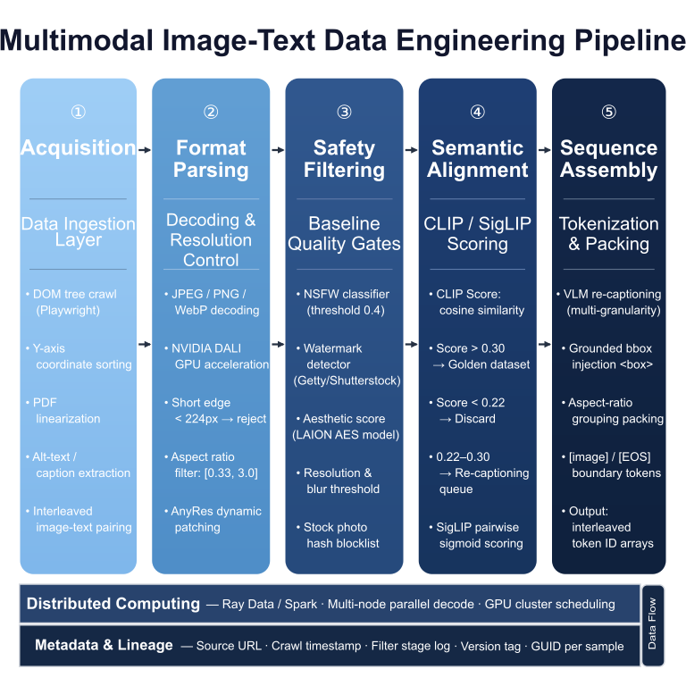
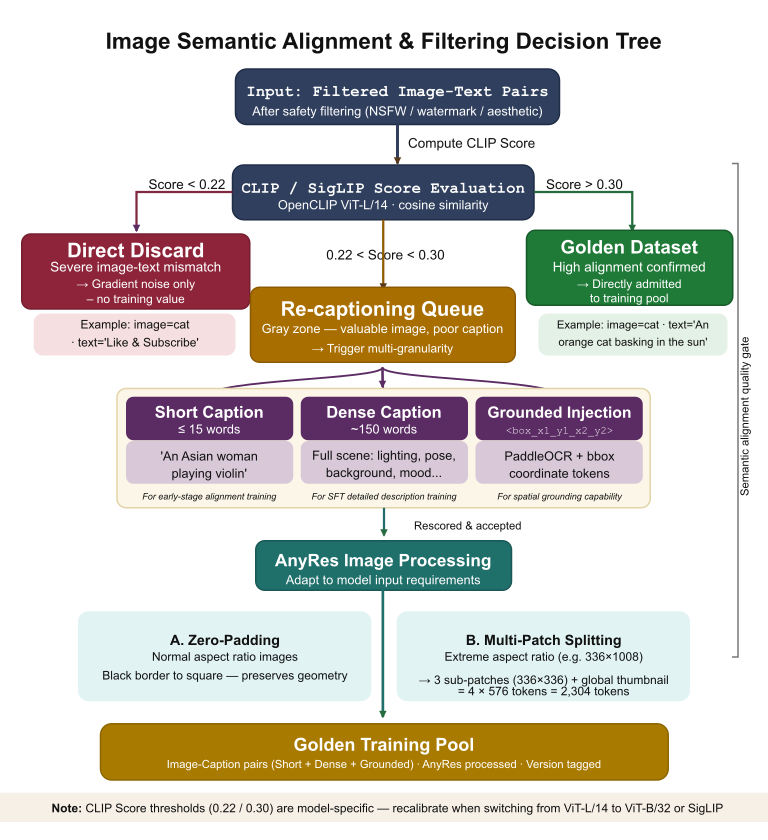
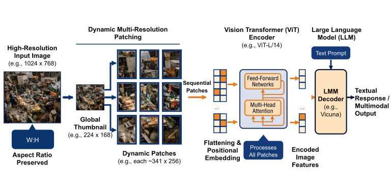

# 第8章 图文对数据工程

<div class="chapter-authors">王珂（Ke Wang）</div>

## 摘要

本章讨论图文对与交错图文数据工程的基本问题，重点回答视觉数据为什么不能沿用纯文本清洗范式。章节首先说明视觉噪声、语义错配、分辨率成本和图像表示带来的工程挑战，随后比较图文对、交错图文和文档截图三类样本范式。清洗部分从图像解码、分辨率与宽高比过滤、NSFW/水印/隐私拦截切入，进一步介绍基于 CLIP/SigLIP 的图文语义匹配和多粒度重标注策略。后半章讨论 AnyRes 动态切分、长宽比分组、图文混采和质量风险，并通过匿名化复合案例说明图库水印污染与二次清洗的必要性。读者应能够设计可追溯、可评估、成本可控的图文数据预处理流水线。

## 关键词

图文对；交错图文；CLIP Score；SigLIP；AnyRes；图像清洗；重标注；多模态数据

## 学习目标

- 能够解释图文数据在噪声类型、语义对齐、分辨率成本和质量评价上的特殊性。
- 能够区分 Image-Caption、Interleaved Image-Text 和 Document Grounded 三类样本范式。
- 能够设计图像解码、尺寸过滤、水印/隐私拦截和语义匹配的多阶段清洗流程。
- 能够说明 CLIP/SigLIP 过滤、Re-captioning 和 AnyRes 动态切分的适用边界。
- 能够识别图库污染、图文错配和比例混采失衡对模型训练的影响。

## 8.1 多模态数据为何难于文本

当一个 NLP 数据工程师首次接手视觉语言模型（Vision-Language Model, VLM）的数据清洗任务时，最直接的变化是：许多在纯文本中有效的确定性规则，在图像场景下只能覆盖一小部分问题。

### 8.1.1 视觉噪声的隐蔽性与不确定性

在纯文本的数据工厂中，所谓的“脏数据”或“乱码”往往可以用低成本方法检测出来：写正则表达式、跑 MinHash 或计算困惑度（PPL），甚至不需要动用 GPU 即可筛除。但在图像数据中，噪声常常依赖语义、空间位置和视觉上下文判断：

- **概念隔离噪声**：一张 4K 高清、画质完美、色彩极好的风景照，由于被人为恶意编辑，角落里带有一个仅占 15x15 像素的半透明色情水印（NSFW），这种图会对多模态合规性造成高风险。
- **空间失真噪声**：一张背景凌乱的街头杂货铺抓拍，描述语写的是“摊位上的一把梳子”。但这把关键的梳子在全图中仅占 3 个像素，不仅人眼难辨，经过卷积网络下采样后也可能丢失。
- **频域（Frequency Domain）压缩噪声**：一张包含详尽财务报表或医学心电图的截图，由于在其流传过程中经历了多次二次 JPEG 压缩，高频细节周围产生严重的“振铃伪影（Ringing Artifacts）”。人类仍可能猜出文字，但依赖边缘特征的深度识别网络（OCR）会明显受损。

这些“视觉隐蔽噪声”无法通过传统的哈希指纹或文件 MD5 对比排除。在多模态数据流中，通常需要部署并长期运行数个预训练视觉判别器（如基于 ResNet-50 的二分类水印检测器、基于 LAION Aesthetics 的评估器）来进行密集推理。这意味着，图像清洗本身就会消耗可观的 GPU 计算资源。

### 8.1.2 语义缺失与跨模态“多义错位”（WebTox）

多模态的对齐学习，建立在一个前提之上：抓取到的（Image, Text）对彼此描述同一个事物。然而，互联网上海量“图片与替代文本（Alt-text）”并不天然对应。

由于十余年来网页爬虫与 SEO（搜索引擎优化）的使用方式复杂，爬虫工程师经常会遇到如下高风险图文对：

- **肉眼看到的图片内容**：一只正在草地上开心奔跑的金毛犬。
- **HTML 里提取到的 Alt-text**：“2023包邮正品优质特价全场满减买一送一宠物用品”。

如果将这种充满商业目的的诱导数据，不做任何因果剥离直接喂给模型，模型将在反向传播（Back-propagation）中被迫建立错误关联，最终学会“金毛犬的毛发纹理等于包邮促销折扣”这类不合理绑定（即跨模态语义错位）。LAION-5B、DataComp 和 OBELICS 等数据集论文都把图文匹配、去重和安全过滤列为关键步骤 (Schuhmann et al. 2022; Gadre et al. 2023; Laurençon et al. 2023)，原因正在于：网页 alt-text 并不天然等于图像语义监督信号。正是为了系统性地缓解这一问题，学界与工业界逐步发展出了以 CLIP Score、SigLIP 和人工抽检相结合的跨模态语义过滤技术。

### 8.1.3 图像分辨率与 GPU 显存的成本权衡

在纯语言建模时代，无论输入是一篇主题报告，还是一句短诗，送入大语言模型的代价主要与 Token 长度呈线性增长（Linear Scaling）。但在多模态领域，**图像分辨率（Resolution）会显著放大计算开销（FLOPs）**。

我们以常见的基于 ViT（Vision Transformer）(Dosovitskiy et al. 2020) 架构的视觉编码器为例。假设我们设定的切割模块（Patch Size）尺寸恒定为 $14 \times 14$ 像素：

- 当向网络输入一张 $224 \times 224$ 分辨率图片时，它会被切成 $(224/14) \times (224/14) = 256$ 个 Patch Token。此时，自注意力机制（Self-Attention）的计算复杂度大约是 $256^2 = 65,536$ 级运算量。
- 但若为了让模型能够看清楚一张扫描版发票上的数字，不得不将输入分辨率提高至 $1008 \times 1008$（以保留文档图像上的微小文字），那么图像 Token 序列的长度将剧增至 $(1008/14) \times (1008/14) = 5184$ 个。
- 由于标准 Transformer 的 Attention 计算开销是与其产生的 Token 序列长度呈“二次方（Quadratic）复杂度”的，此时单层注意力的计算量飙升到了 $5184^2 \approx 26,873,856$ 级运算量！

仅仅将图像的边长拉大 4.5 倍，**Attention 层的计算量**就会增加近 **410 倍**（注意：这里衡量的是 Self-Attention 的二次方复杂度，而非整个模型的 FLOPs；其他层如 FFN 的计算量与序列长度呈线性增长，实际总训练算力涨幅仍然显著但略小于 410 倍）。因此，图文多模态数据工程的核心任务之一，是在保留局部细节与控制训练成本之间设计动态裁切、降维与多尺度 Patching 策略（见图8-1中的全景流程）。



*图8-1：多模态图文数据工程全景图 —— 从最左侧的 DOM 树抓取与 PDF 解析起始，依次穿过格式解析、水印过滤、CLIP 语义对齐、直至最右侧的交错序列拼装与 Token 化表示。分布式计算与 Metadata 是横跨底层的核心支撑。来源：本书自绘；Alt text：图文数据工程全景图，展示 DOM 抽取、图片下载、格式解析、过滤、语义对齐、重标注和序列拼装之间的流程。*

---

## 8.2 图文样本的范式：从配对到交错

大模型不同阶段的训练目标，决定了需要使用不同格式的数据。根据近年来的前沿结构（如 Flamingo (Alayrac et al. 2022), LLaVA (Liu et al. 2023), GPT-4V），典型的多模态文本主要包括三种范式：

### 8.2.1 图文对 (Image-Caption Pairs)
这是最基础、最易规模化的范式。

- **形式**：严格的一张图对应一段独立的强描绘文字 `{ "image": "dog.jpg", "text": "A golden retriever playing fetch in the park." }`。
- **代表开源集**：LAION-5B (Schuhmann et al. 2022), COYO-700M。
- **适用场景**：主要用于冷启动阶段的**多模态对比学习（Contrastive Pre-training）**，比如训练 CLIP 的前置模型，或者给新接入的 Vision Encoder 建立基础的视觉感知基线。
- **主要局限**：难以单独教会模型推理，更多用于建立基础物体识别和跨模态检索能力。

### 8.2.2 交错图文 (Interleaved Image-Text)
为了赋予模型在复杂上下文中的“多图关联推理”能力，数据引擎需要从网页端提取并尽量还原“原生交错版面”。

- **形式**：类似维基百科或公众号长文中的结构：一段起因 + `<img_1>` + 发展过程 + `<img_2>` + 结局总结。图像 Token 被视为一种特殊词汇，分布在长文本序列之间。
- **代表开源集**：OBELICS (Laurençon et al. 2023), MMC4 (Zhu W et al. 2023)。
- **适用场景**：这是当今**生成式 VLM 预训练**的重要数据形态。它教会模型如何根据“前文”和“图片 1”，去推断“后文”或“图片 2”应该是什么。
- **采集挑战与 DOM 解析工程**：交错图文的工程难度庞大。传统的文本爬虫遇到 `` 标签直接跳过，而为了组装交错格式，爬虫需要解析复杂的 HTML DOM 树，并进行**“基于渲染坐标的相对距离计算”**。
  因为在很多现代网页的复杂级联样式（CSS）中，代码文档树的顺序往往并不是用户眼里的视觉排版顺序。如果仅按照 HTML 标签顺序提取，很可能把页面底部的免责声明错误绑定到顶部配图。
  
  为此，工程团队通常会使用带渲染引擎的无头浏览器（Headless Browser，如 Playwright）运行 JavaScript 生成页面快照，利用类似于下面的规则提取元素。

  代码清单8-1展示了 DOM 交错节点提取的示意逻辑。

  *代码清单8-1：DOM 交错节点提取示意代码。生产环境应补充 DOM 清洗、图片下载校验、alt/title 字段留存和失败样本隔离。*

  ```python
  # 简化的 DOM 交错节点提取伪代码
  text_nodes, img_nodes = get_rendered_nodes(page)
  interleaved_sequence = []
  
  for node in all_nodes_sorted_by_y_axis():
      if node.type == 'TEXT':
          if len(node.content.split()) > 5: # 抛弃过短文本，如导航栏
              interleaved_sequence.append(node.content)
      elif node.type == 'IMAGE':
          if node.width > 200 and node.height > 200:
              # 将合法图片转化为一个占位符 Token，并将 url 存入侧边通道
              interleaved_sequence.append(f"<img_{node.id}>")
              save_to_image_db(node.url, node.id)
  ```
  一旦 DOM 结构提取错位，模型就会学习到错误的图文对应关系。

### 8.2.3 长文档理解与截图 Grounding (Document Grounded)
面对 B 端商业落地的真实需求（看财报、读发票），传统自然图像训练往往不足，需要引入高分辨率文档数据。

- **形式**：输入的是渲染后的高频高清晰度截屏文档图（如 ArXiv 论文或密集型的 Excel 截图），对应输出结构化的 JSON 取值序列或者边界框（Bounding Box）坐标 `<box>`。
- **适用场景**：依赖高分辨率分块（Patching）和 OCR 辅助。主要用于 SFT（监督微调阶段）教会模型实施精密的值提取与逻辑结构理解（如公式与图表的指代排版）。
- **坐标归一化工程**：在 Grounding 任务中，模型需要输出物体的具体像素坐标。然而，训练图片的分辨率千差万别，为了让语言引擎能“读懂”坐标，通常需要将原始的绝对像素坐标 `(X, Y)` 映射到位 `[0, 1000]` 的离散 Token 桶中（即 `[<loc_255>, <loc_899>]`）。这种离散化将连续空间坐标转化为大语言模型熟悉的“词汇表”形式。

*表8-1：图文样本类型、特征与适用任务表。来源：本书整理，适用任务为工程归纳，生产环境应结合模型架构、视觉编码器和数据许可复核。*

| 样本类型 | 数据特征 | 核心获取手段 | 最高适用阶段 | 带来的关键能力 |
| :--- | :--- | :--- | :--- | :--- |
| **纯图文对 (Image-Caption)** | T/I 一对一，高噪声 | 网页 ``，公有云 OSS 爬取 | 对齐预训练 (Alignment) | 基础特征感知、跨模态检索 |
| **交错图文 (Interleaved)** | T/I 多对多，长序列 | DOM 树渲染解析、PDF 线性化剥离 | 主力生成式预训练 | 多轮逻辑推理、Few-shot 上下文感知 |
| **长文档截图 (Doc/OCR)** | 超高分辨率，文本密集 | PDF 渲染、无头浏览器自动化截图 | 深度 SFT / 强化学习 | 排版理解、表单/论文/发票抽取分析 |
| **高精描绘 (Grounded Caption)** | 含边界框 `<box>` 的长文 | 标注员框选，或闭源千亿模型重写 | 高阶 SFT / RAG 对齐 | 图像细粒度空间感知与抗幻觉能力 |

---

## 8.3 清洗、过滤与语义对齐技术 (上篇：基础清洗)

从全网抓取来的原始数据质量差异很大，通常需要经历多轮不同级别的漏斗过滤。我们将这一阶段称为前置清洗期，它涉及大量 I/O 操作、图像解码和硬件加速分类器。

### 8.3.1 图像解码与 GPU 端预处理
文本清洗时，`JSON.loads` 或 `open()` 几乎是零开销的操作；但面对数十 TB 甚至 PB 级的图像压缩包，**解码（Decoding）**本身就会演化为整个训练集群最大的吞吐瓶颈（Bottleneck）。
在互联网上，图片可能是常见 JPEG、体积庞大的 PNG，甚至是带有破损文件头或嵌入错误 ICC 颜色配置的非标准 WebP 变体。

如果使用标准 Python 生态下的 CPU `Pillow` 或 `OpenCV-Python` 库来执行 Resize 和 Normalize，在高并发多 GPU 节点上，密集的 CPU 图片缩放运算可能迅速填满物理核心。更严重的是，由于进程间通信（IPC）需要将庞大的非压缩 RGB 张量搬运到 GPU 显存中，PCIe 带宽也可能成为瓶颈，从而导致 GPU 算力无法充分利用，出现 GPU Starvation。是否达到瓶颈需要通过目标集群上的 profiler 和 DataLoader wait time 验证。

**工程解法：基于 NVIDIA DALI 的端到端流水线**
在大型企业的图文处理阵列中，通常会强制切入基于 **NVIDIA DALI（Data Loading Library）** (NVIDIA 2023) 的显存级加速流水线。
其核心思想是**“尽早将比特推入 GPU，并在显存内解压缩”**：
1. **CPU 仅搬运二进制**：CPU 读取未经解码的 JPEG 字节流（Byte Stream），并不执行解码。
2. **NVJPEG 硬件解码**：字节流通过 PCIe 高带宽通道送入 GPU 后，调用 GPU 集成的专属 JPEG 硬件解码器（NVJPEG）在显存内部完成解压。
3. **融合算子变换**：随后的裁剪（Crop）、调整尺寸（Resize）与方差均值归一化（Normalize）等操作全部被编译为一个 CUDA Graph，直接在张量上执行。

通过这种 GPU 端解码与融合预处理方式，图像解码、Resize 和 Normalize 可以被推入 GPU 侧流水线，减少 CPU 解码和主机到显存拷贝带来的等待。DALI 官方文档和示例强调的是端到端流水线吞吐优化，而不是给出所有硬件上通用的单张延迟数字；生产环境需在目标 GPU、图片格式、batch size、DALI 版本和对象存储读取方式下重新压测。

### 8.3.2 分辨率与宽高比控制（Aspect Ratio Filtering）
在原始清洗期，提效最快的方法之一是制定尺寸过滤规则：

- **拒绝像素孤岛**：对于短边极低或文件体积极小的图片直接抛弃或隔离复核。因为它们通常是 UI 小图标（如点赞按钮、小箭头），缺乏任何深层语义供大模型学习。具体阈值需按目标视觉编码器输入尺寸和数据源特点校准。
- **识别极端长宽比图片**：由于互联网长图（如电商宣传页的全量拼接长图）的宽高比可能极端（例如宽 500、长 9000）。当把这样的图片强制 Resize 到固定正方形以供常规 ViT 编码器处理时，内容会被严重压缩并丢失轮廓特征。因此，通常需要设置宽高比阈值；任何落出阈值的图片应被标记并进入针对性的“动态切片”旁路（见 8.4 节）。

### 8.3.3 NSFW、面部隐私与水印靶向拦截
图文工程相比纯文本工程受到更高伦理合规关注：多模态模型不应学习素人人脸隐私、敏感内容或版权水印模板。
在这一阶段的流水线通常串联部署了三至四个小型的纯视觉或分类网络：
1. **NSFW 分类器**：对概率打分超过阈值（如 0.4）的高风险图像执行删除或隔离复核。
2. **水印鉴别器 (Watermark Detector)**：由于大量网络图片来自图库（Getty Images、Shutterstock），一旦模型吸收了带水印或模板宣传语的图文对，就可能在生成回答中复现水印字样或促销式文本，并带来版权和商用合规风险。因此，高风险水印样本应被过滤、隔离复核或降权处理。
3. **模糊度判定阈值 (Blur/Aesthetic Score)**：利用类似 LAION 团队训练的 AES（Aesthetic Predictor）美学评分模型，剔除重度失焦、光照极度昏暗或充斥彩色噪点的低质量图片。

**多模态敏感数据过滤 Checklist（工业界标准）：**

- [ ] 是否在文本侧集成了禁止词库（Blocklist），对 `<alt>` 标签中的暴恐、色情文字进行了过滤或隔离？
- [ ] 视觉 NSFW 分类器是否针对二次元/插画模型（Anime NSFW）进行了补充训练以防漏网之鱼？
- [ ] 肖像权隐私：是否调用了人脸模糊（Face Blurring）算法将高清晰度的素人人脸（非公众人物）打码？
- [ ] 商业水印拦截库是否处于周度更新（Weekly Update）状态，防止新增图床污染？

完成这三类基础清洗后，抓取库的可用样本规模通常会显著缩小。具体保留率取决于来源许可、图片分辨率、NSFW/水印阈值和人工抽检标准。剩余图像在视觉层面更干净，但仍未证明与文本存在有效语义对应。接下来需要引入 CLIP Score 等跨模态匹配指标。

---

## 8.4 清洗、过滤与语义对齐技术 (下篇：深度语义过滤)

脱离了视觉层面的低级错误后，多模态数据工程迎来了最具挑战性的阶段：定量测量一张图和一句话之间的“匹配度”。

### 8.4.1 CLIP Score 及其进阶者 SigLIP 的量化方法

在 CLIP（Contrastive Language-Image Pre-training）(Radford et al. 2021) 模型出现之前，判断图文匹配主要依赖人工规则或弱监督启发式。CLIP 通过大规模对比学习，将图像片段（Image Embedding）和文本片段（Text Embedding）映射到同一个高维特征向量空间。

**1. 基础过滤动作与 InfoNCE Loss 的遗产**：
通常使用预训练的稳定版 CLIP（例如开源版的 `OpenCLIP ViT-L/14`）分别对图和对应的 Caption 进行向量化前向推理，并计算两个向量的**余弦相似度（Cosine Similarity，即 CLIP Score）**。

- **高匹配区间**：图文高度吻合，比如图片是一只猫，文字写的是"一只橘猫在晒太阳"。这类数据可进入高置信训练池，但仍需抽检防止模型分数偏差。
- **低匹配区间**：严重不匹配，例如图片是猫，文字是"欢迎关注我的公众号"。这类数据通常直接丢弃或隔离复核，因为它们给模型提供的全部是反向的梯度噪声。
- **中等匹配区间**：处于中间区间。此时不宜直接抛弃采集成本较高的资源，而应触发下一节提到的重标注流程（Re-captioning）。

> **[注意]**：CLIP/SigLIP 阈值没有跨模型通用性。若改用不同视觉编码器、不同文本编码器或不同语种数据，同一批样本的得分分布会有显著差异，阈值需在目标数据上重新校准，切勿直接复用。

**2. 从 CLIP 到 SigLIP：摒弃全局 Softmax 的新方向**
在大型企业数据管线中，传统的 CLIP 模型正逐渐被一种名叫 **SigLIP（Sigmoid Loss for Language Image Pre-Training）** (Zhai et al. 2023) 的新架构所取代。
在传统 CLIP 训练时，模型计算的是整个 Batch 内图像和文本的全局 Softmax 概率。这会带来工程问题：如果分布式 Batch Size 很大，模型需要区分大量样本对的细微差异，可能对某些“难负样本（Hard Negatives）”过于敏感，进而使推理阶段的 CLIP Score 出现震荡。
SigLIP 则将这个全局多分类问题转化为**逐对（Pairwise）的二分类 Sigmoid 预测问题**。这使得 SigLIP 对“部分匹配”或“复杂背景图文”拥有更高的容错空间和更稳定的 Score 分布。工程团队可以设定更一致的截断阈值，但仍需要在目标数据上校准。

代码清单8-2展示了基于 SigLIP/CLIP 的图文对齐度过滤示意实现。

*代码清单8-2：SigLIP/CLIP 图文对齐度过滤示意代码。阈值为说明性配置，生产环境应按模型版本、数据域和人工抽检结果校准。*

```python
# 基于 SigLIP/CLIP 的图文对齐度过滤伪代码（可扩展为工业级流处理）
import torch
from transformers import AutoProcessor, AutoModel

device = "cuda" if torch.cuda.is_available() else "cpu"
# 使用无需超大 Batch Size 的 SigLIP 权重
processor = AutoProcessor.from_pretrained("google/siglip-base-patch16-224")
model = AutoModel.from_pretrained("google/siglip-base-patch16-224").to(device)

def filter_by_semantic_score(image, text_caption, threshold=0.25):
    inputs = processor(text=[text_caption], images=image, padding="max_length", return_tensors="pt").to(device)
    with torch.no_grad():
        outputs = model(**inputs)
        # 提取融合后的特征并计算点积相似度
        image_embeds = outputs.image_embeds / outputs.image_embeds.norm(p=2, dim=-1, keepdim=True)
        text_embeds = outputs.text_embeds / outputs.text_embeds.norm(p=2, dim=-1, keepdim=True)
        
        # 获取受模型温度系数缩放的 Logit，转化为客观置信度
        logits_per_image = image_embeds @ text_embeds.T * model.logit_scale.exp()
        similarity = logits_per_image.item()
        
    return similarity >= threshold, similarity
```

### 8.4.2 保留优质图像：多粒度合成重标注 (Synthetic Re-captioning)

当一张图像拥有较高分辨率、良好构图和罕见实体，但其附带的原始网页文本只是“IMG_20230401.jpg”这类无信息标签时，直接抛弃它会造成数据资产浪费。在算力允许的情况下，使用专家级视觉大模型（如 LLaVA-1.5 (Liu et al. 2024)、Qwen2.5-VL (Bai et al. 2025)、InternVL3 (Zhu et al. 2025) 或 GPT-4V）重新生成描述，是提升图文训练数据质量的重要手段。需要注意的是，重标注不是无条件增益：生成 Caption 可能引入幻觉、风格偏置和安全策略拒答，因此需要记录生成模型、prompt 版本、温度参数和抽检结论。

在近年来的大模型工程实践中，为了兼顾“冷启动对齐”与“后期长文本生成”的双重要求，数据团队会对这批图像实施流水线维度的“**多粒度（Multi-granularity）重标注阵列**”：

1. **短描述（Short/Brief Caption）提取**：
   - **指令（Prompt）设为**：“仅用一句话，指出画面正中央最主要的主体及其核心动作。不超过 15 个字。”
   - **产出结果**：“一名拉小提琴的亚裔女性。”
   - **工程价值**：信息集中、没有复杂修饰词的短句，非常适合在预训练早期用于建立视觉 Encoder 和文本 LLM 之间的基础注意力绑定。如果一开始就喂入长篇描述，模型可能因对齐焦点分散而出现幻觉。

2. **长描述（Detailed/Dense Caption）渲染**：
   - **指令（Prompt）设为**：“请客观描述图片中的构图、光影、人物特征、服饰颜色、背景元素以及可能的情绪氛围。长度在 150 字左右。”
   - **产出结果**：“在纽约时代广场的黄昏下，天空呈现出深邃的紫橘色晚霞。画面正中央，一名穿着破洞做旧牛仔裤和白色毛衣的亚裔女性正闭着眼拉奏一把红棕色的木质小提琴。画面的景深（Bokeh）较浅，她的背后是模糊的黄色出租车和闪烁的霓虹灯牌，整体氛围显得忧郁而专注。”
   - **工程价值**：这种高密度信息有助于训练模型获得细节识别能力和更稳定的图像描述能力。使用此类数据进行 SFT，可以提升模型在观察、描述和指代任务中的表现。

3. **结构化边界框与 OCR 注入 (Grounded Injection)**：
   - **并行流合并**：仅用大模型观察图像仍不够准确，尤其是画面里出现密集数字时。重标注引擎的旁路（Side-car Workflow）会同步调用 PaddleOCR。如果在长描述中发现画面背景有一块广告牌，合并脚本会将其坐标转化为特殊 Token 拼接入文本：`...背景是一块写着 "<box_45_120_350_200> Broadway 5th Ave. </box>" 的广告牌。` 这使视觉符号能够在训练样本中转化为可定位的字符串和坐标信息。



*图8-2：图像语义对齐与过滤流程图 —— 展示基于 CLIP 与启发式规则的量化决策树，将低匹配样本筛出，将中等匹配但高价值图片送往 Re-captioning 流水线，最后将图片 Zero-pad 或动态切分后存入训练池。来源：本书自绘；Alt text：图像语义对齐与过滤流程图，展示质量过滤、CLIP 打分、重标注、动态切分和训练池入库之间的路径。*

---

## 8.5 采样配比、表示和训练适配策略

完成数据清洗后，图文样本还需要在送入训练前完成切片打包（Packing）和比例混合（Mixing）。这一步直接影响显存占用、有效 Token 比例和能力分布。

### 8.5.1 图像 Token 占用与 AnyRes 动态切分

在常见的纯文本打包中，1000 个文字可能只需要 300 个 Token。但在多模态训练中，图像会占用大量序列位置。以一张常规切分的 $336 \times 336$ 图片经过 ViT-L/14 处理为例，它会占用 576 个 Token 槽位。

早期 VLM（如 CLIP 及其时代的诸多模型）通常对输入图像采取固定尺寸缩放（Resize）：许多管线会将横版风景图或纵向长文档压缩至 $224 \times 224$ 一类固定正方形输入，导致内容比例失真。为解决这一问题，现代数据工厂在预处理阶段常引入 **AnyRes（动态高分辨率保持）** 策略（见图8-3）：



*图8-3：AnyRes 动态多分辨率切割算法原理图 —— 展示 AnyRes 的核心思想：左侧的超长全景图（High-Res Input）不再被强制压缩，而是被自适应网格（Adaptive Grid）划分为 $1 \times 3$ 个原生分辨率的局部图像块（Local Patches），同时结合右上方全局缩略图（Global Thumbnail）一同送入 Vision Encoder，以保留高频局部特征与宏观语义。来源：本书自绘；Alt text：AnyRes 动态多分辨率切割算法原理图，展示全景图被切成局部块并与全局缩略图共同输入视觉编码器。*

**AnyRes 原理与核心策略详解：**
1. **基础补零（Zero-padding / Letterboxing）策略**：对于不想失去原始横纵比，且分辨率未溢出的图，在周围补全黑色或均值边框凑成正方块，使得模型能学到相对的无失真几何形状。
2. **多重补丁切割（Multi-Patch Splitting / Grid Cropping）**：将一张 $336 \times 1008$ 的竖版图片，动态匹配到 $1 \times 3$ 的切割网格（Grid），切割成 3 张 $336 \times 336$ 的正方形子图（Local Sub-patches）。同时，为了不失去全图视野，还会外加一张经过大幅下采样（Down-sampled）的**全局缩略图（Global Context Patch）**。这意味着这 1 张原图将被输入为 4 份 576 Token 的矩阵块（合计消耗 2304 个 Token）。
3. **坐标编码注入（Positional Embedding Injection）**：被切开的子图不能随便丢进模型。在 DataLoader 组装阶段，需要为每个子图块打上类似 `[<row_1>, <col_1>]` 的二维相对位置编码，让模型知道哪块图在左、哪块在右。

若不对这种交错图文做严格拼接控制，GPU 显存会被大量图像 Token 占用，文本逻辑学习效率下降。为此需要使用**基于长宽比分组（Aspect-Ratio Grouping）的 Sequence Packing** 技术：把形状相近的图文对放入同一个 4096 的 Sequence 窗口，并在图像和图像块之间插入特殊界限标识符 `<image>` 与 `</image>`，利用 Attention Mask 阻断跨文档计算污染，从而减少显存浪费。

### 8.5.2 三类数据配比调参 (Data Mixing)

一个平衡的 MLLM 预训练数据混合（Data Mix）需要精确分配不同来源的比重。公开技术报告通常只披露数据类型和训练阶段，很少给出可复用的完整配方；因此下列内容只给出能力维度，不给出固定百分比：
1. **通用自然图像（Web Images）**：提供基础的世界物体常识（猫狗、汽车、风景色准、人物神态）。这部分通常由严格 CLIP/SigLIP 筛选后的开源数据集（如 DataComp-1B (Gadre et al. 2023) 的核心过滤提纯集）或授权图库承担。
2. **图表与代码图纸（Charts/Plots/Math）**：提供抽象数理推理能力。如果缺失此部分，大模型看折线图、股票 K 线图或复杂思维导图时，容易产生错误解释。
3. **高密度 OCR 文档截图（Documents）**：大量的扫描版白皮书、PDF 单页、收据发票影印件。这对于未来模型去充当“合同审查专员”或者“财务发票小助手”至关重要，它训练了模型克服自然图像中极少出现的“超高细粒度文本焦点”（Fine-Grained Text Focus）能力。Qwen-VL 与 Qwen2.5-VL 系列技术报告均把 OCR、文档理解、定位和多分辨率处理列为核心能力来源 (Bai et al. 2023; Bai et al. 2025)。

*表8-2：图像清洗策略与代价对照表。来源：本书整理，代价描述为相对复杂度，实际成本取决于图片分辨率、模型版本、并发和人工抽检比例。*

| 清洗阶段策略 | 算力代价 | 核心作用与收益 | 残留风险与副作用 |
| :--- | :--- | :--- | :--- |
| **基础分辨率切除** | 极低（I/O密集） | 剔除无意义色块，降低存储和后续解码开销 | 误伤具备历史意义但只留下低像素版本的纪实图 |
| **DALI 硬件提速解码** | 中低（GPU密集） | 缓解 DataLoader 瓶颈，解码可获得数量级提速 | 业务侵入性高，遇到损坏 JPEG 格式可能引发底层库异常 |
| **NSFW / 水印检测** | 中等（CNN前向） | 严守商业落地合规红线，防范安全风险 | 漏杀难以杜绝对抗性微小水印，检测分类器需要持续演进 |
| **SigLIP/CLIP 对齐** | 高（双塔特征） | 直接降低图文语义错乱，是认知质量基础 | 高分段可能趋向“语义平滑化”，误伤带有隐喻或讽刺意味的配图 |
| **VLM 重标注合成** | 极高（LLM生成） | 为低信息原始描述补充细节 | 成本较高，且易混入前序模型的幻觉或重复句式 |

---

## 8.6 匿名化复合案例与商业落地长效指南

以下案例为匿名化复合案例，数据规模与成本只用于说明风险类型。实际项目中的 GPU 成本、样本量和质量收益需以具体硬件、数据许可和评测口径为准。

### 8.6.1 图库污染导致的错误学习

在研发早期阶段，某团队直接下载清洗版开源图文数据集的一个子集进行对齐训练。在阶段性交互盲审中，评测人员发现一个系统性现象：多类风景照片都容易在结尾带出诸如“下载高清免水印图片请到某图库获取同款”的促销式文本。

**教训复盘与处理**：这属于“图库污染现象（Stock Photo Contamination）”。即使是经过较高 CLIP Score 阈值筛选的数据集，只要在收集初期没有使用 OCR 或特征分类器过滤带防盗水印和模板宣传语的商业图，大型图床的促销模板文本就可能渗透进模型的条件概率分布。对于商业级大模型，建议针对高风险商业图床建立负面哈希清单，并对外部数据执行二次清洗。

### 8.6.2 多模态数据资产的长期维护

回顾整个图像文本数据工程框架，图文大模型竞争的关键不只在于 Vision Encoder 或训练脚本，也在于模型接收到第一个多模态 Tensor Token 之前的数据准备质量。

只有经过 DOM 结构解析、图像下载校验、硬件解码、宽高比裁剪、安全风控扫描、SigLIP 量化评测和高分辨率重标注（Re-captioning），原始网图与弱文本才可能被转化为包含双语描述、位置锚点和质量元数据的多模态配对样本。

这种数据资产不只是存储在磁盘中的 JSON 文件，而是由来源记录、过滤规则、重标注模型、抽检记录和评测反馈共同构成的长期工程能力。

## 本章小结

本章作为第三篇的起点，系统说明了多模态数据区别于纯文本的四类挑战，并逐级介绍了图文工程的三大结构范式。为了缓解图片压缩包对流水线吞吐的影响，本章讨论了基于 DALI 的 GPU 端解码与预处理模式。

针对复杂的语义对齐问题，本章以图解形式说明了“CLIP Score 过滤”与“VLM 重标注”的组合流程（见图8-2）。最后，本章通过配比调参和匿名化复合案例，说明了企业级视觉语言模型训练中需要持续维护的质量边界。

虽然图文交错是当前多模态训练的重要形态，但在复杂的 B 端工业应用场景（财报解析、复杂发票查验、手写医疗单识别）中，仅依靠自然景物图仍难以应对高密度字符和版面结构挑战。下一章将进入**第9章 重标注与文档理解**，讨论 OCR、版面解析和长文档理解数据工程。

## 参考文献

Alayrac J, Donahue J, Luc P, Miech A, Barr I, Hasson Y, Lenc K, Mensch A, Millican K, Reynolds M, Ring R, Rutherford E, Cabi S, Han T, Gong Z, Samangooei S, Monteiro M, Menick J, Borgeaud S, Brock A, Nematzadeh A, Sharifzadeh S, Binkowski M, Barreira R, Vinyals O, Zisserman A, Simonyan K (2022) Flamingo: A Visual Language Model for Few-Shot Learning. Advances in Neural Information Processing Systems 35:23716-23736.

Bai J, Bai S, Yang S, Wang S, Tan S, Wang P, Lin J, Zhou C, Zhou J (2023) Qwen-VL: A Versatile Vision-Language Model's Understanding, Localization, Text Reading, and Beyond. arXiv preprint arXiv:2308.12966.

Bai S, Chen K, Liu X, Wang J, Ge W, Song S, Dang K, Wang P, Wang S, Tang J, Zhong H, Zhu Y, Yang M, Li Z, Wan J, Wang P, Ding W, Fu Z, Xu Y, Ye J, Zhang X, Xie T, Cheng Z, Zhang H, Yang Z, Xu H, Lin J (2025) Qwen2.5-VL Technical Report. arXiv preprint arXiv:2502.13923.

Dosovitskiy A, Beyer L, Kolesnikov A, Weissenborn D, Zhai X, Unterthiner T, Dehghani M, Minderer M, Heigold G, Gelly S, Uszkoreit J, Houlsby N (2020) An Image is Worth 16x16 Words: Transformers for Image Recognition at Scale (ViT). In: International Conference on Learning Representations 2021.

Gadre S Y, Ilharco G, Fang A, Hayase J, Smyrnis G, Nguyen T, Marten R, Wortsman M, Ghosh D, Zhang J, Orgad E, Entezari R, Daras G, Pratt S, Ramanujan V, Bitton Y, Marathe K, Mussmann S, Vencu R, Cherti M, Krishna R, Koh P W, Saukh O, Ratner A, Song S, Hajishirzi H, Farhadi A, Beaumont R, Oh S, Dimakis A, Jitsev J, Carmon Y, Shankar V, Schmidt L (2023) DataComp: In Search of the Next Generation of Multimodal Datasets. Advances in Neural Information Processing Systems 36.

Laurençon H, Saulnier L, Tronchon L, Bekman S, Singh A, Lozhkov A, Wang T, Karamcheti S, Rush A M, Kiela D, Cord M, Wolf T (2023) OBELICS: An Open Web-Scale Filtered Dataset of Interleaved Image-Text Documents. Advances in Neural Information Processing Systems 36.

Liu H, Li C, Wu Q, Lee Y J (2023) Visual Instruction Tuning (LLaVA). Advances in Neural Information Processing Systems 36:34892-34916.

Liu H, Li C, Li Y, Lee Y J (2024) Improved Baselines with Visual Instruction Tuning (LLaVA-1.5). In: Proceedings of the IEEE/CVF Conference on Computer Vision and Pattern Recognition, pp 26296-26306.

NVIDIA (2023) NVIDIA Data Loading Library (DALI). GitHub repository. <https://github.com/NVIDIA/DALI>.

Radford A, Kim J W, Hallacy C, Ramesh A, Goh G, Agarwal S, Sastry G, Askell A, Mishkin P, Clark J, Krueger G, Sutskever I (2021) Learning Transferable Visual Models From Natural Language Supervision (CLIP). In: Proceedings of the 38th International Conference on Machine Learning, pp 8748-8763.

Schuhmann C, Beaumont R, Vencu R, Gordon C, Wightman R, Cherti M, Coombes T, Katta A, Mullis C, Wortsman M, Schramowski P, Kundurthy S, Crowson K, Schmidt L, Kaczmarczyk R, Jitsev J (2022) LAION-5B: An Open Large-Scale Dataset for Training Next Generation Image-Text Models. Advances in Neural Information Processing Systems 35:25278-25294.

Zhu W, Hessel J, Awadalla A, Gadre S Y, Dodge J, Fang A, Yu Y, Schmidt L, Wang W Y, Choi Y (2023) Multimodal C4: An Open, Billion-scale Corpus of Images Interleaved with Text. Advances in Neural Information Processing Systems 36.

Zhai X, Mustafa B, Kolesnikov A, Beyer L (2023) Sigmoid Loss for Language Image Pre-Training (SigLIP). In: Proceedings of the IEEE/CVF International Conference on Computer Vision, pp 11975-11986.

Zhu J, Wang W, Chen Z, Liu Z, Ye S, Gu L, Duan Y, Tian H, Su W, Shao J, Gao Z, Cui E, Cao Y, Liu Y, Xu W, Li H, Wang J, Lv H, Chen D, Li S, He Y, Jiang T, Luo J, Wang Y, He C, Shi B, Zhang X, Shao W, He J, Xiong Y, Qu W, Sun P, Jiao P, Wu L, Zhang K, Deng H, Ge J, Chen K, Wang L, Dou M, Lu L, Zhu X, Lu T, Lin D, Qiao Y, Dai J, Wang W (2025) InternVL3: Exploring Advanced Training and Test-Time Recipes for Open-Source Multimodal Models. arXiv preprint arXiv:2504.10479.

Zhu D, Chen J, Shen X, Li X, Elhoseiny M (2023) MiniGPT-4: Enhancing Vision-Language Understanding with Advanced Large Language Models. arXiv preprint arXiv:2304.10592.
