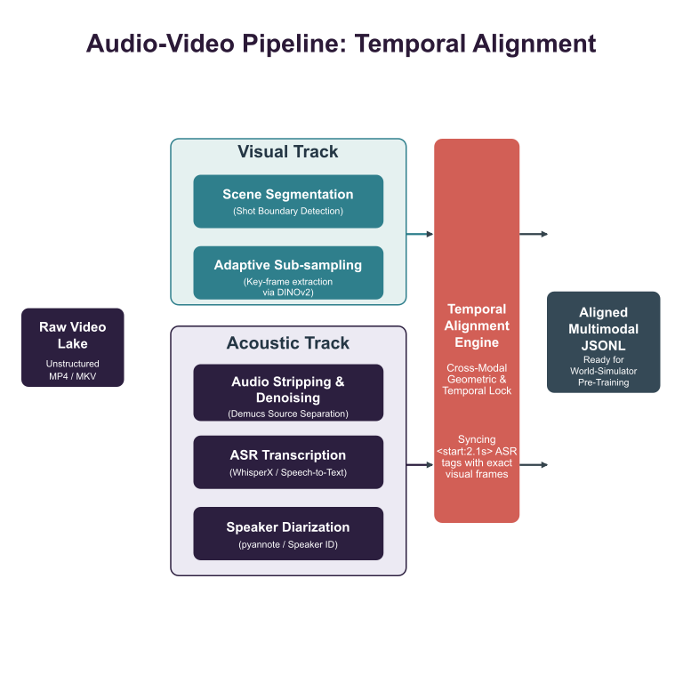
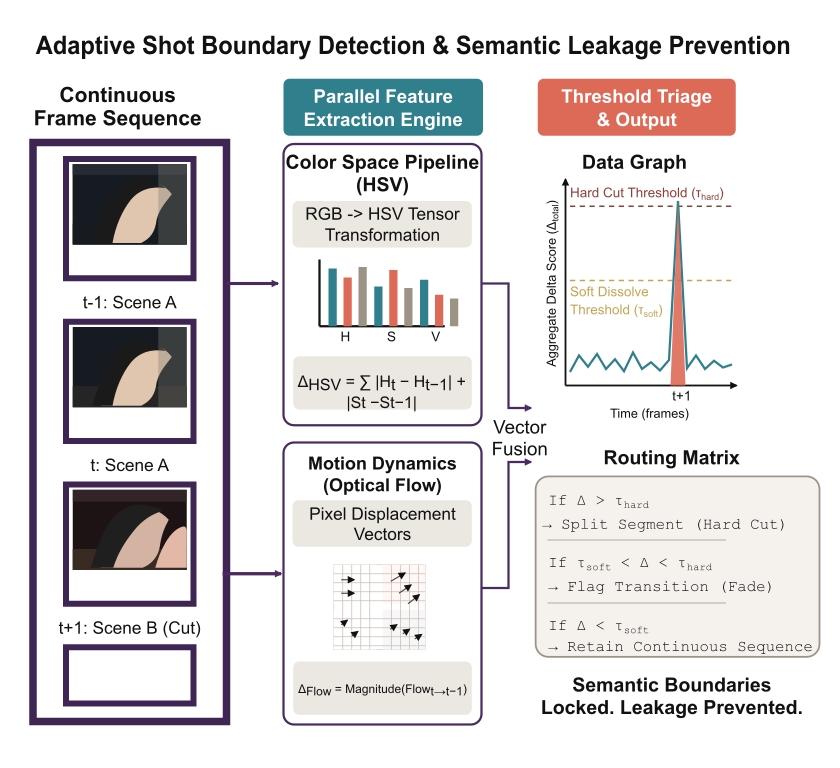
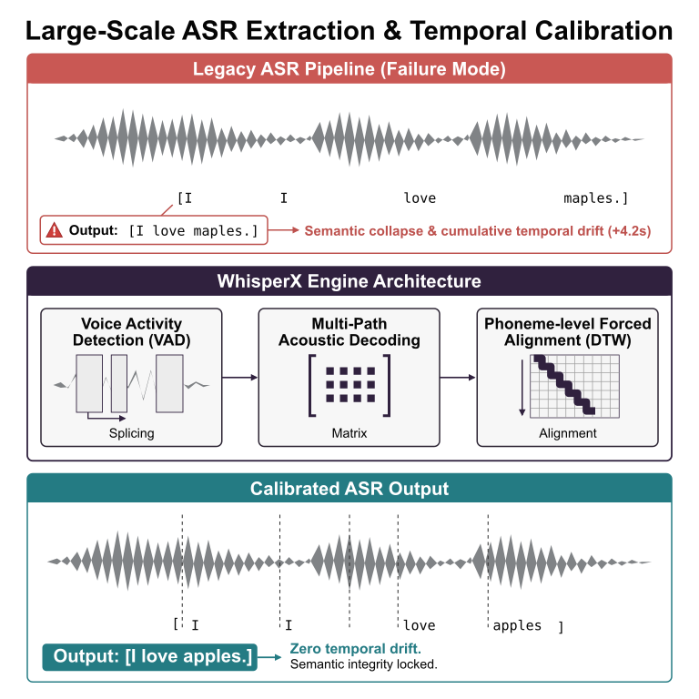
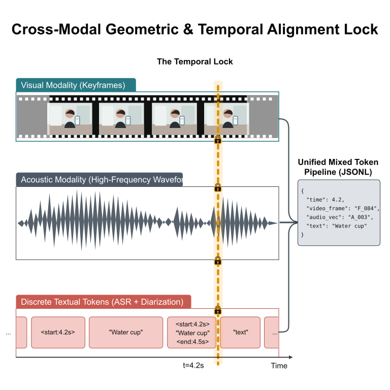

# 第10章 视频与音频数据工程

<div class="chapter-authors">王珂（Ke Wang）</div>

## 摘要

本章讨论视频与音频数据工程的核心问题，重点说明长时序多模态数据为什么在可用样本比例、解码成本、时序对齐和质量评估上显著难于静态图文。章节首先分析视频数据“看起来多、可用样本少”的原因，包括维度增长、静止冗余、底噪、音画分离和解码 I/O 瓶颈。随后建立视觉、声学和文本三轨并行流水线：镜头边界检测、关键帧抽取、ASR 转写、降噪、说话人分离、字幕纠错和时间戳对齐。后半章讨论事件标签、音画错配检测、成本模型、NVDEC/DALI 等硬件解码策略，并通过匿名化复合案例说明时序偏移如何破坏音视频学习信号。读者应能够设计可切片、可转写、可对齐、可审计的视频音频预处理管线。

## 关键词

视频数据；音频数据；ASR；WhisperX；镜头边界检测；时序对齐；NVDEC；多模态质量评估

## 学习目标

- 能够解释视频与音频数据在维度、冗余、噪声和解码成本上的特殊挑战。
- 能够设计镜头切分、关键帧抽取、ASR、降噪和说话人分离的三轨流水线。
- 能够说明时间戳、音画同步和跨模态语义一致性对训练样本质量的影响。
- 能够建立视频音频质量评估、严重等级和隔离策略。
- 能够估算解码、抽帧、ASR 和封装阶段的主要成本来源。

在经历了从自然语言文本（第一、二篇）到静态图文解析（第8、9章）的处理链路后，本章进入**长序列时序数据工程（Temporal Video & Audio Data Engineering）**。

在基于图文对或截帧的训练中，模型可以学习到物体类别、场景和静态关系，但很难理解一颗苹果“从桌子上掉落、滚入床底并发出撞击声”所包含的运动轨迹、声画同步和时间因果。要训练 Sora (Brooks et al. 2024)、Gemini 1.5 Pro (Gemini Team 2024) 这类能够处理长时序输入的模型，需要构建能够表达时间、动作和声音关联的数据样本。

这也意味着，数据工程问题从二维图文扩展到时间维和音频维，成本、质量和对齐难度都会显著上升。

## 10.1 音视频数据为什么最容易“看起来多、可用样本少”

许多刚接手多模态项目的架构师容易产生一种错觉：互联网上每天新增大量公开视频，似乎天然构成可训练数据池。然而当真正启动预训练预处理管线时，团队往往会发现，原始视频库中只有一部分能进入训练框架。可用比例取决于来源许可、内容类型、分辨率、音画同步、质量阈值和抽检标准，不能用原始存储体积直接估算训练样本规模。

这种反差的根源主要有以下三类：

### 10.1.1 维度灾难：从二维空间到四维时空序列

当处理纯图片（Image）时，即便分辨率很高（如 4K AnyRes），它的表达也主要是 $(W \times H \times C)$ 的二维张量。而对于视频，张量增加了时间维：$(T \times W \times H \times C)$。
这里的 $T$ 代表时间帧数（Timesteps）。一段 1 分钟、30 FPS 的短视频会产生 1,800 张连续图像。若直接对所有帧计算 CLIP Score 或视觉 Token 压缩，显存和计算量会迅速超出预算。因此，视频数据工程必须设计严格的**视频抽帧（Key-frame Sampling）**体系，通常会保留少数关键帧并丢弃大量冗余帧。系统性实验（Zohar et al. 2025，CVPR）表明，FPS 等速率采样策略在长视频理解任务中显著优于等间隔帧数采样，且该结论在不同模型规模间具有一致性。

### 10.1.2 表面丰富：无用过采样与高模态噪声

硬盘里确实有大量视频，但其中相当一部分可能是：
1. **静止冗余**：一个长达两小时的在线网课视频，画面可能有一整个小时仅仅是静态不变的 PPT 背景与右下角的人脸。如果框架将这几千张高度同质化的画面全部编码进去，训练信号会被低信息帧稀释。这类数据对模型认知提升有限，甚至可能降低有效样本比例。
2. **底噪与音画分离**：大量生活 VLOG 里混杂风噪、背景轰鸣，甚至经常出现画面里的人在打高尔夫、背景音乐却播放流行歌的“音画不相关（Audio-Visual Misalignment）”情况。对于需要学习物理因果（例如看到玻璃碎裂画面，应匹配玻璃碎裂声）的模型来说，这类野生音视频会提供错误监督信号。

### 10.1.3 容易低估的解码算力与存储瓶颈（I/O 瓶颈诊断回顾）

正如第6章 6.4节所讨论的那样，存储文本只需要读取纯文本 Byte；而存储并在训练期间动态加载长视频，会对底层文件系统带来更大压力。
视频数据通常以压缩域格式（如 H.264/H.265/VP9）存储。要提取模型可处理的像素帧序列和音频采样，就必须在加载第一步执行解码（Decoding）。当 100 张 H100 GPU 同时等待批次数据时，前端 CPU DataLoader 和集群 I/O 带宽可能因为并发解压 MP4 流而成为瓶颈。该硬件规模仅为示例，实际应按集群配置复测。

---

## 10.2 切片、转写与时序对齐的“三轨并行流水线”

面对长时序数据，数据清洗工厂不能沿用早期图文对时代的“一图配一句（Image-Text Pair）”模式。我们需要搭建一套能够剥离并处理视觉、声学和文本等多条独立轨道的**音视频样本构建全流程自动化平台**。



*图10-1：音视频对齐分布式管线图（Audio-Video Pipeline: Temporal Alignment） —— 左侧原始 Video Lake 中的混合视频被剥离为视觉（Visual Track）和声学（Acoustic Track）双轨并行管线，视觉帧提取器与声学分离器各自提取特征后，最终汇集入跨模态时间对齐引擎（Temporal Alignment Engine），生成带时间戳闭合约束的多模态输入样本（Aligned Multimodal JSONL）。来源：本书自绘；Alt text：音视频对齐分布式管线图，展示原始视频被拆分为视觉轨、音频轨和文本轨，并通过时间对齐引擎生成 JSONL 样本。*

### 10.2.1 视觉提取：镜头边界检测与场景动态切片（Scene Segmentation）

在进入训练之前，超长视频（例如 2 小时的电影）必须被切分成 10 秒到 30 秒不等、在逻辑与镜头上连续的小片段（Clips）。不宜使用简单的固定时长切分（如每 10 秒切一段），因为这可能导致动作或一句话在中间被截断，造成语义残缺。

1. **关键的镜头切换点检测（Shot Boundary Detection）**
   我们需要在视觉流水线（Top Path）中加入快速检测节点，如采用**双阈值颜色直方图比对**（硬切变 Hard Cut 采用高阈值、软渐变 Fade/Dissolve 采用低阈值）或轻量级的两帧之间光流差异（Optical Flow Difference）计算，以捕获视频中由于机位推拉、镜头剪辑引起的硬切变与软渐变。只有在同一镜头内保持的连续帧，才适合作为一个完整的知识概念（Event Grounding）进入预训练视觉模型。



*图10-2：自适应镜头边界检测与语义防泄漏架构图（Adaptive Shot Boundary Detection & Semantic Leakage Prevention） —— 展示双轨特征侦测逻辑：上层提取 HSV 多通道色彩空间聚合差分，下层提取光流像素位移（Optical Flow）以捕捉细微运动姿态。两种张量差分在右侧汇入“双重阈值路由（Dual-Threshold Triage）”。当突变分值 $\Delta$ 超过硬切阈值（Hard Cut Threshold）时，引擎切分片段，避免场景转换导致视觉切片语义泄漏。来源：本书自绘；Alt text：自适应镜头边界检测图，展示 HSV 差分、光流差分和双阈值路由如何共同判断镜头切分点。*

2. **自适应的抽帧过滤法（Adaptive Sub-sampling）**
   切片完成后，长达 20 秒的镜头虽然逻辑连贯，但在动作幅度上可能变化很小。工厂会部署小模型，持续验证当前帧与上一保留帧在稠密视觉特征（如 DINOv2 (Oquab et al. 2023) Embedding）上的位移距离。只有超过预设欧氏距离阈值时，才予以保留。最终，一段原本包含大量相邻帧的切片，会被压缩成少量关键帧。压缩比例取决于帧率、动作密度和阈值设置，应通过抽样回放确认没有切断关键动作。

### 10.2.2 听觉剥离：多层转写、降噪与声纹剥离切割（ASR & Diarization）

与视觉抽帧并行的底层通道（Bottom Path）负责提取声音语义。
首先进行的是**多路音轨抽离（Audio Stripping）**，然后进入如下的三层滤网：

#### A. 核心语义层提取：超大并发的 WhisperX 自动语音识别（ASR）
对于语音轨，常见做法是调用开源 Whisper (Radford et al. 2023) 或 WhisperX (Bain et al. 2023) 等框架，将夹杂口音、噪声和停顿的音频转写为带时间戳的结构化文字序列。



*图10-3：大规模 ASR 提取与时间轴动态校准对比图（Large-Scale ASR Extraction & Temporal Calibration） —— 展示传统 ASR 管道在长序列中可能产生累积性时间漂移（Cumulative Temporal Drift）和语义错误（将 `I love apples.` 误听写为 `maples.`）；中间展示 WhisperX 通过 VAD 切分、多路声学解码与 DTW（音素级强制对齐）矩阵进行时间校准；底部展示词汇 Token 与音频波谷通过垂直虚线对齐后的输出。来源：本书自绘；Alt text：ASR 提取与时间轴校准对比图，展示传统 ASR 漂移、WhisperX 校准和词级时间戳对齐结果。*

#### B. 底噪分离与语音增强（Denoiser Layer）
并非所有视频都拥有演播室级别的隔音。大量野外采集数据混杂强风噪或机械共鸣。这就需要使用 Demucs (Défossez et al. 2019) 或基于深度学习的音频分离算法（Source Separation），从混响光谱中分离背景音乐（BGM）、环境声（Environment Noise）和人声（Vocal）。

#### C. “到底是谁在说话？”：说话人日志切分（Speaker Diarization）
针对对话型播客（Podcast）或多人会议视频，如果将所有语音压成单轨字符串，模型在训练时无法分辨谁在提问、谁在回答。Diarization 算法可以把一条长音频切分并标注为 `[Speaker A]: 01:23-01:30` 和 `[Speaker B]: 01:31-01:40` 这样的说话人片段。

#### D. 大语言模型驱动的字幕纠错（Subtitle Error Correction）
单纯的 ASR 转写往往存在领域专业词汇（如代码、医疗术语）错误。在工业级管线中，通常会在 WhisperX 输出后加入一道 LLM 纠错（Error Correction）工序。通过向强 LLM 输入带有时间戳的 ASR 原始文本，并注入“请根据上下文逻辑修复错别字、标点符号，且绝对不能改变原有时间戳”的 Prompt，可以降低最终语料的词错率（WER）。具体收益取决于语言、噪声、领域词表和 ASR 模型版本，必须在带人工转写金标准的小样本上评估。

### 10.2.3 多轨时序对齐工程：字幕、语音与画面的时间维绑定

当视觉关键帧阵列、ASR 字幕和声音波形流收集完毕后，真正困难的是将这些信号在同一时间轴上绑定，即**跨模态几何与时间对齐（Cross-Modal Geometric & Temporal Lock）**。

一条字幕在 ASR 中写着 “Hello World!”，但在 10 秒钟时序片段里，究竟是哪几毫秒、哪个帧、哪个嘴型匹配这句声音，需要通过时间锚点（Temporal Anchors）明确。如果不建立这种绑定，大模型难以学习声画同步和口型匹配预测。



*图10-4：跨模态时序校准与几何对齐架构图（Cross-Modal Geometric & Temporal Alignment） —— 顶端青色轨道表示视觉关键帧（Visual Modality），中段灰色轨道表示声学特征（Acoustic Modality），底端珊瑚色轨道表示离散文本 Token（Discrete Textual Tokens）。中央时间轴在 `t=4.2s` 处将“端起水杯的视觉动作”、“波谷处的声学特征”与 `<start:4.2s> "Water cup"` 文本标签绑定，最终生成统一的 Mixed Token Pipeline / JSONL 样本。来源：本书自绘；Alt text：跨模态时序校准图，展示视觉帧、音频波形和文本 Token 如何通过同一时间轴锚点绑定。*

大型团队通常会基于时间戳矩阵部署 **Multi-modal Temporal Alignment Engine（多模时序融合校验门）**。一旦前端识别器给出类似 `<start:2.1s><end:4.5s>` 的坐标界限，代码需要通过浮点数判定逻辑，反切视频对应帧。最终，对齐信息不会只以视频形式交给大模型，而是被转换为包含元数据标签（Metadata Tags）、类似 HTML 的**多轨混拼长序列（Mixed Token Pipeline）**，以结构化 JSONL 方式交给训练 DataLoader。


---

## 10.3 事件标注与评价漏斗

虽然在 10.2 节中我们已经将视音频分轨并在时间维度绑定起来，但这批基础样本（Raw Structured Samples）在真正进入预训练引擎前，仍然需要更高维度的事件监督信号（Event Grounding Signals）和错配检测机制。

### 10.3.1 多层级连续动态事件标签强化生成网络（Event Detection & Grounding）

一段野生视频不能只有画面和 ASR 文本，还需要“物理世界动作流描述”。在大型管线内部，通常会并行调用行为理解视频模型（如 LLaVA-Video (Zhang et al. 2024)、Video-LLaMA (Zhang H et al. 2023) 等旁路模型集群），对已经对齐的视频小切片进行**异步标注（Asynchronous Captioning）**。

这些模型不仅要给出视频片段的一句话概括（例如“一个青年在滑板公园尝试后空翻并摔倒”），还要生成**动态事件标签（Dynamic Event Tags）与阶段性密集标注（Detailed Temporal Captions）**：

1. **粗粒度事件标签提取（Event Tagging）**：为片段打上诸如 `[Sports]`, `[Skateboarding]`, `[Accident]`, `[Impact_Sound]` 等结构化类别标签，方便数据混合配比（Data Mixing）。
2. **细粒度时间轴密标（Dense Video Captioning）**：
   - `<time: 01.2s-03.5s>`: 男生助跑并借力跃上 U 型池抛面...
   - `<time: 03.5s-05.1s>`: 男生试图在高空实现 360 度转体，但其背部失去平衡...
   - `<time: 05.1s-06.8s>`: 男生后背重重砸在混凝土滑道上，产生沉闷的低频冲击声响。

这类包含前因、过程与结果的强化标签文本和分类 Tag，会被注入上一节构建的多轨对齐 JSONL 中，使视频样本具备明确的时空语义。

### 10.3.2 声音与画面错位检测

长时序中最严重的对齐错误之一，是画面与声音发生不相关错位。例如，视频里是一头安静吃草的长颈鹿，但剪辑者在该段混入电音或无关游戏解说。如果这类数据进入基座训练，模型可能在看到长颈鹿时错误关联到无关音乐或解说，形成跨模态幻觉（Hallucinations）。

为降低此类风险，工程内部必须引入严格的错配检测与复检流程：

*表10-1：时序音视频数据缺陷类型与多层检测处置策略表。来源：本书整理，检测与处置策略为工程模式归纳，阈值需通过抽样回放和下游评测校准。*

| 缺陷类型与表现 | 根本原因分析 | 检测与修复策略 | 严重程度 |
| :--- | :--- | :--- | :--- |
| **严重音画不相关（Audio-Visual Hallucination Mismatch）**：画面是一片寂静森林远景，而人声音轨正在解说 FPS 射击比赛。 | 二次剪辑视频错误拼接，或自动化压片时音轨串线泄漏（Audio Track Bleeding）。 | **使用预训练判别器计算特征余弦分数**：抽取中间帧的 CLIP 视觉向量，与人声/音频语义向量进行相似度计算。如果跨模态向量相似度低于预警阈值，隔离该片段并废弃该时间窗标注。 | P0：不可入库 |
| **画面闪烁/黑屏/极端马赛克（Frame Corruption & Dark Out）** | 原视频编码比特率过低，或传输网络发生严重丢包。 | 计算整段片段的**亮度直方图极差均值与锐度得分过滤（Laplacian Variance Filters）**。若画面长期黑屏或模糊溢出，触发拦截，记录异常并回溯抽帧模块与解码算子。 | P1：需隔离复核 |
| **背景环境噪音淹没人声（Irreversible Noise Flooding）** | 现场麦克风破音，或背景包含难以分离的高频机械噪声。 | 使用小模型针对全频带频谱（Spectrogram）运行**声学信噪比评估（SNR Estimation）**，低于底线阈值的人声轨应被降权或剔除；对话相关项目通常直接舍弃该片段。 | P2：取决用途 |

---

## 10.4 成本模型、量化设计与吞吐优化

相比纯文本处理，长时序多模态管线会显著提高云服务 GPU、对象存储、网络带宽和数据解码成本。

在文本处理场景中，Markdown 或网页正文解析通常远轻于视频解码；而在视频清洗场景中，即便以 1 万小时高清 MP4 文件这样的示例规模估算，将视频读取并解码为张量供特征抽取使用，也会迅速消耗 CPU、内存、PCIe 和存储带宽。这里的规模为示例口径，实际吞吐取决于视频编码格式、分辨率、并发度和硬件配置。

### 10.4.1 解码器算力（CPU/GPU）与 I/O 带宽量化

关键问题是“到底用什么硬件解码（Decoding）视频帧”。
1. **纯 CPU 软件解码的局限**：在早期架构设计中，团队可能使用高配 CPU、多线程 ffmpeg 或 Python OpenCV 进行软件解码。高并发下，内存搬运和 PCIe/RAM 带宽会很快成为瓶颈。
2. **硬件编解码引擎加速（Hardware Video Decoders, NVDEC）**：更适合大规模清洗的方案，是将解码任务卸载至专有硬件。通过调用 GPU 芯片里的视频解码模块（例如 NVDEC API），可以减少 CPU 解码压力并提升吞吐。虽然需要购买 GPU 实例，但在大规模清洗下通常是降本的核心手段。

### 10.4.2 音视频综合质量评估指标（A/V Quality Assessment）

为了决定一条经过解压的视频是否值得送入下一层流水线，我们需要建立自动化质量评估指标集：

- **画面美学与清晰度得分（Aesthetic & Sharpness Score）**：使用诸如 LAION-Aesthetic 模型对抽取关键帧打分，过滤严重模糊或马赛克画质。
- **动态模糊与运动过载指数（Motion Blur & Optical Flow Overload）**：如果镜头抖动剧烈，其光流位移方差很大，将降低视觉编码质量，应被剔除或降权。
- **语音信噪比与声学失真度（SNR & Clipping Ratio）**：检测环境底噪掩盖人声的程度，剔除刺耳破音片段。

### 10.4.3 工业级处理成本模型分解表

数据工程师需要对每一层处理的单位成本保持清晰认识。

*表10-2：长时序音视频处理成本驱动因素与降本策略。来源：本书整理，成本驱动因素应按云厂商价格、硬件规格、并发限制和缓存策略重新核算。*

注：表10-2不提供通用成本占比，因为实际账单取决于云厂商价格、GPU 型号、视频分辨率、采样帧率、ASR 模型、缓存命中率和对象存储计费方式。工程上更稳健的做法，是先识别成本驱动因素，再在目标环境中做小批量压测。

| 处理阶段 | 资源开销特征 | 成本驱动因素 | 工程降本策略 |
| :--- | :--- | :--- | :--- |
| **1. 原始长流抓取与分块下载** | 高带宽网络，海量对象存储大区块 I/O。 | 跨区流量、对象存储请求数、缓存命中率 | 引入边缘缓存网关（Edge Caching），预加载碎片到 GPU 附近的高速 NVMe 盘，减少直连慢存储。 |
| **2. 硬解码与智能抽帧** | NVDEC 硬解模块、显存与 PCIe 带宽压力较高。 | 分辨率、编码格式、采样帧率、并发解码路数 | 使用 DALI 或硬件解码替换 Python OpenCV；结合镜头边界检测和关键帧过滤，避免无用帧解码。 |
| **3. ASR 与密集重描述（WhisperX/LLaVA）** | 显存消耗高，GPU 推理计算密集。 | 音频时长、模型大小、批处理效率、领域纠错策略 | 使用量化模型；实施动态批处理（Dynamic Batching）减少 Pad 算力浪费。 |
| **4. 序列合并封装写入** | 后端 NAS/S3 并发写入小文件 I/O 压力。 | shard 大小、小文件数量、校验和与索引策略 | 采用 WebDataset (TAR) 格式，聚合成 GB 级连续块写入，可降低小文件开销。 |

---

## 10.5 匿名化复合案例

### 10.5.1 大规模视频数据管线失败案例复盘（匿名化复合案例）

以下为匿名化复合案例，用于说明时序校准缺失的风险口径。某视频自研项目中，团队积累了大量高清混合视频素材，数据集构建工作最终未达到预期。

根源在于：工程架构中省去了多重关键的时序校准步骤。音频特征分离模块的接口传参存在读取偏置（Reading Offset Bug），在多次切分与合并操作后，该偏置累积，导致后半段切片中演员声音轨道相对口型和动作出现系统性超前或滞后。

将这批存在时序错位的数据送入模型训练后，音视频关联能力明显下降：在基准测试中，只要看到特定人物动作，就会输出与画面无关的声学预测。

这一案例再次印证了第1章的核心结论：**没有严格的数据预处理工程保障，算法层面的投入无法弥补底层数据的根本缺陷。**

### 10.5.2 与下一章的衔接

从第一、二篇的文本清洗，到第8、9章的图文像素对齐，再到本章处理的长时序音视频数据，我们已系统地掌握了各类异构数据的预处理方法——包括视频帧抽取、ASR 转写、音画对齐、事件标注与质量过滤。

视频与音频管线解决了长时序样本的切片、转写和时间同步问题，但多模态训练还需要回答另一个问题：图像、文本、音频和视频这些信号如何在同一语义空间中形成稳定对应关系。下一章将进入**第11章 跨模态对齐与融合**，讨论对象级、片段级和文档级的对齐样本构建。


## 10.6 附录：音视频管线高频错误日志示例与排查手册

> 以下为大规模音视频预处理管线中常见的匿名化错误日志示例，覆盖 I/O、解码、ASR 对齐、Diarization 和存储写入五大核心链路。日志中的主机名、路径、批次号和指标均为示例性参数，不对应公开事故；每类附根因分析与修复方案，后附全类型速查表。

---

### 10.6.1 I/O 雪崩：S3 并发拉流超限导致 DataLoader 死锁 [TMP_ERR_CODE_1001]

**[故障现象]**：大规模 GPU 集群启动时，数百个 DataLoader worker 同时向 S3 对象存储发起大块 MP4 拉流请求，导致骨干网带宽和节点文件句柄迅速耗尽，训练进程进入等待状态。

代码清单10-1展示了 S3 并发拉流超限导致 DataLoader 死锁的错误日志示例。

*代码清单10-1：S3 并发拉流超限错误日志示例。日志内容为匿名化示例，指标和路径不对应公开事故。*

```bash
[FATAL] node-001.gpu-cluster.internal:
Connection reset by peer. Timeout extracting frame chunk from blob: /bucket-v/dataset/vid_slice_0001.mp4
File descriptor limits exceeded (Too many open files).
RuntimeError: Multiprocessing synchronization lock stuck at DataLoader worker 1.
AVSync_Module: Subtitle timestamp [1.21s] completely drifts out of matched acoustic window bounds.
```

**[根因与修复示例]**：

- **根因**：未设置随机抖动退避（Exponential Backoff），所有 worker 在同一毫秒同时发起大块请求。
- **修复**：①在 PyTorch DataLoader 读取逻辑中加入随机抖动重试机制；②结合操作系统与容器运行时配置扩大文件句柄池上限；③将对象存储读取从大块并发拉取改为更细粒度的分块读取，并通过边缘缓存网关节点（Edge Caching Layer）预热到 NVMe 本地盘后再读取。具体退避窗口、句柄上限和分块大小应依据集群规模、存储后端限流策略与压测结果确定。

---

### 10.6.2 NVDEC OOM：GPU 硬件解码器显存溢出 [TMP_ERR_CODE_2001]

**[故障现象]**：在使用 NVIDIA NVDEC 硬件解码器进行高分辨率（4K）视频并发解码时，显存快速耗尽，解码进程中断并影响训练节点。

代码清单10-2展示了 NVDEC 并发解码显存溢出的错误日志示例。

*代码清单10-2：NVDEC 并发解码显存溢出错误日志示例。日志内容为匿名化示例，硬件限制需以实际设备规格与压测结果为准。*

```bash
[FATAL] node-007.gpu-cluster.internal:
NVDecCreateDecoder failed: CUDA_ERROR_OUT_OF_MEMORY (error 2)
Video resolution 3840x2160 exceeds NVDEC hardware capability on A100-40GB.
cudaMemcpy failed during frame copy: cudaErrorIllegalAddress
Decoder context invalidated. All queued frames dropped (estimated loss: 2.3TB).
```

**[根因与修复]**：

- **根因**：4K 分辨率超过 NVDEC 单实例容量上限；多路并发解码未做显存配额隔离。
- **修复**：①在解码前强制降采样到 1080p（`-vf scale=1920:1080`）；②每张 GPU 限制最大并发解码路数（H100 建议 ≤24 路 1080p）；③使用 DALI 的 `VideoReader` 替代 OpenCV，内置显存 quota 管理。

---

### 10.6.3 ASR 时序漂移：WhisperX 长视频字幕时间戳大幅偏移 [TMP_ERR_CODE_3001]

**[故障现象]**：对长视频进行 ASR 转写时，WhisperX 输出的字幕时间戳在后半段产生累积性漂移，严重时会导致音视频对齐完全失效。

代码清单10-3展示了 WhisperX 长视频时间戳漂移的错误日志示例。

*代码清单10-3：WhisperX 时间戳漂移错误日志示例。日志内容为匿名化示例，漂移阈值应通过抽样回放和下游评测校准。*

```bash
[WARN] whisperx_worker_3: Timestamp drift detected at segment 847.
Expected anchor: [1823.4s], Model output: [1831.8s]. Delta: +8.4s.
[ERROR] TemporalAligner: Cross-modal lock failed - audio anchor outside visual frame window.
Alignment quality score: 0.23 (threshold: 0.75). Segment rejected and quarantined.
```

**[根因与修复]**：

- **根因**：WhisperX 使用 VAD（语音活动检测）切段时，静音片段被错误跳过，导致时间戳累积偏移；长视频中 BGM 混音干扰 VAD 判断。
- **修复**：①将长视频按项目设定的最大时长切割为更短子段后再转写；②在 VAD 前先做 Demucs 人声分离，去除 BGM；③以滑动窗口校验时间戳锚点，一旦漂移超过对齐水位线就触发重对齐。子段长度、窗口大小和漂移阈值应通过抽样回放与下游评测共同校准。

---

### 10.6.4 Diarization 崩溃：说话人分离模型内存泄漏导致进程 OOM [TMP_ERR_CODE_4001]

**[故障现象]**：长时间批量运行 pyannote-audio (Bredin et al. 2020) Diarization 任务时，进程内存占用随批次数线性增长，并最终触发系统 OOM Killer，所有已处理任务结果丢失。

代码清单10-4展示了说话人分离任务内存泄漏的错误日志示例。

*代码清单10-4：Diarization 内存泄漏错误日志示例。日志内容为匿名化示例，内存水位和批次大小应按节点配置压测。*

```bash
[ERROR] diarization_worker_12: Killed by OOM Killer (signal 9).
Process memory at kill time: 187.3 GB / 192 GB RAM.
pyannote.audio: SpeakerDiarization pipeline not released between batches.
torch.nn.Module references retained in embedding cache (est. leak: 2.1 GB/batch).
Unprocessed queue depth at crash: 3,421 audio segments (est. 68h audio).
```

**[根因与修复]**：

- **根因**：pyannote Pipeline 对象在批次间未被显式销毁，嵌入缓存不断累积；PyTorch 计算图未及时释放。
- **修复**：①每批次处理完后显式调用 `del pipeline; torch.cuda.empty_cache(); gc.collect()`；②使用独立子进程（`multiprocessing.spawn`）运行每批 Diarization，批次结束后进程退出自动回收内存；③按节点内存、模型占用和压测结果限制每批次处理音频长度上限。

---

### 10.6.5 WebDataset 写入碰撞：多进程并发写入同一 shard 导致文件损坏 [TMP_ERR_CODE_5001]

**[故障现象]**：分布式清洗管线在最终封装阶段，多个 worker 进程并发向同一 `.tar` shard 文件写入，导致文件结构损坏，训练时 DataLoader 抛出解析错误。

代码清单10-5展示了 WebDataset shard 并发写入损坏的错误日志示例。

*代码清单10-5：WebDataset shard 并发写入损坏错误日志示例。日志内容为匿名化示例，生产环境应配合 shard 写入锁、校验和与重试策略。*

```bash
[ERROR] training_node_44: WebDataset TarReader failed on shard: /data/processed/shard_0023.tar
tarfile.ReadError: invalid header magic bytes at offset 2147483392.
Estimated corrupted samples in shard: ~4,200 (approx 12.3GB of aligned multimodal data).
DataLoader worker 0: Pipe broken, resetting shard iterator. Skipping shard.
```

**[根因与修复]**：

- **根因**：未使用写锁（file lock）或分 shard 策略，多进程并发写同一文件导致字节流交叉写入。
- **修复**：①每个 worker 分配独立 shard 文件（按 worker_id 命名）；②写完后再由主进程合并或直接上传到 S3；③使用 `wids`（WebDataset Indexed Shards）格式替代 `.tar`，支持安全随机写入与索引。

---

## 10.6.6 高频错误速查表

*表10-3：音视频管线高频错误类型与修复策略。来源：本书整理，错误代号和修复策略为匿名化工程模式归纳。*

| 错误代号 | 错误类型 | 核心触发条件 | 一句话修复策略 |
| :--- | :--- | :--- | :--- |
| TMP_ERR_CODE_1XXX | S3/I/O 超时 | 大规模并发拉流无抖动退避 | 加 Jitter Sleep + 边缘缓存预热 |
| TMP_ERR_CODE_2XXX | NVDEC OOM | 4K 视频无限制并发解码 | 降采样至 1080p + 限并发路数 |
| TMP_ERR_CODE_3XXX | ASR 时序漂移 | 长视频 VAD 错误跳过静音段 | 分段转写 + 滑窗校验时间戳锚点 |
| TMP_ERR_CODE_4XXX | Diarization OOM | Pipeline 对象批次间未释放 | 子进程隔离 + 每批显式 gc.collect |
| TMP_ERR_CODE_5XXX | Shard 文件损坏 | 多进程并发写同一 .tar | 每 worker 独立 shard + 主进程合并 |
| TMP_ERR_CODE_6XXX | 音画不相关幻觉 | BGM 混入训练语料 | 按项目基线设置 CLIP/SigLIP 跨模态余弦过滤水位 |
| TMP_ERR_CODE_7XXX | 解码帧乱序 | ffmpeg seek 精度问题 | 强制 `-ss` 参数放到 input 前 |
| TMP_ERR_CODE_8XXX | SNR 过低音轨 | 野外噪声超过项目噪声水位 | Demucs 分离 + 按任务类型设置 SNR 丢弃阈值 |

## 本章小结

本章围绕“视频与音频数据工程”梳理了该主题在大模型数据工程中的核心问题、处理流程和验收口径。其贡献在于把概念、数据对象、质量信号和工程交付放入同一套叙事中，使读者能够判断哪些环节需要被显式记录，哪些结果需要通过抽样、评测或审计来验证。

本章方法的适用范围应结合数据来源、业务目标、模型能力、成本预算和合规要求共同判断。对于涉及敏感信息、跨系统调用、自动化决策或公开发布的场景，应保留人工复核、版本冻结、权限控制和异常回滚机制，避免把示例流程直接外推为生产承诺。

在全书结构中，本章位于多模态数据工程层，承担承接前文基础概念并导向SFT、偏好和跨模态对齐的作用。读者可将本章的框架与图表、参考文献和附录清单配合使用，把章节中的方法进一步转化为可复现、可检查、可交付的工程流程。

## 参考文献

Bain M, Huh J, Han T, Zisserman A (2023) WhisperX: Time-Accurate Speech Transcription of Long-Form Audio. arXiv preprint arXiv:2303.00747.

Bredin H, Yin R, Coria J M, Gelly G, Korshunov P, Lavechin M, Fustes D, Titeux H, Bouaziz W, Gill M P (2020) pyannote.audio: Neural Building Blocks for Speaker Diarization. In: IEEE International Conference on Acoustics, Speech and Signal Processing, pp 7124-7128.

Brooks T, Peebles B, Holmes C, DePue W, Guo Y, Jing L, Schnurr D, Taylor J, Luhman T, Luhman E, Lyu C, Ying P (2024) Video Generation Models as World Simulators (Sora). OpenAI Technical Report.

Défossez A, Usunier N, Bottou L, Bach F (2019) Music Source Separation in the Waveform Domain (Demucs). arXiv preprint arXiv:1911.13254.

Oquab M, Darcet T, Moutakanni T, Vo H, Szafraniec M, Khalidov V, Fernandez P, Haziza D, Massa F, El-Nouby A, Assran M, Ballas N, Galuba W, Howes R, Huang P, Li S, Misra I, Rabbat M, Sharma V, Synnaeve G, Xu H, Jegou H, Mairal J, Labatut P, Joulin A, Bojanowski P (2023) DINOv2: Learning Robust Visual Features without Supervision. Transactions on Machine Learning Research.

Radford A, Kim J W, Xu T, Brockman G, McLeavey C, Sutskever I (2023) Robust Speech Recognition via Large-Scale Weak Supervision (Whisper). In: Proceedings of the 40th International Conference on Machine Learning, pp 28492-28518.

Gemini Team (2024) Gemini 1.5: Unlocking multimodal understanding across millions of tokens of context. arXiv preprint arXiv:2403.05530.

Zhang H, Li X, Bing L (2023) Video-LLaMA: An Instruction-tuned Audio-Visual Language Model for Video Understanding. arXiv preprint arXiv:2306.02858.

Zhang Y, Wu J, Li W, Li B, Ma Z, Liu Z, Li C (2024) Video Instruction Tuning with Synthetic Data (LLaVA-Video). arXiv preprint arXiv:2410.02713.

Zohar O, Wang X, Dubois Y, Mehta N, Xiao T, Hansen-Estruch P, Yu L, Wang X F, Juefei-Xu F, Zhang N, Yeung-Levy S, Xia X (2025) Apollo: An Exploration of Video Understanding in Large Multimodal Models. In: Proceedings of the IEEE/CVF Conference on Computer Vision and Pattern Recognition. arXiv preprint arXiv:2412.10360.
