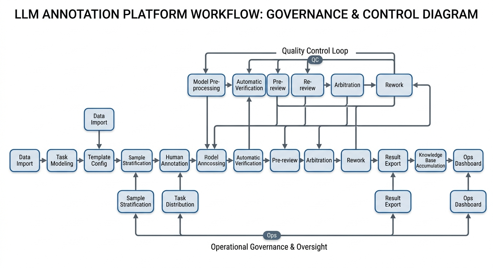
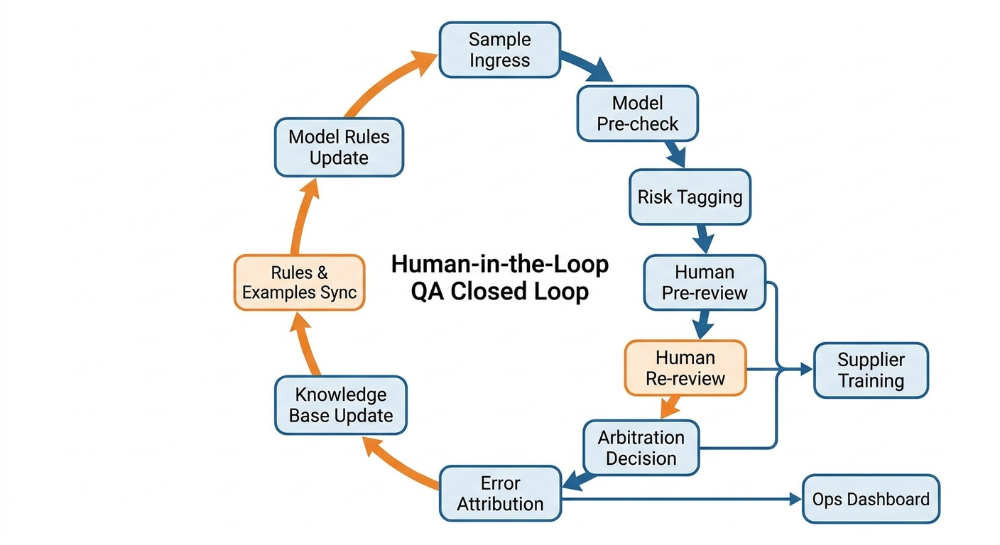

# 第14章 标注平台、质量保障体系与数据运营

## 摘要

本章围绕“标注平台、质量保障（Quality Assurance，QA）体系与数据运营”展开，聚焦大模型数据工程中的关键设计问题。章节从场景约束、数据对象、流水线设计、质量评估和工程治理等维度展开，说明如何把零散的数据处理动作收敛为可复盘、可验证、可交付的系统方法，并为后续章节和项目实战建立统一分析框架。

## 关键词

标注平台；QA 体系；数据运营；标注一致性；人机协同；质量控制

## 学习目标

- 能够阐述标注平台从“任务发放工具”升级为“数据生产系统”的观念转变，及其与传统 CV/NLP 标注的差异。
- 能够将业务目标拆解为标注单元，针对单轮问答、多轮对话、比较标注和审稿式标注设计字段、操作视图与提交结构。
- 能够设计样本分发、权限控制、进度监控、返工机制与升级路径，并在工作流中嵌入人机协同。
- 能够组合预审、复审、仲裁、抽检、盲审等模式，运用一致性指标、黄金集与陷阱题构建 QA 与质量分层体系。
- 能够围绕人效、质量、周期、成本四类运营指标治理供应商，并通过知识库与复盘库沉淀组织能力。

当大模型研发进入规模化阶段之后，数据问题的重心会发生明显变化。早期团队更关心“有没有数据”，中期团队更关心“数据够不够多”，而进入工程化生产之后，团队最关心的问题往往会变成“数据是否稳定、是否可控、是否能持续迭代”。这时，标注工作已经超出模型训练前准备动作的范畴，成为连接需求、流程、质量、成本和组织能力的关键枢纽。

很多团队之所以在数据生产上反复遇到同类问题，根源通常不在于缺少努力或没有人做事，而在于他们仍然用传统项目制思维理解大模型数据生产。他们把标注平台理解为任务发放界面，把质检理解为末端抽查，把运营理解为排班和催进度。这样的理解在小规模、短周期、低复杂度任务中也许还能勉强成立，但在大模型场景下几乎一定会失效。因为大模型数据的特点决定了，任务边界更开放，答案形态更多样，质量标准更复合，人员判断更主观，数据迭代也更频繁。于是，平台、质检和运营已不能作为三个彼此独立的职能存在，必须被设计成一个相互联动的数据生产系统。这种判断也可以从数据质量研究中得到支撑：高质量数据并不只取决于“准确性”，还取决于任务适配性、可解释性、可访问性和面向使用者的质量维度 (Wang and Strong 1996; Pipino et al. 2002)。

本章面向负责标注团队、平台流程和质量管理的读者，围绕标注平台、质检体系与数据运营展开，重点讨论一个经常被忽视但极其关键的主题：在大模型时代，标注如何从“人工作业”升级为“系统化生产”。在这一过程中，平台承担的职责超出系统本身，质检也超出检查动作，运营同样超出管理事务；它们共同构成了数据质量的组织性保障。同时，本章将进一步补入人机协同、知识库建设、标注生产率与成本治理等内容，帮助读者从项目执行视角，迈向体系建设视角。


## 14.1 标注平台的目标

### 14.1.1 标注平台的核心：从“发任务工具”到质量控制系统

在许多组织的早期认知中，标注平台的核心价值似乎非常直接：把样本导入系统，给不同人员分配任务，让他们提交结果，然后把结果导出，供后续训练使用。按照这种理解，平台的主要功能不过是任务管理、账号权限、进度统计和数据导入导出。只要这些功能齐全，平台似乎就“能用了”。

但大模型数据生产的实践很快会证明，这样的平台顶多只能称为任务流转工具，还远远不能称为标注平台。因为决定数据是否可用的，并非任务有没有被发出去、结果有没有被收回来，关键在于平台能否把质量标准嵌入任务定义、执行、审核、返工和沉淀的全过程。也就是说，标注平台的目标应从“让任务流动”转向“让质量被控制”。这一点与数据质量管理中“质量维度需要被度量、监控和改进”的思路是一致的 (Wang and Strong 1996; Pipino et al. 2002)。

所谓“质量控制系统”，含义并非在平台上多加几个质检按钮，或在提交后增加一个抽检页面。它意味着，平台要能够把质量要求结构化、流程化和制度化。结构化，是指平台能够把复杂标注要求拆解为字段、步骤、限制条件和操作界面，让标注员避免在一个无限开放的空间里自由发挥，转而在受控边界内完成任务。流程化，是指平台能够让任务在待标注、待预审、待复审、待仲裁、返工中、已通过、已归档等状态之间有规则地流转，质量动作成为系统规定的一部分。制度化，则意味着平台必须支持角色隔离、日志留痕、错误标签、规则引用和版本追踪，使每一次判断都能被解释、被复查、被沉淀。

从这一视角看，平台的价值不在于把人连接起来，而在于把规则落实下来。一个成熟的平台，往往能够在任务开始前就通过模板约束减少低级错误，在执行过程中通过自动校验拦截明显违规，在提交后通过预审与复审分层处理不同风险等级的问题，在出现争议时通过仲裁机制给出最终裁定，并在裁定结束后把案例和规则重新沉淀回知识库。此时，平台已经超出中性容器的角色，成为质量机制的实现载体。

这也是为什么，越是复杂的大模型项目，越不能把平台建设理解为一个纯技术实现问题。平台设计本质上是一种治理设计。它决定了哪些规则能被强制执行，哪些质量问题会在前端暴露，哪些争议会在中途被拦下，哪些经验能够在事后被记住。如果平台没有承载这些功能，那么组织即使有指南、有运营、有质检，也会大量依赖线下沟通、人工表格和个人经验。短期内似乎灵活，长期看则一定不稳定。

因此，理解平台的第一步，就是从“发任务工具”的观念中走出来。平台的目的不在于把工作派下去，而在于把判断标准制度化、把质量控制流程化、把组织经验系统化。对于大模型数据生产而言，这种转变远非锦上添花，它是从手工作坊走向工业化生产的起点。

### 14.1.2 从“任务管理界面”到“数据生产系统”的观念转变

如果进一步追问，为什么很多团队会低估平台的作用，一个重要原因在于他们仍然把标注看作一次性项目，尚未把它视为持续性生产。一次性项目的典型思路是：需求来了，先搭流程，把任务发下去，临时组织人力做完，交付之后系统使命基本完成。于是，平台自然被理解为“让这次项目顺利跑完”的工具。

然而，大模型数据生产往往不是一次性的。今天做的是SFT问答，明天可能要扩展到多轮对话和偏好比较，后天又可能加入审稿式修订、安全拒答和工具调用。指令微调、人工反馈强化学习、偏好建模和后续的直接偏好优化，都使标注从“给标签”扩展为“塑造模型行为”的长期过程 (Wei et al. 2022)。任务类型在变化，质量标准在变化，标注团队在变化，供应商也在变化。如果平台仍然按照一次性项目思维建设，那么每次需求变化都会引发一轮新的手工补丁：重新发指南、重新开表格、重新拉群、重新人工对齐。组织会越来越依赖少数经验丰富的人来“兜住系统”，难以让系统本身承接复杂度。

因此，平台要承接的，已经超出某一批数据的生产，指向整个组织的数据生产能力。它必须支持任务快速配置而不失控，支持规则迭代而不混乱，支持多团队协同而不漂移，支持经验沉淀而不流失。也就是说，平台要从“界面系统”升级为“生产系统”。前者解决的是操作问题，后者解决的是组织能力问题。

当平台被视为生产系统后，设计重点也会发生改变。管理者不再只关心有没有创建任务、有没有提交按钮，而会开始关心以下问题：规则能否被前置到系统里？质检动作能否成为默认流程的一部分？返工信息能否被结构化记录？边界案例能否沉淀进知识库并在后续任务中复用？不同供应商是否可以在同一套平台规则下被持续校准？如果这些问题都无法被平台承接，那么平台即使“能跑”，也仍然只是项目层面的任务承载器。

从这个意义上说，标注平台的目标，应从支持某一次任务顺利完成，延伸到逐步让组织具备持续生产高质量数据的能力。这种能力越成熟，团队越不依赖临时协调和个人经验；反之，平台越薄弱，项目越大，组织就越容易陷入反复被动处置的状态。

### 14.1.3 大模型数据标注与传统计算机视觉（Computer Vision，CV）/自然语言处理（Natural Language Processing，NLP）标注的差异

如果说平台为什么必须从任务工具升级为质量控制系统，那么最根本的原因，就在于大模型数据标注本身已经不同于传统的 CV 或 NLP 标注任务。很多团队在建设标注体系时最容易犯的错误，就是把过去做分类、检测、分割、实体识别、情感分类时的经验，直接平移到大模型数据上。他们默认任务只是“更复杂一点”，却没有意识到任务范式本身已经变了。

传统 CV 标注面对的往往是目标框、分割区域、关键点或预定义类别。传统 NLP 标注面对的则通常是实体类型、关系标签、情感极性、意图类别或句法结构。这类任务当然也会有边界模糊和人工歧义，但整体上，它们的判断对象相对明确，输出空间相对有限，任务定义也更容易用一套静态标签体系覆盖。质检的重点，多半放在“标得对不对”“边界准不准”“类别选得准不准”上。

而大模型数据标注的核心对象，往往已经从单一标签转向模型行为本身。这里的标注，除了判断一个答案是否正确，还包括判断它是否完整、是否符合用户意图、是否遵守风格要求、是否具有安全边界意识、是否逻辑连贯、是否表达自然、是否结构清晰，甚至还包括在多个候选答案中比较哪一个“更好”，以及说明“为什么更好”。也就是说，大模型标注所面对的，已经从简单目标扩展为一组复合标准共同作用下的行为评价。InstructGPT、摘要偏好学习和基于人类偏好的强化学习研究，都体现了这种从标签判断转向行为偏好和目标对齐的变化 (Stiennon et al. 2020)。

这种变化会带来若干实质性影响。首先，答案空间从封闭走向开放。很多传统标注任务只有有限几个类别，而大模型任务可能存在多个都可接受的答案，甚至同一个问题在不同场景下可以有不同风格的高质量回应。其次，质量维度从单维走向多维。传统标签任务通常围绕“是否正确”展开；大模型任务常常同时涉及事实性、完整性、清晰度、格式性、安全性与风格一致性。再次，主观判断比例显著上升。许多大模型任务并没有唯一标准答案，需要在多个合理候选中进行带解释的判断。最后，规则更新频率更高。传统数据集的标签定义可能数月不变，但大模型项目中的策略、风格、风险边界和产品需求都可能在较短周期内频繁变化。开放式问答与多轮对话评测中的 LLM-as-a-judge 研究，也专门讨论了位置偏差、冗长偏差和与人类偏好一致性等问题，说明开放式评价不能简单等同于传统分类准确率 (Zheng et al. 2023)。

正因为存在这些差异，大模型数据标注不能简单复制传统模式。如果仍然把平台做成“给一个输入、收一个输出”的简单表单系统，把质检理解成末端抽查，把运营理解成监督进度，那么项目往往会迅速出现质量漂移、口径不一、返工堆积和成本失控。大模型数据生产需要的，已经超出扩大标注团队本身，还包括更强的规则建模能力、更细的流程治理能力和更持续的质量校准能力。

从更深层的角度说，大模型标注与传统标注的差异，也意味着标注员的角色发生了变化。在传统任务中，标注员更像是标签执行者；在大模型任务中，标注员在相当程度上已经变成了“行为编辑者”或“质量裁判者”。这对平台、培训、权限和QA体系都提出了更高要求。因为你对标注员的要求已经超出“认出东西”，进一步转向“按规则判断什么样的回答更符合目标系统的行为预期”。

### 14.1.4 大模型标注复杂性的具体来源

为了理解平台为什么必须升级，还需要进一步看到大模型标注复杂性究竟来自哪里。很多团队会模糊地说“大模型任务更复杂”，但如果不拆开来看，这种复杂性就无法被系统设计所吸收。

第一类复杂性来自**任务开放性**。同一个问题可能存在多个合理答案，不同答案可能在风格、结构和深度上存在差异，但它们未必都是错的。于是，平台需要从单点打标签扩展到维度化评估、理由记录和多层级审核。第二类复杂性来自**质量复合性**。大模型输出往往不能用单维好坏概括，其中交织着多个质量维度。一个回答可能事实正确但过于冗长，也可能结构清楚但遗漏用户需求，还可能整体不错但在安全边界上存在风险。平台如果不能把这些维度拆开，就无法让质检和返工具有针对性。多维数据质量框架和标注一致性研究都说明，复杂标注对象需要被拆解为可解释、可复核的维度，不能只给总体好坏判断 (Wang and Strong 1996)。

第三类复杂性来自**规则演化性**。传统任务的规则变动相对缓慢；大模型项目中，安全策略、产品风格、对话原则和任务目标都可能在很短时间内更新。平台若不支持规则版本、示例版本和模板版本管理，就会迅速出现不同批次不同口径、不同团队不同理解的问题。第四类复杂性来自**生产连续性**。大模型数据通常不会一次做完就结束，而会随着模型能力提升持续迭代。平台因此必须面对长期生产中的知识沉淀、错误重复出现、人机协同更新和供应商替换等问题。

第五类复杂性来自**人机共存性**。在越来越多的项目中，模型不仅是被训练对象，也开始成为标注过程中的辅助者。它可以预填答案、做风险提示、帮助比较候选回复，甚至参与返工建议和聚类分析。这使得平台从人和任务之间的界面，扩展为人、模型、规则和数据共同作用的生产场域。平台若没有明确定义模型的角色与边界，就容易让自动化变成新的不确定来源。模型参与监督、审阅或生成反馈的路径，已经在 LLM-as-a-judge、Constitutional AI、主动学习和弱监督等研究中被系统讨论 (Zheng et al. 2023; Bai et al. 2022)。

因此，大模型标注的复杂性并非单点复杂，而属于结构性复杂。它来自任务开放、标准复合、规则演化、生产连续和人机共存的叠加。平台之所以必须成为质量控制系统，正是因为只有系统化的设计，才有可能吸收这种多层复杂性。

### 14.1.5 平台中的质量前置与过程控制

如果把质量完全放到任务结束之后再去判断，平台就只能成为一个“结果筛选器”；但如果把质量前置到任务定义和执行过程中，平台才会成为“质量塑形器”。这是大模型标注平台设计中的关键区别。

所谓质量前置，首先意味着在任务开始前就尽可能减少低级错误发生的空间。例如，平台应当通过模板设计明确哪些字段必填、哪些格式必须满足、哪些说明必须补充、哪些高风险场景必须勾选触发原因。对于比较标注任务，应要求标注员不仅选择偏好，还要写出理由；对于审稿式任务，应要求其勾选原答案存在的问题类型；对于多轮对话任务，应保留上下文结构，不能只给当前轮输入。所有这些设计，都是在任务一开始就把质量要求嵌入进来，避免等到后端审核时才发现问题。成对比较与偏好学习研究表明，偏好结果如果缺少比较结构和理由支撑，很难转化为稳定的训练信号 (Christiano et al. 2017; Stiennon et al. 2020; Bradley and Terry 1952; Rafailov et al. 2023)。

过程控制则意味着平台不能只记录结果，还要记录过程。标注员是如何修改的，质检员为什么打回，复审员和仲裁员如何引用规则，某类错误最近是否高频出现，这些信息绝非可有可无的“附加信息”，它们是后续质量治理和知识沉淀的基础。没有过程信息，组织看到的永远只是结果分数，却看不到问题是如何形成的，也就难以做有效的改进。

更重要的是，质量前置和过程控制结合起来，才能支撑人机协同。因为模型之所以能帮助标注和质检，关键并不在于它天然比人准确，而在于平台把任务结构、过程轨迹和错误信号组织得足够清晰，使模型可以在此基础上承担部分筛查、推荐和预警工作。若平台本身没有结构，自动化往往只能停留在表面辅助，难以减轻人工负担。主动学习和弱监督系统的共同启示是，机器辅助要产生价值，前提是任务、信号和反馈能够被结构化利用 (Settles 2009; Ratner et al. 2017)。

因此，一个成熟的标注平台，不应把质量理解为末端检查，而应把质量嵌入任务启动、执行、审核、返工和沉淀的全过程。平台的价值，也正体现在它是否能把这些过程控制稳定地承接下来。

### 14.1.6 平台能力、流程能力与运营能力的边界

在标注体系建设中，还有一个极其常见的问题，就是组织内部把平台问题、流程问题和运营问题混在一起。项目一旦出现质量不稳，平台团队会认为是供应商执行不到位，运营团队会认为是系统支持不够，质检团队则会认为是规则没有落地。各方判断看似都有依据，但如果始终不把三类能力的边界区分清楚，问题就很难解决。

平台能力，指的是组织能否把规则、角色、流程和数据状态编码进系统之中。它解决的是“系统支不支持”的问题，例如是否支持模板配置、字段校验、双审流转、角色权限控制、自动抽样、错误标签、日志留痕和知识库联动。平台能力的本质，是把高频、稳定、可重复的动作沉淀为系统功能，从而减少依赖人工补丁的程度。

流程能力，指的是组织是否想清楚了任务应当如何被组织和流转。它解决的是“应该怎么跑”的问题，例如什么类型的任务要单审，什么类型的任务要双审，什么情况直接返工，什么情况升级仲裁，哪些样本要进入审计样本池，哪些阶段需要插入黄金集。流程能力未必直接体现在代码中，但它决定了平台应如何被配置，也决定了QA系统的运作方式。

运营能力，则是让平台和流程在真实环境中持续运转的能力。它解决的是“现实中如何稳定执行”的问题，例如如何做排班，如何培训新团队，如何管理外包供应商，如何追踪服务等级协议（Service Level Agreement，SLA），如何在质量、周期和成本之间平衡，如何在规则更新之后快速完成口径同步。运营的含义超出简单的人力调度，指的是面对波动、延迟、人员水平差异和任务峰谷变化时，仍能让系统维持稳定的能力。

这三类能力彼此相关，但不能互相替代。没有平台能力，很多流程只能靠人工表格和群聊维持，越做越脆弱；没有流程能力，平台即使功能齐全，也只能成为一个静态表单系统；没有运营能力，平台和流程再完美，也会在真实执行中因培训断层、沟通失真和资源波动而失效。

理解这三者的边界，对管理者尤其重要。因为很多问题表面上看都叫“质量问题”，实则根源完全不同。比如标注员经常漏填关键字段，这通常更像平台问题，因为必填约束或提交校验没有做足；高风险样本总被分给低经验人员，这更像流程问题，因为任务分层与分发规则设计不合理；规则已经写清楚，但不同供应商长期执行口径不同，这往往是运营问题，因为培训、校准和考核机制没有闭环。如果不先做这种分层归因，组织就会在错误的地方投入精力，最终形成“各方都很忙，但问题依旧存在”的局面。

因此，标注平台的目标，不能停留在把系统搭起来，还要让平台能力、流程能力和运营能力各归其位、彼此联动。平台负责把可制度化的部分固化下来，流程负责定义质量控制逻辑，运营负责在现实波动中维持执行稳定。三者共同构成标注体系的骨架，缺一不可。

### 14.1.7 平台目标的最终落点：把经验转化为组织能力

如果把前面各节连起来看，就会发现标注平台的目标并非单点目标，更像一条逐步升级的能力链：最开始，它帮助组织把任务做起来；接着，它帮助组织把质量控起来；再往后，它帮助组织把经验沉淀下来；最终，它让组织具备持续生产高质量数据的能力。

这也是平台建设最重要的战略意义。很多团队只把平台看作研发支持工具，因此在预算、资源和组织优先级上始终放得较低。但从长期看，平台实际上是数据生产体系的基础设施。没有平台，规则难以固化；没有规则固化，质量无法规模化复制；没有规模化复制，知识就永远停留在个别骨干人员的经验里。这样一来，组织虽然看似每次都能完成任务，但始终无法形成可迁移、可扩展的生产能力。

因此，标注平台的最终目标，不应停留在某次项目交付成功或某次质检通过率变高，而要让高质量数据生产从“依赖人盯人”转向“依赖系统承载”。只有当组织能做到这一点时，平台才完成了从工具到基础设施的升级。

## 14.2 任务建模与工作流

### 14.2.1 为什么任务建模是整个系统的起点

任何一个标注系统想要稳定运转，都必须从任务建模开始。因为后续所有的效率问题、质量问题和返工问题，本质上都与任务在最开始有没有被建模清楚密切相关。很多组织在平台上线初期，只关注“能不能让人开始干活”，却没有认真思考“到底让他们在做什么、怎么做、做完后怎么判断是否合格”。结果往往是前端看似快速启动，后端却因为审稿混乱、返工过多而不断补洞。

所谓任务建模，远不只是把业务需求翻译成一个标注页面，也不能简化为把原始样本和一个输入框放到系统里。它的本质在于把一个模糊的业务目标转化为可执行、可审核、可返工、可统计、可沉淀的生产单元。也就是说，任务建模除了回答“做什么”，还要回答“谁来做”“按什么规则做”“做成什么样算合格”“不合格时如何纠正”“这些判断如何在系统中留痕”。

一旦任务建模不充分，后续所有环节都会被迫承接前端未解决的问题。比如，某个任务只要求“写一个高质量回答”，却没有拆分回答维度，也没有规定输出边界，那么质检时就会不断出现“这个回答到底算不算好”的争议；又比如，某个比较标注任务只让标注员点选偏好，却不要求说明理由，那么后续即使拿到了偏好结果，也很难判断这个偏好是否稳定、是否可学习。很多返工和仲裁表面上是执行问题，实则源头都在任务建模过粗。

因此，在大模型数据生产中，任务建模不宜被看作平台配置前的准备动作，它就是整个系统的起点。平台能否发挥作用，流程能否稳定，QA能否有抓手，运营能否量化和优化，本质上都取决于任务在最开始有没有被结构化得足够清楚。

### 14.2.2 单轮问答、多轮对话、比较标注、审稿式标注的流程设计

大模型场景中，常见的任务类型至少包括单轮问答、多轮对话、比较标注和审稿式标注。这些任务类型分别对应指令微调、偏好学习、人工反馈强化学习以及基于反馈的文本修订等后训练数据形态 (Wei et al. 2022;Stiennon et al. 2020)。这四类任务表面上都可以被视为“文本标注”，但其内在结构和流程要求完全不同。单轮问答任务通常看起来最简单，但它仍然需要明确输入条件、回答边界、格式要求和评估维度。标注员可能需要从零撰写答案，也可能需要对既有答案做修改或判断。若平台没有将事实性、格式性、风格性和安全性进行适当拆分，后续质检就会把所有问题都挤压到一个模糊的“答案不好”结论上。

多轮对话任务则比单轮问答更复杂，因为它要求标注员不只处理某一句回答，而要对整个上下文负责。一个答案也许单看没有问题，但放在会话链中可能出现角色错位、记忆断裂、追问不当、风格跳变或策略不一致。因此，这类任务的平台界面通常不应只是显示当前轮输入，而应支持完整会话视图、轮次标记和上下文依赖提示。审核流程也更适合以会话为单位，而非拆成孤立句子进行判断。

比较标注任务进一步体现了大模型数据生产的独特性。在这类任务中，标注员并不一定要直接给出标准答案，重点在于在两个或多个候选回复之间做偏好判断。成对比较可以追溯到 Thurstone 与 Bradley-Terry 一类比较判断模型，后来又成为人类偏好强化学习和语言模型偏好优化中的核心数据形式 (Christiano et al. 2017; Bradley and Terry 1952; Thurstone 1927)。这要求平台不仅要支持候选并列展示，还要控制顺序随机化、隐藏模型来源、结构化收集偏好理由，并在必要时让标注员按事实性、清晰度、完整性和安全性等维度分别打分。否则，比较结果容易受到展示顺序、语言表面流畅度或个人偏好干扰，降低训练信号质量。

审稿式标注任务则最接近真实的数据精修过程。它并非简单从零生成，其重点是要求标注员识别已有回答的问题，然后在保留原意、修复缺陷、提升质量的前提下完成修改。这类任务对平台提出了更高要求，例如支持原文与修订文对照、差异高亮、修改原因选择、问题标签勾选和版本保留。因为审稿式任务的重点，既包括改出了什么，也包括为什么这么改。对后续训练来说，这些轨迹信息往往极有价值。

因此，任务建模远不止“把问题放进一个输入框里”这么简单。它的本质，是为不同类型的认知劳动设计合适的操作对象、交互视图和审核路径。平台只有先把任务建模清楚，后续工作流设计、人员分工和质量评估才有坚实基础。

单轮问答：最容易被低估的任务

很多团队会把单轮问答视为最低门槛的标注任务，认为它只需要“给一个问题写一个回答”即可。但从平台设计和数据治理角度看，单轮任务恰恰最容易因为过度简化而埋下质量问题。因为它看似没有上下文负担，实际上却常常同时承载事实准确、风格适配、任务完成、安全边界和格式约束等多重要求。若这些要求在任务界面中没有被显式展开，标注员只能凭经验自行取舍，不同人对“一个好答案”的理解就会迅速分化。

例如，同样是“解释一个概念”，有的场景要求简洁直答，有的场景要求教学式展开，有的场景要求面向儿童，有的场景要求严格引用给定材料。问题表面形式相近，但答题对象、信息来源和允许的表达方式完全不同。平台如果只是统一提供一个问题框和一个回答框，等于把任务建模责任转移给了一线标注员。结果是生产端看似灵活，质检端却会不断发现“没按预期回答”“说得不够全”“太长了”“口吻不对”“有不必要风险”等杂乱问题，而这些问题本来应在任务定义阶段就被拆分清楚。

更重要的是，单轮问答常常是许多更复杂任务的数据底座。后续的多轮对话起始轮、偏好比较样本、审稿修订样本，很多都来源于单轮答案。如果单轮阶段的数据结构本身就混乱，后续所有上层任务都会继承这种混乱。因此，单轮任务的流程设计不应以“简单”为目标，而应以“清晰可控”为目标：什么情况下需要直接作答，什么情况下需要说明不确定，什么情况下必须拒答，什么情况下应遵循固定格式，这些都应该在平台层被前置表达出来。

多轮对话的核心在于上下文责任

多轮对话任务之所以复杂，原因不只在于文本更长，更在于标注对象发生了变化。在单轮任务中，操作对象通常是一条问题和一条回答；在多轮任务中，操作对象变成了一条持续展开的交互链。标注员需要处理的重点，已经从某个局部片段是否“写得好”，转向这个片段是否与之前的状态、角色、语气、信息承诺和任务目标保持一致。

这意味着，多轮任务中的许多错误并非局部语言错误，而属于跨轮结构错误。例如，模型在前两轮承诺会给出三种方案，到第四轮却只给出一种；前一轮已经确认用户预算有限，后一轮却继续推荐高成本方案；某轮已经说明“不确定，需要更多信息”，下一轮却又把未确认内容当成事实推进。这些问题如果被拆成单轮句子去审核，往往会被误判为“单句没问题”。问题不在句子本身，而在于它破坏了会话作为一个连续系统的内部一致性。

因此，多轮任务的流程设计应强调“上下文责任”的显式化。平台不能只把历史对话当作参考材料，而应把它视为当前轮判断的一部分。哪些历史事实必须继承，哪些用户偏好已被确认，哪些尚未澄清，哪些策略不能突然改变，这些都应在界面和审核规则中有所体现。成熟的平台甚至需要支持轮次级标注，让审核员指出“问题出在第 5 轮对前文设定的遗忘”，避免笼统地给整段会话一个低分。只有当平台把多轮任务视作“状态连续任务”，而非“长一点的文本任务”，流程设计才会走向正确方向。

比较标注的关键在于减少伪偏好

比较标注常被用来构造偏好数据，但很多团队会低估这类任务的流程设计难度，误以为让标注员在 A 和 B 之间选一个即可。事实上，比较任务最容易受到展示方式、个人审美、先入印象和语言表面质量的影响。开放式 LLM 评测研究中讨论的位置偏差和冗长偏差，正说明比较任务需要控制展示方式与评价维度 (Zheng et al. 2023)。如果平台缺乏必要的控制变量设计，那么采集到的偏好并不一定反映有价值的训练信号，反而可能只是“更像人类熟悉表达”的表面偏好。

例如，两个回答中，一个内容更完整但句式朴素，另一个表达更流畅但事实有误。如果平台不要求标注员说明偏好依据，训练系统最终只会看到“B 被选得更多”，却不知道这到底是因为清晰度高、语气更友好，还是因为标注员忽略了事实错误。进一步地，如果候选顺序不打乱，左侧答案长期更容易被点击；如果模型来源不隐藏，标注员可能受品牌印象影响；如果不区分主观风格与客观正确性，偏好结果就会在多个维度上纠缠在一起，难以用于精细训练。

所以，比较标注的流程设计本质上是在控制“偏好噪声”。平台要做的，不能停留在简单收集一个胜负结果，还应尽可能把“为什么偏好”结构化下来。候选展示方式、维度打分、理由采集、顺序随机化、平票机制、难例升级机制，都是这一任务中不可缺少的设计部件。只有这样，比较数据才会从松散的“人类觉得哪个更顺眼”，转化为能够支持偏好建模、奖励建模和错误归因分析的高质量监督信号。RLHF 和 DPO 等方法都依赖可学习的偏好数据，因此偏好采集的噪声会直接影响后续模型训练 (Ouyang et al. 2022; Christiano et al. 2017)。

审稿式标注是“生产 + 诊断”二合一的任务

审稿式标注与其说是在生成答案，不如说是在操作一个已有质量对象。它要求标注员先判断已有回答哪里有问题，再决定如何修改，最后还要让修改结果在保持原任务目标的前提下变得更优。因此，这类任务比从零写作更接近真实生产环境中的精修流程，也更接近后训练阶段很多高价值数据的形成方式。

审稿式任务的独特价值，在于它天然同时包含“结果信息”和“诊断信息”。最终修订稿告诉系统什么样的答案更好，而修改轨迹和问题标签则告诉系统原答案到底差在哪里。是事实有误，还是结构混乱；是回答不完整，还是语气不当；是风格偏差，还是存在潜在安全问题。对训练而言，这种信息密度远高于单纯收集一个最终答案。因为模型不仅可以学到“更好的版本是什么样”，还可以学到“从不好的版本到好版本是如何转变的”。摘要任务中的人工反馈学习和 Constitutional AI 中的自我修订流程，都体现了“评价—修订—再训练”这类过程信号的价值 (Stiennon et al. 2020; Bai et al. 2022)。

这也解释了为什么审稿式任务对平台能力要求更高。平台不能只存一个原文框和一个修改后文本框，而应尽可能保留修订上下文。差异高亮、问题类型标注、修改理由选择、版本回溯、返工意见附着，这些看似“编辑器功能”，实际上都是训练信号采集功能。若这些轨迹被丢掉，系统得到的只是一个结果对，失去了其中最有价值的过程性知识。

流程设计的本质是让“不同任务拥有不同生产语法”

把这四类任务放在一起看，可以发现一个更底层的规律：它们虽然都在处理文本，但处理文本的“生产语法”完全不同。单轮问答强调边界明确的定向回答；多轮对话强调状态连续和上下文一致；比较标注强调候选之间的受控对比；审稿式标注强调质量诊断和定向修复。若平台用同一套页面、同一套字段、同一套审核方式硬套所有任务，看似统一，实际上是在用低维工具处理高维劳动，最终只会把复杂性挤压到标注员经验和质检返工中。

因此，成熟的流程设计不追求表面统一，而追求语义对齐。也就是说，平台应该让任务怎么发生，界面就怎么呈现；质量怎么定义，字段就怎么拆；问题怎么复盘，提交结构就怎么保留。只有当任务类型、界面结构、审核流程和数据结构彼此匹配时，所谓“标注平台”才会超出派单工具的层面，成为一个承载数据生产方法论的系统。

### 14.2.3 从业务目标到标注单元：任务拆解的方法

很多业务需求在提出时都是宏观而模糊的，例如“提升模型回答质量”“优化多轮对话体验”“减少安全风险”“构造偏好数据”。如果直接把这些目标扔给标注团队，往往会导致任务定义过大、执行标准模糊、审稿口径分散。因此，任务建模的一个核心动作，就是把业务目标拆解为可操作的标注单元。

所谓标注单元，是平台可以分发、人员可以执行、质检可以判断、运营可以计量的最小生产单位。对单轮问答来说，标注单元可以是一条问题及其目标回答；对多轮对话来说，标注单元可能是一整段会话，而不是某个单独轮次；对比较标注来说，标注单元往往是一个问题加两到多个候选答案，以及对应的比较理由；对审稿式任务来说，标注单元则是原始答案、修订目标、修改结果与修改说明的组合。

将业务目标拆为标注单元之后，还要进一步拆出质量维度。比如“提升回答质量”这个目标，并不直接对应某个可判断字段，它需要被展开为事实准确性、需求覆盖度、结构清晰度、表达自然度、安全性和格式性等维度。只有当这些维度被明确，平台才能知道该设计哪些字段，质检才能知道该从哪些角度评价，运营才能知道问题集中在哪个方面。数据质量研究中的多维度框架可以作为这种拆解思路的理论来源 (Wang and Strong 1996; Pipino et al. 2002)。

再进一步，任务拆解还需要考虑例外和边界。并非所有样本都适合用同一规则处理，例如有些问题本身信息不足，有些对话需要追问，有些候选答案各有优缺点，很难用单维标准直接比较。成熟的任务建模不会回避这些复杂情形，而会在设计阶段就明确：哪些情况允许多种答案并存，哪些情况必须升级审核，哪些情况应进入边界案例库，哪些情况需要专家仲裁。只有这样，任务拆解才能避免停留在理想化建模层面，适用于生产现场。

从“抽象目标”到“可执行任务”之间隔着一层翻译工作

业务目标之所以难以直接执行，原因不在于它们不重要，而在于它们通常使用管理语言和结果语言，缺少生产语言。所谓“提升模型回答质量”，在业务层是合理目标，但在标注层面却几乎不可直接操作。因为它没有说清楚要提升的是哪一类回答、在哪些场景中提升、用什么标准判断“更好”、允许多大成本和多大返工。缺少这些中间转译，标注团队只能自行理解目标，最后不同人会把同一句话翻译成不同的工作方式。

因此，任务拆解首先是一项“语义降维”工作：把管理层的宏观愿景翻译为一线团队能执行的具体动作。一个可生产的任务定义，至少应回答四个问题：标什么、按什么标、做到什么程度算合格、出了哪些情况要暂停并升级。只有这四个问题被明确，业务目标才落地为生产任务。否则，平台发出去的就不是可执行任务，只是一句模糊期望。

在很多组织里，任务定义失败的根源通常不在标注员能力不足，而在上游把“目标对齐”误当成了“任务定义”。各方都同意“要更安全”“要更自然”“要更有帮助”，但这些词如果不继续拆解，到了生产现场就会变成无数互相冲突的解释。有人把“更自然”理解为更口语化，有人理解为更有同理心，也有人理解为更简洁不端着；有人把“更安全”理解为更保守拒答，有人理解为更好地表达边界。任务拆解的意义，就在于把这些潜在分歧尽可能提前消化掉，避免让它们在质检和返工阶段爆发。

标注单元要便于分发、执行和验收

把业务目标拆成标注单元时，另一个常见误区是追求极度细颗粒度，仿佛切得越碎，流程就越精细。事实上，标注单元的核心在于稳定，而不在于一味求细。它必须同时满足几个条件：平台能够独立分发，标注员能够在一次任务周期内完成，审核员能够相对一致地判断，运营能够围绕它进行产能统计和问题归因。

例如，多轮对话如果被粗暴拆成一句一句的回答单元，表面上更细了，但上下文责任被切断了，很多重要的问题将无法判断。反过来，如果把一整条超长复杂会话作为唯一单元，又可能导致执行时间过长、审核负担过重、边界不清。所谓好的标注单元，追求的重点不在数学意义上的“最小”，而在流程意义上的“稳定工作对象”。它要足够小，以便被分发和管理；又要足够完整，以免失去任务本来的语义闭合性。

这也是为什么不同任务类型需要不同尺度的单元。不能因为平台技术上喜欢统一，就强行要求所有任务都采用“一个 prompt 对应一个标注项”的结构。成熟的建模会承认：单元大小本身就是任务语义的一部分。任务越依赖状态连续性，单元就越可能需要保留更大上下文；任务越强调局部判断和独立比较，单元就越可以切得更明确、更标准化。

质量维度的拆解，决定了后续所有人怎么看“质量”

很多团队在任务拆解中容易止步于“把样本单位定义出来”，但决定任务能否稳定执行的，往往是质量维度的拆解。因为业务目标中的“质量”几乎总是复合概念，而复合概念若不拆开，就会让平台字段、质检口径和返工意见都陷入混乱。

比如“回答质量”这个词，至少可能同时包含事实正确、覆盖需求、结构清晰、语言自然、风格合适、符合格式、安全无风险等多个方面。如果这些维度不分开，审核员看到一个答案不满意时，只能写“质量一般”或“回答不好”，而这种意见对返工几乎没有指导价值。标注员也无法知道到底该优先补内容、改结构、降风险还是修格式。最后，质检工作就会变成一种高主观度、低可复盘的经验判断。

相反，一旦质量被拆成明确维度，整个平台的治理能力都会提升。字段可以围绕维度设计，审核可以按维度给分，返工可以按维度定位问题，运营可以统计哪个维度最不稳定，培训也可以围绕特定维度做强化。也就是说，任务拆解的目的不在于让任务“更细”，而在于让系统中所有角色都围绕同一套质量语义工作。没有维度拆解，就没有可累积的质量管理。

例外、边界和升级路径是任务拆解中最容易被省略、却最影响生产稳定性的部分

很多任务设计在正常样本上看起来都很完整，但一旦进入真实生产环境，很快就会被边界情况击穿。信息不足的问题怎么处理，多个答案都合理时怎么选，用户意图模糊时是否允许追问，候选答案一优一险时优先保守还是优先帮助，这些情形若没有预案，标注员和审核员就只能临场判断。临场判断可以存在，但它会迅速放大团队内的理解差异，造成质量飘忽、返工反复和争议升级。

因此，成熟的任务拆解不只定义“正常路径”，还要定义“异常路径”。也就是说，除了告诉标注员“标准样本怎么做”，还要告诉他们“遇到特殊情况怎么办”。哪些样本允许跳过，哪些必须进入复审，哪些需要专家裁决，哪些应被沉淀进边界案例库，都是任务建模的一部分。很多平台之所以在初期运行尚可、规模一上来就失控，就是因为异常路径完全依赖个体经验，而没有被制度化。

从这个角度看，任务拆解其实也是风险管理。你要做的不是给一个理想世界中的完美任务写说明书，而要为一个会不断遇到脏样本、模糊样本、争议样本的生产系统建立秩序。边界处理设计得越早，后面的返工、冲突和仲裁成本就越低。

从任务拆解到组织协同：不同角色需要看到的是不同层次的“任务”

任务一旦被拆好，并不意味着所有人都要看同一份任务说明。事实上，不同角色关注的是不同层级的任务信息。标注员关心的是执行规则和提交要求，审核员关心的是判定标准和返工口径，运营关心的是工作量、时长和错误分布，业务方关心的是这些任务最终能否支撑目标达成。若平台和制度设计没有把这些视角区分开，往往就会出现同一份文档既长又杂，谁都觉得信息不够用的情况。

因此，好的任务拆解往往还伴随着“角色视图拆解”。同一个任务模型，对不同角色应以不同方式呈现。对执行者强调步骤、示例和边界；对审核者强调维度、反例和升级条件；对运营者强调单元计量、返工标签和流程节点；对管理者强调覆盖范围、质量风险和产能消耗。任务建模做到这一步，才从“任务定义”走向“生产体系设计”。

### 14.2.4 字段设计、操作视图与提交结构

任务一旦被拆成标注单元，接下来就要落到平台界面与数据结构中。很多系统在这一层最容易犯的错误，是用过于宽泛的自由文本输入来承载本应被结构化的要求。看起来这样设计更省事、更灵活，实际上它只是把复杂度从前端页面转移到了后端质检与返工。

字段设计的核心目标，是让平台界面尽可能贴近任务本体。例如，对于比较标注任务，如果组织除了“选A还是选B”之外，还希望得到偏好理由和维度判断，那么界面就不应只放一个单选框，而应设计偏好结果、主要理由、次要理由、是否存在事实错误、安全风险勾选等结构化字段。对于审稿式任务，若希望后续能够分析高频修改类型，则应设计“原答案问题类型”的标签字段，而不仅仅收最终修改文本。对于多轮对话任务，若需要追踪上下文一致性，则应让标注员或审稿员能够对轮次级问题进行标注，避免只给整体印象分。这类字段化设计有助于把开放判断转化为可统计、可复核的一致性对象 (Wang and Strong 1996; Pipino et al. 2002; Artstein and Poesio 2008)。

操作视图同样重要。单轮问答任务可能适合简洁的上下视图，而多轮对话任务必须保留会话链的连贯展示；比较任务需要并列或对照视图，避免频繁切换；审稿任务更适合差异视图、原文与修订文双栏视图，甚至支持高亮修改轨迹。操作视图设计得越贴合任务本质，标注员就越容易把注意力放在质量判断本身，减少耗费在页面切换和信息查找上的精力。

提交结构则决定了后续QA和运营能否看懂这些数据。若平台只存储最终答案，而不存储理由、轨迹、标签和修订过程，那么后续即使发现问题，也很难做归因分析。相反，如果提交结构中保留了必要的中间信息，组织就可以分析：某类比较判断是否缺乏稳定理由，某类审稿是否总是集中修格式而忽略事实，某类返工是否总发生在相同字段上。由此可见，字段、视图和提交结构并非孤立设计，它们共同构成整个工作流的前端基础设施。

字段设计：定义可管理的生产对象

很多平台在设计字段时，会默认“能让人填进去就行”，于是大量关键信息被压进自由文本框里。短期看这似乎降低了产品设计成本，但长期看，它实际上切断了后续分析、质检、返工和建模的可能性。因为自由文本虽然保留了表达空间，却没有提供足够稳定的结构锚点，组织很难从中抽取出一致的统计口径。

字段设计做的事情，超出收集输入本身，还在定义组织准备如何理解这类工作成果。你把什么做成结构化字段，什么就更容易被检查、被聚合、被分析、被纳入管理；你把什么都留在自由文本里，什么就更容易在生产中变成“只能靠人看”的隐性信息。比如“是否存在事实错误”如果只是让审稿员写在备注里，后续很难系统统计；但如果它是明确字段，组织就可以按任务类型、模型版本、标注团队、样本来源去分析错误分布。

因此，字段设计本质上是一种管理表达。它告诉平台：这个任务中哪些信息是核心结果，哪些是过程理由，哪些是风险信号，哪些是返工依据。字段不是越多越好，但关键维度必须被显性化。否则，平台表面上完成了任务提交，实际上并没有留下可治理的数据。

自由文本重要，但不应替代结构化表达

需要强调的是，结构化字段的重要性并不意味着自由文本没有价值。恰恰相反，很多高价值判断仍然需要人类用自然语言表达，例如为何偏好某个候选答案、为何认为某轮对话存在角色漂移、为何这次修改虽然更完整却引入了新的风险。问题不在于要不要自由文本，而在于不能让自由文本承担本该由结构字段承担的职责。

一个成熟的平台往往采用“结构化字段 + 必要自由说明”的组合。结构字段用于沉淀稳定统计口径，自由说明用于保留复杂判断的上下文。前者让平台可以做规模化治理，后者让质检和模型研发不至于失去细节解释能力。若只有自由文本，系统会失去分析能力；若只有结构字段，又可能把复杂认知劳动压成机械勾选，丢失关键语义。两者的平衡，本质上反映了平台对任务复杂度的理解程度。

操作视图决定了标注员是在“思考任务”，还是在“对抗界面”

很多人会低估操作视图对标注质量的影响，认为界面只是承载任务的容器，重要的是规则本身。实际上，视图设计直接决定了标注员的注意力分配方式。一个不贴合任务结构的界面，会让执行者把大量精力消耗在翻找信息、切换页面、记忆上下文和手动比对内容上，用于判断质量的认知资源反而被稀释。

多轮对话任务尤其能说明这个问题。如果平台只显示当前轮输入，而把历史对话折叠在很深的二级面板里，那么标注员很可能为了节省操作成本，只看附近几轮就开始作答或审核。久而久之，平台就会系统性鼓励“局部阅读”，而多轮任务最需要的恰恰是整体上下文意识。类似地，在比较标注中，如果两个候选答案无法并列呈现，标注员就不得不来回切换，容易依赖模糊记忆形成印象判断；在审稿任务中，如果没有差异高亮，审稿员就需要自己逐段比对，效率和准确率都会受到影响。

所以，操作视图首先是认知工程问题，不能只按美观问题处理。一个好的视图设计，应让任务所需的信息在空间布局上自然对齐，让标注员尽量把注意力用在判断本身，而不是用于“寻找需要判断的对象”。界面越贴近任务逻辑，流程越稳定；界面越违背任务逻辑，质量越依赖个人耐心和熟练度。

提交结构决定了组织能否做复盘

很多标注平台的提交记录只保留一个最终结果字段，仿佛任务一旦提交，过程信息就失去价值。这样做最直接的问题是，后续任何质量分析都只能围绕“结果好不好”展开，却无法深入理解“为什么会这样”。如果没有理由字段、过程标签、版本痕迹和返工链路，组织几乎不可能建立有效的错误分析闭环。

**代码示例：把“任务建模”落到平台配置（简化 JSON 配置）**

很多平台的核心其实就是“任务配置驱动工作流”。下面示例展示：比较标注任务如何在配置中显式化**字段、校验、随机化、升级规则**（示例为概念性配置，便于教材理解）。这里的候选随机化和模型来源隐藏，主要是为了降低展示位置、来源暗示和表面流畅度对偏好判断的干扰 (Bradley and Terry 1952; Zheng et al. 2023)。

```json
{
  "task_type": "preference_compare_v1",
  "input": {
    "prompt_field": "prompt",
    "candidates_field": "candidates",
    "randomize_candidate_order": true,
    "hide_model_source": true
  },
  "fields": [
    {"name": "winner", "type": "enum", "required": true, "values": ["A", "B"]},
    {"name": "reason_tags", "type": "multi_enum", "required": true,
     "values": ["事实更准确", "更贴合指令", "边界更清楚", "更简洁", "结构更清晰", "语气更合适"]},
    {"name": "has_factual_error", "type": "boolean", "required": true},
    {"name": "risk_flag", "type": "enum", "required": true, "values": ["low", "medium", "high"]},
    {"name": "free_text_note", "type": "string", "required": false, "max_len": 300}
  ],
  "validation": [
    {"if": {"risk_flag": "high"}, "then": {"require_fields": ["free_text_note"]}}
  ],
  "escalation": [
    {"when": {"double_review_disagree": true}, "to": "arbitration_queue"}
  ]
}
```

例如，一个比较标注项目如果只保留“选择了 A”，后续很难知道这是因为 A 更准确，还是只是更流畅；一个审稿任务如果只保留修订后文本，而没有保留原答案问题标签和修改原因，就无法分析团队究竟主要在修事实、修结构，还是修语气；一个多轮任务如果只保留最终整段评分，而没有轮次级问题定位，后续培训就只能非常笼统。提交结构越贫瘠，组织越难从数据中提炼出可行动的洞察。

因此，提交结构不应只服务于“任务已完成”的流程节点，还应服务于后续的 QA、培训、流程优化和模型迭代。它决定了组织对这批数据的理解深度，也决定了平台是一个简单记录器，还是一个支持持续改进的数据操作系统。

字段、视图和提交结构必须从一开始就协同设计

在很多团队里，这三者常常被拆开处理：产品经理先做界面，运营再补字段，数据团队最后再想怎么存。但一旦这样分裂推进，系统容易出现前端能操作、后端难分析，或者后端想分析、前端根本没采集到相应信息的情况。归根结底，字段、视图和提交结构描述的是同一个任务对象的不同侧面，本来就不应被割裂设计。

例如，如果你希望后续分析“多轮一致性问题”，那就不仅需要数据库里有对应字段，也需要操作视图支持轮次定位，还需要提交结构保存问题发生的轮次与说明。如果你希望利用审稿数据训练修订模型，就不能只保存最终修订文，还要在界面中让审稿员方便标注问题类型，并在提交层保存差异轨迹。也就是说，一个设计意图只有同时在界面、字段和存储三个层面落地，才能形成系统能力。

从这个意义上说，平台设计不能按照“先做页面，再想数据”的顺序推进，而要从任务语义出发，反向统一界面呈现、字段组织与数据沉淀。只有这样，前端的操作便利性、后端的分析能力和中间流程的质量控制才能彼此支撑，避免彼此掣肘。

平台前端基础设施的成熟度，决定了后端运营和QA的上限

许多团队习惯把质量问题归因于标注员不认真、培训不到位或审核不够严，但实际上，大量质量波动最初都源于前端基础设施设计不足。字段缺失导致判断无法显性化，视图不合理导致上下文被忽略，提交结构过弱导致问题无法归因，这些都会在后续环节被放大成所谓“人不稳定”。从管理视角看，把本应由系统解决的问题留给人去兜底，是最昂贵也最不可扩展的做法。

因此，字段、视图和提交结构的设计，不应被视为实现细节，而应被视为数据生产体系的基础能力建设。前端基础设施越成熟，后端 QA 越能精准发现问题，运营越能稳定调度产能，训练团队越能理解数据含义。反之，如果前端只提供一个粗糙输入框和一个提交按钮，那么后续所有环节都会在不完整信息上勉强工作，系统整体质量上限也会被提前锁死。

### 14.2.5 样本分发、权限控制、进度监控与返工机制

当任务类型被建模清楚之后，平台还需要进一步决定这些任务如何在系统中流转。很多项目的问题，根源通常不在标注员不知道怎么做，而在样本分发不合理、权限控制过粗、进度监控失真和返工机制无效。也就是说，任务被定义出来之后，组织如何让它“被正确执行”，本身就是一个需要单独设计的问题。

样本分发看似只是调度问题，实则直接影响质量。一种粗糙但常见的做法，是按数量平均分配任务，让所有标注员“雨露均沾”。这种做法在简单、低风险、同质化任务中尚可接受，但在大模型场景下往往会制造更多问题。众包标注和主动学习研究都表明，标注成本、样本难度、标注者质量和重复标注策略会共同影响最终数据质量 (Snow et al. 2008; Sheng et al. 2008; Settles 2009)。因为不同样本的复杂度差异很大，不同人员的熟练度和判断稳定性也差异明显。若不做任务分层和人员分层，就可能出现高风险样本被低经验人员处理、简单批量任务被高价人力占用、关键边界案例流入错误队列等现象。一个更成熟的系统，应当根据任务类型、难度等级和历史表现进行分发，使样本与人员能力尽可能匹配。

权限控制则决定了流程是否可信。权限的作用不仅是保护信息安全，更重要的是防止流程被“投机性理解”。例如，标注员通常不应知道哪些样本是黄金集，哪些是陷阱题，避免因知道被测试而改变行为；供应商主管不应看到其他供应商的执行细节，避免互相影响口径；普通标注员也不应直接修改审核规则或查看仲裁依据。与此同时，复审员和仲裁员又必须拥有足够上下文与历史记录，才能进行高层级判断。可见，权限设置并非越多越好，越匹配角色职责才越有效。众包研究中对任务设计、质量控制与工作者行为的讨论，也支持将校准样本、审计样本与普通任务在权限层面加以区分 (Snow et al. 2008; Kittur et al. 2008)。

进度监控同样不能只停留在“做了多少”。如果管理者只看提交量和完成率，容易产生一种虚假的顺利感。因为在大模型项目中，已提交并不意味着可用，甚至也不意味着接近可用。有效的监控至少应当同时覆盖提交量、一次通过率、返工率、预审积压、复审积压、仲裁占比、平均停留时长和单位工时有效产出。只有这样，管理者才能从“任务有没有动”转向“系统有没有在稳定地产出高质量结果”。

返工机制是最容易被低估却极其关键的一环。许多平台虽然设置了返工状态，但返工动作本身设计得非常粗糙：质检员只给一个“打回”结果，标注员只能看到一句模糊备注，然后重新提交。这样做的直接后果是，返工会退化为重复劳动，难以成为学习过程，返工率高了以后，整个团队会迅速陷入疲劳和对抗。有效的返工应当具备至少三个要素：明确的问题标签、清楚的修改说明、可引用的规则或示例。只有当返工信息足够具体时，它才会对下一轮生产产生校正作用。

从系统设计的角度看，样本分发、权限控制、进度监控和返工机制绝非附属功能，它们属于工作流的核心组成部分。因为任务是否会在系统中失真，往往不取决于指南写得是否漂亮，而取决于执行时这些机制是否可靠。如果这些部分设计粗糙，那么再好的质检和培训，也会不断被前端流入的问题抵消。

### 14.2.6 标注指南、示例库与模板管理

在许多项目中，管理者会把指南、示例和模板当作三个相互独立的东西：指南是文档，示例是附件，模板是页面配置。但从数据生产的视角看，这三者其实构成了同一个规则系统的不同表现形式。指南给出原则，示例提供判例，模板负责把规则落实到执行界面中。缺少任何一个，体系都不会稳定。

标注指南最基本的作用，是定义任务目标、边界条件和判断标准。它告诉标注员“做什么”“不做什么”“做到什么程度算合格”。但对于大模型项目而言，光有原则性文字远远不够。自然语言标注和众包标注研究都强调，任务说明、示例、标注者训练和质量控制会显著影响非专家标注结果的可靠性 (Snow et al. 2008; Artstein and Poesio 2008; Kittur et al. 2008)。因为大模型任务中存在大量边界情况，一个规则如果只有抽象定义，往往会被不同人理解成不同版本。例如“回答要简洁但完整”“拒答要安全但自然”“多轮对话中要适度追问”，这些说法本身并不能直接指导执行。它们必须与具体案例结合，才能形成可操作的标准。

这就引出了示例库的价值。示例库绝非给标注员“看看参考”的附属材料，它承担的是规则落地的关键桥梁作用。一个好的示例库，至少应当包含正例、反例和边界例。正例帮助人理解高质量输出长什么样，反例帮助人识别常见错误，边界例则帮助团队对容易分歧的情形形成统一口径。对于复杂任务，还应当记录示例背后的裁定理由，使标注员不仅知道“怎么判”，还知道“为什么这么判”。

模板管理则是将规则和示例进一步转化为平台约束。很多团队在指南上写得很认真，但模板设计却非常粗糙，最终导致本应被结构化的要求全部落回自由文本输入。模板应该承担的作用，是把可前置约束的部分前置掉。例如，需要分维度判断的任务，就不应只保留一个“总体评价”字段；需要理由支撑的比较任务，就不应让标注员只点一个偏好按钮；需要解释拒答边界的任务，就应要求填写触发原因，避免只提交结果。模板设计越贴近任务本体，后续质检成本就越低。

更进一步地说，指南、示例库和模板都必须纳入版本管理。因为在大模型项目中，规则常常会因产品需求、风险策略或模型能力变化而调整。如果系统没有版本意识，就会很快出现同一批次数据适用不同口径、不同供应商使用不同版本示例、质检与标注依据不一致的问题。成熟的做法，应当是让每一个任务批次都明确绑定规则版本、示例版本和模板版本，并在出现重大变化时要求进行重新校准。

因此，指南、示例库与模板管理绝非三个后勤动作，它们构成质量机制的三层结构。指南负责定义原则，示例负责解释原则，模板负责执行原则。三者联动得越好，平台系统就越不依赖个别人临场判断，数据生产也就越稳定。

### 14.2.7 工作流编排中的升级路径与异常处理

一个成熟的工作流，除了规定“正常任务怎么走”，还要规定“异常任务怎么处理”。事实上，在大模型标注项目里，拉低效率和质量的，往往不是正常样本，更多来自那些规则模糊、信息不全、候选答案质量接近、任务类型混杂或者触发安全边界的异常样本。如果平台没有为这些情形设计升级路径，团队就会在线下靠临时沟通解决，最终造成大量流程外损耗。

升级路径的核心，是让不同复杂度和风险等级的问题进入不同处理层级。例如，明显格式问题或低级疏漏可以直接返工；存在多维质量疑问但仍可在既有规则下判断的，可以升级复审；涉及规则冲突、边界争议或高风险样本的，则应进入仲裁或专家审阅。升级路径若不清晰，基层审核员往往会在“自己勉强判一下”和“频繁上抛造成堵塞”之间摇摆，最终两端都受损。

异常处理还包括对样本本身状态的定义。有些样本信息缺失，无法正常作答；有些对话上下文损坏，不适合纳入正式数据；有些候选答案都很差，不适合做偏好学习；有些审稿任务原答案已严重偏离需求，与其修补不如直接重写。平台若没有为这些情况提供结构化处理选项，标注员只能用自由文本说明，后续统计和治理几乎无法开展。

因此，工作流编排除了主路径，还必须设计异常路径。只有把异常视作系统的常态组成部分，不再把它当作意外事件，平台和流程才能在复杂任务中保持稳定。

### 14.2.8 人机协同在任务建模中的嵌入

随着大模型能力本身的提升，越来越多的组织开始在标注系统中引入模型辅助。但成熟的人机协同，不能简化为在页面旁边加一个“AI建议”按钮，也不能简化为让模型在任务末端帮忙补一个自动检查。LLM-as-a-judge、Constitutional AI、主动学习和弱监督系统分别从自动评价、AI反馈、样本选择和规则化监督等角度说明了模型辅助的可能性与边界 (Zheng et al. 2023; Bai et al. 2022)。更合理的做法，是从任务建模阶段就思考：哪些步骤适合由模型先做，哪些步骤必须保留给人工，哪些中间产物应当被记录下来，成为后续质检或知识沉淀的依据。

在单轮问答任务中，模型可以先提供候选答案、提纲或风险提示，人工再负责改写、审定和补充。这样，人工的注意力就能从“从零起草”转向“识别缺陷和精修内容”。在多轮对话任务中，模型可以先标记可能的上下文冲突、角色漂移或未响应用户需求的轮次，供审核者重点查看。在比较标注中，模型甚至可以先对候选答案做维度拆解，提示两者在事实、风格、结构和安全上的关键差异，帮助标注员更快进入判断状态。在审稿式任务中，模型可以先输出一版修订建议，但最终是否采用、如何修改、如何解释，仍应由人工决定。

人机协同要解决的核心，是“能否让人的判断更聚焦于高价值部分”，而不能简单理解为“能否减少人”。若模型只是增加了额外信息，却没有改变任务结构，那么人工负担未必真的下降。只有当平台明确区分模型负责预处理、筛查、提示和候选生成，人工负责审定、解释、裁决和例外处理时，人机协同才会提升生产率和质量稳定性。

### 14.2.9 从任务设计到数据出库的闭环

任务建模和工作流设计的最终目标，不在于让前端页面看起来更专业，而在于确保一条数据从进入系统到最终出库的整个生命周期都是受控的。也就是说，任务设计不能只面向“标注时刻”，还必须面向“审核、返工、沉淀和再利用时刻”。

一个成熟的闭环，通常包括以下几层逻辑。首先，任务进入平台前，要完成任务定义、样本清洗、风险分层和模板绑定；其次，任务执行过程中，要通过字段结构、界面视图和模型辅助降低低级错误；第三，任务提交后，要进入预审、复审、仲裁和返工等分层QA路径；第四，任务出库时，不仅要导出结果，还要同步沉淀错误标签、边界案例和生产统计；最后，沉淀下来的知识和统计又应当反哺下一轮任务设计、示例更新和供应商培训。这个闭环可以理解为数据质量评估、反馈修正与弱监督信号积累在工程系统中的结合 (Wang and Strong 1996; Pipino et al. 2002; Ratner et al. 2017)。

这意味着，任务建模从来都不是静态动作，而会在反馈中不断被修正。某类任务返工率很高，可能说明字段设计有问题；某类样本频繁进入仲裁，可能说明规则边界还不够清晰；某类比较任务的理由字段质量很差，可能说明模板没有引导出有效判断。工作流设计若不能把这些反馈重新送回前端任务设计，那么组织就只是在重复生产同样的问题。

因此，任务建模与工作流的关系，不能被理解为“先建模，再执行”这样一次性的线性关系，而应被理解为一个持续校正的生产闭环。前端设计影响后端质量，后端质量信号又反过来修正前端设计。只有当这个闭环建立起来，平台、QA和运营之间才会形成稳定的协同。




*图14-1：大模型标注平台工作流图*


**表14-1： 标注角色职责与权限表**

| 角色 | 核心职责 | 主要权限 | 关键边界 |
|---|---|---|---|
| 平台管理员 | 维护系统、配置流程、管理模板与权限 | 创建模板、配置工作流、管理账号、查看全量日志 | 不直接参与常规质量裁定，避免角色冲突 |
| 项目运营 | 管理批次上线、分发、进度与排班 | 创建任务批次、分发任务、查看运营报表、触发返工流程 | 不应越权修改质检规则或仲裁结论 |
| 标注员 | 执行标注、修订、比较判断 | 领取任务、提交结果、查看指南与示例库 | 不应看到黄金集标识、仲裁规则及其他团队隐私信息 |
| 预审员 | 进行初轮规则检查与低级错误筛查 | 驳回、返工、打错误标签、填写问题说明 | 一般不负责复杂争议样本的最终裁定 |
| 复审员 | 审核高风险或重点任务，保证质量水位 | 通过、驳回、升级仲裁、补充质检意见 | 不应绕开流程直接改写结果且不留痕 |
| 仲裁员/专家 | 裁定分歧样本，更新边界规则 | 最终裁决、发布判例、推动规则修订 | 不宜被大量常规审稿占满，否则会成为瓶颈 |
| 质检经理 | 监控一致性、抽检策略与质量波动 | 配置抽检比例、查看质量看板、分析错误分布 | 不直接替代一线质检做全部个案判断 |
| 供应商主管 | 组织外包团队执行、培训与考核 | 查看团队绩效、返工率、SLA达成情况 | 仅管理本团队，不应访问其他供应商数据 |
| 模型/自动化助手 | 提供预标注、风险预警、结构化提示 | 生成候选、标记异常、建议返工理由、辅助聚类 | 只能提供建议，不能绕开人工直接进入正式数据集 |

## 14.3 QA 体系与一致性管理

### 14.3.1 预审、复审、仲裁、抽检、盲审的组合模式

在大模型数据生产中，最危险的误区之一，就是把质检理解为“最后再看一眼”。这种想法背后的隐含逻辑是：标注员先做，质检员最后抽查，只要大面上没问题，数据就能进库。但风险恰恰在于，大模型任务中的很多错误已经超出低级错误范围，更多表现为系统性偏差、边界误判和口径漂移。这类问题如果只靠末端抽检，往往发现得太晚，也改不回来。众包标注质量研究和重复标注研究都表明，标注质量需要通过任务设计、重复判断、聚合与校准机制持续控制，不能只依赖末端抽查 (Snow et al. 2008; Sheng et al. 2008; Dawid and Skene 1979)。

因此，QA体系必须被设计成组合机制，不能只是单一动作。预审的价值，在于尽早拦截明显不合格结果，例如格式违规、字段缺失、严重偏题、明显安全风险和机械敷衍。预审并不追求对所有复杂问题作出精细判断，它更像第一道过滤器，用较低成本筛掉最不该流入后续流程的内容。这样一来，复审资源就不会被大量低质量样本占满。

复审则承担更高层次的质量判断。它除了关注表面合规，还包括内容是否充分、逻辑是否严密、比较判断是否有理有据、审稿修改是否改善了原回答。对复杂任务而言，复审往往是决定最终质量水位的关键环节。因为很多在预审中看似“过得去”的样本，只有在深入看时才会暴露问题。

仲裁用于处理分歧和边界案例。仲裁的价值远不止“拍板”，更在于它是规则系统更新的来源。只要一个案例进入仲裁，就说明现有规范可能存在模糊地带，或者不同角色对规则理解并不一致。仲裁完成后，如果只是给出一个个案结论，而没有将其转化为规则补充、示例更新或培训材料，那么组织就会在下一轮再次遇到同类分歧。也就是说，仲裁不仅解决样本问题，也在修复规则系统。

抽检的作用在于监控整体质量水位。即便一个项目已经有预审和复审，也不能默认总体质量自然稳定。因为随着任务类型变化、供应商变动和人员流动，系统容易出现渐进式漂移。抽检通过周期性地查看随机样本或重点样本，帮助管理者判断质量是否在整体层面发生偏移。盲审则进一步用于识别潜在偏差，它通过隐藏部分信息，观察不同审核者在不受彼此影响时的判断一致性，以发现评分习惯、团队文化或先验印象带来的隐性偏差。

因此，QA体系不应被设计为单点拦截，而应被理解为一套分层、分工、分风险的质量网。预审负责早期过滤，复审负责重点把关，仲裁负责解决分歧并更新规则，抽检负责监控总体水位，盲审负责发现隐性偏差。只有这些环节共同构成闭环，质量控制才有可能稳定。

### 14.3.2 一致性指标、错误标签与质量分层

大模型数据标注最难管的地方之一，就是它天然包含较高比例的主观判断。很多团队一听到“主观”二字，就容易走向两个极端：一种极端是认为既然主观，就无法管理；另一种极端是试图用极其僵硬的规则消灭所有差异。实际上，这两种做法都不可取。大模型任务中的主观性并不意味着无法管理，它要求组织用更细的结构，把“主观判断”拆解成可训练、可复核、可比较的多个维度。

一致性指标正是在这种背景下变得重要。它的意义超出看“不同标注者意见是否一致”，更重要的是帮助组织识别当前判断体系是否稳定。Cohen's Kappa、Fleiss' Kappa、Krippendorff's Alpha 以及计算语言学中的 inter-coder agreement 研究，都是衡量和解释标注一致性的经典工具或综述 (Fleiss 1971; Krippendorff 2004)。如果某类任务中双审之间经常出现分歧，就说明规则边界可能不清，或人员对不同质量维度的权重理解不同。一致性指标因此不能被当作静态分数，它更像一个诊断信号。它提醒管理者：当前的标准是否足够明确，培训是否有效，示例是否覆盖了高频边界场景。

为了让一致性可解释，平台需要建立错误标签体系。错误标签的目标不在于增加记录工作量，而在于把“哪里不好”从模糊印象变成结构化归因。事实性错误、指令偏离、信息遗漏、格式不合规、安全边界问题、推理断裂、风格偏差、审稿不充分，这些类别的设置并非为了统计好看，作用在于帮助组织识别质量问题究竟集中发生在哪些环节、哪些团队、哪些任务类型中。一旦错误被标签化，QA与运营就可以从“感觉最近质量不太好”转向“最近事实性错误在某供应商的比较标注任务中明显上升”这种更可行动的判断。

质量分层则是在一致性和错误标签基础上的进一步治理。并非所有样本都需要投入同样重的审核资源，不同错误的后果也并不相同。对于高风险、高价值、开放度高的任务，组织应当接受更高的审核成本，以换取更稳定的质量；对于低风险、结构化程度高的任务，则可以通过更强的前置模板约束和自动检查，适度降低人工审核负担。质量分层的核心，就是让不同风险等级的样本进入不同强度的QA路径，避免“全部重审”带来的成本失控，也避免“全部轻审”带来的质量失守。

从本质上说，一致性指标、错误标签与质量分层，解决的是同一个问题：如何把复杂的大模型质量判断从经验层面转化为组织可治理的对象。没有一致性指标，团队不知道标准是否真的被共享；没有错误标签，团队不知道问题到底出在哪里；没有质量分层，团队就无法把有限资源用在最有价值的地方。

**代码示例：用 Cohen's Kappa 监控双审一致性（最小实现）**

一致率只看“相同/不同”，而 Kappa 会额外扣除“随机一致”的影响，更适合长期对比不同任务桶的稳定性。Cohen 最早提出的 Kappa 系数正是用于校正名义尺度标注中的随机一致 (Cohen 1960)。

```python
from collections import Counter
from typing import List


def cohen_kappa(a: List[str], b: List[str]) -> float:
    assert len(a) == len(b) and len(a) > 0
    n = len(a)
    po = sum(1 for i in range(n) if a[i] == b[i]) / n

    ca, cb = Counter(a), Counter(b)
    labels = set(ca) | set(cb)
    pe = sum((ca[l] / n) * (cb[l] / n) for l in labels)

    if pe == 1.0:
        return 1.0
    return (po - pe) / (1 - pe)


if __name__ == "__main__":
    r1 = ["pass", "pass", "reject", "pass", "reject"]
    r2 = ["pass", "reject", "reject", "pass", "reject"]
    print("kappa =", round(cohen_kappa(r1, r2), 4))
```

### 14.3.3 黄金集、陷阱题与审计样本的使用方法

在任何一个规模化标注系统中，仅靠日常审核是不够的。因为一旦流程被参与者熟悉，团队就可能出现机械作答、迎合性作答、注意力下降或“只对容易被看到的部分认真”的现象。为了防止系统在表面稳定中逐渐失真，组织需要主动往流程中植入一些具有校准和审计作用的特殊样本。其中最重要的三类，就是黄金集、陷阱题和审计样本。众包标注研究中常用专家标签、重复标注、任务设计和行为校验来提高或评估标注质量，这为黄金集和陷阱题的使用提供了方法来源 (Snow et al. 2008; Sheng et al. 2008; Kittur et al. 2008)。

黄金集是答案较为稳定、标准较为明确、裁定置信度较高的样本集合。它的作用首先是校准。新标注员进入系统前，可以通过黄金集测试其是否掌握基本规则；已有团队在运行过程中，也可以通过周期性插入黄金集来检测口径是否漂移。黄金集还可以作为评分锚点，帮助不同审核员在长期工作中保持相近的判断基准。需要注意的是，黄金集并不一定都应当是最简单的题目，恰恰相反，它应当覆盖不同难度层级中的高置信标准案例。

陷阱题的重点不在难度，而在能否暴露敷衍、走神或投机行为。例如，一个样本中设置了非常明显的格式要求，如果标注员仍然忽略，就说明其可能并未认真阅读；一个问题触及清晰的安全红线，而结果却没有任何警惕，则说明其执行策略存在明显缺失。陷阱题并不用于替代正常质检，它更像一种行为检测器，帮助组织识别哪些错误源自能力不足，哪些错误源自态度问题或流程疲劳。

审计样本则更加偏向系统诊断。它们通常不能被简单视为“对错题”，因为其价值在于具有典型边界意义、容易暴露规则理解差异。组织可以定期将同一批审计样本投放给不同团队、不同供应商或不同时间窗口中的审核人员，以观察系统是否出现口径漂移。审计样本的意义不在于它本身要不要进训练集，而在于它能不能帮助管理者看出：这个系统现在是否还在按同一套标准运转。

从使用方法上看，三者也不应混为一谈。黄金集更适合作为准入、校准和持续监控工具；陷阱题更适合作为行为与流程纪律检查工具；审计样本则更适合作为系统一致性与组织漂移诊断工具。若将三者混杂在一起，团队可能会只看到分数，而看不到背后的不同治理目的。

### 14.3.4 人机协同 QA 闭环

在大模型项目中，仅靠人工QA往往很快会触及成本和时效上限。任务量一大，人工难以做到高频、全量、稳定地检查所有内容；任务一复杂，审核员又容易在疲劳中漏掉关键问题。于是，人机协同 QA 成为越来越重要的方向。但需要强调的是，人机协同的重点不在于“让模型来替代质检员”，而在于让模型承担高召回、低成本的前置筛查，让人工专注于高精度、高价值的判断。主动学习强调把人工标注资源集中到信息量更高的样本上，弱监督系统则强调把启发式规则、模型输出和人工知识组合成可学习信号，这两类研究都能支撑“机器筛查、人工裁决”的设计思路 (Settles 2009; Ratner et al. 2017)。

一种有效的人机协同QA路径，通常从模型预检查开始。模型先对结果进行结构性扫描，例如检查是否缺字段、是否偏题、是否存在明显安全风险、是否触发高频错误模式，甚至可以对样本按风险高低排序。之后，人工预审员不必再从完全空白的状态开始，可以带着模型给出的提示去判断哪些问题是真问题、哪些是误报、哪些需要直接返工、哪些应该进入复审或仲裁。

更重要的是，这个过程不应停留在“模型先看一遍”这么简单。每一次人工驳回、通过、升级仲裁、补充错误标签，实际上都在为模型提供反馈信号。若平台能够把这些信号沉淀下来，就可以逐步改进模型的风险规则、提示模板或检测能力。人工偏好强化学习、DPO 和弱监督方法都说明，人工判断、偏好结果或规则函数只有被结构化保存，才可能转化为后续训练或筛查能力 (Ouyang et al. 2022; Ratner et al. 2017)。与此同时，人工在复审和仲裁中产生的高价值案例，还应被同步回知识库和示例库，进而反哺后续质检与培训。这样，QA才会形成意义上的闭环：模型辅助发现问题，人工负责裁决和解释，裁决结果沉淀为知识，再反过来提升模型和流程的下一轮表现。

从管理角度看，人机协同 QA 的核心不在自动化率，而在观测性和责任边界。系统必须能够回答：某个问题是模型标出来的，还是人工主动发现的；某次返工是因为模型误报，还是因为人工漏判；某个错误标签为什么最近突然增加，是规则变了，还是模型阈值变了。只有当这些信息可追踪时，人机协同才是受控的；否则，它只会在系统中增加一个新的不透明变量。




*图14-2：人机协同 QA 闭环图*


## 14.4 运营指标与供应商治理

### 14.4.1 人效、质量、周期、成本四类核心运营指标

当标注开始从项目试运行进入持续生产之后，运营工作就不能再停留在“今天做了多少、还有多少没做”的层面。大模型数据生产之所以难，原因不一定是任务本身更难做，关键在于它需要同时满足多个目标：既要有足够产出，又要质量稳定；既要交付及时，又不能让返工大量消耗资源；既要控制成本，又不能因为压价导致整体质量下滑。因此，运营必须建立起一套能够同时观察效率、质量、时间和投入的指标体系。数据质量评估研究强调，应将主观评价、客观度量和改进动作结合起来，不能只看单一结果指标 (Wang and Strong 1996; Pipino et al. 2002)。

人效指标关注的是单位时间内到底产出了多少可用的数据。这里的关键词应当是“可用”，而非“提交”。因为一个团队如果提交很多，但绝大多数都要返工或复审不过，那么看似忙碌，实际上生产率并不高。大模型项目中的人效判断，必须与质检结果联动，才能避免单纯追求速度所带来的系统性伤害。

质量指标则是运营最需要持续关注的部分。除了常见的一次通过率、复审通过率和返工率之外，还应关注黄金集表现、一致性水平、仲裁争议率以及错误标签分布。因为质量问题往往不会先表现为“整体崩坏”，更常见的是某种错误类型在某个队伍中悄悄上升。若运营只看一个总体通过率，就容易错过这些早期信号。一致性指标和潜在真实标签估计方法，为多标注者质量监控提供了基础工具 (Dawid and Skene 1979; Krippendorff 2004)。

周期指标反映的是流程是否顺畅。一个批次从上线到出库的总时长，返工闭环需要多久，复审和仲裁是否存在长时间积压，这些都会直接影响项目响应能力。尤其在大模型快速迭代场景中，数据的价值并不随数量自然增加，更取决于是否及时、是否适配当前需求。周期失控往往意味着流程设计、排班策略或审核负载出现了问题。

成本指标则必须被更精细地理解。许多团队只盯着单条报价，但重要的是单条可用成本。一个看似便宜的供应商，如果返工多、质检压力大、培训反复、口径不稳，最终每条能用的数据成本可能比高价供应商更高。因此，成本治理不能脱离质量与周期单独看，而应放在整个系统中衡量。

**代码示例：用 SQL 计算“单条可用成本/通过率”（示意）**

把运营指标落到数据表后，很多结论就不再依赖“感觉”。下面示例假设有一张 `annotation_tasks` 表（每条为一次提交/审核事件），可快速得到常用 KPI。

```sql
-- 仅示意：字段名请按实际表结构调整
WITH latest AS (
  SELECT
    sample_id,
    MAX(event_time) AS latest_time
  FROM annotation_tasks
  WHERE batch_id = 'BATCH_2026_04_24'
  GROUP BY sample_id
),
final_state AS (
  SELECT t.sample_id, t.final_status, t.total_cost
  FROM annotation_tasks t
  JOIN latest l
    ON t.sample_id = l.sample_id AND t.event_time = l.latest_time
),
base AS (
  SELECT
    COUNT(*) AS total_samples,
    SUM(CASE WHEN final_status = 'accepted' THEN 1 ELSE 0 END) AS accepted_samples,
    SUM(total_cost) AS total_cost
  FROM final_state
)
SELECT
  total_samples,
  accepted_samples,
  CAST(accepted_samples AS FLOAT) / NULLIF(total_samples, 0) AS acceptance_rate,
  total_cost,
  total_cost / NULLIF(accepted_samples, 0) AS cost_per_accepted_sample
FROM base;
```

### 14.4.2 外包团队选择、培训、考核与替换机制

大模型数据生产一旦扩大规模，组织几乎不可避免地要与外包或供应商团队合作。很多项目之所以在扩张后突然失稳，根源通常不在任务变化本身，而在组织低估了供应商治理的复杂性。把供应商理解为“更多的人手”是非常危险的，因为他们实际上是质量体系的外延，是平台、流程和知识库在执行层面的真实承载者。

供应商选择首先不能只看价格和名义人头数。更重要的，是看它有没有成熟的组长体系、培训机制、质检配合能力、响应速度和跨时区协作经验。有些团队单价低、人数多，但缺乏中层管理和规则消化能力，最终会把大量治理成本转嫁给甲方。有些团队虽然报价高一点，却能更稳定地承接复杂任务，减少返工和沟通摩擦。一个成熟的管理者，评估的应当是“总治理成本”，而非“表面单价”。

培训也绝不能停留在一次宣讲或一份文档分发。尤其在大模型任务中，很多规则无法通过读一遍就掌握，必须通过示例、试标、复盘和校准逐步内化。好的培训应当至少包含规则解释、典型错误分析、边界案例讨论和黄金集实操四部分。更重要的是，培训必须与实际任务绑定，避免空泛地讲原则。只有当培训材料与当前批次任务高度对应时，团队才会形成执行一致性。非专家标注研究表明，通过任务设计、示例和质量校验，可以在一定程度上提升非专家标注的可用性，但必须配合持续校准 (Snow et al. 2008; Kittur et al. 2008)。

考核不应只看总通过率，因为一个团队可能在简单任务上表现良好，却在关键高风险任务上持续失误。如果考核维度过粗，组织就会被平均分欺骗。更合理的做法，是按任务类型、风险等级、错误标签分布、黄金集表现和SLA达成情况进行组合考核。这样一来，考核的结果才能指导分配、培训和替换决策。

替换机制同样需要制度化。许多团队直到供应商已经严重拖累项目，才下决心更换，但那时往往已经付出高昂代价。更成熟的做法，是设定明确的预警与退出条件，例如连续多周期SLA不达标、关键错误类型持续恶化、培训后仍未改善、跨团队校准后口径偏差仍大等。一旦触发阈值，就应启动限流、整改或替换流程，而不应继续依赖临时协调拖延问题。

### 14.4.3 标注员培训与案例库

在标注体系进入规模化运行之后，标注员培训不能再被理解为项目启动前的一次性动作。许多团队在培训上投入了不少时间，却仍然反复出现口径漂移、低级返工和边界样本争议，原因往往是因为培训没有与案例库、质检反馈和持续校准机制形成闭环。对于大模型数据生产而言，标注员不能简单执行固定标签，他们需要在复杂语境中进行受约束判断。因此，培训的目标是让他们逐步形成可复用、可校准、可追踪的判断能力。

有效的培训首先需要建立任务进入前的样例体系。所谓培训样例，是围绕当前任务的核心能力进行设计的。例如，问答标注要覆盖信息完整性、事实一致性、表达清晰度和安全边界；偏好比较要覆盖候选答案差异明显、差异细微、各有优缺点以及都不可接受等情形；审稿式修订则要覆盖局部润色、结构重写、事实纠错和拒绝修订等不同操作。培训样例越能对应真实生产中的判断负荷，标注员进入正式任务后的理解偏差就越小。

与正向样例同等重要的是反例库。很多质量问题之所以反复出现，不是因为标注员完全不懂规则，而是他们没有意识到某些看似合理的处理方式在任务目标下其实是错误的。例如，回答看起来很完整，但引入了原文没有支撑的信息；拒答看起来很安全，但过度拒绝了本应回答的普通问题；偏好选择看起来选择了更流畅的一项，但忽略了事实错误；审稿修订看起来文字更漂亮，却改变了原答案的核心含义。这类错误若只在返工时逐条指出，很难形成规模化改进；只有把它们沉淀为反例库，并明确标注错误类型、触发原因和修正方式，才能让培训从“讲原则”转向“识别错误模式”。

灰区判定是培训体系中最能体现组织能力的部分。大模型标注任务中存在大量无法用单条规则完全覆盖的情形，例如安全与有用性的权衡、简洁与充分的权衡、忠实原文与合理补全的边界、用户真实意图不明时是否追问等。对于这些灰区，管理者不能简单要求标注员“按感觉判断”，也不能把所有情况都推给后端仲裁。更合理的做法，是建立灰区案例库：把高频争议样本、仲裁样本、供应商分歧样本和模型迭代后新增的边界样本持续纳入其中，并为每个案例记录最终裁定、裁定理由和适用范围。这样，灰区就不再只是个人经验，而会逐步转化为团队共享的判例系统。

持续校准机制则决定培训能否长期有效。一次培训只能解决启动阶段的理解对齐，无法保证后续几周甚至几个月内口径不漂移。随着任务批次变化、规则版本更新、模型能力变化和人员流动，标注团队的判断标准会自然发生偏移。因此，成熟的数据运营体系应当设置固定的校准节奏，例如新批次上线前的小规模试标，正式生产初期的高频抽检，规则更新后的专项复训，多供应商之间的交叉校准，以及针对高发错误标签的短周期复盘。校准不应只看通过率，还应看错误类型是否集中、不同团队是否在同类灰区上分歧扩大、同一规则版本下是否出现解释不一致。

从平台角度看，培训样例、反例库、灰区案例和校准记录都不应停留在线下文档中。它们应当与任务版本、指南版本、模板字段和 QA 手册绑定起来。标注员在执行任务时，应能在相关字段旁看到对应示例；质检员在打回任务时，应能引用反例或灰区判例；运营人员在复盘时，应能按错误标签和团队维度追踪培训效果。只有当案例库嵌入平台和流程，培训才不会成为一次性宣讲，而会成为数据生产系统持续自我修正的机制。

因此，标注员培训与案例库建设本质上不是人力管理的附属环节，而是质量治理体系的重要组成部分。培训负责让人员进入同一套判断框架，反例库负责暴露常见错误模式，灰区案例库负责沉淀复杂判定经验，持续校准机制则负责防止口径随时间漂移。四者结合起来，才能让标注团队在规模扩大、任务变化和人员流动的情况下，仍然保持相对稳定的执行一致性。


### 14.4.4 跨时区、多供应商、多任务类型的排班策略

当项目进入多团队并行阶段后，排班就不再只是“谁今天上班”的问题，而变成了一种资源配置与流程治理设计。尤其在跨时区、多供应商、多任务类型并行的情况下，错误的排班策略会直接放大质量漂移和沟通延迟，而合理的排班策略则能够显著提升系统稳定性。

跨时区协同的优势，在于能够延长生产覆盖时间，使项目在更长时间段内持续运转。但它的隐性成本也非常明显：规则更新更容易滞后，返工闭环更容易变慢，问题解释在多轮转述中更容易失真。因此，并非所有任务都适合跨时区流水线生产。规则边界不稳定、争议较多、需要高频沟通和快速裁决的任务，通常更适合集中在沟通链短、反馈及时的时段执行。相反，结构清晰、规则成熟、风险较低的大批量任务，则更适合交由跨时区团队连续处理，以提升整体吞吐。

多供应商并行时，还需要考虑口径统一问题。不同供应商往往有不同的管理习惯和执行文化，如果没有共享的校准机制，就极易形成“看起来都在按规则做，实际上各做各的”的局面。因此，跨供应商排班不应只看谁有空，而应考虑是否安排定期的共享校准样本、共用审计样本和统一的版本更新节奏。没有这些机制，多供应商反而会让一致性迅速恶化。跨团队一致性可以通过 Kappa、Alpha 等指标监控，但指标本身还需要结合错误标签和案例复盘解释 (Artstein and Poesio 2008; Krippendorff 2004)。

多任务类型并行时，排班还要考虑认知切换成本。有些团队把所有任务混在一起，让同一批人同时做多轮对话、比较偏好和审稿修订，结果人效和质量双降。因为不同任务需要不同判断模式和注意力结构，频繁切换会带来显著损耗。更合理的做法，通常是按任务类型或相近能力要求进行分组排班，使人员在一个时间窗口内集中处理同类任务，从而降低切换负担，提高判断稳定性。

### 14.4.5 标注生产率与成本治理

在大模型数据生产过程中，效率提升与成本控制常被作为重要管理目标加以强调；但在实际执行中，这些目标有时会被片面理解为加快人工处理节奏或压缩单位任务成本。这种做法短期看似有效，长期往往适得其反。因为在数据生产体系中，最重要的不是表面的速度和价格，而要看单位资源最终换来了多少可用、可复用、可支撑模型迭代的数据。

所谓标注生产率，核心不在每人每天做多少条，而在于既定质量约束下，每单位工时、每单位审核资源、每单位平台投入能够稳定产出多少有效数据。生产率提升通常不能靠简单催速度实现，更依赖改善任务建模、减少低级返工、优化模板约束、提高前置筛查精度、让人机协同减少重复劳动。换言之，生产率提升更多来自系统设计优化，不能依赖把人逼得更紧。主动学习和弱监督的共同目标，也是用更少、更有针对性的人工投入获得可用训练信号 (Settles 2009; Ratner et al. 2017)。

成本治理也应当遵循同样逻辑。压低单价当然是一种手段，但它绝非最重要的手段。更重要的是降低无效成本，例如因为模板粗糙导致的大量返工，因为规则更新混乱导致的重复培训，因为审核路径过重导致的资源浪费，因为知识无法沉淀导致的同类错误反复发生。一个成熟的组织，要算的账不应是“今天这一批便宜了多少”，而应是“这一套体系是否让我们在未来几轮生产中都减少了无效消耗”。

因此，生产率治理和成本治理必须与平台设计、QA设计和知识沉淀联动起来看。平台把任务结构化得越好，人机协同嵌入得越合理，质检路径分层越清晰，知识库更新越及时，单位可用数据成本通常就越低。大模型数据生产需要的并非单点省钱，重点在于系统性地把钱花在最能提升可用产出的地方。

**表14-2： 运营指标与 SLA 表**

| 指标类别 | 指标名称 | 定义说明 | 典型监控频率 | 参考 SLA 示例 | 典型治理动作 |
|---|---|---|---|---|---|
| 人效 | 单位工时有效产出 | 通过质检的样本数与工时之比 | 日 / 周 | 按任务类型设定基线并持续校准 | 优化模板、调整分发、强化人机协同 |
| 人效 | 一次提交通过率 | 首次提交即通过的样本比例 | 日 / 周 | 维持在稳定高位区间 | 更新示例库、针对高频问题做专项培训 |
| 质量 | 复审通过率 | 进入复审样本最终通过的比例 | 日 / 周 | 低于阈值触发质量排查 | 分析错误标签、定位薄弱团队 |
| 质量 | 仲裁争议率 | 进入仲裁样本占总样本比例 | 周 | 控制在低位，异常波动即排查 | 修订边界规则、补充判例 |
| 质量 | 黄金集准确率 | 黄金样本上的标准命中率 | 日 / 周 | 作为准入与晋级依据 | 重新校准、限制高风险任务权限 |
| 质量 | 一致性得分 | 双审或多审任务的一致程度 | 周 | 分任务设最低线 | 组织校准会、重构评分维度 |
| 周期 | 平均交付周期 | 批次从上线到出库的总时长 | 日 / 周 | 常规任务需满足固定时限 | 调整排班、缓解复审积压 |
| 周期 | 返工闭环时长 | 样本被打回到再次通过的耗时 | 日 / 周 | 过长即说明沟通链路不顺 | 提高返工说明质量、缩短决策链 |
| 成本 | 单条可用成本 | 总投入除以最终可用样本数 | 周 / 月 | 控制在预算范围内并逐期优化 | 降低返工、减少重复培训与过度审核 |
| 成本 | 质检成本占比 | 质检工时占总工时比例 | 周 / 月 | 随任务成熟度动态调整 | 用模型承担高召回筛查，人工聚焦高价值判断 |
| 供应商治理 | SLA 达成率 | 达标批次占总批次比例 | 周 / 月 | 作为合作延续与扩容依据 | 奖惩、限流、整改或替换 |

## 14.5 知识沉淀与案例

### 14.5.1 标注知识库、QA 手册与复盘库建设

一个标注系统能否从项目制走向能力制，关键不在于一时做出多少数据，而在于它是否能够把经验留下来。很多团队在初期依赖一两个强势管理者，靠他们记规则、盯流程、解释争议、推动培训，短期内也能把项目撑起来。但这种模式一旦人员变化、项目增多或任务并行，就会迅速暴露脆弱性。知识如果只存在于个人脑子里，就永远无法变成组织能力。

知识库是最基础也最关键的沉淀设施。它不应只是一个文档仓库，而应围绕任务类型、规则版本、错误标签、边界案例、仲裁判例和高频问答组织起来。对标注员而言，知识库应当帮助回答“这类问题之前怎么判”；对质检员而言，它应当帮助回答“为什么这么判”；对运营而言，它应当帮助识别“最近哪些问题反复出现”；对平台和模型团队而言，它还应当为模板优化、规则自动化和模型辅助提供结构化素材。弱监督系统中的 labeling functions 和规则化监督思想，也说明了将专家知识结构化后再用于模型训练或数据筛查的价值 (Ratner et al. 2017)。

QA 手册则更强调执行属性。知识库可以很丰富，但一线执行并不总有时间在复杂材料中检索全部背景，因此需要一套更加紧凑、面向动作的手册。它应明确哪些情况直接返工，哪些情况必须升级复审或仲裁，哪些错误可以判废，哪些情况需要触发专项抽检或重新校准。也就是说，知识库更像长期记忆，QA 手册更像当前操作规程。两者必须互相连接，前者提供深层依据，后者提供即时执行规范。

复盘库则是第三层关键设施。很多组织知道要总结经验，但做复盘时往往只写一份项目结案报告，过后就无人再看。高质量的复盘库，应当把项目中出现过的重大波动、关键事故、规则修订、供应商失稳、返工高峰和仲裁热点进行结构化记录。它除了记录“发生了什么”，更应包含“为什么发生”“当时怎么处理”“后来哪些机制被修复”。这样的材料在下一轮项目启动时，远比泛泛而谈的经验总结更有价值。

### 14.5.2 平台上线初期最常见的设计错误

从大量项目经验来看，平台上线初期最常见的错误，往往不是技术Bug，而出在设计假设本身。第一类典型错误，是把平台做成一个任务表单系统，只关心导入、分发和提交，却没有把质量控制动作嵌入流程。结果就是质检、返工、仲裁和知识沉淀全都依赖线下补丁，系统越跑越碎。

第二类错误，是把质检理解为末端抽查。团队会觉得先让数据运行起来再说，等到后面抽检发现问题时，再集中修。但在大模型场景中，很多错误一旦大规模进入生产流，后期修复成本极高，而且部分系统性偏差很难完全逆转。质检若没有前置到流程中，就很难承担质量控制角色。

第三类错误，是任务建模过于粗糙。复杂的问答、审稿或偏好任务被压缩成一个自由文本框或一个简单标签，看似灵活，实际上把本应在前端处理的问题全部转嫁给后端审核。前端省下来的配置成本，最终会以更高的返工率和审稿成本偿还回来。

第四类错误，是忽视版本管理。规则变了、示例更新了、模板也改了，但不同团队用的却不是同一版本，最后所有人都觉得自己“按要求做了”，系统却无法形成一致性。第五类错误，是过早、过于乐观地引入模型辅助，却没有定义清楚模型建议与人工裁决的边界。这样一来，模型就会从帮助系统的工具，变成制造新不透明风险的来源。第六类错误，是只盯价格，不看单条可用成本，导致低价团队反而因高返工、高沟通和高质检负担成为最贵的选择。

这些错误之所以高频，通常并非团队不专业，根源在于很多组织早期仍用项目交付思维理解平台建设。他们关注的是“先上线、先能跑”，而没有把平台视为未来质量机制和组织经验的基础设施。等到规模上来之后，所有早期省掉的设计，都会以更高代价重新补回来。

### 14.5.3 从案例到组织能力：如何让知识沉淀

知识沉淀困难的地方，不在于“写下来”，而在于如何让它在后续流程中被持续使用。很多团队也会记录案例，也会写FAQ，也会做复盘，但这些内容常常停留在静态文档中，并没有重新进入平台、流程和培训体系。结果就是知识明明存在，却不能改变未来的执行方式。

要让知识沉淀，关键在于把案例变成规则，把规则变成模板，把模板变成平台约束，再把平台约束变成后续团队的默认操作方式。一个高频争议案例，如果只是记录在文档里，那么下一个新人很可能根本不会看到；若它进入示例库、更新到QA手册、同步到模板字段说明、并在后续黄金集和培训中反复出现，那么它才转化为了组织记忆。这一过程与弱监督中将专家规则转化为可组合训练信号的思想相通 (Ratner et al. 2017)。

同样地，复盘也不应只停留在回顾，而应推动系统修订。例如，某个供应商在多轮对话任务中长期出现上下文漏读问题，那么复盘之后不能只提醒“注意读上下文”，还应考虑是否在模板中增加会话摘要区、是否在预审中引入上下文一致性检查、是否在培训中加入专项示例、是否重新定义该类任务的分发门槛。只有当复盘推动机制变化时，经验才不会停留在一次性层面。

因此，知识库建设的终点，不在于积累了多少资料，而在于这些资料能否持续改变平台配置、QA决策、培训内容与运营动作。组织能力的形成，恰恰体现在这里：它不依赖某个关键人物临场拍板，而是让过往案例不断进入系统，让未来项目在启动时就自动拥有过去的经验。

## 本章小结

大模型时代的标注工作，已经不能再被理解为一个单纯的任务执行环节。它本质上是一个持续运转的数据生产系统，而这个系统能否稳定，取决于平台、QA和运营是否被统一设计。平台应从发任务工具升级为质量控制系统；QA应从末端检查升级为贯穿任务定义、执行、仲裁和知识更新的分层机制；运营也应从排班催进度升级为连接质量、周期、人效和成本的治理中枢。

围绕这一点，本章首先重新界定了标注平台的目标，强调平台应当承担质量约束、角色控制、流程留痕和规则落地的职责，并进一步分析了大模型数据标注与传统 CV/NLP 标注的根本差异，以及平台能力、流程能力与运营能力之间的边界。随后，本章围绕任务建模与工作流，讨论了单轮问答、多轮对话、比较标注与审稿式标注的不同流程需求，以及样本分发、权限控制、进度监控、返工机制、指南管理和示例库维护的重要性。

在 QA 体系部分，本章重点说明了预审、复审、仲裁、抽检与盲审的组合逻辑，一致性指标、错误标签和质量分层的治理价值，以及黄金集、陷阱题和审计样本在校准与审计中的不同作用。同时，本章将人机协同纳入质量控制闭环之中，指出模型的价值在于承担高召回筛查与结构化提示，人工的价值在于审定、解释、裁决和沉淀。

在数据运营部分，本章进一步讨论了人效、质量、周期和成本四类指标的协同治理，外包团队选择、培训、考核与替换机制，跨时区、多供应商、多任务类型并行时的排班策略，以及标注生产率与成本治理的系统性逻辑。最后，本章围绕知识库、QA 手册和复盘库建设，说明了平台上线初期最常见的设计错误，并强调知识沉淀的终点不在文档积累，而在把经验持续转化为规则、模板和平台能力。

归根结底，一个成熟的标注系统，不应依赖少数经验丰富的人不断被动处置，而应让规则可执行、流程可追踪、质量可审计、运营可治理、知识可沉淀。只有当这些能力建立起来，标注工作才会从一次次项目性交付，升级为支撑大模型持续迭代的数据基础设施。

## 参考文献

Wang, R. Y., & Strong, D. M. (1996). *Beyond Accuracy: What Data Quality Means to Data Consumers*. Journal of Management Information Systems, 12(4), 5–33. DOI: 10.1080/07421222.1996.11518099.

Pipino, L. L., Lee, Y. W., & Wang, R. Y. (2002). *Data Quality Assessment*. Communications of the ACM, 45(4), 211–218. DOI: 10.1145/505248.506010.

Wei, J., Bosma, M., Zhao, V. Y., et al. (2022). *Finetuned Language Models Are Zero-Shot Learners*. International Conference on Learning Representations. arXiv:2109.01652.

Ouyang, L., Wu, J., Jiang, X., et al. (2022). *Training Language Models to Follow Instructions with Human Feedback*. Advances in Neural Information Processing Systems, 35, 27730–27744. arXiv:2203.02155.

Christiano, P. F., Leike, J., Brown, T. B., et al. (2017). *Deep Reinforcement Learning from Human Preferences*. Advances in Neural Information Processing Systems, 30.

Stiennon, N., Ouyang, L., Wu, J., et al. (2020). *Learning to Summarize from Human Feedback*. Advances in Neural Information Processing Systems, 33, 3008–3021. arXiv:2009.01325.

Bradley, R. A., & Terry, M. E. (1952). *Rank Analysis of Incomplete Block Designs: I. The Method of Paired Comparisons*. Biometrika, 39(3/4), 324–345. DOI: 10.2307/2334029.

Rafailov, R., Sharma, A., Mitchell, E., et al. (2023). *Direct Preference Optimization: Your Language Model is Secretly a Reward Model*. Advances in Neural Information Processing Systems, 36. arXiv:2305.18290.

Zheng, L., Chiang, W.-L., Sheng, Y., et al. (2023). *Judging LLM-as-a-Judge with MT-Bench and Chatbot Arena*. Advances in Neural Information Processing Systems, 36. arXiv:2306.05685.

Bai, Y., Kadavath, S., Kundu, S., et al. (2022). *Constitutional AI: Harmlessness from AI Feedback*. arXiv:2212.08073.

Snow, R., O'Connor, B., Jurafsky, D., & Ng, A. Y. (2008). *Cheap and Fast—But is it Good? Evaluating Non-Expert Annotations for Natural Language Tasks*. Proceedings of the 2008 Conference on Empirical Methods in Natural Language Processing, 254–263.

Sheng, V. S., Provost, F., & Ipeirotis, P. G. (2008). *Get Another Label? Improving Data Quality and Data Mining Using Multiple, Noisy Labelers*. Proceedings of the 14th ACM SIGKDD International Conference on Knowledge Discovery and Data Mining, 614–622. DOI: 10.1145/1401890.1401965.

Dawid, A. P., & Skene, A. M. (1979). *Maximum Likelihood Estimation of Observer Error-Rates Using the EM Algorithm*. Applied Statistics, 28(1), 20–28. DOI: 10.2307/2346806.

Artstein, R., & Poesio, M. (2008). *Inter-Coder Agreement for Computational Linguistics*. Computational Linguistics, 34(4), 555–596. DOI: 10.1162/coli.07-034-R2.

Cohen, J. (1960). *A Coefficient of Agreement for Nominal Scales*. Educational and Psychological Measurement, 20(1), 37–46. DOI: 10.1177/001316446002000104.

Fleiss, J. L. (1971). *Measuring Nominal Scale Agreement among Many Raters*. Psychological Bulletin, 76(5), 378–382. DOI: 10.1037/h0031619.

Krippendorff, K. (2004). *Reliability in Content Analysis: Some Common Misconceptions and Recommendations*. Human Communication Research, 30(3), 411–433. DOI: 10.1111/j.1468-2958.2004.tb00738.x.

Kittur, A., Chi, E. H., & Suh, B. (2008). *Crowdsourcing User Studies with Mechanical Turk*. Proceedings of the SIGCHI Conference on Human Factors in Computing Systems, 453–456. DOI: 10.1145/1357054.1357127.

Settles, B. (2009). *Active Learning Literature Survey*. Computer Sciences Technical Report 1648, University of Wisconsin–Madison.

Ratner, A., Bach, S. H., Ehrenberg, H., et al. (2017). *Snorkel: Rapid Training Data Creation with Weak Supervision*. Proceedings of the VLDB Endowment, 11(3), 269–282. DOI: 10.14778/3157794.3157797.

Thurstone, L. L. (1927). *A Law of Comparative Judgment*. Psychological Review, 34(4), 273–286. DOI: 10.1037/h0070288.
