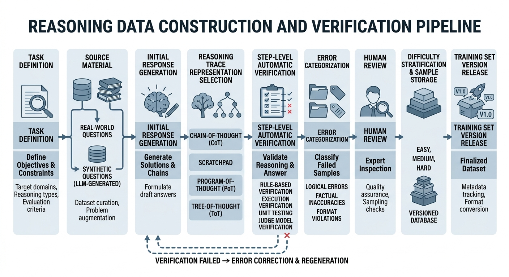
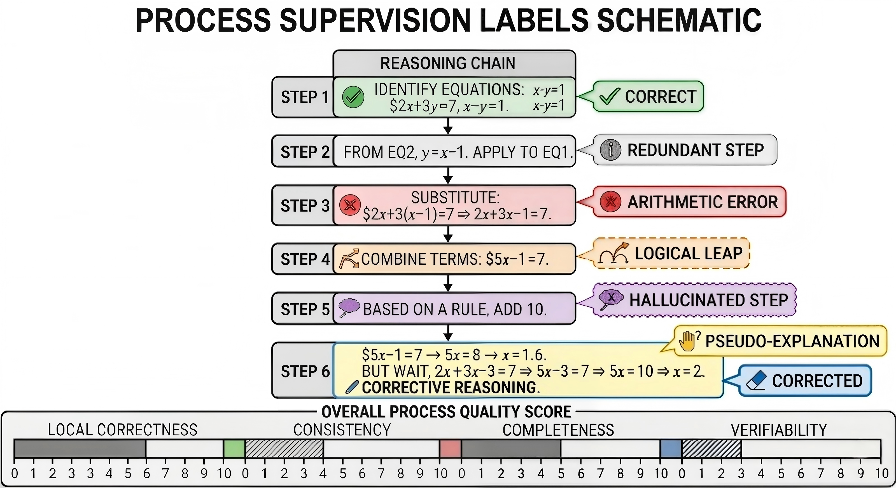

# 推理与 Agent 数据⼯程

随着大模型从“会回答”走向“会推理、会调用工具、会进行多轮协作”，数据工程的重点也在发生变化。过去，很多数据工作主要围绕结果展开，关注模型是否给出正确答案；但在推理模型与 Agent 系统中，仅有结果监督已经不足以支撑真实任务。模型是否会分步思考、是否能正确使用工具、是否能在多轮交互中保持状态一致并利用记忆，正在成为新的关键问题。

因此，本篇聚焦“会想、会用工具、会记忆”的新型数据问题，讨论数据工程如何从结果监督升级到过程监督与轨迹监督。这里的数据不再只是单轮问答对，而是逐渐扩展为推理过程、工具调用链路、交互状态和记忆演化等更复杂的结构。数据质量的衡量标准，也不再只是答案是否正确，而要进一步关注过程是否合理、执行是否成功、状态是否稳定。

围绕这一变化，本篇将从推理数据、Tool-Use 数据以及 Agent 记忆与多轮交互数据三个方向展开，系统讨论面向 Agent 的数据构建、组织、评测与治理问题，并为项目 P06、P07 的后续展开奠定基础。它所要回答的核心问题是：当模型不再只是“生成答案”，而是要“完成任务”时，数据工程应当如何升级。

# 第18章 思维链与推理数据工程

在大模型从“会回答”走向“会推理”的过程中，数据工程的重点会发生明显变化。对于一般的 SFT 数据，团队往往更关注输入是否清晰、输出是否正确、风格是否稳定；而对于数学、逻辑、代码等推理任务，仅仅拥有“问题—答案”对通常是不够的。因为这类任务的关键不只是模型最后说对了什么，更在于它是否沿着一条可验证、可复现、可泛化的推理路径得到这个答案。很多部署中的不稳定现象，表面上看是“偶发答错”，本质上却是训练数据只奖励最终结果，没有约束中间过程，导致模型在不同题型、不同难度、不同上下文下采用了不一致甚至错误的内部策略。

因此，推理数据工程并不是普通 SFT 的简单延长，而是在保留 SFT 与合成数据基础生成方法的前提下，进一步引入推理轨迹表示、步骤级验证、错误分类、难度分层与过程监督的系统工程。它要求团队不只是“生产更多样本”，而是要构建一条从题目生成、轨迹构造、自动校验、过程打标到课程组织的完整流水线。只有这样，模型学到的才不是零散题目的答案映射，而是一套在数学计算、程序修复、符号推导、逻辑判定中都更稳定的推理行为模式。

本章面向需要构建数学、逻辑、代码等推理数据集的团队，系统讨论为什么只看最终答案会掩盖推理缺陷、如何表示推理轨迹、如何做步骤级验证与错误分类、如何构建难度分层与样本组织方案，以及如何在真实工程中落地一套可持续扩展的推理数据流水线。

## 18.1 为什么只看最终答案会掩盖推理缺陷

### 正确答案并不等于正确推理

在推理任务中，最终答案只是整个求解过程的外部落点，而不是过程本身的充分证明。一个模型给出正确答案，可能意味着它确实完成了条件识别、规则调用、状态更新与结论核验这一整套推理链条；但也可能只是因为它记住了题型模板、捕捉到了表面模式，或者在若干错误步骤叠加之后偶然落到了正确结果上。对于普通生成任务而言，这种“过程不严谨但结果可接受”的现象未必构成严重问题；但对于数学、逻辑、代码等高约束推理任务，这恰恰是最需要警惕的风险来源之一。

数学题中，模型可能在某一步中使用了不合法的移项、约分或定理，却因为题目本身结构简单，最终仍然算出了正确数值。逻辑任务中，模型可能没有真正完成前提展开与规则匹配，而是直接套用了某个熟悉的结论形式。代码修复中，模型也可能没有理解 bug 的真实成因，只是碰巧修改了一个能让当前测试通过的局部位置。表面上，这些样本都可以被归类为“成功”；但从能力学习的角度看，模型学到的并不是稳定的求解机制，而是某种高风险的捷径。

如果训练数据只保留“题目—答案”对，而不显式约束中间过程，那么训练阶段的奖励信号就会被极度压缩。模型不需要证明自己如何抵达结果，也不需要为过程中的跳步、伪解释、无依据推断付出代价。它只需要学会尽可能输出一个会被判定为“对”的终点。这样形成的能力，往往对题型、措辞、长度和上下文非常敏感。只要问题形式稍有变化，或者需要更长的推理链条，模型就可能迅速失去稳定性。

更重要的是，正确答案与正确推理的脱钩，会直接误导团队对模型能力的判断。团队如果把“答对率提升”简单理解为“推理能力提升”，就可能在训练、评测和部署三个环节持续高估系统的真实水平。一个只擅长命中答案表面的模型，在离线评测中可能看起来已经足够优秀，但在真实使用场景里却很难维持可靠表现。

### 结果正确为什么仍然可能是低质量样本

在数据工程实践中，很多样本之所以会进入训练集，并不是因为它们的过程被证明可靠，而只是因为它们的最终结果通过了验收条件。这种做法在简单任务上问题不大，但在推理任务中会形成一种隐蔽的数据污染：低质量过程因为结果恰好正确，被当作高质量正样本反复学习。

这种污染最危险的地方在于，它不会以显性的错误形式出现。样本不会在表面上告诉你“我是坏样本”，相反，它会披着“答案正确”的外衣进入数据管线。对于模型而言，这类样本传达出的信号是：即便中间过程不严谨，只要最终结果能过关，这样的行为也是可以被奖励的。久而久之，模型就会越来越偏向于寻找投机性路径，而不是学习可复用、可迁移的推理结构。

因此，在推理数据工程里，结果正确只能被视为最低层的合格条件，而不能被视为充分的质量证明。真正高价值的样本，应当不仅结果正确，而且中间步骤可解释、关键变换可验证、局部错误可定位。只有这样的样本，才值得在训练中被反复强化。

### 结果监督在复杂任务上的盲区

结果监督适合那些目标明确、路径不重要或中间状态难以定义的任务。在分类任务中，我们关心标签是否正确；在简单抽取任务中，我们关心字段是否匹配；在低推理深度问答中，我们也常常只关心回答是否与事实一致。但一旦任务进入多步依赖、多约束耦合或长链求解，结果监督就会出现明显盲区。

第一，结果监督无法告诉我们错误发生在哪一层。一个最终错误，可能来自题意理解错误、条件遗漏、局部计算错误、规则误用、状态不一致，也可能只是最后输出格式偏差。若只保留整题对错，这些完全不同性质的问题都会被压缩成同一种失败标签。第二，结果监督无法区分“几乎正确但最后一小步失误”和“前面全错但碰巧答对”这两类样本。前者通常具有很强的训练价值，因为它说明模型主体路径已经接近正确；后者则是高风险样本，因为它可能把错误模式包装成正例。第三，结果监督无法为数据迭代提供细粒度反馈。团队最多知道某类题整体成功率不高，却不知道究竟是哪一类步骤、哪一类规则、哪一类变量操作在持续出问题。

这种盲区在数学任务中尤其典型。两个模型都可能答错同一道题，但一个是因为基础算术不稳，另一个是因为在关键条件判断上出错。若不分析过程，团队就无法决定是应该补充基础算术样本，还是应该强化规则前提显示。逻辑任务中也一样。结论错误，可能来自前提缺失、量词范围误判、规则越权或分支处理失败。代码任务中，单看 patch 是否通过测试，同样无法判断修改是否真正覆盖根因、是否引入新副作用、是否只是对测试用例做了局部过拟合。

因此，结果监督的问题并不只是“看不到中间过程”，而是它会把本来高度异质的错误压缩成单一标签，进而让训练、分析和修正都失去方向感。团队无法知道该修什么，只能继续盲目增加数据量或调整训练参数，这种做法常常治标不治本。

### 为什么结果监督会误导数据分析

在实际工程中，数据分析往往依赖一些宏观指标，例如准确率、通过率、整题成功率或平均得分。这些指标当然有用，但如果任务本质上依赖过程，它们就只能反映最终表现，无法揭示内部机制。于是，团队很容易陷入一种假象：只要整体指标在上升，就说明系统在持续变好。

问题在于，指标上升可能来自多种完全不同的原因。有时是因为模型确实学会了更稳定的推理路径；有时却只是因为它记住了更多高频模式，或在某类固定 benchmark 上形成了更强的模板匹配能力。如果团队没有过程级视角，就无法区分这两种情况。于是，数据分析看起来很积极，模型却并没有获得足够的泛化能力。

更严重的是，结果监督还会让许多真正重要的问题在数据面板上“隐身”。例如，一类题目整体答对率不低，但其中相当比例的样本都存在逻辑跳步；又例如，某个代码修复模型的 pass rate 持续提升，但补丁中引入副作用的比例也在同步上升。这些现象如果没有步骤级标签和过程验证，几乎不可能通过普通结果报表被发现。团队会误以为系统正在健康演进，直到部署环境把这些隐患放大出来。

### 推理错误如何在部署中表现为不稳定

部署环境最怕的不是“始终不好”，而是“看起来会、实际上忽好忽坏”。很多系统上线后暴露的问题，并不是模型完全没有能力，而是它并没有形成稳定的过程机制。它在某些输入上能调用到合适的路径，于是表现优秀；在稍微不同的输入上，却触发了另一套粗糙模板，于是表现骤降。这种好坏交替的现象，会给使用者带来比“稳定较差”更强的不信任感。

这种不稳定有几种常见表现。第一，输入稍作改写，模型的中间推理就开始漂移。题目本质没有变，但模型却因为表面词汇、叙述顺序或上下文格式变化，切换到了另一条不可靠路径。第二，推理链条一旦变长，前后状态就难以保持一致。前面定义的变量到后面被偷偷改写，已经设定的约束在中间步骤中被遗忘，局部结论之间开始互相冲突。第三，在代码任务中，模型可能能生成一段看似专业的原因分析，但最终给出的实现却不符合分析所声称的修复逻辑。第四，模型在错误时往往仍然保持高流畅度和高确定性，这会让评测者和终端用户更难察觉其过程缺陷。

从工程角度看，这类不稳定尤其危险，因为它很难通过增加同类静态样本自动消失。如果新增数据仍然只是“题目—答案”形式，那么训练集只会继续强化一种信号：过程不重要，终点重要。模型也许会进一步提高某些 benchmark 上的命中率，但内部推理结构依然是脆弱的。一旦进入真实环境，这种脆弱性就会表现为随机波动、分布敏感和难以复现的失败。

### 过程缺陷为什么会在长链任务中被放大

短链任务中，错误过程有时还能被题目本身的简单性所掩盖。因为步骤少、状态少、约束少，即使模型中间有些不严谨，也可能在最后侥幸回到正确轨道。但在长链任务中，过程缺陷几乎一定会累积并放大。原因很简单：每一步都是下一步的条件，一旦局部状态出错，后续所有判断都会建立在错误基础上。

数学长题中，一个早期变量定义的偏差，会让后续所有推导失去意义；逻辑多跳问题中，一次前提遗漏会导致整条论证链条塌陷；代码复杂修复中，对根因的误判会使后续补丁设计全部偏离方向。链条越长，过程的稳定性越重要，结果监督的局限也就越明显。因为当错误累积到后段时，团队只看到“最后错了”，却看不到究竟是哪一层级首先崩坏。

这也是为什么推理数据工程必须强调过程。不是因为过程本身更“高级”，而是因为在长链任务中，过程就是正确性的主要载体。没有过程约束，模型在复杂任务上的表现很难真正稳定下来。

### 从“答案导向”转向“过程导向”

对于推理数据团队而言，最核心的转变，是从“答案导向”转向“过程导向”。这并不是说最终答案不重要，而是说在数学、逻辑、代码等任务中，答案只是过程的结果，不能替代过程本身。数据工程如果只围绕答案构建，模型最终学到的就更像一种输出命中策略；如果把过程纳入数据结构、验证机制和质量评价，模型才有机会逐步形成稳定的求解习惯。

所谓过程导向，并不意味着要保留无穷无尽的中间文本，而是意味着要保留那些真正决定正确性的关键中间信息。哪些条件被识别了，哪些规则被调用了，哪些状态发生了变化，哪些局部结论支撑了后续步骤，这些才是推理数据真正应当关注的对象。只有当这些要素进入训练管线，团队才能真正回答：模型是怎么做对的，为什么会做错，哪些样本值得保留，哪些样本必须清洗。

## 18.2 推理轨迹的表示方式

### CoT、scratchpad、program-of-thought、tree-of-thought 的差异

推理数据工程首先要解决的问题，不是“如何生成更多过程”，而是“过程究竟该以什么形式存在”。不同表示方式并不只是表面格式不同，它们实际上决定了样本可读性、验证难度、存储成本、标注负担和训练目标的结构。表示方式选得不合适，后续所有工作都会变得低效：样本难以统一，验证难以自动化，训练难以稳定收敛，质量分析也会失去抓手。

CoT 强调自然语言形式的逐步解释。它最符合人类对“讲解过程”的直觉，因此非常适合教材型数学题、解释型逻辑题和需要展示推理意图的场景。CoT 的优势在于可读性高，便于人工审阅，也便于把任务中的关键判断显式说出来。但它的缺点同样明显：自然语言自由度太高，容易掺入无法验证的描述；不同样本的长度和风格差异也很大，导致质量控制难度上升。

scratchpad 更接近草稿纸式的中间记录。它通常不会把所有思路展开成完整自然语言，而是只保留中间变量、关键计算、局部判断和必要标记。这种形式在算术、多步符号运算和短链逻辑中非常有效，因为它能以更短的篇幅承载更高密度的有效信息。相比 CoT，scratchpad 往往更适合自动化处理，也更容易与中间状态对齐。但它的问题在于，一旦设计过于简略，就可能失去足够的语义锚点，导致人工检查困难，甚至影响模型学习跨步骤依赖。

Program-of-Thought 更进一步，它把中间推理表达成可执行的程序片段、伪代码、表达式序列或其他形式化中间表示。对于数学计算、符号变换、程序分析等任务，这种方式的价值非常突出，因为很多中间步骤都可以被执行器或规则系统直接验证。这样一来，原本依赖人工判断的大量工作，就有机会被结构化工具接管。它最大的优势是强可验证性，但代价也较高：表示 schema 必须足够规范，任务本身也需要允许一定程度的形式化表达。

Tree-of-Thought 不再把推理过程看成一条单一线性链，而是显式记录多个候选分支、分支选择、回退与比较过程。对于复杂规划、搜索式推理和需要权衡多个候选解的任务，这类表示非常有价值，因为真实求解过程本来就常常伴随着试探、放弃和重选。但这类表示的构造与使用成本也最高。它不仅要求记录“最后怎么做”，还要记录“曾经还可能怎么做”，并对这些分支进行某种评价。因此，若任务本身不需要多分支探索，强行使用 tree 结构只会增加噪声与成本。

### 线性轨迹与分支轨迹的区别

在线性推理任务中，过程的核心是顺序依赖：前一步决定后一步，后一步承接前一步。此时，线性轨迹就足够表达大部分关键信息。数学中的多数演算题、代码中的常规 bug 修复流程、逻辑中的标准链式推导，通常都更适合线性结构。线性轨迹的优点是清晰、紧凑、容易验证，也更容易进入普通 SFT 或过程监督训练。

但并不是所有推理都天然是线性的。当任务涉及多方案比较、局部试错、搜索回退或规划分支时，单线性轨迹就会把很多重要信息压扁掉。模型也许最后给出了一条正确路径，但如果数据中从不显式记录候选分支及其淘汰原因，那么模型就学不到“为什么不用别的路径”。在某些复杂任务里，这种“分支选择能力”本身就是能力的重要组成部分。

因此，是否采用线性轨迹，不应只由标注方便与否决定，而应由任务本身的求解结构决定。若任务本质上是一条主路径，就不必人为制造分支；若任务本身依赖比较与回退，就不能简单把最终路径压缩成一条无历史的直线。

### 数学、代码、逻辑任务中的表示 schema

在数学任务中，较好的 schema 往往包含题目、已知条件、目标量、步骤序列、中间变量和最终结论。有时还应额外记录步骤动作类型，例如代入、展开、约分、消元、求导、积分边界处理等。这种设计的好处在于，团队不仅知道模型“写了哪些字”，还知道它“做了什么操作”。一旦后续需要做规则校验或错误分类，动作标签会极大降低分析难度。

**代码示例：一个可落地的“推理轨迹样本 schema”（数学场景）**

下面示例展示“动作标签 + 中间表达式”的结构化轨迹，后续可以对 `expr` 做等价性/可执行校验，对 `action` 做白名单校验，对 `vars` 做一致性检查。

```json
{
  "id": "math_trace_00031",
  "problem": "已知 x + 3 = 10，求 x。",
  "given": ["x + 3 = 10"],
  "target": "x",
  "steps": [
    {"i": 1, "action": "移项", "expr": "x = 10 - 3", "vars": ["x"]},
    {"i": 2, "action": "计算", "expr": "x = 7", "vars": ["x"]}
  ],
  "final_answer": "7",
  "meta": {"difficulty": "basic", "verifier": "arith_v1"}
}
```

在代码任务中，schema 更适合采用“问题定位—原因分析—修改方案—代码变更—验证结果”的结构。与数学不同，代码任务中的中间过程并不是抽象思维链条，而是与程序状态直接相关的求解过程。一个高质量代码样本，最好不仅有修复前后的代码片段，还应保留触发错误的测试、失败日志、定位依据、候选修复策略以及最终验证结果。否则，模型学到的只是局部 patch 映射，而不是完整调试逻辑。

在逻辑任务中，schema 应重点强调前提、规则调用、局部结论和冲突检查。因为逻辑错误往往并不是表面语言问题，而是推导依据不完整、规则适用条件错误或跨步跳推。若不把“由哪些前提推出哪一步”显式写出来，那么许多看似通顺的链条其实并不具备真正的逻辑合法性。对于更复杂的逻辑任务，还可以加入分支讨论、反例测试、假设集变化等字段，让轨迹更适合后续验证。

### 显式状态与隐式状态的表示差异

推理轨迹设计中一个常被忽略的问题，是中间状态究竟应该显式写出，还是默认蕴含在自然语言中。很多低质量样本的问题就在于，关键状态变化没有被明确表达，而是被藏在语句之间。模型看似说了很多，但真正影响后续步骤的条件变化、变量更新、规则生效范围却都没有被写清楚。

显式状态表示的优势在于，它能把关键依赖关系从“隐含理解”转为“可见对象”。例如数学题中当前变量值、当前等式形式、当前目标子式；代码任务中当前故障位置、当前修改对象、当前测试状态；逻辑任务中当前前提集、当前结论集、当前冲突状态。只要这些状态被显式化，后续验证和纠错都会容易很多。

隐式状态当然更节省文本，但它对模型和标注者的要求更高，也更容易产生歧义。一个样本如果过度依赖上下文默认推断，那么不同读者对它的理解可能不同，不同验证器对它的解析也可能不同。对于需要规模化生产与质控的推理数据而言，关键状态尽量显式化，通常是更安全的工程选择。

### 简短轨迹与详细轨迹的成本权衡

在实践中，很多团队会从一个极端走向另一个极端：一开始只保留最终答案，后来意识到过程重要，又开始无节制地追求更长、更详细的推理文本。实际上，轨迹不是越长越好，而是越“有效”越好。真正有价值的，不是字数，而是其中包含了多少关键、可验证、可复用的信息。

过短的轨迹会省略关键步骤，导致模型学不到稳定过程。它可能知道从题目跳到答案，却不知道中间应如何组织变量、如何调用规则、如何逐步缩小问题空间。过长的轨迹则会引入另一类问题：大量修辞性语言、重复性表述和无法验证的解释进入样本，使训练重点从关键状态变化转移到了语言外观。模型可能学会“像在认真思考地说话”，却没有真正学会更可靠的推理行为。

因此，更合理的原则是保留关键变换、关键决策、关键调用和关键状态更新，压缩那些对结果没有约束力的冗余说明。基础算术和短链逻辑通常只需要较短轨迹；复杂证明、程序修复和多分支规划则需要更细粒度记录。轨迹长度不应统一规定，而应服从任务特性和验证需求。

### 轨迹密度比轨迹长度更重要

与其问“样本应该多长”，不如问“每一段文本里到底承载了多少有效信息”。这就是轨迹密度的问题。一个高密度轨迹，即便篇幅不长，也能清楚表达中间状态、关键推导和局部决策；而一个低密度轨迹，即便写了很多，也可能只有修辞，没有约束。

高密度轨迹往往具有几个特征。第一，关键步骤不会被跳过。第二，中间状态变化清晰。第三，冗余修辞较少。第四，后续验证器能直接对其中较多部分施加检查。这样的样本在训练中更有价值，因为模型接触到的是更纯净的过程信号。

低密度轨迹则常常表现为：自然语言铺陈很多，但关键操作一笔带过；表面上“解释很充分”，实则没有提供足够的中间证据；不同样本之间风格差异巨大，难以统一质检。这类样本在书写上可能很像“人类讲解”，但在数据工程里未必是优质资源。因为数据的目标不是写得像，而是写得能用。

### 表示方式的选择应当服务于验证

推理轨迹不是为了展示模型“想了什么”，而是为了让过程成为可处理、可过滤、可训练的数据对象。因此，表示方式的选择必须与后续验证机制一起设计，而不能先自由生成一大堆过程，再回头思考怎么检查。若过程本身不可解析、不可结构化、不可验证，那么再长的轨迹也只是昂贵的文本堆积。

这意味着，表示设计时就应同时考虑哪些部分可以规则验证，哪些可以执行验证，哪些需要裁判模型，哪些必须保留人工抽检。例如，若数学步骤采用显式动作标签和中间表达式，那么规则程序就更容易检查合法性；若代码样本显式分离“原因分析”和“代码变更”，就更容易判断分析与实现是否一致；若逻辑样本记录了前提引用关系，就更容易识别跨步跳推。

从工程上讲，推理轨迹的结构化程度，实际上决定了自动化验证的上限。轨迹越混杂、越自由、越依赖隐含理解，验证成本就越高；轨迹越清晰、越字段化、越显式，后续质控就越容易稳定运行。因此，一个成熟的数据系统从来不会把表示方式当成单纯的书写风格问题，而会把它视为整个推理数据管线的基础设施。

### 表：推理样本类型与适用任务表

| 推理样本类型 | 主要表示形式 | 适用任务 | 优势 | 局限 |
|---|---|---|---|---|
| 答案型样本 | 问题 + 最终答案 | 简单问答、分类、低推理深度任务 | 成本低、吞吐高 | 无法暴露过程缺陷 |
| CoT 样本 | 自然语言逐步推理 | 数学题、常识逻辑、解释型推理 | 可读性强、适合人工审阅 | 难以完全自动验证 |
| Scratchpad 样本 | 草稿式中间变量与关键步骤 | 算术、多步符号处理、短链逻辑 | 紧凑高效、易于对齐关键状态 | 可解释性略弱 |
| Program-of-Thought 样本 | 伪代码、程序片段、可执行中间表达 | 数学计算、程序推理、结构化求解 | 可执行验证、鲁棒性高 | 构造成本较高 |
| Tree-of-Thought 样本 | 多分支候选路径与选择过程 | 搜索式规划、复杂逻辑、多路径决策 | 能表达探索与回退 | 标注复杂、训练开销大 |
| 纠错型样本 | 错误轨迹 + 修正轨迹 | 数学纠错、代码修复、逻辑改错 | 有利于学习纠偏能力 | 错误构造与标注难度高 |
| 自反思样本 | 初始解答 + 自检 + 修订结果 | 复杂问答、推理增强、代码复核 | 有利于提升稳定性 | 容易引入模板化反思噪声 |




*图18-1：推理数据构造与验证流程图*

## 18.3 自动验证与错误分类

### 为什么推理数据不能只生成，不验证

对于一般的 SFT 数据而言，只要问题清晰、答案可接受、风格基本统一，样本往往就具备初步训练价值。但推理数据不同。推理数据的核心价值并不只来自“有答案”，而来自“中间过程是否可信”。如果一个样本拥有很长的推理链条，却没有经过验证，那么它带来的不一定是能力增强，也可能是过程污染。模型会把其中的错误中间步骤、伪解释、无依据跳推一并吸收进来，最终学到一种表面上更会“讲过程”、实际上更会“制造噪声”的行为模式。

因此，推理数据工程不能把验证理解为生成之后的附属动作，而应把它视为样本进入训练集之前的基本门槛。一个没有验证环节的推理数据流水线，很容易在前期依靠高吞吐获得大量样本，但随着规模扩大，噪声会以更快速度积累。因为推理样本的长度通常更长、自由度更高、局部错误更隐蔽，单纯依靠最终答案过滤远远不够。越是过程复杂的任务，越需要在样本进入训练前就建立明确的检查机制。

更关键的是，验证并不仅仅服务于“剔除错误样本”。它还承担着另一个同样重要的作用：把原本混沌的过程文本转化为结构化质量信号。一个样本如果被判定为失败，团队并不只需要知道“它失败了”，还需要知道它是算术错误、逻辑跳步、规则越权、伪解释，还是局部状态不一致。没有这一步，后续的数据修订、样本再生成、课程分层和过程监督都缺乏足够细的依据。

### 自动验证为什么是推理数据规模化的前提

当推理数据规模上升到一定量级后，完全依赖人工通读和人工判定几乎不现实。不是因为人工不重要，而是因为推理样本的验证难度远高于普通答案核对。一个答案型样本，人工通常只需比较最终输出是否正确；而一个推理样本，则需要检查中间每一步是否成立、前后状态是否一致、局部解释是否真正在支撑下一步结论。这种工作量会随着步骤数增长迅速膨胀。

因此，自动验证不是为了追求“完全不用人”，而是为了让人工资源被用在更值得用的地方。规则系统可以负责格式、动作合法性和局部一致性检查；执行器可以负责计算、程序、符号步骤的可运行校验；测试系统可以负责代码行为验证；裁判模型可以承担部分语义层面的过程判断。通过这些机制，团队可以先用自动化手段把大部分明显问题筛出，再让人工去审查边界案例、高价值难例和系统性误差。这种分工方式，才是推理数据真正可能规模化、持续迭代的基础。

如果没有自动验证，团队往往会陷入两难：要么为了控制噪声而降低产能，导致样本规模上不去；要么为了追求规模而放松审核，最终让错误过程大规模进入训练集。前者会让推理数据建设长期停留在小作坊式生产，后者则会使模型越来越擅长模仿低质量过程。自动验证的意义，正是在这两者之间建立一条可持续的工程路径。

### 规则验证、执行验证、单元测试与裁判模型

推理数据中的自动验证，并不是单一机制可以完成的。不同任务、不同步骤、不同表示方式，决定了验证手段也必须分层组合。一般而言，规则验证、执行验证、单元测试与裁判模型构成了四类最常见的验证能力，它们各自覆盖不同类型的错误。

规则验证最适合那些形式稳定、约束明确、可用程序直接匹配的部分。例如数学步骤中的格式合法性、变量是否已定义、动作标签是否符合白名单、逻辑题中规则调用是否在允许集合内、代码样本中字段是否完整、patch 是否触达正确文件等。这类验证的优势在于成本低、速度快、可控性强，适合作为第一层大规模筛查机制。它不能解决所有问题，但能快速剔除大量低级错误和结构混乱样本。

执行验证则适用于可以被“跑起来”的中间过程。例如数学中的表达式计算、符号化步骤、program-of-thought 的中间程序、代码样本中的局部函数执行等。只要某一步能够被形式化执行，验证可靠性通常就会显著高于自然语言判断。执行验证的意义在于，它把“看起来合理”转化为“实际可运行”。对于很多推理任务而言，这是从表面说服力走向真实性的关键一步。

**代码示例：对“算术/表达式步骤”做执行验证（安全简化版）**

在不引入额外依赖的情况下，可以先做一个“可控表达式”执行器：只允许数字与 `+ - * / ( )`，验证每一步等式右侧是否能计算、是否与给定目标一致。

```python
import ast
import operator as op


OPS = {
    ast.Add: op.add,
    ast.Sub: op.sub,
    ast.Mult: op.mul,
    ast.Div: op.truediv
}


def safe_eval(expr: str) -> float:
    def _eval(node):
        if isinstance(node, ast.Expression):
            return _eval(node.body)
        if isinstance(node, ast.Num):  # py<3.8
            return node.n
        if isinstance(node, ast.Constant):  # py>=3.8
            if isinstance(node.value, (int, float)):
                return node.value
            raise ValueError("非法常量")
        if isinstance(node, ast.BinOp) and type(node.op) in OPS:
            return OPS[type(node.op)](_eval(node.left), _eval(node.right))
        if isinstance(node, ast.UnaryOp) and isinstance(node.op, (ast.UAdd, ast.USub)):
            v = _eval(node.operand)
            return v if isinstance(node.op, ast.UAdd) else -v
        raise ValueError("非法表达式")

    tree = ast.parse(expr, mode="eval")
    return float(_eval(tree))


def verify_step(step_expr: str) -> bool:
    # 仅演示：校验形如 "x = 10 - 3"
    if "=" not in step_expr:
        return False
    left, right = [s.strip() for s in step_expr.split("=", 1)]
    _ = left  # 此处可进一步检查变量名
    safe_eval(right)  # 能算出来即通过该层验证
    return True


if __name__ == "__main__":
    print(verify_step("x = 10 - 3"))  # True
    print(verify_step("x = __import__('os').system('rm -rf /')"))  # False
```

单元测试主要服务于代码修复、程序合成和结构化工具调用任务。它不仅检查最终程序是否运行，还检查修复是否真正满足预期行为。对于代码任务来说，只看生成文本往往是不够的，真正的质量标准在于程序行为是否正确、边界条件是否覆盖、是否引入新副作用。单元测试在这里承担的是“行为真值”角色，它比文本相似度、表面解释质量更接近实际使用标准。

裁判模型则用于补足规则和执行都难以覆盖的语义判断。例如，一个解释是否真的支撑了后续结论，一个逻辑步骤是否属于跳步，一个代码修复理由是否与 patch 行为一致，一段自反思是否真正识别了错误根因。这类问题往往无法完全形式化，但又不能放任不管。裁判模型的价值就在于，它能在大规模场景下提供一种近似语义审核能力。当然，它本身并不绝对可靠，因此通常应与规则和执行验证共同使用，而不是单独作为最终标准。

### 为什么验证体系通常需要多层串联

在实际工程中，团队很容易希望找到一种“万能验证器”，仿佛只要一个模块足够强，就能统一解决所有推理质量问题。但推理数据的复杂性决定了这几乎不现实。一个样本可能同时包含格式问题、执行错误、语义跳步和局部冗余，不同问题适合不同工具。真正有效的验证体系，往往不是单一判断器，而是多层串联结构。

通常而言，第一层应该是便宜而高召回的粗筛机制，用于清理最明显的低质量样本。规则验证和基础格式校验最适合承担这一角色。第二层应当进入更强约束的真实性验证，例如执行验证、测试运行、表达式求值等，负责确认关键步骤是否实际成立。第三层才进入较贵的语义判断，例如裁判模型或人工抽检，用来处理那些形式上没问题、但过程质量仍存疑的样本。这样的层级设计有两个好处：一是把成本高的判断留给少量疑难样本，二是让不同验证信号能够相互校正，而不是彼此孤立。

更进一步说，多层验证的意义还在于它能够产生更细粒度的失败原因。一个样本究竟是死在格式层、执行层还是语义层，对后续纠偏动作完全不同。若团队只有统一的“通过/失败”判定，那么即使知道样本不合格，也很难知道下一步该如何修复。

### 算术错误、逻辑跳步、伪解释、幻觉步骤的分类

推理数据中的错误并不是同一种东西。若团队只是把所有失败样本都标成“错”，那么过程监督的价值会大打折扣。因为不同错误对应不同根因，也对应不同修复策略。一个成熟的推理数据系统，应当尽量把错误划分为若干有操作意义的类型，而不是停留在模糊的整体评价上。

算术错误是最直观的一类。它通常表现为基础计算失败、符号正负号出错、变量代入失误、公式抄写错误、边界条件漏算等。这类错误的特点是容易定位，通常也比较容易自动验证。它们虽然常被视为“低级错误”，但在长链推理中影响极大，因为一次小的计算偏差就可能让后续整条链条失效。

逻辑跳步则更隐蔽。它不是算错，而是在没有展示必要中间依据的情况下直接跃迁到下一结论。模型看起来像是在高效推理，实际上却可能是跳过了最关键的证明或判断环节。逻辑跳步的问题在于，它会让模型形成一种危险习惯：只要最终结论貌似合理，中间就可以省略。这种模式在短样本上可能不容易暴露，但在复杂任务中极易崩溃。

伪解释是大模型时代非常常见的一类过程噪声。它的表面特征是“说了很多”，但这些解释与真正的推理推进并没有因果关系。数学样本中，伪解释可能表现为大段自然语言铺垫，却没有说明公式为何成立；代码样本中，伪解释可能表现为分析理由看似专业，却与实际 patch 毫无对应；逻辑任务中，伪解释则可能只是把题干换种方式复述一遍，并没有增加任何可验证中间信息。

幻觉步骤则更严重，它意味着模型在过程里引入了题目之外的条件、并不存在的定理、虚构的 API、错误的变量或环境假设。这类错误如果仅看最终结果，有时甚至不会立刻暴露，但它对训练的伤害非常大，因为它会让模型形成“可以编造中间依据”的行为偏好。一旦这种偏好在训练集中被强化，后续很多推理输出都会出现不受控扩张。

### 规则越权、一致性破坏与状态漂移

除了前面几类典型错误，推理数据中还有一些更偏结构性的错误，同样非常值得单独识别。其一是规则越权。也就是说，模型使用了当前任务并不允许使用的操作、规则或外部知识。例如某类逻辑题要求严格基于给定前提推导，但模型却引入了常识补充；某类数学题限定使用初等方法，模型却直接调用了更高阶结论；某类程序修复题要求在指定文件中修改，模型却绕开限制改动了其他位置。规则越权的危险之处在于，它往往会被误判为“聪明”，但实际上破坏了任务定义本身。

其二是一致性破坏。模型在某一步定义了变量、前提或约束，但在后续步骤中悄悄改变了它们的含义，或者忘记了前面已经成立的状态。长链任务中特别容易出现这类问题。它不像幻觉那样显眼，也不像算术错误那样容易自动发现，却对推理稳定性伤害极大。一个前后不一致的过程，即使局部每一步看起来都说得通，整体上也不可能可靠。

其三是状态漂移。所谓状态漂移，是指模型在长链生成中逐渐偏离原始任务空间。它可能一开始还在解题，后来却转而解释别的问题；一开始修的是 A 类 bug，后面却写成了 B 类优化；一开始基于某组前提推理，后面却在不知不觉中切换到了另一种语义环境。状态漂移是部署中最令人头疼的失败形式之一，因为它常常不是单点失误，而是整条链条逐步偏移后形成的系统性错误。

### 步骤级标签与过程质量评分

验证结果若只停留在“通过”或“失败”，其价值仍然有限。真正能支撑过程监督和后续训练的是步骤级标签，也就是把质量信息落实到具体中间步骤上。一个推理样本不应只是整题正确或整题错误，而应尽可能标明每一步是正确、可疑、错误、冗余、跳步、不可验证，还是已在后续被修正。只有当错误被定位到步骤，后续的训练、过滤和纠偏才可能更有针对性。

步骤级标签的意义首先在于，它让样本不再是一个整体黑盒。团队可以知道究竟是哪个局部位置最容易出错，哪类动作最容易失败，哪类任务在什么阶段更容易发生跳步或幻觉。其次，步骤级标签能支撑更灵活的训练策略。并不是所有“有错误的样本”都必须整体丢弃。若一个长样本中前面大部分过程都可靠，只有局部一步出错，那么它仍然可能具有很高价值。团队可以只屏蔽错误步骤、构造局部纠错任务，或把该样本改造成“错误识别—修正”型训练数据。

过程质量评分则是在步骤标签之上，对整条轨迹进行更综合的评价。一个样本的过程质量，通常不止取决于最终是否答对，还取决于局部正确性、一致性、完整性、可验证性、冗余度、解释与行为对齐程度等多个维度。数学任务中，局部合法性和链条完整性尤为重要；代码任务中，行为验证和修复理由一致性更关键；逻辑任务中，前提覆盖和规则适用性通常更重要。通过质量评分，团队可以在“是否保留”之外再增加“优先级”维度，让训练更多吸收那些真正稳定、清晰、可复用的高质量过程。

### 过程评分为什么不应只看最终对错

在很多流水线里，整题对错会天然成为最显眼的评分指标，因为它最简单、最直观，也最容易与 benchmark 接轨。但如果过程评分仍然主要依赖最终结果，那么所谓“过程监督”就很容易退化成结果监督的变体。真正的过程评分应当尽量从中间结构本身出发，而不是只把最终答案当作唯一参照物。

例如，一个样本最终答错，但前面九成步骤都正确，且最后一步错误清晰可纠，那么它对训练局部修正能力和过程稳健性仍然很有价值。相反，一个样本最终答对，但中间充满跳步、伪解释和隐含幻觉，那么它虽然在结果上通过，却未必值得高分。换句话说，过程评分必须敢于把“答对但过程差”的样本压低，也要敢于把“答错但过程主体优良”的样本与普通失败样本区分开来。只有这样，评分体系才不会反过来强化结果导向的旧习惯。




*图18-2：过程监督标签示意图*

### 表：错误类型与纠偏动作表

| 错误类型 | 典型表现 | 常见成因 | 推荐纠偏动作 |
|---|---|---|---|
| 算术错误 | 计算结果错误、符号抄错、代入失误 | 基础计算不稳、轨迹过长导致局部出错 | 用执行器复算，替换错误步骤并回放后续链条 |
| 逻辑跳步 | 直接写出结论，中间缺乏必要前提 | 训练样本过度压缩、模型偏好捷径 | 插入缺失步骤，显式补齐规则与依据 |
| 伪解释 | 解释很多，但与结论或修改无因果对应 | 过度追求“像解释”的语言风格 | 删除空泛描述，只保留能约束下一步的说明 |
| 幻觉步骤 | 引入题目中没有的条件、定理、API、变量 | 模型联想过度、约束不足 | 对照题目与环境做一致性检查，强制重生成该步 |
| 规则越权 | 使用不允许的推理规则或非法变换 | schema 设计不清、验证器缺失 | 增加规则白名单校验，回退到最近合法状态 |
| 代码伪修复 | 补丁通过个别测试，但没有修正根因 | 测试覆盖不足、只优化表面通过率 | 增补测试、做差异分析、加入失败原因对齐验证 |
| 冗余步骤 | 加入不影响结果但增加噪声的描述 | 生成模板松散、长度偏好错误 | 进行步骤压缩，保留关键状态转移信息 |
| 不一致步骤 | 前后变量名、约束、结论相互冲突 | 长链上下文漂移 | 做跨步骤一致性检查，并重写冲突区间 |

## 18.4 难度课程与样本组织

### 为什么推理数据不能随机混喂

很多普通 SFT 任务中，样本随机打散后统一训练通常已经能够取得不错效果，因为任务之间的内部结构差异没有那么大，模型主要学习的是输入输出映射关系。但推理任务不同。推理能力往往具有明显的层级性：基础计算、变量管理、规则调用、局部一致性、长链记忆、分支比较、错误回退，这些能力并不是同时自然成熟的，而是经常需要由浅入深、由短到长地逐步建立。

如果团队把所有难度、所有类型、所有长度的推理样本一开始就完全混在一起，模型往往会在训练初期受到相互冲突的信号牵引。它尚未掌握短链稳定推理时，就被迫处理高复杂度长链任务；它尚未学会基础规则调用时，就开始面对多分支选择和复杂纠错。这不仅会降低训练效率，还可能让模型形成不良习惯：面对复杂问题时直接跳过中间步骤，用模糊解释掩盖不确定性，或者依赖高频模板来回避真正的结构化求解。

因此，推理数据组织不能只考虑覆盖度，还必须考虑学习顺序。所谓课程学习，并不是追求一种僵化的“低级到高级”教材式排列，而是承认推理能力需要被分层塑造。模型应当先建立稳定的局部行为，再逐步承载更复杂的全局结构；先学会短链一致性，再学习长链依赖与多阶段决策；先能识别明确错误，再逐步接触模糊边界和高干扰场景。没有这样的组织，推理数据再多，也未必能稳定转化为推理能力。

### 难度分桶、课程学习与分阶段投喂

难度分桶的第一步，是明确“难度”究竟由什么构成。对于推理任务来说，难度并不只是题目表面长短，也不只是最终答案是否复杂。更有意义的难度维度通常包括：所需步骤数、前后依赖跨度、是否存在分支判断、是否需要回退修正、是否涉及外部工具执行、规则调用是否容易混淆、局部错误是否会迅速级联扩散等。只有把这些维度纳入考虑，难度分桶才不会退化成简单的长度排序。

课程学习的核心，不是机械地把数据按难度从小到大排一遍，而是控制模型在不同阶段接触不同结构复杂度的样本。训练初期，样本应更强调规则明确、步骤较短、局部状态清晰，让模型先学会稳定执行基本动作。中期可以逐步引入长链、分支、错误识别和局部纠错，让模型在已有基础上扩展过程控制能力。后期再加入高复杂度、多路径、多错误干扰、跨任务组合等样本，推动模型形成更强的综合推理能力。

分阶段投喂并不意味着后一个阶段完全抛弃前一个阶段的数据。相反，成熟的做法通常是保留一定比例的低难度样本，防止模型在学习复杂结构时遗忘基础规则。这一点在推理任务中尤其重要。因为许多高层错误并不是高层能力本身不足，而是基础步骤在复杂环境中重新失稳。如果后续阶段完全不再出现基础样本，模型可能在复杂任务上变得更“会说”，却在基础计算、一致性维护等方面重新退化。

### 难度应该按什么维度定义

推理任务的难度定义如果过于粗糙，很容易导致课程设计失真。最常见的误区是只按题目长度、字数或表面复杂度划分难度。但一段文字很长，并不意味着推理结构真的复杂；一道题看起来简短，也可能需要非常关键的规则选择与条件切换。因此，难度更适合从结构层面定义，而不是只从外观层面判断。

一个有操作意义的难度划分，通常至少应考虑几个维度。其一是步骤深度，也就是从题目到结论需要多少关键状态转移。其二是依赖跨度，也就是早期信息是否必须被长期保持到后段使用。其三是分支复杂度，也就是是否存在多个可能路径并需要比较。其四是验证复杂度，也就是中间步骤是否容易被规则或执行器检查。其五是纠错复杂度，也就是一旦中间出错，是否容易定位与修复。

在数学任务中，基础四则运算和单步代数变换显然属于低难；涉及多阶段变量替换、分类讨论和长公式展开的题目则更高难。逻辑任务中，单一规则的直接推导属于低难；前提多、规则接近、需要排除干扰项或做反证的任务则更复杂。代码任务中，局部语法修复与简单函数修改可视为基础层，而需要跨文件理解、依赖上下文、处理隐藏副作用的修复则应进入更高层级。只有把难度拆解为这些更细的结构因素，课程学习才可能真正服务于能力成长。

### 课程学习为什么不仅是“先易后难”

表面上看，课程学习似乎就是“先给简单样本，再给复杂样本”，但真正有效的课程设计远不止如此。因为推理能力并不是一条单调上升的单轴曲线，而是多个子能力共同发展的结果。一个模型可能已经能处理较长链条，却仍然会在基础变量一致性上频繁出错；也可能已经能做简单纠错，却无法在多分支任务中稳定选择路径。因此，课程学习不只是“整体难度上升”，更应体现不同子能力的交替强化。

这意味着，课程安排可以是多维的，而不是线性的。某一阶段可以强调短链但高规则密度的任务，下一阶段则转向中等链长但分支更丰富的任务；某一阶段重点训练代码修复中的根因定位，下一阶段则重点训练修复后的验证与回归测试分析。换言之，课程学习的本质不是排一条唯一顺序，而是根据模型当前最薄弱的推理子能力，有目的地组织训练样本。

从工程角度看，这种设计还有一个实际好处：它能让团队更清楚地观察训练收益。若课程只是简单地把所有样本难度整体提高，那么模型到底提升了哪种能力、在哪个环节仍然薄弱，往往很难分析；而若课程在不同阶段有明确侧重，数据反馈和误差分布就会更容易解释。

### 正例、反例、纠错样本与自反思样本

一个只包含“标准正确解”的推理数据集，虽然看起来干净，却并不完整。因为真实推理能力不仅包括沿正确路径前进，也包括识别错误、理解错误、修正错误和避免重复错误。若训练集中永远只有完美答案，模型就很难真正学会面对失败情形，更难在复杂场景中建立自我修正能力。

正例样本当然仍然是基础。它们定义了什么叫合格过程，提供了正确的规则调用、状态更新和结论形成路径。没有正例，模型不会知道目标行为应该长什么样。但仅有正例远远不够。反例样本的价值在于，它向模型展示哪些路径不该走，哪些步骤虽然表面流畅却是错误的，哪些结论虽然听起来合理却没有足够依据。尤其对于训练过程判别器、裁判模型或奖励模型而言，反例是不可缺少的参照物。

纠错样本更进一步。它不仅展示错误，还展示如何从错误回到正确。对于数学纠错、逻辑改错、代码修复而言，这类样本尤其重要，因为很多真实任务并不是从零开始求解，而是在已有错误基础上进行修正。一个好的纠错样本会保留错误步骤、指出错误类型、说明为何错误，并给出修正后的合法轨迹。模型如果反复接触这类数据，就更容易学会局部回退与重新推进，而不是一旦出错就整段崩溃。

自反思样本则处在另一个层面。它展示的是模型或教师系统如何审视自己的初始过程、发现潜在问题并修订输出。与纠错样本不同，自反思样本往往更强调“发现错误”的内部机制，而不仅仅是给出修正答案。这类样本对于构建更稳定的推理 agent、提高长链任务鲁棒性很有帮助，但它也最容易被滥用。若反思模板过于僵硬，只是机械输出“我重新检查后发现有误”，却没有真正定位过程问题，那么它带来的只会是新的模板噪声。

### 为什么反例与纠错样本不能随意构造

很多团队在意识到反例和纠错样本的重要性后，容易采取一种简单做法：随便把正确过程改坏一点，或者让模型自由生成一些错误轨迹，再把它们标成反例。这种做法产量也许很高，但风险很大。因为低质量错误样本并不一定能帮助模型学习“什么是错”，反而可能让模型接触到大量无意义甚至不自然的错误模式。

有价值的反例应当满足几个条件。第一，错误类型应清晰，不要把多个无关错误混在一起。第二，错误应具有任务真实性，最好对应部署中或实际生成中高频出现的问题，而不是人为制造的奇怪偏差。第三，错误与正确之间应能对齐，便于模型理解“具体哪一步不同、为什么不同”。纠错样本尤其如此。若错误轨迹与修正轨迹之间毫无对应关系，只是简单给出一版错答案和一版对答案，那么模型学到的仍然只是“错误输出—正确输出”的表面映射，而不是过程级纠偏能力。

因此，反例与纠错样本的构造也需要验证和筛选。不是所有错误都值得留下，真正值得进入训练集的，是那些错误边界清楚、修正逻辑明确、能支持过程学习的样本。

### 从真实题目到合成题目的组织方法

真实题目和合成题目在推理数据工程中并不是二选一，而是各自承担不同角色。真实题目的价值在于，它定义了问题空间的真实性、错误分布的自然性和任务边界的可信度。合成题目的价值则在于，它能够补足覆盖度、提升长尾样本数量、控制难度分布，并为特定能力缺口定向生成训练材料。成熟的数据系统，应当把两者组织成连续链条，而不是对立起来。

通常而言，真实题目更适合充当种子库。团队可以从教材、竞赛题、真实代码仓库 issue、OJ 题、逻辑测评集、人工整理案例中收集高质量样本，建立一批结构清楚、验证充分的基础数据。这些真实样本不仅可直接进入训练，也可作为后续合成的参照模板。基于它们，团队可以做数值扰动、条件替换、规则切换、目标变换、错误注入、解法迁移等扩展操作，逐步生成大量与真实任务保持同分布关联的合成题。

但推理场景下的合成，不能只是“把题目改一改”。真正高价值的合成数据，应同时继承真实题目的结构约束，并额外具备可验证性与可分层性。也就是说，合成出来的不只是更多题，而是更多可以进入验证闭环、可以明确标定难度、可以支持过程监督的题。若合成只关注表面多样性，不关注过程质量，那么规模再大，也只是制造更多不稳定样本。

### 必须保留 SFT 与合成数据中的基础生成方法

推理数据工程虽然强调过程监督，但它并不是完全另起炉灶。前面 SFT 与合成数据工程中已有的基础生成方法，依然是推理数据建设的底座。例如高质量种子样本筛选、模板扩写、条件替换、角色约束、难例注入、多模型协同生成、规则过滤、人工抽检等方法，在推理场景下依然必要。问题不在于这些方法是否还用，而在于它们需要被升级。

这种升级主要体现在三个方面。第一，生成目标从“答案可用”升级为“过程可验证”。第二，质量标准从“整题大致正确”升级为“关键步骤可检查、错误类型可归因”。第三，样本组织从“统一混合入库”升级为“按难度、错误类型、过程形式进行结构化编排”。换句话说，推理数据工程并没有否定原有 SFT 和合成方法，而是把它们推进到了更严格的过程层级。

### 课程组织与样本配比的实践思路

在具体工程实践中，难度分层之后还需要解决样本配比问题。不同阶段到底应该投入多少基础正例、多少高难样本、多少纠错样本、多少反思样本，这直接影响模型学到的行为偏好。如果高难样本比例过高，模型可能在基础规则尚不稳时就开始学复杂表面形式；如果反例和纠错样本比例过高，模型又可能过度关注错误语境，影响标准路径的清晰度。

比较稳妥的思路，是在训练前期以高质量正例和低到中等难度样本为主，先把基本过程模式建立起来；中期逐步提高长链、分支和纠错样本比例，让模型在已有稳定路径上学会处理复杂情况；后期再根据误差分析结果定向补入薄弱类型的样本，例如某类逻辑跳步高发，就增加带明确前提引用的逻辑样本；某类代码修复常出现伪解释，就增加“理由—patch 对齐”强约束样本。

这里并不存在对所有任务都固定不变的黄金比例。关键在于，样本配比要服务于当前阶段最需要塑造的能力，而不是为了表面均衡而平均分配。推理数据工程不是做样本陈列，而是在用数据控制学习路径。

### 难度分层为什么有助于后续评测与迭代

难度分层的作用并不只体现在训练阶段，它还会直接改善后续评测与数据迭代。若训练集和验证集完全没有难度结构，团队通常只能看到一个总分指标，很难判断模型究竟是在哪个层级出问题。相反，如果样本按步骤数、规则复杂度、分支数、纠错深度等维度被清楚分桶，那么评测结果就能更清楚地告诉团队：模型是卡在基础短链、长链一致性、分支选择，还是错误修正阶段。

这种信息对数据回收非常重要。因为数据工程的改进不应是盲目的补量，而应是有方向的修补。若知道模型在中高难度逻辑任务中主要输在规则越权，就应增加规则边界明确的对抗样本；若知道模型在代码修复中高频出现“解释正确、补丁不对齐”，就应定向补充理由—实现一致性数据。难度分层越清晰，迭代动作就越精准，整个数据系统也越容易形成真正闭环。

### 从数据堆积走向数据课程

推理数据工程与普通数据堆积最大的区别，在于它追求的不是简单增加样本数量，而是用有组织的数据去塑造能力形成路径。一个没有课程、没有分层、没有错误组织的推理数据集，即使体量很大，也可能只是把各种质量参差不齐的过程随机扔进训练器里。模型最终学到的，也往往只是混合的表面风格，而不是稳定的推理结构。

相反，一个经过难度分桶、样本类型编排、错误模式控制和迭代反馈修正的数据系统，哪怕规模暂时不算极端庞大，也更有可能真正沉淀出可靠能力。因为在这样的系统中，每一类样本都不是孤立存在的：正例负责定义标准路径，反例负责界定错误边界，纠错样本负责塑造回退能力，自反思样本负责增强自检机制，难度分层则负责决定它们在什么阶段、以什么比例进入训练。只有当这些要素协同起来，推理数据才真正从“数据堆积”变成“数据课程”。

## 18.5 工程案例与承接

### 数学推理数据集构建案例

设想一个面向中学到大学基础阶段的数学推理数据集构建项目。项目初期可以先收集真实题目，覆盖代数、几何、函数、概率等子领域，并为每类题建立基础 schema，例如题干、已知条件、目标、标准解、步骤序列、中间表达式与答案。然后使用教师模型或规则程序生成初始轨迹，再通过表达式求值器、符号计算器和规则检查器验证每一步是否合法。

在这个流程中，团队不应满足于“整题答对率”。更重要的是把失败样本拆开看：到底是基础计算经常错，还是变量替换和条件约束容易丢失，还是模型倾向于写漂亮但空洞的解释。只有把这些错误映射为可统计的类型，数据团队才能反过来改进生成模板、增加针对性样本、调整验证规则。最后，数据集应按难度和错误类型双重维度入库，分别服务于基础 SFT、过程监督训练和纠错能力训练。

### 数学推理数据集为什么适合作为过程监督的典型场景

数学任务之所以特别适合做推理数据工程，一个重要原因在于它天然具有较强的步骤结构。与开放式写作或一般闲聊不同，数学题的求解过程通常包含相对明确的中间状态变化：已知条件如何被整理，变量如何被定义，表达式如何被变换，规则如何被调用，结论如何被推出。这使得“过程”不只是附属说明，而是题目本身的一部分。也正因为如此，数学任务中的错误往往不会停留在抽象层面，而会具体表现为某一步不合法、某个条件被遗漏、某次代换不成立、某个定理适用前提未被满足。

这类结构化特征使数学推理数据非常适合引入步骤级标签与自动验证。很多中间步骤都可以借助表达式求值器、符号运算工具、规则检查器进行形式化审核。团队不必仅凭人工直觉判断一条推理“看起来是否合理”，而是可以把一部分关键判断交给可重复执行的验证模块。对于数据工程而言，这一点非常关键，因为它意味着数学推理数据不仅可以被生成出来，还可以被系统性地质检、分层和迭代。

更进一步说，数学任务还能帮助团队建立过程监督的基本方法论。因为在数学场景里，什么叫步骤、什么叫跳步、什么叫非法变换、什么叫局部错误，往往比在一般自然语言任务中更容易界定。团队如果先在数学任务中把这套过程化数据管线跑通，再迁移到更复杂的逻辑与代码任务，通常会更容易形成稳定工程经验。

### 数学题源的组织方式

一个真正可用的数学推理数据集，不应只是随意收集一些题目然后统一生成解答。题源本身需要被组织。一般而言，真实题目应当作为最初的核心种子池，因为真实题目决定了数据的任务边界、语言风格和错误分布。教材习题、竞赛基础题、标准化考试题、在线题库、人工整理案例，都可以成为种子来源。但这些题源不能简单拼接，而应根据知识领域、解题结构和难度层级重新整理。

例如，在代数中，应区分方程求解、恒等变形、函数求值、数列递推等不同子任务；在几何中，应区分图形性质判断、角度关系、辅助线构造、证明链条等不同模式；在概率统计中，又应区分事件分解、公式代入、条件概率推导、计数逻辑等不同解法结构。这样划分并不是为了目录整齐，而是为了后续更精确地定义 schema、验证规则与难度分桶。

真实题目之外，团队还可以基于这些种子做合成扩展。但数学合成不应只是简单地替换数字。更高质量的做法，是保持原始推理骨架不变，对条件组合、目标变量、干扰项设计、边界情况和解法路径做控制性扩展。例如，同一类方程题可以通过系数扰动控制解的数量与形式；同一类几何题可以通过条件删减或增加来控制证明链长；同一类概率题可以通过事件结构调整来引入更复杂的条件分支。只有这样，合成数据才真正能服务于难度分层和能力拓展，而不是制造大量表面不同、内核相同的重复样本。

### 数学样本的 schema 应如何落地

数学推理数据中的 schema 设计，决定了后续验证与训练是否顺畅。一个过于松散的 schema 往往只能保存“题目—解答—答案”这类粗粒度信息，而无法支撑过程监督；一个过于复杂的 schema 又会提高标注成本、降低产能。因此，数学任务中的 schema 应围绕关键中间状态展开，而不是围绕表面文字展开。

通常来说，一个较成熟的数学样本至少应包含题干、已知条件、求解目标、解题步骤、中间表达式、最终结论等字段。若团队希望进一步提高可验证性，还可以加入动作标签和依据标签。例如，把每一步标注为代入、展开、移项、消元、求导、积分、分类讨论、结论合并等动作之一；同时，为关键步骤补充“依据何规则成立”的说明，如等式性质、函数单调性、几何定理、概率公式等。这样一来，验证器在检查时就不只是比对文本，而是可以直接检查动作是否合法、依据是否匹配、状态是否连续。

对于更高阶的数学数据集，schema 还可以加入难度标签、知识点标签、错误高发点标签以及解法类型标签。例如，同一道题可以被标记为“多步代数变换”“分类讨论”“边界条件敏感”“容易出现符号错误”。这些元数据虽然不直接参与单题求解，但对后续课程学习、样本配比和错误分析极其重要。它们能帮助团队理解数据集的内部结构，而不是把整个数学题库看成一个无差别样本池。

### 数学推理轨迹的生成与验证闭环

在数学数据工程中，初始轨迹可以来自多种来源。教师模型可以提供较自然的语言化过程，规则程序可以提供更强约束的形式化步骤，人工专家则可以为关键样本提供高精度参考解。真实工程里，最有效的方式通常不是单一来源，而是组合来源：先用教师模型大规模生成候选轨迹，再用规则程序或执行器做局部校验，对高价值或高难度样本再引入人工复核。

这类闭环的关键不在于“生成得像不像标准答案”，而在于中间步骤是否可以逐层检查。例如，对于代数题，表达式求值器可以检查某一步变换前后是否等价；对于函数题，符号计算器可以检查求导、积分、极值判断是否正确；对于几何题，尽管纯自然语言证明更难完全自动化，但局部关系、定理引用与条件覆盖仍然可以被半自动检查。通过这种方式，团队可以把大量“看起来说得通”的过程，转化为“关键步骤真的成立”的过程。

验证之后，失败样本不应被简单丢弃。它们本身正是过程监督的重要来源。某些失败样本适合清洗后重生成，某些适合改造成纠错样本，某些则适合用于训练裁判模型或错误分类器。数学数据工程的关键，不是只保存那些完全无瑕的标准解，而是通过验证把不同质量层次、不同错误类型的过程重新组织起来，让它们各自进入最合适的训练用途。

### 数学数据中的错误拆解与回流机制

在数学推理数据集中，整题失败往往只是表象。真正重要的是把失败进一步拆成更有操作意义的错误类别。例如，有些样本的问题在于基础算术不稳定，有些在于公式变换不合法，有些在于条件遗漏，有些则在于模型虽然没有真正推导，却写出了一大段貌似合理的解释。若团队不做这种拆解，后续就只能模糊地说“这类题效果不好”，却不知道应补什么数据、改什么模板、收紧哪类验证规则。

因此，数学推理项目需要建立一种错误回流机制。也就是说，错误不是在验证环节结束，而是应当回流到数据设计环节。若某类题频繁出现变量替换丢失，说明 schema 可能需要更显式的中间变量字段；若某类题大量出现逻辑跳步，说明过程模板可能过度压缩；若某类题总是生成很长但空洞的解释，说明质量评分体系需要对冗余和伪解释施加更强惩罚。通过这种回流，数据工程才会不断收敛，而不是停留在“收集更多题—生成更多过程”的机械循环中。

进一步看，错误统计还可以直接指导课程组织。若模型在低难度代数题中主要输在基础计算，那应先补强基础步骤样本；若在中高难度题中主要输在长链一致性和分类讨论，则应增加相关过程数据。只有当错误能够以结构化方式回流，数学推理数据集才真正具备迭代生命力。

### 数学数据集的入库与用途拆分

数学推理数据并不适合以单一形式统一入库。更合理的做法，是根据样本质量、过程完整性和用途，把数据拆分成不同子集。例如，一部分高质量正例适合进入基础 SFT，用来塑造标准解题风格和基本过程格式；一部分步骤标注充分的样本适合进入过程监督训练，用来强化局部正确性与中间状态一致性；还有一部分包含明确错误与修正过程的样本，则更适合用来训练纠错能力、自检能力或过程判别能力。

这种用途拆分很重要，因为并不是所有数据都适合用同一种方式学习。一个包含轻微错误但整体过程很好的样本，若直接作为正例进入 SFT 可能有风险，但若作为“错误识别—修正”样本则非常有价值。相反，一个极其简洁但过程字段较少的标准解，也许不足以支撑细粒度过程监督，却依然适合用于基础行为塑形。成熟的数据团队需要学会根据样本特征安排用途，而不是简单地做“好样本留下、坏样本删除”的二元决策。

### 代码修复与程序合成推理数据案例

代码任务的工程流程与数学相似，但验证机制更依赖程序执行环境。一个高质量代码修复数据集，不能只保存“错误代码—正确代码”对，还应包括触发缺陷的测试、错误日志、定位过程、修改理由、patch 内容以及修复后的测试结果。这样模型学习的是完整的问题求解闭环，而不只是静态文本映射。

程序合成任务同样需要过程表示。对于一段自然语言需求到代码实现的样本，团队可以保留需求分析、中间设计、关键函数草图、边界条件说明和最终实现，再通过单元测试、静态检查、运行结果对齐来完成验证。若把这些中间状态全都省略，只保留需求与代码，那么模型很容易学会表面模式，却无法在新任务中稳定规划程序结构。

代码数据还特别适合构造纠错样本。因为程序环境天然支持“失败—定位—修复—再验证”的闭环，这比纯自然语言场景更容易形成高价值过程数据。团队完全可以基于已有代码仓库、OJ 题目、测试集和失败日志，构建一套持续扩展的推理修复数据流水线。

### 代码任务为什么比一般文本任务更适合做过程监督

代码任务的一个天然优势在于，它不仅有文本层面的过程，还有程序行为层面的真值。对于纯自然语言推理，很多步骤是否合法仍需依赖规则或语义判断；而在代码任务中，许多中间行为可以直接通过编译、运行、测试、静态分析来验证。这意味着代码推理过程更容易与“真实执行结果”建立绑定，而不是停留在看起来合理的文字解释层面。

这种特性使代码修复与程序合成成为过程监督的理想场景。模型是否真正理解了 bug，不应只看它写出的解释文本，而应看补丁是否通过测试、是否保留原有功能、是否没有引入新异常。模型是否真的完成了需求实现，也不应只看生成的代码是否像某种模板，而应看程序行为是否与需求规格一致。正因为代码任务拥有这种可执行性，数据工程团队可以比在一般自然语言场景下更早建立“过程—验证—回流”的闭环机制。

但也正因为如此，代码推理数据的要求会更高。一个文本上说得很漂亮、但行为上不成立的样本，不仅不能视为高质量数据，反而可能比普通噪声更危险。因为它会强化模型一种非常糟糕的模式：用解释去掩盖行为缺陷。因此，代码推理样本越强调过程，就越必须把执行验证作为核心约束，而不是附属检查。

### 代码修复数据的样本结构

一个可直接服务于推理训练的代码修复样本，通常不能只有输入代码和修复后代码这两个字段。至少还应包括故障触发方式、报错信息、受影响位置、问题定位依据、修复思路、具体 patch 以及修复后的验证结果。这样的结构不是为了追求“信息多”，而是因为代码修复本质上就是一个多阶段求解过程。若只保留前后代码差异，模型学到的只会是局部文本替换模式，而难以学会真正的调试行为。

例如，错误日志告诉模型失败是如何暴露出来的；测试样例告诉模型外部行为约束是什么；定位过程告诉模型为何锁定某一段代码；修复理由告诉模型补丁背后的因果逻辑；验证结果则告诉模型修改是否真正解决问题。这些环节共同构成了代码修复中的“过程证据链”。少了其中任何一环，模型就更容易滑向表面 patch 学习，而不是学习完整的错误诊断与修复闭环。

在更复杂的场景中，代码修复样本还可以加入候选修复方案及其淘汰理由。尤其对于存在多种修复路径的问题，单独保存最终 patch 还不够，模型还应接触“为什么不选择其他方案”。这类信息对于训练更强的修复决策能力尤其有帮助。

### 程序合成中的中间设计为何必须保留

程序合成任务看起来像是“从需求到代码”的直接映射，但真实高质量实现通常并不是一步写成的。它往往包含需求分解、接口设计、核心数据结构确定、关键函数草图、边界条件考虑、异常处理规划等多个中间阶段。如果数据中完全省略这些阶段，只保留自然语言需求和最终程序，那么模型更容易学会的是代码模板的表面匹配，而不是程序结构规划。

对于简单题目，这种缺陷也许还不明显，因为短代码任务本来就可以近似一跳完成。但当需求稍复杂，尤其涉及多个函数协同、状态管理、边界条件处理、性能约束或测试驱动实现时，没有中间设计的样本会让模型在生成时缺乏稳定规划能力。它可能局部代码写得很像样，但整体结构散乱，或者早期设计与后续实现彼此冲突。

因此，程序合成数据应尽量保留中间设计痕迹。例如，把需求分析和函数职责拆分出来，把关键数据结构和接口草图显式写出，把边界条件与异常分支在实现前就说明清楚。这样训练出的模型，不只是会“写代码”，而是更可能学会“先规划，再实现，再验证”的求解流程。这种能力对于复杂程序任务远比局部代码流畅更重要。

### 代码数据中的验证闭环与失败利用

代码任务最宝贵的一点，是失败本身就能被高度结构化利用。编译失败、测试失败、运行时报错、静态检查警告、性能约束不满足，这些都不是单纯的“负结果”，而是带有明确定位价值的过程信号。与纯自然语言场景不同，代码任务中的失败往往天然附带上下文：报错行号、异常栈、测试断言信息、类型不匹配提示等。这些信息如果被保留下来，本身就是极有价值的推理数据组成部分。

因此，代码数据工程不应把失败视为只需过滤掉的东西，而应把它看作构造高价值过程样本的重要来源。一次失败可以转化为至少三种数据：其一，失败样本本身可作为错误识别训练数据；其二，失败到修复的轨迹可作为纠错样本；其三，多轮失败与逐步修正过程还可以形成更复杂的自反思与迭代修复样本。这类数据是一般文本任务很难大量获得的，而代码环境却能相对自然地提供。

从这个意义上说，代码任务的数据积累并不是“修复成功才有价值”，而是“每一次失败—定位—修改—验证”的循环都在产出过程数据。只要团队能把这些环节结构化保存下来，就能逐步建立一条持续扩展的推理修复数据流水线。

### 基于真实工程与基于题库的两类代码数据来源

代码推理数据的来源大致可以分成两类。一类来自真实工程环境，例如代码仓库中的 issue、历史 bug 修复记录、pull request、CI 失败日志、回归测试报告等。这类数据的优势在于真实性强、错误自然、上下文丰富，特别适合训练接近真实开发流程的修复与分析能力。但它的问题也很明显：上下文可能过长、噪声较多、依赖环境复杂，且标注清洗成本通常较高。

另一类来自题库与受控环境，例如 OJ 题、教学案例、人工构造 bug 集、受限编程任务等。这类数据更容易控制任务边界、测试环境和难度层级，也更适合做程序合成和基础代码修复训练。其不足在于真实复杂性相对有限，错误分布可能与真实工程场景存在差距。

成熟团队通常不会只依赖其中一类，而是把两者结合起来。题库数据适合作为基础能力训练与过程格式统一的主要来源，真实工程数据则适合作为高阶鲁棒性、复杂上下文处理和实际修复行为学习的补充。通过这样的组合，代码推理数据系统既能保持可控性，又不至于脱离真实开发场景。

### 代码纠错样本的构造方式

代码任务特别适合构造纠错样本，因为程序行为的变化可以被相对客观地追踪。一个高质量的纠错样本，不应只是“错误代码—正确代码”的静态对照，而应包含错误触发、根因识别、修复动作与修复后验证。若条件允许，还应保留中间失败版本，让模型看到修复并不总是一蹴而就，而常常是经过若干轮尝试逐步逼近正确实现的。

例如，一个样本可以先展示原始失败测试与日志，再给出初步定位，然后提供第一版修复尝试及其新失败，最后再展示修正后的正式 patch 与通过测试结果。这样的数据对模型尤其有价值，因为它不只是告诉模型“正确答案是什么”，还展示了“错误如何暴露、错误如何被识别、错误修正为什么需要调整”。这种过程感，正是许多代码生成系统在真实环境中最缺乏的能力。

### 与前序 SFT 与合成数据章节的承接关系

从全书结构看，推理数据工程不是要替代 SFT 与合成数据工程，而是在其基础上向更深层次延伸。前面的 SFT 章节解决的是“模型应该怎样回答”，合成数据章节解决的是“怎样规模化生产可用样本”，而本章解决的是“当任务本质上依赖过程时，怎样把推理过程也变成可设计、可验证、可训练的数据对象”。

因此，一个成熟团队在方法上往往是连续的：先用 SFT 方法定义任务接口与输出规范，再用合成数据方法扩大覆盖与补齐长尾，最后在推理任务上加入轨迹表示、步骤验证、难度课程和纠错闭环。只有把这三层连起来，团队才真正拥有一条面向推理能力建设的数据工程链路，而不是若干互相割裂的数据生产技巧。

### 本章与前文的关系不是替代，而是递进

在书稿结构中，推理数据工程很容易被误解为一种“更高级的新章节”，仿佛它出现之后，前面的 SFT 和合成数据方法就不再重要。实际上并非如此。推理数据工程之所以成立，恰恰是因为前两部分已经解决了若干基础问题：如何定义输入输出接口，如何统一风格与格式，如何稳定生成初始样本，如何建立基本质量控制。没有这些前提，推理过程本身也难以被组织成稳定的数据对象。

因此，本章与前文的关系不是替代，而是递进。SFT 提供的是行为边界与输出形式的基础；合成数据提供的是覆盖扩展与规模生产的能力；推理数据工程则是在这两者之上，进一步回答“如何让过程本身成为训练对象”。三者若彼此割裂，团队往往会陷入一种局部优化：或者只会做表面格式统一，却没有过程质量控制；或者只会做大规模生成，却没有验证与课程组织；或者只重视推理过程，却忽略了任务接口和数据分布的基础设计。

### 从 SFT 到合成，再到推理过程监督的连续链路

一个成熟团队的方法链路，通常不是突然从普通数据跳到复杂过程数据，而是经历逐层深化。首先，团队会借助 SFT 方法明确任务接口、回答风格、输出格式和基本行为边界，使模型先具备“按要求回答”的能力。接着，团队会通过合成数据与种子扩展方法，提高覆盖度、补齐长尾、提升数据产能，让模型不至于只记住极少量模板化案例。到了推理任务阶段，团队才会进一步引入轨迹表示、自动验证、错误分类、难度课程与纠错样本，使模型从“会答”转向“会稳定地答”。

这条链路的意义，在于它把原本分散的数据工程技巧连接成一个能力成长系统。SFT 不再只是格式微调，合成数据不再只是规模扩增，推理过程监督也不再只是额外写一点中间步骤。三者合在一起，才构成真正面向推理能力建设的完整数据路径。团队由此获得的也不再只是若干零碎数据资产，而是一套可以持续生产、持续验证、持续修正、持续升级的推理数据工程体系。

### 为什么只有把三层连起来，团队才真正具备推理能力建设能力

若团队只做 SFT，而不做合成与过程监督，模型往往只能学到有限样本上的表面行为；若只做合成，而不做过程验证，模型吸收的大量样本可能只是规模更大的噪声；若只做过程监督，却没有前面的任务接口与样本生成基础，数据系统又会因为缺乏统一标准而难以稳定扩展。真正的问题从来都不是“哪个方法最重要”，而是这些方法能否被组织成连续工程。

只有当 SFT 定义了边界，合成数据扩展了覆盖，推理过程监督提升了中间可靠性，团队才真正具备建设推理能力的条件。此时，数据工程不再只是为训练提供原料，而是在主动塑造模型的求解方式、错误处理习惯和能力成长路径。这也是本章最终希望传达的核心：推理能力不是从单一模型技巧中自然长出来的，它需要由一整套相互承接的数据工程机制共同支撑。

## 本章小结

推理数据工程的核心，不在于让模型“多说一点思考过程”，而在于把中间过程纳入可设计、可验证、可分层、可训练的工程闭环。只看最终答案会掩盖推理缺陷，因为正确结果并不等于正确过程；只做结果监督会忽略复杂任务中的关键错误来源，因为模型可能通过不稳定甚至错误的路径碰巧答对。为了解决这一问题，团队需要首先设计合适的推理轨迹表示方式，让 CoT、scratchpad、program-of-thought 和 tree-of-thought 各自服务于不同任务；其次建立步骤级自动验证体系，将规则验证、执行验证、单元测试和裁判模型组合起来；再进一步把错误细分为算术错误、逻辑跳步、伪解释、幻觉步骤等类型，并据此构建步骤级标签和过程质量评分；最后通过难度分桶、课程学习、正反例组织、纠错样本与自反思样本设计，把推理数据从零散样本提升为可持续演进的数据系统。

对于数学、逻辑、代码等任务而言，真正高价值的数据，不只是“答案正确的数据”，而是“过程可靠、错误可归因、难度可组织、验证可闭环的数据”。这也是推理数据工程区别于普通 SFT 数据工程的根本所在。

## 参考文献

<!-- 待补充：本章引用的论文、博客、工具与官方文档。补全策略见 publishing/citations_progress.md。 -->
