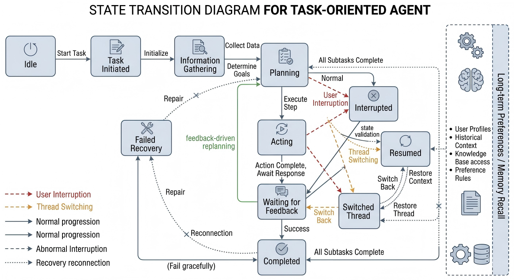
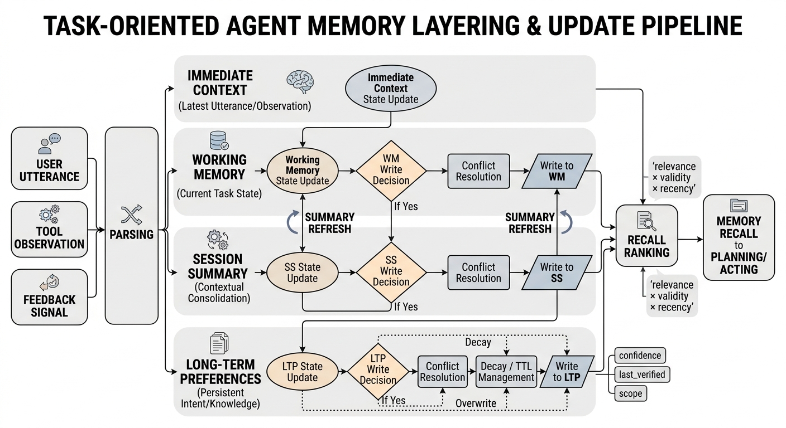

# 第20章 Agent记忆与多轮交互数据

在长程、多轮、任务型 Agent 的数据工程中，真正困难的部分从来不是“把单轮问答拼接得更长”，而是让模型在跨轮交互中持续保持任务身份、状态一致性与行为稳定性。一个能够完成复杂任务的 Agent，往往既要记住用户的长期偏好，又要跟踪当前任务的中间进度；既要处理当前上下文中的局部依赖，又要在任务被打断、切换、恢复之后继续沿着正确轨迹推进。于是，多轮数据不再只是对话长度问题，而变成了状态建模、记忆管理、反馈闭环和时间衰减共同作用的数据问题。

对于构建长程、多轮、任务型 Agent 数据的团队而言，本章的核心目标不是教模型“多聊几轮”，而是为模型建立一种能够跨轮稳定工作的交互轨迹结构。这个结构至少包含四个基本层面：第一，能够表示当前对话正在进行什么任务、处于什么阶段、还缺少什么信息；第二，能够区分哪些信息应写入长期记忆，哪些只在短时上下文中保留；第三，能够在用户反馈、工具执行结果和外部环境变化后更新状态；第四，能够通过回放评测与失败归因，发现系统究竟是“记住错事”，还是“忘了该记的事”。

因此，本章讨论的“记忆”不是一个抽象能力标签，而是一个可以被数据化、结构化和评测化的训练对象；讨论的“多轮交互”也不是聊天式陪伴，而是围绕任务推进而展开的状态转移过程。围绕这一点，我们将依次讨论多轮轨迹的本质、会话切分与状态表示、记忆写入与召回策略、回放测试与失败复盘，以及在 AI 助手、客服 Agent 和办公 Agent 中的典型数据组织方式。

## 20.1 为什么多轮轨迹不是“多几轮对话”这么简单

### 多轮对话中的状态依赖、角色漂移与任务中断

单轮数据的核心关注点通常是“输入是否合理、输出是否正确”，而多轮数据的核心关注点则是“当前这一轮的输入输出是否与前面所有轮次共同构成一个连贯的任务过程”。在这种设定下，任意一轮回复都不再是孤立样本，而是嵌在一条状态链上的局部动作。模型如果只学会局部回答，却没有学会在状态链中定位自己，就很容易出现多轮表面通顺、整体执行错误的问题。很多系统在演示时看起来“能聊很久”，但一旦任务稍微变复杂，就会暴露出一个本质问题：它们维持的是语言连续性，而不是任务连续性。语言连续性要求回答读起来顺；任务连续性则要求每一轮动作都和前置约束、当前进度、后续目标保持一致。二者并不等价，而且在真实 Agent 场景中，后者明显更重要。

状态依赖是多轮任务型 Agent 的第一难点。用户在第 1 轮给出的信息，可能在第 6 轮才真正决定某个工具参数；某个中间结果在当下看似无关，却在后续恢复任务时成为唯一有效线索。如果数据标注只记录每轮文本，而不显式标出任务变量、进度节点和等待条件，那么模型在训练时就只能凭语言表面模式去猜测状态，这会严重削弱其在复杂任务中的稳定性。更重要的是，状态依赖往往并不是“前一轮影响后一轮”这么简单，而是表现为跨多步、跨子任务、跨工具调用的依赖链。比如用户先说明“只保留英文术语”，随后又要求生成报告摘要，再之后要求导出邮件草稿。这里“英文术语”这一约束不会在每轮都被重复提起，但它应持续影响摘要写法、文件格式和邮件措辞。如果样本中没有把这类约束沉淀为状态字段，模型就容易在长对话中只保留最近几轮显性的语言痕迹，而丢掉真正高优先级的任务约束。

从数据工程角度看，状态依赖至少包括三类。第一类是参数依赖，即前面确认过的时间、对象、格式、权限、地点等信息在后续动作中持续生效。第二类是阶段依赖，即只有当某一步完成后，下一步才具有合法性，例如只有用户确认预算后，系统才应进入下单或报销环节。第三类是结果依赖，即工具观测、外部检索结果或用户反馈会反过来修改当前任务状态，迫使模型改变计划。许多多轮系统失败，不是因为它完全没有理解某一轮文本，而是因为没有正确处理这三类依赖之间的先后顺序。它可能记住了参数，却忽略阶段门槛；可能执行了动作，却没有根据结果更新状态。于是，系统在局部看似合理，在整体上却前后失配。

角色漂移则是第二类问题。所谓角色漂移，不是简单的语气变化，而是模型在多轮交互中逐渐偏离原始任务身份。例如，本应充当“任务执行代理”的模型，在交互拉长后开始退化为“泛泛解释者”；本应持续推进一个待办流程，却在新一轮中转而生成宽泛建议；本应维持审慎约束，却在长上下文中被用户措辞牵引而改变行为边界。对于数据工程而言，这说明多轮样本不能只标“本轮答得对不对”，还必须标“本轮是否延续了正确角色与目标”。

角色漂移之所以危险，在于它常常不是突然发生的，而是以一种渐进方式出现。模型最开始还在执行任务，但随着对话拉长，它会逐步偏向自己更熟悉、也更容易生成的回应模式，比如解释背景、给出原则性建议、复述用户意图、做情绪化回应，甚至进入无关延展。对纯聊天产品来说，这类漂移未必总是致命；但对任务型 Agent 来说，它意味着执行链条被中断。一个本该“继续办理”的系统，开始“讨论如何办理”；一个本该“根据记录更新状态”的系统，开始“泛泛建议用户提供更多信息”；一个本该“遵守工具调用边界”的系统，开始“自行编造可能结果”。因此，多轮数据中的角色标注，不应只描述系统的人设或口吻，而应描述其操作位姿，也就是它此刻究竟应扮演执行者、协调者、确认者、解释者、等待者还是恢复者。

任务中断使问题进一步复杂化。真实系统中的任务推进并不总是线性连续的：用户会跳题、插入新问题、要求暂存、隔几小时后再回来继续。一个成熟的多轮 Agent 数据集，必须显式包含这类中断—切换—恢复轨迹，而不是默认所有任务都沿着单线顺序完成。因为对模型来说，真正困难的恰恰不是连续五轮做同一件事，而是在被打断之后还能恢复正确线程，并且不把不同任务的状态混在一起。

中断的难点不只是“记住之前做到了哪一步”，而是中断会改变状态空间本身。一个任务在被打断前可能处于“等待确认”，被打断后则进入“挂起”；另一个新任务插入后，当前活跃线程发生变化；当用户返回旧任务时，系统不仅要恢复原线程，还要判断旧状态是否仍然有效。例如，原先待确认的价格、库存、时间窗口，可能已经因为外部环境变化而失效。换言之，中断之后的恢复不是简单重放旧内容，而是要在旧状态基础上重新做有效性检查。若数据中从不呈现这类变化，模型就会把恢复理解为“复述上次说到哪儿”，而不是“在当前环境下恢复可执行状态”。

### 长期记忆、短期记忆与上下文窗口的差异

很多团队在做多轮数据时，会把“上下文变长”误当成“模型有记忆”。事实上，上下文窗口、短期记忆和长期记忆是三个不同层次的问题。

上下文窗口本质上是当前可见文本范围。它解决的是“这一轮模型能看到什么”，而不是“什么信息应该被长期保留”。一个信息被塞进上下文，并不意味着它会被稳定使用；上下文越长，也不意味着跨轮一致性自然变好。因为当窗口中既包含历史对话、工具观测、用户偏好，又包含无关寒暄和失败尝试时，模型面对的是一个高噪声、弱结构的输入空间。上下文窗口的本质更像是一块临时白板：东西可以被写上去，但不代表写上去的内容都同样重要，更不代表系统能自动知道哪些应被保留、哪些应被忽略。许多系统的“长上下文能力”在演示中看似强大，实则只是能在大段文本中捕捉表面关联；一旦涉及跨轮约束继承、过期信息剔除和冲突消解，单纯扩大窗口就不再足够。

短期记忆更接近“当前任务工作集”。它通常保存本次任务执行过程中暂时有效的信息，例如本轮已经确认的参数、尚未完成的子步骤、上一轮工具调用失败的原因、当前等待用户补充的槽位等。短期记忆的关键不在于存得久，而在于服务当前线程，因此它强调时序一致性和任务内关联性。短期记忆不是对所有近邻上下文的机械缓存，而是对“当前任务继续推进所必须保留的信息”的有选择保留。例如工具调用返回十个字段，其中真正进入短期记忆的可能只有状态码、失败原因和下一步必须使用的标识符；其余字段可以留在观测记录中，而不必全部带入后续推理。若没有这种筛选，短期记忆层会很快被噪声填满，导致系统虽然“保存了很多东西”，但在真正需要恢复时找不到最关键的变量。

长期记忆则对应跨会话、跨任务仍然成立的信息，例如用户稳定偏好、固定约束、常用工作模式、长期项目背景等。长期记忆不应成为“历史对话仓库”，而应是经过抽取、归纳、冲突解决和时效判断后的高价值信息集合。换句话说，长期记忆不是把旧内容原封不动留下来，而是把对未来仍有帮助、且风险可控的信息以结构化形式沉淀下来。长期记忆的工程难点在于，它必须兼顾稳定性与可修订性。一方面，它要足够稳定，避免系统每次都要求用户重复说明偏好；另一方面，它又不能固化到不可更新，否则用户一旦改变习惯或任务上下文变化，旧偏好就会变成错误约束。因此，长期记忆更适合作为“低频变化但可被覆盖的持久状态”，而不是“永久不变的事实表”。

这三者之间的边界一旦混淆，就会造成数据标注和训练目标的双重混乱。把短期状态误写进长期记忆，会导致模型“记住本该过期的事”；把长期偏好只放在当前上下文里，又会导致模型“下一次就忘了”。因此，多轮数据工程首先要解决的，不是如何让轨迹更长，而是如何让不同层级的信息进入正确容器。更进一步说，团队需要明确：上下文窗口是承载层，短期记忆是执行层，长期记忆是复用层。承载层负责让模型看见，执行层负责让任务推进，复用层负责让跨会话一致性成立。如果这三层被混成一团，模型就会在不该长期化的地方长期化，在该稳定继承的地方反而频繁丢失。

### 多轮监督的目标为何不只是“下一轮回复”

从训练目标上看，多轮任务型 Agent 也不应被简化为“给定历史，预测下一轮回复”。这种目标对于纯语言连续性学习是必要的，但对 Agent 能力学习来说远远不够。因为一个真正有用的多轮系统，学习对象不只是下一句该怎么说，还包括当前状态如何判定、是否需要写入记忆、是否应该调用工具、是否需要等待反馈、是否应切换线程，以及在恢复任务时从哪个阶段重新起步。

也就是说，多轮数据的监督对象应从“文本表面生成”扩展到“状态—决策—动作”的完整闭环。如果训练样本中只有用户和助手的自然语言，而没有状态快照、记忆变更记录、任务进度字段、工具观测摘要，那么模型学到的主要还是语言共现规律，而不是跨轮执行逻辑。这也是为什么许多模型在闲聊场景里表现自然，但一到任务场景就显得脆弱：它们擅长生成一轮“像样的话”，却不擅长维持一条“像样的轨迹”。

因此，多轮监督至少应覆盖三个层次。第一个层次是回复监督，即本轮生成内容是否合理。第二个层次是状态监督，即本轮之后系统状态应如何变化。第三个层次是过程监督，即本轮动作与未来恢复之间是否形成可持续的因果链。没有后两个层次，多轮数据再长，也只是更长的对话，而不是更强的 Agent 轨迹。

### 多轮数据常见的错误标注方式

多轮数据常见的第一个错误，是把整段对话简单拼接后作为一个长样本，而不标注其中的状态变化。这样做虽然保留了表面顺序，却丢掉了真正决定任务质量的转折点：哪些轮次是在收集信息，哪些是在执行动作，哪些是在等待反馈，哪些意味着任务分叉，哪些意味着恢复旧线程。这种“长文本化”的处理方式，对语言建模有帮助，对任务型多轮 Agent 的状态学习帮助有限。更具体地说，这类标注方式默认“顺序本身会隐含结构”，但真实情况是，顺序只能告诉模型先后，不会告诉模型语义角色。一次工具失败后的解释、一次用户插话、一次线程恢复，在文本表面都可能只是普通的几句话，但它们在状态机中的含义完全不同。如果标注层不把这种差异显式化，模型就只能用极不稳定的语言启发式去猜。

第二个错误，是只标最终结果，不标中间决策依据。例如一个订票或报销类任务最终成功完成，但中间经历过参数确认、时间冲突、失败回退、用户改口等多个关键节点。如果数据只给模型看“最后成功了”，模型就学不到在失败后如何修正，也学不到何时应暂停推进并请求确认。许多团队在构建数据时有一个惯性：喜欢保留“干净的成功轨迹”，删除看起来冗余的确认和修正环节，认为这样能让样本更整洁。实际上，恰恰是这些中间环节构成了多轮 Agent 的真实能力。一个不会处理回退与重规划的模型，即使在成功样本上学习得再好，到了线上也很容易因为用户一句“不是这个版本”而崩塌。

第三个错误，是把用户反馈当成普通对话语料，而不把它看作状态更新信号。用户说“不是这个文件”“时间改到下周”“还是用上次那种格式”，这些都不只是文本内容，而是对现有任务状态和记忆内容的显式修订。若标注时不将其结构化，训练后的模型就容易把反馈当成补充闲聊，无法稳定执行闭环修正。在实际工程中，反馈轮往往是最有价值的数据点，因为它们直接暴露了系统前一状态的缺陷，并给出了显式修正方向。如果连这一类信号都被当成一般对话处理，那么系统就很难真正具备“被纠正后更新自身”的能力。

第四个错误，是缺少衰减与失效机制。很多数据集默认一旦某条信息出现，就永久有效，这在真实系统中几乎一定是错的。任务中间变量、一次性意图、临时口味、已被后续否定的信息都应具备衰减或覆盖规则。没有时效管理的多轮数据，最终只会训练出“什么都记一点，但不知道哪条还有效”的模型。这个问题在长程任务中尤其严重，因为任务越长，过期状态就越多。若数据中完全没有“某信息已失效”这一类样本，模型会天然倾向于把所有历史都当作可用依据。

第五个错误，是把记忆写入本身视为黑箱。很多样本会呈现“模型后来记住了某件事”的结果，但不呈现它是如何决定写入的、写入到了什么层级、置信度如何、何时会被覆盖。这样一来，模型只能从结果反推机制，训练信号会非常弱。对多轮 Agent 而言，记忆写入、记忆更新和记忆召回都应成为可观察、可标注的训练对象，而不应只在系统实现里默默发生。

第六个错误，是把多任务混杂对话按单线程处理。真实会话中经常存在并行 thread，但如果标注时没有单独区分线程编号、活跃线程和挂起线程，模型在训练中就会形成一种错误假设：所有新轮次都默认属于唯一的主线任务。这样的数据会系统性地削弱模型处理插话、切换和恢复的能力。上线后常见的表现就是，用户稍微换个话题，系统就把新旧任务揉在一起，既不能正确继续旧任务，也不能干净开启新任务。

## 20.2 会话切分与状态表示

### session、episode、task thread 的划分

要构建可训练、可评测的多轮数据，首先必须明确轨迹切分单位。最粗粒度的单位是 session，它通常表示一次相对连续的会话容器，用于承载若干轮用户与 Agent 的互动。session 关注的是交互时间上的连续性，但它并不天然等于一个完整任务，因为同一会话中可能并行出现多个主题，甚至多个独立任务线程。session 更像一个“时间盒子”，它说明这些交互大致发生在同一段连续使用过程中，但并不保证这些交互在目标层面属于同一个过程。把 session 直接拿来当训练样本，虽然方便，却经常会引入任务边界混乱的问题。

比 session 更适合任务建模的是 episode。episode 强调围绕某一明确目标展开的一段相对完整过程，通常具有起点、推进、结束或中断标记。一个 episode 可以在单个 session 中完成，也可以跨多个 session 被恢复。对于数据工程团队而言，episode 是多轮训练和回放评测的核心单位，因为它最接近“任务执行轨迹”本身。episode 的价值在于，它给数据一个可操作的闭环边界：什么叫任务开始，什么叫任务完成，什么叫中途挂起，什么叫因外部条件不足而暂停。没有 episode，团队很难定义状态何时初始化、短期记忆何时清理、任务成功与失败何时结算。

再往下是 task thread。它表示更细粒度的任务线程，适合建模多任务交叉、插话式切换和中途恢复。例如用户在准备简历的过程中突然插入“帮我回一封邮件”，随后又回到简历线程。若没有 task thread 概念，系统很容易把邮件上下文误并入简历任务，或者在恢复时丢失原进度。task thread 的价值就在于，它帮助数据团队把“同一段对话中的多个目标线”分开建模。thread 不一定总是一个完整 episode，它可以是某个大任务内部的子线程，也可以是临时插入、短暂存在后很快结束的旁路线。但只要它有独立状态和独立恢复点，就值得作为单独线程处理。

因此，session 解决“这是一段连续交互”，episode 解决“这是一次任务过程”，task thread 解决“这条任务线当前进行到哪里”。只有把这三层分开，多轮数据才不会在切分时天然混乱。更进一步说，这三层对应的并不是三个平行标签，而是一种嵌套结构：session 是外层容器，episode 是任务闭环单位，thread 是过程中的活跃线索。数据集设计时若只保留其中一层，都会导致能力表达不完整。只有三者同时存在，系统才能既知道自己处在一段持续对话中，又知道当前在哪个任务闭环里，还知道这个闭环内部当前激活的是哪一条线程。

### 会话切分不是按轮数，而是按状态连续性

很多团队在实际构建数据时，会下意识按轮数、时间间隔或消息块去切分对话。例如每 10 轮切一段、超过 30 分钟切新 session、或者按用户一次打开页面到关闭页面算一个完整片段。这些规则在工程上确实方便，但它们只能提供弱边界，不能替代状态边界。因为多轮 Agent 最关心的并不是“聊了多久”，而是“状态是否仍连续”。

所谓状态连续性，指的是当前轮仍然建立在前一段任务变量、目标和进度之上。如果连续 20 轮都围绕同一个待办展开，那么即使中间有时间间隔，它在任务层面仍可能是一个 episode；反过来，即使两轮消息紧挨着，只要用户已经明确切换目标，它们也未必属于同一个任务过程。因此，真正有效的切分原则，往往不是物理时间，而是状态转移事件。例如用户发起新目标、旧目标完成、线程被挂起、恢复旧任务、工具失败后进入重新规划等，这些都是更可靠的切分信号。

从标注角度看，会话切分最好建立在“状态是否可继承”的判断上。如果下一轮必须继承上一轮的任务变量，说明二者属于同一条状态轨迹；如果下一轮只共享用户长期偏好，而不再共享当前任务变量，则更可能意味着新 episode 或新 thread 的开始。这样的切分方式虽然比按轮数切分复杂，但它更符合 Agent 学习的本质，因为模型最终学习的是如何维持和迁移状态，而不是如何对固定长度的文本块做预测。

### 对话状态、用户偏好、任务进度的结构化表示

多轮任务型 Agent 不能仅靠自然语言上下文隐式维持状态，而需要引入结构化表示。这里至少有三类字段应被明确建模：对话状态字段、用户偏好字段和任务进度字段。

对话状态字段描述当前这一轮在交互流程中的位置，例如当前活跃线程、待确认事项、最近一次动作结果、是否等待用户输入、是否存在冲突信息等。这些字段决定模型在下一步是继续执行、请求澄清、还是切换线程。对话状态的本质不是对文本的再描述，而是对交互控制权的编码。比如“waiting_for_user_confirmation”和“waiting_for_tool_result”都表示系统当前不应贸然推进，但它们对应的后续动作完全不同：前者应围绕用户补充信息设计回复，后者则要避免重复执行并准备处理观测结果。若没有这种区分，模型会把许多不同语义的“等待”混为一谈。

用户偏好字段描述跨任务更稳定的选择倾向，例如输出风格、格式偏好、默认工具选择、常用时间表达、敏感边界、审批习惯等。这类信息不应每次都由用户重新声明，因此适合进入长期记忆或持久偏好层。这里需要强调的是，偏好字段不只是“用户喜欢什么”，而是“哪些稳定倾向会实质改变系统决策”。例如“喜欢简洁回复”会影响生成长度，“默认用表格总结”会影响输出格式，“默认邮件语气正式”会影响写作风格，“默认不使用外部搜索”会影响工具选择。只有这类会改变行为路径的偏好，才值得成为结构化字段；否则长期记忆层会被大量无操作意义的信息占满。

任务进度字段则描述某一任务已经完成到什么阶段，还剩哪些子步骤，哪些依赖已满足，哪些资源已准备，当前阻塞点在哪里。对于复杂 Agent 而言，进度字段是决定任务恢复能力的关键。如果没有显式进度，所谓“继续刚才的事”在模型看来只是一个模糊指令。一个成熟的进度表示，通常不只是一个简单的阶段名称，而应至少包含已完成步骤、待完成步骤、当前阻塞项和最近有效动作。只有这样，系统在恢复任务时才能知道是继续执行、先核验旧状态，还是先请求缺失信息。

值得注意的是，这三类字段不能简单合并。因为用户偏好不等于当前任务状态，任务进度也不等于当前对话动作。将它们混在一个无区分的状态字典里，虽然表面上“都存了”，但训练时反而不利于模型学习信息层次。更糟糕的是，混合表示还会导致更新逻辑混乱：一次用户纠正可能只应修改任务字段，不应覆盖长期偏好；一次长期偏好更新也不应重置当前任务进度。结构化表示真正的价值，不只是让信息“可存”，更是让不同类型的信息“按不同规则被更新、被召回、被衰减”。

### 状态表示的最小闭环单元

为了让多轮数据真正可训练，状态表示不能停留在“有几个字段”这一层，而应进一步明确一个最小闭环单元。所谓最小闭环单元，是指模型完成一次多轮决策所必须观察和输出的最小结构。对任务型 Agent 而言，这个闭环通常包括四个部分：当前状态快照、触发输入、决策动作、更新后状态。

**代码示例：多轮样本的“前态—触发—动作—后态”结构（最小闭环）**

下面示例用一个“会议安排”线程演示：本轮触发是用户补充了时区；动作为调用日历工具；后态更新了 `pending_slots` 与 `last_action_result`。

```json
{
  "episode_id": "ep_0012",
  "thread_id": "t_calendar",
  "before_state": {
    "active_state": "collecting_info",
    "pending_slots": ["timezone"],
    "confirmed": {"date": "2026-04-29", "duration_min": 90},
    "memory_refs": ["pref_language=zh"]
  },
  "trigger": {"type": "user_message", "text": "用上海时区。"},
  "action": {
    "type": "tool_call",
    "name": "calendar_search",
    "arguments": {
      "start_time": "2026-04-29T13:00:00",
      "end_time": "2026-04-29T18:00:00",
      "timezone": "Asia/Shanghai",
      "mode": "freebusy"
    }
  },
  "tool_observation": {
    "status": "ok",
    "conflicts": [{"start": "2026-04-29T15:00:00", "end": "2026-04-29T15:30:00"}]
  },
  "after_state": {
    "active_state": "waiting_for_user_confirmation",
    "pending_slots": ["choose_slot"],
    "last_action_result": "found_conflicts"
  }
}
```

当前状态快照说明系统此刻知道什么、正在做什么、缺什么；触发输入可以是用户新消息、工具观测或反馈信号；决策动作包括回复、调用工具、写入记忆、切换线程、挂起任务等；更新后状态则记录这一步之后系统内部应发生的变化。只有把这四个部分串起来，数据才真正形成“观察—决策—更新”的学习单元。若样本里只有触发输入和回复文本，而没有前后状态，模型学到的就只是“给定一句话怎么接一句话”，而不是“给定状态怎么推进任务”。

这种最小闭环单元还有一个重要作用：它让多轮数据具备天然的可回放性。因为一旦每一步都存在前态和后态，团队就可以在回放测试中检查状态是否正确迁移，哪里开始漂移，哪一步把错误写进了记忆，哪一步在反馈后没有更新状态。没有这一层，多轮数据虽然也能训练，但很难诊断。

### 中断、切换与恢复场景的数据建模

中断、切换与恢复是多轮 Agent 数据中最能体现真实复杂度的一部分。很多数据集在采样时只保留“平滑推进”的轨迹，结果模型上线后在面对真实用户时，最先暴露问题的往往就是恢复能力不足。

中断场景要求数据中显式标出：中断发生于哪个任务节点，中断时有哪些尚未完成的状态，中断后哪些信息需要冻结，哪些需要继续监听。例如用户在报销流程中尚未确认金额就转去处理会议通知，那么“待确认金额”应被保留为未完成状态，而不应被误写成已完成。进一步说，中断并不意味着所有状态都原样冻结。有些状态在中断期间依然会老化，例如价格、库存、时间窗口、外部文档版本等；有些状态则应保持不变，例如用户长期偏好、已确认的身份信息、已完成步骤。因此，中断标注最好能区分“静态可继承状态”和“恢复时需复核状态”。

切换场景要求系统能识别当前轮属于哪个线程，以及切换后哪些字段应局部失活。一个合理的数据样本会体现：切换到新任务时，原线程并未消失，而是进入挂起态；新线程获得独立状态容器；两者共享的长期偏好仍可复用，但临时参数不可互相污染。这里最容易出错的地方，是共享信息和专属信息的边界。比如用户的默认语言偏好可跨线程共享，但“这封邮件的收件人”显然不应在切到“修改简历”线程时仍被视为当前变量。没有这种边界意识，系统就会在多线程场景中出现严重串味。

恢复场景则要求模型不仅能回忆“之前做过什么”，还要知道“应该从哪里继续”。这意味着恢复不是检索一段旧文本，而是重建一个可执行状态。优质的数据会把恢复过程标成一个状态迁移事件：从挂起态进入活跃态，并带着上一轮的未完成槽位、最近错误、已确认参数和下一步动作建议。恢复的关键不在于“记得过去”，而在于“带着过去重新行动”。因此，恢复样本中最好显式体现：系统在恢复时先做了什么检查，确认了哪些条件仍成立，发现了哪些条件需要更新，然后才决定继续执行还是先向用户确认。

从更深一层看，中断、切换与恢复实际上构成了多轮 Agent 最重要的状态迁移训练集。因为这些场景集中暴露了三个核心能力：线程隔离能力、状态压缩能力和恢复规划能力。线程隔离决定系统能否不串线；状态压缩决定系统能否在长对话后仍保留关键信息；恢复规划决定系统能否在重启任务时不是盲目重放，而是正确续跑。很多团队把这三类能力视为“上线后慢慢补”，但从数据角度看，它们应该在训练集里被明确呈现，而不是留给模型自己碰运气学出来。

为了更直观地呈现这一点，书中可配一张多轮状态转移示意图。图中不应只展示一般性的顺序流程，而应突出状态迁移中的分叉、挂起、恢复和失败回退关系。也就是说，这张图最好不是“一条从左到右的流水线”，而是一张能体现任务线程切换和记忆影响层的状态网络图。这样读者才能直观看到，多轮 Agent 的复杂度并不来自“轮数更多”，而来自“状态更多、迁移更多、恢复路径更多”。




*图20-1：多轮 Agent 状态转移图*


## 20.3 记忆写入、更新与召回

### 哪些信息应进入记忆，哪些只应留在上下文

记忆系统的第一原则不是“尽量多记”，而是“只记未来有用、且风险可控的信息”。并不是所有在对话中出现的内容都值得写入记忆。一个成熟的数据规范，必须为“写入”设置门槛。很多团队在早期做 Agent 记忆时，容易陷入一个表面上很自然、实际上很危险的直觉：既然未来可能有用，那就先存下来再说。但真正的工程经验恰恰相反，记忆系统失败往往不是因为“记得太少”，而是因为“记得太杂、太早、太久”。只要写入门槛过低，系统就会快速积累大量未经确认、低价值、强时效或高歧义的信息，最终使召回阶段的噪声远远大于收益。

适合进入长期记忆的信息，通常具有较强稳定性、跨任务复用价值和相对明确的语义边界。例如用户长期偏好的输出格式、固定工作习惯、长期项目背景、稳定约束条件、重复出现的选择模式等。这类信息若每次都依赖临时上下文，会造成重复确认和交互成本上升，因此应被抽取并持久化。这里需要强调的是，“适合进入长期记忆”并不等于“用户提到过很多次”这么简单，而是意味着该信息在未来任务中能够稳定影响系统行为。例如，用户长期习惯使用某种文档结构、偏好特定语言输出、默认采用某类工具工作流，这些都会持续改变后续规划与生成过程，因此具有进入长期记忆的必要性。

只适合留在短期上下文的信息，则通常与当前任务强绑定，或者具有明显时效性。例如本次会议的临时时间、当前表格中的某个待改字段、本轮工具调用返回的短期观测、尚待确认的候选方案等。这些信息在任务完成或线程结束后往往应快速衰减，避免对后续任务造成污染。短期信息的核心特点，不是它“不重要”，而是它的重要性高度依赖当前线程。一旦任务结束，或者对话切换到新的 episode，这些信息就可能从“推进任务的必要变量”变成“干扰判断的过期痕迹”。因此，短期上下文层更像任务执行时的工作台，而不是长期仓储区。

还有一类信息根本不应进入记忆，甚至不应长期保留于状态中，例如已经被用户显式否定的错误信息、一次性闲聊内容、模糊且未经确认的推测、对未来没有帮助的低价值细节。对数据团队来说，真正困难的不是找到能记的内容，而是有纪律地拒绝不该记的内容。尤其在多轮任务型 Agent 中，系统越是表现得“记性好”，越需要克制写入冲动。因为一旦把未经确认的推测、偶然的口头表达或一次性的偏好写入长期层，系统之后每一次自信地调用这些内容，都会把错误放大为结构性偏差。

### 记忆写入的判定标准

为了让记忆写入从经验行为变成可训练、可审计的数据动作，团队通常需要明确一组写入判定标准。第一类标准是稳定性判定，即该信息是否大概率跨轮、跨任务仍然成立。第二类标准是可复用性判定，即该信息是否会显著降低未来交互成本或提升任务成功率。第三类标准是可确认性判定，即该信息是否已经被用户显式确认、被工具可靠返回，或被多轮一致性证据支撑。第四类标准是低风险性判定，即该信息被错误保留时是否会造成明显副作用。

这意味着，记忆写入不是一个单独的存储动作，而是一种决策动作。系统在每轮交互后实际上都面临一个判断：这条信息只是当下可见内容，还是未来应该持续利用的结构化知识。如果这一判断在数据中完全不可见，只在系统实现里黑箱完成，那么模型很难学到稳定的写入边界。相反，若训练样本明确呈现“为何写入”“写入到哪一层”“写入后置信度如何”“何时需要复核”，模型就更可能学会像一个有纪律的数据系统那样管理记忆，而不是像一个机械缓存器那样囤积文本。

**代码示例：一条“长期偏好记忆”的写入记录（带置信度与衰减策略）**

```json
{
  "memory_event": "upsert",
  "memory_id": "pref_format_table_first",
  "key": "preference_format",
  "value": {"default": "先表格后总结", "language": "zh"},
  "evidence": {
    "source": "user_confirmed",
    "episode_id": "ep_0009",
    "occurrence_count": 3
  },
  "confidence": 0.85,
  "decay": {
    "policy": "time_decay",
    "half_life_days": 60,
    "override_on_conflict": true
  },
  "created_at": "2026-04-24"
}
```

### 记忆写入与任务闭环的关系

从更深一层看，记忆写入并不是独立于任务流程之外的附加功能，而是任务闭环中的一环。系统在写入一条记忆时，实际上是在为未来的状态恢复、计划延续和个性化执行做准备。比如用户在本轮明确说明“以后给我的表格都保留英文列名”，这不仅是当前回复的条件，也是在为未来多个任务预埋行为约束。如果系统没有把它抽取出来，未来就只能依赖偶然的上下文碰撞；如果系统过早、过宽地写入了不稳定版本，又可能形成长期误导。

因此，记忆写入最好被放在“状态更新”之后、“任务结束”之前理解。也就是说，系统先要知道当前信息在本轮任务中的作用，再判断其是否有跨轮价值。这样的顺序很重要，因为只有先理解其任务角色，才能判断它值不值得被长期化。否则，系统很容易把刚刚被提到、语义上看起来显著的信息误当成高价值记忆，而忽略真正决定后续任务成败的稳定约束。

### 记忆层级、长期偏好与数据衰减

为了避免记忆系统变成杂乱无章的历史仓库，实际工程中通常需要引入分层设计。一个适合任务型 Agent 的记忆层级，至少可以分为瞬时上下文层、工作记忆层、会话摘要层和长期偏好层。

瞬时上下文层承载当前输入附近的语言环境，服务模型的局部生成。它容量小、更新快、噪声高，不适合承担长期一致性的责任。工作记忆层则维护当前任务的关键变量和进度状态，是多轮任务推进的核心容器。会话摘要层保存某个 episode 的压缩表示，用于跨窗口延续与后续恢复。长期偏好层沉淀跨 episode 仍稳定成立的信息，是长期个性化与低摩擦交互的基础。这样的分层设计，本质上是在回答三个不同问题：当前这一轮需要看到什么、当前这个任务需要持续保留什么、未来多个任务还应继承什么。若这三个问题混用同一套容器，信息更新和清理规则就很难保持一致。

长期偏好并不等于“用户画像”。在本章语境中，它更强调对任务执行有直接帮助的行为倾向与稳定设置，例如偏好的文档结构、常用术语、默认输出语言、审批顺序、文件命名习惯等。它应尽量面向任务可用性，而不是泛化成模糊的人格描绘。换句话说，长期偏好不是为了让系统“显得懂用户”，而是为了让系统“更少重复确认、更稳地继续工作”。如果偏好层中充满泛泛描述而缺少可操作字段，那么这层记忆在工程上就很难产生真实收益。

数据衰减是这一分层体系中必须新增的一环。因为即使某条信息曾经有效，也不意味着它会永久正确。短期任务变量应在任务完成后快速失效；会话摘要应随着新摘要出现而被压缩或替换；长期偏好也应允许被更新、覆盖或降低置信度。没有衰减机制的记忆系统，最终会从“帮助模型稳定工作”退化为“让模型背负越来越多过时噪声”。衰减机制的意义，不只是删除旧信息，而是在持续变化的交互环境中维持记忆层的可用性密度。只有当保留下来的大多数信息仍然有效，召回才会真正有价值。

从数据工程角度看，衰减至少应体现在三个维度：时间衰减、冲突衰减和使用衰减。时间衰减表示信息随时间自然降低可信度；冲突衰减表示新证据到来后旧记忆权重下降；使用衰减表示长期未被召回且未被验证的信息逐步边缘化。这种机制不是上线后的补丁，而应在训练与标注阶段就被体现出来。也就是说，数据集中不能只出现“写入成功”的样本，还应出现“记忆被覆盖”“记忆被降权”“记忆因长期未验证而被归档”的样本。否则，模型会倾向于把写入理解成不可逆动作，而这与真实系统所需的动态管理完全不符。

### 记忆层级之间的迁移规则

分层设计如果只有层级而没有迁移规则，仍然很容易退化成一堆静态仓库。真正重要的是，一条信息如何从瞬时上下文进入工作记忆，如何由工作记忆抽象成会话摘要，又如何在满足条件时升级为长期偏好。这个迁移过程本身就应该成为数据建模对象。

例如，用户在某次任务中临时要求“这份报告先给我中文版本”，这更可能只进入工作记忆；若用户在多个任务中反复表达“默认先给中文，再附英文术语”，系统才更有理由将其提升为长期偏好。再如，某次工具调用失败返回的错误码，通常只应停留在工作记忆和日志层，用于当次恢复；但如果多轮交互持续反映某类工具在特定条件下不稳定，这种模式信息才可能被抽象到更高层，成为后续规划的经验约束。可见，层级不是由信息“长得像什么”决定的，而是由其跨时间复用价值与验证强度决定的。

### 长期偏好的形成不是一次写入，而是逐步收敛

很多系统设计会把长期偏好理解为“用户说过一次，就记住”。这种做法在工程上看似高效，实际上风险很高。因为长期偏好往往不是一次性声明，而是在多轮、多任务、多场景中逐渐显露的稳定倾向。用户今天说“先给我简略版”，可能只是因为赶时间；但如果他在接下来的多个任务中都表现出类似选择，这才更接近一个真正的长期偏好。

因此，长期偏好更适合作为一个逐步收敛的结构，而不是一次性写死的字段。系统可以为其维护证据次数、最近验证时间、适用场景范围和置信度水平。这样一来，所谓“形成长期偏好”就不再是一次瞬间决策，而是一个由反复观察、冲突修正和跨任务验证共同推动的过程。数据如果能显式呈现这种收敛过程，模型就更容易学会谨慎而非武断地管理长期记忆。

### 记忆摘要、冲突解决与时效性管理

摘要是多轮记忆写入中的关键中间层。因为原始对话通常冗长、含糊、带有修辞噪声，不适合直接作为长期记忆单元。一个高质量摘要，不是简单压缩文字，而是围绕未来可用性提取结构：谁提出了什么稳定偏好，当前任务完成到哪里，哪些结论已被确认，哪些仍处于待确认态。摘要的价值在于，它把语言表面的连贯性转换成状态层面的可继承性。没有摘要，长程多轮系统就只能在大量原始文本里反复搜索；有了摘要，系统才能在有限上下文和有限计算预算下重建任务主线。

冲突解决决定记忆系统是否可信。真实交互中，用户会改变说法、修正偏好、撤回决定，外部工具也可能给出与先前不一致的结果。若数据中没有显式的冲突标注，模型往往会把新旧信息同时保留，导致召回时互相干扰。合格的多轮数据应明确表示冲突类型、来源优先级和覆盖规则，例如“用户显式修正优先于旧偏好”“最新工具成功结果覆盖上次失败推测”“确认信息优先于未确认信息”。这里最关键的一点在于，冲突不是异常情况，而是多轮系统的常态。用户的表达会变化，外部环境会变化，工具返回会变化，任务目标甚至也可能变化。一个不会处理冲突的记忆系统，表面上是“记住了很多”，实则无法形成稳定的决策基础。

时效性管理则使记忆不再是静态数据库，而是一个带寿命和置信度的动态系统。在数据组织上，可以为每条记忆附加来源、写入时间、最近验证时间、适用范围、置信度和失效条件。这样一来，召回就不再只是语义相似度匹配，而是“语义相关性 × 状态有效性 × 时间适配性”的综合判断。也就是说，系统不只是问“这条记忆像不像我要找的”，还要问“这条记忆现在还算不算有效依据”。这种设计对于任务型 Agent 尤其关键，因为许多错误恰恰不是来自“完全没记住”，而是来自“记住了已经过期的东西”。

### 记忆摘要的粒度控制

摘要并不是越详细越好，也不是越短越好。若摘要过于详细，它会重新变成压缩版对话记录，难以在检索和恢复时快速发挥作用；若摘要过于抽象，又会丢失任务恢复所必需的关键变量。对于任务型 Agent 来说，摘要更适合作为一种结构化的“恢复接口”，而不是文学性的“对话提要”。它至少应回答几个问题：这个任务当前目标是什么；已经完成了什么；哪些约束已确认；当前阻塞点是什么；下次恢复时最可能需要从哪一步接上。

因此，摘要粒度的设计应围绕恢复成本来决定。恢复所需的信息越多、线程越复杂、任务越长，摘要就应越偏结构化；对于简单、短程的任务，则可以更轻量。团队若不控制摘要粒度，常会出现两种极端：要么摘要写得像完整聊天记录，导致无助于快速恢复；要么摘要只剩一句“用户在处理报销事项”，结果几乎无法支撑后续执行。

### 冲突解决的优先级体系

冲突解决不仅需要“知道有冲突”，还需要一套优先级体系。通常而言，用户显式最新指令的优先级高于旧偏好；高置信度工具观测高于模型推测；已确认信息高于未确认信息；任务内即时约束高于通用长期偏好。这些规则看似简单，但如果不在数据中反复体现，模型往往难以稳定学会。

例如，用户长期偏好是“默认输出中文”，但在当前 episode 中明确要求“这次全部用英文”。此时，系统若仍按长期偏好输出中文，就说明优先级体系没有建立起来。再如，模型根据旧状态推测某个字段可能仍成立，但最新工具查询显示该条件已变化，那么工具观测就应覆盖模型推测。多轮数据若能够显式展示这种覆盖过程，模型才更可能形成稳健的冲突解消习惯，而不是在不同来源的信息之间平均折中。




*图20-2：任务型 Agent 的记忆分层与更新流程图*

### 召回命中率、错误召回与遗忘策略

评价记忆系统时，不能只看“有没有召回”，而要看“有没有召回对的东西、在对的时刻、以对的权重”。因此，召回命中率只是最表层的指标。更重要的是：被召回的信息是否真正服务当前任务；是否带来了状态推进而不是状态污染；是否因为召回过多而淹没了真正重要的线索。对于多轮 Agent 来说，召回不是一个纯检索问题，而是一个决策支持问题。系统召回的内容若不能帮助当前线程更准确地规划下一步，即使语义上相关，也可能是“无效命中”。

错误召回是多轮 Agent 中极具破坏性的失败形式。它比“完全没记住”更危险，因为模型会带着看似合理却实际错误的依据继续执行任务。例如把上一个项目的文件命名习惯套到当前项目，把早已过期的约束当作仍然有效，把用户一次性的口头表达误认为长期偏好。错误召回往往会导致模型高度自信地犯错，因此在回放测试中必须被单独标记。尤其在多线程和跨 session 场景中，错误召回很容易表现为“串线式正确感”：系统好像记得很多细节，但这些细节属于别的任务、别的时间点或别的上下文。

遗忘策略并不是系统缺陷，而是记忆工程的一部分。一个理想的多轮 Agent，不是永远不忘，而是知道该忘什么、什么时候忘、忘了之后如何通过补充提问或重新检索恢复。换句话说，遗忘不应被定义为“信息消失”，而应被定义为“系统主动控制不再依赖低价值或低可信度信息”。从这个角度看，遗忘策略实际上与写入策略同等重要。前者决定什么应该被带向未来，后者决定什么不应再影响未来。两者共同构成记忆层的边界。

### 召回不是“找相似”，而是“找可用”

很多团队会自然地把记忆召回理解为一种语义匹配：当前输入与过去记录最相似的内容被找出来。这种做法在简单场景中可行，但对于任务型 Agent 远远不够。因为真正有价值的召回对象，不一定是最像当前输入的文本，而是最能支持当前状态迁移的有效信息。也就是说，召回的目标不是“找看起来最相关的旧话”，而是“找现在仍然成立、且能帮助决策的旧状态”。

因此，召回模块在工程上更适合围绕“可用性”而非单纯“相似性”设计。它至少要考虑当前任务线程、信息有效期、信息来源置信度、与当前进度的匹配程度，以及是否存在更新版本。只有这样，召回结果才不会在语义上很像、在行动上却很错。

## 20.4 回放测试与失败复盘

### 多轮回放评测、状态漂移评测与记忆依赖评测

多轮 Agent 的评测不能只看静态 benchmark 上的答对率，因为许多问题只有在轨迹回放中才会暴露。所谓多轮回放评测，是指将真实或模拟的完整交互过程按照时间顺序重放，观察模型是否能在每个关键节点做出与任务状态一致的动作。它关注的是过程连续性，而不只是终点正确性。对于单轮系统来说，局部正确往往足以支撑整体评价；但在多轮系统中，某一步局部看似合理的错误，可能会通过记忆写入、状态污染和错误恢复，被放大成后续多个轮次的系统性失效。因此，回放评测的真正价值，在于它能看见错误是如何沿轨迹传播的。

状态漂移评测则专门检查模型是否在长程交互中偏离原始任务目标或角色定位。一个常见现象是，模型在前几轮推进得很好，但在交互变长、信息变杂之后，开始逐渐忘记当前线程的目标，或者在不同线程之间串味。状态漂移评测的价值就在于把这种“慢性偏离”从总体成功率中剥离出来，单独测量。它不只是问“最终是否完成任务”，还要问“完成前是否长期走在正确轨道上”。因为很多系统最后之所以还能完成任务，只是依赖用户不断纠偏，而不是系统本身保持了稳定状态。

记忆依赖评测则关注系统是否真正学会利用记忆。很多模型在短轨迹中表现不错，是因为它还能凭局部上下文硬撑；一旦任务恢复依赖旧偏好或先前状态，它就开始失败。因此，评测集应故意设计那些必须依赖历史记忆、但当前窗口中不再显式给出的场景，以区分“会读长上下文”和“会用记忆”这两种不同能力。前者更多是一种语言处理能力，后者则是真正的跨轮执行能力。对于长程任务型 Agent 而言，后者显然更接近部署所需。

**代码示例：在回放评测中检测“线程污染”的一个简化规则**

如果某线程的状态字段突然出现了另一个线程的专属字段（比如邮件线程的 `recipient` 出现在简历线程），通常就是串线信号。下面脚本演示如何对回放日志做这种检查。

```python
from typing import Dict, List


THREAD_FIELDS = {
    "t_mail": {"recipient", "subject", "body"},
    "t_resume": {"resume_file", "target_role", "bullet_style"},
}


def detect_contamination(events: List[Dict]) -> List[Dict]:
    findings = []
    for e in events:
        tid = e["thread_id"]
        state = e.get("after_state", {})
        keys = set(state.keys())
        # 如果出现其他线程的专属字段，记录为污染
        for other_tid, fields in THREAD_FIELDS.items():
            if other_tid == tid:
                continue
            leaked = keys & fields
            if leaked:
                findings.append({"event_id": e.get("id"), "thread_id": tid, "leaked_fields": sorted(leaked)})
    return findings


if __name__ == "__main__":
    replay = [
        {"id": "e1", "thread_id": "t_resume", "after_state": {"resume_file": "a.docx", "recipient": "x@y.com"}},
        {"id": "e2", "thread_id": "t_mail", "after_state": {"recipient": "x@y.com", "subject": "hi"}}
    ]
    print(detect_contamination(replay))
```

### 回放评测的基本单位不是回复，而是状态迁移

如果多轮评测仍然只对每一轮回复打分，那么它很容易退化回单轮思路。真正适合 Agent 的回放评测单位，应是“状态迁移是否正确”。也就是说，每一步不仅要看说得对不对，还要看当前状态有没有被正确读取、动作有没有正确选择、后续状态有没有被正确更新。这种评测方式虽然比纯文本打分复杂，但它更接近系统的真实工作机制。

例如，在一个中断后恢复的场景中，回复表面上可能很自然，但如果系统恢复到了错误线程、错把过期变量当成仍然有效，或者没有在恢复前做必要核验，那么这一步就不应被视为成功。可见，多轮 Agent 的评测对象本质上不是“语言片段”，而是“语言、状态和动作共同组成的迁移单元”。

### 长程漂移为何比局部错误更危险

局部错误通常容易被用户识别，也容易被系统在下一轮中修正；但长程漂移则不同，它常常是在多轮过程中缓慢积累、不断合理化的。系统可能一开始只是轻微偏离任务重点，随后又在错误状态上继续规划、继续写入记忆，最后形成整条轨迹的系统性偏航。到那时，即使用户指出问题，恢复成本也会很高，因为错误已经嵌进多个中间状态中。

因此，状态漂移评测的重点不应只是终局失败样本，而应主动寻找那些“表面上一直很自然、实际上逐步偏航”的轨迹。越是这种错误，越能反映多轮系统的深层稳定性问题。因为它说明系统不是不会回答，而是不会持续保持自己是谁、在做什么、下一步该往哪里走。

### “记住错事”“忘记要事”的错误归因

多轮失败分析里，最常见也最值得区分的两类错误，就是“记住错事”和“忘记要事”。

“记住错事”通常意味着写入策略、冲突解决或召回排序出了问题。系统可能把未确认猜测写成了事实，把一次性表达沉淀成了长期偏好，或者在新信息到来后未能正确覆盖旧信息。这类错误的危险在于它具有持续性：一旦错误进入记忆，就可能在多个后续任务中不断复现。更棘手的是，这类错误往往会在系统内部呈现为“逻辑自洽”。因为只要记忆层没有意识到自己错了，它在后续规划和生成中就会持续把这条错误信息当作正当依据。

“忘记要事”则可能来自召回失败、衰减过度、状态摘要丢失，或者任务切换时未保留关键槽位。这类错误表面上看像“模型粗心”，实则多半源于数据结构不完整。因为如果训练样本从未显式教过模型哪些信息在恢复时最关键，那么模型很难仅凭语言模式自动学会这一点。与“记住错事”相比，“忘记要事”往往更容易被用户直接感知，因为系统会表现出明显的断片、反复询问或继续错误阶段。

因此，失败复盘不应止步于“这轮答错了”，而应继续追问：错在写入、更新、召回、衰减还是线程恢复；是状态表示缺陷，还是监督目标缺陷；是样本中缺少恢复场景，还是样本中没有负例和冲突例。只有把错误归因到可改进的数据环节，复盘才真正有工程价值。否则，团队会把许多结构性问题误判为“模型本身不够强”，从而错失改进数据体系的机会。

### 失败复盘应从结果归因走向过程归因

很多团队复盘失败时，习惯从最终错误结果往回看，例如“为什么这次没有完成任务”“为什么这次回答错了”。这种方式当然必要，但对多轮 Agent 来说还不够。更关键的是过程归因，也就是找出错误第一次进入轨迹的节点：它是在写入时被引入，还是在召回时被放大；是在恢复时走错线程，还是在反馈后没有更新状态；是在状态表示中缺字段，还是在监督样本中缺少某类迁移模式。

过程归因的价值在于，它能把一个最终看似复杂的失败拆解为若干可修复的数据问题。例如某次恢复失败，最终表现为系统生成了错误版本的邮件，但真正原因可能是：旧 thread 没有被正确挂起、恢复时没有核验最新附件、长期偏好覆盖了当前特殊要求。只有把这类中间节点找出来，团队才知道该补哪类数据、改哪类标注规范、增加哪类红线测试。

### 多轮交互上线前的红线测试

多轮 Agent 在上线前，必须经过比单轮模型更严格的红线测试。这里的“红线”不是产品体验层面的细节，而是多轮执行中绝不能反复出现的系统性错误。

第一类红线是线程污染，即一个任务线程中的状态或记忆错误渗透到另一个线程。第二类红线是错误持久化，即模型把一次性错误写成长期事实，并在后续交互中继续依赖。第三类红线是恢复失败，即模型在明确知道用户要继续旧任务的情况下，仍无法重建正确进度。第四类红线是反馈失效，即用户已经显式纠正模型，但系统没有更新状态，继续沿着旧轨迹推进。这四类问题之所以被视为红线，不是因为它们偶尔出现，而是因为它们一旦出现，就会直接破坏用户对系统可控性的基本信任。

这类测试不能仅靠人工直觉设计，而应来自对真实失败日志的系统提炼。也就是说，红线测试集本身应成为多轮数据工程闭环的一部分：线上失败进入归因体系，归因结果反哺测试模板，测试失败再反哺训练与标注规范。只有这样，反馈闭环才不只是“收集意见”，而是“把线上失败持续转化为可学习数据”。从工程上看，红线测试应尽量覆盖高代价、强传播、难恢复的错误类型，因为这些错误即使总体占比不高，也足以决定系统是否适合真正部署。

### 红线测试应覆盖的典型高风险场景

为了让红线测试不流于原则性口号，团队通常需要围绕几个高风险场景构建系统样本。其一是多线程并行场景，即用户在短时间内频繁切换任务，测试系统是否能保持 thread 隔离。其二是强反馈纠偏场景，即用户连续几轮对系统进行修正，观察系统是否真的更新状态，而不是表面道歉后继续沿用旧方案。其三是跨 session 恢复场景，即当前窗口中不再包含关键信息，系统必须依赖摘要和记忆完成恢复。其四是高时效任务场景，即部分旧状态已经过期，测试系统是否能在恢复时先做有效性校验。

这些场景之所以重要，在于它们不是边缘情况，而是多轮 Agent 一旦进入真实使用环境后极易出现的高频压力点。若模型在这些点上反复失败，再高的静态问答准确率也很难掩盖系统性短板。

### 表：多轮失败模式与检测动作表

| 失败模式 | 典型表现 | 可能根因 | 检测动作 |
|---|---|---|---|
| 状态漂移 | 对话变长后偏离原任务目标 | 状态字段缺失；轨迹监督弱 | 做长程回放，比较各关键节点的目标一致性 |
| 线程污染 | A 任务的参数被带入 B 任务 | thread 划分不清；共享状态容器过大 | 构造并行线程样本，检查线程切换后字段隔离性 |
| 错误写入 | 把猜测、误解或一次性信息写入长期记忆 | 写入门槛过低；确认机制缺失 | 对写入事件做人工审计与高风险字段抽检 |
| 错误召回 | 召回了已过期或不相关的旧信息 | 召回排序只看相似度，不看时效与置信度 | 设计必须依赖有效记忆的评测，并加入过期干扰项 |
| 关键遗忘 | 恢复任务时丢失核心约束或进度 | 摘要质量差；恢复状态未结构化 | 做中断—恢复测试，检查关键槽位保留率 |
| 反馈失效 | 用户纠正后系统仍沿旧方案执行 | 反馈未被视为状态更新信号 | 标记显式纠错轮次，核对后续状态是否更新 |
| 过度持久化 | 短期信息在后续任务中持续生效 | 缺少衰减机制；TTL 规则缺失 | 检查任务完成后短期字段是否及时失活 |
| 过度遗忘 | 稳定偏好无法跨会话复用 | 长期偏好抽取不足；衰减过强 | 做跨 session 任务测试，检验稳定偏好召回率 |
| 恢复错误 | 能想起旧任务，但从错误步骤继续 | 进度字段缺失；恢复逻辑过于文本化 | 评测“继续刚才任务”场景下的阶段定位准确率 |

## 20.5 案例与承接

### AI 助手、客服 Agent、办公 Agent 的多轮数据案例

AI 助手类场景中的多轮数据，通常最强调长期偏好与轻量任务恢复。例如写作助手、研究助手、学习助手等，其核心问题不是单次问答是否漂亮，而是是否能在多次交互中维持用户偏好的连续性、项目背景的一致性和任务结构的稳定性。对这类 Agent 而言，长期偏好层与会话摘要层通常尤其关键。比如研究助手并不只是每次回答一个独立问题，它更需要知道用户正在围绕什么主题持续推进、偏好怎样的术语和表达风格、哪些参考资料已被确认有效、哪些论点仍在打磨中。也正因为如此，AI 助手类数据不应只采集“问—答”片段，而应采集“围绕一项持续性工作不断修订、补充、回看、恢复”的轨迹。

客服 Agent 则更强调 episode 的完整性和反馈闭环的可审计性。因为客服任务往往有更明确的状态机：问题受理、身份核验、信息收集、方案确认、问题解决、升级转派、回访结束等。这里多轮数据的关键在于，每一次用户反馈都必须能够更新工单状态，而不是只被模型“礼貌回应”。因此，客服类多轮数据非常适合引入显式状态迁移标注与失败恢复模板。一个成熟的客服 Agent，并不是单纯会“说标准话术”，而是能把对话中的每次确认、否定、补充和升级请求，映射到内部状态机上，并在后续轮次中持续沿着更新后的状态推进。

办公 Agent 的复杂度则更高，因为它通常涉及跨工具、跨文档、跨线程的长程任务推进。例如用户同时在处理会议安排、文档修改、邮件回复和表格更新。此时，多轮能力不只是“记住说过什么”，而是要能稳定维持多个 task thread，并在需要时将长期偏好、当前进度、工具观测和用户反馈整合起来。办公 Agent 往往最能暴露多轮系统在状态表示与记忆层级设计上的真实水平，因为它不仅涉及语言生成，还涉及任务调度、工具结果解释、跨文档引用和恢复式工作流。一个没有稳健状态管理的办公 Agent，很容易在复杂工作流中出现“哪个都碰一点，哪个都没真正做完”的表面繁忙。

### AI 助手场景中的数据重点

对 AI 助手而言，多轮数据通常最应关注两件事：其一是长期偏好的渐进形成，其二是项目背景的持续压缩与重建。因为这类系统往往陪伴用户处理的是长期主题，而不是一次性事务。用户不会每次都完整重述背景，也不会每次都重新设定输出风格。系统若不能在多次互动中形成稳定的背景模型，就很难做到真正“连续工作”。

因此，这类数据应包含大量“继续上次任务”“沿用之前框架”“根据上轮修改意见重写”的场景，并明确标注哪些内容属于长期沿用、哪些只属于本轮调整。这样训练出来的模型才更可能像一个真正的长期助手，而不是一个每次都从零开始的单轮问答器。

### 客服 Agent 场景中的数据重点

客服场景的数据重点则更偏向状态机完整性与失败恢复可追踪性。因为客服任务通常与流程合规、信息完整和用户纠正高度相关。这里的多轮价值并不体现在语言有多丰富，而体现在每一步是否把正确的信息写进了正确的工单状态，是否在用户修正后及时纠偏，是否在需要转派或升级时保留了足够的上下文。

因此，客服数据特别适合做显式的 episode 切分和状态节点标注。与 AI 助手相比，客服 Agent 往往更少依赖模糊的长期偏好，更依赖明确的流程节点和精确的状态转移。数据如果能把这些流程节点明确下来，模型在部署时就更容易保持稳定和可审计。

### 办公 Agent 场景中的数据重点

办公 Agent 最适合用来检验一个系统是否真正具备“多轮任务型 Agent”能力。因为在这一场景中，线程切换、中断恢复、工具协同、长期偏好和状态压缩几乎都会同时出现。用户可能在一段连续对话中既要修改文档，又要安排日程，还要引用表格数据起草邮件。若系统没有明确的 thread 管理和状态容器划分，它几乎必然会产生交叉污染。

因此，办公 Agent 数据应特别强调多线程并行、跨工具观测回写、跨 session 恢复和长期偏好对执行路径的影响。这类数据不仅能训练模型“做更多事”，更能训练模型“在复杂混杂环境下不乱”。

### 与 RAG、反馈闭环和隐私治理的耦合点

多轮 Agent 的记忆并不孤立存在，它与检索增强、反馈回路和隐私治理天然耦合。首先，长期记忆并不能替代 RAG。记忆更适合保存与用户和任务持续性有关的信息，而外部知识、文档事实、时效内容仍应优先通过检索获取。两者的边界若不清楚，系统就会把外部知识误写进内部记忆，或者把应当稳定保留的偏好错误地交给检索去“碰运气”。从工程上说，记忆解决的是“这个用户/这个任务过去发生过什么”，而 RAG 解决的是“当前世界/当前文档里有什么最新事实”。混淆这两者，往往会导致系统既记错用户，又记错世界。

其次，反馈闭环是多轮数据持续演化的基础。用户纠正、工具失败、人工复核、线上日志，这些都不是系统外部的附属品，而是状态更新和数据再生产的重要输入。一个成熟的多轮数据工程体系，应该能把线上交互中的高价值失败转化为训练样本、测试用例和标注规则修订，而不是让反馈停留在事后分析层面。换言之，反馈闭环不只是运维机制，也是数据资产形成机制。没有这层闭环，再好的多轮设计也会逐渐脱离真实使用场景。

最后，隐私治理决定哪些记忆可以被保留、保留多久、以何种粒度被使用。对任务型 Agent 而言，记忆价值越高，治理要求往往也越高。因此，数据团队不能把“能不能记住”与“应不应该记住”混为一谈。记忆字段设计、脱敏策略、过期清理和可追溯性，都是多轮数据工程不可回避的组成部分。尤其当系统跨 session、跨工具、跨任务地整合信息时，隐私问题就不再是“某条字段敏不敏感”的静态问题，而是“哪些组合后的记忆可能形成新的风险暴露”的动态问题。

### 多轮记忆与 RAG 的边界建模

在实践中，很多团队会把“过去对话里提过的知识”也当成记忆的一部分，这容易导致一个模糊地带：究竟哪些内容应该留在内部记忆，哪些应该在需要时重新检索。一个稳健的原则是，凡是面向外部世界、可能变化快、需要来源可追溯的信息，优先交给检索；凡是面向用户习惯、任务连续性和交互成本优化的信息，优先交给记忆。这样一来，系统在遇到事实问题时不至于依赖过期内部缓存，在遇到个性化问题时也不必每次重新搜索和确认。

这种边界对多轮数据设计有直接影响。因为数据集中若总是让模型把外部事实写入长期记忆，它就会逐渐学会“记世界”；而真实部署中更需要的是“记用户、记任务、记状态”，至于世界知识则应通过更新机制更强的外部检索补给。

### 反馈闭环不只是改答案，而是改状态

在单轮系统中，用户反馈常常只是让模型重新组织答案；但在多轮 Agent 中，反馈首先应该被视为状态修正信号。也就是说，用户说“不是这个文件”“还是用原来的版本”“审批人换成王老师”，这些反馈不是让系统改一下措辞，而是要求系统修改内部状态、重排计划、必要时覆盖旧记忆。若系统只把反馈理解为语义层面的补充，而不把它落实为状态层面的更新，那么它就无法真正形成闭环。

因此，反馈样本在多轮数据中应具有更高权重。它们不仅能训练模型学会“听懂纠正”，还能训练模型学会“根据纠正改内部状态”。对于任务型 Agent 来说，后者往往比前者更关键。

### 隐私治理对记忆设计的反向约束

隐私治理不应被看作记忆系统建成后的附加限制，而应从一开始就反向约束字段设计和写入策略。一个信息即使从任务角度看有价值，也不代表它适合长期保留；一个记忆即使技术上能召回，也不代表它在所有上下文中都应被使用。尤其当系统支持长期个性化时，更需要通过字段级权限、用途限定、过期删除和可追踪审计来防止记忆层无限扩张。

因此，优秀的多轮数据工程不仅要问“写什么、怎么写、何时召回”，还要问“这条信息该不该被持久化、能保留多久、哪些场景下允许使用”。这些问题一旦缺席，记忆系统很容易从“提升体验的基础设施”变成“放大风险的累积容器”。

为了支撑实际数据建模，书中可以补充一个基础字段设计表：

### 表：会话字段与记忆字段表

| 字段类别 | 字段名示例 | 含义 | 推荐层级 | 是否可衰减 |
|---|---|---|---|---|
| 会话字段 | session_id | 一次连续交互容器标识 | session | 否 |
| 会话字段 | episode_id | 一次任务过程标识 | episode | 否 |
| 会话字段 | task_thread_id | 并行任务线程标识 | thread | 否 |
| 会话字段 | active_state | 当前活跃状态，如 planning / acting / waiting | 工作记忆 | 是 |
| 会话字段 | pending_slots | 尚待用户确认或补充的关键信息 | 工作记忆 | 是 |
| 会话字段 | last_action_result | 最近一次动作或工具结果摘要 | 工作记忆 | 是 |
| 会话字段 | interruption_flag | 是否处于中断或挂起状态 | 工作记忆 | 是 |
| 会话字段 | progress_stage | 当前任务阶段与已完成比例 | 工作记忆 / 会话摘要 | 是 |
| 记忆字段 | preference_language | 用户长期偏好的语言或表达方式 | 长期偏好 | 可低速衰减 |
| 记忆字段 | preference_format | 用户偏好的输出结构、文件格式、术语习惯 | 长期偏好 | 可低速衰减 |
| 记忆字段 | stable_constraints | 跨任务稳定约束，如固定规则、审批顺序 | 长期偏好 | 可低速衰减 |
| 记忆字段 | project_background | 长期项目背景、持续研究主题 | 会话摘要 / 长期偏好 | 可更新衰减 |
| 记忆字段 | rejected_memory | 被显式否定或已失效的信息 | 冲突记录层 | 应快速衰减或归档 |
| 记忆字段 | memory_confidence | 该记忆的置信度与验证状态 | 记忆元数据 | 是 |
| 记忆字段 | last_verified_at | 最近一次被验证或使用的时间 | 记忆元数据 | 否 |
| 记忆字段 | ttl_or_decay_policy | 生命周期或衰减规则 | 记忆元数据 | 否 |

## 本章小结

多轮 Agent 数据工程的关键，不在于把对话做长，而在于把交互过程组织成可学习、可恢复、可评测的状态轨迹。真正决定多轮系统上限的，不只是语言生成质量，而是状态表示是否清晰、记忆层级是否分明、反馈闭环是否成立、衰减机制是否健全。

从数据角度看，多轮系统至少需要解决四个核心问题：第一，如何在 session、episode 与 task thread 之间进行合理切分；第二，如何把对话状态、任务进度与长期偏好分层表示；第三，如何为记忆写入、更新、召回和遗忘建立明确规则；第四，如何通过回放评测、失败归因和红线测试，持续把线上问题转化为数据资产。

本章特别强调，长期记忆不是上下文的延长版，状态迁移也不是自然语言连续性的副产品。只有当团队把多轮交互视为“状态—记忆—反馈”共同驱动的过程，才能真正构建出适合长程、多轮、任务型 Agent 的高质量数据体系。下一步，无论是将其与 RAG 系统、工具调用轨迹还是人类反馈数据结合，都应继续沿着这一思路展开：把模型的跨轮稳定性，从一种不可解释的表象能力，转化为可建模、可训练、可诊断的工程对象。

## 参考文献

<!-- 待补充：本章引用的论文、博客、工具与官方文档。补全策略见 publishing/citations_progress.md。 -->
