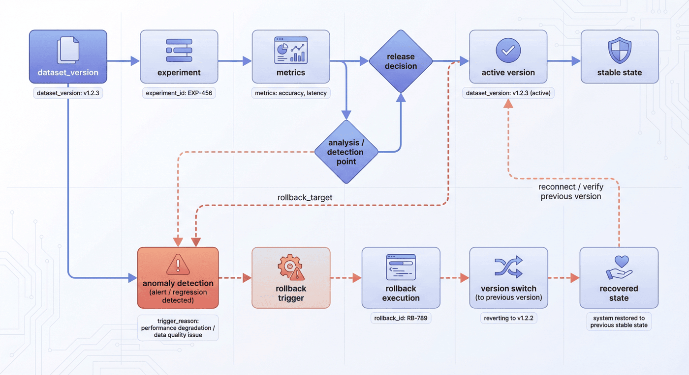

# 第23章：在线反馈闭环与知识更新

RAG 系统上线并不意味着数据工程结束。恰恰相反，真实用户开始使用系统之后，知识缺口、检索偏差、权限问题、版本冲突和回答风格问题才会集中暴露。一个没有反馈闭环的系统，即使初始效果不错，也会随着业务变化逐渐老化；一个有反馈闭环的系统，则可以把线上失败转化为新的知识更新、评测样本和数据修复任务。

本章讨论应用级数据工程的最后一段：如何把线上事件转化为可运营的数据资产。这里的“反馈”不只是点赞点踩，也包括检索日志、引用失败、拒答记录、用户追问、人工工单、知识修订、回滚事件和 A/B 实验结果。数据工程的目标，是让这些事件进入一条可追踪、可分流、可验证的回流链路，而不是散落在客服系统和聊天记录中。

读者读完本章后，应能设计一套反馈事件模型，建立反馈优先级和处理路径，把知识更新与版本回滚纳入治理，并通过运营看板持续观察系统健康度。

---

## 23.1 为什么“上线完成”只是数据飞轮起点

### 23.1.1 上线后的三类漂移

大模型应用上线后，系统面对的不再是固定评测集，而是持续变化的真实环境。变化首先来自知识本身：制度会修订，产品会迭代，价格会调整，组织架构会变化，外部法规也会更新。即使模型和检索系统完全不变，知识库也会因为时效性下降而逐渐失真。

第二类变化来自用户问题。上线初期，用户可能只问简单事实；当他们开始信任系统后，会提出更复杂、更含糊、更接近业务决策的问题。系统需要处理跨文档综合、例外条件、权限边界和上下文追问，这些问题在离线评测集中往往覆盖不足。

第三类变化来自系统自身。解析规则、chunk 策略、索引版本、rerank 模型、生成模型和权限配置都会持续迭代。一次看似局部的索引刷新，可能改变大量问题的召回结果；一次知识库更新，也可能引入新的重复、冲突或越权风险。

这三类漂移共同说明：应用级数据工程必须从静态构建转向持续运营。系统上线只是数据飞轮开始转动的时刻，而不是结束点。

### 23.1.2 反馈数据比离线假设更接近真实短板

离线评测集很重要，但它永远只能代表团队已经预想到的问题。线上反馈的价值在于暴露未知短板。例如用户连续追问，可能说明第一次回答缺少关键条件；用户复制答案后又打开原文，可能说明引用可信度不足；用户点击“无帮助”，但问题本身很简单，可能说明检索没有命中正确知识。

这些信号如果只被当作产品统计，就无法进入数据改进。真正的数据闭环要求把每一次失败拆成可处理的事件：是知识缺失、文档过期、解析错误、chunk 断裂、检索未命中、证据不完整、生成偏离，还是权限策略导致无法回答。

### 23.1.3 反馈闭环的基本结构

一个生产级反馈闭环通常包含六个阶段：

1. **事件采集**：记录用户问题、检索结果、上下文、回答、引用、反馈和系统状态；
2. **分类分流**：判断事件属于知识缺口、检索问题、生成问题、权限问题还是产品交互问题；
3. **优先级排序**：按风险、频次、业务影响和修复成本决定处理顺序；
4. **修复执行**：生成补数、修订、重建索引、回滚或规则更新任务；
5. **验证发布**：通过回归评测、灰度观察和审批后发布；
6. **沉淀复用**：把事件转化为评测样本、SOP、规则或数据处理模板。


*图23-1：线上反馈只有进入采集、分流、修复、验证和沉淀链路，才能从用户抱怨转化为系统能力。*

### 23.1.4 本节小结

上线后的应用系统会持续面对知识漂移、问题漂移和系统漂移。反馈闭环的价值，是把这些变化变成可观测、可分流、可修复的数据资产。没有闭环的系统会逐渐老化，有闭环的系统才可能形成应用级数据飞轮。

---

## 23.2 事件采集与反馈分流

### 23.2.1 反馈不是一个按钮

很多系统把反馈理解为点赞、点踩或一句用户评论。这类显式反馈当然有价值，但它只是反馈体系的一小部分。真实系统中，更重要的反馈往往藏在行为日志和链路状态中。

| 反馈类型 | 示例 | 价值 | 风险 |
|---|---|---|---|
| 显式反馈 | 点赞、点踩、文字评论 | 直接表达用户满意度 | 主观性强，覆盖率低 |
| 隐式行为 | 追问、复制、重新搜索、停留时间 | 反映真实使用路径 | 解释需要上下文 |
| 检索日志 | query、top-k、rerank 分数、引用页 | 定位检索失败 | 数据量大，需脱敏 |
| 生成日志 | prompt、上下文、答案、拒答原因 | 定位生成偏离 | 可能含敏感内容 |
| 人工工单 | 客服记录、专家标注、修订意见 | 质量高，可解释 | 时效慢，成本高 |
| 系统事件 | 索引刷新、权限拒绝、解析失败 | 定位工程故障 | 需要跨系统关联 |

一个成熟系统应同时采集这些信号，并把它们绑定到同一条会话或任务链路中。否则，团队只能看到“用户点踩了”，却不知道点踩前系统检索了什么、引用了什么、是否命中了旧版本文档、是否因为权限过滤丢掉了正确证据。

### 23.2.2 线上事件字段模板

建议将每次问答记录为结构化事件。下面是一份最小可用字段模板。

| 字段 | 说明 |
|---|---|
| `event_id` | 事件唯一 ID |
| `session_id` | 会话 ID，用于追踪多轮上下文 |
| `user_role` | 用户角色或权限组，避免记录真实身份 |
| `timestamp` | 请求时间 |
| `query` | 用户问题，需按策略脱敏 |
| `query_type` | 事实、流程、表格、图表、权限、综合等 |
| `retrieved_items` | 召回证据 ID、分数、版本和来源 |
| `context_snapshot` | 进入模型的上下文摘要或引用 ID |
| `answer` | 系统回答或回答摘要 |
| `citations` | 引用页面、段落、区域或对象 |
| `feedback_signal` | 点赞、点踩、追问、工单等 |
| `failure_label` | 人工或自动归因标签 |
| `privacy_flags` | 是否含敏感信息、是否需脱敏 |
| `pipeline_version` | 解析、索引、模型和提示版本 |

这份模板的重点是可归因。只有保留检索项、上下文快照、引用和版本，团队才能回放一次失败。若只保存最终答案，后续几乎无法判断问题来自数据、检索还是生成。

### 23.2.3 反馈分流策略

反馈进入系统后，不应全部进入同一个待办池。不同事件需要不同处理路径。

| 分流类型 | 触发条件 | 处理动作 | SLA 建议 |
|---|---|---|---|
| 高风险即时处理 | 越权、合规、严重事实错误 | 熔断、下线、回滚、人工复核 | 当日 |
| 高频批量治理 | 多用户反复反馈同类问题 | 建立专题修复任务 | 每周 |
| 知识更新 | 文档过期、制度修订、版本冲突 | 修订知识源、刷新索引 | 1-3 个工作日 |
| 检索优化 | 正确知识存在但未召回 | 调整 chunk、索引、rerank | 每周 |
| 生成优化 | 证据正确但回答表达错误 | 调整提示、格式、拒答策略 | 每周 |
| 延迟观察 | 低频、低风险、原因不明 | 进入观察池 | 每月复盘 |

分流的关键是把风险和收益分开。高风险事件需要快速止损，高频问题需要专题治理，低频问题可以沉淀到观察池。所有事件都立即处理，会导致团队疲于奔命；所有事件都等月度复盘，又会错过高风险窗口。

### 23.2.4 优先级评分

当反馈量增加后，仅靠人工判断优先级会很快失效。建议使用一套轻量评分，把每条事件转成可排序的任务。一个实用公式如下：

$$
Priority = Risk \times Impact \times Frequency \div Effort
$$

其中，`Risk` 表示风险等级，越权、合规、严重事实错误权重最高；`Impact` 表示业务影响，影响关键流程或核心客户的问题优先；`Frequency` 表示出现频次，重复出现的问题应高于孤立个案；`Effort` 表示修复成本，低成本高收益的问题可以优先处理。

| 因子 | 取值示例 | 判断依据 |
|---|---|---|
| `Risk` | 1-5 | 是否涉及合规、财务、医疗、隐私、越权 |
| `Impact` | 1-5 | 影响用户数、业务流程重要性、客户等级 |
| `Frequency` | 1-5 | 单日/单周重复次数和趋势 |
| `Effort` | 1-5 | 是否只需补一条知识，还是要重建管线 |

例如，一条普通 FAQ 回答不完整，风险 1、影响 2、频次 2、修复成本 1，优先级不高但适合快速修；一条旧版财务制度被反复召回，风险 4、影响 4、频次 3、修复成本 2，应进入本周专题治理；一条越权回答即使只出现一次，风险也可能直接触发即时处理。

评分不是为了替代判断，而是让任务队列透明。运营团队可以解释为什么某些问题先修，为什么某些问题进入观察池，为什么某些高风险事件需要暂停发布。

### 23.2.5 自动归因与人工复核

反馈分流可以先由规则和模型进行初步归因。例如：

* 正确答案未在 top-k 中出现，标记为检索召回问题；
* top-k 中有正确证据但答案错误，标记为生成使用证据失败；
* 引用文档版本早于当前有效版本，标记为知识版本问题；
* 召回项被权限过滤后为空，标记为权限边界问题；
* 用户连续追问同一实体，标记为回答不完整或上下文保持问题。

自动归因不能替代人工复核。对高风险事件、低置信事件和高频模式，应由运营或专家团队抽检。人工复核的结果要回写为标签，以便后续训练分类器、优化规则或扩充评测集。

### 23.2.6 采集边界与采样策略

反馈数据越完整，越容易回放问题；但采集越多，隐私、成本和治理压力也越高。因此，线上反馈采集必须明确边界。

首先，系统应区分**诊断必需字段**和**可选分析字段**。检索项 ID、索引版本、引用锚点、失败标签属于诊断必需字段；完整原文、完整对话历史、用户身份明文则通常不应默认保留。对于高风险场景，可以只保存摘要和证据 ID，在获得权限后再回查原始材料。

其次，系统应采用**分层采样**。并非所有成功请求都需要完整保存，但所有高风险失败、低置信回答、权限拒绝、用户点踩和人工工单都应进入高优先级样本池。普通成功请求可以抽样保留，用于监测分布变化和构建基线。

第三，反馈采集应支持**事件合并**。同一个用户连续追问、同一个问题在多个部门反复出现、同一文档版本引发多次错误，都不应被当成孤立事件。事件合并能帮助团队识别系统性问题，而不是被大量重复工单淹没。

| 采集层级 | 保存内容 | 适用场景 | 保留策略 |
|---|---|---|---|
| 最小诊断 | 事件 ID、版本、证据 ID、反馈标签 | 默认所有请求 | 长期保留 |
| 脱敏摘要 | query 摘要、answer 摘要、引用摘要 | 普通反馈 | 中期保留 |
| 完整回放 | 完整 query、上下文、回答、top-k | 高风险或授权复盘 | 短期隔离 |
| 专家样本 | 人工标注根因和修复建议 | 训练评测集 | 审批后入库 |

采集边界的本质是把“能诊断问题”和“最小化风险”结合起来。团队不应为了分析便利无限保留用户内容，也不应因为合规压力完全丢失诊断能力。

### 23.2.7 本节小结

反馈体系的核心不是多收日志，而是收集能够支持归因和修复的事件。事件字段要能回放链路，分流策略要区分风险、频次和修复成本，自动归因要与人工复核结合。只有这样，反馈才不会停留在情绪统计，而能进入数据治理。

---

## 23.3 知识更新、回滚与版本治理

### 23.3.1 更新不是覆盖

知识更新最容易犯的错误，是把新文档直接覆盖旧文档，把新索引直接替换旧索引。这样做看似简单，却会造成严重的可追溯问题：当用户反馈某个回答错误时，团队无法判断当时系统使用的是哪个文档版本、哪个 chunk 策略、哪个索引版本。

生产级知识更新应遵循版本化原则。每次更新至少需要记录：

* 原始知识源版本；
* 解析规则版本；
* 清洗和 chunk 策略版本；
* 索引构建版本；
* 权限和有效期配置；
* 发布审批记录；
* 回滚目标版本。

只有这些信息齐全，团队才能在更新失败时快速回滚，并在事后复盘中定位根因。

### 23.3.2 知识更新的四类任务

线上反馈通常会转化为四类知识更新任务。

| 任务类型 | 示例 | 处理方式 |
|---|---|---|
| 补数任务 | 用户问到知识库没有的政策 | 接入新文档或补充 FAQ |
| 修订任务 | 旧制度已过期但仍被引用 | 更新原文、有效期和版本标签 |
| 重建任务 | 文档存在但 chunk 或索引不合理 | 调整解析、切分或索引策略 |
| 删除/隔离任务 | 文档越权、违规或质量过低 | 下线、隔离或限制访问 |

这四类任务不能混在一起处理。补数任务强调来源和合规，修订任务强调版本和审批，重建任务强调评测回归，删除任务强调风险控制和影响面分析。

### 23.3.3 回滚机制

越快更新，越需要回滚。一个没有回滚机制的知识库，会因为一次错误更新影响大量回答。回滚不是简单恢复旧文件，而是恢复一组一致状态：文档、chunk、索引、权限、提示和评测基线都需要对齐。



*图23-2：知识更新应有明确的发布、验证和回滚路径，避免错误知识扩散到线上回答。*

建议每次更新都形成以下记录：

| 字段 | 说明 |
|---|---|
| `release_id` | 更新批次 |
| `changed_sources` | 变更文档或知识源 |
| `affected_indexes` | 受影响索引 |
| `validation_set` | 回归评测集 |
| `approval_owner` | 审批人 |
| `rollback_target` | 可回滚版本 |
| `risk_level` | 低、中、高 |
| `monitoring_window` | 灰度观察时间 |

高风险更新应先灰度发布。例如只对内部测试用户开放，或只在低风险问题类型上启用。若在观察窗口内出现引用错误、投诉升高或拒答率异常，应自动触发回滚或人工审批。

### 23.3.4 权限、隐私与保留范围

线上反馈会包含用户问题、系统回答、检索结果和上下文片段，其中可能含有个人信息、商业敏感信息或权限受限内容。因此，反馈闭环必须和合规治理协同。

最低要求包括：

* 用户身份用角色或权限组表示，避免存储真实身份；
* 原始 query 和 answer 按规则脱敏或只保留摘要；
* 检索证据只保存 ID 和引用锚点，必要时再按权限回查；
* 高敏事件进入隔离队列，限制访问和导出；
* 日志保留周期、删除请求和审计要求写入数据治理策略；
* 反馈样本进入训练或评测前必须经过二次脱敏和审批。

这些要求不应等到第 27 章合规治理再处理。在应用级数据工程中，权限和隐私是反馈闭环的基础约束。

### 23.3.5 发布审批与冲突处理

知识更新通常涉及多个角色：业务 Owner 提供内容，数据工程师处理文档，RAG 工程师重建索引，专家审核事实，合规团队审查风险，产品团队决定上线节奏。若没有审批机制，更新速度可能很快，但错误也会快速扩散。

建议按风险等级设计审批路径。

| 风险等级 | 示例 | 审批要求 | 发布方式 |
|---|---|---|---|
| 低风险 | FAQ 表述优化、错别字修正 | 数据 Owner 确认 | 直接发布 |
| 中风险 | 制度条款修订、产品功能更新 | 业务 Owner + 数据 Owner | 灰度发布 |
| 高风险 | 法务、财务、权限、个人数据 | 业务 + 合规 + 数据 Owner | 审批后分批发布 |
| 紧急风险 | 错误知识造成严重误导 | 值班 Owner 决策 | 下线或回滚 |

冲突处理同样重要。常见冲突包括新旧制度同时存在、不同部门维护同一知识、FAQ 与正式文档口径不一致、用户反馈与业务 Owner 判断不一致。系统应记录冲突状态，而不是让冲突内容同时进入线上索引。

处理冲突时，可以采用三条规则：

1. **权威源优先**：正式制度高于 FAQ，签发文件高于临时说明；
2. **有效期优先**：有明确生效日期和失效日期的版本优先；
3. **风险保守**：高风险冲突未解决前，系统应拒答或提示人工确认。

审批和冲突处理会降低一点发布速度，但它换来的是稳定性和可追责性。对企业级系统而言，这通常是值得的。

### 23.3.6 本节小结

知识更新不是覆盖文件，而是版本化发布。每次更新都应记录来源、处理规则、索引版本、权限配置和回滚目标。反馈日志必须遵守隐私和权限边界，否则反馈闭环本身会成为新的风险源。

---

## 23.4 指标看板与运营节奏

### 23.4.1 看板的四类指标

反馈闭环需要可观测性。没有指标，团队只能凭感觉判断系统是否变好。应用级 RAG 系统建议维护四类指标。

| 指标组 | 核心指标 | 说明 |
|---|---|---|
| 问答质量 | 答案正确率、引用准确率、拒答质量 | 反映用户可感知效果 |
| 检索健康 | 命中率、空召回率、旧版本召回率 | 定位检索和索引问题 |
| 反馈运营 | 反馈量、积压量、处理时长、回补完成率 | 反映运营闭环效率 |
| 风险控制 | 越权召回、敏感日志、回滚次数 | 反映合规和发布风险 |

指标不能只看均值。很多严重问题出现在长尾场景，例如某个部门文档持续过期、某类财务问题经常引用错误、某个权限组频繁触发拒答。看板应支持按知识源、问题类型、用户角色、版本和时间窗口拆分。

### 23.4.2 运营节奏

建议建立三层运营节奏。

| 节奏 | 参与角色 | 内容 | 产出 |
|---|---|---|---|
| 每日巡检 | 值班工程师、运营 | 高风险事件、异常指标、失败队列 | 当日修复或升级 |
| 每周复盘 | 数据、检索、产品、专家 | 高频问题、积压、回补进度 | 专题治理任务 |
| 每月治理 | 数据 Owner、平台、合规 | 版本策略、指标趋势、风险事件 | 规则更新和资源决策 |

每日巡检解决止损问题，每周复盘解决系统性质量问题，每月治理解决组织和平台问题。三者缺一不可。如果只有每日巡检，团队会陷入救火；如果只有月度治理，又会错过线上风险。


*图23-3：反馈闭环最终要进入平台可观测体系，和日志、指标、告警、版本、审计共同治理。*

### 23.4.3 行动阈值

看板必须连接行动阈值，否则指标只是展示。以下是一组可作为起点的阈值模板。

| 指标 | 阈值示例 | 行动 |
|---|---|---|
| 高风险负反馈 | 单日 > 3 条 | 进入即时复核队列 |
| 空召回率 | 连续 3 天上升 | 检查索引刷新和知识源覆盖 |
| 旧版本召回率 | > 1% | 检查版本优先级和过期策略 |
| 引用缺失率 | > 5% | 检查上下文组织和引用模板 |
| 反馈积压 | 超过 7 天未处理 | 提升优先级或增加运营资源 |
| 回滚次数 | 单周 > 2 次 | 暂停高风险更新，复盘发布流程 |

阈值不是固定标准，而是团队治理工具。随着系统成熟，阈值应根据业务风险和用户规模调整。

### 23.4.4 看板字段设计

一个真正可用的反馈看板，不应只展示总体点赞率。它至少应支持按以下维度切片：

| 维度 | 用途 |
|---|---|
| 知识源 | 判断哪个文档库或业务域问题最多 |
| 问题类型 | 区分事实、流程、表格、图表、权限、综合推理 |
| 失败标签 | 定位检索、生成、版本、权限、解析等根因 |
| 用户角色 | 判断是否存在特定角色的权限或体验问题 |
| 管线版本 | 对比解析、chunk、索引、模型升级前后效果 |
| 时间窗口 | 观察发布后指标是否异常 |
| 处理状态 | 管理待分流、复核中、修复中、已验证、已关闭 |

看板还应能追踪每个反馈事件的处理链路。一个事件从采集到关闭，应有明确状态流转：`new -> triaged -> assigned -> fixed -> validated -> closed`。若事件被判定为无需处理，也应记录原因，例如“用户误操作”“权限正确拒答”“重复事件合并”。

这样做的价值，是让反馈运营从“靠人记住”转为“靠系统流转”。当问题积压时，团队可以看到卡在哪个阶段；当指标下降时，可以回溯对应版本；当管理者追问效果时，可以给出基于数据的解释。

### 23.4.5 从应用问题过桥到 DataOps

当反馈数量变多后，团队会发现很多问题无法靠单个工程师修复。知识源 Owner 不明确，更新审批没人负责，数据处理版本没有冻结，合规审核没有前置，专家标注队列长期积压。这些问题表面上是应用问题，实质上是组织和平台问题。

因此，本章自然过桥到第 24 章。在线反馈闭环告诉团队“系统哪里坏了”，而 DataOps 负责建立“谁来修、按什么节奏修、修完如何发布、如何防止重复发生”的组织机制。没有 DataOps 托底，反馈闭环会变成问题收集箱；有了 DataOps，反馈才能推动系统持续演进。

### 23.4.6 跨团队交接与 RACI

反馈闭环一旦进入生产，就必须明确职责。否则，反馈事件会在产品、算法、数据、平台、业务和合规之间来回转发。建议为常见反馈任务建立 RACI 矩阵。

| 事项 | 数据工程 | RAG 工程 | 业务 Owner | 产品 | 合规 | 平台 |
|---|---|---|---|---|---|---|
| 反馈事件分流 | R | C | C | A | C | I |
| 知识源修订 | C | I | A/R | C | C | I |
| chunk/索引重建 | R | A/R | C | I | I | C |
| 高风险越权事件 | C | C | I | I | A/R | C |
| 回归评测 | C | A/R | C | I | I | C |
| 发布与回滚 | C | R | C | A | C | R |
| 月度治理复盘 | C | C | A | R | C | I |

这里的 A 表示最终负责，R 表示执行，C 表示咨询，I 表示知会。矩阵的价值在于把“大家都相关”变成“每件事只有一个最终负责人”。例如，索引重建可以由 RAG 工程负责最终质量，数据工程负责具体数据处理；知识源修订则应由业务 Owner 负责事实正确性，而不是让算法团队判断制度口径。

跨团队交接还需要明确交付物。例如，业务 Owner 不能只说“这条知识错了”，而应提交修订后的权威文本、有效期和适用范围；RAG 工程不能只说“索引已刷新”，而应提交索引版本、影响范围和回归结果；合规团队不能只说“有风险”，而应给出风险类型、处理动作和保留要求。

当这些交接物固化后，反馈闭环才真正进入 DataOps。否则，系统虽然收集了大量反馈，但每次修复仍依赖临时沟通。

### 23.4.7 本节小结

指标看板和运营节奏把反馈闭环从技术链路变成团队机制。每日巡检、每周复盘和每月治理分别承担止损、治理和决策职能。行动阈值把指标转化为任务，DataOps 则把任务转化为稳定的组织能力。

---

## 23.5 案例与标准产出物

### 23.5.1 案例 A：引用不准的企业知识助手

某企业知识助手上线后，整体点赞率不错，但“引用不准”的投诉持续增加。初期团队认为是生成模型没有按要求引用，于是不断调整提示词，要求模型“必须引用原文”。效果短暂改善后又反复。

复盘发现，问题根因并不在生成，而在数据和检索链路。第一，部分制度文档存在新旧版本并存，索引没有优先召回最新版本；第二，chunk 切分时把适用条件和执行动作拆开，导致模型引用了动作却漏掉条件；第三，反馈日志只保存点踩，没有保存当次 top-k 召回结果，早期问题无法回放。

修复方案包括：建立文档有效期字段，重建制度类 chunk 规则，补充引用准确率评测集，并把线上点踩事件升级为带检索快照的结构化事件。修复后，团队不再简单追求更强模型，而是把引用问题纳入版本治理和反馈回流。

### 23.5.2 案例 B：更新过快导致版本混乱

另一个团队为了提高知识时效，允许业务部门每天直接上传新文档并自动刷新索引。上线初期，系统回答更“新”了，但两周后投诉明显增加：同一问题今天和昨天答案不同，不同用户看到的政策不一致，部分旧制度仍被引用。

问题在于系统只有更新，没有发布治理。业务文档上传后没有审批，索引刷新没有批次号，旧版本没有失效规则，系统也没有回滚目标。一旦新文档出错，只能人工删除并重新构建索引。

最终团队引入发布批次、灰度窗口、回归评测和回滚记录。知识更新从“随时覆盖”改为“批次发布”，高风险文档需要知识 Owner 审批。系统牺牲了一点更新速度，但显著提升了可控性。

### 23.5.3 标准产出物一：反馈回流 SOP

| 阶段 | 输入 | 处理动作 | 输出 |
|---|---|---|---|
| 采集 | query、召回、回答、引用、反馈 | 生成结构化事件 | `feedback_event` |
| 脱敏 | 原始事件 | 去身份化、敏感字段处理 | 可分析事件 |
| 分流 | 可分析事件 | 风险、频次、问题类型分类 | 任务队列 |
| 复核 | 高风险/高频事件 | 人工确认根因 | 归因标签 |
| 修复 | 归因标签 | 补数、修订、重建、回滚 | 数据变更 |
| 验证 | 数据变更 | 回归评测和灰度观察 | 发布结论 |
| 沉淀 | 修复记录 | 更新评测集、规则和文档 | 可复用资产 |

### 23.5.4 标准产出物二：线上事件字段模板

```json
{
  "event_id": "evt_20260428_0001",
  "session_id": "sess_hash",
  "timestamp": "2026-04-28T10:00:00+08:00",
  "user_role": "finance_reader",
  "query_type": "table_fact",
  "query_redacted": "差旅住宿标准是多少？",
  "retrieved_items": [
    {
      "item_id": "policy_2025_p12_table_03",
      "score": 0.82,
      "version": "index_v4",
      "citation": "p12_table_03"
    }
  ],
  "answer_summary": "系统回答了一线城市住宿标准。",
  "feedback_signal": "thumb_down",
  "failure_label": "outdated_policy",
  "privacy_flags": ["no_personal_data"],
  "pipeline_version": {
    "parser": "layout_v3",
    "chunker": "policy_chunk_v2",
    "index": "rag_index_v4",
    "prompt": "answer_with_citation_v6"
  }
}
```

这个模板的目标不是保存一切，而是保存足够支持回放、归因、修复和审计的信息。

### 23.5.5 标准产出物三：反馈事件复盘模板

对于高风险事件或反复出现的高频问题，建议使用统一复盘模板。

| 模块 | 填写内容 |
|---|---|
| 事件摘要 | 用户问题、时间、影响范围、风险等级 |
| 期望行为 | 系统本应如何回答或拒答 |
| 实际行为 | 实际回答、引用、召回和上下文 |
| 根因分类 | 知识缺失、检索失败、版本错误、权限问题、生成偏离等 |
| 数据证据 | 涉及的文档、chunk、索引版本和日志 ID |
| 修复动作 | 补数、修订、重建、回滚、规则调整 |
| 验证结果 | 回归样本、灰度观察、指标变化 |
| 沉淀资产 | 新增评测样本、SOP、规则或模板 |
| Owner | 后续责任人与截止时间 |

复盘模板的关键不是追责，而是把一次线上失败沉淀为系统能力。若复盘只停留在“已修复”，同类问题很快会再次出现；若复盘能产生规则、评测样本和流程更新，系统才会变得更稳。

### 23.5.6 标准产出物四：反馈任务看板字段

为了让反馈处理可运营，建议将事件转为任务后进入统一看板。

| 字段 | 示例 | 作用 |
|---|---|---|
| `task_id` | `fb_task_0428_001` | 任务追踪 |
| `source_event_ids` | `['evt_001', 'evt_018']` | 关联原始事件 |
| `failure_type` | `outdated_policy` | 根因分类 |
| `priority_score` | `24` | 排序 |
| `owner` | `knowledge_owner_hr` | 责任人 |
| `status` | `triaged` | 流转状态 |
| `fix_type` | `knowledge_revision` | 补数、修订、重建、回滚 |
| `due_date` | `2026-05-02` | 截止时间 |
| `validation_case` | `eval_policy_017` | 回归样本 |
| `release_id` | `release_2026w18` | 发布批次 |
| `close_reason` | `fixed_and_validated` | 关闭依据 |

看板字段应与事件模板、发布记录和评测集联动。这样，管理者可以从一个失败事件一路追到修复任务、发布批次和回归样本，形成闭环证据链。

### 23.5.7 本章总结

在线反馈闭环把应用系统从一次性交付变成持续运营系统。事件采集提供可回放事实，分流策略决定处理优先级，知识更新和回滚保证变更可控，指标看板和运营节奏推动团队持续改进。至此，第七篇完成了从离线 RAG 数据流水线、多模态视觉检索，到线上反馈闭环的完整应用级数据工程路径。下一章将进入 DataOps，讨论支撑这些闭环长期运转的团队组织和平台机制。

## 参考文献

<!-- 待补充：本章引用的论文、博客、工具与官方文档。补全策略见 publishing/citations_progress.md。 -->
