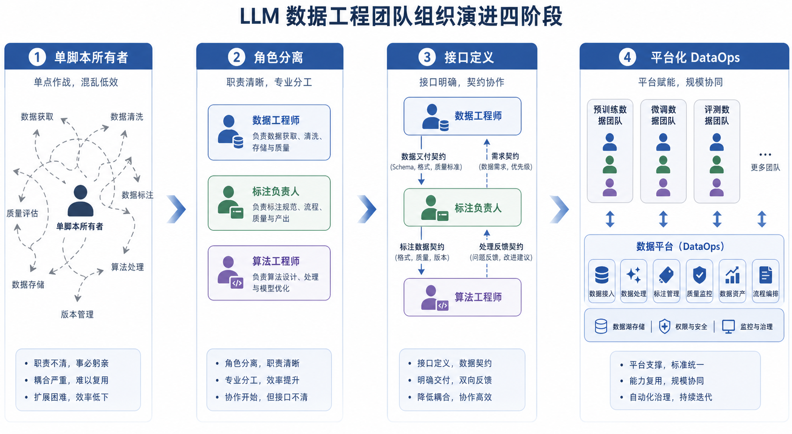
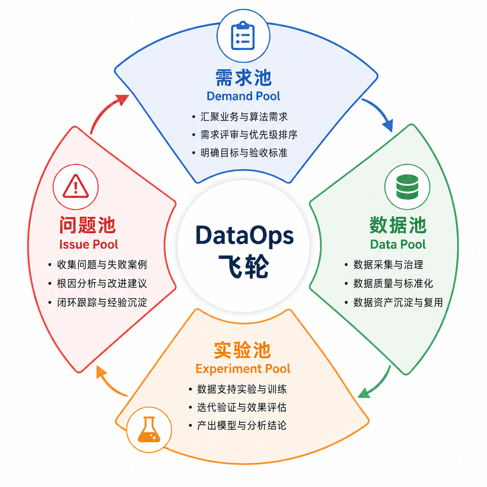
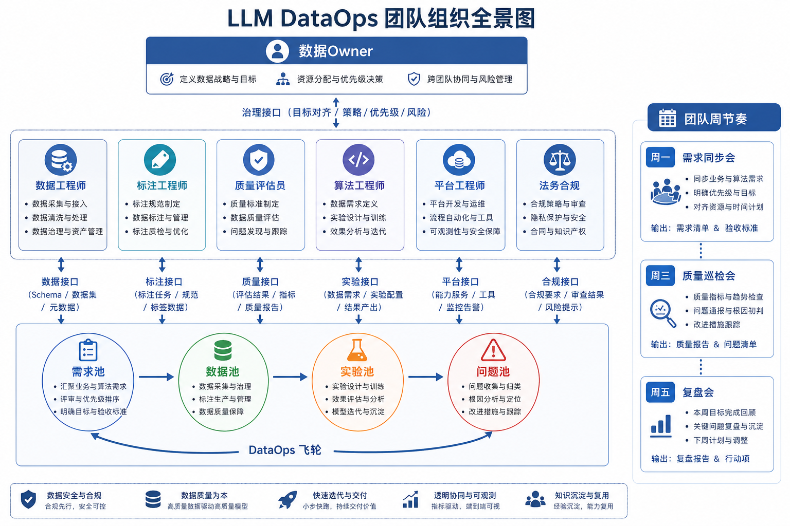

# 第24章：DataOps 飞轮与团队组织

---

## 本章摘要

大模型数据工程的规模化落地，绝不仅仅是工具和流程问题，更是组织问题。当一个团队从"单人维护数据脚本"走向"多团队协作产出高质量训练数据"，组织架构、角色边界、协作接口和运营节奏就会成为实际的瓶颈。本章面向负责数据团队组织、流程和协同机制设计的管理者，系统阐述如何为 LLM 数据工程建立可扩展的 DataOps 团队与协作飞轮。

本章将从四个层面展开。首先解释为什么传统数据团队结构在 LLM 项目中会出现断裂，并揭示新型组织形态的设计逻辑。其次，建立角色分工、接口协议与 RACI 职责矩阵，使团队能够明确"谁做什么、谁决策、谁审批"。第三，介绍 DataOps 飞轮的运转机制与周度节奏设计，包括例会体系、SLA 设置和版本冻结。最后，讨论跨团队数据资产共享、风险治理和知识沉淀的实操方法。

读者读完本章后，将掌握一套可以直接套用的组织模板：包括 LLM 数据团队的岗位地图、RACI 矩阵、例会节奏与产出物表，以及跨团队接口的设计原则。

---

## 场景引入

某 AI 公司正在训练一个面向教育场景的垂直领域大模型。产品侧希望三周内迭代一个新版本，业务侧每天有新的数据标注需求，算法侧需要按时拿到干净的训练集，平台侧在维护标注工具和数据管线，法务侧在审核数据来源合规性。

五个团队，五套节奏。产品经理每天在群里催进度，却没有人清楚"数据准备完成"的定义是什么。算法工程师拿到的数据集版本和标注工程师交付的版本不一致，但没有人知道谁应该负责版本对齐。平台团队修复了一个数据管线 bug，但没有通知标注团队，导致两天后标注任务全部失效。法务审核出了一批有版权风险的数据，但没有流程把这个信息传递到数据筛选环节。

这不是一个极端案例，而是 LLM 数据项目规模化后的常态。问题的根源，不在于某个人不够努力，而在于没有一套共同的组织语言：没有明确的角色边界、没有统一的交付接口、没有可预期的协作节奏。

DataOps 飞轮要解决的，正是这套组织语言的缺失。

---

## 24.1 为什么 LLM 数据团队需要新的组织形态

### 24.1.1 传统数据团队的结构性局限

传统数据工程团队的设计思路，脱胎于数仓和 BI 时代的分工模型。在那个时代，数据工程的核心任务是"稳定、准确地把业务数据搬运到分析系统"，角色边界清晰：数据工程师负责 ETL，分析师负责取数，BI 开发负责报表。数据质量问题往往在业务侧发现，然后反馈到数仓侧修复。这个模型在大多数场景下有效，因为数据的生产者（业务系统）和消费者（分析人员）之间的需求是相对稳定的。

LLM 数据工程打破了这个假设。训练数据的需求来自多个变化快速的源头：算法团队的实验结果会改变数据配比需求，产品团队的版本迭代会引入新的数据类别，RLHF 阶段需要人类偏好标注，RAG 场景需要企业知识库的持续更新。数据不再是被动的"搬运对象"，而是主动的"实验变量"。这要求数据团队不再只是"数据管道的维护者"，而是"数据资产的主动经营者"。

在这个新角色下，传统团队结构的三个局限会快速暴露。

第一是**职责交叉与接口模糊**。LLM 数据项目天然涉及多个跨职能角色：数据工程师、标注工程师、质量评估员、算法工程师、产品经理、法务合规专员。这些角色之间的工作产出高度依赖，但没有标准接口定义。"数据工程师完成清洗"和"标注工程师开始标注"之间，应该有什么验收标准？完成之后谁来确认？如果出现质量问题，谁来负责回溯？这些问题在传统数仓项目中不存在，在 LLM 数据项目中却每天都会发生。

第二是**单点专家依赖**。许多团队习惯于把关键决策集中在少数几个"懂全局"的人身上。这在团队规模小时尚可运转，但当项目规模增长——数据量翻倍、标注任务拆分给三个外包商、实验同时跑五个版本——单点专家就成了瓶颈。更危险的是，单点专家的经验无法被系统化沉淀，一旦关键人员离开，团队就会陷入"数据管线跑起来但没人知道为什么"的黑箱状态。

第三是**缺乏持续交付的节奏**。大多数数据团队没有固定的版本节奏，数据交付时间取决于任务的完成情况，而不是预定的发布计划。这导致算法团队无法规划实验窗口，产品团队无法预测迭代周期，平台团队的容量规划也失去依据。数据工程变成了一种"催促驱动"的工作模式：催一下出一批，催一下出一批，没有内驱的交付节律。

### 24.1.2 大模型项目的新型协作需求

LLM 数据工程引入了传统团队从未遇到过的几类新需求，这些需求从根本上改变了组织设计的逻辑。

**需求一：数据与模型的紧耦合迭代**。在传统 ML 项目中，数据团队和算法团队可以相对独立地工作——数据团队提供一批稳定的数据集，算法团队在上面做实验。但在 LLM 项目中，算法实验的结果会直接反馈数据需求：一次评测发现模型在"数学推理"上表现差，数据团队需要立即增加这方面的训练样本；一次 RLHF 实验发现某类回复风格不受欢迎，标注团队需要调整评分标准。这要求数据团队和算法团队不是"串行协作"，而是"并行共进"，并且有一套快速的需求响应机制。

**需求二：多源异构数据的协同治理**。LLM 数据来源繁多：网络爬取、人工标注、合成生成、第三方数据集、用户反馈。每个来源有不同的质量标准、合规要求和更新频率。没有一个统一的治理框架，团队就会陷入"各管各的"的碎片化状态，无法保证进入训练集的数据在整体上是一致的。

**需求三：标注质量的持续监控**。人工标注的质量会随着时间漂移：标注员的疲劳状态会影响一致性，标注任务边界不清会导致标准分歧，外包商之间的理解差异会产生系统性偏差。这需要一套持续运营的质量监控体系，而不是"上线前做一次抽检"就完事。

**需求四：合规与安全的全程介入**。数据来源的版权问题、用户数据的隐私保护、跨境数据传输的合规要求——这些法律风险不是在数据发布前才需要考虑的，而是必须前置到数据采集和清洗阶段就开始管控。这要求法务合规角色真正参与到数据工程的全流程，而不是只在最后盖章。

### 24.1.3 新型组织形态的设计原则

基于以上分析，LLM 数据团队的组织设计应遵循以下核心原则：

**原则一：接口优先于层级**。传统组织设计强调汇报关系，新型数据团队的设计应该更关注角色之间的交付接口——谁产出什么、产出的格式是什么、消费方的验收标准是什么。清晰的接口比严格的汇报层级更能保证多团队协作的顺畅。

**原则二：异步节奏与同步节点结合**。数据工程的大量工作可以异步进行（标注任务、数据处理），但关键决策需要同步对齐（数据版本冻结、质量门槛调整）。组织设计应该为异步工作提供足够的自主空间，同时通过固定的同步节点（周会、月会、里程碑评审）保证全局对齐。

**原则三：知识沉淀与流程化**。减少对单点专家的依赖，意味着必须把隐性知识转化为显性流程。每一次数据问题的排查、每一次质量标准的调整、每一次跨团队冲突的解决，都应该形成可复用的流程文档，而不只是存在于某个人的大脑里。

**原则四：小团队、大平台**。数据工程的规模扩展，不应该简单地通过增加人头来实现，而应该通过平台化工具来放大单人效能。标注管理平台、数据质量评估系统、实验追踪工具——这些平台投资的回报，往往高于增加同等人力的回报。

*图24-1：LLM 数据团队从"单人脚本"到"平台化 DataOps"的四阶段演进路径*

---

## 24.2 角色分工、接口与 RACI 设计

### 24.2.1 LLM 数据团队的核心角色图谱

一个完整的 LLM 数据工程团队，通常包含以下七类核心角色。在小团队中，一个人可能承担多个角色；在大团队中，每类角色可能是一个完整的子团队。关键不在于人员数量，而在于职责边界的清晰程度。

**数据 Owner（Data Owner）** 是数据资产的总责任人，负责确定数据战略、审批数据集发布、处理跨团队的数据资源争议。数据 Owner 通常是数据团队的技术负责人或产品负责人，有权对"这批数据能不能进训练集"做最终决策。

**数据工程师（Data Engineer）** 负责数据采集、清洗、格式转换和管线维护。这是数据管线的核心建设者，对数据流转的技术实现负责，但对数据内容的质量判断不是其主要职责。

**标注工程师/标注运营（Annotation Engineer / Annotation Ops）** 负责标注任务的设计、质量管控和标注员管理。标注工程师需要同时理解业务需求（什么算好数据）和工程约束（如何高效完成标注），是连接业务和平台的关键角色。

**质量评估员（Quality Evaluator）** 专注于数据质量的客观评估，包括一致性、准确率、覆盖率等维度。质量评估员不参与数据生产，负责独立审查。

**算法工程师（Algorithm Engineer）** 是数据的核心消费方。算法工程师需要明确表达数据需求（什么类型、什么分布、什么格式），同时把实验结果反馈给数据团队（哪类数据有效、哪类需要增强）。

**平台工程师（Platform Engineer）** 负责标注工具、数据管线平台和存储基础设施的建设与维护。平台工程师的交付物是"系统运行的稳定性"，而非数据内容本身。

**法务合规专员（Legal / Compliance）** 负责数据来源合规审查、隐私保护审核和版权风险评估。法务合规专员不能只在项目结束前出现，而需要在数据采集阶段就介入，设定合规边界。

### 24.2.2 角色接口协议设计

清晰的接口协议是多团队协作顺畅运转的基础。每一对协作角色之间，都应该明确以下四个要素：**产出物（Deliverable）**、**格式规范（Format Spec）**、**验收标准（Acceptance Criteria）**、**交付时间（SLA）**。

以数据工程师和标注工程师之间的接口为例：

| 要素 | 内容 |
|------|------|
| 产出物 | 清洗后的原始样本池，待标注文件列表 |
| 格式规范 | JSONL 格式，每行包含 `id`、`content`、`source`、`clean_timestamp` 字段 |
| 验收标准 | 重复率 < 1%，空白率 < 0.5%，字符异常率 < 0.1% |
| 交付 SLA | 每周五 18:00 前完成当周批次交付 |

以标注工程师和算法工程师之间的接口为例：

| 要素 | 内容 |
|------|------|
| 产出物 | 标注完成的训练集，包含标注元信息 |
| 格式规范 | JSONL 格式，包含 `instruction`、`output`、`annotator_id`、`confidence`、`revision_count` |
| 验收标准 | 标注一致性（IAA）> 0.85，样本抽检合格率 > 95% |
| 交付 SLA | 迭代版本发布前 5 个工作日完成 |

接口协议一旦确定，就应该写入团队的内部文档，并在版本管理工具中维护对应的 schema 文件。任何接口变更，必须提前通知下游角色，并给出过渡期。

### 24.2.3 RACI 职责矩阵

RACI 模型（Responsible, Accountable, Consulted, Informed）是一种经典的职责分配工具。在 LLM 数据项目中，以下 RACI 矩阵涵盖了主要的决策事项：

**R（Responsible）**：实际执行者，完成具体工作的人。
**A（Accountable）**：最终问责者，对结果负责、拥有决策权的人，每个事项只能有一个 A。
**C（Consulted）**：被咨询者，在决策前需要听取其意见。
**I（Informed）**：被告知者，决策后需要通知其结果。

| 事项 | 数据Owner | 数据工程师 | 标注工程师 | 质量评估员 | 算法工程师 | 平台工程师 | 法务合规 |
|------|-----------|-----------|-----------|-----------|-----------|-----------|---------|
| 数据需求定义 | A | C | C | I | R | I | C |
| 数据采集与清洗 | I | R/A | C | I | I | C | C |
| 标注任务设计 | C | I | R/A | C | C | I | C |
| 标注质量审核 | I | I | C | R/A | C | I | I |
| 训练集版本发布 | A | C | C | C | R | I | C |
| 数据合规审核 | A | I | I | I | I | I | R |
| 平台故障响应 | I | C | I | I | I | R/A | I |
| 数据版本回滚 | A | R | C | C | C | C | I |
| 跨团队数据共享审批 | A | C | I | I | C | I | C |
| 外包商管理 | I | I | R/A | C | I | I | I |

*表24-1：LLM 数据团队 RACI 职责矩阵*

使用这份 RACI 矩阵时，有几点需要特别注意：

首先，每一行必须有且只有一个 A。如果一个事项有两个人"共同负责"，实际上就等于没有人负责。

其次，当 R 和 A 在同一个人身上时（如标注工程师对标注任务设计是 R/A），意味着这个人既执行又问责，需要确保有外部的质量审核机制来形成制衡。

最后，C 不是"随便问一下"，而是需要在决策前正式征询意见，并给对方足够的时间反馈。如果被咨询方没有时间响应，应该把这种情况记录在案，而不是直接跳过。

### 24.2.4 升级路径与例外处理

任何组织设计都不可能覆盖所有情况。需要为以下几类场景预设明确的升级路径：

**紧急情况升级**：当某个决策需要在正常流程时限内完成但无法按正常流程推进时（如关键节点前的数据质量危机），应有一套紧急决策流程，指定值班的数据 Owner 有权绕过常规审批，直接拍板。

**跨 RACI 边界的冲突**：当两个团队对同一事项的 RACI 归属有争议时（如"这个数据质量问题是数据工程师的责任还是标注工程师的责任"），应提交给数据 Owner 做最终裁决，而不是让两个团队各自坚持。

**例外审批流程**：对于不符合常规数据标准但有特殊需求的情况（如算法团队临时需要一批没有经过正常清洗流程的原始数据做实验），应有一套例外审批表单，记录例外原因、审批人和例外数据的隔离措施。

---

## 24.3 DataOps 飞轮与周度节奏

### 24.3.1 什么是 DataOps 飞轮

DataOps 飞轮是一个描述数据团队持续改进循环的概念模型。它的核心思想是：通过固定的运营节奏，把数据需求、数据生产、质量评估和迭代反馈串成一个自我增强的循环——每一圈循环都比上一圈更高效、更高质量。

在 LLM 数据项目中，飞轮由四个核心"池"驱动：

**需求池（Demand Pool）**：汇集来自算法、产品、业务等各方的数据需求，按优先级排序，形成可执行的任务清单。

**数据池（Data Pool）**：当前可用的数据资产，包括已清洗的原始数据、已完成标注的训练样本、合规通过的数据集。数据池的状态决定了当前迭代能拿出什么数据。

**实验池（Experiment Pool）**：算法团队正在进行的实验记录，包括实验用到的数据版本、参数配置和评测结果。实验池是数据质量好坏的最终反馈来源。

**问题池（Issue Pool）**：已发现的数据问题清单，包括质量问题、合规风险、管线故障。问题池里的问题需要被系统性地分级处理，而不是临时打补丁。

飞轮的运转逻辑是：需求池产生任务 → 任务驱动数据生产，更新数据池 → 算法从数据池取数做实验，结果进入实验池 → 实验结果中发现的问题进入问题池 → 问题被修复后，更新的数据重新进入数据池，同时对需求池里的优先级做调整。这个循环每周运转一圈，通过持续迭代实现飞轮效应。

*图24-2：DataOps 飞轮运转机制——需求池、数据池、实验池、问题池的协同循环*

### 24.3.2 周度节奏设计

飞轮要持续转动，需要固定的时间节点来驱动。以下是一套适合中等规模 LLM 数据团队（10-30 人）的周度节奏设计：

**周一：需求同步会（30分钟）**
- 参与者：数据 Owner、算法工程师代表、产品经理
- 目标：确认当周数据交付目标，同步算法侧最新的数据需求，调整需求池优先级
- 产出物：当周任务清单，明确每项任务的负责人和截止时间

**周三：质量巡检（异步）**
- 参与者：质量评估员、标注工程师
- 目标：对本周已完成的标注批次进行抽检，发现的问题录入问题池
- 产出物：质量巡检报告（标准化模板），问题池更新

**周五：交付与复盘（45分钟）**
- 参与者：全数据团队
- 目标：确认本周数据交付情况，复盘问题池里的高优问题，预告下周计划
- 产出物：周报（标准化模板），下周任务清单预览

**月度：里程碑评审（2小时）**
- 参与者：数据团队全员 + 算法团队代表 + 产品团队代表
- 目标：回顾当月数据质量趋势，评估 SLA 达成情况，调整长期数据战略
- 产出物：月度数据质量报告，下月 OKR 草案

**季度：版本冻结与复盘**
- 目标：冻结一个稳定的数据集版本，作为当季的"基准数据集"，供审计和回溯使用
- 产出物：季度数据集版本说明，数据血缘报告

| 节奏 | 时间 | 参与方 | 核心产出 |
|------|------|--------|---------|
| 周一需求同步 | 每周一9:30，30分钟 | Owner + 算法 + 产品 | 当周任务清单 |
| 周三质量巡检 | 每周三（异步） | 质量 + 标注 | 巡检报告 |
| 周五交付复盘 | 每周五16:00，45分钟 | 全数据团队 | 周报 + 下周计划 |
| 月度评审 | 每月最后一个周五，2小时 | 全员 + 跨团队 | 月报 + 下月OKR |
| 季度版本冻结 | 每季度末 | Owner + 算法 | 基准数据集版本 |

*表24-2：DataOps 例会节奏与产出物表*

### 24.3.3 SLA 设置与版本冻结机制

SLA（Service Level Agreement）是数据团队对内部"客户"（算法团队、产品团队）做出的服务承诺。合理的 SLA 设置能让下游团队对数据交付形成可靠的预期，同时给数据团队明确的工作节律。

以下是一套参考 SLA 框架：

| 数据类型 | 处理时限 | 质量目标 | 备注 |
|---------|---------|---------|-----|
| 紧急需求数据（标记 P0） | 24小时内完成清洗，48小时内完成标注 | 抽检合格率 > 90% | 需 Owner 审批后触发 |
| 常规迭代数据（P1） | 3个工作日内完成清洗，5个工作日内完成标注 | IAA > 0.85，合格率 > 95% | 按周计划排期 |
| 实验探索数据（P2） | 5个工作日内完成清洗，可使用非完整标注 | 粗标，合格率 > 80% | 仅用于内部实验 |
| 历史数据修复 | 按影响面评估，最长2周 | 与原版本质量一致 | 需记录修复日志 |

版本冻结机制是指：在某个预定时间点（如月末、季末），将当前的数据池状态"快照"为一个不可修改的基准版本。版本冻结后，后续的数据更新不能修改已冻结版本，只能在新版本中进行。这一机制确保了算法实验的可重现性——任何时候都可以追溯到"那次实验用的是哪批数据"。

版本冻结的操作流程：
1. 提前 3 天发出冻结通知，告知所有数据生产方
2. 冻结前 24 小时，质量评估员完成最终抽检
3. 冻结时，生成数据集快照，记录版本号、创建时间、质量摘要和数据来源
4. 冻结后，在问题池中记录本版本的已知问题，供下一版本修复时参考

---

## 24.4 跨团队协同与风险治理

### 24.4.1 多团队数据资产共享的冲突与协调

当一家公司有多个 LLM 项目并行时，数据资产的共享就成为一个复杂的协调问题。不同项目团队可能同时争夺标注资源、计算资源和高质量数据集。常见的冲突场景包括：

**数据归属冲突**：A 项目团队耗费三个月整理出一批高质量的对话数据，B 项目团队希望直接复用，但 A 团队担心 B 团队的用法会"污染"数据集的声誉（比如用于不符合安全标准的场景）。

**标注资源竞争**：公司内部只有 20 个有专业知识的标注员，但三个项目同时有紧急标注需求，标注资源如何分配？

**质量标准冲突**：不同项目对数据质量有不同的标准（预训练数据重数量，RLHF 数据重一致性），共享的数据基础设施如何支持差异化的质量要求？

解决这些冲突的有效机制是建立**数据资产目录（Data Asset Registry）**，统一登记所有已生产的数据集，明确：数据集的归属团队、使用限制（哪些项目可以用、哪些不能）、使用申请流程。需要跨项目共享数据时，必须通过目录中的申请流程，而不是直接"拿走"。

### 24.4.2 知识沉淀与复盘机制

防止团队知识流失的最有效方式，是建立强制性的知识沉淀流程。每一次数据事故、每一次质量问题的排查、每一次标注标准的重大调整，都应该产生一份结构化的复盘文档，包含以下要素：

- **事件描述**：发生了什么，影响范围是什么
- **根因分析**：为什么会发生，是流程问题、工具问题还是标准问题
- **修复动作**：做了什么来解决问题
- **预防措施**：如何防止同类问题再次发生
- **流程变更**：是否需要修改 RACI、接口协议或 SLA

知识沉淀的关键不在于文档本身，而在于文档被阅读和更新的机制。建议在月度评审会议上专门拨出 15 分钟，回顾当月的复盘文档，确认预防措施是否已经落地。

### 24.4.3 风险升级与决策委员会

对于无法在单个角色层面解决的风险，需要有清晰的升级路径。以下类型的风险应立即升级到数据 Owner 层面：

- 数据合规风险（怀疑某批数据有版权问题或隐私泄露风险）
- 训练集质量大规模异常（抽检发现超过 10% 的样本不合格）
- 关键路径上的 SLA 严重违约（超过 48 小时未交付 P0 需求）
- 跨团队冲突无法在团队内部解决

对于影响多个项目团队的系统性风险（如平台重大故障、合规政策变化），应召开临时决策委员会，参与者包括各项目的数据 Owner 和平台团队负责人，在 24 小时内给出处置方案。

---

## 24.5 案例：从小团队到平台化组织

### 案例背景

某在线教育公司（以下简称 E 公司）在 2023 年初开始构建面向 K12 场景的教育大模型。初期团队只有 5 人：2 名算法工程师兼数据工程师，3 名兼职标注员（均为公司内部教研人员）。这个阶段运转顺畅，因为团队小、沟通成本低，有问题当面说一声就解决了。

2023 年下半年，项目进入规模化阶段：引入了 2 家外包标注商，数据量从几万条扩展到百万级别，算法团队扩充到 8 人，同时启动了两个新的子项目（口语评测和作文批改）。问题随之爆发：

- 三个项目的标注任务混在一起，外包商搞不清楚每批任务对应哪个项目的标准
- 算法工程师报告说最新的训练集里有大量重复样本，但没有人知道是哪个清洗步骤出了问题
- 口语评测项目的数据工程师独立开发了一套清洗工具，与主项目的工具链不兼容
- 一次外包商的标注结果被算法工程师直接修改后当作训练数据使用，导致质量追溯断链

### 重组过程

E 公司数据负责人决定推行 DataOps 重组，分三个阶段实施：

**第一阶段（第1-2个月）：角色梳理与接口定义**

组织了为期两周的角色工作坊，所有核心成员参与。产出了以下成果：
- 明确了五个核心角色：数据 Owner（由数据负责人担任）、数据工程师（2人）、标注运营（1人，专职管理外包商）、质量评估员（从教研团队抽调1人兼职）、算法对接人（由算法团队 Tech Lead 担任）
- 制定了数据工程师→标注运营、标注运营→算法对接人的接口协议
- 完成了 RACI 矩阵的初版

**第二阶段（第3-4个月）：节奏建立与工具统一**

- 建立了周一需求同步、周五交付复盘的双周会机制
- 统一了三个项目的数据格式标准（JSONL + 统一 schema）
- 部署了内部的标注管理平台，所有外包商的任务都通过平台分发和回收
- 建立了数据版本管理系统（基于 DVC），每次数据集更新都生成版本号

**第三阶段（第5-6个月）：质量体系与知识沉淀**

- 建立了自动化质量检查流水线：每次数据交付都自动运行去重、格式检查、一致性检查
- 制定了月度质量趋势报告模板
- 完成了三份重大问题的复盘文档，并将预防措施落实到了流程变更中

### 结果

六个月后，E 公司数据团队的主要指标发生了明显变化：

| 指标 | 重组前 | 重组后 |
|------|-------|-------|
| 数据交付延期率 | 约 40%（估算） | < 10% |
| 标注批次合格率 | 约 82% | > 93% |
| 数据问题根因定位时间 | 平均 3 天 | 平均 4 小时 |
| 跨项目数据复用率 | 约 5% | > 30% |
| 新人上手时间 | 约 3 周 | 约 1 周 |

*表24-3：E 公司 DataOps 重组前后核心指标对比*

最重要的变化不只是数字，而是团队的工作状态：从"每天救火"变成了"按节奏推进"。数据负责人的时间从 60% 处理跨团队协调问题，降低到 20%，有了更多时间做数据战略和质量标准的提升。

---

## 本章小结

本章系统阐述了 LLM 数据团队的组织设计与 DataOps 飞轮机制。

在组织层面，我们分析了传统数据团队在 LLM 项目中的三大局限（职责交叉、单点依赖、缺乏节奏），以及新型组织形态的四项设计原则（接口优先、异步与同步结合、知识流程化、小团队大平台）。

在角色层面，我们定义了七类核心角色（数据 Owner、数据工程师、标注工程师、质量评估员、算法工程师、平台工程师、法务合规），设计了角色接口协议和 RACI 职责矩阵，并明确了升级路径和例外处理机制。

在飞轮层面，我们介绍了需求池、数据池、实验池、问题池的四池协同模型，以及周度节奏（周一需求同步、周三质量巡检、周五交付复盘）、月度评审和季度版本冻结的完整例会体系。

在治理层面，我们讨论了多团队数据资产共享的冲突解决机制、知识沉淀与复盘的流程设计，以及风险升级路径。

最后，通过 E 公司从 5 人小团队到平台化 DataOps 的案例，展示了这套方法论在真实场景中的落地过程和量化效果。

DataOps 不是一套工具，而是一种团队工作方式的升级。它的价值不在于第一天就完美运转，而在于通过固定的节奏和清晰的接口，让团队在持续迭代中不断提升效率和质量。

*图24-3：LLM 数据团队 DataOps 全景图——角色、接口、飞轮与治理的集成视图*

---

## 延伸阅读

**方法论参考**

Kim 等人发表的《The DevOps Handbook》是理解 DevOps 文化与实践的经典之作，其中关于"三步工作法"（流动、反馈、持续学习）的论述对 DataOps 的设计有重要启发。DataOps Manifesto 由 DataKitchen 团队发布，是目前最广泛引用的 DataOps 价值观宣言，涵盖了 18 条核心原则。

**开源工具推荐**

Apache Airflow 是目前最成熟的数据流程编排工具，适合构建有向无环图（DAG）形式的数据管线。Prefect 是新一代的工作流编排工具，在动态任务和错误处理方面比 Airflow 更灵活。Label Studio 是一款功能完善的开源标注平台，支持文本、图像、音频等多种模态。

---

## 下一章预告

有了清晰的组织结构和运营节奏，团队面临的下一个核心问题是：**数据版本管理**。当数据集在不断迭代时，如何追踪"这个模型版本用了哪批数据"？如何在发现数据问题后快速回溯到问题数据的来源？如何保证实验的可重现性？

第25章将深入数据版本管理与实验追踪的技术实现，从版本粒度的设计到实验卡片的字段定义，构建一套完整的数据可追溯体系。

## 参考文献

<!-- 待补充：本章引用的论文、博客、工具与官方文档。补全策略见 publishing/citations_progress.md。 -->
