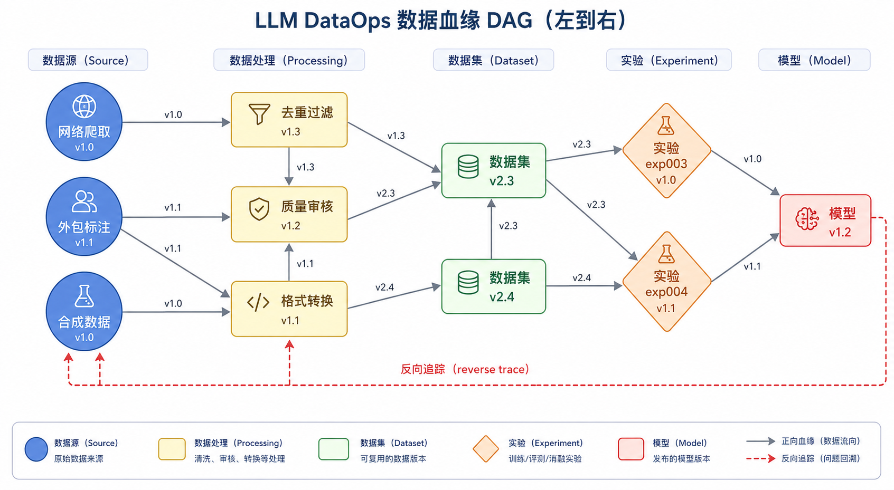
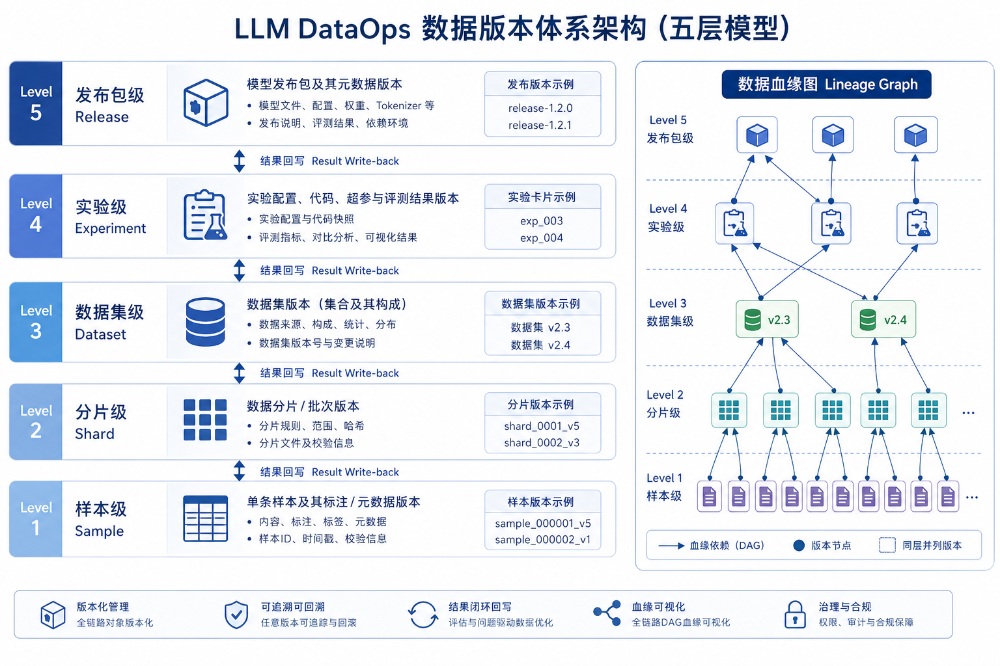

# 第25章：数据版本管理与实验追踪

---

## 本章摘要

"我们上周的模型效果比上上周差，但数据团队说数据没有变"——这句话在 LLM 项目中出现的频率，远远超出大多数团队的预期。数据工程的隐蔽性在于：数据变化往往不是单次的、显著的，而是累积的、渐进的。如果没有系统化的版本管理，团队就没有能力回答"变了什么"这个最基本的问题，更无法做到"为什么变了"的归因。

本章面向负责数据版本、实验记录和可追溯性的团队，系统阐述如何把数据版本、样本变更和实验结果关联起来，构建一条完整的可追溯链路。本章将从四个层面展开：首先分析为什么版本管理是可复盘迭代的前提；其次建立版本粒度体系与命名规范；第三，介绍实验追踪、结果回写与审计链路的工程实现；最后，讨论谱系可视化与治理规则的设计。

读者读完本章后，将掌握一套完整的元数据设计方案、版本命名规则和实验卡片模板，并能够通过一个失败实验的回溯案例，理解如何在真实工程中快速定位数据问题的根因。

---

## 场景引入

某公司算法团队在某次大规模实验后发现，新版本模型的数学推理能力显著下降，比上一版本低了约 8 个百分点。算法负责人希望数据团队定位原因，数据负责人开始排查。

第一步：查看训练集版本。数据负责人发现，当前版本和上一版本的训练集都存储在对象存储里，但没有版本标签，只有上传时间。两个文件夹的内容都已经被后续任务覆盖或删除了部分文件。

第二步：尝试比对差异。数据负责人发现两个版本之间有约 3 万条样本差异，但无法判断这些差异是"增加"还是"修改"还是"删除"——因为文件的 MD5 校验码没有被记录。

第三步：尝试追溯数据来源。这 3 万条差异样本里，有一部分来自新增的外包标注批次，有一部分是数据清洗逻辑调整导致的过滤结果变化，还有一部分是算法工程师手动添加的实验样本。这三类变更没有任何区分标记，混在一起，无从拆分。

排查持续了整整五天，最终发现问题来源：数据清洗逻辑的一个边缘条件修改，意外地过滤掉了大量包含数学公式的高质量样本。这个修改是四周前的一次"小优化"，当时没有留下任何变更记录。

这个案例揭示了缺乏版本管理的核心代价：**问题发现的时间和排查的时间之间，存在一个巨大的信息黑洞**。没有版本管理，就没有可复盘的迭代。

---

## 25.1 为什么没有版本管理就没有可复盘的迭代

### 25.1.1 数据变更对模型效果的影响为何最难追

在一个 LLM 项目的完整链路中，影响模型效果的变量有很多：模型架构、超参数、训练代码、评测代码、数据。前四类变量通常都有完善的版本管理工具（Git 管理代码，配置文件记录超参数），唯独数据变更最难追踪，原因有三：

**变更的粒度不统一**。代码变更可以精确到行；数据变更可以是一条样本、一个批次、一类来源，或者一条清洗规则——不同粒度的变更对模型的影响差异巨大，但很难用统一的方式记录。

**变更的因果链路复杂**。数据变更不总是主动触发的，有时是被动发生的：外包商的标注风格发生漂移、爬虫源站修改了内容、清洗工具升级了版本——这些变化都可能改变最终的训练数据，但没有人主动"提交"这次变更。

**变更的影响存在延迟**。一次数据变更可能在三个版本之后才对模型效果产生可见影响，因为变更的数据需要经过批量处理、混合、再训练才能体现。这种延迟让根因分析变得极其困难。

### 25.1.2 从"文件夹管理"升级到"谱系管理"

大多数数据团队的版本管理起点是"文件夹管理"：用日期命名文件夹，新数据放新文件夹，遇到问题就去翻历史文件夹。这种方式的问题不是不记录，而是记录的信息不够。日期告诉你"什么时候"，但无法告诉你：

- **什么变了**：哪些样本是新增的，哪些被删除了，哪些被修改了
- **为什么变**：这次变更的业务原因是什么，谁做了决策
- **谁做的变更**：哪个角色、哪个工具触发了这次变更
- **变更的下游影响**：这次变更被哪些实验使用了，产生了什么结果

谱系管理（Lineage Management）是对文件夹管理的系统升级。它不仅记录数据的"存在状态"，还记录数据的"生成历史"：这个数据集是从哪些数据源加工而来，经过了哪些处理步骤，每个步骤产生了什么样的变化，最终被哪些下游任务消费。谱系管理让数据集不再是一个孤立的文件，而是一个带有完整历史记录的活体资产。

### 25.1.3 版本管理的核心价值主张

建立版本管理体系，最直接的价值体现在三个场景：

**场景一：实验可重现**。算法团队六个月后想重跑一个历史实验，需要找到当时的数据版本。如果有版本管理，可以直接通过实验 ID 找到对应的数据集版本号，进而还原训练环境。

**场景二：问题可回溯**。发现模型问题后，可以通过数据谱系快速定位：从"哪个模型版本有问题"→"这个模型版本用了哪批数据"→"这批数据和上一版本有什么差异"→"差异来自哪个处理步骤"→"这个步骤的变更是什么时候发生的、为什么发生"。

**场景三：合规可审计**。监管机构要求提供某个模型的训练数据来源，有版本管理就能生成完整的审计报告，包括数据来源、处理记录和授权信息。

---

## 25.2 数据版本粒度与命名规范

### 25.2.1 五个层级的版本粒度

数据版本管理不是一个单一粒度的问题，而是需要在五个层级上同时维护版本信息：

**样本级（Sample）**：单条训练样本。版本信息包括样本 ID、来源 URL/文档 ID、创建时间、最后修改时间、当前状态（active/deprecated/under_review）。样本级的版本主要用于标注质量追溯和合规审计。

**分片级（Shard）**：一批逻辑相关的样本集合，通常是一个标注任务的产出或一次清洗批次的输出。版本信息包括分片 ID、包含的样本数量、处理脚本版本、处理时间、质量摘要。

**数据集级（Dataset）**：一个完整的、可用于训练的数据集。版本信息包括数据集 ID、组成的分片列表、版本号（语义化版本）、创建原因、质量报告。数据集级是最常用的版本粒度。

**实验级（Experiment）**：一次具体的训练实验。版本信息包括实验 ID、使用的数据集版本、模型架构、超参数配置、评测结果。实验级版本把数据和模型联系起来。

**发布包级（Release）**：对外发布的模型版本。版本信息包括发布版本号、对应的模型 checkpoint、使用的数据集版本、通过的评测集列表、发布审批记录。

| 版本粒度 | 主要用途 | 关键字段 | 保留策略 |
|---------|---------|---------|---------|
| 样本级 | 合规审计、标注追溯 | sample_id, source, status | 永久保留 |
| 分片级 | 质量分析、处理追溯 | shard_id, script_version, quality_summary | 保留12个月 |
| 数据集级 | 实验对照、版本发布 | dataset_id, version, shards, quality_report | 永久保留（冻结版本） |
| 实验级 | 结果归因、效果追踪 | experiment_id, dataset_version, results | 保留18个月 |
| 发布包级 | 部署管理、合规审查 | release_version, model_checkpoint, approval | 永久保留 |

*表25-1：数据版本粒度与适用场景表*

### 25.2.2 版本命名规范

版本命名规范应该遵循三个原则：可读性（人看得懂）、可排序性（能推断时间先后）、可唯一标识性（不会重复）。

**数据集版本：语义化版本（Semantic Versioning）**

采用 `MAJOR.MINOR.PATCH` 格式，规则如下：
- `MAJOR`：发生重大数据重构，如更换核心数据来源、大规模重新标注、数据格式不兼容变更
- `MINOR`：新增了新类别的数据或新增了超过 10% 的样本量
- `PATCH`：修复了已有样本的质量问题，或对小比例样本进行了更新

示例：`dialogue-sft-zh_v2.3.1`
- `dialogue-sft-zh`：数据集名称（任务类型-训练阶段-语言）
- `v2.3.1`：第2个大版本，第3个功能版本，第1次补丁

**分片版本：时间戳 + 来源标识**

格式：`{source_tag}_{YYYYMMDD}_{sequence}_{hash}`

示例：`vendor_a_annotation_20240315_001_a3f7b2`
- `vendor_a_annotation`：来源标识（供应商A的标注结果）
- `20240315`：处理日期
- `001`：当日第1批
- `a3f7b2`：内容 hash 的前6位，用于快速验证完整性

**实验版本：项目缩写 + 日期 + 序号**

格式：`{project}_{YYYYMMDD}_{seq_num}`

示例：`edu-math_20240315_exp003`
- `edu-math`：项目简称（教育数学子任务）
- `20240315`：实验启动日期
- `exp003`：当日第3个实验

### 25.2.3 分支、快照与回滚点

版本管理中需要区分三种不同的操作类型：

**分支（Branch）**：在不影响主线数据集的情况下，对数据进行实验性的修改或扩展。例如，想测试"增加 20% 合成数据对效果的影响"，可以从当前主线数据集创建一个分支，在分支上添加合成数据，实验完成后决定是否合并回主线。

分支适用于场景：不确定一个数据决策是否有效、需要同时维护多个数据配方给不同算法实验使用。

**快照（Snapshot）**：在某个时间点对数据集当前状态的精确记录。快照是只读的，创建后不能修改。季度版本冻结就是一种典型的快照操作。快照适用于场景：合规审计需要留存历史状态、给外部合作方提供稳定的参考版本。

**回滚点（Rollback Point）**：在已知"这个版本是好的"的时间点创建的标记，当发现问题后可以快速恢复到这个状态。回滚点通常在重大数据变更之前手动设置。回滚点适用于场景：大规模数据清洗规则变更前的安全备份、外包标注批次合并前的状态保存。

---

## 25.3 实验追踪、结果回写与审计链路

### 25.3.1 实验卡片的字段设计

实验追踪的核心工具是**实验卡片（Experiment Card）**。一张完整的实验卡片需要记录足够的信息，使得任何人在六个月后都能重现这次实验，并理解当时的决策上下文。

以下是一套标准的实验卡片字段设计：

**基础信息**

| 字段 | 类型 | 说明 |
|------|------|------|
| experiment_id | string | 唯一实验标识符 |
| experiment_name | string | 人类可读的实验名称 |
| project | string | 所属项目名 |
| created_by | string | 实验发起人 |
| created_at | datetime | 实验创建时间 |
| status | enum | pending / running / completed / failed / abandoned |

**数据配置**

| 字段 | 类型 | 说明 |
|------|------|------|
| dataset_id | string | 使用的数据集 ID |
| dataset_version | string | 数据集版本号 |
| data_splits | object | train/val/test 的样本数量 |
| data_filters | list | 本次实验应用的额外过滤条件（如果有） |
| data_mixing_weights | object | 多数据集混合时各数据集的权重 |

**模型配置**

| 字段 | 类型 | 说明 |
|------|------|------|
| base_model | string | 基座模型名称和版本 |
| training_framework | string | 训练框架（如 DeepSpeed、Megatron） |
| hyperparams | object | 完整超参数配置（学习率、batch size 等） |
| training_code_commit | string | 训练代码的 Git commit hash |

**评测结果**

| 字段 | 类型 | 说明 |
|------|------|------|
| eval_datasets | list | 使用的评测集列表 |
| metrics | object | 各评测集上的指标结果（键值对） |
| eval_code_commit | string | 评测代码的 Git commit hash |
| eval_timestamp | datetime | 评测完成时间 |

**实验记录**

| 字段 | 类型 | 说明 |
|------|------|------|
| hypothesis | string | 实验假设（这次实验想验证什么） |
| motivation | string | 数据或配置调整的业务动机 |
| notes | string | 实验过程中的观察和异常记录 |
| conclusion | string | 实验结论 |
| next_actions | list | 基于本次实验结果的后续动作 |

*表25-2：实验卡片字段示例表*

特别强调 `hypothesis`（实验假设）字段的重要性。很多团队只记录"做了什么"，却不记录"为什么这么做"。六个月后，实验结果还在，但做这个实验的原因已经无处可查。填写 `hypothesis` 字段，强制要求实验发起人在启动前明确实验目的，这本身就能显著提升实验设计的质量。

### 25.3.2 结果回写与双向关联

实验卡片只记录了从"数据"到"结果"的单向关系。完整的追踪体系还需要从"结果"反向追溯到"数据"的能力，这就是**结果回写（Result Write-back）**机制。

结果回写的含义是：当一次实验的评测结果出来后，不只是把结果写入实验卡片，还要把结果"回写"到数据集的元数据中，形成双向关联：

- 从数据集角度：可以查询"这个数据集被用在哪些实验里，产生了什么效果"
- 从实验角度：可以查询"这次实验用了哪些数据集版本"

这种双向关联的价值在于：当团队面对一个新的数据改动决策时，可以快速查询"之前用这类数据配置的实验效果如何"，从已有实验中学习，而不是每次都从零开始。

结果回写的技术实现有多种方案：
- 基于 MLflow 的实验追踪 API，将数据集版本作为实验的 artifact 参数记录
- 基于 DVC 的 `dvc params diff` 和 `dvc metrics diff` 命令，对比不同数据版本的实验结果差异
- 自建元数据服务，维护 `(dataset_version, experiment_id)` 的多对多关联表

无论选择哪种技术方案，结果回写应该是自动化的，不能依赖人工手动填写。实验启动时自动记录数据集版本，实验完成后自动读取评测结果写入，减少人工干预的环节就是减少遗漏的机会。

### 25.3.3 失败实验的价值与沉淀

一个常见的误区是：失败实验不需要认真记录，因为"反正没有价值"。这个观点会造成巨大的知识浪费。

失败实验的价值体现在三个方面：

**排除空间**：一次失败的实验证明了"这条路走不通"，避免团队在同一个方向上重复踩坑。如果失败实验没有被记录，三个月后换了一个算法工程师，很可能会重新做同样的实验，浪费宝贵的计算资源。

**异常信号**：失败实验往往包含了有价值的异常信号。Loss 曲线的异常抖动、某类样本上的极端误差、评测集上某个指标的意外上升——这些信号即使在"失败"的整体背景下，也可能是重要的发现。

**对照基线**：当后续的实验尝试新的数据配方时，历史失败实验提供了有意义的对照组。没有对照组，就无法评估改进是否真的有效。

失败实验的沉淀要求：
1. 必须填写 `conclusion` 字段，明确记录为什么认定这次实验是失败的
2. 必须填写 `next_actions` 字段，记录基于失败结论的下一步动作
3. 失败实验的 `status` 必须标记为 `failed` 或 `abandoned`，不能静默消失
4. 对于"已知失败方向"，应建立一个共享的"禁区列表"，标注哪类实验已经被证明无效

### 25.3.4 审计链路的最小信息集合

完整的审计链路需要能够回答以下核心问题：

| 问题 | 需要的信息 |
|------|-----------|
| 这个模型用了什么数据训练？ | 发布包 → 实验 → 数据集版本 |
| 这批数据是从哪里来的？ | 数据集 → 分片 → 样本来源 |
| 谁对这批数据做了什么处理？ | 处理脚本版本 + 操作人 + 时间戳 |
| 这批数据通过了什么质量检查？ | 质量评估记录 + 评估人 + 时间 |
| 数据的使用是否经过合规审批？ | 数据合规审核记录 + 审核人 + 审核结论 |
| 如果需要删除某用户的数据，波及范围是什么？ | 样本级来源索引 → 关联的分片 → 关联的数据集 → 关联的实验 |

对于审计而言，不是"记录越多越好"，而是"关键信息必须有"。上表中的每一列信息都是审计的最小必要集合，缺少任何一项都会让审计链路出现断点。

---

## 25.4 谱系可视化与治理规则

### 25.4.1 数据血缘图的表示方式

数据血缘图（Data Lineage Graph）是数据谱系的可视化表达。它以有向无环图（DAG）的形式，展示数据资产之间的依赖关系和转化关系。

在 LLM 数据工程中，一张典型的数据血缘图包含以下节点类型：

- **数据源节点**：原始数据来源，如"网络爬取 - CommonCrawl 2024Q1"、"外包商 A 标注批次 202403"
- **处理节点**：数据转化步骤，如"去重过滤"、"语言识别"、"标注质量审核"
- **数据集节点**：某个版本的数据集，如"dialogue-sft-zh_v2.3.1"
- **实验节点**：使用某个数据集的实验，如"edu-math_exp003"
- **模型节点**：训练产出的模型，如"edu-math-7B-v1.2"

节点之间的有向边表示"从这个节点产生了那个节点"，边上可以标注转化规则（如清洗脚本版本）和转化时间。

数据血缘图有三种典型的查询视角：

**正向追踪**：从一个数据源开始，追踪它的所有下游——这批爬取数据最终进入了哪些训练集，用于了哪些实验，产出了哪些模型。正向追踪用于影响分析（如果这个数据源出了问题，波及哪些产物）。

**反向追踪**：从一个模型或实验开始，追溯它的所有上游——这个模型的训练数据来自哪里，经过了哪些处理，质量评估是谁做的。反向追踪用于根因分析。

**差异比对**：对比两个不同版本的数据集在谱系上的差异——哪些数据源变了，哪些处理步骤变了，差异的规模有多大。差异比对用于变更审计。

*图25-1：从数据源到模型发布的完整数据谱系图，展示正向追踪与反向追踪路径*

### 25.4.2 变更审计流程图

每一次数据集版本变更都应该经过规范的审计流程，确保变更被授权、被记录、被验证。

标准变更审计流程如下：

1. **变更申请**：提出方（通常是数据工程师或标注工程师）填写变更申请表，说明变更内容、变更原因和预期影响
2. **影响评估**：评估这次变更会影响哪些下游数据集和实验
3. **合规审查**：如果变更涉及数据来源或数据类型的变化，需要法务合规专员审核
4. **技术审查**：数据 Owner 或高级数据工程师审查变更的技术实现方案
5. **变更执行**：在创建回滚点后执行变更
6. **变更验证**：运行自动化质量检查，与变更申请中的预期影响对比
7. **变更记录**：将变更日志写入数据集的元数据，更新血缘图

| 步骤 | 执行者 | 工具 | 产出物 |
|------|-------|------|-------|
| 变更申请 | 申请方 | 变更申请表单 | 填写完整的申请单 |
| 影响评估 | 数据工程师 | 血缘图查询工具 | 影响范围列表 |
| 合规审查 | 法务合规 | 合规审查清单 | 审查结论（通过/拒绝/条件通过） |
| 技术审查 | 数据Owner | Code Review | 审批意见 |
| 变更执行 | 数据工程师 | 处理脚本 + 版本工具 | 新版本数据集 |
| 变更验证 | 质量评估员 | 自动化质量检查工具 | 质量报告 |
| 变更记录 | 自动化 | 元数据服务 | 更新的血缘图和变更日志 |

*表25-3：数据变更审计流程表*

### 25.4.3 谱系治理规则

谱系治理规则是数据团队约定的一套"数据行为准则"，规定了哪些操作是被允许的、哪些需要审批、哪些是被禁止的。

以下是一套参考治理规则：

**允许自由操作（无需审批）**
- 在沙箱环境中创建数据分支用于本地实验
- 查看和导出数据集的统计摘要
- 添加或修改数据集的非关键元数据（如标签、注释）

**需要申请审批（轻量审批，数据工程师或 Tech Lead 审批）**
- 将新的数据分片合并到主线数据集
- 修改数据清洗规则
- 添加新的数据来源类别

**需要正式审批（Data Owner + 法务合规审批）**
- 变更数据集的核心来源（如更换标注供应商、新增爬取站点）
- 删除已有数据集版本
- 将内部数据集共享给外部合作方
- 对已发布版本数据集进行修改（原则上禁止，特殊情况需要完整记录）

**永远禁止**
- 在没有版本记录的情况下修改已冻结的数据集
- 在没有合规审核的情况下使用第三方版权数据
- 直接修改他人提交的数据而不留下修改记录

---

## 25.5 案例：一次失败实验如何快速回溯

### 案例背景

某公司正在训练一个客服对话大模型。在第三次大版本迭代（`v3.0.0`）发布后，线上评测发现模型在"退款流程"类问题上的准确率从 82% 骤降至 67%，引发客户投诉。

算法团队立即向数据团队发出回溯请求：**在过去 6 周内，"退款流程"相关数据发生了什么变化？**

### 回溯过程（有版本管理的情况下）

**步骤一：定位模型版本对应的数据集版本**（用时：5分钟）

通过实验追踪系统查询模型 `v3.0.0` 对应的训练实验 ID：`cs-dialog_20240401_exp012`。

查询实验卡片，找到数据集版本：`cs-dialog-sft-zh_v2.8.0`

**步骤二：对比当前版本与上一稳定版本的差异**（用时：15分钟）

使用血缘查询工具，对比 `v2.8.0` 与 `v2.6.0`（上一次效果良好的版本）的差异：
- 总样本量：`v2.6.0` 有 18.2 万条，`v2.8.0` 有 21.4 万条
- 新增样本：32,156 条（来自两个新增分片）
- 删除样本：1,823 条（被质量过滤移除）

**步骤三：分析"退款流程"标签数据的变化**（用时：20分钟）

按业务标签过滤，查看"退款流程"类样本在两个版本中的分布：
- `v2.6.0`：退款流程样本 6,847 条
- `v2.8.0`：退款流程样本 4,102 条（减少了 40%！）

**步骤四：追踪减少原因**（用时：30分钟）

查询"退款流程"样本减少的原因，定位到分片 `vendor_b_annotation_20240318_003`：
- 这批分片中有 3,201 条"退款流程"样本被打了"低质量"标签
- 追溯到具体的质量审核记录：审核人 `QA_王工` 在 2024-03-20 进行了批量审核

查询 `QA_王工` 的审核记录，发现：他在 3 月 20 日将一批关于"旧版退款流程"的样本统一标记为低质量（原因是"流程已更新，描述过时"），然后被质量过滤步骤移除。

**步骤五：确认根因与制定修复方案**（用时：15分钟）

根因：质量审核人员按照当前业务流程判断数据质量，将描述"旧版退款流程"的样本视为低质量数据，但实际上旧版流程的处理场景（历史订单退款）仍在线上存在，这些样本对模型理解"退款流程演变"具有重要价值。

修复方案：
1. 短期：从 `v2.6.0` 中取回被删除的退款流程样本，加入"历史退款流程"标签重新入库
2. 中期：更新质量审核指南，明确"历史流程数据"的保留原则
3. 长期：在标注任务中增加"是否适用于历史场景"的标注维度

整个回溯过程共用时约 85 分钟，从"问题反馈"到"根因确认"。这与前述案例中"无版本管理下耗时 5 天"形成了鲜明对比。

### 关键成功因素总结

这次快速回溯之所以成功，依赖于以下几个关键的版本管理设计：

1. **实验到数据的双向关联**：知道 `v3.0.0` 对应哪个数据集版本
2. **分片级的来源追踪**：能够定位到具体的标注批次
3. **审核记录的完整保留**：知道谁在什么时间做了什么审核操作
4. **业务标签的版本维护**：能够按标签过滤历史版本数据

缺少其中任何一个，回溯链路就会中断。

---

## 本章小结

本章系统阐述了 LLM 数据工程中版本管理与实验追踪的核心设计。

在理念层面，我们分析了数据变更难以追踪的三个根本原因（粒度不统一、因果链复杂、影响有延迟），以及从"文件夹管理"升级到"谱系管理"的必要性。版本管理的核心价值在于：实验可重现、问题可回溯、合规可审计。

在版本粒度层面，我们定义了从样本、分片、数据集、实验到发布包的五层版本体系，以及语义化版本命名规范和分支/快照/回滚点三种版本操作类型。

在实验追踪层面，我们设计了完整的实验卡片字段（基础信息、数据配置、模型配置、评测结果、实验记录），强调了失败实验的沉淀价值，以及结果回写形成双向关联的重要性。

在谱系治理层面，我们介绍了数据血缘图的三种查询视角（正向追踪、反向追踪、差异比对），以及标准化的变更审计流程和分级治理规则。

最后，通过一次失败实验的完整回溯案例，展示了版本管理体系在真实场景中将回溯时间从 5 天压缩到 85 分钟的实际价值。

*图25-2：数据版本管理与实验追踪体系全景——五层版本粒度与双向关联架构*

---

## 延伸阅读

**工具推荐**

DVC（Data Version Control）是目前最成熟的数据版本控制工具，与 Git 深度集成，支持大文件的版本管理和数据血缘追踪。其文档中的"Data Registry"模式是多项目数据共享的参考实现。MLflow 是开源的机器学习实验追踪平台，支持实验参数、指标、artifact 的统一记录，以及版本对比的可视化界面。LakeFS 是面向数据湖的版本控制工具，提供了类似 Git 的分支、合并和回滚操作，适合大规模数据集的版本管理。

**深度阅读**

Zaharia 等人的《Accelerating the Machine Learning Lifecycle with MLflow》（2018）是 MLflow 的原始论文，系统介绍了 ML 生命周期管理的挑战和解决思路。Google 发布的《Data Cards: Purposeful and Transparent Dataset Documentation for Responsible AI》（2022）提供了数据集文档化的最佳实践，对实验卡片的设计有重要参考价值。

---

## 下一章预告

有了版本管理和实验追踪，团队建立了"事后可回溯"的能力。但 LLM 数据平台还需要一类更主动的能力：**在问题发生时就能感知，而不是等到模型效果下降才意识到**。

第26章将深入数据平台的可观测性体系，从指标分层到告警设计，从异常归因到运营面板，构建一套能够让团队"第一时间感知数据健康状态"的监控系统。

## 参考文献

<!-- 待补充：本章引用的论文、博客、工具与官方文档。补全策略见 publishing/citations_progress.md。 -->
