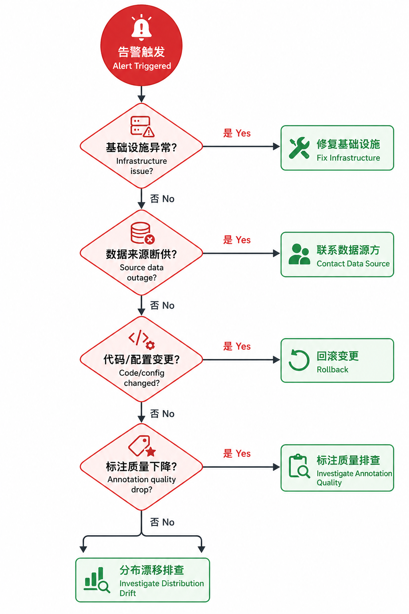
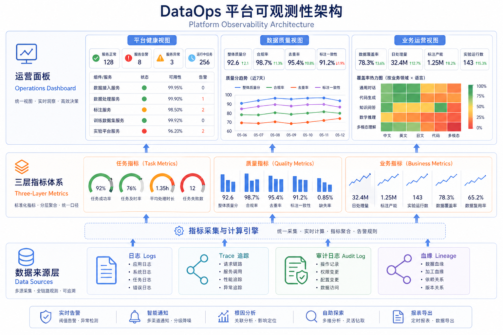

# 第26章：数据平台可观测性

---

## 本章摘要

"调度成功"和"数据健康"是两件完全不同的事情。数据平台的作业可能在全绿的状态下运行，而训练数据的质量已经悄然恶化——直到算法团队发现模型效果异常，数据团队才开始排查，发现问题已经累积了数周。

本章面向负责平台稳定性、作业监控和质量预警的工程团队，系统阐述如何建立 LLM 数据平台的可观测性体系。本章将从四个层面展开：首先分析为什么作业成功不等于数据健康，以及 LLM 数据平台特有的故障模式；其次建立指标分层体系，将任务指标、质量指标和业务指标整合到统一的观测框架中；第三，设计告警策略、异常归因流程和应急响应机制；最后，讨论容量预测、成本预警和运营面板的设计。

读者读完本章后，将掌握一套完整的数据平台可观测性设计方案：包括监控指标分层表、告警级别与处置动作表、一份可直接复用的事故复盘模板，以及一次真实平台事故的完整复盘案例。

---

## 场景引入

某公司的 LLM 数据平台每天处理约 200 万条原始数据，经过清洗、标注、格式转换后，产出约 10 万条训练样本。平台的监控面板显示：过去一个月，所有 Airflow DAG 的成功率保持在 99.2% 以上，作业平均耗时稳定，存储空间充足，看起来一切正常。

然而，在一次月度评审会议上，算法团队提出：最近两周的训练实验效果明显不如预期，特别是中文长文理解任务的评测分数出现了约 6% 的下滑。数据团队开始排查。

排查结果令人震惊：三周前，数据清洗管线的一个依赖库悄悄升级了版本，新版本的分词器对中文长文的截断处理发生了变化，导致超过 512 token 的长文本被错误地截断，而不是按语义边界切分。作业仍然成功运行，输出文件的样本数量看起来正常，所有"任务指标"都是绿色的——但数据内容已经悄悄地变了，而没有任何一个告警被触发。

这个案例揭示了数据平台可观测性的核心命题：**不能用"作业是否成功运行"来代替"数据是否健康"**。两者是不同层面的问题，需要不同层面的监控体系。

---

## 26.1 为什么作业成功不等于数据健康

### 26.1.1 调度成功、任务成功与数据正确并不等价

理解这三个层次的区别，是建立正确可观测性体系的前提：

**调度成功**是最基础的层次：调度系统（如 Airflow）成功触发了任务，任务进入运行队列。调度成功只意味着"任务被启动了"，不代表任务做了正确的事情。

**任务成功**是第二个层次：任务进程以退出码 0 结束，没有抛出未捕获的异常。任务成功意味着"程序正常运行完了"，但程序运行完的结果可能是错误的——比如处理了一个空文件、过滤条件出现 bug 导致所有样本被删除、或者输出格式不符合预期。

**数据正确**是最关键的层次：产出的数据在内容上是健康的，符合业务期望的质量标准。数据正确无法通过任务状态来反映，只能通过对数据内容本身的检查来验证。

| 层次 | 检测对象 | 典型工具 | 常见的漏检场景 |
|------|---------|---------|-------------|
| 调度成功 | 任务是否启动 | Airflow/Dagster 状态 | 任务启动但立即以错误退出 |
| 任务成功 | 进程退出码 | 监控系统告警 | 任务完成但输出为空、输出内容错误 |
| 数据正确 | 数据内容质量 | 数据质量检测框架 | 内容格式正确但语义错误、分布偏移 |

*表26-1：三个层次的成功定义与典型漏检场景*

### 26.1.2 LLM 数据平台的特有故障模式

与传统数据仓库不同，LLM 数据平台面临一类特有的"静默失效"故障——问题发生了，但没有任何明显的错误信号：

**语义漂移（Semantic Drift）**：处理逻辑没有改变，但数据源的内容发生了变化。例如，爬虫抓取的网页内容变成了广告页，或者外包商的标注风格在不知不觉中发生了偏移，导致输出数据的语义分布偏离了预期，但文件格式、样本数量等结构化指标完全正常。

**过滤过度（Over-filtering）**：清洗逻辑的某个参数调整（如质量分数阈值提高）导致大量高质量样本被误删，训练集覆盖率下降，但样本数量仍然在"正常范围"内，不会触发数量类告警。

**依赖版本漂移（Dependency Drift）**：如上文案例所示，处理框架的底层依赖库升级，改变了某些数据处理行为，但测试用例没有覆盖到这类边界情况。

**标注一致性衰减（Annotation Drift）**：长期标注任务中，标注员疲劳或理解偏差导致标注质量缓慢下降，但单批次的质量抽检可能无法发现这种趋势性变化。

**数据孤岛（Data Island）**：多路数据源中的某一路突然停止更新（如某个第三方数据合作到期），导致训练数据缺乏某类领域的覆盖，但总量指标没有显著变化。

这些故障模式的共同特点是：**表面的系统指标健康，但实质的数据健康已经出问题**。传统的基础设施监控体系无法感知这类问题，需要专门针对数据内容的质量监控来覆盖。

### 26.1.3 数据健康问题为何经常滞后暴露

LLM 数据质量问题的一个典型特征是"影响延迟"——问题发生后，可能要等几周甚至几个月才在模型效果上表现出来。这个延迟来自两个环节：

**数据-训练延迟**：数据问题发生后，问题数据需要积累到足够的量才会被采集进训练集；训练本身需要时间；训练后还需要经过评测才能发现效果异常。在规律性的迭代中，这个延迟通常在 2-6 周。

**训练-部署延迟**：模型训练完成后，往往还需要经过多轮评测、灰度发布才能全量上线，这又增加了 1-4 周的延迟。

总的影响延迟可能长达 2-3 个月。这意味着，如果没有在数据层面的实时或近实时监控，团队就会一直在事后救火，而不是事中预警。

---

## 26.2 指标体系、日志、追踪与血缘结合

### 26.2.1 三层指标体系

LLM 数据平台的指标体系应该分为三个层次，每个层次解决不同的问题：

**第一层：任务指标（Task Metrics）**

任务指标是对平台运行状态的基础监控，衡量"任务是否按时完成"。主要指标包括：

- 任务成功率：过去 24 小时内，成功完成的任务数 / 总触发任务数
- 任务耗时：各类任务的平均执行时间和 P95 分位
- 队列积压：等待执行的任务数量趋势
- 重试率：需要重试才能成功的任务比例（高重试率暗示底层资源或依赖不稳定）
- 数据吞吐量：每小时处理的原始数据量（记录数和存储大小）

任务指标是可观测性的基础，但如前文所述，全绿的任务指标不意味着数据健康。

**第二层：质量指标（Quality Metrics）**

质量指标是对数据内容健康程度的直接度量，衡量"产出的数据是否符合质量标准"。主要指标包括：

- 空白率：内容为空或过短（< 10 tokens）的样本比例
- 重复率：与历史数据集重复的样本比例
- 格式合规率：样本字段完整性和格式正确性
- 语言分布：多语言数据集中各语言的比例（偏离预期分布触发告警）
- 标注一致性：同一批次中，同类标注任务的 IAA 评分
- 平均质量分数：使用自动质量评估模型打分的平均值和分布
- 特定类别覆盖率：训练目标中，关键业务类别的样本数量和比例

质量指标需要在每个处理批次产出后计算，形成时序数据，便于趋势分析和异常检测。

**第三层：业务指标（Business Metrics）**

业务指标是从业务价值角度衡量数据资产的整体健康状况，衡量"数据是否在支撑业务目标"。主要指标包括：

- 训练集领域覆盖率：训练集是否覆盖了所有目标业务场景
- 数据新鲜度：训练集中最近一段时间内的数据占比（避免知识截止问题）
- 标注吞吐量：单位时间内完成高质量标注的样本数量（支撑迭代节奏的核心指标）
- 数据需求响应率：来自算法团队的数据需求，按时完成的比例
- 合规数据比例：通过合规审核的数据占总数据的比例

| 指标层次 | 典型指标 | 更新频率 | 主要受众 |
|---------|---------|---------|---------|
| 任务指标 | 成功率、耗时、吞吐量 | 实时/分钟级 | 平台工程师、SRE |
| 质量指标 | 空白率、重复率、一致性、覆盖率 | 批次级（小时/天） | 数据工程师、质量评估员 |
| 业务指标 | 领域覆盖、数据新鲜度、响应率 | 日/周 | 数据Owner、算法团队、产品团队 |

*表26-2：监控指标分层表*

### 26.2.2 日志、Trace、Audit Log 与 Lineage 的组合

可观测性的四个核心工具——日志（Log）、追踪（Trace）、审计日志（Audit Log）和血缘（Lineage）——在数据平台中各有分工，需要组合使用：

**日志（Log）**：记录数据处理过程中的详细运行信息，包括每条数据的处理结果（通过/过滤/异常）、过滤原因、处理耗时。日志是最细粒度的记录，适用于问题排查，但不适合长期全量保存（成本过高）。建议采用分级日志：
- INFO 级：记录批次级别的汇总信息（每批次处理了多少条、过滤了多少条）
- DEBUG 级：记录单条数据的详细处理过程（仅在问题排查时开启）
- ERROR 级：记录处理失败或异常情况（永久保留）

**追踪（Trace）**：记录一条数据从进入管线到产出的完整处理链路，包括经过的每个处理节点和对应的时间戳。与日志不同，Trace 强调跨系统的端到端视角。在数据平台中，Trace 可以帮助回答："这条样本是什么时候进来的，经过了哪些处理步骤，最终出现在哪个数据集版本中"。

**审计日志（Audit Log）**：记录谁在什么时间对数据做了什么操作，不可篡改，用于合规审计。审计日志必须永久保留，必须包含完整的操作者身份信息。典型的审计事件包括：数据集版本创建/删除、质量标准修改、合规审核通过/拒绝、数据访问请求。

**血缘（Lineage）**：如第25章所述，记录数据资产之间的依赖关系。血缘信息与日志和 Trace 的主要区别在于：血缘描述的是静态的"产生关系"，而日志和 Trace 描述的是动态的"处理过程"。血缘图告诉你"数据集 v2.3 是由哪些数据源加工而来"，Trace 告诉你"这条具体的样本经历了什么处理"。

| 工具 | 记录对象 | 时效性 | 主要用途 |
|------|---------|-------|---------|
| 日志 | 处理过程事件 | 实时 | 故障排查、过滤原因分析 |
| Trace | 单条数据端到端路径 | 实时 | 数据追溯、性能分析 |
| 审计日志 | 用户操作事件 | 实时，永久保留 | 合规审计、责任追溯 |
| 血缘 | 数据资产依赖关系 | 每次版本变更更新 | 影响分析、根因定位 |

### 26.2.3 从作业可观测到数据资产可观测

传统的基础设施监控（CPU、内存、磁盘、网络）加上作业状态监控，只覆盖了"计算资源健康"和"流程健康"两个维度。LLM 数据平台还需要覆盖第三个维度：**数据资产健康**。

数据资产健康监控的核心是建立"数据集 SLO（Service Level Objective）"——对每个重要的数据集，定义其质量目标和监控规则。例如：

```yaml
dataset_slo:
  dataset_id: cs-dialog-sft-zh
  slo:
    - metric: duplicate_rate
      threshold: 0.01       # 重复率 < 1%
      window: 7d            # 7天滚动窗口
    - metric: blank_rate
      threshold: 0.005      # 空白率 < 0.5%
    - metric: iaa_score
      threshold: 0.85       # 标注一致性 > 0.85
    - metric: coverage_rate_by_category
      min_coverage:
        refund: 0.05        # "退款"类样本 > 5%
        complaint: 0.08     # "投诉"类样本 > 8%
  alert_channel: "#data-platform-alerts"
  on_violation: page_on_call
```

这种 SLO 驱动的数据资产监控，使得数据质量问题可以在训练之前就被发现，而不是等到模型效果下降后才回溯。

---

## 26.3 告警策略、归因与应急流程

### 26.3.1 告警设计原则

数据平台的告警设计有两个常见误区：**告警过少**（出了问题才知道）和**告警过多**（告警疲劳，有告警也不当回事）。好的告警策略需要在敏感性和精确性之间取得平衡。

以下是 LLM 数据平台告警设计的五个原则：

**原则一：告警必须可执行**。每一条告警触发后，必须有对应的处置动作。如果一条告警触发后，接收者不知道该做什么，这条告警就不应该存在（或者应该改为信息通知而非告警）。

**原则二：告警按影响分级**。不同严重程度的问题应该有不同的响应级别，而不是所有告警都以同样的紧迫度处理。

**原则三：告警避免孤立指标**。单个指标的瞬时波动可能是噪声，组合告警（多个指标同时异常）的可靠性更高。例如，"重复率上升"可能是正常批次差异，但"重复率上升 + 样本量增加 + 数据新鲜度下降"同时出现，则强烈暗示数据管线出现了问题。

**原则四：区分静态阈值和动态基线**。静态阈值（如"空白率 > 5% 就告警"）适用于有明确质量标准的指标；动态基线（如"今天的数值比过去30天均值高 3 个标准差"）适用于正常值会随时间变化的指标（如日处理量可能随业务增长而正常增加）。

**原则五：告警收敛**。如果同一个根因导致多个指标同时异常，应该聚合成一条告警，而不是发出十条不同的告警。

### 26.3.2 四级告警体系

| 级别 | 名称 | 触发条件示例 | 响应时间 | 通知方式 | 处置动作 |
|------|------|-----------|---------|---------|---------|
| P0 | 严重（Critical） | 核心管线完全中断；训练集被意外删除；发现大量合规违规数据 | 15分钟内 | 电话 + 短信 + 即时消息 | 立即叫醒值班工程师，启动事故响应流程 |
| P1 | 高（High） | 数据吞吐量下降 > 50%；质量指标大幅偏离基线（> 3σ）；关键类别数据断供 | 1小时内 | 即时消息 + 邮件 | 值班工程师在1小时内确认问题，评估影响范围 |
| P2 | 中（Medium） | 数据吞吐量下降 20-50%；质量指标轻微偏离（2-3σ）；标注任务积压超过阈值 | 4小时内 | 即时消息 | 在当天工作时间内处理 |
| P3 | 低（Low） | 非关键指标异常；趋势性预警（如存储使用率连续7天上升）| 24小时内 | 邮件 | 纳入当周任务计划处理 |

*表26-3：告警级别与处置动作表*

P0 和 P1 告警必须有人工确认（ACK）机制：收到告警的工程师必须在规定时间内确认"我知道了，正在处理"，否则自动升级。P2 和 P3 告警不需要立即确认，但必须在 SLA 时间内处理完毕并关闭。

### 26.3.3 异常归因决策树

当告警触发后，工程师面临的第一个问题是：这个问题的根因在哪里？以下决策树是 LLM 数据平台中最常见的异常归因路径：

**第一步：判断是平台问题还是数据问题**

- 检查底层基础设施状态（服务器、存储、网络）是否正常
- 检查调度系统是否有任务失败或延迟
- 如果基础设施和调度都正常，问题在数据层

**第二步（数据层）：判断是来源问题还是处理问题**

- 检查原始数据的入库量是否正常（是否有数据源断供）
- 检查各数据来源的占比是否有显著变化
- 如果入库量和分布都正常，问题在处理层

**第三步（处理层）：判断是代码问题还是配置问题**

- 检查最近是否有代码或依赖库的版本变更
- 检查最近是否有配置参数的修改（如质量阈值、过滤规则）
- 如果代码和配置都没有变更，检查数据内容本身

**第四步（数据内容）：判断是分布漂移还是标注质量问题**

- 检查不同数据来源的质量分数分布是否有显著变化
- 检查最近的标注批次 IAA 是否有下降趋势
- 抽样检查具体样本，人工判断质量



*图26-1：LLM 数据平台异常归因决策树——从告警触发到根因定位的四级诊断路径*

### 26.3.4 数据事故分级响应与排障手册

数据事故（Data Incident）是指数据质量或平台状态出现严重异常，影响到训练数据的可用性或可靠性的情况。以下是一套标准化的事故响应流程：

**事故触发**：P0 或 P1 告警触发，且问题在 15/60 分钟内未被自动恢复。

**事故声明**：值班工程师创建事故工单，填写：
- 事故描述（影响了什么）
- 影响范围评估（哪些数据集、哪些下游任务受影响）
- 事故负责人（IC，Incident Commander）
- 通知范围（需要知情的团队和个人）

**诊断与止损**：
1. 按归因决策树快速诊断根因（目标：在P0情况下30分钟内定位根因）
2. 评估是否需要立即止损（如暂停受影响管线的运行，避免错误数据继续生产）
3. 如果无法快速修复，评估是否需要回滚到上一个健康版本

**恢复与验证**：
1. 执行修复或回滚操作
2. 运行自动化质量检查，确认数据恢复到健康状态
3. 由事故 IC 宣布事故解除

**复盘**：事故解除后的 48 小时内，完成事故复盘报告（格式见本章末尾附录）。

---

## 26.4 容量预测、成本预警与运营面板

### 26.4.1 容量预测的三个维度

LLM 数据平台的容量预测需要覆盖三个维度：处理量、存储量和标注量。

**处理量预测**：

处理量（每天需要处理的原始数据量）通常与业务增长节奏相关。可以基于历史趋势进行简单的线性或指数外推，但需要叠加以下调整因素：
- 季节性因素：某些业务数据的产生有明显的时间规律（如电商的促销节点）
- 项目驱动的脉冲：新项目启动或大版本迭代前，数据需求会出现集中爆发
- 算法演进：新的训练范式（如更长的上下文、更精细的 RLHF 流程）会改变数据消耗模式

**存储量预测**：

存储量的增长由三个因素驱动：新产出数据的增加、历史数据的保留策略、数据格式的变化（如 token 化后数据通常比原始数据更大）。

关键决策：不同类型数据的保留期限。原始爬取数据：保留 12 个月；处理后的分片数据：保留 6 个月；已发布的数据集版本：永久保留；历史实验数据：保留 18 个月（见第25章版本粒度表）。

**标注量预测**：

标注量预测需要考虑：算法团队的实验计划（通常由产品路线图驱动）、标注员的产能（每人每天可以完成的标注数量）、标注任务的复杂度（不同类型的标注任务耗时差异可能高达 10 倍）。

标注量预测的结果决定了标注团队的规模规划和外包商资源预留，应该在季度初完成，并在月度评审时更新。

### 26.4.2 成本监控与预警

LLM 数据平台的主要成本来源有四类：

| 成本类别 | 主要驱动因素 | 优化方向 |
|---------|-----------|---------|
| 计算成本 | 数据处理、格式转换、质量评估的 CPU/GPU 使用 | 批处理合并、低峰时段运行、算法优化降低计算密度 |
| 存储成本 | 原始数据、中间产物、历史版本的存储 | 分级存储（热/温/冷）、过期数据自动归档/删除 |
| 标注成本 | 外包标注的单价 × 标注量 | 提升标注任务设计质量减少返工、合理分配内外部标注比例 |
| 工具与平台成本 | 标注平台、监控工具、版本管理工具的订阅费 | 自建 vs 购买的 ROI 评估 |

成本预警应该在两个层面设置：

**绝对值预警**：当某类成本在一个计费周期内超过预算上限的 80%，触发 P2 告警；超过 100% 触发 P1 告警。

**增速预警**：当某类成本的月环比增速超过 30%（在没有明确业务增长驱动的情况下），触发调查请求。

### 26.4.3 三维运营面板设计

LLM 数据平台的运营面板需要服务于不同视角的受众：平台工程师关注稳定性，数据 Owner 关注质量和效率，产品和业务团队关注数据资产的业务价值。

建议设计三块独立的面板视图：

**面板一：平台健康视图（平台工程师/SRE 使用）**
- 所有数据管线的实时状态（绿/黄/红）
- 过去 24 小时的任务成功率趋势
- 当前队列积压量
- 存储和计算资源使用率
- 未解决的 P0/P1 告警数量

**面板二：数据质量视图（数据 Owner/质量评估员使用）**
- 过去 7 天的关键质量指标趋势（重复率、空白率、标注一致性）
- 各数据集的 SLO 达成状态
- 本周产出的数据量与质量摘要
- 问题池中未解决的高优质量问题

**面板三：业务运营视图（产品/算法团队使用）**
- 训练集的领域覆盖率热力图
- 数据需求响应率（按时交付比例）
- 本月数据迭代进度（相对于计划）
- 成本 vs 产出趋势（成本效率指标）



*图26-2：LLM 数据平台可观测性全景图——三层指标体系与三维运营面板的架构*

---

## 26.5 案例：一次平台事故的复盘

### 事故概述

**时间**：2024年5月某周二，13:47

**告警级别**：P1（后升级为 P0）

**事故描述**：数据平台质量监控系统发出告警：核心训练数据集`dialogue-sft-zh`的"医疗健康"类别覆盖率从正常水平的 8.2% 骤降至 1.3%，触发 P1 告警。在调查过程中发现，同类问题影响了过去 6 天的所有数据批次，升级为 P0。

**影响范围**：6 天的增量数据（约 42 万条）中，医疗健康类样本减少约 35 万条；三个正在使用这批数据训练的实验受到影响。

### 时间线

| 时间 | 事件 |
|------|------|
| 5月15日 09:00 | 数据工程师 Zhang 对爬虫过滤规则进行了一次"小优化"：将过滤规则中的关键词列表从外部 JSON 文件改为硬编码，目的是减少配置文件依赖 |
| 5月15日 09:15 | 该变更通过了基础单元测试（测试样本中不包含医疗健康类别） |
| 5月15日 10:00 | 变更部署到生产环境，后续所有批次都使用新逻辑处理 |
| 5月21日 13:47 | 质量监控系统触发 P1 告警：医疗健康类别覆盖率异常 |
| 5月21日 14:05 | 值班工程师 Li 接到告警，开始调查 |
| 5月21日 14:30 | Li 通过血缘图定位到问题数据批次，对比代码变更历史，怀疑与 5/15 的变更有关 |
| 5月21日 14:45 | Zhang 确认：硬编码过程中，医疗健康类的关键词列表遗漏了几个关键词，导致该类别 80% 以上的样本被误过滤 |
| 5月21日 14:50 | 事故升级为 P0，通知算法团队暂停使用受影响的数据批次 |
| 5月21日 16:30 | 修复变更部署，重新处理受影响的 6 天数据 |
| 5月22日 08:00 | 数据重新处理完成，质量指标恢复正常，事故解除 |

**事故总历时**：19 小时（从变更部署到事故解除约 6 天，从告警触发到解除约 18 小时）

### 根因分析

**直接原因**：代码变更将过滤关键词从外部配置文件改为硬编码时，遗漏了医疗健康类别的部分关键词。

**根本原因（系统性问题）**：

1. **测试覆盖不足**：代码变更的测试样本不包含医疗健康类别数据，导致测试无法发现回归问题。

2. **监控检测延迟**：质量监控系统每6小时运行一次批次级别的检查，且告警规则基于单批次的偏离阈值，对于渐进性变化（每批次减少量不显著）的检测不够灵敏，直到问题累积6天后才触发告警。

3. **变更审批不严格**：这次变更被认为是"小优化"，没有经过完整的变更审批流程（没有检查影响范围、没有设置回滚点）。

### 修复措施

**短期（已执行）**：
- 修复关键词列表，重新处理受影响数据
- 通知算法团队更新实验中的数据集版本

**中期（2周内）**：
- 测试数据集中增加医疗健康类别的代表性样本，覆盖所有业务类别
- 质量监控系统增加"趋势告警"规则：连续3批次某类别覆盖率下降超过 20%，触发告警

**长期（1个月内）**：
- 建立数据变更分级制度：影响过滤规则的变更必须经过完整审批流程
- 在 CI/CD 流水线中增加数据质量冒烟测试（smoke test）：每次代码变更后，自动运行一个小型数据集的质量指标检查

### 事故复盘模板

以下是标准化的事故复盘模板，适用于所有 P0/P1 级数据事故：

---

**事故复盘报告**

| 字段 | 内容 |
|------|------|
| 事故 ID | INC-2024-0521-001 |
| 事故级别 | P0 |
| 影响时间 | 2024-05-15 10:00 ~ 2024-05-22 08:00（共7天） |
| 事故负责人 | Li（值班工程师） |
| 参与人员 | Zhang（数据工程师）、算法团队代表 |
| **事故描述** | 医疗健康类样本因过滤规则变更被大量误删，6天数据受影响 |
| **影响范围** | 42万条增量数据；3个进行中的训练实验 |
| **根本原因** | 代码变更遗漏关键词 + 测试覆盖不足 + 变更审批流程不完善 |
| **响应时间线** | 见上文时间线 |
| **修复措施** | 短期/中期/长期措施见上文 |
| **预防措施** | 更新测试数据集；增加趋势告警；建立变更分级制度 |
| **经验教训** | "小变更"不小，任何影响过滤逻辑的变更都需要完整测试覆盖 |

---

### 关键指标改进效果

通过这次事故的整改，团队完善了以下监控能力：

| 改进项 | 改进前 | 改进后 |
|-------|-------|-------|
| 类别覆盖率异常检测延迟 | 6天（需累积足够多的偏差才触发告警） | < 6小时（增加趋势告警后） |
| 变更导致的数据质量回归发现时间 | 平均 4 天 | < 2小时（CI 冒烟测试） |
| 代码变更有质量测试覆盖率 | 约 35% | > 85% |

---

## 本章小结

本章系统构建了 LLM 数据平台的可观测性体系，覆盖监控、告警、归因和运营四个维度。

在基础认知层面，我们厘清了调度成功、任务成功与数据正确三个层次的区别，分析了 LLM 数据平台特有的五类"静默失效"故障模式（语义漂移、过滤过度、依赖漂移、标注衰减、数据孤岛），以及数据质量问题滞后暴露的根本原因。

在指标体系层面，我们建立了任务指标、质量指标和业务指标的三层体系，讨论了日志、Trace、审计日志和血缘四种可观测性工具的分工与组合，以及基于 SLO 的数据资产健康监控设计。

在告警与应急层面，我们设计了四级告警体系（P0-P3）和对应的处置动作，给出了数据平台异常归因的四步决策树，以及标准化的事故响应和复盘流程。

在运营管理层面，我们讨论了处理量、存储量和标注量的三维容量预测方法，成本监控的分类与预警规则，以及面向不同受众的三维运营面板设计。

最后，通过一次真实的平台事故完整复盘，展示了可观测性体系如何在实际中把问题发现时间从 6 天压缩到 6 小时。

数据平台的可观测性不是一次性建设就能完成的，而是随着平台的演进和事故经验的积累，不断完善的过程。每一次事故都是一次系统性提升监控能力的机会。

---

## 延伸阅读

**可观测性工程经典参考**

Beyer 等人编写的《Site Reliability Engineering》（Google SRE Book）是 SRE 领域的奠基之作，其中关于 SLO 设计和事故管理的章节，对数据平台可观测性体系的设计有直接的参考价值。Kleppmann 的《Designing Data-Intensive Applications》（数据密集型应用系统设计）中，关于可靠性和可维护性的讨论，提供了更底层的工程思维框架。

**开源数据质量工具**

Great Expectations 是目前最成熟的数据质量测试框架，支持定义"数据期望"（Data Expectations）并在管线中自动运行检查，与 Airflow、dbt 等工具集成良好。Apache Griffin 是专为大数据场景设计的数据质量工具，支持批处理和流处理两种模式的质量监控。Evidently AI 是专注于 ML 数据和模型监控的开源库，提供了数据漂移检测和模型性能监控的开箱即用组件。

**事故管理工具**

PagerDuty 是业界最广泛使用的事故响应工具，支持多级告警路由、值班排班和事故工单管理。Opsgenie 是 Atlassian 旗下的事故管理平台，与 Jira 深度集成，适合已经使用 Atlassian 生态的团队。

---

## 下一章预告

至此，第八篇"DataOps 与平台建设"已经系统覆盖了团队组织（Ch24）、版本管理（Ch25）和平台可观测性（Ch26）三个核心维度，为 LLM 数据工程团队提供了组织和平台层面的完整基础。

在下一篇中，我们将进入一个更加敏感和关键的领域：**隐私合规与数据安全**。随着大模型在企业级场景的深度应用，数据的合规使用已经成为不可回避的核心议题。

第27章将从合规框架与治理出发，建立面向 LLM 数据工程的全周期合规体系。

## 参考文献

<!-- 待补充：本章引用的论文、博客、工具与官方文档。补全策略见 publishing/citations_progress.md。 -->
