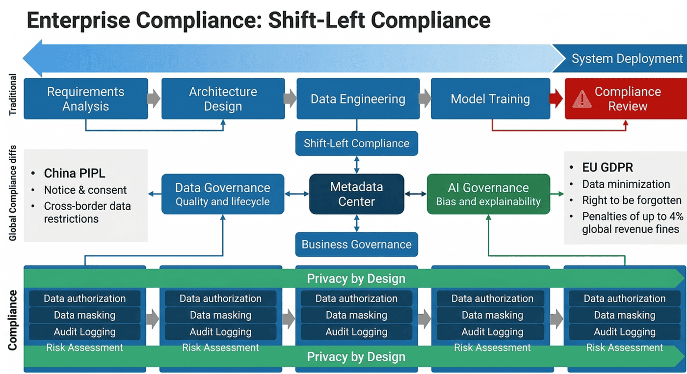
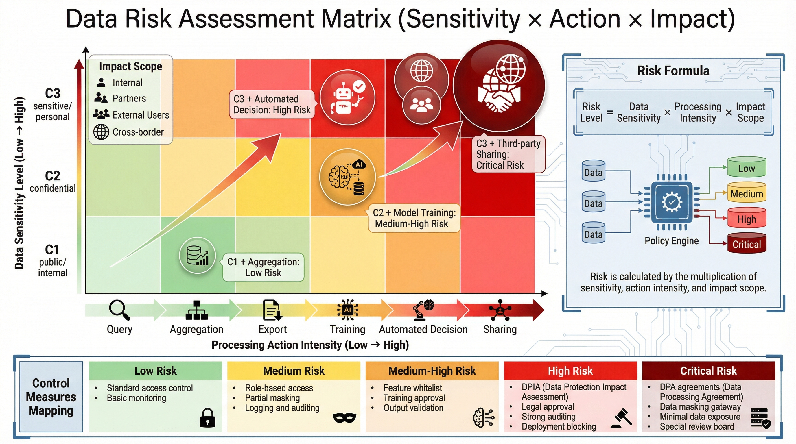
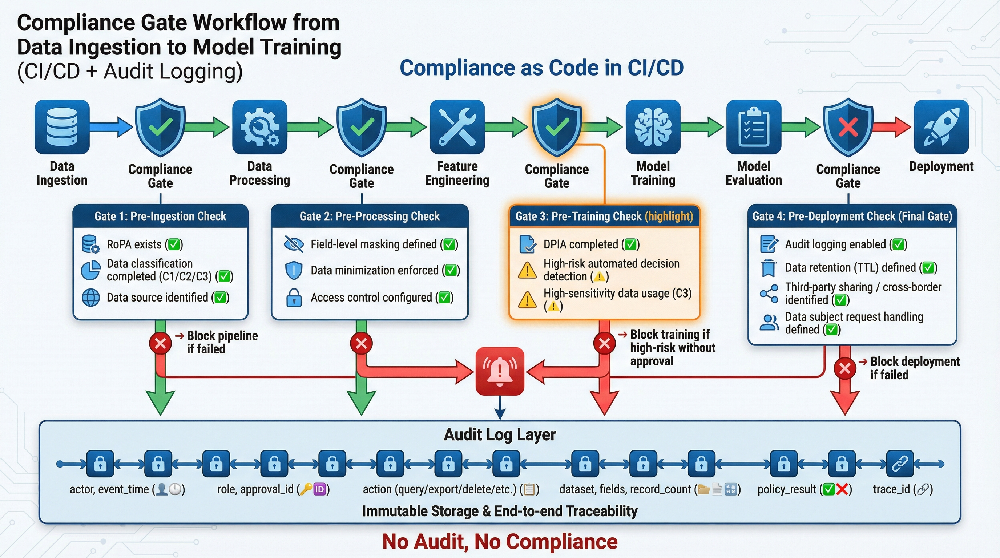
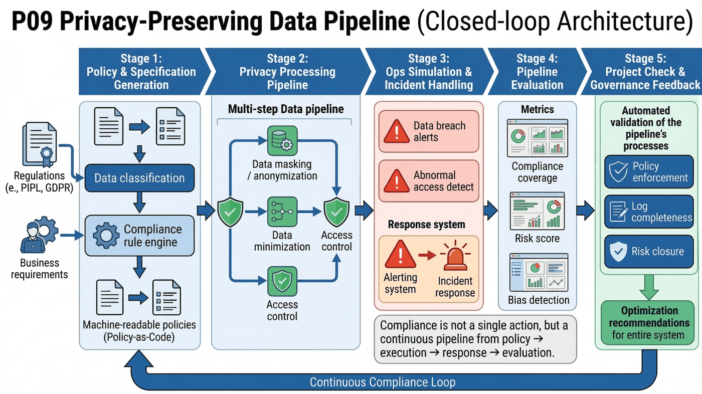
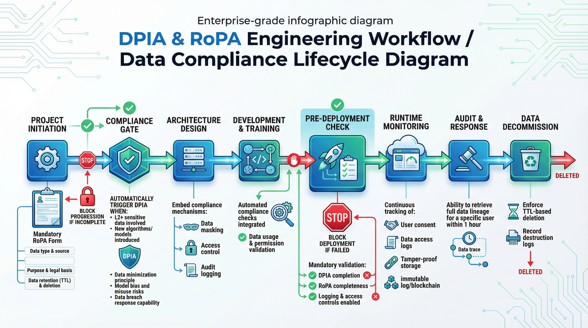
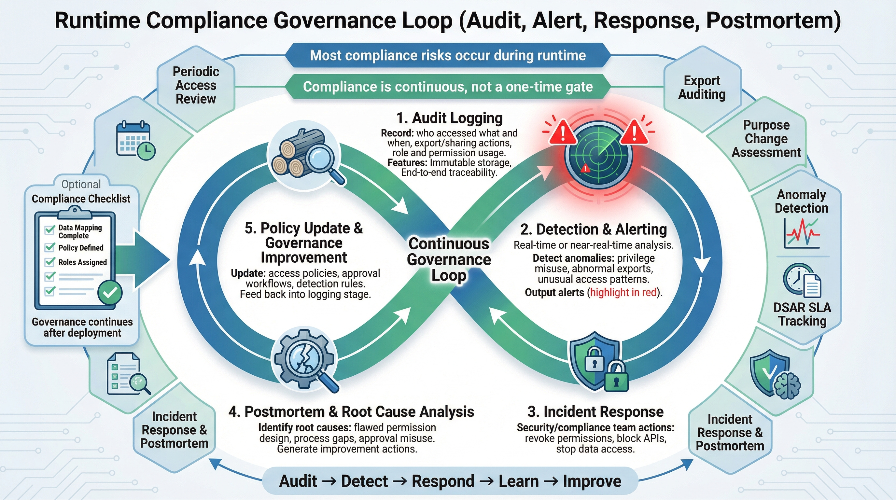
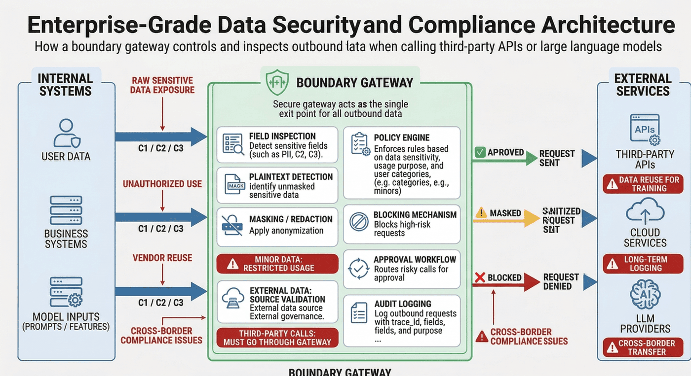
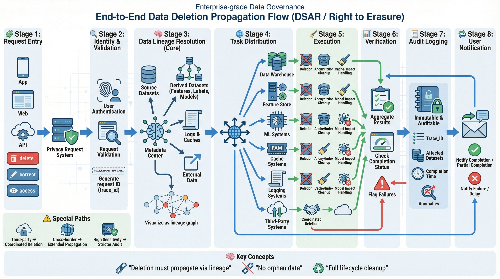

# 第九篇：隐私合规与数据安全

**篇前导读**
* **核心目标**：回答“数据能不能用、怎么用、用了是否可控”三大核心问题。
* **设计理念**：坚持合规与隐私保护“左移”，将其前置到系统架构与流程设计中（Privacy by Design）。
* **落地支撑**：以治理模板、门禁清单与最小治理链路为支撑，将制度规范、流程管控、自动化审计与工程实现打通，形成从需求到下线的合规治理闭环。

---

# 第27章：数据合规框架与治理

---

## 本章摘要

在数据驱动的时代，合规不再是法务部门在项目上线前盖的一个章，而是决定系统能否长期稳定运行的基础架构约束。很多系统在算法效果、业务转化、灰度表现上都已经达到上线标准，却在最终评审中因数据来源不清、授权边界模糊、日志留痕不全或敏感信息暴露而被紧急叫停。问题并不在于团队“不重视合规”，而在于合规要求长期被视为研发完成之后的审批附件，而不是系统设计之初就必须纳入的约束条件。

本章围绕一个核心命题展开：**数据合规的成本与修复难度，会随着项目生命周期的推进而快速上升**。因此，企业不能把合规当作一次性的法务审核动作，而必须把它嵌入到需求定义、数据建模、特征开发、模型训练、上线审批、审计留痕与下线销毁的全过程中。换言之，真正有效的合规，不是“出了问题后补文档”，而是“在系统还未形成惯性之前就把风险关口前移”。

本章将从四个层面建立完整框架。第一，解释为什么合规是一种系统约束，而不是审批附件，并说明 Privacy by Design 的工程意义。第二，建立面向业务系统的数据分类分级、风险评估矩阵与责任链条，使团队能够明确“有哪些数据”“谁对这些数据负责”“什么场景下可以用、怎么用、谁批准”。第三，围绕 RoPA、DPIA、审计留痕和 CI/CD 阶段的自动化拦截机制，说明合规要求如何真正变成工程流程的一部分。第四，抽取一条最小治理链路，展示治理配置、脱敏策略、权限控制、预检机制、事件响应与复盘闭环如何落到具体系统产物中。

与很多只停留在法规条文层面的内容不同，本章更关注“工程化治理”。我们不只是说明法规要求了什么，还会进一步讨论：如何在元数据中心里标注数据等级，如何通过策略文件约束数据进入分析域，如何利用流水线在上线前自动阻断高风险变更，如何通过日志与血缘支持审计回溯，如何为医疗、金融、未成年人、第三方处理与跨境传输等高风险场景设计专门的控制措施。通过这些内容，读者将建立一个更接近真实企业环境的数据合规治理图景。

---

## 学习目标（Learning Objectives）

通过本章学习，读者应能够：

* 理解为什么数据合规必须作为系统约束前移到需求、架构与研发阶段，而不能仅在上线前进行被动审批。
* 掌握数据分类分级的设计原则，能够区分低敏感、中敏感和高敏感数据，并为不同等级设计差异化的处理策略。
* 构建面向真实业务的数据风险评估矩阵，把数据级别、使用目的、处理动作与影响范围组合成可执行的风险判断逻辑。
* 设计清晰的责任链条，明确法务、业务、平台、算法、数据开发、安全与审计等角色在治理流程中的责任边界。
* 理解 RoPA、DPIA、审计留痕、同意管理、访问审批、数据保留与销毁机制在项目生命周期中的作用。
* 学会把合规要求嵌入研发流水线，在代码提交、配置变更、数据接入、模型训练和上线审批阶段实现自动化检查与阻断。
* 能够针对医疗、金融、未成年人、第三方处理和跨境传输等高风险场景提出专项治理策略。
* 理解合规治理如何通过配置文件、策略规则、日志产物与检查脚本落地执行。

---

## 场景引入

团队历时三个月研发的用户洞察与推荐系统准备在下周全量上线。业务侧对该模型带来的 20% 转化率提升寄予厚望，算法团队也对离线评估与灰度实验结果充满信心。然而，在周五的最终评审会上，法务与合规负责人按下了暂停键。

合规负责人连续提出三个问题。第一，系统使用了用户精准地理位置与近三个月浏览记录，这些数据的使用目的是否与用户授权一致。第二，数据湖中的测试集是否已经完成脱敏，为什么在某些调试日志里还能看到明文手机号。第三，如果用户请求注销账号并行使删除权，训练集中已经形成的特征和派生标签能否同步删除，还是只能删除主表中的原始记录。

会议室里一度陷入沉默。业务方认为自己只提出了“提升推荐效果”的需求；算法团队认为数据都是平台侧提供的；平台团队认为已经给出了基础权限能力；法务则指出，系统中根本没有完整记录“什么数据因为什么目的被谁使用”的台账。最后，项目不得不延期，团队开始重新梳理数据来源、清洗逻辑、脱敏链路与审批流程。

这个案例揭示了一个常见但代价极高的问题：**合规后置**。当一个系统的表结构、特征流程、训练管道和日志体系都已经成型后，再去补充授权、重构脱敏、增加审计留痕，往往意味着底层改造、历史数据重跑和跨团队流程重建。此时产生的成本，远高于系统设计之初做对治理边界的成本。

为了进一步说明问题，我们再看三个简化的失败案例。

### 案例一：推荐系统中的目的漂移

某内容推荐系统最初仅基于点击行为进行排序优化，后续为了提升广告转化，引入了设备标识、停留时长、交易记录与位置数据。项目早期的隐私政策只覆盖“改进服务体验”，并未覆盖“精准营销”和“自动化定价”。结果系统虽然技术上可运行，但在目的合法性上已经发生漂移。问题并不只是“多采了一些字段”，而是**使用目的发生变化时，授权与处理依据没有同步更新**。

### 案例二：测试环境中的脱敏失效

某团队在生产环境启用了手机号哈希和邮箱掩码，却在测试环境中为了排查问题，直接导入了生产快照。开发和测试人员拥有较宽的库表读取权限，日志系统也默认打印完整请求参数。最终，真正暴露敏感信息的并不是正式链路，而是测试环境与运维日志。这个案例说明，**制度合规如果没有技术强制，就会在灰色地带失效**。

### 案例三：模型删除请求无法闭环

某风控模型接到用户删除请求后，只删除了源表中的用户信息，却没有同步处理特征仓、训练样本集、离线快照、模型缓存和下游画像标签。对外看似完成了删除，对内却仍有历史副本残留。这个案例说明，**数据删除不只是表级删除，更是全链路删除能力的考验**。

### 场景背后的核心工程痛点（Core Engineering Pain Points）

从上述案例中，可以总结出现实工程中的四类痛点：

1. **合规滞后的极高代价**：一旦在系统后期才发现问题，往往伴随返工、延期、停摆与潜在处罚。
2. **权责边界模糊**：业务线想要数据，算法想要特征，平台侧提供能力，法务把关条文，但没有清晰的责任闭环。
3. **技术与制度脱节**：合规文档看起来完备，但没有元数据标注、脱敏引擎、策略校验、访问审计等技术抓手。
4. **生命周期不闭合**：从采集、加工、使用、共享、留存到删除，没有形成可验证、可回溯、可审计的闭环。

---

## 27.1 为什么合规是系统约束而不是审批附件

传统研发流程把合规审查放在接近上线的尾部位置。需求立项时先谈功能目标，开发时先做效果验证，上线前再请法务或合规团队做检查。这种模式在功能简单、数据敏感度低的系统里或许还能勉强工作，但在今天的数据驱动系统中已经越来越危险。

现代数据治理强调 **Privacy by Design（隐私保护设计）**。它的核心不是多做一轮审批，而是承认隐私与合规本身就是系统架构的一部分。数据库如何分层、日志打到哪里、特征是否可回溯、训练集如何清理、第三方 API 是否带出敏感字段，这些都不是“上线前补一个审批单”能解决的问题，而是必须在架构阶段就考虑的基础约束。

### 27.1.1 合规后置的代价

合规后置的代价主要体现在五个方面。

**第一，架构返工成本高。**  
如果系统已经广泛依赖某个敏感字段作为核心特征，那么后来发现该字段没有合法授权，意味着表结构、特征工程、模型训练和下游消费全都要调整。

**第二，历史数据回收困难。**  
当敏感数据已经进入训练集、画像系统、缓存层和报表链路时，再去补做删除、替换或重新训练，成本远高于初期限制使用范围。

**第三，跨团队协调成本指数上升。**  
项目越接近上线，参与方越多、依赖越复杂。此时引入合规整改，往往需要业务、算法、平台、法务、安全、测试与运维同时调整。

**第四，业务窗口期流失。**  
很多项目不是“不能改”，而是“来不及改”。当合规问题在上线前爆发，最直接的损失就是错过业务节奏与市场窗口。

**第五，审计与处罚风险陡增。**  
系统一旦上线并形成真实用户影响，再发现问题就不只是内部整改，而可能升级为外部投诉、审计检查或监管处罚。

为了帮助读者形成更直观的工程认识，可以把合规整改成本理解为一条随生命周期推进而快速抬升的曲线：在需求阶段修正一个不合理的数据字段，也许只是改一份文档；在训练阶段修正，则要重做数据清洗和特征开发；在上线后修正，则可能涉及回滚、解释、删数、补偿和对外沟通。

### 27.1.2 全球视野：合规基线差异

对于跨地区业务而言，合规要求并不是完全一致的。中国的 PIPL 强调“告知—同意”、敏感个人信息的单独同意以及数据出境的控制要求；欧洲 GDPR 强调数据最小化、删除权、可携权以及自动化决策的透明性。企业在不同区域运行同一业务时，不能假设“一套采集逻辑走天下”，而要在技术层具备差异化落地能力。

这意味着，系统设计不能只围绕“功能是否能跑通”，还必须围绕“地区规则差异如何映射到产品、数据和模型链路”。例如，同样是用户画像，在不同法域下可能对应不同的法律依据、保留期限、用户权利响应机制和共享限制。真正成熟的治理体系，不是让开发者去背诵所有法规条文，而是把这些差异沉淀到模板、策略、审批规则和默认行为中。

### 27.1.3 治理交汇点：数据、模型与业务的协同

合规不是孤立存在的。它是数据治理、模型治理与业务治理的交汇点。

* **数据治理**关注数据质量、元数据、血缘、生命周期和留存策略。
* **模型治理**关注特征来源、偏见风险、解释性、训练集边界和模型使用目的。
* **业务治理**关注业务目标、用户承诺、授权依据、对外披露与运营规则。

如果这三者分离，系统就会出现常见错位：业务要求新能力，模型迅速接入新特征，平台侧开放了可用接口，但没有人统一判断这条数据链路是否合规。只有通过统一的元数据管理中心、策略中心和审计中心，才能把这些原本散落在不同团队的要求联动起来。


*图27-1：合规左移策略 —— 展示合规审查如何从上线前置到需求分析与架构设计阶段*

### 27.1.4 传统流程与左移流程对比

下表用更工程化的方式说明两种流程的差异：

| 阶段 | 传统模式 | 左移治理模式 |
| :--- | :--- | :--- |
| 需求分析 | 关注业务功能，极少定义数据边界 | 明确数据类型、使用目的、授权依据与输出边界 |
| 架构设计 | 优先保证可用性与性能 | 同步定义分级、脱敏、审计、保留与删除机制 |
| 数据接入 | 先拉齐字段，后补说明 | 接入前完成登记、分类与合法性校验 |
| 特征开发 | 以效果为优先 | 限制高敏感字段直接进入训练与分析链路 |
| 测试与灰度 | 常以真实数据快照验证 | 测试环境默认去标识化，日志默认最小暴露 |
| 上线评审 | 临时拉法务审核 | 基于 RoPA、DPIA、预检报告和审计留痕审批 |
| 运行期 | 主要关注故障与性能 | 同时关注访问异常、导出风险、删除请求与事件响应 |

### 27.1.5 工程治理视角下的“默认安全”

从架构角度看，成熟的合规治理不是依赖所有人都自觉，而是建立“默认安全”的系统行为：

* 新接入数据集，默认无权限，必须显式申请。
* 敏感字段默认掩码展示，而不是“先明文，必要时再隐藏”。
* C2/C3 级数据默认不能直接进入外部 API 或大模型 Prompt。
* 测试环境默认不允许导入生产明文快照。
* 未登记用途的数据，默认不能进入模型训练链路。
* 缺失 RoPA、DPIA 或审批记录时，CI/CD 默认阻断上线。

这类默认行为的本质，是把合规从“人为提醒”升级为“系统护栏”。

---

## 27.2 法规映射、风险分级与责任链

如果说“合规左移”回答的是为什么合规必须前移，那么本节回答的是：**前移之后，团队具体要管理什么**。答案可以概括为三个问题：

1. 我们手里有哪些数据？
2. 这些数据在什么场景下能用？
3. 出了问题谁负责？

### 27.2.1 数据分类分级架构

并不是所有数据都值得用同样的强度治理。如果把所有数据都当作最高等级保护，系统会过度僵化，性能和迭代效率都会受到影响；但如果把所有数据都用统一的宽松标准处理，就会导致敏感数据暴露。因此，企业必须建立差异化的数据分类分级体系。

本章采用三层分级作为基础框架：

| 安全级别 | 定义与示例 | 处理要求 | 脱敏与加密策略 |
| :--- | :--- | :--- | :--- |
| **L3 高敏感（C3）** | 敏感个人信息（生物识别、医疗健康、精确位置）、核心商业机密（未公开财报） | 需用户单独同意；严禁未经脱敏进入分析域；法务一票否决 | 存储级强加密（AES-256）；展示时全脱敏；可用不可见（隐私计算） |
| **L2 中敏感（C2）** | 一般个人信息（姓名、手机号、设备 ID）、内部业务数据 | 纳入隐私政策；仅限授权人员与项目访问 | 传输加密；存储加密或哈希去标识化；部分掩码展示 |
| **L1 低敏感（C1）** | 公开数据、完全匿名化数据、聚合统计结果 | 常规访问控制；可用于广泛 BI 分析和模型训练 | 无特殊要求，按需存储 |

这个分级体系的价值，不只是帮助团队贴标签，而是为后续的权限策略、脱敏规则、审批流程、日志要求和保留期限提供统一依据。

### 27.2.2 从字段级、表级到场景级的多维分级

很多团队把“分级”理解为给一张表打一个整体标签，但真实系统往往更复杂：

* 同一张表中可能同时存在 C1、C2 与 C3 字段。
* 同一字段在不同场景下风险不同。
* 同一份数据在原始态、脱敏态和聚合态下等级可能不同。

因此，成熟的分级至少需要三个维度：

**字段级分级**：例如手机号、邮箱、身份证号、精确位置、银行卡号、病历号等字段应有明确标签。  
**表级分级**：例如用户主档、交易流水、行为日志、风控标签、客服录音等数据集应有整体等级基线。  
**场景级分级**：例如“用于模型训练”“用于客服检索”“用于 BI 报表”“用于对外接口”这些使用场景本身也会影响风险等级。

只有把这三个维度同时纳入，系统才能避免“同表不同字段、同字段不同用途”的判断混乱。

### 27.2.3 各等级数据的典型治理要求

#### 1. L1 低敏感数据

L1 数据通常是公开数据、匿名化数据或聚合统计结果。例如公共宏观指标、去标识后的区域级转化率、无个体可识别性的运营指标等。  
L1 数据通常可以在更广范围内流通，用于 BI 分析、模型调优、可视化看板和容量规划等场景。其治理重点在于基本的访问控制、数据质量保证和合理保留。

#### 2. L2 中敏感数据

L2 数据通常包括姓名、手机号、邮箱、设备 ID、员工编号、内部业务记录等一般个人信息或内部受限数据。  
此类数据不能随意导出，也不应在日志、测试环境和外部接口中明文暴露。治理重点包括加密、哈希去标识化、部分掩码展示、最小权限访问和用途受限。

#### 3. L3 高敏感数据

L3 数据包括生物识别、医疗健康、精确位置、金融账户、未公开商业机密等。  
这类数据一旦泄露，影响巨大，因此通常需要单独同意、严格审批、独立存储、强加密与更高标准的审计。默认情况下，L3 数据不应直接进入通用分析域，也不应被下游任意消费。

### 27.2.4 风险评估矩阵（Risk Assessment Matrix）

仅仅知道“数据是什么等级”还不够。一个字段的风险不是静态的，还取决于它被“用来做什么”和“怎么处理”。

例如：

* 使用 L3 数据进行自动化决策，属于高风险。
* 使用 L2 数据做内部分析且不对个体产生直接影响，属于中风险。
* 使用 L1 数据做系统稳定性监控，通常属于低风险。

因此，风险评估需要同时考虑以下维度：

1. **数据等级**：C1 / C2 / C3  
2. **使用目的**：服务履约、风控、推荐、营销、审计、研发测试等  
3. **处理动作**：查询、导出、训练、共享、推送、自动化决策  
4. **影响对象**：内部团队、合作方、外部用户、跨境接收方  
5. **结果影响**：是否会进一步影响用户权益、定价、画像、推荐、授信或账户状态  

归纳起来，上述维度可以压缩为一条更便于工程落地的判断逻辑：

```text
风险等级 = 数据敏感度 × 处理动作强度 × 业务影响范围
```

在工程实践中，这种逻辑往往最终会被编码为一个策略引擎：
当数据等级较高、处理动作较强、影响范围较广时，需要更多审批、更严格脱敏和更高等级审计。

### 27.2.5 风险矩阵示例

| 数据等级 | 使用目的  | 处理动作    | 风险等级 | 默认控制措施              |
| :--- | :---- | :------ | :--- | :------------------ |
| C1   | 稳定性监控 | 聚合查询    | 低    | 常规访问控制              |
| C2   | 内部分析  | 画像分析    | 中    | 角色授权、部分脱敏、访问留痕      |
| C2   | 模型训练  | 批量抽取    | 中高   | 特征白名单、训练审批、结果审查     |
| C3   | 自动化决策 | 训练/评分   | 高    | DPIA、法务审批、强审计、上线阻断  |
| C3   | 第三方共享 | 导出/接口调用 | 极高   | DPA、脱敏网关、最小字段集、专项评估 |


*图27-4：数据分级、用途和处理动作构成的风险矩阵图*

### 27.2.6 责任链条构建（RACI Matrix）

没有清晰的责任链，再好的规则也会在执行中失真。治理体系必须把“谁负责提出需求、谁负责判断合法性、谁负责提供技术控制、谁负责使用过程合规、谁负责审计复核”明确下来。

下表给出一个典型的 RACI 设计：

| 角色      | 主要职责                  | RACI                 |
| :------ | :-------------------- | :------------------- |
| 法务/合规   | 解释法规、设定红线、审批高风险场景     | Accountable          |
| 业务方     | 说明使用目的、业务必要性与用户承诺     | Responsible          |
| 平台/基础架构 | 提供分级、脱敏、权限、审计与血缘能力    | Responsible          |
| 算法/数据开发 | 在授权范围内开发特征、训练模型与消费数据  | Consulted / Informed |
| 安全团队    | 检查边界安全、审计策略、异常访问与导出风险 | Consulted            |
| 审计/内控   | 定期复核留痕、流程执行与整改闭环      | Informed / Consulted |

### 27.2.7 责任链落地中的常见误区

实际落地时，团队常犯三种错误：

**误区一：把合规责任全部推给法务。**
法务可以解释边界，但不能替代业务澄清目的，也不能替代平台实现控制。

**误区二：把技术控制全部推给平台。**
平台能提供能力，但如果业务和算法不申报真实用途，平台并不知道哪些使用行为不合理。

**误区三：认为“有审批就等于合规”。**
审批只是一个节点，真正关键的是审批前的信息是否完整、审批后的行为是否可验证，以及运行期是否能持续发现偏离。

### 27.2.8 从制度文本到系统标签

成熟团队会把责任链映射为系统中的实际对象：

* 业务 owner → 项目 owner 字段
* 合规审批人 → 审批节点与工单流
* 数据 owner → 数据集元数据管理
* 使用目的 → RoPA 表单字段
* 使用权限 → RBAC/ABAC 策略
* 风险等级 → 预检规则参数
* 访问留痕 → 审计日志事件

这一步非常关键，因为只有当制度语言进入系统元数据，合规才真正具备自动化执行的可能。

---

## 27.3 项目立项、评审与上线前检查

合规治理如果要真正成为研发的一部分，就不能只停留在原则层，而必须变成清晰的流程节点。项目从立项到下线，至少要回答六个问题：

1. 这项处理活动是否被登记？
2. 这项处理是否有合法依据？
3. 涉及哪些等级的数据？
4. 是否做过风险评估？
5. 是否具备审计与删除能力？
6. 是否达到上线门槛？

### 27.3.1 建立 RoPA（处理活动记录）

**RoPA（Record of Processing Activities）** 是处理活动的总账本。它不是一份为了审计才临时填写的表格，而是数据使用的系统化登记。

每个项目在申请接入数据、训练模型或开放接口前，都应填写至少以下信息：

1. 数据类型与来源（第一方、第三方、公开数据）
2. 使用目的与法律依据
3. 涉及的系统、表、字段与输出对象
4. 数据保留期限（TTL）与销毁机制
5. 是否包含敏感数据、是否涉及第三方或跨境传输
6. 数据 owner、项目 owner、审批人和使用团队

RoPA 的价值在于：没有它，团队永远说不清“哪些数据是因为什么理由被谁使用”。而一旦出现投诉、审计或删除请求，没有台账就无法定位链路。

#### RoPA 最小表单设计示例

| 字段                | 说明        |
| :---------------- | :-------- |
| project_id        | 项目唯一编号    |
| owner             | 项目负责人     |
| system_name       | 系统名称      |
| data_sources      | 数据来源与表名   |
| purpose           | 使用目的      |
| legal_basis       | 法律依据或授权依据 |
| data_level        | 数据等级      |
| retention_days    | 保留期限      |
| third_party_share | 是否共享给第三方  |
| cross_border      | 是否涉及跨境    |
| deletion_path     | 删除路径说明    |
| audit_required    | 是否强制审计    |
| approval_chain    | 审批链路      |

#### RoPA 的工程化要求

在成熟平台中，RoPA 不应该是线下 Excel，而应具备以下特征：

* 通过系统表单提交并版本化存储
* 与项目代码仓、数据集元数据和审批工单关联
* 支持字段级与表级自动校验
* 与 CI/CD 流水线联动，缺失关键信息时阻断上线
* 可追溯历史变更，满足审计要求

### 27.3.2 执行 DPIA（数据保护影响评估）

当项目涉及中高敏感数据、新的处理方式、自动化决策或高影响场景时，仅有 RoPA 还不够，需要进一步进行 **DPIA（Data Protection Impact Assessment）**。

DPIA 的核心不是“写一篇长报告”，而是系统性回答以下问题：

* 是否真的有必要收集这些数据？
* 这些数据是否超出了原始授权范围？
* 处理结果是否会对用户造成显著影响？
* 是否存在歧视、滥用、越界画像或误判风险？
* 如果发生泄露、误用或越权访问，系统是否有响应和止损能力？

#### DPIA 的典型评估步骤

**第一步：识别处理活动。**
明确数据来源、处理目的、主要参与系统与输出结果。

**第二步：识别风险点。**
包括数据过采、目的漂移、第三方泄露、模型偏见、日志暴露、删除不闭环等。

**第三步：评估必要性与比例性。**
判断字段是否最小必要，处理方式是否与业务目的相匹配。

**第四步：设计控制措施。**
例如字段删减、默认脱敏、强审计、访问审批、模型可解释性说明、删除链路补强等。

**第五步：形成审批结论。**
给出可上线、需整改后上线或禁止上线的明确结论。

#### DPIA 风险评分示例

| 维度    | 评分说明                     |
| :---- | :----------------------- |
| 数据敏感度 | C1=1，C2=2，C3=3           |
| 使用强度  | 查询=1，分析=2，训练/自动决策=3      |
| 扩散范围  | 内部单团队=1，多团队共享=2，第三方/跨境=3 |
| 权益影响  | 无直接影响=1，间接影响=2，直接影响=3    |

总分越高，意味着控制要求越严。例如总分 8 分以上可强制触发法务审批与上线阻断。

### 27.3.3 最小必要原则与字段瘦身

很多治理失败并不是因为控制措施不足，而是因为一开始就采了太多不必要的数据。
“最小必要原则”要求团队持续追问：

* 这个字段是否真的必要？
* 是否可以用更低敏感度字段替代？
* 是否可以先聚合再用，而不是直接用明细？
* 是否可以只保留短期窗口，而不是长期留存？

在工程中，最小必要原则的落地方式包括：

* 字段白名单而不是全表开放
* 训练特征集与原始明细隔离
* 时间窗口裁剪
* 默认不保留原始标识符
* 聚合后下发，而非明细外放

### 27.3.4 同意管理、授权范围与目的绑定

很多数据争议不是“数据本身违法”，而是“数据用途超出了最初告知”。因此，系统需要把授权与用途真正绑定起来。

这意味着：

* 用户授权版本应可追踪
* 每个用途应能映射到明确的处理活动
* 用途变更时需要重新评估
* 不能把“改进体验”笼统覆盖到所有业务场景
* 对敏感数据、高风险画像、自动化决策要有更高等级的授权与说明机制

从系统角度看，同意管理至少应保留：用户 ID、授权版本、授权时间、用途范围、撤回状态、适用产品线与有效期。

### 27.3.5 审计准备与合规留痕

任何制度如果没有留痕，最终都很难自证执行。
因此，授权记录、审批工单、访问日志、导出记录、策略命中、预检结果与删除执行结果，都应具备防篡改存储和可追溯能力。

一个成熟的审计体系至少需要记录以下事件：

* 谁在什么时间访问了什么数据
* 访问使用了什么角色和审批依据
* 访问涉及哪些字段和多少条记录
* 是否发生导出、下载或共享
* 是否命中脱敏、阻断或告警规则
* 是否有针对指定用户的删除、纠正或查询请求
* 请求在多长时间内被完成

#### 审计日志设计示例

| 字段            | 说明             |
| :------------ | :------------- |
| event_time    | 事件时间           |
| actor         | 操作主体           |
| role          | 所用角色           |
| action        | 查询、导出、更新、删除、共享 |
| dataset       | 数据集名称          |
| fields        | 涉及字段           |
| record_count  | 记录数            |
| purpose       | 使用目的           |
| approval_id   | 对应审批单          |
| policy_result | 允许、脱敏后允许、阻断    |
| trace_id      | 链路追踪 ID        |

### 27.3.6 上线前检查：把合规嵌入 CI/CD

很多团队真正的分水岭，不在于是否写了制度，而在于是否把制度变成上线前的自动化门槛。

典型的 CI/CD 合规预检应包括：

* 是否存在有效 RoPA
* 是否存在必需的 DPIA
* 是否完成数据分级
* 是否具备字段级脱敏规则
* 是否配置访问权限与角色边界
* 是否具备审计日志输出
* 是否定义数据保留期限与销毁机制
* 是否识别第三方共享与跨境传输
* 是否配置删除请求处理路径
* 是否通过测试环境脱敏检查

当任意高风险项缺失时，流水线应阻断构建、阻断部署或阻断训练任务执行。


*图27-5：从数据接入到模型训练的合规门禁流程图*

### 27.3.7 治理流水线：从文档要求走向系统执行

当合规要求进入工程阶段后，治理对象不能只停留在制度文本里，而需要被组织成可执行流水线。一个最小治理链路通常包含以下步骤：

1. 生成隐私规格与策略
2. 执行隐私处理流水线
3. 模拟运维与事件处理
4. 评估隐私流水线
5. 运行项目检查

这一链路反映了一个关键事实：**合规不是单点动作，而是一条从策略生成、数据处理、告警响应到评估验证的流水线**。


*图27-3：隐私规格与策略生成流程图*

### 27.3.8 治理指标如何转化为工程语言

治理指标的价值，不在于样本规模本身，而在于它是否能够说明识别、处理、门禁、告警和检查链路已经形成闭环。例如：

* 原始记录 8 条，restricted 记录 7 条，说明系统确实识别并隔离了大部分受限数据。
* 直接 PII 去除率 100%，说明脱敏逻辑至少覆盖了样本中的直接身份标识。
* preflight pass rate 100%，说明上线前的检查链路已形成明确门槛。
* 告警解决率 100%，说明告警不是“看见了但没人管”，而是进入闭环处理。
* 总检查项 13 项且全部通过，说明当前规则、产物与检查逻辑在样本范围内是自洽的。

这类指标的意义，不在于绝对数值多大，而在于它们把合规治理从抽象理念转成了可检查、可复盘、可持续运行的系统行为。


*图27-2：数据合规生命周期 —— 从业务立项到下线的自动化拦截与审计流程*

### 27.3.9 合规上线门禁清单（示例）

下面给出一个可直接用于项目评审的上线前门禁清单。为了便于评审和责任分配，建议按四类逐项确认：

**一、治理与审批**

- ☐ 已完成 RoPA 登记并通过审批
- ☐ 已完成必要的 DPIA
- ☐ 已完成上线审批留痕

**二、数据与环境隔离**

- ☐ 已完成数据分类分级并绑定字段标签
- ☐ 训练集/分析集已与原始敏感数据隔离
- ☐ 测试环境无明文敏感数据快照

**三、访问控制与审计留痕**

- ☐ 日志中不打印直接身份标识
- ☐ 已配置角色权限与最小访问边界
- ☐ 已接入审计日志与异常访问告警

**四、生命周期与发布控制**

- ☐ 已配置数据保留期限与销毁机制
- ☐ 已配置删除请求的全链路处理路径
- ☐ 已识别第三方共享与跨境流转风险
- ☐ 已通过 CI/CD 合规预检

### 27.3.10 运行期治理不是上线后的附加项

很多团队把上线前治理做得不错，但上线后很快松散下来。事实上，真正的风险往往发生在运行期：

* 新人加入团队后权限没有收敛
* 新需求接入时复用老审批但用途已改变
* 第三方接口调用范围逐渐扩大
* 数据导出、报表分享和日志排查成为新的泄露入口
* 删除请求、整改要求和审计问询在运行期才集中出现

因此，运行期治理要包括：

* 周期性权限回顾
* 导出行为审计
* 新用途变更评估
* 异常访问检测
* 删除请求 SLA 追踪
* 事故响应与 postmortem 机制


*图27-6：审计日志、告警、事件响应与复盘闭环图*

---

## 27.4 高风险场景治理

并不是所有场景都需要同样强度的治理。某些领域天然带有更高的敏感度和更复杂的责任边界，因此必须设计专门的控制措施。

### 27.4.1 医疗与金融：强监管行业的基础控制

医疗与金融场景的共同特征是：数据高度敏感、误用成本极高、监管要求严格、用户信任脆弱。

#### 医疗场景

医疗数据通常包括病历、检验结果、健康指标、生理特征、用药历史、就诊记录等。这些数据不仅属于高度敏感个人信息，而且常常会与身份、家庭、保险与财务信息交叉关联。

因此，医疗场景应重点控制：

* 原始健康数据与行为日志分区存储
* 敏感字段强加密与细粒度访问控制
* 医疗明细默认不进入通用分析域
* 对外共享前必须去标识化与最小字段化
* 审计日志必须覆盖访问、导出与共享行为
* 删除与更正请求需要联动多系统执行

#### 金融场景

金融场景中常见的敏感数据包括银行卡号、交易流水、授信记录、还款行为、设备风险标签与风控评分。
在这类系统里，自动化决策往往会直接影响用户授信、支付、定价或账户状态，因此除了数据保护，还要关注模型解释性、公平性和误判纠正机制。

金融场景的专项控制通常包括：

* 高敏感账户信息与普通行为日志隔离
* 模型输入特征可追踪、可解释、可删除
* 人工复核机制覆盖高影响决策
* 风险标签与原始凭证可关联回溯
* 异常访问、导出和批量查询重点告警

### 27.4.2 未成年人数据治理

未成年人数据治理的重点，不只是“多一个勾选框”，而是围绕保护性原则重构整个数据处理方式。

需要重点考虑：

* 独立的监护人同意与撤回机制
* 更严格的数据最小化原则
* 禁止或严格限制商业化推荐与深度画像
* 更短的保留周期
* 更强的默认隐私保护
* 更易理解的告知与说明方式

在工程设计上，可以通过“年龄段分层 + 特殊标签 + 特殊用途限制”的方式实现。例如，一旦识别为未成年人账户，某些推荐、营销、画像与第三方共享链路应默认关闭或进入更高等级审批。

### 27.4.3 外采数据与供应链风险

企业使用的数据并不总是全部自产。很多项目会引入外部供应商、合作方数据集或公共数据源。
在这种情况下，最大的风险往往不是字段本身，而是**来源合法性不清、授权链条不透明、用途承诺不一致**。

治理要求包括：

* 核验数据来源和收集依据
* 审查供应商是否有合法授权与转授权能力
* 签订 DPA（数据处理协议）与安全条款
* 明确责任划分、泄露通报和删除协同义务
* 对外部数据设置独立标签与用途限制

### 27.4.4 委托处理与第三方 API 风险

越来越多企业把部分处理能力交给外部云服务、外部模型或第三方 API。风险在于，团队很容易把“调用一个服务”误以为只是技术集成，而忽视其本质上是一次数据外送或委托处理。

典型风险包括：

* 在 Prompt 或请求体中直接带入明文 C2/C3 数据
* 供应商把请求内容用于训练或二次处理
* 请求日志在第三方平台长期留存
* 响应结果包含不应回传的敏感信息
* 第三方服务部署地与数据本地化要求冲突

因此，必须建立边界网关，在请求出域前自动做以下动作：

* 字段检测
* 明文识别
* 脱敏替换
* 规则命中阻断
* 请求留痕
* 高风险调用审批


*图27-7：第三方 API / 大模型调用边界网关图*

### 27.4.5 跨境传输治理

跨境传输的核心难点在于：一份数据一旦离开原有法域，其后续处理、留存、共享与审计都可能变得更复杂。
因此，跨境治理不应只在合同层解决，而应在系统层同时做到：

* 标注跨境流转路径
* 控制最小字段集
* 优先使用脱敏或匿名化结果
* 明确接收方角色、用途与保留期限
* 为跨境事件保留专项审计记录
* 对高敏感数据建立更严格的出境审批流程

### 27.4.6 大模型时代的新风险：Prompt 合规

在生成式 AI 应用中，新的风险边界来自 Prompt、上下文拼接与外部知识调用。
很多团队在实现智能客服、检索增强生成、摘要与洞察时，会不经意间把明文手机号、身份证号、病历详情、内部票据或完整交易信息带入模型上下文。

治理重点包括：

* Prompt 输入字段白名单
* 高敏感字段自动脱敏
* 外部大模型调用的上下文过滤
* 模型日志与会话记录的留存控制
* 对可复现输出进行审计与抽检
* 对含个人信息的知识库建立更高等级访问控制

### 27.4.7 高风险场景治理总表

| 场景         | 主要风险           | 核心控制措施               |
| :--------- | :------------- | :------------------- |
| 医疗         | 健康数据泄露、用途漂移    | 独立加密区、细粒度权限、强审计      |
| 金融         | 自动化决策误判、账户信息暴露 | 特征可追踪、人工复核、导出审计      |
| 未成年人       | 同意不足、商业化过度     | 监护人机制、用途限制、短保留期      |
| 外采数据       | 来源不合法、责任不清     | 来源核验、DPA、用途绑定        |
| 第三方 API    | 明文出域、日志残留      | 边界网关、脱敏、调用留痕         |
| 跨境传输       | 出境后控制力弱        | 最小字段集、专项审批、专项审计      |
| 大模型 Prompt | 敏感信息进入上下文      | Prompt 过滤、字段白名单、会话留痕 |

---

## 27.5 案例与治理模板

前面的章节说明了原则、方法和流程，本节则进一步给出可以直接落到工程中的治理模板。模板的价值在于：它把抽象制度变成可维护、可审查、可自动校验的配置对象。

### 27.5.1 治理工具箱：RoPA 声明配置（YAML 示例）

在平台侧，要求每个数据应用上线前，在代码仓中提交类似如下的合规配置文件，由 CI/CD 管道自动拉取并校验：

```yaml
# P09-User-Insight-Model RoPA Declaration
project_id: "P09-001"
project_name: "P09-User-Insight-Model"
owner: "algo_team_a"
biz_owner: "growth_recommendation_team"
legal_owner: "compliance_office"
data_usage_purpose: "User behavioral insight and recommendation"
legal_basis: "User Consent (v2.1 Terms of Service)"
processing_activity_type: "model_training_and_internal_analysis"
regions: ["CN"]
contains_sensitive_personal_info: true
requires_dpia: true
third_party_processing: false
cross_border_transfer: false
retention_days: 180
deletion_sla_days: 15

data_categories:
  - table: "dwd_user_behavior_log"
    level: "C1"
    fields:
      - "click_event"
      - "item_id"
      - "timestamp"
    purpose: "recommendation_feature_generation"
    retention_days: 180
    export_allowed: false

  - table: "dim_user_profile"
    level: "C2"
    fields:
      - "hashed_phone"
      - "age_band"
      - "province"
    purpose: "feature_enrichment"
    retention_days: 365
    anonymization_strategy: "K-Anonymity"
    export_allowed: false

  - table: "user_precise_location"
    level: "C3"
    fields:
      - "lng"
      - "lat"
      - "geo_hash_12"
    purpose: "high_risk_feature_candidate"
    retention_days: 30
    export_allowed: false
    legal_manual_approval_required: true

access_roles:
  - role: "algo_reader"
    datasets: ["dwd_user_behavior_log", "dim_user_profile"]
    action_scope: ["read_masked", "feature_compute"]
  - role: "platform_admin"
    datasets: ["*"]
    action_scope: ["policy_admin", "audit_read"]
  - role: "security_auditor"
    datasets: ["audit_log"]
    action_scope: ["read"]

controls:
  audit_log_required: true
  lineage_tracking_required: true
  pii_scan_required: true
  test_env_plaintext_forbidden: true
  prompt_plaintext_c2_c3_forbidden: true

pipeline_gate:
  block_if_missing_dpia: true
  block_if_unapproved_c3_usage: true
  block_if_retention_undefined: true
  block_if_deletion_path_missing: true
```


*图27-8：用户删除请求的全链路传播与清理示意图*

### 27.5.2 数据分类策略（JSON 示例）

```json
{
  "policy_name": "p09_classification_policy",
  "version": "1.0.0",
  "levels": {
    "C1": {
      "description": "公开数据或完全匿名化数据",
      "default_controls": ["rbac_basic", "standard_logging"]
    },
    "C2": {
      "description": "一般个人信息和内部业务数据",
      "default_controls": ["rbac_strict", "masked_display", "encrypted_storage", "audit_required"]
    },
    "C3": {
      "description": "敏感个人信息和核心商业机密",
      "default_controls": ["legal_approval", "strong_encryption", "isolation_zone", "full_audit", "export_block"]
    }
  },
  "field_rules": [
    {
      "match": ["phone", "mobile", "email", "device_id"],
      "level": "C2",
      "masking": "partial_mask"
    },
    {
      "match": ["bank_account", "patient_id", "biometric", "precise_location"],
      "level": "C3",
      "masking": "full_mask"
    }
  ],
  "usage_constraints": [
    {
      "level": "C3",
      "forbid": ["external_prompt_plaintext", "test_env_plaintext", "open_export"]
    }
  ]
}
```

### 27.5.3 访问控制策略（YAML 示例）

```yaml
policy_id: "p09_access_policy"
version: "1.2.0"

roles:
  - name: "algo_reader"
    allowed_levels: ["C1", "C2"]
    restrictions:
      - "cannot_export_raw"
      - "cannot_access_c3"
      - "must_use_masked_view"

  - name: "risk_reviewer"
    allowed_levels: ["C1", "C2", "C3"]
    restrictions:
      - "approval_ticket_required"
      - "session_recording_required"

  - name: "security_auditor"
    allowed_levels: ["audit_only"]
    restrictions:
      - "read_only"

approval_rules:
  - if:
      action: "export"
      level: "C2"
    then:
      approvals_required: 2
      approvers: ["data_owner", "security_owner"]

  - if:
      action: "read"
      level: "C3"
    then:
      approvals_required: 2
      approvers: ["legal_owner", "platform_owner"]

  - if:
      action: "external_api_call"
      level_includes: ["C2", "C3"]
    then:
      gateway_scan_required: true
      plaintext_forbidden: true
```

### 27.5.4 DPIA 模板（Markdown 表单示例）

```md
# DPIA Assessment Form

## 1. 基本信息
- 项目名称：
- 项目编号：
- 业务负责人：
- 技术负责人：
- 合规负责人：
- 评估日期：

## 2. 处理活动说明
- 涉及数据来源：
- 涉及数据字段：
- 数据等级：
- 处理目的：
- 输出对象：
- 是否涉及自动化决策：

## 3. 必要性与比例性
- 当前字段是否最小必要：
- 是否存在低敏感替代字段：
- 是否存在过度收集风险：
- 是否存在用途漂移风险：

## 4. 风险识别
- 泄露风险：
- 越权访问风险：
- 第三方共享风险：
- 模型偏见风险：
- 删除不闭环风险：
- 日志暴露风险：

## 5. 控制措施
- 字段裁剪：
- 默认脱敏：
- 审批机制：
- 审计留痕：
- 测试环境隔离：
- 外部调用网关：

## 6. 评估结论
- [ ] 可上线
- [ ] 整改后可上线
- [ ] 禁止上线

## 7. 整改项与责任人
| 整改项 | 责任人 | 截止日期 | 状态 |
| :--- | :--- | :--- | :--- |
|  |  |  |  |
```

### 27.5.5 审计日志结构（JSONL 示例）

```json
{"event_time":"2026-03-10T10:15:01Z","actor":"algo_user_a","role":"algo_reader","action":"query","dataset":"dim_user_profile_masked","fields":["hashed_phone","age_band"],"record_count":200,"purpose":"feature_validation","approval_id":"APR-1029","policy_result":"allow_masked","trace_id":"trace-001"}
{"event_time":"2026-03-10T10:22:48Z","actor":"platform_job_17","role":"pipeline_runner","action":"preflight_check","dataset":"p09_release_bundle","fields":[],"record_count":0,"purpose":"deployment_gate","approval_id":"N/A","policy_result":"pass","trace_id":"trace-002"}
{"event_time":"2026-03-10T10:29:11Z","actor":"external_gateway","role":"api_gateway","action":"external_api_call","dataset":"prompt_payload","fields":["masked_phone","case_summary"],"record_count":1,"purpose":"assisted_summary","approval_id":"APR-1081","policy_result":"allow_after_redaction","trace_id":"trace-003"}
{"event_time":"2026-03-10T10:33:56Z","actor":"ops_user_b","role":"ops_admin","action":"export","dataset":"user_precise_location","fields":["geo_hash_12"],"record_count":50,"purpose":"troubleshooting","approval_id":"APR-1099","policy_result":"blocked","trace_id":"trace-004"}
```

### 27.5.6 预检清单（JSON 示例）

```json
{
  "project_id": "P09-001",
  "preflight_version": "1.0.0",
  "checks": [
    {"name": "ropa_exists", "status": "PASS"},
    {"name": "classification_policy_exists", "status": "PASS"},
    {"name": "access_policy_exists", "status": "PASS"},
    {"name": "pii_rules_loaded", "status": "PASS"},
    {"name": "restricted_records_quarantined", "status": "PASS"},
    {"name": "redacted_records_remove_direct_pii", "status": "PASS"},
    {"name": "audit_log_enabled", "status": "PASS"},
    {"name": "incident_simulation_exists", "status": "PASS"},
    {"name": "postmortem_template_exists", "status": "PASS"},
    {"name": "deletion_path_declared", "status": "PASS"},
    {"name": "external_prompt_plaintext_block", "status": "PASS"},
    {"name": "cross_border_flag_reviewed", "status": "PASS"},
    {"name": "release_gate", "status": "PASS"}
  ],
  "overall_status": "PASS"
}
```

### 27.5.7 事故响应与复盘模板

```md
# Privacy Incident Postmortem

## 1. 事件概述
- 事件编号：
- 发现时间：
- 结束时间：
- 影响范围：
- 事件等级：

## 2. 触发原因
- 直接原因：
- 根本原因：
- 是否涉及流程缺失：
- 是否涉及权限配置错误：

## 3. 影响分析
- 涉及数据集：
- 涉及字段：
- 涉及记录数：
- 是否外泄：
- 是否影响用户权益：

## 4. 处置过程
- 告警时间线：
- 阻断动作：
- 临时缓解措施：
- 永久修复措施：

## 5. 责任与改进
| 问题 | 责任团队 | 改进措施 | 完成时间 |
| :--- | :--- | :--- | :--- |
|  |  |  |  |

## 6. 后续检查
- [ ] 策略已更新
- [ ] 权限已收敛
- [ ] 审计规则已补充
- [ ] 文档已更新
- [ ] 相关项目已同步排查
```

### 27.5.8 治理交付物映射（样例）

为了说明治理模板不是纸面设计，下表以一条隐私治理流水线的常见产物为例，展示交付物如何映射到对应治理能力：

| 交付物                           | 治理含义      |
| :---------------------------- | :-------- |
| `compliance_scope.json`       | 定义合规范围    |
| `classification_policy.json`  | 定义分级策略    |
| `access_policy.json`          | 定义访问与权限边界 |
| `privacy_tech_options.json`   | 定义隐私技术选项  |
| `raw_sensitive_records.jsonl` | 原始敏感样本    |
| `classified_records.jsonl`    | 分类结果      |
| `redacted_records.jsonl`      | 脱敏结果      |
| `quarantine_records.jsonl`    | 隔离结果      |
| `audit_log.jsonl`             | 审计留痕      |
| `access_alerts.jsonl`         | 异常访问告警    |
| `isolation_plan.json`         | 隔离策略      |
| `preflight_checklist.json`    | 上线前门禁检查   |
| `incident_simulation.json`    | 事件模拟      |
| `postmortem_report.json`      | 事故复盘      |
| `p9_metrics.json`             | 指标汇总      |
| `p9_test_results.json`        | 检查结果      |
| `p9_test_report.md`           | 测试报告      |

### 27.5.9 从模板到平台：治理系统的演进路径

很多组织一开始无法一次性建设完整平台，因此可以按以下节奏演进：

**第一阶段：模板化治理**
先统一 RoPA 模板、DPIA 模板、分级标准和上线检查单。

**第二阶段：配置化治理**
把模板转为 YAML/JSON 策略，纳入代码仓和版本管理。

**第三阶段：自动化治理**
通过 CI/CD、数据网关、日志系统和审计平台实现自动检查、自动阻断与自动告警。

**第四阶段：平台化治理**
将元数据、权限、策略、审批、留痕和事件响应统一到一个治理平台中，实现全局可见与跨项目复用。

---

## 27.6 治理落地的最小链路

前文已经展示了治理框架、门禁模板与交付物映射。本节不再展开完整项目细节，而是抽取一条可复用的最小治理链路，说明合规要求如何在系统中串联。

### 27.6.1 规格与范围定义

治理链路的起点不是处理脚本，而是范围、分类、访问边界与技术选项的结构化定义。只有先把用途、数据级别、角色边界和可用技术明确下来，后续处理才有可执行依据。

这一步关注的是：**敏感数据怎样在进入训练或分析系统之前被识别、限制、改写、审计和验证**。它决定了后续流水线究竟是在执行规则，还是只是在事后补救。

### 27.6.2 分类、脱敏与隔离

原始敏感记录进入系统后，需要先被分类，再根据策略进行脱敏、隔离或阻断。这里最关键的不是“改写几个字段”，而是把数据从原始可见态转成受控可用态，并保留后续审计所需的判断依据。

这一阶段至少要回答四个问题：

* 系统如何识别直接 PII？
* 哪些记录被判定为 restricted？
* 哪些字段可保留用于分析，哪些必须去除？
* 哪些数据只能进入隔离区，不能进入通用处理区？

### 27.6.3 审计、告警与门禁

治理链路不能停在离线处理。系统还需要记录访问、输出告警、执行预检，并把异常纳入事件响应和复盘流程。

这一阶段补齐的是“系统如何解释自己的行为”：

* 审计日志输出
* 异常访问告警
* 预检结果校验
* 事件模拟
* 事故复盘

没有这些能力，治理体系就很难支撑上线审批、异常追踪和事后审计。

### 27.6.4 指标与验收

治理指标的作用不是追求大样本，而是确认闭环是否成立。下面这些指标分别对应识别、处理、发布和审计四类能力：

* 总检查项 13 项
* 全部通过
* 覆盖命令级检查与数据/产物级检查

如果这些指标能够稳定生成并持续通过，说明治理体系已经从文档要求进入可运行的检查逻辑。

### 27.6.5 与项目型章节的分工

治理章节的重点是框架、模板、门禁与验收逻辑，项目型章节则更适合展开具体的脚本组织、数据目录、运行接口和扩展路径。这样的分工有两个好处：

* 治理章节保持通用性，便于迁移到不同业务系统。
* 项目章节保留实现细节，便于单独展开数据产物和工程演进。

像 P09 这样的项目型流水线，更适合在独立项目章节中完整展开；而在本章中，它更适合作为治理模板落地后的一个轻量样板。

---

## 27.7 从合规框架到组织能力：落地建议

治理体系的真正难点，不在于写出一套漂亮框架，而在于跨团队协同持续执行。下面给出一组面向组织落地的建议。

### 27.7.1 不要试图一次做完所有能力

对大多数团队而言，最现实的路径不是“一步到位平台化”，而是先抓住几个关键控制点：

1. 先统一分级标准
2. 再统一 RoPA 和 DPIA 模板
3. 再把策略文件纳入代码仓
4. 再把关键检查接入 CI/CD
5. 最后逐步建设统一审计与元数据平台

### 27.7.2 先做“高价值默认项”

如果资源有限，最先上线的应是那些一旦缺失就极易出事的默认规则，例如：

* 日志禁止打印直接 PII
* 测试环境禁止导入生产明文快照
* C3 数据默认不可直接导出
* 高风险用途必须先登记再使用
* 外部模型调用前必须过脱敏网关

这些默认规则能立刻形成护栏，显著降低低级风险。

### 27.7.3 把合规语言翻译成研发语言

业务、法务、平台和算法团队之间之所以常常沟通失效，是因为他们使用不同语言：

* 法务说“合法依据、同意、比例性”
* 业务说“目标、转化、效率”
* 平台说“权限、表、接口、日志”
* 算法说“特征、训练、推理、效果”

治理体系要做的，是建立翻译层。
例如把“合法依据”落到 RoPA 字段，把“最小必要”落到字段白名单，把“删除权”落到删除链路，把“审计要求”落到日志 schema，把“高风险处理”落到预检阻断规则。

### 27.7.4 让审计与研发共用同一份事实来源

很多组织里，审计看一套台账，研发跑一套系统，最后双方对不上。
更合理的做法是让审计、合规和研发共享同一份结构化事实来源：同一份元数据、同一套策略版本、同一套审批记录和同一条日志链路。这样才能减少“对外汇报一套、对内运行一套”的断裂。

### 27.7.5 指标化治理，而不是口号化治理

治理是否有效，最终要看指标。可以考虑建立如下治理指标体系：

* 有效 RoPA 覆盖率
* DPIA 完成率
* 敏感字段标注覆盖率
* 测试环境脱敏覆盖率
* 审计日志完整率
* 删除请求按时完成率
* 异常导出告警闭环率
* 预检阻断命中率
* 运行期权限收敛率

指标一旦建立，治理就从“倡议”变成“管理对象”。

---

## 27.8 本章小结

本章从一个真实而典型的工程困境出发，说明了为什么数据合规不能作为上线前的审批附件，而必须前移为系统架构约束。我们建立了一个从认知、制度到工程的完整框架。

首先，我们讨论了合规后置的高昂代价，并指出 Privacy by Design 的真正含义，是把授权、分级、脱敏、审计、删除和审批要求纳入需求与架构阶段。其次，我们建立了数据分类分级、风险矩阵与责任链条，使系统能够明确不同数据、不同场景和不同角色之间的治理边界。再次，我们围绕 RoPA、DPIA、审计留痕和 CI/CD 预检，说明了合规要求如何嵌入研发流水线。最后，我们把这些要求收敛为一条最小治理链路，把策略生成、数据处理、隔离审计、告警响应、预检检查和事故复盘串成完整闭环。

本章最想传达的核心思想是：**合规不是给创新踩刹车，而是给系统装护栏。**
没有护栏的系统，也许短期跑得快，但一旦撞上真实世界的法规、用户权利和审计要求，付出的代价会远大于前期的治理投入。反之，把合规做成一套系统能力，团队不仅不会失去效率，反而会得到更清晰的数据边界、更稳定的协作流程和更可持续的业务扩展能力。

---

## 27.9 延伸思考

1. 在生成式 AI 应用中，Prompt 合规与传统数据脱敏最大的差异是什么？
2. 为什么说“删除权”考验的不是单表能力，而是全链路血缘与生命周期治理能力？
3. 如果你所在组织无法短期内建设完整治理平台，最先应该上线哪些默认护栏？
4. 当业务目标和合规要求冲突时，怎样通过“最小必要”和“替代字段”思路找到折中方案？
5. 对跨境、多地区、多产品线业务而言，治理体系如何既保持统一，又允许规则差异化落地？

## 参考文献

<!-- 待补充：本章引用的论文、博客、工具与官方文档。补全策略见 publishing/citations_progress.md。 -->
