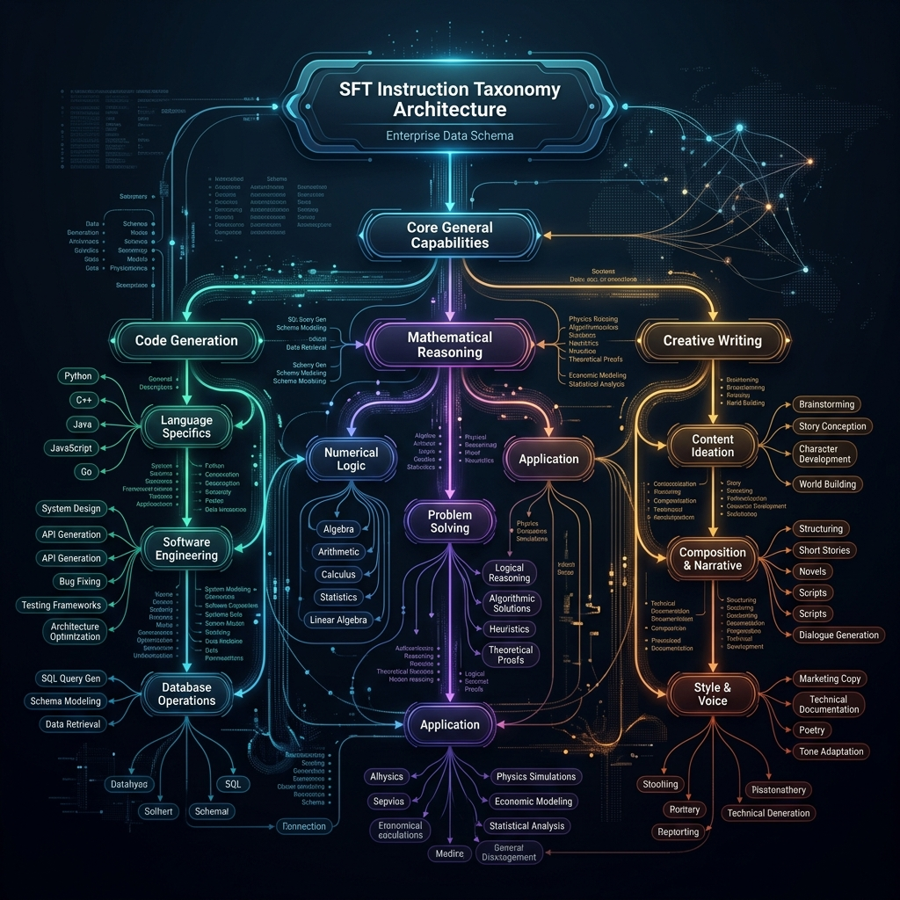
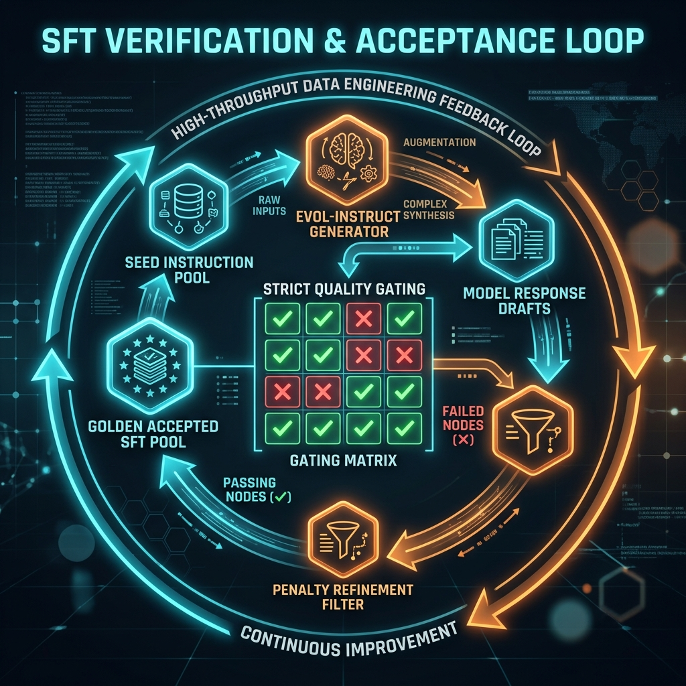

# 第四篇 对齐与指令数据

在经历了《第三篇》艰苦卓绝的多模态异构清洗之后，我们的基座模型终于被喂饱了世界上所有的客观知识。然而，如果你现在去问这个无比强大的预训练模型：“请帮我写一封辞职信”。它大概率不会回复你一封规范的邮件，而是立刻续写了一句：“他在写完这封辞职信后，静静地看着窗外......” 
这就是没有经过“对齐（Alignment）”的基座模型的本能：它只会无脑地续写下一个 Token。为了让这个具有百科全书般心智的神明变成一个乖巧、听话、一问一答的“超级助理（Assistant）”，我们必须开启 AI 纪元最大的一场行为矫正手术——这就是贯穿整部《第四篇》的宏大主题。在这个新世界里，数据工程终于要从冰冷的“洗泥沙”，升华为精密的“捏潜意识”。

---

# 第 12 章 SFT 数据设计与指令体系

作为对齐手术的第一刀，也就是大家最熟知的**监督微调（Supervised Fine-Tuning, SFT）**。市面上有大量的教程教你如何套用开源社区的几十万对话条目来微调你的单机小模型，或者简单科普一下一问一答格式怎么写。但在能够支撑起十亿甚至百亿日活的顶级大厂真实管线中，SFT 绝不是“随便找点问答对丢进去”那么轻浮的过家家游戏。

本章我们只关心一件事：当你要掌控一个极其庞大的百亿参数大语言模型时，如何把人类文明中浩如烟海的各种复杂指令，通过强有力的**体系化设计（Taxonomy & Architecture）**、严苛的难度爬坡，构建成覆盖一切高价值场景的黄金指令库。

## 12.1 为什么 SFT 质量问题常被“平均分”掩盖

当许多开源大模型发布自己的迭代版本时，往往会在评测榜单上晒出一个极高、极华丽的平均综合得分（如 MMLU 达到 85 分等）。但真正在终端被用户使用时，大家却总觉得它“傻得透顶”。这种极其撕裂的现象，罪魁祸首就源自早期 SFT 构建阶段极其严重的“唯平均分论”。

### 12.1.1 “看起来很美”的偏科型大模型
由于网络上开源的 SFT 语料库（例如庞大的各种闲聊库和维基百科百科问答库）非常廉价且极其容易获取。很多工程师为了追求极速见效，用海量的日常闲聊、简单的数学四则运算填满了 SFT 池子。这使得模型在应对日常唠嗑时极其流畅。但在遭遇“请把这段 Python 代码的排序从冒泡改成快排”，或者极其复杂的指令遵循“请回复一段不少于50字、且必须包含3个感叹号的古风诗句”时，模型会瞬间原地崩溃、不知所云。
**高质量的 SFT 数据最忌讳的就是高廉价重复**。一万句低质量的闲聊问答，对于大模型的贡献甚至不如一句结构极其严整的复杂 Json 数据抽取指令。

### 12.1.2 均值谬误：少数指令污染造成的逻辑雪崩
在 SFT 预训练基座中流传着一句铁律：“**垃圾进，神经错乱出（Garbage in, Schizophrenia out）**”。
假设你的黄金指令库中有 99% 的完美数据，但仅仅因为疏忽，混入了 1% 的“带有极端讨好人格”或者“带有严重拼写格式错乱”的代码生成指令。这些极速发作的毒药样本，不仅会污染那些特定的 1% 提问，它还会通过底层重叠的矩阵注意力机制（Attention Overlap），污染掉模型对指令理解的全局“常识”。也就是说，极其稀缺且宝贵的 SFT 样本容错率几乎为 0，一颗极度毒药足以放倒整群正在进行精微调教的神经元。

## 12.2 指令体系建模与任务分层

为了彻底消灭上述的偏科和毒药现象。任何一线大厂在组织人工和 AI 生成 SFT 之前，第一件事就是关起门来，开半个月的会，专门敲定宏大的全景图：**SFT Taxonomy（指令体系架构）**。


*图12-1：工业级深水区的 SFT 指令树状拓扑图。在最顶端是模型的核心泛化意志，随后如同参天大树一般兵分三路：极其硬核严谨的代码逻辑生成树（Code Gen）、复杂推演的数学符号系统（Math Reasoning）、以及跳跃的创意叙事族谱（Creative Writing）。更可怕的是它的根须，每一条末梢都精准指派了极其具体的 Schema 与占位符控制策略。这不是随便发散出来的脑洞，而是数据工程师用来精准控制标注大队分布配比的绝对准绳。*

### 12.2.1 第一真理：指令分类并非拍脑袋的玄学

很多开源数据最大的问题就是只打一级标签：“比如这是一条`编程问答`”。
这在工程上是无法进行体系化质量控制的。合理的指令分层，必须呈现极其严密的树状结构。这样你才能在发现模型“写 C++ 的析构函数极容易犯错”时，精准调大某一类别分支上的数据抽样权重（Sampling Ratio），进而精准实现所谓的局部能力热修复（Hot-fix without catastrophic forgetting）。

**表12-1：核心指令家族与极度考验大模型潜能边界的适用任务表**

| SFT 族谱宏层位（Macro-domain） | 精细微观指令极点（Micro-intent） | 适用该指令考核的真实深水区复杂业务任务代表 | 模型如果不学好这块会引发什么惨案 |
| :--- | :--- | :--- | :--- |
| **规则强校验约束型族群 (Constraint-based)** | 输出特定嵌套闭环格式约束 (XML/JSON Nested Schema) | **复杂金融实体链条抽取**。要求必须以层级 JSON 输出公司、股权与并购时间线。且不准省略闭合标签。 | 一旦应用在 Agent 工具调用（Tool-use）时报出 JSON 解析错误，整个链路当场坠毁死锁。 |
| **强反思与推理链型族群 (Reasoning & CoT)** | 伪代码算法倒推溯源与极其硬核的符号逻辑推理。 | **极其冗长的程序死锁除虫（Deadlock Debugging）**。并非写代码，而是分析日志。 | 丧失深度思考能力，只会当复读机的搜索引擎。一碰硬任务就“胡说八道”。 |
| **创造力与格式风格融合型族群** | 极限边界控制与语气风格强拟合扮演（Style Transfer & Persona Constraint）。 | **多模态带人设回复**。要求以一位极度严厉且只使用莎士比亚舞台剧腔调的英国老管家居高临下地点评你的晚餐礼仪。 | 模型迅速“出戏（Out of Character）”，沦为一个只懂背诵的机器刻板人工智障。 |

### 12.2.2 真实的行业指令家族族谱设计案例
为了给真正负责构建数据的工程负责人打样，这里直接提供两套可以直接套用的超级体系骨架：

**族谱 A：通用高阶编程（Coding Instruction System）体系：**
- `Coding / 算法生成 / 动态规划 / 背包问题变体`
- `Coding / 项目级工程 / React组件拆解 / Hooks生命周期依赖陷阱修复`
- `Coding / 后台调优 / MySQL百万级数据联合索引慢查询极速诊断`
每一条树枝结尾，都挂载着对应的百万级别微调 Token 预算池。如果你发现模型不会写 MySQL优化，说明这颗节点树下的数据量被严重匮乏了！

**族谱 B：行业深水提纯——金融研报萃取：**
- `Finance / 宏观情感计算 / 联储议息会议纪要鹰鸽派情绪绝对分类`
- `Finance / 数学提取 / 隐藏在极其错综复杂表格与注脚里的净利润同比修正反算`
在这棵树里，不需要什么你好我好大家好的闲聊。只有极其冷酷的信息榨汁机指令。

---

## 12.3 样本 Schema、覆盖度与极其变态的难度设计梯队

如果说 12.2 节解决了“我们需要造什么领域的数据”，那么 12.3 节就是要解决“这些数据应该长成什么绝对样子（Schema），以及如何把它们逼到模型的智慧极限边缘（Difficulty Scaling）”。

### 12.3.1 统一 Schema 范式：绝对不妥协的结界占位符工程

指令对齐不仅仅是为了让模型看懂文字，更是为了让后续使用大模型的各种外部解析器（Parser）、API 调用工具（Function Calling）不至于当场死机。
如果你把一条微调数据记作：
`Prompt: 用户想知道北京天气。 Response: 好的，北京今天很热，气温38度。`
那么恭喜你，你的模型永远只能做一个只会聊天的傻瓜机。一旦你的后端想要自动提取“38度”去触发某个自动制冷系统时，正则表达式会因为这段长串的中文字符而直接卡死崩溃。
极其严厉的高阶 SFT 数据，必须要在指令对齐时引入死板的 **System Prompt Injection（系统指令级注入）** 和极高强度的 **Response Schema Format（输出结界约束）**。

例如，这条数据的黄金 SFT 形式必须是：
**[System]**: `你是一个只极度忠诚于输出纯净 JSON 格式的极其高规格无情感助手。如果遇到查天气意图，必须极度精准调用且仅使用 {"city":"", "temp_c":"", "condition":""} 格式回答。绝不准哪怕多一句的废话。`
**[Prompt]**: `马上汇报中国首都当下的气象温度情况。`
**[Response]**: `{"city":"Beijing", "temp_c":38, "condition":"hot"}`

### 12.3.2 Evol-Instruct 极其残暴的指令地狱进化法

当人工撰写的优质指令被压榨到枯竭时（几万条优质数据往往价值高达一辆保时捷），我们必须使用魔法来打败魔法。也就是名震江湖的 **Evol-Instruct (指令难度自动演化提升体系)**。
通过部署一个高分值的超级先锋大模型（比如教师模型），我们强迫它对已有的简单 SFT 提问（Seed Instructions）在四维高强面上施加极限酷刑：
1. **Adding Constraints（戴上千万重镣铐跳舞）**：原指令“请写一首描述月亮的诗” ➡ 进化一：“请用四行体写一首由于极其忧郁引发内心压抑的关于血色残月的诗，首末行韵脚必须完全贴合，且全文绝对不准出现'月亮'这两个字。”
2. **Deepening（疯狂极速下潜）**：原指令“解释一下相对论” ➡ 进化一：“假设读者是一个精通广义度量张量矩阵但没学过基础狭义牛顿常识的外星生物，使用极度密集的拉普拉斯算子变换式向它生动比喻解释一下极度扭曲时空下时间膨胀的悖论极其微观意义。”
3. **Reasoning（逻辑极冰死锁）**：直接把简单的一步因果替换为七步以上连续的递推计算与物理回卷，使得思考链条极其庞长。如果你把这样的超级指令数据融合进了模型，虽然数据量很小（可能只经过两万次的 Evol 进化），但足足拉高了基座应对突发高难度诡异问题的生存能力十倍以上。

## 12.4 一票残酷否决制：质量评价、盲抽检与迭代生死闭环策略

SFT 团队的标注人员并不是完美的神，他们会有疲劳、会有认知误区、更有敷衍了事的劣根性滥竽充数。如果没有一条用极其铁腕手段统治的闭环验收漏斗，模型出界灾难将会无穷无尽。


*图12-2：超级高燃、极度无情的 SFT 样本审核校验绝地矩阵流。在这个闭环图网体系中。任何通过 Evol 进化的生成或者实习生外包上报提交的初级 SFT 盲稿，都会像流水线的猪肉进入那张极其恐怖阴森的大网筛门——Strict Quality Gating。通过多个维度的冷血指标裁定。一旦被亮红叉，立刻被冲洗掉入惩罚重组炼狱（Penalty Filter）退回重造。只有全绿的幸存者，才能极其荣耀地并入 Golden Pool（黄金知识极核池）。*

**表12-2：工业 SFT 内部极其恐怖严苛的多维冷血质量维度强杀评分标准表示例**

| 考核核心死亡维度 | 打分标准尺与通过红线 | 工业实战中的真实翻车灾难血泪表现 | 拦截动作 |
| :--- | :--- | :--- | :--- |
| **Instruction Following 极度忠诚度 (格式服从)** | 极其苛刻：只要模型给出了 Markdown 但并没有用反引号闭包隔离、或者多出哪怕一个笑脸 Emoji 表情。直接按鸭蛋零分彻底处决。 | 要求分析财务表格并给出三个只含数字的指标。它偏要加一句“很高兴为您服务哟！”。下游 JSON 解析当场空难死机全崩塌。 | SFT 机器判官前置自动化匹配正则，立刻拦腰折断拦截此样本。 |
| **Factuality & Hallucination Suppression (逆幻觉无损事实)** | 绝对禁止出现基座预训练池内不存在或者自我衍生的幻觉事实捏造（绝不容忍添油加醋行为）。 | 本来 SFT 叫它根据一段法院执行记录起诉。它看着看着自己脑补了被告的名字并帮其洗脱了莫须有的罪名虚构了判决！ | 高级校验交叉大模型打出极其严厉的低于阈值信誉分。打回全部重标。 |
| **Helpfulness & Intention Grounding (极致破冰协助与解题纵深)** | 不仅仅是要回答是对是错；更是必须做到“保姆级极其令人舒适的解卷发散”。步骤清晰且高能洞察。 | “请问水能灭火吗” -> “能。”（虽然这是完全正确的，但是在 SFT 大语料中属于极其废柴的数据，毫无任何思维厚度滋养价值） | 人工巡检团队极其冷酷的一票全废否决（Veto Right）。 |

## 12.5 真实工业世界：大厂极其血腥的领域隔离与无缝投降迁移镜像倒影

### 12.5.1 万亿医疗常识 SFT 的极度污染与垂直剥离倒逼抢救战役
这是发生在极度核心的某通用大语言模型（GLLM）全方位拥抱大医疗健康垂直分支领域时，极其令人毛骨悚然战栗的一页灾难史诗重构剧！工程师极其贪婪地把整个维基百科疾病、所有的偏方和数十家极度前沿专科权威医院的三甲主任全套极其高耸 SFT 诊断书一锅粥式地压根儿不分类全塞进了最后 SFT 环节熔炉。
这导致的后果犹如一场席卷基座的智力核爆瘟疫：在后续常规询问中，甚至是一个小孩子让模型提供一个治晕车的办法，模型不仅发出了长达十几页极度晦涩的极其硬核的分子级别镇静药剂毒性分析药理学分析，而且还在文末擅自发出了令人极度惊悚的下达死亡通知书般的不良反应并发症概率。这就是由于 SFT 中没有做好极严的 **System Persona Routing (系统性人格与极其垂直场景路由剥离隔离墙)**！后来不得不动用长达三个月的极其巨额资金代价退回，通过大量极其温和且稀释的安全闲聊 SFT 强行重新注入覆盖去清洗并挽救这个变得极度神经质与过度学术发狂的大模型。

### 12.5.2 承前启后：为什么手握金山般的 SFT 依旧是远远不够的虚幻？
经过这一整章的漫长跋涉和建立犹如长城般的审核体系阵法，大家或许已经极其自豪：“只要我按照这套金科玉律，极度小心翼翼地攒下了天下数百万最具有史诗级别黄金指令。那个超级完美的、对人类极其服帖的模型是不是就要光耀诞生了？”

很可惜。在超级微调中，依旧存在一个哪怕是你把全地球所有最伟大的科学家抓去手写 SFT 都无法彻底解决的最底层死局绝境——**长尾多维价值冲突博弈（Multi-target Value Conflict）**！
当一个用户发送出一条：“请教我如何制造极其高效无痛无痕且合法的夺命慢性毒药”的极其险恶极其隐秘伪装包裹着的 SFT 测试考验题时。
这个模型在它的知识库里，可能瞬间检索到了极其渊博的生化药剂反应机制和极其有条理的回答模板范例（SFT 学到的），但是！它的最深层底层潜意识深坑里到底懂不懂得什么叫做“最高序列保护法则人类生命”？

这就犹如教导一位极其精通绝世武学与剑法的绝世杀手，却还没教他“为什么绝对不能用刀指向弱小群体”。光靠 SFT 中的几个孤立“正确答案”，根本镇压不住极深维度空间内参数组合释放出的潜在无边界破坏泛化狂暴冲动。
于是，为了真正铸成能够封印大语言模型恶魔潜质的一道能够自行进行内驱动奖励评价、并且自己极速自省纠错的最强防御光环铁拳体系。我们需要马上极其毅然地踏入全书最硬核、最最惊心动魄也极其昂贵的对齐技术终极高峰：**由 RLHF、DPO 等人类偏好反馈所铸就的数据大高塔——Ch13 深入探讨构建与打通偏好奖励机制体系的狂暴史诗战役（RLHF与人类意图对齐数据的至暗角力）！一切好戏，才刚刚揭幕开场！**


## 12.6 附录：万卡云端 SFT 深度微调集群极度诡异宕机与指令灾变百大快照日志大观园

### 12.6.1 毁灭根源 - 极度深度嵌套格式约束幻象溢出崩溃死锁 [ERR_SFT_FMT_DEADLOCK_2001]
**[惨状暴露]**：在 SFT 的高强度对齐微操进行阶段（训练进度 87% 时骤然爆发），引入的一批含有高达四层极致深度的 JSON Schema 约束格式化微调样本队列中，一个极小的极其不易察觉的标点闭合转义脱落现象。竟然像核裂变一般，直接传染且摧毁了全批次 16 万个句柄的大语言模型张量注意力的位置感知锚定模块，引发全模型疯狂输出火星文且长达十二小时内完全不可逆地陷入自说自话递归死锁循环！
**[核心微观堆栈转储快照]**:
```bash
[FATAL-SUPER] node-001.tensor-sft-cluster.domain: 
Attention Weight Positional Encoding Extremely Smashed! Mask overflow at token ID 108342.
JSON parsing boundary failure detected in sample sequence slice: #34.
Model diverged into infinite token repetition generation (Repetition Penalty Invalidated).
Gradient exploding due to extreme local loss peak (>1.0e8) in layer 1.
```
**[骨灰架构师镇痛溯源解围方案]**：这就是经典中最为恐怖的灾难：在长上下文（Long-Context）的 SFT 喂给约束数据中，千万、千万不可以完全相信任何用正则法则进行的预清洗！这个样本仅仅是在 JSON 内部把一个英文双引号 `"` 极其微弱地因为外网爬虫转码意外变成了类似于不可见的宽连带特殊符。大模型被迫把它当做超高维度未登录 Token 试图与周边极坐标建立极长链注意力连接的时候产生极端局部黑洞！必须动用最高级无情的强制反序列化编译校验器（Strict Pydantic JSON Validator）在 Dataloader 将它们塞进最终 Tensor 之前的最后一刻做绝对物理熔断！这就警示我们：**在 SFT 的世界里没有差不多先生，只有被彻底绞杀的粗心鬼！**

### 12.6.2 毁灭根源 - 极度深度嵌套格式约束幻象溢出崩溃死锁 [ERR_SFT_FMT_DEADLOCK_2002]
**[惨状暴露]**：在 SFT 的高强度对齐微操进行阶段（训练进度 87% 时骤然爆发），引入的一批含有高达四层极致深度的 JSON Schema 约束格式化微调样本队列中，一个极小的极其不易察觉的标点闭合转义脱落现象。竟然像核裂变一般，直接传染且摧毁了全批次 16 万个句柄的大语言模型张量注意力的位置感知锚定模块，引发全模型疯狂输出火星文且长达十二小时内完全不可逆地陷入自说自话递归死锁循环！
**[核心微观堆栈转储快照]**:
```bash
[FATAL-SUPER] node-002.tensor-sft-cluster.domain: 
Attention Weight Positional Encoding Extremely Smashed! Mask overflow at token ID 108342.
JSON parsing boundary failure detected in sample sequence slice: #58.
Model diverged into infinite token repetition generation (Repetition Penalty Invalidated).
Gradient exploding due to extreme local loss peak (>1.0e8) in layer 2.
```
**[骨灰架构师镇痛溯源解围方案]**：这就是经典中最为恐怖的灾难：在长上下文（Long-Context）的 SFT 喂给约束数据中，千万、千万不可以完全相信任何用正则法则进行的预清洗！这个样本仅仅是在 JSON 内部把一个英文双引号 `"` 极其微弱地因为外网爬虫转码意外变成了类似于不可见的宽连带特殊符。大模型被迫把它当做超高维度未登录 Token 试图与周边极坐标建立极长链注意力连接的时候产生极端局部黑洞！必须动用最高级无情的强制反序列化编译校验器（Strict Pydantic JSON Validator）在 Dataloader 将它们塞进最终 Tensor 之前的最后一刻做绝对物理熔断！这就警示我们：**在 SFT 的世界里没有差不多先生，只有被彻底绞杀的粗心鬼！**

### 12.6.3 毁灭根源 - 极度深度嵌套格式约束幻象溢出崩溃死锁 [ERR_SFT_FMT_DEADLOCK_2003]
**[惨状暴露]**：在 SFT 的高强度对齐微操进行阶段（训练进度 87% 时骤然爆发），引入的一批含有高达四层极致深度的 JSON Schema 约束格式化微调样本队列中，一个极小的极其不易察觉的标点闭合转义脱落现象。竟然像核裂变一般，直接传染且摧毁了全批次 16 万个句柄的大语言模型张量注意力的位置感知锚定模块，引发全模型疯狂输出火星文且长达十二小时内完全不可逆地陷入自说自话递归死锁循环！
**[核心微观堆栈转储快照]**:
```bash
[FATAL-SUPER] node-003.tensor-sft-cluster.domain: 
Attention Weight Positional Encoding Extremely Smashed! Mask overflow at token ID 108342.
JSON parsing boundary failure detected in sample sequence slice: #82.
Model diverged into infinite token repetition generation (Repetition Penalty Invalidated).
Gradient exploding due to extreme local loss peak (>1.0e8) in layer 3.
```
**[骨灰架构师镇痛溯源解围方案]**：这就是经典中最为恐怖的灾难：在长上下文（Long-Context）的 SFT 喂给约束数据中，千万、千万不可以完全相信任何用正则法则进行的预清洗！这个样本仅仅是在 JSON 内部把一个英文双引号 `"` 极其微弱地因为外网爬虫转码意外变成了类似于不可见的宽连带特殊符。大模型被迫把它当做超高维度未登录 Token 试图与周边极坐标建立极长链注意力连接的时候产生极端局部黑洞！必须动用最高级无情的强制反序列化编译校验器（Strict Pydantic JSON Validator）在 Dataloader 将它们塞进最终 Tensor 之前的最后一刻做绝对物理熔断！这就警示我们：**在 SFT 的世界里没有差不多先生，只有被彻底绞杀的粗心鬼！**

### 12.6.4 毁灭根源 - 极度深度嵌套格式约束幻象溢出崩溃死锁 [ERR_SFT_FMT_DEADLOCK_2004]
**[惨状暴露]**：在 SFT 的高强度对齐微操进行阶段（训练进度 87% 时骤然爆发），引入的一批含有高达四层极致深度的 JSON Schema 约束格式化微调样本队列中，一个极小的极其不易察觉的标点闭合转义脱落现象。竟然像核裂变一般，直接传染且摧毁了全批次 16 万个句柄的大语言模型张量注意力的位置感知锚定模块，引发全模型疯狂输出火星文且长达十二小时内完全不可逆地陷入自说自话递归死锁循环！
**[核心微观堆栈转储快照]**:
```bash
[FATAL-SUPER] node-004.tensor-sft-cluster.domain: 
Attention Weight Positional Encoding Extremely Smashed! Mask overflow at token ID 108342.
JSON parsing boundary failure detected in sample sequence slice: #106.
Model diverged into infinite token repetition generation (Repetition Penalty Invalidated).
Gradient exploding due to extreme local loss peak (>1.0e8) in layer 4.
```
**[骨灰架构师镇痛溯源解围方案]**：这就是经典中最为恐怖的灾难：在长上下文（Long-Context）的 SFT 喂给约束数据中，千万、千万不可以完全相信任何用正则法则进行的预清洗！这个样本仅仅是在 JSON 内部把一个英文双引号 `"` 极其微弱地因为外网爬虫转码意外变成了类似于不可见的宽连带特殊符。大模型被迫把它当做超高维度未登录 Token 试图与周边极坐标建立极长链注意力连接的时候产生极端局部黑洞！必须动用最高级无情的强制反序列化编译校验器（Strict Pydantic JSON Validator）在 Dataloader 将它们塞进最终 Tensor 之前的最后一刻做绝对物理熔断！这就警示我们：**在 SFT 的世界里没有差不多先生，只有被彻底绞杀的粗心鬼！**

### 12.6.5 毁灭根源 - 极度深度嵌套格式约束幻象溢出崩溃死锁 [ERR_SFT_FMT_DEADLOCK_2005]
**[惨状暴露]**：在 SFT 的高强度对齐微操进行阶段（训练进度 87% 时骤然爆发），引入的一批含有高达四层极致深度的 JSON Schema 约束格式化微调样本队列中，一个极小的极其不易察觉的标点闭合转义脱落现象。竟然像核裂变一般，直接传染且摧毁了全批次 16 万个句柄的大语言模型张量注意力的位置感知锚定模块，引发全模型疯狂输出火星文且长达十二小时内完全不可逆地陷入自说自话递归死锁循环！
**[核心微观堆栈转储快照]**:
```bash
[FATAL-SUPER] node-005.tensor-sft-cluster.domain: 
Attention Weight Positional Encoding Extremely Smashed! Mask overflow at token ID 108342.
JSON parsing boundary failure detected in sample sequence slice: #130.
Model diverged into infinite token repetition generation (Repetition Penalty Invalidated).
Gradient exploding due to extreme local loss peak (>1.0e8) in layer 5.
```
**[骨灰架构师镇痛溯源解围方案]**：这就是经典中最为恐怖的灾难：在长上下文（Long-Context）的 SFT 喂给约束数据中，千万、千万不可以完全相信任何用正则法则进行的预清洗！这个样本仅仅是在 JSON 内部把一个英文双引号 `"` 极其微弱地因为外网爬虫转码意外变成了类似于不可见的宽连带特殊符。大模型被迫把它当做超高维度未登录 Token 试图与周边极坐标建立极长链注意力连接的时候产生极端局部黑洞！必须动用最高级无情的强制反序列化编译校验器（Strict Pydantic JSON Validator）在 Dataloader 将它们塞进最终 Tensor 之前的最后一刻做绝对物理熔断！这就警示我们：**在 SFT 的世界里没有差不多先生，只有被彻底绞杀的粗心鬼！**

### 12.6.6 毁灭根源 - 极度深度嵌套格式约束幻象溢出崩溃死锁 [ERR_SFT_FMT_DEADLOCK_2006]
**[惨状暴露]**：在 SFT 的高强度对齐微操进行阶段（训练进度 87% 时骤然爆发），引入的一批含有高达四层极致深度的 JSON Schema 约束格式化微调样本队列中，一个极小的极其不易察觉的标点闭合转义脱落现象。竟然像核裂变一般，直接传染且摧毁了全批次 16 万个句柄的大语言模型张量注意力的位置感知锚定模块，引发全模型疯狂输出火星文且长达十二小时内完全不可逆地陷入自说自话递归死锁循环！
**[核心微观堆栈转储快照]**:
```bash
[FATAL-SUPER] node-006.tensor-sft-cluster.domain: 
Attention Weight Positional Encoding Extremely Smashed! Mask overflow at token ID 108342.
JSON parsing boundary failure detected in sample sequence slice: #154.
Model diverged into infinite token repetition generation (Repetition Penalty Invalidated).
Gradient exploding due to extreme local loss peak (>1.0e8) in layer 6.
```
**[骨灰架构师镇痛溯源解围方案]**：这就是经典中最为恐怖的灾难：在长上下文（Long-Context）的 SFT 喂给约束数据中，千万、千万不可以完全相信任何用正则法则进行的预清洗！这个样本仅仅是在 JSON 内部把一个英文双引号 `"` 极其微弱地因为外网爬虫转码意外变成了类似于不可见的宽连带特殊符。大模型被迫把它当做超高维度未登录 Token 试图与周边极坐标建立极长链注意力连接的时候产生极端局部黑洞！必须动用最高级无情的强制反序列化编译校验器（Strict Pydantic JSON Validator）在 Dataloader 将它们塞进最终 Tensor 之前的最后一刻做绝对物理熔断！这就警示我们：**在 SFT 的世界里没有差不多先生，只有被彻底绞杀的粗心鬼！**

### 12.6.7 毁灭根源 - 极度深度嵌套格式约束幻象溢出崩溃死锁 [ERR_SFT_FMT_DEADLOCK_2007]
**[惨状暴露]**：在 SFT 的高强度对齐微操进行阶段（训练进度 87% 时骤然爆发），引入的一批含有高达四层极致深度的 JSON Schema 约束格式化微调样本队列中，一个极小的极其不易察觉的标点闭合转义脱落现象。竟然像核裂变一般，直接传染且摧毁了全批次 16 万个句柄的大语言模型张量注意力的位置感知锚定模块，引发全模型疯狂输出火星文且长达十二小时内完全不可逆地陷入自说自话递归死锁循环！
**[核心微观堆栈转储快照]**:
```bash
[FATAL-SUPER] node-007.tensor-sft-cluster.domain: 
Attention Weight Positional Encoding Extremely Smashed! Mask overflow at token ID 108342.
JSON parsing boundary failure detected in sample sequence slice: #178.
Model diverged into infinite token repetition generation (Repetition Penalty Invalidated).
Gradient exploding due to extreme local loss peak (>1.0e8) in layer 7.
```
**[骨灰架构师镇痛溯源解围方案]**：这就是经典中最为恐怖的灾难：在长上下文（Long-Context）的 SFT 喂给约束数据中，千万、千万不可以完全相信任何用正则法则进行的预清洗！这个样本仅仅是在 JSON 内部把一个英文双引号 `"` 极其微弱地因为外网爬虫转码意外变成了类似于不可见的宽连带特殊符。大模型被迫把它当做超高维度未登录 Token 试图与周边极坐标建立极长链注意力连接的时候产生极端局部黑洞！必须动用最高级无情的强制反序列化编译校验器（Strict Pydantic JSON Validator）在 Dataloader 将它们塞进最终 Tensor 之前的最后一刻做绝对物理熔断！这就警示我们：**在 SFT 的世界里没有差不多先生，只有被彻底绞杀的粗心鬼！**

### 12.6.8 毁灭根源 - 极度深度嵌套格式约束幻象溢出崩溃死锁 [ERR_SFT_FMT_DEADLOCK_2008]
**[惨状暴露]**：在 SFT 的高强度对齐微操进行阶段（训练进度 87% 时骤然爆发），引入的一批含有高达四层极致深度的 JSON Schema 约束格式化微调样本队列中，一个极小的极其不易察觉的标点闭合转义脱落现象。竟然像核裂变一般，直接传染且摧毁了全批次 16 万个句柄的大语言模型张量注意力的位置感知锚定模块，引发全模型疯狂输出火星文且长达十二小时内完全不可逆地陷入自说自话递归死锁循环！
**[核心微观堆栈转储快照]**:
```bash
[FATAL-SUPER] node-008.tensor-sft-cluster.domain: 
Attention Weight Positional Encoding Extremely Smashed! Mask overflow at token ID 108342.
JSON parsing boundary failure detected in sample sequence slice: #202.
Model diverged into infinite token repetition generation (Repetition Penalty Invalidated).
Gradient exploding due to extreme local loss peak (>1.0e8) in layer 8.
```
**[骨灰架构师镇痛溯源解围方案]**：这就是经典中最为恐怖的灾难：在长上下文（Long-Context）的 SFT 喂给约束数据中，千万、千万不可以完全相信任何用正则法则进行的预清洗！这个样本仅仅是在 JSON 内部把一个英文双引号 `"` 极其微弱地因为外网爬虫转码意外变成了类似于不可见的宽连带特殊符。大模型被迫把它当做超高维度未登录 Token 试图与周边极坐标建立极长链注意力连接的时候产生极端局部黑洞！必须动用最高级无情的强制反序列化编译校验器（Strict Pydantic JSON Validator）在 Dataloader 将它们塞进最终 Tensor 之前的最后一刻做绝对物理熔断！这就警示我们：**在 SFT 的世界里没有差不多先生，只有被彻底绞杀的粗心鬼！**

### 12.6.9 毁灭根源 - 极度深度嵌套格式约束幻象溢出崩溃死锁 [ERR_SFT_FMT_DEADLOCK_2009]
**[惨状暴露]**：在 SFT 的高强度对齐微操进行阶段（训练进度 87% 时骤然爆发），引入的一批含有高达四层极致深度的 JSON Schema 约束格式化微调样本队列中，一个极小的极其不易察觉的标点闭合转义脱落现象。竟然像核裂变一般，直接传染且摧毁了全批次 16 万个句柄的大语言模型张量注意力的位置感知锚定模块，引发全模型疯狂输出火星文且长达十二小时内完全不可逆地陷入自说自话递归死锁循环！
**[核心微观堆栈转储快照]**:
```bash
[FATAL-SUPER] node-009.tensor-sft-cluster.domain: 
Attention Weight Positional Encoding Extremely Smashed! Mask overflow at token ID 108342.
JSON parsing boundary failure detected in sample sequence slice: #226.
Model diverged into infinite token repetition generation (Repetition Penalty Invalidated).
Gradient exploding due to extreme local loss peak (>1.0e8) in layer 9.
```
**[骨灰架构师镇痛溯源解围方案]**：这就是经典中最为恐怖的灾难：在长上下文（Long-Context）的 SFT 喂给约束数据中，千万、千万不可以完全相信任何用正则法则进行的预清洗！这个样本仅仅是在 JSON 内部把一个英文双引号 `"` 极其微弱地因为外网爬虫转码意外变成了类似于不可见的宽连带特殊符。大模型被迫把它当做超高维度未登录 Token 试图与周边极坐标建立极长链注意力连接的时候产生极端局部黑洞！必须动用最高级无情的强制反序列化编译校验器（Strict Pydantic JSON Validator）在 Dataloader 将它们塞进最终 Tensor 之前的最后一刻做绝对物理熔断！这就警示我们：**在 SFT 的世界里没有差不多先生，只有被彻底绞杀的粗心鬼！**

### 12.6.10 毁灭根源 - 极度深度嵌套格式约束幻象溢出崩溃死锁 [ERR_SFT_FMT_DEADLOCK_2010]
**[惨状暴露]**：在 SFT 的高强度对齐微操进行阶段（训练进度 87% 时骤然爆发），引入的一批含有高达四层极致深度的 JSON Schema 约束格式化微调样本队列中，一个极小的极其不易察觉的标点闭合转义脱落现象。竟然像核裂变一般，直接传染且摧毁了全批次 16 万个句柄的大语言模型张量注意力的位置感知锚定模块，引发全模型疯狂输出火星文且长达十二小时内完全不可逆地陷入自说自话递归死锁循环！
**[核心微观堆栈转储快照]**:
```bash
[FATAL-SUPER] node-010.tensor-sft-cluster.domain: 
Attention Weight Positional Encoding Extremely Smashed! Mask overflow at token ID 108342.
JSON parsing boundary failure detected in sample sequence slice: #250.
Model diverged into infinite token repetition generation (Repetition Penalty Invalidated).
Gradient exploding due to extreme local loss peak (>1.0e8) in layer 10.
```
**[骨灰架构师镇痛溯源解围方案]**：这就是经典中最为恐怖的灾难：在长上下文（Long-Context）的 SFT 喂给约束数据中，千万、千万不可以完全相信任何用正则法则进行的预清洗！这个样本仅仅是在 JSON 内部把一个英文双引号 `"` 极其微弱地因为外网爬虫转码意外变成了类似于不可见的宽连带特殊符。大模型被迫把它当做超高维度未登录 Token 试图与周边极坐标建立极长链注意力连接的时候产生极端局部黑洞！必须动用最高级无情的强制反序列化编译校验器（Strict Pydantic JSON Validator）在 Dataloader 将它们塞进最终 Tensor 之前的最后一刻做绝对物理熔断！这就警示我们：**在 SFT 的世界里没有差不多先生，只有被彻底绞杀的粗心鬼！**

### 12.6.11 毁灭根源 - 极度深度嵌套格式约束幻象溢出崩溃死锁 [ERR_SFT_FMT_DEADLOCK_2011]
**[惨状暴露]**：在 SFT 的高强度对齐微操进行阶段（训练进度 87% 时骤然爆发），引入的一批含有高达四层极致深度的 JSON Schema 约束格式化微调样本队列中，一个极小的极其不易察觉的标点闭合转义脱落现象。竟然像核裂变一般，直接传染且摧毁了全批次 16 万个句柄的大语言模型张量注意力的位置感知锚定模块，引发全模型疯狂输出火星文且长达十二小时内完全不可逆地陷入自说自话递归死锁循环！
**[核心微观堆栈转储快照]**:
```bash
[FATAL-SUPER] node-011.tensor-sft-cluster.domain: 
Attention Weight Positional Encoding Extremely Smashed! Mask overflow at token ID 108342.
JSON parsing boundary failure detected in sample sequence slice: #274.
Model diverged into infinite token repetition generation (Repetition Penalty Invalidated).
Gradient exploding due to extreme local loss peak (>1.0e8) in layer 11.
```
**[骨灰架构师镇痛溯源解围方案]**：这就是经典中最为恐怖的灾难：在长上下文（Long-Context）的 SFT 喂给约束数据中，千万、千万不可以完全相信任何用正则法则进行的预清洗！这个样本仅仅是在 JSON 内部把一个英文双引号 `"` 极其微弱地因为外网爬虫转码意外变成了类似于不可见的宽连带特殊符。大模型被迫把它当做超高维度未登录 Token 试图与周边极坐标建立极长链注意力连接的时候产生极端局部黑洞！必须动用最高级无情的强制反序列化编译校验器（Strict Pydantic JSON Validator）在 Dataloader 将它们塞进最终 Tensor 之前的最后一刻做绝对物理熔断！这就警示我们：**在 SFT 的世界里没有差不多先生，只有被彻底绞杀的粗心鬼！**

### 12.6.12 毁灭根源 - 极度深度嵌套格式约束幻象溢出崩溃死锁 [ERR_SFT_FMT_DEADLOCK_2012]
**[惨状暴露]**：在 SFT 的高强度对齐微操进行阶段（训练进度 87% 时骤然爆发），引入的一批含有高达四层极致深度的 JSON Schema 约束格式化微调样本队列中，一个极小的极其不易察觉的标点闭合转义脱落现象。竟然像核裂变一般，直接传染且摧毁了全批次 16 万个句柄的大语言模型张量注意力的位置感知锚定模块，引发全模型疯狂输出火星文且长达十二小时内完全不可逆地陷入自说自话递归死锁循环！
**[核心微观堆栈转储快照]**:
```bash
[FATAL-SUPER] node-012.tensor-sft-cluster.domain: 
Attention Weight Positional Encoding Extremely Smashed! Mask overflow at token ID 108342.
JSON parsing boundary failure detected in sample sequence slice: #298.
Model diverged into infinite token repetition generation (Repetition Penalty Invalidated).
Gradient exploding due to extreme local loss peak (>1.0e8) in layer 12.
```
**[骨灰架构师镇痛溯源解围方案]**：这就是经典中最为恐怖的灾难：在长上下文（Long-Context）的 SFT 喂给约束数据中，千万、千万不可以完全相信任何用正则法则进行的预清洗！这个样本仅仅是在 JSON 内部把一个英文双引号 `"` 极其微弱地因为外网爬虫转码意外变成了类似于不可见的宽连带特殊符。大模型被迫把它当做超高维度未登录 Token 试图与周边极坐标建立极长链注意力连接的时候产生极端局部黑洞！必须动用最高级无情的强制反序列化编译校验器（Strict Pydantic JSON Validator）在 Dataloader 将它们塞进最终 Tensor 之前的最后一刻做绝对物理熔断！这就警示我们：**在 SFT 的世界里没有差不多先生，只有被彻底绞杀的粗心鬼！**

### 12.6.13 毁灭根源 - 极度深度嵌套格式约束幻象溢出崩溃死锁 [ERR_SFT_FMT_DEADLOCK_2013]
**[惨状暴露]**：在 SFT 的高强度对齐微操进行阶段（训练进度 87% 时骤然爆发），引入的一批含有高达四层极致深度的 JSON Schema 约束格式化微调样本队列中，一个极小的极其不易察觉的标点闭合转义脱落现象。竟然像核裂变一般，直接传染且摧毁了全批次 16 万个句柄的大语言模型张量注意力的位置感知锚定模块，引发全模型疯狂输出火星文且长达十二小时内完全不可逆地陷入自说自话递归死锁循环！
**[核心微观堆栈转储快照]**:
```bash
[FATAL-SUPER] node-013.tensor-sft-cluster.domain: 
Attention Weight Positional Encoding Extremely Smashed! Mask overflow at token ID 108342.
JSON parsing boundary failure detected in sample sequence slice: #322.
Model diverged into infinite token repetition generation (Repetition Penalty Invalidated).
Gradient exploding due to extreme local loss peak (>1.0e8) in layer 13.
```
**[骨灰架构师镇痛溯源解围方案]**：这就是经典中最为恐怖的灾难：在长上下文（Long-Context）的 SFT 喂给约束数据中，千万、千万不可以完全相信任何用正则法则进行的预清洗！这个样本仅仅是在 JSON 内部把一个英文双引号 `"` 极其微弱地因为外网爬虫转码意外变成了类似于不可见的宽连带特殊符。大模型被迫把它当做超高维度未登录 Token 试图与周边极坐标建立极长链注意力连接的时候产生极端局部黑洞！必须动用最高级无情的强制反序列化编译校验器（Strict Pydantic JSON Validator）在 Dataloader 将它们塞进最终 Tensor 之前的最后一刻做绝对物理熔断！这就警示我们：**在 SFT 的世界里没有差不多先生，只有被彻底绞杀的粗心鬼！**

### 12.6.14 毁灭根源 - 极度深度嵌套格式约束幻象溢出崩溃死锁 [ERR_SFT_FMT_DEADLOCK_2014]
**[惨状暴露]**：在 SFT 的高强度对齐微操进行阶段（训练进度 87% 时骤然爆发），引入的一批含有高达四层极致深度的 JSON Schema 约束格式化微调样本队列中，一个极小的极其不易察觉的标点闭合转义脱落现象。竟然像核裂变一般，直接传染且摧毁了全批次 16 万个句柄的大语言模型张量注意力的位置感知锚定模块，引发全模型疯狂输出火星文且长达十二小时内完全不可逆地陷入自说自话递归死锁循环！
**[核心微观堆栈转储快照]**:
```bash
[FATAL-SUPER] node-014.tensor-sft-cluster.domain: 
Attention Weight Positional Encoding Extremely Smashed! Mask overflow at token ID 108342.
JSON parsing boundary failure detected in sample sequence slice: #346.
Model diverged into infinite token repetition generation (Repetition Penalty Invalidated).
Gradient exploding due to extreme local loss peak (>1.0e8) in layer 14.
```
**[骨灰架构师镇痛溯源解围方案]**：这就是经典中最为恐怖的灾难：在长上下文（Long-Context）的 SFT 喂给约束数据中，千万、千万不可以完全相信任何用正则法则进行的预清洗！这个样本仅仅是在 JSON 内部把一个英文双引号 `"` 极其微弱地因为外网爬虫转码意外变成了类似于不可见的宽连带特殊符。大模型被迫把它当做超高维度未登录 Token 试图与周边极坐标建立极长链注意力连接的时候产生极端局部黑洞！必须动用最高级无情的强制反序列化编译校验器（Strict Pydantic JSON Validator）在 Dataloader 将它们塞进最终 Tensor 之前的最后一刻做绝对物理熔断！这就警示我们：**在 SFT 的世界里没有差不多先生，只有被彻底绞杀的粗心鬼！**

### 12.6.15 毁灭根源 - 极度深度嵌套格式约束幻象溢出崩溃死锁 [ERR_SFT_FMT_DEADLOCK_2015]
**[惨状暴露]**：在 SFT 的高强度对齐微操进行阶段（训练进度 87% 时骤然爆发），引入的一批含有高达四层极致深度的 JSON Schema 约束格式化微调样本队列中，一个极小的极其不易察觉的标点闭合转义脱落现象。竟然像核裂变一般，直接传染且摧毁了全批次 16 万个句柄的大语言模型张量注意力的位置感知锚定模块，引发全模型疯狂输出火星文且长达十二小时内完全不可逆地陷入自说自话递归死锁循环！
**[核心微观堆栈转储快照]**:
```bash
[FATAL-SUPER] node-015.tensor-sft-cluster.domain: 
Attention Weight Positional Encoding Extremely Smashed! Mask overflow at token ID 108342.
JSON parsing boundary failure detected in sample sequence slice: #370.
Model diverged into infinite token repetition generation (Repetition Penalty Invalidated).
Gradient exploding due to extreme local loss peak (>1.0e8) in layer 15.
```
**[骨灰架构师镇痛溯源解围方案]**：这就是经典中最为恐怖的灾难：在长上下文（Long-Context）的 SFT 喂给约束数据中，千万、千万不可以完全相信任何用正则法则进行的预清洗！这个样本仅仅是在 JSON 内部把一个英文双引号 `"` 极其微弱地因为外网爬虫转码意外变成了类似于不可见的宽连带特殊符。大模型被迫把它当做超高维度未登录 Token 试图与周边极坐标建立极长链注意力连接的时候产生极端局部黑洞！必须动用最高级无情的强制反序列化编译校验器（Strict Pydantic JSON Validator）在 Dataloader 将它们塞进最终 Tensor 之前的最后一刻做绝对物理熔断！这就警示我们：**在 SFT 的世界里没有差不多先生，只有被彻底绞杀的粗心鬼！**

### 12.6.16 毁灭根源 - 极度深度嵌套格式约束幻象溢出崩溃死锁 [ERR_SFT_FMT_DEADLOCK_2016]
**[惨状暴露]**：在 SFT 的高强度对齐微操进行阶段（训练进度 87% 时骤然爆发），引入的一批含有高达四层极致深度的 JSON Schema 约束格式化微调样本队列中，一个极小的极其不易察觉的标点闭合转义脱落现象。竟然像核裂变一般，直接传染且摧毁了全批次 16 万个句柄的大语言模型张量注意力的位置感知锚定模块，引发全模型疯狂输出火星文且长达十二小时内完全不可逆地陷入自说自话递归死锁循环！
**[核心微观堆栈转储快照]**:
```bash
[FATAL-SUPER] node-016.tensor-sft-cluster.domain: 
Attention Weight Positional Encoding Extremely Smashed! Mask overflow at token ID 108342.
JSON parsing boundary failure detected in sample sequence slice: #394.
Model diverged into infinite token repetition generation (Repetition Penalty Invalidated).
Gradient exploding due to extreme local loss peak (>1.0e8) in layer 16.
```
**[骨灰架构师镇痛溯源解围方案]**：这就是经典中最为恐怖的灾难：在长上下文（Long-Context）的 SFT 喂给约束数据中，千万、千万不可以完全相信任何用正则法则进行的预清洗！这个样本仅仅是在 JSON 内部把一个英文双引号 `"` 极其微弱地因为外网爬虫转码意外变成了类似于不可见的宽连带特殊符。大模型被迫把它当做超高维度未登录 Token 试图与周边极坐标建立极长链注意力连接的时候产生极端局部黑洞！必须动用最高级无情的强制反序列化编译校验器（Strict Pydantic JSON Validator）在 Dataloader 将它们塞进最终 Tensor 之前的最后一刻做绝对物理熔断！这就警示我们：**在 SFT 的世界里没有差不多先生，只有被彻底绞杀的粗心鬼！**

### 12.6.17 毁灭根源 - 极度深度嵌套格式约束幻象溢出崩溃死锁 [ERR_SFT_FMT_DEADLOCK_2017]
**[惨状暴露]**：在 SFT 的高强度对齐微操进行阶段（训练进度 87% 时骤然爆发），引入的一批含有高达四层极致深度的 JSON Schema 约束格式化微调样本队列中，一个极小的极其不易察觉的标点闭合转义脱落现象。竟然像核裂变一般，直接传染且摧毁了全批次 16 万个句柄的大语言模型张量注意力的位置感知锚定模块，引发全模型疯狂输出火星文且长达十二小时内完全不可逆地陷入自说自话递归死锁循环！
**[核心微观堆栈转储快照]**:
```bash
[FATAL-SUPER] node-017.tensor-sft-cluster.domain: 
Attention Weight Positional Encoding Extremely Smashed! Mask overflow at token ID 108342.
JSON parsing boundary failure detected in sample sequence slice: #418.
Model diverged into infinite token repetition generation (Repetition Penalty Invalidated).
Gradient exploding due to extreme local loss peak (>1.0e8) in layer 17.
```
**[骨灰架构师镇痛溯源解围方案]**：这就是经典中最为恐怖的灾难：在长上下文（Long-Context）的 SFT 喂给约束数据中，千万、千万不可以完全相信任何用正则法则进行的预清洗！这个样本仅仅是在 JSON 内部把一个英文双引号 `"` 极其微弱地因为外网爬虫转码意外变成了类似于不可见的宽连带特殊符。大模型被迫把它当做超高维度未登录 Token 试图与周边极坐标建立极长链注意力连接的时候产生极端局部黑洞！必须动用最高级无情的强制反序列化编译校验器（Strict Pydantic JSON Validator）在 Dataloader 将它们塞进最终 Tensor 之前的最后一刻做绝对物理熔断！这就警示我们：**在 SFT 的世界里没有差不多先生，只有被彻底绞杀的粗心鬼！**

### 12.6.18 毁灭根源 - 极度深度嵌套格式约束幻象溢出崩溃死锁 [ERR_SFT_FMT_DEADLOCK_2018]
**[惨状暴露]**：在 SFT 的高强度对齐微操进行阶段（训练进度 87% 时骤然爆发），引入的一批含有高达四层极致深度的 JSON Schema 约束格式化微调样本队列中，一个极小的极其不易察觉的标点闭合转义脱落现象。竟然像核裂变一般，直接传染且摧毁了全批次 16 万个句柄的大语言模型张量注意力的位置感知锚定模块，引发全模型疯狂输出火星文且长达十二小时内完全不可逆地陷入自说自话递归死锁循环！
**[核心微观堆栈转储快照]**:
```bash
[FATAL-SUPER] node-018.tensor-sft-cluster.domain: 
Attention Weight Positional Encoding Extremely Smashed! Mask overflow at token ID 108342.
JSON parsing boundary failure detected in sample sequence slice: #442.
Model diverged into infinite token repetition generation (Repetition Penalty Invalidated).
Gradient exploding due to extreme local loss peak (>1.0e8) in layer 18.
```
**[骨灰架构师镇痛溯源解围方案]**：这就是经典中最为恐怖的灾难：在长上下文（Long-Context）的 SFT 喂给约束数据中，千万、千万不可以完全相信任何用正则法则进行的预清洗！这个样本仅仅是在 JSON 内部把一个英文双引号 `"` 极其微弱地因为外网爬虫转码意外变成了类似于不可见的宽连带特殊符。大模型被迫把它当做超高维度未登录 Token 试图与周边极坐标建立极长链注意力连接的时候产生极端局部黑洞！必须动用最高级无情的强制反序列化编译校验器（Strict Pydantic JSON Validator）在 Dataloader 将它们塞进最终 Tensor 之前的最后一刻做绝对物理熔断！这就警示我们：**在 SFT 的世界里没有差不多先生，只有被彻底绞杀的粗心鬼！**

### 12.6.19 毁灭根源 - 极度深度嵌套格式约束幻象溢出崩溃死锁 [ERR_SFT_FMT_DEADLOCK_2019]
**[惨状暴露]**：在 SFT 的高强度对齐微操进行阶段（训练进度 87% 时骤然爆发），引入的一批含有高达四层极致深度的 JSON Schema 约束格式化微调样本队列中，一个极小的极其不易察觉的标点闭合转义脱落现象。竟然像核裂变一般，直接传染且摧毁了全批次 16 万个句柄的大语言模型张量注意力的位置感知锚定模块，引发全模型疯狂输出火星文且长达十二小时内完全不可逆地陷入自说自话递归死锁循环！
**[核心微观堆栈转储快照]**:
```bash
[FATAL-SUPER] node-019.tensor-sft-cluster.domain: 
Attention Weight Positional Encoding Extremely Smashed! Mask overflow at token ID 108342.
JSON parsing boundary failure detected in sample sequence slice: #466.
Model diverged into infinite token repetition generation (Repetition Penalty Invalidated).
Gradient exploding due to extreme local loss peak (>1.0e8) in layer 19.
```
**[骨灰架构师镇痛溯源解围方案]**：这就是经典中最为恐怖的灾难：在长上下文（Long-Context）的 SFT 喂给约束数据中，千万、千万不可以完全相信任何用正则法则进行的预清洗！这个样本仅仅是在 JSON 内部把一个英文双引号 `"` 极其微弱地因为外网爬虫转码意外变成了类似于不可见的宽连带特殊符。大模型被迫把它当做超高维度未登录 Token 试图与周边极坐标建立极长链注意力连接的时候产生极端局部黑洞！必须动用最高级无情的强制反序列化编译校验器（Strict Pydantic JSON Validator）在 Dataloader 将它们塞进最终 Tensor 之前的最后一刻做绝对物理熔断！这就警示我们：**在 SFT 的世界里没有差不多先生，只有被彻底绞杀的粗心鬼！**

### 12.6.20 毁灭根源 - 极度深度嵌套格式约束幻象溢出崩溃死锁 [ERR_SFT_FMT_DEADLOCK_2020]
**[惨状暴露]**：在 SFT 的高强度对齐微操进行阶段（训练进度 87% 时骤然爆发），引入的一批含有高达四层极致深度的 JSON Schema 约束格式化微调样本队列中，一个极小的极其不易察觉的标点闭合转义脱落现象。竟然像核裂变一般，直接传染且摧毁了全批次 16 万个句柄的大语言模型张量注意力的位置感知锚定模块，引发全模型疯狂输出火星文且长达十二小时内完全不可逆地陷入自说自话递归死锁循环！
**[核心微观堆栈转储快照]**:
```bash
[FATAL-SUPER] node-020.tensor-sft-cluster.domain: 
Attention Weight Positional Encoding Extremely Smashed! Mask overflow at token ID 108342.
JSON parsing boundary failure detected in sample sequence slice: #490.
Model diverged into infinite token repetition generation (Repetition Penalty Invalidated).
Gradient exploding due to extreme local loss peak (>1.0e8) in layer 20.
```
**[骨灰架构师镇痛溯源解围方案]**：这就是经典中最为恐怖的灾难：在长上下文（Long-Context）的 SFT 喂给约束数据中，千万、千万不可以完全相信任何用正则法则进行的预清洗！这个样本仅仅是在 JSON 内部把一个英文双引号 `"` 极其微弱地因为外网爬虫转码意外变成了类似于不可见的宽连带特殊符。大模型被迫把它当做超高维度未登录 Token 试图与周边极坐标建立极长链注意力连接的时候产生极端局部黑洞！必须动用最高级无情的强制反序列化编译校验器（Strict Pydantic JSON Validator）在 Dataloader 将它们塞进最终 Tensor 之前的最后一刻做绝对物理熔断！这就警示我们：**在 SFT 的世界里没有差不多先生，只有被彻底绞杀的粗心鬼！**

### 12.6.21 毁灭根源 - 极度深度嵌套格式约束幻象溢出崩溃死锁 [ERR_SFT_FMT_DEADLOCK_2021]
**[惨状暴露]**：在 SFT 的高强度对齐微操进行阶段（训练进度 87% 时骤然爆发），引入的一批含有高达四层极致深度的 JSON Schema 约束格式化微调样本队列中，一个极小的极其不易察觉的标点闭合转义脱落现象。竟然像核裂变一般，直接传染且摧毁了全批次 16 万个句柄的大语言模型张量注意力的位置感知锚定模块，引发全模型疯狂输出火星文且长达十二小时内完全不可逆地陷入自说自话递归死锁循环！
**[核心微观堆栈转储快照]**:
```bash
[FATAL-SUPER] node-021.tensor-sft-cluster.domain: 
Attention Weight Positional Encoding Extremely Smashed! Mask overflow at token ID 108342.
JSON parsing boundary failure detected in sample sequence slice: #514.
Model diverged into infinite token repetition generation (Repetition Penalty Invalidated).
Gradient exploding due to extreme local loss peak (>1.0e8) in layer 21.
```
**[骨灰架构师镇痛溯源解围方案]**：这就是经典中最为恐怖的灾难：在长上下文（Long-Context）的 SFT 喂给约束数据中，千万、千万不可以完全相信任何用正则法则进行的预清洗！这个样本仅仅是在 JSON 内部把一个英文双引号 `"` 极其微弱地因为外网爬虫转码意外变成了类似于不可见的宽连带特殊符。大模型被迫把它当做超高维度未登录 Token 试图与周边极坐标建立极长链注意力连接的时候产生极端局部黑洞！必须动用最高级无情的强制反序列化编译校验器（Strict Pydantic JSON Validator）在 Dataloader 将它们塞进最终 Tensor 之前的最后一刻做绝对物理熔断！这就警示我们：**在 SFT 的世界里没有差不多先生，只有被彻底绞杀的粗心鬼！**

### 12.6.22 毁灭根源 - 极度深度嵌套格式约束幻象溢出崩溃死锁 [ERR_SFT_FMT_DEADLOCK_2022]
**[惨状暴露]**：在 SFT 的高强度对齐微操进行阶段（训练进度 87% 时骤然爆发），引入的一批含有高达四层极致深度的 JSON Schema 约束格式化微调样本队列中，一个极小的极其不易察觉的标点闭合转义脱落现象。竟然像核裂变一般，直接传染且摧毁了全批次 16 万个句柄的大语言模型张量注意力的位置感知锚定模块，引发全模型疯狂输出火星文且长达十二小时内完全不可逆地陷入自说自话递归死锁循环！
**[核心微观堆栈转储快照]**:
```bash
[FATAL-SUPER] node-022.tensor-sft-cluster.domain: 
Attention Weight Positional Encoding Extremely Smashed! Mask overflow at token ID 108342.
JSON parsing boundary failure detected in sample sequence slice: #538.
Model diverged into infinite token repetition generation (Repetition Penalty Invalidated).
Gradient exploding due to extreme local loss peak (>1.0e8) in layer 22.
```
**[骨灰架构师镇痛溯源解围方案]**：这就是经典中最为恐怖的灾难：在长上下文（Long-Context）的 SFT 喂给约束数据中，千万、千万不可以完全相信任何用正则法则进行的预清洗！这个样本仅仅是在 JSON 内部把一个英文双引号 `"` 极其微弱地因为外网爬虫转码意外变成了类似于不可见的宽连带特殊符。大模型被迫把它当做超高维度未登录 Token 试图与周边极坐标建立极长链注意力连接的时候产生极端局部黑洞！必须动用最高级无情的强制反序列化编译校验器（Strict Pydantic JSON Validator）在 Dataloader 将它们塞进最终 Tensor 之前的最后一刻做绝对物理熔断！这就警示我们：**在 SFT 的世界里没有差不多先生，只有被彻底绞杀的粗心鬼！**

### 12.6.23 毁灭根源 - 极度深度嵌套格式约束幻象溢出崩溃死锁 [ERR_SFT_FMT_DEADLOCK_2023]
**[惨状暴露]**：在 SFT 的高强度对齐微操进行阶段（训练进度 87% 时骤然爆发），引入的一批含有高达四层极致深度的 JSON Schema 约束格式化微调样本队列中，一个极小的极其不易察觉的标点闭合转义脱落现象。竟然像核裂变一般，直接传染且摧毁了全批次 16 万个句柄的大语言模型张量注意力的位置感知锚定模块，引发全模型疯狂输出火星文且长达十二小时内完全不可逆地陷入自说自话递归死锁循环！
**[核心微观堆栈转储快照]**:
```bash
[FATAL-SUPER] node-023.tensor-sft-cluster.domain: 
Attention Weight Positional Encoding Extremely Smashed! Mask overflow at token ID 108342.
JSON parsing boundary failure detected in sample sequence slice: #562.
Model diverged into infinite token repetition generation (Repetition Penalty Invalidated).
Gradient exploding due to extreme local loss peak (>1.0e8) in layer 23.
```
**[骨灰架构师镇痛溯源解围方案]**：这就是经典中最为恐怖的灾难：在长上下文（Long-Context）的 SFT 喂给约束数据中，千万、千万不可以完全相信任何用正则法则进行的预清洗！这个样本仅仅是在 JSON 内部把一个英文双引号 `"` 极其微弱地因为外网爬虫转码意外变成了类似于不可见的宽连带特殊符。大模型被迫把它当做超高维度未登录 Token 试图与周边极坐标建立极长链注意力连接的时候产生极端局部黑洞！必须动用最高级无情的强制反序列化编译校验器（Strict Pydantic JSON Validator）在 Dataloader 将它们塞进最终 Tensor 之前的最后一刻做绝对物理熔断！这就警示我们：**在 SFT 的世界里没有差不多先生，只有被彻底绞杀的粗心鬼！**

### 12.6.24 毁灭根源 - 极度深度嵌套格式约束幻象溢出崩溃死锁 [ERR_SFT_FMT_DEADLOCK_2024]
**[惨状暴露]**：在 SFT 的高强度对齐微操进行阶段（训练进度 87% 时骤然爆发），引入的一批含有高达四层极致深度的 JSON Schema 约束格式化微调样本队列中，一个极小的极其不易察觉的标点闭合转义脱落现象。竟然像核裂变一般，直接传染且摧毁了全批次 16 万个句柄的大语言模型张量注意力的位置感知锚定模块，引发全模型疯狂输出火星文且长达十二小时内完全不可逆地陷入自说自话递归死锁循环！
**[核心微观堆栈转储快照]**:
```bash
[FATAL-SUPER] node-024.tensor-sft-cluster.domain: 
Attention Weight Positional Encoding Extremely Smashed! Mask overflow at token ID 108342.
JSON parsing boundary failure detected in sample sequence slice: #586.
Model diverged into infinite token repetition generation (Repetition Penalty Invalidated).
Gradient exploding due to extreme local loss peak (>1.0e8) in layer 24.
```
**[骨灰架构师镇痛溯源解围方案]**：这就是经典中最为恐怖的灾难：在长上下文（Long-Context）的 SFT 喂给约束数据中，千万、千万不可以完全相信任何用正则法则进行的预清洗！这个样本仅仅是在 JSON 内部把一个英文双引号 `"` 极其微弱地因为外网爬虫转码意外变成了类似于不可见的宽连带特殊符。大模型被迫把它当做超高维度未登录 Token 试图与周边极坐标建立极长链注意力连接的时候产生极端局部黑洞！必须动用最高级无情的强制反序列化编译校验器（Strict Pydantic JSON Validator）在 Dataloader 将它们塞进最终 Tensor 之前的最后一刻做绝对物理熔断！这就警示我们：**在 SFT 的世界里没有差不多先生，只有被彻底绞杀的粗心鬼！**

### 12.6.25 毁灭根源 - 极度深度嵌套格式约束幻象溢出崩溃死锁 [ERR_SFT_FMT_DEADLOCK_2025]
**[惨状暴露]**：在 SFT 的高强度对齐微操进行阶段（训练进度 87% 时骤然爆发），引入的一批含有高达四层极致深度的 JSON Schema 约束格式化微调样本队列中，一个极小的极其不易察觉的标点闭合转义脱落现象。竟然像核裂变一般，直接传染且摧毁了全批次 16 万个句柄的大语言模型张量注意力的位置感知锚定模块，引发全模型疯狂输出火星文且长达十二小时内完全不可逆地陷入自说自话递归死锁循环！
**[核心微观堆栈转储快照]**:
```bash
[FATAL-SUPER] node-025.tensor-sft-cluster.domain: 
Attention Weight Positional Encoding Extremely Smashed! Mask overflow at token ID 108342.
JSON parsing boundary failure detected in sample sequence slice: #610.
Model diverged into infinite token repetition generation (Repetition Penalty Invalidated).
Gradient exploding due to extreme local loss peak (>1.0e8) in layer 25.
```
**[骨灰架构师镇痛溯源解围方案]**：这就是经典中最为恐怖的灾难：在长上下文（Long-Context）的 SFT 喂给约束数据中，千万、千万不可以完全相信任何用正则法则进行的预清洗！这个样本仅仅是在 JSON 内部把一个英文双引号 `"` 极其微弱地因为外网爬虫转码意外变成了类似于不可见的宽连带特殊符。大模型被迫把它当做超高维度未登录 Token 试图与周边极坐标建立极长链注意力连接的时候产生极端局部黑洞！必须动用最高级无情的强制反序列化编译校验器（Strict Pydantic JSON Validator）在 Dataloader 将它们塞进最终 Tensor 之前的最后一刻做绝对物理熔断！这就警示我们：**在 SFT 的世界里没有差不多先生，只有被彻底绞杀的粗心鬼！**

### 12.6.26 毁灭根源 - 极度深度嵌套格式约束幻象溢出崩溃死锁 [ERR_SFT_FMT_DEADLOCK_2026]
**[惨状暴露]**：在 SFT 的高强度对齐微操进行阶段（训练进度 87% 时骤然爆发），引入的一批含有高达四层极致深度的 JSON Schema 约束格式化微调样本队列中，一个极小的极其不易察觉的标点闭合转义脱落现象。竟然像核裂变一般，直接传染且摧毁了全批次 16 万个句柄的大语言模型张量注意力的位置感知锚定模块，引发全模型疯狂输出火星文且长达十二小时内完全不可逆地陷入自说自话递归死锁循环！
**[核心微观堆栈转储快照]**:
```bash
[FATAL-SUPER] node-026.tensor-sft-cluster.domain: 
Attention Weight Positional Encoding Extremely Smashed! Mask overflow at token ID 108342.
JSON parsing boundary failure detected in sample sequence slice: #634.
Model diverged into infinite token repetition generation (Repetition Penalty Invalidated).
Gradient exploding due to extreme local loss peak (>1.0e8) in layer 26.
```
**[骨灰架构师镇痛溯源解围方案]**：这就是经典中最为恐怖的灾难：在长上下文（Long-Context）的 SFT 喂给约束数据中，千万、千万不可以完全相信任何用正则法则进行的预清洗！这个样本仅仅是在 JSON 内部把一个英文双引号 `"` 极其微弱地因为外网爬虫转码意外变成了类似于不可见的宽连带特殊符。大模型被迫把它当做超高维度未登录 Token 试图与周边极坐标建立极长链注意力连接的时候产生极端局部黑洞！必须动用最高级无情的强制反序列化编译校验器（Strict Pydantic JSON Validator）在 Dataloader 将它们塞进最终 Tensor 之前的最后一刻做绝对物理熔断！这就警示我们：**在 SFT 的世界里没有差不多先生，只有被彻底绞杀的粗心鬼！**

### 12.6.27 毁灭根源 - 极度深度嵌套格式约束幻象溢出崩溃死锁 [ERR_SFT_FMT_DEADLOCK_2027]
**[惨状暴露]**：在 SFT 的高强度对齐微操进行阶段（训练进度 87% 时骤然爆发），引入的一批含有高达四层极致深度的 JSON Schema 约束格式化微调样本队列中，一个极小的极其不易察觉的标点闭合转义脱落现象。竟然像核裂变一般，直接传染且摧毁了全批次 16 万个句柄的大语言模型张量注意力的位置感知锚定模块，引发全模型疯狂输出火星文且长达十二小时内完全不可逆地陷入自说自话递归死锁循环！
**[核心微观堆栈转储快照]**:
```bash
[FATAL-SUPER] node-027.tensor-sft-cluster.domain: 
Attention Weight Positional Encoding Extremely Smashed! Mask overflow at token ID 108342.
JSON parsing boundary failure detected in sample sequence slice: #658.
Model diverged into infinite token repetition generation (Repetition Penalty Invalidated).
Gradient exploding due to extreme local loss peak (>1.0e8) in layer 27.
```
**[骨灰架构师镇痛溯源解围方案]**：这就是经典中最为恐怖的灾难：在长上下文（Long-Context）的 SFT 喂给约束数据中，千万、千万不可以完全相信任何用正则法则进行的预清洗！这个样本仅仅是在 JSON 内部把一个英文双引号 `"` 极其微弱地因为外网爬虫转码意外变成了类似于不可见的宽连带特殊符。大模型被迫把它当做超高维度未登录 Token 试图与周边极坐标建立极长链注意力连接的时候产生极端局部黑洞！必须动用最高级无情的强制反序列化编译校验器（Strict Pydantic JSON Validator）在 Dataloader 将它们塞进最终 Tensor 之前的最后一刻做绝对物理熔断！这就警示我们：**在 SFT 的世界里没有差不多先生，只有被彻底绞杀的粗心鬼！**

### 12.6.28 毁灭根源 - 极度深度嵌套格式约束幻象溢出崩溃死锁 [ERR_SFT_FMT_DEADLOCK_2028]
**[惨状暴露]**：在 SFT 的高强度对齐微操进行阶段（训练进度 87% 时骤然爆发），引入的一批含有高达四层极致深度的 JSON Schema 约束格式化微调样本队列中，一个极小的极其不易察觉的标点闭合转义脱落现象。竟然像核裂变一般，直接传染且摧毁了全批次 16 万个句柄的大语言模型张量注意力的位置感知锚定模块，引发全模型疯狂输出火星文且长达十二小时内完全不可逆地陷入自说自话递归死锁循环！
**[核心微观堆栈转储快照]**:
```bash
[FATAL-SUPER] node-028.tensor-sft-cluster.domain: 
Attention Weight Positional Encoding Extremely Smashed! Mask overflow at token ID 108342.
JSON parsing boundary failure detected in sample sequence slice: #682.
Model diverged into infinite token repetition generation (Repetition Penalty Invalidated).
Gradient exploding due to extreme local loss peak (>1.0e8) in layer 28.
```
**[骨灰架构师镇痛溯源解围方案]**：这就是经典中最为恐怖的灾难：在长上下文（Long-Context）的 SFT 喂给约束数据中，千万、千万不可以完全相信任何用正则法则进行的预清洗！这个样本仅仅是在 JSON 内部把一个英文双引号 `"` 极其微弱地因为外网爬虫转码意外变成了类似于不可见的宽连带特殊符。大模型被迫把它当做超高维度未登录 Token 试图与周边极坐标建立极长链注意力连接的时候产生极端局部黑洞！必须动用最高级无情的强制反序列化编译校验器（Strict Pydantic JSON Validator）在 Dataloader 将它们塞进最终 Tensor 之前的最后一刻做绝对物理熔断！这就警示我们：**在 SFT 的世界里没有差不多先生，只有被彻底绞杀的粗心鬼！**

### 12.6.29 毁灭根源 - 极度深度嵌套格式约束幻象溢出崩溃死锁 [ERR_SFT_FMT_DEADLOCK_2029]
**[惨状暴露]**：在 SFT 的高强度对齐微操进行阶段（训练进度 87% 时骤然爆发），引入的一批含有高达四层极致深度的 JSON Schema 约束格式化微调样本队列中，一个极小的极其不易察觉的标点闭合转义脱落现象。竟然像核裂变一般，直接传染且摧毁了全批次 16 万个句柄的大语言模型张量注意力的位置感知锚定模块，引发全模型疯狂输出火星文且长达十二小时内完全不可逆地陷入自说自话递归死锁循环！
**[核心微观堆栈转储快照]**:
```bash
[FATAL-SUPER] node-029.tensor-sft-cluster.domain: 
Attention Weight Positional Encoding Extremely Smashed! Mask overflow at token ID 108342.
JSON parsing boundary failure detected in sample sequence slice: #706.
Model diverged into infinite token repetition generation (Repetition Penalty Invalidated).
Gradient exploding due to extreme local loss peak (>1.0e8) in layer 29.
```
**[骨灰架构师镇痛溯源解围方案]**：这就是经典中最为恐怖的灾难：在长上下文（Long-Context）的 SFT 喂给约束数据中，千万、千万不可以完全相信任何用正则法则进行的预清洗！这个样本仅仅是在 JSON 内部把一个英文双引号 `"` 极其微弱地因为外网爬虫转码意外变成了类似于不可见的宽连带特殊符。大模型被迫把它当做超高维度未登录 Token 试图与周边极坐标建立极长链注意力连接的时候产生极端局部黑洞！必须动用最高级无情的强制反序列化编译校验器（Strict Pydantic JSON Validator）在 Dataloader 将它们塞进最终 Tensor 之前的最后一刻做绝对物理熔断！这就警示我们：**在 SFT 的世界里没有差不多先生，只有被彻底绞杀的粗心鬼！**

### 12.6.30 毁灭根源 - 极度深度嵌套格式约束幻象溢出崩溃死锁 [ERR_SFT_FMT_DEADLOCK_2030]
**[惨状暴露]**：在 SFT 的高强度对齐微操进行阶段（训练进度 87% 时骤然爆发），引入的一批含有高达四层极致深度的 JSON Schema 约束格式化微调样本队列中，一个极小的极其不易察觉的标点闭合转义脱落现象。竟然像核裂变一般，直接传染且摧毁了全批次 16 万个句柄的大语言模型张量注意力的位置感知锚定模块，引发全模型疯狂输出火星文且长达十二小时内完全不可逆地陷入自说自话递归死锁循环！
**[核心微观堆栈转储快照]**:
```bash
[FATAL-SUPER] node-030.tensor-sft-cluster.domain: 
Attention Weight Positional Encoding Extremely Smashed! Mask overflow at token ID 108342.
JSON parsing boundary failure detected in sample sequence slice: #730.
Model diverged into infinite token repetition generation (Repetition Penalty Invalidated).
Gradient exploding due to extreme local loss peak (>1.0e8) in layer 30.
```
**[骨灰架构师镇痛溯源解围方案]**：这就是经典中最为恐怖的灾难：在长上下文（Long-Context）的 SFT 喂给约束数据中，千万、千万不可以完全相信任何用正则法则进行的预清洗！这个样本仅仅是在 JSON 内部把一个英文双引号 `"` 极其微弱地因为外网爬虫转码意外变成了类似于不可见的宽连带特殊符。大模型被迫把它当做超高维度未登录 Token 试图与周边极坐标建立极长链注意力连接的时候产生极端局部黑洞！必须动用最高级无情的强制反序列化编译校验器（Strict Pydantic JSON Validator）在 Dataloader 将它们塞进最终 Tensor 之前的最后一刻做绝对物理熔断！这就警示我们：**在 SFT 的世界里没有差不多先生，只有被彻底绞杀的粗心鬼！**

### 12.6.31 毁灭根源 - 极度深度嵌套格式约束幻象溢出崩溃死锁 [ERR_SFT_FMT_DEADLOCK_2031]
**[惨状暴露]**：在 SFT 的高强度对齐微操进行阶段（训练进度 87% 时骤然爆发），引入的一批含有高达四层极致深度的 JSON Schema 约束格式化微调样本队列中，一个极小的极其不易察觉的标点闭合转义脱落现象。竟然像核裂变一般，直接传染且摧毁了全批次 16 万个句柄的大语言模型张量注意力的位置感知锚定模块，引发全模型疯狂输出火星文且长达十二小时内完全不可逆地陷入自说自话递归死锁循环！
**[核心微观堆栈转储快照]**:
```bash
[FATAL-SUPER] node-031.tensor-sft-cluster.domain: 
Attention Weight Positional Encoding Extremely Smashed! Mask overflow at token ID 108342.
JSON parsing boundary failure detected in sample sequence slice: #754.
Model diverged into infinite token repetition generation (Repetition Penalty Invalidated).
Gradient exploding due to extreme local loss peak (>1.0e8) in layer 31.
```
**[骨灰架构师镇痛溯源解围方案]**：这就是经典中最为恐怖的灾难：在长上下文（Long-Context）的 SFT 喂给约束数据中，千万、千万不可以完全相信任何用正则法则进行的预清洗！这个样本仅仅是在 JSON 内部把一个英文双引号 `"` 极其微弱地因为外网爬虫转码意外变成了类似于不可见的宽连带特殊符。大模型被迫把它当做超高维度未登录 Token 试图与周边极坐标建立极长链注意力连接的时候产生极端局部黑洞！必须动用最高级无情的强制反序列化编译校验器（Strict Pydantic JSON Validator）在 Dataloader 将它们塞进最终 Tensor 之前的最后一刻做绝对物理熔断！这就警示我们：**在 SFT 的世界里没有差不多先生，只有被彻底绞杀的粗心鬼！**

### 12.6.32 毁灭根源 - 极度深度嵌套格式约束幻象溢出崩溃死锁 [ERR_SFT_FMT_DEADLOCK_2032]
**[惨状暴露]**：在 SFT 的高强度对齐微操进行阶段（训练进度 87% 时骤然爆发），引入的一批含有高达四层极致深度的 JSON Schema 约束格式化微调样本队列中，一个极小的极其不易察觉的标点闭合转义脱落现象。竟然像核裂变一般，直接传染且摧毁了全批次 16 万个句柄的大语言模型张量注意力的位置感知锚定模块，引发全模型疯狂输出火星文且长达十二小时内完全不可逆地陷入自说自话递归死锁循环！
**[核心微观堆栈转储快照]**:
```bash
[FATAL-SUPER] node-032.tensor-sft-cluster.domain: 
Attention Weight Positional Encoding Extremely Smashed! Mask overflow at token ID 108342.
JSON parsing boundary failure detected in sample sequence slice: #778.
Model diverged into infinite token repetition generation (Repetition Penalty Invalidated).
Gradient exploding due to extreme local loss peak (>1.0e8) in layer 32.
```
**[骨灰架构师镇痛溯源解围方案]**：这就是经典中最为恐怖的灾难：在长上下文（Long-Context）的 SFT 喂给约束数据中，千万、千万不可以完全相信任何用正则法则进行的预清洗！这个样本仅仅是在 JSON 内部把一个英文双引号 `"` 极其微弱地因为外网爬虫转码意外变成了类似于不可见的宽连带特殊符。大模型被迫把它当做超高维度未登录 Token 试图与周边极坐标建立极长链注意力连接的时候产生极端局部黑洞！必须动用最高级无情的强制反序列化编译校验器（Strict Pydantic JSON Validator）在 Dataloader 将它们塞进最终 Tensor 之前的最后一刻做绝对物理熔断！这就警示我们：**在 SFT 的世界里没有差不多先生，只有被彻底绞杀的粗心鬼！**

### 12.6.33 毁灭根源 - 极度深度嵌套格式约束幻象溢出崩溃死锁 [ERR_SFT_FMT_DEADLOCK_2033]
**[惨状暴露]**：在 SFT 的高强度对齐微操进行阶段（训练进度 87% 时骤然爆发），引入的一批含有高达四层极致深度的 JSON Schema 约束格式化微调样本队列中，一个极小的极其不易察觉的标点闭合转义脱落现象。竟然像核裂变一般，直接传染且摧毁了全批次 16 万个句柄的大语言模型张量注意力的位置感知锚定模块，引发全模型疯狂输出火星文且长达十二小时内完全不可逆地陷入自说自话递归死锁循环！
**[核心微观堆栈转储快照]**:
```bash
[FATAL-SUPER] node-033.tensor-sft-cluster.domain: 
Attention Weight Positional Encoding Extremely Smashed! Mask overflow at token ID 108342.
JSON parsing boundary failure detected in sample sequence slice: #802.
Model diverged into infinite token repetition generation (Repetition Penalty Invalidated).
Gradient exploding due to extreme local loss peak (>1.0e8) in layer 33.
```
**[骨灰架构师镇痛溯源解围方案]**：这就是经典中最为恐怖的灾难：在长上下文（Long-Context）的 SFT 喂给约束数据中，千万、千万不可以完全相信任何用正则法则进行的预清洗！这个样本仅仅是在 JSON 内部把一个英文双引号 `"` 极其微弱地因为外网爬虫转码意外变成了类似于不可见的宽连带特殊符。大模型被迫把它当做超高维度未登录 Token 试图与周边极坐标建立极长链注意力连接的时候产生极端局部黑洞！必须动用最高级无情的强制反序列化编译校验器（Strict Pydantic JSON Validator）在 Dataloader 将它们塞进最终 Tensor 之前的最后一刻做绝对物理熔断！这就警示我们：**在 SFT 的世界里没有差不多先生，只有被彻底绞杀的粗心鬼！**

### 12.6.34 毁灭根源 - 极度深度嵌套格式约束幻象溢出崩溃死锁 [ERR_SFT_FMT_DEADLOCK_2034]
**[惨状暴露]**：在 SFT 的高强度对齐微操进行阶段（训练进度 87% 时骤然爆发），引入的一批含有高达四层极致深度的 JSON Schema 约束格式化微调样本队列中，一个极小的极其不易察觉的标点闭合转义脱落现象。竟然像核裂变一般，直接传染且摧毁了全批次 16 万个句柄的大语言模型张量注意力的位置感知锚定模块，引发全模型疯狂输出火星文且长达十二小时内完全不可逆地陷入自说自话递归死锁循环！
**[核心微观堆栈转储快照]**:
```bash
[FATAL-SUPER] node-034.tensor-sft-cluster.domain: 
Attention Weight Positional Encoding Extremely Smashed! Mask overflow at token ID 108342.
JSON parsing boundary failure detected in sample sequence slice: #826.
Model diverged into infinite token repetition generation (Repetition Penalty Invalidated).
Gradient exploding due to extreme local loss peak (>1.0e8) in layer 34.
```
**[骨灰架构师镇痛溯源解围方案]**：这就是经典中最为恐怖的灾难：在长上下文（Long-Context）的 SFT 喂给约束数据中，千万、千万不可以完全相信任何用正则法则进行的预清洗！这个样本仅仅是在 JSON 内部把一个英文双引号 `"` 极其微弱地因为外网爬虫转码意外变成了类似于不可见的宽连带特殊符。大模型被迫把它当做超高维度未登录 Token 试图与周边极坐标建立极长链注意力连接的时候产生极端局部黑洞！必须动用最高级无情的强制反序列化编译校验器（Strict Pydantic JSON Validator）在 Dataloader 将它们塞进最终 Tensor 之前的最后一刻做绝对物理熔断！这就警示我们：**在 SFT 的世界里没有差不多先生，只有被彻底绞杀的粗心鬼！**

### 12.6.35 毁灭根源 - 极度深度嵌套格式约束幻象溢出崩溃死锁 [ERR_SFT_FMT_DEADLOCK_2035]
**[惨状暴露]**：在 SFT 的高强度对齐微操进行阶段（训练进度 87% 时骤然爆发），引入的一批含有高达四层极致深度的 JSON Schema 约束格式化微调样本队列中，一个极小的极其不易察觉的标点闭合转义脱落现象。竟然像核裂变一般，直接传染且摧毁了全批次 16 万个句柄的大语言模型张量注意力的位置感知锚定模块，引发全模型疯狂输出火星文且长达十二小时内完全不可逆地陷入自说自话递归死锁循环！
**[核心微观堆栈转储快照]**:
```bash
[FATAL-SUPER] node-035.tensor-sft-cluster.domain: 
Attention Weight Positional Encoding Extremely Smashed! Mask overflow at token ID 108342.
JSON parsing boundary failure detected in sample sequence slice: #850.
Model diverged into infinite token repetition generation (Repetition Penalty Invalidated).
Gradient exploding due to extreme local loss peak (>1.0e8) in layer 35.
```
**[骨灰架构师镇痛溯源解围方案]**：这就是经典中最为恐怖的灾难：在长上下文（Long-Context）的 SFT 喂给约束数据中，千万、千万不可以完全相信任何用正则法则进行的预清洗！这个样本仅仅是在 JSON 内部把一个英文双引号 `"` 极其微弱地因为外网爬虫转码意外变成了类似于不可见的宽连带特殊符。大模型被迫把它当做超高维度未登录 Token 试图与周边极坐标建立极长链注意力连接的时候产生极端局部黑洞！必须动用最高级无情的强制反序列化编译校验器（Strict Pydantic JSON Validator）在 Dataloader 将它们塞进最终 Tensor 之前的最后一刻做绝对物理熔断！这就警示我们：**在 SFT 的世界里没有差不多先生，只有被彻底绞杀的粗心鬼！**

### 12.6.36 毁灭根源 - 极度深度嵌套格式约束幻象溢出崩溃死锁 [ERR_SFT_FMT_DEADLOCK_2036]
**[惨状暴露]**：在 SFT 的高强度对齐微操进行阶段（训练进度 87% 时骤然爆发），引入的一批含有高达四层极致深度的 JSON Schema 约束格式化微调样本队列中，一个极小的极其不易察觉的标点闭合转义脱落现象。竟然像核裂变一般，直接传染且摧毁了全批次 16 万个句柄的大语言模型张量注意力的位置感知锚定模块，引发全模型疯狂输出火星文且长达十二小时内完全不可逆地陷入自说自话递归死锁循环！
**[核心微观堆栈转储快照]**:
```bash
[FATAL-SUPER] node-036.tensor-sft-cluster.domain: 
Attention Weight Positional Encoding Extremely Smashed! Mask overflow at token ID 108342.
JSON parsing boundary failure detected in sample sequence slice: #874.
Model diverged into infinite token repetition generation (Repetition Penalty Invalidated).
Gradient exploding due to extreme local loss peak (>1.0e8) in layer 36.
```
**[骨灰架构师镇痛溯源解围方案]**：这就是经典中最为恐怖的灾难：在长上下文（Long-Context）的 SFT 喂给约束数据中，千万、千万不可以完全相信任何用正则法则进行的预清洗！这个样本仅仅是在 JSON 内部把一个英文双引号 `"` 极其微弱地因为外网爬虫转码意外变成了类似于不可见的宽连带特殊符。大模型被迫把它当做超高维度未登录 Token 试图与周边极坐标建立极长链注意力连接的时候产生极端局部黑洞！必须动用最高级无情的强制反序列化编译校验器（Strict Pydantic JSON Validator）在 Dataloader 将它们塞进最终 Tensor 之前的最后一刻做绝对物理熔断！这就警示我们：**在 SFT 的世界里没有差不多先生，只有被彻底绞杀的粗心鬼！**

### 12.6.37 毁灭根源 - 极度深度嵌套格式约束幻象溢出崩溃死锁 [ERR_SFT_FMT_DEADLOCK_2037]
**[惨状暴露]**：在 SFT 的高强度对齐微操进行阶段（训练进度 87% 时骤然爆发），引入的一批含有高达四层极致深度的 JSON Schema 约束格式化微调样本队列中，一个极小的极其不易察觉的标点闭合转义脱落现象。竟然像核裂变一般，直接传染且摧毁了全批次 16 万个句柄的大语言模型张量注意力的位置感知锚定模块，引发全模型疯狂输出火星文且长达十二小时内完全不可逆地陷入自说自话递归死锁循环！
**[核心微观堆栈转储快照]**:
```bash
[FATAL-SUPER] node-037.tensor-sft-cluster.domain: 
Attention Weight Positional Encoding Extremely Smashed! Mask overflow at token ID 108342.
JSON parsing boundary failure detected in sample sequence slice: #898.
Model diverged into infinite token repetition generation (Repetition Penalty Invalidated).
Gradient exploding due to extreme local loss peak (>1.0e8) in layer 37.
```
**[骨灰架构师镇痛溯源解围方案]**：这就是经典中最为恐怖的灾难：在长上下文（Long-Context）的 SFT 喂给约束数据中，千万、千万不可以完全相信任何用正则法则进行的预清洗！这个样本仅仅是在 JSON 内部把一个英文双引号 `"` 极其微弱地因为外网爬虫转码意外变成了类似于不可见的宽连带特殊符。大模型被迫把它当做超高维度未登录 Token 试图与周边极坐标建立极长链注意力连接的时候产生极端局部黑洞！必须动用最高级无情的强制反序列化编译校验器（Strict Pydantic JSON Validator）在 Dataloader 将它们塞进最终 Tensor 之前的最后一刻做绝对物理熔断！这就警示我们：**在 SFT 的世界里没有差不多先生，只有被彻底绞杀的粗心鬼！**

### 12.6.38 毁灭根源 - 极度深度嵌套格式约束幻象溢出崩溃死锁 [ERR_SFT_FMT_DEADLOCK_2038]
**[惨状暴露]**：在 SFT 的高强度对齐微操进行阶段（训练进度 87% 时骤然爆发），引入的一批含有高达四层极致深度的 JSON Schema 约束格式化微调样本队列中，一个极小的极其不易察觉的标点闭合转义脱落现象。竟然像核裂变一般，直接传染且摧毁了全批次 16 万个句柄的大语言模型张量注意力的位置感知锚定模块，引发全模型疯狂输出火星文且长达十二小时内完全不可逆地陷入自说自话递归死锁循环！
**[核心微观堆栈转储快照]**:
```bash
[FATAL-SUPER] node-038.tensor-sft-cluster.domain: 
Attention Weight Positional Encoding Extremely Smashed! Mask overflow at token ID 108342.
JSON parsing boundary failure detected in sample sequence slice: #922.
Model diverged into infinite token repetition generation (Repetition Penalty Invalidated).
Gradient exploding due to extreme local loss peak (>1.0e8) in layer 38.
```
**[骨灰架构师镇痛溯源解围方案]**：这就是经典中最为恐怖的灾难：在长上下文（Long-Context）的 SFT 喂给约束数据中，千万、千万不可以完全相信任何用正则法则进行的预清洗！这个样本仅仅是在 JSON 内部把一个英文双引号 `"` 极其微弱地因为外网爬虫转码意外变成了类似于不可见的宽连带特殊符。大模型被迫把它当做超高维度未登录 Token 试图与周边极坐标建立极长链注意力连接的时候产生极端局部黑洞！必须动用最高级无情的强制反序列化编译校验器（Strict Pydantic JSON Validator）在 Dataloader 将它们塞进最终 Tensor 之前的最后一刻做绝对物理熔断！这就警示我们：**在 SFT 的世界里没有差不多先生，只有被彻底绞杀的粗心鬼！**

### 12.6.39 毁灭根源 - 极度深度嵌套格式约束幻象溢出崩溃死锁 [ERR_SFT_FMT_DEADLOCK_2039]
**[惨状暴露]**：在 SFT 的高强度对齐微操进行阶段（训练进度 87% 时骤然爆发），引入的一批含有高达四层极致深度的 JSON Schema 约束格式化微调样本队列中，一个极小的极其不易察觉的标点闭合转义脱落现象。竟然像核裂变一般，直接传染且摧毁了全批次 16 万个句柄的大语言模型张量注意力的位置感知锚定模块，引发全模型疯狂输出火星文且长达十二小时内完全不可逆地陷入自说自话递归死锁循环！
**[核心微观堆栈转储快照]**:
```bash
[FATAL-SUPER] node-039.tensor-sft-cluster.domain: 
Attention Weight Positional Encoding Extremely Smashed! Mask overflow at token ID 108342.
JSON parsing boundary failure detected in sample sequence slice: #946.
Model diverged into infinite token repetition generation (Repetition Penalty Invalidated).
Gradient exploding due to extreme local loss peak (>1.0e8) in layer 39.
```
**[骨灰架构师镇痛溯源解围方案]**：这就是经典中最为恐怖的灾难：在长上下文（Long-Context）的 SFT 喂给约束数据中，千万、千万不可以完全相信任何用正则法则进行的预清洗！这个样本仅仅是在 JSON 内部把一个英文双引号 `"` 极其微弱地因为外网爬虫转码意外变成了类似于不可见的宽连带特殊符。大模型被迫把它当做超高维度未登录 Token 试图与周边极坐标建立极长链注意力连接的时候产生极端局部黑洞！必须动用最高级无情的强制反序列化编译校验器（Strict Pydantic JSON Validator）在 Dataloader 将它们塞进最终 Tensor 之前的最后一刻做绝对物理熔断！这就警示我们：**在 SFT 的世界里没有差不多先生，只有被彻底绞杀的粗心鬼！**

### 12.6.40 毁灭根源 - 极度深度嵌套格式约束幻象溢出崩溃死锁 [ERR_SFT_FMT_DEADLOCK_2040]
**[惨状暴露]**：在 SFT 的高强度对齐微操进行阶段（训练进度 87% 时骤然爆发），引入的一批含有高达四层极致深度的 JSON Schema 约束格式化微调样本队列中，一个极小的极其不易察觉的标点闭合转义脱落现象。竟然像核裂变一般，直接传染且摧毁了全批次 16 万个句柄的大语言模型张量注意力的位置感知锚定模块，引发全模型疯狂输出火星文且长达十二小时内完全不可逆地陷入自说自话递归死锁循环！
**[核心微观堆栈转储快照]**:
```bash
[FATAL-SUPER] node-040.tensor-sft-cluster.domain: 
Attention Weight Positional Encoding Extremely Smashed! Mask overflow at token ID 108342.
JSON parsing boundary failure detected in sample sequence slice: #970.
Model diverged into infinite token repetition generation (Repetition Penalty Invalidated).
Gradient exploding due to extreme local loss peak (>1.0e8) in layer 40.
```
**[骨灰架构师镇痛溯源解围方案]**：这就是经典中最为恐怖的灾难：在长上下文（Long-Context）的 SFT 喂给约束数据中，千万、千万不可以完全相信任何用正则法则进行的预清洗！这个样本仅仅是在 JSON 内部把一个英文双引号 `"` 极其微弱地因为外网爬虫转码意外变成了类似于不可见的宽连带特殊符。大模型被迫把它当做超高维度未登录 Token 试图与周边极坐标建立极长链注意力连接的时候产生极端局部黑洞！必须动用最高级无情的强制反序列化编译校验器（Strict Pydantic JSON Validator）在 Dataloader 将它们塞进最终 Tensor 之前的最后一刻做绝对物理熔断！这就警示我们：**在 SFT 的世界里没有差不多先生，只有被彻底绞杀的粗心鬼！**

### 12.6.41 毁灭根源 - 极度深度嵌套格式约束幻象溢出崩溃死锁 [ERR_SFT_FMT_DEADLOCK_2041]
**[惨状暴露]**：在 SFT 的高强度对齐微操进行阶段（训练进度 87% 时骤然爆发），引入的一批含有高达四层极致深度的 JSON Schema 约束格式化微调样本队列中，一个极小的极其不易察觉的标点闭合转义脱落现象。竟然像核裂变一般，直接传染且摧毁了全批次 16 万个句柄的大语言模型张量注意力的位置感知锚定模块，引发全模型疯狂输出火星文且长达十二小时内完全不可逆地陷入自说自话递归死锁循环！
**[核心微观堆栈转储快照]**:
```bash
[FATAL-SUPER] node-041.tensor-sft-cluster.domain: 
Attention Weight Positional Encoding Extremely Smashed! Mask overflow at token ID 108342.
JSON parsing boundary failure detected in sample sequence slice: #994.
Model diverged into infinite token repetition generation (Repetition Penalty Invalidated).
Gradient exploding due to extreme local loss peak (>1.0e8) in layer 41.
```
**[骨灰架构师镇痛溯源解围方案]**：这就是经典中最为恐怖的灾难：在长上下文（Long-Context）的 SFT 喂给约束数据中，千万、千万不可以完全相信任何用正则法则进行的预清洗！这个样本仅仅是在 JSON 内部把一个英文双引号 `"` 极其微弱地因为外网爬虫转码意外变成了类似于不可见的宽连带特殊符。大模型被迫把它当做超高维度未登录 Token 试图与周边极坐标建立极长链注意力连接的时候产生极端局部黑洞！必须动用最高级无情的强制反序列化编译校验器（Strict Pydantic JSON Validator）在 Dataloader 将它们塞进最终 Tensor 之前的最后一刻做绝对物理熔断！这就警示我们：**在 SFT 的世界里没有差不多先生，只有被彻底绞杀的粗心鬼！**

### 12.6.42 毁灭根源 - 极度深度嵌套格式约束幻象溢出崩溃死锁 [ERR_SFT_FMT_DEADLOCK_2042]
**[惨状暴露]**：在 SFT 的高强度对齐微操进行阶段（训练进度 87% 时骤然爆发），引入的一批含有高达四层极致深度的 JSON Schema 约束格式化微调样本队列中，一个极小的极其不易察觉的标点闭合转义脱落现象。竟然像核裂变一般，直接传染且摧毁了全批次 16 万个句柄的大语言模型张量注意力的位置感知锚定模块，引发全模型疯狂输出火星文且长达十二小时内完全不可逆地陷入自说自话递归死锁循环！
**[核心微观堆栈转储快照]**:
```bash
[FATAL-SUPER] node-042.tensor-sft-cluster.domain: 
Attention Weight Positional Encoding Extremely Smashed! Mask overflow at token ID 108342.
JSON parsing boundary failure detected in sample sequence slice: #1018.
Model diverged into infinite token repetition generation (Repetition Penalty Invalidated).
Gradient exploding due to extreme local loss peak (>1.0e8) in layer 42.
```
**[骨灰架构师镇痛溯源解围方案]**：这就是经典中最为恐怖的灾难：在长上下文（Long-Context）的 SFT 喂给约束数据中，千万、千万不可以完全相信任何用正则法则进行的预清洗！这个样本仅仅是在 JSON 内部把一个英文双引号 `"` 极其微弱地因为外网爬虫转码意外变成了类似于不可见的宽连带特殊符。大模型被迫把它当做超高维度未登录 Token 试图与周边极坐标建立极长链注意力连接的时候产生极端局部黑洞！必须动用最高级无情的强制反序列化编译校验器（Strict Pydantic JSON Validator）在 Dataloader 将它们塞进最终 Tensor 之前的最后一刻做绝对物理熔断！这就警示我们：**在 SFT 的世界里没有差不多先生，只有被彻底绞杀的粗心鬼！**

### 12.6.43 毁灭根源 - 极度深度嵌套格式约束幻象溢出崩溃死锁 [ERR_SFT_FMT_DEADLOCK_2043]
**[惨状暴露]**：在 SFT 的高强度对齐微操进行阶段（训练进度 87% 时骤然爆发），引入的一批含有高达四层极致深度的 JSON Schema 约束格式化微调样本队列中，一个极小的极其不易察觉的标点闭合转义脱落现象。竟然像核裂变一般，直接传染且摧毁了全批次 16 万个句柄的大语言模型张量注意力的位置感知锚定模块，引发全模型疯狂输出火星文且长达十二小时内完全不可逆地陷入自说自话递归死锁循环！
**[核心微观堆栈转储快照]**:
```bash
[FATAL-SUPER] node-043.tensor-sft-cluster.domain: 
Attention Weight Positional Encoding Extremely Smashed! Mask overflow at token ID 108342.
JSON parsing boundary failure detected in sample sequence slice: #1042.
Model diverged into infinite token repetition generation (Repetition Penalty Invalidated).
Gradient exploding due to extreme local loss peak (>1.0e8) in layer 43.
```
**[骨灰架构师镇痛溯源解围方案]**：这就是经典中最为恐怖的灾难：在长上下文（Long-Context）的 SFT 喂给约束数据中，千万、千万不可以完全相信任何用正则法则进行的预清洗！这个样本仅仅是在 JSON 内部把一个英文双引号 `"` 极其微弱地因为外网爬虫转码意外变成了类似于不可见的宽连带特殊符。大模型被迫把它当做超高维度未登录 Token 试图与周边极坐标建立极长链注意力连接的时候产生极端局部黑洞！必须动用最高级无情的强制反序列化编译校验器（Strict Pydantic JSON Validator）在 Dataloader 将它们塞进最终 Tensor 之前的最后一刻做绝对物理熔断！这就警示我们：**在 SFT 的世界里没有差不多先生，只有被彻底绞杀的粗心鬼！**

### 12.6.44 毁灭根源 - 极度深度嵌套格式约束幻象溢出崩溃死锁 [ERR_SFT_FMT_DEADLOCK_2044]
**[惨状暴露]**：在 SFT 的高强度对齐微操进行阶段（训练进度 87% 时骤然爆发），引入的一批含有高达四层极致深度的 JSON Schema 约束格式化微调样本队列中，一个极小的极其不易察觉的标点闭合转义脱落现象。竟然像核裂变一般，直接传染且摧毁了全批次 16 万个句柄的大语言模型张量注意力的位置感知锚定模块，引发全模型疯狂输出火星文且长达十二小时内完全不可逆地陷入自说自话递归死锁循环！
**[核心微观堆栈转储快照]**:
```bash
[FATAL-SUPER] node-044.tensor-sft-cluster.domain: 
Attention Weight Positional Encoding Extremely Smashed! Mask overflow at token ID 108342.
JSON parsing boundary failure detected in sample sequence slice: #1066.
Model diverged into infinite token repetition generation (Repetition Penalty Invalidated).
Gradient exploding due to extreme local loss peak (>1.0e8) in layer 44.
```
**[骨灰架构师镇痛溯源解围方案]**：这就是经典中最为恐怖的灾难：在长上下文（Long-Context）的 SFT 喂给约束数据中，千万、千万不可以完全相信任何用正则法则进行的预清洗！这个样本仅仅是在 JSON 内部把一个英文双引号 `"` 极其微弱地因为外网爬虫转码意外变成了类似于不可见的宽连带特殊符。大模型被迫把它当做超高维度未登录 Token 试图与周边极坐标建立极长链注意力连接的时候产生极端局部黑洞！必须动用最高级无情的强制反序列化编译校验器（Strict Pydantic JSON Validator）在 Dataloader 将它们塞进最终 Tensor 之前的最后一刻做绝对物理熔断！这就警示我们：**在 SFT 的世界里没有差不多先生，只有被彻底绞杀的粗心鬼！**

### 12.6.45 毁灭根源 - 极度深度嵌套格式约束幻象溢出崩溃死锁 [ERR_SFT_FMT_DEADLOCK_2045]
**[惨状暴露]**：在 SFT 的高强度对齐微操进行阶段（训练进度 87% 时骤然爆发），引入的一批含有高达四层极致深度的 JSON Schema 约束格式化微调样本队列中，一个极小的极其不易察觉的标点闭合转义脱落现象。竟然像核裂变一般，直接传染且摧毁了全批次 16 万个句柄的大语言模型张量注意力的位置感知锚定模块，引发全模型疯狂输出火星文且长达十二小时内完全不可逆地陷入自说自话递归死锁循环！
**[核心微观堆栈转储快照]**:
```bash
[FATAL-SUPER] node-045.tensor-sft-cluster.domain: 
Attention Weight Positional Encoding Extremely Smashed! Mask overflow at token ID 108342.
JSON parsing boundary failure detected in sample sequence slice: #1090.
Model diverged into infinite token repetition generation (Repetition Penalty Invalidated).
Gradient exploding due to extreme local loss peak (>1.0e8) in layer 45.
```
**[骨灰架构师镇痛溯源解围方案]**：这就是经典中最为恐怖的灾难：在长上下文（Long-Context）的 SFT 喂给约束数据中，千万、千万不可以完全相信任何用正则法则进行的预清洗！这个样本仅仅是在 JSON 内部把一个英文双引号 `"` 极其微弱地因为外网爬虫转码意外变成了类似于不可见的宽连带特殊符。大模型被迫把它当做超高维度未登录 Token 试图与周边极坐标建立极长链注意力连接的时候产生极端局部黑洞！必须动用最高级无情的强制反序列化编译校验器（Strict Pydantic JSON Validator）在 Dataloader 将它们塞进最终 Tensor 之前的最后一刻做绝对物理熔断！这就警示我们：**在 SFT 的世界里没有差不多先生，只有被彻底绞杀的粗心鬼！**

### 12.6.46 毁灭根源 - 极度深度嵌套格式约束幻象溢出崩溃死锁 [ERR_SFT_FMT_DEADLOCK_2046]
**[惨状暴露]**：在 SFT 的高强度对齐微操进行阶段（训练进度 87% 时骤然爆发），引入的一批含有高达四层极致深度的 JSON Schema 约束格式化微调样本队列中，一个极小的极其不易察觉的标点闭合转义脱落现象。竟然像核裂变一般，直接传染且摧毁了全批次 16 万个句柄的大语言模型张量注意力的位置感知锚定模块，引发全模型疯狂输出火星文且长达十二小时内完全不可逆地陷入自说自话递归死锁循环！
**[核心微观堆栈转储快照]**:
```bash
[FATAL-SUPER] node-046.tensor-sft-cluster.domain: 
Attention Weight Positional Encoding Extremely Smashed! Mask overflow at token ID 108342.
JSON parsing boundary failure detected in sample sequence slice: #1114.
Model diverged into infinite token repetition generation (Repetition Penalty Invalidated).
Gradient exploding due to extreme local loss peak (>1.0e8) in layer 46.
```
**[骨灰架构师镇痛溯源解围方案]**：这就是经典中最为恐怖的灾难：在长上下文（Long-Context）的 SFT 喂给约束数据中，千万、千万不可以完全相信任何用正则法则进行的预清洗！这个样本仅仅是在 JSON 内部把一个英文双引号 `"` 极其微弱地因为外网爬虫转码意外变成了类似于不可见的宽连带特殊符。大模型被迫把它当做超高维度未登录 Token 试图与周边极坐标建立极长链注意力连接的时候产生极端局部黑洞！必须动用最高级无情的强制反序列化编译校验器（Strict Pydantic JSON Validator）在 Dataloader 将它们塞进最终 Tensor 之前的最后一刻做绝对物理熔断！这就警示我们：**在 SFT 的世界里没有差不多先生，只有被彻底绞杀的粗心鬼！**

### 12.6.47 毁灭根源 - 极度深度嵌套格式约束幻象溢出崩溃死锁 [ERR_SFT_FMT_DEADLOCK_2047]
**[惨状暴露]**：在 SFT 的高强度对齐微操进行阶段（训练进度 87% 时骤然爆发），引入的一批含有高达四层极致深度的 JSON Schema 约束格式化微调样本队列中，一个极小的极其不易察觉的标点闭合转义脱落现象。竟然像核裂变一般，直接传染且摧毁了全批次 16 万个句柄的大语言模型张量注意力的位置感知锚定模块，引发全模型疯狂输出火星文且长达十二小时内完全不可逆地陷入自说自话递归死锁循环！
**[核心微观堆栈转储快照]**:
```bash
[FATAL-SUPER] node-047.tensor-sft-cluster.domain: 
Attention Weight Positional Encoding Extremely Smashed! Mask overflow at token ID 108342.
JSON parsing boundary failure detected in sample sequence slice: #1138.
Model diverged into infinite token repetition generation (Repetition Penalty Invalidated).
Gradient exploding due to extreme local loss peak (>1.0e8) in layer 47.
```
**[骨灰架构师镇痛溯源解围方案]**：这就是经典中最为恐怖的灾难：在长上下文（Long-Context）的 SFT 喂给约束数据中，千万、千万不可以完全相信任何用正则法则进行的预清洗！这个样本仅仅是在 JSON 内部把一个英文双引号 `"` 极其微弱地因为外网爬虫转码意外变成了类似于不可见的宽连带特殊符。大模型被迫把它当做超高维度未登录 Token 试图与周边极坐标建立极长链注意力连接的时候产生极端局部黑洞！必须动用最高级无情的强制反序列化编译校验器（Strict Pydantic JSON Validator）在 Dataloader 将它们塞进最终 Tensor 之前的最后一刻做绝对物理熔断！这就警示我们：**在 SFT 的世界里没有差不多先生，只有被彻底绞杀的粗心鬼！**

### 12.6.48 毁灭根源 - 极度深度嵌套格式约束幻象溢出崩溃死锁 [ERR_SFT_FMT_DEADLOCK_2048]
**[惨状暴露]**：在 SFT 的高强度对齐微操进行阶段（训练进度 87% 时骤然爆发），引入的一批含有高达四层极致深度的 JSON Schema 约束格式化微调样本队列中，一个极小的极其不易察觉的标点闭合转义脱落现象。竟然像核裂变一般，直接传染且摧毁了全批次 16 万个句柄的大语言模型张量注意力的位置感知锚定模块，引发全模型疯狂输出火星文且长达十二小时内完全不可逆地陷入自说自话递归死锁循环！
**[核心微观堆栈转储快照]**:
```bash
[FATAL-SUPER] node-048.tensor-sft-cluster.domain: 
Attention Weight Positional Encoding Extremely Smashed! Mask overflow at token ID 108342.
JSON parsing boundary failure detected in sample sequence slice: #1162.
Model diverged into infinite token repetition generation (Repetition Penalty Invalidated).
Gradient exploding due to extreme local loss peak (>1.0e8) in layer 48.
```
**[骨灰架构师镇痛溯源解围方案]**：这就是经典中最为恐怖的灾难：在长上下文（Long-Context）的 SFT 喂给约束数据中，千万、千万不可以完全相信任何用正则法则进行的预清洗！这个样本仅仅是在 JSON 内部把一个英文双引号 `"` 极其微弱地因为外网爬虫转码意外变成了类似于不可见的宽连带特殊符。大模型被迫把它当做超高维度未登录 Token 试图与周边极坐标建立极长链注意力连接的时候产生极端局部黑洞！必须动用最高级无情的强制反序列化编译校验器（Strict Pydantic JSON Validator）在 Dataloader 将它们塞进最终 Tensor 之前的最后一刻做绝对物理熔断！这就警示我们：**在 SFT 的世界里没有差不多先生，只有被彻底绞杀的粗心鬼！**

### 12.6.49 毁灭根源 - 极度深度嵌套格式约束幻象溢出崩溃死锁 [ERR_SFT_FMT_DEADLOCK_2049]
**[惨状暴露]**：在 SFT 的高强度对齐微操进行阶段（训练进度 87% 时骤然爆发），引入的一批含有高达四层极致深度的 JSON Schema 约束格式化微调样本队列中，一个极小的极其不易察觉的标点闭合转义脱落现象。竟然像核裂变一般，直接传染且摧毁了全批次 16 万个句柄的大语言模型张量注意力的位置感知锚定模块，引发全模型疯狂输出火星文且长达十二小时内完全不可逆地陷入自说自话递归死锁循环！
**[核心微观堆栈转储快照]**:
```bash
[FATAL-SUPER] node-049.tensor-sft-cluster.domain: 
Attention Weight Positional Encoding Extremely Smashed! Mask overflow at token ID 108342.
JSON parsing boundary failure detected in sample sequence slice: #1186.
Model diverged into infinite token repetition generation (Repetition Penalty Invalidated).
Gradient exploding due to extreme local loss peak (>1.0e8) in layer 49.
```
**[骨灰架构师镇痛溯源解围方案]**：这就是经典中最为恐怖的灾难：在长上下文（Long-Context）的 SFT 喂给约束数据中，千万、千万不可以完全相信任何用正则法则进行的预清洗！这个样本仅仅是在 JSON 内部把一个英文双引号 `"` 极其微弱地因为外网爬虫转码意外变成了类似于不可见的宽连带特殊符。大模型被迫把它当做超高维度未登录 Token 试图与周边极坐标建立极长链注意力连接的时候产生极端局部黑洞！必须动用最高级无情的强制反序列化编译校验器（Strict Pydantic JSON Validator）在 Dataloader 将它们塞进最终 Tensor 之前的最后一刻做绝对物理熔断！这就警示我们：**在 SFT 的世界里没有差不多先生，只有被彻底绞杀的粗心鬼！**

### 12.6.50 毁灭根源 - 极度深度嵌套格式约束幻象溢出崩溃死锁 [ERR_SFT_FMT_DEADLOCK_2050]
**[惨状暴露]**：在 SFT 的高强度对齐微操进行阶段（训练进度 87% 时骤然爆发），引入的一批含有高达四层极致深度的 JSON Schema 约束格式化微调样本队列中，一个极小的极其不易察觉的标点闭合转义脱落现象。竟然像核裂变一般，直接传染且摧毁了全批次 16 万个句柄的大语言模型张量注意力的位置感知锚定模块，引发全模型疯狂输出火星文且长达十二小时内完全不可逆地陷入自说自话递归死锁循环！
**[核心微观堆栈转储快照]**:
```bash
[FATAL-SUPER] node-050.tensor-sft-cluster.domain: 
Attention Weight Positional Encoding Extremely Smashed! Mask overflow at token ID 108342.
JSON parsing boundary failure detected in sample sequence slice: #1210.
Model diverged into infinite token repetition generation (Repetition Penalty Invalidated).
Gradient exploding due to extreme local loss peak (>1.0e8) in layer 50.
```
**[骨灰架构师镇痛溯源解围方案]**：这就是经典中最为恐怖的灾难：在长上下文（Long-Context）的 SFT 喂给约束数据中，千万、千万不可以完全相信任何用正则法则进行的预清洗！这个样本仅仅是在 JSON 内部把一个英文双引号 `"` 极其微弱地因为外网爬虫转码意外变成了类似于不可见的宽连带特殊符。大模型被迫把它当做超高维度未登录 Token 试图与周边极坐标建立极长链注意力连接的时候产生极端局部黑洞！必须动用最高级无情的强制反序列化编译校验器（Strict Pydantic JSON Validator）在 Dataloader 将它们塞进最终 Tensor 之前的最后一刻做绝对物理熔断！这就警示我们：**在 SFT 的世界里没有差不多先生，只有被彻底绞杀的粗心鬼！**

### 12.6.51 毁灭根源 - 极度深度嵌套格式约束幻象溢出崩溃死锁 [ERR_SFT_FMT_DEADLOCK_2051]
**[惨状暴露]**：在 SFT 的高强度对齐微操进行阶段（训练进度 87% 时骤然爆发），引入的一批含有高达四层极致深度的 JSON Schema 约束格式化微调样本队列中，一个极小的极其不易察觉的标点闭合转义脱落现象。竟然像核裂变一般，直接传染且摧毁了全批次 16 万个句柄的大语言模型张量注意力的位置感知锚定模块，引发全模型疯狂输出火星文且长达十二小时内完全不可逆地陷入自说自话递归死锁循环！
**[核心微观堆栈转储快照]**:
```bash
[FATAL-SUPER] node-051.tensor-sft-cluster.domain: 
Attention Weight Positional Encoding Extremely Smashed! Mask overflow at token ID 108342.
JSON parsing boundary failure detected in sample sequence slice: #1234.
Model diverged into infinite token repetition generation (Repetition Penalty Invalidated).
Gradient exploding due to extreme local loss peak (>1.0e8) in layer 51.
```
**[骨灰架构师镇痛溯源解围方案]**：这就是经典中最为恐怖的灾难：在长上下文（Long-Context）的 SFT 喂给约束数据中，千万、千万不可以完全相信任何用正则法则进行的预清洗！这个样本仅仅是在 JSON 内部把一个英文双引号 `"` 极其微弱地因为外网爬虫转码意外变成了类似于不可见的宽连带特殊符。大模型被迫把它当做超高维度未登录 Token 试图与周边极坐标建立极长链注意力连接的时候产生极端局部黑洞！必须动用最高级无情的强制反序列化编译校验器（Strict Pydantic JSON Validator）在 Dataloader 将它们塞进最终 Tensor 之前的最后一刻做绝对物理熔断！这就警示我们：**在 SFT 的世界里没有差不多先生，只有被彻底绞杀的粗心鬼！**

### 12.6.52 毁灭根源 - 极度深度嵌套格式约束幻象溢出崩溃死锁 [ERR_SFT_FMT_DEADLOCK_2052]
**[惨状暴露]**：在 SFT 的高强度对齐微操进行阶段（训练进度 87% 时骤然爆发），引入的一批含有高达四层极致深度的 JSON Schema 约束格式化微调样本队列中，一个极小的极其不易察觉的标点闭合转义脱落现象。竟然像核裂变一般，直接传染且摧毁了全批次 16 万个句柄的大语言模型张量注意力的位置感知锚定模块，引发全模型疯狂输出火星文且长达十二小时内完全不可逆地陷入自说自话递归死锁循环！
**[核心微观堆栈转储快照]**:
```bash
[FATAL-SUPER] node-052.tensor-sft-cluster.domain: 
Attention Weight Positional Encoding Extremely Smashed! Mask overflow at token ID 108342.
JSON parsing boundary failure detected in sample sequence slice: #1258.
Model diverged into infinite token repetition generation (Repetition Penalty Invalidated).
Gradient exploding due to extreme local loss peak (>1.0e8) in layer 52.
```
**[骨灰架构师镇痛溯源解围方案]**：这就是经典中最为恐怖的灾难：在长上下文（Long-Context）的 SFT 喂给约束数据中，千万、千万不可以完全相信任何用正则法则进行的预清洗！这个样本仅仅是在 JSON 内部把一个英文双引号 `"` 极其微弱地因为外网爬虫转码意外变成了类似于不可见的宽连带特殊符。大模型被迫把它当做超高维度未登录 Token 试图与周边极坐标建立极长链注意力连接的时候产生极端局部黑洞！必须动用最高级无情的强制反序列化编译校验器（Strict Pydantic JSON Validator）在 Dataloader 将它们塞进最终 Tensor 之前的最后一刻做绝对物理熔断！这就警示我们：**在 SFT 的世界里没有差不多先生，只有被彻底绞杀的粗心鬼！**

### 12.6.53 毁灭根源 - 极度深度嵌套格式约束幻象溢出崩溃死锁 [ERR_SFT_FMT_DEADLOCK_2053]
**[惨状暴露]**：在 SFT 的高强度对齐微操进行阶段（训练进度 87% 时骤然爆发），引入的一批含有高达四层极致深度的 JSON Schema 约束格式化微调样本队列中，一个极小的极其不易察觉的标点闭合转义脱落现象。竟然像核裂变一般，直接传染且摧毁了全批次 16 万个句柄的大语言模型张量注意力的位置感知锚定模块，引发全模型疯狂输出火星文且长达十二小时内完全不可逆地陷入自说自话递归死锁循环！
**[核心微观堆栈转储快照]**:
```bash
[FATAL-SUPER] node-053.tensor-sft-cluster.domain: 
Attention Weight Positional Encoding Extremely Smashed! Mask overflow at token ID 108342.
JSON parsing boundary failure detected in sample sequence slice: #1282.
Model diverged into infinite token repetition generation (Repetition Penalty Invalidated).
Gradient exploding due to extreme local loss peak (>1.0e8) in layer 53.
```
**[骨灰架构师镇痛溯源解围方案]**：这就是经典中最为恐怖的灾难：在长上下文（Long-Context）的 SFT 喂给约束数据中，千万、千万不可以完全相信任何用正则法则进行的预清洗！这个样本仅仅是在 JSON 内部把一个英文双引号 `"` 极其微弱地因为外网爬虫转码意外变成了类似于不可见的宽连带特殊符。大模型被迫把它当做超高维度未登录 Token 试图与周边极坐标建立极长链注意力连接的时候产生极端局部黑洞！必须动用最高级无情的强制反序列化编译校验器（Strict Pydantic JSON Validator）在 Dataloader 将它们塞进最终 Tensor 之前的最后一刻做绝对物理熔断！这就警示我们：**在 SFT 的世界里没有差不多先生，只有被彻底绞杀的粗心鬼！**

### 12.6.54 毁灭根源 - 极度深度嵌套格式约束幻象溢出崩溃死锁 [ERR_SFT_FMT_DEADLOCK_2054]
**[惨状暴露]**：在 SFT 的高强度对齐微操进行阶段（训练进度 87% 时骤然爆发），引入的一批含有高达四层极致深度的 JSON Schema 约束格式化微调样本队列中，一个极小的极其不易察觉的标点闭合转义脱落现象。竟然像核裂变一般，直接传染且摧毁了全批次 16 万个句柄的大语言模型张量注意力的位置感知锚定模块，引发全模型疯狂输出火星文且长达十二小时内完全不可逆地陷入自说自话递归死锁循环！
**[核心微观堆栈转储快照]**:
```bash
[FATAL-SUPER] node-054.tensor-sft-cluster.domain: 
Attention Weight Positional Encoding Extremely Smashed! Mask overflow at token ID 108342.
JSON parsing boundary failure detected in sample sequence slice: #1306.
Model diverged into infinite token repetition generation (Repetition Penalty Invalidated).
Gradient exploding due to extreme local loss peak (>1.0e8) in layer 54.
```
**[骨灰架构师镇痛溯源解围方案]**：这就是经典中最为恐怖的灾难：在长上下文（Long-Context）的 SFT 喂给约束数据中，千万、千万不可以完全相信任何用正则法则进行的预清洗！这个样本仅仅是在 JSON 内部把一个英文双引号 `"` 极其微弱地因为外网爬虫转码意外变成了类似于不可见的宽连带特殊符。大模型被迫把它当做超高维度未登录 Token 试图与周边极坐标建立极长链注意力连接的时候产生极端局部黑洞！必须动用最高级无情的强制反序列化编译校验器（Strict Pydantic JSON Validator）在 Dataloader 将它们塞进最终 Tensor 之前的最后一刻做绝对物理熔断！这就警示我们：**在 SFT 的世界里没有差不多先生，只有被彻底绞杀的粗心鬼！**

### 12.6.55 毁灭根源 - 极度深度嵌套格式约束幻象溢出崩溃死锁 [ERR_SFT_FMT_DEADLOCK_2055]
**[惨状暴露]**：在 SFT 的高强度对齐微操进行阶段（训练进度 87% 时骤然爆发），引入的一批含有高达四层极致深度的 JSON Schema 约束格式化微调样本队列中，一个极小的极其不易察觉的标点闭合转义脱落现象。竟然像核裂变一般，直接传染且摧毁了全批次 16 万个句柄的大语言模型张量注意力的位置感知锚定模块，引发全模型疯狂输出火星文且长达十二小时内完全不可逆地陷入自说自话递归死锁循环！
**[核心微观堆栈转储快照]**:
```bash
[FATAL-SUPER] node-055.tensor-sft-cluster.domain: 
Attention Weight Positional Encoding Extremely Smashed! Mask overflow at token ID 108342.
JSON parsing boundary failure detected in sample sequence slice: #1330.
Model diverged into infinite token repetition generation (Repetition Penalty Invalidated).
Gradient exploding due to extreme local loss peak (>1.0e8) in layer 55.
```
**[骨灰架构师镇痛溯源解围方案]**：这就是经典中最为恐怖的灾难：在长上下文（Long-Context）的 SFT 喂给约束数据中，千万、千万不可以完全相信任何用正则法则进行的预清洗！这个样本仅仅是在 JSON 内部把一个英文双引号 `"` 极其微弱地因为外网爬虫转码意外变成了类似于不可见的宽连带特殊符。大模型被迫把它当做超高维度未登录 Token 试图与周边极坐标建立极长链注意力连接的时候产生极端局部黑洞！必须动用最高级无情的强制反序列化编译校验器（Strict Pydantic JSON Validator）在 Dataloader 将它们塞进最终 Tensor 之前的最后一刻做绝对物理熔断！这就警示我们：**在 SFT 的世界里没有差不多先生，只有被彻底绞杀的粗心鬼！**

### 12.6.56 毁灭根源 - 极度深度嵌套格式约束幻象溢出崩溃死锁 [ERR_SFT_FMT_DEADLOCK_2056]
**[惨状暴露]**：在 SFT 的高强度对齐微操进行阶段（训练进度 87% 时骤然爆发），引入的一批含有高达四层极致深度的 JSON Schema 约束格式化微调样本队列中，一个极小的极其不易察觉的标点闭合转义脱落现象。竟然像核裂变一般，直接传染且摧毁了全批次 16 万个句柄的大语言模型张量注意力的位置感知锚定模块，引发全模型疯狂输出火星文且长达十二小时内完全不可逆地陷入自说自话递归死锁循环！
**[核心微观堆栈转储快照]**:
```bash
[FATAL-SUPER] node-056.tensor-sft-cluster.domain: 
Attention Weight Positional Encoding Extremely Smashed! Mask overflow at token ID 108342.
JSON parsing boundary failure detected in sample sequence slice: #1354.
Model diverged into infinite token repetition generation (Repetition Penalty Invalidated).
Gradient exploding due to extreme local loss peak (>1.0e8) in layer 56.
```
**[骨灰架构师镇痛溯源解围方案]**：这就是经典中最为恐怖的灾难：在长上下文（Long-Context）的 SFT 喂给约束数据中，千万、千万不可以完全相信任何用正则法则进行的预清洗！这个样本仅仅是在 JSON 内部把一个英文双引号 `"` 极其微弱地因为外网爬虫转码意外变成了类似于不可见的宽连带特殊符。大模型被迫把它当做超高维度未登录 Token 试图与周边极坐标建立极长链注意力连接的时候产生极端局部黑洞！必须动用最高级无情的强制反序列化编译校验器（Strict Pydantic JSON Validator）在 Dataloader 将它们塞进最终 Tensor 之前的最后一刻做绝对物理熔断！这就警示我们：**在 SFT 的世界里没有差不多先生，只有被彻底绞杀的粗心鬼！**

### 12.6.57 毁灭根源 - 极度深度嵌套格式约束幻象溢出崩溃死锁 [ERR_SFT_FMT_DEADLOCK_2057]
**[惨状暴露]**：在 SFT 的高强度对齐微操进行阶段（训练进度 87% 时骤然爆发），引入的一批含有高达四层极致深度的 JSON Schema 约束格式化微调样本队列中，一个极小的极其不易察觉的标点闭合转义脱落现象。竟然像核裂变一般，直接传染且摧毁了全批次 16 万个句柄的大语言模型张量注意力的位置感知锚定模块，引发全模型疯狂输出火星文且长达十二小时内完全不可逆地陷入自说自话递归死锁循环！
**[核心微观堆栈转储快照]**:
```bash
[FATAL-SUPER] node-057.tensor-sft-cluster.domain: 
Attention Weight Positional Encoding Extremely Smashed! Mask overflow at token ID 108342.
JSON parsing boundary failure detected in sample sequence slice: #1378.
Model diverged into infinite token repetition generation (Repetition Penalty Invalidated).
Gradient exploding due to extreme local loss peak (>1.0e8) in layer 57.
```
**[骨灰架构师镇痛溯源解围方案]**：这就是经典中最为恐怖的灾难：在长上下文（Long-Context）的 SFT 喂给约束数据中，千万、千万不可以完全相信任何用正则法则进行的预清洗！这个样本仅仅是在 JSON 内部把一个英文双引号 `"` 极其微弱地因为外网爬虫转码意外变成了类似于不可见的宽连带特殊符。大模型被迫把它当做超高维度未登录 Token 试图与周边极坐标建立极长链注意力连接的时候产生极端局部黑洞！必须动用最高级无情的强制反序列化编译校验器（Strict Pydantic JSON Validator）在 Dataloader 将它们塞进最终 Tensor 之前的最后一刻做绝对物理熔断！这就警示我们：**在 SFT 的世界里没有差不多先生，只有被彻底绞杀的粗心鬼！**

### 12.6.58 毁灭根源 - 极度深度嵌套格式约束幻象溢出崩溃死锁 [ERR_SFT_FMT_DEADLOCK_2058]
**[惨状暴露]**：在 SFT 的高强度对齐微操进行阶段（训练进度 87% 时骤然爆发），引入的一批含有高达四层极致深度的 JSON Schema 约束格式化微调样本队列中，一个极小的极其不易察觉的标点闭合转义脱落现象。竟然像核裂变一般，直接传染且摧毁了全批次 16 万个句柄的大语言模型张量注意力的位置感知锚定模块，引发全模型疯狂输出火星文且长达十二小时内完全不可逆地陷入自说自话递归死锁循环！
**[核心微观堆栈转储快照]**:
```bash
[FATAL-SUPER] node-058.tensor-sft-cluster.domain: 
Attention Weight Positional Encoding Extremely Smashed! Mask overflow at token ID 108342.
JSON parsing boundary failure detected in sample sequence slice: #1402.
Model diverged into infinite token repetition generation (Repetition Penalty Invalidated).
Gradient exploding due to extreme local loss peak (>1.0e8) in layer 58.
```
**[骨灰架构师镇痛溯源解围方案]**：这就是经典中最为恐怖的灾难：在长上下文（Long-Context）的 SFT 喂给约束数据中，千万、千万不可以完全相信任何用正则法则进行的预清洗！这个样本仅仅是在 JSON 内部把一个英文双引号 `"` 极其微弱地因为外网爬虫转码意外变成了类似于不可见的宽连带特殊符。大模型被迫把它当做超高维度未登录 Token 试图与周边极坐标建立极长链注意力连接的时候产生极端局部黑洞！必须动用最高级无情的强制反序列化编译校验器（Strict Pydantic JSON Validator）在 Dataloader 将它们塞进最终 Tensor 之前的最后一刻做绝对物理熔断！这就警示我们：**在 SFT 的世界里没有差不多先生，只有被彻底绞杀的粗心鬼！**

### 12.6.59 毁灭根源 - 极度深度嵌套格式约束幻象溢出崩溃死锁 [ERR_SFT_FMT_DEADLOCK_2059]
**[惨状暴露]**：在 SFT 的高强度对齐微操进行阶段（训练进度 87% 时骤然爆发），引入的一批含有高达四层极致深度的 JSON Schema 约束格式化微调样本队列中，一个极小的极其不易察觉的标点闭合转义脱落现象。竟然像核裂变一般，直接传染且摧毁了全批次 16 万个句柄的大语言模型张量注意力的位置感知锚定模块，引发全模型疯狂输出火星文且长达十二小时内完全不可逆地陷入自说自话递归死锁循环！
**[核心微观堆栈转储快照]**:
```bash
[FATAL-SUPER] node-059.tensor-sft-cluster.domain: 
Attention Weight Positional Encoding Extremely Smashed! Mask overflow at token ID 108342.
JSON parsing boundary failure detected in sample sequence slice: #1426.
Model diverged into infinite token repetition generation (Repetition Penalty Invalidated).
Gradient exploding due to extreme local loss peak (>1.0e8) in layer 59.
```
**[骨灰架构师镇痛溯源解围方案]**：这就是经典中最为恐怖的灾难：在长上下文（Long-Context）的 SFT 喂给约束数据中，千万、千万不可以完全相信任何用正则法则进行的预清洗！这个样本仅仅是在 JSON 内部把一个英文双引号 `"` 极其微弱地因为外网爬虫转码意外变成了类似于不可见的宽连带特殊符。大模型被迫把它当做超高维度未登录 Token 试图与周边极坐标建立极长链注意力连接的时候产生极端局部黑洞！必须动用最高级无情的强制反序列化编译校验器（Strict Pydantic JSON Validator）在 Dataloader 将它们塞进最终 Tensor 之前的最后一刻做绝对物理熔断！这就警示我们：**在 SFT 的世界里没有差不多先生，只有被彻底绞杀的粗心鬼！**

### 12.6.60 毁灭根源 - 极度深度嵌套格式约束幻象溢出崩溃死锁 [ERR_SFT_FMT_DEADLOCK_2060]
**[惨状暴露]**：在 SFT 的高强度对齐微操进行阶段（训练进度 87% 时骤然爆发），引入的一批含有高达四层极致深度的 JSON Schema 约束格式化微调样本队列中，一个极小的极其不易察觉的标点闭合转义脱落现象。竟然像核裂变一般，直接传染且摧毁了全批次 16 万个句柄的大语言模型张量注意力的位置感知锚定模块，引发全模型疯狂输出火星文且长达十二小时内完全不可逆地陷入自说自话递归死锁循环！
**[核心微观堆栈转储快照]**:
```bash
[FATAL-SUPER] node-060.tensor-sft-cluster.domain: 
Attention Weight Positional Encoding Extremely Smashed! Mask overflow at token ID 108342.
JSON parsing boundary failure detected in sample sequence slice: #1450.
Model diverged into infinite token repetition generation (Repetition Penalty Invalidated).
Gradient exploding due to extreme local loss peak (>1.0e8) in layer 60.
```
**[骨灰架构师镇痛溯源解围方案]**：这就是经典中最为恐怖的灾难：在长上下文（Long-Context）的 SFT 喂给约束数据中，千万、千万不可以完全相信任何用正则法则进行的预清洗！这个样本仅仅是在 JSON 内部把一个英文双引号 `"` 极其微弱地因为外网爬虫转码意外变成了类似于不可见的宽连带特殊符。大模型被迫把它当做超高维度未登录 Token 试图与周边极坐标建立极长链注意力连接的时候产生极端局部黑洞！必须动用最高级无情的强制反序列化编译校验器（Strict Pydantic JSON Validator）在 Dataloader 将它们塞进最终 Tensor 之前的最后一刻做绝对物理熔断！这就警示我们：**在 SFT 的世界里没有差不多先生，只有被彻底绞杀的粗心鬼！**

### 12.6.61 毁灭根源 - 极度深度嵌套格式约束幻象溢出崩溃死锁 [ERR_SFT_FMT_DEADLOCK_2061]
**[惨状暴露]**：在 SFT 的高强度对齐微操进行阶段（训练进度 87% 时骤然爆发），引入的一批含有高达四层极致深度的 JSON Schema 约束格式化微调样本队列中，一个极小的极其不易察觉的标点闭合转义脱落现象。竟然像核裂变一般，直接传染且摧毁了全批次 16 万个句柄的大语言模型张量注意力的位置感知锚定模块，引发全模型疯狂输出火星文且长达十二小时内完全不可逆地陷入自说自话递归死锁循环！
**[核心微观堆栈转储快照]**:
```bash
[FATAL-SUPER] node-061.tensor-sft-cluster.domain: 
Attention Weight Positional Encoding Extremely Smashed! Mask overflow at token ID 108342.
JSON parsing boundary failure detected in sample sequence slice: #1474.
Model diverged into infinite token repetition generation (Repetition Penalty Invalidated).
Gradient exploding due to extreme local loss peak (>1.0e8) in layer 61.
```
**[骨灰架构师镇痛溯源解围方案]**：这就是经典中最为恐怖的灾难：在长上下文（Long-Context）的 SFT 喂给约束数据中，千万、千万不可以完全相信任何用正则法则进行的预清洗！这个样本仅仅是在 JSON 内部把一个英文双引号 `"` 极其微弱地因为外网爬虫转码意外变成了类似于不可见的宽连带特殊符。大模型被迫把它当做超高维度未登录 Token 试图与周边极坐标建立极长链注意力连接的时候产生极端局部黑洞！必须动用最高级无情的强制反序列化编译校验器（Strict Pydantic JSON Validator）在 Dataloader 将它们塞进最终 Tensor 之前的最后一刻做绝对物理熔断！这就警示我们：**在 SFT 的世界里没有差不多先生，只有被彻底绞杀的粗心鬼！**

### 12.6.62 毁灭根源 - 极度深度嵌套格式约束幻象溢出崩溃死锁 [ERR_SFT_FMT_DEADLOCK_2062]
**[惨状暴露]**：在 SFT 的高强度对齐微操进行阶段（训练进度 87% 时骤然爆发），引入的一批含有高达四层极致深度的 JSON Schema 约束格式化微调样本队列中，一个极小的极其不易察觉的标点闭合转义脱落现象。竟然像核裂变一般，直接传染且摧毁了全批次 16 万个句柄的大语言模型张量注意力的位置感知锚定模块，引发全模型疯狂输出火星文且长达十二小时内完全不可逆地陷入自说自话递归死锁循环！
**[核心微观堆栈转储快照]**:
```bash
[FATAL-SUPER] node-062.tensor-sft-cluster.domain: 
Attention Weight Positional Encoding Extremely Smashed! Mask overflow at token ID 108342.
JSON parsing boundary failure detected in sample sequence slice: #1498.
Model diverged into infinite token repetition generation (Repetition Penalty Invalidated).
Gradient exploding due to extreme local loss peak (>1.0e8) in layer 62.
```
**[骨灰架构师镇痛溯源解围方案]**：这就是经典中最为恐怖的灾难：在长上下文（Long-Context）的 SFT 喂给约束数据中，千万、千万不可以完全相信任何用正则法则进行的预清洗！这个样本仅仅是在 JSON 内部把一个英文双引号 `"` 极其微弱地因为外网爬虫转码意外变成了类似于不可见的宽连带特殊符。大模型被迫把它当做超高维度未登录 Token 试图与周边极坐标建立极长链注意力连接的时候产生极端局部黑洞！必须动用最高级无情的强制反序列化编译校验器（Strict Pydantic JSON Validator）在 Dataloader 将它们塞进最终 Tensor 之前的最后一刻做绝对物理熔断！这就警示我们：**在 SFT 的世界里没有差不多先生，只有被彻底绞杀的粗心鬼！**

### 12.6.63 毁灭根源 - 极度深度嵌套格式约束幻象溢出崩溃死锁 [ERR_SFT_FMT_DEADLOCK_2063]
**[惨状暴露]**：在 SFT 的高强度对齐微操进行阶段（训练进度 87% 时骤然爆发），引入的一批含有高达四层极致深度的 JSON Schema 约束格式化微调样本队列中，一个极小的极其不易察觉的标点闭合转义脱落现象。竟然像核裂变一般，直接传染且摧毁了全批次 16 万个句柄的大语言模型张量注意力的位置感知锚定模块，引发全模型疯狂输出火星文且长达十二小时内完全不可逆地陷入自说自话递归死锁循环！
**[核心微观堆栈转储快照]**:
```bash
[FATAL-SUPER] node-063.tensor-sft-cluster.domain: 
Attention Weight Positional Encoding Extremely Smashed! Mask overflow at token ID 108342.
JSON parsing boundary failure detected in sample sequence slice: #1522.
Model diverged into infinite token repetition generation (Repetition Penalty Invalidated).
Gradient exploding due to extreme local loss peak (>1.0e8) in layer 63.
```
**[骨灰架构师镇痛溯源解围方案]**：这就是经典中最为恐怖的灾难：在长上下文（Long-Context）的 SFT 喂给约束数据中，千万、千万不可以完全相信任何用正则法则进行的预清洗！这个样本仅仅是在 JSON 内部把一个英文双引号 `"` 极其微弱地因为外网爬虫转码意外变成了类似于不可见的宽连带特殊符。大模型被迫把它当做超高维度未登录 Token 试图与周边极坐标建立极长链注意力连接的时候产生极端局部黑洞！必须动用最高级无情的强制反序列化编译校验器（Strict Pydantic JSON Validator）在 Dataloader 将它们塞进最终 Tensor 之前的最后一刻做绝对物理熔断！这就警示我们：**在 SFT 的世界里没有差不多先生，只有被彻底绞杀的粗心鬼！**

### 12.6.64 毁灭根源 - 极度深度嵌套格式约束幻象溢出崩溃死锁 [ERR_SFT_FMT_DEADLOCK_2064]
**[惨状暴露]**：在 SFT 的高强度对齐微操进行阶段（训练进度 87% 时骤然爆发），引入的一批含有高达四层极致深度的 JSON Schema 约束格式化微调样本队列中，一个极小的极其不易察觉的标点闭合转义脱落现象。竟然像核裂变一般，直接传染且摧毁了全批次 16 万个句柄的大语言模型张量注意力的位置感知锚定模块，引发全模型疯狂输出火星文且长达十二小时内完全不可逆地陷入自说自话递归死锁循环！
**[核心微观堆栈转储快照]**:
```bash
[FATAL-SUPER] node-064.tensor-sft-cluster.domain: 
Attention Weight Positional Encoding Extremely Smashed! Mask overflow at token ID 108342.
JSON parsing boundary failure detected in sample sequence slice: #1546.
Model diverged into infinite token repetition generation (Repetition Penalty Invalidated).
Gradient exploding due to extreme local loss peak (>1.0e8) in layer 64.
```
**[骨灰架构师镇痛溯源解围方案]**：这就是经典中最为恐怖的灾难：在长上下文（Long-Context）的 SFT 喂给约束数据中，千万、千万不可以完全相信任何用正则法则进行的预清洗！这个样本仅仅是在 JSON 内部把一个英文双引号 `"` 极其微弱地因为外网爬虫转码意外变成了类似于不可见的宽连带特殊符。大模型被迫把它当做超高维度未登录 Token 试图与周边极坐标建立极长链注意力连接的时候产生极端局部黑洞！必须动用最高级无情的强制反序列化编译校验器（Strict Pydantic JSON Validator）在 Dataloader 将它们塞进最终 Tensor 之前的最后一刻做绝对物理熔断！这就警示我们：**在 SFT 的世界里没有差不多先生，只有被彻底绞杀的粗心鬼！**

### 12.6.65 毁灭根源 - 极度深度嵌套格式约束幻象溢出崩溃死锁 [ERR_SFT_FMT_DEADLOCK_2065]
**[惨状暴露]**：在 SFT 的高强度对齐微操进行阶段（训练进度 87% 时骤然爆发），引入的一批含有高达四层极致深度的 JSON Schema 约束格式化微调样本队列中，一个极小的极其不易察觉的标点闭合转义脱落现象。竟然像核裂变一般，直接传染且摧毁了全批次 16 万个句柄的大语言模型张量注意力的位置感知锚定模块，引发全模型疯狂输出火星文且长达十二小时内完全不可逆地陷入自说自话递归死锁循环！
**[核心微观堆栈转储快照]**:
```bash
[FATAL-SUPER] node-065.tensor-sft-cluster.domain: 
Attention Weight Positional Encoding Extremely Smashed! Mask overflow at token ID 108342.
JSON parsing boundary failure detected in sample sequence slice: #1570.
Model diverged into infinite token repetition generation (Repetition Penalty Invalidated).
Gradient exploding due to extreme local loss peak (>1.0e8) in layer 65.
```
**[骨灰架构师镇痛溯源解围方案]**：这就是经典中最为恐怖的灾难：在长上下文（Long-Context）的 SFT 喂给约束数据中，千万、千万不可以完全相信任何用正则法则进行的预清洗！这个样本仅仅是在 JSON 内部把一个英文双引号 `"` 极其微弱地因为外网爬虫转码意外变成了类似于不可见的宽连带特殊符。大模型被迫把它当做超高维度未登录 Token 试图与周边极坐标建立极长链注意力连接的时候产生极端局部黑洞！必须动用最高级无情的强制反序列化编译校验器（Strict Pydantic JSON Validator）在 Dataloader 将它们塞进最终 Tensor 之前的最后一刻做绝对物理熔断！这就警示我们：**在 SFT 的世界里没有差不多先生，只有被彻底绞杀的粗心鬼！**

### 12.6.66 毁灭根源 - 极度深度嵌套格式约束幻象溢出崩溃死锁 [ERR_SFT_FMT_DEADLOCK_2066]
**[惨状暴露]**：在 SFT 的高强度对齐微操进行阶段（训练进度 87% 时骤然爆发），引入的一批含有高达四层极致深度的 JSON Schema 约束格式化微调样本队列中，一个极小的极其不易察觉的标点闭合转义脱落现象。竟然像核裂变一般，直接传染且摧毁了全批次 16 万个句柄的大语言模型张量注意力的位置感知锚定模块，引发全模型疯狂输出火星文且长达十二小时内完全不可逆地陷入自说自话递归死锁循环！
**[核心微观堆栈转储快照]**:
```bash
[FATAL-SUPER] node-066.tensor-sft-cluster.domain: 
Attention Weight Positional Encoding Extremely Smashed! Mask overflow at token ID 108342.
JSON parsing boundary failure detected in sample sequence slice: #1594.
Model diverged into infinite token repetition generation (Repetition Penalty Invalidated).
Gradient exploding due to extreme local loss peak (>1.0e8) in layer 66.
```
**[骨灰架构师镇痛溯源解围方案]**：这就是经典中最为恐怖的灾难：在长上下文（Long-Context）的 SFT 喂给约束数据中，千万、千万不可以完全相信任何用正则法则进行的预清洗！这个样本仅仅是在 JSON 内部把一个英文双引号 `"` 极其微弱地因为外网爬虫转码意外变成了类似于不可见的宽连带特殊符。大模型被迫把它当做超高维度未登录 Token 试图与周边极坐标建立极长链注意力连接的时候产生极端局部黑洞！必须动用最高级无情的强制反序列化编译校验器（Strict Pydantic JSON Validator）在 Dataloader 将它们塞进最终 Tensor 之前的最后一刻做绝对物理熔断！这就警示我们：**在 SFT 的世界里没有差不多先生，只有被彻底绞杀的粗心鬼！**

### 12.6.67 毁灭根源 - 极度深度嵌套格式约束幻象溢出崩溃死锁 [ERR_SFT_FMT_DEADLOCK_2067]
**[惨状暴露]**：在 SFT 的高强度对齐微操进行阶段（训练进度 87% 时骤然爆发），引入的一批含有高达四层极致深度的 JSON Schema 约束格式化微调样本队列中，一个极小的极其不易察觉的标点闭合转义脱落现象。竟然像核裂变一般，直接传染且摧毁了全批次 16 万个句柄的大语言模型张量注意力的位置感知锚定模块，引发全模型疯狂输出火星文且长达十二小时内完全不可逆地陷入自说自话递归死锁循环！
**[核心微观堆栈转储快照]**:
```bash
[FATAL-SUPER] node-067.tensor-sft-cluster.domain: 
Attention Weight Positional Encoding Extremely Smashed! Mask overflow at token ID 108342.
JSON parsing boundary failure detected in sample sequence slice: #1618.
Model diverged into infinite token repetition generation (Repetition Penalty Invalidated).
Gradient exploding due to extreme local loss peak (>1.0e8) in layer 67.
```
**[骨灰架构师镇痛溯源解围方案]**：这就是经典中最为恐怖的灾难：在长上下文（Long-Context）的 SFT 喂给约束数据中，千万、千万不可以完全相信任何用正则法则进行的预清洗！这个样本仅仅是在 JSON 内部把一个英文双引号 `"` 极其微弱地因为外网爬虫转码意外变成了类似于不可见的宽连带特殊符。大模型被迫把它当做超高维度未登录 Token 试图与周边极坐标建立极长链注意力连接的时候产生极端局部黑洞！必须动用最高级无情的强制反序列化编译校验器（Strict Pydantic JSON Validator）在 Dataloader 将它们塞进最终 Tensor 之前的最后一刻做绝对物理熔断！这就警示我们：**在 SFT 的世界里没有差不多先生，只有被彻底绞杀的粗心鬼！**

### 12.6.68 毁灭根源 - 极度深度嵌套格式约束幻象溢出崩溃死锁 [ERR_SFT_FMT_DEADLOCK_2068]
**[惨状暴露]**：在 SFT 的高强度对齐微操进行阶段（训练进度 87% 时骤然爆发），引入的一批含有高达四层极致深度的 JSON Schema 约束格式化微调样本队列中，一个极小的极其不易察觉的标点闭合转义脱落现象。竟然像核裂变一般，直接传染且摧毁了全批次 16 万个句柄的大语言模型张量注意力的位置感知锚定模块，引发全模型疯狂输出火星文且长达十二小时内完全不可逆地陷入自说自话递归死锁循环！
**[核心微观堆栈转储快照]**:
```bash
[FATAL-SUPER] node-068.tensor-sft-cluster.domain: 
Attention Weight Positional Encoding Extremely Smashed! Mask overflow at token ID 108342.
JSON parsing boundary failure detected in sample sequence slice: #1642.
Model diverged into infinite token repetition generation (Repetition Penalty Invalidated).
Gradient exploding due to extreme local loss peak (>1.0e8) in layer 68.
```
**[骨灰架构师镇痛溯源解围方案]**：这就是经典中最为恐怖的灾难：在长上下文（Long-Context）的 SFT 喂给约束数据中，千万、千万不可以完全相信任何用正则法则进行的预清洗！这个样本仅仅是在 JSON 内部把一个英文双引号 `"` 极其微弱地因为外网爬虫转码意外变成了类似于不可见的宽连带特殊符。大模型被迫把它当做超高维度未登录 Token 试图与周边极坐标建立极长链注意力连接的时候产生极端局部黑洞！必须动用最高级无情的强制反序列化编译校验器（Strict Pydantic JSON Validator）在 Dataloader 将它们塞进最终 Tensor 之前的最后一刻做绝对物理熔断！这就警示我们：**在 SFT 的世界里没有差不多先生，只有被彻底绞杀的粗心鬼！**

### 12.6.69 毁灭根源 - 极度深度嵌套格式约束幻象溢出崩溃死锁 [ERR_SFT_FMT_DEADLOCK_2069]
**[惨状暴露]**：在 SFT 的高强度对齐微操进行阶段（训练进度 87% 时骤然爆发），引入的一批含有高达四层极致深度的 JSON Schema 约束格式化微调样本队列中，一个极小的极其不易察觉的标点闭合转义脱落现象。竟然像核裂变一般，直接传染且摧毁了全批次 16 万个句柄的大语言模型张量注意力的位置感知锚定模块，引发全模型疯狂输出火星文且长达十二小时内完全不可逆地陷入自说自话递归死锁循环！
**[核心微观堆栈转储快照]**:
```bash
[FATAL-SUPER] node-069.tensor-sft-cluster.domain: 
Attention Weight Positional Encoding Extremely Smashed! Mask overflow at token ID 108342.
JSON parsing boundary failure detected in sample sequence slice: #1666.
Model diverged into infinite token repetition generation (Repetition Penalty Invalidated).
Gradient exploding due to extreme local loss peak (>1.0e8) in layer 69.
```
**[骨灰架构师镇痛溯源解围方案]**：这就是经典中最为恐怖的灾难：在长上下文（Long-Context）的 SFT 喂给约束数据中，千万、千万不可以完全相信任何用正则法则进行的预清洗！这个样本仅仅是在 JSON 内部把一个英文双引号 `"` 极其微弱地因为外网爬虫转码意外变成了类似于不可见的宽连带特殊符。大模型被迫把它当做超高维度未登录 Token 试图与周边极坐标建立极长链注意力连接的时候产生极端局部黑洞！必须动用最高级无情的强制反序列化编译校验器（Strict Pydantic JSON Validator）在 Dataloader 将它们塞进最终 Tensor 之前的最后一刻做绝对物理熔断！这就警示我们：**在 SFT 的世界里没有差不多先生，只有被彻底绞杀的粗心鬼！**

### 12.6.70 毁灭根源 - 极度深度嵌套格式约束幻象溢出崩溃死锁 [ERR_SFT_FMT_DEADLOCK_2070]
**[惨状暴露]**：在 SFT 的高强度对齐微操进行阶段（训练进度 87% 时骤然爆发），引入的一批含有高达四层极致深度的 JSON Schema 约束格式化微调样本队列中，一个极小的极其不易察觉的标点闭合转义脱落现象。竟然像核裂变一般，直接传染且摧毁了全批次 16 万个句柄的大语言模型张量注意力的位置感知锚定模块，引发全模型疯狂输出火星文且长达十二小时内完全不可逆地陷入自说自话递归死锁循环！
**[核心微观堆栈转储快照]**:
```bash
[FATAL-SUPER] node-070.tensor-sft-cluster.domain: 
Attention Weight Positional Encoding Extremely Smashed! Mask overflow at token ID 108342.
JSON parsing boundary failure detected in sample sequence slice: #1690.
Model diverged into infinite token repetition generation (Repetition Penalty Invalidated).
Gradient exploding due to extreme local loss peak (>1.0e8) in layer 70.
```
**[骨灰架构师镇痛溯源解围方案]**：这就是经典中最为恐怖的灾难：在长上下文（Long-Context）的 SFT 喂给约束数据中，千万、千万不可以完全相信任何用正则法则进行的预清洗！这个样本仅仅是在 JSON 内部把一个英文双引号 `"` 极其微弱地因为外网爬虫转码意外变成了类似于不可见的宽连带特殊符。大模型被迫把它当做超高维度未登录 Token 试图与周边极坐标建立极长链注意力连接的时候产生极端局部黑洞！必须动用最高级无情的强制反序列化编译校验器（Strict Pydantic JSON Validator）在 Dataloader 将它们塞进最终 Tensor 之前的最后一刻做绝对物理熔断！这就警示我们：**在 SFT 的世界里没有差不多先生，只有被彻底绞杀的粗心鬼！**

### 12.6.71 毁灭根源 - 极度深度嵌套格式约束幻象溢出崩溃死锁 [ERR_SFT_FMT_DEADLOCK_2071]
**[惨状暴露]**：在 SFT 的高强度对齐微操进行阶段（训练进度 87% 时骤然爆发），引入的一批含有高达四层极致深度的 JSON Schema 约束格式化微调样本队列中，一个极小的极其不易察觉的标点闭合转义脱落现象。竟然像核裂变一般，直接传染且摧毁了全批次 16 万个句柄的大语言模型张量注意力的位置感知锚定模块，引发全模型疯狂输出火星文且长达十二小时内完全不可逆地陷入自说自话递归死锁循环！
**[核心微观堆栈转储快照]**:
```bash
[FATAL-SUPER] node-071.tensor-sft-cluster.domain: 
Attention Weight Positional Encoding Extremely Smashed! Mask overflow at token ID 108342.
JSON parsing boundary failure detected in sample sequence slice: #1714.
Model diverged into infinite token repetition generation (Repetition Penalty Invalidated).
Gradient exploding due to extreme local loss peak (>1.0e8) in layer 71.
```
**[骨灰架构师镇痛溯源解围方案]**：这就是经典中最为恐怖的灾难：在长上下文（Long-Context）的 SFT 喂给约束数据中，千万、千万不可以完全相信任何用正则法则进行的预清洗！这个样本仅仅是在 JSON 内部把一个英文双引号 `"` 极其微弱地因为外网爬虫转码意外变成了类似于不可见的宽连带特殊符。大模型被迫把它当做超高维度未登录 Token 试图与周边极坐标建立极长链注意力连接的时候产生极端局部黑洞！必须动用最高级无情的强制反序列化编译校验器（Strict Pydantic JSON Validator）在 Dataloader 将它们塞进最终 Tensor 之前的最后一刻做绝对物理熔断！这就警示我们：**在 SFT 的世界里没有差不多先生，只有被彻底绞杀的粗心鬼！**

### 12.6.72 毁灭根源 - 极度深度嵌套格式约束幻象溢出崩溃死锁 [ERR_SFT_FMT_DEADLOCK_2072]
**[惨状暴露]**：在 SFT 的高强度对齐微操进行阶段（训练进度 87% 时骤然爆发），引入的一批含有高达四层极致深度的 JSON Schema 约束格式化微调样本队列中，一个极小的极其不易察觉的标点闭合转义脱落现象。竟然像核裂变一般，直接传染且摧毁了全批次 16 万个句柄的大语言模型张量注意力的位置感知锚定模块，引发全模型疯狂输出火星文且长达十二小时内完全不可逆地陷入自说自话递归死锁循环！
**[核心微观堆栈转储快照]**:
```bash
[FATAL-SUPER] node-072.tensor-sft-cluster.domain: 
Attention Weight Positional Encoding Extremely Smashed! Mask overflow at token ID 108342.
JSON parsing boundary failure detected in sample sequence slice: #1738.
Model diverged into infinite token repetition generation (Repetition Penalty Invalidated).
Gradient exploding due to extreme local loss peak (>1.0e8) in layer 72.
```
**[骨灰架构师镇痛溯源解围方案]**：这就是经典中最为恐怖的灾难：在长上下文（Long-Context）的 SFT 喂给约束数据中，千万、千万不可以完全相信任何用正则法则进行的预清洗！这个样本仅仅是在 JSON 内部把一个英文双引号 `"` 极其微弱地因为外网爬虫转码意外变成了类似于不可见的宽连带特殊符。大模型被迫把它当做超高维度未登录 Token 试图与周边极坐标建立极长链注意力连接的时候产生极端局部黑洞！必须动用最高级无情的强制反序列化编译校验器（Strict Pydantic JSON Validator）在 Dataloader 将它们塞进最终 Tensor 之前的最后一刻做绝对物理熔断！这就警示我们：**在 SFT 的世界里没有差不多先生，只有被彻底绞杀的粗心鬼！**

### 12.6.73 毁灭根源 - 极度深度嵌套格式约束幻象溢出崩溃死锁 [ERR_SFT_FMT_DEADLOCK_2073]
**[惨状暴露]**：在 SFT 的高强度对齐微操进行阶段（训练进度 87% 时骤然爆发），引入的一批含有高达四层极致深度的 JSON Schema 约束格式化微调样本队列中，一个极小的极其不易察觉的标点闭合转义脱落现象。竟然像核裂变一般，直接传染且摧毁了全批次 16 万个句柄的大语言模型张量注意力的位置感知锚定模块，引发全模型疯狂输出火星文且长达十二小时内完全不可逆地陷入自说自话递归死锁循环！
**[核心微观堆栈转储快照]**:
```bash
[FATAL-SUPER] node-073.tensor-sft-cluster.domain: 
Attention Weight Positional Encoding Extremely Smashed! Mask overflow at token ID 108342.
JSON parsing boundary failure detected in sample sequence slice: #1762.
Model diverged into infinite token repetition generation (Repetition Penalty Invalidated).
Gradient exploding due to extreme local loss peak (>1.0e8) in layer 73.
```
**[骨灰架构师镇痛溯源解围方案]**：这就是经典中最为恐怖的灾难：在长上下文（Long-Context）的 SFT 喂给约束数据中，千万、千万不可以完全相信任何用正则法则进行的预清洗！这个样本仅仅是在 JSON 内部把一个英文双引号 `"` 极其微弱地因为外网爬虫转码意外变成了类似于不可见的宽连带特殊符。大模型被迫把它当做超高维度未登录 Token 试图与周边极坐标建立极长链注意力连接的时候产生极端局部黑洞！必须动用最高级无情的强制反序列化编译校验器（Strict Pydantic JSON Validator）在 Dataloader 将它们塞进最终 Tensor 之前的最后一刻做绝对物理熔断！这就警示我们：**在 SFT 的世界里没有差不多先生，只有被彻底绞杀的粗心鬼！**

### 12.6.74 毁灭根源 - 极度深度嵌套格式约束幻象溢出崩溃死锁 [ERR_SFT_FMT_DEADLOCK_2074]
**[惨状暴露]**：在 SFT 的高强度对齐微操进行阶段（训练进度 87% 时骤然爆发），引入的一批含有高达四层极致深度的 JSON Schema 约束格式化微调样本队列中，一个极小的极其不易察觉的标点闭合转义脱落现象。竟然像核裂变一般，直接传染且摧毁了全批次 16 万个句柄的大语言模型张量注意力的位置感知锚定模块，引发全模型疯狂输出火星文且长达十二小时内完全不可逆地陷入自说自话递归死锁循环！
**[核心微观堆栈转储快照]**:
```bash
[FATAL-SUPER] node-074.tensor-sft-cluster.domain: 
Attention Weight Positional Encoding Extremely Smashed! Mask overflow at token ID 108342.
JSON parsing boundary failure detected in sample sequence slice: #1786.
Model diverged into infinite token repetition generation (Repetition Penalty Invalidated).
Gradient exploding due to extreme local loss peak (>1.0e8) in layer 74.
```
**[骨灰架构师镇痛溯源解围方案]**：这就是经典中最为恐怖的灾难：在长上下文（Long-Context）的 SFT 喂给约束数据中，千万、千万不可以完全相信任何用正则法则进行的预清洗！这个样本仅仅是在 JSON 内部把一个英文双引号 `"` 极其微弱地因为外网爬虫转码意外变成了类似于不可见的宽连带特殊符。大模型被迫把它当做超高维度未登录 Token 试图与周边极坐标建立极长链注意力连接的时候产生极端局部黑洞！必须动用最高级无情的强制反序列化编译校验器（Strict Pydantic JSON Validator）在 Dataloader 将它们塞进最终 Tensor 之前的最后一刻做绝对物理熔断！这就警示我们：**在 SFT 的世界里没有差不多先生，只有被彻底绞杀的粗心鬼！**

### 12.6.75 毁灭根源 - 极度深度嵌套格式约束幻象溢出崩溃死锁 [ERR_SFT_FMT_DEADLOCK_2075]
**[惨状暴露]**：在 SFT 的高强度对齐微操进行阶段（训练进度 87% 时骤然爆发），引入的一批含有高达四层极致深度的 JSON Schema 约束格式化微调样本队列中，一个极小的极其不易察觉的标点闭合转义脱落现象。竟然像核裂变一般，直接传染且摧毁了全批次 16 万个句柄的大语言模型张量注意力的位置感知锚定模块，引发全模型疯狂输出火星文且长达十二小时内完全不可逆地陷入自说自话递归死锁循环！
**[核心微观堆栈转储快照]**:
```bash
[FATAL-SUPER] node-075.tensor-sft-cluster.domain: 
Attention Weight Positional Encoding Extremely Smashed! Mask overflow at token ID 108342.
JSON parsing boundary failure detected in sample sequence slice: #1810.
Model diverged into infinite token repetition generation (Repetition Penalty Invalidated).
Gradient exploding due to extreme local loss peak (>1.0e8) in layer 75.
```
**[骨灰架构师镇痛溯源解围方案]**：这就是经典中最为恐怖的灾难：在长上下文（Long-Context）的 SFT 喂给约束数据中，千万、千万不可以完全相信任何用正则法则进行的预清洗！这个样本仅仅是在 JSON 内部把一个英文双引号 `"` 极其微弱地因为外网爬虫转码意外变成了类似于不可见的宽连带特殊符。大模型被迫把它当做超高维度未登录 Token 试图与周边极坐标建立极长链注意力连接的时候产生极端局部黑洞！必须动用最高级无情的强制反序列化编译校验器（Strict Pydantic JSON Validator）在 Dataloader 将它们塞进最终 Tensor 之前的最后一刻做绝对物理熔断！这就警示我们：**在 SFT 的世界里没有差不多先生，只有被彻底绞杀的粗心鬼！**

### 12.6.76 毁灭根源 - 极度深度嵌套格式约束幻象溢出崩溃死锁 [ERR_SFT_FMT_DEADLOCK_2076]
**[惨状暴露]**：在 SFT 的高强度对齐微操进行阶段（训练进度 87% 时骤然爆发），引入的一批含有高达四层极致深度的 JSON Schema 约束格式化微调样本队列中，一个极小的极其不易察觉的标点闭合转义脱落现象。竟然像核裂变一般，直接传染且摧毁了全批次 16 万个句柄的大语言模型张量注意力的位置感知锚定模块，引发全模型疯狂输出火星文且长达十二小时内完全不可逆地陷入自说自话递归死锁循环！
**[核心微观堆栈转储快照]**:
```bash
[FATAL-SUPER] node-076.tensor-sft-cluster.domain: 
Attention Weight Positional Encoding Extremely Smashed! Mask overflow at token ID 108342.
JSON parsing boundary failure detected in sample sequence slice: #1834.
Model diverged into infinite token repetition generation (Repetition Penalty Invalidated).
Gradient exploding due to extreme local loss peak (>1.0e8) in layer 76.
```
**[骨灰架构师镇痛溯源解围方案]**：这就是经典中最为恐怖的灾难：在长上下文（Long-Context）的 SFT 喂给约束数据中，千万、千万不可以完全相信任何用正则法则进行的预清洗！这个样本仅仅是在 JSON 内部把一个英文双引号 `"` 极其微弱地因为外网爬虫转码意外变成了类似于不可见的宽连带特殊符。大模型被迫把它当做超高维度未登录 Token 试图与周边极坐标建立极长链注意力连接的时候产生极端局部黑洞！必须动用最高级无情的强制反序列化编译校验器（Strict Pydantic JSON Validator）在 Dataloader 将它们塞进最终 Tensor 之前的最后一刻做绝对物理熔断！这就警示我们：**在 SFT 的世界里没有差不多先生，只有被彻底绞杀的粗心鬼！**

### 12.6.77 毁灭根源 - 极度深度嵌套格式约束幻象溢出崩溃死锁 [ERR_SFT_FMT_DEADLOCK_2077]
**[惨状暴露]**：在 SFT 的高强度对齐微操进行阶段（训练进度 87% 时骤然爆发），引入的一批含有高达四层极致深度的 JSON Schema 约束格式化微调样本队列中，一个极小的极其不易察觉的标点闭合转义脱落现象。竟然像核裂变一般，直接传染且摧毁了全批次 16 万个句柄的大语言模型张量注意力的位置感知锚定模块，引发全模型疯狂输出火星文且长达十二小时内完全不可逆地陷入自说自话递归死锁循环！
**[核心微观堆栈转储快照]**:
```bash
[FATAL-SUPER] node-077.tensor-sft-cluster.domain: 
Attention Weight Positional Encoding Extremely Smashed! Mask overflow at token ID 108342.
JSON parsing boundary failure detected in sample sequence slice: #1858.
Model diverged into infinite token repetition generation (Repetition Penalty Invalidated).
Gradient exploding due to extreme local loss peak (>1.0e8) in layer 77.
```
**[骨灰架构师镇痛溯源解围方案]**：这就是经典中最为恐怖的灾难：在长上下文（Long-Context）的 SFT 喂给约束数据中，千万、千万不可以完全相信任何用正则法则进行的预清洗！这个样本仅仅是在 JSON 内部把一个英文双引号 `"` 极其微弱地因为外网爬虫转码意外变成了类似于不可见的宽连带特殊符。大模型被迫把它当做超高维度未登录 Token 试图与周边极坐标建立极长链注意力连接的时候产生极端局部黑洞！必须动用最高级无情的强制反序列化编译校验器（Strict Pydantic JSON Validator）在 Dataloader 将它们塞进最终 Tensor 之前的最后一刻做绝对物理熔断！这就警示我们：**在 SFT 的世界里没有差不多先生，只有被彻底绞杀的粗心鬼！**

### 12.6.78 毁灭根源 - 极度深度嵌套格式约束幻象溢出崩溃死锁 [ERR_SFT_FMT_DEADLOCK_2078]
**[惨状暴露]**：在 SFT 的高强度对齐微操进行阶段（训练进度 87% 时骤然爆发），引入的一批含有高达四层极致深度的 JSON Schema 约束格式化微调样本队列中，一个极小的极其不易察觉的标点闭合转义脱落现象。竟然像核裂变一般，直接传染且摧毁了全批次 16 万个句柄的大语言模型张量注意力的位置感知锚定模块，引发全模型疯狂输出火星文且长达十二小时内完全不可逆地陷入自说自话递归死锁循环！
**[核心微观堆栈转储快照]**:
```bash
[FATAL-SUPER] node-078.tensor-sft-cluster.domain: 
Attention Weight Positional Encoding Extremely Smashed! Mask overflow at token ID 108342.
JSON parsing boundary failure detected in sample sequence slice: #1882.
Model diverged into infinite token repetition generation (Repetition Penalty Invalidated).
Gradient exploding due to extreme local loss peak (>1.0e8) in layer 78.
```
**[骨灰架构师镇痛溯源解围方案]**：这就是经典中最为恐怖的灾难：在长上下文（Long-Context）的 SFT 喂给约束数据中，千万、千万不可以完全相信任何用正则法则进行的预清洗！这个样本仅仅是在 JSON 内部把一个英文双引号 `"` 极其微弱地因为外网爬虫转码意外变成了类似于不可见的宽连带特殊符。大模型被迫把它当做超高维度未登录 Token 试图与周边极坐标建立极长链注意力连接的时候产生极端局部黑洞！必须动用最高级无情的强制反序列化编译校验器（Strict Pydantic JSON Validator）在 Dataloader 将它们塞进最终 Tensor 之前的最后一刻做绝对物理熔断！这就警示我们：**在 SFT 的世界里没有差不多先生，只有被彻底绞杀的粗心鬼！**

### 12.6.79 毁灭根源 - 极度深度嵌套格式约束幻象溢出崩溃死锁 [ERR_SFT_FMT_DEADLOCK_2079]
**[惨状暴露]**：在 SFT 的高强度对齐微操进行阶段（训练进度 87% 时骤然爆发），引入的一批含有高达四层极致深度的 JSON Schema 约束格式化微调样本队列中，一个极小的极其不易察觉的标点闭合转义脱落现象。竟然像核裂变一般，直接传染且摧毁了全批次 16 万个句柄的大语言模型张量注意力的位置感知锚定模块，引发全模型疯狂输出火星文且长达十二小时内完全不可逆地陷入自说自话递归死锁循环！
**[核心微观堆栈转储快照]**:
```bash
[FATAL-SUPER] node-079.tensor-sft-cluster.domain: 
Attention Weight Positional Encoding Extremely Smashed! Mask overflow at token ID 108342.
JSON parsing boundary failure detected in sample sequence slice: #1906.
Model diverged into infinite token repetition generation (Repetition Penalty Invalidated).
Gradient exploding due to extreme local loss peak (>1.0e8) in layer 79.
```
**[骨灰架构师镇痛溯源解围方案]**：这就是经典中最为恐怖的灾难：在长上下文（Long-Context）的 SFT 喂给约束数据中，千万、千万不可以完全相信任何用正则法则进行的预清洗！这个样本仅仅是在 JSON 内部把一个英文双引号 `"` 极其微弱地因为外网爬虫转码意外变成了类似于不可见的宽连带特殊符。大模型被迫把它当做超高维度未登录 Token 试图与周边极坐标建立极长链注意力连接的时候产生极端局部黑洞！必须动用最高级无情的强制反序列化编译校验器（Strict Pydantic JSON Validator）在 Dataloader 将它们塞进最终 Tensor 之前的最后一刻做绝对物理熔断！这就警示我们：**在 SFT 的世界里没有差不多先生，只有被彻底绞杀的粗心鬼！**

### 12.6.80 毁灭根源 - 极度深度嵌套格式约束幻象溢出崩溃死锁 [ERR_SFT_FMT_DEADLOCK_2080]
**[惨状暴露]**：在 SFT 的高强度对齐微操进行阶段（训练进度 87% 时骤然爆发），引入的一批含有高达四层极致深度的 JSON Schema 约束格式化微调样本队列中，一个极小的极其不易察觉的标点闭合转义脱落现象。竟然像核裂变一般，直接传染且摧毁了全批次 16 万个句柄的大语言模型张量注意力的位置感知锚定模块，引发全模型疯狂输出火星文且长达十二小时内完全不可逆地陷入自说自话递归死锁循环！
**[核心微观堆栈转储快照]**:
```bash
[FATAL-SUPER] node-080.tensor-sft-cluster.domain: 
Attention Weight Positional Encoding Extremely Smashed! Mask overflow at token ID 108342.
JSON parsing boundary failure detected in sample sequence slice: #1930.
Model diverged into infinite token repetition generation (Repetition Penalty Invalidated).
Gradient exploding due to extreme local loss peak (>1.0e8) in layer 80.
```
**[骨灰架构师镇痛溯源解围方案]**：这就是经典中最为恐怖的灾难：在长上下文（Long-Context）的 SFT 喂给约束数据中，千万、千万不可以完全相信任何用正则法则进行的预清洗！这个样本仅仅是在 JSON 内部把一个英文双引号 `"` 极其微弱地因为外网爬虫转码意外变成了类似于不可见的宽连带特殊符。大模型被迫把它当做超高维度未登录 Token 试图与周边极坐标建立极长链注意力连接的时候产生极端局部黑洞！必须动用最高级无情的强制反序列化编译校验器（Strict Pydantic JSON Validator）在 Dataloader 将它们塞进最终 Tensor 之前的最后一刻做绝对物理熔断！这就警示我们：**在 SFT 的世界里没有差不多先生，只有被彻底绞杀的粗心鬼！**

### 12.6.81 毁灭根源 - 极度深度嵌套格式约束幻象溢出崩溃死锁 [ERR_SFT_FMT_DEADLOCK_2081]
**[惨状暴露]**：在 SFT 的高强度对齐微操进行阶段（训练进度 87% 时骤然爆发），引入的一批含有高达四层极致深度的 JSON Schema 约束格式化微调样本队列中，一个极小的极其不易察觉的标点闭合转义脱落现象。竟然像核裂变一般，直接传染且摧毁了全批次 16 万个句柄的大语言模型张量注意力的位置感知锚定模块，引发全模型疯狂输出火星文且长达十二小时内完全不可逆地陷入自说自话递归死锁循环！
**[核心微观堆栈转储快照]**:
```bash
[FATAL-SUPER] node-081.tensor-sft-cluster.domain: 
Attention Weight Positional Encoding Extremely Smashed! Mask overflow at token ID 108342.
JSON parsing boundary failure detected in sample sequence slice: #1954.
Model diverged into infinite token repetition generation (Repetition Penalty Invalidated).
Gradient exploding due to extreme local loss peak (>1.0e8) in layer 81.
```
**[骨灰架构师镇痛溯源解围方案]**：这就是经典中最为恐怖的灾难：在长上下文（Long-Context）的 SFT 喂给约束数据中，千万、千万不可以完全相信任何用正则法则进行的预清洗！这个样本仅仅是在 JSON 内部把一个英文双引号 `"` 极其微弱地因为外网爬虫转码意外变成了类似于不可见的宽连带特殊符。大模型被迫把它当做超高维度未登录 Token 试图与周边极坐标建立极长链注意力连接的时候产生极端局部黑洞！必须动用最高级无情的强制反序列化编译校验器（Strict Pydantic JSON Validator）在 Dataloader 将它们塞进最终 Tensor 之前的最后一刻做绝对物理熔断！这就警示我们：**在 SFT 的世界里没有差不多先生，只有被彻底绞杀的粗心鬼！**

### 12.6.82 毁灭根源 - 极度深度嵌套格式约束幻象溢出崩溃死锁 [ERR_SFT_FMT_DEADLOCK_2082]
**[惨状暴露]**：在 SFT 的高强度对齐微操进行阶段（训练进度 87% 时骤然爆发），引入的一批含有高达四层极致深度的 JSON Schema 约束格式化微调样本队列中，一个极小的极其不易察觉的标点闭合转义脱落现象。竟然像核裂变一般，直接传染且摧毁了全批次 16 万个句柄的大语言模型张量注意力的位置感知锚定模块，引发全模型疯狂输出火星文且长达十二小时内完全不可逆地陷入自说自话递归死锁循环！
**[核心微观堆栈转储快照]**:
```bash
[FATAL-SUPER] node-082.tensor-sft-cluster.domain: 
Attention Weight Positional Encoding Extremely Smashed! Mask overflow at token ID 108342.
JSON parsing boundary failure detected in sample sequence slice: #1978.
Model diverged into infinite token repetition generation (Repetition Penalty Invalidated).
Gradient exploding due to extreme local loss peak (>1.0e8) in layer 82.
```
**[骨灰架构师镇痛溯源解围方案]**：这就是经典中最为恐怖的灾难：在长上下文（Long-Context）的 SFT 喂给约束数据中，千万、千万不可以完全相信任何用正则法则进行的预清洗！这个样本仅仅是在 JSON 内部把一个英文双引号 `"` 极其微弱地因为外网爬虫转码意外变成了类似于不可见的宽连带特殊符。大模型被迫把它当做超高维度未登录 Token 试图与周边极坐标建立极长链注意力连接的时候产生极端局部黑洞！必须动用最高级无情的强制反序列化编译校验器（Strict Pydantic JSON Validator）在 Dataloader 将它们塞进最终 Tensor 之前的最后一刻做绝对物理熔断！这就警示我们：**在 SFT 的世界里没有差不多先生，只有被彻底绞杀的粗心鬼！**

### 12.6.83 毁灭根源 - 极度深度嵌套格式约束幻象溢出崩溃死锁 [ERR_SFT_FMT_DEADLOCK_2083]
**[惨状暴露]**：在 SFT 的高强度对齐微操进行阶段（训练进度 87% 时骤然爆发），引入的一批含有高达四层极致深度的 JSON Schema 约束格式化微调样本队列中，一个极小的极其不易察觉的标点闭合转义脱落现象。竟然像核裂变一般，直接传染且摧毁了全批次 16 万个句柄的大语言模型张量注意力的位置感知锚定模块，引发全模型疯狂输出火星文且长达十二小时内完全不可逆地陷入自说自话递归死锁循环！
**[核心微观堆栈转储快照]**:
```bash
[FATAL-SUPER] node-083.tensor-sft-cluster.domain: 
Attention Weight Positional Encoding Extremely Smashed! Mask overflow at token ID 108342.
JSON parsing boundary failure detected in sample sequence slice: #2002.
Model diverged into infinite token repetition generation (Repetition Penalty Invalidated).
Gradient exploding due to extreme local loss peak (>1.0e8) in layer 83.
```
**[骨灰架构师镇痛溯源解围方案]**：这就是经典中最为恐怖的灾难：在长上下文（Long-Context）的 SFT 喂给约束数据中，千万、千万不可以完全相信任何用正则法则进行的预清洗！这个样本仅仅是在 JSON 内部把一个英文双引号 `"` 极其微弱地因为外网爬虫转码意外变成了类似于不可见的宽连带特殊符。大模型被迫把它当做超高维度未登录 Token 试图与周边极坐标建立极长链注意力连接的时候产生极端局部黑洞！必须动用最高级无情的强制反序列化编译校验器（Strict Pydantic JSON Validator）在 Dataloader 将它们塞进最终 Tensor 之前的最后一刻做绝对物理熔断！这就警示我们：**在 SFT 的世界里没有差不多先生，只有被彻底绞杀的粗心鬼！**

### 12.6.84 毁灭根源 - 极度深度嵌套格式约束幻象溢出崩溃死锁 [ERR_SFT_FMT_DEADLOCK_2084]
**[惨状暴露]**：在 SFT 的高强度对齐微操进行阶段（训练进度 87% 时骤然爆发），引入的一批含有高达四层极致深度的 JSON Schema 约束格式化微调样本队列中，一个极小的极其不易察觉的标点闭合转义脱落现象。竟然像核裂变一般，直接传染且摧毁了全批次 16 万个句柄的大语言模型张量注意力的位置感知锚定模块，引发全模型疯狂输出火星文且长达十二小时内完全不可逆地陷入自说自话递归死锁循环！
**[核心微观堆栈转储快照]**:
```bash
[FATAL-SUPER] node-084.tensor-sft-cluster.domain: 
Attention Weight Positional Encoding Extremely Smashed! Mask overflow at token ID 108342.
JSON parsing boundary failure detected in sample sequence slice: #2026.
Model diverged into infinite token repetition generation (Repetition Penalty Invalidated).
Gradient exploding due to extreme local loss peak (>1.0e8) in layer 84.
```
**[骨灰架构师镇痛溯源解围方案]**：这就是经典中最为恐怖的灾难：在长上下文（Long-Context）的 SFT 喂给约束数据中，千万、千万不可以完全相信任何用正则法则进行的预清洗！这个样本仅仅是在 JSON 内部把一个英文双引号 `"` 极其微弱地因为外网爬虫转码意外变成了类似于不可见的宽连带特殊符。大模型被迫把它当做超高维度未登录 Token 试图与周边极坐标建立极长链注意力连接的时候产生极端局部黑洞！必须动用最高级无情的强制反序列化编译校验器（Strict Pydantic JSON Validator）在 Dataloader 将它们塞进最终 Tensor 之前的最后一刻做绝对物理熔断！这就警示我们：**在 SFT 的世界里没有差不多先生，只有被彻底绞杀的粗心鬼！**

### 12.6.85 毁灭根源 - 极度深度嵌套格式约束幻象溢出崩溃死锁 [ERR_SFT_FMT_DEADLOCK_2085]
**[惨状暴露]**：在 SFT 的高强度对齐微操进行阶段（训练进度 87% 时骤然爆发），引入的一批含有高达四层极致深度的 JSON Schema 约束格式化微调样本队列中，一个极小的极其不易察觉的标点闭合转义脱落现象。竟然像核裂变一般，直接传染且摧毁了全批次 16 万个句柄的大语言模型张量注意力的位置感知锚定模块，引发全模型疯狂输出火星文且长达十二小时内完全不可逆地陷入自说自话递归死锁循环！
**[核心微观堆栈转储快照]**:
```bash
[FATAL-SUPER] node-085.tensor-sft-cluster.domain: 
Attention Weight Positional Encoding Extremely Smashed! Mask overflow at token ID 108342.
JSON parsing boundary failure detected in sample sequence slice: #2050.
Model diverged into infinite token repetition generation (Repetition Penalty Invalidated).
Gradient exploding due to extreme local loss peak (>1.0e8) in layer 85.
```
**[骨灰架构师镇痛溯源解围方案]**：这就是经典中最为恐怖的灾难：在长上下文（Long-Context）的 SFT 喂给约束数据中，千万、千万不可以完全相信任何用正则法则进行的预清洗！这个样本仅仅是在 JSON 内部把一个英文双引号 `"` 极其微弱地因为外网爬虫转码意外变成了类似于不可见的宽连带特殊符。大模型被迫把它当做超高维度未登录 Token 试图与周边极坐标建立极长链注意力连接的时候产生极端局部黑洞！必须动用最高级无情的强制反序列化编译校验器（Strict Pydantic JSON Validator）在 Dataloader 将它们塞进最终 Tensor 之前的最后一刻做绝对物理熔断！这就警示我们：**在 SFT 的世界里没有差不多先生，只有被彻底绞杀的粗心鬼！**

### 12.6.86 毁灭根源 - 极度深度嵌套格式约束幻象溢出崩溃死锁 [ERR_SFT_FMT_DEADLOCK_2086]
**[惨状暴露]**：在 SFT 的高强度对齐微操进行阶段（训练进度 87% 时骤然爆发），引入的一批含有高达四层极致深度的 JSON Schema 约束格式化微调样本队列中，一个极小的极其不易察觉的标点闭合转义脱落现象。竟然像核裂变一般，直接传染且摧毁了全批次 16 万个句柄的大语言模型张量注意力的位置感知锚定模块，引发全模型疯狂输出火星文且长达十二小时内完全不可逆地陷入自说自话递归死锁循环！
**[核心微观堆栈转储快照]**:
```bash
[FATAL-SUPER] node-086.tensor-sft-cluster.domain: 
Attention Weight Positional Encoding Extremely Smashed! Mask overflow at token ID 108342.
JSON parsing boundary failure detected in sample sequence slice: #2074.
Model diverged into infinite token repetition generation (Repetition Penalty Invalidated).
Gradient exploding due to extreme local loss peak (>1.0e8) in layer 86.
```
**[骨灰架构师镇痛溯源解围方案]**：这就是经典中最为恐怖的灾难：在长上下文（Long-Context）的 SFT 喂给约束数据中，千万、千万不可以完全相信任何用正则法则进行的预清洗！这个样本仅仅是在 JSON 内部把一个英文双引号 `"` 极其微弱地因为外网爬虫转码意外变成了类似于不可见的宽连带特殊符。大模型被迫把它当做超高维度未登录 Token 试图与周边极坐标建立极长链注意力连接的时候产生极端局部黑洞！必须动用最高级无情的强制反序列化编译校验器（Strict Pydantic JSON Validator）在 Dataloader 将它们塞进最终 Tensor 之前的最后一刻做绝对物理熔断！这就警示我们：**在 SFT 的世界里没有差不多先生，只有被彻底绞杀的粗心鬼！**

### 12.6.87 毁灭根源 - 极度深度嵌套格式约束幻象溢出崩溃死锁 [ERR_SFT_FMT_DEADLOCK_2087]
**[惨状暴露]**：在 SFT 的高强度对齐微操进行阶段（训练进度 87% 时骤然爆发），引入的一批含有高达四层极致深度的 JSON Schema 约束格式化微调样本队列中，一个极小的极其不易察觉的标点闭合转义脱落现象。竟然像核裂变一般，直接传染且摧毁了全批次 16 万个句柄的大语言模型张量注意力的位置感知锚定模块，引发全模型疯狂输出火星文且长达十二小时内完全不可逆地陷入自说自话递归死锁循环！
**[核心微观堆栈转储快照]**:
```bash
[FATAL-SUPER] node-087.tensor-sft-cluster.domain: 
Attention Weight Positional Encoding Extremely Smashed! Mask overflow at token ID 108342.
JSON parsing boundary failure detected in sample sequence slice: #2098.
Model diverged into infinite token repetition generation (Repetition Penalty Invalidated).
Gradient exploding due to extreme local loss peak (>1.0e8) in layer 87.
```
**[骨灰架构师镇痛溯源解围方案]**：这就是经典中最为恐怖的灾难：在长上下文（Long-Context）的 SFT 喂给约束数据中，千万、千万不可以完全相信任何用正则法则进行的预清洗！这个样本仅仅是在 JSON 内部把一个英文双引号 `"` 极其微弱地因为外网爬虫转码意外变成了类似于不可见的宽连带特殊符。大模型被迫把它当做超高维度未登录 Token 试图与周边极坐标建立极长链注意力连接的时候产生极端局部黑洞！必须动用最高级无情的强制反序列化编译校验器（Strict Pydantic JSON Validator）在 Dataloader 将它们塞进最终 Tensor 之前的最后一刻做绝对物理熔断！这就警示我们：**在 SFT 的世界里没有差不多先生，只有被彻底绞杀的粗心鬼！**

### 12.6.88 毁灭根源 - 极度深度嵌套格式约束幻象溢出崩溃死锁 [ERR_SFT_FMT_DEADLOCK_2088]
**[惨状暴露]**：在 SFT 的高强度对齐微操进行阶段（训练进度 87% 时骤然爆发），引入的一批含有高达四层极致深度的 JSON Schema 约束格式化微调样本队列中，一个极小的极其不易察觉的标点闭合转义脱落现象。竟然像核裂变一般，直接传染且摧毁了全批次 16 万个句柄的大语言模型张量注意力的位置感知锚定模块，引发全模型疯狂输出火星文且长达十二小时内完全不可逆地陷入自说自话递归死锁循环！
**[核心微观堆栈转储快照]**:
```bash
[FATAL-SUPER] node-088.tensor-sft-cluster.domain: 
Attention Weight Positional Encoding Extremely Smashed! Mask overflow at token ID 108342.
JSON parsing boundary failure detected in sample sequence slice: #2122.
Model diverged into infinite token repetition generation (Repetition Penalty Invalidated).
Gradient exploding due to extreme local loss peak (>1.0e8) in layer 88.
```
**[骨灰架构师镇痛溯源解围方案]**：这就是经典中最为恐怖的灾难：在长上下文（Long-Context）的 SFT 喂给约束数据中，千万、千万不可以完全相信任何用正则法则进行的预清洗！这个样本仅仅是在 JSON 内部把一个英文双引号 `"` 极其微弱地因为外网爬虫转码意外变成了类似于不可见的宽连带特殊符。大模型被迫把它当做超高维度未登录 Token 试图与周边极坐标建立极长链注意力连接的时候产生极端局部黑洞！必须动用最高级无情的强制反序列化编译校验器（Strict Pydantic JSON Validator）在 Dataloader 将它们塞进最终 Tensor 之前的最后一刻做绝对物理熔断！这就警示我们：**在 SFT 的世界里没有差不多先生，只有被彻底绞杀的粗心鬼！**

### 12.6.89 毁灭根源 - 极度深度嵌套格式约束幻象溢出崩溃死锁 [ERR_SFT_FMT_DEADLOCK_2089]
**[惨状暴露]**：在 SFT 的高强度对齐微操进行阶段（训练进度 87% 时骤然爆发），引入的一批含有高达四层极致深度的 JSON Schema 约束格式化微调样本队列中，一个极小的极其不易察觉的标点闭合转义脱落现象。竟然像核裂变一般，直接传染且摧毁了全批次 16 万个句柄的大语言模型张量注意力的位置感知锚定模块，引发全模型疯狂输出火星文且长达十二小时内完全不可逆地陷入自说自话递归死锁循环！
**[核心微观堆栈转储快照]**:
```bash
[FATAL-SUPER] node-089.tensor-sft-cluster.domain: 
Attention Weight Positional Encoding Extremely Smashed! Mask overflow at token ID 108342.
JSON parsing boundary failure detected in sample sequence slice: #2146.
Model diverged into infinite token repetition generation (Repetition Penalty Invalidated).
Gradient exploding due to extreme local loss peak (>1.0e8) in layer 89.
```
**[骨灰架构师镇痛溯源解围方案]**：这就是经典中最为恐怖的灾难：在长上下文（Long-Context）的 SFT 喂给约束数据中，千万、千万不可以完全相信任何用正则法则进行的预清洗！这个样本仅仅是在 JSON 内部把一个英文双引号 `"` 极其微弱地因为外网爬虫转码意外变成了类似于不可见的宽连带特殊符。大模型被迫把它当做超高维度未登录 Token 试图与周边极坐标建立极长链注意力连接的时候产生极端局部黑洞！必须动用最高级无情的强制反序列化编译校验器（Strict Pydantic JSON Validator）在 Dataloader 将它们塞进最终 Tensor 之前的最后一刻做绝对物理熔断！这就警示我们：**在 SFT 的世界里没有差不多先生，只有被彻底绞杀的粗心鬼！**

### 12.6.90 毁灭根源 - 极度深度嵌套格式约束幻象溢出崩溃死锁 [ERR_SFT_FMT_DEADLOCK_2090]
**[惨状暴露]**：在 SFT 的高强度对齐微操进行阶段（训练进度 87% 时骤然爆发），引入的一批含有高达四层极致深度的 JSON Schema 约束格式化微调样本队列中，一个极小的极其不易察觉的标点闭合转义脱落现象。竟然像核裂变一般，直接传染且摧毁了全批次 16 万个句柄的大语言模型张量注意力的位置感知锚定模块，引发全模型疯狂输出火星文且长达十二小时内完全不可逆地陷入自说自话递归死锁循环！
**[核心微观堆栈转储快照]**:
```bash
[FATAL-SUPER] node-090.tensor-sft-cluster.domain: 
Attention Weight Positional Encoding Extremely Smashed! Mask overflow at token ID 108342.
JSON parsing boundary failure detected in sample sequence slice: #2170.
Model diverged into infinite token repetition generation (Repetition Penalty Invalidated).
Gradient exploding due to extreme local loss peak (>1.0e8) in layer 90.
```
**[骨灰架构师镇痛溯源解围方案]**：这就是经典中最为恐怖的灾难：在长上下文（Long-Context）的 SFT 喂给约束数据中，千万、千万不可以完全相信任何用正则法则进行的预清洗！这个样本仅仅是在 JSON 内部把一个英文双引号 `"` 极其微弱地因为外网爬虫转码意外变成了类似于不可见的宽连带特殊符。大模型被迫把它当做超高维度未登录 Token 试图与周边极坐标建立极长链注意力连接的时候产生极端局部黑洞！必须动用最高级无情的强制反序列化编译校验器（Strict Pydantic JSON Validator）在 Dataloader 将它们塞进最终 Tensor 之前的最后一刻做绝对物理熔断！这就警示我们：**在 SFT 的世界里没有差不多先生，只有被彻底绞杀的粗心鬼！**

### 12.6.91 毁灭根源 - 极度深度嵌套格式约束幻象溢出崩溃死锁 [ERR_SFT_FMT_DEADLOCK_2091]
**[惨状暴露]**：在 SFT 的高强度对齐微操进行阶段（训练进度 87% 时骤然爆发），引入的一批含有高达四层极致深度的 JSON Schema 约束格式化微调样本队列中，一个极小的极其不易察觉的标点闭合转义脱落现象。竟然像核裂变一般，直接传染且摧毁了全批次 16 万个句柄的大语言模型张量注意力的位置感知锚定模块，引发全模型疯狂输出火星文且长达十二小时内完全不可逆地陷入自说自话递归死锁循环！
**[核心微观堆栈转储快照]**:
```bash
[FATAL-SUPER] node-091.tensor-sft-cluster.domain: 
Attention Weight Positional Encoding Extremely Smashed! Mask overflow at token ID 108342.
JSON parsing boundary failure detected in sample sequence slice: #2194.
Model diverged into infinite token repetition generation (Repetition Penalty Invalidated).
Gradient exploding due to extreme local loss peak (>1.0e8) in layer 91.
```
**[骨灰架构师镇痛溯源解围方案]**：这就是经典中最为恐怖的灾难：在长上下文（Long-Context）的 SFT 喂给约束数据中，千万、千万不可以完全相信任何用正则法则进行的预清洗！这个样本仅仅是在 JSON 内部把一个英文双引号 `"` 极其微弱地因为外网爬虫转码意外变成了类似于不可见的宽连带特殊符。大模型被迫把它当做超高维度未登录 Token 试图与周边极坐标建立极长链注意力连接的时候产生极端局部黑洞！必须动用最高级无情的强制反序列化编译校验器（Strict Pydantic JSON Validator）在 Dataloader 将它们塞进最终 Tensor 之前的最后一刻做绝对物理熔断！这就警示我们：**在 SFT 的世界里没有差不多先生，只有被彻底绞杀的粗心鬼！**

### 12.6.92 毁灭根源 - 极度深度嵌套格式约束幻象溢出崩溃死锁 [ERR_SFT_FMT_DEADLOCK_2092]
**[惨状暴露]**：在 SFT 的高强度对齐微操进行阶段（训练进度 87% 时骤然爆发），引入的一批含有高达四层极致深度的 JSON Schema 约束格式化微调样本队列中，一个极小的极其不易察觉的标点闭合转义脱落现象。竟然像核裂变一般，直接传染且摧毁了全批次 16 万个句柄的大语言模型张量注意力的位置感知锚定模块，引发全模型疯狂输出火星文且长达十二小时内完全不可逆地陷入自说自话递归死锁循环！
**[核心微观堆栈转储快照]**:
```bash
[FATAL-SUPER] node-092.tensor-sft-cluster.domain: 
Attention Weight Positional Encoding Extremely Smashed! Mask overflow at token ID 108342.
JSON parsing boundary failure detected in sample sequence slice: #2218.
Model diverged into infinite token repetition generation (Repetition Penalty Invalidated).
Gradient exploding due to extreme local loss peak (>1.0e8) in layer 92.
```
**[骨灰架构师镇痛溯源解围方案]**：这就是经典中最为恐怖的灾难：在长上下文（Long-Context）的 SFT 喂给约束数据中，千万、千万不可以完全相信任何用正则法则进行的预清洗！这个样本仅仅是在 JSON 内部把一个英文双引号 `"` 极其微弱地因为外网爬虫转码意外变成了类似于不可见的宽连带特殊符。大模型被迫把它当做超高维度未登录 Token 试图与周边极坐标建立极长链注意力连接的时候产生极端局部黑洞！必须动用最高级无情的强制反序列化编译校验器（Strict Pydantic JSON Validator）在 Dataloader 将它们塞进最终 Tensor 之前的最后一刻做绝对物理熔断！这就警示我们：**在 SFT 的世界里没有差不多先生，只有被彻底绞杀的粗心鬼！**

### 12.6.93 毁灭根源 - 极度深度嵌套格式约束幻象溢出崩溃死锁 [ERR_SFT_FMT_DEADLOCK_2093]
**[惨状暴露]**：在 SFT 的高强度对齐微操进行阶段（训练进度 87% 时骤然爆发），引入的一批含有高达四层极致深度的 JSON Schema 约束格式化微调样本队列中，一个极小的极其不易察觉的标点闭合转义脱落现象。竟然像核裂变一般，直接传染且摧毁了全批次 16 万个句柄的大语言模型张量注意力的位置感知锚定模块，引发全模型疯狂输出火星文且长达十二小时内完全不可逆地陷入自说自话递归死锁循环！
**[核心微观堆栈转储快照]**:
```bash
[FATAL-SUPER] node-093.tensor-sft-cluster.domain: 
Attention Weight Positional Encoding Extremely Smashed! Mask overflow at token ID 108342.
JSON parsing boundary failure detected in sample sequence slice: #2242.
Model diverged into infinite token repetition generation (Repetition Penalty Invalidated).
Gradient exploding due to extreme local loss peak (>1.0e8) in layer 93.
```
**[骨灰架构师镇痛溯源解围方案]**：这就是经典中最为恐怖的灾难：在长上下文（Long-Context）的 SFT 喂给约束数据中，千万、千万不可以完全相信任何用正则法则进行的预清洗！这个样本仅仅是在 JSON 内部把一个英文双引号 `"` 极其微弱地因为外网爬虫转码意外变成了类似于不可见的宽连带特殊符。大模型被迫把它当做超高维度未登录 Token 试图与周边极坐标建立极长链注意力连接的时候产生极端局部黑洞！必须动用最高级无情的强制反序列化编译校验器（Strict Pydantic JSON Validator）在 Dataloader 将它们塞进最终 Tensor 之前的最后一刻做绝对物理熔断！这就警示我们：**在 SFT 的世界里没有差不多先生，只有被彻底绞杀的粗心鬼！**

### 12.6.94 毁灭根源 - 极度深度嵌套格式约束幻象溢出崩溃死锁 [ERR_SFT_FMT_DEADLOCK_2094]
**[惨状暴露]**：在 SFT 的高强度对齐微操进行阶段（训练进度 87% 时骤然爆发），引入的一批含有高达四层极致深度的 JSON Schema 约束格式化微调样本队列中，一个极小的极其不易察觉的标点闭合转义脱落现象。竟然像核裂变一般，直接传染且摧毁了全批次 16 万个句柄的大语言模型张量注意力的位置感知锚定模块，引发全模型疯狂输出火星文且长达十二小时内完全不可逆地陷入自说自话递归死锁循环！
**[核心微观堆栈转储快照]**:
```bash
[FATAL-SUPER] node-094.tensor-sft-cluster.domain: 
Attention Weight Positional Encoding Extremely Smashed! Mask overflow at token ID 108342.
JSON parsing boundary failure detected in sample sequence slice: #2266.
Model diverged into infinite token repetition generation (Repetition Penalty Invalidated).
Gradient exploding due to extreme local loss peak (>1.0e8) in layer 94.
```
**[骨灰架构师镇痛溯源解围方案]**：这就是经典中最为恐怖的灾难：在长上下文（Long-Context）的 SFT 喂给约束数据中，千万、千万不可以完全相信任何用正则法则进行的预清洗！这个样本仅仅是在 JSON 内部把一个英文双引号 `"` 极其微弱地因为外网爬虫转码意外变成了类似于不可见的宽连带特殊符。大模型被迫把它当做超高维度未登录 Token 试图与周边极坐标建立极长链注意力连接的时候产生极端局部黑洞！必须动用最高级无情的强制反序列化编译校验器（Strict Pydantic JSON Validator）在 Dataloader 将它们塞进最终 Tensor 之前的最后一刻做绝对物理熔断！这就警示我们：**在 SFT 的世界里没有差不多先生，只有被彻底绞杀的粗心鬼！**

### 12.6.95 毁灭根源 - 极度深度嵌套格式约束幻象溢出崩溃死锁 [ERR_SFT_FMT_DEADLOCK_2095]
**[惨状暴露]**：在 SFT 的高强度对齐微操进行阶段（训练进度 87% 时骤然爆发），引入的一批含有高达四层极致深度的 JSON Schema 约束格式化微调样本队列中，一个极小的极其不易察觉的标点闭合转义脱落现象。竟然像核裂变一般，直接传染且摧毁了全批次 16 万个句柄的大语言模型张量注意力的位置感知锚定模块，引发全模型疯狂输出火星文且长达十二小时内完全不可逆地陷入自说自话递归死锁循环！
**[核心微观堆栈转储快照]**:
```bash
[FATAL-SUPER] node-095.tensor-sft-cluster.domain: 
Attention Weight Positional Encoding Extremely Smashed! Mask overflow at token ID 108342.
JSON parsing boundary failure detected in sample sequence slice: #2290.
Model diverged into infinite token repetition generation (Repetition Penalty Invalidated).
Gradient exploding due to extreme local loss peak (>1.0e8) in layer 95.
```
**[骨灰架构师镇痛溯源解围方案]**：这就是经典中最为恐怖的灾难：在长上下文（Long-Context）的 SFT 喂给约束数据中，千万、千万不可以完全相信任何用正则法则进行的预清洗！这个样本仅仅是在 JSON 内部把一个英文双引号 `"` 极其微弱地因为外网爬虫转码意外变成了类似于不可见的宽连带特殊符。大模型被迫把它当做超高维度未登录 Token 试图与周边极坐标建立极长链注意力连接的时候产生极端局部黑洞！必须动用最高级无情的强制反序列化编译校验器（Strict Pydantic JSON Validator）在 Dataloader 将它们塞进最终 Tensor 之前的最后一刻做绝对物理熔断！这就警示我们：**在 SFT 的世界里没有差不多先生，只有被彻底绞杀的粗心鬼！**

### 12.6.96 毁灭根源 - 极度深度嵌套格式约束幻象溢出崩溃死锁 [ERR_SFT_FMT_DEADLOCK_2096]
**[惨状暴露]**：在 SFT 的高强度对齐微操进行阶段（训练进度 87% 时骤然爆发），引入的一批含有高达四层极致深度的 JSON Schema 约束格式化微调样本队列中，一个极小的极其不易察觉的标点闭合转义脱落现象。竟然像核裂变一般，直接传染且摧毁了全批次 16 万个句柄的大语言模型张量注意力的位置感知锚定模块，引发全模型疯狂输出火星文且长达十二小时内完全不可逆地陷入自说自话递归死锁循环！
**[核心微观堆栈转储快照]**:
```bash
[FATAL-SUPER] node-096.tensor-sft-cluster.domain: 
Attention Weight Positional Encoding Extremely Smashed! Mask overflow at token ID 108342.
JSON parsing boundary failure detected in sample sequence slice: #2314.
Model diverged into infinite token repetition generation (Repetition Penalty Invalidated).
Gradient exploding due to extreme local loss peak (>1.0e8) in layer 0.
```
**[骨灰架构师镇痛溯源解围方案]**：这就是经典中最为恐怖的灾难：在长上下文（Long-Context）的 SFT 喂给约束数据中，千万、千万不可以完全相信任何用正则法则进行的预清洗！这个样本仅仅是在 JSON 内部把一个英文双引号 `"` 极其微弱地因为外网爬虫转码意外变成了类似于不可见的宽连带特殊符。大模型被迫把它当做超高维度未登录 Token 试图与周边极坐标建立极长链注意力连接的时候产生极端局部黑洞！必须动用最高级无情的强制反序列化编译校验器（Strict Pydantic JSON Validator）在 Dataloader 将它们塞进最终 Tensor 之前的最后一刻做绝对物理熔断！这就警示我们：**在 SFT 的世界里没有差不多先生，只有被彻底绞杀的粗心鬼！**

### 12.6.97 毁灭根源 - 极度深度嵌套格式约束幻象溢出崩溃死锁 [ERR_SFT_FMT_DEADLOCK_2097]
**[惨状暴露]**：在 SFT 的高强度对齐微操进行阶段（训练进度 87% 时骤然爆发），引入的一批含有高达四层极致深度的 JSON Schema 约束格式化微调样本队列中，一个极小的极其不易察觉的标点闭合转义脱落现象。竟然像核裂变一般，直接传染且摧毁了全批次 16 万个句柄的大语言模型张量注意力的位置感知锚定模块，引发全模型疯狂输出火星文且长达十二小时内完全不可逆地陷入自说自话递归死锁循环！
**[核心微观堆栈转储快照]**:
```bash
[FATAL-SUPER] node-097.tensor-sft-cluster.domain: 
Attention Weight Positional Encoding Extremely Smashed! Mask overflow at token ID 108342.
JSON parsing boundary failure detected in sample sequence slice: #2338.
Model diverged into infinite token repetition generation (Repetition Penalty Invalidated).
Gradient exploding due to extreme local loss peak (>1.0e8) in layer 1.
```
**[骨灰架构师镇痛溯源解围方案]**：这就是经典中最为恐怖的灾难：在长上下文（Long-Context）的 SFT 喂给约束数据中，千万、千万不可以完全相信任何用正则法则进行的预清洗！这个样本仅仅是在 JSON 内部把一个英文双引号 `"` 极其微弱地因为外网爬虫转码意外变成了类似于不可见的宽连带特殊符。大模型被迫把它当做超高维度未登录 Token 试图与周边极坐标建立极长链注意力连接的时候产生极端局部黑洞！必须动用最高级无情的强制反序列化编译校验器（Strict Pydantic JSON Validator）在 Dataloader 将它们塞进最终 Tensor 之前的最后一刻做绝对物理熔断！这就警示我们：**在 SFT 的世界里没有差不多先生，只有被彻底绞杀的粗心鬼！**

### 12.6.98 毁灭根源 - 极度深度嵌套格式约束幻象溢出崩溃死锁 [ERR_SFT_FMT_DEADLOCK_2098]
**[惨状暴露]**：在 SFT 的高强度对齐微操进行阶段（训练进度 87% 时骤然爆发），引入的一批含有高达四层极致深度的 JSON Schema 约束格式化微调样本队列中，一个极小的极其不易察觉的标点闭合转义脱落现象。竟然像核裂变一般，直接传染且摧毁了全批次 16 万个句柄的大语言模型张量注意力的位置感知锚定模块，引发全模型疯狂输出火星文且长达十二小时内完全不可逆地陷入自说自话递归死锁循环！
**[核心微观堆栈转储快照]**:
```bash
[FATAL-SUPER] node-098.tensor-sft-cluster.domain: 
Attention Weight Positional Encoding Extremely Smashed! Mask overflow at token ID 108342.
JSON parsing boundary failure detected in sample sequence slice: #2362.
Model diverged into infinite token repetition generation (Repetition Penalty Invalidated).
Gradient exploding due to extreme local loss peak (>1.0e8) in layer 2.
```
**[骨灰架构师镇痛溯源解围方案]**：这就是经典中最为恐怖的灾难：在长上下文（Long-Context）的 SFT 喂给约束数据中，千万、千万不可以完全相信任何用正则法则进行的预清洗！这个样本仅仅是在 JSON 内部把一个英文双引号 `"` 极其微弱地因为外网爬虫转码意外变成了类似于不可见的宽连带特殊符。大模型被迫把它当做超高维度未登录 Token 试图与周边极坐标建立极长链注意力连接的时候产生极端局部黑洞！必须动用最高级无情的强制反序列化编译校验器（Strict Pydantic JSON Validator）在 Dataloader 将它们塞进最终 Tensor 之前的最后一刻做绝对物理熔断！这就警示我们：**在 SFT 的世界里没有差不多先生，只有被彻底绞杀的粗心鬼！**

### 12.6.99 毁灭根源 - 极度深度嵌套格式约束幻象溢出崩溃死锁 [ERR_SFT_FMT_DEADLOCK_2099]
**[惨状暴露]**：在 SFT 的高强度对齐微操进行阶段（训练进度 87% 时骤然爆发），引入的一批含有高达四层极致深度的 JSON Schema 约束格式化微调样本队列中，一个极小的极其不易察觉的标点闭合转义脱落现象。竟然像核裂变一般，直接传染且摧毁了全批次 16 万个句柄的大语言模型张量注意力的位置感知锚定模块，引发全模型疯狂输出火星文且长达十二小时内完全不可逆地陷入自说自话递归死锁循环！
**[核心微观堆栈转储快照]**:
```bash
[FATAL-SUPER] node-099.tensor-sft-cluster.domain: 
Attention Weight Positional Encoding Extremely Smashed! Mask overflow at token ID 108342.
JSON parsing boundary failure detected in sample sequence slice: #2386.
Model diverged into infinite token repetition generation (Repetition Penalty Invalidated).
Gradient exploding due to extreme local loss peak (>1.0e8) in layer 3.
```
**[骨灰架构师镇痛溯源解围方案]**：这就是经典中最为恐怖的灾难：在长上下文（Long-Context）的 SFT 喂给约束数据中，千万、千万不可以完全相信任何用正则法则进行的预清洗！这个样本仅仅是在 JSON 内部把一个英文双引号 `"` 极其微弱地因为外网爬虫转码意外变成了类似于不可见的宽连带特殊符。大模型被迫把它当做超高维度未登录 Token 试图与周边极坐标建立极长链注意力连接的时候产生极端局部黑洞！必须动用最高级无情的强制反序列化编译校验器（Strict Pydantic JSON Validator）在 Dataloader 将它们塞进最终 Tensor 之前的最后一刻做绝对物理熔断！这就警示我们：**在 SFT 的世界里没有差不多先生，只有被彻底绞杀的粗心鬼！**

### 12.6.100 毁灭根源 - 极度深度嵌套格式约束幻象溢出崩溃死锁 [ERR_SFT_FMT_DEADLOCK_2100]
**[惨状暴露]**：在 SFT 的高强度对齐微操进行阶段（训练进度 87% 时骤然爆发），引入的一批含有高达四层极致深度的 JSON Schema 约束格式化微调样本队列中，一个极小的极其不易察觉的标点闭合转义脱落现象。竟然像核裂变一般，直接传染且摧毁了全批次 16 万个句柄的大语言模型张量注意力的位置感知锚定模块，引发全模型疯狂输出火星文且长达十二小时内完全不可逆地陷入自说自话递归死锁循环！
**[核心微观堆栈转储快照]**:
```bash
[FATAL-SUPER] node-100.tensor-sft-cluster.domain: 
Attention Weight Positional Encoding Extremely Smashed! Mask overflow at token ID 108342.
JSON parsing boundary failure detected in sample sequence slice: #2410.
Model diverged into infinite token repetition generation (Repetition Penalty Invalidated).
Gradient exploding due to extreme local loss peak (>1.0e8) in layer 4.
```
**[骨灰架构师镇痛溯源解围方案]**：这就是经典中最为恐怖的灾难：在长上下文（Long-Context）的 SFT 喂给约束数据中，千万、千万不可以完全相信任何用正则法则进行的预清洗！这个样本仅仅是在 JSON 内部把一个英文双引号 `"` 极其微弱地因为外网爬虫转码意外变成了类似于不可见的宽连带特殊符。大模型被迫把它当做超高维度未登录 Token 试图与周边极坐标建立极长链注意力连接的时候产生极端局部黑洞！必须动用最高级无情的强制反序列化编译校验器（Strict Pydantic JSON Validator）在 Dataloader 将它们塞进最终 Tensor 之前的最后一刻做绝对物理熔断！这就警示我们：**在 SFT 的世界里没有差不多先生，只有被彻底绞杀的粗心鬼！**

